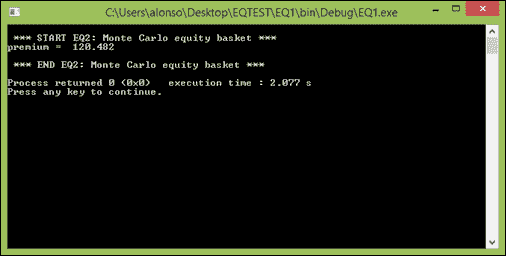

# 第四章：C++中的股票衍生品

在前两章中，我们描述了用于模拟金融衍生品基础资产行为的关键数学模型（第二章，*数学模型*）和用于定价的主要数值方法（第三章，*数值方法*）。

在本章中，我们将这些要素应用于股票衍生品的定价。我们考虑两个例子：普通的欧式看涨期权的定价（基本示例）和两种资产的最大值的股票篮子的定价（高级示例）。我们为两者提供完整的 C++实现。请注意，如果您对面向对象编程（OOP）不熟悉，建议您先学习 C 中的实现，然后再学习 C++中的实现，这些实现可以在本章的代码包中找到。

# 基本示例 - 欧式看涨期权

```cpp
maineq1.cpp) is the pricing algorithm proper, while code snippets 2 and 3 are auxiliary functions. The algorithm is composed of six steps, which take us from the input parameters (STEP 1) to the output of the premium value (STEP 6).
random.cpp). This implements the Box-Muller method to obtain random samples from the standard normal (Gaussian) distribution that are required for the GBM. Code snippet 3 (random.h) is simply the header file of code snippet 2 (random.cpp). The Box-Muller method takes two independent samples from a uniform distribution and transforms them into a single sample from a Gaussian distribution; this value needs to be assigned to the variable epsilon in the code. Certainly, a more efficient implementation is possible. The Box-Muller method in fact transforms a couple of uniform variables into a couple of normal variables. It would be better to also use the second normal sample, generated in the process, in order to be computationally more effective. Please refer to the book website for details of this more efficient implementation and to the original paper for further details (*A Note on the Generation of Random Normal Deviates*).
```

作为输入参数的一部分，我们应该定义*N*和*M*。这里*N*代表在 GBM 计算中使用的时间步数，*M*代表要使用的蒙特卡洛模拟次数。在我们的示例中，我们考虑了巴克莱股票（BARC.L）的欧式看涨期权的定价，其现货价为£100，行权价为£100，无风险利率为 5%每年，年化波动率为 10%，到期期限为一年。我们使用*N=500*和*M=10,000*。在我的计算机上，期权费为£6.81，执行时间为 1.34 秒。期权费和执行时间将因计算机而异。

请注意，通过简单更改算法中的**步骤 4**，可以轻松修改此代码以定价其他支付。在 C++实现方面，可以使用类来定义支付。此外，**步骤 4**可以稍作修改，以包括蒙特卡洛逼近的准确度估计。请参阅网站以获取包含这些功能的可下载实现。描述此示例的优秀教材是*金融期权定价导论：数学、随机过程和计算*。

**代码 1 - EQ1 - 蒙特卡罗欧式看涨期权**

以下是`EQ1_main.cpp`文件的代码片段：

```cpp
// maineq1.cpp
// requires random.cpp
#include "random.h"
#include <iostream>
#include <cmath>
#include <algorithm>

using namespace std;
int main()
{
  cout << "\n *** START EQ1: Monte Carlo European Call *** \n";
  // STEP 1: INPUT PARAMETERS
  double T=1; // maturity
  double K=100; // strike
  double S0=100; // spot
  double sigma=0.10; // volatility
  double r=0.05; // interest rate
  int N=500; // number of steps
  int M=10000; // number of simulations
  double S[N+1];
  double sumpayoff=0;
  double premium=0;
  double dt = T / N;

  // STEP 2: MAIN SIMULATION LOOP
  for (int j=0; j < M; j++)
  {
    S[0]=S0; // initialize each path for simulation

    // STEP 3: TIME INTEGRATION LOOP
    for (int i=0; i < N; i++)
    {
      double epsilon = SampleBoxMuller();  // get Gaussian draw
      S[i+1] = S[i]*(1+r*dt+sigma*sqrt(dt)*epsilon);
    }

    // STEP 4: COMPUTE PAYOFF
    sumpayoff += max(S[N]-K,0.0); // compute and ad payoff 
  }

  // STEP 5: COMPUTE DISCOUNTED EXPECTED PAYOFF
  premium =  exp(-r*T)*(sumpayoff / M);

  // STEP 6: OUTPUT RESULTS
  cout <<"premium =  " << premium << "\n";
  cout << "\n *** END EQ1: Monte Carlo single asset *** \n";

  return 0;
}
```

**代码 2 - random.cpp 文件**

```cpp
 random.cpp file:
```

```cpp
// random.cpp
// Computing Gaussian deviates using Box-Muller method

#include "Random.h"
#include <cstdlib>
#include <cmath>
using namespace std;

double SampleBoxMuller()
{
  double result;
  double x;
  double y;

  double xysquare;
  do
  {
    x = 2.0*rand()/static_cast<double>(RAND_MAX)-1;
    y = 2.0*rand()/static_cast<double>(RAND_MAX)-1;
    xysquare = x*x + y*y;
  }
  while
  ( xysquare >= 1.0);
  result = x*sqrt(-2*log(xysquare)/xysquare);
  return result;
}
```

**代码 3 - random.h 头文件**

以下是`random.h`文件的代码：

```cpp
// random.h
double SampleBoxMuller();
```

编译和运行代码后，您应该获得以下屏幕截图：


### 提示

**下载示例代码**

您可以从[`www.packtpub.com`](http://www.packtpub.com)的帐户中下载您购买的所有 Packt 图书的示例代码文件。如果您在其他地方购买了本书，可以访问[`www.packtpub.com/support`](http://www.packtpub.com/support)并注册，以便直接通过电子邮件接收文件。

# 高级示例 - 股票篮子

```cpp
with Code 1: first, regarding the input parameters (STEP 1) and second regarding the calculation of the GBM (STEP 4). We now need to specify the parameters for both processes, including their spot prices and volatilities. As we need to compute two correlated stochastic processes, the two Gaussian samples that are required are now computed as follows:
```


在上述方程中，是来自高斯分布的两个独立样本，而是包含相关性效应的两个相关样本，其中包含相关性。Epsilon_1 和 epsilon_2 仍然是正态变量，因为它们具有单位方差，并且它们的乘积的期望值等于。

与之前一样，我们可以在**步骤 5**中轻松修改支付，并纳入其他更复杂的支付。

例如，考虑以下篮子期权的价格：

我们有两个资产巴克莱银行（BARC.L）和劳斯莱斯（RR.L）。我们想要定价一个期权，该期权在到期时支付这两个资产的价值中的最大值，即一年。巴克莱的当前现货价格为 120 英镑，劳斯莱斯的现货价格为 100 英镑。它们的年化波动率分别为 10%和 15%。我们选择在 300 个时间步长内离散化时间，并使用 1 万次模拟。在这些条件下，该期权的保费为 120.48 英镑，执行时间为 2.22 秒。

有关股票篮子衍生品的更多细节，欢迎查阅《保罗·威尔莫特量化金融，第二版》。

**代码 4 - EQ2 - 蒙特卡洛股票篮子**

以下是`EQ2_main.cpp`文件的代码片段：

```cpp
// maineq2.cpp
// requires random.cpp
#include "random.h"
#include <iostream>
#include <cmath>
#include <algorithm>
using namespace std;

int main()
{
  cout << "\n *** START EQ2: Monte Carlo equity basket *** \n";
  // STEP 1: INPUT PARAMETERS
  double T=1; // maturity
  double r=0.05; // interest rate
  double S10=120; // spot equity 1
  double S20=100; // spot equity 2
  double sigma1=0.10; // volatility
  double sigma2=0.15; // volatility
  double rho=0.5; // correlation
  int N=300; // number of steps
  int M=10000; // number of simulations
  double S1[N+1];
  double S2[N+1];
  double sumpayoff=0;
  double premium=0;
  double dt = T / N;

  // STEP 2: MAIN SIMULATION LOOP
  for (int j=0; j < M; j++)
  {
    S1[0]=S10;
    S2[0]=S20;
    // STEP 3: TIME INTEGRATION LOOP
    for (int i=0; i < N; i++)
    {
      double epsilon1 = SampleBoxMuller();
      double epsilon2 = SampleBoxMuller();
      S1[i+1] = S1[i]*(1+r*dt+sigma1*sqrt(dt)*epsilon1);
      epsilon2 = epsilon1*rho+sqrt(1-rho*rho)*epsilon2;
      S2[i+1]=S2[i]*(1+r*dt+sigma2*sqrt(dt)*epsilon2);
    }
    // STEP 4: TIME INTEGRATION LOOP
    sumpayoff += max(S1[N],S2[N]);
  }
  // STEP 5: COMPUTE DISCOUNTED EXPECTED PAYOFF
 premium =  exp(-r*T)*(sumpayoff / M);

  // STEP 6: OUTPUT RESULTS
  cout <<"premium =  " << premium << "\n";
  cout << "\n *** END EQ2: Monte Carlo equity basket *** \n";
  return 0;
}
```

编译和运行代码后，您应该获得以下屏幕截图：



# 摘要

我们已经解决了权益衍生品中的两个定价问题。我们已经看到了一个非常简单的例子（我们称之为基本）和一个更复杂的例子，其中包括一个股票篮子期权。对于每一个问题，我们都提供了完整的 C++实现。

我们现在将继续进行下一个资产类别，外汇衍生品，在那里我们也将解决两个问题，一个简单的问题和一个高级的问题，遵循下一章中的 Bento Box 模板方法。
