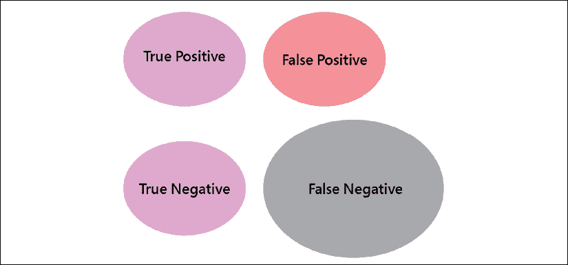

# 第一章：股票市场游戏

> “无限游戏有无限的时间跨度。因为没有终点线，游戏没有实际结束，所以不存在“赢得”无限游戏的概念。在无限游戏中，目标是保持游戏进行，延续游戏。”
> 
> – 西蒙·西尼克

金融服务业正面临严重的存在危机。融资活跃管理资产融化的速度比北极冰盖还要快。进化不留俘虏。如果主动管理者不想成为濒危物种名单上的蓝鳍金枪鱼的一员，那么学会做空可能是一个不可多得的技能，可以加入到他们的武器库中。正如 2007 年至 2008 年全球金融危机向我们展示的那样，市场参与者不仅需要在牛市中实现盈利，而且需要在熊市中实现盈利至关重要。为此，本书将介绍做空的方方面面，并制定算法策略以最大化其有效性，最终目标是创建一个稳健的投资产品，使您与市场竞争对手区分开来。

本章为本书铺平了道路。在你的职业生涯中的某个时刻，你可能会想知道市场更像是一种科学还是一种艺术形式。如果市场是一个永无止境的、无法解决的谜题呢？你如何赢得一个无限、复杂、随机的游戏？

我们将涵盖以下主题：

+   股票市场是艺术还是科学？

+   你如何赢得这个复杂、无限、随机的游戏？

+   玩做空游戏

# 股票市场是艺术还是科学？

> “当银行家们聚餐时，他们谈论艺术。当艺术家们聚餐时，他们谈论钱。”
> 
> – 奥斯卡·王尔德

从前，洛伦佐·德·美第奇赞扬米开朗基罗的手工艺品质。*伊尔·迪维诺*回答*伊尔·玛格尼菲科*说：“只有那些还没有努力工作到看到工艺的人才会认为它是艺术。”

每个市场参与者都曾想过股票市场更像是一种艺术还是一种科学。艺术背后的假设是天赋的概念。一些人天生就有天赋。有些人没有，我就是其中之一。如果天赋是与生俱来的，那么我们这些凡人只能接受我们根本没有。然而，天赋常常是懒惰的借口。迈克尔·乔丹并不是天才。他曾被踢出篮球队，所以他训练，直到他能够连续命中 100 个罚球为止才会回家。命中了 98 个？哦，不好意思。再来一次。这样，技能就可以被发展。产出可能看起来像是毫不费力的优雅。然而，这需要技艺、努力、毅力，以及安吉拉·达克沃斯称之为“**毅力**”的东西。

在市场上赚钱不是艺术，而是一种技能。在 80 年代初，理查德·丹尼斯和威廉·艾克哈特组建了一个团队，其中包括一名扑克玩家、一名毒贩和来自各行各业的其他人。他们被赋予了一个系统、起始资金，并被派去交易期货。几十年后，其中一些人仍在交易。他们是有天赋的吗？也许其中一些人有一些先天倾向，但这并不重要。他们研究并努力实施了一个系统，其结果可能看起来像艺术品。

科学家喜欢用明确的公式来解释世界。这种方法对于简单甚至复杂的系统都很有效（通常可以将其分解为几个简单的系统），但对于复杂系统则不适用：

+   简单系统：你需要多少燃料才能把火箭送到火星？

+   复杂系统：如何将某人送到火星？（这可以分解成简单的系统，比如燃料消耗。）

+   复杂系统：如何在火星上维持生命？

市场是复杂的系统。与复杂系统不同，复杂系统不能被分解为一系列简单的系统。当你认为自己有一个明确的公式来解释股价时，市场会适应并变成其他形式。

我要表达的观点是，我们看到的事物并不是它们的本来面目。我们看到的是我们认为它们是的样子。背景信息过滤了我们的感知。如果我们认为某事会很难，那很可能不会容易。

如果我们认为股市是一种艺术，我们会对杰作感到惊叹，但无法欣赏工艺。如果我们把它看作是一门科学，我们将寻找一个明确的公式，却一次又一次地被随机性所愚弄。如果我们把它看作是一场游戏，那么我们内心的孩子会参与其中。

# 如何赢得这个复杂、无限、随机的游戏？

> “已知已知”是我们知道自己知道的东西；而“已知未知”是我们知道自己不知道的东西。但也有“未知未知”，那就是我们不知道自己不知道的东西。
> 
> – 唐纳德·拉姆斯菲尔德

股价可能随时间反映基本面，但旅程可能是一次随机行走。随机行走理论由伯顿·马尔基尔在《华尔街的随机漫步》中得到推广。它基本上假设每种金融资产都有一定的内在价值，然而市场价格很难准确预测。随机性经常使市场参与者迷失方向。即使是业内最优秀的人成功的概率也大约是 50%，唯一的结论是无法消除随机性。

有两种类型的游戏：有限和无限。有限游戏有明确的规则、参与者、开始、中间和结束。无限游戏没有一套规则、没有开始和结束。有限游戏的目标是赢得游戏。无限游戏的目标是留在游戏中。

让我们举个例子来说明这一点。一名职业扑克玩家遇到了一名职业交易者。交易者整晚都在打高风险的牌并赢得了比赛。第二天，扑克玩家买了交易者推荐的一只股票。两周后，交易者停止了交易，而赌徒却忘记了这件事，并在接下来的 3 年里把钱翻了一番。对于交易者来说，扑克是一种爱好，他赢得了扑克夜，因为他知道自己能承受更多的风险。与此同时，扑克玩家采取了有计划的风险。他接受了短期损失作为赢得长期游戏的一部分。当扑克玩家遵循投资提示时，他将其经历了起起落落，因为他只是使用了可支配的资产。另一方面，当交易者关闭同样的股票并错过随后的涨势时，他正在执行风险管理。

对于交易者来说，扑克夜是一个有限的游戏。另一方面，对于扑克玩家来说，股票提示是一个有限的游戏。他们在彼此的游戏中都可以承受更高的风险容忍度，因为他们知道游戏是有限的。然而，当游戏从爱好变成生活方式时，我们变得更加风险厌恶。

畅销书系列《市场魔法师》的作者杰克·施瓦格经常说，没有一个理智的人会买一本外科手术的书，周末读完，然后相信自己周一就能准备好给人动手术。然而，人们会买投资书籍，订阅一两份通讯，然后认为在周一开始交易是完全合理的。这可能对于有着非常小样本的业余爱好者有效。毕竟，有一半的机会是赢的。对业余爱好者有利的随机性对于有着更大样本的专业人士来说是有害的。当一个爱好变成工作时，游戏就变得无穷了。赌徒可能已经为每年几个糟糕的扑克夜预算好了。同样地，交易者遵循严格的风险管理政策。扑克玩家和顶尖交易者有一个共同点：他们都去工作；这不应该是有趣的。

这引出了本书的核心问题：你如何打败一个无穷复杂的随机游戏？

## 如何赢得无穷的游戏？

如果你参与了一个无穷游戏，你不是通过赢得一个游戏或所有游戏来取胜。你是通过留在游戏中来取胜。你赢了一些，输了一些，但只要你的平均胜率乘以你的胜率大于你的平均损失乘以你的损失率，你就能留在游戏中。只要你的**盈利期望**保持正值，你就能赢。作为一名股票选择者、交易者、投资者、投机者，或者无论你选择称呼自己为什么，你的工作就是最大化这个盈利期望。这部分是你挑选的所有股票中，你保留的那些股票必须看起来不错的部分，其结果最终可能看起来像艺术品。这就是我们将在*第二部分*，*外部游戏：发展健壮的交易优势*中努力的内容，所以继续阅读吧，米开朗基罗。

## 如何打败复杂性？

当面对一个复杂问题时，我们直觉上认为解决方案必须复杂化。并非总是如此。一个快速抛射物的轨迹是火箭科学，确实如此。现在，你上一次看到塞雷娜·威廉姆斯在球场边解决随机方程式是什么时候？这就是所谓的凝视启发式：看，跑，拦截，重复。复杂的问题有简单的解决方案。

许多量化交易者，亲切地称为量化交易员，认为他们必须用费解的方程式证明他们的博士学位。通过数学恐吓来证明无疑会激发自尊心，但高智商并不总是与高绩效相称。股市是诺贝尔奖获得者走来受挫的地方。

另一方面，似乎有一个简单的启发式法则就隐藏在明处，它击败了市场的复杂性。这个简单的口号是：“止损，放大赢家。” *第二部分*，*外部游戏：发展稳健的交易优势*，将提供减少输家的负面影响的实用技术。

## 如何击败随机性？

作为一个物种，我们的生存取决于我们如何处理随机性。我们在日常生活中本能地应用的同样生存机制并不转移到市场中。理解随机性对于培养健康的卖空实践至关重要。首先，让我们看看我们如何在市场中处理随机性。其次，让我们看看我们如何在现实生活中处理随机性。第三，我们将看到如何将这种技能应用到市场中。

假设我们设计一个挑选股票的系统。当我们构建策略时，我们从一些假设开始。如果股票符合某些预期[在此插入一长串标准...]，我们就做多或做空。在理论上，高估值，远远超出合理市场预期的股票将恢复到“公平”，公平估值是一些市场参与者愿意为他们所感知的价值支付的价格。在理论上，糟糕的企业有望破产。在理论上，超买的股票有望回归到平均水平，超卖问题则相反。*在理论上*，这应该奏效。现在，是时候尝试这个想法了。随机性可以总结在下面的结果矩阵中：

图 1.1：比喻矩阵结果

**真正的阳性**是指结果符合预期的情况。**真正的阴性**是指股票未能通过我们的测试，并且如预期的那样表现糟糕。这是理论与现实的第一次交锋。在理论上，市场是有效的：所有公开可用的信息应该立即反映在价格中。但在实践中，情况并非总是如此。

回到起点，当结果不符合期望时（例如，股票通过了我们的测试但在实践中却失败了），存在**假阳性**，这表明我们遗漏了某些东西。在实践中，估值可以变得更加丰厚并且维持时间更长，而客户却不会一直投资。在实践中，超买和超卖的技术指标是持续强势和弱势的迹象，分别表示趋势的延续而不是回归到平均水平。我们感到困惑和沮丧。我们的自然倾向是完善我们的论点，增加复杂性以减少假阳性。这种方法会产生更少的信号，但假阳性并没有完全消失。

对于中级超卖的短线卖空者来说，过度过滤的一个副作用和经典陷阱是**假阴性**。这是指股票表现出期望的行为，但由于我们更严格的测试而完全未被发现。现实生活中的类比是通过清单约会。有时人们带着一长串不可实现的标准和不切实际的期望出现。同样，市场参与者经常因为他们自己的自我限制信念系统而拒绝足够好的想法。他们实质上是在寻求他们的选择将如预期般执行的保证，通过应用多余的过滤器，但他们没有意识到其中一些条件是互斥的或不切实际的。因此，他们系统性地定价自己脱离市场，并错过了所有完全正常的机会。这解释了*图 1.1*中假阴性圈的膨胀大小。

结构/拥挤的空头是过度过滤的典型例子。他们勾选所有的坏项目，除了显而易见的交易很少盈利。相反，高股息率价值陷阱是假阴性或盲点的典型例子。这些股票具有便宜的估值和股息支持。它们不参与牛市。在长期的熊市中，它们也不能提供足够的支持。它们是慢燃的表现不佳者，被排除在被遗忘的问题的炼狱之外。最重要的是，尽管我们尽了最大努力，一些股票仍然无法盈利，无论是在空头还是多头方面。这比我们最初想象的要复杂得多。更多的困惑。又回到起点。

在继续使用清单约会场景的情况下，战胜随机性的一种方法如下。在纸上，一个人勾选所有项目。实际上，大红旗出现了：那个人不笑你的笑话，讨厌西兰花，顽固地拒绝与你的金鱼辩论康德的《纯粹理性批判》——所有经典重要的事情。

在现实生活中，你要处理这种看似随机的反应就像中止任务一样。你不会等到结婚并带着一对孩子，一个死掉的金鱼在鱼缸里，冰箱里堆满了蔬菜才决定分手。市场也是一样。一只股票可能符合所有标准，但可能会出现一些意外或被忽视的情况，你会选择退出。当我们将所有精力都集中在选股上时，我们试图用确定性解决随机性。下次努力选择正确的股票并不能解决随机性。完美主义是一种拖延症。处理随机性的唯一方法是接受我们的错误。我们失败得越快，我们就能越快地前进。

让我们通过一个实际的例子来说明这个概念。我们都可以同意，相对于指数表现不佳的股票已经达到了顶峰。在达到顶峰的群体中，有 100% 的未来表现不佳者（这将是我们空头卖出的主要目标），还有一些股票将会徘徊不前，直到再次趋势。没有简单的方法来区分前者和后者。然而，有一些简单的技巧来处理"吃白食"者。击败随机性的方法不是试图成为一个更好的选股人。击败随机性的方法是接受在某个时候，你会选到失败者，并学会如何处理他们。人们看到所有那些在市场上表现出色的人只是因为他们在选股时做出了正确的选择。他们没有看到那些在这条道路上被丢弃的不那么赚钱的选择。我们的看法是颠倒的。我们希望在比赛之前就获得奖牌。伟大的选股人应该根据他们选择留下来的东西来评判，而不是根据他们在这条路上丢弃的不那么赚钱的选择。

# 玩空头卖出游戏

> "跟我来如果你想活下去。"
> 
> – 阿诺德·施瓦辛格，终结者

空头卖出的机制看似简单。例如，你以 100 的价格卖出一只股票，以 90 的价格买回，然后获得 10 的利润。它可以绝对或相对于一个基准。在进行空头交易之前只需要进行一个额外的步骤。空头卖家出售他们没有拥有的股票。因此，他们首先从他们的经纪公司的股票借贷台借出这些股票。一旦他们买回股票并平仓，他们就会归还这些股票。

不要让这种简单性愚弄你。由于我们在本章中考虑的游戏的无限，复杂，随机性质，90% 的市场参与者失败。剩下的 10% 中，不到一半的人会参与空头卖出。这是市场的毫不妥协的现实。

我们的目标是应对这些挑战，并在投资组合的两侧取得成功，尽管情况复杂。如果我们跟随大多数人走的路，我们最终会得到相同的结果，减去一个标准差以作良好的衡量。

如果几乎所有人都在宽容丰富的长端失败，那么为了你在无情的干旱短端生存，这本书必须有意地与众不同。这本书将带你走上一条少有人走的道路。你可能会对其中的某些部分持有异议，但你会以改变的方式走出来。例如，和你之前的所有人一样，你会得出结论，挑选个股是破产的。你也会亲眼看到投资过程中究竟在哪里创造了财富。

# 摘要

在本章中，我们为本书的其余部分设定了背景。股票市场既不是艺术形式，也不是科学。市场巫师既不是天生的，也不需要极度聪明。他们是在逆境的熔炉中锻造出来的。股票市场是一个无限、复杂、随机的游戏。赢得这场游戏的唯一方法是留在其中，通过调整你的策略以适应市场的无限、复杂和随机的特性，并相应地挑选股票和削减损失。在接下来的章节中，我们将考虑如何将卖空纳入你的交易策略，并实施技术以提高你的成功率和盈利预期。

市场参与者通常比买入持仓更不愿意卖空。这归因于一些技术因素，也因为人们对卖空的普遍恐惧，这种恐惧是由与卖空相关的许多神话所传播的。我们将在下一章讨论并驳斥这些神话。
