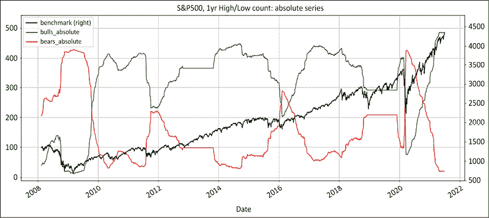
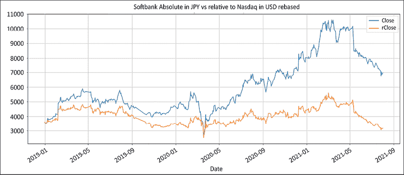
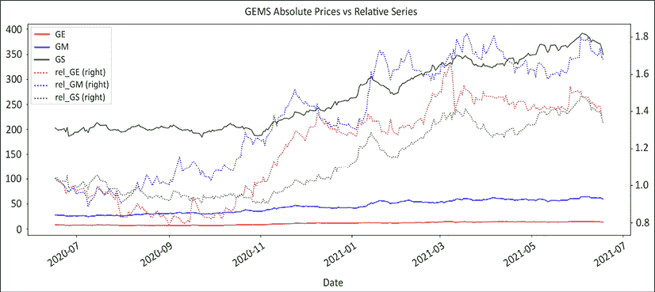
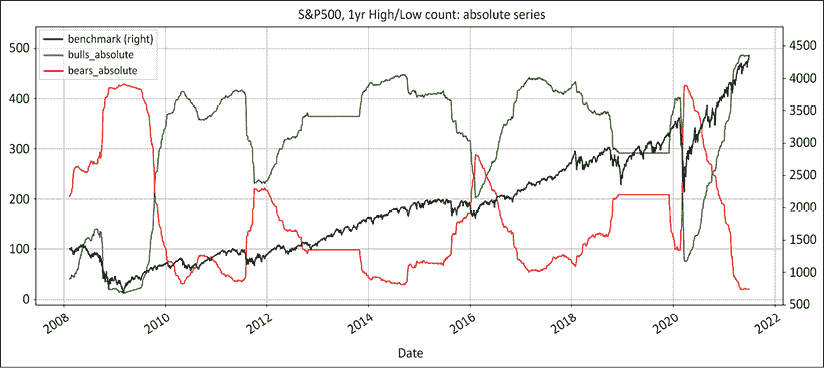
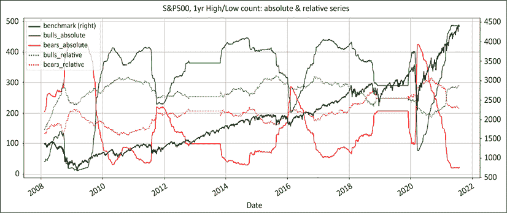
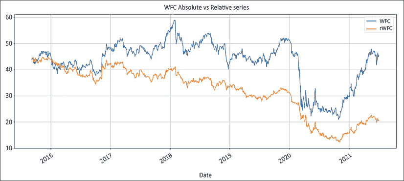

# 第四章：多空方法论：绝对和相对

在本章中，我们将比较方法，特别关注绝对与相对系列。绝对系列是您可以在任何网站或平台上看到的**开高低收**（**OHLC**）价格。它们通常会调整为股息、股票拆分和其他公司行动。相对系列是上述绝对系列除以基准的收盘价格，调整为货币。

我们希望展示绝对方法的弱点，以及相对弱势方法的优势，这将定义本书的方法论。在此过程中，我们将涵盖以下主题：

+   导入库

+   多空 1.0：绝对方法

+   多空 2.0：相对弱势方法

    您可以通过以下链接访问本章中所有图片的彩色版本：[`static.packt-cdn.com/downloads/9781801815192_ColorImages.pdf`](https://static.packt-cdn.com/downloads/9781801815192_ColorImages.pdf)。您也可以通过本书的 GitHub 存储库访问本章的源代码：[`github.com/PacktPublishing/Algorithmic-Short-Selling-with-Python-Published-by-Packt`](https://github.com/PacktPublishing/Algorithmic-Short-Selling-with-Python-Published-by-Packt)。

# 导入库

以下代码，实际上是本书中大部分代码，首先需要安装`yfinance`包：

```py
pip install yfinance 
```

然后可以导入`yfinance`：

```py
import yfinance as yf 
```

在本章节和本书的其余部分，我们还将使用`pandas`、`numpy`和`matplotlib`。因此，请记得首先导入它们：

```py
# Import Libraries
import pandas as pd
import numpy as np
%matplotlib inline
import matplotlib.pyplot as plt 
```

# 多空 1.0：绝对方法

> "‘但是，皇帝一点也没有穿衣服！’，一个小孩说道。
> 
> "‘倾听无辜之声！’，他的父亲叫道。"
> 
> – 阿瑟·安德森

绝对方法在直观上是有道理的：买涨的股票，卖跌的股票。来自各种提供商的数据、屏幕上的价格图表以及进入组合的内容之间存在一对一的关系。每个人都说同样的语言。投资者、市场评论员和其他各种市场参与者谈论的都是同样的价格和一般估值水平。卖出绝对价值下跌的股票会产生现金，可以用于在多头方向上购买更多的股票并增加杠杆。

只有一个小问题：产品并不总是如说明书所说那样。让我们保持冷静：绝对方法从一开始就是彻底的失败，接下来的章节将探讨其原因。

## 无法降低与基准的相关性

投资者明确支付溢价费用以获得不相关的回报。在执行交易员的英语中，投资者希望他们的资金增长，不受市场先生的情绪波动影响。让我们看看为什么绝对方法未能实现这一承诺。

在牛市中，潮水抬高了所有船只。很少有股票下跌，但是当它们下跌时，它们吸引了很多关注。长持有者退出股票，而空头卖家则加码。这些股票成为拥挤的空头头寸。流行的空头头寸 notoriously 难以交易——它们不流动，而且异常波动。进出这些股票会产生一些不利的市场影响，借款费用昂贵，并且它们还容易受到空头挤压的影响，即在熊市下跌结束时发生的激烈反弹。由于没有人想要通过空头挤压过度受限，这对下注规模设置了自然限制，导致空头头寸萎缩。

另一方面，在牛市中，多头头寸过度发展。这导致高结构性正净曝露，这是对市场上升方向的明确押注。在金融克里奥尔语中，这些被称为“定向对冲基金”。这些基金经理谈论对两手灵活和灵活的管理，但是一旦市场转为熊市，他们就寻求庇护在他们的书桌下的舒适之下。相反，在熊市中，很少有股票上涨。空头想法很多，但在实践中，暴露很少跨越到负区域。这意味着投资者减轻了打击，但仍然亏损。

以下图表显示了标准普尔 500 指数以及绝对价格系列中牛市或熊市的所有成分的计数。



图 4.1：在市场波动时，处于牛市或熊市领域的股票数量大幅波动

上述图表，以及与相对弱势法比较的另一个图表（我们将在“*两面都提供新鲜想法的一致供应*”部分回来），可以通过执行以下源代码生成：

```py
# S&P500 dataframe: list of tickers
sp_df = pd.read_html('https://en.wikipedia.org/wiki/List_of_S%26P_500_companies')[0]
sp_df['Symbol'] = sp_df['Symbol'].str.replace('.', '-')
bm_ticker = '^GSPC'
tickers_list = [bm_ticker] + list(sp_df['Symbol'])[:]

# Variables instantiation
window = 252
df_abs = pd.DataFrame()
batch_size = 20
loop_size = int(len(tickers_list) // batch_size) + 2

for t in range(1,loop_size): # Batch download
    m = (t - 1) * batch_size
    n = t * batch_size
    batch_list = tickers_list[m:n]
    print(batch_list,m,n)
    batch_download = yf.download(tickers= batch_list,
                                 start= '2007-01-01', end = None, 
                                 interval = "1d",group_by = 'column',
                                 auto_adjust = True, 
                                 prepost = True, treads = True, 
                                 proxy = None)['Close']
    df_abs = df_abs.join(batch_download, how='outer')

### removed for brevity: check GitHub repo for full code ###
bullbear['bulls_absolute'] = df_abs[df_abs > 0].count(axis=1) 
bullbear['bears_absolute'] = df_abs[df_abs < 0].count(axis=1) 
bullbear['bulls_relative'] = df_rel[df_rel > 0].count(axis=1) 
bullbear['bears_relative'] = df_rel[df_rel < 0].count(axis=1) 

bullbear[280:][['benchmark','bulls_absolute', 'bears_absolute', 
               ]].plot(figsize=(20,8),
                style=['k', 'g', 'r'],grid=True,secondary_y=['benchmark'],
                title = 'S&P500, 1yr High/Low count: absolute series' )

bullbear[280:][['benchmark','bulls_absolute', 'bears_absolute', 'bulls_relative', 'bears_relative']].plot(figsize=(20,8),
                style=['k', 'g', 'r','g:', 'r:'],grid=True,secondary_y=['benchmark'],
                title = 'S&P500, 1yr High/Low count: absolute & relative series') 
```

上述代码的结构相当紧凑和简单：

1.  导入`yfinance`模块以允许从 Yahoo Finance 下载。

1.  使用`pandas.read_html`方法下载最新的标准普尔 500 成分股。提取股票列表并将`.`替换为`-`以确保与 Yahoo Finance 兼容。

1.  实例化数据框和变量以处理数据和聚合结果。使用模数`//`函数计算批量大小。

1.  添加一个循环来批量下载收盘价格。使用`join`方法添加到`df_abs`中。

1.  通过将`df_abs`除以`bm_ticker`列（使用`axis=0`指定）然后将其重新定位到索引的第一个值，创建`df_rel`：

    1.  使用`np.where`方法定义牛市/熊市制度：如果收盘价是 252 个周期中的最高价，则分配`1`，如果收盘价是 252 个周期中的最低价，则分配`–1`；否则，分配`np.nan`。

    1.  在`np.nan`缺失值之间传播`1`和`-1`。

1.  在`bullbear`数据框上聚合结果，跨绝对和相对数据框添加水平计数（`axis=1`）。

1.  绘制基准、牛市和熊市计数。

当市场上涨时，看涨股票的数量增加。当市场横盘或熊市时，看跌股票的数量增加。这表明绝对方法从定义上与市场相关。只需看看多空基金的业绩记录，就可以得出结论，绝对方法未能提供与市场不相关的吸引人回报。  

接下来的几节将考虑绝对方法的一些弱点。  

## 无法有效降低波动性  

由于空头头寸比其他头寸少，平衡头寸的方法是加大更集中的头寸。这意味着一个稀释的、相对低波动性的多头投资组合和一些集中的“结构性空头”投注。正如我们在*第三章*中看到的*走进狂野的空头市场*，拥挤的空头头寸是不流动的，因此更容易出现波动率飙升。卖方不少，但勇敢的买方稀少。  

空头方面的波动性推动整个投资组合。绩效不佳除以高剩余波动性只会产生不吸引人的波动率调整回报。  

## 几乎没有历史性的下行保护  

绝对方法在牛市中可能会发布正回报。但每当市场下跌时，绩效就会出现“软裁”。  

在**大萧条**(**GFC**)期间，人们本应该期望净头寸下降到零以下。毕竟，每个人都在谈论金融末日。如果多空参与者真的像他们声称的那样喜欢做空，净头寸应该下降到 0 以下。然而数字讲述了不同的故事。随着净贝塔达到+0.5，市场参与者仍然持有乐观态度。  

采用绝对方法的从业者减少净头寸的方式是减少他们的多头头寸，并囤积现金。当到了在空头方面动手时，他们却胆怯了。多年来在牛市中交易使他们的空头卖出能力萎缩。如果你想打败迈克·泰森，你需要去健身房几次并且摆出你的笑脸。  

## 较差的投资工具  

绝对方法已经赢得了自身的存在危机。多空 1.0 既不是一个复杂的，也不是一个安全的投资工具。在任何一个方面，它都是一个较差的工具。它在牛市中的赚钱比共同基金和指数基金少。它在熊市中只比指数亏损少一点。经过费用后，投资者使用绝对方法比使用低技术水平的普通指数基金少积累的钱。与经典的共同基金相比，透明度和流动性都较低。因此，毫不奇怪，这些基金未能吸引和保留寻求稳定、不相关回报的养老金资金。绝对多空基金是为自己赚钱的企业，偶尔也为他们的投资者赚钱。  

## 落后的指标  

> "La gravité est le bouclier des sots [引力是愚人的盾牌]。"  
> 
> – 蒙特斯基耶，法国哲学家

股票不是洲际弹道导弹。它们不会只是因为它们无法获得足够的船用柴油来填满整个燃料箱而从天而降：

1.  首先，他们落后于其直接竞争对手。

1.  第二，他们落后于所在行业的其他股票。

1.  第三，他们在所在行业中落后。

1.  第四，他们表现不及更广泛的指数。

1.  第五，他们最终在绝对值上下降。

关键问题在于，当这些股票出现在人们的雷达屏幕上时，它们已经失去了很多价值。在一个以创造性的多彩侮辱作为职业业余爱好的行业中，几乎没有什么比被称为滞后指标更刺耳的了。然而，在空头/多头业务中似乎是主导业务模式。

空头/多头市场参与者绝对不是低能儿。他们是受过高等教育、敬业、勤奋的人。以“看多强势”和“看空弱势”为正确的理念—绝对数据系列只是错误的数据集。作为替代方案，下一节将讨论使用相对系列而不是绝对价格的好处。

# 空头/多头 2.0：相对弱势方法

> "真理本质上是不言自明的。一旦你清除了围绕它的无知之网，它就会清晰地闪耀出来。"
> 
> – 马哈特玛·甘地

指数如标准普尔 500、纳斯达克 100、富时 100 和 Topix 是其成分股的市值加权平均值。大约一半的股票在任何时间段内都会比指数表现得更好，而其余的则会更差。相对表现不佳的股票中有更多可供选择，而绝对价值下跌的股票则寥寥无几。

下面是计算相对系列的源代码：

```py
def relative(df,_o,_h,_l,_c, bm_df, bm_col, ccy_df, ccy_col, dgt, start, end,rebase=True):
    '''
    df: df
    bm_df, bm_col: df benchmark dataframe & column name
    ccy_df,ccy_col: currency dataframe & column name
    dgt: rounding decimal
    start/end: string or offset
    rebase: boolean rebase to beginning or continuous series
    '''
    # Slice df dataframe from start to end period: either offset or datetime
    df = df[start:end] 

    # inner join of benchmark & currency: only common values are preserved
    df = df.join(bm_df[[bm_col]],how='inner') 
    df = df.join(ccy_df[[ccy_col]],how='inner')

    # rename benchmark name as bm and currency as ccy
    df.rename(columns={bm_col:'bm', ccy_col:'ccy'},inplace=True)

    # Adjustment factor: calculate the scalar product of benchmark and currency
    df['bmfx'] = round(df['bm'].mul(df['ccy']),dgt).fillna(method='ffill')
    if rebase == True:
        df['bmfx'] = df['bmfx'].div(df['bmfx'][0])

    # Divide absolute price by fxcy adjustment factor and rebase to first value
    df['r' + str(_o)] = round(df[_o].div(df['bmfx']),dgt)
    df['r' + str(_h)] = round(df[_h].div(df['bmfx']),dgt)
    df['r'+ str(_l)] = round(df[_l].div(df['bmfx']),dgt)
    df['r'+ str(_c)] = round(df[_c].div(df['bmfx']),dgt)
    df = df.drop(['bm','ccy','bmfx'],axis=1)

    return (df) 
```

接下来，我们将尝试这个功能。Softbank（9984.T）是一家在**东京证券交易所**（**TSE**）上市的公司。它以日元交易。该公司在美国科技行业已经有近三十年的历史了。因此，Softbank 将与纳斯达克的美元进行对比：

```py
ticker = '9984.T' # Softbank
ohlc = ['Open','High','Low','Close']
_o,_h,_l,_c = [ohlc[h] for h in range(len(ohlc))]
start= '2018-12-30'
end = None
df =  round(yf.download(tickers= ticker,start= start, end = end, 
                        interval = "1d",group_by = 'column',                        auto_adjust= True, prepost= True,                         treads = True, proxy = None),2)
bm_df = pd.DataFrame()
bm_ticker = '^IXIC' #Nasdaq 
bm_col = 'nasdaq'
ccy_df = pd.DataFrame()
ccy_ticker = 'USDJPY=X'
ccy_col = 'JPY'
dgt = 5

bm_df[bm_col] =  yf.download(tickers= bm_ticker,start= start, end = end,
                             interval = "1d",group_by = 'column',                             auto_adjust = True, prepost = True,                              treads = True, proxy = None)['Close']
ccy_df[ccy_col] =  yf.download(tickers= ccy_ticker,start= start,                                end = end, interval= "1d",                               group_by = 'column',auto_adjust = True, 
                               prepost = True, treads = True,                                proxy = None)['Close']

df = relative(df,_o,_h,_l,_c, bm_df, bm_col, ccy_df, ccy_col, dgt, start, end,rebase=True)

df[['Close','rClose']].plot(figsize=(20,8),grid=True,
            title= 'Softbank Absolute in JPY vs relative to Nasdaq in USD rebased' ) 
```

此代码计算相对于数据框架开头的重新基准化的相对系列，与绝对系列进行比较，以 Softbank 为例。首先，我们下载 Softbank 的 OHLC 本地货币。然后我们下载基准纳斯达克和美元的收盘价。

我们通过保持布尔标志`rebase=True`来运行相对系列函数重新基准化到数据框架的开头。



图 4.2：Softbank 在绝对 JPY 与相对于美元纳斯达克的重新基准化

当电话失去了线缆时，人们随身携带它们，并逐渐束缚了自己。 自从电话束缚了人类以来，Softbank 一直是东京证券交易所的强大力量。 然而，与纳斯达克指数相比，以美元计价的软银表现平平。 在本书的其余部分，我们将使用绝对价值的软银系列和仅用于示范目的的日元。 这个概念很简单：买入表现良好的，卖空表现不佳的，从价差中赚取利润。 关注超过指数的超额回报的想法并不新鲜。 共同基金经理根据其超额回报来评估。 当仅关注长期时，任务是增加表现优异者的权重并减少表现不佳者的权重。 与基准的权重差称为“**主动资金**”。

相对弱势方法采取了类似的方法。 长/短组合是两个相对账簿的净和。 长方向是经典的共同基金类型长账簿。 短方向由相对于指数的逆向表现的表现不佳者组成。 与共同基金的唯一区别在于，经理们在短期内采取主动对冲的策略，而不是远离表现不佳的人。 绩效来自长期的超额表现和短期的不足表现之间的差异。 下面是一个简单的例子。 通用电气、通用汽车和高盛在三个不同的行业中。 然而，它们有两个共同点。 首先，它们是同一个标准普尔 500 指数的组成部分。 其次，当它们组合在一起时，它们的股票代码具有这个可爱的缩写：GEMS。

下面的代码显示了绝对价值的价格系列，然后返回相对于基准的系列。

```py
tickers_list = ['GE','GM','GS']

# Dataframes instantiation
gems = pd.DataFrame() 
start = '2020-03-31'
benchmark = yf.download(tickers= '^GSPC',start= start, end = None, 
                        interval = "1d",group_by = 'column',                        auto_adjust = True, prepost = True,                         treads = True, proxy = None)['Close']
failed = [] 
rel_ticker_list = []
for n,ticker in enumerate(tickers_list):
    try: #7 Download & process data
        gems[ticker] = yf.download(tickers= ticker,start= start,                                    end = None, interval = "1d",                                   group_by = 'column',                                   auto_adjust = True, prepost = True,                                    treads = True, proxy = None)['Close']
        gems['rel_'+ticker] = gems[ticker].div(benchmark * gems[ticker][0]) * benchmark[0]
        rel_ticker_list.append('rel_'+ticker)
    except:
        failed.append(ticker)
gems = gems[tickers_list+rel_ticker_list]
gems.plot(figsize= (20,8),secondary_y= rel_ticker_list,style=['r','b','g','r:','b:','g:'], 
          title= 'GEMS Absolute Prices vs Relative Series' ) 
```

该代码采取以下步骤：

1.  实例化了`gems`数据框。 `start`可以是日期——例如`2019-12-31`，也可以是偏移期间，如`–254`。列表已实例化。

1.  运行一个循环从 Yahoo Finance 下载价格信息。 将绝对系列添加到`gems`数据框中。

1.  对于相对系列，需要除以基准并在系列开始时重新定位基准。

1.  将`rel_list_ticker`附加到以`el`为前缀的 ticker 列表中。 这将用于以后排序列。

1.  重新排序列并打印。

结果显示了**通用电气**（**GE**）、**通用汽车**（**GM**）和**高盛**（**GS**）的绝对价格以及相对系列在虚线上：



图 4.3：通用电气（GE）、通用汽车（GM）和高盛（GS）的绝对价格与相对价格对比

图表说明相对系列对股票相对强势与市场的比较更具指示性。价格与基准相比在周期开始时重新调整，但它们提供了跨行业的均匀系列。起初，对一个上涨的股票进行空头操作似乎有些不自然。对于绝对回报型玩家来说，赔钱并不是一件自然的事情。为了理解这个概念，让我们通过设想在熊市中发生的情况来重新构思一下。当大熊猫袭击市场时，没有任何东西会上涨。这意味着你将寻找买入那些能够保持立场或者跌幅低于整体指数的防御型股票。在多头方面，你会比市场亏损少。通常情况下，你会购买非周期性的公用事业、铁路或食品股票。

相反，你会寻找那些下跌速度比基准更快的股票进行做空。这些往往是周期性股票，其表现随着经济周期的波动而波动，比如航空公司。顺便说一下，你可以将之前牛市的宠儿保留在你的投资组合中，但记得换边。牛市领头股往往会吸引末期动量玩家。这些是市场中最弱的参与者，晚来一步，没有真正的游戏计划。一旦形势严峻，他们就会退出，这导致突然的业绩退潮。与经典的绝对方法相比，相对系列开启了一整个新世界的可能性。以下是断言相对弱势方法优越性的 10 个理由。

## 在双方都能持续提供新思路的情况下，稳定的供应

指数通常是所有成分股的市值加权平均值。这意味着大约一半的股票将会跑赢市场，而另一半将落后于市场。起初，这种大量的想法对那些一直专注于绝对表现的市场参与者似乎令人不安。市场参与者可能会被诱惑继续使用绝对方法交易多头，而使用相对方法交易空头。这种糟糕的想法经常导致购买和做空表现不佳的股票。多头方面必须是与空头方面采用的策略和系列类型相反的镜像。

让我们重新审视我们在“无法降低与基准的相关性”部分编写的脚本，关于牛市和熊市中的股票数量。正如我们在那里提到的，该代码生成两个图表。我们最初使用了绝对系列进行横向计数，这也在这里显示出来：



图 4.4：使用绝对系列的标普 500 中处于牛市或熊市领域的股票

图表说明标普 500 指数已经处于牛市领域超过 12 年，中间偶有波动。总体来说，牛市股票远多于熊市股票。适合做空的候选股票寥寥无几。正如一句谚语所说，潮水能托起所有的船。

然而，让我们将这与相对系列进行比较。这是对每日条形图的简单横向计数。相比之下，下图显示了使用绝对和相对系列的牛市和熊市领域中的股票数量，价格除以指数的收盘价：



图 4.5：使用绝对系列与相对于指数的 S&P 500 中牛市或熊市领域中的股票数量

虚线代表相对于指数而言处于牛市或熊市领域的股票数量。毫不奇怪，牛市阵营大约有一半的股票，另一半处于熊市模式。这为双方提供了大量的选择。

成分清单不包括历史的纳入/删除。表现不佳、破产或被吸收的股票将从指数中删除。这造成了一种人为的向上漂移，称为幸存者偏见。幸存者偏见不会影响空头策略，因为它们的有效性仅针对最强的股票进行衡量。

无论指数如何，都有持续不断的新思路。绝对系列的波动非常大，取决于市场不断变化的情绪。同时，使用相对系列的牛市或熊市领域中的股票数量保持相对稳定。这意味着在任何给定时刻，书中的双方都有充足的想法。

随着广度变窄，表现不佳者的数量甚至可能超过表现优异者的数量。这直接违反了普遍存在的观念，即短期想法很少见。事实上，拥有更多表现不佳者而不是表现优异者并不罕见。

指数是其成分的市值加权平均值。它由最大的 100 个资本主导。在横向或动荡时期，较小的市值往往会被提醒牛顿物理学。对于流动性不足的股票，重力产生了沉重的影响。

## 专注于部门轮换

在绝对方法中，目标是控制市场的顶部和底部。每一个经验丰富的市场参与者都会告诉你，只有两种类型的人能够一直准确地掌握市场的顶部和底部。他们要么是健忘症患者，要么是江湖骗子，更多时候是两者兼而有之。当将所有事物重述为相对系列时，目标是专注于部门轮换。正如我们在上面的图表中看到的，不管是哪一方的股票数量随着时间的推移都没有太大的波动。这并不意味着相同的股票会永远表现不佳。市场可能会上涨数年，但它会随着时间的推移奖励不同的行业、部门，甚至是市值。使用相对弱势方法，这意味着购买新兴的表现优异者，并在早期卖空表现不佳者。想象一下当你告诉客户，在成功的熊市运动之后，现在是时候转向，押注早期周期股和小市值股，而周围充斥着末日的阴霾。

## 提供低相关性产品

将一切都除以基准，剥离了基础指数的影响。这样机械地去除了对指数的相关性。现在焦点是超过基准的超额回报。这可能会显得重复，但它却让人铭记于心。绝对系列在市场状况不同的情况下，名字的数量在不同的制度中波动很大。

相反，相对系列两边的名字数量相当一致。市场的波动并不会极大地影响候选池的规模，正如“*两边都提供新想法的持续供应*”部分所示。这也是基本的算术。将绝对系列除以指数，剥离了整个群体对基准的影响。剩下的只有货币影响和股票特定的表现。

## 提供低波动性产品

这是大量表现不佳者的直接结果。当有大量的空头候选者可供选择时，市场参与者在其投资组合中享有更大的多样化。他们也有更低的集中度。这降低了波动性。

## 降低借贷费用的成本

拥挤的空头借贷费用极其昂贵。机构股东很少遵守老海事荣誉准则。他们不会随船沉没。当表现持续不佳时，他们倾向于清算其头寸。这使得随着时间的推移，借贷变得更加困难。

另一方面，表现不佳的股票仍然受益于一些惯性。借贷接近一般抵押品，换句话说，便宜且充足。当坏消息传开，绝对空头玩家四处游荡时，相对空头可以将接力棒传递给他们不那么复杂的对手。前者可以转向廉价易借的空头，而后者则被迫咀嚼昂贵、干燥、难以借贷的名字。

## 提供可扩展性

绝对方法的一个问题是其缺乏可扩展性。在绝对价值下降的股票通常很受欢迎。拥挤的空头波动大且流动性差。很难建立大规模的盈利头寸。

在 2007 年，通常被称为量化基金的量化基金学习到，对拥挤的问题进行做空是有限度的。当两边都有充足的想法时，集中度可以保持较低，**资产管理**（**AUM**）继续增长。

## 非对抗性

相对方法是非对抗性的。相对空头不需要将事情个人化。防御性公司的管理层明白，在牛市中他们的股票注定会表现不佳。他们不会因为他们的股票被空头卖出或者在这个前提下被多头买入而感到愤怒。相反，高飞的科技企业家知道，熊市并不是 IPO 的季节。

## 货币调整成为一种优势

具有区域或全球授权的经理需要处理多种货币和指数。将一切转换为相对于全球或区域基准的基金货币放在同一个竞技场上。

不需要额外的宏观视角、货币对冲、风险管理。一切都重新基于相同的货币和基准调整单位。例如，随着日元贬值 40%，日本市场猛涨。以日元（JPY）操作的经理在本地货币表现良好；而以美元计价的同行尽管持有完全相同的股票组合，但表现不佳。日元贬值吞噬了所有收益。

但管理一个货币调整后的相对组合并不直观。从股票选择到投资组合管理，一切都必须根据基准和基金货币进行调整。诸如进入、退出和头寸大小等决策都需要以货币调整后的相对价格进行。大多数数据供应商提供的绝对和本地货币的图表回答了相对市场参与者根本不应该问自己的问题。将股票的绝对价值与货币进行比较就像是在比较苹果和橙子。将整个投资范围转换为相对系列在一开始可能稍微复杂些，但在此后操纵起来却容易得多。

## 其他市场参与者无法猜测你的水平

市场参与者经常抱怨“他们”正在触发他们的止损，或者“他们”在操作他们的订单。市场参与者倾向于将止损设置在支撑/阻力水平、圆整数上。有些算法专门设计用于操纵挂单。当所有价格水平都相对于指数进行计算并进行货币调整时，那些狙击手算法就失效了。相对参与者反应的系列与绝对水平不同。

反过来，止损必须得到积极管理。在执行交易员的术语中，不能与来自交易所的价格匹配的订单无法成交。

## 你将会看起来像一个投资天才

正如我们之前所见，股票并不会毫无征兆地绝对价值下降。表现不佳始于它们的竞争对手，然后延伸至行业、部门和更广泛的市场，最后以绝对价值暴跌。在相对基础上做空可能在一段时间内略微痛苦。然而，对于那些专注于绝对价格的人来说，这似乎是有远见的。

一图胜千言。以下图表绘制了**威尔斯法尔戈**（**WFC**）的相对和绝对表现。

```py
ticker = 'WFC'
benchmark = '^GSPC'
tickers_list = [benchmark] + [ticker]

data = round(yf.download(tickers= tickers_list,start= '2015-09-07', end = None,
            interval = "1d",group_by = 'column',auto_adjust = True, 
            prepost = True, treads = True, proxy = None)['Close'],2)

data['r'+str(ticker)] = round(data[ticker].div(data[benchmark])*data[benchmark][0] ,2)
data[[ticker,'r'+str(ticker)]].plot(figsize=(20,8),grid=True,
title= str.upper(ticker)+ ' Absolute vs Relative series') 
```

这产生了以下图表：



图 4.6：威尔斯法尔戈在绝对和相对系列中丑闻爆发前一年（至今）

该图表从丑闻爆发前一年零一天开始。在绝对股价反映出即将发生的事情之前，表现不佳早已开始。相对表现提前数月折扣了绝对表现。

现在，想象一下，即使在丑闻爆发前 6 个月，你也已经开始做空富国银行了。对于那些急于寻找一个好的做空者的所有投资者来说，还有比这更好的卖点吗？没有比绝对值图表更好的营销说辞，它绘制了你根据与指数相对变化所进行的交易。想象一下，早在它们成为新闻之前，你就在所有世界上的恩隆、雷曼、通用汽车和柯达的短头位置上锚定了。

在所有人之前进入市场会给你一个安全边际。头寸不太容易受到熊市反弹的影响。然而，这只是问题的一半。在做空方面退出可能会很混乱。随着做空交易的普及，成交量逐渐减少。这就是相对方法提供决定性优势的地方。在某个时候，卖压将会结束。相对做空者有足够的时间来平仓，而他们的绝对对手则会加倍进行毒辣的攻击。股票开始表现优于市场，一开始几乎察觉不到，然后顽固地上升，最终挑衅地上升。这总会使那些依靠市场双底的绝对基本做空者措手不及。

# 摘要

在本章中，我们概述了从绝对 OHLC 价格转向相对系列的好处。绝对参与者是滞后指标，而相对参与者则领先一步。采用本章概述的方法的市场参与者将拥有明显的优势。他们将能够在众人之前建立和清算头寸。他们将看起来像是有先见之明的投资天才。他们将有更多的选择。他们的投资组合与市场的相关性更低，波动性也更低。这些都是投资者在寻找的特征。

一旦所有股票相对于基准在基金货币中重新计算，下一步就是根据它们的市场情况重新分类投资范围：看涨、看跌、横盘。我们将在下一章中详细介绍这一点。
