# 第五章：制度定义

在拿破仑战争期间，资源有限的野战外科医生不得不迅速决定谁需要手术，谁可以在没有手术的情况下生存，以及那些不幸的人，无法做任何事情。分类是在有限的时间和资源中尽可能有效和人道的分配的必然产物。在股票市场上，制度是分类的另一个词。有些是看涨的，有些是看跌的，有些是不确定的。

市场往往会持续“错误”的时间比投资者坚持你的时间要长。在进行深入分析之前，将股票分为不同的制度桶——进行分类——是资源的有效分配。这种初步分类的目标不是预测股票可能会、会或者应该走向何方，而是实践已经失传的主动倾听市场的艺术。

一些市场参与者喜欢花时间和资源建立那些顽固地违背理性的股票的看跌论点。这并不是高效的，有两个原因。首先，他们期望回归均值。在多头方面，他们交易趋势并持有表现优异者，期待它们继续表现良好。与此同时，在空头方面，他们进行均值回归并期待昂贵的股票吞下“谦卑的馅饼”，再次回到廉价。

正如我们将在接下来的章节中分析的那样，趋势跟随和均值回归具有相反的回报和风险特征。长期趋势跟随和短期均值回归并不能降低风险，而是加剧了风险。暂时来说，市场参与者必须做出选择。他们要么交易预期趋势会发展的趋势，要么交易预期不规范的地方会纠正的不规范。当他们选择同时交易趋势和不规范时，他们的投资风格是不一致的。他们邀请了每种风格的最坏结果，而这种情况不出所料地往往会在最糟糕的时刻同时发生。

其次，期望股票回归本质上就像试图时机抄顶。这就像站在铁轨中间期待一列又一列货运火车停下来一样。牛市制度往往会比投资者对勇敢的耐心更长久。在放空之前，等待更多信息浮出水面并且市场趋势转为熊市是更为谨慎的做法。

作为一个不同的方法，确定市场制度是一件真正有助于基本面卖空者的事情。他们经常会过早出现。他们在更广泛市场开始考虑信息之前就下注了。卖空大师和可怕的失败之间的差距是 6 个月。在 1999 年卖空互联网股票，然后在 2000 年你就会在大学里教无聊的数学了。在 2000 年一月底就卖空同样的股票，那么一个新的卖空之星就诞生了。

在接下来的几节中，我们将查看各种制度定义方法，然后进行比较：

+   导入库

+   创建图表函数

+   突破/崩溃

+   移动平均线

+   高高低低

+   地板/天花板

+   方法比较

+   让市场制度决定最佳策略

您可以通过以下链接访问本章中所有图片的彩色版本：[`static.packt-cdn.com/downloads/9781801815192_ColorImages.pdf`](https://static.packt-cdn.com/downloads/9781801815192_ColorImages.pdf)。您还可以通过本书的 GitHub 存储库访问本章的源代码：[`github.com/PacktPublishing/Algorithmic-Short-Selling-with-Python-Published-by-Packt`](https://github.com/PacktPublishing/Algorithmic-Short-Selling-with-Python-Published-by-Packt)

# 导入库

对于本章和本书的其余部分，我们将使用`pandas`、`numpy`、`yfinance`和`matplotlib`库。我们还将使用来自 ScientificPython 库的`find_peaks`。

所以，请记得首先导入它们：

```py
# Import Libraries
import pandas as pd
import numpy as np
import yfinance as yf
%matplotlib inline
import matplotlib.pyplot as plt
from scipy.signal import find_peaks 
```

# 创建绘图函数

在我们视觉上比较各种制度方法之前，让我们发布名为`graph_regime_combo`的彩色图表函数的源代码。随着我们逐步揭示每种方法，参数将逐渐有意义。

代码如同日本麻酱米饭一般易于消化，这是日本婴幼儿、老年人和外国人，如作者，在日本因窒息而死亡的常见原因。但结构很简单，就像作者一样。一切都取决于是否在`rg`变量中实例化了地板/天花板方法。如果存在地板/天花板，则它将替代其他一切。如果没有，则会打印其他两种方法（突破和移动平均线交叉）。`ax1.fill_between`方法标识边界。阅读所有内容以了解条件。其余部分平淡无奇：

```py
#### Graph Regimes ####
def graph_regime_combo(ticker,df,_c,rg,lo,hi,slo,shi,clg,flr,rg_ch,                       ma_st,ma_mt,ma_lt,lt_lo,lt_hi,st_lo,st_hi):

    '''
    https://www.color-hex.com/color-names.html
    ticker,df,_c: _c is closing price
    rg: regime -1/0/1 using floor/ceiling method
    lo,hi: small, noisy highs/lows
    slo,shi: swing lows/highs
    clg,flr: ceiling/floor
    rg_ch: regime change base
    ma_st,ma_mt,ma_lt: moving averages ST/MT/LT
    lt_lo,lt_hi: range breakout High/Low LT 
    st_lo,st_hi: range breakout High/Low ST 
    '''
    fig = plt.figure(figsize=(20,8))
    ax1 = plt.subplot2grid((1,1), (0,0))
    date = df.index
    close = df[_c]
    ax1.plot_date(df.index, close,'-', color='k',  label=ticker.upper()) 
    try:
        if pd.notnull(rg):  
            base = df[rg_ch]
            regime = df[rg]

#### removed for brevity: check GitHub repo for full code ####

    for label in ax1.xaxis.get_ticklabels():
        label.set_rotation(45)
    ax1.grid(True)
    ax1.xaxis.label.set_color('k')
    ax1.yaxis.label.set_color('k')
    plt.xlabel('Date')
    plt.ylabel(str.upper(ticker) + ' Price')
    plt.title(str.upper(ticker))
    plt.legend()
#### Graph Regimes Combo #### 
```

现在这段致命的代码已经解决了，幸存者可以继续进行下一阶段：范围突破。

# 突破/突破

> “风筝最高飞，逆风飞翔。”
> 
> —温斯顿·丘吉尔

这是最古老和最简单的趋势跟踪方法。它适用于牛市和熊市。如果价格在*x*个周期内创下新高，则为牛市。如果价格在*x*个周期内创下新低，则为熊市。这种方法在计算上很容易实现。

流行的持续时间是 252 个交易日（相当于 52 周）、100 个交易日和 50 个交易日。下面是这种制度方法的简单表达：

```py
def regime_breakout(df,_h,_l,window):
    hl =  np.where(df[_h] == df[_h].rolling(window).max(),1,
                                np.where(df[_l] == df[_l].                                    rolling(window).min(), -1,np.nan))
    roll_hl = pd.Series(index= df.index, data= hl).fillna(method= 'ffill')
    return roll_hl

ticker = '9984.T' # Softbank ticker
start= '2016-12-31'
end = None
df = yf.download(tickers= ticker,start= start, end = end,                 interval = "1d",group_by = 'column',                 auto_adjust = True, prepost = True, 
                 treads = True, proxy = None)

window = 252
df['hi_'+str(window)] = df['High'].rolling(window).max()
df['lo_'+str(window)] = df['Low'].rolling(window).min()
df['bo_'+ str(window)]= regime_breakout(df= df,_h= 'High',_l= 'Low',window= window)
df[['Close','hi_'+str(window),'lo_'+str(window),    'bo_'+ str(window)]].plot(secondary_y= ['bo_'+ str(window)], 
        figsize=(20,5), style=['k','g:','r:','b-.'],        title = str.upper(ticker)+' '+str(window)+' days high/low') 
```

这段代码的功能很简单：

1.  如果高点是*x*周期的最高点，则`hl`为`1`。

1.  否则，如果低点是*x*周期的最低点，则`hl`为`-1`。

1.  如果这些条件都不成立，则`hl`为 N/A。

1.  我们想要使用`fillna`方法沿着缺失值传播最新值。首先，我们将`numpy`数组转换为`pandas`系列。

1.  然后，我们使用`fillna`向前填充方法填充缺失值。

1.  下载数据，运行函数，并绘制图表：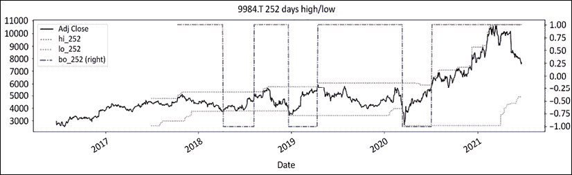

    图 5.1：软银一年最高/最低制度突破定义

当价格在整理或横盘市场之后突破时，这种范围突破策略效果非凡。横盘市场是上行或下行趋势之间的暂时期间，旧制度已死，新制度尚不明显。在横向波动的市场中，价格在一定范围内波动。

公牛与熊在一场吉尔伽美什史诗般的战斗中激烈争斗。当价格突破上界或下界时，这表明一方已经放弃了。被压抑的能量得以释放。价格毫不费力地沿着最小阻力线移动。因此，这种突破方法是范围突破/突破的首选武器。

这种方法的主要缺点是其内置的滞后性，这是由持续时间引起的。在财务修订主义的行话中，等待期被称为**确认**。市场参与者很少有耐心等待 50 天、100 天，甚至一年才最终找到一些解决方案。时间就是金钱。拖欠租金的股票应该被减少或者被赶走。使用这种长期持续时间的市场参与者可能希望将时间退出重新引入到他们的策略中。

这种方法的主要优点是计算简单和稳定性。主要缺点是其固有的滞后性和回撤大量利润的不适。这将我们引向下一个迭代：不对称的范围突破策略。

对突破制度定义方法的进一步完善包括为进入和退出分离的周期。例如，传奇的芝加哥海龟交易者在 50 日最高点进入，20 日最低点退出：

```py
# CHAPTER 5 Turtle for dummies

def turtle_trader(df, _h, _l, slow, fast):
    '''
    "    _slow: Long/Short direction\n",
    "    _fast: trailing stop loss\n",
    '''
    _slow = regime_breakout(df,_h,_l,window = slow)
    _fast = regime_breakout(df,_h,_l,window = fast)
    turtle = pd. Series(index= df.index, 
                        data = np.where(_slow == 1,np.where(_fast == 1,1,0), 
                                np.where(_slow == -1, np.where(_fast ==-1,-1,0),0)))
    return turtle
slow = 50
fast = 20
ohlc = ['Open','High','Low','Close']
_o,_h,_l,_c = [ohlc[h] for h in range(len(ohlc))]
df['bo_'+ str(slow)] = regime_breakout(df,_h,_l,window = slow)
df['bo_'+ str(fast)] = regime_breakout(df,_h,_l,window = fast)
df['turtle_'+ str(slow)+str(fast)] = turtle_trader(df, _h, _l, slow, fast)
rg_cols = ['bo_'+str(slow),'bo_'+ str(fast),'turtle_'+ str(slow)+str(fast)]
df[['Close','bo_'+str(slow),'bo_'+ str(fast),'turtle_'+ str(slow)+str(fast)] ].plot(
    secondary_y= rg_cols,figsize=(20,5), style=['k','orange','g:','b-.'],
                                 title = str.upper(ticker)+' '+str(rg_cols)) 
```

这种不对称的持续时间使交易者能够在灵活的市场中获得小利润：

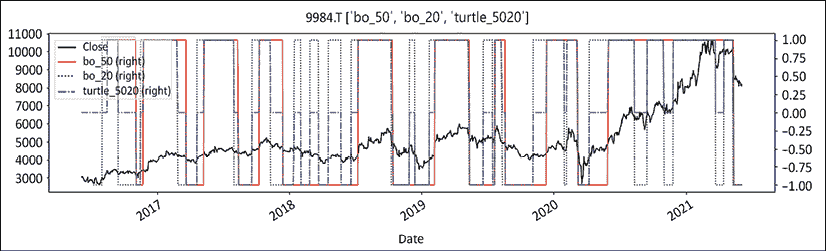

图 5.2：软银的不对称制度突破持续时间（海龟入门者策略）

上述图表显示了软银的收盘价，慢速制度突破（橙色实线），快速制度突破（绿色虚线），以及两者的组合蓝色虚点线。蓝色虚点线提供入场和出场信号。这有点难以阅读，因此我们将在下面使用一个视觉上更友好的图表。

上面概述的海龟策略是受传奇海龟交易者启发的一种基本脚本。它由两个范围突破制度组成。较慢的持续时间用于进入。较快的持续时间用于退出。这种入场和出场的不对称持续时间依赖于一项古老的原则：谨慎和审慎地确认趋势，但快速和果断地削减损失并保护利润。这最后一个制度将从现在起改名为*Turtle for dummies*。

我们将在本书中多次使用这种基本策略来说明例子，纯粹是为了教育目的。但是，请不要在家里这样做——这对于教育目的而言是足够现实的，但过于简单，无法用于实际的盈利。

使用`graph_regime_combo`更直观地表示海龟入门者策略如下：

```py
ma_st = ma_mt = ma_lt = 0
rg=lo=hi=slo=shi=clg=flr=rg_ch = None
ohlc = ['Open','High','Low','Close']
_o,_h,_l,_c = [ohlc[h] for h in range(len(ohlc))]
bo_lt = 200
bo_st = 50

lt_lo = df[_l].rolling(window= bo_lt).min()
lt_hi = df[_h].rolling(window= bo_lt).max()
st_lo = df[_l].rolling(window= bo_st).min()
st_hi = df[_h].rolling(window= bo_st).max()
graph_regime_combo(ticker,df,_c,rg,lo,hi,slo,shi,clg,flr,rg_ch,ma_st,ma_mt,ma_lt,lt_lo,lt_hi,st_lo,st_hi) 
```

这给出了下面的图表：

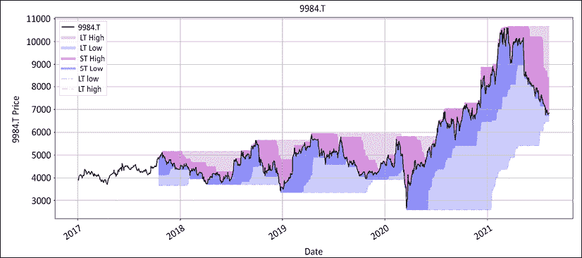

图`5.3`：软银制度使用乌龟交易员方法。较暗的区域是较短时间范围

更长的持续时间给出了方向；长或短。这是蓝线，基于`50-day`的最高/最低点。更短的持续时间是止损。我们将在*第七章*，*提高您的交易优势*中详细讨论止损。较短的持续时间通过缩小范围来保护利润。这样做的反面是交易频率增加。乌龟策略的这组参数在波动市场中效果不佳，正如我们在`2018`年整年都能看到的那样。在`2019`年的横向市场中，它也遇到了困难。

# 移动平均线交叉

移动平均线是另一种流行的制度定义方法。这种方法**非常简单和普遍**，以至于即使是声称从不看图表的最顽固的基本分析师，也喜欢使用`200-day`的简单移动平均线。这种方法也很容易计算。对于移动平均线的类型可能还有进一步的细化，从简单到指数、三角形、自适应都有。然而，原则是相同的。当快速移动平均线高于较慢的时候，制度是看涨的。当它低于较慢的时候，制度是看跌的。下面的代码展示了如何使用简单移动平均线和指数移动平均线（分别是`SMA`和`EMA`）计算制度：

```py
#### Regime SMA EMA ####
def regime_sma(df,_c,st,lt):
    '''
    bull +1: sma_st >= sma_lt , bear -1: sma_st <= sma_lt
    '''
    sma_lt = df[_c].rolling(lt).mean()
    sma_st = df[_c].rolling(st).mean()
    rg_sma = np.sign(sma_st - sma_lt)
    return rg_sma

def regime_ema(df,_c,st,lt):
    '''
    bull +1: ema_st >= ema_lt , bear -1: ema_st <= ema_lt
    '''
    ema_st = df[_c].ewm(span=st,min_periods = st).mean()
    ema_lt = df[_c].ewm(span=lt,min_periods = lt).mean()
    rg_ema = np.sign(ema_st - ema_lt)
    return rg_ema

st = 50
lt = 200
df['sma_' + str(st) + str(lt)] = regime_sma(df, _c='Close', st= st, lt= lt)
df['ema_' + str(st) + str(lt)] = regime_ema(df, _c='Close', st= st, lt= lt)

ohlc = ['Open','High','Low','Close'] 
_o,_h,_l,_c = [ohlc[h] for h in range(len(ohlc))]
rgme_cols = ['sma_' + str(st) + str(lt), 'ema_' + str(st) + str(lt),'turtle_'+ str(slow)+str(fast) ]
df[['Close','sma_' + str(st) + str(lt), 'ema_' + str(st) + str(lt),'turtle_'+ str(slow)+str(fast)] ].plot(
    secondary_y= rgme_cols,figsize=(20,8), style=['k','orange','m--','b-.'],
                                 title = str.upper(ticker)+' '+str(rgme_cols)) 
```

这产生了下面的图表：

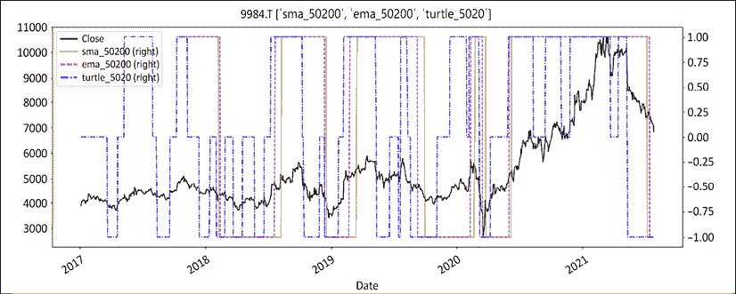

图`5.4`：软银制度使用乌龟突破，简单移动平均线和指数移动平均线

在这里，我们比较了三种制度方法。我们有我们新鲜出炉的，最好的朋友*Turtle for dummies*在虚线蓝线上。我们有橙色的简单移动平均线，和紫色虚线的指数移动平均线。移动平均线系列的结果是可预见的接近。指数移动平均线比简单移动平均线更具反应性。现在我们可以使用`graph_regime_combo`图表函数来可视化结果。

```py
rg=lo=hi=slo=shi=clg=flr=rg_ch = None
lt_lo = lt_hi = st_lo = st_hi = 0

ma_st = df[_c].rolling(window=50).mean()
ma_mt = df[_c].rolling(window=200).mean()
ma_lt = df[_c].rolling(window=200).mean()
ohlc = ['Open','High','Low','Close']
_o,_h,_l,_c = [ohlc[h] for h in range(len(ohlc))]

graph_regime_combo(ticker,df,_c,rg,lo,hi,slo,shi,clg,flr,rg_ch,ma_st,ma_mt,ma_lt,lt_lo,lt_hi,st_lo,st_hi) 
```

该函数可容纳最多三个移动平均线。要获得仅具有两个移动平均线的图表，就像在这里所做的那样，请将中期和长期设置为相同的值（在这种情况下，中期和长期都设置为`200`）。下面是移动平均线交叉制度的可视化呈现。浅绿色和浅红色区域是制度看涨或看跌且盈利的地方。深绿色和深红色区域是制度看涨或看跌但无盈利的地方：

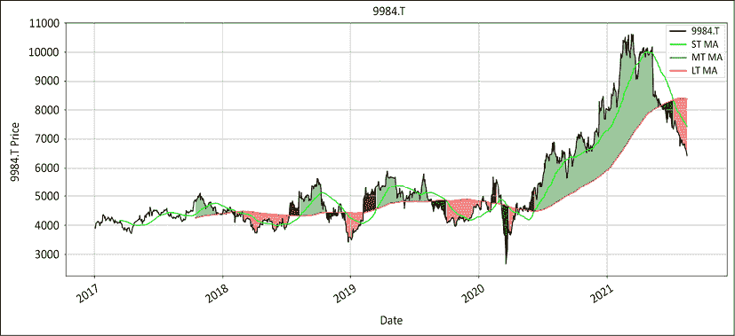

图`5.5`：软银的交叉区域较暗的区域是亏损区域

这种策略在横向和波动市场中表现不佳。快速和慢速移动平均线收敛为低幅度正弦振荡的平坦线。交易频率和亏损率增加，而胜率下降。

实例化三个移动平均线的更简洁方法是通过列表推导。首先，我们创建一个移动平均变量列表。其次，我们通过列表推导实例化变量。让我们用几个列表推导来写上面的内容：

```py
mav = [50, 200, 200]
ma_st,ma_mt,ma_lt = [df[_c].rolling(mav[t]).mean() for t in range(len(mav))]

bo = [50, 252]
st_lo,lt_lo = [df[_l].rolling(bo[t]).min() for t in range(len(bo))]
st_hi,lt_hi = [df[_h].rolling(bo[t]).max() for t in range(len(bo))]
ohlc = ['Open','High','Low','Close']
_o,_h,_l,_c = [ohlc[h] for h in range(len(ohlc))]

graph_regime_combo(ticker,df,_c,rg,lo,hi,slo,shi,clg,flr,rg_ch,ma_st,ma_mt,ma_lt,lt_lo,lt_hi,st_lo,st_hi) 
```

这将是这样的：

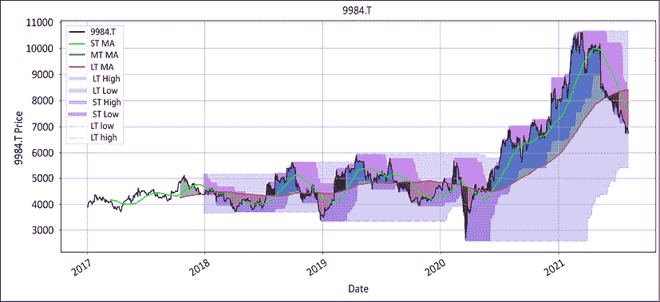

图 5.6：Softbank 交叉适用于菜鸟的海龟

这张越来越色彩缤纷的图表显示了两种制度方法的组合。不幸的是，它增加了更多的混乱而不是解决问题。市场参与者有时会试图添加多个条件，希望筛除假阳性。但不幸的是，接受随机性要比试图根除随机性更容易。

两线交叉是移动平均线交叉方法中最受欢迎的版本。较慢的线定义制度，而较短的持续时间线计时进出。最受欢迎的持续时间是 50/200，被称为**黄金/死亡交叉**。理论上，这种组合是有意义的。200 天是一个强大的长期衡量指标，而 50 天是一个良好的动量指标。在实践中，这种组合的命中率很差。它只适用于大的长期趋势。不幸的是，它们很少出现，因此胜率大约为 20%。其余的时间，更快的移动平均线像职业政客一样在较慢的移动平均线周围来回摇摆。

这些弱点导致移动平均线的狂热者将其发展到下一个阶段的三个移动平均线。在以下示例中，我们通过添加另一个持续时间较短的移动平均线来改进之前的 50/200 金叉移动平均线交叉。为了简单起见，我们使用 20、50 和 200 天。200 天给出了制度，而 20/50 排列给出了进出。 

我们所要做的就是在以下代码中更改一个变量：

```py
rg=lo=hi=slo=shi=clg=flr=rg_ch = None
lt_lo = lt_hi = st_lo = st_hi = 0

mav = [20, 50, 200]
ma_st,ma_mt,ma_lt = [df[_c].rolling(mav[t]).mean() for t in range(len(mav))]
ohlc = ['Open','High','Low','Close']
_o,_h,_l,_c = [ohlc[h] for h in range(len(ohlc))]

graph_regime_combo(ticker,df,_c,rg,lo,hi,slo,shi,clg,flr,rg_ch,ma_st,ma_mt,ma_lt,lt_lo,lt_hi,st_lo,st_hi) 
```

我们可以在下面看到产生的图表：

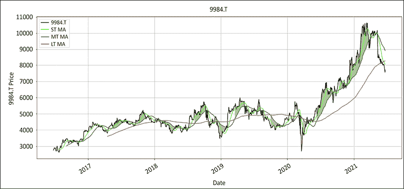

图 5.7：Softbank 三重移动平均线交叉

最长的持续时间决定制度。中期和短期持续时间分别计时进入和退出。与其长段落不如用以下逻辑最好地概括：

1.  **长期**：当短期移动平均线最高时进入并保持长期持有，其次是中期和长期移动平均线

1.  **短期**：当短期移动平均线低于中期移动平均线时进入并保持空头，中期移动平均线需要低于长期移动平均线。

1.  **否则**：中性，无持仓。

这种方法可能是在遵循长期已建立的趋势和保持良好风险管理之间取得的最实际的折中。

与我们之前看到的双移动平均图不同，三移动平均线不会长时间保持错误方向。它在早期削减头寸方面做得更好。这些是无色和较短的较暗区域。另一方面，该方法的缺点是交易频率的增加。另一个缺点是该方法的固有滞后性。正如图表的中间部分所示，在横向市场中，价格会在产生信号之前朝任一方向移动相当多。

市场参与者放弃移动平均线方法的主要原因是横向市场。当市场横向波动时，移动平均线会相互振荡。这会产生许多错误的信号，这些信号倾向于侵蚀金融和情绪资本基础。在经历了几次代价高昂的错误开始后，市场参与者往往会寻找更少噪音的方法。

与调整移动平均持续时间或完全放弃该方法不同，更好的解决方案可能是调整赌注大小。在出现横向市场的第一个迹象时减小规模，然后随着趋势的增长增加权重。

# 更高的高点/更高的低点

这是另一种流行的方法。趋势上升的股票会创造更高的高点和更高的低点。相反，趋势下降的股票会按顺序创造更低的低点和更低的高点，因此表明持续的弱势。这种方法在直觉上是有道理的。不幸的是，统计上并不像看起来那么稳健。市场有时会打印出低/高低/高，从而使计算失效，然后恢复其行程。其次，此方法需要同时满足三个条件：

1.  一个更低的低点。

1.  一个更低的高点。

1.  两个更低的低点和更低的高点条件必须按顺序满足，这只适用于有序的市场。

这三个条件必须按照精确顺序连续满足，才能使制度转为熊市。市场是随机的，比人们一般认为的更嘈杂。

此方法的主要优点是进出场。在多方面，低点买入，高点退出。在空头方面，高点卖出，低点退出。这些反向趋势的进出口使市场参与者能够获利。此外，止损在多方面明确定义为更高的低点，在空方面明确定义为更低的高点。

总的来说，这种方法的前提是合乎逻辑的。创造更高的高点和更高的低点的股票被拉向上升，反之亦然。不幸的是，这种方法在嘈杂的市场中表现不佳，那里没有清晰的高点和低点的连续性，因此我在本章中省略了代码。

以下方法使用相同的摆动高点和摆动低点以更强大的方式定义制度。它简单且统计上稳健。

# 地板/天花板法

该方法最初是对更高高/更低低方法的变体。每个人都直观地使用过它，然而它显然是如此明显，以至于似乎没有人费心将其形式化。与更高高/更低低方法不同，制度只需满足以下两个条件之一即可更改：

1.  **熊市**：摆动高点必须明显低于峰值。

1.  **牛市**：摆动低点必须明显高于底部。

即使制度转变，摆动也不必连续。例如，市场有时会飙升，然后退却并打印出一段时间的横向波动。这些时期被称为**整理**。直到一个摆动高点明显低于峰值，制度才会转为熊市。

经典定义始终有效，无论时间框架和资产类别如何。在牛市中，低点将明显高于底部。相反，在熊市中，高点将明显低于峰值。

随机性触发了以简洁优雅的方式处理的异常。有两种方法：

1.  **保守的**：

    +   如果制度是熊市的，价格越过天花板，制度就会转为牛市。

    +   如果制度是牛市的，价格越过地板，制度就会转为熊市。

1.  **积极的**：

    +   如果制度是熊市的，价格越过发现摆动高点，制度就会变成牛市。

    +   如果制度是牛市的，价格越过发现摆动低点，制度就会转为熊市。

这种地板/天花板方法只有两种制度：牛市或熊市。横向制度是在更广泛的牛市或熊市背景中的暂停。该方法为制度定义带来了稳定性。在实践中，没有什么比围绕移动平均线来回翻转更令人沮丧的了。稳定性使市场参与者能够更好地管理其持仓。

地板/天花板方法在概念上很简单。但是计算起来并不容易。这是一个两步过程：

1.  摆动检测

1.  制度定义

市场不是直线上涨的。它沿着主导趋势上下波动。它沿途标记局部高点和低点。这些被称为**摆动高点**和**摆动低点**。

摆动检测占了地板/天花板方法的 80%。并非所有的摆动高低点都是平等的。主要困难在于将噪音与信号分离。由于制度定义是基于摆动的，错误的摆动检测不可避免地导致错误的制度定义。

代码逻辑很简单。它依赖于两个测试：重测和距离。我们将从摆动高点到摆动低点的整个序列进行，如*图 5.8*所示：

1.  价格从先前的摆动低点上升到新的高点。

1.  价格从那个历史新高下跌。

1.  价格重测那个历史新高，但失败了，并低于那个历史新高后的低点。

1.  一旦价格跌破最高低点，卖方可能掌握主导地位。该算法设计为在创历史新高后不断重置到最高低点。

以下是摆动低点的等效步骤：

1.  价格打印出最低点：第一个低点。

1.  它反弹到第一个高点。

1.  价格回落到其最新低点，但未能达到最低点。

1.  价格随后开始向上走动。它要么突破第一个高点（始终是最低点后的最高点）或者打印一个较低的高点，称为最新高点。当价格收盘高于第一个或最新的高点时，这表明买家现在可能掌控着局势。

    该序列重复出现，直到价格收盘高于或低于最新的高点或低点。单独看，重新测试并不具有统计学意义。它们发生得相当频繁。当与距离测试相结合时，重新测试往往更具意义。

1.  **距离测试**：这是从摆动高点到最低点的距离。此测试可以以波动率单位或百分比点单位进行。距离越远，越有可能表明趋势耗尽：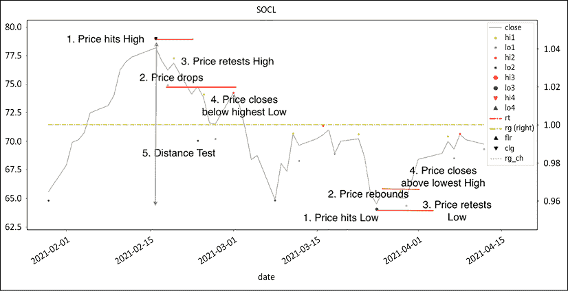

    图 5.8：摆动检测的视觉解释：距离和重新测试

现在，让我们放大看看整体情况。上图中的摆动高点是下图中的峰值：

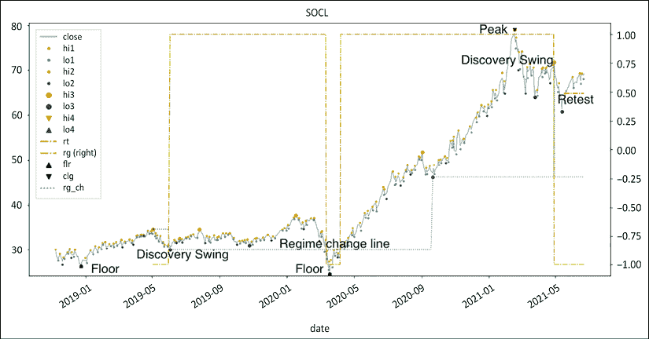

图 5.9：楼层/天花板制度定义

次轴上的线是制度。制度在找到比底部高得多的摆动低点后变为看涨。这个摆动低点现在是制度变更线。如果价格跌破该水平，制度将变为看跌。这发生在 2020 年第一季度，此时制度变为看跌。价格再次突破该水平，制度转为看涨。价格在 2021 年初创下历史新高，随后下跌，然后反弹，但在高点之前转跌。制度变为看跌。现在是时候从多头转为空头了。然而，该问题的借贷成本昂贵得令人望而却步，因此那笔丰厚的交易未能成行。

在接下来的几节中，我们将介绍计算此内容所需的源代码。这个概念框架受到了比利时数学家本尼迪克特·曼德布罗特关于分形的开创性工作的启发。我们从一系列嘈杂的小高点和低点开始，然后使用前一系列缩小的数据。这种方法比其他方法更加计算密集。然而，结果出奇地直观。它大致分为两个阶段：**摆动检测**和**制度定义**。摆动检测是一系列小函数。

## 摆动检测

摆动检测分为两部分：历史摆动和最后摆动调整。前两个函数，`historical_swings` 和 `hilo_alternation`，完成了 90% 的工作。其余部分是一系列小函数，确保最后的摆动是相关的。乍一看这可能看起来有点冗长，所以我们将逐步介绍所有函数并解释它们的相关性。

### 历史摆动和高/低交替

让我们从下载历史价格开始。我们使用 SPY，这是标普 500 的一个代理**交易所交易基金**（**ETF**），但如果您愿意，您可以尝试使用不同的代码：

```py
# CHAPTER 5 Swing detection
ticker = 'SPY' 

start= '2016-12-31'
end = None
raw_data = round(yf.download(tickers= ticker,start= start, end = end,interval = "1d",
                 group_by = 'column',auto_adjust = True, prepost = True, 
                 treads = True, proxy = None),2)
ohlc = ['Open','High','Low','Close']
_o,_h,_l,_c = [ohlc[h] for h in range(len(ohlc))] 
```

接下来，我们将按顺序逐个呈现每个函数，并用图表或属性说明进展。我们从上一个函数结束的地方继续，并前进。最后，我们将一次性发布所有函数的完整总结，并发布一个图表：

```py
#### hilo_alternation(hilo, dist= None, hurdle= None) ####
def hilo_alternation(hilo, dist= None, hurdle= None):
    i=0    
    while (np.sign(hilo .shift(1)) == np.sign(hilo)).any(): # runs until duplicates are eliminated
        # removes swing lows > swing highs
        hilo.loc[(np.sign(hilo.shift(1)) != np.sign(hilo)) & # hilo alternation test 
                 (hilo.shift(1)<0) &  # previous datapoint: high
                 (np.abs(hilo.shift(1)) < np.abs(hilo) )] = np.nan # high[-1] < low, eliminate low 

        hilo.loc[(np.sign(hilo.shift(1)) != np.sign(hilo)) &  # hilo alternation
                 (hilo.shift(1)>0) &  # previous swing: low
                 (np.abs(hilo ) < hilo.shift(1))] = np.nan # swing high < swing low[-1]

#### removed for brevity: check GitHub repo for full code ####
#### hilo_alternation(hilo, dist= None, hurdle= None) ####
#### historical_swings(df,_o,_h,_l,_c, dist= None, hurdle= None) #### 
def historical_swings(df,_o,_h,_l,_c, dist= None, hurdle= None):

    reduction = df[[_o,_h,_l,_c]].copy() 
    reduction['avg_px'] = round(reduction[[_h,_l,_c]].mean(axis=1),2)
    highs = reduction['avg_px'].values
    lows = - reduction['avg_px'].values
    reduction_target =  len(reduction) // 100

    n = 0
    while len(reduction) >= reduction_target: 
        highs_list = find_peaks(highs, distance = 1, width = 0)
        lows_list = find_peaks(lows, distance = 1, width = 0)
        hilo = reduction.iloc[lows_list[0]][_l].sub(reduction.iloc[highs_list[0]][_h],fill_value=0)

#### removed for brevity: check GitHub repo for full code ####
#### historical_swings(df,_o,_h,_l,_c, dist= None, hurdle= None) ####

df = raw_data.copy()
ohlc = ['Open','High','Low','Close']
_o,_h,_l,_c = [ohlc[h] for h in range(len(ohlc))]
rhs = ['Hi1', 'Lo1','Hi2', 'Lo2', 'Hi3', 'Lo3']
rt_hi,rt_lo,_hi,_lo,shi,slo = [rhs[h] for h in range(len(rhs))]

df= historical_swings(df,_o,_h,_l,_c,dist= None, hurdle= None)

df[[_c,rt_hi,rt_lo,_hi,_lo,shi,slo ]].plot(
    style=['grey','y.', 'c.','r.', 'g.', 'rv', 'g^'],
    figsize=(20,5),grid=True, title = str.upper(ticker))
df[[_c,shi,slo]].plot(style=['grey','rv', 'g^'],
        figsize=(20,5),grid=True, title = str.upper(ticker)) 
```

`hilo_alternation` 函数循环遍历减少的数据帧，直到系列被整齐地构成交替的高点和低点。它消除：

1.  相邻相同方向的高点和低点：高点被赋予负号。低点有一个正号。当有两个连续的高点或低点时，最低值标记着极端点。

1.  高于周围高点的低点。随机性无法消除：理论上，这不应该存在，但在实践中，异常仍然存在。

1.  嘈杂的短距离高点和低点。距离测试并不完全相关，因为交替循环包含在更大的多级循环中。这是算法的分形部分，我们在缩小图像的同时寻找相同的模式。然而，该特征是一个优雅的选项，可以缩短循环的次数。

1.  在每次迭代结束时，使用 `dropna` 方法减少 `hilo df`。

`historical_swings` 函数采取以下步骤：

1.  减少数据帧：复制主数据帧，并从高、低和平均值实例化一个新系列。

1.  循环以减少数据帧。

1.  计算两组高点和低点（通过给平均系列分配负号）。高点的唯一要求是前后的条必须较低，反之亦然。

1.  运行 `hilo_alternation` 函数以减少数据帧。

1.  填充减少的数据帧，并通过 `dropna` 方法进一步减少。

1.  为每个级别填充主数据帧。当减少的长度<1% 的主数据帧，或者不再可能减少，或者经过 10 次迭代时停止。

以上代码返回了这个非常嘈杂的图表：

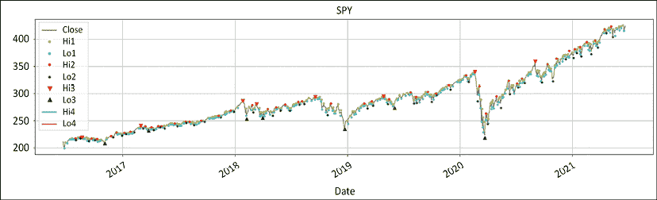

图 5.10：SPY 分形高点/低点 1 到 3 级

第一级是标有 Hi1 和 Lo1 的小点，位于收盘价的上方和下方。第 2 级是标有 Hi2 和 Lo2 的红色和绿色点。它不太频繁，但仍然相对嘈杂。接下来，我们真的需要识别有意义的转折点来进行分析。所以，我们上升一个级别。三角形是第 3 级。价格已经经过了两次筛选。原始数据帧已经减少了 99%。

以下图表只显示价格和 3 级数据：

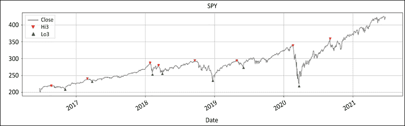 图 5.11：SPY 历史摆动

最后一个三角形在最高收盘价下方。这显然是一个误报。高点显然不是最高点，也没有后跟一个低点。其余的函数将调整最后一个摆动。所以，让我们让这个误报消失：

1.  **波动高点**：价格持续高于最新的波动高点。

1.  **波动低点**：价格持续低于最新的波动低点。

`cleanup_latest_swing()` 函数从最新的波动高点和低点中移除了错误的阳性：

```py
#### cleanup_latest_swing(df, shi, slo, rt_hi, rt_lo) ####
def cleanup_latest_swing(df, shi, slo, rt_hi, rt_lo): 
    '''
    removes false positives
    '''
    # latest swing
    shi_dt = df.loc[pd.notnull(df[shi]), shi].index[-1]
    s_hi = df.loc[pd.notnull(df[shi]), shi][-1]
    slo_dt = df.loc[pd.notnull(df[slo]), slo].index[-1] 
    s_lo = df.loc[pd.notnull(df[slo]), slo][-1] 
    len_shi_dt = len(df[:shi_dt])
    len_slo_dt = len(df[:slo_dt])

    # Reset false positives to np.nan
    for i in range(2):

        if (len_shi_dt > len_slo_dt) & ((df.loc[shi_dt:,rt_hi].max()> s_hi) | (s_hi<s_lo)):
            df.loc[shi_dt, shi] = np.nan
            len_shi_dt = 0
        elif (len_slo_dt > len_shi_dt) & ((df.loc[slo_dt:,rt_lo].min()< s_lo)| (s_hi<s_lo)):
            df.loc[slo_dt, slo] = np.nan 
            len_slo_dt = 0
        else:
            pass

    return df
#### cleanup_latest_swing(df, shi, slo, rt_hi, rt_lo) ####

df[[_c,shi,slo]].plot(style=['grey','rv', 'g^'],
        figsize=(20,5),grid=True, title = str.upper(ticker) + ' pre-adjustment')

df = cleanup_latest_swing(df, shi,slo,rt_hi,rt_lo)

df[[_c,shi,slo]].plot(style=['grey', 'rv', 'g^'],
        figsize=(20,5),grid=True, title = str.upper(ticker) + ' post-adjustment') 
```

代码执行以下步骤：

1.  代码标识了最新的波动低点和高点。

1.  识别最近的波动。

1.  如果是错误的阳性，则指定为 N/A。

以下图表在调整前后说明了该函数从数据中移除了错误的阳性：

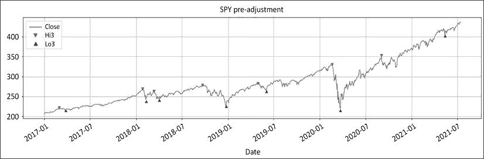

图 5.12：调整前的 SPY：最后的波动高点和低点是错误的阳性

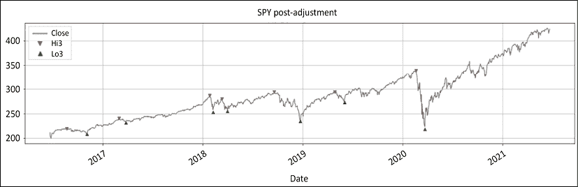

图 5.13：调整后的 SPY：两个波动都被删除

这两个图表是不言自明的。最后两个三角形必须被移除。最后的波动低点由绿色三角形表示，高于前一个波动高点。此外，由于没有更低的波动低点，因此该波动高点无效。因此，当我们对最后两个波动进行一次循环时，两者都被移除。现在图表一直回溯到 2020 年 3 月的低点。接下来，我们将使用 `latest_swing_variables()` 函数实例化所有在后续过程中所需的变量。此函数计算将在接下来的几个函数中使用的变量。它们分别是：

+   `ud`: 方向，上升 `+1`，下降 `-1`。

+   `bs`: 基础，要么是波动低点要么是高点。

+   `bs_dt`: 波动日期。

+   `_rt`: 将用于检测波动的系列名称。对于波动高点，为重新测试低位 `rt_lo`，对于波动低点，为重新测试高位 `rt_hi`。

+   `_swg`: 用于赋值的系列；`shi` 表示波动高点，`slo` 表示波动低点。

+   `hh_ll`: 最低低点或最高高点。

+   `hh_ll_dt`: 最高高点或最低低点的日期。

我们将使用列表推导式声明变量：

```py
#### latest_swings(df, shi, slo, rt_hi, rt_lo, _h, _l, _c, _vol) ####
def latest_swing_variables(df, shi, slo, rt_hi, rt_lo, _h, _l, _c):
    '''
    Latest swings dates & values
    '''
    shi_dt = df.loc[pd.notnull(df[shi]), shi].index[-1]
    slo_dt = df.loc[pd.notnull(df[slo]), slo].index[-1]
    s_hi = df.loc[pd.notnull(df[shi]), shi][-1]
    s_lo = df.loc[pd.notnull(df[slo]), slo][-1]

    if slo_dt > shi_dt: 
        swg_var = [1,s_lo,slo_dt,rt_lo,shi, df.loc[slo_dt:,_h].max(), df.loc[slo_dt:, _h].idxmax()]         
    elif shi_dt > slo_dt: 
        swg_var = [-1,s_hi,shi_dt,rt_hi,slo, df.loc[shi_dt:, _l].min(),df.loc[shi_dt:, _l].idxmin()]        
    else: 
        ud = 0
    ud, bs, bs_dt, _rt, _swg, hh_ll, hh_ll_dt = [swg_var[h] for h in range(len(swg_var))]   

    return ud, bs, bs_dt, _rt, _swg, hh_ll, hh_ll_dt
#### latest_swings(df, shi, slo, rt_hi, rt_lo, _h, _l, _c, _vol) ####

ud,bs,bs_dt,_rt,_swg,hh_ll,hh_ll_dt = latest_swing_variables(df,shi,slo,rt_hi,rt_lo,_h,_l,_c)

ud, bs, bs_dt, _rt, _swg, hh_ll, hh_ll_dt 
```

这将产生如下输出：

```py
(1,
 213.43,
 Timestamp('2020-03-23 00:00:00'),
 'Lo1',
 'Hi3',
 452.6,
 Timestamp('2021-09-02 00:00:00')) 
```

上面声明的变量将在接下来的小节中使用。

### 确定趋势耗尽

到目前为止我们所做的工作有两个目标。我们已经检测到历史波动并对其进行了清理。然后，我们声明了我们将用于实时查找最新波动的变量。我们用于检测最终波动的方法称为**重新测试**。在 SPY 图表的背景下，市场从波动低点打印出最高的高点。价格稍微下跌然后回升但未能达到最高高点。价格然后穿过了最高点低位。重新测试实质上是犹豫不决。它们非常频繁。市场往往会犹豫不决。然而，当重新测试发生在持续移动的末尾时，这可能表明趋势耗尽并且可能会逆转市场方向。

此距离测试充当过滤器。此函数有两个内置测试：

1.  表示为波动的多个波动。我们使用**平均真实范围**（**ATR**）或标准偏差的度量。

1.  作为固定百分比的距离。

函数的默认设置是没有距离测试，这将返回实际上的通过。一个成功的测试要么是-1（对于波动低点），要么是+1（对于波动高点），以及 0（对于失败的测试）。我们还将定义一个计算 ATR 的函数。这是由传奇人物威尔斯·怀尔德最初创建的经典波动性度量：

```py
#### test_distance(ud, bs, hh_ll, vlty, dist_vol, dist_pct) ####
def test_distance(ud,bs, hh_ll, dist_vol, dist_pct): 

    # priority: 1\. Vol 2\. pct 3\. dflt
    if (dist_vol > 0):    
        distance_test = np.sign(abs(hh_ll - bs) - dist_vol)
    elif (dist_pct > 0):
        distance_test = np.sign(abs(hh_ll / bs - 1) - dist_pct)
    else:
        distance_test = np.sign(dist_pct)

    return int(max(distance_test,0) * ud)
#### test_distance(ud, bs, hh_ll, vlty, dist_vol, dist_pct) ####
#### ATR ####
def average_true_range(df, _h, _l, _c, n):
    '''
    http://stockcharts.com/school/doku.php?id=chart_school:technical_indicators:average_true_range_atr
    '''
    atr =  (df[_h].combine(df[_c].shift(), max) - df[_l].combine(df[_c].shift(), min)).rolling(window=n).mean()
    return atr

#### ATR ####

dist_vol = round(average_true_range(df,_h,_l,_c,n=63)[hh_ll_dt] * 2,2)
dist_pct = 0.05
_sign = test_distance(ud,bs, hh_ll, dist_vol, dist_pct)
_sign 
```

这将产生以下输出：

```py
1 
```

这个距离测试验证了最新波动到最极端价格之间的距离，无论是以波动单位还是百分比点表示，都足够大以表明潜在的趋势耗尽。这个过滤器减少了虚假信号的出现。

#### 重新测试波动

所有函数都引导我们到了这一刻：波动检测。这个小函数有着出人意料的效果。对于波动的高点或低点逻辑是对称的。因此我们将集中在波动的高点上：

1.  检测从波动低点到最高高点。

1.  从最高高点开始，识别最高的重新测试低点。

1.  当价格收盘低于最高的重新测试低点时：波动高点 = 最高高点。

此方法同样适用于识别波动的低点。序列的展开如下：

1.  检测从波动高点到最低低点。

1.  从最低低点开始，识别最低的重新测试高点。

1.  当价格收盘高于最低的重新测试高点时：波动低点 = 最低低点。

请注意，函数将始终重置为最高的重新测试低点。有时，价格会急剧下降，然后试图恢复一些镇定，只是后来失败了。当重置为最高的重新测试低点时，函数将毫不浪费时间地识别趋势可能已经逆转的最早时刻。

该函数还会创建系列`rt`（绝对值）或`rrt`（相对值），以显示用于检测波动的重新测试。如果你想可视化哪个重新测试被用于检测波动，这个可选功能可能会有用。

在*图 5.14*中，这是黑点：

```py
#### retest_swing(df, _sign, _rt, hh_ll_dt, hh_ll, _c, _swg) ####
def retest_swing(df, _sign, _rt, hh_ll_dt, hh_ll, _c, _swg):
    rt_sgmt = df.loc[hh_ll_dt:, _rt] 

    if (rt_sgmt.count() > 0) & (_sign != 0): # Retests exist and distance test met    
        if _sign == 1: # 
            rt_list = [rt_sgmt.idxmax(),rt_sgmt.max(),df.loc[rt_sgmt.idxmax():, _c].cummin()]

        elif _sign == -1:
            rt_list = [rt_sgmt.idxmin(), rt_sgmt.min(), df.loc[rt_sgmt.idxmin():, _c].cummax()]
        rt_dt,rt_hurdle, rt_px = [rt_list[h] for h in range(len(rt_list))]

        if str(_c)[0] == 'r':
            df.loc[rt_dt,'rrt'] = rt_hurdle
        elif str(_c)[0] != 'r':
            df.loc[rt_dt,'rt'] = rt_hurdle    

        if (np.sign(rt_px - rt_hurdle) == - np.sign(_sign)).any():
            df.at[hh_ll_dt, _swg] = hh_ll 
    return df
#### retest_swing(df, _sign, _rt, hh_ll_dt, hh_ll, _c, _swg) ####

df = retest_swing(df, _sign, _rt, hh_ll_dt, hh_ll, _c, _swg)
try:
    df['rt '] = df['rt'].fillna(method='ffill')
    df[bs_dt:][[_c, rt_hi, rt_lo,
        shi, slo,'rt']].plot(style=['grey', 'c.','y.',
        'rv', 'g^', 'ko'],figsize=(20,5),grid=True, title = str.upper(ticker))
except:
    df[bs_dt:][[_c, rt_hi, rt_lo,
        shi, slo]].plot(style=['grey', 'c.','y.',
        'rv', 'g^', 'ko'],figsize=(20,5),grid=True, title = str.upper(ticker)) 
```

在结果图表的最后一个黑点是最高的重新测试低点。请注意，当函数遇到新的高点或新的低点时会重置，因此如果运行函数时看不到它，不必担心。

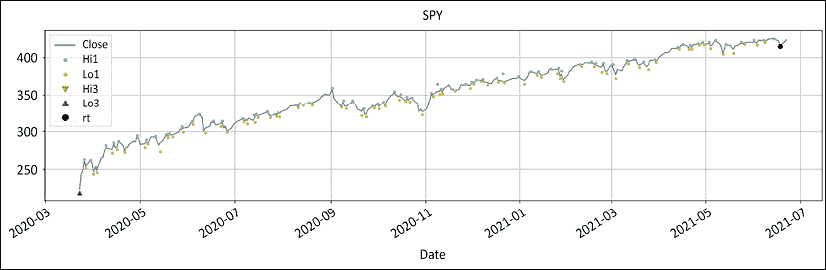

图 5.14：从波动低点重新测试

只要价格持续创造新的高点，重新测试就会一路重置。途中会有虚假的信号，但这是旅程的一部分。

一些读者可能不同意重新测试的方法，无论原因是什么。因此，我们介绍了一种替代的波动检测方法。

#### 回撤波动

这个函数是重新测试方法的一种替代。它完全依赖于从极值的回撤。这种方法的主要优点是概念上的简单性。一旦价格朝着相反的方向移动足够远，通常可以安全地得出波动已经出现的结论。然而，这个工具是比较直接的。它通常有效，但在横盘或者波动性很大的市场中失败：

1.  计算从极值到极值的回撤，即从顶部的最小值或底部的最大值。

1.  距离测试以波动率单位或百分点计算。

这个函数在重测不及时出现时充当救命稻草：

```py
#### retracement_swing(df, _sign, _swg, _c, hh_ll_dt, hh_ll, vlty, retrace_vol, retrace_pct) 
def retracement_swing(df, _sign, _swg, _c, hh_ll_dt, hh_ll, vlty, retrace_vol, retrace_pct):
    if _sign == 1: #
        retracement = df.loc[hh_ll_dt:, _c].min() - hh_ll

#### removed for brevity: check GitHub repo for full code ####
#### retracement_swing(df, _sign, _swg, _c, hh_ll_dt, hh_ll, vlty, retrace_vol, retrace_pct) ####

vlty = round(average_true_range(df=df, _h= _h, _l= _l, _c= _c , n=63)[hh_ll_dt],2)
dist_vol = 5 * vlty
dist_pct = 0.05
_sign = test_distance(ud,bs, hh_ll, dist_vol, dist_pct)
df = retest_swing(df, _sign, _rt, hh_ll_dt, hh_ll, _c, _swg)
retrace_vol = 2.5 * vlty
retrace_pct = 0.05
df = retracement_swing(df,_sign,_swg,_c,hh_ll_dt,hh_ll, vlty,retrace_vol, retrace_pct)

df[[_c,_hi,_lo,shi,slo]].plot(
    style=['grey','r.', 'g.', 'rv', 'g^'],
    figsize=(20,5),grid=True, title = str.upper(ticker))

df[[_c,shi,slo]].plot(style=['grey','rv', 'g^'],
            figsize=(20,5),grid=True, title = str.upper(ticker)) 
```

这创建了以下图形：

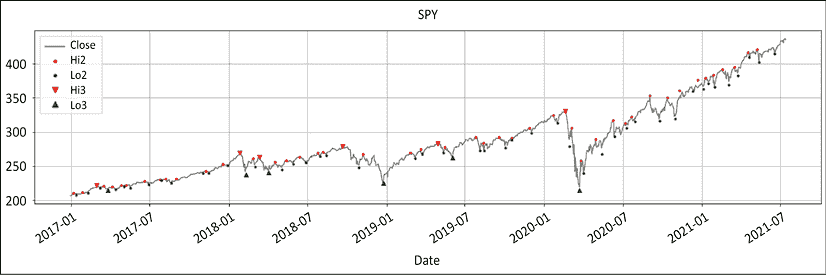

图 5.15：回撤摆动函数等级 2 和 3

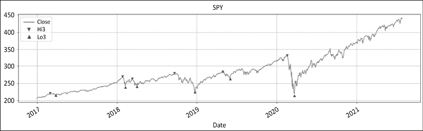

图 5.16：回撤摆动函数摆动高点和低点

这个最终函数在市场剧烈波动时起到了救命稻草的作用。两个函数（retest 和 retracement）可以同时使用。

因此，我们经历了所有这些冗长的代码，得出了一些有意义的数据点，称为**摆动高点**和**低点**。接下来，我们将使用这些摆动作为制度检测的依据。

### 将所有内容汇总：制度检测

让我们通过所有功能进行快速回顾。为了展示功能的多样性，我们将稍微调整一下事物。首先，我们再次发布相对函数的代码。然后，我们将在绝对情况下运行 SPY，然后将其与 ONEQ（纳斯达克的代理 ETF）进行比较。

我们将绘制三个图表，显示最佳配置资金的位置：

```py
### RELATIVE
def relative(df,_o,_h,_l,_c, bm_df, bm_col, ccy_df, ccy_col, dgt, start, end,rebase=True):
    '''
    df: df
    bm_df, bm_col: df benchmark dataframe & column name
    ccy_df,ccy_col: currency dataframe & column name
    dgt: rounding decimal
    start/end: string or offset
    rebase: boolean rebase to beginning or continuous series
    '''
#### removed for brevity: check GitHub repo for full code ####
### RELATIVE ###
bm_df = pd.DataFrame()
bm_col = 'ONEQ'
ccy_col = 'USD'
dgt= 3
bm_df[bm_col] = round(yf.download(tickers= bm_col,start= start, end = end,interval = "1d",
                 group_by = 'column',auto_adjust = True, prepost = True, 
                 treads = True, proxy = None)['Close'],2)
bm_df[ccy_col] = 1

df = raw_data.copy()
ohlc = ['Open','High','Low','Close']
_o,_h,_l,_c = [ohlc[h] for h in range(len(ohlc))]
rhs = ['Hi1', 'Lo1','Hi2', 'Lo2', 'Hi3', 'Lo3']
rt_hi,rt_lo,_hi,_lo,shi,slo = [rhs[h] for h in range(len(rhs))]
df= relative(df,_o,_h,_l,_c, bm_df, bm_col, ccy_df=bm_df, 
            ccy_col=ccy_col, dgt= dgt, start=start, end= end,rebase=True)

for a in np.arange(0,2):  
    df = historical_swings(df,_o,_h,_l,_c, dist= None, hurdle= None)
    df = cleanup_latest_swing(df, shi, slo, rt_hi, rt_lo)
    ud, bs, bs_dt, _rt, _swg, hh_ll, hh_ll_dt = latest_swing_variables(df, shi, slo,rt_hi,rt_lo,_h, _l,_c)
    vlty = round(average_true_range(df=df, _h= _h, _l= _l, _c= _c , n=63)[hh_ll_dt],2)
    dist_vol = 5 * vlty
    dist_pct = 0.05
    _sign = test_distance(ud,bs, hh_ll, dist_vol, dist_pct)
    df = retest_swing(df, _sign, _rt, hh_ll_dt, hh_ll, _c, _swg)
    retrace_vol = 2.5 * vlty
    retrace_pct = 0.05
    df = retracement_swing(df,_sign,_swg,_c,hh_ll_dt,hh_ll, vlty,retrace_vol, retrace_pct)
    rohlc = ['rOpen','rHigh','rLow','rClose']
    _o,_h,_l,_c = [rohlc[h] for h in range(len(rohlc)) ]
    rrhs = ['rH1', 'rL1','rH2', 'rL2', 'rH3', 'rL3']
    rt_hi,rt_lo,_hi,_lo,shi,slo = [rrhs[h] for h in range(len(rrhs))] 
```

让我们来看看此代码涉及的关键步骤：

1.  我们实例化基准 `ONEQ`。货币是 `USD`。

1.  我们通过复制原始数据来实例化 `df`。我们运行两个列表推导式来声明变量。

1.  我们运行相对函数以获取相对价格。

1.  `for` 循环将在绝对系列上运行一次。在第一次运行结束时，我们运行两个列表推导式来声明相对变量。

1.  在第二个循环中，绝对变量被相对变量替换。一切都是对称的。参数保持不变。唯一改变的是输入系列。

最后，我们打印四张图表：

```py
df[['Close','Hi1','Lo1','Hi2','Lo2','Hi3','Lo3']].plot(style=['grey','y.', 'c.','r.', 'g.', 'rv', 'g^'],
    figsize=(20,5),grid=True, title = str.upper(ticker))
df[['Close','Hi3','Lo3']].plot(
    style=['grey', 'rv', 'g^'],
    figsize=(20,5),grid=True, title = str.upper(ticker))

df[['Close','Hi3','Lo3',_c,shi,slo]].plot(
    style=['grey','rv', 'g^','k:','mv','b^'],
            figsize=(20,5),grid=True, title = str.upper(ticker)+' vs '+str.upper(bm_col))
rohlc = ['rOpen','rHigh','rLow','rClose']
_o,_h,_l,_c = [rohlc[h] for h in range(len(rohlc)) ]

df[[_c,shi,slo]].plot(
    style=['k:','mv','b^'],
            figsize=(20,5),grid=True, title = str.upper(ticker)+' vs '+str.upper(bm_col)) 
```

第一个是圣诞树状的图表，有很多小点：

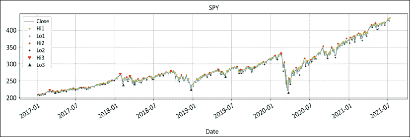

图 5.17：带有高/低等级 1 到 3 的 SPY

所有信息都在。图表很杂乱。第二个是一个干净的 **SPY** 图表：

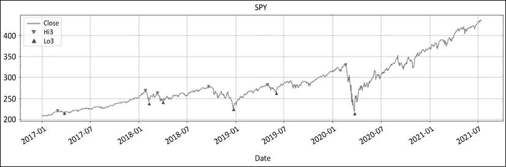

图 5.18：带有摆动高点和低点的 SPY

这是一张干净的 **SPY** 图表。误报已被清除。现在是时候进行大结局了；**SPY** 对比 **ONEQ**：

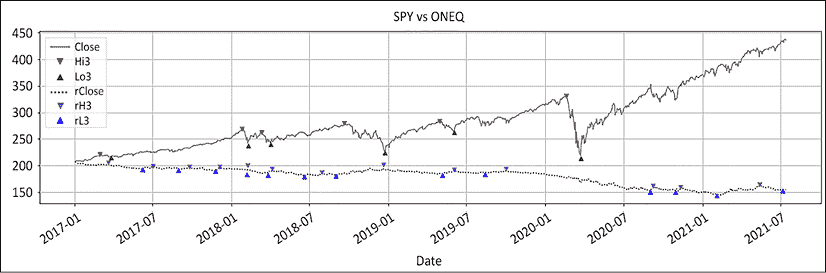

图 5.19：SPY 的绝对和相对 ONEQ

**SPY** 明显表现不及 **ONEQ**，这意味着标准普尔 500 指数连续几年表现不及纳斯达克。相对价值的波动往往与绝对价值的波动相呼应。有趣的是，看第四张也是最后一张图表，似乎相对价值已经触底，意味着最后的摆动低点似乎明显高于最低点：

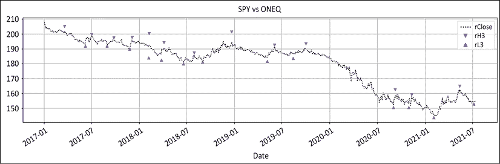

图 5.20：SPY 是否最终触底对 ONEQ？

当我们打印相对图表时，似乎最后一个波动低点可能要高于最低点。这意味着相对图表可能已经触底。这可能是标普 500 可能开始跑赢纳斯达克的早期迹象。这很好地引导我们进入下一节关于地板/天花板制度定义的内容。

## 制度定义

熊市在新低显著高于最低点时结束。在某一点上，市场将会出现底部。随后的每一个低点都会定格得更高。将所有低点与底部进行比较。一旦以波动调整单位或甚至百分点来表达的距离足够宽，市场就找到了一个支撑。在执行交易员的英文中，如果所有卖方的悲观情绪都无法突破最低点，那么市场就不再是熊市。

牛市在所有涨势都回落到顶部以下时结束。在某一点上，市场将会出现顶部。如果每次后续的涨势都在顶部以下落定，市场就找到了天花板。在执行交易员的英文中，如果所有的看涨情绪都无法达到高点，那么这个牛市就结束了。当找到天花板时，市场可能会转为横盘或熊市。相反，当找到地板时，市场可能会转为横盘或牛市。

公式是从峰值/谷底到随后波动高点/低点的距离的**z-分数**。z-分数是以波动性单位（ATR、标准偏差、已实现或隐含）表示的增量。下面的代码可能看起来有点冗长。然而，原则上是概念上简单的。

经典的牛市制度定义如下：

1.  寻找天花板：搜索窗口从地板开始。

1.  测量当前波动与天花板的距离：`ceiling_test = (swing_high[i]-top)/stdev[i]`。

1.  如果到天花板的距离小于*x*个标准偏差，那么制度已经转为熊市。

经典的熊市制度定义如下：

1.  寻找地板：搜索窗口从天花板开始。

1.  测量当前波动与底部的距离：`floor_test = (swing_low[i]-bottom)/stdev[i]`。

1.  如果到地板的距离大于*x*个标准偏差，那么制度已经转为牛市。

地板/天花板函数的代码是本章的*精华部分*。该函数如下：

```py
#### regime_floor_ceiling(df, hi,lo,cl, slo, shi,flr,clg,rg,rg_ch,stdev,threshold) ####
def regime_floor_ceiling(df, _h,_l,_c,slo, shi,flr,clg,rg,rg_ch,stdev,threshold):
    # Lists instantiation
    threshold_test,rg_ch_ix_list,rg_ch_list = [],[], []
    floor_ix_list, floor_list, ceiling_ix_list, ceiling_list = [],[],[],[]

    ### Range initialisation to 1st swing
    floor_ix_list.append(df.index[0])
    ceiling_ix_list.append(df.index[0])

    ### Boolean variables
    ceiling_found = floor_found = breakdown = breakout = False

    ### Swings lists
    swing_highs = list(df[pd.notnull(df[shi])][shi])
    swing_highs_ix = list(df[pd.notnull(df[shi])].index)
    swing_lows = list(df[pd.notnull(df[slo])][slo])
    swing_lows_ix = list(df[pd.notnull(df[slo])].index)
    loop_size = np.maximum(len(swing_highs),len(swing_lows))

    ### Loop through swings
    for i in range(loop_size): 

        ### asymetric swing list: default to last swing if shorter list
#### removed for brevity: check GitHub repo for full code ####

         ### CLASSIC CEILING DISCOVERY
#### removed for brevity: check GitHub repo for full code ####

        ### EXCEPTION HANDLING: price penetrates discovery swing
#### removed for brevity: check GitHub repo for full code ####
        ### CLASSIC FLOOR DISCOVERY        
#### removed for brevity: check GitHub repo for full code ####

        ### EXCEPTION HANDLING: price penetrates discovery swing
#### removed for brevity: check GitHub repo for full code #### 
    ### POPULATE FLOOR,CEILING, RG CHANGE COLUMNS
#### removed for brevity: check GitHub repo for full code ####

#### regime_floor_ceiling(df, hi,lo,cl, slo, shi,flr,clg,rg,rg_ch,stdev,threshold) ####
ohlc = ['Open','High','Low','Close']
_o,_h,_l,_c = [ohlc[h] for h in range(len(ohlc))]
rg_val = ['Hi3','Lo3','flr','clg','rg','rg_ch',1.5]
slo, shi,flr,clg,rg,rg_ch,threshold = [rg_val[s] for s in range(len(rg_val))]
stdev = df[_c].rolling(63).std(ddof=0)
df = regime_floor_ceiling(df,_h,_l,_c,slo, shi,flr,clg,rg,rg_ch,stdev,threshold)

df[[_c,'Hi3', 'Lo3','clg','flr','rg_ch','rg']].plot(    style=['grey', 'ro', 'go', 'kv', 'k^','c:','y-.'],     secondary_y= ['rg'],figsize=(20,5),    grid=True, title = str.upper(ticker)) 
```

在这个令人生畏的冗长代码背后是简单的逻辑。让我们来看看它的主要表达。基本上有两种逻辑：

1.  **经典地板和天花板发现**：我们循环遍历波动，以识别高点和随后下降的波动高点，以及低点和上升的波动低点。这种设置在代码内部被称为经典地板和天花板发现。 

1.  **异常处理**：当价格穿透发现波动时发生：

    +   初始穿透：对于地板，我们寻找自发现波动低点以来的最低点。对于天花板，我们寻找自发现波动高点以来的最高点。制度被重置为以前的主导制度。

    +   回归：有时价格会反弹。这种来回异常处理确保了制度对随机性的良好响应。

1.  循环结束后，列将被填充。

在做出这些澄清之后，啊哈！地板/天花板制度是次要* y *轴上的虚线水平线。这种制度方法是稳定的定义：

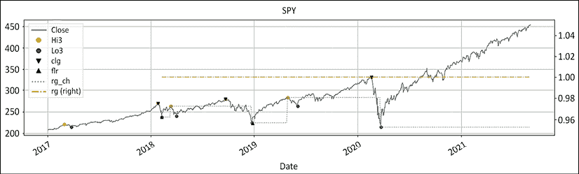

图 5.21：SPY 收盘价和地板/天花板看涨制度

制度在整个时期内保持看涨状态。市场“遇到了一个软弱期”，在 2020 年初。制度甚至没有眨眼。这并不意味着这种制度定义没有响应。这并不意味着市场参与者应该“买了就盼望”。这只是制度没有改变。这种稳定性使市场参与者能够以冷静、镇定的方式表达策略并管理风险。

# 方法比较

> “学会选择是困难的。学会做出好选择更困难。而在一个选择无限可能性的世界中学会做出好选择更加困难。”
> 
> – 巴里·施瓦茨关于选择悖论的看法

2004 年，巴里·施瓦茨用我们一直以来直觉感受到的事情震惊了世界。我们已经概述了一些方法。让我们用图形方式进行比较，并希望赢家会在视觉上脱颖而出。

首先，让我们单独打印地板/天花板。小点是一级。大点是二级。黑色三角形是地板。阴影是制度的长度。它从第一个摆动低点开始一直延伸到右边。即使是大流行的“软弱期”也没有对此造成影响。这是尽可能稳定的：

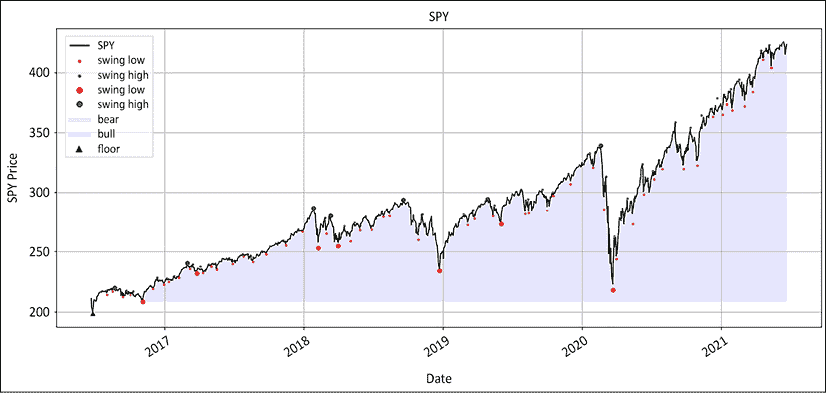

图 5.22：SPY 地板/天花板看涨制度永远

这可能被认为对市场的波动没有响应，而在某种程度上确实如此。在 2020 年第一季度，世界似乎正在以 AC/DC 的谚语“通往地狱的高速公路”为目标。然而，这种制度并没有动摇。它可能在 2020 年 5 月底的上升期间闪烁着熊市的迹象，但很快又恢复成罗伯特·德尼罗式的“暴牛”市场。这既不是好事也不是坏事。这只是这种制度方法的运作方式。绝大多数市场参与者都是长期的趋势追随者。他们想要购买的东西，是要将来与他们的菲利普·帕特克手表收藏一起传给子孙后代的。

这并不意味着他们在接下来的十年里什么都不做。市场参与者经常在市场崩盘时加仓，这被称为**弱势买入**。这是实现这一完美制度定义方法的绝佳途径。这种制度检测方法的无与伦比的稳定性为长期背景环境设定了基调。制度要么是看涨的，要么是看跌的。然后，市场参与者可以根据主导制度叠加各种策略，无论是“在弱势买入”还是“在强势卖出”。

更重要的是，沃伦·巴菲特说过，当街上流血时我们应该买入。当市场像石头一样下跌，我们的边缘脑感到困惑时，这并不容易做到。这就是这种制度方法带来的所需的安心感，以便采取行动。

其次，我们打印出移动平均和范围突破的制度方法：

```py
ohlc = ['Open','High','Low','Close']
_o,_h,_l,_c = [ohlc[h] for h in range(len(ohlc))]
mav = [20, 50, 200]
ma_st,ma_mt,ma_lt = [df[_c].rolling(mav[t]).mean() for t in range(len(mav))]

bo = [50, 252]
st_lo,lt_lo = [df[_l].rolling(bo[t]).min() for t in range(len(bo))]
st_hi,lt_hi = [df[_h].rolling(bo[t]).max() for t in range(len(bo))]

rg=lo=hi=slo=shi=clg=flr=rg_ch = None
graph_regime_combo(ticker,df,_c,rg,lo,hi,slo,shi,clg,flr,rg_ch,ma_st,ma_mt,ma_lt,lt_lo,lt_hi,st_lo,st_hi)

rg_combo = ['Close','rg','Lo3','Hi3','Lo3','Hi3','clg','flr','rg_ch']
_c,rg,lo,hi,slo,shi,clg,flr,rg_ch =[rg_combo[r] for r in range(len(rg_combo)) ]

graph_regime_combo(ticker,df,_c,rg,lo,hi,slo,shi,clg,flr,rg_ch,ma_st,ma_mt,ma_lt,lt_lo,lt_hi,st_lo,st_hi) 
```

这将产生以下两个图表：

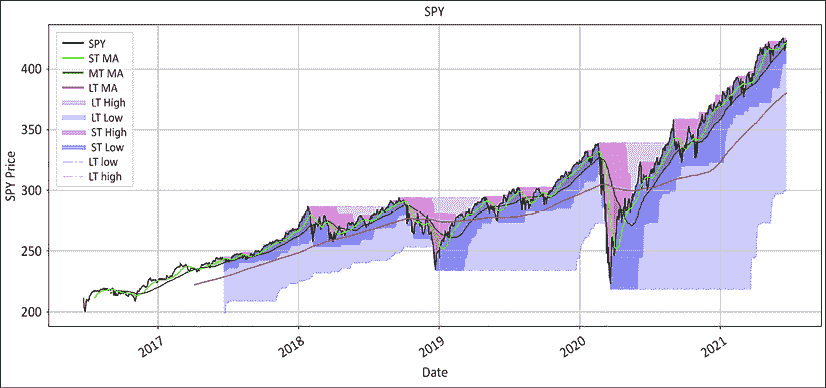

图 5.23：SPY 制度突破和移动平均线交叉

变量故意比普通市场参与者的耐心长得多。范围突破设置为 252 天突破和 50 天止损。三重移动平均线具有著名的黄金交叉和 20 天入场/出场。这些变量是故意校准的，用于长期趋势。它们不应像参议员那样来回摇摆。然而，在路上还是有一些变化。

第二个图表叠加了地板/天花板方法。这是从第一个波动到图表结束的最浅的蓝色：

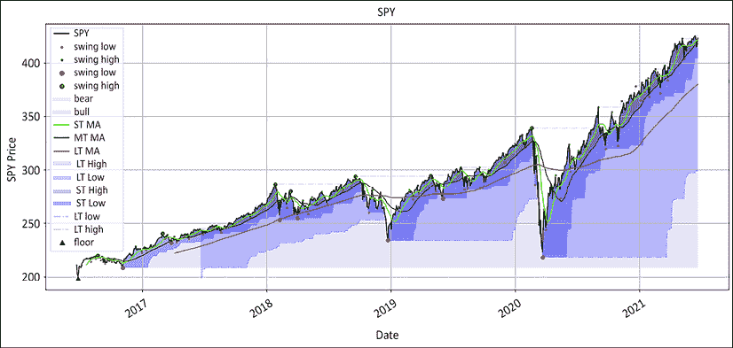

图 5.24：SPY 地板/天花板、突破和移动平均线交叉制度

上述图表将所有三种方法结合在一个简洁的可视化中。地板/天花板是最浅的蓝色。请注意，地板/天花板制度优先于所有其他方法。除非地板/天花板制度改变，否则使用范围突破或移动平均线交叉方法的看跌阶段不会反映出来。

最重要的一点是，地板/天花板方法提供了建立策略的稳定基础。知道市场仍然看涨并且应该买入低点有巨大的价值。其他任何方法都不提供这种稳定水平。机构投资者进行大额交易。进出会侵蚀盈利能力。这就是为什么他们会重视稳定性而不是准确性。当条件改变时，他们改变主意。在那之前，这是正常的戏剧。市场参与者可以根据自己的意愿制定策略。它可以是波动检测、移动平均线、范围突破或风险反转。唯一重要的是知道市场仍然处于看涨领域。

对于更喜欢行动而不是耐心的市场参与者，有两种方法可以加速地板/天花板方法。它依赖于波动。增加波动次数，制度就会机械地更紧张。

+   **方法 1**：使用 2 级而不是 3 级波动。3 级过滤掉很多噪音。这也使其不太敏感。如果你不介意噪音，就继续

+   **方法 2**：更快的周期性。这些数据是在日间柱状图时间段上处理的。保持相同的三级别，但将周期性加速到 4 小时。这第二种方法给出了一些迷人的结果。尝试以 1-5 分钟的间隔下载数据。处理摆动检测序列，并观察分形图在日间柱状图上绘制出几乎完美的图像。警告：这种方法对历史数据效果很好，但会产生大量错误的正面结果。因此，我们没有生成数据来推广这种方法

上述股票是做多的一个例子。在一本关于卖空的书中看起来有点不协调。然而，来自多头的市场参与者更容易传达这个信息。这种方法在卖空方面严谨对称。因此，现在是重新审视我们所钟爱的富国银行例子的时候了。我们将在绝对和相对于标普 500 的情况下运行该序列，并发布相应的图表：

```py
params = ['2014-12-31', None, 63, 0.05, 0.05, 1.5, 2]
start, end, vlty_n,dist_pct,retrace_pct,threshold,dgt= [params[h] for h in range(len(params))]

rel_var = ['^GSPC','SP500', 'USD']
bm_ticker, bm_col, ccy_col = [rel_var[h] for h in range(len(rel_var))]
bm_df = pd.DataFrame()
bm_df[bm_col] = round(yf.download(tickers= bm_ticker,start= start, end = end,interval = "1d",
                 group_by = 'column',auto_adjust = True, prepost = True, 
                 treads = True, proxy = None)['Close'],dgt)
bm_df[ccy_col] = 1

ticker = 'WFC'
df = round(yf.download(tickers= ticker,start= start, end = end,interval = "1d",
                 group_by = 'column',auto_adjust = True, prepost = True, 
                 treads = True, proxy = None),2)
ohlc = ['Open','High','Low','Close']
_o,_h,_l,_c = [ohlc[h] for h in range(len(ohlc))]
df= relative(df=df,_o=_o,_h=_h,_l=_l,_c=_c, bm_df=bm_df, bm_col= bm_col, ccy_df=bm_df, 
            ccy_col=ccy_col, dgt= dgt, start=start, end= end,rebase=True)

df[['Close','rClose']].plot(figsize=(20,5),style=['k','grey'],
                           title = str.upper(ticker)+ ' Relative & Absolute') 
```

这将生成如下图表：

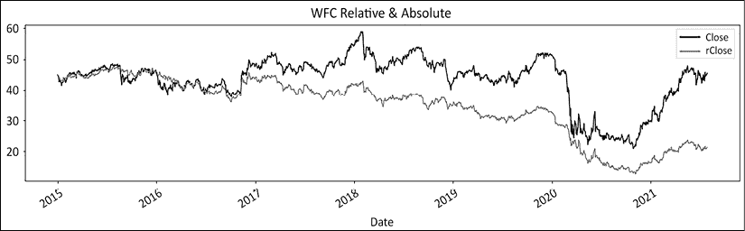

图 5.25：富国银行绝对和相对于标普 500 的情况

上述代码是我们在前面章节已经见过的重复内容。接下来，我们将运行该序列。值得注意的一点是，关于基准和货币的计算优先于单只股票的计算。如果您想在整个投资范围内运行相同的计算，只需插入一个循环以迭代股票代码。

接下来，我们将摆动检测和制度定义运行两次。首先，我们在绝对系列上运行它。在循环结束时，我们将变量重新初始化为相对系列。然后我们在相对系列上运行序列：

```py
swing_val = ['rg','Lo1','Hi1','Lo3','Hi3','clg','flr','rg_ch']
rg,rt_lo,rt_hi,slo,shi,clg,flr,rg_ch = [swing_val[s] for s in range(len(swing_val))]

for a in np.arange(0,2):    
    df = round(historical_swings(df,_o,_h,_l,_c, dist= None, hurdle= None),2)
    df = cleanup_latest_swing(df,shi,slo,rt_hi,rt_lo)
    ud, bs, bs_dt, _rt, _swg, hh_ll, hh_ll_dt = latest_swing_variables(df, 
            shi,slo,rt_hi,rt_lo,_h,_l, _c)
    vlty = round(average_true_range(df,_h,_l,_c, n= vlty_n)[hh_ll_dt],2)
    dist_vol = 5 * vlty
    _sign = test_distance(ud,bs, hh_ll, dist_vol, dist_pct)
    df = retest_swing(df, _sign, _rt, hh_ll_dt, hh_ll, _c, _swg)
    retrace_vol = 2.5 * vlty
    df = retracement_swing(df, _sign, _swg, _c, hh_ll_dt, hh_ll, vlty, retrace_vol, retrace_pct)
    stdev = df[_c].rolling(vlty_n).std(ddof=0)
    df = regime_floor_ceiling(df,_h,_l,_c,slo, shi,flr,clg,rg,rg_ch,stdev,threshold)    

    rohlc = ['rOpen','rHigh','rLow','rClose']
    _o,_h,_l,_c = [rohlc[h] for h in range(len(rohlc)) ]
    rswing_val = ['rrg','rL1','rH1','rL3','rH3','rclg','rflr','rrg_ch']
    rg,rt_lo,rt_hi,slo,shi,clg,flr,rg_ch = [rswing_val[s] for s in range(len(rswing_val))] 
```

我们之前已经解释了所有这些功能。现在，序列被打包在一个代码块中。在附录中，我们将以更加优雅的方式重新打包这一点，使用一个函数。最后，我们打印色彩缤纷的图表，以表示绝对和相对的制度：

```py
ma_st = ma_mt = ma_lt = lt_lo = lt_hi = st_lo = st_hi = 0

rg_combo = ['Close','rg','Lo3','Hi3','Lo3','Hi3','clg','flr','rg_ch']
_c,rg,lo,hi,slo,shi,clg,flr,rg_ch =[rg_combo[r] for r in range(len(rg_combo)) ]
graph_regime_combo(ticker,df,_c,rg,lo,hi,slo,shi,clg,flr,rg_ch,ma_st,ma_mt,ma_lt,lt_lo,lt_hi,st_lo,st_hi)

rrg_combo = ['rClose','rrg','rL3','rH3','rL3','rH3','rclg','rflr','rrg_ch']
_c,rg,lo,hi,slo,shi,clg,flr,rg_ch =[rrg_combo[r] for r in range(len(rrg_combo)) ]
graph_regime_combo(ticker,df,_c,rg,lo,hi,slo,shi,clg,flr,rg_ch,ma_st,ma_mt,ma_lt,lt_lo,lt_hi,st_lo,st_hi) 
```

所有其他参数都已经静音。代码将打印两个图表。我们只想查看绝对和相对的地板/天花板制度。首先，我们将打印绝对系列：

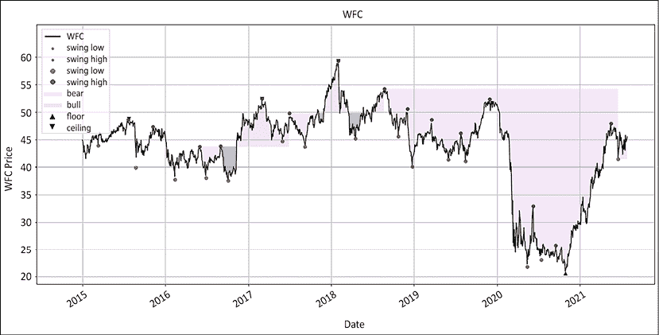

图 5.26：富国银行的绝对地板/天花板制度

这张图是一个很好的例子，因为它显示了这个制度并不是万能的。地板/天花板方法并不是对随机性的通用治疗方法。在多头阶段有亏损期。这意味着制度定义并不能替代风险管理。接下来，我们打印富国银行相对于标普 500 的情况：

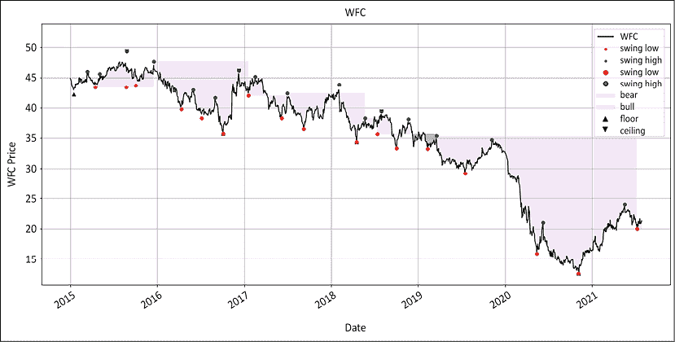

图 5.27：富国银行相对于标普 500 的地板/天花板制度

再次强调，富国银行并非长期表现不佳。它有着短暂的辉煌时刻，在夕阳下“升起和闪耀”，然后再次滑入漫长的下降。正如最后一个摆动低点所示，制度甚至可能已经转为看涨。也许这一次，超额表现可能更具可持续性。

## 在底部或顶部后时间最佳入场点的时机

> “投资者为了修正，或试图预测修正而损失的资金远远超过了修正本身的损失。”
> 
> – 彼得·林奇

第一个问题是，想要通过预期体制变化来保护自己收益的市场参与者长期来看往往会亏钱。如果有一位“专家”走到你面前说：“你下周会生病。你将生病三个月。你将在这一天痊愈。”你可能会觉得他们已经丢失了 L 码的锡箔帽子！

然而，在市场上，我们注意到这种不断的“金钱狂欢”（记住我们在*第二章*中的关键字，“关于做空的 10 个经典神话”）。市场大师擅长顶部和底部的时机。事实上，他们已经 39 次无误地掌握了最近的 2 次熊市！然而，预测顶部和底部是愚人的游戏。在底部和顶部之间有成千上万的日子。你可以错过头 50 天，仍然能抓住大行情。地板/天花板方法不会在顶峰时让你离场。它将以合理的准确度使你在可能的最高点进入空头头寸。

## 看穿基本新闻流

第二个问题出现在基本新闻流跟上市场走势时。基本信息在市场顶部看起来强劲，在市场底部看起来疲软。它报告过去的数字，如月销售额、订单等。与此同时，市场往往是前瞻性的。市场参与者会陷入“确认偏见”：他们已经拥有了他们需要加倍头寸或放弃的所有基本证据。

这种地板和天花板方法是一种客观的评估是否是时候保持乐观态度还是采取更为防御性立场的方式。这种方法有几个优点。首先，稳定性带来可靠性。例如，自 2008 年危机爆发以来的十多年里，标普 500 指数的体制只在两次转变为多头至横盘熊市。每次，不到 3 个月后，体制就恢复为多头。

将此与价格在 200 日移动平均线附近翻转了 20 多次的情况相比。这种稳定水平为市场参与者带来了更高的信心。在体制改变之前，每次回调都是一个买入机会。

这种方法还带来了清晰度。它让我们免受我们的理性愚蠢之苦。在某些时候，我们都遇到过一支股票，我们认为：“这个涨得太多了，是时候做空了。”嗯，这往往发生在多头体制的股票上。或者，我们可能会说：“这跌得太多了，是时候买入了。”这也往往发生在熊市股票上。体制带来了清晰度：买入多头并对冲，卖出空头并对冲。

## 识别转折点

地板/天花板方法的优势在于转折点。我们长期以来认为，牛市需要结束才能开始熊市，反之亦然。通过这种方法，熊市在牛市结束时开始，反之亦然。其中的微妙之处是昂贵的。它允许市场参与者在一个制度过渡到下一个制度时定位自己。

兴奋的市场参与者常常在顶峰过后仍保持乐观，而在谷底过后仍感沮丧。在我们左右耳垂之间的尖叫声中，我们常常无法听到市场悄悄地低语。

最难确定的是何时清算盈利头寸。这种方法足够强大，可以让尤利西斯系在理性的桅杆上，越过市场的塞壬。好消息是，这种方法在逻辑上是准确的。熊市在新的进展回落到地板以下时开始。牛市在新的低点保持在天花板以上时开始。

# 让市场制度决定最佳策略。

> “当你排除了一切不可能的情况，那么无论剩下的是多么不可能，都必须是真相。”
> 
> ——阿瑟·柯南·道尔

多年来，我逐渐相信绩效的两个主要决定因素是头寸规模和市场制度。交易过大可能会让你破产。交易过小则没有生意可做。其次，经验丰富的市场参与者通常有几种策略来应对不同的市场类型。

困难在于何时使用哪种策略，更重要的是何时淡化它们。这归结于制度的定义。地板/天花板方法可能会改变你交易市场的方式。

有两种类型的策略：均值回归和趋势跟踪。均值回归在范围限定的市场中效果最好。价格以一种半可预测的方式围绕均值波动。均值回归策略在趋势市场中表现不佳。趋势跟踪策略在牛市或熊市中表现良好，但在横向市场中会失去收益。

在牛市结束时，当找到天花板时，市场可以横向或熊。并非所有的夏季牛市者都会在同一天醒来穿上他们的冬季熊市服装。假设市场将会横向运行，直到“黄金交易者”（那些智商比黄金还要厚重的落后者）意识到熊市占据主导地位。相反，当找到地板时，需要时间来处理熊市的创伤经历，并为新生的牛市做好定位。

一旦找到地板或天花板，假设市场会横向运行，或者在一个范围内交易，直到有证据表明它走向熊市或恢复其牛市趋势。暂停趋势交易，开始均值回归。一旦有证据表明新的趋势出现，并且市场创出低点/高点或突破范围，重新激活趋势交易，暂停均值回归。

对于长期持有者来说，对称通常是一个陌生的概念。市场参与者都以对称为理想出发，但很快意识到他们的多头规则在空头方面表现不佳。毕竟，多头方向行动缓慢且通常安静，而空头方向则快节奏且易变。然后，他们开始制定两套规则，分别应对每一方。通常，这在两个规则同时有效且股票可能是多头或空头的最糟糕的时候发生。这通常发生在最糟糕的时候：当绩效开始下降时。绩效下降不利于清晰思考。在这一点上，市场参与者倾向于坚定信念、故事或复杂的风险管理。对称避免了冲突的规则。它要么是多头，要么是空头，绝不会两者兼而有之。

让市场制度决定策略。地板/天花板方法为每个制度变化提供了客观的起点和终点：天花板、范围和地板。一旦你知道更广泛的制度应该是看涨、看跌还是横盘，就更容易设计适合每个篮子的策略。通过正确的制度定义和头寸大小，即使是一种平庸的策略也可以有积极的优势。

# 总结

我们已经研究了几种市场制度方法，这些方法将帮助你捕捉到市场上升或下降的信号。制度突破和移动平均线交叉是趋势跟踪交易员工具箱中的基本工具。持续时间与风格一样重要，就像市场恰好奖励的内容一样。然后，我们介绍了地板/天花板方法。这种制度定义方法适用于绝对和相对系列。它是对称的，最重要的是比任何其他方法更稳定。因此，它超越了一切。

然而，制度定义方法并不是互斥的。例如，地板/天花板方法可以用于确定交易的方向，多头或空头。然后，制度突破可以用于在整理或横盘市场后进入。最后，移动平均线交叉可以用于退出持仓。

有信号是一回事。将其转化为具有强大统计优势的盈利策略是另一回事。在卖空方面没有盈利等价物的"买入并持有"心态。卖空就像综合格斗。那个腰带会索取一部分代价。因此，我们将在*第二部分，外部游戏：打造强大的交易优势*中的其余时间里努力实现这一目标；建立强大的交易优势。
