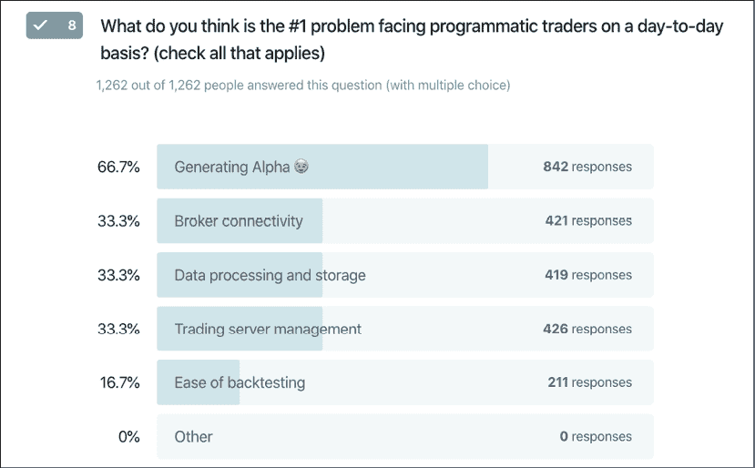
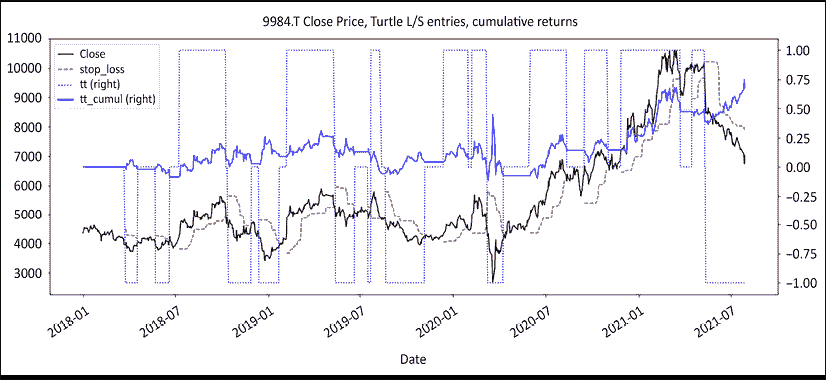
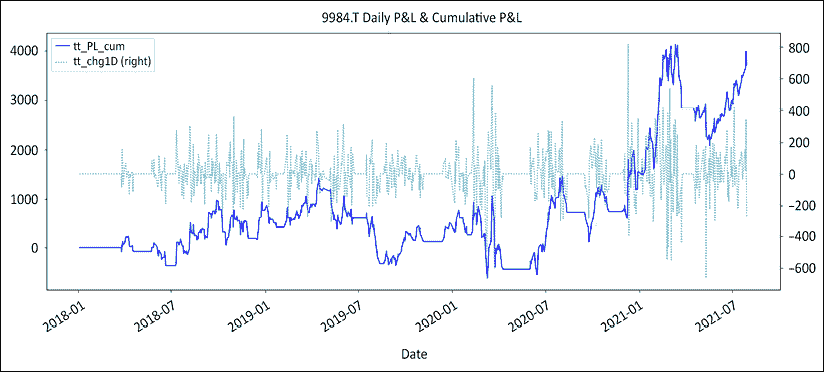
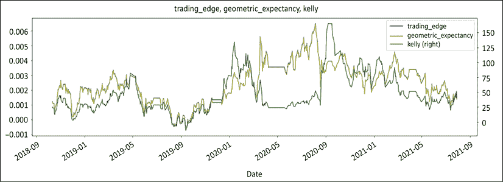
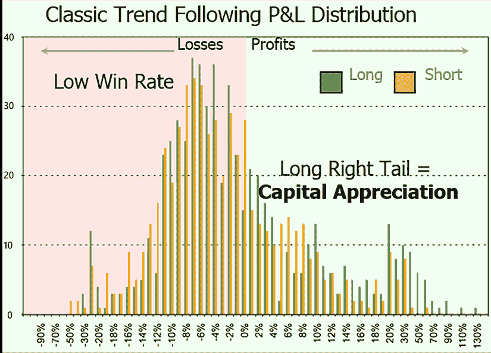
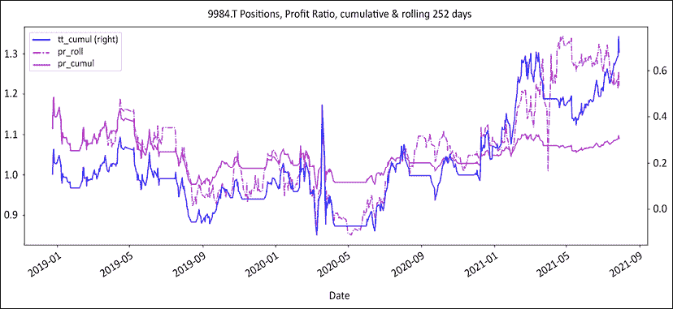
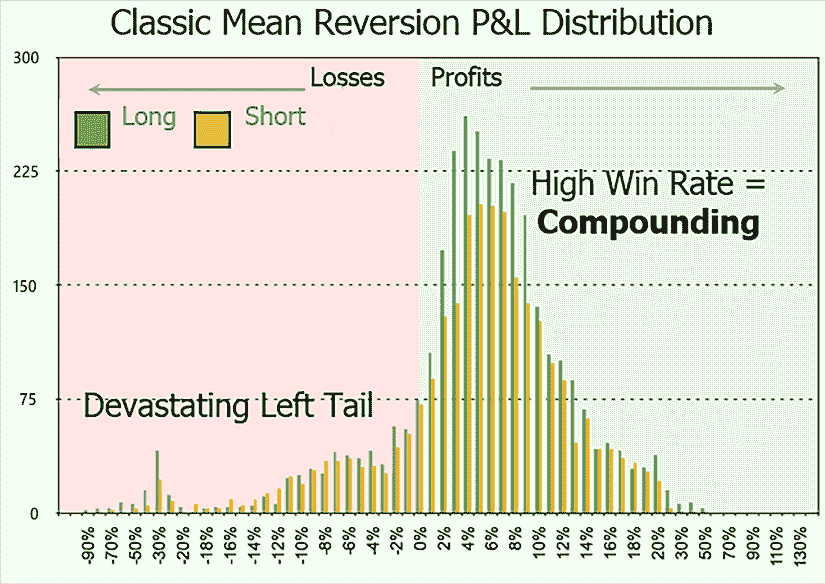
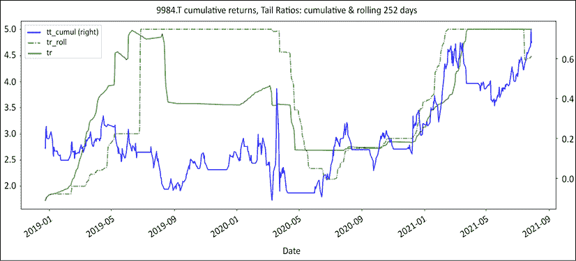

# 6

# 交易边缘是一个数字，这就是公式

在本章中，我们将揭开金融行业中最深受保护的秘密之一：帷幕后面不是一个老人，而是一个简单的公式。然后，我们将这个公式分解为两个不同的模块：信号和资金管理。

在信号模块内，我们将探讨如何计时进入和退出，以及似乎提供交易优势的两种策略类型的特性；趋势跟随和均值回归。 在 *第七章* *改善您的交易优势* 中我们将继续讨论这个问题，在 *第八章* *头寸规模：在资金管理模块中赚钱* 中我们将更深入地涉及资金管理模块。

在这个过程中，我们将涵盖以下主题：

+   导入库

+   交易边缘公式：算术和几何增益期望

+   交易优势不是一个故事

+   无论资产类别如何，都只有两种策略

您可以通过以下链接访问本章中所有图片的彩色版本：[`static.packt-cdn.com/downloads/9781801815192_ColorImages.pdf`](https://static.packt-cdn.com/downloads/9781801815192_ColorImages.pdf)。 您还可以通过该书的 GitHub 存储库访问本章的源代码：[`github.com/PacktPublishing/Algorithmic-Short-Selling-with-Python-Published-by-Packt`](https://github.com/PacktPublishing/Algorithmic-Short-Selling-with-Python-Published-by-Packt)

# 导入库

对于本章和本书的其余部分，我们将使用 `pandas`、`numpy`、`yfinance` 和 `matplotlib` 库。 所以，请记得先导入它们：

```py
# Import Libraries
import pandas as pd
import numpy as np
import yfinance as yf
%matplotlib inline
import matplotlib.pyplot as plt 
```

# 交易边缘公式

> "信息不等于知识。"
> 
> – 阿尔伯特·爱因斯坦，专利职员

谁说科幻小说没有进入严肃的金融世界？问任何对冲基金经理关于他们的优势，你将进入一个反对企业阴谋、金融福尔摩斯耐心地拼凑信息拼图的十字军世界，以及投资于下一个新的[插入下一个颠覆性技术热词……]的远见者。

交易业务中的每个人都会说你需要一种优势才能赚钱。然而，他们永远不会告诉你如何建立一个可持续的优势，可能是因为担心传播会侵蚀他们的优势。可以理解的是，交易优势一直是这种神秘的秘密调味品。

只有三种常见的边缘类型：技术、信息和统计，在接下来的几节中将被考虑。

## 技术优势

今天，任何零售交易者都可以获取比任何顶级机构投资者在 10 年前更多的信息和计算能力。任何有一点 Python 技能的人都可以从互联网上爬取数据，并通过机器学习或人工智能更快地处理它，比任何传统研究部门都快。一个与对冲基金级别相当的云基础设施成本不到 50 美元每月。任何人都可以免费在 YouTube、Quora 或任何其他学习平台上学习如何编码、分析数据、交易、投资和管理投资组合。技术已经将民主带入了金融世界。

每个人都想成为吉姆·西蒙斯，但没有人想管管道。正如*图 6.1*所示，当被问及程序化交易者面临的头号问题时，有三分之一的回答涉及数据处理和存储以及服务器管理。这表明，对于许多有抱负的算法交易者来说，主要障碍仍然是技术，他们需要一个完整的工程团队来自动化他们的交易。市场参与者需要成为专业的系统工程师，以确保持续的连接性。然后，他们必须提高他们的开发技能，编写不仅机器能够读懂，而且更重要的是人类能够读懂的代码。



图 6.1：交易自动化的瓶颈：对于许多有抱负的算法交易者来说，主要障碍仍然是技术

策略的第一次迭代就像困住米开朗基罗的大卫的石头。需要耐心的雕刻才能显现少年形象。写得不好时，解开另一个意大利文化遗产——意大利面的时间要更长。在这一切得到解决之后，市场参与者最终可以专注于设计产生阿尔法的策略。然后出现了另一套难题：缩放进出、风险管理，这本书涵盖了所有有趣的内容。将亿万美元的想法转化为无错代码仍然是一道艰巨的技术障碍。底线是，要让钱为你工作需要付出巨大的努力。

一个简单的类比可以是 Apple 1 时代的个人电脑行业。每个人都想玩太空入侵。只有极少数人愿意自己组装计算机来玩游戏。今天，每个比特币爱好者都想学习算法交易。很少有人愿意付出汗水、鲜血和泪水来建立自己的平台。这本书将为您提供构建自己策略的基础。

## 信息优势

该行业传统上一直认为信息能带来优势。这要么是特权信息，比如获得高层管理和分析师更好的对待，要么是它更阴险的表兄弟，内幕信息。任何信息优势都会很快被套利掉。

信息优势从来没有真正产生过影响。如果战胜街头所需的仅仅是更好的信息优势，那么理论上，拥有分析师议会、博士学位学校、基金经理的骄傲、交易员的谋杀、卖方研究员的漂移、经纪人的群体以及专家意见的万花筒的大型交易机构，通过速拨电话获得企业联系并有足够的资金来拯救半个大陆的能力，将会一直超越市场。实际上，尊崇的机构在记录中的每一年都远远落后于低科技、普通香草指数基金。信息只提供了一个随时间越来越快地被套利的暂时优势。信息希望被民主化。

## 统计优势

统计优势不容易被套利掉。它通过设计存在并持续存在。重要的不是你交易的“什么”，而是你交易的“如何”才重要。在接下来的章节中，我们将探讨构建强大的统计交易优势的方法。我们不会试图告诉你如何不同地挑选股票，而是如何从已经选择的股票中挤出更多的果汁。

# 交易边缘并非一个故事。

> "如果你不能衡量它，你就不能改善它。"
> 
> – 彼得·德鲁克

交易边缘并非一个故事。交易边缘是一个数字，公式由几个函数组成：

1.  算术增益期望：在执行交易员的英语中，这是你赢的次数乘以你平均赚多少减去你输的次数乘以你平均输多少。这个函数是经典的算术期望，存在于每一个初中统计学介绍中，却不在金融 MBA 中。当谈论交易优势或增益期望时，市场参与者默认使用算术增益期望。这个公式易于理解和计算。这个公式的简单性自然而然地占据了主导地位，即使对于那些不理解其复杂性的人也是如此。

    ```py
    # Expectancy formula, win_rate is your Hit ratio, avg_win is the average gain per trade, and avg_loss is the average loss per trade
    def expectancy(win_rate, avg_win, avg_loss):
        # win% * avg_win% - loss% * abs(avg_loss%) 
        return win_rate * avg_win + (1-win_rate) * avg_loss 
    ```

1.  几何增益期望（George）：利润和损失以几何方式复利。几何增益期望在数学上更接近策略的预期稳健性。

    ```py
    def george(win_rate,avg_win,avg_loss):  
        # (1+ avg_win%)** win% * (1- abs(avg_loss%)) ** loss%  -1 
        return (1+avg_win) ** win_rate * (1 + avg_loss) ** (1 - win_rate) - 1 
    ```

1.  凯利准则是一种优化投资组合几何增长率的头寸大小算法。凯利具有引人入胜的历史，始于 18 世纪的数学家丹尼尔·伯努利，由 J.L.凯利 Jr.重新发现，并由传奇人物爱德华·索普推广。凯利使用与之前期望相同的成分，但做法略有不同。

    ```py
    def kelly(win_rate,avg_win,avg_loss):  
        # Kelly = win% / abs(avg_loss%) - loss% / avg_win% 
        return win_rate / np.abs(avg_loss) - (1-win_rate) / avg_win 
    ```

在本章和下一章中，我们将使用一个基本策略来展示这些公式是如何工作的。把它看作是适用于白痴的海龟交易员。首先，我们重新利用 50/20 海龟策略来交易 Softbank（9984.T），不考虑滑点或交易成本。代码是从*第五章*，*制度定义*中回收的。首先，我们重新定义一些函数。

```py
def regime_breakout(df,_h,_l,window):
    hl =  np.where(df[_h] == df[_h].rolling(window).max(),1,
                                np.where(df[_l] == df[_l].rolling(window).min(), -1,np.nan))
    roll_hl = pd.Series(index= df.index, data= hl).fillna(method= 'ffill')
    return roll_hl

def turtle_trader(df, _h, _l, slow, fast):
    '''
    _slow: Long/Short direction
    _fast: trailing stop loss
    '''
    _slow = regime_breakout(df,_h,_l,window = slow)
    _fast = regime_breakout(df,_h,_l,window = fast)
    turtle = pd. Series(index= df.index, 
                        data = np.where(_slow == 1,np.where(_fast == 1,1,0), 
                                np.where(_slow == -1, np.where(_fast ==-1,-1,0),0)))
    return turtle 
```

然后我们通过白痴的海龟策略运行 Softbank，计算回报，并打印出两个图表。

```py
ticker = '9984.T' # Softbank
start = '2017-12-31'
end = None
df =  round(yf.download(tickers= ticker,start= start, end = end, 
                        interval = "1d",group_by = 'column',
                        auto_adjust = True, prepost = True, 
                        treads = True, proxy = None),0)
slow = 50
fast = 20 
df['tt'] = turtle_trader(df, _h= 'High', _l= 'Low', slow= slow,fast= fast)
df['stop_loss'] = np.where(df['tt'] == 1, df['Low'].rolling(fast).min(),
                    np.where(df['tt'] == -1, df['High'].rolling(fast).max(),np.nan))

df['tt_chg1D'] = df['Close'].diff() * df['tt'].shift()
df['tt_PL_cum'] = df['tt_chg1D'].cumsum()

df['tt_returns'] = df['Close'].pct_change() * df['tt'].shift()
tt_log_returns = np.log(df['Close']/df['Close'].shift()) * df['tt'].shift()
df['tt_cumul'] = tt_log_returns.cumsum().apply(np.exp) - 1 

df[['Close','stop_loss','tt','tt_cumul']].plot(secondary_y=['tt','tt_cumul'],
                                  figsize=(20,8),style= ['k','r--','b:','b'],
                       title= str(ticker)+' Close Price, Turtle L/S entries, cumulative returns')

df[['tt_PL_cum','tt_chg1D']].plot(secondary_y=['tt_chg1D'],
                                  figsize=(20,8),style= ['b','c:'],
                                 title= str(ticker) +' Daily P&L & Cumulative P&L') 
```

代码执行以下步骤：

1.  使用对数收益：对数收益比算术收益更易于处理。算术总数不会累积，而对数总数会。累积收益使用`apply(np.exp)`方法计算。

1.  策略入/出场：使用`shift()`方法延迟一个柱来进行入场和出场。

下图显示了以黑色表示的收盘价和以红色虚线表示的移动止损。在次要轴上，我们有多空头寸：空头为-1，多头为+1。实线蓝色表示累积收益：



图 6.2：Dummy 的海龟：多头和空头进出场，累积收益

这个策略似乎在其原始格式下起效果。第二张图显示了每日和累积盈亏。平线表示没有活跃头寸时：



图 6.3：Softbank 每日及累积盈亏（P&L）

接下来，我们将计算滚动利润、损失和期望值，并将它们绘制成图表。

```py
# Separate profits from losses
loss_roll = tt_log_returns.copy()
loss_roll[loss_roll > 0] = np.nan
win_roll = tt_log_returns.copy()
win_roll[win_roll < 0] = np.nan

# Calculate rolling win/loss rates and averages
window= 100
win_rate = win_roll.rolling(window).count() / window
loss_rate = loss_roll.rolling(window).count() / window
avg_win = win_roll.fillna(0).rolling(window).mean()
avg_loss = loss_roll.fillna(0).rolling(window).mean()

# Calculate expectancies
df['trading_edge'] = expectancy(win_rate,avg_win,avg_loss).fillna(method='ffill')
df['geometric_expectancy'] = george(win_rate,avg_win,avg_loss).fillna(method='ffill')
df['kelly'] = kelly(win_rate,avg_win,avg_loss).fillna(method='ffill')

df[window*2:][['trading_edge', 'geometric_expectancy', 'kelly']].plot(
    secondary_y = ['kelly'], figsize=(20,6),style=['b','y','g'], 
    title= 'trading_edge, geometric_expectancy, kelly') 
```

1.  将每日收益复制到`win_roll`和`loss_roll`中，使其具有统一长度的序列。将`win_roll`序列的损失值设为 N/A，将`loss_roll`序列的收益值设为反之。

1.  实例化窗口大小和滚动计数以计算胜率和败率。

1.  滚动求和方法不适用于缺失值。因此，我们使用`fillna(0)`方法将缺失值替换为`0`来计算移动平均值。填充数据框并绘图。



图 6.4：Softbank 滚动交易边缘，几何期望值，凯利

这个策略具有正的交易边缘，但请不要在家里尝试这个——它太简单，不能用于实际交易，仅供教育目的。图表上的这三条线是相同主题的变体。成分相同，但烹饪方式有点不同。关键是：直到盈利期望变为正数之前什么也不会发生。夏普比率、索提诺比率、詹森比率、特雷纳比率和信息比率都很好，但它们在盈利期望变为正数后才起作用。

所有这些公式都可以分解为两个模块：

+   **信号模块**：胜率/败率。这些是由入场和出场信号生成的收益。

+   **资金管理模块**：平均利润/亏损。这些是由投注大小乘以收益生成的贡献。

这揭开了交易优势的神秘面纱，将其视为可以从头开始设计的东西。市场参与者假装拥有未来的优越知识，归功于他们的分析超能力和机器学习水晶球。与此同时，赌场公开宣传随机性。然而，前者的回报是零散的，而后者每天都稳定盈利。这不是巧合。前者认为知识是一种优势，而赌场则设计他们的优势。因此，每个市场参与者的工作就是优化他们的交易优势。在接下来的几章中，我们将考虑如何设计这些模块并最大化交易优势，从信号模块开始，然后转向*第八章*中的资金管理模块和头寸大小的问题，*头寸大小：财富创造于资金管理模块中*。

所以，话不多说，让我们开始信号模块。

## 信号模块：进场和出场

> “你必须知道何时坚持，
> 
> 知道何时放弃，
> 
> 知道何时退缩，
> 
> 也要知道何时退缩。”
> 
> – 肯尼·罗杰斯，《赌徒》

让我们从温和地打击一个古典神话开始：“只要你 51%的时间是正确的，你就会赚钱。”错了。按照他们自己的说法，行业顶尖表现者拥有数十年的业绩记录，通常声称长期的赢利率并不令人印象深刻。相反，LTCM 在 2000 年解散前自豪地宣称拥有异常高的赢利率。

只要你有一个积极的交易优势，你就能赚钱。我们需要设计的第一件事就是信号模块。正如我们在*第一章*中看到的，*股票市场游戏*，假阳性是无法根除的。随机性会一直存在。每个篮子里都有一些坏苹果。关键是设计政策来发现这些坏苹果，在它们破坏篮子之前处理它们，并继续前进。

### 进场：选股被高度高估了

> “鞭打将继续，直到士气好转。”
> 
> – 布莱舰长，赏金号

股票市场是唯一一个人们喜欢在比赛开始之前颁发奖牌的竞技运动。这个行业是建立在股票选择者的崇拜之上的。每个人都喜欢谈论他们的最佳股票选择。90%的市场参与者的精力都集中在做出正确的决定上。不幸的是，同样 90%的市场参与者连续 5 年都无法击败他们的基准。

在量化交易员的行话中，这被称为相关性。当相关性在记录的每一年中持续存在时，即使只有一年，r-平方，量化术语中的*因果关系*，都会接近 1。在执行交易员的英语中，疯狂就是平均受挫的市场参与者将更多的精力和资源投入到选股中，然而年复一年地一直失败。总之，90%的市场参与者可预测地失败，因为他们一直专注于错误的事情：进场。也许是时候考虑采用不同的方法了。

根据杰里米·西格尔教授的说法，股市的长期平均回报率为+7%。这在空头方面留下了很少的空间来愉快交流。想法很廉价且充足。每个人都有一袋价值百万美元的想法。想法与利润之间的区别称为执行。正如我们在*第一部分*——*内部游戏：解密空头交易*中看到的那样，许多市场参与者在空头方面失败，因为他们是在想法萌芽时进入市场的，而不是在它们成熟可采摘时。表现不佳相当于我们吃未成熟水果时的消化不良。

本书不会给你提供银弹式的方法论。本书的目的是介绍市场的概率视角，以便你可以成为一个统计上更好的自己。这本书只是为你提供菜谱，用来处理你带到桌子上的材料。基本面、技术和量化空头都赚过钱，但他们在获得概率优势之前是不可能成功的。

有两个时机你需要注意概率：股票选择和进场。用执行交易员的术语来说，这意味着在扣动扳机之前有两个时机你应该听听市场的声音。

+   首先，你需要卖空那些处于横盘或熊市阶段的股票。在牛市中做空股票就像站在铁轨上，期待一列又一列的货运火车停下来一样。在*第五章，制度定义*中，我们学会了根据它们的制度重新分类股票的客观方法。由于做空是一个相对的游戏（股票价格下跌绝对是一种落后的指标），制度变化经常以股票市场的部门轮换的形式出现。昨日的宠儿就是明日的狗。

+   第二个需要关注概率的时机是进入市场。来自多方的市场参与者喜欢在突破时买入。但同样的逻辑在空头方面并不适用。请记住，几乎所有的市场参与者都在市场上做多。一些人一直在等待机会在市场低点买入。快速下跌的市场通常会紧随着迅速的熊市反弹。在短暂的时间内，概率会有利于空头。

    进入空头头寸的最佳时机是在熊市反弹结束时。我们将在*第三部分*——*长/短游戏：打造长/短产品*中详细讨论空头挤压的合气道。

我们之前看到了利润期望的可视化表示。在接下来的章节中，我们将研究旨在增加您交易优势的技术。它们不仅限于空头交易。有些可能不适用于你的风格或策略。

### 离场：纸上利润如何转化为真实资金

唯一会毫无退出策略地走入战场的士兵被称为神风特攻队士兵。他们不指望活着回来。因为你可能不指望你的交易看起来像自杀任务一样，所以制定退出策略的最佳时机是在你进入一个头寸之前，避免“被困住”。

在金融服务行业，比厕纸更便宜的只有回测和模拟打印输出。这只是纸上财富。没有人受到伤害。真正重要的是真金白银。让我们进一步思考这个观点。你唯一知道赚了多少“真钱”，或者亏了多少，是在交易关闭后。在那之前的一切都被称为纸面利润。底线是：退出很重要。

我们都被教导要相信我们的最初选择是最重要的。如果我们有正确的实习，从正确的大学毕业，或者选择了正确的第一份工作，那么我们的职业生涯将会一帆风顺。然而，生活就是当我们有其他计划时发生的事情。我们经常低估了运气在我们生活中的作用。在正确的时间出现在正确的地方让很多幸运的人变得富有。然而，这些人很少在第一次尝试时成功。他们尝试、失败，直到最后某件事情终于成功。

由于市场参与者喜欢买入并持有，婚姻可以说是一个合理的比喻。每段婚姻都以乐观的“从此过上幸福快乐的日子”开始，然而大约一半的婚姻最终以离婚告终。结婚很容易。离婚是一个改变人生的事件。如果在结婚前没有考虑到这一点，那么这将是情感和财务上的灾难。糟糕的婚姻可以挽救。糟糕的离婚不行。糟糕的进入可以挽救。糟糕的退出不行。这就是损益表被打印出来的时候。

你将会在接下来的章节中看到，提高你交易优势的 7 个步骤中，有 5 个与损失有关。另一个很好的类比是个人财务。你可以通过两种方式增加储蓄。要么你保持目前的开支并找份待遇更好的工作，要么你限制开支并节省差额。前者在你有稳定高薪时效果很好。

如果你的收入完全是变动的，那么你最明智的做法是保持低固定成本基础，并从市场中获得的差额放进口袋。你将获得与其他参与者一样的丰厚报酬，但不同的是你不需要它们来维持生计。在金融界的克里奥尔语中，这种对开支的关注被称为“及时止损”。

# 不论资产类别如何，只有两种策略

杰克·施瓦格经常指出并不存在普适的圣杯。市场巫师各式各样，有时甚至采取相互矛盾的策略。不过，他们有一个共同点。他们擅长管理风险和控制损失。他们始终关注下行风险。赢利头寸会自行处理。市场参与者的工作是处理失败者。

市场参与者通常通过他们交易的“什么”（资产类别、市场、时间跨度）来定义自己，而很少涉及到他们是以何种方式交易。无论资产类别如何，策略类型只有两种：趋势跟随和均值回归。只有两种策略的原因不是入场，而是出场。你如何选择结束一笔交易决定了你的主导交易风格。均值回归派在不效率得到纠正时就提前平仓。趋势跟随者喜欢乘胜追击。一个典型的例子是价值投资与成长投资。价值投资者购买低估股票，然后将接力棒交给成长投资者，由他们将股票持续走高。

例如，一个均值回归的市场参与者会以**市净率**（**PBR**）为 0.5 的价格买入一只股票，当市净率回到 1 时平仓，然后离场。而趋势跟随者会以相同的估值买入同样的股票，但会一路持有至狂喜区域。他们最终会在这只曾经默默无闻、未被充分研究的股票被列入一流投资银行的“强力买入”列表后平仓，然后可预见地表现不佳。

一些读者可能会认为价值投资者更像是均值回归类型，而成长经理更像是趋势跟随类型。这通常是正确的，但并非总是如此。最好的反例，也可能是终极价值趋势跟随者，是沃伦·巴菲特。他投资于他打算永久持有的低估企业。你的头寸不是百达翡丽手表。你不会为未来的几代人持有它们。在某个时刻，你会平仓。只有三种可能：价格上涨、下跌或不变。你要么亏损、赚钱或浪费钱。你需要为每种情况制定一个方案。你需要一个计划来实现利润，减轻损失，并处理吃白食者。我们的目标是打造一个更好的统计交易优势。如果只有两种策略类型，那么花时间了解它们的行为方式、回报和风险，以及它们是否相互排斥或兼容，就显得非常重

## 趋势跟随

> "财富在于坐等。"
> 
> – 杰西·利弗莫尔

**趋势跟随**策略依赖于少数几个大赢家的资本增值。系统化的**商品交易顾问**（**CTAs**）寻找突破点并设定保护性的追踪止损。技术分析师寻找入场点并跟随上涨。即使是基本面股票选择者也算是趋势跟随者。他们不是关注价格走势，而是关注基本面改善、盈利势头，甚至是新闻流。归根结底，无论他们是否自觉承认，市场参与者的默认模式都是趋势跟随。由于趋势跟随是市场参与者的主导模式，我们在本书中使用了一种简单的趋势跟随策略（乌龟指标）。

这就是趋势跟随者的损益分布：



图 6.5：经典的趋势跟随多空盈亏分布

我们可以观察到以下特性：

+   **低胜率**：在 30%到 50%之间。模式，交易的峰值数量，位于分布的亏损部分。对于每一家 Alphabet，Amazon 或 Apple，都有无数的 Nestcapes，Ataris 或 MySpaces。

+   **Alpha 生成**：趋势跟随策略依赖于少数赢家的资本增值来抵消众多小损失。这引入了利润随时间展开与损失迅速影响资产曲线之间的滞后。损失很快就会被处理，而赢家需要时间成熟。

+   **正偏斜**：右尾盈亏分布给出了有利的尾部比率。赢家比输家要大。上述图表是古老格言“削减你的亏损，乘着你的赢家”的视觉表现。再次强调，要实现这些超额回报需要时间。与此同时，资产曲线必须处理沿途的蛙模糊。

+   **周期性**：市场并不总是趋势性的。风格时而被青睐时而不受青睐。当一个风格不起作用时，损失开始累积。成功的趋势跟随者迅速意识到自己的错误，并使个别损失保持较小。当他们的风格受到青睐时，他们跟随趋势一直走到太阳落山处。

+   **相对较低的周转率**：周转率是周期性的函数。当市场向上或向下趋势时，没有必要做任何事情。像传奇交易员杰西·利弗莫尔曾经说过的那样，钱是在坐着等待中赚的。当一种风格不受青睐时，周转率将增加，因为会有更多的蛙被搅动。

+   **波动性**：这是周期性的结果。市场参与者经历了一段缺乏成效回报的时期。

趋势跟随者经常接触到很多蛙。风险在于所有美味蛙的累积模糊可能无法超过少数公主的公平性。趋势跟随策略的风险在于损失超过利润的总重量。

对于趋势跟随策略来说，最相关的风险度量是比较累积利润和损失。这就是赞成者杰克·施瓦格（Jack Schwager）常称之为盈利因子或盈利能力因子的盈利与损失比率。它表明，当分子中的累积利润超过损失时，该比率大于 1，反之亦然。这是算术盈利预期的另一种版本，作为比率而不是增量。

```py
def rolling_profits(returns,window):
    profit_roll = returns.copy()
    profit_roll[profit_roll < 0] = 0
    profit_roll_sum = profit_roll.rolling(window).sum().fillna(method='ffill')
    return profit_roll_sum

def rolling_losses(returns,window):
    loss_roll = returns.copy()
    loss_roll[loss_roll > 0] = 0
    loss_roll_sum = loss_roll.rolling(window).sum().fillna(method='ffill')
    return loss_roll_sum

def expanding_profits(returns): 
    profit_roll = returns.copy() 
    profit_roll[profit_roll < 0] = 0 
    profit_roll_sum = profit_roll.expanding().sum().fillna(method='ffill') 
    return profit_roll_sum 

def expanding_losses(returns): 
    loss_roll = returns.copy() 
    loss_roll[loss_roll > 0] = 0 
    loss_roll_sum =    loss_roll.expanding().sum().fillna(method='ffill') 
    return loss_roll_sum 

def profit_ratio(profits, losses):    
    pr = profits.fillna(method='ffill') / abs(losses.fillna(method='ffill'))
    return pr

window = 252
df['pr_roll'] = profit_ratio(profits= rolling_profits(returns = tt_log_returns,window = window), 
                             losses= rolling_losses(returns = tt_log_returns,window = window))
df['pr'] = profit_ratio(profits= expanding_profits(returns= tt_log_returns), 
                             losses= expanding_losses(returns = tt_log_returns))

df[window:] [['tt_cumul','pr_roll','pr'] ].plot(figsize = (20,8),secondary_y= ['tt_cumul'],
                            style = ['b','m-.','m'], 
  title = str(ticker)+' cumulative returns, Profit Ratio, cumulative &  rolling '+str(window)+' days') 
```

上述代码计算了滚动和累积盈利与损失比率。结构是对称的，所以让我们集中精力在滚动利润上。

1.  通过复制收益序列来实例化一个`profit_roll`数据框架。将损失分配为`0`。这将保留数据框架的形状。

1.  使用`rolling`方法计算滚动总和。使用`fillna`方法填充`#N/A`缺失值。

1.  从`rolling_profits`和`rolling_losses`函数中计算`profit_ratio`。

1.  `rolling` 函数后跟着累积版本。`expanding()` 方法在合成上与流行的 `cumsum()` 方法相同。唯一的区别是，当遇到缺失值时，`expanding()` 不会重置为 `0`，而 `cumsum()` 会重置为 `0`。



图 6.6：Softbank 累积回报和利润比率：滚动和累积

上图将滚动和累积利润比率与信号并列绘制在一起。随着信号的波动，利润比率急剧下降。相反，在趋势性市场中，利润比率上升。

追随趋势的策略表现出令人印象深刻但波动较大的绩效。它们经历了长时间的低迷表现，这对管理者和投资者的情绪资本产生了影响。它们的主要挑战是保持累积损失的小额化。利润只有在损失保持较小的情况下才会显得巨大。

为了说明这一现象，最初的海龟交易员之一曾经说过，以 30% 以上的胜率，他们承担了预期失败的仓位。这种微妙的心态转变使他们对风险管理更加警惕。

## 均值回归

**均值回归** 策略可以将大量小额利润累积起来。它们依赖于极端情况最终回归平均值的前提。它们套利市场的非效率。均值回归策略实质上捕捉了市场非效率修正所需的时间。例如，一份认股权证的价格可能相对于其基础股票来说便宜。随着时间的推移，价格将会趋同，并且差距将会缩小。它们通常具有低波动性、持续稳定的绩效。它们在建立的市场中表现良好：牛市、熊市或横盘市。均值回归策略的偏好市场通常是价格以半可预测方式振荡的横盘阶段。它们可能会发现牛市或熊市阶段更具挑战性，但有大量的经验数据显示有才华的管理者在这些市场中表现出色。同样，风险管理是专业人士和外行之间的分水岭。

均值回归策略在制度变化期间表现不佳。例如，在牛市中，做多高 beta、做空低 beta 将取得很好的效果，但随着制度过渡到横盘和熊市，这些策略将大幅失去收益。上一次牛市的宠儿有时会在随后的熊市中率先下跌。它们在尾部事件中也表现不佳。做空伽马基金多年来表现良好，直到在 2008 年全球金融危机期间的三周内惨遭失败。



图 6.7：经典的多空均值回归 P&L 分布

均值回归策略的特点包括：

+   **Alpha 生成**：均值回归策略具有较高的周转率。它们可以迅速积累小额利润。

+   **负偏斜**：左偏 P&L 分布。不利的尾部比率：亏损大于盈利。上述图表是时间荣耀的格言“拿利润你不会破产”（you can't go broke taking profits）的视觉表现。事实证明，如果亏损太大，你可能会破产。均值回归策略利用效率低下进行套利。当效率低下得到纠正时，交易被关闭。有时，这些效率低下会持续存在。由于最初的前提是效率低下无论如何都会得到纠正，所以不会执行止损。这导致了罕见但毁灭性的打击。

+   **高胜率**：通常超过 50%。市场并非始终在所有时间段都是高效的。

+   **中高周转率**：实际上，效率低下的情况比**有效市场假说**（**EMH**）和随后的学术理论通常建议的更频繁出现。

+   **稳定低波动小利润**：均值回归策略在稳定市场环境中利用多个小的效率低下进行套利。

+   **潜在毁灭性的左尾损失**：均值回归策略在效率得到纠正的成熟市场中表现良好。在制度变革时，过去的效率低下仍然存在时，它们失败了。有趣的是，随着均值回归策略的衰退，趋势跟随策略开始表现良好。

+   **缓慢的复苏**：均值回归策略积累小利润但产生大损失。需要很多小的胜利来抵消少数大的损失。

正如我们之前看到的，均值回归策略持续产生一致的小利润，但遭受罕见但游戏终结性的挫折。均值回归策略的风险在于尾部。几次毁灭性的损失有能力击沉船只。毕竟，泰坦尼克号的船长有 99% 的胜率。因此，最相关的风险度量是最大利润与最糟糕损失的比率，或尾部比率：

```py
def rolling_tail_ratio(cumul_returns, window, percentile,limit):
    left_tail = np.abs(cumul_returns.rolling(window).quantile(percentile))
    right_tail = cumul_returns.rolling(window).quantile(1-percentile)
    np.seterr(all='ignore')
    tail = np.maximum(np.minimum(right_tail / left_tail,limit),-limit)
    return tail

def expanding_tail_ratio(cumul_returns, percentile,limit):
    left_tail = np.abs(cumul_returns.expanding().quantile(percentile))
    right_tail = cumul_returns.expanding().quantile(1 - percentile)
    np.seterr(all='ignore')
    tail = np.maximum(np.minimum(right_tail / left_tail,limit),-limit)
    return tail

df['tr_roll'] = rolling_tail_ratio(cumul_returns= df['tt_cumul'], 
                             window= window, percentile= 0.05,limit=5)
df['tr'] = expanding_tail_ratio(cumul_returns= df['tt_cumul'], percentile= 0.05,limit=5)

df[window:] [['tt_cumul','tr_roll','tr'] ].plot(secondary_y= ['tt_cumul'],style = ['b','g-.','g'], figsize = (20,8),
    title= str(ticker)+' cumulative returns, Tail Ratios: cumulative &  rolling '+str(window)+ ' days') 
```

代码包括以下步骤：

1.  `cumul_returns`：在此函数中，`returns`是指对数收益`np.log(px/px.shift())`。使用`cumsum()`方法计算累积收益并填充缺失值。

1.  使用`quantile`方法计算滚动左尾和右尾。

1.  此系列有点跳跃——分母为 0 会返回错误，因此将错误设置为`ignore`。

1.  设置上下限以避免两侧的无限数。

所得到的图表显示了累积收益和滚动和累积尾部比率。



图 6.8：Softbank、累积收益和尾部比率：滚动和累积

正如您所看到的，我们计算了累积和滚动基础上的 5%尾部比率。正如您所看到的，尾部比率很快就会偏向无穷大或零。这就是为什么应该通过极限将其限制在范围内。请注意，尾部比率不像我们之前看到的利润比率那样反应迅速。该比率不适用于趋势跟踪策略。它的一致性非常高，以至于极限必须降低到第 5 和第 95 百分位才能看到。这说明了这些策略确实具有不同的风险特征。

# 总结

让我们回顾一下。那神秘的、神秘的、神话般的、神奇的交易优势不过是我们在学校学到的一个叫做收益期望的小公式。现在，事实证明，具有正向交易优势的策略往往分为两大类。这种情况不论时间跨度、资产类别、工具和市场阶段如何。市场参与者期待非效率性要么纠正并恢复到平均水平，要么持续并形成趋势。这些策略是互斥的。它们具有相反的回报和风险特征。

然后，我们花时间了解了每种策略类型的特性，以便我们能够想出更好的方法来设计一个更优越的交易优势。现在我们了解了这些策略的行为方式，下一步是卷起袖子，打开引擎盖，调整信号引擎。
