# 7

# 提高您的交易优势

> “我从不在最低点买入，我总是卖得太早。”
> 
> – 纳撒尼尔·德·罗斯柴尔德男爵

穿过的两人中，优赛恩·伯特和罗杰·班尼斯特都跑得很快。前者是短跑运动员。后者曾跑过一英里。同一项运动，不同的学科。这里的等价性在于你有一个主导风格：要么是均值回归，要么是趋势跟随。磨练你的交易优势的最佳方式是改进你的主导风格。第一步是从最佳策略会是什么开始，然后逐渐将你的风格朝着那个方向推进。

建立一个统计上健壮的交易优势是关于夺回控制权。你无法控制市场未来一周或一年的走向，但你完全可以控制今天你的投资组合中发生的事情。以下章节是邀请你以不同的方式思考你的主导风格以及你如何构建更好版本的交易优势。

到目前为止，我们知道交易优势有两个模块：信号和资金管理。我们也清楚地看到了趋势跟随或均值回归积极交易优势的视觉表现。接下来，我们将将**利润和损失**（**P&L**）分布分成两部分。首先，我们将介绍您可以采取的所有控制损失的步骤。然后，我们将看看您可以采取的增加利润的步骤。最后，我们将介绍一种创新的投注大小策略。

在此过程中，我们将涵盖以下主题：

+   混合交易风格

+   止损的心理学

+   止损的科学

+   提高您的交易优势的技巧

+   如何倾斜您的交易优势，如果您的主导风格是均值回归

您可以通过以下链接访问本章节中所有图片的彩色版本：<add url of online colour image pack here>。

# 混合交易风格

正如我们在*第六章*中发现的，*交易优势是一个数字，这就是公式*，均值回归策略具有负偏度。几次巨大的损失将使船沉没。趋势跟随策略具有正偏度。几个王子将弥补所有的青蛙。这两种策略都有好坏属性，可以总结在以下表格中：

|  | 均值回归 | 趋势跟随 | 混合 |
| --- | --- | --- | --- |
| 获胜率 | 高 | 低 | 高 |
| 波动率 | 低 | 高 | 低 |
| 左尾 | 长的 | 短的 | 短的 |
| 右偏 | 短的 | 长的 | 长的 |
| 偏度 | 负的 | 正的 | 正的 |

一个理想的策略将结合两种风格的积极属性，并尽量减少两种风格的缺点。它将是一个具有高胜率、低波动率和短左尾和长右尾的混合体。混合的损益分布会是这样的：

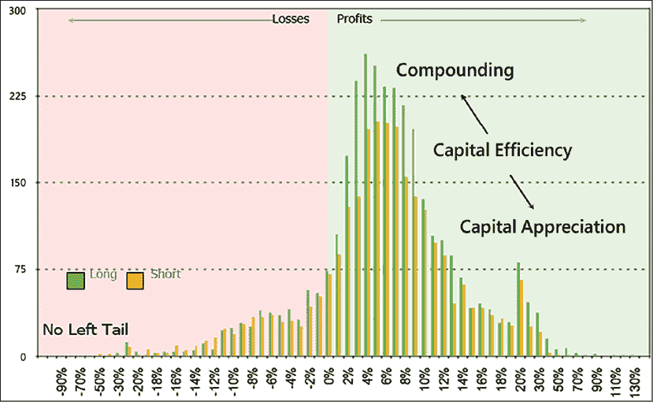

图 7.1：混合的损益分布具有高胜率和右偏

均值回归市场参与者和趋势跟随者来自不同的信念体系。前者相信效率最终会回归到平均水平，而后者则期待它们会持续存在。虽然这些信念体系是不可调和的，但仍然有可能将你的主导风格与相反体系的一些属性融合起来。

下面部分概述的技术将可持续地改善表现。然而，我们都知道，顶尖运动员与其他人的区别不在于外在的身体游戏。而是在于他们内在对话的质量，他们的内在游戏。如果我们不承认房间里的大象，那么这些技术都不会起作用。

将职业卖空者与游客区分开的是设定止损的能力，更重要的是恪守止损的坚韧。

# 止损的心理学

> "希望是一个错误。"
> 
> – 疯狂马克斯，后末日澳大利亚哲学家

单单在美国，减肥行业就价值 640 亿美元。然而，从 1999 年到 2016 年，肥胖率增加了 30%。减肥行业在商业上获得了成功，但在实践中却失败了，仅仅因为它试图解决了错误的问题。这对我们有很多关于止损心理学的教训。

我们集体肥胖的原因并不是我们摄入的食物。而是我们如何与食物相处。如果你的父母告诉你，“吃你的汉堡，它会让你变强壮”，而不是“吃那些含有致癌基因的转基因蛋白质，注入了抗生素，它们会让你心血管健康问题的风险增加三倍”，那么你可能会不那么愿意参与圣牛肉的食用。

下面的《科学美国人》报告讨论了喂食抗生素的牲畜所带来的健康风险：[`www.scientificamerican.com/article/most-us-antibiotics-fed-t/`](https://www.scientificamerican.com/article/most-us-antibiotics-fed-t/)。

市场上每个人都知道赚钱的秘诀："减少损失，坐享收益。" 减少损失并不是什么高深莫测的学问。这种数学在初中和高中之间。然而，是我们对损失的态度使得遵守止损成为难以逾越的障碍。要求正确常常凌驾于赚钱的必要性之上。

当人们说，“我不相信止损”，他们真正的意思是，“我不愿承认我错了。” 他们往往非常清楚出了什么问题。然而，他们的自尊心愿意忍受更多的痛苦，希望情况会好转，他们最终会被证明是正确的。傲慢总是优先于利润。诺贝尔奖得主丹尼尔·卡尼曼和阿莫斯·特韦斯基称我们对损失的风险寻求态度和对利润的风险规避态度为固定效应。

如果盈利等同于正确，那么从逻辑上讲，亏钱就意味着错误。因此，任何损失都直接攻击我们的自我形象。自我感觉需要是对的，但不觉得自己有义务赚钱，并且将会默认采取防御机制——否认和转移——以保护自己。这驱使我们牺牲利润，忍受长时间的剧痛，危及我们的工作、声誉，甚至我们的家庭。在自我投降之前，声誉、公司和国家都曾倒台。

底线是，过度受过教育、极度竞争和极度复杂的 40 岁对冲基金经理们仍然在潜意识中操作着一个 5 岁孩子的操作系统。他们只是更擅长制定复杂的合理化。

比尔·阿克曼和凯利安（VRX）的公开丑闻说明了自我形象优于利润的首要地位。当 VRX 从高峰下跌了 50% 时，另一种选择很简单：坚持流程或坚持股票。对其他人的钱的谨慎管理（OPM）决定关闭部分或全部头寸，因为股价必须上涨 100% 才能恢复到之前的水平。另一种选择是假设分析是正确的，但是“市场是错误的”，并且挑战市场。阿克曼先生爱国地选择了通过以 104 美元购买另外 200 万股来焚化另一批 OPM。需要正确的需求超过了对其投资者谨慎管理风险的受托责任。

随后，凯利安又一次下跌，从高峰下跌了总计 92%。在这一点上，价格必须上涨 11 倍才能打平。该头寸以每股约 11 美元清算。有时我们获胜，有时我们学习。在 2016 年致股东的信中，阿克曼先生重申了谦卑的重要性：“*要成为一名优秀的投资者，首先需要有信心，在其他人对你正在追求的机会高度怀疑的时候，投资，即使没有完美的信息。然而，这种信心必须通过谦卑来谨慎平衡，以认识到自己错了。”*

这使我们想到了我们赢家的命运。康宁曼和特沃斯基已经证明，当涉及利润时，我们是风险规避的。事实上，我们并不是天生渴望早早获利的。 *初学者的幸运* 是对低概率事件采取大风险的另一种说法，这是任何经验丰富的玩家都不敢轻举妄动的事情。我们并不是天生的风险规避者。婴儿经常摔倒。他们重新站起来，继续前进。

我们只有在经历了几次创伤性的损失之后才会变得风险规避。一旦我们经历了损失的痛苦，我们就会在我们眼前的利润开始蒸发时急于保护剩下的任何利润。如果我们从未经历过损失，我们就不会觉得有必要对利润采取风险规避措施。如果不是因为通过损失学到的痛苦教训，我们会很愿意接受风险最大的策略。底线：跑赢家然后割败者是我们的本性。

如果我们想在这场与自然的斗争中取得成功，我们需要重塑与损失的关联。只要我们保持一个以结果为导向的观点，那么自然，即我们的杏仁核，将战胜理性，即我们的前额叶皮质。

在执行交易员的英语中，只要我们认为赚钱等于做对了，而亏钱是给失败者的，我们就会找借口不去承担那些损失。我们需要将做正确的事与结果无关地正确联系起来。

这里有一个六步过程，完全改变你对止损的看法。

## 步骤 1：问责制

> “生意是一种拖延。”
> 
> – 蒂姆·费里斯

自我保护是自我的职责，不惜一切代价，无论何时。也许你现在已经得出结论，认为你对毒性自我的影响是免疫的，但却在其他市场参与者中见证了它。嗯，如果这些想法刚刚闯入你的脑海，那么你的自我刚刚在耍花招。根据丹尼尔·戈尔曼的说法，自欺是一种根深蒂固的内置机制，它掩盖了自己的踪迹。以下是两个例子，将帮助你自己看清你的潜意识有多善于欺骗你。

例子 1：上次你的投资组合出现大亏损时你做了什么？你读了每一份分析师报告吗？你拜访了公司或分析师吗？你更新了你的盈利模型吗？你了解了股票的情况，一个代指*是否受欢迎的做空*的术语？你在论坛上与同行抱怨了吗？你喝醉了，责怪别人，或者拿家人出气了吗？还是，你只是设置了止损然后继续前进？

最近关于学术拖延的研究表明，在考试之前，学生们参与了一些对大脑产生积极影响的重要活动，比如整理房间、整理桌子或给父母打电话，但没有参与像学习考试这样的必要活动。他们实践了一种心理会计：通过做好事，他们希望能弥补未做必要事情的遗憾。市场参与者也是如此。当头寸变得不利时，我们参与一些对大脑产生积极影响的任务：更新盈利模型或与分析师、专家和公司联系，但拖延不可避免的事情：割损。

示例 2：让我们用绩效的影响来看得更近一点。在我以前的一份工作中，我很幸运地能够访问几位经理的所有交易。我开始分析它们，希望从这些杰出头脑中得到一些经验教训。最大的发现是一个反直觉的游戏规则改变者。如果在每个组合中排除了三个表现最差的股票，每个经理在整个样本期内每年都将超过基准（在成本之前）。然而，如果排除了表现最好的三只股票，则不是每个人都会表现优异。此外，超额收益不会保持一致。

每一个市场参与者都曾延迟关闭一个亏损的持仓，期望价格回来再稍微涨一点就可以以更有利的报价退出。不幸的是，一天变成了一周，一个月，依此类推。坏损失不是一夜之间发生的。它们会腐烂并且溃烂。第一步是保持一个整洁的交易日志。始终牢记你的平均损失和最大损失。下次有人问起你的交易优势时，你的默认回答应该是这样的：“哪边：多头、空头还是持平？”这将避免由于你自己的自我抵抗而导致对市场事件的迟钝反应。

## 步骤 2：重塑你对损失的联想

让我们重新审视一下减肥问题。健康的饮食选择就像是卖方维护研究：索然无味且乏味。我们知道坚持节食会使我们身材更加匀称。所以，我们继续努力，减掉那些多余的赘肉。但是一旦达到减肥目标后会发生什么？绝大多数人会复发。有些人会从一种饮食转换到另一种，希望总有一天会有所突破。我们失败了，因为我们只关注了节食的身体方面：减肥。我们虽然在节食期间按部就班地做了一切，但我们忘记了教训。我们在节食期间正确地吃了适量的合适食物，但我们仍然保持着会最终导致我们重新养成不良饮食习惯的不健康联想。食物不是问题所在。通常，减肥不是身体问题，而是心理问题。

对于止损也是一样。我们在理智上理解它们的重要性。当我们经历困难时，我们会毅然割掉输家。但是接着来的是这种立场：“如果我们再给它一个机会，最多再多一个星期，它就会好转。这只是暂时的。”我们内心的白痴与我们的精神病性的另一自我——经济人——进行着谈判。最终的结论是这个例外：“就这一次，我们可以放弃止损。”接着我们知道的是，投资组合看起来就像是一片烂苹果园。只要我们将正确与在每一笔交易上盈利联系在一起，我们就是从结果导向的角度出发行事。

我们无法抵挡我们追求正确的需求，但我们可以改变我们选择追求正确的事物。与其追求金钱，我们可以将正确与坚持遵循投资过程的纪律相联系。我们从一个我们实际上无法控制的结果转变为以过程为导向的视角。

这样做有两个好处：

+   成功变得可以量化和可测量。一次交易是随机的。一百次交易是一个数据样本。试图控制个别结果是徒劳的。但完全有可能衡量对投资过程的遵循程度。好消息是，在历史上的每个文化中，尤其是在我们行业中，纪律都是一种美德。

+   欺骗的诱惑自然会消失。正确不再关乎离散系列的结果。你可以一次又一次地输钱，但仍然是对的。当你始终从这个角度出发行动时，你会在神经通路中重写，从而重塑你的身份。

一个更先进的版本是将这种过程性思维变成游戏化。这里有一个小故事。2012 年底，首相安倍晋三决定振兴日本经济。市场环境立即从沉闷的熊市变为狂热的牛市。每次一只股票触及止损点，我就会在 YouTube 上播放詹姆斯·布朗的*I Feel Good*的前奏，并做一些《早安，越南》中罗宾·威廉斯的模仿。有一次，一位同事走到我跟前说：“你真的喜欢詹姆斯·布朗，是吗？”我的回答是：“嗯，我今天刚刚止损了。”

这个轶事可能有些傻，但其中确实有一点科学性。大脑讨厌接受止损。它也渴望即时满足。那个小小的铃声带来了多巴胺的冲击。随着时间的推移，它压倒了对遵守止损的不情愿，并重新塑造了与损失的关联。到了第 30 次连续止损时，我已经免疫了，可以毫不费力地接受接下来的一百次。尝试并自己看看。从小处开始。在执行止损后立即奖励自己。经过几轮后，你可能会注意到你的大脑已经开始渴望止损。你大脑中的原始部分会为了它的多巴胺冲击而做任何事情。你的任务是找出将奖励附加到什么上面。

纪律的资金管理应该像牙齿保健一样无聊。人们很少会对使用牙线感到兴奋。然而，大脑渴望兴奋和新奇。因此，如果没有乐趣，要建立起持久的习惯就很困难。建立良好基金管理习惯的一种方法是引入奖励。以下是实践中如何做到的：

1.  每周或每月评估你对系统的遵循程度。

1.  决定一个让你感觉良好的奖励。可以是任何东西。例如，我的第一个对冲基金的负责人会买一瓶葡萄酒，其价格与累积表现相关。每个人都期待着那个星期五的释放压力。

1.  每次打破你的最高分，立即奖励自己。

游戏化轻松地完成两件事。它使我们参与有利可图的活动，并驱使我们打破自己的最高分。

## 第三步：何时设置止损

婚姻合同之所以被称为婚前协议而不是婚后协议，是有原因的。当我们进入一个头寸时，情绪就会涌现出来。我们不再是旁观者。我们在比赛中，而我们内心的白痴在驾驶座上。设置止损的最佳时间是在进入交易前五分钟。其次，风险预算决定头寸大小。止损是方程中的一个变量。如果你不限制自己可以承受的损失，你很可能会损失比你应该损失的更多。

止损不是一个故事。一些自由裁量市场参与者声称，当故事改变时，他们会改变自己的观点。问题在于，我们不是公正的裁判。我们始终努力使我们的行动与我们的信念一致。当我们的行动不再与我们的思想匹配时，不适感就会产生。这被称为*认知失调*。我们只剩下一个简单的选择：调整我们的行动与我们的信念一致，或者改变我们的观点以适应新的事实。虽然前者是逻辑的选择，但我们遗憾地经常选择后者。当价格对我们不利时，更容易的选择是改变我们告诉自己的故事。到故事改变的时候，我们最初的论点早已走上了错误的发展道路。这种现象的一个简单表现是我们对亏损头寸的态度。我们知道大约一半的交易会失败，但情感上我们却表现得好像我们必须始终 100%正确一样。在执行交易员的英语中，这被称为傲慢。

对于自由裁量市场参与者的一个有效的引导是在交易开始时为每笔交易分配一个预算。超出该预算后，承诺将头寸减半。如果交易随后成功，利润将补偿已实现的损失。如果它继续恶化，处理一个小头寸比处理一个高风险头寸更容易。止损是一个预算管理的练习。因此，它是一个价格。承诺将其与入场成本和价格一起写下来。不要相信你的大脑来记分。你内心的白痴会重新协商并欺骗你犯下愚蠢的错误。

## 第四步：预先尸体检查：对过度自信的疫苗

后事分析是金融服务业的一个热门话题。在金融业中，它通常指的是管理层用事后完美的远见通过你的过去交易的官僚化过程。如果这本书有两个主要观点，那么预后事分析应该是其中之一。预后事分析是过度自信的最终解药。预后事分析是由心理学家加里·克莱因发明的一种技术，它涉及向前移动时间，并将你即将做出的决定想象成以失败告终。

乐观主义通常在进入前达到顶峰。没有人在自豪地走向祭坛时会想到离婚。当我们下订单时，我们内心的白痴会唱一些有毒的合理化歌曲，比如：“当然它会是一笔赢家，否则，我为什么要做那笔交易呢？我是那么愚蠢吗？”不幸的是，冷酷的统计现实证实了我们的确是那么愚蠢的。即使我们的长期胜率低于 50%，我们也会像每笔交易都会是赢家一样预测行动。

对每一笔交易都要进行这个练习：在下订单之前，想象它将是一笔必须止损的失败者。想象自己在亏损时关闭交易。感受到你的情感资本流失。用你所有的感官使这个想象尽可能生动：嘴里有一股苦味，视野狭窄，手心出汗，无助，内心对话致命。那么，你会怎么做呢？调整你的仓位大小并发送订单。这种技术可能看起来是自虐的，但它完成了两件事：

+   它确保保守的仓位控制：如果你进入一笔交易时预计会失败，你将会下更小的注。你也会远离流动性不佳的股票选择。你将成为更好的风险管理者。

+   它让我们预先处理我们的悲伤。我们通常期望交易成功。当它们失败时，我们会以清算的方式来悲伤。遵循伊丽莎白·库伯·罗斯的经典五个悲伤阶段，我们花费时间、精力和金钱与不可避免的东西讨价还价。如果你做一笔交易时期望它成功而它却没有，这会加强学习的无助感。如果你期望每一笔交易都会失败，那些成功的交易将是愉快的惊喜。那些失败的交易将如期执行。因此，预后事分析消除了情绪的负担。提前包装你的悲伤使你对损失更加精确。

就像快乐生活的秘诀是将死亡视为每天的伴侣一样，市场赚钱的悖论是接受损失并继续前行。

## 第五步：执行止损：原谅我们的错误

> “痛苦是必然的，受苦是可选的。”
> 
> – 兰德·豪威尔

止损就像任何其他交易一样。然而，我们赋予它的意义可能是毁灭性的。每当你因为止损而责备自己时，你都在剥夺自己的教训。

最近关于自我原谅的研究表明，那些被教授了自我原谅技巧的学生提高了他们的学习能力，并随着时间的推移表现得更好。当他们越过自己的界限时，原谅自己的人往往会从自己的错误中学习。而那些不原谅自己的人则否认了从错误中学习的好处。悖论在于，通过惩罚我们的过失，我们将自己置于重复错误的命运中。相反，要对自己好一点。像对待你的孩子一样安慰自己。

这就是它的帮助之处：

+   你原谅自己越多，执行止损就会变得越不可怕。

+   执行止损越容易，开新头寸就越容易。

+   执行越顺利，表现越好。

底线：原谅你的错误，你将成为更好的投资组合经理，并更擅长忍受市场的艰辛。

## 第六步：蔡格尼克效应对我们执行止损的启示

布鲁玛·蔡格尼克是 20 世纪初在维也纳生活的一位心理学家。当她正在享受咖啡时，她注意到一名服务员可以以惊人的准确度记住所有顾客的订单。在回家的路上，她意识到自己忘记了围巾，于是回到了那个地方。然而，尽管这名服务员可以轻松地记住所有未完成的订单，但他却不记得半个小时前见过她。这让她对我们的大脑如何处理未完成的任务有了重大发现。未完成的事情（在这种情况下，是一个未完成的订单）往往在我们的脑海中挥之不去，而已完成的任务（已支付并离开的顾客）很快就被遗忘了。

在任何时候，我们的投资组合都会有问题儿童。它们总是占据着比它们应得的更多的心理空间。它们总是挥之不去，直到我们最终鼓起勇气将它们踢出去。现在，你有没有注意到一两个星期后，你几乎不能记住那些让你如此困扰的职位的名字？这就是被应用于投资组合管理的蔡格尼克效应：眼不见，心不烦。迅速处理问题儿童能够实现两件事情：保护你的财务资本免受进一步侵蚀。更重要的是，它释放了心理空间，并保护你的情感资本免于螺旋式的自我责备。

蔡格尼克效应是执行止损的强大动力。你最不希望的就是让小损失恶化成全面的大失误。执行止损从来都不是一个容易的决定。如果你回顾一路上的所有损失，你可以安全地得出结论：没有发生灾难性的事情。事实上，你还在那里，部分是因为你做出了那些艰难的决定。所以，下次你犹豫不决时，告诉自己，现在可能看起来很困难，但你会克服它，并在下周感到清爽。

现在我们已经提升了内在游戏，让我们努力提高外在游戏，并使那些统计数据看起来不错！

# 止损科学

> “利润只有在损失保持得足够小的情况下才显得可观。”
> 
> – 迈克尔·马丁

大多数市场参与者都对损失对底线的伤害有一些模糊的概念。他们从未真正将损失的影响形象化。损失对你起着几何级数的负面作用。50%的回撤意味着你需要实现 100%的利润才能回到盈亏平衡点。举例来说：有人以 100 的价格买入一支股票。你另一边接手交易并将其降至 50。游客一直持有，因为长期故事仍然完整。那个固执的业余者将不得不达到 100%的利润才能回到盈亏平衡点。

下面这张看似无害的图表展示了一个足以说服任何理性市场参与者的强大信息，那就是保持损失小是唯一的选择。下方线条表示从峰值到-90%的回撤。上方线条表示恢复这些回撤所需的百分比增长。在-10%的回撤情况下，账户必须增长 11.2%才能回到原点。在-20%时，需要增长 25%才能弥补损失。在-90%时，需要 10 倍的增长才能弥补损失。因此，我们接下来将看到的大多数技巧都与损失有关，这些损失会几何级地减少账户余额。下次你想要抱住一个失败者不放时，拉起这张图表提醒自己：为了证明自己是对的而付出的代价就是破产：

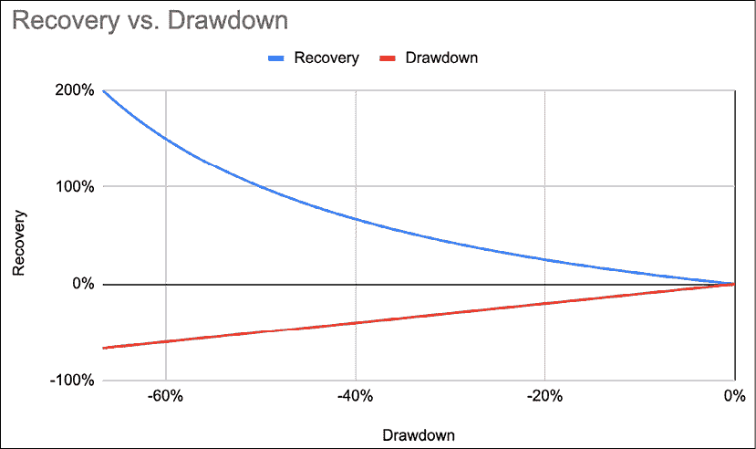

图 7.2：回撤水平和恢复损失所需的百分比增益

能够设定和遵守止损是专业空头卖方和游客之间的区别所在。学会如何设置止损以最小化回旋和最大化风险-回报需要实践。需要谦卑和勇气在止损被触发后仍然继续下一笔交易。

止损是交易边缘公式中最重要的变量。它直接影响三个变量：获胜率％、亏损率％和平均亏损％。相比之下，入场直接影响这些变量中的任何一个。止损还在赌注大小和交易频率方面起着至关重要的作用：止损越紧，下注越大，但交易频率也越高。

市场参与者有时对止损持怀疑态度。然而，止损就像寿司刀一样。如果你不知道如何使用它们，你会割伤自己。在正常情况下，没有人会因自己的不慎而责怪一把寿司刀。同样地，只有那些没有做好功课的游客才会用止损割伤自己。以下是三个简单的原则。

## 止损是一个逻辑的信号干扰问题

止损被广泛误解。它们不是日常交易决策的一部分。等待止损被触发是一种高度低效的退出头寸的方式。你不希望你的安全气囊在每个红灯处都爆炸。理想情况下，你希望在止损被触发之前减少、退出或者甚至反向头寸。

把止损看作信号，把波动性看作噪音。如果你把信号放在噪音带内，你所得到的只会是噪音。市场是喧闹的。通常在主要变动之前会有几次虚假启动。如果你把止损放在波动性带内，你可能会在几次振荡后才做出正确的决定。这将迅速侵蚀你的资本基础。你需要大幅度的变动来弥补之前的小损失。

你希望把止损设置在一个明确的信号点上，表明你的假设被否定了，或者在另一方面可能有有效的进入点。这可以通过波动性测量，如**平均真实范围**（**ATR**）或标准偏差来完成。这些信号也可以是逻辑转折，如略高于或略低于高/低点的几个买入/卖出点。

## 止损是一个统计问题

新手交易者喜欢保护他们的利润，因此他们设置紧密的止损。止损越紧，距离止损的距离就越小，因此对于相同的风险预算来说可以承担更大的仓位。这导致了较大的平均仓位大小和较低的平均亏损，但是高的败率。紧密的止损往往很容易触发。这也会增加交易频率。失败来自于小损失的积累。例如，如果需要三次尝试才能做对，那么价格必须移动三倍的距离才能维持正的**盈利期望值**（**GE**）。

老手交易者享受到了一个良好睡眠的特权。他们已经了解到市场需要活动空间。他们将止损设置得更宽松一些。这导致了较小的平均仓位大小，较大的平均亏损，更高的胜率，较低的败率和较低的交易频率。下表总结了止损对 GE 的影响：

|  | 紧密 | 宽松 |
| --- | --- | --- |
| 胜率 | 较低 | 较高 |
| 亏损率 | 较高 | 较低 |
| 交易频率 | 较高 | 较低 |
| 仓位大小 | 较大 | 较小 |

在 GE 方程中，止损是迄今为止最重要的变量。了解如何设置止损将对任何策略产生巨大影响。相比之下，选股（即进入市场）只对胜率和败率产生间接影响。

故事的寓意是：给市场足够的活动空间，但不要给它太多的逃跑空间。可能存在一个数学上的最优解，但市场条件随时间而变化。波动性并不均匀。

## 止损是一个预算问题

止损用于计算仓位大小。距离入场成本越远，仓位越小，反之亦然。这将对绩效、波动性和股票选择产生影响。

宽止损将导致小仓位。这些将产生较低的绩效和较低的波动性。波动性较高的股票往往具有较宽的止损，这导致了小仓位。当是时候根据仓位大小对信号进行排名以分配资本时，低波动性股票将被系统地优先考虑。

当从长位置转换到短位置时，可以预期市场会有一些阻力。将止损设置在一个能够使你的论点无效的水平上，相当于采取了一个小的试探性立场。如果事情没有按计划进行，损失将是最小的。如果成功，这个小立场将为后续的行动提供资金支持。

# 提高交易优势的技巧

接下来，我们将介绍提高交易优势的技巧，这是本章的主要焦点。我们将从考虑如何缩短左尾并将损失峰值接近盈亏平衡开始。

## 技巧 1：两段论游戏：如何削减失败者、抓住赢家，并在提高交易优势的同时保持信念

在世界上每个医院都有一个不成文的规定：外科医生不应该给自己的家人做手术。当涉及到自己的孩子时，就不存在专业的超然态度。然而，在投资领域，基本的离散市场参与者对止损的概念感到困惑。

他们不断被要求捍卫他们的信念，但期望对他们的损失进行外科手术般的处理。他们被迫失去中立性，但仍需要保持专业的超然态度。如果他们想掌握做空游戏，离散的参与者将不得不克服他们的不情愿。

这个强大的技巧将帮助你实现不可能的事情：削减失败者、运行赢家、保持信念，同时机械地提高交易优势。它专门为在止损概念上苦苦挣扎的离散市场参与者设计。

处理今天的失败者比预测明天的赢家容易得多。只要将失败者保持在赢家总和以下，通用电气就保持为正面。如果你将那些失去一半平均贡献的失败者减半，机械地说，你就赢了。在实践中，这就是做法：

1.  将所有仓位分为贡献者和负面因素。

1.  计算总体平均贡献或平均利润。市场参与者如果具有异常长的右尾，可能希望使用中位数而不是均值。

1.  一旦失去了平均贡献的一半，将所有负面因素的权重减半。

对于剩余的持仓，只有两种情况会发生：

1.  股票扭转并开始贡献。这将抵消损失。加入新的交易。

1.  仓位继续受到伤害。它们只会减半地减少并减半地加速。更重要的是，对于小仓位比大仓位更容易保持临床分离。

“两个部分的游戏”为基本投资中最古老的问题提供了一个简单而优雅的解决方案。坚持和顽固之间有着微妙的界限。投资者希望经理有信念。然而，他们不原谅固执。海上的英勇不在他们的家谱中。他们不想和船一起沉没。 “两个部分的游戏”调和了对信念的需求和如果一个头寸开始造成伤害则需要采取行动的需求。你通过保留一部分头寸展示了信念，同时通过减少风险展示了谦卑。

其次，这种方法遵循绩效循环。当你的风格有效时，你的平均利润增加。你可以承担更多风险，增加头寸并容忍更大的损失。当你的风格不受欢迎时，平均利润缩小，从而允许更小的损失，即更小的头寸。

第三，交易优势机械性地得到改善：损失相对于利润更小。这种方法将损失分布倾斜到右侧。它将损失交易的模式，即赔钱交易的高峰，推向了接近平衡点。在执行交易员的英语中，当利润减少时，要更快地缩小损失。最后，它改变了“正确”的定义。这不再是对每个单独想法的盈利的二元结果。正确就是遵守一个将导致更高总体盈利的过程。简而言之，它不再触发战斗、逃跑或冻结本能，而是激活思考大脑。通过这种方式，这个“两个部分的游戏”减少了压力并提高了盈利能力。

## 技巧 2：通过移动止损减少损失

> “你应该始终有一个最糟糕的点。唯一的选择应该是更快地出局。”
> 
> – 理查德·丹尼斯，海龟养殖者

进入后，头寸最脆弱。盈利交易需要时间成熟。与此同时，不盈利的交易通常很快崩溃。这种时间差导致账户余额的侵蚀。你可能无法减少假阳性的数量，但仍然可以通过在达到止损之前插入损失缓解退出来限制损失。这就是移动止损的地方派上用场。移动止损是随着价格移动的移动止损。它有两个目标：

1.  当价格有利地移动时，减少风险。

1.  当价格开始朝着另一个方向移动时，尽量少地返还利润。

跟踪止损不是万灵药。它们对于保护利润是有效的，但对于捕捉长期趋势是适得其反的。这在空头方面尤其如此。跟踪止损可能会在市场恢复其下行趋势之前过早地使你退出头寸。跟踪止损应该被审慎使用，以在交易最脆弱时迅速降低风险。这里的目标是利用每一次有利的价格波动来降低风险。这可能会对胜率产生不利影响，但会导致较低的平均损失和较小的累计损失。这将使损失模式更接近于持平。

让我们用一个数值例子来说明逻辑止损对头寸规模、损失缓解、交易优势和整体权益曲线的影响。假设市场在 100 处再次打印本地高点，低于 108 的历史高点。这看起来像一个顶部。当前价格水平约为 98。你决定进入空头头寸。

让我们起草一个标准的战斗计划：

1.  在顶部设置固定止损：如果市场触及历史高点，那显然是看涨的。

1.  设置跟踪止损：作为一名经验丰富的交易员，你预计 100 的高点会再次被测试，因此你将跟踪止损初始化为 101，略高于本地高点。

1.  选择止损来计算你的头寸规模：你可以选择固定止损和跟踪止损来计算你的头寸规模。

1.  计算你的头寸规模：你当前的头寸规模算法给出了一个 10 万美元的风险预算，除以到止损的距离得到一定数量的股票。我们将在下一章详细考虑头寸规模。

1.  设置风险降低的目标价格：你在打印后检测到了本地高点，考虑到滑点和交易成本，你的平均价格为 98。你设置了目标价格为 95，在该价格退出 3/4 的头寸（以维持正面期望），并让剩余的头寸免于风险。如果市场出现强劲反弹，你仍有时间进行平仓。

现在，让我们选择哪种止损来锚定你的头寸规模。情况 1、2 和 3 依赖于相同的信号。情况 1 假设信号有效，并将持有头寸直到被证明错误。情况 2 使用跟踪止损激进地获取利润。情况 3 假设信号是正确的，但预计会出现突然反转：

+   情况 1：无跟踪止损：你将止损设置为 108：空头 10,000 股。你假设其中任何波动都是噪音，不想频繁交易。

+   情况 2：激进的跟踪止损：你从 101 跟踪止损计算你的头寸规模：空头 33,000 股。你假设信号足够有效，并希望尽可能多地捕获利润。

+   Case 3: 探索性头寸：你从 108 计算头寸大小，但在 101 设置了一个追踪止损：空仓 10,000 股。 由于没有太多证据表明市场已经转为熊市，作为一名谨慎的风险管理者，你使用固定止损来计算头寸大小，但使用追踪止损来保护你的资本基础。

可以说，大多数市场参与者会选择案例 1 或案例 2。 要么设定一个止损并让头寸自然运行，要么操作交易，这是两个明显的选择。 假设你的入场价是 98。 现在我们已经设定好了，让我们来看看价格走势。 市场在下跌到 96 之前很好地保持，然后改变主意，决定突破 108 的水平。 追踪止损已经下移至 99，因此在案例 2 和案例 3 中，你在 99 处平仓。 在案例 1 中，你在 108 处平仓。

|  | 案例 1 | 案例 2 | 案例 3 |
| --- | --- | --- | --- |
| 风险预算 | 100,000 | 100,000 | 100,000 |
| 成本 | 98 | 98 | 98 |
| 位置止损 | 108 | 101 | 108 |
| 股票数量 | -10,000 | -33,333 | -10,000 |
| 退出价格 | 108 | 99 | 99 |
| 盈亏 | -100,000 | -33,333 | -10,000 |

让我们分析所有情况：

+   Case 1: 这是基本情况。 信号实际上是一个假阳性。 有得必有失，人生如此。

+   Case 2: 在从追踪止损计算头寸大小时，止损实际上锚定在噪音带内。 这是对信号的统计有效性和市场体制的假设。 对于策略有效，市场必须下跌。 如果市场横盘交易，将会有很多失败的尝试，这些尝试的累积效果会侵蚀资本基础。

+   案例 3：首先，固定止损设置在一个逻辑位置。 如果价格创出新高，那么市场显然已经决定重新进入牛市领域。 这与案例 1 一致。 其次，当头寸最脆弱时，追踪止损保护头寸。 每次有利的价格变动都会降低风险。 当它不起作用时，大部分风险会被结晶为接近盈亏平衡的小损失。 它不会像案例 1 那样发展成全面损失。 第三，在针对上限确定头寸大小时，你实际上已经采取了一个小的探索性头寸。 你已经在桌子上放了一枚筹码，但你还没有准备好叫市场的底牌。 如果它正确地检测到趋势，初始头寸可以被补充。 如果不是，损失将受到控制。 案例 3 是处理随机性并保护资本的有效方式。 相比之下，在案例 2 中，每次失败的尝试都会损害你的资本。 案例 2 正是趋势跟随者最终在横盘市场中放弃收益的原因。

这里没有对与错。目标不是给你提供一种可以简单编码的策略，而是让你以盈亏分布的方式思考。前面的例子只是处理随机性的众多方式之一，即减少误判的拖累。目标是尽可能地将损失峰值靠近保本点。对于自由裁量市场参与者，未来章节概述的“两个部分的游戏”是一种系统化的方法，可以将损失保持在较小水平，以换取利润。

## 技巧 3：两个部分的游戏：时间退出和如何减少免费骑车者

如果你是一栋建筑的房东，你会允许一些租户免租吗？几个月拖欠租金后，你会赶走那些不付费的人，因为这会损害盈利能力。这种常识性方法并不适用于股票市场。每个投资组合都有其一定比例的存量持仓，它们拖欠租金。

一个经典的误解是，绩效下滑是因为几次大的灾难。深入分析揭示了许多免费乘客的累积权重给绩效带来了拖累，最终未能弥补几次打击。一个“次优的α”经常发生是因为一堆“曾经是英雄”的人仍然阻塞着投资组合。

最常见的类型是“曾经我们是战士”的老兵。他们曾经做出过贡献，但已经有一段时间没有进展了。由于嵌入式的盈亏和情感依恋，他们特别难以发现。这是固定偏见的一个有趣且可以争议的表现。当入场成本远离当前价格时，我们会将当前平淡的回报视为暂时的。在许多情况下，我们应该对投资组合中的所有股票保持这种冷静。然而，同样的“放任自流”的态度会滋生危险的自满。市场参与者有时最终会在采取行动之前将大量纸币利润退还出去。

一个简单的解决方案是引入时间加权收益。如果一只股票在一段时间内未能赚取应有的回报，其权重应该降低。这是一个简单的三步过程：

1.  决定持续时间。犹豫时，计算年度周转率并除以 3，取第一个三分之一作为持续时间。例如，周转率为 1 将产生一个 4 个月的期间。

1.  计算第 1 步期间的股票回报（而不是绩效归因）。将其分成四个四分位数。关注第三个四分位数。第一和第四个四分位数脱颖而出。所以，无论如何都会处理它们。第二个四分位数的股票不是出色的贡献者，但它们仍然支付租金。第三个四分位数的股票问题在于它们并不显著。它们是慢慢拖累绩效的死钱。

1.  将第三个四分位数中所有股票的权重减半。复杂的规则容易违反。所以，保持简单：没有贡献，将分配减半。

其后可能会发生两件事情：

1.  股票重新表现：添加一个新的分段。

1.  股票持续低迷甚至表现不佳。实现利润将显得先见之明。处理一个更小的仓位总是更容易的。

将你的投资组合想象成你的房子。你在一个地方居住的时间越长，你就会随着时间累积更多的东西。总会有一些小东西你因为感情上的价值而留着。例如，如果你对你那件宽大的老大学毛衣有迷信或者感情依恋，那么很可能你在职业上也是一位“感情价值”投资者。股票在投资组合中停留的时间越长，它们就越粘稠。我们内心的白痴总是会找到各种理由来用心理捷径来合理化旧仓位，比如“我要买什么替代品？”或者“这个股票一直表现得非常好，它会回来的。” 这个游戏提供了克服最初的不情愿的客观规则。第一步总是最难的。一次减少陈旧仓位将使下次处理它变得更容易。

其次，它使投资组合流动起来。正如市场格言所说，“你的下一个想法决定了你的成败。”强制性地将陈旧仓位清除出去，为新想法腾出空间。受**先进先出**（**FIFO**）规则约束的市场参与者自然不愿意放弃旧仓位。处理陈旧仓位的另一种方法是使用期权策略覆盖基础现金头寸。请记住，随着时间的推移，你会经常犯错，所以处理今天的亏损将使明天的利润看起来更大。赢家自会照顾自己。你的工作是照顾失败者。现在我们已经处理了分配的失败一侧，接下来我们将考虑方程式的利润一侧。

## 技巧 4：利润方面：通过获取小利润来降低风险并复利回报

> "George，你就这点本事吗？"
> 
> —— 穆罕默德·阿里，史上最伟大的拳击手

减少仓位以减少风险的想法对于来自多方的市场参与者来说有些陌生。他们希望通过“起起落落”来持有获利头寸。在空方， “起起落落”被称为熊市反弹和空头压力。有一天，市场参与者舒适地坐在空头上，用巴里·怀特（Barry White）浑厚的男中音声音哼着“永不放弃”。

第二天，他们被迫在脚尖上喘气，用巴里·吉布（Barry Gibb）尖细的假声音哼着“保持活力”。接下来的技巧将进一步超越免疫熊市反弹。与游客空头卖方不同，这项技术将教会你如何欢迎空头压力。

如果你不从中获利，当不可避免的熊市反弹来临时，你的心理状态将处于不利地位。利润将迅速蒸发，你内心的白痴会骗你去平仓以保护剩下的任何利润。这样做，空头平仓将为反弹增加燃料，从而导致不利的执行。另一方面，如果你提前减少风险敞口，你将处于更好的位置来应对反弹。你已经实现了一些利润，减少了你的风险，即使它达到了你的原始止损，你也保证了交易的盈亏平衡。你的情感资本的损耗与职位规模成正比。现在，你有银行里的钱。你有一个几乎没有影响 P&L 的小赌注，可能会为随后的活动提供资金支持。

提前收益可能会减少风险，但也会大大削减利润潜力。与此同时，被止损的交易每次都会造成一个完整的风险单位。如果做得不好，GE 注定会迅速变得负面。

让我们回到 GE 来解决这个方程：

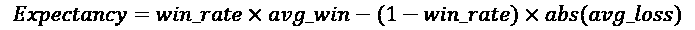

接下来，让我们去掉胜率和亏损率，只关注盈亏平衡，当*R = 成本 – 止损*，*X = 价格 – 成本*，*N = 要关闭的职位的比例*时：

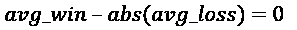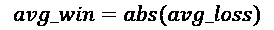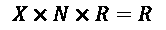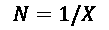

为了达到盈亏平衡，需要关闭的职位部分是成本到止损的距离的倒数（以 R 表示）。

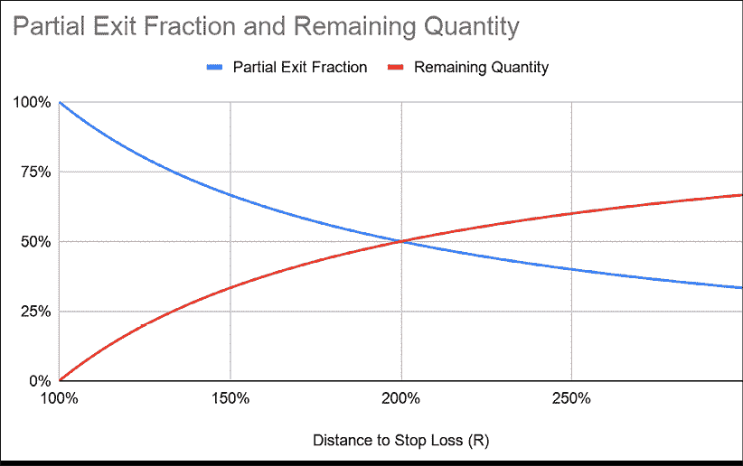

图 7.3：价格向有利方向移动时需要关闭的职位的比例

简单来说，职位越早被减少，需要关闭的部分就越大，反之亦然。然后它变成了与机会的舞蹈：我们应该让职位运行更长时间，还是在我们可以的时候兑现？当我们使用这种分数退出重新引入胜率时，GE 方程现在看起来是这样的：

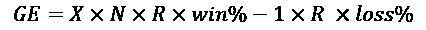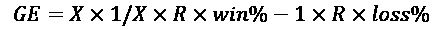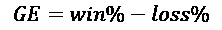

我们最初删除了*胜率*和*亏损率*以集中精力于盈亏平衡。这只是说，职位越早关闭，剩下的部分就越小。现在，市场并不总是对参与者友好。把每个职位看作两个独立的交易：一个大的优惠券和一个小的彩票。第一笔交易需要有一个大于 50%的高概率。它的持续时间和距离都很短。第二个是无风险的彩票。有时它会永远持续下去，有时会以成本关闭。

这里还有一个额外的提示，也是吃了苦头学到的。胜率不是恒定的。为了达到盈亏平衡并至少保持中性交易优势，你可以要么拿出更大的部分，要么更早关闭。你拿出 75%而不是 67%，或者你在 1.5R 而不是 2R 时平仓。然后，盈亏平衡公式变为：

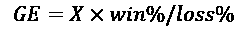

如果*损失%* > *盈利%*，只需关闭更大部分或提前退出。赚钱现在简化为具有高于损失率的盈利率。现在我们知道了距离和部分退出之间的关系，让我们比较一次退出和分批退出之间的 GE。

让我们举一个简单的数值例子。假设我们的策略在 1R 时有 60%的盈利率，或成本到止损距离的 100%。为了练习，假设每增加 0.1R，盈利率就降低 1%：移动越大，频率越低。这是下图中的黑线。盈利率的降低是线性的（每 0.1R 下降 1%）：

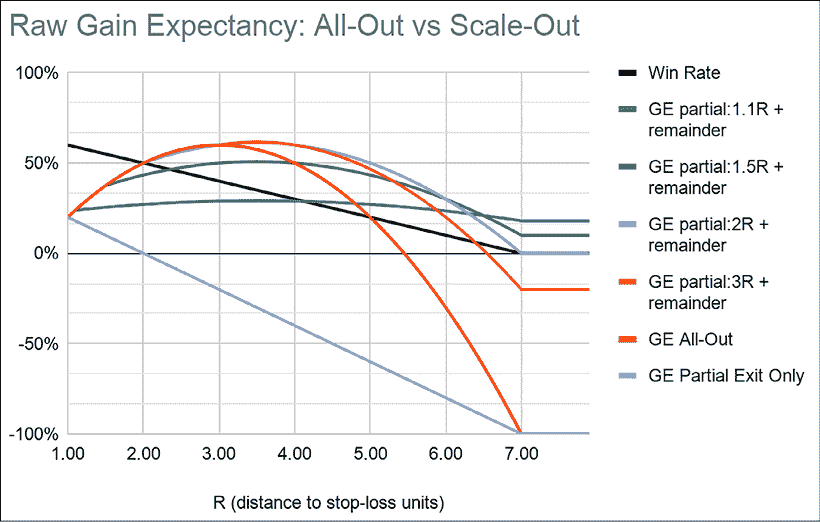

图 7.4：规模化 GE

让我们计算 GE，假设我们关闭 100%的头寸。这是标记为 GE All-Out 的长弧线。GE 遵循一条弧线。大幅移动是罕见的，最终无法弥补损失。在这种情况下，盈亏平衡率为 16%的胜率和 5.4R 的风险/回报比率。

接下来，让我们计算交易关闭部分的 GE。这是 GE 部分退出线。它以线性方式跟随胜率。随着价格超出 2R，成功概率下降到 50%以下。单独部分退出的 GE 机械性地变为负值。请注意，此部分退出仅作为视觉参考，因为剩余部分是无限期开放的。趋势跟随策略通常具有默认负的 GE。大幅移动是罕见的。损失控制确实是确保长期 GE 保持正值的唯一方法。

最后让我们计算一个部分退出和剩余部分的 GE。我们设置四个目标价格分别为 1.1R、1.5R、2R 和 3R。我们分别关闭 91%、67%、50%和 33%。剩余部分被关闭。部分退出显著改善了 GE。1.1R 是最保守的。它具有最低的回报潜力，但内置了稳健的 GE。1.5R 具有更高的回报潜力，但剩余 GE 较低。在这个例子中，2R 和 3R 的终端负 GE。过了某一点，剩余部分就像是一张彩票。

风险降低遵循两个规则：

1.  盈利率 > 损失率：有时候盈利率暂时较低。然后，要么提前关闭以改善盈利率，要么关闭更大部分以减少风险。

1.  目标价格 > 1R：利润必须大于损失。

故事的教训是，市场参与者最好在 2R 以下关闭更大部分。这提供了稳健的 GE。稳健的期望值保证了更大的头寸规模。

但是，在设计稳健策略时，这种游击交易方式并不是自然而然地出现在脑海中。对于部分退出的反驳是，止损必然会很昂贵。提前关闭交易会削减其利润潜力。与此同时，失败将耗尽全部风险预算。似乎交易优势注定是负的。此外，直觉上分批出局感觉就像是把钱留在了桌子上。事实上，绝大多数市场参与者更愿意集中精力改善他们的信号，而不是努力改进他们的订单管理。

大多数市场参与者都是从全进全出的模式操作的。他们漫步进入，有时补充，然后一次性狂奔出去，所以退出是一个单一事件。市场参与者可能会发现，当他们开始工作时，他们不愿意大幅度减少自己的头寸。请记住我们在玩一个无限的游戏。目标是设计出一个稳健的 GE。这让我们想到了一种称为凯利分批出局组合（暂且这么称呼）的扩展技术。这个主题的一个更激进的变体是利用高胜率来超级化头寸。

正如我们在整本书中看到的那样，退出政策决定了策略类型。让股票运行的趋势跟随者拥有不频繁的大胜利。持反对意见者有频繁的小胜利。由于退出决定了分布的形状，因此可以通过简单的分批出局来结合两者的属性。

|  | 均值回归 | 趋势跟踪 | 混合 |
| --- | --- | --- | --- |
| 胜率 | 高 | 低 | 高 |
| 波动性 | 低 | 高 | 低 |
| 左尾部 | 长 | 短 | 短 |
| 右尾部 | 短 | 长 | 长 |
| 偏斜 | 负 | 正 | 正 |

这个概念是要大幅度进入市场，关闭大部分交易，并让剩余部分无风险地运行。高概率的早期部分退出将模式，即交易峰值数量，带到了利润方面。如果胜率超过 50%，甚至可以使用像**分数凯利**或拉尔夫·文斯的**最佳 F**这样的公式来超级化头寸。最佳 F 是另一种强大的头寸大小算法，它考虑了最大回撤。这保证了大头寸。这些是快速交易。它们以几何速率快速复利。这意味着我们大举进入，赚一笔快钱，关闭大块，然后将这笔钱重新投入流通，如此往复。

让我们回到我们的假想例子来解释这个过程。假设是，胜率每增加 0.1 个单位，就减少 1%。凯利准则是一种投注大小的算法，我们将很快在下一章中重新讨论。在 1.1R 处退出，胜率为 59%，这支持每笔交易 18%的风险。

| R（距止损单位的距离） | 胜率 | 凯利全出 | 部分退出数量 | 剩余 |
| --- | --- | --- | --- | --- |
| 1.00 | 60% | 20% | 100% | 0% |
| 1.10 | 59% | 18% | 91% | 9% |
| 1.20 | 58% | 16% | 83% | 17% |
| 1.30 | 57% | 14% | 77% | 23% |
| 1.40 | 56% | 12% | 71% | 29% |
| 1.50 | 55% | 10% | 67% | 33% |
| 1.60 | 54% | 8% | 63% | 38% |
| 1.70 | 53% | 6% | 59% | 41% |
| 1.80 | 52% | 4% | 56% | 44% |
| 1.90 | 51% | 2% | 53% | 47% |
| 2.00 | 50% | 0% | 50% | 50% |
| 2.10 | 49% | -2% | 48% | 52% |

让这些百分比沉淀一秒钟。如果“做大做全...提前回家”实际上是一种成功的策略呢？例如，假设您将目标价格设定为 1.5 倍风险。胜率舒适达到 55%，因此根据上表中的凯利列，您可以每笔交易承担 10%的风险。您所需要做的就是在 1.5 倍风险处关闭 67%的仓位，然后将止损重置为成本。剩下的 33%是无风险的彩票。有时您会获得 2 倍风险，有时您会获得 5 倍风险。最坏的情况下，您以成本价平仓。

让我们再次回顾以加强论点。第一笔交易是短期、高胜率、大规模仓位，将模仿均值回归分布。这笔交易感觉像剪下优惠券，因此被称为剪票。第二笔交易是一张小彩票。一旦第一笔交易关闭，将止损重置为成本（绝对或相对），然后就可以放心地持有到交易结束。这笔交易本质上具有更多的随机回报，因此被昵称为彩票。

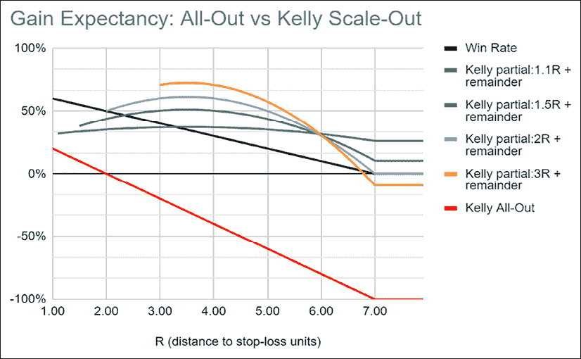

图 7.5：凯利比例组合

该图基于前一个图表。它包括仓位大小。请记住，投资者始终会在下跌时下意识地做出反应，即使他们在意识上说他们想要回报。因此，提前关闭不仅是明智的，而且是提高资产管理规模的关键。结合均值回归和趋势跟随策略的盈亏分布形状如下：

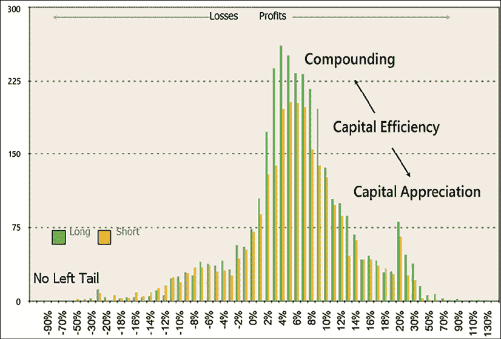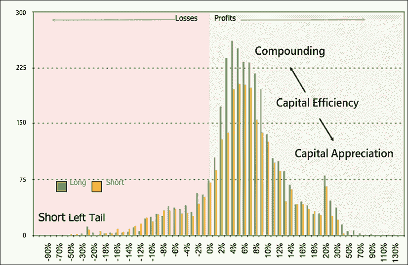

图 7.6：结合均值回归和趋势跟随策略盈亏图

交易的模式在盈利方面（胜率高）。这与均值回归策略一致。交易的分布偏向右侧。这是趋势跟随者的右尾彩票。

这是一种利用高胜率和大数定律的强大方式。这样可以使资本基础复利增长，清除失败，并补贴未来的交易活动。由于存在连续亏损、暴露限制，尤其是投资者的平静睡眠需要保护，因此不建议进行大规模的凯利交易。正如我们之前看到的，投资者对回报的关注不及对回撤的关注，因此总是明智地偏向保守。在接下来的章节中，我们将看到一种动态的分数凯利方法，将有助于减轻回撤风险。

让我们回顾一下什么是分批出局，即有纪律的止盈所能达到的目标：

+   复利小利润：均值回归市场参与者通过复利小利润赚取他们的钱。风险降低合成地也是在做同样的事情。小利润迅速复利。

+   其次，"卖空并期待"策略的支持者总是声称他们能看透短期的波动。这是正确的，直到他们第一次遇到波动。如果你已经关闭了一部分头寸，降低了风险，实现了一些利润，并确保你将在交易中保持盈亏平衡，你将处于更好的心态来应对熊市反弹。在实践中，你可能会如释重负地看到最终看到熊市反弹重新进入游戏并增加另一笔交易。  

+   第三，它给利润与损失分布的利润方向提供了另一种模式和正的偏度。这种利润模式是为了补偿损失方向上的模式。换句话说，那些累积的小利润是为了吸收大部分损失。

当你考虑建立一个交易优势时，这可能不是你想到的。剪券是费力而不性感的，但它也是一种有效的方式来倾斜交易优势，并快速复利。

实际上，如果你足够勤奋地练习这种降低风险的方法，你会训练你的大脑期待那些熊市反弹成为乘胜机会。当其他人都在防守时，你实际上正在进攻。

## 技巧五：延长右尾

> "你不必用力挥动球棒才能击中一支全垒打。如果你抓住了时机，它就会飞出去。"
> 
> ——尤吉·贝拉

移动止损非常适合保护资金，但它们只在完美的条件下起作用。因此，它们的有效期有限。一旦风险降低，保持移动止损可能会触发过早退出。移动止损的目标仅仅是将损益分布倾向于接近盈亏平衡。现在剩下的部分不再承担风险，你可能想要取消移动止损，依靠你的固定止损。空头方面的波动性很高。给市场一些回旋余地，直到是重新进入的时候。

我们都在挣扎着说最后再见。我们成为了对我们的赢家有"情感价值投资者"。我们都倾向于推迟不可避免的事情。此外，基本面新闻的流动在价格行动开始朝相反方向移动后仍然支持我们的论点。往返旅行并不罕见。

市场参与者真正需要的是一个客观的信号，表明趋势已经结束。地板/天花板法则足够稳定，可以使市场参与者稳固地度过市场上的困境。作为一个普遍原则，最终的退出应该是趋势的逆转：股票留在投资组合中，只是换边。

传统智慧说，你在写入场之前不能写出场的“书”。从空头方面的经验表明不然。如果你先建立好逃跑路线，那么入场只是滑动的概率。例如，在熊市反弹转向后进场，成功的概率和持仓规模都比等待新低要高。出场就是当纸上利润变成真金银。然而，在我们对最后一种技术的讨论中，我们将讨论每个人最喜欢的话题：入场。

## 技巧 6：重新进入：通过分级头寸来乘坐你的赢家

> “你、我，或者没有人会像生活那样打击你。但问题不在于你被打击有多猛烈。而在于你能被打击多么猛烈而不倒下。”
> 
> ——洛基·巴尔博亚（Rocky Balboa），意大利雄鹿

在 20 世纪 80 年代初，海龟交易员尽管只有可怜的 34%的胜率，但他们赚了数亿美元。他们的秘密武器：他们加仓了他们的赢家。长期参与者和卖空者之间的主要区别之一是定期补充成功头寸的必要性。随着利润增加，卖空头寸会缩水。因此，在长期方面盛行的全仓/空仓方法在空头方面失败了。在某个时候，你需要补充你的成功空头。当你增加你的赢家时，你的胜率和平均盈利都会提高，这从机械上提高了你的交易优势。

重新进入（Re-entry）确实是该策略展现其加速潜力的地方。你已经有了合格的赢家，赚了一些钱，并降低了风险。熊市反弹已经在你的止损线下方转向。买入压力已经耗尽。现在有足够的证据表明熊市行情已经开始。游客已经被清除出局。借贷甚至可能更容易一点。星星们为光荣的第二轮准备就绪。

不幸的是，对于犯有**TWA**（“交易当美国人”）罪行的市场参与者来说，逐步加仓和减仓是不可能的。美国实施了一种称为 FIFO 规则的库存估值方法，规定所有仓位必须从最旧的减少到最新的。这实际上阻止了美国参与者围绕他们的头寸进行交易。

在我们进一步探讨之前，这里有一个关于在熊市抛售期间逐步加仓的重要提示。随着市场暴跌，逐步加仓是很诱人的。然而，大多数市场参与者是为了买入而不是卖出。这使得卖空者处于自然劣势。假设某处的某人一直在等待这种弱点作为购买机会。这意味着一旦卖出压力消失，长期参与者将推高价格并触发卖空止损。以较低价格进行的第二笔交易很可能陷入交叉火力。好消息是：如果卖空仓位得到验证，那么市场将在下一次熊市反弹时再次给你进场的机会。耐心是一个有利可图的美德。

首先，重置你原来仓位的固定止损。有几个合理的位置。更激进的版本是将其放置在当前熊市反弹水平的峰值之上。这将保护利润，但会受到波动冲击的影响。最保守的版本是将止损设置在之前的成本位置。在这两者之间的某个位置是“法国式止损”。市场在摆动高点和低点上下波动。这给市场一些额外的摇摆空间。这将需要更小的仓位规模。如果趋势逆转，你甚至可能放弃更大部分的利润，但你会晚上睡得更好。这个止损被延迟了一个摆动，因此被时髦地称为“法国式止损”。

一旦第一个 tranche 上的风险降低，就是重新使用与之前相同策略的时候了。重新进入空头仓位的最佳时机是在熊市反弹或空头挤压之后。游客们被迫平仓。买压正在消失。如果当前顶部低于前次入场的顶部，则卖家仍然控制着局面。重新入场的条件不需要像初始入场那样严格。然而，重新入场必须满足三个条件：

1.  趋势是你的朋友：当前的入场价格必须低于上一次的价格。市场参与者有时会被诱惑以比上一次更高的成本重新进入。这是贪婪露出丑恶的一面。这样做有效，直到不再有效。有一天，它会感觉像是饮过龙舌兰酒后的早晨：“当时，这似乎是个好主意。”更高的入场价格可能是市场即将 consoldate 或逆转的早期迹象。

1.  借用利用率必须低于 50%：借用利用率被定义为可供借用的股份除以已借出的股份。这是对供求关系的最简单的监测方式，也是最有力的表达方式。随着长期持有者的清算，可供借用的股份的供应减少。与此同时，随着空头卖家的涌入，需求增加。空头卖家通过跟随多头卖家赚钱。当借用利用率上升到 50%以上时，意味着长期持有者已经离场，剩下的只有游客。在交易变得拥挤时增加另一个 tranche 是在自找麻烦。你将不再是跟随多头卖家，而是被困在空头卖家的试管中。在多头方面，新的买家会抬高价格。在空头方面，新空头卖家的供应受到可借用的股份的限制。因此，他们没有能力推低价格，但他们增加了卖出压力，使股票易受到空头挤压的影响。

1.  对于每一个新仓位降低风险：在现有仓位上加仓被称为金字塔加仓。记住，趋势最终会逆转。随着趋势成熟，趋势逆转的可能性增加。

将所有持仓的固定止损重置为“法式止损”，即接近之前进入市场成本的某个位置。当您降低旧头寸的止损时，无论接下来发生什么，它们都将是盈利的。这种内在的盈亏将资助更多的新头寸和风险较高的头寸。增加成功头寸会提高胜率和平均盈利。

所有美好的事情最终都会结束。如果因为被挤兑或者被摇摆出局而辛苦工作的交易最终以失败告终，那将是一种遗憾。

### 最终退出：右尾

趋势跟随者喜欢在其头寸上“骑着夕阳”前行。有时他们会，在多头市场。而在空头市场，要想获得 2-3 倍的收益，需要更多的技巧，因为向下的潜力被限制在 100%。

最困难的任务是放弃一笔成功的交易。总会有这样一种烦人的想法，认为这可能是暂时的，还有可能有更多的机会。还有就是害怕失去太多业绩。这可以分解为两个独立的问题。市场参与者需要一种客观的方式来知道何时趋势已经结束。其次，如果不稳定性只是暂时的，那么他们需要一种重新进入市场的方式。

在*第五章*，*市场环境定义*中，我们描述了地板和天花板法。理由很简单。牛市在所有摆动高点低于峰值（天花板）时结束。熊市在摆动低点高于谷底（地板）时结束。地板和天花板法是定义趋势何时结束的客观方法。当打印出新的地板时，退出所有空头头寸。记住，您将会放弃一些业绩。使用这种方法，您不是在试图时机的顶峰，而是支付确认趋势已经结束的代价。

### 最终退出后的重新进入

市场并不总是按预期行动，有时您会被迫退出某个头寸。如果市场再次表现出期望的行为，您会希望重新进入市场。最初进入市场的条件不太可能再次满足。例如，如果你做空了一个昂贵的**价格收益比**（**PBR**）为 2 的股票，当前的估值可能已经下降到基本公平价位附近。因此，你不会再进入这笔交易。因此，您需要一些简单而强大的方法来重新进入市场。

这就是地板和天花板法的作用。如果您因为价格打印出一个地板而被摇摆出局，但随后却打印出一个天花板，那么重新进入市场。将止损设置在天花板水平，验证借入资金是否仍然合理，然后开始。关于空头头寸的一个重要经验教训是，它们的下降并不总是线性的。股票从过高的价格下跌到公允的估值。它们有时会吸引多头参与者，然后恢复下跌，进入价值陷阱的空头天堂。给自己一些重新进入市场的灵活性。

趋势跟随者占据了市场参与者的绝大多数。接下来，让我们看看均值回归参与者是一种罕见的品种，他们面临着自己一套挑战。

# 如果您的主导风格是均值回归，如何倾斜您的交易优势

> "赐予我割掉失败者的宁静，勇气骑在赢家身上，以及辨别两者区别的智慧。"
> 
> – 交易者的宁静祈祷

均值回归策略具有负偏态，利润端的众数：右尾偏短，左尾偏长。解决方案是缩短左尾，延长右尾。

均值回归市场参与者天生擅长卖空。他们在高点卖空，在低点补回。他们也更擅长应对横向市场。然而，主要危险是忽视市场环境。虽然诱人的是卖空高估值或超买的 RSI，但处于上升趋势的股票往往会继续其上升轨迹。例如，RSI 会在牛市股票上从 40 上升到 80，在熊市股票上从 60 下降到 20。超买和超卖条件通常是持续性的迹象。

解决方案是等待市场环境从牛市转向横盘或熊市，然后开始卖空。在分析中纳入市场环境定义方法，如 Floor/Ceiling 或移动平均线交叉，以减少误报。

## 损失

与均值回归策略相关的风险在于尾部：一些巨大的损失。均值回归市场参与者不喜欢止损。它们有时会在股票开始表现如预期之前触发。胜率下降，平均损失上升，期望值下降。一种方法是使用更宽的止损。它们将需要更小的头寸，但也将防止灾难性损失。

均值回归市场参与者经常会受到诱惑，在失败头寸上增加头寸的前提是它们最终会回归。例如，如果股票预期在均值的 2.5 个标准偏差处回归，那么在 4 个标准偏差处，它甚至更具吸引力。这种做法大多数时候是有效的，但是当它失败时，损失可能是毁灭性的。LTCM 曾试过这样做。马丁·盖尔方法有效，直到它不再有效。

一个在统计上更健壮但违反直觉的方法是在市场参与者感觉应该增加头寸时减少头寸。假设过了某个阶段，非有效性不会纠正而会持续存在。如果在 4 个标准偏差处减少头寸而不是增加失败者的话，那么要么它会回归并抵消损失，要么之后减少的损失会更少。无论哪种方式，它都会将损失的偏态倾向于趋于平衡。

另一个市场参与者应该减少而不是增加亏损头寸的实际原因是通用电气的恶化。增加一个失败者直接增加了损失率和平均损失。通常情况下有效，直到它崩溃。

## 利润

均值回归市场参与者往往会过早退出。深度价值投资者经常将接力棒交给增长管理者，然后他们将股票骑到兴奋的地步。他们留下了利润。

更重要的是，它们具有不利的尾部比率。需要许多小胜利来弥补一次大损失。均值回归市场参与者需要延长他们的右尾。

因此解决方案是关闭一部分仓位，让剩余仓位使用不同的退出机制运行。

## 部分退出

使用先前显示的部分退出公式（*N = 1/X*）来计算您需要关闭的确切金额，使交易保持盈亏平衡。如果有疑问，关闭仓位的二分之三到四分之三之间。高胜率加上超过 50%的利润收割，保持了盈利引擎的持续运转。

对分布的影响将使得利润方面的模式更接近保本。胜率不会受到影响，只有平均获利受到影响。

## 退出

趋势追随者需要确信需要一路盈利。均值回归市场参与者需要被说服他们应该推迟最终退出。问题在于价值投资者不是被理性地解释成长的。部分退出后，剩余部分将在以后的某个日期使用不同的退出机制关闭。以下是两种方法：

+   均值周围的低效率：均值回归意味着围绕一个均值的振荡。因此，在均值处关闭仓位是不必要保守且有些不合逻辑的。在关闭仓位之前，等待价格在另一个方向上超调。这种超调不必是对称的。例如，一个 2.5 个标准偏差的移动可能会导致进入，但全仓退出可能会发生在 1 到 1.5 个标准偏差之间的某个位置。当估值下跌时，它们通常不会停留在市场平均水平上。它们会在稳定之前超调。这种方法与均值回归市场参与者的心态更一致。低效率存在于两个方向。

+   波动性跟踪止损：第一种方法是设置一个波动性跟踪止损，通常称为吊灯止损。将一定数量的平均真实范围添加到最低点。当价格关闭超过止损时，关闭仓位。这个技术借鉴了趋势跟随策略。

将右尾延长视为那些毁灭性损失的解药。你允许你的持仓多跑一点时间，下一次恢复所需的时间就会减少。

# 总结

随机性无法根除。所以，停止自欺欺人地假装预测任何事情。当市场波动时，那些为投资者制作柠檬水的人会继续经营下去。

在这一章中，我们首先考虑了退出一个位置的心理影响，以及一些克服你不愿意止损的步骤。然后，我们探讨了六种可以提高你交易优势的技巧。其中五种涉及退出，一种涉及进入，目标是缩短左尾和延长右尾。通过裁剪失败者并让赢家超出你的舒适区，来实现这一目标。

接下来，我们将考虑任何战略的另一个重要部分——头寸规模。
