# 第八章：仓位大小：财富创造在金融管理模块中

传奇投资者一直强调同样的事情：风险管理是长期优异回报的关键。挑选股票很性感，但大大被高估了。风险管理很无聊，但大大被低估了。在执行交易员的英语中，市场专家们专注于拣选正确的原料，而不是关注拿到正确的配方。

在一天结束时，长期几何回报的主要决定因素是仓位大小。长头寸的扩张并不迫使市场参与者考虑仓位大小。毕竟，一只好的 AAPL 股票可以让一篮烂苹果看起来很好。尽管有糟糕的仓位大小算法，他们仍然能够存活。卖空者没有对数价格下降的奢侈。在本章中，我们将考虑一些糟糕的仓位大小算法的经典示例。这些就是末日定位大小的四骑士。

在我们仔细研究了常见的陷阱之后，我们将考虑一种不仅有效，而且能够最大程度减少糟糕决策影响的策略。

我们将涵盖以下主题：

+   导入库

+   末日定位大小的四骑士

+   仓位大小是情感资本和财务资本之间的联系

+   比较仓位大小算法

+   优化您的风险预算

你可以通过以下链接访问本章节所有图片的彩色版本：[`static.packt-cdn.com/downloads/9781801815192_ColorImages.pdf`](https://static.packt-cdn.com/downloads/9781801815192_ColorImages.pdf)。你也可以通过本书的 GitHub 仓库访问本章的源代码：[`github.com/PacktPublishing/Algorithmic-Short-Selling-with-Python-Published-by-Packt`](https://github.com/PacktPublishing/Algorithmic-Short-Selling-with-Python-Published-by-Packt)

# 导入库

对于本章和本书的其余部分，我们将使用`pandas`、`numpy`、`yfinance`和`matplotlib`库。所以，请记得先导入它们：

```py
# Import Libraries
import pandas as pd
import numpy as np
import yfinance as yf
%matplotlib inline
import matplotlib.pyplot as plt 
```

# 末日定位大小的四骑士

> "只听取你想要成为的人的建议。"
> 
> – Gilbert Bernut，父亲，超级英雄，不为人知的 20 世纪哲学家

在富达期间，我经常运行我的算法跨其他经理的投资组合。我无限的野心是通过每次提高 0.01% 的业绩来帮助我的同事。虽然看起来不像什么，但即使每笔交易的基点在一年内复利也足以将排名从第二分位数提升到最高分位数的稀有气候。

很快，我意识到同样的股票在所有投资组合中不断出现。将聪明、充满激情的人聚集在一起，在同事之间形成健康的交叉传粉是很自然的。

更引人入胜的是，尽管持仓的分散度很低，但表现存在差异。人们预期相似的持仓会产生相似的表现。然而，无论是表现还是跟踪误差（即回报的波动与基准相比）都存在差异。由于大多数投资组合中都存在同样的问题，所以股票选择显然不是绩效的主要驱动因素。真正产生差异的是头寸规模。赚钱在于资金管理模块。

现在，股市赚钱的悖论在于：能够赚钱的模块也是策略中最无聊的部分。每个人都想向世界宣告，他们几年前买入了 Netflix 或 Amazon。然而，没有人会承认他们只有边缘位置，不知道应该买多少股。然后，他们想知道为什么尽管选择了优秀的股票，但仍然表现不佳。

因此，资金管理的纪律被放置在了遥远的次要位置，被视为需要完成的琐事，就像倒垃圾或支付水电费一样。这导致市场参与者宣扬灾难性的资金管理做法。用执行交易员的术语来说，由于无知的赌注规模，通过选股获得的所有潜在收益都被抹去了。

让我们看看目前业界采用的四种最具破坏性的资金管理技术。

## 马厩主 1：流动性是熊市的货币

> “你随时都可以退房，但你永远也无法离开。”
> 
> ——唱片《加州旅馆》中的 Don Henley

在不流动的股票中持有大头寸已经使许多才华横溢的基金经理陷入困境。小市值股票和不流动的股票就像船只和豪华玩具。你随时都可以买，但你永远也无法离开。如果你不能在不损害市场影响的情况下退出一个持仓，那么你不是持有它，而是被它拥有。

流动性是熊市的货币。当“救赎之歌”开始奏响时，管理人员被迫清算他们能够清算的任何资产，而不一定是他们想要的资产。

这使他们拥有不流动的残骸，从而延续了救赎的恶性循环。小市值股票在熊市中尤其脆弱。流动性消失，买卖价差扩大。在大金融危机（GFC）期间，那些试图从不流动资产中退出的人很快意识到，买卖价差足以让一艘超级油轮毫发无损地停泊。

关于容量的一则附注。投资者的第一个问题之一是容量：一个管理者在收益开始下降之前能够承载多少资产。投资者知道，在最初的几年里，当资金规模较小而管理者渴望时，收益最高。然而，他们想要在扣动扳机之前看到一些业绩记录。因此，他们尽可能地观察等待，但不要过久，以确保他们仍然能够享受到一些体面的回报。更多的是一种数学近似，一个真实的生活中的酸性测试是惯性。当管理者开始因为市场影响而放弃交易时，他们已经达到了饱和点。正如我的导师金正允经常说的：“惯性渗入时，容量就确定了。”如果你发现自己因为惯性而错过信号，而这似乎是正确的事情，那么你要么是懒惰的，要么是你的资产规模太大。无论哪种方式，这都是一个警钟。

## 马厩 2：平均下去

> "失败者总是平均下去。"
> 
> - 保罗·图多·琼斯

平均下去仍然是基本市场参与者中流行的一种方法。随着价格下跌，估值看起来更便宜，因此他们增加了现有的亏损头寸。增加到一个亏损头寸会使交易边缘公式中的四个变量中的三个变差：损失率和平均损失增加，获胜率下降。唯一不受影响的变量是平均获胜，这是任何人都无法控制的。此外，分配给失败者的额外资本必须来自某处。它要么来自现金的新注入，要么来自被截断的盈利头寸。总之，平均下去可以总结为：“削减你的赢家，运行你的输家。”成功的秘诀难道不是：“削减你的输家，运行你的赢家”？

金融服务行业充斥着由一系列后测验、优化和令人昏昏欲睡的白皮书支持的晦涩理论。与其停留在抽象的世界中，评估它们的有效性的一个简单方法是与现实世界进行类比。在赌博世界中，平均下去被称为**马丁内尔**。每个新手赌徒都想出了一个打算打破赌场的方法。在每次失败后加倍下注，然后你最终会拿回你的钱。首先，这种策略忽略了连续输的理论。

长期来看，抛硬币有 50%的概率。然而，结果并不是头和尾的整齐交替。每一次抛硬币都是独立的。有时候，头可能连续出现 8、9 或者 10 次。这前提是有无限资本。其次，最有利的结果是平手。这意味着在这之前的任何结果都有一个有趣的统计属性，称为**破产的确定性**。总的来说，赌场为什么有大理石、画作和免费酒，而新手赌徒却开着破旧的车回家，其中有个原因。

如果加权平均法在统计上显然是破产的，那么为什么它在专业投资者中仍然如此受欢迎呢？ 在他引人入胜的自传*一位适应所有市场的人*中，爱德华·索普将加权平均法描述为锚定偏见。 市场参与者在进入头寸的时刻对股票价值做出了假设。 价值是他们赋予估值的主观意义，或者正如沃伦·巴菲特所说：“价格是你付出的代价。 价值是你得到的东西。” 随后，他们的判断将始终受到最初成本的影响。 如果一只股票在他们以 10 美元买入时看起来便宜，那么以 9 美元买入必定是个大便宜。 市场参与者假设他们的分析是正确的，而市场暂时是错误的。 在市场纠正这种低效之前再增加一个标的可能会导致更大的利润。 理论上，这是有道理的。

实践中，“这很复杂。” 当赌注很小时，情感参与保持最小。 再增加一个标的会增加压力水平。 大脑突然从 1 美元的买入跃升到高额赌桌。 以前不存在的一系列情绪劫持了思考大脑。 现在赌注很高，自我不能承担错误。 正如我们在*第七章*，*提高您的交易优势*中所看到的，随着止损心理学，这里表现出来的自我“需要正确”的心态总是超越了盈利的义务。

传奇投资者强调风险管理的重要性。 他们还谈论在市场面前的谦逊。 市场巫师们是综合长数学和短自我的。 跟随统计上破产的方法的拥护者；短统计数据。 他们还通过加倍下注来打破市场先生的搏。 长数学，短自我听起来像是金融服务行业的短暂职业生涯的配方。

## 骑士 3：高信念

> “我感觉很好！”
> 
> – 詹姆斯·布朗，教父

信念是一种由最糟糕的和最好的投资者实践的头寸大小算法。 最糟糕的投资者制定了一个投资论点。 然后，他们以一些“胆量”赌注向世界广播他们的信念：“要么大手笔，要么回家。”

不幸的是，t 统计量，一种统计鲁棒性的度量，不能提供精神上的鲁棒性。 当市场参与者承担大额赌注时，他们失去了客观性。 他们的自我渴望验证。 高信念是一种“感觉良好”的赌注大小，没有统计学的有效性。 当然，那些感觉良好的明显交易很少是最有利可图的。

现在，最成功的投资者也会进行大额、高信心的押注。不同之处在于，他们用风险单位来表达信心。这意味着他们先制定一个论点，首先量化风险，然后根据情况确定头寸大小。乔治·索罗斯以大规模押注而闻名。虽然每个人都记得做空英镑交易，但很少有人知道**长期资本管理**（**LTCM**）的故事。根据传奇交易员维克托·尼德霍夫，他当时在索罗斯先生的店里工作，通过在 LTCM 危机期间削减损失，他为许多交易员赚取了丰厚的奖金。这些都是经过计算的风险单位。

## 第四个骑士：平等权重

平等权重是基本股票选择者的重要组成部分。他们依靠自己的股票选择能力来创造业绩。所有的股票选择都大致相同，所以他们不认为需要不同大小的头寸。

投资组合管理不是一种民主行为。平等的机会不会带来毁灭，但它可能阻止你实现长期目标。不是所有的股票都有相同的贝塔值。沉闷的公用事业公司与激进的互联网股票的波动特征不同。通过在头寸大小确定层面忽视贝塔值，波动性会重新出现在投资组合层面。波动性股票将推动整体投资组合的波动性。由于投资者对波动性做出反应，因此建议根据它们的波动性或贝塔值确定头寸大小。在执行交易员的英语中，请记住，如果你给予你的想法平等的权利，那么这将伴随着你的资产曲线的平等左侧。

这引出了一个有趣的问题。机构投资者是否知道有一个最优的头寸大小算法？

# 头寸大小是情绪和财务资本之间的联系

> "这是一个伟大的实验，原因很多。它应该成为任何对金融或赌博感兴趣的人基本教育的一部分。"
> 
> - Edward Thorp，所有市场的超级英雄

Elm 创始人、LTCM 前交易员维克托·哈加尼对 61 名志愿者进行了一项实验，他们是金融界明星学生和老练的投资专业人士。参与者被赋予了 25 美元的起始资本，并被告知在 30 分钟内翻转一枚虚拟硬币，被告知，“硬币有 60%的概率正面朝上，你可以在每次翻转上任意押注，无论是正面还是反面。”你会押多少？似乎有一个公式可以计算最优押注大小，从而最大化长期几何回报。凯利准则的公式是：

```py
def kelly(win_rate,avg_win,avg_loss):  
    # Kelly = win% / abs(avg_loss%) - loss% / avg_win% 
    return win_rate / np.abs(avg_loss) - (1-win_rate) / avg_win 
```

尽管参与者的背景和所谓的成熟程度都很高，结果却令人大失所望。只有 21%的玩家达到了最高限制。尽管有 60%的胜算，但令人震惊的是，有 28%那些勇敢的、精明的金融专业人士竟然破产了！有些人注定要在被称为**管理**的破产基金经理的庇护所中寻求庇护…

现在，让我们玩同样的游戏，但这次加大赌注。让我们从你的整个一生积蓄开始。上次，在每次抛掷中，微薄的 25 美元的预期回报在 300 次抛掷后超过了 300 万美元。现在，你知道了赔率和公式。这次，押注你一生的积蓄应该使你遥遥领先于比尔·盖茨、沃伦·巴菲特和杰夫·贝佐斯。

如果这么容易，为什么没有人会那么快变得那么富有呢？原因在于连续亏损。抛硬币没有记忆。每次抛硬币都与上一次独立。即使长期概率为 60%，也会有一些连续亏损的时期。

如果你每次投资都占资本的 20%，你的一生积蓄在连续亏损时会是这样。

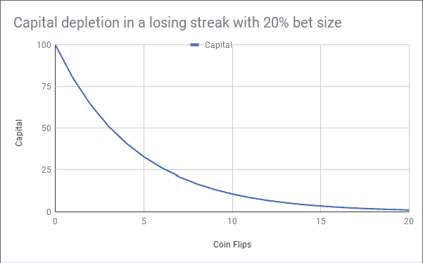

图 8.1：每次押注 20%时的资本耗尽

经历了 3 次亏损后，你一生的积蓄就会减半。经历了 5 次亏损后，只剩下三分之一。在你辛苦积累的一生积蓄（或者在金融专业人士的情况下，不当获得的收益）在不到 1 分钟内被抹去一半后，你还会坚持数学上正确的计划吗？很可能，在某个时候，你的大脑会说停止。

这里有四个重要的教训：

1.  61 位参与者中只有 5 位知道凯利准则。这对金融课程提出了令人不安的问题。如果学生从未被教导如何下注，他们如何能够赢得一个叫做股票市场的概率游戏呢？教授像**有效市场假说**（**EMH**）这样的东西就像是在发现青霉素之后长期教授医学生希波克拉底的体液理论一样荒谬。作为对 EMH 的激烈批评者和拥有卓越业绩的对冲基金经理，爱德华·索普写道：“这是一个很棒的实验，有很多原因。它应该成为任何对金融或赌博感兴趣的人的基本教育的一部分。”

1.  仓位大小决定了任何策略的长期几何回报。押注过于保守，你最终赚的钱会比你本可以赚的少。押注过于激进，你最终亏的钱会比你应该亏的多得多。在交易执行员的术语中，押注过小，你就没有生意可做。押注过大，你将失去你的生意。

1.  凯利准则或*最优 f*可能是产生最高长期几何回报的仓位大小算法。这并不意味着专业基金经理应该无条件地采用它们。F1 赛车可能是最快的车辆，但它们不是用来在当地杂货店购买牛奶的。正如我们将在*第三部分*中看到的，*多空游戏：建立一个多空产品*，投资者会用回报来换取绩效。因此，市场参与者通常使用分数凯利甚至不太复杂的算法进行交易。

1.  仓位大小不仅仅是一个数学问题。仓位大小是金融资本和情感资本之间的关键联系。消耗前者将需要时间和精力来重建资本。这是一个复杂的问题，但不是一个复杂的问题。有一个最佳解决方案。另一方面，破坏后者，*游戏结束*。在实践中，心理学超越了数学。每个市场参与者都遇到过“害怕扣动扳机”的问题，或者在跳水前进行了太多的大赌注。资本保值至关重要，特别是在情感方面。

这恰好引出了下一节。

# 一个你的大脑能够交易的仓位大小

> “我不害怕，我生来就是为了这个。”
> 
> – 焦安娜，自由斗士

仓位调整算法是由数学家为心理变态者设计的。他们没有意识到驾驶座位上的内心白痴。我们偏离理性的赌注大小的原因与逻辑无关。在本章开始的偏向硬币游戏中，即使在第二次连续失败之后，你可能会更加保守地押上你的生活积蓄，尽管理性的选择应该是在整个实验中坚持下去。

焦安娜是法国的自由斗士，也是英国脱欧的原始发明者。在 16 岁的嫩龄时，她想到了将英国人赶出法国王国的主意。在法国人的集体想象中，焦安娜被记住了两件事。第一件事是如此悲剧性，以至于持续困扰着法国人的心灵。

她被俘虏、拷打，并最终在鲁昂的一个公共场所被烤了。并不好，但再次提到中世纪总是有点中世纪。其次，她以听到声音而闻名。当股票开始在投资组合中钻出足以开采页岩气的深坑时，我们的内心焦安娜醒来。我们开始听到声音。我们被恐惧所麻痹。皮质醇液淹没了前额皮质，或者说“思考大脑”，我们错过了甚至是“免费赚钱”的交易。

总之，我们的内心白痴只理解两种仓位大小：太少或太多。当一切顺利时，永远不会有足够的好东西。当似乎一切都不顺时，总是有太多的坏事。

这让我们得出一个重要的观点：风险必须有界限。

## 确定风险区间

风险需要在最小值和最大值之间波动。这些边界可以是上限的凯利系数的一小部分，比如 30-50%。变量上限的好处是流动性。除非你试过，否则你不知道你的系统能承受多少风险。也许你承担了太多或太少的风险。两个考虑因素：波动性是集中度、头寸数量的函数，而头寸数量本身是每笔交易的风险的函数。如果你的目标是拥有多样化的低波动性投资组合，限制上限可能是明智的。

另一方面，较低的带可以是严格的最小值，比如 0.10%-0.15%。确保你的系统在连续亏损期间继续交易。可变的下限带可能导致负面仓位大小。这会导致交易暂停。如果系统不能产生新的交易，它就不能摆脱困境。

我们内心的白痴总是在市场顶部赌博太多，而在市场底部冒太少的风险。我们都曾经历过这种情况。停止疯狂的方法是在内心白痴醒来之前让大脑思考。做到这一点的方法是设定边界：

+   **最小风险**：如果你不购买至少一张彩票，那么中彩票将不容易。你必须继续交易以摆脱回撤。经典的“害怕扣动扳机”实质上是一个仓位大小问题。有一个足够小的大小，你会说“嘿，为什么不呢？”最小风险介于系统运行的最小大小和“害怕扣动扳机”出现之间。

+   **最大风险**：这取决于你的投资者的风险偏好。当他们说他们可以忍受-20%的下跌时，他们实际上是说你将进入一个鲍勃·马利市场，也就是“救赎之歌”，在-10%的回撤之后。

    无论你认为你的投资者的容忍度可能是多少，这个数字的三分之一是一个不错的近似值。最大风险也是股票数量和平均赢率的函数。

如果你的策略保持在这些限制范围内，它将是安全的。下一步是建立一个传输系统，使你能够在最小和最大风险之间切换档位。

在这一关键时刻，我们理解需要将市场的一些反馈机制纳入我们的风险偏好中，这将引导我们进入下一节。

## **股权曲线振荡器** – 避免经典股权曲线交易的二元效应

你会怎么看待一个只开一档挡的人？几乎不可能获得诺贝尔奖。欢迎来到金融服务行业，在这里天才们通过牛市和熊市都把他们的投资组合开到一档或五档。持续风险就像一辆被卡在一档挡的兰博基尼一样有效。当你的风格奏效时，承担更多的计算风险。当它不奏效时，专注于资本保护。

根据绩效调整风险称为**股权曲线交易**。经典的股权曲线交易使用方法，如移动平均线交叉或突破。当股权曲线穿过移动平均线或创下新高时，风险会从胆怯转向大胆。

这种方法滞后于市场。它衡量的是从一个股本水平的前进。例如，当股本水平从 100 上升到 105 时，可以增加额外的 0.1%风险。为了说明这个机制，想象一下在只有两个档位（一档和五档）的车里带某人去约会。一旦你在一档直线行驶了一段时间，你就会换到五档，可能正好是下一个弯道的时候。

如果你想提高传递基因的机会，你和你的旅行伴侣可能会喜欢更平稳的行驶。简化的凸形定位算法中的振荡器就像是自动变速箱，它将确保从最小风险平稳舒适地过渡到最大风险。

经典股票曲线交易的主要问题是滞后。避免滞后的最简单方法是从峰值而不是从底部测量回撤。基本上，你将始终以最佳速度驾驶投资组合，但只在必要时减速。

方法如下：

+   **回撤容忍度**：这是资本的最小部分，如果有*X*%的回撤，将会被使用。例如，一家著名的对冲基金在-5%的回撤容忍度之后，管理资产将减少 50%。分配资本的一部分在合成上就像是承担了更少的风险。系统要么承担更少的风险，要么投入更少的资金。结果在合成上是一样的。

+   **回撤振荡器**：使用上述容忍度重新调整回撤。建立一个跟踪当前资产曲线与其峰值和尾部跌幅的振荡器……

+   **振荡器形状**：凹形或凸形。把这个小巧的复杂宝石看作是汽车中自动变速器的等效物。经典股票曲线交易中存在固有的滞后。风险降低得不够快以减少冲击。相反，在回撤之后恢复速度较慢。

凹性和凸性都加速了下降和恢复，如下面的理论示例所示：

```py
def concave(ddr, floor):
    '''
    For demo purpose only
    '''
    if floor == 0:
        concave = ddr
    else:
        concave = ddr ** (floor)
    return concave

# obtuse 
def convex(ddr, floor):
    '''
    obtuse = 1 - acute
    '''
    if floor == 0:
        convex = ddr
    else:
        convex = ddr ** (1/floor)
    return convex

# instantiate minimum Kapital 
floor = np.arange(0,1,0.125)
# print('floor', floor)

x = -np.linspace(0, 1, 100)

fig, ax = plt.subplots()
for i,f in enumerate(floor):
    y = concave(ddr=-x, floor=f)
    current_label = f' concave f = {f:.3}'
    ax.plot(x, y, linewidth=2, alpha=0.6, label=current_label)

ax.legend()
plt.ylabel('Concave Oscillator')
plt.xlabel('Equity Curve From Trailing Trough To Peak')
ax.set_ylim(ax.get_ylim()[::-1])
plt.show()

fig, ax = plt.subplots()
for i,f in enumerate(floor):
    y = convex(ddr=-x, floor=f)
    current_label = f' convex f = {f*10:.3}'
    ax.plot(x, y, linewidth=2, alpha=0.6, label=current_label)
ax.legend()

plt.ylabel('Convex Oscillator')
plt.xlabel('Equity Curve From Trailing Trough To Peak')
ax.set_ylim(ax.get_ylim()[::-1])
plt.figure(figsize=(20,8))
plt.show() 
```

此函数的输出是如下图所示的图形：

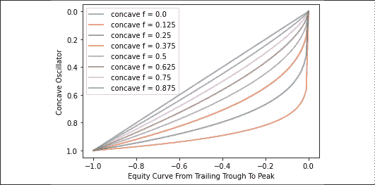

图 8.2：各个水平上的凹形振荡器

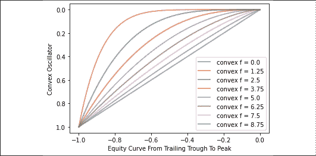

图 8.3：各个水平上的凸形振荡器

凸形位于对角线上方，凹形位于对角线下方。这条 45 度线是线性下降线。当与回撤容忍度结合时，它已经足够好了。当最小风险与最大风险之比较高时，凹性和凸性真的很有帮助。例如，如果最小风险是-0.25%，最大风险是-1%，那么凹性或凸性都将有助于传输。

接下来，让我们来说明这个振荡器在实践中是如何工作的。我们将通过下载德国 DAX 指数的调整收盘价来模拟一个资产曲线，使用 Yahoo Finance。接下来，我们实例化一个数据框架，并使用`cummax()`方法计算峰值资产。然后我们计算从峰值开始的回撤。

`dd_tolerance`是我们愿意在撞击风险之前容忍的回撤容忍度。为了保险起见，我们绘制了数据框。这给了我们一个很好的起始基础：

```py
ticker = '^GDAXI'
dd_tolerance = -0.1

equity = pd.DataFrame()
start = '2017-12-31'
end = None
equity['equity'] =  yf.download(tickers= ticker,start= start, end = end,
                        interval = "1d",group_by = 'column',
                        auto_adjust = True, prepost = True,
                        treads = True, proxy = None)['Close']

equity['peak_equity'] = equity['equity'].cummax()
equity['tolerance'] = equity['peak_equity'] * (1 + dd_tolerance )
equity['drawdown'] = equity['equity'] /equity['equity'].cummax() -1

equity.plot(style = ['k','g-.','r-.','m:'] ,
            secondary_y=['drawdown'], figsize=(20,8),grid=True)
equity.columns 
```

你应该观察类似以下的图表：

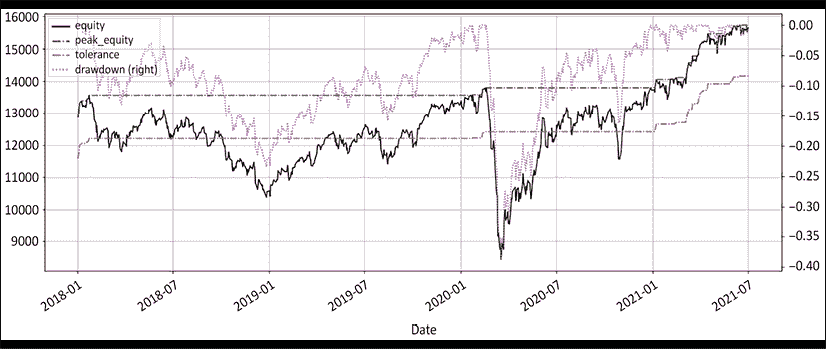

图 8.4：权益曲线，峰值权益，回撤和回撤容忍度带

一个观察立即显现出来。如果这个权益曲线与你的真实权益曲线有任何接近，那么坚持在周日烧烤，向容易受骗的游客写新闻简报，或者教给富家子弟**有效市场假说**（**EMH**）。这张图表尖叫着冒牌者综合征。

图表顶部的虚线是回撤。它绘制在次要*y*轴上。图表上下两条虚线分别是峰值权益和回撤容忍度。如果权益曲线跌破下线，那么风险应该被降低。正如下方虚线所示，权益曲线在回撤曲线下方花费了相当长的时间。因此我们预计一段时间内交易的风险会处于最低水平。

接下来，我们将计算沿着这条权益曲线我们应该承担多少风险。根据前面的理论讨论，风险在最小值和最大值之间波动。下一个小函数对于有经验的交易者来说是最好的安眠药。它的价值是这本书的多倍：

```py
def risk_appetite(eqty, tolerance, mn, mx, span, shape):
    '''
    eqty: equity curve series
    tolerance: tolerance for drawdown (<0)
    mn: min risk
    mx: max risk
    span: exponential moving average to smoothe the risk_appetite
    shape: convex (>45 deg diagonal) = 1, concave (<diagonal) = -1, else: simple risk_appetite
    '''
    # drawdown rebased
    eqty = pd.Series(eqty)
    watermark = eqty.expanding().max() 
    # all-time-high peak equity
    drawdown = eqty / watermark - 1 
    # drawdown from peak
    ddr = 1 - np.minimum(drawdown / tolerance,1) 
    # drawdown rebased to tolerance from 0 to 1
    avg_ddr = ddr.ewm(span = span).mean() 
    # span rebased drawdown

    # Shape of the curve
    if shape == 1: # 
        _power = mx/mn # convex 
    elif shape == -1 :
        _power = mn/mx # concave
    else:
        _power = 1 # raw, straight line
    ddr_power = avg_ddr ** _power # ddr 

    # mn + adjusted delta
    risk_appetite = mn + (mx - mn) * ddr_power 

    return risk_appetite 
```

这是它的工作原理：

1.  从`eqty`序列计算峰值权益，金融克里奥尔语中的水印。

1.  使用回撤容忍度计算回撤和调整后的回撤。使用指数移动平均值平滑平均调整后的回撤。

1.  选择曲线的形状：凹（`-1`），凸（`1`），或线性（其他）。

1.  计算风险偏好振荡器。

接下来，我们通过权益曲线运行几行代码来计算整个周期内的风险预算。风险预算是我们愿意承担的权益的比例。例如，如果我们使用常量风险资本为-0.50%，那么它将是当前权益乘以-0.50%。

在下面的示例中，我们使用三个风险水平：最小为-0.25，最大为-0.75%，平均为-0.50%。对于练习的目的，平均风险是恒定的风险资本。下面是源代码：

```py
eqty= equity['equity']
tolerance= dd_tolerance
mn= -0.0025 
mx= -0.0075 
avg = (mn + mx)/2
span= 5 
shape = 1
equity['constant_risk'] = -equity['equity'] * avg
equity['convex_risk'] = -risk_appetite(eqty, tolerance, mn, mx, span, shape=1) * equity['peak_equity'] 
equity['concave_risk'] = -risk_appetite(eqty, tolerance, mn, mx, span, shape=-1) * equity['peak_equity'] 

equity[['equity', 'peak_equity', 'tolerance',
        'constant_risk','convex_risk','concave_risk']].plot(figsize= (20,8),grid=True,
    secondary_y=['constant_risk','convex_risk','concave_risk'],
    style= ['k','g-.','r-.','b:','y-.', 'orange'])

equity[['drawdown','constant_risk','convex_risk','concave_risk']].plot(grid=True,
    secondary_y=['drawdown'],style= ['m--','b:','y-.', 'orange'], figsize= (20,8) ) 
```

注意，常量风险是乘以当前权益水平，而凹形和凸形都使用峰值权益。最后两者在计算中包含了回撤。

我们有与之前相同的权益曲线以及峰值和容忍度。然后，我们有两个风险预算图表。

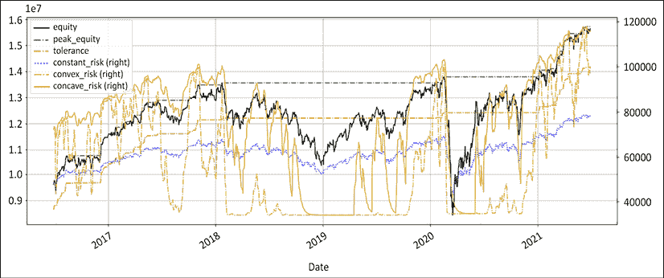

图 8.5：权益曲线，峰值和回撤容忍度。凹形，凸形和恒定风险资本

凹线，实线，是三者中最具响应性的风险预算。它反映了资产曲线。凸线，虚线，是三者中最保守的。它会在最小风险下停留更长时间，但在持续的上涨趋势中会做出积极反应。恒定风险，点线，几乎不波动。虽然表面上看起来可能不像一件坏事，但它可能会对资产曲线造成严重损害。例如，中间部分往往更加显著。在一天结束时，选择不在事情出错时减少风险也是一种风险管理决策，只是不是一个好的决定。

下一个图表绘制了风险预算以及回撤。

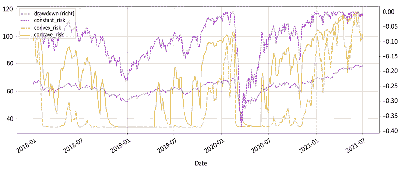

图 8.6：回撤，凹，凸和恒定风险资产

上面的图表显示了振荡器对回撤的响应。相比之下，恒定的风险资产看起来迟钝而不精细。当中间部分的回撤加深和恶化时，恒定风险变得太冒险了。相反，当回撤较小时，恒定风险未能利用这些机会。与等权重或马丁格尔相比，这种头寸大小算法并不差。它只是不够精细。

现在，你应该选择凹线还是凸线？最优的数学答案可能不是适合你的答案。波尔多、勃艮第还是北罗纳的葡萄酒更好？对于那些自从人类诞生以来就一直困扰人类的深刻存在问题，没有对错答案。

# 比较头寸大小算法

让我们举个例子进一步说明这个原则。让我们使用完全相同的信号和起始资本。然后，让我们使用各种头寸大小算法。我们为每种头寸大小算法计算资产曲线。目标是看看头寸大小如何影响收益。

为了演示目的，我们将重用我们的软银绝对法与乌龟入门，以及我们从*第五章*，*制度定义*中的`regime_breakout()`函数。再次强调，请不要在家里这样做，因为这太简单了，无法用于专业投资产品：

```py
def regime_breakout(df,_h,_l,window):
    hl =  np.where(df[_h] == df[_h].rolling(window).max(),1,
                                np.where(df[_l] == df[_l].rolling(window).min(), -1,np.nan))
    roll_hl = pd.Series(index= df.index, data= hl).fillna(method= 'ffill')
    return roll_hl

def turtle_trader(df, _h, _l, slow, fast):
#### removed for brevity: check GitHub repo for full code ####
    return turtle
# CHAPTER 8

ticker = '9984.T' # Softbank
start = '2017-12-31'
end = None
df =  round(yf.download(tickers= ticker,start= start, end = end, 
                        interval = "1d",group_by = 'column',auto_adjust = True, 
                              prepost = True, treads = True, proxy = None),0)

ccy_ticker = 'USDJPY=X'
ccy_name = 'JPY'
ccy_df = np.nan

df[ccy_name] =  round(yf.download(tickers= ccy_ticker,start= start, end = end, 
                        interval = "1d",group_by = 'column',auto_adjust = True, 
                              prepost = True, treads = True, proxy = None)['Close'],2)
df[ccy_name] = df[ccy_name].fillna(method='ffill')
slow = 50
fast = 20 
df['tt'] = turtle_trader(df, _h= 'High', _l= 'Low', slow= slow,fast= fast)
df['tt_chg1D'] = df['Close'].diff() * df['tt'].shift()
df['tt_chg1D_fx'] = df['Close'].diff() * df['tt'].shift() / df[ccy_name]

df['tt_log_returns'] = np.log(df['Close'] / df['Close'].shift()) * df['tt'].shift()
df['tt_cumul_returns'] = df['tt_log_returns'].cumsum().apply(np.exp) - 1 

df['stop_loss'] = np.where(df['tt'] == 1, df['Low'].rolling(fast).min(),
                    np.where(df['tt'] == -1, df['High'].rolling(fast).max(),np.nan))# / df[ccy_name]
df['tt_PL_cum'] = df['tt_chg1D'].cumsum()
df['tt_PL_cum_fx'] = df['tt_chg1D_fx'].cumsum()

df[['Close','stop_loss','tt','tt_cumul_returns']].plot(secondary_y=['tt','tt_cumul_returns'],
                                  figsize=(20,10),style= ['k','r--','b:','b'],
                       title= str(ticker)+' Close Price, Turtle L/S entries')

df[['tt_chg1D','tt_chg1D_fx']].plot(secondary_y=['tt_chg1D_fx'],
                                  figsize=(20,10),style= ['b','c'],
                                 title= str(ticker) +' Daily P&L Local & USD')

df[['tt_PL_cum','tt_PL_cum_fx']].plot(secondary_y=['tt_PL_cum_fx'],
                                  figsize=(20,10),style= ['b','c'],
                                 title= str(ticker) +' Cumulative P&L Local & USD') 
```

这是我们经常使用的示例。通常，今天我们在收盘时有一个信号。明天我们将进入或退出。使用位移方法，进入和退出的时间比信号滞后一天。我们计算累积收益（`tt_cumul_returns`）和每日盈亏（`tt_chg1D`）。这给我们以下图表：

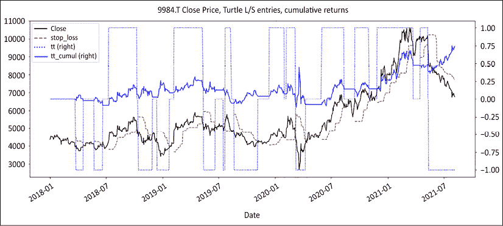

图 8.7：软银收盘价，多头/空头头寸，使用绝对系列的乌龟入门

上面的图表总结了策略。用黑色实线表示收盘价，紧随其后的是红色虚线的止损线。然后，我们有+/-1 的点线表示多头/空头头寸。最后，实线蓝色代表累积收益。

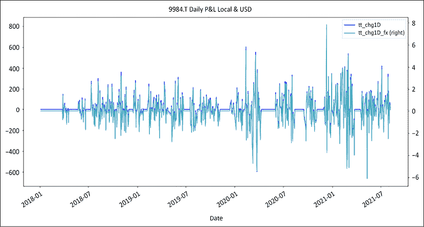

图 8.8：策略每日盈亏，以本地货币和美元计价

上图表示本地货币和调整为美元的每日盈亏。平直线表示没有活跃头寸时。

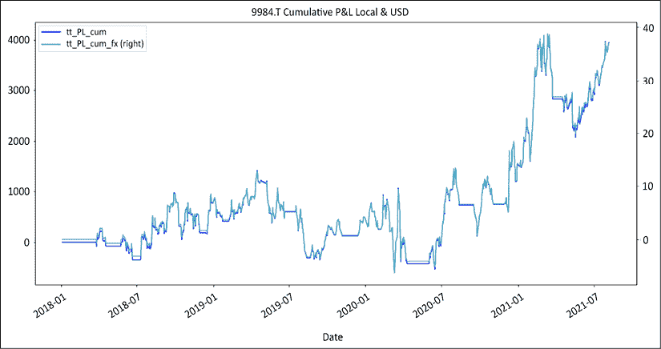

图 8.9：本地货币和美元中的策略累积盈亏

上图表示本地货币和美元中的累积盈亏。我们在同一工具上使用相同的策略，没有额外的特性，如基准或流动性调整。一切都严格相同。唯一的区别是仓位调整算法。

让我们定义几种标准的仓位调整算法。等权重在此处未定义，因为它是一个数值常量，相当于资产的 3%。与使用更多奇特的仓位调整算法相比，我们选择保持简单。我们将使用两种最流行的仓位调整算法：等权重和风险等值。接着我们将把它们与这个凹凸不平的风险等值进行比较。后两者是新加入的。首先，风险等值的源代码如下：

```py
def eqty_risk_shares(px,sl,eqty,risk,fx,lot):
    r = sl - px
    if fx > 0:
        budget = eqty * risk * fx
    else:
        budget = eqty * risk
    shares = round(budget // (r *lot) * lot,0)
#     print(r,budget,round(budget/r,0))
    return shares

px = 2000
sl = 2222

eqty = 100000
risk = -0.005
fx = 110
lot = 100

eqty_risk_shares(px,sl,eqty,risk,fx,lot) 
```

这将产生以下输出：

```py
-300.0 
```

上述函数返回使用价格（`px`）、以本地货币计价的止损（`sl`）、资产（`eqty`）、`risk`、基金货币中的`fx`，基金运作的货币以及`lot`大小的股票数量。在上面的示例中，这将返回 `-300` 股。

接下来，我们用 4 种仓位调整算法运行模拟：等权重、常数、凹凸风险等值：

```py
starting_capital = 1000000
lot = 100
mn = -0.0025
mx = -0.0075
avg = (mn + mx) / 2
tolerance= -0.1
equal_weight = 0.05
shs_fxd = shs_ccv = shs_cvx = shs_eql = 0
df.loc[df.index[0],'constant'] = df.loc[df.index[0],'concave'] = starting_capital
df.loc[df.index[0],'convex'] = df.loc[df.index[0],'equal_weight'] = starting_capital

for i in range(1,len(df)):
    df['equal_weight'].iat[i] = df['equal_weight'].iat[i-1] + df['tt_chg1D_fx'][i] * shs_eql
    df['constant'].iat[i] = df['constant'].iat[i-1] + df['tt_chg1D_fx'][i] * shs_fxd
    df['concave'].iat[i] = df['concave'].iat[i-1] + df['tt_chg1D_fx'][i] * shs_ccv
    df['convex'].iat[i] = df['convex'].iat[i-1] + df['tt_chg1D_fx'][i] * shs_cvx

    ccv = risk_appetite(eqty= df['concave'][:i], tolerance=tolerance, 
                        mn= mn, mx=mx, span=5, shape=-1)
    cvx = risk_appetite(eqty= df['convex'][:i], tolerance=tolerance, 
                        mn= mn, mx=mx, span=5, shape=1)

    if (df['tt'][i-1] ==0) & (df['tt'][i] !=0):
        px = df['Close'][i]
        sl = df['stop_loss'][i]
        fx  = df[ccy_name][i]
        shs_eql = (df['equal_weight'].iat[i]  * equal_weight  *fx//(px * lot)) * lot
        if px != sl:
            shs_fxd = eqty_risk_shares(px,sl,eqty= df['constant'].iat[i],
                                        risk= avg,fx=fx,lot=100)
            shs_ccv = eqty_risk_shares(px,sl,eqty= df['concave'].iat[i],
                                            risk= ccv[-1],fx=fx,lot=100)
            shs_cvx = eqty_risk_shares(px,sl,eqty= df['convex'].iat[i],
                                            risk= cvx[-1],fx=fx,lot=100)

df[['constant','concave','convex','equal_weight', 'tt_PL_cum_fx']].plot(figsize = (20,10), grid=True,
    style=['y.-','m--','g-.','b:', 'b'],secondary_y='tt_PL_cum_fx',
title= 'cumulative P&L, concave, convex, constant equity at risk, equal weight ') 
```

该代码的执行步骤如下：

1.  首先，我们实例化参数，如起始资本、货币、最小和最大风险、回撤容忍度和等权重。

1.  我们初始化每个`posSizer`的股票数量。我们也初始化每个`posSizer`的起始资本。

1.  我们循环遍历每个柱状图，通过将前一个值加上当前股票数量乘以每日盈利来重新计算每个资产曲线。

1.  我们在每个柱状图重新计算凹凸风险震荡器。

1.  如果有入场信号，我们计算每个`posSizer`的股票数量。`//`运算符是取模运算符。它返回除法的四舍五入整数。这是一个快速计算整数的妙招。注意凹凸之间唯一的区别是符号：`–1`或`+1`。

然后我们打印资产曲线，完成。顶部的虚线是凹凸的。下面，虚点线是凸的，接着是常数。次要垂直轴表示权重调整前的累积盈亏：

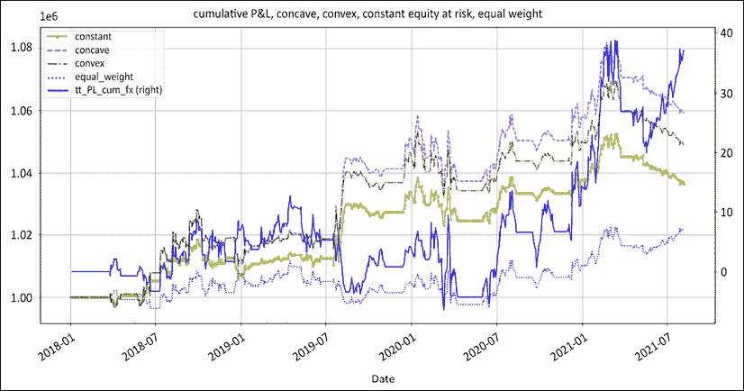

图 8.10：使用各种仓位调整算法的资产曲线

让我们在这里简要回顾一下。我们使用相同的策略，其中根据货币调整的累积回报由上面的实线蓝线表示。唯一的区别是资金管理。在远离地球的一个遥远星系中，行业标准的等权重排名靠后。在这种情况下，我们使用 5%的权益，这是一种经验丰富的机构经理人会称之为“高信心”的赌注大小。一个很好的倒数第二是恒定风险权益。它要么是第一档，要么是第五档。凹形风险权益令人惊讶地排在第一位。凸形在波动市场中的响应性更好，而凹形在趋势市场中表现良好。

重要的启示是，赚钱是在资金管理模块中完成的。你下注的聪明程度决定了你赚多少钱。最佳的投资回报不是来自于拜访更多公司、打更多电话、阅读更多分析师报告或者研究更多图表分析。最佳的投资回报来自于完善资金管理模块。

# 优化你的风险预算

在资金管理算法中稍加精细，会产生很大的作用。这导致我们在风险预算方面进行一些小的改进，如摊销和误报。

## 风险摊销

> "金字塔加仓的指导出现在一张美元钞票上。在上升过程中越来越小心地增加。在顶端保持警惕。"
> 
> – 埃德·赛科塔

空头方面有一套独特的挑战。成功的空头头寸会缩小。头寸需要定期加码。在现有头寸上增加头寸被称为**金字塔加仓**。金字塔加仓是一项微妙的业务。

一方面，趋势成熟。随着时间的流逝，逆转的概率增加。因此，每增加一个持仓，每笔交易的风险都应该降低。另一方面，新闻流的恶化验证了最初的看跌立场。市场参与者往往会诱使他们大幅增加投注。根据我的个人经验，每当市场评论员开始赞同我的立场，我开始感到聪明时，都会不可避免地出现一场讨厌的熊市反弹。

缓解进入成熟趋势的风险的一个简单方法是为每个新头寸摊销风险。以下代码片段是给那些通常增加头寸的市场参与者的建议。随着时间的流逝，随着风险的增加，应该减少头寸。

```py
def pyramid(position, root=2):
    '''
    position is the number of positions
    power is root n. 
    Conservative = 1, aggressive = position, default = 2
    '''
    return 1 / (1+position) ** (1/root)
def amortized_weight(raw_weight, amortization):
    '''
    raw_weight is the initial position size
    amortization is pyramid(position,root=2)
    '''
    return raw_weight * amortization
weight = 0.05
position = np.arange(1,4)
print('position', position)
print('linear',pyramid(position, root=1)* weight)
print('square root',pyramid(position, root=2)* weight)
print('position n',pyramid(position, root=position)* weight) 
```

在公式之后是一个数值示例。我们从 5%的头寸大小(`weight`)开始。我们使用`np.arange`方法重新进入三次。然后，我们使用各种摊销计算了对原始头寸的 3 次增加的建议权重大小，得到以下结果：

```py
position [1 2 3]
linear [0.025      0.01666667 0.0125    ]
square root [0.03535534 0.02886751 0.025     ]
position n [0.025      0.02886751 0.03149803] 
```

`linear` 代表无权力。在第一个额外的分段中，仓位大小为原始仓位（`0.025`）的 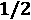 ，第二个分段为 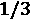 ，以此类推。使用 `square root` 暗示了第一个额外分段的大小为原始仓位（`0.3535`）的 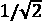 倍，第二个仓位的大小为原始仓位的 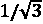 倍。 `position n` 暗示了第一个额外分段的大小为原始仓位的 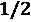 倍，与线性分段相同，第二个分段的大小为原始仓位的 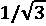 倍，与平方根摊销相同，依此类推。

平方根可能是一个不错的折中方案。它使市场参与者能够承担相当大的风险而不至于面临破产的风险。再次强调，卖空是一个仓位规模的练习，而不是一场股票挑选比赛。小仓位没有贡献。大仓位是有风险的。有一个最佳数量，对此我们内心的白痴完全不会有任何反应。再一次，市场参与者可以选择保守还是积极。有老交易员和大胆交易员。老而大胆的交易员极少。

## 假阳性

并非所有交易第一次就奏效。有时，一只股票需要两三次尝试才能最终按预期行事。这对股权曲线造成了损失。市场参与者经常受到诱惑，对其信号引擎进行全面改革和调整，以减少假阳性的频率。尽管对导致不良交易的盲点进行改进可能有一些价值，但毫无疑问，接受假阳性也是旅程的一部分。无法消除随机性。

我们通常很擅长处理生活中其他领域的失望。当某事不起作用时，我们会投入更少的时间和精力。同样，解决方案可能不是对信号引擎的又一次调整。当股票拒绝按预期行事时，继续尝试，只是投资更少。这归结为上文定义的风险摊销函数。为每次失败的尝试分摊风险。

## 订单优先级和交易拒绝

在某个时候，你会有更多的信号而没有足够的资金去投资。你将不得不做出艰难的选择和优先选择信号。最简单的订单优先级算法是大小：尺寸越大，风险/回报越高。按绝对尺寸降序排列所有头寸。并不是因为你坐在办公桌前，市场开放，你就应该毫无节制地交易。选择不交易是一个重要的交易决定。

交易拒绝是做空者武器库中的重要工具。在多头方面，小头寸可以发展成强大的持仓。比尔·盖茨在 1997 年 8 月以每股 12 美元的价格购买了 AAPL 股票。另一方面，在做空方面，一个-0.50%的头寸下跌-10%只会贡献-0.05%。这几乎不是吸引投资者的回报方式。当头寸太小而无法造成伤害时，它们也太小而无法做出贡献。

可能导致持有小头寸的原因可能是：

+   表现出现了“软裁判”

+   这种特定策略现在不受欢迎了

+   这一方面（多头/空头）不起作用

+   仪器本身的胜率令人沮丧

+   已经有几个入场

无论原因是什么，这都不是一个明显的机会，所以你希望保持你的筹码清醒。

## 头寸大小的博弈论

> “你可以通过观察学到很多东西。”
> 
> – 尤吉·贝拉，伟大的美国哲学家

最近的计算技术进步鼓励市场参与者尝试运用博弈论，尤其是在股票选择方面。博弈论也非常适合用于头寸大小的确定。使用博弈论进行入场的区别在于，结果是二进制的：要么入场，要么不入场。在那里几乎没有学习的可能性，因为没有人会统计未做出的选择。除非你是一个可怕的跟踪者，你不会去关注你没有娶的前任。

股票曲线侵蚀的主要原因之一是虚假阳性。一些股票可能会有两三次虚假的起步，然后才真正起飞。然后，需要时间来偿还这些虚假的起步。与此同时，一些股票在第一次尝试时表现良好。在被称为股票市场的概率游戏中，没有办法提前知道哪个会是哪个。奖励那些表现良好的股票，并为那些表现不佳的股票摊销风险是一种简单的启发式。这就是博弈论和一个可爱的小故事发挥作用的地方。

这是我们用来奖励表现良好的股票的算法背后的故事。有一次我早早地到校接孩子。我女儿正在玩一个我们小时候都玩过的游戏，所以我就坐在那里看着。有趣的是，她最终赢了，并不是因为她试图预测什么，而是因为她在每一轮后都系统地做出反应。她模仿了每个参与者的行为：对那些对她友好的人友好，反之亦然，以牙还牙。这让我想到了一个简单的博弈论启发式。

快进几天在谷歌上的研究，结果表明以牙还牙的启发式在博弈论算法比赛中一再获得第一。不用说，这个博弈论模块很快就被引入我们的头寸大小方法中，用我女儿的名字命名，“Alizee”（发音为*Alizay*，法语中的*trade winds*）。以牙还牙是一个可靠的算法。惩罚不良行为，奖励良好行为。

# 总结

每个人都想挑选下一个 [插入热门股票代码...]。选股票很性感。然而，如果你选择进入市场赚钱，那么就要成为乏味艺术的学生。赚钱在于资金管理模块。在本章中，我们揭示了一个小功能，将风险设置委托给市场，并将持续改变经验丰富的市场参与者的睡眠质量。

接下来，我们将探讨风险。在空头方面，市场不合作。市场达尔文主义规定，幸存的空头卖方展示了卓越的风险管理能力。
