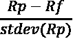
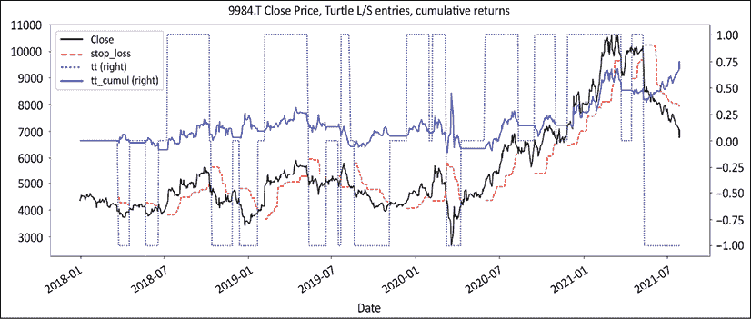
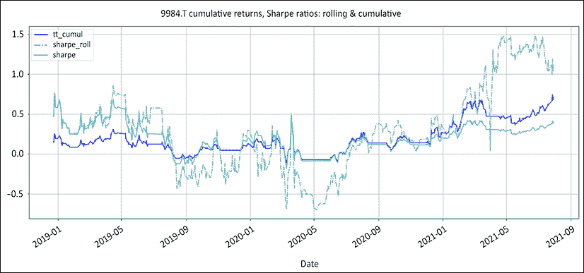
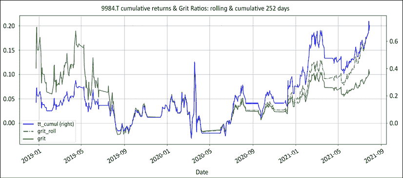
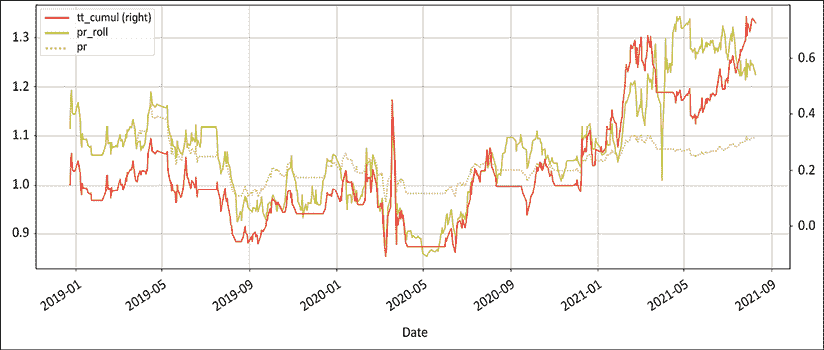
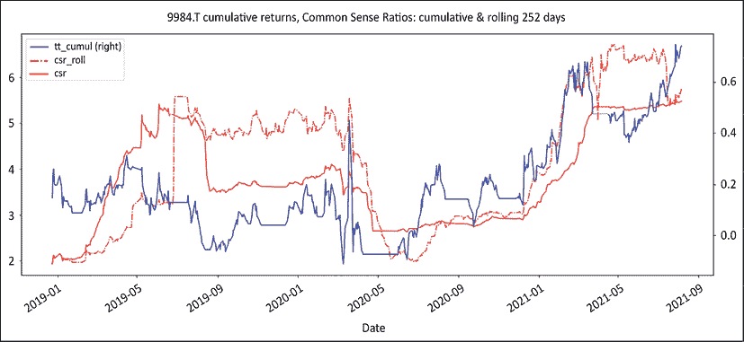
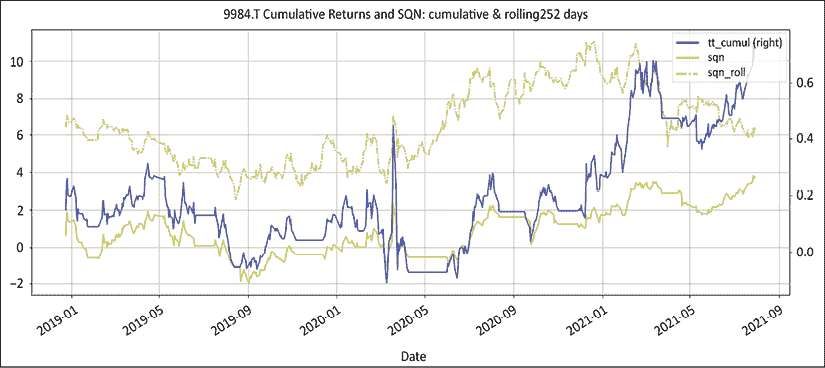
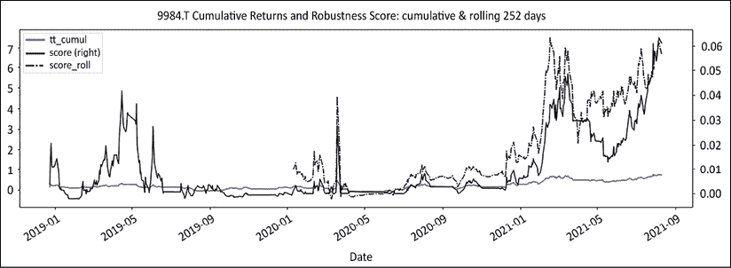

# 第九章：风险是一个数字

> “事实固执，但统计数据更易变。”
> 
> – 马克·吐温

归根结底，无论你交易美国股票、猪肚或与你的另一半交换的色彩语言，你只交易一件事：风险。学者们以开发复杂抽象指标并赋予其花哨名称来建立自己的职业。指标越深奥，他们就越有可能在某处获得终身教职。通过数学恐吓来证明是获得舒适的学术终身教职的简单途径。不幸的是，这些指标忽略了不懂行的客户在忍受令人绞痛的回撤时的体验。当市场参与者和投资者无法将抽象数字与管理投资组合的现实相 reconcil 时，他们会回到故事中。

在本章中，我们将介绍三个指标：坚韧指数、常识比率和增益期望的 t-统计量。我们的目标是揭示风险的神秘面纱，将其还原为每个人都能直观理解的东西。

我们将涵盖以下主题：

+   导入库

+   解读风险

+   夏普比率：错误问题的正确数学答案

+   坚韧指数

+   常识比率

+   范·塞普的 SQN

+   鲁棒性分数

您可以通过以下链接访问本章节所有图片的彩色版本：[`static.packt-cdn.com/downloads/9781801815192_ColorImages.pdf`](https://static.packt-cdn.com/downloads/9781801815192_ColorImages.pdf)。您还可以通过本书的 GitHub 仓库访问本章节的源代码：[`github.com/PacktPublishing/Algorithmic-Short-Selling-with-Python-Published-by-Packt`](https://github.com/PacktPublishing/Algorithmic-Short-Selling-with-Python-Published-by-Packt)。

# 导入库

在本章和本书的其余部分，我们将使用`pandas`、`numpy`、`yfinance`和`matplotlib`库。因此，请记得先导入它们：

```py
# Import Libraries
import pandas as pd
import numpy as np
import yfinance as yf
%matplotlib inline
import matplotlib.pyplot as plt 
```

# 解读风险

在空头市场，市场不配合。市场达尔文主义规定，卖空者成为杰出的风险管理者。在接下来的几节中，我们将探讨三个被极大低估的风险指标及其源代码。使用其中任何一个或全部校准风险，你可能会有长期的抗争机会。当被问及风险时，市场参与者通常会做两件事之一。

第一个方法是推出一系列指标。他们从夏普比率开始，加上一些跟踪误差的度量，用索汀诺调味，一勺特雷诺尔，一滴詹森阿尔法使其看起来不错，最后用信息比率润色，就可以提供给一群假装喜欢数字“高级烹饪”的客户了。指标的不加区分地繁殖告诉我们一件事：我们天生无法理解风险。

市场参与者的第二件事是陷入论文模式。他们讲述联邦储备系统、量化宽松、利率、技术扰动（新潮流的新同义词）等故事，[在此插入一长串警报性新闻流的清单…]。

在金融领域的俚语中，对于一个谁也无法控制的未来的所有恐惧的总和被称为**忧虑之墙**。

风险不是所有恐惧的总和。风险不是一个故事。风险是一个数字。在微观层面上，它是你在单笔交易上能承受的损失量。在投资组合层面上，它是你能承受的全部回撤量，仍然能够赢得胜利。在专业层面上，它是你能够在某人不拘礼仪地拔掉插头之前失去的金额、频率和时间长度。在生活方式层面上，它是你可以在跳到下一个商店之前多久一次数学教给厌烦的高中生的频率。

没有人能预测这个世界会发生什么，但每个市场参与者都可以控制他们的投资组合对冲击的脆弱性。在 *第一章*，*股票市场游戏* 中，我们考虑了有限与无限游戏。无限游戏的目标是保持在游戏中。如果你想玩无限游戏，那么你就需要专注于那些毫不妥协地评估你的生存能力，并让你能够活下去进行下一轮交易的指标。因此，衡量健壮性的逻辑方式就是在方程中的某个地方包含回撤。

# Sharpe 比率：错误问题的正确数学答案

Sharpe 比率是行业生活中如此复杂的一部分，以至于一个平凡的问候，比如“你好吗？”很容易就能被换成“你的 Sharpe 指数如何？” 这个比率试图回答的问题在概念上很简单：对于每个波动单位，你能获得多少个超过无风险资产的超额收益单位？现在，所有的问题都不是源于公式，而是源于人们赋予波动的意义。波动是坏的、有风险的还是不确定的？

这是 Sharpe 比率的数学公式，其中 Rp 等于资产收益，而 Rf 等于无风险收益：



这个比率考虑了超过无风险资产的年化平均超额收益与这些收益的标准偏差之比。标准偏差衡量了与中位收益的方差。收益越波动，标准偏差越高，比率就越低（反之亦然）。超过无风险资产的超额收益是一个简单的测试：对于每增加一个波动单位，你是否更适合将资金放在特定的经理那里，还是将其安全地放在国债或货币市场基金中？

即使天才威廉·夏普也对他创造的并且现在已经成为默认行业标准的衡量指标——夏普比率——提出了批评。这个指标达到了它的目的。它有两件事情做得非常好：

1.  **跨资产统一度量**: 现在普遍认为，α 生成中最关键的组成部分是资产配置。困难在于跨资产类别有一个统一的风险调整后的 α 度量。这就是夏普比率发挥作用的地方。它可以在固定收益、股票、商品等各种资产类别中计算。

1.  **不确定性**：人类大脑天生与风险联系在一起。它触发杏仁核并激活战斗、逃跑或冻结的反应。

现在，夏普比率是在 1966 年发明的。它是在革命时代的革命性发明：埃尔·切·格瓦拉和菲德尔·卡斯特罗仍在古巴与巴蒂斯塔作战。正如先驱威廉·夏普本人所说的，当计算能力仍然有限时，这是一个好东西。但从那时起，时代已经改变了。医生已经停止给孕妇开处方香烟，塑料已经成为主导的海洋物种，比送人上月球的计算机更强大的计算机现在可以装在每个人的口袋里。

首先，让我们以我们最喜欢的 *乌龟入门* 策略为例，并重用`regime_breakout()`和`turtle_trader()`函数。我们将在滚动和累积系列上计算风险指标。这个策略是在绝对系列上运行的。这里纯粹是为了教育目的。

```py
def regime_breakout(df,_h,_l,window):
    hl =  np.where(df[_h] == df[_h].rolling(window).max(),1,
                                np.where(df[_l] == df[_l].rolling(window).min(), -1,np.nan))
    roll_hl = pd.Series(index= df.index, data= hl).fillna(method= 'ffill')
    return roll_hl
def turtle_trader(df, _h, _l, slow, fast):
    _slow = regime_breakout(df,_h,_l,window = slow)
    _fast = regime_breakout(df,_h,_l,window = fast)
    turtle = pd. Series(index= df.index, 
                        data = np.where(_slow == 1,np.where(_fast == 1,1,0), 
                                np.where(_slow == -1, np.where(_fast ==-1,-1,0),0)))
    return turtle
ticker = '9984.T' # Softbank
start = '2017-12-31'
end = None
df =  round(yf.download(tickers= ticker,start= start, end = end, 
       interval = "1d",group_by = 'column',auto_adjust = True, 
prepost = True, treads = True, proxy = None),0)
slow = 50
fast = 20 
#### removed for brevity: check GitHub page for full code ####
df[['Close','stop_loss','tt','tt_cumul']].plot(secondary_y=['tt','tt_cumul'],
                                  figsize=(20,8),style= ['k','r--','b:','b'],
                       title= str(ticker)+' Close Price, Turtle L/S entries, cumulative returns') 
```

使用对数收益而不是算术收益。它们更容易处理。累积收益是每日收益的总和，对其应用`np.exp`方法。



图 9.1：Softbank 乌龟入门，仓位和回报

这也是我们之前看过的一张图。它显示了 Softbank 的收盘价，带有一个在收盘价之上或之下的跟踪止损。它显示了多头和空头仓位以及累积回报。现在我们有了一个策略，让我们在滚动和累积基础上运行风险指标。

我们将从夏普比率开始。无风险回报设置为任意的十分之一个基点。

```py
r_f = 0.00001 # risk free returns

def rolling_sharpe(returns, r_f, window):
    # Calculating average returns in a rolling window
    avg_returns = returns.rolling(window).mean()
    # Calculating the volatility of average returns in a rolling window
    std_returns = returns.rolling(window).std(ddof=0)
    # Rolling Sharpe ratio function
    return (avg_returns - r_f) / std_returns

def expanding_sharpe(returns, r_f):
    avg_returns = returns.expanding().mean()
    std_returns = returns.expanding().std(ddof=0)
    return (avg_returns - r_f) / std_returns

window = 252 
df['sharpe_roll'] = rolling_sharpe(returns= tt_log_returns, r_f= r_f, window= window) * 252**0.5

df['sharpe'] = expanding_sharpe(returns= tt_log_returns, r_f= r_f) * 252**0.5

df[window:][['tt_cumul','sharpe_roll','sharpe'] ].plot(figsize = (20,8),style = ['b','c-.','c'],grid=True,
title = str(ticker)+' cumulative returns, Sharpe ratios: rolling & cumulative') 
```

代码没有什么大秘密。首先，我们计算滚动夏普，然后计算累积夏普。结果使用标准公式进行年化处理：252 个工作日的平方根。



图 9.2：Softbank 累积回报和夏普比率：滚动和累积

滚动夏普虚线比代表累积夏普的实线更具波动性和响应性。这仅仅是由于数据样本大小。

风险经常被等同于波动性。它构成了可接受的公式。在这种情况下，夏普比率似乎是风险调整后回报的完美指标。唯一的问题在于，在实践中，波动性并不是风险的衡量标准。为了证明这一点，让我们提出几个夏普比率很高的策略，它们一夜之间就遇到了冰山，还有一些夏普比率很低的策略表现出色地经受住了考验。现在，一些低波动策略非常危险。以下是一些例子：

1.  **长期资本管理公司**（**LTCM**）在他们破产前的几个月采用了相当低的波动率策略。他们进行均值回归策略交易。这些策略具有一致的低波动率回报，有利于高夏普比率。也许他们能够经受得住一个诺贝尔奖，但两个就太多了。

1.  **短期伽玛波动基金**：在大萧条前，波动基金是时髦的投资工具。他们的策略包括通过出售**虚值**（**OTM**）期权来收取保费。由于这些期权到期为实值的概率极低，它们产生了一致的低波动率表现。它们的夏普比率高于行业平均水平。一切都进行得很顺利，直到波动率飙升并且期权到期为实值。损失呈指数增长，积累多年的回报在几周内化为乌有。短期伽玛就像是在巨大的枪管中玩一场统计学的俄罗斯轮盘赌。在你自杀的那一天之前，什么都不会发生。在行业术语中，这被称为“在蒸汽压路机前捡便士”。

相反，一些波动性策略具有异常强大的业绩记录，尽管夏普比率糟糕。作为一个群体，像保罗·图多·琼斯、艾德·赛科塔、比尔·邓恩和威廉·埃克哈特这样的系统性趋势跟踪**商品交易顾问**（**CTAs**）在过去几十年一直在阿尔法产生金字塔上居高不下。回报是不稳定的。趋势跟踪者大部分时间都在保护他们的资本，在一年中只有几次收获超额回报。

总的来说，对于其创作者应给予一切谦逊的尊重，夏普比率是错误问题的正确数学答案。波动率是衡量风险的正确标准吗？夏普比率是一种波动率调整后的回报度量。波动率不等于风险，但反映了不确定性。尽管不确定性可能会在我们的哺乳动物大脑中触发一些警报，但作为市场参与者，我们的工作描述清楚地指出：“要对不适感感到舒适。”

# 建立一个综合风险指标

接下来的三个指标可以说更接近风险的近似值，并且更直观。

## 韧性指数

> “当我离开餐厅时坐在格莱斯顿旁边，我觉得他是英格兰最聪明的人。但当我坐在迪斯雷利旁边时，我离开时感到自己是英格兰最聪明的女人。”
> 
> – 温斯顿·丘吉尔的母亲，珍妮·杰罗姆

投资者常常表现出与其利益相悖的行为。他们说他们想要回报，但却对回撤做出反应。更具体地说，他们对回撤有三种反应方式：

+   **幅度**：永远不要测试你的投资者的胃口

+   **频率**：永远不要测试你的投资者的神经

+   **恢复期**：永远不要测试你的投资者的耐心

**Grit 指数**可以说是整个金融宇宙中最被低估的指标之一。少数几个指标能如此优雅地捕捉到稳健性。广义上讲，它通过将绩效除以一段时间内的全部损失表面来查看下行风险。该指数具有一种数学表达方式，如此直观，以至于任何人都能可视化它。对于多么长时间地为损失的众多和巨大而苦恼的时光似乎已经是很久以前的事了。

表面的数学计算称为**积分**。接下来，由于这些损失显然会影响到财务和情感资本，它们应该位于分母中。

最终投资者感知的是收益。而 Grit 指数则是最终投资者最终获得的除以所有损失的痛苦。这个公式最初由彼得·G·马丁于 1987 年发明，并在他的书《The Investor's Guide to Fidelity Funds》中发表为**溃疡指数**。传奇交易员 Ed Seykota 将其重新利用并将其命名为**塞科塔湖比率**。这些都是完全相同的公式，只是名称不同。由于溃疡指数或塞科塔湖比率可能未能引起它们真正应得的关注，那么将其重新命名为 Grit 指数如何？

以下是源代码：

```py
def rolling_grit(cumul_returns, window):
    tt_rolling_peak = cumul_returns.rolling(window).max()
    drawdown_squared = (cumul_returns - tt_rolling_peak) ** 2
    ulcer = drawdown_squared.rolling(window).sum() ** 0.5
    return cumul_returns / ulcer

def expanding_grit(cumul_returns):
    tt_peak = cumul_returns.expanding().max()
    drawdown_squared = (cumul_returns - tt_peak) ** 2
    ulcer = drawdown_squared.expanding().sum() ** 0.5
    return cumul_returns / ulcer

window = 252
df['grit_roll'] = rolling_grit(cumul_returns= df['tt_cumul'] , window = window)
df['grit'] = expanding_grit(cumul_returns= df['tt_cumul'])
df[window:][['tt_cumul','grit_roll', 'grit'] ].plot(figsize = (20,8), 
                secondary_y = 'tt_cumul',style = ['b','g-.','g'],grid=True,
    title = str(ticker) + ' cumulative returns & Grit Ratios: rolling & cumulative '+ str(window) + ' days') 
```

Grit 计算序列如下：

1.  使用 `rolling().max()` 或 `expanding().max()` 计算峰值累积收益

1.  通过从峰值减去累积收益并对其进行平方来计算平方回撤

1.  通过取平方回撤的平方根来计算最小二乘和

1.  将累积收益除以溃疡指数

该代码生成以下图表：



图 9.3：Softbank 累积收益和 Grit 比率：滚动和累积

让我们来看看图表的进展。在上半部分，Grit 指数反映了绩效。在下半部分，绩效跳升，但回撤的幅度和持续时间也随之增加。该指数落后于流星般的上升。该策略有效，但存在一些回撤期，因此指数平平。该度量标准仅使用了对投资者真正重要的两个变量：绩效和回撤。如果将绩效视为最终目的地，那么将其除以损失面积就显示了旅程，以及道路上的所有颠簸。

在一天结束时，人类之所以无法取得伟大成就并非因为没有崇高的目标。他们放弃的原因在于旅程的艰辛。而这正是这个比率的作用。这个指数达到了与夏普比率相同的效果，同时考虑到了通往优异表现的漫长道路上的所有颠簸。它相对于夏普比率具有以下优点：

1.  **跨资产统一度量**: 它在每种资产类别、每种策略、每个时间框架中均匀工作，在绝对和相对系列中均匀工作。

1.  **不确定性**：这个指标专注于投资者真正关心的回撤方面：幅度、频率和恢复周期。相比之下，夏普比率将不确定性与恐惧混为一谈。它惩罚高波动性策略，而不管它们的盈利能力如何。

它比夏普比率做得更多。反向工程高夏普比率的最简单方法是减少波动性。只要波动性被压缩，即使是最温和的回报看起来也不错。微小的分母将放大任何中等的分子。难怪资金流向固定收入。回报率非常平庸，但是非常可预测。

另一方面，坚韧指数关注的是累积而不是平均收益。这是退休后银行账单底部的数字。因此，这一指标对稳定的中等稳定收入类型的容忍度较低。然而，这个指数也会惩罚投资者真正关心的唯一事情：下行波动性。退休后，养老金领取者只关注他们账户中的总金额。他们不关心平均每日收益的稳定性。稳定的日常收益对基金经理来说是一种令人愉悦的衡量标准，而不是对养老金领取者来说。当市场参与者使用夏普比率或**资本资产定价模型**（**CAPM**）来配置资产时，他们会以稳定性换取回报。固定收入的夏普比率比股票高。它还有哮喘般的回报。

坚韧指标的特权在于，即使对于完全财务无知的人来说，它也会强加于他们自己。没有比生活更好的隐喻来解释这一指标了。绩效是你取得的成就。生活是你做其他计划时发生的事情，以及一路上的所有挫折。将你的成就除以障碍，你就得到了一个相当健壮的坚韧度量。在实践中，坚韧指数的健壮性意味着它可以用作策略之间的资产配置关键。

## 常识比率

> “常识并不常见。”
> 
> –伏尔泰，自由斗士

进入杰克·施瓦格。在我的个人愿望清单上，与《市场巫师》系列作者进行一对一会议几乎就像是得到了“非常感谢”从埃尔维斯或从詹姆斯·布朗那里得到了输血。几十年前出版的他的书现在和当时一样相关。

我有幸促成施瓦格先生在东京的一次亚洲证券投资会议上发表主题演讲。所以，我们在讨论他被低估的智慧之宝，《市场的感觉与胡言乱语》。在其中，他讨论了得益于痛苦的比率，更为人所熟知的是**利润比率**。

本质上，这是交易边缘/收益期望的分数版本。在谈话中的某个时刻，我介绍了我的自制小指标，一个两个比率的混合物，他的回答是，“嗯，这是常识。”大师已经说过了。我现在可以死了，虽然有点困惑。几个小时后回到牧场，我向老板揭示了它并解释了理由：“是啊，老兄，这是常识，”我的老板大大地阐述道。

当两个人的尊重被以对数刻度绘制时达成相同的结论……哇：**常识比率**（**CSR**）诞生了。这个度量背后的原理是有两种方式失败：要么是积分，要么是被击倒。策略失败的两种方式是要么有过多的累积损失，要么是少数毁灭性打击。这回到了曾经交易的两种类型的策略：趋势跟踪或均值回归。趋势跟踪相关的风险在于聚合。均值回归相关的风险在于尾部。

两种策略具有不同的风险因素，聚合或尾部。它们需要不同的风险度量标准。CSR 的理由是提出一个统一的度量标准。回到小学时代，当我的数学技能还没有达到一个“永久性的低水平”时，有这样一个奇妙的乘法传递性概念。将这两种策略的风险度量标准最简单的结合方法是将利润与痛苦（利润）比率乘以尾部比率。以下是*第六章*，“交易边缘是一个数字，这是一个公式”的原始代码的复习，再加上 CSR：

```py
def rolling_profits(returns,window):
#### removed for brevity: check GitHub repo for full code ####
def rolling_losses(returns,window):
#### removed for brevity: check GitHub repo for full code ####
def expanding_profits(returns): 
#### removed for brevity: check GitHub repo for full code ####
def expanding_losses(returns): 
#### removed for brevity: check GitHub repo for full code ####
def profit_ratio(profits, losses):    
#### removed for brevity: check GitHub repo for full code ####
def rolling_tail_ratio(cumul_returns, window, percentile,limit):
    left_tail = np.abs(cumul_returns.rolling(window).quantile(percentile))
    right_tail = cumul_returns.rolling(window).quantile(1-percentile)
    np.seterr(all='ignore')
    tail = np.maximum(np.minimum(right_tail / left_tail,limit),-limit)
    return tail

def expanding_tail_ratio(cumul_returns, percentile,limit):
    left_tail = np.abs(cumul_returns.expanding().quantile(percentile))
    right_tail = cumul_returns.expanding().quantile(1 - percentile)
    np.seterr(all='ignore')
    tail = np.maximum(np.minimum(right_tail / left_tail,limit),-limit)
    return tail

def common_sense_ratio(pr,tr):
    return pr * tr    
window = 252
df['pr_roll'] = profit_ratio(profits= rolling_profits(returns = tt_log_returns,window = window), 
                             losses= rolling_losses(returns = tt_log_returns,window = window))
df['pr'] = profit_ratio(profits= expanding_profits(returns= tt_log_returns), 
                             losses= expanding_losses(returns = tt_log_returns))

df[window:] [['tt_cumul','pr_roll','pr'] ].plot(figsize = (20,8),secondary_y= ['tt_cumul'], 
                            style = ['r','y','y:'],grid=True) 
```

在这里，我们计算滚动和累积比率并打印它们：



图 9.4：累积收益和常识比率：累积和滚动

利润比率是趋势跟踪策略最合适的风险度量标准。风险在于聚合，正如我们在*第六章*，“交易边缘是一个数字，这是一个公式”和*第八章*，“头寸规模：货币是在货币管理模块中赚的”中看到的。前面的图表显示了一个健康但不太出色的利润比率。换句话说，该策略在其当前的代理人（直立人的祖先）格式下似乎是有效的。

我们将以 CSR 作为结论，它是利润比率和尾部比率的乘积：

```py
window = 252

df['tr_roll'] = rolling_tail_ratio(cumul_returns= df['tt_cumul'], 
                             window= window, percentile= 0.05,limit=5)
df['tr'] = expanding_tail_ratio(cumul_returns= df['tt_cumul'], percentile= 0.05,limit=5)

df['csr_roll'] = common_sense_ratio(pr= df['pr_roll'],tr= df['tr_roll'])
df['csr'] = common_sense_ratio(pr= df['pr'],tr= df['tr'])

df[window:] [['tt_cumul','csr_roll','csr'] ].plot(secondary_y= ['tt_cumul'],style = ['b','r-.','r'], figsize = (20,8),
    title= str(ticker)+' cumulative returns, Common Sense Ratios: cumulative &  rolling '+str(window)+ ' days') 
```

图表反映了相对健康的 CSR，没有隐藏的惊喜。



图 9.5：累积收益和常识比率：累积和滚动

对于趋势跟踪策略而言，会引起担忧的模式是指数值越来越重。随着策略的进展，累积损失的权重将越来越重要。对于均值回归策略而言，会引起担忧的模式是稳定的低值指数突然下降。这表明利润无法弥补损失。

CSR 指标重新评估了两种策略相关的风险。它还强烈提示了从损失中恢复以及策略的周期性的能力。以下示例演示了这个指标在实践中的运作方式。

示例 1：假设一种策略每年返回 10%。最佳月份的 95^(th) 百分位点为 +0.6%，而最差月份的 5^(th) 百分位点为 -2%。可以计算出以下值：

+   收益与痛苦比 = 1.1

+   尾比 = |0.6%/-2%| = 0.3

+   CSR = 1.1 * 0.3 = 0.33

CSR 低于 1 表明该策略容易受到冲击。比率低于 0.5 意味着该策略可能无法从严重冲击中恢复。CSR 尤其有效地识别了均值回归策略中的隐藏风险。均值回归策略给人以稳定和健壮的外观。利润以节拍器般的规律性滚入。然而，不可预测的左尾事件会扰乱这种稳定性。

这种策略似乎会产生稳定的 +10% 每年的利润，但 0.3 的尾比表明，它需要三倍的时间来从事故中恢复。唯一重要的问题是：投资者是否有足够的耐心，还是会削减损失并寻找其他投资渠道？这个问题的答案可能可以在 2007 年量化交易员的覆灭故事中找到。那些策略多年来表现良好，但当它们经历意外的回撤时，相对于它们的月平均回报来说是相对较大的，投资者会赎回。

我们将考虑以前策略的一些失败以及一些需要避免的陷阱，在 *第十章*，*优化投资领域* 中。

示例 2：假设一种策略在完整周期内落后于基准 2%（GPR = 0.98）。假设赢家是输家的三倍大，或者尾比为 3。再次计算出先前定义的函数的必要值：

+   收益与痛苦比 = 0.98

+   尾比 = 3

+   CSR = 0.98 * 3 = 2.94

由于相对的收益与痛苦比为 0.98，你可能会想，“为什么要投资一个随着时间推移而亏损的投资渠道呢？”欢迎来到你的平均**共同基金**。随着时间的推移，费用会侵蚀绩效，导致共同基金表现不佳。然而，绩效是周期性的。有时，经理们表现出色。CSR 是一种简单的入市和更重要的是退出市场的时机。高 CSR 结合次优的利润/收益与痛苦比是强烈季节性的证据。这些产品在某些时候运作得非常好，但在长期内失败。在 *第五章*，*制度定义* 中，我们看到了几种制度定义方法，这些方法应该有助于识别季节性。 

## 范·萨普的 SQN

这个统计量是由范·萨普博士重新带回人们的视线。系统质量数 SQN® 是对久负盛名的 t-统计量的精彩解释。它具备衡量稳健性所需的所有要素。首先，只有当策略具备交易优势时才是可行的。直到盈利预期变为正之前，一切都不会发生。

其次，它包含交易频率。挣钱是一回事，按时交易是另一回事。策略能够在维持正盈利预期的同时进行更多交易，收益复利速度越快。时间是立即跳入脑海的变量。

市场参与者应尽可能降低时间框架，只要他们能够维持正盈利预期。例如，一个在日线和 4 小时线上可行的策略将在较低的时间框架上生成更多信号。此外，较短的时间框架意味着更紧密的止损和更大的仓位，但也意味着信号更嘈杂。

第三，结果被归一化。它们以标准偏差表示，这在这种情况下意味着交易优势的波动性。当涉及到收益时，每个人都喜欢高峰，但没有人喜欢低谷。最后但并非最不重要的，代码实现起来非常简单：

```py
def expectancy(win_rate,avg_win,avg_loss):  
    # win% * avg_win% - loss% * abs(avg_loss%) 
    return win_rate * avg_win + (1-win_rate) * avg_loss 
def t_stat(signal_count, trading_edge): 
    sqn = (signal_count ** 0.5) * trading_edge / trading_edge.std(ddof=0) 
    return sqn 
# Trade Count
df['trades'] = df.loc[(df['tt'].diff() !=0) & (pd.notnull(df['tt'])),'tt'].abs().cumsum()
signal_count = df['trades'].fillna(method='ffill')
signal_roll = signal_count.diff(window)
# Rolling t_stat
#### removed for brevity: check GitHub repo for full code ####
# Cumulative t-stat
#### removed for brevity: check GitHub repo for full code ####
df[window:][['tt_cumul','sqn','sqn_roll'] ].plot(figsize = (20,8),
                secondary_y= ['tt_cumul'], grid= True,style = ['b','y','y-.'], 
                 title= str(ticker)+' Cumulative Returns and SQN: cumulative & rolling'+ str(window)+' days') 
```

代码的工作方式如下：

1.  需要将信号数量与制度分开。`.diff()` 识别制度变化的时候：从 0 到 1，反之亦然。`notnull()` 方法确保信号在进入时被计算一次。从那里开始，`abs()` 将所有交易计算为一个。通过 `cumsum()` 进行累积和。然后，`fillna` 方法向前填充所有缺失的值。`.diff(window)` 应用于交易列，返回滚动交易数量。

1.  接下来，我们计算滚动系列。复制每日收益并将亏损日标记为 N/A。这样就留下了正收益。我们计算移动平均计数并将其除以窗口。类似地，我们计算滚动利润和损失，并将它们除以窗口。

1.  累计计算的方法略有不同。使用扩展方法计算收益的累积计数。以相同的方式计算正收益的累积计数。然后，计算胜率、平均获胜和损失。

1.  我们在 *第六章*，“交易优势是一个数字，这是计算公式” 中重用了盈利预期的代码。

SQN 是常规 t-统计量，以盈利预期和信号计数作为输入变量。我们将交易次数的平方根乘以盈利预期的信息比率。执行交易员的英文翻译是：我们将交易频率纳入交易优势。



图 9.6：软银累计收益和 t-统计量（范·萨普 SQN）：累积和滚动

如果没有交易频率，SQN 将只是夏普比率的另一种变体，而使用收益期望而不是平均回报。相反，它是一个非常有用的函数，它同时包含了交易频率和优势。例如，如果一种策略赚钱但是每隔一个闰年才交易，投资者可能不会坚持下去。相反，如果一种策略在从每天到 1 小时的较低时间框架中保持相同的正面优势，那么交易更低的时间框架以更快地复利利润将更有意义。

# 稳健性分数

> "马萨拉：用于印度烹饪的各种混合香料。"
> 
> – 韦氏词典

坚韧指数、常识比率和范·塞尔普的 SQN 都衡量了稳健性。坚韧指数可能是非金融人士最优雅和易于理解的度量标准。CSR 是一个很好的预警指标，可以查找可疑的均值回归策略。SQN 是一个可靠的质量指标。它们都起作用。它们衡量稳健性的特定方面：

1.  坚韧指数整合了整个周期的损失。它为所有下行方面的表现提供了准确的视野：幅度、频率和持续时间。

1.  CSR 将两种类型策略固有的风险组合到一个单一度量中。它显示了每个度量标准的风险如何平衡。

1.  t-统计量 SQN 将交易频率纳入交易优势公式中，以显示资本的最有效使用。

然而，在公开抨击风险指标泛滥之后，提出三个稳健性度量标准可能会显得有点虚伪。最简单的解决方案是将它们全部放在一起，然后使用乘法的传递性搅拌：

```py
def robustness_score(grit,csr,sqn): 
    start_date = max(grit[pd.notnull(grit)].index[0],
               csr[pd.notnull(csr)].index[0],
               sqn[pd.notnull(sqn)].index[0])
    score = grit * csr * sqn / (grit[start_date] * csr[start_date] *
    sqn[start_date])
    return score

df['score_roll'] = robustness_score(grit = df['grit_roll'], csr = df['csr_roll'],sqn= df['sqn_roll'])
df['score'] = robustness_score(grit = df['grit'],csr = df['csr'],sqn = df['sqn'])
df[window:][['tt_cumul','score','score_roll']].plot(
    secondary_y= ['score'],figsize=(20,6),style = ['b','k','k-.'], 
title= str(ticker)+' Cumulative Returns and Robustness Score: cumulative & rolling '+ str(window)+' days') 
```

坚韧分数函数将所有变量重新基于第一个日期，该日期上所有变量均不为空值。这将所有变量置于相同的起始值。我们制作以下图表：



图 9.7：软银的稳健性评分：滚动和累积

稳健性分数度量旨在满足希望拥有一个统治一切的最终分数的参与者，或更有可能是希望对多个策略进行排名的一个排序关键。这个分数像弗兰肯斯坦一样重新组合，因此很难阅读。每个风险指标都为表格带来了自己的价值。这就是为什么该度量标准将所有值重新基于系列的开始。将它们合并成一个单一的度量标准不会产生超级风险度量标准，但一个具体的好处是作为一个统一的排序关键。这个度量标准将优先考虑以下策略：

1.  SQN 的频繁交易

1.  由于坚韧指数而拥有可接受的回撤

1.  产生可观的回报

相反，它将惩罚以下策略：

1.  由于所有度量标准而没有积极的交易优势

1.  由于 CSR 指数而具有恶劣的尾部比率

1.  由于 SQN 而交易不频繁

只要移动平均指标保持在 1 以上，并且数值似乎在上升，该策略就可以被认为是相当健壮的。这种鲁棒性评分的用例之一可能是作为排序或资产配置目的的排序关键字。当有几个指标可供选择时，将它们合并成一个统一的重新基准指标并排序。但在投入生产之前，请小心谨慎。在投入生产之前，请先熟悉它。

# 摘要

在这一章中，我们没有就风险进行客套的谈话。我们探讨了一些毫不留情地评估您活下去的能力的风险指标。我们考虑了“毅力指数”，它综合了回撤（幅度、频率和持续时间）。然后，我们介绍了常识比率，它重新捕捉了趋势跟随和均值回归策略特定的风险。最后，我们看了系统质量数字比率，然后将这三个指标组合成一个综合的鲁棒性评分，帮助通过结合交易频率和交易优势来评估风险。

在*第二部分*，*外在游戏：打造强大的交易优势*中，我们看到了如何在空头市场上生成想法。然后我们看了一下交易优势到底是什么，以及如何提升它。我们提出了一种创新的股票交易算法。最后，我们看了一下真正衡量鲁棒性的风险指标。

现在我们在两个方面都有大量的想法，并且知道如何对它们进行大小和优先级排序，是时候组织它们了。*第三部分*，*多空游戏：构建多空产品*，关于多空投资组合的构建。
