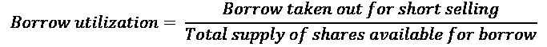

# 第十章：10

# 优化投资范围

市场参与者通常觉得市场的广大相当令人生畏。因此，在我们开始将我们在前几章中涵盖的想法转化为结合的投资策略之前，我们将专门撰写一个简短的章节，将市场简化为可管理的投资范围。

在本章中，我们将从一些概念性的盲点开始，讨论长/短期业务，试图为你将要进行交易的现实世界提供一些有价值的背景信息。接下来，我们将跟随资金的脚步，通过考虑一些重大事件和主题，揭示投资者真正想要的是什么，以及这些事件和主题如何塑造交易者和市场运作的方式。

我们将涵盖以下主题：

+   避免做空陷阱

+   投资者真正想要什么？

# 避免做空陷阱

这一部分主要讲述的是应用智能过滤器来避免经典做空陷阱。随着从业者对做空变得更加熟悉，他们可能会重新审视其中一些要点。这里的大多数要点都来自于痛苦的经历。

## 流动性和市场影响

流动性是熊市的货币。如果你在没有重大市场影响的情况下无法退出一个头寸，那么你什么都不拥有，它拥有你。处理做空方面的流动性方式是完全不同的。在做多方面，随着更多投资者被吸引到不断上涨的价格中，流动性增加。早期的鸟儿最终会将头寸出售给一个更大的市场参与者群体。

在做空方面，当投资者清算他们的头寸时，这是一条单行道。经历了一次打击后，他们不会再回来进行第二轮。没有什么比 Kübler-Ross 模型更能真实地捕捉到长期市场参与者的情感之旅了。市场参与者为他们的损失而悲伤。甚至每个阶段在市场上都有独特的标志。兴趣减弱，随着市场参与者的减少，流动性也减少。早期的熊市比后期的熊市更具流动性。做空者离场时的流动性要比他们进场时的更低。

加入做空陷阱，你就有了一种制造爆炸性鸡尾酒的配方。你最不希望的是被困在一个大头寸的做空陷阱中，而没有办法在没有严重市场影响的情况下进行套保。在做空方面，处理流动性和市场影响的方式不是关于建立头寸所需的时间有多长，而是关于退出的难易程度。

这将投资范围限制在流动性不是问题的问题上。2008 年金融危机的解决使市场上瘾于量化宽松，也就是所谓的免费资金。简而言之，货币当局向世界注入止痛药，以缓解经济危机的痛苦。一旦货币当局暗示要逐渐停止，市场就会在撤资中螺旋下降，交易者会涌向更安全、更防御性更强的股票，这被称为“避险”。这迫使货币骑兵继续向系统注入更多的止痛药，这使得各种投机资产深陷泡沫领域。当风险是“开放的”，交易者正在寻找风险更高、利润潜力更大的股票时，中小市值股票就是行动发生的地方。与此同时，在空头方面，无聊的蓝筹股已经过时。当失败没有责任时，就没有安全玩法的动机。当风险是“关闭的”，市场参与者更多地投资于防御性更强的大型资本化公司，流动性仍然充裕。恢复长期小市值/短期大市值交易并不容易。空头中小市值股票是一项血腥的运动。流动性蒸发了，您可以在买卖价差中停泊一个超大型油轮。因此，利润可能会在第一次挤压时被抹去。

底线：将您的净市场敞口与一般市场环境和流动性水平相匹配。无论某些想法看起来多么诱人，只保留那些流动性不是问题的想法。

## 拥挤的空头

> "猫王已经离开大厦。"

早在 2007 年，我就开发了一种名为“**挤压盒子**”（**WMSD**）的**大规模空头毁灭武器**。机制可能有违直觉，但它具有超现实的准确率来预测潜在的空头挤压。所需的只是一个仅持有多头的经理来持有微小的投机性长头寸。由于买卖平衡已经失衡，这将推动价格上涨并将游客冲出。他们会疯狂地买回，这将迅速演变成一次空头挤压。此时，仅持有多头的经理将轻松地退出他们的多头寸，获得舒适的利润。当我意识到这个程序直接伤害到我在对冲基金界的朋友时，这个 WMSD 被永久拆除了。

故事的寓意：从您的投资范围中消除所有拥挤的空头，借入利用率超过 50%的问题。它们甚至不应该出现在您的雷达上。想想那些经常闯红灯的人。一切都很顺利，直到他们在医院醒来。

赚钱的方法在卖空方面是找到机构投资者正在清算的东西，并跟随他们。 好的卖空故事通常弥补了不好的卖空交易。 每一点信息都附有一个刻板的价格标签。 不要等待所有的拼图拼合在一起。 当一个故事恶化到足以成为明显的卖空候选人时，机构投资者将清算他们的多头头寸。 唯一剩下的人将是争夺干枯骨头的卖空者。 这将引导我们使用一个简单而强大的供求指标，称为**借款利用率**。

借款利用率是用于卖空的借入量与可借供应股票量之比。 大型机构拥有借贷计划，他们出借他们的长期持有部分以换取费用。 当他们削减这些头寸时，供应就会枯竭。

与此同时，随着卖空的流行，对借款的需求增加。 分子上的需求和分母上的供应是使借款利用率成为衡量机构所有权和流行度的最有效指标。 例如，借款利用率超过 50%仅意味着卖空欲望超过机构所有权。 由于机构是市场的主要参与者，风险/收益比显然会恶化。

根据公司的所有权结构，借款利用率可能会有很大的变化。 一些股东不参与借贷计划。 例如，持股密集的公司拥有很少的股东，这些股东由于不可言喻的原因经常无法欣赏到他们的宝贝成为恶意空头攻击的目标。

卖空是一项昂贵的运动。 卖空者要支付借款费用。 这些费用从**普通担保**（**GC**）的容易借入问题到难以借入或拥挤的空头问题的高利率都有。 随着借入逐渐减少，剩余池的质量会恶化。 更糟糕的是，难以借入的问题不仅仅可以获得高利率，使得莎士比亚的夏洛克都会脸红； 有时它们是可召回的。 这意味着出借人有权选择在短时间内撤回他们的借款。 这被称为“**召回**”。 当发生召回时，卖空者要么留在别处寻找借款，要么平仓。 召回有时会引发卖空压力。

最后一批做空游客往往过于兴奋，无暇考虑借入可召回的股票。一旦发生召回，他们无法定位借入，被迫平仓。由于卖出压力已经达到高潮，新的买入压力造成了供需失衡。股价轻松上涨。这触发了其他做空者止损，然后他们进行回补。这迅速演变成了一场全面的做空激励，不仅冲走了游客，也冲走了更有经验的做空者。底线是：远离其他做空者涉及低质量借入的问题。

拥挤的做空股票往往对市场的敏感性较低，比较热门的问题。当市场遭遇周期性的空当时，拥挤的做空几乎不动。与此同时，牛市中的高飞股票暴跌。相对而言，这意味着拥挤的做空表现优异，而做多则表现不佳。对于这种现象的一个可能解释是缺乏机构和零售投资者的参与。拥挤的做空中没有机构长期投资，因此当周期性回调发生时，没有人出售并推动股价下跌。底线：当拥挤的做空大幅下跌时，它们不会增强做多头寸。如果拥挤的做空者带来的唯一好处是满足昂贵的正确需要，那么这不是你应该采取的方法。

结论：就像节食者需要将冰淇淋和薯片远离手边一样，完全摒弃拥挤的做空股票。

## 高股息率的肥沃土壤

> "他们说最好的武器是你从未必须开火的武器。我尊重地不同意。我更喜欢只需开火一次的武器。"
> 
> – 托尼·斯塔克，《钢铁侠》

有时公司会增加其股息率以支撑股价。高股息率吸引了寻找更稳定现金流的价值投资者和零售投资者。这有效地阻止了做空者从事熊市活动。然而，尽管高股息率可能遏制了即时的做空压力，但它并不能阻止股价在长期内下跌。高股息率通常与停止增长的公司等同。它们已经停止增长，因此将现金重新分配给股东。这就是使高股息率股票领域成为盈利和平静做空的肥沃土壤的原因。

关于股息的好消息是它们是可预测的公司事件。有一些事件是做空者需要注意的。前两个是股权登记日和支付日。在这些时刻，做空者需要克制自己的热情。有时公司会决定在它们发布收益公告时提高股息。围绕这些日期安排交易，你会有一个惊喜的愉快时光。例如，投资者往往会在股息宣告日后立即减持。这加剧了进入股息支付日的下跌。

另一种将高收益股票重新定位为可行的做空候选者的方法是专注于导致股息一开始就很高的根本原因。成长型股票通常具有糟糕的股息收益率。它们需要现金来重新投资其业务。另一方面，稳定的成熟公司有多余的现金但长期前景不佳。少量的股息可以吸引投资者。

底线：价值陷阱隐藏在高股息之后。寻找高收益的表现不佳者，并在股息日期周围航行，你会发现时间过得惊人轻松。

## 股票回购

> “一个人通常有两个做一件事的理由。一个听起来不错的，一个是真正的。”
> 
> – 摩根大通

按照常规智慧，公司会在其股票被低估时在开放市场上回购股票。实际上，当涉及到时机不当的估值时，他们和卖方分析师一样毫无头绪。股票回购在 2007 年底达到峰值，2009 年 3 月触底。

支持股票回购的人认为，用他们的现金和廉价信贷来回购股票是没有比这更好的用途。这会产生涓涓细流的效应，惠及整个经济。

这种股东至上主义可以追溯到 80 年代由弗里德曼在 80 年代开创的一种思想流派。通过回购股票计划，公司已成为市场上越来越重要的参与者。前总统特朗普减税后的反弹主要是由公司回购自己的股票推动的。

对手们认为，现金从利益相关者（员工、客户、研发和供应商）那里被转移出来，然后转移到股东那里。简单地说，教练对球员斤斤计较，但对球迷慷慨解囊。大多数高管的薪酬来自股票期权。因此，他们有直接的激励来支持股价以填补他们的股票期权计划。最有效的方法是回购股票。这降低了流动性，膨胀了每股收益，并推高了股价。

2020 年的冠状病毒大流行粗暴地揭示了这种虚伪，并最终解决了争论。股票回购抽干了公司的生命力。这种对短期市场影响的过度关注与公司的长期利益不一致。当世界陷入封锁时，公司几乎立即发现自己资不抵债。他们的股价暴跌，但他们仍然不得不面对为回购而签订的贷款义务。在资本主义的历史上，皇帝从未如此茫然地四处游荡，赤裸裸地出现。

但是，对于卖空者来说，这并不是重点。公司的资金实力足以人为提升股价。因此，卖空者应避免对参与股票回购计划的公司进行卖空。好消息是，股票回购与市场波动高度相关。股票回购在最需要的时候，即在修正期间会消失。这意味着卖空季节已经开始并进入全面发展阶段。

底线：不要直接做空推出股票回购的公司。让它们自我腐蚀，并等待必然的脆弱性。

## 基本分析

> "时间在我这边。"
> 
> – 米克·贾格

基本分析为股市分析赋予了贵族的头衔。很少有事业像股票分析那样具有智力刺激性。市场体制的定义可以极大地简化基本分析的工作。

当基本分析师考虑市场体制时，他们实际上试图回答一个理论性问题。他们试图弄清楚为什么一支股票应该下跌，以及为什么现在应该发生这种情况。有很多原因。

他们最终可能会得到伸张正义。然而，他们承担了巨大的时间、声誉和最终业务风险。他们希望市场在投资者失去耐心之前同意他们的论点。期望获得一致的结果是不现实的，因为有太多的随机变量。

另一方面，将基本分析置于市场体制之下试图回答一个实际问题：为什么这支股票下跌？好消息是，答案通常可以归结为以下三个方面之一：

+   首先，这可能是暂时的错定价格。市场可能已经从牛市转向横盘。在一个活跃的牛市阶段之后，股票往往会暂停并消化进展。这个阶段被称为整理。股票可能有一段时间不涨不跌。如果是这样，解决方案很简单。待命的空头头寸看起来在经历了大幅度的回调之后会好很多。减持你的头寸。将资本重新配置到新的想法上。如果股票重新开始表现，将有充裕的时间重新建仓。

+   其次，如果一个行业内的几只股票开始齐头并进地表现不佳，这表明行业轮动。这减轻了分析师的工作负担：选择几乎任何一个表现不佳的行业的股票。

+   第三，如果一只股票的行为与其行业不符，这可能表明存在一些股票特定的问题。这是基本分析师大展身手的时候。这是发现真正有利可图的结构性空头的时候。价值陷阱经常被忽视，因为它们具有价值股票的所有外部特征。它们经常有慷慨的股息政策。相对于同行，估值打了折扣，这使它们在表面上看起来很有吸引力。然而，它们顽固地表现不佳。它们之所以便宜并且保持便宜是有原因的。基本分析师的工作是找出原因。

在卖空方面，传统的基本分析很难进行。信息的不对称是卖空者必须应对的问题。公司很少自愿公布坏消息。分析师保持他们的“买入”评级，直到命运的那一天，他们碰巧在媒体上读到公司前一天晚上申请破产的消息。

卖方拉拉队可能会有一些不情愿的边际效用。在误导性的“买入”评级的多年冻土草原上，低表现的暗号是“为长期投资者购买”。寻找评级不更新、收益模型积满灰尘的股票，甚至连维护研究都没有得到适当的维护。只需一个电话确认“那些是长期投资者的股票”，你就可以开展业务。

# 投资者真正想要什么？

长/短行业似乎每次市场“出现疲软迹象”时都会经历严重的存在危机。投资者被粗鲁地提醒，下行保护仅意味着几乎没有上行的有限下行。该行业一直是从“建立它们就会来”的产品供应模式运作的。如果目标是建立可持续的业务，那么是时候暂停一下，从投资者的角度审视世界了。这将为建立符合投资者需求的长/短产品提供至关重要的背景。

## 从 2007 年量化灾难中得到的教训

> “于是，由沙子建造的城堡，
> 
> 融入海洋，
> 
> 最终。
> 
> —— 吉米·亨德里克斯

2007 年 8 月，横截面波动性让全球市场大吃一惊。虽然指数波动不大，但成分股在几天内纷纷跃升。很快，关于各种量化市场中性基金解除交易的传言开始传播。这标志着量化 1.0 的终结。

那些聪明的市场中性基金就像威尼斯比萨饼一样：菜单上有 37 种不同的名称，但每个人的面团都是一样的。它们的模型相当相似。由于它们是市场中性的，来自卖空的现金收益可以用来几乎无限地进行杠杆。一些基金将杠杆倍增到七倍，以放大原本乏味的回报。一段时间以来，一切都运作良好。所有基金经理所需要做的就是继续卖空更多股票，以匹配不断扩张的多头。这一切都进行得很顺利，直到 2007 年夏天，房地产泡沫开始腐烂。

每场雪崩都是由一个雪球开始的。那时，在市场的另一个角落，一些大型多策略交易公司被要求为他们的**信用违约义务**（**CDO**）和**信用违约掉期**（**CDS**）组合提供更多的抵押品。当他们无法为信贷账本筹集现金时，他们被迫清算他们最流动的资产类别。他们转向他们的量化市场中性账本。这是最初的雪球。在夏季中旬，流动性通常会枯竭。他们的空头账本不流动。当第一个商店开始平仓时，他们抬高了价格。这触发了他们邻居的止损。他们继续关闭自己的头寸。这引发了连锁反应，最终导致了混乱的横截面市场。这就是传染的定义。

人们有时会就什么构成良好质量而争论，但他们很少在糟糕的东西上产生分歧。每个人都发现自己处于同一糟糕境地。由于可用于卖空的股票有限，交易变得非常拥挤。多策略基金的清算加剧了问题。管理者最终意识到，解除空头头寸需要数周时间，他们开始将头寸减少到可控水平。流动性是主要风险。几乎所有人都在大致相同的模型下同时得出了相同的结论。匆忙平仓的精英量化交易员堪比金融版的大象在瓷器店里乱窜。

那时，市场中性基金被宣传为安全的投资工具：股票回报与低波动性。在许多人心中，市场中性意味着资本保护。因此，当一些基金在看似平静的市场上发布-3-4%的月度回报时，发生了两件事。首先，由于**风险价值**（**VAR**）增加，主要经纪商提高了保证金要求，迫使基金减少杠杆。其次，投资者让基金经理们苦恼不已：“救赎之歌”。

这些赎回迫使管理者关闭头寸，给基金增加了更多的波动性。减少了杠杆，增加了波动性，并且不断增加的赎回，将需要数月，甚至数年的时间来弥补损失。而且，声誉损失是不可挽回的。对于量化市场中性基金 1.0 来说，游戏已经结束。

这场崩溃始于一个简单的错误：那些基金的设计者犯了一个致命的假设，即空头将会与多头一致。有一段时间，确实如此。但随着基金规模的扩大，空头的独特动态回来困扰着他们。流动性枯竭了。空头变得拥挤。等到管理者意识到空头风险呈指数增长时，已经为时太晚了。

故事的寓意：如果你想经营一个可持续的多空业务，你需要从空头开始构建你的投资组合。

有关这个主题的更多信息，请参阅 Lehman Brothers 的 Matthew S. Rothman 博士于 2007 年 8 月 9 日撰写的《量化领域的动荡时期》。

接下来的两部分将进一步关注投资者真正想要的是什么。他们不是将资金放在复杂的长/空中，以购买低技术的**交易所交易基金**（**ETF**）所能做到的同样的苹果公司（AAPL）股票，后者成本只有一小部分。投资者希望低波动性的回报与市场波动不相关。

## 长/空行业的绿黄蜂综合症

> “真实存在的比应该存在的更重要。太多人从应该是的角度看待真实存在。”
> 
> – 布鲁斯·李，伟大的华裔美国哲学家

1966 年的电视系列剧《绿黄蜂》以布雷特·里德为特色，他白天是《每日哨兵报》的雄心勃勃的出版商，晚上则是作战的绿黄蜂，而他的忠实男仆卡托则是忠诚的。如果不是因为一位名叫布鲁斯·李的未知演员扮演的副手管家，那个很快被遗忘的节目永远不会进入那些神秘系列的世界。

长/空行业患有未解决的绿黄蜂综合症。许多长/空参与者是披着狼皮的羊。机敏灵活的对冲基金经理喜欢吹嘘自己在多头方面选择股票的优越分析能力。谁在乎呢？没有人需要对冲基金经理繁琐的“复杂性”来购买苹果公司。任何“无聊”的纯多头基金经理都将以较低的成本提供完全相同的服务。更好的是，任何低技术、低成本的普通香草 ETF 都会比任何主动管理者在时间上做得更好。

长/空市场参与者真正进入神话般的基金经理的阵容的是他们在其他人都不赚钱时赚钱的能力。这来自于被称为空头账簿的副手。

长/空行业是一个竞争激烈的领域。市场参与者知道他们必须立即开始吸引投资者。因此，他们默认在自己的舒适区内交易。他们大部分时间都在选择多头方面的股票。与此同时，对空头的无尽挫折使他们放弃了学习“黑暗艺术”的细节。尽管最初的意图是最好的，但空头账簿逐渐被边缘化为一种次要表演。

随着市场上涨，这种情况就会持续下去。一旦市场陷入“软墙”，被忽视的空头方无法弥补多头方的损失。当业绩出现突然下滑时，投资者会感到窒息。他们不得不忍受过高的费用，并容忍“alpha 挑战”式的回报。难怪当他们意识到下行保护实际上意味着损失少于市场时，他们会感到窒息。因此，长/空行业受到越来越多的愤世嫉俗的对待，也就不足为奇了。

## 从伯尼·麦道夫那里学到的教训

> “当你看到我多次欺骗骗子和傻瓜而没有丝毫良心负担时，你会感到很有趣。”
> 
> – 贾科莫·卡萨诺瓦

每个市场参与者都有一些能产生阿尔法收益的“秘密武器”。他们相应地推出适合自己投资风格的产品。他们奉行“建造它，他们就会来”的模式，相信仅靠阿尔法收益就足以吸引投资者。很快，他们就会想知道为什么其他具有平稳回报的参与者在激烈的资产管理竞争中超越了表现出色的市场巫师。

作为一种资产类别，系统性商品交易顾问（**CTAs**）几十年来一直主导着表现赛道。然而，根据朋友和畅销书作者迈克尔·科维尔的说法，他们的总资产管理规模占全球资产管理总规模的 0.4%。尽管长期表现优异，但他们的总资产管理规模仍然是一个可以忽略的数字。这让基金经理感到困惑。一方面，投资者们公开表示他们在寻找回报。另一方面，当到了付诸实践的时候，他们选择了其他的东西。好消息是金钱留下了痕迹。

在赞扬马多夫先生的营销才华之前，让我们搞清楚一件事。任何欺诈投资者的白领罪犯都应该在监狱里待上几十年。伯纳德·L·马多夫是私人部门小联盟中最伟大的骗子之一。几十年来，他欺骗了成千上万的投资者数十亿美元。他的故事为投资者的心态提供了宝贵的见解。

马多夫所提供的东西是如此强大，以至于它削弱了金融业一些最复杂的参与者的专业怀疑。在一次难得的监狱采访中，马多夫先生承认投资者“本应该知道更多”。下面是马多夫所谓的回报表：

|  | 标准普尔 500 指数 | 费尔菲尔德信托公司（马多夫） |
| --- | --- | --- |
| 年平均回报 | 7.7% | 11.0% |
| 复合回报 | 201.0% | 504.0% |
| 正收益月份 | 63.0% | 92.0% |
| 最大回撤 | -46.3% | -1.6% |
| 回撤持续时间（月） | 80 | 2 |
| 半相关 |  | 0.03 |

平均每年 11.04%的表现还算不错，但并非惊人。正如之前提到的，投资者们声称他们想要回报，但他们对回撤作出了反应。马多夫与众不同的地方在于有四点：

+   首先，回撤的持续时间：绝不能考验投资者的耐心。从零售投资者到机构资产配置者，每个投资者脑海中都有一个挥之不去的问题：“现在投资还来得及吗？”只有当贪婪或错过机会的恐惧比害怕赔钱更强烈时，他们才会把自己辛苦挣来的积蓄投入使用。在实践中，高峰时期的资金流入往往与牛市的顶峰相一致。那些订阅了“道指涨至 36,000 点”骗局并在 2000 年 8 月冒险投资的幼稚者，在他们在 2007 年 5 月收回资金之前，不得不忍受 80 个连续月的回撤。那正好是下一次暴跌的时间。相比之下，麦道夫先生总是营业。他只有连续两个月的回撤。每个月都是进入市场的好时机。这样短的回撤持续时间在统计学上是不太可能的。唯一接近的市场参与者是传奇人物爱德华·索普，讽刺的是他在丑闻爆发前 14 年就揭露了麦道夫。

+   第二是回撤的幅度：绝不能考验投资者的胃口。一旦陷入回撤，投资者会担心情况会变得有多糟糕。市场长期平均回报率可能为 7%，方便地忽略了其中的-40-50%的巨大回撤。即使正回报并不惊人，-1.56%的最大回撤使其看起来像是一种无风险投资。康尼曼-特沃斯基以更加精彩的方式制定了他们的前景理论：厌恶损失比追求利润更为强大。这说明了一个强大的概念：“你赚多少钱并不重要，只要你不亏损。”投资者可以设定并忘记。

+   第三是回撤的频率：绝不能考验投资者的神经。据说麦道夫的表现有 92%的时间是赚钱的，而标普指数只有 63%。标普指数有 6 年的年度回报率超过 20%。它也有 4 年的负双位数回报率。相比之下，麦道夫的欺诈平均回报率是 11.04%。然而，标普指数的复合回报率是 200%，而麦道夫的是 500%。

+   第四是半相关性（与标普指数下跌月份的相关性），或者在下跌市场中赚钱的能力。据称，麦道夫的半相关性是 3%，即每当市场下跌时他都能赚钱。这就敲定了交易。在所有人都跌倒时仍然屹立不倒的经理们脱颖而出。他们的电话响个不停，有意向的投资者络绎不绝。

在现实世界中，像麦道夫那样获得回报是统计学上不太可能的。然而，你越接近，你的提议就越具有吸引力。如果你成功地建立了一个介于麦道夫的圣杯和指数被动投资之间的产品，你将比竞争对手更具竞争力。

# 总结

这个简短的章节并不意味着要考验读者的脑细胞。它只是一个关于如何避免经典昂贵陷阱并满足投资者期望的实用提示集合。投资者不是为了长期想法而购买多空产品。他们想要低波动性的不相关回报。这一章考虑了投资者的期望，同时避免了将空头书籍视为更有趣的多头书籍的陷阱。如果将那些问题股票从你的视野中清除，它们就不会在你的脑海中出现，这将消除诱惑。

一旦你压缩了你的投资领域并了解了投资者对你的期望，就是时候扣动扳机了。在接下来的章节中，我们将把所有的东西整合起来，看看如何在实践中做到这一点。
