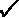

# 第十一章：多空工具箱

仅多头投资组合从定义上来说与市场相关。引入空头组件使得管理者能够设计他们想要实现的绩效类型。我们将在本章中使多空投资组合管理对所有专注的市场参与者都可达。

创建一个多空投资组合需要合并两个相对组合：一个多头和一个空头。从仅多头或绝对多空转向相对强度多空投资组合一开始可能会让人感到不安。有许多动态因素。管理这种转变的有效方法是从目标出发：流动性、相关性、波动性和绩效。然后，专注于几个对这些目标影响最大的变量：总曝光和净曝光、净 beta 和浓度，它们构成了您在构建策略时的投资工具箱。

以下表格指示了这些变量中的每一个对我们的目标产生的影响。

|  | 流动性 | 相关性 | 波动性 | 表现 |
| --- | --- | --- | --- | --- |
| 总曝光 |  |  |  |  |
| 净曝光 |  |  |  |  |
| 净 beta |  |  |  |  |
| 浓度 |  |  |  |  |

最后，我们实践我们所写下的。是时候进行一些有纪律的创造了，为您构建自己的投资策略提供逐步指南。在这个过程中，我们将涵盖以下主题：

+   导入库

+   总曝光：杠杆的战术性方法

+   净曝光：标题性的看涨/看跌方向性

+   净 beta：对市场的剩余敏感性

+   浓度：每一边的股票数量

+   其他曝光

+   设计您自己的授权

让我们从总曝光开始。这是您愿意承担的杠杆量。杠杆是一把强大的双刃剑。如果不正确使用，它会创造然后毁灭一个企业。

您可以通过以下链接访问本章所有图片的彩色版本：`static.packt-cdn.com/downloads/9781801815192_ColorImages.pdf`。您也可以通过该书的 GitHub 存储库访问本章的源代码：[`github.com/PacktPublishing/Algorithmic-Short-Selling-with-Python-Published-by-Packt`](https://github.com/PacktPublishing/Algorithmic-Short-Selling-with-Python-Published-by-Packt)。

# 导入库

对于本章和本书的其余部分，我们将使用 `pandas`、`numpy`、`yfinance` 和 `matplotlib` 库。因此，请记得首先导入它们：

```py
# Import Libraries
import pandas as pd
import numpy as np
import yfinance as yf
%matplotlib inline
import matplotlib.pyplot as plt 
```

# 总曝光

总敞口是多头和空头头寸的绝对总和。卖空股票会产生现金，可以用于进入更多的多头头寸。理论上，杠杆可以无限增加。实际上，主要经纪人限制杠杆为 3 或 4 倍，以限制他们的交易对手风险。没有人希望在市场出现迹象时立即处理保证金调用。

总敞口对以下方面直接产生影响：

+   **流动性**：杠杆越高，持仓规模越大。这直接影响市场影响力。这在卖空方面尤为明显，就像 2007 年的量化交易员所证实的那样。

+   **波动性**：杠杆放大了回报的波动性。

+   **绩效**：杠杆放大了回报：低杠杆下微不足道的 0.1%可以增加到 0.5%等等。

+   **集中度**：如果目标是保持波动率低，那么名字的数量应该与杠杆成比例地增加：总敞口增加意味着更多的名字，反之亦然。

总敞口最终反映了市场参与者对市场的信心。他们越自信，就越倾向于增加杠杆以抓住机会。在科技泡沫中，没有什么比增长型经理更像是糖果店里的孩子。相反，在动荡或不确定时期，市场参与者倾向于减少总敞口并增加现金敞口以保护资本。战略性地管理总敞口可以是在好时机提高绩效和在困难市场保护资本的强大工具。

市场参与者倾向于以以下两种方式管理总敞口。他们要么坚持固定的敞口水平，要么采取非结构化的方法。固定敞口的参与者在整个周期内保持相同水平的总敞口。保持固定总敞口水平的理由是简单性。参与者喜欢将名字数量保持在一个可以安全管理的水平上。在好时期他们可能会损失一些收益，但在连续亏损期间，他们可以将回撤保持在可控水平。另一方面，非结构化的参与者在好时期变得乐观，增加头寸，而在坏时期则囤积现金。

如果你的目标是以相对较低的波动率提供有吸引力的回报，可能会有一种更科学的方法。在接下来的章节中，我们将考虑一种简单、有效、分步骤的管理总敞口的方法。这个想法是允许总敞口跟随你的绩效周期。这被称为管理投资组合热度。

### 投资组合热度

在*第二部分*，*外部游戏：制定稳健的交易边缘*中，我们在进入交易之前讨论了头寸规模和风险管理。当我们已经投资并且市场意外地出现不愉快的转变时会发生什么？市场是生活的一个很好的反映。这就是当我们有其他计划时发生的事情。

我们既不能预测也不能控制世界上发生的事情。那些仍然相信自己可以预测任何事情的人肯定不应该负责管理养老基金。然而，我们可以通过以下两种方式控制投资组合中发生的事情：

+   首先，我们可以通过头寸大小控制投资组合中的风险量。在进入头寸之前，我们完全控制着将分配给下一笔交易的风险量。

+   其次，我们可以控制投资组合中所容忍的风险量。这些是现有的头寸。一些工作，一些不工作。一些脆弱。一些仍然处于风险之中。一些是无风险的。

这引出了开放风险、投资组合热度和相关性的概念：

+   开放风险是股票级别的潜在损耗。如果触发了止损，该头寸将以亏损还是盈利的方式关闭？如果是盈利的话，开放风险就是零。在金融业术语中，该头寸被称为自由携带。不管接下来发生什么，交易都不会亏钱。

+   投资组合热度是所有头寸上的开放风险的总和。开放风险是按方向和策略汇总的。例如，假设您进行了两种长/短策略交易：一种是均值回归，一种是趋势跟随。分别汇总这四个开放风险和资产曲线。在这种情况下，开放风险和最大潜在回撤是两码事。开放风险中的投资组合热度仅处理脆弱头寸。自由携带头寸受到一套不同的规则的约束。

+   相关性是长期书籍与短期书籍在总体上的运动方式。当市场下跌时，短期书籍并不总是带头。例如，长期股票的投机性问题下降得比低β股票更快更远。关键是假设“相关性趋于 1”，意味着一切都像板砖一样下跌。长期和短期投资组合的热度并不会互相抵消。理论上，人们会认为短期投资组合会弥补长期投资组合的下跌。实际上，在市场回调期间，做空有时会胜过做多。惊慌的动量买家抛售他们的长期持仓，从而导致价格下跌。因此，不要抵消长期和短期投资组合的热度。

投资组合热度需要保持在范围内。接下来，让我们看一下设定热度范围的几个一般原则。

### 投资组合热度范围

如果你承担了太多的风险，总有一天你就不会有生意可做。如果你没有承担足够的风险，你根本就不会有生意可做。因此，秘诀在于保持风险在范围内。

最大热度带应该定义如下。目标不是在全面减少总体敞口。目标是在头寸级别减少开放风险，这将导致总体敞口的收缩。股票具有不同的波动性特征。低波动性股票需要更大的头寸。例如，在防御性股票上减少风险与在高波动性股票上减少风险的影响大相径庭。这个系统比实际总体敞口带更有效。市场参与者应该牢记投资组合热度的上限。

存在一个理性的最大风险数字，可以确保资产曲线的最佳几何增长率。很好，但完全无关紧要。重要的是你的客户可以容忍多少风险。例如，如果客户表示可以接受 10%的回撤，那么您的可接受最大投资组合热度应该在 5%左右。总的来说，人们，尤其是客户，都极大地高估了他们对痛苦的耐受能力。此外，纠正局势需要时间和精力。上限实际上是一个业务决策。波动性是风险的副产品——在投资组合层面容忍的风险越多，投资组合中引入的波动性就越多。这将限制您能够针对的客户类型。例如，养老基金是厌恶波动性的。它将决定从数量到绩效和信息比率的一切。

当有疑问时，应该慎重行事。一个经典的解决方案是增加名称的数量，例如。此外，正如我们将在*战术部署*部分看到的那样，投资者是按照日历年来思考的。因此，您的上限容忍度根据是年初还是年底接近而变化。一切相等，风险应该从小开始，逐渐增加，在第三季度达到顶峰，到年底逐渐减少。将惊喜留给圣诞礼物，而不是给您的投资者的钱。

最小值可以这样定义。长/短经理最终根据其保护资本的能力进行评判。您的系统必须能够通过回撤交易。一个简单的经验法则是将最小值设定为最大值的一半。如果您预计投资者会在 10%的回撤时赎回您的份额，那么您的最大值应该约为 5%，最小值为 2.5%。

最坏的情况是，在重新回到原点之前，您可能会遭受 7.5%的回撤。此外，一旦绩效好转，*第八章*中介绍的凸性振荡器，*头寸规模：资金管理模块中的金钱赚钱*，将重新加速。

即使投资组合热量的差异看起来很小，对总风险敞口的影响可能看起来更加戏剧化。投资组合热量的+/-0.1%的差异很容易使总风险敞口产生 5-10%的变动。这将直接影响波动性、绩效和流动性，如市场影响所示。在实践中，这项技能有一些魔力。投资者将会看到纪律性的风险管理，这最终是他们愿意付出好钱的技能。

### 战术部署

牛市可能持续数年，但投资者倾向于以季度和年度时间段思考。如果投资者以日历年为单位思考，那么你也应该如此。因此，杠杆应该在整年战略性地部署。如果你在年初杠杆被搞得很高，而绩效一开始就大幅下滑，那么你将在余下的时间里不断地摆脱困境，而投资者则紧盯着你。压力对于做出良好的决策是不利的。另一方面，一旦你建立了绩效，就会有余地来运用杠杆。所以，每年都从最小杠杆开始。一年可能会开始缓慢。投资者会忘记一个缓慢的开始，但他们不会原谅一个艰难的开始。

相反，随着年末的临近，逐渐减少杠杆以在下一个周期开始时达到最小杠杆。投资组合热量的季节性管理在数学上没有意义。投资者很少在抽象数学中竞争诺贝尔奖。他们是人类。他们用直觉反应。

### 逐步投资组合热量和敞口管理

在*第八章*，*仓位大小：在资金管理模块中赚钱*中，我们使用股票曲线来计算应该分配给进入投资组合的交易的风险有多少。这是在个人层面上的每笔交易的风险。现在，我们将重新审视已经在投资组合中的位置的凸面振荡器。在进入之前的微观层面（每笔交易的风险）的关系在投资组合宏观层面（投资组合热量）上仍然成立。市场不断变化，因此风险应相应调整。每笔交易的风险在股票级别上在最大和最小范围内振荡。类似地，投资组合热量在最大和最小值之间振荡。这种方法的美妙之处在于其简洁的优雅。我们不专注于头寸的大小，只关注它们的未平仓风险。这迅速减少了杠杆，同时保持了成功的无风险头寸不受影响。

实施凸面振荡器对最大投资组合热量的影响直接影响所有风险敞口。让我们用一些逐步的数字示例来说明这一点。

#### 第一步：凸度配置

股票/微观级别有效的东西在投资组合/宏观级别也有效。整体投资组合风险称为**开放风险**或**投资组合热量**。目标是尽可能长时间地以最大热度运行。随着回撤加剧，投资组合热量逐渐降低直至最低水平。此风险可以使用我们在*第八章*，*头寸规模：金钱在资金管理模块中赚取*中看到的`risk_appetite()`函数来降低：

```py
def risk_appetite(eqty, tolerance, mn, mx, span, shape):
    '''
    eqty: equity curve series
    tolerance: tolerance for drawdown (<0)
    mn: min risk
    mx: max risk
    span: exponential moving average to smoothe the risk_appetite
    shape: convex (>45 deg diagonal) = 1, concave (<diagonal) = -1, else: simple risk_appetite
    '''
    # drawdown rebased
    eqty = pd.Series(eqty)
    watermark = eqty.expanding().max() # all-time-high peak equity
    drawdown = eqty / watermark - 1 # drawdown from peak
    ddr = 1 - np.minimum(drawdown / tolerance,1) # drawdown rebased to tolerance from 0 to 1
    avg_ddr = ddr.ewm(span = span).mean() # span rebased drawdown

    # Shape of the curve
    if shape == 1: # 
        _power = mx/mn # convex 
    elif shape == -1 :
        _power = mn/mx # concave
    else:
        _power = 1 # raw, straight line
    ddr_power = avg_ddr ** _power # ddr 

    # mn + adjusted delta
    risk_appetite = mn + (mx - mn) * ddr_power 

    return risk_appetite 
```

在下面的示例中，我们将构建一个由 10 支股票组成的虚构投资组合—5 支多头，5 支空头。我们将演示如何在个股水平进行投资组合热量降低。

#### 步骤 2：回撤重新调整

我们的假想投资组合以标普 500 指数为基准。初始资本（K）设定为 100 万美元。贝塔（对市场的敏感性）已从 Yahoo Finance 网站中提取。股票数量和相对止损已校准为相对风险调整至投资组合的-0.50%。该投资组合运行时间从 2020 年 12 月 31 日到 2021 年 6 月 30 日。首先，我们将生成数据集：

```py
port = np.nan
K = 1000000
lot = 100
port_tickers = ['QCOM','TSLA','NFLX','DIS','PG', 'MMM','IBM','BRK-B','UPS','F']
bm_ticker= '^GSPC'
tickers_list = [bm_ticker] + port_tickers
df_data= { 
'Beta':[1.34,2,0.75,1.2,0.41,0.95,1.23,0.9,1.05,1.15],
'Shares':[-1900,-100,-400,-800,-5500,1600,1800,2800,1100,20800],
'rSL':[42.75,231,156,54.2,37.5,42.75,29.97,59.97,39.97,2.10]
}
port = pd.DataFrame(df_data,index=port_tickers)
port['Side'] = np.sign(port['Shares'])

start_dt = '2021-01-01'
end_dt = '2021-07-01'
price_df = round( yf.download(tickers= tickers_list,start= '2021-01-01' , end = '2021-07-01', interval = "1d",group_by = 'column',auto_adjust = True, prepost = True, treads = True, proxy = None)['Close'],2)

bm_cost = price_df[bm_ticker][0]
bm_price = price_df[bm_ticker][-1]

port['rCost'] = round(price_df.iloc[0,:].div(bm_cost) *1000,2)
port['rPrice'] = round(price_df.iloc[-1,:].div(bm_price) *1000,2)
port['Cost'] = price_df.iloc[0,:]
port['Price'] = price_df.iloc[-1,:]

print(port) 
```

这里没有什么大秘密。我们使用字典和列表创建数据帧。然后我们从 Yahoo Finance 下载价格。成本设定为 2020 年 12 月 31 日，当前价格为 6 月底。在撰写本文时，这产生了以下数据帧。

|  | 贝塔 | 股票 | rSL | 方向 | rCost | rPrice | 成本 | 价格 |
| --- | --- | --- | --- | --- | --- | --- | --- | --- |
| QCOM | 1.34 | -1900 | 42.75 | -1 | 40.16 | 33.26 | 150.85 | 142.93 |
| TSLA | 2.00 | -100 | 231.00 | -1 | 187.87 | 158.16 | 705.67 | 679.70 |
| NFLX | 0.75 | -400 | 156.00 | -1 | 143.96 | 122.91 | 540.73 | 528.21 |
| DIS | 1.20 | -800 | 54.20 | -1 | 48.24 | 40.90 | 181.18 | 175.77 |
| PG | 0.41 | -5500 | 37.50 | -1 | 36.59 | 31.40 | 137.43 | 134.93 |
| MMM | 0.95 | 1600 | 42.75 | 1 | 45.82 | 46.22 | 172.10 | 198.63 |
| IBM | 1.23 | 1800 | 29.97 | 1 | 32.71 | 34.11 | 122.85 | 146.59 |
| BRK-B | 0.90 | 2800 | 59.97 | 1 | 61.73 | 64.67 | 231.87 | 277.92 |
| UPS | 1.05 | 1100 | 39.97 | 1 | 44.34 | 48.39 | 166.54 | 207.97 |
| F | 1.15 | 20800 | 2.10 | 1 | 2.34 | 3.46 | 8.79 | 14.86 |

与*第四章*，*长/空头方法论：绝对和相对*中介绍的`relative()`函数有一个小区别，后者有重新调整到系列开始的选项。我们选择使用连续系列。市场参与者一直在围绕头寸交易。重新调整很快变成了不必要的计算难题。因此，使用相同日期收盘价乘以一个常数—在本例中为 1000 是有意义的。止损和所有计算都基于相对系列。

接下来，让我们计算几个重要的指标：

+   BV 代表账面价值。这是以基金货币（美元）计算的成本乘以所有开放头寸的股票数量。

+   MV 代表市值。这是调整为货币（美元）的股票数量乘以当前收盘价。

+   rMV 代表相对市值。

+   毛暴露是基金货币中所有市值的绝对总和，除以管理资产—在本例中为 K。

+   净暴露是所有市值的算术净总和，除以市值的绝对总和。

+   净 Beta 是市值乘以 Beta 的总和乘以市值的绝对总和。

现在让我们看一下代码：

```py
BV = port['Shares'] * port['Cost']
MV = port['Shares'] * port['Price']
rMV = port['Shares'] * port['rPrice']

port['rR'] = (port['rCost'] - port['rSL'])
port['Weight'] = round(MV.div(abs(MV).sum()),3)
port['rRisk'] = -round(np.maximum(0,(port['rR'] * port['Shares'])/K),4)
port['rRAR'] = round( (port['rPrice'] - port['rCost'])/port['rR'],1)
port['rCTR'] = round(port['Shares'] * (port['rPrice']-port['rCost'])/ K,4)
port['CTR'] = round(port['Shares'] * (port['Price']-port['Cost'])/ K,4)
port_long = port[port['Side']>0]
port_short = port[port['Side']<0]

concentration = (port_long['Side'].count()-port_short['Side'].count())/port['Side'].count()
gross = round(abs(MV).sum() / K,3) 
net = round(MV.sum()/abs(MV).sum(),3)
net_Beta = round((MV* port['Beta']).sum()/abs(MV).sum(),2)
print('Gross Exposure',gross,'Net Exposure',net,'Net Beta',net_Beta,'concentration',concentration)
rnet = round(rMV.sum()/abs(rMV).sum(),3)
rnet_Beta = round((rMV* port['Beta']).sum()/abs(rMV).sum(),2)
print('rGross Exposure',gross,'rNet Exposure',rnet,'rNet Beta',rnet_Beta) 
```

输出将类似于以下内容：

```py
Gross Exposure 3.327 Net Exposure 0.141 Net Beta 0.24 concentration 0.0 
rGross Exposure 3.327 rNet Exposure 0.141 rNet Beta 0.24 
```

3.327 的毛暴露是中度到高杠杆。毛暴露为 2 意味着**资产管理** (**AUM**) 在多头和空头方面各杠杆一次。3.327 意味着 AUM 大约杠杆了 1.6 次。净和 r 净暴露为 0.141 意味着投资组合平衡均匀且轻微看涨。净和 r 净 Beta 为 0.24 意味着投资组合在残余上是看涨的。它不容易受到任何重大冲击。

总体而言，除了高度集中和持续性开放风险外，投资组合看起来很平衡。接下来，我们计算风险：

+   R 是由 Van Tharp 博士在他的书籍《*交易自由之路*》中推广的一种度量方法。它简单地是成本与止损之间的差异。在这里，我们将使用相对版本的 R，或者 rR。

+   权重是基金货币（USD）中的市值，除以市值的绝对总和。

+   r 风险是对权益的加权相对风险。该公式包含一个神秘的 `np.maximum(0, (port['rR'] * port['Shares']))` 序列。一旦止损被重置超出当前止损，这将变为负数。这确保了开放风险保持为负。

+   rRAR 是以初始相对风险单位表示的相对收益。这是最真实和最简单的风险调整收益指标。这将是我们的主要工具。

+   rCTR 和 CTR 是相对和绝对贡献，或者是盈利与权益的比值。

接下来，让我们按方向和相对风险调整后的收益打印投资组合。

```py
port[['Side', 'Weight', 'rRisk', 'rRAR', 'rCTR', 'CTR']].sort_values(by=['Side','rRAR'] ) 
```

|  | 方向 | 权重 | r 风险 | rRAR | rCTR | CTR |
| --- | --- | --- | --- | --- | --- | --- |
| **TSLA** | -1 | -0.020 | -0.0043 | 0.7 | 0.0030 | 0.0026 |
| **DIS** | -1 | -0.042 | -0.0048 | 1.2 | 0.0059 | 0.0043 |
| **NFLX** | -1 | -0.063 | -0.0048 | 1.7 | 0.0084 | 0.0050 |
| **QCOM** | -1 | -0.082 | -0.0049 | 2.7 | 0.0131 | 0.0150 |
| **PG** | -1 | -0.223 | -0.0050 | 5.7 | 0.0285 | 0.0138 |
| **MMM** | 1 | 0.095 | -0.0049 | 0.1 | 0.0006 | 0.0424 |
| **IBM** | 1 | 0.079 | -0.0049 | 0.5 | 0.0025 | 0.0427 |
| **UPS** | 1 | 0.069 | -0.0048 | 0.9 | 0.0045 | 0.0456 |
| **BRK-B** | 1 | 0.234 | -0.0049 | 1.7 | 0.0082 | 0.1289 |
| **F** | 1 | 0.093 | -0.0050 | 4.7 | 0.0233 | 0.1263 |

仓位按方向和相对风险调整后的收益整齐排序。让我们使用 `groupby()` 方法应用于多头和空头账簿来查看汇总。

```py
port[['Side', 'Weight', 'rRisk', 'rRAR', 'rCTR', 'CTR']].groupby('Side').sum() 
```

这将产生以下表格：

|  | 权重 | r 风险 | rRAR | rCTR | CTR |
| --- | --- | --- | --- | --- | --- |
| 方向 |  |  |  |  |  |
| -1 | -0.43 | -0.0238 | 12.0 | 0.0589 | 0.0407 |
| 1 | 0.57 | -0.0245 | 7.9 | 0.0391 | 0.3859 |

这给我们带来了侧面的大量总数。两侧表现良好。预期之中，净暴露已经扩大。空头已经缩小。这种错位是健康的空头的标志。多头也增加了。总的相对风险大约为-4.8%，分布在 10 个名称中。接下来，让我们削减对表现最慢的股票的敞口。

#### 步骤 3：按比例分配开放风险

总风险暴露为 333%，开放风险为+13.9%，净 beta 为 0.24。让我们来看一个经典案例。管理层高层中的某人在管理罕见的大气层中暂停了纸牌游戏，并决定全面减少敞口。在执行交易员的英语中，这意味着削减杠杆。在整个投资组合中削减头寸大小没有标准的配方。市场参与者可以使用几种方法。这些方法从全面减少所有头寸到在最脆弱的头寸中进行外科手术般地削减边际风险。由于任何人都可以执行前者，让我们探讨如何以最小的努力完成后者。

假设性地，我们的目标是将开放风险从-4.8%降低到-2.8%。由于开放风险均匀分布，我们将在每一侧削减 1%的风险。该代码适用于分离的风险降低，但这将保持简单。逻辑是通过使用相对风险(`rRisk`)作为排序键来减少大小：`port_long['rRisk'] / (port_long['rRisk'].sum()`. 风险越高，削减越大，依此类推。

```py
adjust_long = adjust_short  =  -0.01 

pro_rata_long = port_long['rRisk'] / (port_long['rRisk'].sum() * port_long['rRAR'])
risk_adj_long = (abs(adjust_long) * pro_rata_long * K / port_long['rR'] // lot) * lot
shares_adj_long =  np.minimum(risk_adj_long, port_long['Shares'])*np.sign(adjust_long)

pro_rata_short = port_short['rRisk'] / (port_short['rRisk'].sum() * port_short['rRAR'])
risk_adj_short = (abs(adjust_short) * pro_rata_short * K / port_short['rR'] // lot)*lot
shares_adj_short = np.maximum(risk_adj_short,port_short['Shares'])*np.sign(adjust_short)

port['Qty_adj'] = shares_adj_short.append(shares_adj_long)
port['Shares_adj']  = port['Shares'] + port['Qty_adj']
port['rRisk_adj'] = -round(np.maximum(0,(port['rR'] * port['Shares_adj'])/K),4)
MV_adj= port['Shares_adj'] * port['Price']
rMV_adj = port['Shares_adj'] * port['rPrice']
port['Weight_adj'] = round(MV_adj.div(abs(MV_adj).sum()),3)

print(port[['Side','rRAR','rRisk','rRisk_adj','Shares','Qty_adj', 'Shares_adj', 'Weight','Weight_adj']].groupby('Side').sum()) 
```

首先要做的逻辑事情是先减少处于风险中的头寸。那些是最容易受到攻击的。带有止损超出成本的头寸可以暂时放过，直到所谓的通风系统面临困境。当止损超出成本时，开放风险为`zero. np.maximum(0, (port['rR'] * port['Shares']))`是粗糙的，但它有效。在我们的示例中，止损未被重置，所有头寸神奇地都有贡献。正如格劳乔·马克思曾经说过的：“除非老板提早离开，否则没有人会过早离开。”因此，我们仍然需要削减敞口。

我们将按侧面比例分配开放风险，并除以风险调整收益。这将根据侧面和开放风险调整收益对头寸进行排名。那些贡献最少的头寸从定义上来说是最危险的。

让我们考虑一下这段代码是如何工作的：

1.  我们将-1%的风险降低因子纳入按比例分配中以计算股份数。我们乘以资本并除以成本和止损之间的相对距离`rR`，以获得确切的股份数。我们找到了模数(`//`)与手数相乘，以达到一个整数。

1.  风险降低不能大于现有股份数。在多头方面，我们取股份数或调整的最小值。在空头方面，我们取股份数或调整的最大值。

1.  我们添加一个新的列，`Qty_adj`，在其中我们附加要调整的股份。我们使用`['Shares_adj'] = port['Shares'] + port['Qty_adj']`来计算新的股份。

1.  我们进行与之前相同的计算，以查看削减如何影响投资组合。我们打印出数据框。

这会产生一个聚合表，应该类似于以下内容（取决于您运行代码时股票的表现如何）：

|  | rRAR | rRisk | rRisk_adj | Shares | Qty_adj | Shares_adj | Weight | Weight_adj |
| --- | --- | --- | --- | --- | --- | --- | --- | --- |
| Side |  |  |  |  |  |  |  |  |
| -1 | 10.8 | -0.0251 | -0.0164 | -8700 | 1300.0 | -7400.0 | -0.430 | -0.511 |
| 1 | 7.9 | -0.0245 | -0.0127 | 28100 | -5800.0 | 22300.0 | 0.571 | 0.490 |

多头方面的回报是一致的，因此需要大幅削减风险。

请注意，空头方面的调整风险尚未达到目标。正如我们将在下文看到的，表现出现了很大的差异，一些头寸几乎没有受到影响，而另一些头寸大幅减少。现在，这个示例只有少数头寸。这种不均匀的减少可能会发生。

```py
print(port[['Side','rRAR','rRisk','rRisk_adj','Shares','Qty_adj', 'Shares_adj', 'Weight','Weight_adj']].sort_values(by=['Side','rRisk_adj' ], ascending=[True,False])) 
```

扩展视图会得到类似以下内容的东西。

|  | Side | rRAR | rRisk | rRisk_adj | Shares | Qty_adj | Shares_adj | Weight | Weight_adj |
| --- | --- | --- | --- | --- | --- | --- | --- | --- | --- |
| **TSLA** | -1 | 0.7 | -0.0043 | -0.0000 | -100 | 100.0 | 0.0 | -0.020 | 0.000 |
| **DIS** | -1 | 1.2 | -0.0048 | -0.0030 | -800 | 300.0 | -500.0 | -0.042 | -0.039 |
| **NFLX** | -1 | 1.7 | -0.0048 | -0.0036 | -400 | 100.0 | -300.0 | -0.064 | -0.071 |
| **QCOM** | -1 | 2.7 | -0.0049 | -0.0041 | -1900 | 300.0 | -1600.0 | -0.082 | -0.102 |
| **PG** | -1 | 4.5 | -0.0063 | -0.0057 | -5500 | 500.0 | -5000.0 | -0.222 | -0.299 |
| **MMM** | 1 | 0.1 | -0.0049 | -0.0000 | 1600 | -1600.0 | 0.0 | 0.096 | 0.000 |
| **IBM** | 1 | 0.5 | -0.0049 | -0.0011 | 1800 | -1400.0 | 400.0 | 0.079 | 0.026 |
| **UPS** | 1 | 0.9 | -0.0048 | -0.0031 | 1100 | -400.0 | 700.0 | 0.069 | 0.065 |
| BRK-B | 1 | 1.7 | -0.0049 | -0.0039 | 2800 | -600.0 | 2200.0 | 0.234 | 0.273 |
| F | 1 | 4.7 | -0.0050 | -0.0046 | 20800 | -1800.0 | 19000.0 | 0.093 | 0.126 |

这与之前完全相同，尽管使用了两个不同的排序键。我们最初按照`rRAR`风险调整回报进行排序。现在，我们改为按`rRisk_adj`进行排序。那些没有贡献但仍然存在开放风险的头寸被减少了。在这一关键时刻，从这项练习中有两个重要的收获。

+   在这个练习中，权重被减少了。它也可以增加。它可以在一边增加，在另一边减少。

+   诚然，这是一项单调乏味的练习，没有特定的目标。然而，它有一个更加性感的绰号。一旦你打了个哈欠，带着你已经见过的**胚胎资产配置**方法的知识回顾一遍吧。

接下来，让我们看看这个-2％的风险减少如何影响所有主要变量：

```py
print('Gross Exposure',gross,'Net Exposure',net,'Net Beta',net_Beta,'concentration',concentration)
gross_adj = round(abs(MV_adj).sum() / K,3) 
net_adj = round(MV_adj.sum()/abs(MV_adj).sum(),3)
net_Beta_adj = round((MV_adj* port['Beta']).sum()/abs(MV_adj).sum(),2)
net_pos_adj = port.loc[port['Shares_adj'] >0,'Shares_adj'].count()-port.loc[port['Shares_adj'] <0,'Shares_adj'].count()
print('Gross Exposure_adj',gross_adj,'Net Exposure_adj',net_adj,
      'Net Beta_adj',net_Beta_adj,'concentration adj',net_pos_adj)
rnet_adj = round(rMV_adj.sum()/abs(rMV_adj).sum(),3)
rnet_Beta_adj = round((rMV_adj* port['Beta']).sum()/abs(rMV_adj).sum(),2)
print('Gross Exposure_adj',gross_adj,'rNet Exposure_adj',rnet_adj,'rNet Beta_adj',rnet_Beta_adj) 
```

我们的输出如下，还添加了一些有用的评论：

```py
# Before risk reduction
Gross Exposure 3.327 Net Exposure 0.141 Net Beta 0.24 concentration 0.0
# After risk reduction: absolute
Gross Exposure_adj 2.243 Net Exposure_adj -0.021 Net Beta_adj 0.13 concentration adj 0
# After risk reduction: relative
Gross Exposure_adj 2.243 rNet Exposure_adj -0.021 rNet Beta_adj 0.13 
```

仅仅将开放风险减少了 2％就将总暴露降低到了 3.327 至 2.243。净暴露从+0.141 变为-0.021。净贝塔从 0.24 降至 0.13。尽管净暴露基本中性，但调整后的投资组合仍然保持着多头。

在这种情况下，绝对和相对总数巧合地具有相同的值。正如你所见，只需稍微减少总暴露，就可以大幅减少总暴露，同时保持最健康的头寸。这是一个强大的练习，可以快速重新分配投资组合或策略的资源。

# 净暴露

净暴露是做多和做空头寸之间的百分比差异。净暴露是对市场方向性观点的近似反映：当为正时，看涨；为负时，看跌。净暴露对以下方面有直接影响：

+   **流动性** 是最常被忽视但又至关重要的组成部分之一。做多和做空头寸具有相反的动态。为了保持净暴露低，做空头寸需要不断补充。与此同时，借贷的供应是有限的。这导致借贷成本增加。始终注意借贷利用率。不要让它超过约 66%。

+   **相关性**：净暴露越低，相关性越低。例如，共同基金的相关性为 1，意味着它们模仿市场的波动。市场上涨，共同基金也上涨，反之亦然。

+   **波动性**：净暴露对波动性的影响最大。净暴露越低，波动性越低。然而，以零净暴露为目标具有自身的系统风险。它在稳定的市场中表现良好，但在主要市场转变时可能极为痛苦，如牛市到熊市。

+   **绩效**：净暴露越低，市场方向性对收益的影响就越小。

+   **收益率**：做空者需要承担股息。低净暴露意味着做多端收到的股息被做空端支付的股息抵消了。这对做空端的股票选择产生了影响：高股息率的股票在做空端往往被低估。

在做多/做空业务中，每个人都熟悉净暴露的概念。认真对待他们的做多/做空任务的人会倾向于较低的暴露度，而机会主义者则更自由地摆动。因此，平均净暴露是重新分类做多/做空市场参与者的一种快速而粗略的方法。以下是一些参与者可能落入的广泛分类：

+   **超过+50%**：这些是收取对冲基金费用的特殊情况的做多型基金。它们提供的不仅仅是下跌保护。它们不试图通过空头仓位对冲下跌。它们对空头头寸有着个别股票的看法。

+   **超过+30%**：这些市场参与者通常被称为定向对冲基金。这是多空俱乐部中相对不太复杂的一群。他们通常是资产聚合者，假装知道他们在空头方面在做什么，但他们在想法产生部门往往遇到困难。他们的特点是高相关性，有限的上行参与度和零下行保护。他们是对冲基金的寿司传送带。当一个失败时，下一个色彩鲜艳的就会出现。

+   **净暴露度在-20%到+20%之间**：最严肃的多空玩家在这个空间中运作。他们已经意识到，敞口控制和风险管理才是生意的关键。这种低净暴露度提供了低波动回报，但仍然受益于有限的市场定向性。

+   **净暴露度在-10%到+10%之间** 是市场中性基金的领域。Alpha 严格来自股票选择和仓位规模。只有少数策略可以适应这种暴露水平。请记住，低净暴露度并不等同于低风险。这些基金的风险通常在尾部。难以始终限制敞口。这通常会以某些因素为代价。可以把它想象成是在重新收紧一根弹簧。在某些时候，被压抑的能量可能会释放出来并造成损害。

多空车辆应该在下行市场中表现出色，或者至少保护资本。在**全球金融危机**（**GFC**）期间，它们没有做到铁打的营盘流水的效果。虽然它们在牛市中超过+50%甚至更多，但净敞口度很难降至+20%以下。尽管经理们可能宣称他们是熊市，但数字讲述了不同的故事。基金保持谨慎，但并非完全悲观。在+20%的净暴露度下，也许戴着拳击手套而不是赤手空拳，但仍然是同样的打击。

净暴露度可能是一个具有欺骗性的指标。低净暴露度不一定意味着低相关性。大多数市场参与者会采取几种手段来降低其净暴露度。最经典的技术是加大他们的少数空头赌注。集中度增加了波动性。另一种减少净暴露度的技术是卖出期货，其 beta 低于单个股票。这两种技术对相关性和波动性都有实质性影响。但是，净暴露度对于投资组合管理就像市盈率对于估值一样。这是一个足够好的快捷方式，但不应成为决策的唯一依据。最好将净暴露度与其他变量放在上下文中。因此，重要的是要超越净暴露度的头条数字，并通过净 beta 查看投资组合的构成。

# 净 beta

2005 年初，日本股市经历了一个史诗般的年份。感觉这一次不同。当日本当局决定逮捕乐天（JT:4753）的 CEO 兼新日本象征堀江财团时，派对戛然而止。高飞的小市值股票重新发现了牛顿物理学。

我们看好高飞的小市值股票，其业务模式奥妙，以及做空几个气喘吁吁的“结构性做空”以及指数期货。基金经理迅速对危机做出回应，通过卖出期货。尽管净头寸合理为+30%，但船正在迅速进水。作为自命不凡的风险管理者，我迅速提醒他，我们在贝塔、市值、交易所和流动性方面都有合成暴露。随着多头方面的小市值股票在 1.7 及以上，空头方面的令人痛苦的股票在 0.8，以及期货在空头方面为 1，我们的净贝塔值在 0.7 左右徘徊。正如一位投资者后来指出的那样，我们在上涨过程中的贝塔值为 1.5，在下跌过程中为 3。

贝塔是相对多空业务的核心概念。贝塔是对市场的敏感性。如果市场回报$1，贝塔为 1.5 的股票将回报$1.5。在数学术语中，这是股票收益与基准的斜率。净贝塔是调整后的多头和空头头寸之间的差异，以十进制值表示。它超越了净头寸的表面，以反映投资组合的基本方向敏感性。当风险存在且市场情绪良好时，高贝塔股票往往表现良好。市场奖励冒险者去冒更高风险的股票。流动性是任何市场的主要风险。因此，小市值股票的贝塔值高于大市值股票。高贝塔股票还是存在显着失败风险的行业，如科技或生物技术，或者存在资产负债表风险的金融行业。对对冲基金行业的批评者经常将对冲基金描述为贝塔交易商，或伪装成阿尔法的贝塔。批评者是正确的。相对多空投资组合在定义上是对贝塔的套利。同样，画家是一个把颜料抛向空白画布的人。

在牛市中，多头头寸的贝塔值将高于 1。空头头寸将由回报低于市场的股票组成，或者贝塔值低于 1。这可能导致净头寸在+20%左右，但净贝塔值牢固地在+0.5。表面上，净头寸可能看起来很低，但对市场的剩余敏感性可能会增加。在熊市中，多头头寸将由食品和公用事业等防御性股票构成，其贝塔值传统上低于 1。空头头寸将列出前一阶段所有领头的股票，它们正在排出它们的狂喜。这将导致净头寸在+5 至+20%之间，而净贝塔值在-0.1 至-0.5 之间。悲观的投资组合在多头方面拥有防御性股票，在空头方面拥有市场敏感性股票。

尽管净头寸暴露出的乐观态度明显，但负净 beta 表明了一种悲观的立场。在熊市中产生的负净头寸将产生 alpha，但会出现剧烈的波动。净 beta 是工具箱的一个重要组成部分。市场参与者本能地理解 beta 如何运作。稍加约束可以大幅提高平滑绩效。

接下来，让我们看看短期期货交易能带来什么。

## 卖出期货是做空的“垃圾食品”的三个原因

为了重申前一节中的声明，相对长/短期投资组合是对行业 beta 进行套利的。那些未能理解这一关键区别的不成熟市场参与者经常会卖出期货来减少其净头寸，而忽视了对净 beta 的影响。以下是卖出期货不是有效套期保值的三个原因。

### 卖出期货是对市值的一种押注

市场参与者经常会对做空端观点的稀缺性作出回应，通过卖出指数期货。

在多头方面，市场参与者喜欢通过寻找中小市值股票来展示他们的选股能力。这才是有趣和黄金机会所在。中小市值股票在牛市中的涨幅比蓝筹股更大。它们相对而言受到卖方分析师社区的覆盖较少。更容易接触到高管。找到几只涨了三倍或四倍的股票，一个新的选股传奇就诞生了。

与此同时，期货反映了指数的前几大市值。这使得做多中小市值股票/做空期货交易成为对市值的一种隐含押注。中小市值股票在牛市中表现优于大盘股，但在熊市中，市场对小型投机股票的态度并不那么友好。

### 卖出期货是对 beta 的一种押注

期货的 beta 值为 1。中小市值股票对市场的敏感性更高。它们是牛市中的跑马机，但在熊市中表现糟糕。当市场暴跌时，中小市值股票的跌幅比大型、沉闷的蓝筹股更快。在牛市中，做多中小市值股票/做空期货市场会拖累绩效，但在动荡的市场中不提供下跌保护。

对 beta 进行套期保值的唯一方法是采取深度净做空方法。

由于通过期货“套期保值”的市场参与者不太可能在首次进行做空操作时感到舒适，因此他们可能在牛市和熊市中始终保持净 beta 正值，或者通过做多股市获得收益。具有讽刺意味的是，对股票卖出期货在市场基准上实现超额收益。只有在该资产类别预计会在市场上实现超额收益时，这种策略才有效。对这种策略的不太光彩的描述称为**beta 驯马手**。

### 卖出期货是一种昂贵的懒惰形式

许多机构投资者已经通过期权和期货对互惠基金中的风险进行了对冲。他们已经有了对冲他们的多头注资的复杂性。他们不需要额外支付一群游客 2%和 20%的费用来做他们自己能做的事情。归根结底，卖出期货表明了不负责任的业余精神，这是投资者自全球金融危机以来已经敏锐意识到的事情。

如果你曾经想知道为什么即使在熊市阶段，尽管净暴露度低，你的业绩仍然不佳，净 beta 可能是罪魁祸首。如果目标是提供低相关性回报，那么较低的净 beta 就是起点。

# 集中度

集中度是指投资组合中的股票数量。净集中度是多头头寸减去空头头寸的差额，可以用总头寸的百分比或绝对值表示。

集中度直接影响：

+   **流动性**：建立和清算头寸会对市场产生影响。

+   **波动性**：如果目标是提供低波动性回报，那么集中度就是起点。名字的数量越多，波动性就越低。

+   **表现**：大规模的集中投注能够取得巨大成功。小额投注能够积累收益。

集中度通常被认为是一种投资风格的属性，因此没有得到应有的关注。这有点像大蒜——一种美味的调味品，在初次约会时不建议使用，但也是一种抗癌的超级食物和吸血鬼驱赶剂。

一些市场参与者认为，实现卓越表现的关键是在几个高信心大投注中取得成功。这可能是一种成功的策略，但这不是重点。表现最佳的产品不是最畅销的产品。跑车吸引的客户有限。

当涉及到资产配置时，投资者将大部分资产分配给低波动性的投资策略。他们出于一个简单的原因交易回报以换取稳定性。机构需要与明确的负债（如养老金支出）匹配合理可预测的资产。然后，他们将用较高波动性产品的小额分配提高回报。所以，对于任何经理来说，真正的问题是：你要针对哪一笔资金？你想游泳在低波动性产品的奥运规模的游泳池中，还是在可支配的赌博资金的小型游泳池中？

接下来，我们将挑战一些关于集中度的老生常谈。

## 人类的局限性

市场参与者经常认为，他们能够管理的股票数量存在自然的人类限制。超过一定数量的头寸，一切都变得模糊。他们跟不上信息流并做出及时决策。

这是一个投资组合管理系统问题。数据没有以一种有助于经理做出交易决策的方式结构化和可视化。我们将在*第十三章*，*投资组合管理系统*中讨论这个问题。

## 保值不是令牌

一些市场参与者进行少数大赌注，并保留一长串探索性的小仓位，称为**对冲**。一些奇特的对冲包括对商品的敏感性：中国、黄金、利率等。这些仓位通常太小，无法在个体基础上实质性地对冲风险，但总体上很重要。因此，它们是示范性的例子，允许市场参与者说他们已经对冲了他们的投资组合，抵御了外部风险。

长尾策略是小中市值长/短领域的经典。再次强调，这是一个投资组合管理系统问题，而不是风险管理策略。

## 低波动收益的悖论：结构性的负净集中度

可持续吸引和留住投资者的方法是在短侧比长侧结构性地拥有更多的名称，或者净负集中度。投资组合上通常长侧的名称比短侧多。当面对短侧想法的稀缺性时，市场参与者会倾向于放大其空头赌注以降低净暴露。他们最终通过称其超大头寸为“高信心空头”、“结构性空头”或“策略性空头”来合理化这些决定。

问题在于大量集中的赌注增加了波动性。由于空头一方的波动性极高，这导致了整个投资组合的波动性。现在，投资者希望波动性低。降低波动性的唯一方法是减少短侧的集中度。这意味着更小的赌注和更多样化的名称。正如我们在*第五章*中所看到的*制度定义*，这在相对长/短期投资组合中是可行的，但在绝对长/短期投资组合中要实现这一点要困难得多。空头一方需要比多头一方结构性地拥有更多的名称来补偿波动性。

## 关于集中度的实用提示

集中是三个变量的函数：平均名称数量、大赌注与小赌注的比率和交易成本。

### 平均名称数量

一个健康的投资组合在每一侧应该有 30 到 60 个名称。没有任何一个头寸过大以至于能够摧毁业绩，但足够大以在实质上做出贡献。此外，头寸数量仍然是可以管理的。

### 大赌注与小赌注的比率

第二个因素是大赌注与小赌注的比率。Fidelity 波士顿的一项内部研究测量了管理人员投资组合中最大头寸与最小头寸的比率、超额收益以及最终资产管理规模的保留情况。结果是一清二楚的：

+   大赌注与小赌注的比率越高，波动性越高。大量集中的赌注推动业绩，但缺点是收益波动率升高。这是投资者的一个巨大障碍。他们喜欢收益，但无法向老板证明波动性。

+   持仓管理比率低于 2.5 的经理与大赌注差距较大的经理相比，跟踪误差显著较低。他们的最大赌注不会大到足以推动其整个投资组合的波动性。低跟踪误差与资产管理规模的稳定性相关。用执行交易员的话说，这意味着当事情顺利时，你会被称为“股票选手”，但当你的风格不受青睐时，你会被归类为高跟踪误差风险。这相当于机构投资者的“没有人因为买 AAPL 而被解雇”。

大赢家将在买方扩大，在卖方收缩。在买方，赢家不应该使整个投资组合变得微不足道。相反，在卖方，它们不应该被允许消失。

维持一个健康、动态的投资组合的一个简单方法是追踪前 10 项的总权重与后 10 项的总权重之比。比率越高，集中度越高，因此波动性越大。将这个比率保持在 3 以下可以确保投资组合中既没有过大的赌注，也没有过小的仓位。

### 保持你的粉末干燥

最后，这是一个简单而强大的来自卖方的小贴士：拒绝小仓位。这在卖方是普遍存在的。在买方，即使是 0.50%的小赌注也可以变成强大的仓位。回到 1997 年 8 月，比尔·盖茨以 12 美元的价格购买了一家名为 AAPL 的垂死的便士股票的 200 万美元股权。然而，在卖方，成功的交易会缩水。即使一只股票下跌了 10%，-0.50%的初始赌注也只会回报+0.05%。加上交易成本和滑点，剩下的钱勉强够喝咖啡和吃可颂了。在卖方，保持干粉直到有机会。市场参与者经常因为害怕卖空而害怕。他们会采取太小以至于无法伤害但也太微不足道以至于无法做出贡献的仓位。因此，首先要做好风险管理，然后执行你的策略。这是一些与说这句话的绝地大师一样古老的建议：“要么做，要么不做，没有尝试。”

# 其他暴露

一些市场参与者喜欢追踪其他对冲，比如行业或部门风险，或者交易所和因子风险。

## 行业暴露

保持多元化的行业暴露是一个良好的做法。通常情况下，你不希望你整个长/短期部门的暴露看起来像是 1999 年技术长，2000 年技术短的情况。一些市场参与者喜欢完全对冲他们的行业暴露以减轻行业风险。这引入了另一层不必要的复杂性。在实践中，整个行业主导或落后于市场。一个例子是：在 2008 年，很难找到任何金融部门的股票属于买方。

只有在成对交易或套利策略中才适用行业中性。同一行业中的所有股票并不以相同的速度行进。行业中性引入了一个有趣的资本配置问题：应该反映底层行业的市值还是成分之间的差异？前一种分配将 passively 沿着广泛市场移动。行业的市值和暴露将被匹配。它会看起来是低风险的，但不能保证有吸引人的回报。相反，高的同一行业差异提供了更多捕捉阿尔法的机会，但偏离了行业市值。

只有在获胜者和失败者之间的同一行业差异明确定义时，行业中性才能产生阿尔法。科技行业是一个很好的例子，例如，看好 Facebook/空头 Twitter。

## 交易所曝光

谁提出“理性投资者”概念的人显然从未在狂欢的牛市中踏上交易大厅。获胜效应正在全力进行。睾丸酮在冷静，理性，自私的经济代理人身上疯狂地泵动，又被称为“股票投机者”。昨天高度投机的问题被封为“新的投资范式”。后向理性化唱着同样的老调： “这一次不同！”

这样的*暴发户*问题很少在古老的主要交易所上找到。它们在美国的纳斯达克，日本的 JASDAQ，韩国的 KOSDAQ 等上市。

在牛市期间，一个经典的策略是看好投机股票，空头蓝筹股。然而，这是单向行进的。反之效果不是那么好。看好蓝筹股并空头投机是一种难以在实践中执行的策略。在超过最大市值之后，借贷变得困难，流动性蒸发，买卖价差巨大。

流动性是熊市的货币。当市场动荡时，应坚持交易所主流的流动性资产。

## 因素曝光

2007 年量化基金的灾难清楚地证明了空头方面有着自己的动态，并且值得有其特有的因素。我们都会因为学者们的聪明才智而从进一步研究空头交易中受益良多。但是，由于关于最佳投资组合构建的讨论似乎在 70 年前**现代投资组合理论**(**MPT**)的前披头士时代达到了一个“永久性高原”，学者们没有太大的动力提出适用于空头方面的因素。

理论上，因素是有意义的。在回测的临床环境中，因素也表现良好。然而，在实践中，空头方面并非是分子烹饪的练习。AMZN 不是一系列因素。它是一家公司，一支股票和一个故事。

管理多头/空头投资组合比传统的仅多头投资组合更具创造力。它也会引发复杂性。因此，坐下来从头开始设计投资组合管理指南是明智而有趣的。我们将在本章的剩余部分进行介绍。

# 设计你自己的授权

> "人们会按照他们写下的去生活,"
> 
> – 罗伯特·西奥迪尼

金融是时尚行业中唯一一部分，去年的款式仍然畅销。资金毫不费力地流向去年的佼佼者。每个人或多或少都在做着同样的事情：基本面分析、公司访问、收益模型、技术分析。很难提出一个与众不同的理念。如果你想在潜在客户心中留下持久的印象，向他们展示他们很少看到的东西：一个经过记录的流程。他们可能选择今天不投资，但他们会记住你。

投资者喜欢将经理人归类。他们已经有了一定数量的类别。如果你不适合任何一个类别，他们可能不会为你新建一个，除非表现迫使他们这么做。因此，让他们的工作变得容易：告诉他们哪个类别最适合你。对外界而言，你的授权是你的身份。你越是完善它，你在投资者眼中就显得越可信。你将不再是 "下一个 [在此处插入最新的幸运股票选手的名字...]"，吹嘘自己的出色股票选择能力。你将成为一个有远见并有过程可依的人。没有什么比一个审慎的资金管理者更具吸引力，他能理解风险并进行计算的押注。

很少有市场参与者花时间明确规范其流程。坚持计划的最有效方法是将其写下来并对自己负责。如果你的目标没有明确规范，一切都将停留在空想中。以下是一种逐步方法，将帮助你澄清你的流程。首先，我们将从信号模块开始。其次，我们将进行头寸大小确定。第三，我们将添加敞口和风险管理。最后，我们将考虑你的目标。我们将用一系列问题探讨每个主题。

请准备好笔记本和你的交易日志。

## 第一步：策略规范化

> "Persona 是拉丁文，意为演员戴的面具。"
> 
> – 约瑟夫·坎贝尔

从你的策略概要开始。用 2-3 句话写下你的电梯演讲。这是你要求投资者将你放入的框架。如果你现在没有一个明确的想法也不要担心。当你完成这个过程时，这个框架会显露出来。

三分之二的车祸后住院的人仍然会自认为是高于平均水平的司机。我们认为我们是谁，我们内心深处的批评者对我们喊叫的是谁，我们公开声称自己是谁，以及我们做什么，都生活在一个同步的平行多元宇宙中。

我们不会走传统的成长对价值，基本面对量化，等等的路线。这不是一次营销行动。你不是在试图筹集资金。我们试图恢复你的个人所有方面的内在对齐。我们将会将你的策略形式化到可以被编程的地步。

### 信号模块

将你的表现与你操作的基准进行比较。你擅长哪些市场？更重要的是，你不擅长哪些市场？它们是向上趋势，向下趋势还是横向趋势？它们是否波动？你是在市场之前还是之后达到高峰？你是在市场之前还是之后复苏？你的表现是比市场更快还是更慢下跌和恢复？

计算短期滚动夏普比率，或者韧性指数。关注于它下跌和恢复的时刻。我们的目标是让你在连败时期变得坚韧。对于以下一组问题，请参考你的交易日志或者交易记录。不要将非标准行为标记为好或者坏。

列出按策略的所有入场类型，包括机会主义交易：

+   你的季度和年度滚动交易边缘分别是多少？下次有人问起你的交易边缘时，这些数字应该信手拈来。此外，这将听起来比对你独特的分析能力的模糊论文更加令人印象深刻。

+   你每一方的经典入场信号是什么？走得比一般的想法再远一步。翻阅你的交易日志。是什么在过去 50 次交易中导致你在每个仓位上那个特定时间动手的？如果你没有一个具体的原因，也写下来。

+   你多久进行一次机会主义交易？有时我们会从自动驾驶模式切换到手动模式。我们都会遇到不遵守我们标准规则的机会主义交易。例如，可能会出现一些坏消息导致股票暴跌。机会主义交易在投资组合中有一席之地。然而，当它们频繁或者占比重时，就会对结构和纪律产生合理的担忧。神圣的行业术语是“风格漂移”，这应该是一个主要的警告信号。

+   当你的策略不起作用时，你的交易频率会发生什么变化？你会交易更多还是更少？例如，是否会在完全停止交易之前经历虚假的正信号？比较连败开始时和结束时的入场数量。可能存在一些交易疲劳。你会放弃信号，因为你相信它们再次会是虚假的正信号。

+   你会分批进入吗？两边都是吗？你会进行多少次入场？回顾你的交易日志，并明确规则是什么促使你动手。是否有特殊情况？有交易你选择不分批进入的吗？

+   在符合入场标准的情况下，你放弃了哪些交易？不交易也是一种投资决策。从不进入的决定来看我们的交易选择，为你对系统的信任提供了有价值的视角。导致你拒绝这些信号的背景是什么？

+   如果你经常放弃交易，开始记录那些被拒绝的交易。还注意为什么拒绝它们的原因。

接下来，专注于你的退出，认真审视镜子里的自己：

+   你的止损规则是什么？在过去的 50 次交易中，你违反了止损规则多少次？在触发止损前是否关闭交易？规则是什么？你有多少次以百分比点数的形式覆盖了规则？

+   你使用移动止损吗？规则是什么？你的移动止损规则是否根据连胜/连败而变化。

+   你如何重设止损？

+   你会逐步减仓吗（减少头寸）？

+   你有时间退出策略吗？多少个周期？是否也适用于嵌入 P&L 的老头寸？你是否拖延时间退出？

+   你的有利退出策略是什么？在过去的 50 次交易中，你偏离了多少次？

+   在双方都有的情况下，你的滚动假阳性率是多少？如有疑问，请使用你的击球率。专注于回撤。在连续亏损期间，你是否扩大或缩小止损？

+   你会反向交易吗：从做多转为做空，反之亦然？

+   交易的模式是：亏损还是盈利？你是趋势跟随者，还是使用均值回归策略？

你真的做了功课还是仅仅是智力上回答了问题？好吧，然后回答这个：说出三个你的行动与你的信念不符的领域。在过去的 50 次交易中，最大连续止损次数是多少？与基准的相关性是多少？如果市场在接下来的 6 个月内保持横向，转为熊市或转为牛市会发生什么？一年中有多少个月你会处于亏损状态？

记住，当涉及测试系统的健壮性时，批评是一种健康的实践。站在你和系统成功之间的是你的自我。你可能会得出这样的结论：你的无懈可击的交易系统的结构完整性像瑞士奶酪一样。没必要责备自己。没有人生来就是黑带。这既不好也不坏。我们都必须度过那个阶段。这只是一个调整你引擎的邀请。

接下来，利用上述问题的答案绘制你策略的流程图。互联网上有许多免费的网站。

+   从经典的入场/退出案例开始

+   添加逐步加仓/逐步减仓

+   添加止损

+   添加最终退出

+   重复上述过程，带入特殊情况的入场

流程图是构建策略的强大工具。它们迫使我们进行逻辑思考。用条目和退出的顺序建立你的策略模板。然后填写触发这些事件的条件。实际上，所有的策略都可以归结为几个模板。它们从最简单的沃伦·巴菲特模板开始：买入后不做任何事情，一直到长/短期逆转的逐步退出/逐步进入。策略就像搭积木一样。当你努力优化你的交易优势时，你可以添加或减少积木。

记住，你在与严谨的人竞争，他们认真对待这个过程。你在澄清你的过程中迈出的每一步都会让你与那些不这样做的人区别开来。你的策略流程图是绝望时的一盏明灯，是狂喜时的理性之声。不要忽视这一部分。你认为有多少市场参与者会花时间澄清他们的策略？投资者可能只能用一只手数出能够制作出信号引擎流程图的经理的数量。他们今天可能不会和你一起投资，但他们会记住你的专业精神。

现在我们已经把引擎拆开了，让我们来看看变速器。

### 资金管理模块

这个模块包括头寸规模管理，应该考虑在我们本章中看到的市场变量的背景下：

+   你的头寸调整算法是什么？

+   它在你赢或输了一连串的比赛时会发生什么变化？在赢了或输了一连串比赛之后，它是什么样子？

+   对于你的风格，还有哪些其他位置大小调整算法更合适？

+   你每边有多少个名字？你的表现周期如何演变？

+   你的大/小头寸比是多少？

+   将你的敞口与市场进行对比：总敞口、净敞口、净 beta、投资组合热度、集中度、净交易（买入与卖出占总敞口的百分比）和表现。

+   在输掉一连串比赛时，你的敞口是什么样子？具体一点。

这是你在市场上的存在的传输部分。你的引擎在厚厚的市场中发出信号。市场向你扔东西。你的头寸大小、集中度和敞口管理决定了你选择如何应对。绘制那些数据。"你是谁？"图表是你将要建立的最重要的视觉工具。在一个图表上绘制以下元素：累积基准和策略收益、总敞口、净敞口、净 beta 和净交易（买入减卖出占总敞口的百分比）。那张图表将展示市场向你抛出的东西，以及你如何通过交易净买入/卖出、总体信心和净和净 beta 的方向性来应对。很少有数据可视化练习有这样的"哇"效果。

## 步骤 2：投资目标

新手对冲基金经理总是说他们想尽可能赚取更多的钱。老手想尽可能稳定地赚钱。有老交易员也有大胆的交易员。但没有老的大胆的交易员。追求回报或一致性是互相排斥的。老手只是简单地经受住了最初的自负，接受了自己的本性和能够取得的成就。

许多交易教练都会鼓励你在开始交易之前定义你的目标。他们会逼迫你去做一些你不是的事情。要么你征服自己，变成那些目标，要么你反抗，最终会交易其他完全不同的东西。人类在实现理想愿景方面表现糟糕。每个其他的多空玩家都说他们的目标是每年 15-20%的低相关回报。但现实是只有少数精英能够持续实现两位数的回报率。每个人都希望在 1 月 1 日拥有六块腹肌，但从三月开始健身房就空了。这个过程旨在从你的信念到你的行动中产生一致性。赚钱只是将内在信念从你的潜意识带到你的意识，再一直延伸到你的无意识习惯的过程。市场巫师并不比别人聪明，他们只是有着更聪明的交易习惯。

现在，你知道自己身在何处。你也知道自己想要去哪里。为了实现这一点，你知道需要发生哪些变化。你也对什么可以做什么不可以做有一个现实的看法。目标并非玄学般的愿望。你的目标可能很高远。但它们仍然扎根于现实。下一步是将你的目标具体化为一个投资组合管理过程。回到传输部分，关注变量。你的头寸大小算法是什么？使用你工具箱中的四个主要暴露来定义你的投资组合：总量、净量、净β、集中度。这些将决定相关性、波动率、回撤，并最终影响表现。

考虑到数据和条件路径的多维数组，这个练习很难模拟。例如，有些策略一年只有几次交易。如果你因为手头现金不足而错过了一次交易，而这个交易后来的表现比其他证券要好出 20%，你的整体结果就会被扭曲。这个问题没有简单的解决方法。这些回测问题超出了本书的即时范围。

## 第四步：设计你自己的任务：产品、市场、匹配

多空头像其他任何产品一样受供需法则的约束。多空投资组合就像牙膏或肥皂等其他商品产品一样。在没有销售发生之前，什么都不会发生。你的工作就是让那块肥皂变得不可抗拒。

一旦你明确了你的投资目标，那么就是进行现实检验的时候了。你的目标是否可实现？到现在为止，你应该对自己能适应的范围有个合理的了解。例如，你可能明白，在净暴露度在+/-5%、总暴露度在 200%的情况下，+30%的回报是非常不可能的。你也知道，将波动性减半将使你排队等候的时间缩短。

你的产品是否受欢迎？请记住，投资者宁愿把资金投入每个月回报 0.5%的产品，也不愿把资金投入每年有 9 个月处于亏损状态的产品，即使后者的回报率为+20%。

这是你考虑“产品、市场、适合度”过程的步骤。你的风格可能不完全符合市场需求，但只要你愿意做出调整，你仍然可能拥有一个有吸引力的产品。好消息是，你将与那些心态是“建造它，他们会来”的人竞争。

## 第五步：记录

每个市场参与者都遭受交易选择性遗忘的困扰。不幸的是，大多数市场参与者花费大量时间开发交易系统，却最终交易其他东西……每次我们放弃一个交易、超过止损、增加赌注，我们都在交易与我们原始系统不同的东西。

除非我们将我们的交易历史纳入我们当前的交易决策中，否则我们注定要重复同样的错误。像西西弗斯一样，我们将举起我们表现的巨石，只是看着它们在下一个故障时滚下来。

我们防止进一步损害的两种主要方式是通过头寸规模和拒绝交易。例如，我们都有自己的宿敌股票，我们尝试了多次都失败了。与其冒着第二次风险相同的金额，不如冒着更小的风险。海龟交易员有一个规则：经过 3 次失败后就停止尝试。

记录所有交易，按策略、方向和证券分类。例如，它可能是 ABC 股票，长期趋势跟踪。这样，你就能够计算出按策略、方向和股票分类的统计数据，如盈利预期和命中率。

这些统计数据对评估你的系统很有用。你的交易日志只能提供你是否遵循交易系统的不完整视图。除了你的交易历史，还有四个领域可以直接衡量你的遵循程度：进场、出场、头寸规模和记账。所有这些都与交易心理有关。

### 进场

除了你进入的交易，还要跟踪你放弃的交易。正如克劳德·德彪西所说：“音乐也是音符之间的沉默。”你没有选择的交易与你选择的交易一样定义了你。放弃一个否则有效的交易也是一种交易决策。它对你的投资风格有不同的看法。市场参与者放弃进场的原因大致有四个：

1.  **现金余额不足**：这仍然是错过信号的头号原因。

1.  **对系统的不信任**: 这是一种根深蒂固的失败和不足的恐惧。解决方法是有良好的统计数据并多做工作。

1.  **系统不完整**：有些系统并不适用于尾部事件。在不稳定的环境中进行交易可能会危及业绩。

1.  **不处于正确的心态**: 这是那种在深度连续亏损期间放弃免费钱的经典被击倒的交易员。这个问题有一个简单的解决方案：进行小额交易。

作为最后的警告，何时不进入头寸，一个对冲基金经理曾在品酒之后坦白承认，他的一个逆向交易是出于报复。他曾经通过交易将其视为多头，现在他正在通过做空报复他自己（以及他的投资者）。

### 退出

你会以某种方式退出交易。这将反映在你的交易日志中。可能并不立即显而易见的是，你在关闭头寸时是否遵循了你的系统。

特别注意止损。每次强行设置止损或过早获利时都要计数+ = 1。有时这可能是正确的决定，但这是偏离你的系统。每当你违背你的系统时，评估你的心态。

### 头寸大小

一个没有记录情绪的交易日志就像一部没有声音的电影。我们交易的是我们的情绪。这既体现在过度/不足的交易上，也体现在头寸大小上。兴奋的交易员过度交易并超大头寸。处于低迷状态的交易员错过了“免费钱”交易，并过于保守地下注。你必须努力像精神病患者一样交易，尽量减少情绪干扰。

跟踪你的情绪很简单。根据你的主观情绪稳定程度进行评分，从沮丧（-3），到每次交易进出时的平静的圣洁空间（0），再到统计上受挑战的 200%（过度）自信（+3）。几次进入后，就会有一个基准线。我在读范·萨普博士的时候发现了这个有趣的游戏。我个人发现无聊与对系统的遵循呈正相关。显然无聊是好事！

### 记录

反思和记录是将批判性眼光带入你的流程的有效技术。这将为你的工作带来创造力和客观性。记录并不是一种自由自在的自我责备练习。当情绪极端时，市场参与者常常口若悬河，但当事情进展顺利时却保持沉默。将你的日志结构化为四个部分：

+   **语境**：强调你在市场上所见的。这为你的交易决策提供了背景。也许你没有买入是因为那时世界看起来似乎快要结束了。

+   **你的立场**：这需要具体。养成给你的观点附加数字的习惯。例如，我的总收益率是 180%，高于 200%的平均水平，我的净β比一个月前高了+0.1。我持谨慎乐观态度。风险管理是一种语言。

+   **策略改进**：什么有效，什么无效。这是有趣的部分。

+   **投资理念**：*Evernote* 是一款优秀的日记软件。使用标签和笔记本来分类你的日记。

单单那种记录的纪律就足以让你脱颖而出，与股票投机者的无名熔岩区别开来。并不是每个投资者都会和你一起投资，但每个人都会记得你的记录纪律。

## 步骤 5：完善你的授权

> “纪律就是做你讨厌的事情，像你热爱它一样。”
> 
> – 迈克·泰森

这是一个迭代过程。花时间制定出一些你感觉舒服交易的东西，这将吸引投资者。上述过程是应用于股票市场的“刻意练习”。详细阐述你的流程将迫使你专注于策略的具体点。你的记录将提供即时反馈。这将提高信心，并将你与竞争对手区分开来。

# 总结

管理一个多空组合就像从家庭 SUV 升级到跑车一样。没有适当的训练，人们往往会将他们闪亮的新玩具带到越野赛道上。在这一章中，我们看了一下操纵你所需要吸引你想要的客户的回报的主要杠杆。这些是总曝光或杠杆、投资组合热度或开放风险、净暴露或方向性、净 beta 或对市场的剩余敏感性以及集中度或投资组合中名称的净数量。这些变量提供了对波动性、表现、相关性和流动性的访问，就像市场影响一样。

在接下来的章节中，我们将带你逐步了解如何构建一款股票多空产品的方法。我们将使用一种强大的技术将股票重新分类为看涨、看跌和横盘市场。从那里开始，我们将讨论执行：进场、出场、订单优先级。我们将以一个最被低估的工具，即投资组合管理系统，结束。但首先，让我们从一个主要的障碍开始：观点的稀缺。这种方法将使您能够在整个市场之前定位自己，并使您看起来像一个卖空大师。
