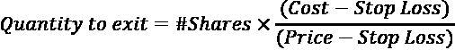
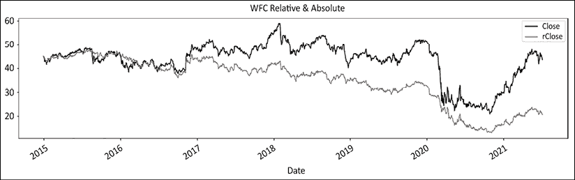
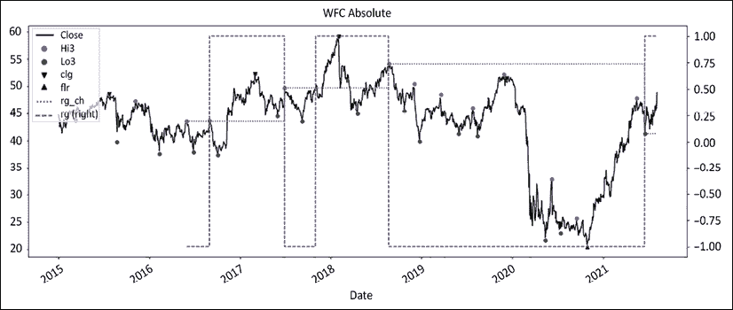
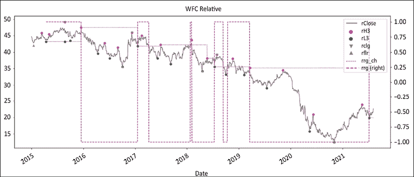
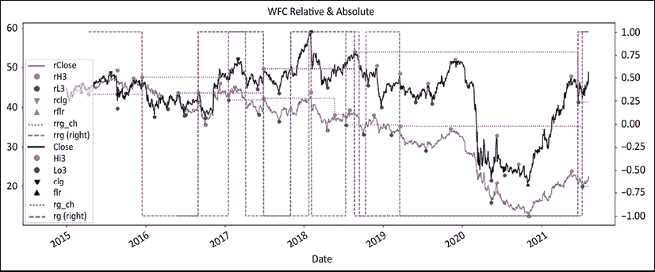
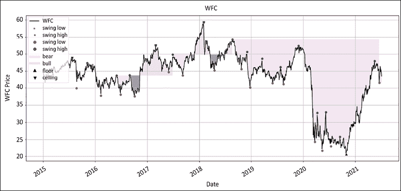
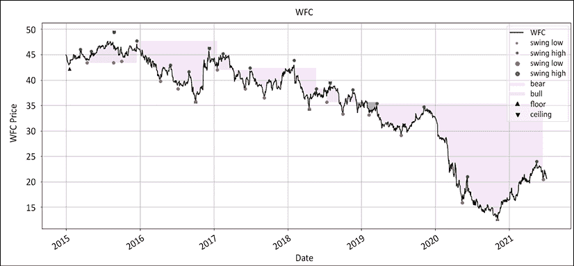

# 第十二章：12

# 信号与执行

> “我们有两只耳朵和一张嘴，这样我们可以听两次比说话多”，
> 
> – 司提反

这一章将告诉您如何准确地设置订单优先级及其背后的原因。我们将研究如何使用相对序列管理投资组合，但在绝对序列中执行。我们将深入研究出场，从不盈利和盈利的情况开始。我们将考虑出场的心理卫生。然后，我们将转向一个热门话题：进入和重新进入。我们将提出直觉上反直觉但有效的低风险高回报的进入技巧。整本书都铺垫到了这一点和接下来的章节，所以我们将重新讨论书中的部分内容，提出一些综合我们迄今所见的一切的代码，并可视化结果。

在此过程中，我们将讨论以下主题：

+   导入库

+   时间就是金钱：订单时间的重要性

+   订单优先级

+   出口

+   进入

您可以通过以下链接访问本章中所有图像的彩色版本：[`static.packt-cdn.com/downloads/9781801815192_ColorImages.pdf`](https://static.packt-cdn.com/downloads/9781801815192_ColorImages.pdf)。您还可以通过该书的 GitHub 存储库访问本章的源代码：[`github.com/PacktPublishing/Algorithmic-Short-Selling-with-Python-Published-by-Packt`](https://github.com/PacktPublishing/Algorithmic-Short-Selling-with-Python-Published-by-Packt)。

# 导入库

对于本章和本书的其余部分，我们将使用`pandas`、`numpy`、`yfinance`和`matplotlib`库。我们还将使用 ScientificPython 库中的`find_peaks`。所以，请记得首先导入它们：

```py
# Import Libraries
import pandas as pd
import numpy as np
import yfinance as yf
%matplotlib inline
import matplotlib.pyplot as plt
from scipy.signal import find_peaks 
```

# 时间就是金钱：订单时间的重要性

2005 年，日本市场经历了指数上涨。僵尸股再次复活了！2006 年 1 月底，警方实际上突袭了这个派对。他们逮捕了这个新日本典范的标志性人物。突然间，感觉就像是一个夜总会关门了。粗糙的霓虹灯突然间被打开。醉醺醺的人们在舞池里相互凝视，困惑不解。现实带着报复性回来了。漂浮的僵尸重新发现了牛顿物理学。不幸的是，对于任何单一问题的借贷的可用性和成本都是令人望而却步的，所以在我和美林证券股票借贷部门的伙伴们一起，我们想出了一个**信用评级资产价格**（**CRAP**）篮子交换的想法。我们倾入了所有我们能找到的僵尸。借贷成本是可以负担得起的 2%。价格将是当天收盘价。容量几乎是无限的。在复合 beta 达到 2.3 时，它比指数期货具有更大的扭矩。我们已经做好了生意。

但是当是时候下手时，负责人犹豫了。他抱怨说太波动了，太有风险了，太不正统了。因此，我们最终选择了“监视”它，一个花哨的词来制造《大富翁》的货币：-2%，-4%，-5%，日复一日。但他对这笔交易仍然不感到舒适。三周后，我得出结论：异国情调是一个度假胜地，而不是一个价值三亿美元的组合投资组合中的做空位置。然后，有一天，掉期进来了。我的名字也在上面。那天晚上我睡不着。第二天，它又额外跌了-2%。第三天，它再跌了-0.5%，但然后，它开始稳定下来。它上涨了+0.5%，+3%，+6%。我们完美地把握住了底部。但现在，史上最大的做空追击正在给做空者带来民主。最终，我们以巨额亏损平仓了一笔在不到两个月内下跌了-63%的做空仪器。

故事的寓意：时间就是金钱。有正确的想法是一回事。良好地执行它是另一回事。熊市反弹定期发生。生活中有三个确定性：税收、死亡，以及在二者之间，熊市反弹。一些市场参与者声称市场无法进行时机把握。在多头方面，市场更加宽容。构思和执行可以融合在一起。支持多头的上升漂移也惩罚了空头卖家。许多基本面空头卖家经常抱怨他们太早或有时太晚了。

# 订单优先级

进入是一个选择，退出是一个必要性。你可能随心所欲地进入，但你很少有机会按自己的意愿退出。在执行交易员的英语中，进入是限价单，而退出是止损单或市价单。长期持有者经常苦恼于现金余额。他们需要知道每天可以购买多少。长/短组合投资组合比传统的仅长仓簿记有更多的变动部分。事情很快就会变得混乱不堪。因此，为进入和退出设置“通行权”是明智的选择。在执行交易员的英语中，退出始终排在第一位。消耗现金的订单具有“通行权”。这可以总结如下：

1.  买入做空是最高优先级。它的功能类似于买单。它消耗现金。做空对长期购买力和总体敞口产生影响。买入做空在极少数情况下可能触发保证金调用。

1.  卖空是次高优先级。它释放了被困住的现金。

1.  卖空：做空生成多余的现金。这些多余的现金可以用来购买更多的股票。一些司法管辖区要求做空者在下达做空订单之前先获得股票借出。未能这样做会导致**裸卖空**。这种做法指的是未事先找到借出就进行卖空。这本身并不违法，但严重不受欢迎。交易通常被重新分类为“未交付”，并进行关闭。如果你想被认真对待，就不要...

1.  买入多单：再次强调，最重要的交易是最后进行的。只有当所有交易都排好队之后，才应该进行买入多单的订单。如果空头头寸没有平仓，但进入了多头头寸，这将减少现金余额。如果需要急忙平仓空头头寸，这可能会带来一些风险。

让我们回顾一下。首先是降低风险的交易。这些交易包括买入平仓和卖出多单。然后是旨在增加现金余额的交易：卖出空单和买入多单。

重新进入信号是一个案例，其中重复犯罪者应该被安排在前排。任何重新进入信号都是更长期趋势仍然有效的确认。此外，先前头寸已经嵌入了损益。因此，综合未平仓风险低于任何新进入的风险。然而，这也有局限性。增加已有头寸的操作被称为**金字塔加码**。就像生活中的一切一样，趋势会成熟。每个新头寸都会更接近趋势的成熟——最终是耗尽。这增加了集中风险和波动性。因此，通过例如每次重新进入时采取更小的头寸来降低风险是明智的。头寸规模最终会变得太小而被拒绝。

接下来，我们将更详细地看一下当我们以相对系列运行系统时会发生什么。

## 相对价格和绝对执行

虽然你的系统是基于货币调整和基准相对价格运行的，但是以美元发送一笔关于日本股票相对于 MSCI World 的订单，确实会引起交易台上一些滑稽的表情。这对你来说可能是昭然若揭的，但需要说明的是，交易员不擅长心灵读取。在现实世界中进行交流时，订单必须以本地货币进行下达。

由于系统是基于货币调整和基准相对价格运行的，所以止损不需要被翻译。实际上，止损与本地绝对价格无关。在前面的章节中，止损是基于相对价格而不是绝对价格的。这是因为你的系统应该是基于相对价格的。这意味着止损订单不需要在经纪人的服务器上停留。不需要挂止损订单的一个好处是它们不能被掠夺性的智能资金（**高频交易**（**HFT**）参与者）操纵。

## 订单类型

高频交易的出现严重丰富了交易订单的选项。想要优化执行超出击败成交量加权平均价格的市场参与者，欢迎探索订单执行的广阔领域。

为了本书的目的，让我们坚持一个简单的原则：入场是一个选择，退出是一个必要条件。这意味着退出交易要么是市场、止损或止损限价订单。入场要么是成交或取消，限价或止损限价订单。当我们扳动扳机时，我们希望成交。我们内心的白痴喜欢追逐，但我们的业绩记录讨厌糟糕的执行。你的入场和退出缺乏纪律将影响你的业绩记录，所以坚持计划。一点点克制会有回报。从相对系列到绝对系列的转换中会有一些小的滑点，但最终这一切都会平衡起来。

接下来，让我们讨论退出和入场——我们按照这个顺序讨论它们，因为如我们已经注意到的，退出应优先于入场。

# 退出

退出分为不盈利和盈利退出。前者旨在生存，而后者则建立繁荣。我们在*第二部分*，*外在游戏：打造强大的交易边缘*中大量讨论了退出。以下是一个逐步简短的概括，涵盖了退出的实际方面和心理卫生。

## 止损

止损对交易边缘公式中的四个变量中的三个直接可测量影响：胜率、败率和平均损失。仅因为这个原因，它总是位于优先级列表的顶部。记住，将专业空头卖家与游客区分开来的是设定止损并遵守它们的能力。接下来的内容可以视为一个重要的核查表。我们在整本书中都涵盖了这些话题，特别强调了*第七章*，*提高您的交易边缘*。

1.  在逻辑上的表达位置设置止损，其中论点被无效化

1.  设置一个损失缓和的跟踪止损：这有两个积极的影响：

    +   它可以减少损失，并将盈利期望倾向于保本。

    +   在心理上更容易处理和停止较小的持仓

1.  持仓规模：在发送交易之前运行风险管理以计算您的暴露。

    +   保守地设置固定止损

    +   在跟踪止损上积极一点

接下来是心理准备。小额损失会消耗你的情感资本。不要忽视你的心理卫生。提醒一下，所有优秀的交易者都专注于心理资本，而平庸的人则担心移动平均持续时间或其他毫无意义的琐事。

## 事前评估

想象自己在亏损时关闭交易，并感受相关的负面情绪。重复这个过程并调整大小，直到你感到舒适接受损失。这样可以提前处理你的悲伤。按下发送按钮，对你的资金说再见，并考虑以下因素：

1.  **时间停止**：削减或减少持仓规模。时间停止在心理上很难执行：“如果我再给它多一天、一周、一个月……”一个技巧是想象一个真实的时间浪费者，并将图像锚定到持仓位置。

1.  **减少损失**：冥想，保持警觉。这可以防止急切或恐惧。损失是游戏的一部分。

1.  **止损**：这是最坏的情况。如果您在事前作业上做了功课，这应该是个形式上的事情。首先，原谅自己。

事前评估可追溯到斯多哥哲学家和罗马皇帝马库斯·奥里利乌斯。这是最有效的视觉化练习之一，可以在压力下保持冷静。

## 齐格尼克效应

提醒自己以下内容：

1.  一旦头寸消失在视线之外，您将在 2 周内几乎不会记得那个头寸。您的资本比由单个糟糕交易引起的脑雾更重要。

1.  做出小的损失将确保您活着去做另一次交易。带上尺子（前额叶皮质）和战士心态来执行交易。

当您定期查看交易日志时，特别注意止损。注意自己的感受。这已经不像以前那样情绪化了。你看，这并不那么难。如果你微笑了，太好了。存储那种感觉。您正在建立一个明智交易战士的新神经路径。

## 盈利退出

下面是盈利退出的逐步方法：

+   提前决定风险降低的方法：目标价格、跟踪退出、期权。不要偏离。

+   不要等待熊市反弹。随着人们继续卖出以避免市场冲击，及时平仓。

+   这是平仓的最小数量，以保持交易盈亏平衡：



+   顺势而为熊市反弹。让它冲刷过去。如果您提前降低了风险，这不应该影响您的心态。当熊市反弹结束时，重新设置止损。

+   如果涨势的高点低于上一个高点，则重新进场；否则，不做任何操作。

让我们用一些 Python 代码来结束这一切。首先，我们将使用三个变量来设置目标退出价格：`price`、`stop_loss` 和 `r_multiplier`。我们计算 `r` 作为从 `price` 到 `stop_loss` 的距离。然后，我们应用一个乘数，恰当地命名为 `r_multiplier`。这个数字被添加回成本以计算目标价格。然后，我们将使用相同的 `r_multiplier` 计算要退出的数量。在*第七章*，*提高交易优势*中，我们看到了目标价格和要退出的数量之间的反向关系。

```py
def target_price(price, stop_loss, r_multiplier):
    r = price - stop_loss
    return price + r * r_multiplier

def partial_exit(qty, r_multiplier):
    if (qty * r_multiplier)!= 0:
        fraction = qty / r_multiplier
    else:
        fraction = 0
    return fraction

price = 100 
stop_loss = 110 
qty = 2000 
r_multiplier = 2 

pt = target_price(price, stop_loss, r_multiplier) 
exit_qty = partial_exit(qty, r_multiplier) 
print('target price', pt,'exit_quantity',exit_qty) 
```

输出将如下所示：

```py
target price 80 exit_quantity 1000.0 
```

80%的头寸将会在此时退出。这样可以降低 100%的风险。接下来，让我们考虑如何确定进场时机。

# 进场

> "把市场波动视为朋友而不是敌人；从愚蠢中获利，而不是参与其中。"
> 
> – 沃伦·巴菲特

优秀的扑克玩家不是打自己的牌。他们打其他玩家的牌。要成功，您需要系统地将概率倾斜到您的有利。市场碰巧是一个概率游戏。取得伟大成功的方法不仅是打出你的手牌，还要打市场的无形之手。

玩转市场的第一种方法是我们在*第五章*，*政权定义*中看到的。让市场决定股票应该走哪一边。让我们诚实地说一秒钟。做空泡沫股票的市场参与者是被压抑的复仇交易者。在内心深处，他们对自己的阴影自我没有参与做多感到愤怒。也许他们关闭得太早了。也许他们完全忽视了那艘船。无论哪种方式，他们通过让别人的宝贵资金立即置于危险之中来发泄他们的挫败感。在对“公平”估值的成年人呼吁背后，隐藏着一个 6 岁孩子受伤的自尊心的“必须正确”的阴影需求。

没有比 TSLA 更好地说明这一现象的了。这是一家汽车制造商，处于一个声名狼藉的脆弱行业，被定价为科技股，其债券被定价为垃圾债。必须有所作为。这给了空头卖家充足的理由来猛烈袭击股票。在冠状病毒大流行之后，股价下跌到了$400。这给了空头卖家加倍努力的理由，只是在接下来的六个月里面临着急剧的三倍反弹。

如果做空者将跌幅视为一个机会性的买入机会，他们还会围攻吗？当然不会，他们会笑着跳着去银行。地球上的每个人，从瑙鲁到博博迪乌拉索，都会知道他们选中了那只股票有多聪明。现在，他们被苦苦降低到要求对那个粗鲁价格公正的地步。无论哪种方式，别人的钱不是一个有效的智商测试。再次，他们让自己的自尊心在市场的永恒舞蹈中踩到了自己的脚趾。当心那些玩弄伊卡洛斯股票的卡桑德拉，因为他们可能会将你拖入表现不佳的世界。在听从他们的建议时，为冥界的渡船人留下最后一枚硬币。如果做空游戏是关于玩弄市场的无形之手，那就让市场为你做繁重的工作。做空市场贬低的问题，并在需求旺盛的问题上做多。

第二种玩转市场的方法是掌握时机。多年来，我常常抱怨空头挤压。我进入一个头寸，感觉良好，然后在下一个熊市反弹中被无情地止损出局。财务资本受到损害，情感资本再次遭受侮辱。更重要的是，似乎教训被忽略了。然后有一天，空头挤压的能量突然映照在我的智力密度上。由于价格似乎会在我的“防线”止损线之外反弹，我所要做的就是等待下一个熊市反弹，看看新的海岸线，并获得更好的执行。

我开始将熊市反弹视为礼物。它们将他们的宝藏带到岸边供我们选择。一旦熊市反弹开始消退，价格就会像职业政客一样摇摆不定。做空者被困在岸上。乐观的多头持有者尚未被拖入新的深渊。分界线清晰。在执行交易员英语中，这是一个低风险高回报的入场价格，上方设有明确的止损线，并且可能会有下跌。等待市场开始下跌，然后沿着看跌趋势打印一个新的较低的高点来进入做空。顺便说一句，这是“买入跌势”技术在多头方面的镜像入场。

第三种玩市场的方式是执行。做空者面临着极不利的概率。如果你在股价下跌时做空，只要记住 90%以上的市场参与者只会做多，某个地方某人会将当前的弱势视为折价购买的机会。如果你在熊市股票反弹时做空，你可能会因为被抛售或者牛市的开始而被淘汰。作为一个做空者，只有在概率对你有利的狭窄时间窗口。为此，你需要密切关注价格走势。

一个很好的类比是豹子，是非洲四大动物中最小的。尽管豹子在智商、奔跑速度和武器方面胜过它们的猎物，但它们从不追逐。它们隐藏在树上等待猎物靠近它们。做空者需要以同样的方式行事。这是一个三步过程。

1.  首先，你的制度分析（来自*第五章*，*制度定义*）应该已经确定了股票可能处于横向或熊市模式中的一种。与市场一致通常会倾向于增加你的获胜几率。

1.  第二，宇宙已经被缩小为可投资候选股票的短列表。

1.  第三，熊市反弹的退潮清晰地表明了牛市并不掌控局面。

市场指导两个步骤：设置和执行。一个步骤来自于分析：可投资候选股票的短列表。我们已经讨论过如何倾斜你的交易优势在*第二部分*，*外部游戏：制定强大的交易优势*中，但我们将重温一些关键想法：

+   首先，使用相对系列。

+   第二，通过制度对表现不佳者和表现优异者进行初步分类。

+   第三，在高点后进入做空或在低点后进入做多。

+   第四，将止损设置在一个合理的表达点。

+   第五，计划部分退出以减少风险。

让我们回到豹子。一旦它扑出去，它就不会在半空中停下来反思生活的意义、动物的残酷性或细胞层面素食饮食的比较优势。反省的时机已经过去。现在，是执行时间。游客会在他们认为是正确的船之后立即跳跃和游泳。专业人士将耐心等待市场上涨并冲洗游客。当反弹进入并翻转时，他们会站在一边，只有在那时他们才会坐在渡轮上。关于卖空的最好消息是熊市反弹的节拍的规律性。

## 翻转：熊市反弹的合气道

每个长时间练习这门手艺的卖空者在熊市反弹中都受过伤。一个简单的观念转变可以将这种能量从毁灭转变为利用的力量。

目标是尽早以合理的成功概率进入。短线挤压可能会棘手。它们总是超出预期并持续时间更长。

进入大师级别的卖空者的标志是在下一个大幅下跌中做对，但仍然低估了熊市反弹的能量。尊重市场，因为它们肯定不会尊重你。市场不知道你的名字，也不应该在乎。接受你将不得不为确认付出代价。等待局部高峰过去和翻转开始。稍后我们将用几张图来说明这一点，但现在让我们看看这种方法的优点。

这种翻转或潮汐滚动方法有一些优点：

+   **风险管理**：当前高点低于峰值。牛市不再掌控局势。如果峰值上升，则是早期迹象表明制度可能已经改变。趋势是你的朋友。

+   **入场接近顶部**。熊市处于混乱状态。牛市充满乐观。你是机会主义者。现在概率正倾向于你。

+   **借贷可用性**：熊市通常会冲洗掉游客。再次可以借贷。即使最喧哗的卖空者也害怕涉足水中。

+   **更大的头寸大小**：接近顶部的近距离需要比崩盘水平更大的头寸。你更接近一个合乎逻辑的止损。如果价格上涨超过当前顶部，则你已经制定好了退出计划

+   **清晰的分界线**：顶部是牛市和熊市的定论。有关供给、需求和波动率的信息是可用的。

以下是我们之前讨论过的一些其他经典入场方法。

## 移动平均线

移动平均线是简单、有效且足够稳健的信号。虽然没有完美的策略，但通常最好使用短期移动平均线，比如收盘价低于 5 天移动平均线。有关移动平均线交叉的更多信息，请参阅*第五章*，*制度定义*。

## 回撤

回调信号最高点的距离。这可以是从最高高点或最高低点开始的距离，以平均真实范围表示。把它看作是一种形式的移动止损。作为提醒，请看我们在*第五章*，*制度定义*中概述的回调摆动函数：

```py
def retracement_swing(df, _sign, _swg, _c, hh_ll_dt, hh_ll, vlty, retrace_vol, retrace_pct):
    if _sign == 1: # swing high
        retracement = df.loc[hh_ll_dt:, _c].min() - hh_ll

        if (vlty > 0) & (retrace_vol > 0) & ((abs(retracement / vlty) - retrace_vol) > 0):
            df.at[hh_ll_dt, _swg] = hh_ll
        elif (retrace_pct > 0) & ((abs(retracement / hh_ll) - retrace_pct) > 0):
            df.at[hh_ll_dt, _swg] = hh_ll

    elif _sign == -1: # swing low
        retracement = df.loc[hh_ll_dt:, _c].max() - hh_ll
        if (vlty > 0) & (retrace_vol > 0) & ((round(retracement / vlty ,1) - retrace_vol) > 0):
            df.at[hh_ll_dt, _swg] = hh_ll
        elif (retrace_pct > 0) & ((round(retracement / hh_ll , 4) - retrace_pct) > 0):
            df.at[hh_ll_dt, _swg] = hh_ll
    else:
        retracement = 0
    return df 
```

下面，让我们再次提醒自己关于`retest_swing`函数。

## 重新测试

提供在*第五章*，*制度定义*中的摆动检测代码是基于重新测试的。价格打印出高点，然后是低点。价格试图攀升到新的高点，但失败了，并且低于先前的低点。距离前一次摆动越远，重新测试就越不嘈杂。作为提醒，请参阅源代码：

```py
def retest_swing(df, _sign, _rt, hh_ll_dt, hh_ll, _c, _swg):
    rt_sgmt = df.loc[hh_ll_dt:, _rt] 

    if (rt_sgmt.count() > 0) & (_sign != 0): # Retests exist and distance test met    
        if _sign == 1: # swing high
            rt_list = [rt_sgmt.idxmax(), rt_sgmt.max(), df.loc[rt_sgmt.idxmax():, _c].cummin()]

        elif _sign == -1: # swing low
            rt_list = [rt_sgmt.idxmin(), rt_sgmt.min(), df.loc[rt_sgmt.idxmin():, _c].cummax()]
        rt_dt,rt_hurdle, rt_px = [rt_list[h] for h in range(len(rt_list))]

        if str(_c)[0] == 'r':
            df.loc[rt_dt,'rrt'] = rt_hurdle
        elif str(_c)[0] != 'r':
            df.loc[rt_dt,'rt'] = rt_hurdle    

        if (np.sign(rt_px - rt_hurdle) == - np.sign(_sign)).any():
            df.at[hh_ll_dt, _swg] = hh_ll 
    return df 
```

接下来，我们将考虑一个富国银行的例子，其中重新测试和回调摆动都在起作用。如果一个方法失败，另一个可以补偿。

## 把所有东西都放在一起

现在是将想法结合起来，并在一个代码块中综合方法的时候了。在*第五章*，*制度定义*中，我们发布了富国银行与 S&P 500 的绝对和相对系列的图表：



图 12.1：富国银行价格在绝对和相对于 S&P500 的图示从 2015 年 9 月开始

我们已经涵盖了几乎所有内容，所以没有真正需要对代码进行评论，除了两件事：

1.  我们从初始化基准开始，并下载下面股票的数据。如果您想要为一系列股票重复此过程，请在`df`下载行之前插入一个循环。

1.  其次，我们通过列表推导重新初始化了`_o`、`_h`、`_l`和`_c`属性。这在代码的下一部分将会有意义。

接下来，我们使用摆动检测函数计算了绝对和相对系列的摆动和制度。两次运行相同函数但分配了绝对或相对系列更有效。这就是为什么我们在之前重新初始化了`_o`、`_h`、`_l`和`_c`以及下面的摆动值。

```py
### STEP 1: ### Graph Regimes Combo ###
def graph_regime_combo(ticker,df,_c,rg,lo,hi,slo,shi,clg,flr,rg_ch,
                       ma_st,ma_mt,ma_lt,lt_lo,lt_hi,st_lo,st_hi):

#### removed for brevity: check GitHub repo for full code ####
### Graph Regimes Combo ###

### STEP 2: ### RELATIVE
def relative(df,_o,_h,_l,_c, bm_df, bm_col, ccy_df, ccy_col, dgt, start, end,rebase=True):
#### removed for brevity: check GitHub repo for full code ####
### RELATIVE ###

### STEP 3: import library
from scipy.signal import *
### STEP 4: #### hilo_alternation(hilo, dist= None, hurdle= None) ####
def hilo_alternation(hilo, dist= None, hurdle= None):
#### removed for brevity: check GitHub repo for full code ####
#### hilo_alternation(hilo, dist= None, hurdle= None) ####

#### historical_swings(df,_o,_h,_l,_c, dist= None, hurdle= None) #### 
def historical_swings(df,_o,_h,_l,_c, dist= None, hurdle= None):

#### removed for brevity: check GitHub repo for full code ####
#### historical_swings(df,_o,_h,_l,_c, dist= None, hurdle= None) ####
### STEP 5: #### cleanup_latest_swing(df, shi, slo, rt_hi, rt_lo) ####
def cleanup_latest_swing(df, shi, slo, rt_hi, rt_lo): 
#### removed for brevity: check GitHub repo for full code ####
#### cleanup_latest_swing(df, shi, slo, rt_hi, rt_lo) ####
### STEP 6: #### latest_swings(df, shi, slo, rt_hi, rt_lo, _h, _l, _c, _vol) ####
def latest_swing_variables(df, shi, slo, rt_hi, rt_lo, _h, _l, _c):
#### removed for brevity: check GitHub repo for full code ####
#### latest_swings(df, shi, slo, rt_hi, rt_lo, _h, _l, _c, _vol) ####
### STEP 7: #### test_distance(ud, bs, hh_ll, vlty, dist_vol, dist_pct) ####
def test_distance(ud,bs, hh_ll, dist_vol, dist_pct): 
#### removed for brevity: check GitHub repo for full code ####
#### test_distance(ud, bs, hh_ll, vlty, dist_vol, dist_pct) ####

#### ATR ####
def average_true_range(df, _h, _l, _c, n):
#### removed for brevity: check GitHub repo for full code ####
#### ATR ####
### STEP 8: #### retest_swing(df, _sign, _rt, hh_ll_dt, hh_ll, _c, _swg) ####
def retest_swing(df, _sign, _rt, hh_ll_dt, hh_ll, _c, _swg):
    rt_sgmt = df.loc[hh_ll_dt:, _rt] 
#### removed for brevity: check GitHub repo for full code ####
#### retest_swing(df, _sign, _rt, hh_ll_dt, hh_ll, _c, _swg) ####
### STEP 9: #### retracement_swing(df, _sign, _swg, _c, hh_ll_dt, hh_ll, vlty, retrace_vol, retrace_pct) ####
def retracement_swing(df, _sign, _swg, _c, hh_ll_dt, hh_ll, vlty, retrace_vol, retrace_pct):
#### removed for brevity: check GitHub repo for full code ####
#### retracement_swing(df, _sign, _swg, _c, hh_ll_dt, hh_ll, vlty, retrace_vol, retrace_pct) ####
### STEP 10: #### regime_floor_ceiling(df, hi,lo,cl, slo, shi,flr,clg,rg,rg_ch,stdev,threshold) ####
def regime_floor_ceiling(df, _h,_l,_c,slo, shi,flr,clg,rg,rg_ch,stdev,threshold):
#### removed for brevity: check GitHub repo for full code ####
#### regime_floor_ceiling(df, hi,lo,cl, slo, shi,flr,clg,rg,rg_ch,stdev,threshold) #### 
```

下面是实际重要的代码，将打印出*图 12.1*所示的图形：

```py
params = ['2014-12-31', None, 63, 0.05, 0.05, 1.5, 2]
start, end, vlty_n,dist_pct,retrace_pct,threshold,dgt= [params[h] for h in range(len(params))]

rel_var = ['^GSPC','SP500', 'USD']
bm_ticker, bm_col, ccy_col = [rel_var[h] for h in range(len(rel_var))]
bm_df = pd.DataFrame()
bm_df[bm_col] = round(yf.download(tickers= bm_ticker,start= start, end = end,interval = "1d",
                 group_by = 'column',auto_adjust = True, prepost = True, 
                 treads = True, proxy = None)['Close'],dgt)
bm_df[ccy_col] = 1

ticker = 'WFC'
df = round(yf.download(tickers= ticker,start= start, end = end,interval = "1d",
                 group_by = 'column',auto_adjust = True, prepost = True, 
                 treads = True, proxy = None),2)
#### removed for brevity: check GitHub repo for full code ####

    rohlc = ['rOpen','rHigh','rLow','rClose']
    _o,_h,_l,_c = [rohlc[h] for h in range(len(rohlc)) ]
    rswing_val = ['rrg','rL1','rH1','rL3','rH3','rclg','rflr','rrg_ch']
    rg,rt_lo,rt_hi,slo,shi,clg,flr,rg_ch = [rswing_val[s] for s in range(len(rswing_val))] 
```

我们首先对绝对系列运行一个循环。我们使用上下限制度方法计算摆动和制度。在第一个循环结束时，我们使用相对系列重新初始化了`_o`、`_h`、`_l`、`_c`和摆动变量。现在我们已经计算出了富国银行在绝对和相对于 S&P 500 的摆动和制度。让我们可视化结果：

```py
plot_abs_cols = ['Close','Hi3', 'Lo3','clg','flr','rg_ch','rg']
plot_abs_style = ['k', 'ro', 'go', 'kv', 'k^','b:','b--']
y2_abs = ['rg']
plot_rel_cols = ['rClose','rH3', 'rL3','rclg','rflr','rrg_ch','rrg']
plot_rel_style = ['grey', 'ro', 'go', 'yv', 'y^','m:','m--']
y2_rel = ['rrg']
df[plot_abs_cols].plot(secondary_y= y2_abs,figsize=(20,8),
            title = str.upper(ticker)+ ' Absolute',# grid=True,
            style=plot_abs_style)

df[plot_rel_cols].plot(secondary_y=y2_rel,figsize=(20,8),
            title = str.upper(ticker)+ ' Relative',# grid=True,
            style=plot_rel_style)

df[plot_rel_cols + plot_abs_cols].plot(secondary_y=y2_rel + y2_abs,figsize=(20,8),
            title = str.upper(ticker)+ ' Relative & Absolute',# grid=True,
            style=plot_rel_style + plot_abs_style) 
```

我们将绘制三个独特的图表：绝对、相对和综合。因此，我们将绝对和相对参数存储在列表中。话不多说，这是三个图表：



图 12.2：富国银行的绝对波动和上下限制度

制度一直是行为的一个公平预测因素，特别是在后半段。2020 年的涨势直到 2021 年出现摆动低点才导致制度变化。接下来，我们将绘制相对系列：



图 12.3：富国银行的波动和地板/天花板制度相对于标普 500 指数

正如我们在前面的章节中所看到的，当丑闻爆发时，富国银行受到了重创，直到 2021 年才恢复。制度看起来表面上更加紧张。一路上有相当多的看涨假阳性。它们的范围和持续时间都很短。请注意，价格线上方的红点如何构成良好的入场点和/或移动止损水平。当然，打印波动高点和发现它们之间存在一小段滞后时间。最后，我们将两者合并成一个图表：



图 12.4：富国银行的波动和地板/天花板制度绝对和相对于标普 500 指数

这最后一个图表看起来比前两个更加嘈杂。请注意地板/天花板方法如何准确地命中了 2016 年 9 月的丑闻。相对系列在整个期间始终领先于制度。

让我们再次使用图表制度函数来可视化绝对和相对图表：

```py
ma_st = ma_mt = ma_lt = lt_lo = lt_hi = st_lo = st_hi = 0
rg_combo = ['Close','rg','Lo3','Hi3','Lo3','Hi3','clg','flr','rg_ch']
_c,rg,lo,hi,slo,shi,clg,flr,rg_ch=[rg_combo[r] for r in range(len(rg_combo))]
graph_regime_combo(ticker,df,_c,rg,lo,hi,slo,shi,clg,flr,rg_ch,ma_st,ma_mt,ma_lt,lt_lo,lt_hi,st_lo,st_hi)

rrg_combo = ['rClose','rrg','rL3','rH3','rL3','rH3','rclg','rflr','rrg_ch']
_c,rg,lo,hi,slo,shi,clg,flr,rg_ch=[rrg_combo[r] for r in range(len(rrg_combo))]
graph_regime_combo(ticker,df,_c,rg,lo,hi,slo,shi,clg,flr,rg_ch,ma_st,ma_mt,ma_lt,lt_lo,lt_hi,st_lo,st_hi) 
```

以下是绝对值中绘制的制度：深色表示亏损期：



图 12.5：富国银行在绝对值中着色的地板/天花板制度

接下来，让我们看看相对系列：



图 12.6：富国银行在相对于标普 500 指数的地板/天花板制度着色

这最后一个图表真正展示了过去几年中表现不佳的程度。有许多识别趋势耗尽的方法，例如随机指标、相对强弱指标、移动平均收敛/散开指标、德马克指标以及后者的祖先，斐波那契回调。其中大部分技术归结为将混乱带入秩序。不幸的是，普及并不一定表示统计上的稳健性。如果你仍然相信使用预测性技术分析，你可以将订单分成两部分，第一部分使用预测性分析，第二部分在确认预测准确后添加。当它奏效时，你的平均执行会稍微好一些，并且当它不奏效时，你不会破产。

最重要的是，记住一个人的崩溃对另一个人来说是“低吸买入”。这是空头市场；市场不合作。利用熊市反弹和空头挤压来确定你的入场时机。当每个人都卖光时出局。通过减少仓位和/或重设止损来尽量降低风险。

# 摘要

整本书都指向了这一章和下一章。总之，为了总结我们在前面章节中所涵盖的所有内容，请切换到相对系列并根据市场制度进行分类。在高点之后进入空头，或者在低点之后进入多头。设定一个在波动之上或之下的止损价格和一个目标价格以降低风险。使用你的成本、止损和风险预算来计算你的头寸规模。

为每个策略的每个多/空侧保留单独的风险预算。尊重你的止损并尊重你的策略。保持一个干净的交易日志。在路上完善你的授权。

在下一章中，我们将研究你工具箱中最被低估的工具之一：你的投资组合管理系统。成为一名选股专家和一名投资组合经理是两种需要不同技能的不同工作。在你选择管理投资组合的那一刻，你不再是一个股票骑手。你已经成为了一个稳定的马主。你的工作不是骑在马背上冲过终点线。你的工作是培育（或淘汰）那些在可预见的未来能（或不能）冲过终点线的马匹。

一个相对的多空投资组合与传统的仅多头投资组合甚至绝对的多空投资组合是完全不同的生物。到目前为止你所使用的任何工具都迫切需要进行根本性的升级。如果你想在市场上有一线生机，你需要一套钢铁侠的装备。
