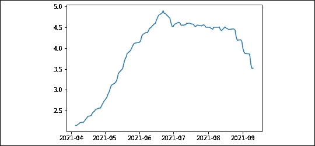
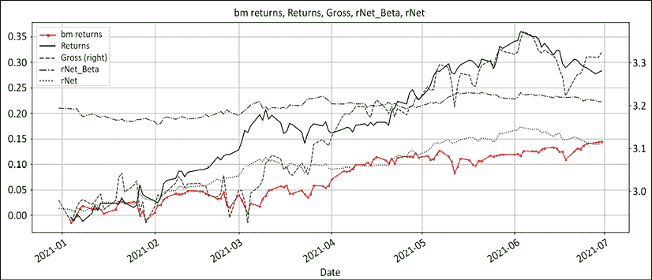
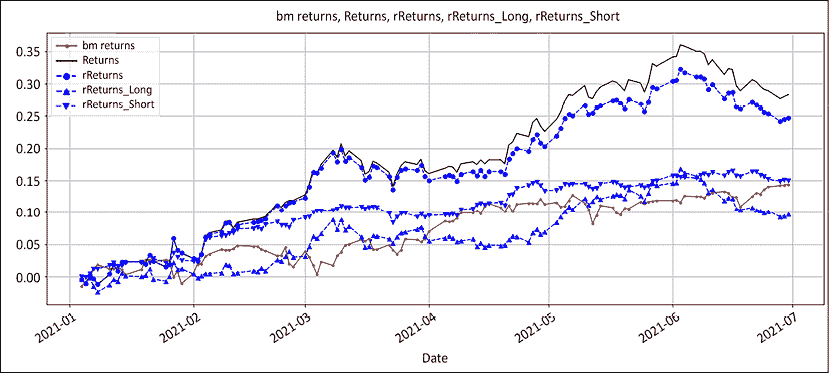
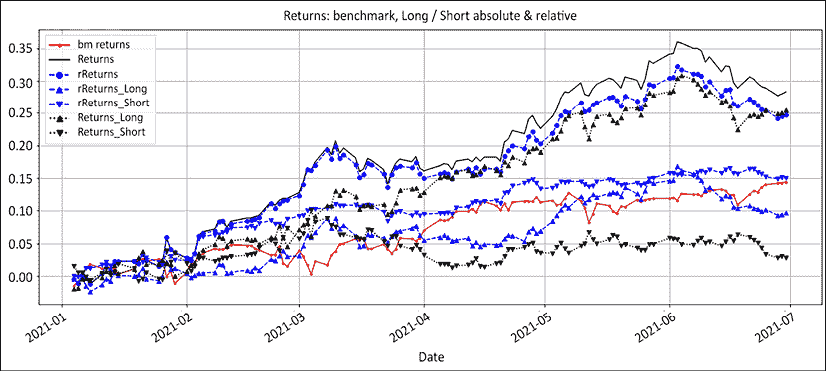
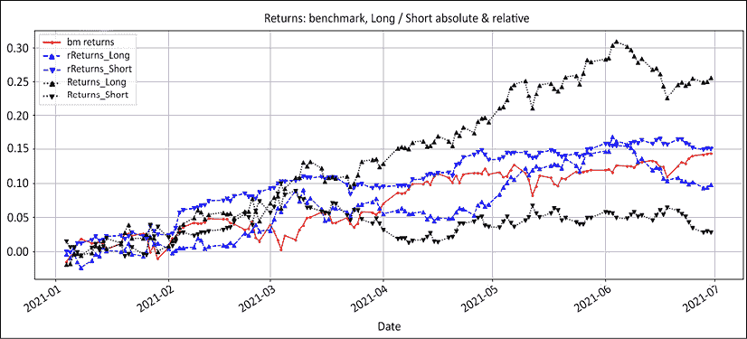
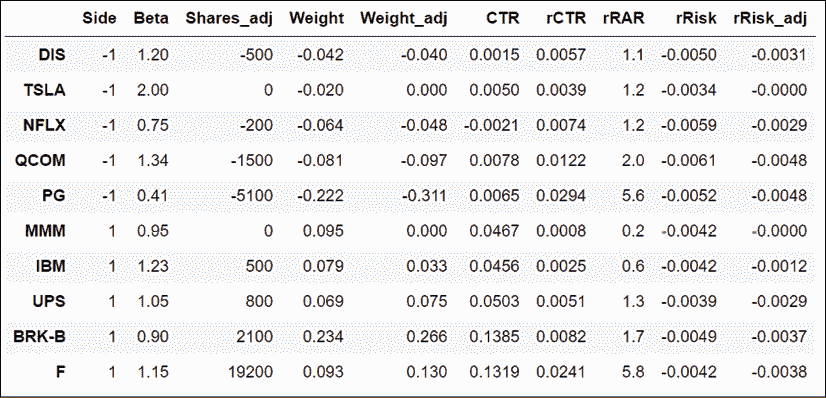
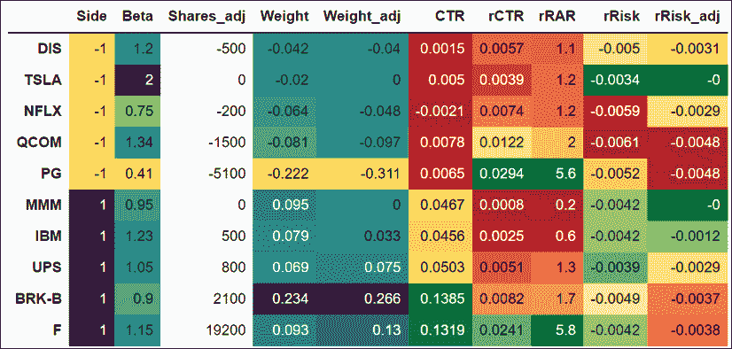
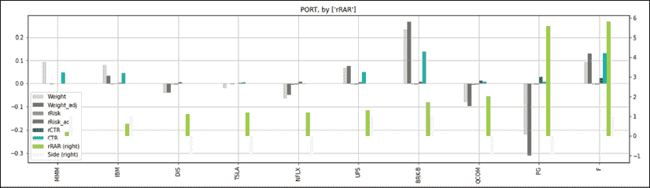
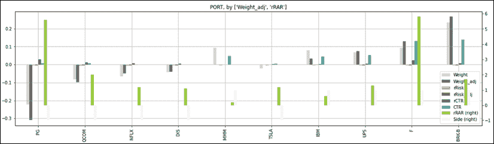
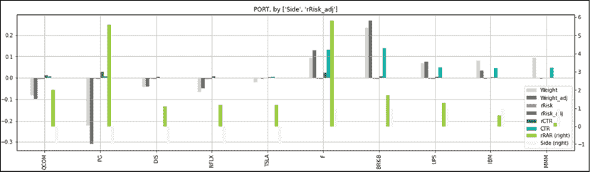

# 第十三章：13

# 投资组合管理系统

> "托托，我觉得我们不再是在堪萨斯了。"
> 
> – 多萝西，《绿野仙踪》

我在对冲基金世界的第一份工作是为一家管理资金不到 500 万美元的初创对冲基金建立和维护一个名为**投资组合管理系统**（**PMS**）的系统。创始人认为风险管理不是业务的一种装饰，而是业务本身。快进到现在，他们已经成为日本替代空间的主导者。在本章中，我们将继续上两章的工作，并介绍一个定制的 PMS，它可以显示投资组合的风险可视化。

为了说明健壮的 PMS 的重要性，让我们联系一下我们在本书中探讨过的一些概念。在*第一章*，《股票市场游戏》中，我们设定了市场是一个无限、复杂的随机游戏的背景。在*第六章*，《交易优势是一个数字，这就是公式》中，我们揭示了神奇、神秘和神话般的交易优势公式。在*第八章*，《头寸大小：在资金管理模块中赚钱》中，我们证明了头寸大小决定了绩效。我们在*第十一章*，《多空工具箱》中学到了我们工具箱中的工具。所以，我们知道头寸大小是关键因素，但我们还不知道哪些头寸会奏效，然而我们必须在管理风险敞口的同时保持正面期望。每天重复这个过程几年，以吸引并保留投资者。

在我的职业生涯中，朋友和同事们慷慨地展示了他们的 PMS。生存直接与他们 PMS 的质量相关。并不是每个拥有正确系统的人都成功了。但每一个没有系统的经理最终都崩溃了。

PMS 就像飞行仪器。任何新手都可以在晴朗的天空中驾驶飞机。仪器的存在是为了防止起飞和在夜间着陆、在雾中和湍流中的坠毁。没有仪器，不是每个人都能回家。市场并非一直是晴朗和顺利的。事情会出乎意料地变得丑陋。情绪确实会使我们偏离轨道。用执行交易员的术语来说，如果你没有一个坚实的 PMS，你怎么能说自己是一个投资组合经理呢？使用 Python 构建定制的 PMS 值得一本书，甚至是自己专门的文学流派，因此超出了本书的范围。然而，在本章中，我们将简要讨论一些基本概念和指导原则，希望能指导你：

+   糟糕的投资组合管理系统的症状

+   你的投资组合管理系统就是你的钢铁侠战衣

+   自动化枯燥的事情

+   构建一个健壮的投资组合管理系统

您可以通过以下链接访问本章中所有图像的彩色版本：[`static.packt-cdn.com/downloads/9781801815192_ColorImages.pdf`](https://static.packt-cdn.com/downloads/9781801815192_ColorImages.pdf)。您还可以通过该书的 GitHub 存储库访问本章的源代码：[`github.com/PacktPublishing/Algorithmic-Short-Selling-with-Python-Published-by-Packt`](https://github.com/PacktPublishing/Algorithmic-Short-Selling-with-Python-Published-by-Packt)。

# 导入库

对于本章和本书的其余部分，我们将使用`pandas`，`numpy`，`yfinance`和`matplotlib`库。所以，请记得首先导入它们：

```py
# Import Libraries
import pandas as pd
import numpy as np
import yfinance as yf
%matplotlib inline
import matplotlib.pyplot as plt 
```

# 低效的投资组合管理系统的症状

当谈到改善业绩时，一个好的 PMS 是最低的果实。在 2005 年，我加入了一个对 PMS 非常丑陋的对冲基金，看着它可能会导致脑损伤。我立即进行了改进，至少是为了消除健康风险。突然间，问题儿童们就像圣诞树上的花环一样亮了起来。短线股票的波动性减少了，懒惰的狗，和不被赏识的赛犬都被迅速处理了。波动性下降了。表现更加一致了。夏普比率提高了。投资者注意到了。**资产管理规模**（**AUM**）增长了。就是这么简单。

每个人都想知道赢家的"秘密酱"，但这是一个领域，"阿尔法挑战者"的经验可能会帮助我们避免无意中重复同样的错误。这是一个简单的练习，将帮助您判断您的系统是否需要升级。效率低下的 PMS 表现出以下一个或多个症状。

## 无效的资本配置

尽管投资组合经理们喜欢向公众展示出一个奥林匹克半神的形象，但只需几句话就可以将他们拉回现实：

+   "好人最后完成"：一些股票取得了令人印象深刻的回报，但由于头寸较小而未被注意到。这些往往是探索性的小头寸。它们获得高回报，但由于没有足够的规模而贡献不佳。

+   "肥猫不捉老鼠"：一些大头寸之所以有所贡献，只是因为它们的重量巨大。这是 PMS 的一个经典问题。它直接与上述问题相关。这些往往是占用了太多空间但回报微薄的高信仰度想法。

+   "曾经我们是勇士"：这些是现在免费吃白食的老牌贡献者。这些是一段时间以来变得陈旧的想法。它们有很多嵌入式的历史贡献，但不再产生收益。我们在**第七章**，*提升您的交易优势*中已经解决了这种情况。

## 监测不足的风险检测

一个需要密切关注的关键指标是流动性，以避免“加州酒店综合症”。换句话说，你不能清算的东西就不是你拥有的，而是拥有你的。流动性是熊市的货币。是否有头寸不能在不产生严重市场冲击的情况下清算？以下是一个重新计算头寸规模所需天数以便以平均交易量的一部分退出的函数。对于一个空头卖方来说，最可怕的事情就是看到熊市反弹获得动力，并意识到你的头寸过大以至于无法幸免于难。很少有比被迫清仓更糟糕的感觉，只见其在熊市海啸后重新开始向下滑落。

一个简单的风险度量是将头寸规模重新表述为以平均交易量的一部分进行清算所需天数。以下代码简单地计算了平均交易量的一部分。头寸数量除以此分数：  

```py
ticker = 'UNG' #ETF natural gas 
volume = yf.download(tickers= ticker,start= '2021-01-01', end = None,                     interval = "1d",group_by = 'column',                     auto_adjust = True, prepost = True,treads = True,                      proxy = None)['Volume']

def days_liquidation(quantity,volume,window,fraction):
    avg_vol_fraction = volume.rolling(window).mean()* fraction
    return round(quantity/avg_vol_fraction,2)
quantity = 100000
window = 63
fraction =0.01
days_liquidation(quantity,volume,window,fraction)[-1] 
```

这产生了类似以下的输出：

```py
3.52 
```

我们可以生成*图 13.1*所示的图表：

```py
plt.plot(days_liquidation(quantity,volume,window,fraction)) 
```

我们从`2021 年初`开始下载了`交易量`数据。该函数将一个固定百分比乘以交易量的移动平均值。这一股数除以交易量的一部分：`0.01`，或`1%`。这个值是任意的，且故意设得很低以展示原理。在实践中，`5-10%`是合理的阈值。截至`2021 年 6 月底`，如果订单量不超过平均交易量的`1%`，则大约需要`5 天`时间来清算整个头寸。我们将系列中的最后一个数字打印出来并绘制了移动平均线：



图 13.1: 以 3 个月平均交易量的 1%进行清算所需天数

上图显示流动性并非静态。最初，对于交易量占平均日交易量`1%`的头寸，清算大约需要`2 天`。随着流动性减少，清算所需天数增加到`5 天`，然后又回落到`3.5 天左右`。当价格朝着你不利的方向波动时，一周就仿佛是永恒。因此，应该密切监视流动性。

市场冲击是由于大宗交易引起的价格不利变动。当头寸超过日交易量的`5%`时，市场冲击就会开始。如果头寸量在日交易量的`10%`下持续时间超过`5 天`，那么就预期会产生一些严重的市场冲击。此外，熊市反弹的激烈程度不容小觑。在尝试从困境中解脱时，你将心理上处于被动状态。因此，始终要密切监视流动性，并在交易量减少时减少头寸。

## 高波动性

拥挤的空头有较高的平均借贷利用率。流动性将变薄，波动性将增加，回报将恶化。利用率或借贷费用的热度图是非常有价值的工具。在发布日期，遗憾的是没有免费的资源可以提供借贷利用率。作为一个捷径，当借贷费用大大高于平均水平时，可以假设受欢迎。处理拥挤的空头的最简单方法是随着受欢迎程度的提高减少头寸规模。再次强调，制定简单的规则，例如，如果利用率上升到 40%以上，则将头寸减半，每增加 10%再减半。到达 60%的利用率时，曝光将是原始规模的 25%。这只是一些思考。

爆炸并不显眼：人们希望感觉良好。在市场上，做自己感觉良好的事情很少是最赚钱的行动。处于风险中的股票必须在视觉上促使管理者采取行动。股票很少出现意外爆炸。它们通常会发出微妙的信号表明事情不如预期发展。

## 高相关性

多元化的目标是降低相关性。相关性很难避免。在*第四章*，*多空方法：绝对和相对*中，我们介绍了相对系列以减少与基准的相关性。然而，焦点从确定绝对顶部或底部转移到捕捉行业轮换，并相应地分配资产。投资组合内的相关性很难消除。坦率地说，我不知道如何在实践中做到这一点。迄今为止，我也没有遇到成功的方法。

## 曝光管理不善

有几种不同类型的曝光，可以通过以下方式表明投资组合管理不善：

+   净曝光：当投资组合的净曝光与当前的看涨/看跌观点不匹配时。这在熊市阶段尤其明显，当环境愁云密布时，净曝光仍然指向残存的乐观情绪。投资组合认知失调是指曝光不反映管理者的说法。

+   净贝塔暴露：大多数不足系统中缺乏真正的市场敏感性。当管理者只关注净曝光时，他们将低方向性与净市场敏感性混为一谈。净贝塔进一步超越净曝光，以反映对市场的敏感性。

+   市值暴露：做空期货是对冲的垃圾食品。正如我们在*第十一章*，*多空对冲工具箱*中看到的那样，小盘股和大盘股具有不同的风险特征。当市场整体情绪乐观时，小盘股表现良好，而大盘股是更安全的选择。净市值暴露反映了投资组合的整体乐观情绪。

+   总曝光：在好时机杠杆过多，在坏时机现金过多。总曝光是最容易减少或增加风险的杠杆。犹豫不决时，崩溃杠杆是最简单的风险政策。

+   交易所暴露：按市值和交易所暴露的暴露解释了很多好/坏的表现。正如我们在 *第四章*，*长/短期方法论：绝对和相对* 中所看到的，纳斯达克多年来一直优于标普 500。多年的轻松赚钱奖励了投机问题和那些押注于它们的人。当钱容易赚时，就容易赚钱。没有牛市曾经提高过任何人的智商。

总的来说，在资产管理行业，投资回报率最高的是定制的 PMS。随着信息差的缩小，市场参与者争先恐后地寻找优势。如果你能比你的同行更早地发现和解决问题，你就能获得可持续的竞争优势。

# 你的投资组合管理系统就是你的钢铁侠服

> "你知道，我经常被问到的问题是，“托尼，你怎么在你的衣服里上厕所？” [长时间的停顿] 就是这样。"
> 
> – 托尼·斯塔克，《钢铁侠》

托尼·斯塔克可能是个天才、亿万富翁、花花公子和慈善家。真正赋予他超能力的是他定制的钢铁侠服。他没有在 Macy's 的货架上买他的衣服。他在车库里摧毁了几辆兰博基尼，打造了一些独特增强他战斗风格的东西。同样，你的 PMS 就是你的钢铁侠服。它是你交易策略的延伸。它的唯一目的是帮助你在不确定性下做出交易决策。因为没有人像你一样交易，所以它需要高度定制化。

经典错误是购买昂贵的现成软件包，认为更多的信息会导致更好的交易决策。软件解决方案主要是由中后台人员为前台专业人员设计的报告工具。你的 PMS 是一个交易工具，而不是报告工具。Barra 因子分解或街头共识每股收益不会告诉你今天应该买入或卖空哪家公司的多少股票。信息转化为知识，而知识并不直接转化为技能。建立技能的关键是专注于直接导致行动的信息。

在实践中，系统整合几个月后，投资组合经理经常以低技术的 Excel 电子表格来管理他们的投资组合，这些电子表格从那些闪闪发光的玩具中获取数据。他们买了一辆兰博基尼去挑牛奶。因此，在你急于购买市场上最昂贵的玩具之前，这里有几个原则可以帮助你澄清自己的需求。信息必须根据四个原则组织：清晰、相关、简单和灵活。

## 清晰：绕过左脑

在压力下，你的杏仁核会释放化学物质，降低前额叶皮层或“思考大脑”的活动。你的思维能力会受到影响。你的 PMS 需要清晰度：信息必须组织得让问题迅速显现出来。其次，左脑无法处理数字的行和列。它慢慢的，每秒 5 到 7 位。它不会做关联。一切都变得模糊成无生机的数字汤。与此同时，右脑处理信息的速度快一百倍，寻找模式，并做关联。幸运的是，数据可视化是数据科学的新趋势。视觉线索能够绕过思考较慢的大脑。当决策涉及多个因素时，按照数字进行绘画有助于建立关联。例如，将你在投资领域内的位置可视化为热图会立即告诉你是否在正确的轨道上，并在每个行业内选择最佳策略。我们将在本章结束时查看投资组合热图。

另一个话题是警报。你是否曾想过为什么灾难警报是如此讨厌？如果《欢乐颂》宣布即将发生地震、海啸或火山喷发，人们可能不会感到同样的紧迫感。我们天生倾向于远离痛苦，向着愉悦之处前进。警报的存在是为了迫使最不情愿行动的人采取行动。当一个位置需要处理时，尽可能地让警报烦人。警报越烦人，解决问题的可能性就越大。最好的警报是你必须在执行日常任务之前手动确认的那些。例如：假设某只股票已达到止损位。如果设置了警报，你必须点击它才能继续查看你的投资组合，那么可能会发生两种情况。要么你会迅速解决问题，要么你会彻底避免使用这个工具。当正确的需求超过了赚钱的必要性时，我们内心的白痴就会更加努力地自我破坏。

经典错误之一是为每个风险因素都设立多个页面。这意味着用户必须在页面之间来回切换并做笔记。每增加一点摩擦力都会增加信息泄漏的可能性。飞行员不应该在飞机上上上下下地查看液压和燃油表是否一切正常。如果你想要将不同的风险联系起来，你需要将所有相关信息汇总到一页摘要中，以便在后续页面进行深入了解。可以把它想象成汽车或飞机的仪表板。你需要的所有信息都在你面前展示着。

将事物放在上下文中。左脑不能有效处理数字。295%的总暴露只是一个数字。当它在显示基准、总和净暴露以及表现的图表上绘制时，这个数字就在上下文中了。它是市场表现、你的位置以及随时间的结果表现的视觉呈现。一张图胜过千言万语。让我们回顾一下在*第十一章*，*多空工具箱*中看到的例子。我们从以下股票代码模拟了一个投资组合。我们假设从 2020 年 12 月 31 日到 2021 年 6 月期间没有交易：

```py
# Chapter 13: Portfolio Management System
K = 1000000
lot = 100
port_tickers = ['QCOM','TSLA','NFLX','DIS','PG', 'MMM','IBM','BRK-B','UPS','F']
bm_ticker= '^GSPC'
tickers_list = [bm_ticker] + port_tickers
df_data= { 
'Beta':[1.34,2,0.75,1.2,0.41,0.95,1.23,0.9,1.05,1.15],
'Shares':[-1900,-100,-400,-800,-5500,1600,1800,2800,1100,20800],
'rSL':[42.75,231,156,54.2,37.5,42.75,29.97,59.97,39.97,2.10]
}
port = pd.DataFrame(df_data,index=port_tickers)
port['Side'] = np.sign(port['Shares'])

start_dt = '2021-01-01'
end_dt = '2021-07-01'
price_df = round( yf.download(tickers= tickers_list,start= '2021-01-01', 
                              end = '2021-07-01', interval = "1d",                               group_by = 'column',auto_adjust = True,                               prepost = True, treads = True,                               proxy = None)['Close'],2)

bm_cost = price_df[bm_ticker][0]
bm_price = price_df[bm_ticker][-1]

port['rCost'] = round(price_df.iloc[0,:].div(bm_cost) *1000,2)
port['rPrice'] = round(price_df.iloc[-1,:].div(bm_price) *1000,2)
port['Cost'] = price_df.iloc[0,:]
port['Price'] = price_df.iloc[-1,:] 
```

在*第十一章*，*多空工具箱*中，我们处理了`port`数据框。这次，我们将使用`price_df`可视化曝光。我们首先计算基准收益。然后，我们将计算相对和绝对的长期和短期市值。

我们将计算绝对和相对的曝光和收益。

```py
price_df['bm returns'] = round(np.exp(np.log(price_df[bm_ticker]/price_df[bm_ticker].shift()).cumsum()) - 1, 3)
rel_price = round(price_df.div(price_df['^GSPC'],axis=0 )*1000,2)

rMV = rel_price.mul(port['Shares'])
rLong_MV = rMV[rMV >0].sum(axis=1)
rShort_MV = rMV[rMV <0].sum(axis=1)
rMV_Beta = rMV.mul(port['Beta'])
rLong_MV_Beta = rMV_Beta[rMV_Beta >0].sum(axis=1) / rLong_MV
rShort_MV_Beta = rMV_Beta[rMV_Beta <0].sum(axis=1)/ rShort_MV

price_df['rNet_Beta'] = rLong_MV_Beta - rShort_MV_Beta
price_df['rNet'] = round((rLong_MV + rShort_MV).div(abs(rMV).sum(axis=1)),3)

price_df['rReturns_Long'] = round(np.exp(np.log(rLong_MV/rLong_MV.shift()).cumsum())-1,3)
price_df['rReturns_Short'] = - round(np.exp(np.log(rShort_MV/rShort_MV.shift()).cumsum())-1,3)
price_df['rReturns'] = price_df['rReturns_Long'] + price_df['rReturns_Short']

MV = price_df.mul(port['Shares'])
Long_MV = MV[MV >0].sum(axis=1)
Short_MV = MV[MV <0].sum(axis=1)
price_df['Gross'] = round((Long_MV - Short_MV).div(K),3)
price_df['Net'] = round((Long_MV + Short_MV).div(abs(MV).sum(axis=1)),3)

price_df['Returns_Long'] = round(np.exp(np.log(Long_MV/Long_MV.shift()).cumsum())-1,3)
price_df['Returns_Short'] = - round(np.exp(np.log(Short_MV/Short_MV.shift()).cumsum())-1,3)
price_df['Returns'] = price_df['Returns_Long'] + price_df['Returns_Short']

MV_Beta = MV.mul(port['Beta'])
Long_MV_Beta = MV_Beta[MV_Beta >0].sum(axis=1) / Long_MV
Short_MV_Beta = MV_Beta[MV_Beta <0].sum(axis=1)/ Short_MV
price_df['Net_Beta'] = Long_MV_Beta - Short_MV_Beta 
```

`rel_price`框架是`price_df`数据框除以基准收盘价乘以 1,000 的结果。我们使用连续系列，不重新调整到系列的开始。索引在开始时的值有 4 位小数。因此，我们将相对价格乘以 1,000 以获得更容易处理的数字。我们将价格乘以股份数，按持仓的符号汇总，然后求和以获得相对的长期和短期市值。由于没有交易，除了收益外，市值没有变化。因此，我们使用市值的日变化来计算累积收益。正如我们在*第十一章*，*多空工具箱*中看到的，总暴露使用绝对系列。这是实际的资产负债表使用情况。

我们将主要的曝光和收益绘制在一张图上。然后我们绘制相对系列：

```py
price_df[['bm returns','Returns','Gross','rNet_Beta','rNet' ]].plot(
    figsize=(20,8),grid=True, secondary_y=['Gross'],
    style= ['r.-','k','g--','g-.','g:','b:','c','c:'],
    title = 'bm returns, Returns, Gross, rNet_Beta, rNet')

price_df[['bm returns', 'Returns', 'rReturns', 'rReturns_Long',
          'rReturns_Short']].plot(figsize=(20,8),grid=True,
             style= ['r.-','k','b--o','b--^','b--v','g-.','g:','b:'],
             title= 'bm returns, Returns, rReturns, rReturns_Long, rReturns_Short')
price_df[['bm returns','Returns','rReturns',
          'rReturns_Long','rReturns_Short','Returns_Long',          'Returns_Short']].plot(
            figsize=(20,8),grid=True,secondary_y=['Gross'], 
            style= ['r.-','k','b--o','b--^','b--v','k:^','k:v',],
title= 'Returns: benchmark, Long / Short absolute & relative')
price_df[['bm returns',
          'rReturns_Long','rReturns_Short','Returns_Long',          'Returns_Short']].plot(
            figsize=(20,8),grid=True,secondary_y=['Gross'], 
            style= ['r.-','b--^','b--v','k:^','k:v',],
title= 'Returns: benchmark, Long / Short absolute & relative') 
```

我们将有四张图。第一张是"你是谁？"图表：



图 13.2："你是谁"图表：市场回报和曝光

上面的图表是我个人最喜欢的。如果有一张图能总结一个经理的投资组合管理技能，那就是这张图。它展示了经理如何应对市场的挑战。基准市场回报是实线红色线，所有其他线都是经理的反应：

+   总暴露是虚线。杠杆是自信的直接体现。上升的总暴露显示了信心。

+   净暴露是虚线。净暴露象征着乐观情绪。上升的净暴露表明看涨情绪增长。由于投资组合的两边都表现不错，空头减少，而多头增值。这导致了净多头漂移。

+   净β是虚线。净β象征着风险偏好。当风险增加时，更多的投机性问题将出现在多头股票中，而防御性行业和股票将出现在空头。没有交易，所以净β只是市值演变的反映。

+   最后，实线黑线是回报。以这种方式管理曝光带来了这样的表现。

+   这张图表中唯一缺失的组件是净交易。将净多头/空头交易绘制成条形图，这将显示出响应。由于这个例子中没有交易，所以没有条形图。

接下来，让我们看看长头寸和空头寸如何影响绩效。我们最初的前提是，多空投资组合是两个相对头寸的总和。多头头寸必须胜过指数，而空头头寸必须落后于基准。这是它是如何实现的：



图 13.3：回报：基准、绝对、相对、多头和空头

在实践中，短时间内持续跑赢指数是极为罕见的。红色实线是基准。虚线蓝线是相对绩效，实线黑线是绝对绩效。

首先，多空绩效超过了指数。这是这本书将会得到的最接近虚构的部分。相对多头回报是向上的三角形。空头相对回报是向下的三角形。其次，请注意多头和空头相对回报与指数的接近程度。它们是超过指数的多余回报。将这与我们在《第四章》*多空方法论：绝对和相对*中看到的相对牛市或熊市中的股票数量相比较。它们在基准周围振荡。

要充分理解超额回报的含义，让我们将相对多头/空头回报与绝对回报进行比较：



图 13.4：回报：基准、绝对、相对、多头和空头

这张嘈杂的图表显示了绝对多头和空头回报。这展示了一个原则，对许多绝对交易者来说仍然陌生。在牛市中从空头赚钱意味着尽可能少地亏损。保持平衡是一件好事。从你在熊市中的多头头寸来考虑一下。你不指望赚到任何钱，而且坦率地说，如果你的多头头寸不被清仓，你会感到高兴。

让我们删除绝对和相对净回报，集中关注多头和空头的绝对和相对回报，以强调这一点：



图 13.5：回报：基准、绝对、相对、多头和空头

用执行交易员的英语来说，在牛市中期望你的空头亏损。只需确保不让小伤口变成感染并使整个投资组合坏死。这是许多新手空头卖方犯的经典错误，他们经常缩小空头头寸。以下是这种三段论通常的推理方式：

1.  多空领域是一项竞争激烈的运动。每一个基点的绩效都很重要。

1.  这本短小的书正在泄漏阿尔法，金融黑话中意味着亏钱。

1.  所以，让我们缩小空头头寸来止血阿尔法出血，并专注于多头。

这种思维方式通常会导致空头市场萎缩。这扩大了净暴露度，并增加了净贝塔。这直接增加了与市场的相关性和收益的波动性。这两个正是投资者愿意支付溢价以避免的。卖空是一种在不使用时会萎缩的肌肉。总之，专注于你的授权、你的暴露度以及相对于指数的超额收益。

## 关联性：钢铁侠自动收音机效应

尽管他的服装里有很多小工具，但你是否曾想过为什么托尼·斯塔克的钢铁侠装备中没有低科技的自动收音机？他还是 Stark Industries 的 CEO，也许他想知道市场专家对他的股价有什么看法。然而，在与坏人战斗时，倾听 CNBC 上的金融噪音显然是托尼·斯塔克无法承受的干扰。

钢铁侠自动收音机效应是市场参与者有时会引用人类对他们可以管理的股票数量的限制的原因。你的 PMS 并不在这里提供信息。它是你交易策略的延伸，这里是告诉你该做什么的地方。它将输出订单，这些订单要么来自你的策略信号，要么来自你的风险管理。你不需要知道你的夏普比率或共识 EPS 2 年后才能执行止损。你需要知道你的主要暴露度，以及根据你在*第十一章*，*长/短工具箱*中设计的授权来对冲你的投资组合需要交易多少股票。

每个人都有一个监视屏幕，显示他们的投资组合的情况。很少有市场参与者采取额外步骤构建一个交易屏幕，将他们的交易规则嵌入其中，并将信息处理成交易决策。

构建一个单独的交易表，每个交易决策都有一个列：止损，获利，时间退出，重新进入等等。让你的交易规则或投资流程在后台运行。当需要做出决策时，在相应的单元格中显示股票数量，否则留空。

例如，当一支股票达到了盈利目标时，只需打印出需要关闭的股票数量。

在*第十一章*，*长/短工具箱*中，我们进行了比例风险调整。首先，我们将重新发布代码。我们将展示调整前后的聚合数据。然后我们将打印出订单：

```py
# Chapter 13: Portfolio Management System
adjust_long = adjust_short  =  -0.01 

MV = port['Shares'] * port['Price']
port['Weight'] = round(MV.div(abs(MV).sum()), 3)
port['rR'] = (port['rCost'] - port['rSL'])
port['rRisk'] = -round(np.maximum(0,(port['rR'] * port['Shares'])/K), 4)
port['rRAR'] = round( (port['rPrice'] - port['rCost'])/port['rR'], 1)
port['rCTR'] = round(port['Shares'] * (port['rPrice']-port['rCost'])/ K,4)
port['CTR'] = round(port['Shares'] * (port['Price']-port['Cost'])/ K,4)
port_long = port[port['Side'] > 0]
port_short = port[port['Side'] < 0]
pro_rata_long = port_long['rRisk'] / (port_long['rRisk'].sum() * port_long['rRAR'])
risk_adj_long = (abs(adjust_long) * pro_rata_long * K / port_long['rR'] // lot) * lot
shares_adj_long =  np.minimum(risk_adj_long, port_long['Shares'])*np.sign(adjust_long)

pro_rata_short = port_short['rRisk'] / (port_short['rRisk'].sum() * port_short['rRAR'])
risk_adj_short = (abs(adjust_short) * pro_rata_short * K / port_short['rR'] // lot)*lot
shares_adj_short = np.maximum(risk_adj_short,port_short['Shares'])*np.sign(adjust_short)

port['Qty_adj'] = shares_adj_short.append(shares_adj_long)
port['Shares_adj'] = port['Shares'] + port['Qty_adj']
port['rRisk_adj'] = -round(np.maximum(0,(port['rR'] * port['Shares_adj'])/K),4)
MV_adj= port['Shares_adj'] * port['Price']
rMV_adj = port['Shares_adj'] * port['rPrice']
port['Weight_adj'] = round(MV_adj.div(abs(MV_adj).sum()),3)
port.loc[port['Shares_adj'] != 0,'Shares_adj'] 
```

我们决定在长空两侧风险上等比例更新，减少`-0.01`，这相当于将风险降低了 1%。比例调整的排序关键是相对风险调整收益。相对风险单位的相对表现越低，调整就越大。调整后的股票和需要交易的数量是：

```py
QCOM     -1500 
NFLX      -200 
DIS       -500 
PG       -5100 
IBM        500 
BRK-B     2100 
UPS        800
F        19200 
```

你可以调整 `adjust_long` 和 `adjust_short` 变量的值，以适应你想要进行的风险调整（正或负）。添加一个价格列，另一个订单类型列，这就是系统必须输出的全部内容。每次喝一杯葡萄酒时，你不需要了解关于苹果酸乳酸发酵和桶中陈年的任何知识。

## 简单：复杂性是一种懒惰的表现

当你为生命而战时，你不需要一身沉重、闪闪发光的阅兵服。你需要斯巴达装甲——轻便、有效、经过战斗考验。

当你开始构建你的 PMS 时，你会忍不住想要添加更多的花哨功能。复杂性是一种懒惰的表现。只构建必要的东西，而不是好看的东西。例如，如果你交易移动平均线，你不需要四列价格、第一和第二个移动平均线以及股票。这是信息过载。你只需要一列股数或交易的权重，只有当条件满足时才显示。

你的 PMS 不需要重复发明轮子。Prime 经纪人通过他们的 API 提供了许多你所需要的信息。例如，性能计算是一种资源浪费。它涉及公司行为，如股票拆分、股利和认购/赎回。这些都纳入修改后的 Dietz 时间序列性能计算，按股份类别分开。与此同时，你的 prime 经纪人将在每天早餐前通过他们的 API 提供**净资产值**（**NAV**）和性能计算。

经验法则是只显示会导致决策的信息，直接的，比如要进行的交易，或者间接的，比如开放风险水平。另一个例子是借用利用率。你的系统为 *x* 千股的做空交易。你开始流口水，但是系统也显示借用利用率大约是 40%。交易较小的规模可能更明智。

## 灵活性：信息不能转化为决策

使用 PMS 配备经理就像给近视眼人士配眼镜。起初，他们很高兴能看到任何东西。然后，他们开始要求更多。视力带来视野。一个经典错误是在弄清楚你需要什么之前购买昂贵的软件。软件解决方案是由中后台人员为前台战士构思的。这往往导致前台人员只使用软件功能的一小部分，并在 Excel 上构建一个独立的工具。

另一个错误是从一开始就将所有内容硬编码。您的 PMS 将随着您的发展而发展。每一个小的改进都会产生连锁反应。当人们开始锻炼时，晚上出去喝酒的前景就不那么吸引人了。没有人像你一样交易，所以没有人能够替代你。它不必完美，但必须首先工作。开始时，使其廉价和灵活。Excel、Google 表格、R、Python 和 Jupyter 笔记本足以开始实验。理论上，C++比 Python 更快。在实践中，C++比 Python 慢几个月，甚至几年。Python 是新的 Excel！

# 自动化枯燥的事情

所有市场参与者都想成为下一个吉姆·西蒙斯。没有人想要照顾管道。人们想做激动人心的事情。他们想要拿出十亿美元的创意来交易。他们不想照顾风险管理。本节介绍了一些耗时且最终令人厌烦的流程的示例，应该进行自动化以及原因。

交易对账是将下单与执行交易进行对账的过程。它显示了哪些交易以什么价格进行了。这是少数几个会让人觉得阅读税法是一项激动人心事业的任务之一。然而，这是一项重要的任务，因为这些数据被用于执行交易分析。价格是否击败了**成交量加权平均价格**（**VWAP**）？

更新 PMS 很无聊，但并不像看起来那么容易。公司会经历各种各样的公司行动，比如股息和股票拆分。这些公司行动会影响数据的一致性。这需要注意细节。

自动化交易订单路由。绝大多数算法交易员都已经自动化执行。毕竟，如果系统说“买这么多”或“卖那么多”，那就这么做。执行是自动的。自主交易员仍然在全面信任他们的系统方面有困难。如果系统输出一个荒谬的数字怎么办？或者，市场做了这个或那个？好吧，信任是建立的。一个简单的解决方案是默认进行自动执行，除非有手动覆盖。

# 构建健壮的投资组合管理系统

以下是构建健壮的 PMS 的快速逐步指南。请记住，每个 PMS 都需要高度定制。你正在构建自己的钢铁侠战衣。因此，本指南将保持相当模糊。

+   将您的策略形式化为简单的交易决策：买入/卖出、数量、价格。交易序列相当简单。绘制一个流程图并填充序列。

+   添加源自风险管理的决策：流动性、权重、借用利用率、净β值和总体和净敞口。我们之前看到整个投资组合的风险降低。

+   从您的监控工具中，为每个交易决策创建一个单独的交易表格，每个交易决策在单独的列中。这种极简监控工具对于大型投资组合尤其有效。

+   在你的视野之外，嵌入你的交易规则。这可以是表格最右侧的列，Excel 中的宏，以及 Python 中的脚本。你只需要你盘子上的香肠，而不是整个烹饪过程的视觉。

+   在你的视野中，使用股票代码作为行索引，使用交易决策作为列索引来索引你的投资组合。

+   决策可视化：如果触发了交易决策，请在相应的单元格中打印股票数量或权重，并将其他所有内容留空。这会增加视觉冲击力。

+   从基于规则的操作开始小规模尝试：止损或获利都是低成本高影响的决策。

+   随着时间的推移，建立一个综合工具。将你的交易历史添加到直接计算头寸大小。一个强大的工具是将你的投资组合监控工具和观察清单整合到市场热图中。

+   丢掉汽车收音机。随着你完善流程，你会有添加单元格和列的冲动。再努力一点，尽量保持尽可能多的内容在后台运行。

在 *第十一章*，*多空工具箱* 中，有一张扩展表格，其中列出了要交易的股票。我们按方向（多头或空头）和相对风险调整收益 (`rRAR`) 重新排序数据框。我们切片数据框以仅显示相关列：

```py
port = port.sort_values(by=['Side','rRAR'])
port_cols = ['Side','Beta','Shares_adj','Weight',             'Weight_adj','CTR','rCTR',
             'rRAR','rRisk','rRisk_adj']
port[port_cols] 
```

一切看起来都像这样：



让我们将上述表格放在投资组合管理框架中加以解释。

+   让我们首先将投资组合的一侧和对市场的敏感性可视化。我们想知道高/低 beta 位于哪一侧。我们是看涨还是看跌？

+   接下来，我们想要做出我们的交易决策。我们不需要最终在最后一列得出结论。我们想要知道首先要做什么。然后，我们可以检查系统是否按预期工作。

+   我们已经知道调整会减少我们的总敞口。现在，我们想知道每个头寸的调整前后影响。这些是“权重”和“权重调整”列。

+   风险纯粹主义者会在权重旁边显示风险的影响。我们的资产配置重点是按绩效比例减少风险而不是按权重。我们首先想要修剪表现不佳的头寸。因此，我们显示贡献，“CTR”，“rCTR”以及相对风险调整收益，“rRAR”。

+   最后，我们显示“rRISK”和“rRisk_adj”之前和之后的相对风险。最后一列显示了股票级别的投资组合剩余风险。

这个概念框架已经被简化到其最基本的组成部分。每一列中的每个数字都有其存在的理由。即使是办公室纸牌和俄罗斯方块大师的顶尖人物，也就是合规和风险官员，也会同意这是根据行业中最严格的风险管理指南编制的，用俚语说就是“我不知道，看起来似乎不会炸掉农场”。

唯一的问题是，我们的左脑半球不具备处理这些信息的能力。这是一个大脑无法处理的单调数字汤，更不用说与之相关了。有意识的大脑每秒只能处理 5 +/-2 位信息。用执行交易员的术语来说，当你的眼睛从表格的一端移到另一端时，你的大脑已经忘记了它一开始需要寻找的东西。另一个不好的消息：你并不特殊。这种情况发生在每个人身上。此外，雷曼，如果你能记住这个表格，你会在二十一点桌上数牌时过得更好。

真正的问题是，我们如何将这种单调的数字汤转化为我们一瞥就能准确处理的东西？原来我们的大脑配备了右脑半球。它以闪电般的速度处理信息，将看似随机的数据片段进行关联。唯一的缺点是，数据需要重新打包成这种大脑能够处理的格式。用执行交易员的术语来说，让我们按照数字来绘制。我们将使用一个名为 Styler 的内置构造器。只需几行代码就能返回一个多功能的热图。这几行代码可以循环利用，以绘制市场回报的快速有效的热图。

```py
perf_cols= ['rCTR', 'CTR','rRisk', 'rRisk_adj','rRAR']
desc_cols= ['Side','Beta','Weight','Weight_adj',]
sort_cols = ['Side','rRAR']
asc = [True,True]
port[port_cols].sort_values(by = sort_cols,ascending= asc).style.background_gradient(
    subset = desc_cols, cmap = 'viridis_r').background_gradient(
    subset = perf_cols, cmap = 'RdYlGn').format('{:.5g}') 
```

我们运行一个多空头投资组合。出现在空头的数字通常带有负号。我们不希望我们的潜意识将空头仓位与负收益联系起来。因此，我们将描述性字段（`desc_cols`）与与绩效相关的字段（`perf_cols`）分离开来。您想要在单个数据框上显示的颜色图数量越多，就越简单地将它们堆叠在一起。

`sort_values` 方法被添加以进一步增强热图的多功能性。这个单调的数字汤只有在正确绘制时才会变得生动起来。西斯廷教堂的壁画可能看起来神圣，但它们背后只是一堵墙。



图 13.6：投资组合热图

这个热图按照多空头（long/short）和相对风险调整回报（rRAR）排序。数字被绘制后变得生动起来。这张表格可以进一步简化。再次指导原则是尽可能少地显示干扰。让我们注意到这个显示的改进：

+   首先，数量、成本、价格和止损列被隐藏起来。它们是重要信息，但不是关键信息。不关键的信息可能会分散注意力。如果触发了止损，您需要知道需要交易多少股票。在那之前，它们只是干扰。

+   在这个例子中，前五列严格是描述性的。要交易的股票数量没有额外的含义。因此，它不需要上色。

+   其他描述性列采用黄色到绿松石到紫色的颜色代码。侧面立即显示我们正在处理书的哪一面。贝塔显示我们是如何被斧头砍的。看起来大部分低贝塔的东西都在空头方向上。调整后的风险仍然很高的股票仍然是调整前/调整后最大的权重。

+   其他所有内容都采用了三色图案的颜色编码，从红色到橙色到绿色，表示每个单元格的健康状态或权重。这个系统有效。

这里有其他可视化想法。构建 PMS 时，专注于对你有共鸣的内容。这是你的钢铁侠装甲。有些人喜欢表格，并使用热图。有些人对图表有反应。在下一个代码块中，我们将以条形图的形式可视化信息。我们将使用不同的键对数据进行排序，以展示不同的视角。

```py
bar_cols= ['Weight', 'Weight_adj','rRisk','rRisk_adj','rCTR',            'CTR','rRAR','Side']
col_style= ['lightgrey','dimgrey','lightcoral','red',
            'forestgreen','lightseagreen','yellowgreen','whitesmoke']
sort_keys= ['Weight_adj','rCTR']
sec_y=['rRAR','Side']
sort= ['rRAR']
port[bar_cols].sort_values(by=sort).plot(kind='bar',
            grid=True,figsize=(20,5),
            secondary_y=sec_y,color=col_style, title= 'PORT, by '+str(sort))

sort= ['Weight_adj','rRAR']
port[bar_cols].sort_values(by=sort).plot(kind='bar',
            grid=True,figsize=(20,5),
            secondary_y=sec_y,color=col_style, title= 'PORT, by '+str(sort))

sort= ['Side','rRisk_adj']
port[bar_cols].sort_values(by=sort).plot(kind='bar',
            grid=True,figsize=(20,5),
            secondary_y=sec_y,color=col_style, title= 'PORT, by '+str(sort)) 
```

代码中没有什么特别的，除了颜色代码。把颜色编码交给一个法国人，那个传说中的猪会有浅粉色和薰衣草色的口红，让人联想到夏季的莫奈花园。

我们使用了三个不同的排序键来展示三个不同的视角下的数据：



图 13.7：按“rRAR”排序的投资组合

排序键是 rRAR，无论侧面如何都按升序排序。总体而言，图表的前半部分被多头占据。牛市的潮水会推高所有股票。尽管空头书籍尚未产生大量绝对资金，但已经实现了巨额回报。

其次，我们按“权重”和“rRAR”排序：



图 13.8：按“权重”和“rRAR”排序的投资组合

这将所有东西重新分类为长/短期书籍，并为投资组合提供“rRAR”视角。最重要的职位是最好的风险调整贡献者，这与该投资组合管理策略一致。



图 13.9：按“侧面”和“rRisk_adj”排序的投资组合

这按“侧面”和相对风险后调整的“rRisk_adj”排序。这将产生一个两面的图表，左边是空头，右边是多头。结果与该策略一致。表现最佳者拥有更大的权重和更高的风险。接下来，让我们看一下市场参与者最喜欢的跟踪工具：观察名单。

除非嵌入了一些交易决策，否则观察名单是惰性的。我们都错过了一些交易，只是因为我们没有关注。以下是一种逐步方法，可以确保您保持健康的可操作观察名单：

+   输入股票代码、目标水平、入场日期

+   自动化触发器：当价格达到目标水平时，打印要交易的股票数量，否则留空

+   淘汰陈旧的想法：定期按日期排序。每次审查后删除陈旧的想法

+   每天对列表进行一次排序

这个半自动化的观察清单将使您与竞争对手区分开来。市场参与者很少花时间正式化他们的计划。当其他人试图在恐惧中即兴发挥时，您将以合理的计划出现。

这个过程可能需要几周，甚至几个月，具体取决于您的正式化水平。定制的 PMS 将带来以下积极效果：

+   它将迫使您正式化您的过程。如果投资是一个过程，那么自动化就是合乎逻辑的结论。这个原则自工业革命开始就经受了时间的考验。计算机处理的发展已经加强了它。

+   它将揭示您的过程中的缺陷。自由裁量和半自动化的市场参与者有盲点。

+   它将减少情绪干扰：在监视屏幕上做出决策是 100%自由裁量的。运行算法是 100%系统化的。您将处于这个谱系的某个位置。

+   它减轻了压力：当所有决策在后台运行并且只在需要时显示时，您不需要担心并且采取预防性措施。

+   它释放了精神带宽，可以管理更多的名称或花更多时间思考。当您的系统与您的过程保持一致时，您将花费更少的时间担心，换句话说，消耗精神带宽，更多时间规划。

当您是一名分析师或业余零售交易者时，您是一名股票骑师。您支持一些股票。您参与其中，但您不会因为挂着百万美元的股票而难以入眠。当您选择成为投资组合经理时，您不再是一名骑师。您承担了稳定大师的责任。您的工作是在您的马厩中优化有限的资源。这就是为什么您需要一个 PMS。

# 概要

投资于 PMS 是您将会做出的最高回报投资决策。没有 PMS，您可能会偶尔运气好地挑选到一些正确的股票，但与稳健的 PMS 的纪律性一比，这些都不值一提。在感染坏疽并限制绩效之前，您将会补充优胜者并处理肉体创伤。您将成为更加纪律性的市场参与者。风险管理不是业务的一部分。它就是业务。投资组合经理不是从事挑选股票的业务。他们的业务是用他们要么挑选要么放弃的股票来管理风险。随着时间的推移，小的好处会复利，并使您与仍然相信挑选股票是成功关键的竞争对手有所区别。当您的投资组合管理成为您的钢铁侠装备时，您将与认为他们在交易一个系统的人竞争。

卖空是有风险的。市场不合作。然而，选择不学习卖空更加危险。你可能选择永远不参与卖空，但无论如何，学会卖空只会丰富你的技能库。我们真诚地希望这本书能引发关于卖空的讨论。这个领域已经被妖魔化和研究不足太久了。我们希望已经给予它应有的荣誉。

我们开始通过消除关于卖空的谬论，并解释为什么长期思维在卖空方面通常会失败。我们继续通过研究相对序列和制度定义来进行想法生成。这也涉及到头寸大小和风险管理。这本书的最后一部分远不止于长/短期投资组合的构建。它是关于设计一种投资者感兴趣的产品——无关联低波动回报——使用长/短期交易工具。

你将在*附录，股票筛选*中找到一个自动化的股票筛选工具，我们希望你会觉得有用！
