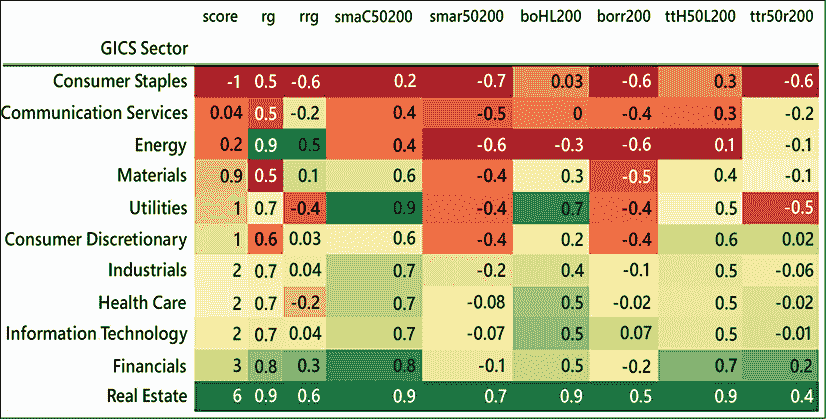
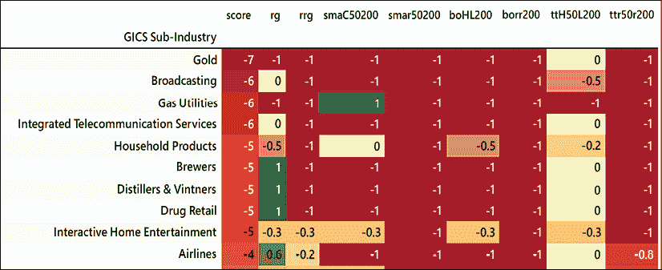
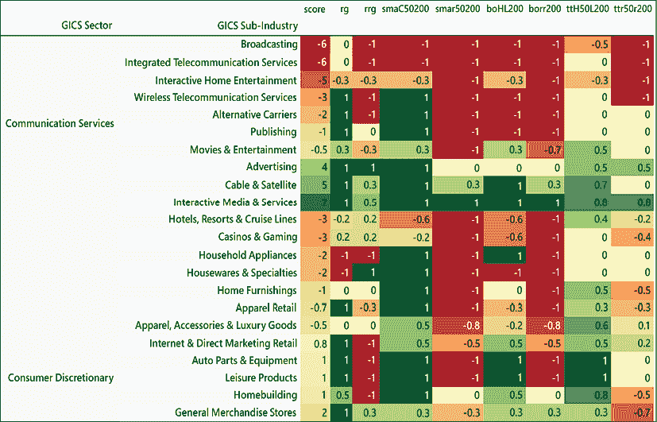
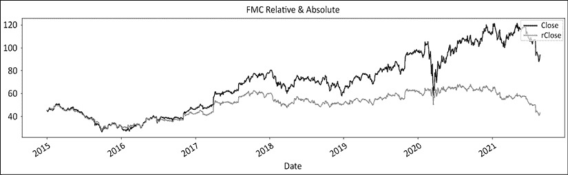
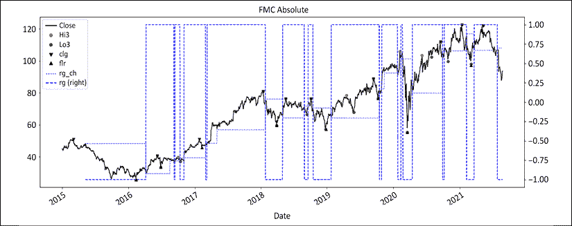
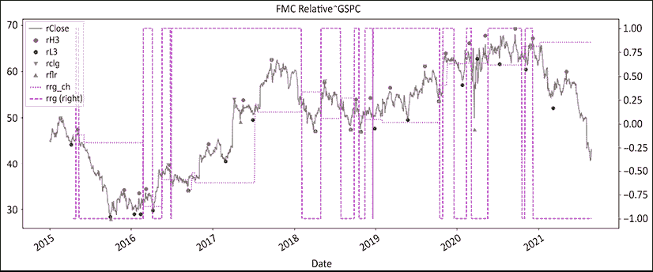
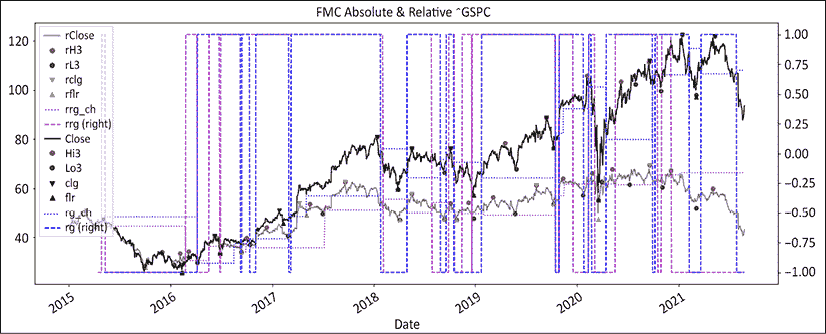
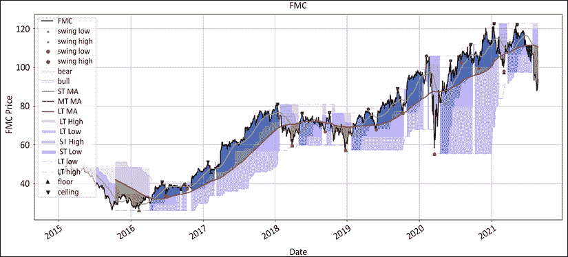
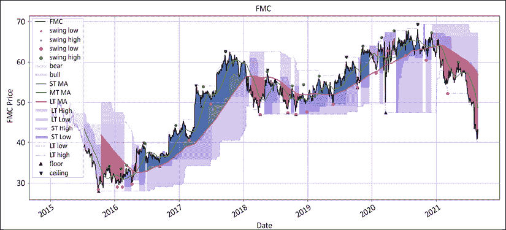

# 附录：股票筛选

这个附录提供了一个股票筛选工具，它将让你把我们在本书中学到的一切付诸实践。它解决了市场参与者最迫切的问题：**创意生成**。我们将在标普 500 指数的所有成分股上建立一个筛选器。

事件的顺序如下：

1.  从其维基百科页面下载所有当前标普 500 指数的成分股。

1.  从 Yahoo Finance 批量下载 OHLCV 价格数据。我们将降低级别以处理每只股票。

1.  计算调整后的相对系列。

1.  计算制度——突破口、海龟、移动平均线（**简单移动平均线**（**SMA**）和**指数移动平均线**（**EMA**）），以及地板/天花板——在绝对和相对系列上。将有一个选项将每只股票保存为 CSV 文件。

1.  创建包含每只股票最后一行的字典，并附加一个列表，从中我们将创建一个数据框。

1.  总结制度方法并对数据框进行排序。你将有一个选项将这个最后一行数据框保存为 CSV 文件。

1.  将包含维基百科信息的原始数据框与最后一行数据框合并。你将有一个选项将此数据框保存为 CSV 文件。

1.  生成按行业和子行业分类的热力图。

1.  如果你想要特别可视化任何股票，将会有一个单独的股票下载、处理和可视化模块在筛选的最后。

    你可以通过以下链接访问本章节所有图像的彩色版本：[`static.packt-cdn.com/downloads/9781801815192_ColorImages.pdf`](https://static.packt-cdn.com/downloads/9781801815192_ColorImages.pdf)。你也可以通过本书的 GitHub 存储库访问本章的源代码：[`github.com/PacktPublishing/Algorithmic-Short-Selling-with-Python-Published-by-Packt`](https://github.com/PacktPublishing/Algorithmic-Short-Selling-with-Python-Published-by-Packt)。

# 导入库

我们首先导入标准库。`pathlib`已经被注释掉了。如果你想要在计算机或服务器上的某个地方保存 CSV 文件，你可以使用诸如`pathlib`或`os`之类的库。

```py
# Appendix 
# Data manipulation
import pandas as pd
import numpy as np
from scipy.signal import *
# import pathlib
# Data download
import yfinance as yf
# Data visualisation
%matplotlib inline
import matplotlib.pyplot as plt 
```

当然，这是极具影响力的——我们将利用随后的片刻理智的消失迅速进行下一步。

# 定义函数

以下是本书中一直使用的函数。你可以在 GitHub 上找到完整版本。函数通常会以它们出现的章节为前缀。筛选将包括绝对和相对系列，因此我们需要相对函数。这将跟随经典的制度定义函数：

```py
# CHAPTER 5: Regime Definition 
### RELATIVE
def relative(df,_o,_h,_l,_c, bm_df, bm_col, ccy_df, ccy_col, dgt, start, end,rebase=True):
    #### removed for brevity: check GitHub repo for full code ####
### RELATIVE ###
def lower_upper_OHLC(df,relative = False):
    if relative==True:
        rel = 'r'
    else:
        rel= ''      
    if 'Open' in df.columns:
        ohlc = [rel+'Open',rel+'High',rel+'Low',rel+'Close']       
    elif 'open' in df.columns:
        ohlc = [rel+'open',rel+'high',rel+'low',rel+'close']

    try:
        _o,_h,_l,_c = [ohlc[h] for h in range(len(ohlc))]
    except:
        _o=_h=_l=_c= np.nan
    return _o,_h,_l,_c

def  regime_args(df,lvl,relative= False):
    if ('Low' in df.columns) & (relative == False):
        reg_val = ['Lo1','Hi1','Lo'+str(lvl),'Hi'+str(lvl),'rg','clg','flr','rg_ch']
    elif ('low' in df.columns) & (relative == False):
        reg_val = ['lo1','hi1','lo'+str(lvl),'hi'+str(lvl),'rg','clg','flr','rg_ch']
    elif ('Low' in df.columns) & (relative == True):
        reg_val = ['rL1','rH1','rL'+str(lvl),'rH'+str(lvl),'rrg','rclg','rflr','rrg_ch']
    elif ('low' in df.columns) & (relative == True):
        reg_val = ['rl1','rh1','rl'+str(lvl),'rh'+str(lvl),'rrg','rclg','rflr','rrg_ch']

    try: 
        rt_lo,rt_hi,slo,shi,rg,clg,flr,rg_ch = [reg_val[s] for s in range(len(reg_val))]
    except:
        rt_lo=rt_hi=slo=shi=rg=clg=flr=rg_ch= np.nan
    return rt_lo,rt_hi,slo,shi,rg,clg,flr,rg_ch
# CHAPTER 5: Regime Definition 
#### regime_breakout(df,_h,_l,window) ####
def regime_breakout(df,_h,_l,window):
    #### removed for brevity: check GitHub repo for full code ####
#### turtle_trader(df, _h, _l, slow, fast) ####
#### removed for brevity: check GitHub repo for full code ####
#### regime_sma(df,_c,st,lt) ####
#### removed for brevity: check GitHub repo for full code ####
#### regime_ema(df,_c,st,lt) #### 
```

地板/天花板方法论计算量更大。因此，它需要有自己的沙盒：

```py
# CHAPTER 5: Regime Definition 
#### hilo_alternation(hilo, dist= None, hurdle= None) ####
def hilo_alternation(hilo, dist= None, hurdle= None):
    i=0    
    while (np.sign(hilo.shift(1)) == np.sign(hilo)).any(): # runs until duplicates are eliminated
        #### removed for brevity: check GitHub repo for full code ####
#### historical_swings(df,_o,_h,_l,_c, dist= None, hurdle= None) #### 
def historical_swings(df,_o,_h,_l,_c, dist= None, hurdle= None):

    reduction = df[[_o,_h,_l,_c]].copy() 
    reduction['avg_px'] = round(reduction[[_h,_l,_c]].mean(axis=1),2)
    highs = reduction['avg_px'].values
    lows = - reduction['avg_px'].values
    reduction_target =  len(reduction) // 100
#     print(reduction_target )
#### removed for brevity: check GitHub repo for full code ####
#### cleanup_latest_swing(df, shi, slo, rt_hi, rt_lo) ####
def cleanup_latest_swing(df, shi, slo, rt_hi, rt_lo): 
    '''
    removes false positives
    '''
    # latest swing
    shi_dt = df.loc[pd.notnull(df[shi]), shi].index[-1]
    s_hi = df.loc[pd.notnull(df[shi]), shi][-1]
    slo_dt = df.loc[pd.notnull(df[slo]), slo].index[-1] 
    s_lo = df.loc[pd.notnull(df[slo]), slo][-1] 
    len_shi_dt = len(df[:shi_dt])
    len_slo_dt = len(df[:slo_dt])

#### removed for brevity: check GitHub repo for full code ####
#### latest_swings(df, shi, slo, rt_hi, rt_lo, _h, _l, _c, _vol) ####
def latest_swing_variables(df, shi, slo, rt_hi, rt_lo, _h, _l, _c):
    '''
    Latest swings dates & values
    '''
    shi_dt = df.loc[pd.notnull(df[shi]), shi].index[-1]
    slo_dt = df.loc[pd.notnull(df[slo]), slo].index[-1]
    s_hi = df.loc[pd.notnull(df[shi]), shi][-1]
    s_lo = df.loc[pd.notnull(df[slo]), slo][-1]

    #### removed for brevity: check GitHub repo for full code ####
#### test_distance(ud, bs, hh_ll, vlty, dist_vol, dist_pct) ####
def test_distance(ud,bs, hh_ll, dist_vol, dist_pct): 

#### removed for brevity: check GitHub repo for full code ####
#### ATR ####
def average_true_range(df, _h, _l, _c, n):
    atr =  (df[_h].combine(df[_c].shift(), max) - df[_l].combine(df[_c].shift(), min)).rolling(window=n).mean()
    return atr
#### ATR ####
#### retest_swing(df, _sign, _rt, hh_ll_dt, hh_ll, _c, _swg) ####
def retest_swing(df, _sign, _rt, hh_ll_dt, hh_ll, _c, _swg):
    rt_sgmt = df.loc[hh_ll_dt:, _rt] 
    #### removed for brevity: check GitHub repo for full code ####
#### retracement_swing(df, _sign, _swg, _c, hh_ll_dt, hh_ll, vlty, retrace_vol, retrace_pct) ####
def retracement_swing(df, _sign, _swg, _c, hh_ll_dt, hh_ll, vlty, retrace_vol, retrace_pct):
    if _sign == 1: #
        retracement = df.loc[hh_ll_dt:, _c].min() - hh_ll
#### removed for brevity: check GitHub repo for full code ####
# CHAPTER 5: Regime Definition 
#### regime_floor_ceiling(df, hi,lo,cl, slo, shi,flr,clg,rg,rg_ch,stdev,threshold) ####
def regime_floor_ceiling(df, _h,_l,_c,slo, shi,flr,clg,rg,rg_ch,stdev,threshold):
#### removed for brevity: check GitHub repo for full code #### 
```

让我们将这段难以消化的代码分成两个简单的函数，`swings()`和`regime()`。我们所需要做的就是传递`relative`参数以获取绝对或相对系列。

```py
def swings(df,rel = False):
    _o,_h,_l,_c = lower_upper_OHLC(df,relative= False)
    if rel == True:
        df = relative(df=df,_o=_o,_h=_h,_l=_l,_c=_c, bm_df=bm_df, bm_col= bm_col, ccy_df=bm_df, 
                            ccy_col=ccy_col, dgt= dgt, start=start, end= end,rebase=True)
        _o,_h,_l,_c = lower_upper_OHLC(df,relative= True)    
        rt_lo,rt_hi,slo,shi,rg,clg,flr,rg_ch = regime_args(df,lvl,relative= True)
    else :
        rt_lo,rt_hi,slo,shi,rg,clg,flr,rg_ch = regime_args(df,lvl,relative= False)
    df= historical_swings(df,_o,_h,_l,_c, dist= None, hurdle= None)
    df= cleanup_latest_swing(df,shi,slo,rt_hi,rt_lo)
    ud, bs, bs_dt, _rt, _swg, hh_ll, hh_ll_dt = latest_swing_variables(df, shi,slo,rt_hi,rt_lo,_h,_l, _c)
    vlty = round(average_true_range(df,_h,_l,_c, n= vlty_n)[hh_ll_dt],dgt)
    dist_vol = d_vol * vlty
    _sign = test_distance(ud,bs, hh_ll, dist_vol, dist_pct)
    df = retest_swing(df, _sign, _rt, hh_ll_dt, hh_ll, _c, _swg)
    retrace_vol = r_vol * vlty
    df = retracement_swing(df, _sign, _swg, _c, hh_ll_dt, hh_ll, vlty, retrace_vol, retrace_pct)

    return df

def regime(df,lvl,rel=False):   
    _o,_h,_l,_c = lower_upper_OHLC(df,relative= rel)    
    rt_lo,rt_hi,slo,shi,rg,clg,flr,rg_ch = regime_args(df,lvl,relative= rel)
    stdev = df[_c].rolling(vlty_n).std(ddof=0)
    df = regime_floor_ceiling(df,_h,_l,_c,slo, shi,flr,clg,rg,rg_ch,stdev,threshold) 

    return df
# df[rg+'_no_fill'] = df[rg]
    return df 
```

这个筛选也允许对个别股票进行精彩的可视化。 要实现这一点，请运行 `graph_regime_combo()` 函数：

```py
# CHAPTER 5: Regime Definition 
### Graph Regimes ###
def graph_regime_combo(ticker,df,_c,rg,lo,hi,slo,shi,clg,flr,rg_ch,
                       ma_st,ma_mt,ma_lt,lt_lo,lt_hi,st_lo,st_hi):

    '''
    https://www.color-hex.com/color-names.html
    ticker,df,_c: _c is closing price
    rg: regime -1/0/1 using floor/ceiling method
    lo,hi: small, noisy highs/lows
    slo,shi: swing lows/highs
    clg,flr: ceiling/floor

    rg_ch: regime change base
    ma_st,ma_mt,ma_lt: moving averages ST/MT/LT
    lt_lo,lt_hi: range breakout High/Low LT 
    st_lo,st_hi: range breakout High/Low ST 
    '''
#### removed for brevity: check GitHub repo for full code #### 
```

下面的两个函数尚未在书中提及。 使用它们，我们需要提取单个股票数据并将其聚合成一个数据框。 `yf_droplevel()` 函数从 `batch_download` 中获取多指数数据框的单个代码的 OHLC 列，并创建一个 OHLCV 数据框：

```py
def yf_droplevel(batch_download,ticker):
    df = batch_download.iloc[:, batch_download.columns.get_level_values(1)==ticker]
    df.columns = df.columns.droplevel(1)
    df = df.dropna()
    return df 
```

此函数插入到一个循环中，该循环将运行 `batch_download` 的长度。 `last_row_dictionary(df)` 函数将数据框中的最后一行创建为一个字典：

```py
def last_row_dictionary(df):    
    df_cols = list(df.columns)
    col_dict = {'Symbol':str.upper(ticker),'date':df.index.max().strftime('%Y%m%d')}
    for i, col_name in enumerate(df_cols):
        if pd.isnull(df.iloc[-1,i]):
            try:
                last_index = df[pd.notnull(df.iloc[:,i])].index[-1]
                len_last_index = len(df[:last_index]) - 1
                col_dict.update({col_name + '_dt': last_index.strftime('%Y%m%d')})
                col_dict.update({col_name : df.iloc[len_last_index,i]})
            except:
                col_dict.update({col_name + '_dt':np.nan})
                col_dict.update({col_name : np.nan})
        else:
            col_dict.update({col_name : df.iloc[-1,i]})
    return col_dict 
```

首先，我们列出列。 其次，我们用代码和日期填充它们，使每一行都能唯一识别。 第三，我们使用 `enumerate` 迭代返回索引和列名。 如果最后一行包含缺失值，我们将向列名添加 `_dt` 并查找最后一个出现的索引。 如果最后一行包含值，我们只需将列名添加为键和值。

这个字典将附加一个最后一行字典的列表。 然后，我们将从此列表创建一个数据框。 另一种方法是为每只股票创建一个数据框并进行追加，这种方法效果很好，但稍微耗时一些。

# 控制面板

在笔记本中散布的变量是错误的来源。 在处理数据之前，所有参数、变量、网站、列表和布尔值都集中在一个地方。 这是您可以在其中调整设置的地方：

```py
website = 'https://en.wikipedia.org/wiki/List_of_S%26P_500_companies'
params = ['2014-12-31', None, 63, 0.05, 0.05, 1.5, 2,5,2.5,3]
start,end,vlty_n,dist_pct,retrace_pct,threshold,dgt,d_vol,r_vol,lvl= [params[h] for h in range(len(params))]
rel_var = ['^GSPC','SP500', 'USD']
bm_ticker, bm_col, ccy_col = [rel_var[h] for h in range(len(rel_var))]
window = 100
st= fast = 50
lt = slow = 200
batch_size = 20
show_batch = True
save_ticker_df = False
save_last_row_df = False
save_regime_df = False
web_df_cols = ['Symbol','Security','GICS Sector','GICS Sub-Industry']
regime_cols = ['rg','rrg',
    'smaC'+str(st)+str(lt),'smar'+str(st)+str(lt), 'boHL'+str(slow),
'borr'+str(slow),'ttH'+str(fast)+'L'+str(slow),'ttr'+str(fast)+'r'+str(slow)]
swings_cols = ['flr_dt','flr','clg_dt', 'clg', 'rg_ch', 
    'Hi'+str(lvl)+'_dt','Hi'+str(lvl),'Lo'+str(lvl)+'_dt','Lo'+str(lvl),
      'rflr_dt', 'rflr', 'rclg_dt', 'rclg', 'rrg_ch',
    'rH'+str(lvl)+'_dt','rH'+str(lvl),'rL'+str(lvl)+'_dt','rL'+str(lvl) ]
symbol_cols = ['Symbol','date','Close']
last_row_df_cols = symbol_cols+['score']+regime_cols+swings_cols 
```

我们使用的网站是 S&P500 的维基百科网页。 参数如下：

+   `start`: `yfinance` 下载开始日期

+   `end`: `yfinance` 下载结束日期

+   `vlty_n`: 持续时间，用于平均真实范围和标准偏差计算

+   `dist_pct`: `test_distance()` 函数中的变量

+   `retrace_pct`: `retracement_swing()` 函数中的变量

+   `threshold`: 用于地板/天花板制度定义的波动性单位

+   `dgt`: `round()` 函数中的小数位数

+   `d_vol`: `test_distance()` 函数中的波动性单位

+   `r_vol`: `retracement_swing()` 函数中的变量

+   `lvl`: 指示应使用哪些摆动水平来计算制度定义—Hi2/Lo2 还是 Hi3/Lo3

`rel_var` 参数解释如下：

+   `bm_ticker`: 基准的 Yahoo Finance 代码

+   `bm_col`: 基准列的名称

+   `ccy_col`: 货币名称

+   `window`、`st`、`fast`、`lt`、`slow`: 突破和移动平均值的变量

+   `batch_size`: 从 `yfinance` 下载的批量大小

+   `show_batch`: 布尔值，显示下载的股票

+   `save_ticker_df`: 布尔值，提供保存个别股票数据框的选项

+   `save_last_row_df`: 布尔值，提供保存最后一行数据框的选项

+   `save_regime_df`: 布尔值，提供保存最后一行数据框的选项

+   `web_df_cols`: 要从原始维基百科数据框中显示的列

+   `regime_cols`: 重新排序的制度定义列

+   `swings_cols`: 地板/天花板列

+   `symbol_cols`：描述性字段，`Symbol`，`date`，`Close`

+   `last_row_df_cols`：最后一行数据帧有 50 多列。 这将列数减少到最小。

# 数据下载和处理

我们将从维基百科下载股票列表开始。 这使用了我们在*第四章*中看到的强大的`pd.read_html`方法，*Long/Short Methodologies: Absolute and Relative*：

```py
web_df = pd.read_html(website)[0]
tickers_list =  list(web_df['Symbol'])
tickers_list = tickers_list[:]
print('tickers_list',len(tickers_list))
web_df.head() 
```

`tickers_list`可以通过填写`tickers_list[:]`的括号部分来截断。

现在，这就是发生动作的地方。 引擎室中有几个嵌套的循环。

1.  批量下载：这是高级别循环。 OHLCV 以一系列批次的多索引数据帧下载。 迭代次数是股票清单长度和批量大小的函数。 505 个组成部分除以 20 的批量大小是 26（最后一批为 6 个股票长）。

1.  删除级别循环：这将多索引数据帧分解为单个股票 OHLCV 数据帧。 迭代次数等于批量大小。 制度在此级别处理。

1.  绝对/相对处理：有 2 个通过。 第一遍处理绝对系列的数据。 变量在最后重置为相对系列，然后在第二遍中相应处理。 有一个选项将股票信息保存为 CSV 文件。 最后一行字典在第二遍结束时创建。

接下来，让我们一步一步地进行过程：

1.  基准下载收盘价和货币调整。 这需要执行一次，因此它放在序列的开头。

1.  数据帧和列表实例化。

1.  循环大小：循环`tickers_list`所需的迭代次数。

1.  外循环：批量下载：

    1.  `m，n`：沿着`batch_list`的索引。

    1.  `batch_download`：使用`yfinance`下载。

    1.  打印批次股票，如果要查看股票名称，则带有布尔值

    1.  下载批量。

    1.  `try`/`except`：附加失败列表。

1.  第二个循环：单股票删除级别循环：

    1.  降级到股票级别。

    1.  计算摆动和制度：`abs`/`rel`。

1.  第三个循环：绝对/相对系列：

    1.  在绝对系列中处理制度。

    1.  重置变量为相对系列并第二次处理制度。

1.  提供布尔值以提供`save_ticker_df`选项。

1.  使用最后一行值创建字典。

1.  附加字典行的列表。

1.  从字典创建数据帧`last_row_df`。

1.  `score`列：绝对和相对制度方法的横向求和。

1.  将`last_row_df`与`web_df`合并。

1.  布尔值`save_regime_df`。

让我们发布代码，然后进行进一步的解释：

```py
# Appendix: The Engine Room

bm_df = pd.DataFrame()
bm_df[bm_col] = round(yf.download(tickers= bm_ticker,start= start, end = end,interval = "1d",
                 group_by = 'column',auto_adjust = True, prepost = True, 
                 treads = True, proxy = None)['Close'],dgt)
bm_df[ccy_col] = 1
print('benchmark',bm_df.tail(1))

regime_df = pd.DataFrame()
last_row_df = pd.DataFrame()
last_row_list = []
failed = []

loop_size = int(len(tickers_list) // batch_size) + 2
for t in range(1,loop_size): 
    m = (t - 1) * batch_size
    n = t * batch_size
    batch_list = tickers_list[m:n]
    if show_batch:
        print(batch_list,m,n)

    try:
        batch_download = round(yf.download(tickers= batch_list,start= start, end = end, 
                            interval = "1d",group_by = 'column',auto_adjust = True, 
                                  prepost = True, treads = True, proxy = None),dgt)        

        for flat, ticker in enumerate(batch_list):
            df = yf_droplevel(batch_download,ticker)           
            df = swings(df,rel = False)
            df = regime(df,lvl = 3,rel = False)
            df = swings(df,rel = True)
            df = regime(df,lvl = 3,rel= True)            
            _o,_h,_l,_c = lower_upper_OHLC(df,relative = False)

            for a in range(2): 
                df['sma'+str(_c)[:1]+str(st)+str(lt)] = regime_sma(df,_c,st,lt)
                df['bo'+str(_h)[:1]+str(_l)[:1]+ str(slow)] = regime_breakout(df,_h,_l,window)
                df['tt'+str(_h)[:1]+str(fast)+str(_l)[:1]+ str(slow)] = turtle_trader(df, _h, _l, slow, fast)
                _o,_h,_l,_c = lower_upper_OHLC(df,relative = True)                
            try: 
                last_row_list.append(last_row_dictionary(df))
            except:
                failed.append(ticker) 
    except:
        failed.append(ticker)
last_row_df = pd.DataFrame.from_dict(last_row_list)

if save_last_row_df:
    last_row_df.to_csv('last_row_df_'+ str(last_row_df['date'].max())+'.csv', date_format='%Y%m%d')
print('failed',failed)

last_row_df['score']= last_row_df[regime_cols].sum(axis=1)
regime_df = web_df[web_df_cols].set_index('Symbol').join(
    last_row_df[last_row_df_cols].set_index('Symbol'), how='inner').sort_values(by='score')

if save_regime_df:
    regime_df.to_csv('regime_df_'+ str(last_row_df['date'].max())+'.csv', date_format='%Y%m%d') 
```

`last_row_list.append(last_row_dictionary(df))` 在第三次循环结束时发生，一旦每个个股都被完全处理完毕。这个列表会自动更新每个个股和每个批次。三次循环完成后，我们使用 `pd.DataFrame.from_dict(last_row_list)` 从这个字典列表创建 `last_row_df` 数据帧。将字典列表创建为数据帧并将其合并的过程比直接将其附加到数据帧稍快一些。`score` 列是所有区域方法的横向总和。然后按 `score` 按升序对最后一行数据帧进行排序。有保存日期版本的选项。`regime` 数据帧是通过将维基百科网络数据帧和最后一行数据帧连接而创建的。请注意，`Symbol` 列被设置为 `index`。同样，有保存日期版本的选项。

接下来，让我们用几个热图来可视化市场的情况。

# 热图

维基百科页面展示了 **全球行业分类标准**（**GICS**）部门和子行业的结构。我们将按以下方式汇总数据：

+   部门，用于自上而下的视角

+   子行业，用于自下而上的视角

+   最后，部门 *和* 子行业，以在每个部门内选择赢家和输家。

我们使用 `.groupby()` 方法并按 `score` 排序。然后我们使用 Styler 构造函数 `.style.background_gradient()` 根据数字绘制市场：

```py
groupby_cols = ['score'] + regime_cols
sort_key = ['GICS Sector']
regime_df.groupby(sort_key)[groupby_cols].mean().sort_values(
    by= 'score').style.background_gradient(
    subset= groupby_cols,cmap= 'RdYlGn').format('{:.1g}') 
```

热力图覆盖了所有区域方法，包括绝对和相对：

+   **score**：股票级别所有方法的横向总和。

+   **rg**：绝对的底部/顶部区域。

+   **rrg**：相对的底部/顶部区域。

+   **smaC50200**：移动平均线交叉 ST/LT 绝对。

+   **smar50200**：移动平均线交叉 ST/LT 相对。

+   **bohl200**：范围突破（200 天）。

+   **ttH50L200**：绝对的对于菜鸟的乌龟 50/200（快速/慢速）。

+   **ttr50r200**：相对的对于菜鸟的乌龟 50/200（快速/慢速）。

让我们看看它是什么样子的：



图 1：行业水平的区域分数热图

部门热图为市场提供了一个鸟瞰图。高度杠杆的部门，如金融、房地产和科技仍然处于金字塔顶部。与此同时，消费品行业等防御性行业落后。在撰写本文时，这个牛市仍然十分活跃。实际上就是这么简单。

然后我们深入到子行业：

```py
sort_key = ['GICS Sub-Industry']
regime_df.groupby(sort_key)[groupby_cols].mean().sort_values(
    by= 'score').style.background_gradient(
    subset= groupby_cols,cmap= 'RdYlGn').format('{:.1g}') 
```

这给了我们市场的一个像素化图片，较差表现的子行业位于顶部：



图 2：区域分数的子行业水平

标普 500 指数是一个广泛而深入的指数。 市场的这种细粒度图像显示了每个子行业目前的状况。 特别关注绝对/相对二元性。 记住，相对表现领先于绝对表现。 这就是您如何捕捉拐点并相应地建立或退出仓位，并等待其他人群的到来的方式。

这个详细的图像是信息与决策的经典例子。 这个热图将使您了解市场的情况。 但是，它的格式不够高效，不能让您根据信息采取行动。

这将我们带到最终的排序，按部门和子行业。

```py
sort_key = ['GICS Sector','GICS Sub-Industry']
regime_df.groupby(sort_key)[groupby_cols].mean().sort_values(
    by= ['GICS Sector','score']).style.background_gradient(
    subset= groupby_cols,cmap= 'RdYlGn').format('{:.1g}') 
```

这会生成一个热图，其中子行业按其行业内的升序排序。 与此同时，部门按字母顺序分类。



图 3：部门和子行业级别的热图

这个最终的热图提供了可行的信息。 子行业按其部门内的升序排名。 这允许在表现不佳者和表现良好者之间进行套利。 在不同部门和时间内重复这个过程，您将顺利地遵循部门轮换的实质。 这就是长/短 2.0 相对方法的本质。

# 个体流程

一旦筛选完成，您可能希望查看列表中的一些股票。 因此，笔记本的其余部分是关于在个别股票水平上进行数据可视化的。 输入一个股票代码，例如，`ticker = 'FMC'`：

```py
bm_ticker= '^GSPC'
bm_df = pd.DataFrame()
bm_df[bm_col] = round(yf.download(tickers= bm_ticker,start= start, end = end,interval = "1d",
                 group_by = 'column',auto_adjust = True, prepost = True, 
                 treads = True, proxy = None)['Close'],dgt)
bm_df[ccy_col] = 1
ticker = 'FMC'
lvl = 2 # Try different levels to see

df = round(yf.download(tickers= ticker,start= start, end = end,    interval = "1d", group_by = 'column',auto_adjust = True,     prepost = True, treads = True, proxy = None),dgt)

df = swings(df,rel = False)
df = regime(df,lvl = 2,rel = False) # Try different lvl values (1-3) to vary absolute sensitivity
df = swings(df,rel = True) # Try different lvl values (1-3) to vary relative sensitivity
df = regime(df,lvl = 2,rel= True)
_o,_h,_l,_c = lower_upper_OHLC(df,relative = False)

for a in range(2):    
    df['sma'+str(_c)[:1]+str(st)+str(lt)] = regime_sma(df,_c,st,lt)
    df['bo'+str(_h)[:1]+str(_l)[:1]+ str(slow)] = regime_breakout(df,_h,_l,window)
    df['tt'+str(_h)[:1]+str(fast)+str(_l)[:1]+ str(slow)] = turtle_trader(df, _h, _l, slow, fast)
    _o,_h,_l,_c = lower_upper_OHLC(df,relative = True)
df[['Close','rClose']].plot(figsize=(20,5),style=['k','grey'],
                           title = str.upper(ticker)+ ' Relative &                              Absolute') 
```

这将打印出类似以下图表的内容：



图 4：FMC 收盘价的绝对和相对系列

以下部分将数据绘制成三个图表：

```py
# CHAPTER 5: Regime Definition 
plot_abs_cols = ['Close','Hi'+str(lvl), 'clg','flr','rg_ch','rg']
# plot_abs_cols = ['Close','Hi2', 'Lo2','clg','flr','rg_ch','rg']
plot_abs_style = ['k', 'ro', 'go', 'kv', 'k^','b:','b--']
y2_abs = ['rg']
plot_rel_cols = ['rClose','rH'+str(lvl), 'rL'+str(lvl), 'rclg','rflr','rrg_ch','rrg']
# plot_rel_cols = ['rClose','rH2', 'rL2','rclg','rflr','rrg_ch','rrg']
plot_rel_style = ['grey', 'ro', 'go', 'kv', 'k^','m:','m--']
y2_rel = ['rrg']
df[plot_abs_cols].plot(secondary_y= y2_abs,figsize=(20,8),
            title = str.upper(ticker)+ ' Absolute',# grid=True,
            style=plot_abs_style)
df[plot_rel_cols].plot(secondary_y=y2_rel,figsize=(20,8),
            title = str.upper(ticker)+ ' Relative',# grid=True,
            style=plot_rel_style)
df[plot_rel_cols + plot_abs_cols].plot(secondary_y=y2_rel + y2_abs,    figsize=(20,8), title = str.upper(ticker)+ ' Relative & Absolute',    # grid=True,
    style=plot_rel_style + plot_abs_style) 
```

这将创建三个图表：绝对、相对和绝对与相对结合。 红/绿色的点是波动。 水平线是制度变革波动。 请注意，以下图表是在绝对和相对系列的 `lvl` 设置为 `2` 的情况下生成的。 您可以通过在绝对系列的 `df = regime(df,lvl = 2,rel = False)` 行和相对系列的 `df = regime(df,lvl = 2,rel = True)` 行中更改此值来增加或减少任一系列的灵敏度。



图 5：绝对图表，显示有虚线的底部/顶部制度



图 6：相对图表，显示有虚线的底部/顶部制度。 红/绿色的点是波动



图 7：具有底部/顶部制度的绝对和相对图表

下一段代码块使用 `graph_regime_combo()` 进行美观的视觉呈现。 首先，这是绝对系列，然后是相对系列：

```py
# CHAPTER 5: Regime Definition 
ohlc = ['Open','High','Low','Close']
_o,_h,_l,_c = [ohlc[h] for h in range(len(ohlc))]
# ma_st = ma_mt = ma_lt = lt_lo = lt_hi = st_lo = st_hi = 0
mav = [fast, slow, 200]
ma_st,ma_mt,ma_lt = [df[_c].rolling(mav[t]).mean() for t in range(len(mav))]
bo = [fast, slow]
st_lo,lt_lo = [df[_l].rolling(bo[t]).min() for t in range(len(bo))]
st_hi,lt_hi = [df[_h].rolling(bo[t]).max() for t in range(len(bo))]
rg_combo = ['Close','rg','Lo3','Hi3','Lo3','Hi3','clg','flr','rg_ch']
_c,rg,lo,hi,slo,shi,clg,flr,rg_ch =[rg_combo[r] for r in range(len(rg_combo)) ]
graph_regime_combo(ticker,df,_c,rg,lo,hi,slo,shi,clg,flr,rg_ch,ma_st,ma_mt,ma_lt,lt_lo,lt_hi,st_lo,st_hi)
rohlc = ['rOpen','rHigh','rLow','rClose']
_o,_h,_l,_c = [rohlc[h] for h in range(len(rohlc)) ]

mav = [fast, slow, 200]
ma_st,ma_mt,ma_lt = [df[_c].rolling(mav[t]).mean() for t in range(len(mav))]
bo = [fast, slow]
st_lo,lt_lo = [df[_l].rolling(bo[t]).min() for t in range(len(bo))]
st_hi,lt_hi = [df[_h].rolling(bo[t]).max() for t in range(len(bo))]
rrg_combo = ['rClose','rrg','rL3','rH3','rL3','rH3','rclg','rflr','rrg_ch']
_c,rg,lo,hi,slo,shi,clg,flr,rg_ch =[rrg_combo[r] for r in range(len(rrg_combo)) ]
graph_regime_combo(ticker,df,_c,rg,lo,hi,slo,shi,clg,flr,rg_ch,ma_st,ma_mt,ma_lt,lt_lo,lt_hi,st_lo,st_hi) 
```

这将生成以下两个图表。



图 8：具有多种制度方法的绝对图表



图 9：具有多种制度方法的相对图表

这是本书的结尾，也是你踏上空头交易广阔荒野的征程的开始。你现在拥有一张地图，将帮助你在空头市场的惊涛骇浪中航行。

作为告别的话，我们无情的行业忠实地遵循一条法则：供需关系。在长/空头交易中，长期股票选择者充足，而熟练的空头卖家却严重短缺。

当市场走低时，那些挺身而出的人，才会脱颖而出。
