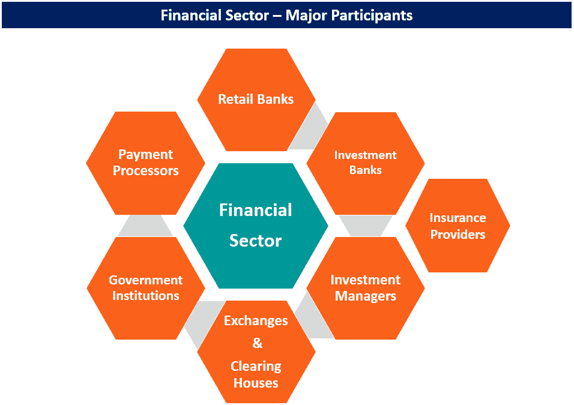
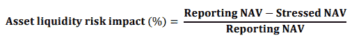

# 量子金融领域

量子计算在解决各个领域的众多挑战方面具有巨大的潜力，金融行业也不例外。凭借其强大的计算能力，量子计算能够显著提升股票交易所、银行和技术分析师的效率和能力，通过实现更复杂的仿真和优化模型。许多大型银行已经开始探索量子技术，旨在解决如欺诈检测、信用卡发放可解释性、期权定价和资产压力测试等问题。

本章深入探讨了金融服务在社会中的作用，并考察了它们面临的关键挑战，这些挑战可能通过量子计算得到解决。本章介绍了不同类型的金融机构，并突出了金融服务领域中的关键问题。此外，本章还概述了为创建一个能够促进量子计算在金融中应用的工作环境所需的准备工作，确保技术要求和账户得到妥善设立。通过理解量子计算在金融领域的潜在影响，相关方可以更好地为未来做好准备，迎接这项技术在解决复杂问题和推动创新中的关键作用。

在本章中，我们将探讨理解金融服务领域的各个重要话题：

+   金融机构类型介绍

+   金融服务中的关键问题

此外，本章还将提供有关为后续章节中将呈现的实际练习准备工作环境的指导。这包括确保技术要求得到满足，账户正确设置，从而实现无缝的学习体验。通过涵盖这些基本话题，我们旨在为理解金融服务领域及量子计算等新兴技术在解决其最紧迫挑战方面的潜在影响提供全面的基础。

# 金融机构类型介绍

金融行业对一个国家经济的健康和增长至关重要。这个行业负责为企业和零售消费者提供基本的金融服务。如*图 3.1*所示，金融领域是一个多元化的生态系统，涵盖了银行、投资公司、保险公司、房地产经纪人、消费融资公司、抵押贷款机构和**房地产投资信托**（**REITs**）。这些组织共同为经济的稳定和扩展作出贡献。

除了提供贷款和抵押贷款外，金融行业还在向个人和企业提供保险服务方面发挥着至关重要的作用。这确保了个人和商业资产能够抵御不可预见的风险，促进了经济中的安全感和稳定性。金融行业提供的就业机会广泛，数百万人在行业的各个职位上工作。从初级岗位到高层管理职务，这个行业为拥有不同技能和兴趣的个人提供了多样化的职业发展路径。此外，金融行业在帮助个人建立和维持退休基金方面起着关键作用，提供长期的财务保障和安心感。许多世界上最知名的银行，如摩根大通（JPMorgan Chase）、美国银行（Bank of America）和高盛（Goldman Sachs），是金融行业的关键参与者，它们的表现对标准普尔 500 指数具有重要影响。这些机构以及该行业的其他机构的成功，体现了一个强大而繁荣的经济。

图 3.1 – 金融机构类型

## 零售银行

零售银行充当存款人和借款人之间的中介。它们促进资金流动，确保为有信用需求的人提供资金，同时为存款提供安全存储和利息。这些银行在经济中发挥着关键作用，促进资金流通，支持企业和个人的成长。此外，零售银行还提供各种金融服务，如汇款、信用卡和投资产品。零售银行的金融稳定性对于保持健康的经济至关重要。通过谨慎管理风险并遵守监管要求，它们可以保护存款人的资金，并为借款人维持可靠的信用来源。零售银行是一个竞争激烈的行业，银行们不断争夺存款和客户。因此，它们必须不断创新，开发新产品，以保持对客户群体的吸引力和相关性。

## 投资银行

投资银行在帮助公司进入金融市场并筹集资本方面起着至关重要的作用。一个显著的方法是通过促成**首次公开募股**（**IPO**），使公司能够上市并向投资者提供股票。除了筹资服务外，投资银行还向主要机构提供主经纪业务和证券融资。这些服务使大规模客户能够以更高的效率和灵活性进入金融市场。投资银行的收入主要来自咨询和承销费用。这些费用作为对其专业知识和帮助客户应对复杂金融交易的补偿。此外，投资银行还通过金融市场交易赚取收入。通过参与各种交易活动，他们能够利用市场波动并从金融市场的动态性中获利。

## 投资管理人

投资管理人服务于个人和机构客户，涵盖了共同基金、ETF 和对冲基金的管理者。共同基金和 ETF 管理人向零售和机构客户提供预设服务，通过基于总资产的管理费来创造收入。对冲基金主要面向机构和富裕个人，“对冲基金”这一术语包括了替代资产管理策略，如私募股权、风险投资和**商品交易** **顾问**（**CTAs**）。

## 政府机构

投资管理人向个人和机构客户提供投资服务，如共同基金、ETF 和对冲基金管理。共同基金和 ETF 管理人提供针对不同类型投资者需求的预设投资解决方案。为了创造收入，共同基金和 ETF 管理人收取基于管理资产总额计算的资产管理费。这笔费用是为了补偿他们为客户提供的专业知识和服务。另一方面，对冲基金服务于机构和高净值个人，提供包括私募股权、风险投资和商品交易咨询等替代资产管理服务。对冲基金通过基于业绩的费用来创造收入，这些费用按所产生利润的百分比计算。投资管理人根据客户的特定需求提供定制化的投资解决方案。他们通过基于资产或业绩的费用赚取收入，具体取决于基金的类型及其客户。

## 交易所/清算所

股票市场交易所作为公司交易股票的平台。为了能够交易，股票必须在交易所上市。购买和销售订单会被整理在订单簿中，交易发生在订单匹配时。电子交易所每天可以执行数百万笔交易，而清算所则结算账户并管理风险，包括现金结算的衍生品交易。总而言之，股票市场交易所和清算所共同合作，为公司和投资者提供一个安全高效的交易环境。

## 支付处理器

支付处理器对于促进各方之间的安全金融交易至关重要。它们充当中介，管理买卖双方之间的资金交换。支付处理器采用先进的安全措施来保护金融数据并防止欺诈。它们为企业提供定制的支付解决方案，包括移动支付和国际支付选项。支付处理器使全球交易成为可能，帮助企业扩展并优化支付流程。

## 保险提供商

保险公司向个人提供寿险、健康险、车辆险和房屋保险，并向企业提供海上保险、数据泄露保险和工人赔偿保险。保险的目的是将财务损失的风险从投保人转移到保险公司，换取保费。保险单为个人和机构提供安全感和心理安慰。寿险支持投保人在其去世时的受益人，而健康险则涵盖医疗费用。车辆险和房屋险则保护投保人财产损失或损坏。对于企业而言，保险对于减轻因各种事件导致的财务损失风险至关重要。保险行业不断发展，以确保个人和机构能够获得必要的保障，保护其财务利益。

以下部分将讨论金融机构在为客户服务时面临的挑战。

# 金融服务中的关键问题

金融服务可以分为银行、金融服务和保险。银行必须管理客户期望，保持贷款质量，并防止客户流失，而金融市场参与者必须定期进行压力测试，以避免未来的麻烦。金融服务必须与时俱进，跟上技术进步，以满足客户不断变化的需求。保险公司必须正确迅速地向真实客户支付赔偿金，遵守监管合规要求，并投资于强有力的欺诈检测和预防措施。克服这些挑战需要持续的技术投资、员工培训，并承诺为客户提供高质量的服务。

银行业务通过商业银行和投资银行为客户提供存款和贷款服务。它们必须管理客户的期望，并在利率波动的动态环境中防止客户流失。另一方面，向有良好信用记录的合格客户提供贷款，对于保持贷款质量和避免未来危机至关重要。同样，金融市场参与者必须定期对其资产进行压力测试，以预测并避免因市场条件不确定而导致的未来问题。对于保险行业而言，及时且准确地向真正的客户支付理赔金额被定义为成功的关键指标。

| **银行** | **金融市场** | **保险** |
| --- | --- | --- |
| 货币当局 | 大宗商品 | 健康保险 |
| 零售银行 | 股票交易所 | 财产与意外保险 |
| 商业银行 | 债券市场 | 寿险与年金 |
| 投资银行 | 货币市场 | 再保险 |
| 非银行金融机构 | 衍生品 |  |

图 3.2 – 金融服务行业的细分

接下来的章节将列出金融机构面临的问题，稍后的书中我们将讨论一些由技术推动的解决方案，如量子计算，可能在初期阶段提供优势的案例。

## 资产管理

资产管理在这一过程中扮演着至关重要的角色，因为它涉及到规划和知识，旨在减少与一组资产相关的风险和成本。风险是金融互动中的一个重要驱动因素，像 2008 年金融危机这样的事件凸显了对银行和保险公司进行压力测试的重要性，以防止系统性市场危机的发生。投资者旨在在预期回报和风险之间找到平衡，分散投资组合是实现这一平衡的一种方式。然而，无法预见的事件仍然可能发生，监管机构和金融实体必须保持警惕，以控制金融领域的风险。尽管监管机构已加强与金融实体的互动，以防止此类事件在未来发生，但人类行为和金融市场的复杂性仍然是一个挑战。总体而言，管理资产和风险在金融领域是一个至关重要的考虑因素，因为它影响着投资回报的潜力以及整个系统的稳定性。虽然压力测试和监管控制有助于减轻风险，但持续的警惕和准备仍然是防止系统性市场危机发生的必要条件。

## 风险分析

评估与资产相关的风险至关重要，特别是在处理**货币市场基金**（**MMFs**）时。短期利率和行业特定的评估等因素可能会影响这些基金的波动性。此外，消费者行为和短期利率的波动也会对投资组合管理产生显著影响。

为了对货币市场基金（MMF）的健康状况进行彻底评估，监管机构提供了指导方针，概述了需考虑的极端情境和风险。这为理解这些基金的全球状况提供了坚实基础。例如，《货币市场基金条例》（**MMFR**）第 28 条第 7 款要求由**欧洲证券和市场管理局**（**ESMA**）提供压力测试指南，确保所有 MMF 在考虑的情境中具有同质性。检查最新的 ESMA 报告揭示了在压力测试中突出的风险，涵盖了流动性水平、信用和利率风险、赎回水平以及宏观经济冲击等方面的影响。

图 3.3 – 来源于 ESMA 压力测试指南的资产流动性风险影响公式

评估这些因素的主要驱动因素是**净资产值**（**NAV**），定义为投资基金资产的净值，减去其负债后，再除以剩余股份的数量。通过将 NAV 投射到各种潜在的未来情境中，监管机构可以评估，例如，流动性风险对投资基金资产的影响。这个过程需要一系列全面的指标，这不可避免地给所需技术带来了压力，以涵盖所有必要情境并向监管机构提交详细报告。

虽然监管机构提供了模拟压力净资产值（NAV）的校准条件，但实际产生准确模拟的方法在很大程度上由从业人员自行决定。他们必须确定如何根据其资产的特定参数化评估潜在的价值波动。一种方法是通过统计评估历史数据，识别未来趋势和波动模式，考虑过去的危机和突发事件作为潜在的（尽管不太可能的）选项。探索所有这些未来情境需要采用诸如蒙特卡罗模拟等方法，这是一种在此领域广泛采用的技术。

在接下来的*第四章*中，我们将深入探讨这些情境的模拟以及监管报告所需的参数化和校准过程。此外，我们还将研究量子计算机如何潜在地增强对未来净资产值（NAV）分配的评估，并在不同情境中建立效率前沿。通过利用量子计算机叠加不同选项的能力并同时评估多个情境，量子计算机可以显著加速这些高强度压力测试所需的并行计算，从而在金融风险管理中发挥无可替代的作用。

## 投资与投资组合

金融服务的任务是管理投资组合，以在不妥协风险的前提下最大化实体和客户的收入。这一微妙的平衡需要在投资组合优化方面的专业知识，而这通常会消耗这些机构大量的 IT 资源。除了压力测试之外，生成一组平衡预期收益和容忍风险的选项还涉及评估可能的无限选择，这是一个复杂且要求极高的工作。资产定价对于压力测试和监管报告至关重要，同时也是预测潜在市场情景和做出明智投资决策的关键。尽管蒙特卡罗模拟已被广泛应用，但历史数据的可用性以及预测和多元时间序列的进展，促使了**机器学习**（**ML**）在生成和评估特定市场中相关值未来情景的应用大幅增长。

金融行业包括各种类型的银行和银行活动，其中投资银行被视为商业银行的一个专业子集。投资银行主要服务于实体而非个人，管理着一系列复杂程度不同的资产。它们的收入主要来自于所管理活动的利润，这使得它们与商业银行和零售银行的核心服务有所区别，后者专注于为大众和大型机构提供存款、贷款以及信贷生成。传统上，投资银行家依靠经验和市场接触来确定交易价格。然而，数据和技术的可用性使得投资活动得以在更大规模上进行，且结果更具统计学依据，减少了人为偏差。因此，近年来投资银行一直是技术进步的早期采纳者，拥抱新的信息范式、云计算转型、大数据存储和处理，以及如**人工智能**（**AI**）和机器学习（ML）等前沿技术，用于优化商业流程和产生更好的洞察。

投资者的一项关键任务是识别最有效的资产配置方案，在给定预算内最大化预期回报。未来趋势的不确定性以及某些情景下可能出现的负回报（损失）要求在风险的概念下管理这些可能性。在*第五章*中，我们将系统地探讨这一问题，但重要的是要理解，资产选择的驱动因素有两个主要概念：回报和风险。投资专业人士的专业知识在权衡这两个因素的取舍中发挥着重要作用。评估风险，也就是资产波动性，对于优化资产组合至关重要。虽然有许多复杂的技术可以用来确定风险，但遍历一个实体可能面临的潜在情景既费时又计算量大。人工智能和机器学习可以提供启发式方法，在这个复杂的潜在组合环境中逼近解决方案。无监督学习等技术可以基于不同的盈利模式对生成的组合进行分割，为组合分析提供一种快速的方法。

使用监督学习技术（如 DeepMind 所采用的技术）因其能够从数据中推导出成功的策略，甚至是自生成的数据，并为特定任务提供可操作的建议而日益受到关注。这种自动化使得高频交易成为可能，能够捕捉市场中的微小变化，可能会超越人工驱动的活动。然而，这项技术也伴随其自身的风险，因为高度自动化的系统如果不加以控制，可能在毫秒之间引发全球性危机。这突显了在利用技术力量的同时，理解其潜在后果的关键平衡。

## 个人画像和数据驱动的服务

大规模数据集的出现以及用户与机构之间不断发展的互动渠道彻底改变了银行业，为改善这些互动的个人画像和个性化服务铺平了道路。人类行为和商业流程都已通过数字化互动发生了变化，从而提供了更好的策划和定制服务。例如，投资银行在协助公司满足资本需求方面发挥着关键作用，充当公司与投资者之间的中介角色。它们帮助客户确定债券发行的数量和时机，以及评估市场需求。

机器学习为投资银行提供了有前景的进展，使其能够通过提供数据驱动的选项和有价值的市场洞察来增强客户体验。机器学习帮助客户最大化交易价值，同时最小化潜在的财务损失。机器与人类的结合证明比单独依赖任何一方更为强大，计算机辅助方法在传统方法中的优势和潜在风险已日益显现。根据德勤的报告，人工智能可以贯穿**并购**（**M&A**）生命周期，提供深入的尽职调查，辅助谈判并促进并购后的整合。

银行内部的信用卡评估过程也经常使用人工智能（AI）和机器学习（ML）模型。在零售和企业银行中，定制化用户体验对于减少流失率并为客户提供有价值的产品和服务推荐至关重要。AI/ML 模型通过数据实现详细的用户画像，使信息能够有针对性地传递给客户。

随着金融机构越来越多地采用技术，在制定战略决策时，考虑机会和局限性至关重要。关键问题包括投资银行是否应更多依赖数据而非经验或监管理解，以及科技公司和银行是否应共享数据，以便在信息化经济中从机器学习（ML）中受益。同时，必须解决有偏见的机器学习模型可能导致信用卡尽职调查不足和歧视性贷款行为的问题。

使用数据驱动决策的公司必须确保对自动化结果负责，并且确保采取适当的控制措施，以确保在整个过程中做出无偏且符合伦理的决策。不充分或有偏的决策不仅可能损害这些智能技术所应用的业务流程，还可能损害未能对其客户互动进行充分监管的机构的声誉。

技术正在不断进步，提供公平性和偏见评估的工具，从可解释的人工智能（AI）向伦理人工智能（AI）发展。这是一个复杂的问题，因为伦理标准在不同国家、文化区域，甚至在具有不同宗教背景的个体之间可能存在差异。量子机器学习（Quantum ML）是科学界正在探索的一个领域，旨在提供改进的人群划分和信息复杂度降低方法，而不引入偏见。诸如概率量子聚类和量子特征选择等技术正在出现，以增强机器学习工具箱，更高效且公平地处理大规模高维数据集。

## 客户识别与客户留存

传统银行面临来自创新型初创企业和金融科技公司持续的竞争，这些公司利用人工智能和机器学习提供高效、快速的解决方案。这些新兴企业因其创新和透明的产品与服务而著称，正在改变金融格局。传统银行则在严格的监管、挑剔的客户和缺乏产品差异化的困境中挣扎，这些因素限制了它们的盈利能力。为了在这个不断发展的市场中取得成功，银行必须优先考虑建立和维护客户信任。客户服务对于保持客户至关重要，但传统银行往往在通过实体基础设施和客户服务人员提供卓越服务方面遇到困难。人工智能为银行业提供了显著提升客户服务的潜力，它能够提供可扩展性、个性化、质量、一体化体验和广泛的信息访问。人工智能可以以更低的运营成本实现这些优势，既能取悦客户，又能增加支出与产品收入之间的利润差距。

信任是金融行业的核心要素，许多金融机构至今仍在应对由 2008 年金融危机引发的信任危机。这种信任缺失妨碍了金融公司获取新客户的能力，并可能导致客户获取成本上升。客户与金融服务提供商之间的强大关系对于长期成功至关重要。**客户生命周期价值**（**CLV**）的概念在这一关系中占据核心地位。客户在金融机构的停留时间越长，他们的 CLV 就越高。当客户经历负面体验时，他们更可能离开，从而降低 CLV 并导致获取成本的损失。然而，优质的客户服务可以提高客户保持率，阻止客户寻求替代方案，并最终提高 CLV。满意的客户更有可能推荐他人使用其金融服务提供商的服务，从而降低客户获取成本并增加利润。

在数字化时代，平衡客户保持与准确识别有价值客户的能力对于金融机构至关重要。必须实施客户画像和精准营销策略，以吸引大多数客户群体。然而，系统性地执行这些策略可能会带来挑战，银行必须做好应对准备。总之，金融行业的数字化为传统银行带来了机遇和挑战，它们在努力适应不断变化的环境时，必须找到合适的应对方式。通过利用人工智能（AI）和机器学习（ML），银行能够提升客户服务，建立信任，并增强客户体验。然而，银行也必须应对客户画像和精准营销的潜在风险，确保制定公平、无偏、有效的客户保持和客户获取策略。

## 信息差距

一个机构作为一个复杂的系统运作，客户与核心银行流程之间有多个层次的互动。客户在联系一个组织的联络中心时，通常会遇到延迟，因为客服代表需要时间收集有关客户及其产品或服务的相关信息。客户互动的复杂性、他们的满意度、投诉历史以及基于客户生命周期价值（CLV）、信用评分或一般银行政策的整体策略，对于呼叫代理来说，在流畅的对话中综合这些信息是具有挑战性的。事实上，缺乏同理心和互动能力的呼叫代理可能会导致客户对其银行机构的不满。

持续的数字化革命使客户能够通过数字渠道直接访问和管理他们的服务，如网站、应用程序和家庭助手。银行流程的数字化和客户互动的数字化改变了银行业务的进行方式，并促进了更智能的决策制定。自然语言互动和对个体需求与询问的理解已成为可能，同时还可以通过行为分析来衡量客户的满意度。随着人工智能（AI）和机器学习（ML）技术的广泛应用，银行现在可以提供个性化且高效的客户体验。这些技术不仅增强了客户互动，还为银行高层提供了有价值的见解。全面的 360 度客户视图使决策者能够评估特定客户或群体，从而确保做出以客户需求和满意度为优先的明智决策。

此外，银行业的数字化转型扩展了交叉销售和增销的潜力。通过分析客户数据和偏好，银行现在可以提供量身定制的产品和服务推荐，从而加强客户关系并增加整体收入。尽管数字化带来了好处，但金融机构在与客户互动时仍必须保持人性化的接触。随着技术的进步，银行必须在利用数字渠道和保持同理心、个人化的客户关系之间找到平衡。确保客户感到被重视和理解应始终是首要任务，即使在机构采用创新解决方案的同时。

银行业务流程和客户互动的数字化已经彻底改变了行业，提供了更智能决策、个性化体验和提升客户满意度的机会。随着金融机构继续采用这些数字技术，它们也必须优先考虑保持与客户的强大同理心联系，以确保长期成功和银行关系中的信任。

## 定制化

在今天竞争激烈的市场中，服务个性化对于取悦客户至关重要。认识到每个个体都是独特的，标准化的方法和程序无法提供量身定制的解决方案。能够处理各种流程和操作的人工智能工具，提供了一种在不牺牲效率的情况下交付定制化体验的方式。因此，人工智能在可扩展性、个性化和成本效益之间找到了平衡，使其成为大型组织维持竞争优势的理想解决方案。

客户获取需要高销售量和多个接触点，通常需要增加基础设施和人力资源。扩展实体网点和雇佣更多的客户服务代表可能会增加成本，同时也可能导致不同地点之间公司政策执行的不一致。然而，本地化的专业知识和个性化的互动仍然是客户满意度的关键组成部分。过于笼统的人工智能系统可能会破坏成本效益自动化与客户满意度之间的微妙平衡，突显了量身定制解决方案的必要性。

在银行业开发和实施人工智能或机器学习解决方案需要相当大的努力，以确保与现有流程的无缝集成。必须分析大量的交易、客户互动、产品生命周期和快速变化的市场活动，以识别模式并充分利用这些先进技术。此外，在从这些系统中策划和提炼知识时，融入公平和无偏模型交付的方法至关重要。

人工智能应用的一个例子是使用面部识别技术简化客户注册和身份验证过程。这项技术在智能银行趋势中获得了广泛应用，但在处理肤色较深的个体时出现了几起偏见案例。这种歧视性做法可能会显著损害金融机构的声誉，因此解决人工智能系统中的潜在偏见变得至关重要。

个性化是满足客户期望并保持银行业竞争优势的关键。人工智能为提供量身定制的体验提供了强大的解决方案，同时保持效率和成本效益。然而，金融机构必须仔细考虑人工智能实施的潜在陷阱，如偏见和公司政策的不一致执行，以确保与现有银行流程的成功整合。随着金融行业不断接受人工智能和机器学习技术，优先考虑这些先进工具带来的好处和潜在风险至关重要。通过在个性化、可扩展性和公平性之间找到平衡，银行可以利用人工智能提供卓越的客户体验、建立信任，并确保在不断发展的市场中实现长期成功。

## 欺诈检测

除了客户生命周期价值（CLV）定制化的效果外，许多企业面临的一个关键问题是识别并采取反欺诈措施的能力。这是一个关键问题，因为它会破坏企业的活动，带来风险，而客户本应是企业活动的资产。

鉴于能够对客户群进行细分和画像，显然可以使用 AI 或 ML 技术来实现这一目的。它可以识别欺诈者，预测尚未表现出该行为的现有客户的模式，并限制这些潜在未来行为可能对企业业务活动造成的损害。

这也是一个敏感性问题，因为我们的模型可能会将某个客户标记为欺诈行为者，而这仅仅是与该行为发生概率相关的预测。这就要求在训练和评估欺诈检测模型时采用最佳实践，因为模型的敏感性和特异性需要针对正确的使用进行调整。幸运的是，在一般情况下，违约者是少数，这也意味着在评估客户群体中的这一情况时，企业可能可用的数据中发现的证据较少。

在讨论了一些最佳实践和执行此类评估的关键点之后，我们将在*第六章*中看到，QML 模型如何帮助扩大可用于执行此任务的模型范围，并且在某些情况下，由于量子神经网络在文献中表现出的表达能力，我们可能在经典方法上拥有优势，尽管这种优势可能是微小的，但它对业务可能产生实质性的影响。

# 总结

金融机构涵盖了从零售银行和投资银行到保险公司等广泛领域，在促进交易和风险管理方面扮演着不可或缺的角色。资产管理作为一项关键职能，通常采用压力测试和监管控制来评估和减轻与资金市场基金等资产相关的风险，这一过程在未来可能通过量子计算得到加速和增强。资产组合优化作为金融服务的另一个基础方面，将预期收益与相关风险进行平衡，并日益利用人工智能（AI）和机器学习（ML）等先进技术。随着这些技术在投资领域的日益重要，彻底理解这些自动化技术的影响变得至关重要。金融机构采用 AI 和 ML 不仅旨在提升客户体验和优化业务运营，还力图保持伦理标准和问责制。这一技术进步还带来了来自金融科技初创企业的挑战，这些企业利用这些技术，从而强调传统银行需要不断建立客户信任并改善服务交付。客户互动渠道的持续数字化转型促进了智能决策的形成，并使得银行流程能够实现自然语言交互，从而提高客户满意度。同时，AI 和 ML 模型的应用必须在追求个性化和效率的同时，注重公平性和无偏性，以保障机构声誉。最后，AI 和 ML 可以作为有效工具，帮助检测客户群体中的潜在欺诈行为，并制定适当的对策，这要求遵循最佳实践并进行谨慎评估。

在下一章中，将使用经典和量子算法来确定衍生品定价。

# 进一步阅读

本章中简要介绍的部分主题背后有着丰富的文献资料。金融服务已经存在一段时间，许多资源可以供那些初涉此领域并希望了解我们在金融量子计算专门材料中所涉及的主题的读者深入学习。

有关衍生品定价、资产组合优化和欺诈检测的问题和技术将在各自的章节中参考具体文献。此外，下一章还将深入探讨计算金融中使用的技术。

对于那些希望更好理解银行业复杂生态系统及其运作方式的读者，关于金融市场的一些有趣参考文献包括 Pagano（1993 年）和 Bond 等人（2012 年）的出版物。

对于关注金融市场中的伦理和公平问题的人来说，Shefrin & Statman (1993) 的论文可能会有所帮助。如果您的兴趣与人工智能和机器学习领域中的伦理挑战相关，并且全球企业都有应用，您可能会对 Jobin 等人（2019）的研究感兴趣。  

关于风险评估指南、压力测试指南及一般概况，我们强烈建议浏览 ESMA 网站（[`www.esma.europa.eu/`](https://www.esma.europa.eu/)）以及美国政府问责局网站（[`www.gao.gov/`](https://www.gao.gov/)）。这些指南和建议较为通用，鉴于它们监管的市场规模，可能具有一般性用途，但我们建议您也查询当地主管机关的信息。  

关于之前提到的本书未涉及但可能对您感兴趣的主题，我们想特别强调高频交易系统和推荐系统的相关性，这些系统如今可以在许多金融机构中进一步实现自动化。两者都是非常活跃的研究领域，但我们希望指出两项推荐，供那些对这些话题感兴趣的人参考。

Zibriczky (2016) 提供了一篇温和的入门文章，回顾了本章中呈现的、用于金融案例的不同类型推荐系统的相关实例。关于高频交易的参考文献有很多，因其普及性，Cartea 等人（2015）则提供了一本很好的合集，介绍并理解这些技术的基本原理。  

尽管这些技术可能与该领域相关且有趣，但它们在量子领域中并未能提供与经典技术相对应的良好替代方案。尽管如此，量子计算每天都带来新的理念和应用，硬件提供商也在不断改进他们的产品，增加更多应用的容量，因此保持对该领域进展的关注非常重要。  

# 参考文献  

*Bond, P., Edmans, A., & Goldstein, I. (2012). The real effects of financial markets. Annu. Rev. Financ. Econ.,* *4(1), 339-360.*  

*Cartea, Á., Jaimungal, S., & Penalva, J. (2015). Algorithmic and High-Frequency Trading. Cambridge* *University Press.*  

*Jobin, A., Ienca, M., & Vayena, E. (2019). The global landscape of AI ethics guidelines. Nature Machine Intelligence,* *1(9), 389-399.*  

*Pagano, M. (1993). Financial markets and growth: An overview. European economic review,* *37(2-3), 613-622.*  

*Shefrin, H. & Statman, M. (1993). Ethics, fairness, and efficiency in financial markets. Financial Analysts Journal,* *49(6), 21-29.*  

*Zibriczky, D. (2016). Recommender systems meet finance: a literature review. In Proc. 2nd Int. Workshop Personalization Recommender Syst (**pp. 1-10).*  
