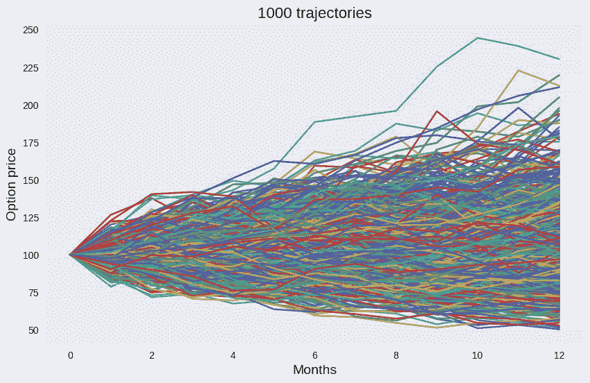
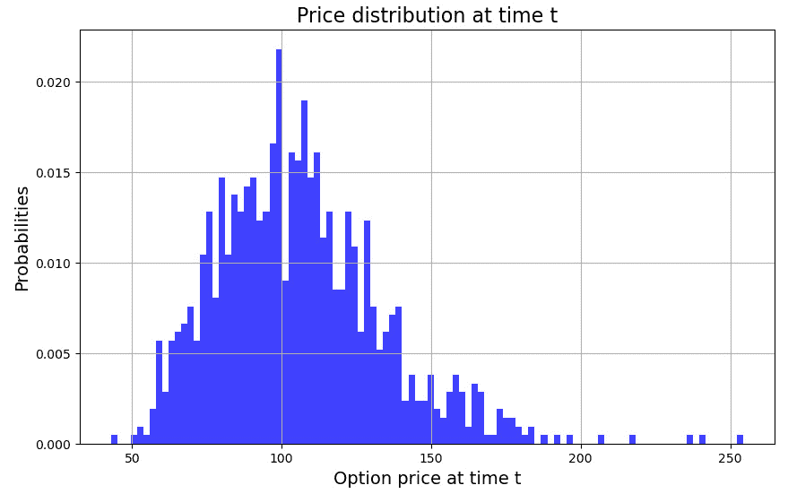
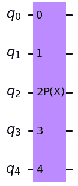
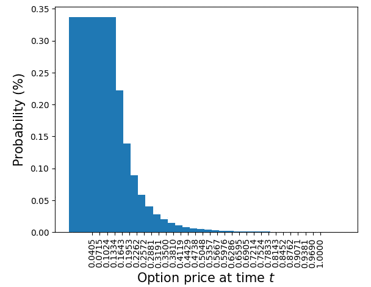
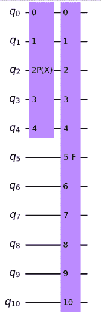
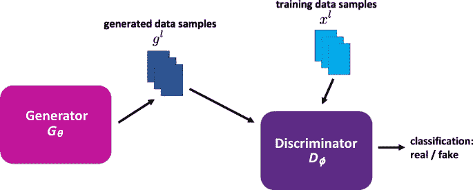
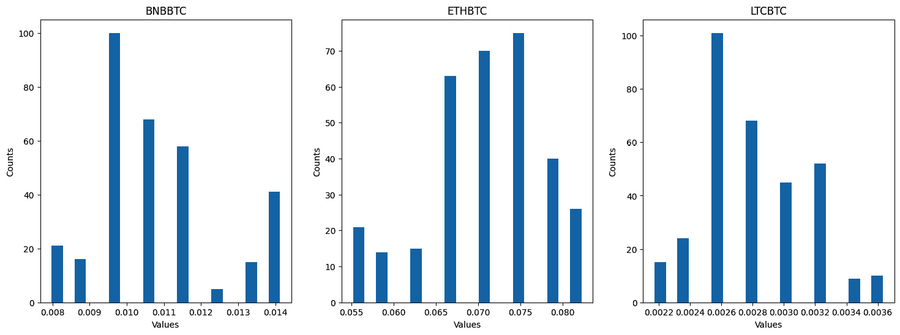
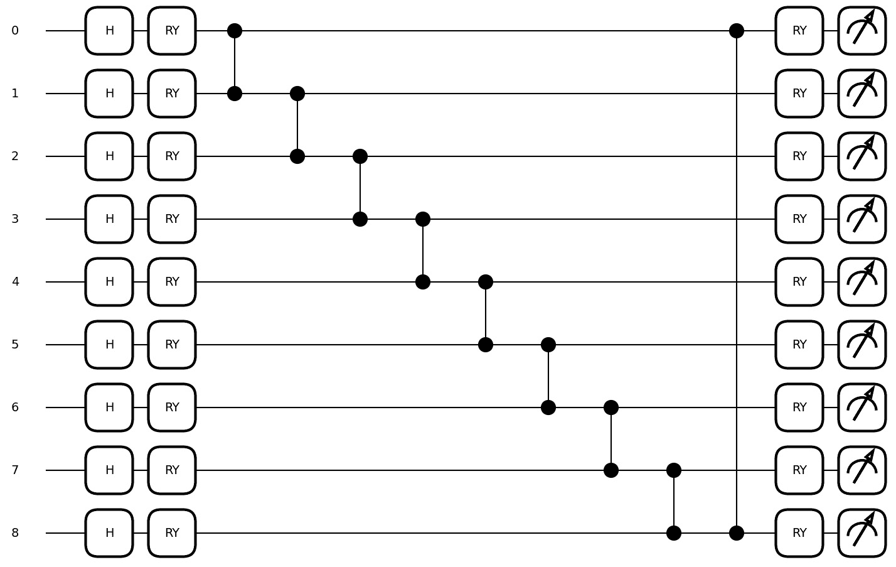
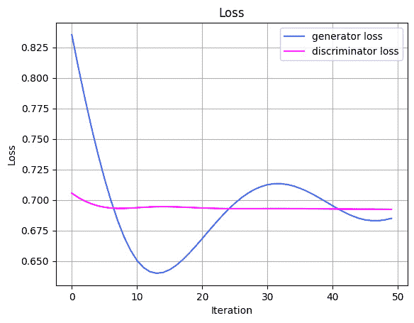

# 4  

# 衍生品估值  

衍生品定价是量化金融中最重要的方面之一。衍生品合约的总市场价值为 12.4 万亿美元（*2021 年 12 月底场外衍生品统计数据* —— [bis.org](http://bis.org)），使其成为最有利可图且最具挑战性的模拟与优化问题之一。尽管衍生品定价的许多方面可以通过经典计算来进行，但当需要进行多次计算时，基于门的量子计算机可以作为一种高效资源，因为它们能够并行处理并处理多个资产。本章探讨了衍生品定价的理论方面，并通过经典计算和基于门的量子计算机考察了其实时应用。  

本章讨论了从普通人角度解释期权定价的必要性。期权定价的各个方面将以易于理解的方式进行描述。不同的案例研究和轶事将被融入，以使解释更加全面和详细。第一部分涵盖了衍生品定价的理论方面，同时也介绍了过渡到更复杂的**量子机器学习**（**QML**）模型的实际方面。  

在后续部分，我们将看到一个使用经典计算和量子计算实现期权定价的演示示例。我们将通过经典的蒙特卡洛模拟方法推导出一个普通期权的估值。随后，一个包含代码片段的全面案例研究将帮助你理解如何在量子计算上实现衍生品定价的数学建模。

本章将涵盖以下主题：  

+   衍生品定价——理论方面  

+   衍生品估值的经典蒙特卡洛模拟实现  

+   衍生品估值的量子计算算法  

# 衍生品定价——理论方面  

学习衍生品定价所涉及的因素至关重要。深入了解金融产品定价对于做出明智的投资决策至关重要，无论你是在市场的买方还是卖方。毕竟，了解一个产品的属性如何相互作用以产生价值，对于决定提供或竞标一个金融产品是必要的。理解金融资产的价格至关重要。资本资产定价模型及其基于贴现现金流的变体帮助确定金融资产的价值。然而，与传统资产如股票和债券不同，衍生品有其挑战，但也具有一些出乎意料的简单特性。在接下来的部分，我们将讨论货币的时间价值这一重要概念，这为证券定价奠定了基础。  

## 货币的时间价值  

金钱的价值随着时间波动。这具体意味着什么呢？假设你可以选择现在拿到 100 美元，或者一年后拿到 100 美元，你会选择哪一个？大多数人可能会选择尽快拿到 100 美元（也就是今天）。现金流越远离现在，它的价值就越低。类似的方法可以用来比较不同时间点现金流的价值。假设我们希望一年后得到 100 美元，而不是两年后。数学上，风险无关的利率是金钱价值随时间变化的原因。资金获得得越快，所能获得的利息就越快。通过计算现金流的现值并进行比较，我们可以比较在不同日期得到的不同金额的价值。

## 案例研究一

时间价值是金融学中的一个关键概念，它指的是今天的金钱比未来相同金额的金钱更有价值，因为它具有赚取回报的潜力。这个概念在许多金融决策中都非常重要，包括投资、贷款和其他交易。在本文中，我们将探讨一个时间价值的例子，背景是一个折现价格的未来案例，假设三年后有一笔 450 美元的现金流，折现率为 10%。

假设折现率为 10%，可以使用以下公式计算三年后 450 美元现金流的现值：

PV =  FV  *  (1 + r) ^ n

其中 r 代表折现率，n 代表期数，PV 和 FV 分别表示现值和未来值。

使用这个公式，我们可以计算出三年后 450 美元现金流的现值，计算方法如下：

PV = 450 美元 * (1 + 0.1) ^ 3

PV = 300.30 美元

这意味着，在 10%的折现率下，三年后 450 美元的现值为 300.30 美元。换句话说，如果我们将在三年后收到 450 美元，并且想知道今天这笔现金流的价值，我们将把它折算回今天的现值 300.30 美元。

时间价值理论也可以应用于投资。例如，假设我们今天投资 1000 美元于一个承诺三年年回报率为 10%的基金。使用公式计算该笔一次性投资的未来价值，我们可以计算出这项投资的未来价值如下：

FV = PV × (1 + r) ^ n

FV = 1000 美元 × (1 + 0.1) ^ 3

FV = 1331 美元

如果我们今天以 10%的年回报率投资 1000 美元，三年后的投资价值将为 1331 美元。

因此，货币的时间价值是金融中的一个基本概念，在许多金融决策中起着至关重要的作用。无论是计算未来现金流的现值，还是计算投资的未来价值，理解货币的时间价值对于做出明智的金融决策和有效管理风险至关重要。通过运用本文讨论的公式和概念，投资者可以做出更好的金融决策，达成财务目标。以下部分将讨论证券定价的一个基本概念。

## 证券定价

证券定价是指确定股票、债券、期权及其他投资产品等金融工具的价值。证券的价格反映了市场上对该证券的供求关系，受多种因素的影响，包括公司业绩、经济状况和投资者情绪。

一般而言，证券的价格是通过市场中买卖双方的互动来决定的。当买方多于卖方时，证券价格会上涨；而当卖方多于买方时，价格则会下跌。

有几种方法用于确定证券的价格，包括以下几种：

+   **市场定价**：这是最常见的证券定价方法，通过证券的当前市场价值来确定其价格。市场定价通常适用于公开交易的证券，这些证券的价格通过在交易所的竞标和交易来确定。

+   **基本面分析**：该方法通过分析公司财务报表和其他相关信息来确定其内在价值。基本面分析考虑收入、利润、资产、负债和增长潜力等因素，来判断证券是被低估还是高估。

+   **技术分析**：该方法通过分析价格和交易量数据，识别可以用来预测未来价格走势的模式和趋势。技术分析通常与基本面分析结合使用，以做出投资决策。

+   **期权定价模型**：这些模型使用数学公式来确定期权合约的公允价值，考虑的因素包括标的资产的价格、到期时间以及标的资产的波动性。

除了这些方法外，市场参与者在确定证券价格时，还会考虑其他因素，如利率、通货膨胀、地缘政治事件和市场情绪。

## 案例研究二

证券定价是对股票、债券和其他证券等金融资产的定价过程。市场需求、经济状况和公司业绩都会影响证券定价。我们来看一个关于证券定价的例子，假设一家公司 ABC 发行了一只面值为$1,000，票面利率为 5%的债券，每年支付利息，期限为十年。

### 第一步 – 确定市场利率

市场利率是投资者期望从类似证券中获得的回报率。假设与 ABC 公司债券特征相似的债券的市场利率为 6%。

### 第二步 – 计算债券的现值

使用 6%的市场利率，我们可以通过以下公式计算债券的现值：

PV =  C _ (1 + r) n  +  FV _ (1 + r) n

对于 ABC 公司的债券，年利息支付为$50（$1,000 面值的 5%），债券的期限为 10 年。使用这些数值和 6%的市场利率，我们可以计算债券的现值如下：

PV =  $50 _ (1 + 0.06) 1  +  $50 _ (1 + 0.06) 2  + … +  $50 _ (1 + 0.06) 10  +  $1,000 _ (1 + 0.06) 10

PV =  $50 _ 1.06  +  $50 _ 1.236  + … +  $50 _ 1.791  + $385.54

PV = $850.31

### 第三步 – 确定债券的市场价格

债券的市场价格是债券预期现金流的现值。在本例中，ABC 公司债券的市场价格为$850.31，这是年利息支付和面值按 6%的市场利率折现后的现值。

### 第四步 – 将市场价格与面值进行比较

如果市场价格低于面值，则债券以折扣价格出售；如果市场价格高于面值，则债券以溢价出售。在本例中，ABC 公司债券的市场价格低于面值$1,000，这意味着该债券以折扣价出售。

因此，证券定价是一个复杂的过程，涉及分析影响金融资产价值的各种因素。通过理解证券定价的原理并使用适当的估值方法，投资者可以做出明智的买卖决策，最大化回报并管理风险。接下来的部分将讨论衍生品定价的过程和方法。

## 衍生品定价

衍生品定价是金融投资组合管理中的一个重要方面。在广泛的金融工具领域中，衍生品顾名思义，从其所代表的资产中衍生出价值。这些资产或证券可能由股票、债券、商品或货币表示。衍生品定价涉及确定这些工具的公允价值，可用于交易、对冲或投机目的。

### 影响衍生品定价的因素

有几个因素可能会影响特定衍生品的价格。相关因素包括标的资产的价格、到期时间、标的资产的波动性和利率。例如，如果标的资产的价格上升，那么该资产的看涨期权的价格也会增加，而看跌期权的价格则会下降。同样，如果到期时间增加，期权的价格也会增加。标的资产的波动性也是定价衍生品的重要因素，因为更高的波动性意味着资产有更大的可能性朝着预期的方向波动。最后，利率也会影响衍生品的价格，因为它会影响借贷成本和持有标的资产的机会成本。

### 衍生品定价的方法

定价衍生品的方法有几种，包括布莱克-斯科尔斯模型、二项式期权定价模型和蒙特卡罗模拟。布莱克-斯科尔斯模型是一个用于定价欧式期权的数学模型，它假设标的资产的价格遵循对数正态分布。二项式期权定价模型是一个离散时间模型，它使用树状结构表示标的资产价格的可能结果。蒙特卡罗模拟是一个随机模型，它通过随机抽样模拟标的资产的价格路径，并计算衍生品的期望值。

### 衍生品定价所涉及的风险

衍生品定价涉及多种风险，包括市场风险、信用风险和操作风险。市场风险源于标的资产价格的变化，这可能影响衍生品的价值。信用风险则是当一方未能履行其对另一方的义务时，可能导致违约。操作风险源于衍生品交易、结算或会计过程中的错误，这可能导致财务损失。

衍生品定价是金融投资组合管理中的一个关键方面，因为它允许投资者对冲风险、预测市场波动并制定定制化的投资策略。定价衍生品的方法有多种，包括布莱克-斯科尔斯模型、二项式期权定价模型和蒙特卡罗模拟。然而，衍生品定价也涉及多种风险，包括市场风险、信用风险和操作风险。因此，彻底理解这些风险并采取适当的风险管理策略，以将其对金融投资组合的影响降到最低，至关重要。

## 案例研究三

证券定价的一个例子是股票期权的定价。股票期权是一种衍生工具，持有者在没有义务的情况下，拥有在特定时间内以合同约定的价格（即执行价格）买入或卖出特定数量股票的权利。正如前面所提到的，股票价格可能会受到多个因素的影响。

例如，假设我们考虑 XYZ 公司 100 股认购期权，执行价格为 50 美元，三个月后到期。如果 XYZ 公司当前的市场价格为 55 美元，则该期权的内在价值为每股 5 美元（市场价格与执行价格的差额）。然而，期权的价格还会受到诸如到期时间、股票波动性和利率等因素的影响。

假设股票的波动性较高，表明股价有更大的波动可能，而利率较低，借款成本较低。在这种情况下，期权的价格会较高，因为股票价格朝着期望方向波动的可能性增大，期权的价值也随之增加。相反，如果股票的波动性较低而利率较高，期权的价格会较低，因为股票价格朝着期望方向波动的可能性较低，借款成本较高。总体而言，证券定价（如期权）涉及评估多个因素，并使用各种定价模型来确定公允价值。定价过程帮助投资者做出明智的投资决策，并有效管理风险。

证券定价过程包括多个步骤，以下是其中的一些：

1.  **识别证券**：定价证券的第一步是识别所定价的具体证券。这可能是股票、债券、期权或其他金融工具。

1.  **收集信息**：收集关于证券的所有相关信息，包括当前市场价格、历史价格趋势、可能影响其价值的新闻或事件，以及任何相关的风险。

1.  **确定定价因素**：证券的价格受多种因素的影响，包括供需关系、利率、经济状况和市场情绪。识别可能影响证券价格的最相关因素。

1.  **选择定价模型**：有多种定价模型用于确定证券的公允价值，包括**折现现金流**（**DCF**）模型、**股息折现模型**（**DDM**）以及用于期权的布莱克-舒尔斯模型。根据所定价证券的类型和可用信息，选择最合适的模型。

1.  **计算价格**：一旦选择了定价模型，就使用相关的定价因素和模型所需的假设来计算证券的公允价值。这可能涉及复杂的数学计算，特别是对于期权和其他衍生品。

1.  **评估结果**：评估定价模型的结果，确保计算出的价格合理，并与市场条件和其他可用信息一致。

1.  **定期更新定价**：证券定价是一个持续的过程，价格可能会根据新信息和市场条件迅速变化。定期更新定价模型，并在需要时重新计算证券的价格，以确保投资组合保持最新，并准确反映证券的价值。

这表明，证券定价是一个复杂的过程，涉及多个步骤，包括识别证券、收集信息、确定定价因素、选择定价模型、计算价格、评估结果和定期更新定价。通过遵循这些步骤，投资者可以做出明智的投资决策，并有效管理风险。

## 衍生品定价 – 理论

Black-Scholes 模型广泛用于定价衍生品，如期权。Fischer Black 和 Myron Scholes 在 1973 年提出了这一公式，并且它已经成为现代金融的基石。该模型考虑了影响期权价值的多个因素，包括基础资产价格、期权的行使价格、到期时间、波动率和无风险利率。让我们考虑一个例子，使用 Black-Scholes 模型为股票的看涨期权定价。

假设 XYZ 股票的看涨期权行使价格为 50 美元，将在六个月后到期。当前股票价格为 52 美元，股票的波动率为 20%，而无风险利率为 3%。

### 第一步 – 计算 d1 和 d2 的值

d 1 = [ln S _ K + (r + σ 2 _ 2 )t ] ____________ (σ √ _ t )

d 2 = d 1 − σ √ _ t

其中，S 为当前股票价格，K 为期权的行使价格，r 为无风险利率，σ为股票的波动率，t 为到期时间（单位：年）。

使用给定的值，我们可以按如下方式计算 d1 和 d2：

d 1 = [ln 52 _ 50 + (0.03 + 0.2 2 _ 2 )0.5 ] ___________ (0.2 √ _ 0.5 ) = 0.

d 2 = 0.5601 − 0.2 √ _ 0.5 = 0.4187

### 第二步 – 计算期权价格

使用以下公式，我们可以计算出看涨期权的理论价格：

C = S × N(d 1) − K e −rt N( d 2)

其中 C 是看涨期权的理论价格，S 为当前股票价格，K 为期权的行使价格，r 为无风险利率，t 为到期时间（单位：年），N()为标准正态分布的累积分布函数。

使用给定的值，我们可以按如下方式计算出看涨期权的理论价格：

C = 52 × N(0.5601) − 50 e^−0.03*0.5 N(0.4187) = $4.42

### 第三步 – 分析结果

计算出的看涨期权理论价格为$4.42，这意味着投资者可以以$4.42 的价格购买期权，并在六个月内有权以$50 的价格购买 XYZ 股票。如果股票价格超过$54.42（执行价格加期权价格），投资者可以行使期权并获利。另一方面，如果股票价格低于执行价格，投资者可以让期权到期，仅损失购买期权时支付的权利金。

因此，布莱克-斯科尔斯模型是定价衍生品（如期权）的重要工具。通过考虑影响期权价值的各种因素，投资者可以做出明智的买卖决策，以管理风险并最大化回报。然而，需要注意的是，该模型存在一些限制和假设，例如假设波动率恒定且不存在交易成本，而这些假设在现实情况下可能并不总是成立。

## 布莱克-斯科尔斯-默顿（BSM）模型

BSM 模型被广泛认为是现代金融学中最重要的突破之一，其广泛应用使期权交易变得更加高效，并且让投资者更易参与。

BSM 模型使用六个变量来确定期权的公允价值。这些变量包括波动率、类型、股价、执行价格、时间和无风险利率。波动率指的是标的资产价格的波动幅度，而类型则指期权是看涨期权还是看跌期权。看涨期权是指买入权，而看跌期权则指卖出权。股价和执行价格分别指当前市场价格和可用于买卖标的资产的预定价格。时间指期权到期前的剩余时间。无风险利率是指无风险投资（如政府债券）的理论回报率。

BSM 模型常用于根据这六个变量来确定期权的公允价值。为了说明 BSM 模型，我们以一个例子为例：假设一位投资者持有一个执行价格为$100 的看涨期权，该期权将在六个月后到期。我们假设标的资产的当前市场价格为$110，无风险利率为 3%，且标的资产的波动率为 20%。

使用 BSM 模型，我们可以计算出看涨期权的公允价值。使用 BSM 模型计算看涨期权公允价值的公式如下：

C = S × N(d1) − K e^−rt N(d2)

其中 C 是看涨期权的公允价值，S 是标的资产的当前市场价格，K 是期权的执行价格，r 是无风险利率，t 是到期时间，N(d1)和 N(d2)是累积分布的标准正态函数。

将公式应用到给定的例子中，我们得到：

d1 =  [ln 110 _ 100 + (0.03 + 0.2 2 _ 2 )0.5 ]  _________________  (0.2 √ _ 0.5 )  = 0.9568

d2 = 0.9568 − 0.2 √ _ 0.5  = 0.8154

N(d1) = 0.831

N(d2) = 0.7926

C = 110 × 0.831 − 100 × e −0.03×0.5 × 0.7926 = 13.29 美元

因此，看涨期权的公平价值为 13.29 美元。这意味着，如果投资者以该价格出售期权，根据 BSM 模型，这将是一个公平的价格。

BSM 模型是一个广泛使用的公式，允许投资者根据六个变量来确定期权的公平价值——波动率、类型、股价、行使价格、时间和无风险利率。该模型通过提高定价效率和透明度，彻底改变了期权市场。这里展示的例子说明了 BSM 模型的应用，并突显了它在现代金融中的重要性。

### 假设

BSM 模型是一个广泛使用的期权定价模型，假设了几个因素。这些假设对确定标的资产的公平价值至关重要，无论是看跌期权还是看涨期权。以下是 BSM 模型的一些重要假设：

+   **有效市场**：该模型假设市场是有效的，意味着所有可用信息会立即反映在资产的价格中。

+   **没有股息**：该模型假设标的资产在期权生命周期内不支付股息。

+   **没有交易成本**：该模型假设购买或出售标的资产或期权时没有交易成本。

+   **没有套利机会**：该模型假设不存在套利机会，即无法通过同时买入和卖出标的资产与期权来实现无风险盈利。

+   **对数正态分布**：该模型假设标的资产的价格遵循对数正态分布，即价格变化与当前价格及随机变量成比例。

+   **恒定波动率**：该模型假设标的资产的波动率在期权的生命周期内是恒定的。

这些假设可能是错误的，但它们提供了一个有用的框架，帮助理解影响期权价格的因素。

### 限制

BSM 模型是最广泛使用的期权定价模型之一。然而，尽管它很受欢迎，该模型有几个局限性，使其在某些期权和市场条件下不太适用。BSM 模型的一些局限性包括：

+   **假设连续交易**：BSM 模型假设标的资产的交易是连续的，这意味着股价可以通过无数小幅变化来调整。实际上，交易并非连续，股价可能因新闻事件、市场冲击和其他因素而突然发生大幅变化。

+   **不考虑市场摩擦**：BSM 模型假设没有交易成本、税费或其他市场摩擦影响基础资产的价格。实际上，这些摩擦可能会显著影响期权的价值。

+   **假设波动率恒定**：BSM 模型假设波动率在期权的生命周期内是恒定的。实际上，波动率可能会有很大的变化，并在短期内发生显著变化。

+   **对特定期权的适用性有限**：BSM 模型最适合用于定价欧式期权，这种期权只能在到期时行使。该模型对定价美式期权（可以在到期前行使）及其他复杂期权的适用性较差。

+   **对特定市场条件的适用性有限**：BSM 模型假设资产和市场上的行为分布是特定的。这限制了它在正常情况下的应用，不能涵盖所有类型的分布，从现实中观察到的偏态分布到正态分布。

+   **采用风险中性方法**：BSM 模型使用风险中性方法来定价期权，假设投资者对风险无偏好，期权的预期收益等于无风险利率。这个假设可能并不适用，特别是在高风险或流动性差的期权中。

尽管存在这些局限性，BSM 模型仍然是期权定价的重要工具，自 1973 年推出以来，已经被交易员、投资者和学者广泛使用。然而，必须认识到该模型的局限性，并在特定的市场条件和期权类型下恰当地使用它。这些局限性可以通过计算模型来克服。

## 计算模型

BSM 模型是一种流行的数学公式，用于计算欧式期权的价格。然而，传统的 BSM 模型存在一些局限性，例如假设波动率恒定和风险中性定价，这可能导致定价预测不准确。近年来，机器学习算法已被应用于改进 BSM 模型，并提高其预测能力。在这一小节中，我们将探讨使用机器学习算法实现 BSM 模型的过程、其优势以及局限性。

BSM 模型假设以下条件：

+   基础资产的价格表现为一种随机行为，由一个称为几何布朗运动的随机过程来描述

+   基础资产的回报率波动率在期权生命周期内是恒定的

+   无风险利率是已知且恒定的

+   期权只能在到期日行使

要使用机器学习算法实现 BSM 模型，您可以使用历史数据来训练模型并学习过去的市场行为。然后，模型可以使用这些学习到的信息来预测未来的价格。机器学习算法，如神经网络和决策树，可以帮助克服传统 BSM 模型的局限性，方法如下：

+   考虑资产收益的非恒定波动性

+   实时融入新市场数据以更新定价预测

+   考虑资产收益的非正态分布，并将偏度和峰度纳入定价计算

使用机器学习算法增强 BSM 模型有几个好处，如下所示：

+   提高期权定价预测的准确性

+   在建模复杂金融工具时的灵活性增加

+   更快的定价计算，使得交易决策更加及时

然而，使用机器学习算法与 BSM 模型结合也存在一些局限性，如下所示：

+   增加了复杂性，并且需要专业的技术专长

+   使用历史数据可能导致模型过拟合，从而导致定价预测不准确

+   需要大量高质量的数据来有效训练模型

尽管存在这些局限性，使用机器学习算法实现 BSM 模型仍然是一个有前景的金融工具定价方法。实时融入新市场数据并考虑非恒定波动性可以提高准确性，帮助交易者做出更明智的决策。通过使用机器学习算法实现 BSM 模型，显著推动了金融建模的发展。通过融入新数据并考虑非恒定波动性，这一方法可以提高定价预测的准确性，并允许做出更为知情的交易决策。然而，必须认识到这种方法的局限性，并与其他金融模型和分析技术一起使用。

# 机器学习

在衍生品定价中，机器学习使用复杂的算法从大量的历史交易数据中预测未来衍生品价格。通过建模市场动态并识别模式，它提供比传统模型更准确的价格预测。这不仅减少了金融风险，还优化了交易策略。此外，它还为市场行为提供了见解，帮助开发更具韧性的金融系统。

## 几何布朗运动

我们必须在估算衍生品价格之前对基础股票进行建模，基于其价值。**几何布朗运动**（**GBM**），也叫做维纳过程，是常用来建模布朗运动随机过程的方法，用于驱动资产未来的价值。它有助于生成资产价格在未来可能采取的轨迹。

如果一个随机过程（在这里定义为时间依赖函数 S(t)）可以表示为以下 SDE，则称其为遵循 GBM：

d St = μ St dt + σ St d Wt

其中：

+   St – 时间 t 时的股票价格

+   dSt – 从时间 t 开始的股价变化

+   μ – 漂移项

+   σ – 波动率项

+   dt – 时间变化

+   dWt – 布朗运动

Wt 表示属于维纳过程或布朗运动，μ 是百分比漂移，σ 是百分比波动率。根据伊藤引理（参考文献），可以推导出以下解析解：

S(t) = S 0 exp((r −  1 / 2 σ²)t + σ √t z)

其中 S 0 是初始股指水平，t 是到期时间，股票将在该时间受到影响，r 是表示无风险短期利率的常数，σ 是常数波动率（通常计算为股票的标准差），z 是正态分布的随机变量。因此，可以很容易地估算某一股票在时间 t 的 S(t)。

GBM 的一个关键特性是资产的投影分布遵循对数正态分布。鉴于我们之前所见，我们期望值较低时会有一定的偏态，这一点非常方便。

通过为 z i i ∈ 1, … , I 设置 *I* 个随机数，并计算每个样本的相关 S i(t)，我们可以生成上述未来价格分布。让我们创建一个假设案例来证明这一点：

```py

import numpy as np
from scipy.stats import norm
t = 1.0 # year
K = 105 # Strike price
r = 0.05 # Riskless short rate
sigma = 0.25 # Volatility (stdev)
S0 = 100 # Present price
```

设置这些参数后，我们可以简单地为未来股票价格在预测时间 t 编写代码：

```py

I = 1000 # Samples
z = np.random.standard_normal(I) # z_i values
ST = S0 * np.exp((r - 0.5 * sigma ** 2) * t + sigma * np.sqrt(t) * z)
```

将这些数字的轨迹绘制出来是很有趣的，这样我们就知道它们来自哪里。我们将在一年后的未来放置轨迹：

```py

months = 12 # months in a year
dt = t/months
S = np.zeros((months+1, I))
S[0] = S0
for ti in range(1, months+1):
    Z = np.random.normal(size=I)
    S[ti] = S[ti-1]*np.exp((r-0.5*sigma**2)*dt+sigma*np.sqrt(dt)*Z)
```

这个迭代过程将基于每个前一时间步（t-1）的值，创建足够的未来情景样本，投影到目标时间 T。最终代码是之前描述的随机过程公式的编码表示：

```py

import matplotlib as mpl
import matplotlib.pyplot as plt
mpl.style.use('seaborn-v0_8')
plt.figure(figsize=(10, 6))
for si in S.T:
    plt.plot(range(len(si)), si)
plt.xlabel("Months", fontsize=14)
plt.ylabel("Option price", fontsize=14)
plt.grid()
plt.title(f"{I} trajectories", fontsize=16)
plt.show()
```

这应该会生成类似于以下的图表：



图 4.1 – 为给定资产价格和 12 个月投影生成的 GBM 轨迹（由之前的代码生成的图像）

它可能看起来很混乱，但实际上是我们之前描述的基础随机过程的表现。我们可以看到所有轨迹都从同一点（今天的价格）开始，并根据先前描述的方程式沿不同方向发展，随着时间的推移，范围逐渐扩大。如果我们在时间 *T*（在我们的案例中是 1 年）绘制分布图，我们可以看到潜在的演变符合之前解释的标准，通过展示价格分布，我们能够对某些特定轨迹的可能性做出假设，其中一些轨迹比其他的更有可能。

```py

plt.figure(figsize=(10, 6))
plt.hist(S[-1], 100, density=True, facecolor='b', alpha=0.75)
plt.xlabel("Option price at time t", fontsize=14)
plt.ylabel("Probabilities", fontsize=14)
plt.grid()
plt.title(f"Price distribution at time t", fontsize=16)
plt.show()
```



图 4.2 – 价格分布

这个分布将驱动与股票期权的看涨和看跌价格相关的所有计算。同时，它偏向于较低价值的投注，而不是较高的估值，后者虽然合理但不太可能发生。

# 量子计算

正如我们在前一节中看到的，为了估算股权的未来价格，需要对潜在的未来价格进行多次迭代计算。然而，如果我们能找到一种方法，将这些潜在的分布加载到量子态中，并使用量子设备进行评估，会怎样呢？以下小节将深入探讨如何使用现有的直接加载解决方案（如 Qiskit 功能和使用 PennyLane 的对抗训练）将这些未来价格分布加载到量子态中。由于 PennyLane 采用可微编程方法（类似于经典机器学习领域中的 TensorFlow 或 PyTorch），它可能更适合机器学习任务。

## Qiskit 中的实现

如*第二章*中所讨论的，Qiskit 是最成熟的量子计算框架之一，拥有更高级的模块，可以轻松将特定应用转化为量子领域。这也适用于 Qiskit Finance，我们将在将之前的练习转化为量子方法时深入探讨。

正如我们已经知道的，经典数据必须转换为量子态，才能在量子设备上进行操作。在价格估值的情况下，这意味着将我们的目标分布表示为量子态。因此，我们应该构建一个如下所示的量子态：

| ψ⟩ n = ∑ 0 2 n−1 √ _ p i  |i⟩ n,

其中，*p**ᵢ*是与截断分布相关的概率，而 i 是我们离散箱之间的映射，代表目标分布的每个值范围。

量子硬件可能面临一些挑战，这是最早影响到我们的一个方面。我们需要将分布截断成离散的箱子，因为根据我们想要达到的数值精度，可能的价格会落入无限多个箱子。因此，|i⟩将与足够精确的值范围相关联，以便编码与该范围相关的概率。对于 i 个量子比特的截断，安排如下：

{0, … , 2 n − 1} ∈ i ⟶  high − low _ 2 n − 1  × i + low

通过设定我们算法的量子比特数量，我们也限制了响应分辨率：

```py

n     qubits = 5
```

然后，我们需要将目标分布嵌入之前解释的量子态中：

```py

# Price scaling
scale = 100
S = 0.067077 * scale # initial spot price (scaled)
import numpy as np
# parameters for considered random distribution
vol = 0.6  # volatility of 60%
r = 0.02  # annual interest rate of 2%
T = 40 / 365  # 40 days to maturity
# resulting parameters for log-normal distribution
mu = (r - 0.5 * vol**2) * T + np.log(S)
sigma = vol * np.sqrt(T)
mean = np.exp(mu + sigma**2 / 2)
variance = (np.exp(sigma**2) - 1) * np.exp(2 * mu + sigma**2)
stddev = np.sqrt(variance)
# lowest and highest value considered for the spot price; in between, an equidistant discretization is considered.
low = np.maximum(0, mean - 3 * stddev)
high = scale
```

现在截断的目标分布已经准备好，我们必须生成一个编码量子态的电路。这是一个可以管理的任务，虽然需要一些时间来学习如何正确完成它。幸运的是，Qiskit Finance 可以为我们提供帮助，它已经提供了这个功能：

```py

from qiskit_finance.circuit.library import LogNormalDistribution
dist_circ = LogNormalDistribution(num_qubits, mu=mu, sigma=stddev**2, bounds=(low, high))
```

我们刚刚创建的这个电路编码了我们资产的分布。如果我们愿意，可以打印出来，但在我们工作层面上，它看起来将像一个大盒子：

```py

dist_circ.draw('mpl', fold=120)
```



图 4.3 – 上述代码生成的逻辑电路，将目标分布封装到量子状态中

然而，如果我们查看它所编码的分布，我们可以检查它是否符合我们的预期：

```py

import matplotlib.pyplot as plt
# plot probability distribution
x = dist_circ.values / scale
y = dist_circ.probabilities
plt.bar(x, y, width=0.2)
plt.xticks(x, rotation=90)
plt.xlabel("Option price at time $t$", size=15)
plt.ylabel("Probability ($\%$)", size=15)
plt.show()
```



图 4.4 – 由图 4.3 中的前一个电路生成的离散化分布

这个目标分布展示了我们在将问题编码到量子状态时可能遇到的一个额外限制。由于它们编码了我们概率分布的区间表示，因此我们可能决定的截断方式可能会切断每个区间两端的某些值。因此，必须进行重要的初步评估，以正确描述我们希望拟合到量子状态中的分布。

现在，目标分布已加载，接下来只需在量子领域中评估看涨和看跌期权。为此，我们可能需要编码一个线性分段函数，根据概率（作为我们*|i>*的状态幅度编码）来进行价格计算。它能够为每个区间估算这些价格，同时利用量子态提供的并行性：

F|x⟩|0⟩ = √(1 − f(x)) |x⟩|0⟩ + √(f(x)) |x⟩|1⟩

对于函数 f:{0,...,2^n-1} →[0,1]，它映射期权函数，x 为 n 量子比特状态，映射期权价格区间。这个编码的函数将标记分布中的价格区间，正的概率幅度与其可能性相关联：

```py

from qiskit.circuit.library import LinearAmplitudeFunction
# set the strike price (low << strike << high)
strike = S*1.05
# and function parameters
slopes = [0, 1]
offsets = [0, 0]
```

这将是我们的调用目标函数：

```py

call_option = LinearAmplitudeFunction(
    nqubits,
    slopes,
    offsets,
    domain=(low, high),
    image=(0, high - strike),
    breakpoints=[low, strike],
    rescaling_factor=0.05)
```

我们可以通过将这个幅度估计模块添加到我们之前的电路中，来构建一个欧式看涨期权电路。这主要由 Qiskit 提供，得益于其高级模块：

```py

from qiskit import QuantumCircuit
total_qubits = call_option     .num_qubits
european_call = QuantumCircuit(total_qubits)
european_call.append(dist_circ, range(num_qubits))
european_call.append(call_option     , range(total_qubits))
# draw the circuit
european_call.draw('mpl')
```



图 4.5 – 概率分布生成模块(P)，后接线性幅度函数模块(f)

首先，模块(P)将把我们加载到量子状态中的价格分布作为第二个模块(F)，如前面的图示所示，评估它们的潜在结果。由于在前面的图中 F 模块后已经对幅度进行了编码，最后一步是从量子状态中提取出经典值，即我们股票价格落入未来定价不同区间的概率。**量子幅度估计**（**QAE**）存在不同的方法；这种技术可以让你提取给定量子状态下的幅度。严格来说，我们可以将其表述为估计状态ψ的幅度*a*的能力，定义如下：

a = |⟨ψ | ψ⟩|²

它通常被用作经典蒙特卡罗模拟的量子对应方法。在这里，我们将使用一种经过验证的迭代 QAE 变体，与其他方法相比，该变体具有更好的错误率：

```py

from qiskit import Aer
from qiskit.utils import QuantumInstance
from qiskit.algorithms import IterativeAmplitudeEstimation, EstimationProblem
# set target precision and confidence level
epsilon = 0.01
alpha = 0.05
qi = QuantumInstance(Aer.get_backend("aer_simulator"), shots=100)
problem = EstimationProblem(
    state_preparation=european_call,
    objective_qubits=[num_qubits],
    post_processing=call_option     .post_processing,
)
# construct amplitude estimation
ae = IterativeAmplitudeEstimation(epsilon, alpha=alpha, quantum_instance=qi)
result = ae.estimate(problem)
conf_int = np.array(result.confidence_interval_processed)
print("Estimated value:    \t%.4f" % (result.estimation_processed / scale))
print("Confidence interval:\t[%.4f, %.4f]" % tuple(conf_int/scale))
We would obtain the following prompt then:
Estimated value:     0.0714
Confidence interval: [-0.0267, 0.1695]
```

鉴于整个过程相当系统化，Qiskit 已经将所有这些步骤整合到一段代码中，因此我们无需担心每个具体步骤：

```py

from qiskit_finance.applications.estimation import EuropeanCallPricing
european_call_pricing = EuropeanCallPricing(
    num_state_qubits=num_qubits,
    strike_price=strike     ,
    rescaling_factor=0.05,
    bounds=(low, high),
    uncertainty_model=dist_circ)
```

## 使用 qGAN 进行价格分布加载

到目前为止，我们已经基于先前讨论的统计模型对给定股票的不确定性模型进行了编码，但我们能否利用数据中的经验知识，而不是使用统计知识呢？我们已从 Binance 获取信息，以了解市场行为。我们希望我们的模型能够利用每个选项并非在孤立的环境中运行这一事实，而是依赖于其余股票的演变。

当数据可用时，机器学习技术可以大展拳脚，特别是生成模型。经过训练的模型可以从分布中创建样本。

在我们的特定情况下，我们希望获得一个生成器模型 G，使得：

G θ| ψ⟩ n = ∑ 0 2 n−1 √ _ p i |i⟩ n，

其中，p i 的平方根表示 |i⟩ 量子箱的测量概率幅度。在这种情况下，我们将根据通过学习过程从市场数据中提取的数据样本，创建相同的量子状态，这个量子状态编码了未来价格的离散化可能值，G 会根据该过程进行迭代，从而映射出前述方程。

**生成对抗网络** (**GANs**) 在真实图像和视频生成方面取得了成功，正如你可能通过媒体中深伪技术的成功而了解到的。然而，GANs 还可以在许多其他领域中得到应用，从表格数据到时间序列数据，这在金融领域是相当常见的。它们的量子版本由 Zoufal 等人在 2019 年提出。该方法基于对立的两个模型，一个是量子生成器，一个是经典判别器（经典神经网络），这两个模型通过相对立的目标进行训练，以最终达到纳什均衡。



图 4.6 – qGAN 中使用的两个模型的图示，量子生成器 G 和经典判别器 D，如 Zoufal 等人所示。

从从 Binance 加载的数据集中，我们可以选择要使用的股票，并从中选择一个子集：

```py

import pandas as pd
dataset = pd.read_csv("../../data/binance_data.csv")
# Lets pivot so that the date is the index and each assets presents its closing price
pivoted = dataset.pivot(index="Closing time", columns="Asset", values="Close")
assets = ["BNBBTC","ETHBTC","LTCBTC"]
```

正如我们已经知道的，必须将数据的离散化和截断版本传递给量子设备，以将我们的数据适配到量子领域：

```py

     import numpy as np
# We convert the Dataframe into a numpy array
training_data = pivoted[assets].to_numpy()
# Define minimal and maximal values for the training data
bounds_min = np.percentile(training_data, 5, axis=0)
bounds_max = np.percentile(training_data, 95, axis=0)
bounds = []
for i, _ in enumerate(bounds_min):
    bounds.append([bounds_min[i], bounds_max[i]])
```

我们需要将样本映射到离散值。这意味着根据我们选择的量子比特分辨率，每个样本将需要像之前一样放入一个离散的区间。选择一个 3 量子比特表示意味着我们的数据应该适应 2³ = 8 个区间。这一点需要考虑，因为它会影响模型的分辨率：

```py

from qiskit_machine_learning.datasets.dataset_helper import discretize_and_truncate
data_dim = [3, 3, 3]
# Pre-processing, i.e., discretization of the data (gridding)
(training_data, grid_data, grid_elements, prob_data) = discretize_and_truncate(
    training_data,
    np.asarray(bounds),
    data_dim,
    return_data_grid_elements=True,
    return_prob=True,
    prob_non_zero=True,
)
```

我们可以绘制三个资产的离散分布，以了解哪些分布我们能够有效地编码到我们的量子资源中：

```py

import matplotlib.pyplot as plt
fig, (ax1, ax2, ax3) = plt.subplots(1, 3, figsize=(18, 6))
ax1.hist(training_data[:, 0], bins=20)
ax1.set_title(f"BNBBTC")
ax1.set_xlabel("Values")
ax1.set_ylabel("Counts")
ax2.hist(training_data[:, 1], bins=20)
ax2.set_title("ETHBTC")
ax2.set_xlabel("Values")
ax2.set_ylabel("Counts")
ax3.hist(training_data[:, 2], bins=20)
ax3.set_title("LTCBTC")
ax3.set_xlabel("Values")
ax3.set_ylabel("Counts")
```



图 4.7 – 三只目标股票的离散化分布

Zoufal 等人提出的原始论文中，使用了一个特定的参数化量子电路作为生成器电路，该电路使用每个量子比特参数化的*Y*旋转序列和一个环状纠缠所有量子比特的 CZ 门周期（称为纠缠块）。我们将尝试在 PennyLane 中模仿类似的方法：

```py

import pennylane as qml
def generator(weights, wires, repetitions):
    # Initial superposition for all possible states
    for i in range(wires):
        qml.Hadamard(wires=i)
    k = 0 # carrying index
    for i in range(wires):
        qml.RY(weights[k], wires=i)
        k += 1
    # Repetition blocks
    for _ in range(repetitions):
        # Entangling block
        for i in range(wires-1):
            qml.CZ(wires=[i, i+1])
        # Last CZ turning to zero
        qml.CZ(wires=[wires-1, 0])
        # RY rotations
        for i in range(wires):
            qml.RY(weights[k], wires=i)
            k += 1
    return qml.probs(wires=range(qubits))
```

这样我们可以轻松地使用这个设置来进行不同的重复实验和数据维度的探索：

```py

import torch
qubits = np.sum(data_dim)
dev = qml.device("default.qubit", wires=qubits)
# Also some parameters
layers = 1
params = [np.random.uniform(np.pi) for i in range(qubits + layers*qubits)]
gen_circuit = qml.QNode(generator, dev, interface='torch', diff_method='best')
drawer = qml.draw_mpl(gen_circuit)
print(drawer(params, qubits, layers))
```

输出电路应该像*图 4.8*中那样。尽管在 Ansatz 中没有显示详细视图，但该电路是由提供给生成器函数的权重或参数进行参数化的。为了知道哪些参数会输出我们期望的分布，我们需要通过遵循 *第二章*中描述的 Ansatz 训练技术来找到它们。GAN 提供了一种不同的方法来调整这些参数，与判别器作为生成器训练的成本函数相对立。



图 4.8 – 由 Hadamard 门、参数化的 Y 旋转和最近邻耦合的 CZ 门周期组成的生成器 Ansatz

GAN 需要一个与判别器相对立的部分，判别器尝试评估样本是否来自真实数据集，还是来自生成器伪造的数据，如*图 4.8*所示。对于这个判别器，将定义一个简单的神经网络，其二进制输出应该确定样本的来源：

```py

import torch.nn as nn
class Discriminator(nn.Module):
    def __init__(self, input_size):
        super(Discriminator, self).__init__()
        self.linear_input = nn.Linear(input_size, 20)
        self.leaky_relu = nn.LeakyReLU(0.2)
        self.linear20 = nn.Linear(20, 1)
        self.sigmoid = nn.Sigmoid()
    def forward(self, input: torch.Tensor) -> torch.Tensor:
        x = self.linear_input(input)
        x = self.leaky_relu(x)
        x = self.linear20(x)
        x = self.sigmoid(x)
        return x
```

经典判别器的选择及其层架构可以根据需要变得非常复杂，社区已经付出了巨大努力，旨在为特定任务识别表现最佳的量子和经典模型设计。

关键在于对抗与训练两个模型（量子模型和经典模型）相关的损失函数。损失是对抗的，因此你可以看到与生成器（G）相关的参数变化如何也被考虑在判别器的损失函数中。

L G(ϕ, θ) = −  1/m ∑ i=1 m log D ψ( g i)

L D(ϕ, θ) = −  1/m ∑ i=1 m log D ψ(x i) + log(1 − D ψ( g i))

在这两种情况下，Adam 优化方法（*Kingma 等，2014*）将用于训练模型。这是因为两个框架，量子模型的 PennyLane 和经典模型的 PyTorch，都提供了这种方法：

```py

# Generator loss function
gen_loss_fun = nn.BCELoss()
# Discriminator loss function
disc_loss_fun = nn.BCELoss()
# Initialize generator and discriminator
discriminator = Discriminator(len(data_dim))
lr = 0.01  # learning rate
b1 = 0.9  # first momentum parameter
b2 = 0.999  # second momentum parameter
num_epochs = 50  # number of training epochs
     from torch.optim import Adam
# optimizer for the generator
optimizer_gen = qml.AdamOptimizer(stepsize=lr, beta1=b1, beta2=b2)
# optimizer for the discriminator
optimizer_disc = Adam(discriminator.parameters(), lr=lr, betas=(b1, b2))
from torch.utils.data import DataLoader
# Define the training batch size
batch_size = 300
dataloader = DataLoader(training_data, batch_size=batch_size, shuffle=True, drop_last=True)
# Generator loss list
generator_loss_values = []
# Discriminator loss list
discriminator_loss_values = []
```

一旦所有部分都设置完毕，接下来就只是迭代的问题，寻找 G 和 D 模型之间的纳什均衡：

```py

for epoch in range(num_epochs):
    generator_loss_epoch = []
    discriminator_loss_epoch = []
    theta = torch.tensor(params, dtype=torch.float32)
    for i, data in enumerate(dataloader):
        # Adversarial ground truths
        valid = torch.ones(data.size(0), 1)
        fake = torch.zeros(data.size(0), 1)
        # Generate a batch of data points
        fake_samples = []
        for _ in range(len(data)):
            probabilities = gen_circuit(theta, qubits, layers)
            gen_data = grid_elements[torch.argmax(probabilities)]
            fake_samples.append(gen_data)
        # Train Discriminator
        optimizer_disc.zero_grad()
        # Loss measures discriminator's ability to distinguish real from generated samples
        inputs = data.to(torch.float32)
        real_out = discriminator(inputs)
        real_loss = disc_loss_fun(real_out, valid)
        fake_input = torch.tensor(fake_samples, dtype=torch.float32)
        fake_out = discriminator(fake_input)
        fake_loss = disc_loss_fun(fake_out, fake)
        discriminator_loss = (real_loss + fake_loss) / 2
        discriminator_loss.backward(retain_graph=True)
        optimizer_disc.step()
        # Loss measures generator's ability to prepare good data samples
        fake_input = torch.tensor(fake_samples, dtype=torch.float32)
        fake_out = discriminator(fake_input)
        generator_loss = gen_loss_fun(fake_out, valid)
        returns, prev_cost = optimizer_gen.step_and_cost(gen_circuit, params, qubits, layers)
        params = returns[0]
        generator_loss_epoch.append(generator_loss.item())
        discriminator_loss_epoch.append(discriminator_loss.item())
    generator_loss_values.append(np.mean(generator_loss_epoch))
    discriminator_loss_values.append(np.mean(discriminator_loss_epoch))
```

通过绘制两个损失函数的演变（分别附加到`generator_loss_values`和`discriminator_loss_values`数组中），我们可以看到两个模型如何相互适应，以便生成器最终成为我们能实现的最佳合成数据生成器版本。



图 4.9 – 在训练两个模型的过程中，损失演变，最终在迭代结束时达到均衡点

通过此方法，我们获得了一个 P 块，如在使用 Qiskit 手动加载分布时所示，但它已经经过训练以模拟价格分布，正如我们用于训练生成器的历史数据集所展示的那样。因此，通过将这个训练过的生成器作为概率并附加线性幅度函数和 QAE 块，我们可以创建一个完全数据驱动的量子股票定价方法。执行这一任务将需要大量的代码块和不同的框架，因此实现的技术复杂性可能非常高，但我们强烈推荐逐步了解这三个块，以理解如何实现不同框架之间的接口（PennyLane 用于可训练的参数化量子电路，Qiskit Finance 用于避免重新实现已提供的功能）。

# 总结

在本章中，我们探讨了一个复杂的用例，用于预测未来，预测市场将如何发展，股票价格将如何变化，等等，这无疑是一个非平凡的任务。我们展示了如何将传统统计学中广泛使用的技术应用于量子领域。这带来了一些好处，但也由于其当前的状态和设备本身的局限性，提出了我们需要绕过的其他障碍。

在基于门的量子设备上编码概率分布会导致一些分辨率损失。概率分布可能需要被截断，且数值范围将被渲染为与未来期权价格可能落入的相同离散区间。这一限制在未来当更大的设备问世时可能会发生变化，从而允许更大的分布被编码。然而，这确实是我们在采用这些技术时需要牢记的一个限制。

当然，也有其好处，因为量子设备能够原生并行化许多计算，而这些计算通常是顺序执行的，或者需要大型经典设备来快速完成。得益于 QML 设置，尤其是 qGANs，我们甚至可以构建一台机器来执行这种基于资产过去演变的分布编码，虽然它可能不完全准确，但至少是基于证据的。到目前为止，在本节中我们使用了模拟器，以简化使用真实设备的复杂性，正如我们将在后续章节中解释的那样。处理设备特性也可能相当具有挑战性，并且会为我们在这里展示的复杂过程增添更多复杂性。尽管我们将讨论一些更适合当前量子设备状态的用例，但鉴于其作为一个快速发展的领域，以及在金融行业的相关性，我们必须关注文献中向更好的价格预测的进展。确实有一些非常重要的研究计划，可能会在不久的将来为我们带来突破。

# 进一步阅读

本章中我们讨论的一个重要部分与量子计算中的一些基础算法有关。Grover 算法（Jozsa 1999）和 QAE（Rao 等，2020）不仅是金融用例的关键算法，也是与量子算法相关的众多应用的重要竞争者。

QML 的相关性日益增加，因为它允许利用现有数据来创建量子算法通常所需的嵌入或动态。*第六章*将更详细地探讨这些技术。然而，对于那些已经了解经典生成模型（如 GANs、变分自编码器和神经网络等）的人来说，有大量文献可以帮助其适应量子领域（Lloyd 和 Weedbrook, 2018）。有关 QNNs 如何在金融应用中发挥作用的新方法（Tapia 等，2022），或如何处理价格预测的不同视角，文献中不断有新的研究成果出现（Singh 2021）。

从更实际的角度来看，尽管理解这些算法的基本设计和实现至关重要，但越来越高层次的抽象工具，如 Qiskit Finance 或机器学习，将提升你尝试和测试一些前沿发现的能力，从而加速从研究到企业创新的过渡（Moguel 等，2020）。

# 参考文献

+   *Glasserman, P. (2004). 金融工程中的蒙特卡洛方法（第 53 卷，第 xiv+-596 页）。纽约：Springer。*

+   *Jozsa, R. (1999). 在 Grover 算法中的搜索。arXiv* *预印本 quant-ph/9901021。*

+   *Kingma, D. P., & Ba, J. (2014). Adam: 一种随机优化方法。arXiv* *预印本 arXiv:1412.6980。*

+   *Lloyd, S., & Weedbrook, C. (2018). 量子生成对抗学习。物理评论快报，* *121(4), 040502。*

+   *MacBeth, J. D., & Merville, L. J. (1979). 对 Black-Scholes 看涨期权定价模型的实证检验。金融学杂志,* *34(5), 1173-1186.*

+   *Moguel, E., Berrocal, J., García-Alonso, J., & Murillo, J. M. (2020 年 10 月). 量子软件工程的路线图：应用经典经验教训。在 Q-SET@ QCE (**第 5-13 页).*

+   *Singh, P. (2021). FQTSFM：一种模糊量子时间序列预测模型。信息科学,* *566, 57-79.*

+   *Stojkoski, V., Sandev, T., Basnarkov, L., Kocarev, L., & Metzler, R. (2020). 广义几何布朗运动：理论及其在期权定价中的应用。熵,* *22(12), 1432.*

+   *Tapia, E. P., Scarpa, G., & Pozas-Kerstjens, A. (2022). 使用单量子比特量子神经网络进行欺诈检测。arXiv* *预印本 arXiv:2211.13191.*

+   *Rao, P., Yu, K., Lim, H., Jin, D., & Choi, D. (2020 年 8 月). IBM 量子设备上的量子幅度估计算法。在量子通信与量子成像第十八卷 (第 11507 卷，第 49-60 页). SPIE.*

+   *Ross, S. M., Kelly, J. J., Sullivan, R. J., Perry, W. J., Mercer, D., Davis, R. M., ... & Bristow, V. L. (1996). 随机过程 (第 2 卷)。纽约：Wiley.*

+   *Zoufal, C., Lucchi, A., & Woerner, S. (2019). 用于学习和加载随机分布的量子生成对抗网络。npj 量子信息,* *5(1), 103.*
