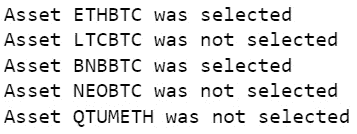
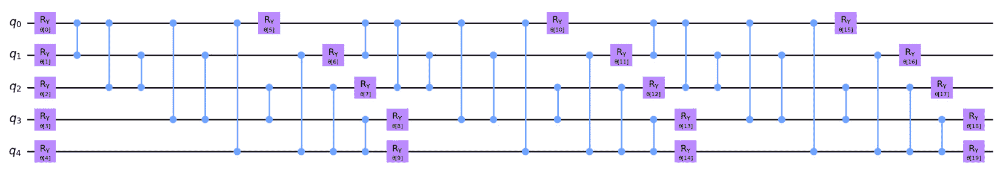

# 5

# 投资组合管理

根据**全球行业分类标准**（**GICS**），全球资产管理行业在 2020 年底的**管理资产总额**（**AUM**）约为 91.7 万亿美元，由 84,000 家公司管理。这些资产包括投资公司、养老金基金、保险公司以及其他国际金融机构管理的 AUM。资产管理者通常使用投资组合管理技术来管理这些资产。Investopedia 对投资组合管理的定义如下：

投资组合管理是选择和监督投资组合的艺术与科学，目的是为投资者的利益实现特定的投资目标。

本章将探讨利用机器学习技术和量子算法进行投资组合管理的艺术。内容分为五个部分：

+   财务投资组合管理

+   财务投资组合多样化

+   财务投资组合模拟

+   使用传统机器学习算法的投资组合管理

+   量子算法投资组合管理实施

让我们从定义财务投资组合开始，理解投资组合管理的必要性。

# 财务投资组合管理

财务投资组合是指个人或实体为了获得投资回报而投资于的一系列资产，包括股票、债券和其他证券。创建一个多样化的财务投资组合对于投资者来说至关重要，旨在最大程度地减少风险并实现回报最大化。财务投资组合需要进行细致分析、市场研究和风险评估。

创建财务投资组合的一个关键方面是多样化。多样化是指投资于不同类型的证券，以分散风险。这一策略旨在减少任何负面事件对投资组合整体表现的影响。例如，如果一个投资组合完全投资于某一只股票或行业，那么如果该公司或行业面临挑战，可能会遭受显著损失。然而，包含股票、债券和其他证券的多样化投资组合可以帮助缓解此类风险。另一个在构建财务投资组合时需要考虑的重要因素是风险承受能力。风险承受能力是指个人应对市场波动和风险的能力。在投资证券之前，评估你的风险承受能力至关重要。高风险投资可能提供更高的回报，但只适合那些能够承受潜在损失的投资者。

投资者在创建财务投资组合时还应考虑他们的投资目标。投资目标是指投资者希望通过投资实现的目标，例如长期增长、收入生成或资本保值。投资者的投资目标将影响他们选择哪些证券纳入投资组合。资产配置是构建财务投资组合的另一个关键方面。资产配置指的是将投资组合中的资金分配到不同的资产类别中，如股票、债券和现金。这个过程旨在平衡不同投资的风险和回报。例如，股票可能提供较高的回报，但伴随较高的风险，而债券可能提供较低的回报，但风险较低。

此外，投资者需要定期审查并重新平衡他们的投资组合。投资利润目标和可容忍的风险迫使我们定期检查投资配置，以确保其一致性。一个没有定期审查的投资组合可能随着时间推移变得失衡，导致更高的风险或较低的回报。构建财务投资组合对于希望通过投资获得回报的投资者至关重要。多样化、风险承受能力、投资目标、资产配置和投资组合审查是投资者在构建财务投资组合时需要考虑的关键因素。通过关注这些因素，投资者可以创建一个与其投资目标和风险承受能力相匹配的多样化投资组合。

# 财务投资组合多样化

财务投资组合多样化对于希望最小化风险并最大化回报的投资者至关重要。多样化投资涉及将资金投入各种资产，包括股票、债券和其他证券，以分散不同市场、行业和资产类别的风险。财务投资组合多样化的主要好处之一是风险降低。通过投资于各种资产，投资者可以避免将所有资金集中在一个篮子里的风险。如果某个资产类别或行业表现不佳，其他资产类别可能表现良好，从而帮助抵消损失。例如，如果一个投资组合中大量投资于股票，并且股市发生崩盘，投资组合的价值可能会显著下降。然而，如果该投资组合还包括债券、商品和房地产，股票价值的下跌可能会被其他资产类别的收益所抵消。

财务投资组合多样化的另一个好处是潜在回报。投资于一系列资产可以从不同市场和行业中获得潜在回报。例如，股票可能提供更高的回报，但伴随更高的风险。另一方面，债券可能提供较低的回报，但风险也较低。通过多样化投资组合，投资者可以捕捉到不同资产类别的潜在回报，同时降低风险。

在进行财务投资组合多元化时，投资者应考虑多个因素，包括他们的投资目标、风险容忍度和时间范围。投资目标指的是投资者希望通过投资实现的目标，例如长期增长、收入生成或资本保值。风险容忍度指的是投资者能够承受的风险水平。时间范围指的是投资者计划持有其投资的时间。投资者通过考虑这些因素，可以创建一个与其目标、风险容忍度和时间范围相匹配的多元化投资组合。

通过将投资分配到不同的资产类别，投资者可以降低投资组合的整体风险，同时仍能捕捉到潜在的回报。财务投资组合多元化是那些希望最小化风险并最大化回报的投资者的关键策略。投资组合多元化涉及投资于各种资产，包括股票、债券和其他证券，以将风险分散到不同的市场、行业和资产类别。投资者通过考虑他们的投资目标、风险容忍度、时间范围和资产配置，可以创建一个与其目标相符并减少整体风险的多元化投资组合。下一小节将讨论资产配置及其必要性和重要性。

## 财务资产配置

财务资产配置是投资组合管理的关键组成部分，它涉及将投资分配到不同的资产类别，以实现所需的风险和回报水平。资产配置是那些希望构建多元化投资组合并最小化风险的投资者的重要策略。财务资产配置的一个关键好处是风险减少。通过将投资分散到不同的资产类别，投资者可以降低与任何特定资产类别或投资相关的风险。例如，如果一个投资者将所有资金都投入一只股票，那么他们将面临该股票的风险。然而，投资于股票、债券和其他资产的组合，可以将风险分散到不同的资产类别，从而减少重大亏损的可能性。

财务资产配置的另一个好处是潜在的更高回报。不同的资产类别具有不同的风险水平和回报潜力。例如，股票相比债券提供更高的回报潜力，但也伴随更高的风险。通过将投资分配到不同的资产类别，投资者可以在最小化风险的同时，受益于多种资产类别的潜在回报。

在进行投资组合资产配置时，投资者必须考虑其投资目标、时间期限和风险承受能力。投资目标因投资者而异，可能包括产生收入、增长资本或保值财富等目标。时间期限是指投资者计划持有投资的时间。通常，较长的时间期限允许更高的风险承受能力，并可能带来更高的回报。风险承受能力是指投资者在追求更高回报时，愿意承担的风险程度。

投资者可以将投资配置到多种不同的资产类别中，包括股票、债券、现金和另类投资。股票代表公司所有权，具有资本增值和分红的潜力。债券则代表债务，提供固定收益支付。现金是一种低风险、低回报的资产，可以为投资组合提供流动性和稳定性。另类投资包括房地产、商品和私募股权。

投资组合的最佳资产配置将取决于投资者的目标、时间期限和风险承受能力。年轻的投资者通常拥有较长的时间期限，可能更愿意承受更高的风险，并将更多的资金配置到股票上。而年长的投资者由于时间期限较短，并且对收入和资本保值的需求较大，可能会将更多的资金配置到债券和现金上。因此，金融资产配置是投资组合管理的一个关键组成部分，它使投资者能够在不同的资产类别之间分散投资、降低风险，同时潜在地提高回报。在确定最佳资产配置时，投资者必须考虑他们的投资目标、时间期限和风险承受能力。通过将投资分配到股票、债券、现金和另类投资的组合中，投资者可以建立一个与其目标一致的、良好分散的投资组合，帮助他们实现财务成功。接下来的小节将讨论金融风险承受能力在金融投资组合优化中的重要性。

## 金融风险承受能力

财务风险承受能力是指投资者为追求潜在回报而愿意承担的风险。对于任何希望投资自己资金的人来说，这是一个重要的概念。多种因素会影响个人的财务风险承受能力。年龄、收入、净资产和投资目标是其中的重要因素。一般来说，年轻的投资者可能更愿意承担风险，因为他们有更长的时间来弥补亏损。高收入和高净资产的个人可能也有较高的风险承受能力，因为他们拥有更多的资源来吸收潜在的损失。投资目标也是决定风险承受能力的关键因素。拥有长期目标（如退休）的投资者可能更愿意承担风险，追求更高的回报。相比之下，拥有短期目标（如为购房首付储蓄）的投资者则可能更重视资本保值，而非潜在回报。

了解自己的财务风险承受能力很重要，因为它有助于投资者做出明智的投资决策。承担过多风险的投资者可能会经历重大损失，这可能影响他们的财务健康。另一方面，过于规避风险的投资者可能会错失那些能够帮助他们实现财务目标的潜在回报。投资者可以使用多种策略来管理风险，并使其投资与风险承受能力相匹配。分散投资是最重要的策略之一。通过将投资分散到不同的资产类别，投资者可以降低某一特定投资的风险。这些类型的投资提供了股票或债券的多元化投资组合，有助于降低风险。另一种策略是通过资产配置来管理风险。资产配置涉及在不同的资产类别之间分配投资，以实现期望的风险和回报水平。通过将投资分配到股票、债券和其他资产的组合中，投资者可以从多个资产类别的潜在回报中获益，同时最小化风险。

最后，投资者定期审查资产配置以确保其满足需求非常重要。随着投资者的情况变化，他们的风险承受能力也可能发生变化。定期的投资组合审查有助于确保投资者的投资组合与其风险承受能力和投资目标保持一致。财务风险承受能力是投资者必须理解的重要概念。年龄、收入、净资产和投资目标等因素都可能影响个人的风险承受能力。投资者需要了解自己的风险承受能力，以做出明智的投资决策。分散投资、低成本指数基金、资产配置和定期投资组合审查等策略有助于投资者管理风险，并使其投资与风险承受能力和目标保持一致。因此，以下小节将讨论如何优化财务投资组合，以使风险承受能力和投资目标相匹配。

## 财务投资组合优化

财务投资组合优化通过选择最优的投资组合，最大化投资者的回报，同时最小化风险。这个过程包括确定投资者的投资目标、风险承受能力和约束条件，然后制定一个优化的投资策略来实现这些目标。本小节将讨论财务投资组合优化的关键原则、它对投资者的好处以及优化财务投资组合所使用的工具。

财务投资组合优化的关键原则之一是多元化。通过将投资分散到不同的资产类别，投资者可以降低与任何特定投资相关的风险。这是因为不同的资产类别具有不同的风险收益特征。例如，股票通常被认为比债券风险更大，但它们也提供更高回报的潜力。通过将投资分散到具有不同风险收益特征的资产类别中，投资者可以实现更高效的投资，从而最小化风险并最大化潜在回报。财务投资组合优化的另一个原则是资产配置。资产配置涉及将投资分配到不同的资产类别，以实现所需的风险和回报水平。通过将投资分配到股票、债券和其他资产的组合中，投资者可以在最小化风险的同时，享受多个资产类别的潜在回报。资产配置的目标是实现一个最大化回报并最小化风险的最优投资组合。

财务投资组合优化有多个好处。首先，它帮助投资者在最小化风险的同时实现投资目标。这一点非常重要，因为投资风险可能会对投资者的财务状况产生重大影响。通过优化投资组合，投资者可以在最小化重大损失风险的同时实现他们的投资目标。其次，财务投资组合优化可以帮助投资者实现比通过传统投资方式更高的回报。这是因为优化允许投资者在最小化风险的同时，利用多个资产类别的潜在回报。

有多个工具用于优化财务投资组合。其中最常用的工具之一是**现代投资组合理论**（**MPT**）。MPT 是一个数学框架，利用统计分析来优化投资组合。该框架假设投资者是风险厌恶型的，旨在最大化给定风险水平下的回报。MPT 考虑了不同资产类别之间的相关性，以及每个资产类别的预期回报和波动性。另一个用于优化财务投资组合的工具是蒙特卡洛模拟。蒙特卡洛模拟涉及统计建模，模拟不同投资策略的潜在结果。这使得投资者能够测试不同的投资情景，找出最适合其投资目标、风险承受能力和约束条件的最佳投资组合。

财务投资组合优化对于希望在最小化风险的同时实现投资目标的投资者至关重要。它涉及识别投资者的投资目标、风险承受能力和约束条件，然后制定一个优化的投资策略，以实现这些目标。财务投资组合优化的关键原则包括多样化和资产配置。财务投资组合优化的好处包括在最小化风险的同时实现投资目标，并有可能获得更高的回报。最后，优化财务投资组合时使用了多种工具，包括现代投资组合理论和蒙特卡洛模拟。以下小节讨论了用于优化财务投资组合的 MPT。

## MPT

MPT 是一个框架，帮助投资者建立高效的投资组合，以最大化给定风险水平下的预期回报。该理论由哈里·马科维茨（Harry Markowitz）在 1950 年代提出，MPT 通过引入多样化和有效前沿的概念，彻底改变了金融领域。MPT 的核心思想是，分散投资对于建立一个良好构建的投资组合至关重要。根据 MPT 的理论，投资者不应将所有资金投入一个篮子，因为单一资产或证券的表现容易受到波动的影响，这可能导致重大损失。通过在多个资产之间进行平衡投资，你可以确保没有任何潜在因素会让投资归零。

MPT 中的一个关键概念是有效前沿。风险和利润水平会揭示出多个投资选择配置的可能性。有效前沿在风险与回报的权衡中划出一条线，表示每个潜在投资组合的选项，如在*图 5.1*中所示的二维图形。通过不同方式平衡和加权资产，热衷的投资者能够发现这一前沿，从而使得构成这一权衡的组合清晰可见，并可以基于这些组合做出决策。

因此，理解有效前沿是理解给定资产集最大能力的关键概念，因为它们的配置将基于现代投资组合理论所建立的框架找到利润极限。  

## 有效前沿  

如前所述，有效前沿是一个表征，它让我们理解一组资产在给定预期回报和与这些资产相关的分散化风险容忍度下的最大能力。  

如果你在二维图表上绘制所有潜在的配置，其中每个投资组合的预期收益率在*y*轴上，标准差（风险的度量）在*x*轴上，你会观察到出现了一个特定的形状，而不是潜在的随机分布图。效率极限出现时，你会发现极端的资产选择，在这个极限下，能够在最大化回报的同时实现风险最小化。  

位于有效前沿上的投资组合被称为“有效的”，因为它们提供了最高的收益。位于有效前沿右侧的投资组合被认为是“低效的”，因为有更好的选择，这些选择在预期利润相同的情况下显示出更低的风险。因此，这些是可以改进的选择，而不是有效的选择。  

以下是有效前沿在图表上绘制后的一个示例：  

  

图 5.1 – 有效前沿  

如*图 5.1*所示，有效前沿是一条从左到右上升的曲线，投资组合以红色点标示在上面。根据之前的定义，效率前沿上的有效投资组合将在曲线的边缘上，蓝线所画的地方，表示没有更好的选择。  

## 示例  

以下是如何使用现代投资组合理论（MPT）构建投资组合的示例。  

假设一位投资者有 100,000 美元用于投资，并考虑两种资产——股票和债券。股票的预期年回报率为 10%，债券的预期年回报率为 5%。投资者还获得了关于这些资产标准差的以下信息：

+   **股票**：20%  

+   **债券**：8%  

投资者希望构建一个在可接受的风险水平下提供最大利润的投资组合。根据现代投资组合理论，投资者应通过投资股票和债券来分散投资组合。通过构建有效前沿，可以确定风险和回报的最佳平衡。  

为了做到这一点，投资者可以在图表上绘制每种资产的预期收益率和标准差。然后，投资者可以通过组合这两种资产的不同比例并计算每种组合的预期收益率和标准差，从而绘制有效前沿。有效前沿将展示出投资者可以以高概率满足初步设定的要求的资产选择。  

例如，如果投资者将 50%的资金投资于股票，50%投资于债券，则该投资组合的预期收益率为 7.5%（即两个资产预期收益的中间值），而标准差为 14%（两个资产标准差的加权平均）。该投资组合将位于高效前沿上。

投资者可以通过选择高效前沿上与其期望的风险水平相对应的点来决定最优的投资组合。例如，如果投资者愿意承受更多的风险，他们可能会选择一个具有更高预期收益和更高标准差的投资组合。另一方面，如果投资者风险厌恶，他们可能会选择一个具有较低预期收益和较低标准差的投资组合。以下部分通过案例研究展示了 MPT 的实施。

## 案例研究

假设一位名为 Sarah 的投资者正在考虑两种潜在投资——股票和债券。股票的预期收益较高，但风险也较大；而债券的预期收益较低，但风险也较小。Sarah 尝试决定如何在这两种投资之间分配她的资金，以在最大化收益的同时最小化风险。

Sarah 决定使用现代投资组合理论（MPT）来帮助她优化她的投资组合。她首先构建了一个网格，展示了每种可能的两种投资组合的预期收益和标准差（风险的度量）。该网格如下所示：


图 5.2 – 高效前沿

基于*图 5.2*中所示的网格，Sarah 可以看到，预期收益最高的投资组合是 100%投资于股票，但它也具有最高的风险水平。另一方面，风险水平最低的投资组合是 100%投资于债券，但它也具有最低的预期收益。

Sarah 决定使用高效前沿来帮助她识别风险和收益之间的最佳平衡。她将每个投资组合的预期收益和标准差绘制在图表上，并且高效前沿显示给 Sarah，基于高效前沿，最优的投资组合是大约 60%投资于股票，40%投资于债券。

Sarah 决定以这种方式分配她的资金，并定期重新平衡她的投资组合，以确保它符合她的投资标准。通过使用 MPT 和高效前沿，Sarah 能够优化她的投资组合，实现风险和收益之间的最佳平衡。后续小节将讨论财务投资组合模拟在实施投资组合优化中的作用。

# 财务投资组合模拟

财务投资组合模拟是投资者用来评估其投资组合表现、预测未来走势并做出明智投资决策的工具。它涉及创建投资者投资组合的模型，并测试不同的情景，以确定最佳的投资策略。近年来，投资组合模拟变得越来越流行，因为它为投资者提供了一种具有成本效益的方式来评估其风险承受能力并最大化回报。本小节将探讨财务投资组合模拟的概念、其优势以及如何利用它优化投资决策。

财务投资组合模拟的一个重大优势是它能够帮助投资者清晰地理解自己的风险承受能力。通过模拟不同的情景，投资者可以确定其投资组合对市场波动的敏感性，并相应地调整投资策略。领先投资公司投资主管 David McEwen 曾这样评论风险承受能力：

不了解自己风险承受能力的投资者可能会承担比自己能承受的更多或更少的风险，这可能会对其投资组合产生负面影响。

因此，财务投资组合模拟是一个有价值的工具，能够帮助投资者根据风险承受能力做出明智的投资决策。财务投资组合模拟的另一个好处是它能够预测投资者的投资组合在不同市场条件下的表现。在市场波动时期，这尤其有用，因为投资者可能会急于做出投资决策。通过模拟不同的情景，投资者可以看到其投资组合在不同市场条件下的表现，从而增强他们的投资决策信心。

投资者必须理解自己的投资目标和风险承受能力，才能利用财务投资组合模拟优化投资决策。这包括确定投资目标、实现这些目标的时间范围以及愿意承担的风险水平。一旦这些因素确定，投资者可以使用投资组合模拟来测试不同的投资情景，并确定最佳的投资策略。例如，拥有长期投资期限的投资者可能愿意在其投资组合中承担比短期投资期限的投资者更多的风险。通过模拟不同的情景，投资者可以确定投资组合的最佳资产配置，以实现其投资目标，同时最小化风险。

因此，财务投资组合模拟是投资者优化投资决策的有价值工具。它能让投资者清楚了解自己的风险承受能力，预测投资组合在不同市场条件下的表现，并基于投资目标做出明智的决策。通过模拟不同的投资情境，投资者可以确定投资组合的最佳资产配置，确保在实现投资目标的同时最小化风险。随着金融市场的不断变化，财务投资组合模拟将继续为那些寻求最大化回报并管理风险的投资者提供重要支持。接下来的段落将介绍财务投资组合模拟技术所使用的方法。

## 财务投资组合模拟技术

财务投资组合模拟是投资者评估和管理其投资组合风险的重要工具。通过使用不同的技术，投资者可以模拟各种情境，确定市场波动的潜在影响，并做出明智的投资决策。本文将讨论财务投资组合模拟中常用的三种技术——蒙特卡洛模拟、压力测试和敏感性分析。

**蒙特卡洛模拟**是一种统计技术，用于建模和分析复杂系统的行为，比如财务投资组合。它通过多次模拟不同的输入，生成各种潜在的结果。这些输入可能包括利率、通货膨胀率和市场回报等变量。蒙特卡洛模拟输出的是潜在投资回报的概率分布，这可以帮助投资者做出有关风险和回报的明智决策。正如投资专家雷·达里奥曾说过：

如果你能模拟一千次某种情境，你大概能非常清楚地预测事情的发展。

**压力测试**是另一种用于财务投资组合模拟的技术。它通过模拟极端情境，如经济衰退或市场崩盘，来确定这些情境对投资组合的潜在影响。通过进行压力测试，投资者可以识别出投资组合的潜在弱点，并调整策略以降低风险。投资组合经理约翰·雷肯塔勒对压力测试曾这样说：

压力测试至关重要，因为它能显示出你的投资组合在哪些方面存在脆弱性。就像进行火灾演习，帮助你在紧急情况下做好准备。

**敏感性分析**是一种用于确定特定变量变化如何影响投资组合表现的技术。它涉及识别关键变量，如利率或通货膨胀率，并分析这些变量变化如何影响投资组合的表现。通过进行敏感性分析，投资者可以识别哪些变量对投资组合的表现影响最大，并相应调整投资策略。理财顾问丽莎·基尔欣鲍尔指出：

敏感性分析有助于投资者理解不同变量如何相互作用，以及一个变量的变化如何影响整个投资组合。

财务投资组合模拟对于投资者管理风险和做出明智投资决策至关重要。通过使用如蒙特卡洛模拟、压力测试和敏感性分析等技术，投资者可以模拟各种情景并识别投资组合中的潜在弱点。因此，投资者可以做出明智的决策，优化投资组合的表现并最大限度地减少风险。以下小节讨论了实施压力测试的概念和方法。

### 压力测试

压力测试是一种评估金融机构、系统或投资组合对潜在不利事件或冲击的韧性过程。它通过模拟极端情境并衡量对投资组合、系统或机构财务健康的影响来进行。压力测试是风险管理中的一个重要工具，帮助金融机构识别潜在的弱点并为可能的风险做好准备。压力测试的目的是评估突发事件对投资组合、机构或系统的影响。例如，压力测试可能会模拟重大经济衰退、大规模市场抛售或地缘政治危机的影响。这些情景的设计足够严峻，可以测试投资组合、机构或系统的韧性，同时又足够现实，以提供有意义的洞察。

压力测试涉及一系列技术，包括以下内容：

**情景分析**：这种技术涉及识别潜在情景并模拟其对投资组合、机构或系统的影响。这些情景的设计通常极端，可能包括一系列不利事件，如利率急剧上升或资产价格大幅下跌。

**敏感性分析**：这种技术涉及改变一个或多个输入参数，以评估对输出的影响。例如，敏感性分析可能涉及将利率提高一个特定的百分比，并评估对投资组合回报的影响。

**反向压力测试**：这种技术涉及识别能够导致重大损失或对机构、系统或投资组合造成严重影响的压力水平。反向压力测试有助于识别关键脆弱性，并为制定适当的风险缓解策略提供依据。

国际货币基金组织的一份报告中提到了关于压力测试的以下内容：

压力测试已经成为监管机构和监督者评估金融系统及个别机构韧性的重要工具。它在识别潜在脆弱性、量化风险和测试缓解策略的有效性方面发挥了不可或缺的作用。

因此，压力测试是风险管理中的重要工具，能够帮助金融机构识别潜在脆弱性并为潜在风险做准备。使用情景分析、敏感性分析和反向压力测试能够提供对突发事件对投资组合、机构或系统金融健康影响的洞察。随着金融环境的不断变化，压力测试将继续是确保金融系统稳定性的关键工具。下节将讨论在金融投资组合模拟中使用的其他技术。

### 蒙特卡洛模拟

蒙特卡洛模拟是一种在金融投资组合模拟中常用的技术，用于模拟金融资产的行为并估计投资组合的潜在风险和回报。这种技术通过生成多个市场行为的随机场景，模拟在给定时间范围内投资组合的表现。在本小节中，我们将探讨蒙特卡洛模拟作为金融投资组合模拟工具的各个方面。

蒙特卡洛模拟的一个关键优势是，它能够让投资者为他们的投资组合生成一系列可能的结果，而不仅仅依赖于单一的预测。通过进行多次模拟，投资者可以更好地了解与其投资组合相关的风险，并相应地调整投资策略。这在处理涉及广泛资产的复杂投资组合时尤为重要。

蒙特卡洛模拟技术包括以下步骤：

1.  **定义投资组合**：蒙特卡洛模拟的第一步是定义待分析的投资组合。这包括指定各个资产、它们的预期回报以及它们之间的相关性。

1.  **定义概率分布**：下一步是为投资组合中的每个资产定义概率分布。这涉及到为每个资产指定回报的均值和标准差，以及其他相关的统计参数。

1.  **生成随机情景**：一旦投资组合和概率分布已被定义，蒙特卡洛模拟便会生成许多随机的市场行为情景。这些情景基于先前步骤中指定的概率分布进行生成。

1.  **模拟投资组合表现**：对于每一个随机情景，蒙特卡洛模拟根据第一步中指定的资产权重和相关性计算投资组合的回报。这会生成一系列可能的投资组合回报分布。

1.  **分析结果**：最后，蒙特卡洛模拟提供一系列统计数据，可用于分析模拟结果，例如投资组合的期望值、收益的标准差以及实现特定收益水平的概率。

蒙特卡洛模拟是金融投资组合模拟的强大工具，能为投资者提供一系列可能的结果，并帮助他们更好地理解与投资相关的风险。这一技术使投资者能够做出更明智的决策，并调整其投资策略，以最大化回报，同时最小化风险暴露。

假设一个投资者想要评估一个包含股票、债券和现金混合的特定投资组合的风险与回报。该投资组合包括 60%的股票、30%的债券和 10%的现金。为了评估这个投资组合的表现，投资者可以使用蒙特卡洛模拟，过程包括以下步骤：

确定投资组合中每种资产类别的历史回报和波动性。例如，假设历史数据表明，股票的年回报率为 10%，波动率为 20%。相比之下，债券的年回报率为 5%，波动率为 10%，现金的回报率为 2%，且没有波动性。

生成随机数字以模拟每种资产类别在未来的表现。蒙特卡洛模拟基于历史数据随机生成一组可能的未来结果。

根据每种资产类别的模拟结果计算整体投资组合的回报。例如，如果模拟结果显示股票的回报为 12%，债券为 4%，现金为 2%，则整体投资组合的回报为 8.4%。

重复进行多次模拟，以生成一系列可能的结果。蒙特卡洛模拟允许投资者对一系列可能的结果进行建模，并评估每种结果的概率。

基于可能结果的范围评估投资组合的风险和回报。这一步骤包括根据模拟结果计算投资组合的期望回报和标准差。投资者可以利用这些信息做出有关投资策略的明智决策。

戴维·布斯（David Booth），一家知名投资公司的创始人兼执行主席，指出以下内容：

蒙特卡罗模拟可以帮助投资者更好地理解其投资策略的潜在结果，并做出更有根据的决策。它使投资者能够评估各种因素对投资组合表现的影响，并为应对意外的市场条件做好更充分的准备。

蒙特卡罗模拟是金融投资组合模拟中一个有价值的工具，可以帮助投资者优化其投资策略并降低风险。

### 投资组合优化的金融建模

计算机算法和模型在金融投资组合模拟中变得越来越重要，而蒙特卡罗模拟是这些算法和模型常用的一种技术。以下是蒙特卡罗模拟如何通过计算机算法和模型应用于金融投资组合模拟的一个示例：

算法或模型根据历史数据和对未来市场条件的假设，生成可能影响投资组合的多种情景。

对于每个情景，算法或模型会根据投资组合中包含的资产及其历史相关性，计算该投资组合的预期回报和风险。

算法或模型利用这些预期回报和风险来计算投资组合的预期值、波动性，以及各种结果（如盈利或亏损）的概率。

通过重复这一过程成千上万次，甚至数百万次，算法或模型会创建一个潜在投资组合结果的分布，这个分布可以用来估计投资组合在不同市场条件下的风险和回报特性。

然后，可以分析这个分布，以识别投资组合中的潜在弱点或机会，并优化投资组合的资产配置或风险管理策略。

根据大卫·鲁珀特教授的说法，他是该领域的著名专家，蒙特卡罗模拟是一个强大的工具，用于建模复杂的系统，包括金融投资组合：

蒙特卡罗模拟使我们能够处理非常高维、非常复杂的模型，而这些模型在其他情况下无法通过解析方法求解。它还允许我们进行敏感性分析，观察当我们改变输入时，模型输出如何变化，从而识别出最重要的变量和风险源。

利用蒙特卡罗模拟和其他先进技术，计算机算法和模型可以帮助投资者在复杂且快速变化的金融环境中做出更加明智的决策，并更有效地管理他们的投资组合。

### 优化算法

优化算法被用于金融投资组合优化，以选择最适合给定投资者偏好和约束条件的投资组合。以下是一些常用的优化算法：

+   **线性规划**：一种数学技术，用于优化线性目标函数，且满足线性约束。线性规划在投资组合优化中被用来确定最优的投资组合配置。

+   **二次规划**：一种优化二次目标函数并满足线性约束的数学技术。二次规划在投资组合优化中用于确定最优投资组合，考虑收益分布的高阶矩，如波动率和偏度。

+   **遗传算法**：一种受自然选择启发的启发式优化技术。遗传算法使用一组候选解，应用基因操作（如变异和交叉）生成新的候选解，并根据适应度函数选择最合适的候选解。

根据现代投资组合理论的奠基人、诺贝尔奖得主哈里·马克维茨博士的说法，

用于优化投资组合的适当数学技术取决于投资者的目标、约束和偏好，以及所考虑证券的特性。

因此，优化算法的选择应根据投资者的具体需求来进行，投资组合应当被优化。

# 使用传统机器学习算法进行投资组合管理

## 经典实现

投资组合优化是一个与金融服务和银行业相关的问题，源自于马克维茨于 1952 年发表的开创性论文（[`onlinelibrary.wiley.com/doi/full/10.1111/j.1540-6261.1952.tb01525.x`](https://onlinelibrary.wiley.com/doi/full/10.1111/j.1540-6261.1952.tb01525.x)）。该模型描述了一组资产 x i ∈ X，从中需要选择一个子集以最大化收益，同时最小化未来 𝑡 步时间的风险。在给定的期间内，每个资产都有一个预期回报，并且资产之间的协方差决定了基于分散化的风险量（为了简单起见）。这种分散化的背后思想是，如果我们只投资于那些最高收益的资产，它们如果失败时被同一因素所驱动的风险，比我们进行投资组合多样化时要大。我们将重点关注单次时间步的过程，假设局部最优解是我们投资组合全球最优解的长时间步轨迹的一部分。

那么，为了简单起见，我们先考虑单次时间步的优化。投资是有代价的。一个预算（𝐵）与投资于投资组合配置相关。它由投资每个资产的总成本表示，记为 b i，其中 i 是特定资产的索引。理想情况下，我们的推荐应不超过此条件（∑ b i < B）。因此，这个经典的优化问题通常被提出为：

∑ i=1 n  x i e i− θ∑ i,j=1 n  x i x j c ij

s . t. ∑ i=1 n x i b i ≤ B

其中，x i ∈ {0,1} 是与我们的资产集选择相关的掩码，而 𝜃 是一个拉格朗日算子，用于调节我们希望承担的风险量。我们将此选择二值化，因为它简化了计算。不过，考虑到投资组合的强制性要求，我们仍然可以考虑在模型的三个方面（收益、风险和预算）上做出进一步的投资选择。

我们最小化同样的模型，因为它将更符合我们将要采用的技术方法。因此，最终模型将如下所示：

− ∑ i=1 n x i e i+ θ∑ i,j=1 n x i x j c ij

s . t. ∑ i=1 n x i b i ≤ B

首先，我们将加载数据以构建优化问题：

```py

import json
data = None
with open("binance-data.json", "r") as jsonfile:
    data = json.load(jsonfile)
```

从加载的数据中，我们可以将计算的收益、协方差和资产成本存储在相应的变量中。我们还将预算设置为 50%：

```py

import numpy as np
returns = data['mu']
covar = data['sigma']
assets = []
costs = []
for row in data['assets']:
    assets.append(row["Asset"])
    costs.append(float(row["Open"]))
# Half the money
budget = np.sum(costs)/0.5
```

接下来，让我们绘制收益的条形图：

```py

import seaborn as sns
import matplotlib.pyplot as plt
sns.barplot(y=returns, x = assets)
plt.show()
```


图 5.3 – 按资产分类的收益

在这里，我们可以观察到，只有 BNBBTC 和 ETHBTC 的收益为正，而 LTCBTC、NEOBTC 和 QTUETH 的收益为负。

我们已经在数据文件中计算了协方差。接下来，让我们绘制协方差图：

```py

f, ax = plt.subplots(figsize=(10, 8))
sns.heatmap(covar, mask=np.zeros_like(covar, dtype=bool), annot=True,
            square=True, ax=ax, xticklabels=assets, yticklabels=assets)
plt.title("Covariance between Equities")
plt.show()
```


图 5.4 – 相关矩阵

前述协方差矩阵显示了不同股票之间的联合变动情况。通过这种方式，我们可以识别出可能由相同因素驱动的股票的方差，并意识到将它们同时纳入同一投资组合的风险。这些值将作为 c ij 系数引入我们的方程。

解决此类优化问题（如前述问题）的一个常见选择是使用优化库，如 CVX 及其 Python 实现（`cvxpy`），并采用混合整数优化方法，因为我们的问题受到布尔值约束，𝑥 变量可以取的值。此时我们假设问题是凸的，且在选择求解器之前需要验证这一假设，但考虑到涉及的股票数量，这种方法展示了如何使用经典求解器而无需大量编写代码：

```py

import cvxpy as cp
# Our solution variable
x_val = cp.Variable(len(returns), boolean=True)
theta = cp.Parameter(nonneg=True)
ret = np.array(returns)@x_val
risk = cp.quad_form(x_val, covar)
e_costs = np.array(costs)@x_val
# Constraints
cons = [cp.sum(x_val) >= 0, cp.sum(e_costs) <= budget, x_val >= 0]
# Objective function
obj = cp.Minimize(- ret + theta*risk)
# Problem
prob = cp.Problem(obj, cons)
```

我们使用了 0.03 作为拉格朗日乘数的风险惩罚。CVXPY 可以与多种求解器接口；这些求解器使用的算法有与停止标准和改进解质量相关的参数。没有一个参数设置对所有问题都是完美的。如果你没有从某个求解器中获得满意的结果，可以尝试更改其参数。具体做法取决于特定的求解器。

我们在代码中使用了‘`ECOS_BB`’求解器：

```py

theta.value = 0.03 # This is related to the risk penalty lagrangian
prob.solve(solver='ECOS_BB')
for i, val in enumerate(np.round(x_val.value,1)):
    if val == 1:
        print(f"Asset {assets[i]} was selected")
    else:
        print(f"Asset {assets[i]} was not selected")
```

我们得到的该问题的最优值为‘-0.0018521365020072623’。以下是已选择和未选择的资产的一个代码片段。



图 5.5 – 资产选择

我们可以看到 ETHBTC 和 BNBBTC 被选择了，根据历史回报，这两项资产提供了正回报，而其他资产没有被选中。

现在让我们开始量子实现。我们将查看一个基于退火的实现，使用 D-Wave SDK 和一个基于门的实现，使用 Qiskit。

# 量子算法投资组合管理实现

## 量子退火机

量子退火机是专门的机器，能够遵循绝热原理找到给定问题的最小能量解。我们在*第二章*中提到过一些这样的机器，但现在我们将详细介绍它们如何用来解决像投资组合优化这样的问题。

量子退火机需要一个目标问题，以矩阵形式设置，将变量作为掩码。在我们的投资组合示例中，解决方案将以二进制决策编码，表示是否将资产*n*包括在我们的最终投资组合中。因此，我们的问题矩阵应反映是否将某个资产包括在解决方案中的影响。

为此，文献中通常发现问题需要以 QUBO（或 Ising）形式呈现。**QUBO**代表**二次无约束二进制优化**，意味着考虑二进制变量（0 或 1），只表示两种方式的乘法（X i × X j），所有信息都包含在目标函数中。

因此，我们的 QUBO 问题的规范形式应该如下所示：

x T Qx

其中 Q 是包含所有信息的矩阵。

为了以这种方式构建我们的投资组合，我们需要构建目标函数，以便将资产选择回报、分散风险和预算约束包含在一个单一的方程式中，如下所示：

− ∑ i=1 n x i e i+ θ 1 ∑ i,j=1 n x i x j c ij + θ 2 (∑ i=1 n x i b i − B) 2

这里，ei 表示如果在投资组合中选择第 i 个资产时的预期回报。cij 表示同时选择两个资产的风险，因为它们可能受相同的基础过程驱动，从而增加我们的风险。bi 与获取第 i 个资产的成本相关，所有资产的总和不应超过可用预算（B）。两个θ值表示该项的相关性，意味着如果允许，可以超出初始预算，或者如果我们减少θ1 的值，可以考虑高风险的投资组合。我们可以调节结果，因为它需要是无约束的（QUBO 中的 U），但每次可以根据我们的优先级进行调节。

一旦问题被设定为这种规范形式，你可以轻松地将其提交给量子退火机以获得结果。

## D-Wave 实现

D-Wave 不仅是这些机器之一，也是首批市场上可用的量子计算机之一，几乎在 10 年前就已问世。其设备可以作为云服务访问并免费使用（至少每月有几分钟的使用时间）。其在线服务名为 Leap（[`cloud.dwavesys.com/leap/login`](https://cloud.dwavesys.com/leap/login)），注册后，欢迎页面会显示剩余的计算时间，如下图所示。


图 5.6 – Leap 仪表盘

这是可以获取访问令牌的地方，访问令牌将在本地环境准备好后用于连接到服务。

让我们继续并开始构建我们的投资组合问题，并通过 D-Wave 平台解决它。首先，我们必须加载之前的数据，这些数据基于从 Binance 获取的信息：

```py

import json
import numpy as np
data = None
with open("binance-data.json", "r") as jsonfile:
    data = json.load(jsonfile)
returns = data['mu']
covar = data['sigma']
```

回报率和协方差将用于构成我们的目标问题。此外，还需要定义预算，以限制我们希望选择的资产数量。在本例中，这将被设定为资产总额的 50%：

```py

assets = []
costs = []
for row in data['assets']:
    assets.append(row["Asset"])
    costs.append(float(row["Open"]))
# Half the money
budget = np.sum(costs)/0.5
```

感谢 PyQUBO 库，我们之前的公式可以轻松地转化为 D-Wave 芯片的编码问题：

```py

from pyqubo import Array, Placeholder, Constraint
num_assets = len(assets)
x = Array.create('x', shape=num_assets, vartype='BINARY')
# Profit generated by each asset individually
H_linear_profit = 0.0
for i in range(num_assets):
    H_linear_profit += Constraint(
        returns[i] * x[i], label='profit({})'.format(i)
    )
# Risk obtained from the covariance matrix
H_quadratic = 0.0
for i in range(num_assets):
    for j in range(i + 1, num_assets):
        H_quadratic += Constraint(
            covar[i][j] * x[i] * x[j], label='risk({}, {})'.format(i, j)
        )
# Constraint (budget)
H_linear_budget = 0.0
for i in range(num_assets):
    H_linear_budget += Constraint(costs[i]*x[i], label='slot({})'.format(i))
# Final shape of the problem
theta1 = Placeholder('theta1')
theta2 = Placeholder('theta2')
H = - H_linear_profit + theta1 * H_quadratic + theta2 * (H_linear_budget - budget)**2
model = H.compile()
```

该模型服务于不同的目标，因为我们可以调整 theta 参数，使预算或多样化的约束条件变得更加严格或宽松：

```py

# Set the Lagrange multipliers
theta1=0.5
theta2=0.3
feed_dict = {'theta1': theta1, 'theta2' : theta2}
# Transform to QUBO.
qubo, offset = model.to_qubo(feed_dict=feed_dict)
qubo
{('x[4]', 'x[0]'): -8.656820265502894e-06,
 ('x[0]', 'x[0]'): -0.003196217986409817,
 ('x[3]', 'x[1]'): 0.00019183405443636594,
…
 ('x[1]', 'x[1]'): 9.405658442868104e-05,
 ('x[2]', 'x[1]'): 0.00014597087707179864,
 ('x[1]', 'x[0]'): 0.00023358187881969354,
 ('x[2]', 'x[0]'): 0.0006994880363473856}
```

这是实际的 Q 矩阵，如前面的方程 1 所示。到目前为止，这只是将我们的目标问题公式化，以便 D-Wave 的退火机器能够处理它。接下来的步骤将把该模型送入退火器，因此我们必须实例化它：

```py

from dwave.system.samplers import DWaveSampler
from dwave.system.composites import FixedEmbeddingComposite
import minorminer
import dimod
# Instanciate Sampler
dwave_sampler = DWaveSampler()
```

除了 D-Wave 的库之外，还需要额外的库将问题嵌入到我们的目标芯片架构中。这将在*第九章*中详细讨论，但芯片架构要求我们为问题找到合适的嵌入方式。感谢`minorminer`库，这只需要几行代码：

```py

# Construct a problem
bqm = dimod.BinaryQuadraticModel(qubo, dimod.BINARY)
# Get the edge list
target_edgelist = dwave_sampler.edgelist
# And source edge list on the BQM quadratic model
source_edgelist = list(bqm.quadratic)
# Find the embeding
embedding = minorminer.find_embedding(source_edgelist, target_edgelist)
sampler = FixedEmbeddingComposite(dwave_sampler, embedding)
```

一旦问题有了合适的嵌入，我们就可以将其发送到量子机器。我们可以调用采样器，在问题在 D-Wave 芯片上花费一定的时间（即退火时间）后，获得最终结果：

```py

ta = 10 # microseconds
num_reads = 10
response = sampler.sample_qubo(qubo, num_reads=num_reads, annealing_time=ta)
response.first
Sample(sample={'x[0]': 1, 'x[1]': 0, 'x[2]': 1, 'x[3]': 0, 'x[4]': 0}, energy=-0.005097396148791738, num_occurrences=10, chain_break_fraction=0.0)
```

这是在 10 次运行后找到的最小能量解，退火时间为 10 微秒。此编码显示，根据我们编码信息的顺序（在我们的 BNBBTC 示例中为 ETHBTC），我们的最佳投资组合将包括第一个和第三个资产。

同时，值得注意的是，所有运行结果都显示这是退火时间后（`num_ocurrences=10`）的最佳解决方案。有时会出现这种情况，因为该解决方案的成功概率较低。当使用基于门的量子设备解决这些问题时，这一点尤为重要。

## Qiskit 实现

Qiskit 是我们将使用的框架来尝试解决相同的问题，但我们将使用基于门的量子设备。基于门的设备允许更通用的设置来解决退火问题，但也允许任何其他组件。你可以使用 QML 技术或基于门的算法来解决问题，例如 Shor 算法、Grover 算法等，正如在*第二章*中讨论的那样。

在这种情况下，Qiskit 已经提供了高层次的金融抽象库，以便我们可以最小化编码要求，而不是从头开始。例如，基于 Binance 数据构建我们的二次问题将需要以下几行：

```py

from qiskit_finance.applications.optimization import PortfolioOptimization
q = 0.5  # set risk factor
budget = len(assets) // 2  # set budget
portfolio = PortfolioOptimization(
    expected_returns=returns, covariances=covar, risk_factor=q, budget=budget
)
qp = portfolio.to_quadratic_program()
```

最新的方程表示这个二次程序，Qiskit 已经提供了解决它的方法，使用经典的基于 NumPy 的求解器：

```py

from qiskit_optimization.converters import QuadraticProgramToQubo
from qiskit_optimization.algorithms import MinimumEigenOptimizer
from qiskit.algorithms import NumPyMinimumEigensolver
def index_to_selection(i, num_assets):
…
def print_result(result):
…
exact_mes = NumPyMinimumEigensolver()
exact_eigensolver = MinimumEigenOptimizer(exact_mes)
result = exact_eigensolver.solve(qp)
print_result(result)
Optimal: selection [1\. 0\. 1\. 0\. 0.], value -0.0011
----------------- Full result ---------------------
selection  value    probability
---------------------------------------------------
[1 0 1 0 0]  -0.0011  1.0000
[1 1 1 1 1]  9.0971    0.0000
[0 1 1 1 1]  4.0459    0.0000
[1 0 0 0 0]  1.0102    0.0000
[0 1 0 0 0]  1.0108    0.0000
[1 1 0 0 0]  0.0010    0.0000
[0 0 1 0 0]  1.0087    0.0000
[0 1 1 0 0]  -0.0005  0.0000
[1 1 1 0 0]  1.0102    0.0000
[0 0 0 1 0]  1.0122    0.0000
[1 0 0 1 0]  0.0024    0.0000
[0 1 0 1 0]  0.0031    0.0000
[1 1 0 1 0]  1.0138    0.0000
```

尽管这显示了我们问题的预期解，但在扩展到更大的投资组合配置时，过程可能会很昂贵，因为它探索了潜在解的整个空间。

理想情况下，变分方法应该在探索这些大型解空间时更为高效，考虑到量子计算的特性。当同时处理所有这些选项并将它们演化时，突出最小化我们目标的选项是这些技术的亮点。将我们的二次问题转移到量子设置中需要两个主要步骤：

+   一个**参数化量子电路**（**PQC**）或 ansatz

+   一个优化过程，将调整并找到适合我们 PQC 的参数。

对于第一个例子，**量子近似优化算法**（**QAOA**）将是我们解决问题的候选算法。这是一种直接继承自退火器处理此类问题的方法，通过设置交替的哈密顿量来处理目标问题和混合器哈密顿量。

PQC 对于给定问题有固定的结构，只需要对其进行重复以进行选择。通过改变重复次数，我们应该能够提高目标状态——我们问题的解的成功概率。然后，我们希望通过变分方法找到一组合适的参数，以最大化这个成功概率。在这种情况下，COBYLA 将是我们选择的优化器，因为它的性能很快。其他选项也应尝试：

```py

from qiskit.algorithms import QAOA
from qiskit.algorithms.optimizers import COBYLA
layers = 2
cobyla = COBYLA()
cobyla.set_options(maxiter=500)
qaoa_mes = QAOA(optimizer=cobyla, reps=layers, quantum_instance=quantum_instance)
qaoa = MinimumEigenOptimizer(qaoa_mes)
result = qaoa.solve(qp)
Optimal: selection [1\. 0\. 1\. 0\. 0.], value -0.0011
----------------- Full result ---------------------
selection  value    probability
---------------------------------------------------
[0 0 0 1 1]  0.0048    0.0783
[0 1 0 1 0]  0.0031    0.0777
[0 1 0 0 1]  0.0031    0.0777
[1 0 0 1 0]  0.0024    0.0775
[1 0 0 0 1]  0.0021    0.0773
[0 0 1 1 0]  0.0009    0.0770
[1 1 0 0 0]  0.0010    0.0770
[0 0 1 0 1]  0.0009    0.0770
[0 1 1 0 0]  -0.0005    0.0765
[1 0 1 0 0]  -0.0011    0.0763
…
```

好吧，在我们的第一次尝试中，尽管我们找到了最佳解，但它与其他解在相同的量子状态下竞争。我们必须记住，我们在量子设备上执行的所有操作的结果将生成一个量子状态，理想情况下这个状态应该包含我们的候选解。如果它还有更大的概率振幅，那么当它在测量时坍缩到这些经典状态之一时，它更有可能成功。因此，我们希望找到一个概率比这里显示的更大的结果。

我们可以尝试不同数量的层或重复次数，在问题与混合哈密顿量之间进行实验：

```py

from qiskit.algorithms import QAOA
layers = 5
qaoa_mes = QAOA(optimizer=cobyla, reps=layers, quantum_instance=quantum_instance)
qaoa = MinimumEigenOptimizer(qaoa_mes)
result = qaoa.solve(qp)
Optimal: selection [1\. 0\. 1\. 0\. 0.], value -0.0011
----------------- Full result ---------------------
selection  value    probability
---------------------------------------------------
[0 0 0 1 1]  0.0048    0.0666
[0 1 0 1 0]  0.0031    0.0663
[0 1 0 0 1]  0.0031    0.0661
[1 0 0 1 0]  0.0024    0.0659
[1 0 0 0 1]  0.0021    0.0659
[0 0 1 1 0]  0.0009    0.0656
[0 0 1 0 1]  0.0009    0.0654
[1 1 0 0 0]  0.0010    0.0654
[0 1 1 0 0]  -0.0005    0.0651
[1 0 1 0 0]  -0.0011    0.0647
…
```

如果这种方法看起来不合适，我们可以尝试在一般情况下改变优化方法，寻找不同的初始假设组合。

**变分量子本征求解器** (**VQE**) 允许更通用的方法来描述初始假设。例如，下面的示例中使用了 TwoLocal PQC 实现。TwoLocal 电路可以包含多个相同方案的重复，包含不同的、任意选择的操作：

```py

from qiskit.circuit.library import TwoLocal
ansatz = TwoLocal(num_assets, "ry", "cz", reps=3, entanglement="full")
ansatz.decompose().draw('mpl', fold=150)
```



图 5.7 – 由前面代码产生的包含三次 RY 旋转和 CZ 两量子比特门的电路

我们需要找到 theta 参数来解决我们的问题。这时，变分方法就派上用场了——在本例中，重新使用 COBYLA 求解器来找到这些理想的参数：

```py

from qiskit import Aer
from qiskit.algorithms import VQE
from qiskit.algorithms.optimizers import COBYLA
from qiskit.utils import QuantumInstance
from qiskit.utils import algorithm_globals
algorithm_globals.random_seed = 1234
backend = Aer.get_backend("statevector_simulator")
cobyla = COBYLA()
cobyla.set_options(maxiter=500)
quantum_instance = QuantumInstance(backend=backend, seed_simulator=1234, seed_transpiler=1234)
vqe_mes = VQE(ansatz, optimizer=cobyla, quantum_instance=quantum_instance)
vqe = MinimumEigenOptimizer(vqe_mes)
result = vqe.solve(qp)
```

如前面的代码所示，VQE 需要一个初始假设或 PQC、一个优化器和一个量子实例，即量子电路评估将要执行的设备。在本例中，将使用本地仿真，但我们将在*第八章*中看到如何利用云计算资源进行这种评估，类似 D-Wave 的情况。在经过一些迭代（最多 500 次）后，我们可以打印出我们的投资组合问题的结果：

```py

print_result(result)
Optimal: selection [1\. 0\. 1\. 0\. 0.], value -0.0011
----------------- Full result ---------------------
selection  value    probability
---------------------------------------------------
[1 1 0 0 0]  0.0010    0.3613
[1 0 0 1 0]  0.0024    0.3463
[0 0 1 1 0]  0.0009    0.1285
…
[1 0 1 0 0]  -0.0011    0.0000
```

找到的解决方案与我们之前示例中的最优解匹配，但找到它的成功概率不是 1.0，而是接近 0。这意味着，如果仅允许使用这些参数运行一次电路，并在过程结束时测量经典比特串，那么几乎不可能选中这个状态。从经典确定性的角度来看，这可能很难理解。然而，处理量子状态时，可能会出现这类情况，其中最优解是由多个混合级别上的最优和次优选项组成的。

量子科学家的工作将涉及找到一种好的方法，通过改变 PQC、优化方法或全局过程来最大化这些几率。

例如，通过增加 TwoLocal 初始假设的重复次数，我们可以看到这些几率是如何变化的：

```py

ansatz = TwoLocal(num_assets, "ry", "cz", reps=6, entanglement="full")
vqe_mes = VQE(ansatz, optimizer=cobyla, quantum_instance=quantum_instance)
vqe = MinimumEigenOptimizer(vqe_mes)
result = vqe.solve(qp)
Optimal: selection [1\. 0\. 1\. 0\. 0.], value -0.0011
----------------- Full result ---------------------
selection  value    probability
---------------------------------------------------
[0 1 0 0 1]  0.0031    0.6130
[1 0 1 0 0]  -0.0011    0.2030
[0 1 0 1 0]  0.0031    0.0528
[0 1 1 0 0]  -0.0005    0.0435
[1 0 0 1 0]  0.0024    0.0314
…
```

这好多了。现在，如果我们运行经过训练的初始假设五次，高概率下，至少会找到一次最优解。我们可以通过简单地组合电路、绑定参数，并对一组运行进行测量来尝试这一点：

```py

from qiskit import QuantumCircuit
from qiskit import Aer, execute
from qiskit.visualization import plot_histogram
qc = QuantumCircuit(num_assets,num_assets)
# VQE Two Local ansatz
qc.compose(ansatz, inplace=True)
# Measures
for i in range(0, num_assets):
    qc.measure(i, i)
pqc = qc.bind_parameters(best_parameters)
# Number of shots to the circuit
nshots = 10
# execute the quantum circuit
backend = Aer.get_backend('qasm_simulator') # the device to run on
result = execute(pqc, backend, shots=nshots).result()
We could then collect the results and check the outcome.
counts  = result.get_counts(pqc)
plot_histogram(counts)
```


图 5.8 – 量子态输出的概率

# 结论

当扩展到更大的投资组合时，计算最优结果的成本可能会比量子方法更昂贵。然而，正如我们所看到的，即使是量子计算这些大规模组合问题，它们也伴随着对结果完全确定的需求。

需要理解的是，这些技术要求像传统机器学习方法一样，充分理解我们 ansatz（假设方法）最佳架构如何有利于我们。而在许多情况下，这将来自于与不同类型的投资组合和股票组合进行拟合的经验。并非所有资产表现出相似的行为。这将需要探索潜在 ansatz 的广泛扩展、在这些 ansatz 中重复使用方案，以及优化技术，后者需要更少的迭代次数来找到最佳参数。

尽管基于门的量子设备可能提供一种通用的量子计算方法，但不可否认的是，如今，量子退火机提供了能够处理更大投资组合的设备，而无需费力寻找和训练变分方法。

下一章将介绍信用风险分析领域。我们将提供有关该理论的介绍，以及如何通过经典方法和量子方法来解决这一问题。
