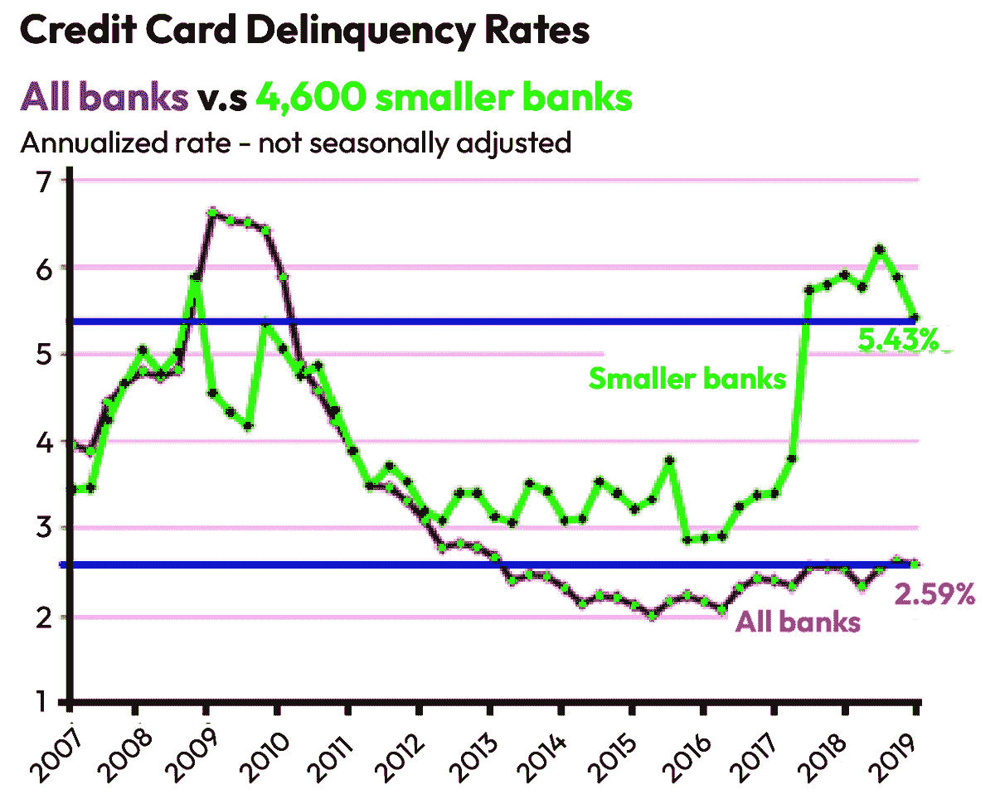
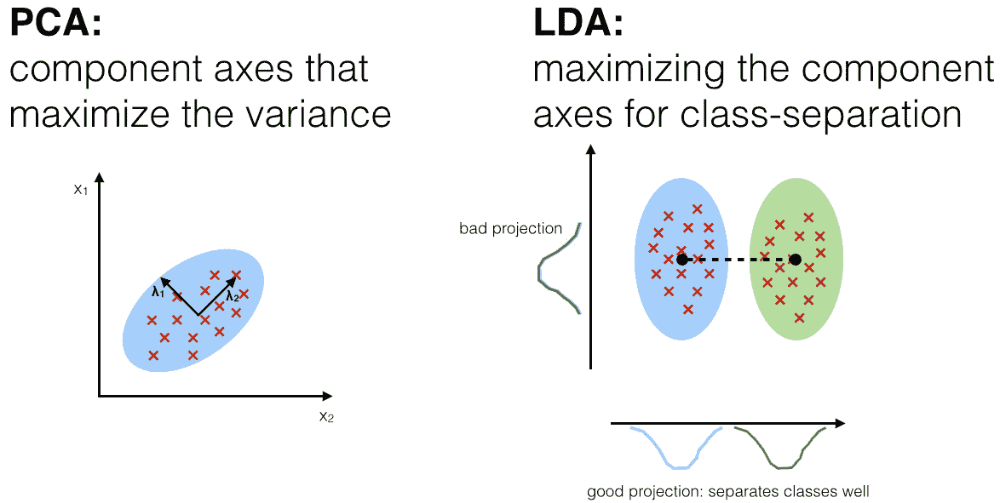
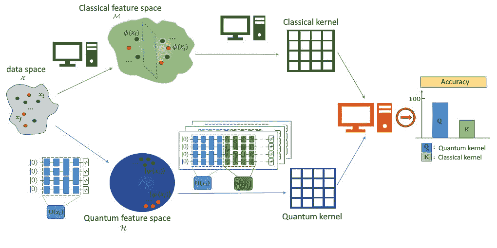
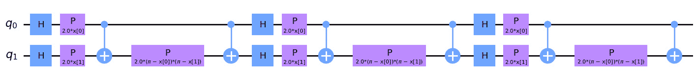
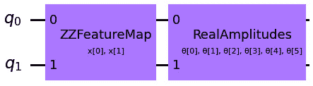
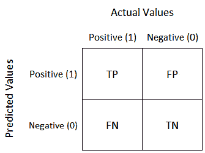
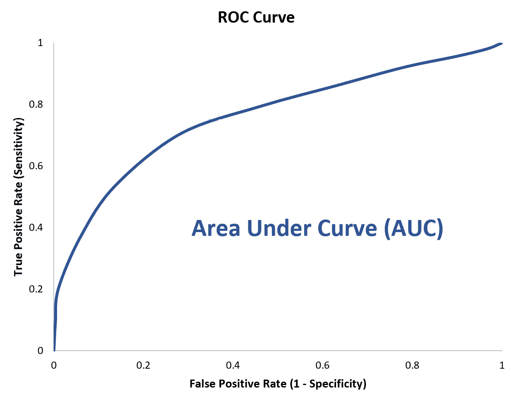
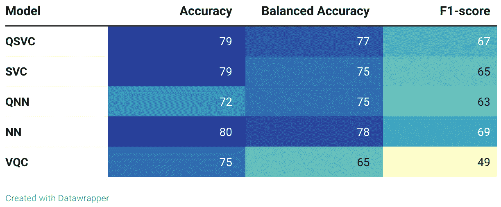

# 信用风险分析

信用评分、欺诈检测、客户流失预测、信用额度定义和金融行为预测（等）是银行和金融机构面临的持续挑战，这些机构不断研究如何提供更准确的结果以及降低与业务相关的风险。在提供服务时，大部分这些问题可以通过使用机器学习来解决，例如对可能不会按时支付账单或可能实施欺诈的用户进行分类。在本章中，将探讨这些场景中的量子机器学习方面，针对大多数案例使用与经典算法的恒定基准进行比较。

在当前的经济形势下，市场稳定性不可预测，人们的工作方式也在不断变化（得益于“零工经济”的崛起），因此在不增加企业风险的情况下，很难扩大信用产品组合并覆盖更多客户群体。并行探索 QML 和 ML 方法可以提升不同银行、新银行、金融科技公司及其他金融机构现有的决策架构，这些机构在结构中考虑了向公司或个人提供贷款的可能性。

如前所述，机器学习作为一种替代方案非常适用于我们拥有证据（数据）但无法手动完全掌握潜在模型或逻辑的情况。解决这类项目的最著名机器学习技术之一与监督学习相关。信用评分系统是金融决策方法中常见的一部分。它们使用提升决策树（LGBM 和 XGBoost）、随机森林、支持向量机、聚类方法和一些回归模型来得出可用于做出决策和自动评分的结果。同样，QML 算法也可以在相同的场景下进行测试和比较，最终提供业务优势。量子领域中的典型分类算法包括**量子神经网络**（**QNNs**）、**量子支持向量分类器**（**QSVCs**）和**变分量子分类器**（**VQCs**）。本章中表达的代码和理论可以帮助数据科学部门或金融领域的机器学习相关专业人员，帮助他们通常试图改进模型，寻找确定正确方法以从现有计算能力中提取更多利益的途径。

在本章中，我们将使用合成数据集（这些数据集是实际公司或数据点的统计复制品）表示的经典数据，比较机器学习和量子机器学习算法。目标是根据金融行为评估其信用评分。此外，我们还将分析数据集的特征，并探讨使用合成数据的影响。最后，我们将深入探讨模型评估技术。

本章的主要内容包括以下几个主题：

+   信用风险分析的相关性

+   执行机器学习和量子机器学习模型的数据探索和准备

+   经典与量子机器学习算法的实现

+   量子支持向量机

# 信用风险分析的相关性

为了提供更广泛的背景并理解解决金融领域分类问题的相关性，本书的这一部分需要定义一些核心概念，尽管从高层次的角度来看也很重要。在本章的背景下，“信用风险”一词是指如果借款人在某个日期之前未能偿还贷款，贷方可能会损失资金的风险。随着信用卡业务的迅速增长，如*图 6**.1*所示，以及金融参与者多年来的扩展，扩大目标人群的范围的挑战需要更为复杂的承销系统。如果评估这些风险的手段不够准确，那么这将使大量金融机构面临风险。

鉴于前述情况，通常需要关注那些信用历史较少或没有信用记录的客户的信用风险，以扩大现有的客户群体并在尚未开发的市场中找到盈利机会。信用决策系统的另一个挑战是，大多数与信用卡或贷款客户相关的历史数据集存在不平衡问题，因为通常情况下，按时未付款的客户比例相较于整体样本来说较小。然而，这一情况可能会发生变化，取决于所在国家及金融机构如何设置目标社会和经济结构。因此，在开始任何预测性质的项目之前进行合理的数据分析至关重要，因为这将直接影响到业务收入。识别不平衡、偏差或不完整的信息是任何数据驱动项目中的基础部分，无论它是经典的还是与量子相关的。

市面上大多数机器学习系统都经过了广泛的测试，并且众所周知，在某些情况下，它们可以准确估算可能违约的借款人或信用卡支付者的数量。自 2000 年代初以来，机器学习领域经历了巨大的发展，现在用于信用评分策略的模型能够更好地帮助大中型银行，通过深入的客户和潜在客户信用检查，主要是利用技术来优化决策结构，从而确保假设的风险在可接受的范围内，这个范围可能会根据所属机构的类型而有所不同（见*图 6**.1*和[`wolfstreet.com/2019/05/22/subprime-profit-machine-hiccups-credit-card-charge-offs-rise-in-the-banking-system/`](https://wolfstreet.com/2019/05/22/subprime-profit-machine-hiccups-credit-card-charge-offs-rise-in-the-banking-system/)）。



图 6.1 – 新玩家尝试扩大其投资组合的年度风险

私营企业中的数据科学与分析部门正在寻找更准确、高效的方式来衡量信用风险（Crouhy 等，2000；Crook 等，2007）。目前，许多金融机构正在研究量子机器学习方法，帮助它们做出更好的决策并为大量客户定制产品。像西班牙的 CaixaBank、巴西的 Itaú Unibanco、巴西的 alt.bank 和葡萄牙的 Rauva 等银行，专门寻找 **QML** 方法在风险或客户保持（行业文献中也称为 *客户流失*）相关的分类挑战中的优势，使用混合量子经典算法。此外，西班牙的 BBVA、法国的 Crédit Agricole、美国的 Citi、英国的 Barclays、美国的 JP Morgan、加拿大的 Royal Bank of Canada、美国的 Wells Fargo 和英国的 HSBC 等银行，也在研究并使用这项新技术的不同策略。

# 执行机器学习（ML）和量子机器学习（QML）模型的数据探索与准备

如前所述，在本章中，我们将引导您实现混合量子经典算法，并展示它们在金融实际场景中的表现，但在您开始在专业环境中使用它们之前，您应该思考——或者至少回顾——以下一些概念。

**数据丰富化**是指通过额外的信息来充实或补充现有的数据集。在信用评分系统的背景下，数据丰富化是利用额外的数据源来补充可能来自信用机构或非传统来源（例如，移动数据挖掘）的附加变量和特征，以提高信用风险评估的准确性。

通过引入如公共记录（数字足迹）、社交媒体行为、财务历史、开放金融及其他替代数据源，数据丰富化可以帮助弥合信息空白，从而对客户进行全面分析。例如，贷款机构可能会利用第三方服务，通过获取金融机构、税务机关和信用卡机构的数据来验证借款人的工作、收入和资产。

通过引入来自信用报告机构的新数据，债权人可以在评估信用 worthiness 时做出更加明智的选择，从而降低违约或拖欠的风险。此外，数据丰富化可以帮助贷款机构识别新的客户类别，并根据借款人资料定制更个性化的解决方案。

总结来说，信用评分系统的典型数据源可以归纳为三大类：

+   **内部数据**：大多数金融机构会向当前使用支票账户或活期账户的客户提供信用。分析这种行为应作为进一步决策的基础。

+   **金融行为数据**：获取所有评估组织或个人金融行为所需的财务数据，考虑其支付历史、风险评分、当前债务、人口统计信息以及当前使用的金融产品。

+   **开箱即用的数据**：这包括来自不同来源的数据，而不是传统信用局（例如，Equifax）的来源。众所周知，一些金融机构使用心理因素、智能手机元数据和用户的数字足迹，在决策模型中加入大量的变量和特征。

## 特征分析

特征分析是确定影响机器学习模型表现的最重要因素或特征的过程。在信用评分系统的背景下，特征分析是发现最具预测性的特征的过程，这些特征可以用来做出正确的信用决策，并正确区分潜在的良好或不良付款人。

采用机器学习的信用评分模型通常会融入多种特征或描述性变量，包括支付历史、信用使用、信用年限和使用的信用类型。然而，并非所有这些特征在预测信用风险时的影响力都是相同的，有些特征可能比其他特征具有更大的影响。

特征分析有助于识别影响信用风险的最重要变量，并在模型中对它们进行优先排序。可以使用多种方法，包括相关性分析、决策树和梯度提升算法，来确定具有最高预测潜力的特征。

通过集中关注最重要的变量，信用评分的机器学习模型可以提高精度，并降低违约或拖欠的风险。特征分析还可以帮助贷方通过增强对信用风险决定因素的理解，制定更量身定制的风险管理策略。

需要记住的是，特征分析技术是一个持续的过程，最相关的因素可能会随着经济条件、客户行为和其他变量的变化而变化。因此，信用评分的机器学习模型必须不断更新和调整，以应对信用风险不断变化的本质。

执行特征分析时，最著名的策略和方法如下：

+   **特征选择**：这是一个非平凡的过程，视具体情况而定，可能对最终结果产生巨大影响。关于机器学习项目有一个误区，即更多的数据和变量总是好的，这固然是对的，但并非所有信息都对机器学习模型有用。在某些情况下，减少特征反而能实现更好的预测（Ji 等人）。执行这些过程时，有一些技术考虑使用遗传算法，或者简单地分析特征的重要性、相关性和方差，以决定哪些特征对预测过程更有价值。通常，这一阶段包含在数据科学过程中，称为**探索性数据分析**（**EDA**），它涉及调查数据集，从中提取最佳数据作为后续操作的输入。

+   **特征工程**：一旦数据和特征可用，原始变量可能不足以在特定目标或关键人口统计下取得良好的结果。如果是这样，你可能需要构建新的特征，这些特征可以通过对原始变量的计算得到（例如，如果我们有客户的交易数据，可以生成额外的特征，考虑交易的平均值，以及中位数、最大金额和最小金额）。这些新列可能对机器学习模型的**关键绩效指标**（**KPIs**）产生重大影响。

## 数据预处理

修改和准备数据以供机器学习模型使用的过程称为数据预处理。在信用评分系统中，数据准备包括清理、转换和准备信用数据，以便可以高效地用于训练机器学习模型。

信用数据有时可能不完整且杂乱无章，缺失数字、格式不一致以及其他可能阻碍机器学习模型有效性的困难。数据准备技术可以帮助解决这些问题，并为建模做好数据准备。

通过利用数据预处理方法，信用评分的机器学习模型可以更高效地训练，并产生更准确的结果。以下是两种最相关的方法：

1.  **过采样**：金融数据集通常存在目标变量不平衡的情况，模型预测的目标变量在不同类别间的分布可能严重偏差。例如，95%的非违约者和 5%的违约者可能会给机器学习架构带来很大的困难。为了缓解这一问题，有不同的技术可以增加其中一个类别的样本，或是提供更多原始数据集的统计副本。一种典型的策略是使用**合成少数类过采样技术**（**SMOTE**）或一般的合成过采样，并应用若干子策略。通过使用这些技术，可以平衡金融数据集，代表良好和不良支付者的相等比例，因此，机器学习训练过程中的数据点和模式分析将受到积极影响。

1.  **编码**：通常，数据有不同的形式和数据类型。为了能够在机器学习（ML）或量子机器学习（QML）算法中处理这些数据，我们需要确保所有特征都是数值型的，而其中一部分变量通常是分类变量。为了继续处理，我们有几种方法可以将分类数据编码为数值数据，例如独热编码、标签编码、二进制编码和特征哈希。此外，QML 模型面临的挑战是将经典数据样本转化为量子态，这本身就是一个完整的研究领域。在我们即将探索的技术领域中，我们将探讨一些常见的嵌入和特征映射，但请记住，关于如何解决编码问题，存在许多不同的技术，从基本的特征映射到**量子生成对抗网络**（**qGANs**），例如在*第四章*中我们看到的股票价格分布案例中的嵌入技术。

在接下来的子章节中，如前所述，主要的重点将放在模型的实现上，并应假设数据集已经根据所有前述概念进行准备。

## 真实商业数据

在量子机器学习（QML）应用于行业案例时，面临的一个障碍是缺乏使用代表性数据的开源示例，无法重现真实的商业场景。大多数教程和开源代码库使用演示数据集来展示模型架构，通常得到的有趣结果很难重复。在本章的练习中，我们将使用真实中小型企业财务行为的合成副本，以便结果和数据处理能够真实地模拟一个银行或金融科技场景，按客户的财务风险进行分类。

## 合成数据

根据像 Gartner 这样的专家的说法，合成数据旨在彻底改变人工智能（[`www.gartner.com/en/newsroom/press-releases/2022-06-22-is-synthetic-data-the-future-of-ai`](https://www.gartner.com/en/newsroom/press-releases/2022-06-22-is-synthetic-data-the-future-of-ai)）。经过现实世界数据样本训练的数据生成器能够创建与原始数据点在统计学上相似的合成数据点样本。模型首先发现样本数据的模式、关联和统计特性，然后它可以生成与这些样本相似的虚假样本。它基本上是与深度伪造技术背后使用的技术相同，只不过在这里用于企业的表格数据。使用合成数据的一个好处是能够通过修复偏差、数据样本平衡和缺失数据来优化原始数据集，因为生成器能够通过学习特征之间的关系来克服这些问题，从而生成一个现实的数据样本（Figueira 等人）。当客户数据涉及到过程中时，这一点尤为重要，因为这可能会带来隐私相关的问题，给已经复杂的分析项目增添负担。幸运的是，考虑到合成数据不指向特定个体，如果正确合成，它将不受任何监管限制。

合成数据看起来与用于训练算法的实际数据样本相同，并且具有相同的意义。由于合成数据集包含与原始数据相同的洞察和关联，它是原始数据的一个很好的替代品。考虑到这一点，提取的信息可以安全地用作训练数据，以构建机器学习模型和测试数据，例如在测试信用评分或欺诈检测系统时（Assefa 等人）。

这种方法生成新数据的主要好处如下：

+   它避免了**通用数据保护条例**（**GDPR**）和其他法律约束，当数据在机构之间共享或仅用于在不同环境下训练机器学习模型时，不会出现个人身份信息（PII）泄露的风险。

+   它能够更高效地检测异常值，例如欺诈行为。欺诈行为是银行所追踪的所有活动中的一小部分。由于数据量庞大，机器学习模型很难从这类数据集中学习，以识别新的欺诈实例，可能会导致不准确的发现。欠采样和过采样是处理不平衡数据集的两种方法。欠采样是指删除（在本例中）非欺诈性观察数据，以获得平衡的数据集。相反，过采样通过生成新的欺诈行为示例来模拟真实的欺诈行为。然后，机器学习模型可以在平衡的数据集上进行训练，从而提供更精确的结果。为了获得平衡的数据集，可以采用合成数据生成方法来生成虚构的欺诈案件。

+   它改善了现有的机器学习模型，因为与监督学习和深度学习相关的大多数算法通常对数据量有较高的需求。即使金融机构拥有足够的数据来训练机器学习模型，数据量对模型准确度有着显著影响。合成数据可以极大地扩展数据集的规模。

## 案例研究。

本章将应用的练习基于来自**中小型企业**（**SMBs**）的合成公共数据，这些数据由公司 NayaOne 在 Kaggle 数据科学平台上发布（[`www.kaggle.com/datasets/nayaone/sme-uk-businesses-financial-statistics`](https://www.kaggle.com/datasets/nayaone/sme-uk-businesses-financial-statistics)）。数据框架的结构由 10 个不同的 CSV 文件组成，每个文件包含关于公司不同方面的信息，具体如下：

+   应收账款：指客户为已开票商品或服务所欠的款项。

+   企业：公司及其详细信息的列表。

+   COVID：公司在疫情波动期间的财务数据。

+   信用账户历史：指信用账户的历史记录。

+   信用卡历史：包含公司信用卡活动及相关债务的记录。

+   信用评级：对借款人总体或相对于财务义务的信用状况的定量评估。

+   董事：来自英国的个人，在数据集中的企业中担任董事职务。

+   保理：与公司将其应收账款以折扣价出售给第三方的过程相关的数据，这是一种债务融资方式。

+   贷款：公司已偿还和未偿还贷款的详细信息。

当所有 CSV 文件合并时，它们总共有 269 个变量。决定公司是否为“良好”或“不良”付款人的目标变量是基于公司在拥有债务时的实际行为，将它们划分为四个不同的类别，具体如下：

+   **潜在违约者（贷款方面）**：在贷款的语境中，如果贷款分期付款中至少有一次延迟支付，则债务被视为逾期。

+   **潜在违约者（信用卡方面）**：如果信用卡账户中至少有一次支付延迟，则该账户被视为逾期。

+   **违约者**：当贷款状态变量记录为“违约”时，公司被视为已违约。

+   **拖欠付款者**：对于过去五年内有超过四次逾期付款的公司，分配了拖欠标记。

所有这些先前的规则在 71.46%的案例中定义了中小型企业的良好行为，在其余 29.54%的案例中定义了不良行为。当然，按照惯例，所有用于计算目标类变量的变量都已从数据集中删除，以避免高度相关的特征。

## 数据提供者。

NayaOne 是一家来自英国的颠覆性初创公司，成立于 2019 年。其革命性的目标是提供一个单一的访问点，获取数百甚至数千个合成数据点，使得金融行业的机器学习模型能够在不必等待数月才能获得专有数据的情况下构建。通过使用 NayaOne 的平台，每个保险科技、金融科技或银行都可以在几周内而不是几个月或几年内原型化机器学习模型或架构。

除了能够更快原型化并匹配理想的市场时间外，实验成本至少能减少 80%。

## 特征

用于模型的特征领域如下，基于 EDA（探索性数据分析）和特征选择分析：

+   `primary_sector`

+   `factoring_provider`

+   `revenue`

+   `cant_invoices`

+   `payment_index`

+   `new_recruitments`

最后，经过所有技术应用后，选择了 164 个特征作为训练模型时非常重要的特征。

# 在信用评分场景中实现经典与量子机器学习算法

将机器学习和量子机器学习应用于信用评分挑战需要开发一个预测模型，该模型能够正确判断个人或公司是否具备信用。通常，这个过程如前述步骤所示，包含数据收集、数据丰富、数据准备、特征工程、特征选择、模型选择、模型训练、模型评估，以及随后的部署。在本节中，我们将覆盖大部分之前的概念和步骤，假设数据已经被编码为数值变量，且特征已被选择。

## 数据准备

首先，需要加载数据。这些数据将以行业内较为知名的格式之一——CSV 格式出现。正如前面详细说明的那样，加载到笔记本中的信息是经典格式，因此我们可以使用 pandas 和 scikit-learn 来处理我们架构的第一步，而不会遇到问题。

预处理的第一步是加载 CSV，定义实验的 *X* 和 *y* 值，随后再拆分训练集和测试集：

```py

import pandas as pd
# Data loading from a CSV file
fulldata = pd.read_csv('../../data/nayaone_synthetic_data.csv')
# Transforming data to float
data = fulldata.astype(float)
data.head(10)
```

目前，为了加载数据，重要的是将数据集拆分为两组——一组用于训练模型，另一组用于评估模型的拟合度。通过使用从未用于训练模型的数据集，我们旨在设定切实的衡量标准，以便当我们的模型在真实世界中运行时能够应对真实数据的到来。这个数据集已经包含了从合并的 CSV 文件中拆分这两组的标识符：

```py

data_train = data.groupby([data.index,'train']).filter(lambda x: x['train'] == 1.).reset_index()
data_test = data.groupby([data.index,'train']).filter(lambda x: x['train'] == 0.).reset_index()
```

在此之后，将这两个集合拆分为特征和目标属性就变得简单了。需要移除那些不包含相关信息或者可能会在进一步的测试集上虚假预测我们模型能力的列，因为标签信息已经被编码，这些列就不再是我们模型在实际中能够获取的属性：

```py

# Separate X and y considering dropping not useful columns
X_train = data_train.drop(['target', 'Unnamed: 0', 'train'] ,axis="columns")
y_train = data_train['target']
X_test = data_test.drop(['target', 'Unnamed: 0', 'train'] ,axis="columns")
y_test = data_test['target']
```

始终检查目标变量的分布非常重要，因为如果目标变量高度不平衡，可能会导致模型走向一个简化的决策，即所有样本都被视为大多数样本的类别。在这种情况下，可能需要其他过采样技术来提高模型性能，并使其与数据集中的不同样本组之间保持平衡。在此处展示的示例中，数据集已经足够平衡（我们的两个主要类别之间为 70-30），以便为接下来的部分做准备，这些部分与模型的架构相关：

```py

# Review the balance of the target variable in train
y_train.value_counts(normalize=True)*100
0.0    69.953052
1.0    30.046948
# Review the balance of the target variable in test
y_test.value_counts(normalize=True)*100
0.0    71.636364
1.0    28.363636
```

## 预处理

预处理阶段是任何机器学习项目和模型架构中最重要的步骤之一。在混合量子-经典算法中，输入也需要从经典特征转变为量子状态，通常称为量子编码或量子嵌入。在本节中，这些概念将被详细解释，但首先我们将重点介绍将在量子编码部分扩展的经典预处理方法。

在获得训练和测试数据集后，预处理步骤，特别是降维，将会进行。如前所述，并非所有属性都具有相同的信息量，因此集中大部分信息至关重要，以避免在模型中增加不必要的负担，特别是在确定特征的相关性时。例如，基于树的模型会考虑每个属性所提供的信息增益（Tangirala 2020），而神经网络则会将那些不有助于改善决策的属性权重变为零。然而，某些技术，如我们将要探讨的那些技术，缺乏这种能力，因此我们需要进行合理的处理，减轻后续模型训练步骤的工作量。

在这方面可以使用一些技术，在量子机器学习（QML）的背景下，它们减少了需要编码到量子设备中的变量数量，从而减少了运行分类任务所需的量子比特。请记住，这一点也很重要，因为一些量子设备的能力有限，通常只有 10 或 100 个量子比特，而数据集可能包含每个数据点成千上万个特征。

最常用的两种技术如下：

+   **主成分分析 (PCA) (Bro & Smilde 2014)**：通过分析协方差矩阵并将其表示为不同特征之间的线性组合，从而生成正交轴或主成分，PCA 提供了一种排序方式，其中底部的主成分可以被去除，因为它们编码的信息量最小。通过这种技术，我们可以定义一个参数来提取所需的成分或特征，唯一的限制是特征数量不能超过原始变量的数量。

+   **线性判别分析（LDA）(Izenman 2013)**：LDA 是一种监督算法，通过考虑类别标签来减少特征空间。LDA 聚焦于目标可分性，尝试定义更好地映射该可分空间的特征。如果使用 LDA，则特征数的减少有一个限制，因为 LDA 最多只能提供 N − 1，其中 N 是可用的类别数。

*图 6.2* 中的示意图突出了两种技术之间的主要区别。在这种情况下，将使用 LDA，因为它有着超越 PCA 的证明记录，并且使用较少的量子比特和二分类（Mancilla 和 Pere 2022）。主要的限制是，之前，数据库已经被划分，目的是从每个集合中提取多个组件，并且至少为接下来的 2 量子比特方法提供两个组件。



图 6.2 – PCA 与 LDA 的比较

图片来源：[`sebastianraschka.com/Articles/2014_python_lda.html`](https://sebastianraschka.com/Articles/2014_python_lda.html)

为了简化，`X_train` 和 `X_test` 将被平分，50%的特征分配给`features_a`集合，其余分配给`features_b`。由于我们有 167 个特征，83 个特征将分配到一半，84 个特征分配到另一半。强烈建议用聚类、变量类型分组、数据源或相关性定义来替代此过程：

```py

# Hard split by half on the dataframe for the LDA dimensionality reduction
# Train split
features_a = X_train.iloc[:,:83]
features_b = X_train.iloc[:,83:]
# Test split
features_a_test = X_test.iloc[:,:83]
features_b_test = X_test.iloc[:,83:]
from sklearn.discriminant_analysis import LinearDiscriminantAnalysis as LDA
# LDA fit with the separated groups
lda1 = LDA(n_components=1, solver='svd').fit(features_a, y_train)
lda2 = LDA(n_components=1, solver='svd').fit(features_b, y_train)
# LDA train transformation
features_lda_1 = lda1.transform(features_a)
features_lda_2 = lda2.transform(features_b)
# LDA test transformation (using train fit)
features_lda_1_test = lda1.transform(features_a_test)
features_lda_2_test = lda2.transform(features_b_test)
# Arrays to dataframe for join in a single dataframe
features_lda_1 = pd.DataFrame(features_lda_1)
features_lda_2 = pd.DataFrame(features_lda_2)
features_lda_1_test = pd.DataFrame(features_lda_1_test)
features_lda_2_test = pd.DataFrame(features_lda_2_test)
# Join of dataframes
x_train_lda = pd.concat([features_lda_1, features_lda_2], axis=1)
x_test_lda = pd.concat([features_lda_1_test, features_lda_2_test], axis=1)
```

另一个常见的因素是尺度差异。重要的是，我们的模型应该对尺度保持无关，并能够专注于我们特征中编码的信息。在处理神经网络时，这一点尤其重要，因为归一化总是有助于它们的收敛。

在这种情况下，我们将把信息复制到不同的数据框中，并调整为我们将在接下来的部分中使用的目标技术：

```py

from sklearn.preprocessing import StandardScaler, MinMaxScaler, normalize
## QSVC
minmax_scaler = MinMaxScaler().fit(x_train_lda)
X_train_qsvc = minmax_scaler.transform(x_train_lda)
X_test_qsvc = minmax_scaler.transform(x_test_lda)
## SVC
strd_scaler = StandardScaler().fit(x_train_lda)
X_train_svc = strd_scaler.transform(x_train_lda)
X_test_svc = strd_scaler.transform(x_test_lda)
## VQC
strd_scaler = StandardScaler().fit(x_train_lda)
X_train_vqc = strd_scaler.transform(x_train_lda)
X_test_vqc = strd_scaler.transform(x_test_lda)
y_train_vqc = pd.DataFrame(y_train)
y_test_vqc = pd.DataFrame(y_test)
## Quantum Neural Network
minmax_scaler = MinMaxScaler().fit(x_train_lda)
X_train_nn = minmax_scaler.transform(x_train_lda)
X_test_nn = minmax_scaler.transform(x_test_lda)
y_train_nn = y_train.to_numpy()
y_test_nn = y_test.to_numpy()
```

需要强调的是，这一转换应该仅影响数据的尺度，因为它们的分布以及与数据集每个样本相关的不同属性之间的关系应保持不变。它主要影响每个算法的训练方式，试图通过缩放信息来简化这一任务（Singh 和 Singh 2020）。

# 量子支持向量机

**支持向量分类器**（**SVC**）和**量子支持向量分类器**（**QSVC**）是我们将用于分析合成数据集的第一个模型，我们将看到量子算法与经典算法如何协作，以识别潜在的违约客户。最常用的技术之一被称为**支持向量机**（**SVM**）（*Hearst 等, 1998*），它利用超平面来找到我们数据范围内的可分空间。这些超平面负责将我们的 N 维信息划分到不同的空间中，力求最大化超平面本身划分区域之间的样本间隔。通过放宽这一间隔约束并允许某些样本被错误分类，我们使得模型能够从数据集本身进行泛化。这个放宽版本就是我们所称的 SVC。

多亏了像 scikit-learn 这样的 Python 库提供的抽象级别，其使用就像调用一个拟合函数来传递数据集和目标数据一样简单：

```py

from sklearn.svm import SVC
# Instantiate the SVC
svc = SVC()
# Training
svc.fit(X_train_svc,y_train)
# Testing
svc_score = svc.score(X_test_svc, y_test)
print(f"SVC classification test score: {svc_score}")
SVC classification test score: 0.7927272727272727
```

如前所述，除了关注单一指标之外，还需要注意相关的度量标准，以帮助我们更好地理解模型的实际适应度：

```py

from sklearn import metrics
# Classification report of SVC
expected_y_svc  = y_test
predicted_y_svc = svc.predict(X_test_svc)
# Print classification report and confusion matrix
print("Classification report: \n", metrics.classification_report(expected_y_svc, predicted_y_svc))
Classification report:
               precision    recall  f1-score   support
         0.0       0.85      0.85      0.85       194
         1.0       0.65      0.65      0.65        81
    accuracy                           0.79       275
   macro avg       0.75      0.75      0.75       275
weighted avg       0.79      0.79      0.79       275
```

这时，数据集不平衡性的问题便显现出来，我们可以看到模型的准确度主要取决于我们识别非违约客户的能力。

鉴于支持向量机（SVM）的性质及其对空间可分性的要求，量子机器学习领域最初的一个提案本质上利用了量子态所提供的固有高维编码。**量子支持向量机**（**QSVMs**）（Rebentrost 等，214）将经典数据编码到量子态中，以便在获得测量结果后，编码的样本表现出更好的可分性——在这种情况下，是通过经典方式来实现的。

QSVM 方法的主要优点之一是数据点如何在量子特征空间中表示，这得益于量子核函数的使用（在*图 6.3*中可视化）。通常，企业会遇到非线性可分的数据，而经典核方法不足以在二分类模型中正确划分两个类别。通过使用量子核函数，数据点可以被分布在一个希尔伯特空间中，从而使得它们能够通过算法（SVC）更高效地进行划分。在*图 6.3*中，您可以看到展示两种方法（经典和量子）及数据如何在不同特征空间中表示以实现线性可分性的工作流的可视化示例（[`quantum-journal.org/papers/q-2021-08-30-531/`](https://quantum-journal.org/papers/q-2021-08-30-531/)）。



图 6.3 – 经典和量子核函数如何嵌入数据点的比较

因此，当我们尝试 QSVM 分类器时，首先需要面对的步骤之一是将经典数据编码成特征图，以便为我们执行实际的量子编码。我们可以选择多个选项，所获得的收益将来自于对每个特征图执行的重复次数的任意决定。这是数据科学项目中常见的问题，一些决策将基于给定数据集或场景的经验。

简单来说，量子特征图通过使用量子电路将常规数据编码到量子态空间中。在编码过程中，电路重复的次数被称为“深度”，它是一个可以改变的参数。对经典数据进行 QML 处理要求将数据编码成量子态，之后应用到量子算法中。

Qiskit 提供了一组候选特征图，我们可以用于运行分类模型的任务。它们中的大多数基于保利算符，按我们的数据特征进行旋转。这也是为什么数据需要预处理的原因，以便将其数值表示作为旋转角度引入到我们的特征图中。使用沿每个量子比特 Z 轴的组合 Z 旋转是一个常见的情况，如下所示：

```py

from qiskit.providers.aer import AerSimulator
from qiskit.utils import QuantumInstance
from qiskit.circuit.library import ZZFeatureMap
# Defining backend and feature map to be used
backend = QuantumInstance(
     AerSimulator(method='statevector'),
    seed_simulator=algorithm_globals.random_seed,
    seed_transpiler=algorithm_globals.random_seed,
)
# ZZ feature map
feature_map = ZZFeatureMap(feature_dimension=num_qubits, reps=3)
# Feature map circuit print
feature_map.decompose().draw(output = "mpl")
```

reps 指的是特征图重复的次数，它是我们可能需要调整的超参数之一，以便找到最佳选项。*图 6.4*展示了我们选择的特征图的表示形式，它由一组比率（粉色的 P 门）和纠缠的 CNOT 门组成。



图 6.4 – 带有三种重复方案的 ZZ 特征图

*图 6.4*中的*X*变量代表我们的数据集特征，它们作为旋转权重，驱动电路的初始状态（对于 2 量子比特的情况是|00>）朝向输入到我们 SVC 分类器中的状态。

Qiskit 还为这些 QML 任务提供了更高层次的抽象，因此不需要为已知的技术编写完整代码，这在 QSVM 中是常见的情况：

```py

from qiskit_machine_learning.kernels import QuantumKernel
from qiskit_machine_learning.algorithms import QSVC
# Defining quantum kernel and qsvc
kernel = QuantumKernel(feature_map=feature_map, quantum_instance=backend)
qsvc = QSVC(quantum_kernel=kernel, C=C)
# Training
qsvc.fit(X_train_qsvc,y_train)
# Testing
qsvc_score = qsvc.score(X_test_qsvc, y_test)
print(f"QSVC classification test score: {qsvc_score}")
QSVC classification test score: 0.7927272727272727
```

即使看起来结果相同，我们也可以像之前一样检查分类报告：

```py

# Classification report of QSVC
expected_y_qsvc  = y_test
predicted_y_qsvc = qsvc.predict(X_test_qsvc)
# Print classification report and confusion matrix
print("Classification report: \n", metrics.classification_report(expected_y_qsvc, predicted_y_qsvc))
Classification report:
               precision    recall  f1-score   support
         0.0       0.88      0.82      0.85       194
         1.0       0.63      0.73      0.67        81
    accuracy                           0.79       275
   macro avg       0.75      0.77      0.76       275
weighted avg       0.80      0.79      0.80       275
```

我们可以看到一些决策已经在不同类别之间移动，在某些情况下损失了精度，但通过简单的编码，我们可以将违约检测率提高两个百分点。

这可能看起来是一个小幅度的提升，但考虑到本章开头看到的图示，2%的检测率提升在收入方面是一个巨大的改进。鉴于从经典领域的适配非常简单，这绝对是值得尝试的技术。

## QNNs

按照与前面比较相同的结构，我们将通过量子和经典神经网络处理我们的良好客户和违约者数据集。各种形态的神经网络几乎在所有企业尝试的机器学习项目中都有应用（*Bishop 1994*）。这些模型适用于各种任务，并且其通用框架允许为特定任务定制各种架构——卷积神经网络用于人工视觉（*Khan 等，2018*），递归神经网络用于自然语言理解（*Yao 等，2013*），或生成对抗网络用于合成数据生成（*Park 等，2018*）。

风险评估在类似的练习中也有所涉及（*Khashman 2010*），因此，鉴于这些是流行的选择，我们至少需要尝试一下。流行的 Python 框架，如 TensorFlow，以及它的高级抽象（得益于 Keras），简化了训练生物启发式时尚模型所需的大部分代码。以下代码遵循一种架构，其中输入数据通过一系列层（神经元数目逐渐减少：60、40、20 和 1）传递，直到最后一层的输出决定输入样本所属的类别。这就是为什么在最后一步定义了 Sigmoid 函数。

在这个示例中，我们选择了密集连接的层，**修正线性单元**（**ReLU**）作为神经元的选择（*Agarap 2018*），但如前所述，这些决策并不是由任何特定过程驱动的，而是通过经验和在类似情境中经过试验成功的架构来决定的：

```py

# Keras
from keras.models import Sequential
from keras.layers import Dense
# Fit the model with specific layers and activations
model = Sequential()
model.add(Dense(60,input_dim=X_train_nn.shape[1],activation='relu',kernel_initializer='normal'))
model.add(Dense(40,activation='relu'))
model.add(Dense(20,activation='relu'))
model.add(Dense(1,activation='sigmoid'))
# Model compiled
model.compile(loss='binary_crossentropy', optimizer='adam', metrics=['accuracy'])
history = model.fit(X_train_nn, y_train, batch_size=batch,
                 epochs=50, validation_data = (X_test_nn, y_test),verbose=1)
```

训练将产生一个高准确度（超过 90%）的评分，但测试数据集才是提供模型预测能力现实预期的关键：

```py

# Testing
nn_score = model.evaluate(X_test_nn, y_test)
print("NN test accuracy score: %.2f%%" % (nn_score[1]*100))
NN test accuracy score: 80.36%
# Classification report of NN
expected_y_nn  = y_test
predicted_y_nn = (model.predict(X_test_nn) > 0.5).astype("int32")
# Print classification report and confusion matrix
print("Classification report: \n", metrics.classification_report(expected_y_nn, predicted_y_nn))
Classification report:
               precision    recall  f1-score   support
         0.0       0.86      0.87      0.86       194
         1.0       0.67      0.65      0.66        81
    accuracy                           0.80       275
   macro avg       0.76      0.76      0.76       275
weighted avg       0.80      0.80      0.80       275
```

尽管准确性看起来有所提高，但我们牺牲了识别非违约者和违约者的能力，尽管这样能提供更均衡的数据集，但对于我们的业务需求来说，并不如我们期望的那样高效。

鉴于我们已经通过之前使用 ZZFeatureMap 的练习解决了编码问题，最好有一种方案，可以将整个模型嵌入到量子设备中，这样一旦数据以此特征映射表示，量子设备解开复杂关系的能力就能得到充分利用。这可以通过 QNNs（*Ezhov 和 Ventura，2000 年，以及 Farhi 和 Neven，2018 年*）来实现，这是一种数据嵌入，随后是**参数化量子电路**（**PQC**）或 ansatz，其测量结果决定了每个样本所属的类别：

```py

from qiskit import QuantumCircuit
from qiskit.circuit.library import ZZFeatureMap, RealAmplitudes
# Declare the feature map
feature_map = ZZFeatureMap(num_inputs)
# Declare the ansatz
ansatz = RealAmplitudes(num_inputs, reps=2)
# Construct the quantum circuit
qc = QuantumCircuit(num_inputs)
qc.append(feature_map, range(num_inputs))
qc.append(ansatz, range(num_inputs))
qc.decompose().draw('mpl')
```



图 6.5 – 通过前述代码获得的 QNN

如在获得的电路中所见，特征映射只有两个输入，分别来自我们数据集中的特征，但 PQC 有五个参数，我们需要确定这些参数才能继续进行。执行这一任务的方法是通过变分调整 QNN 模型的输出，使其最小化成本函数，即我们标注数据与我们案例中的测量经典比特之间的不匹配。

Qiskit Machine Learning 提供了完整的工具链，帮助我们完成繁重的工作，因此一旦通过这两步（特征嵌入和 PQC）声明了 QNN 结构，我们只需调用一组程序就能为我们获取最终模型：

```py

from qiskit.providers.aer import Aer
from qiskit_machine_learning.algorithms.classifiers import NeuralNetworkClassifier
from qiskit_machine_learning.neural_networks import CircuitQNN
from qiskit.algorithms.optimizers import L_BFGS_B
# Maps bitstrings to 0 or 1
def parity(x):
    return "{:b}".format(x).count("1") % 2
# Defining quantum instance
quantum_instance = QuantumInstance(Aer.get_backend("aer_simulator"), shots=shots)
# Declare the QNN circuit
circuit_qnn = CircuitQNN(
    circuit=qc,
    input_params=feature_map.parameters,
    weight_params=ansatz.parameters,
    interpret=parity,
    output_shape=2,
    quantum_instance=quantum_instance,
)
# Declare the classifier
circuit_classifier = NeuralNetworkClassifier(
            neural_network=circuit_qnn, optimizer= L_BFGS_B(maxiter=maxiter), loss='absolute_error'
)
circuit_classifier.fit(X_train_nn,y_train_nn)
y_pred = circuit_classifier.predict(X_test_nn)
# print classification report and confusion matrix for the classifier
print("Classification report: \n", metrics.classification_report(y_test_nn, y_pred))
Classification report:
               precision    recall  f1-score   support
         0.0       0.90      0.67      0.77       194
         1.0       0.51      0.83      0.63        81
    accuracy                           0.72       275
   macro avg       0.71      0.75      0.70       275
weighted avg       0.79      0.72      0.73       275
```

## VQC

最后，我们将分析使用 VQC 的好处，VQC 只存在于量子机器学习领域，因此无法在相同的原则下进行比较。VQC（*Havlíček et al. 2019*）无非是对先前看到的 QSVC 和 QNN 案例的概括。它允许更广泛地描述前述的关于数据嵌入和电路参数化的概念，但设置要求较低，允许任何架构的部署。唯一的限制是获取我们假设参数的变分性质，并且输出仅限于分类任务。

尽管先前使用过基于 Qiskit 的方法，但对于这种更通用的设置，PennyLane 是我们的首选框架。这主要是因为它的微分编程功能，使得类似于 TensorFlow 和 PyTorch 中推广的数值梯度计算机制成为可能，同时也因为它能访问像 Adam（*Kingma 和* *Ba, 2014*）这样的基于梯度的训练器。

我们的电路设置将遵循与前一个示例类似的描述，但在嵌入和假设选择上有所不同：

```py

# PennyLane
import pennylane as qml
from pennylane import numpy as np
from pennylane.templates.embeddings import AngleEmbedding
from pennylane.optimize import AdamOptimizer
# Device
dev = qml.device('default.qubit', wires = num_qubits)
# Our generic candidate circuit
def circuit(parameters, X_train_vqc):
    for i in range(num_qubits):
        qml.Hadamard(wires = i)
    # Angle embedding for classical embedding
    AngleEmbedding(features = X_train_vqc, wires = range(num_qubits), rotation = 'Y')
    # This will be our PQC of choice
    qml.StronglyEntanglingLayers(weights = parameters, wires = range(num_qubits))
    # And measuring on 0 qubit we will get if it corresponds to one or other label
    return qml.expval(qml.PauliZ(0))
```

`Angle`嵌入将数据集特征编码为*Y*旋转的角度，`StronglyEntanglingLayers`遵循单次旋转和多个 CNOT 纠缠门操作的方案，在所有量子比特之间执行循环连接（Schuld et al. 2020）。

再次强调，电路将连接到 PennyLane 称之为`QNode`的设备：

```py

# QNode: Device + Circuit
vqc = qml.QNode(circuit, dev, diff_method="backprop")
```

PennyLane 允许对训练模型过程中使用的不同功能进行精细控制，这样我们就可以轻松决定经典方法和量子方法之间的混合程度。例如，在下面的这个示例中，经典偏置神经元被添加到 VQC 方案中：

```py

# VQC functions
def variational_classifier(weights, bias, x):
    return vqc(weights, x) + bias
```

偏置效应在添加后允许更广泛的近似范围，因此它应该对我们有利：

```py

def square_loss(labels, predictions):
    loss = 0
    for l, p in zip(labels, predictions):
        loss = loss + (l - p) ** 2
    loss = loss / len(labels)
    return loss
def cost(weights, bias, X, Y):
    predictions = [variational_classifier(weights, bias, x) for x in X]
    return square_loss(Y, predictions)
```

一旦我们的得分损失函数被定义，我们需要定义一个准确度指标，该指标也将作为主循环中参数选择的标准：

```py

def accuracy(labels, predictions):
    loss = 0
    for l, p in zip(labels, predictions):
        if abs(l - p) < 1e-5:
            loss = loss + 1
    loss = loss / len(labels)
    return loss
# Optimizer declaration and batch parameter
opt = AdamOptimizer(stepsize=0.1, beta1=0.9, beta2=0.99, eps=1e-08)
batch_size = batch
weights = weights_init
bias = bias_init
wbest = 0
bbest = 0
abest = 0
for it in range(50):
    # Weights update by each optimizer step
    batch_index = np.random.randint(0, len(X_train_nn), (batch_size,))
    X_batch = X_train_nn[batch_index]
    Y_batch = y_train_nn[batch_index]
    weights, bias, _, _ = opt.step(cost, weights, bias, X_batch, Y_batch)
    # Accuracy computation
    predictions = [np.sign(variational_classifier(weights, bias, x)) for x in X_batch]
    acc = accuracy(Y_batch, predictions)
    if acc > abest:
        wbest = weights
        bbest = bias
        abest = acc
        print('New best')
    print(
        "Iter: {:5d} | Cost: {:0.7f} | Accuracy: {:0.7f} ".format(
            it + 1, cost(weights, bias, X_batch, Y_batch), acc
        )
    )
# X_test and y_test transformation to be analyzed
Yte = np.array(y_test_vqc.values[:,0] * 2 - np.ones(len(y_test_vqc.values[:,0])), requires_grad = False)
Xte = np.array(normalize(X_test_vqc), requires_grad=False)
# Testing
predictions = [np.sign(variational_classifier(wbest, bbest, x)) for x in Xte]
accuracy_vqc = accuracy(Yte, predictions)
print(f'VQC test accuracy score: {np.round(accuracy_vqc, 2) * 100}%')
VQC test accuracy score: 79.0%
# Classification report of VQC
expected_y_vqc  = Yte
predicted_y_vqc = predictions
# Print classification report and confusion matrix
print("Classification report: \n", metrics.classification_report(expected_y_vqc, predicted_y_vqc))
Classification report:
               precision    recall  f1-score   support
        -1.0       0.89      0.79      0.84       194
         1.0       0.61      0.77      0.68        81
    accuracy                           0.79       275
   macro avg       0.75      0.78      0.76       275
weighted avg       0.81      0.79      0.79       275
```

我们的最终得分显示出提高了识别违约者的能力，但即便低风险个体的数量减少，它仍然达到了初始 SVM 和 QSVM 方法的水平。

## 分类关键绩效指标

在迄今为止测试的每一个算法中，你可以看到有一个分类报告，它让我们有机会理解模型在预测每个类别时的准确性。决定评估模型性能的**关键绩效指标**（**KPI**）并非一个简单的决策。大多数人认为准确率是衡量模型是否正常工作的最重要指标，尤其是当目标是预测某一特定类别时。假设你的信用评分数据集是不平衡的，其中违约者占 5%，按时还款的优质客户占 95%。如果模型预测测试集中的所有样本都是优质客户，并没有预测出违约者，那么你将得到 95%的准确率，这实际上是很糟糕的。

如前所述，在金融行业中常常会遇到不平衡的数据集，因此我们通常需要查看分类报告，看看哪个度量指标最适合衡量。分类报告展示了每个类别的精度、召回率、F1 分数和支持度。深入分析时，首先需要注意的是，有四种方法来评估预测是否足够好。具体如下：

+   **真正负例（TN）**：该案例原本是负类，且模型预测为负类

+   **真正例（TP）**：该案例原本是正类，且模型预测为正类

+   **假负例（FN）**：该案例原本是正类，但模型预测为负类

+   **假正例（FP）**：该案例原本是负类，但模型预测为正类

这四个度量指标是模型的结果，通常你可以在一种名为混淆矩阵的数据可视化格式中看到它们的体现，如图*6.6*所示。



图 6.6 – 混淆矩阵

使用这些指标，我们可以计算分类报告的结果，具体如下：

+   **精度（TP / (TP + FP))**：这是分类器避免错误地将真实负类样本标记为正类样本的能力。它考虑的是正确预测的正类样本集（**TP**）与定义为正类的样本总数（**TP** + **FP**）之间的比率。

+   **召回率（TP / (TP + FN))**：这是分类器定位所有正类样本的能力。它考虑数据集或总体中所有正类样本，评估正确识别出的正类样本（**TP**）与正类样本总数（**TP** + **FN**）之间的比率。

+   **F1 得分 (2 * (召回率 * 精确度) / (召回率 + 精确度))**：这是准确率和召回率的加权调和平均数，最高得分为 1.0，最低得分为 0.0。由于 F1 得分的计算包括精确度和召回率，因此通常低于准确率。作为一般规则，应该使用 F1 的加权平均值来比较分类器模型，而不是使用全局准确率。

+   **支持度**：这是给定数据集中某类别的真实实例数量。

所有这些数字都会由像 Scikit-Learn 这样的库自动提供，但在决定模型是否表现良好之前，理解这些指标非常重要。

## 平衡准确率或 ROC-AUC 得分

在本次练习中，我们将添加另一个与混淆矩阵数字基准相关的指标，如 *图 6.7* 所示。要衡量不平衡数据集在测试集上的表现，我们不能仅依赖准确率，因为它可能会提供不准确的估计，偏向于占主导地位的类别，导致难以准确检测到较少出现的类别。

**接收者操作特性**（**ROC**）曲线是一个表示分类器在所有阈值下性能的图形或图表（阈值是用来确定一个实例是否属于某一特定类别的概率切割点）。基本上，这条曲线基于前面提到的两个参数：**真正例率**（**TPR**），相当于召回率，以及**假正例率**（**FPR**）：

| 真正例率 | 假正例率 |
| --- | --- |
| TPR =  TP / (TP + FN)  | FPR =  FP / (FP + TN)  |

将 TPR 与 FPR 的值在对立的坐标轴上绘制，我们得到一条图形，也称为曲线（因此得名）。



图 6.7 – ROC 曲线表示

**AUC** 是 **曲线下面积**（**Area Under Curve**）的缩写，指的是 ROC 曲线。因此，AUC 衡量的是完整 ROC 曲线下的二维面积（考虑积分计算），其得分范围从 0 到 1。关于具体的 AUC 得分数值是否足够好的共识并不存在，但以下是一些考虑因素（假设越高越好）：

+   **AUC 得分 0.50**：无效

+   **AUC 得分 0.51–0.70**：缺乏足够的区分度，无法成为高效的模型

+   **AUC 得分 0.71–0.80**：可以接受，足够具有区分度

+   **AUC 得分 0.81–0.90**：优秀的区分度

+   **AUC 得分 >0.90**：卓越的区分度或模型过拟合的指标

对于二分类模型，AUC 得分等于平衡准确率得分。它代表了每个类别中正确分类样本的算术平均值。

# 结论

如前所述，尽管准确度是大多数人会关注的分类报告中的常见度量标准，但处理这种不平衡数据场景的方式是使用平衡准确度得分或 AUC 得分进行模型比较，在这种情况下它们是相同的，因为这是一个二分类挑战。



图 6.8 – 经典方法与混合量子-经典方法分类结果的比较

初看之下，结果似乎无法得出关于使用混合量子-经典方法在金融行业面临的分类问题中的优势。然而，本章的目的在于让人们思考自己的业务挑战并进行更多的研究，因为我们可以看到量子机器学习至少可以与经典机器学习方法（例如，QSVC 与 SVC）相等，甚至稍微更好。当模型在正确识别每个类别方面的能力有所提高时，即使这种增益看似微小，它在商业中的影响实际上可能意味着在竞争激烈的市场中节省或赚取大量资金。

在为这个分类示例开发的架构基础上，还有多个调整可以探索，以提高混合算法的性能。以下是其中的一些：

+   测试不同的预处理方法，如标准化或降维

+   探索更好的程序以应用数据集划分到 LDA 步骤

+   分析不同的方法以执行特征选择，考虑架构的量子增强

+   评估更多的特征图，以在量子态中编码数据

+   手动定制特征图，以测量针对个别问题的最佳方法

+   增加用于检测在使用更多量子比特时是否存在优势或劣势的量子比特数

+   训练一个量子核进行优化

+   为了找到最佳参数，调整迭代次数和拍摄次数，考虑模型分类结果

+   在不同类型的模拟器和量子硬件上执行算法，以评估后端对最终结果的影响

在决定深入研究这些类型的实现时，重要的是记住量子算法应用过程中的预处理和编码步骤可能是成功结果的关键。我们将在*第七章*中看到如何以及使用哪个云提供商来运行这种类型的项目。我们将学习如何使用不同的硬件以及如何通过云访问它们。

# 进一步阅读

+   *Agarap, A. F. (2018). 使用修正线性单元（relu）的深度学习。arXiv* *预印本 arXiv:1803.08375.*

+   *Assefa, S. A., Dervovic, D., Mahfouz, M., Tillman, R. E., Reddy, P., & Veloso, M. (2020, October). 在金融中生成合成数据：机遇、挑战和陷阱. 在第一届 ACM 国际人工智能金融大会论文集（第 1–8 页）中.*

+   *Bishop, C. M. (1994). 神经网络及其应用. 科学仪器评论,* *65(6), 1803–1832.*

+   *Bro, R., & Smilde, A. K. (2014). 主成分分析. 分析方法,* *6(9), 2812–2831.*

+   *Crook, J. N., Edelman, D. B., & Thomas, L. C. (2007). 消费者信贷风险评估的最新发展. 欧洲运筹学杂志,* *183(3), 1447–1465.*

+   *Crouhy, M., Galai, D., & Mark, R. (2000). 当前信用风险模型的比较分析. 银行与金融杂志,* *24(1-2), 59–117.*

+   *Ezhov, A. A., & Ventura, D. (2000). 量子神经网络. 在《智能系统与信息科学的未来方向》一书中（第 213–235 页）。* *Physica, Heidelberg.*

+   *Farhi, E., & Neven, H. (2018). 基于量子神经网络的分类研究：近端处理器的应用. arXiv* *预印本 arXiv:1802.06002.*

+   *Figueira, A., & Vaz, B. (2022). 关于合成数据生成、评估方法和生成对抗网络的调查. 数学,* *10(15), 2733.*

+   *Havlíček, V., Córcoles, A. D., Temme, K., Harrow, A. W., Kandala, A., Chow, J. M., & Gambetta, J. M. (2019). 使用量子增强特征空间的监督学习. Nature,* *567(7747), 209–212.*

+   *Hearst, M. A., Dumais, S. T., Osuna, E., Platt, J., & Scholkopf, B. (1998). 支持向量机. IEEE Intelligent Systems and their applications,* *13(4), 18–28.*

+   *Izenman, A. J. (2013). 线性判别分析. 在《现代多元统计技术》一书中（第 237–280 页）。 Springer, New* *York, NY.*

+   *Ji, G., & Zhu, Z. (2020). 宽神经网络中的知识蒸馏：风险界限、数据效率和不完美的教师. 神经信息处理系统进展,* *33, 20823–20833.*

+   *Khan, S., Rahmani, H., Shah, S. A. A., & Bennamoun, M. (2018). 计算机视觉中的卷积神经网络指南. 计算机视觉综合讲座,* *8(1), 1–207.*

+   *Khashman, A. (2010). 用于信用风险评估的神经网络：不同神经模型和学习方案的研究. 专家系统与应用,* *37(9), 6233–6239.*

+   *Kingma, D. P., & Ba, J. (2014). Adam：一种随机优化方法. arXiv* *预印本 arXiv:1412.6980.*

+   *Mancilla, J., & Pere, C. (2022). 使用 NISQ 算法的量子机器学习分类优势：金融中的预处理视角. 熵,* *24(11), 1656.*

+   *Moritz, P., Nishihara, R., Wang, S., Tumanov, A., Liaw, R., Liang, E., ... & Stoica, I. (2018). Ray: A distributed framework for emerging {AI} applications. In 13th USENIX Symposium on Operating Systems Design and Implementation (OSDI 18) (**pp. 561–577).*

+   *Park, N., Mohammadi, M., Gorde, K., Jajodia, S., Park, H., & Kim, Y. (2018). 基于生成对抗网络的数据合成。arXiv* *预印本 arXiv:1806.03384。*

+   *Rebentrost, P., Mohseni, M., & Lloyd, S. (2014). 用于大数据分类的量子支持向量机。物理评论快报，* *113(13)，130503。*

+   *Schuld, M., Bocharov, A., Svore, K. M., & Wiebe, N. (2020). 电路中心量子分类器。物理评论 A，* *101(3)，032308。*

+   *Sergeev, A., & Del Balso, M. (2018). Horovod：在 TensorFlow 中实现快速和简易的分布式深度学习。arXiv* *预印本 arXiv:1802.05799。*

+   *Singh, D., & Singh, B. (2020). 研究数据归一化对分类性能的影响。应用软计算，* *97，105524。*

+   *Tangirala, S. (2020). 评估 GINI 指数和信息增益在使用决策树分类算法中的分类影响。国际高级计算机科学与应用杂志，* *11(2)，612–619。*

+   *Yao, K., Zweig, G., Hwang, M. Y., Shi, Y., & Yu, D. (2013 年 8 月). 用于语言理解的递归神经网络。在 Interspeech（**第 2524–2528 页）。*
