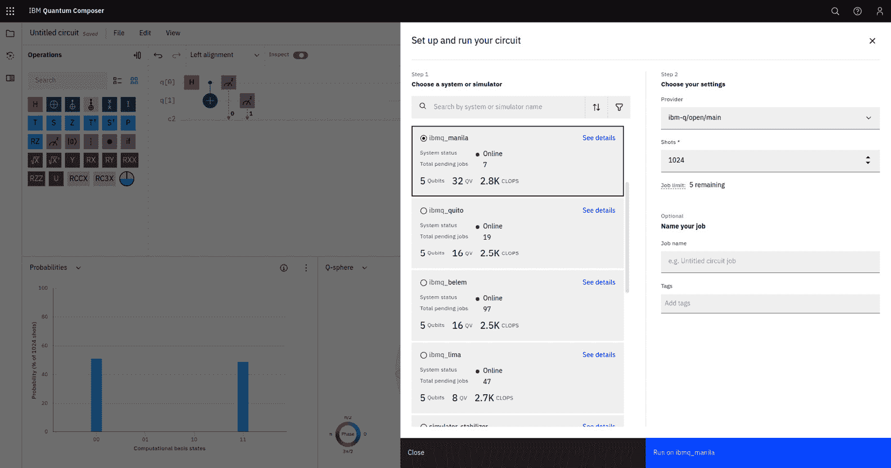

# 在量子云中的实现

本章将深入探讨在量子设备上执行算法的选项，或者至少是超越我们经典设备能力的解决方案。为了简化，迄今为止你所看到的大多数算法都使用了某种本地模拟，来模仿在真实量子计算机上运行时的结果。

在我们开发方法时，我们有手段在本地模拟理想量子计算机的行为，同时参考每个操作所需的数学描述。但最终的目标是能够将我们的工作发送到量子设备上，从而利用实际量子计算的潜力。

鉴于拥有量子计算机是极少数特权人士能够做到的事情，我们将重点介绍如何通过云访问成为利用这些仍处于实验阶段资源的重要途径。

我们还将展示几个示例，演示如何利用云资源和云托管的量子设备来执行[*第四章*]、[*第五章*]和[*第六章*]中提到的示例。通过这样做，你不仅会熟悉它可能涉及的不同工作流程，还将理解在大多数公司进行概念验证或创新项目时，使用这些资源的优势。

最后，考虑到云服务是基于按需付费模式运营的，我们将探讨利用云服务进行项目开发的财务影响。我们还将探索一些有趣的方法，即使预算有限，仍然可以启动基于云托管服务的量子项目和实现。

*第八章*和*第九章*将深入探讨我们可能使用的不同类型的设备和模拟器，以及如何应对大多数设备在我们抽象电路中引入的噪声。最后，*第十章*将带我们了解可以利用的策略，以便开始将量子计算作为增值资产纳入我们的组织，并通过一个合理的采纳策略来成长，这样既不会伤害公司财务，也不会影响机构采用这些具有颠覆性但充满潜力的新范式的步伐，将其作为商业流程的一部分。

本章将涵盖以下主题：

+   访问云量子计算平台并实现算法的挑战

+   主要量子技术提供商

+   使用云服务提供商时的成本估算

# 在云平台上实现量子计算的挑战

正如我们之前提到的，大多数之前展示的示例利用了量子计算可以通过我们的经典资源（使用模拟器）来模拟的事实。举例来说，在*第五章*中，我们使用了以下例程：

```py

backend = Aer.get_backend('qasm_simulator')
result = execute(quantum_circuit, backend, shots=10).result()
counts  = result.get_counts(quantum_circuit)
```

我们使用了一个 `qasm_simulator`，它是一个可以执行我们量子电路中定义的操作并根据量子计算的数学原理提供预期结果的实现。

我们希望将这同一个电路带到量子计算机上，但这并不像在亚马逊上购买一个那样简单。我们可以购买市售的设备，但对大多数组织来说，价格可能过于昂贵。

## D-Wave

2011 年，D-Wave Systems 宣布推出世界上首款商业化量子计算机——一台 128 量子比特的量子退火设备。他们已经能够将其 Chimera 拓扑结构扩展至 2,000 量子比特，而新架构突破了这一瓶颈，预计到 2023 年末或 2024 年初将推出最多 8,000 量子比特的设备。考虑到其初期设备的成本达到了七位数（[`www.engadget.com/2011-05-18-d-wave-one-claims-mantle-of-first-commercial-quantum-computer.html`](https://www.engadget.com/2011-05-18-d-wave-one-claims-mantle-of-first-commercial-quantum-computer.html)），且其外壳让人联想到老式大型机基础设施，正如在*图 7.1*中所示，这些设备需要数据中心来安置，因此显然它不会进行大规模生产：


图 7.1 – 一名技术员正在操作 D-Wave Systems 机器

## IBM Quantum

IBM 在创建其初期芯片时也经历了类似的情况。2018 年，他们发布了首款商业化产品 IBM Q System One，如*图 7.2*所示，这是一台 20 量子比特的商业化量子计算机：


图 7.2 – IBM 的 Q System One 设备

但在此成就之前，他们已经意识到许多在量子计算领域工作的研究机构和大学的需求。它们希望使用实际设备，但需要自己建造设备来进行实验。

正因如此，IBM 在 2016 年初决定将其中一台实验设备连接到云服务，使得独立组织可以将他们的实验提交到首台可用的量子计算机上。这一里程碑标志着今天我们所知道的丰富的云量子计算生态系统的诞生。

2017 年初，Rigetti Computing 的一个团队成功地将一组指令编程到 IBM 的设备中，使用的是 pyQuil Python 封装的 Quil 量子指令集架构（*Smith 等人，2016*）。

和许多新兴行业一样，仍然可以找到多个标准。IBM 决定利用其自有标准。我们在前面的章节中提到过它。尽管如此，**开放量子汇编语言**（**OpenQASM**）已经进入第三个版本，最初在一篇出版物中被提及（*Cross 等，2017*），以及 IBM 的量子信息软件工具包（*Qiskit - Anis, Md Sajid 等，2021*）的代码，成为实现量子程序并与各种云端可用设备通信的最成熟框架之一。

Qiskit 可以将我们的量子代码从最终运行的设备中抽象出来，但鉴于设备的多样化，我们可能需要记住，根据最终使用的硬件，某些框架更能满足我们的需求。

一个最明显的例子是，当使用 D-Wave Systems 的设备时。这些是量子退火设备。因此，门操作目前尚不适用（[`techcrunch.com/2021/10/05/d-wave-plans-to-build-a-gate-model-quantum-computer`](https://techcrunch.com/2021/10/05/d-wave-plans-to-build-a-gate-model-quantum-computer)）。

他们的设备可以通过他们的服务平台 Leap 自由访问（*图 7.3*；[`cloud.dwavesys.com/leap/login`](https://cloud.dwavesys.com/leap/login)）：


图 7.3 – D-Wave Systems 的云访问服务 Leap

你只需注册，便可以获得每月一定的时间来运行你的实验。事实上，在不同的计划中，你可以访问开发者计划（*图 7.4*），该计划只需要将 GitHub 账户与 D-Wave 的 Leap 服务同步——它提供每月最多 20 分钟的设备使用时间。考虑到他们的求解器运行时间只需要毫秒级，允许你在时间用尽前进行相当多的实验：


图 7.4 – D-Wave 云服务使用计划

与 Leap 交互时有两个主要选项。最简单的一种是直接使用他们基于云的开发环境。通过提供现有 GitHub 仓库的 URL，从中提取代码并提交以确保代码不会丢失，系统将创建一个临时的浏览器可访问的 IDE，并提供你的账户凭证。这为任何注册用户提供了一个即刻可用的工作环境：


图 7.5 – 一个包含航空公司示例的 Leap 工作区，加载在示例 IDE 中

这也将确保 D-Wave 的 Ocean 软件开发工具包已安装并准备就绪。

当然，您也可以在本地 Python 环境中安装 SDK，并通过 Leap 提供的令牌登录账户，该令牌应通过 Leap 界面可访问，如 *图 7.6* 所示：


图 7.6 – Leap 控制面板，在这里可以找到远程身份验证令牌

Ocean SDK 的文档已经提供了如何在本地进行操作的说明，这样与云服务的交互就能通过编程完成 ([`docs.ocean.dwavesys.com/en/latest/overview/install.html`](https://docs.ocean.dwavesys.com/en/latest/overview/install.html))。

这就是我们如何通过远程方式在 *第五章* 中使用非自有的 D-Wave 设备免费解决投资组合优化问题。

与 D-Wave 类似，IBM 通过其云服务提供对部分设备的免费访问 ([`quantum-computing.ibm.com/`](https://quantum-computing.ibm.com/))。您可以使用多种凭据进行注册，因此如果您使用的是 LinkedIn 或 GitHub 账户，您可以轻松访问他们的解决方案（免费或按需付费）。

注册后，会显示一组服务，您可以根据自己的专业水平选择合适的服务。*图 7.7* 展示了所有可用的不同服务：


图 7.7 – IBM Quantum 控制面板，展示了不同的可用服务

我们首先会注意到，还有一个令牌选项，因此也可以提交远程作业——在这种情况下，使用 IBM 的 Qiskit 框架。这通常就是指令设置为本地环境时提到的令牌 ([`github.com/Qiskit/qiskit-ibmq-provider#configure-your-ibm-quantum-credentials`](https://github.com/Qiskit/qiskit-ibmq-provider#configure-your-ibm-quantum-credentials))。

IBM 还提供了一个创建量子电路的工具：Quantum Composer。这可能是开始 *编写代码* 第一个示例的最简单方式。*图 7.8* 展示了如何通过拖放门图形到 Quantum Composer 的中央控制台，显示不同的图表，甚至是 Qiskit 和 OpenQASM 代码。它简化了从图形设计师到基于代码的实现的过渡，这在您需要更复杂的示例或项目时会非常有用，比如我们在 *第四章* 到 *第六章* 中涵盖的内容：


图 7.8 – IBM 的 Quantum Composer 图形界面，用于开始量子算法编程

在前图的左上角，我们可以看到它还允许我们将电路提交到设备上。我们可以根据可能需要的量子比特数量和等待队列来选择设备（许多人将向同一个共享设备发送电路），因此我们可以选择最不繁忙的设备（*图 7**.9*）：



图 7.9 – 从量子作曲器提交电路到可用设备

一旦作业发送到设备，队列将继续推进，我们的结果将会变得可用。在同一个控制台中，我们可以列出已发送的作业集，如果点击具体的作业本身，还可以请求更多信息（*图 7**.10*）：


图 7.10 – 从 ibm_nairobi 设备获得的实际结果

IBM 会保留我们提交的所有作业列表，因此，旧的结果可以从云服务中恢复。一个非常有用的功能是，当某人必须发送一组示例以便后续分析时，我们可以利用这一功能。我们的许多示例需要一定的时间来运行，不仅因为它们可能经过变分训练，因此需要多次调用设备，而且因为设备的排队可能会增加，并且可能需要相当长的时间才能让我们的电路在设备上运行（队列中的优先级由你在某段时间内发出的请求数量决定）。

我们想要强调的两件有趣的事情是，如果我们查看*图 7**.10*中的图表，设备上的图表显示了在我们模拟结果时并不存在的状态值（*图 7**.10*中的右侧图表）。这是因为噪声效应和在真实设备上运行时引入的不同类型的错误。我们将在*第八章*和*第九章*中更详细地讨论这一点。尽管如此，值得强调的是，真实设备的表现不会像我们在某些示例中使用的理想模拟器那样，且会引入本不应存在的结果。

另一个有趣的事实是，如果我们查看刚刚提交的作业的细节，所发送的电路与实际运行的电路并不相同，正如*图 7**.11*中所见。从计算角度来看，它们是相同的，因为*Z*旋转和平方根*X*的组合提供了与 Hadamard 门相同的效果，但这是因为设备上无法使用 H 操作而有所改变。在理论设置中执行的并非所有操作都能在设备上执行。甚至有比我们想要使用的更多的量子比特。因此，在转向真实设备时，总是有一个步骤是我们无法省略的，这个过程叫做*转换*。

转译是将我们的理论算法适配到可能无法完全映射所需内容的芯片的特定门和拓扑结构的过程。这个过程试图使用一些启发式方法和不同的优化级别找到最佳的量子电路映射方式。通过程序化的方式，我们可以平衡适配算法所需的时间与其所转换的深度或操作次数。简而言之，转译作业将把复杂的门简化为基本门，以便映射到硬件架构上。

我们引入的操作越多，电路所承受的噪声也就越大，最终读取的结果可能会更加不准确。这就是为什么这一步骤对研究人员如此重要；他们投入大量时间寻找更好的改进方法。在 *第九章* 中，我们将看到这一过程的一些最新进展，这一过程被称为 *错误缓解*：


图 7.11 – 提交的电路与在 ibm_nairobi 上运行的实际电路

在 IBM 的云服务选项中，有一个部署工作区的选项，让我们可以从那里工作，而无需担心本地安装和账户设置。Quantum Lab 选项（*图 7**.12*）允许我们部署一个已经配置好最新 Qiskit 版本并加载我们账户的托管 JupyterLab 环境，这样提交作业就变得容易了：


图 7.12 – IBM Quantum Lab 工作区创建及可用教程

我们之前编写的任何示例都可以轻松地转移到这个工作区，因为 Jupyter 笔记本只需点击上传选项（*图 7**.12* 中的向上箭头）即可转移。假设我们点击可用的第一个 **Notebook** 选项，该选项在 Qiskit 的标志下显示 **Python 3**。在这种情况下，将显示一个新的 Jupyter 笔记本实例，其中会显示一些常见的库以及我们如何加载账户凭证：


图 7.13 – 创建 Qiskit 支持的笔记本时提供的默认单元格

*图 7**.13* 显示了加载默认提供程序以访问所有可用后端的代码。然后可以请求这些后端：


图 7.14 – IBM Quantum Lab 内部自由提供的设备和模拟器选项

*图 7**.14* 显示了后端函数的输出，并列出了设备和模拟器。这些是模拟可用量子计算机的经典资源，因此我们可以选择最符合要求的后端。

在介绍了两种最受欢迎的基于云的量子计算资源后，你可能会认为逐个提供商地测试不同的设备类型可能会变成一个关于令牌、配置和要使用的框架的噩梦。

这就是为什么主要的参与者也开始启用基于云的量子计算，但从稍微不同的角度来看。作为全球大多数企业的云服务提供商，AWS 和 Azure 旨在使技术更容易访问。这也是它们主要加入量子社区的方式——作为枢纽，不仅提供自身的服务，还提供对第三方提供商的访问，让你通过它们的服务访问众多选项。

这就是为什么在接下来的两部分中，我们将专注于 AWS 和 Azure，并展示如何访问这些计算资源的不同选项和方式，以便任何量子开发者都能最大程度地利用现有的广泛资源。

## Amazon Braket

**亚马逊网络服务**（**AWS**）决定为量子计算创建一个既是服务又是框架的统一平台。

Amazon Braket 服务，像之前的例子一样，使得超出 AWS 实际提供的量子计算设备也能对任何用户开放。据我们所知，AWS 并未开发自己的硬件设备。那么，它们是如何提供量子计算平台的呢？事实上，它们与一些提供硬件的关键细分市场公司合作，这些公司选择通过第三方提供访问，而不是将维护客户访问平台的额外工作量纳入其商业模式。

任何拥有 AWS 账户的人都可以在其账户内访问 Braket 服务，尽管并非所有区域目前都提供此选项，如下所示：


图 7.15 – 显示在 AWS 服务控制台中的 Amazon Braket，突出显示区域选项

该控制台类似于我们之前看到的控制台，因为它同样提供了可用设备的概览、可在为远程开发创建的工作区上运行的笔记本，以及之前在服务中运行的作业列表：


图 7.16 – Amazon Braket 的主控制台和可用设备

使用 AWS Braket 而不是任何量子硬件公司提供的独立直接访问服务的关键优势之一是，它充当了一个枢纽。因此，通过使用相同的连接界面，客户可以直接访问许多不同类型的服务。

它还提供了一组库，其中包含我们在 *第二章* 中回顾过的一些经典算法的实现。如 *图 7.17* 所示，它们通过 Amazon Braket 的 Python SDK 提供，这是 AWS 提供的开源框架：


图 7.17 – Amazon Braket 的算法库和 Berstein Vazirani 实现示例

这个框架更为通用，因为 Amazon Braket 旨在支持的技术不仅仅是 IBM 专注的超导芯片。IBM 的框架主要是为了增加设备的使用，但 Amazon 不得不在其服务中涵盖更广泛的技术领域。在这里，我们可以找到中性原子、光子设备和陷阱离子服务，它们需要不同的交互方式并对计算过程提出不同要求。

要理解为什么这很重要，许多与逻辑电路转换过程相关的限制最初编码到特定设备设置中的都取决于设备的特定方面。最基本的限制之一是量子比特（qubit）的连通性，这会导致不同的转换方式。这种连通性因供应商（以及后端）而异，如下所示：


图 7.18 – IBM Washington（下）和 Rigetti Aspen-M-3（上）的超导芯片拓扑图

还有一些差异，比如供应商接受的本地量子门。例如，用于状态叠加的 Hadamard 门，如果不结合其他硬件实现的操作几乎无法实现，如*图 7.11*所示。但当基础技术发生变化时，这会产生更深远的影响。例如，陷阱离子设备可以任意连接“多对多”的量子比特（*图 7.19* – 连接表示），更适合显示全互联结构的问题。例如，投资组合优化就是这种情况，它要求你评估所有潜在资产之间的协方差（*第五章*）：


图 7.19 – IonQ 陷阱离子设备拓扑图

或者在中性原子设备的情况下，类似于 D-Wave 系统中发生的情况，必须提交模拟编码而非基于门的算法，这需要一些特定的知识来执行这些操作（[`docs.aws.amazon.com/braket/latest/developerguide/braket-quera-submitting-analog-program-aquila.html`](https://docs.aws.amazon.com/braket/latest/developerguide/braket-quera-submitting-analog-program-aquila.html)）。这也是 Amazon Braket 开发的原因之一，因为它使我们能够在平台内启用新服务时扩展这些特定需求。

鉴于 Qiskit 在量子计算社区的使用和成熟，亚马逊还发布了一个插件，使得任何 Qiskit 编码的例程都可以发送到支持 Amazon Braket 的设备。这帮助我们与一些提供门控计算的设备对接，而无需学习第三方框架。

您可以使用以下代码来安装亚马逊提供商启用插件：

```py

pip install qiskit-braket-provider
```

Qiskit 电路可以发送到亚马逊设备。类似于我们在*图 7.14*中的 IBM 启用提供商的做法，我们可以将 Amazon Braket 实例化为提供商：

```py

from qiskit_braket_provider import AWSBraketProvider
provider = AWSBraketProvider()
```

我们还可以请求使用可用设备作为后端：

```py

ionq_device = provider.get_backend("IonQ Device")
rigetti_device = provider.get_backend("Aspen-M-3")
oqc_device = provider.get_backend("Lucy")
```

在这里暂停非常重要。正如我们之前提到的，我们的电路可能需要根据最终设备的具体要求进行转换。因此，根据每种情况，可能需要进行某些适配。

此外，考虑到每个设备的定价方案不同，但它们都需要一个计费结构，以便在计费周期结束时收取运行任何示例的费用。

特别重要的是，我们需要关注每个设备的定价，因为在使用变分算法时，拟合参数所需的交互次数可能会急剧增加，这将直接影响每个任务的成本。

要弄清楚特定算法在给定设备上的成本，我们必须了解运行候选量子电路所需的资源和操作。

由于 PennyLane 在处理变分算法时的作用，它有一个非常有用的资源，称为跟踪器，可以跟踪发送到设备的任务。我们可以利用这个资源，通过 AWS 的 SDK 和 PennyLane 插件结合进行我们的估算：

```py

pip install amazon-braket-sdk amazon-braket-pennylane-plugin
```

我们将照常进行，并创建一个电路，但在这种情况下，使用`bracket.local.qubit`设备作为我们的目标设备：

```py

import pennylane as qml
from pennylane import numpy as np
wires = 2  # Number of qubits
dev = qml.device("braket.local.qubit", wires=wires)
def circuit(params):
   qml.Hadamard(wires=0)
   qml.RY(params[0], wires=0)
   qml.CNOT(wires=[0, 1])
   return qml.expval(qml.PauliZ(1))
qnode_local = qml.QNode(circuit, dev)
```

现在，我们可以调用电路，通过`qml.Tracker`对象执行围绕它的操作，如下所示：

```py

params = np.array([0.1], requires_grad=True)
```

我们可以使用`qml.Tracker(dev)`作为跟踪器：

```py

   print("Expectation value of circuit:", qnode_local(params))
>>> Expectation value of circuit: -0.09983341664682821
```

除了通过跟踪器产生预期结果外，我们还可以请求已发送到设备的任务：

```py

print(tracker.history)
{'executions': [1], 'shots': [None], 'braket_task_id': ['0f6c047e-fb58-48d5-bc85-1ff4a1538115'], 'batches': [1], 'batch_len': [1]}
```

例如，如果我们执行梯度计算，对于参数偏移例程，将需要多次执行电路，我们将看到这被封装在不同的批量调用中：

```py

with qml.Tracker(dev) as tracker:
   print("Gradient of circuit:", qml.grad(qnode_local)(params))
print(tracker.history)
>>> Gradient of circuit: [-0.99500417]
>>> {'executions': [1, 1, 1], 'shots': [None, None, None], 'braket_task_id': ['2d68103f-3817-422c-9100-6b59b236a614', 'e44a156f-c78f-4a57-8426-0fa0c6133d76', 'abba84cb-3ff5-4b44-b8b9-cdae7ba16ed8'], 'batches': [1, 1], 'batch_len': [1, 2]}
```

远程设备向跟踪器对象提供更多信息，因此也能为执行提供更多信息。计算时间以毫秒为单位。账单可以用毫秒表示，并可以从`history`字段中获取。当然，您必须根据目标设备及其定价方案进行最终计算。

任务跟踪成为关键。当将任务转换为特定设备的执行时，成本方案将相应地获得。当推送到设备时，我们可以实现不同算法和训练方案的意义以及相关成本。

了解我们的云成本是量子计算机和经典资源面临的最具挑战性的任务之一。这就是为什么微软将此视为他们服务的核心部分，并试图提供更简单的方式，使用户能够随时访问这些计费信息。

## Azure

微软拥有广泛的企业市场，并且非常清楚量子计算技术可能会颠覆某些业务用户的操作工作负载。考虑到他们的云产品，他们决定通过 Quantum Workspace 服务以类似的设置与 AWS 竞争。

在这种情况下，微软决定根据他们的需求也创建一个框架——Q#，它遵循类似于之前的 C# 和 J# 专有语言的方式，并且在更通用的 .NET 框架中（[`learn.microsoft.com/en-us/azure/quantum/overview-what-is-qsharp-and-qdk`](https://learn.microsoft.com/en-us/azure/quantum/overview-what-is-qsharp-and-qdk)）。

要启用此服务，您必须从可用的订阅中创建一个量子工作区，订阅是微软用来计费已购买服务的计费单位。Quantum Workspace 是提供访问量子设备的服务，您可以使用这些设备，提供编码环境，这是一种基于笔记本的方式（使用无处不在的 Jupyter Notebook 引擎），以及有关配额、资源和执行量子电路所需的其他信息：


图 7.20 – Azure 门户和 Quantum Workspace 创建页面

默认情况下，Microsoft Azure 账户提供免费的积分，每个设备不同，作为与硬件提供商协议的一部分。这帮助用户在决定选择哪种类型的计划之前，先测试不同的服务提供商。这些计划是按使用量计费的，但也提供了月度服务选项。与先前的选项和量子设备类似，提供了一个笔记本服务，供您进行实验，并提供一个作业列表，以便您检索任何过去的作业（核心服务位于服务的主屏幕上，如*图 7.21*所示）：


图 7.21 – Azure 的 Quantum Workspace 主页，左侧菜单提供管理选项

可用选项显示的服务提供商少于亚马逊的提供：


图 7.22 – 可用的 Azure Quantum Workspace 服务提供商

除了实际的硬件设备，Azure 还提供了优化例程的服务。用户无需处理编码和解决给定问题所需的过程。这是我们在 D-Wave 的 Hybrid 求解器或 IBM 的 Qiskit Runtime 中曾经见过的趋势。用户的抽象层级提高了，他们只需要关注要解决的问题。确实是一个相当有趣的趋势。

微软意识到像 Qiskit 这样的框架的成熟度，而不是强迫用户学习另一个量子计算框架，因此发布了 Qiskit 插件，使得任何 Qiskit 电路都可以发送到启用的设备上：

```py

pip install azure-quantum[qiskit]
```

安装完成后，我们需要将我们的量子工作区注册为我们希望从中获取后端的提供者。这可以通过以下代码完成。以下代码行需要添加到任何实验的开始部分：

```py

from azure.quantum.qiskit import AzureQuantumProvider
provider = AzureQuantumProvider (
resource_id = "/subscriptions/<suscription_id>/resourceGroups/AzureQuantum/providers/Microsoft.Quantum/Workspaces/<workspace>",
   location = "eastus"
)
```

后端信息是从量子工作区的主窗口（浏览器）获取的，旨在识别它已部署到的区域和订阅：


图 7.23 – Azure 量子工作区主窗口，突出显示访问信息

借助此功能，所有在*图 7.22*中看到的设备都可以被调用，从而使我们的候选电路能够在这些设备上运行：

```py

ionq_simulator_backend = provider.get_backend("ionq.simulator")
ionq_qpu_backend
 = provider.get_backend("ionq.qpu")
```

在运行任何电路之前，检查运行电路所涉及的成本可能是有意义的。为了通过代码访问这一信息，我们可以使用 Azure 资源估算器，它只需要电路和将要运行的后端，即可评估执行的潜在成本：

```py

cost = backend.estimate_cost(circuit, shots=1024)
```

微软提供了一个坚实的视角，展示了他们设想如何使用他们的服务（*图 7.24*），其中包括资源估算，这将成为量子资源长期高效使用的关键信息：


图 7.24 – 微软设想的量子开发管道

正如我们在 Amazon 的案例中看到的，这一资源估算器可以防止用户在任何执行之前花费大量资金。更多关于如何在算法实现之外使用 Azure 资源的示例，可以在他们的笔记本画廊中找到（*图 7.25*）：


图 7.25 – 每个量子工作区内可用笔记本的示例

# 成本估算

我们简要提到过资源估算，但我们想强调，在寻求可持续采用策略时，这一能力的重要性。

量子计算仍处于早期阶段，需要持续且复杂的维护任务以提供尽可能最好的服务。这是经典计算资源长期以来所掌握的技术。由于硬件供应商生态系统的局限性以及技术的现状，特别是在追求真实硬件的情况下，我们将看到成本显著上涨，即使对于最简单的供应商也是如此。这就是为什么资源估算在任何量子计算管道中都如此重要，特别是当模型训练需要多次迭代时：


图 7.26 – Quantinuum 在 Azure 上的成本（下方）与 IonQ 在 AWS 上的成本（上方）

举个例子，我们可以从*第四章*中提取欧洲看涨期权定价的量子电路，该电路已经知道由块编码、资产的对数正态分布和执行计算支付函数的块组成：

```py

european_call_pricing = EuropeanCallPricing(
   num_state_qubits=nqubits,
   strike_price=strike,
   rescaling_factor=0.05,
   bounds=(low, high),
   uncertainty_model=dist_circ,
)
problem = european_call_pricing.to_estimation_problem()
problem.state_preparation.draw('mpl')
```

我们可能面临的问题是，根据所选择的设备，我们可能无法理解 P(X)和 F 块在操作方面的具体含义，如图 7.27 所示。我们需要将其转化为设备能够理解的基本门组合，因为高级抽象块通常不能直接在真实设备上执行。因此，我们还需要估算与此转换过程相关的潜在成本，因为这是一个常见的现象。


图 7.27 – 展示高层次抽象块的欧洲看涨期权定价问题电路

对于 Quantinuum 设备，我们可以使用旋转、恒等、CNOT 和 Hadamard 门的组合，并请求基于这些操作的电路转换：

```py

from qiskit import transpile
result = transpile(problem.state_preparation, basis_gates=['id', 'ry', 'rx', 'rz', 'cx', 'h'], optimization_level=1, seed_transpiler=1)
```

然后，我们可以选择设备，以便它可以对生成的电路进行估算：

```py

backend = provider.get_backend("quantinuum.qpu.h1-1")
costs = backend.estimate_cost(result, shots=1)
print(f" Estimated cost for a single shot is of {costs.estimated_total}{costs.currency_code}")
Estimated cost for a single shot is of 5.449HQC
```

在这种情况下，单次电路执行将消耗 5.5 个 Quantinuum 积分，对于标准订阅来说，总费用将接近 70 美元。如果我们考虑到幅度估算例程可能需要对同一电路进行多次迭代，那么仅仅为了资产支付评估，我们可能需要几百美元。当然，接下来是压缩这个电路，使得更少的操作仍能产生相同的状态准备。然而，这通常是研究机构的核心活动，不太可能是我们的分析师会投入时间的地方。

这就是为什么我们必须进行一些计算，并彻底评估预期的投资回报，以免在没有充分考虑的情况下，将我们的训练例程提交给一个愿意以这些价格处理请求的云服务提供商。

# 摘要

从本地部署到云托管的过渡对许多组织来说是一个复杂的过程，包括从拥有计算资源转变为如今普遍的按需付费模式。量子计算最初直接进入了云端。不同的平台提供了高效的成本结构，给予服务和供应商的访问权限。许多机构已经有了引入量子计算的设施。

量子硬件是以问题为导向的，并且随着选择的设备种类繁多，你必须决定哪一种设备最适合你的问题，这增加了复杂性和决策的难度。估算工具帮助公司评估使用这种新型机器的成本，为他们提供了一种有效的方式来估算每项研究所需的预算。

没有任何技术像量子计算一样，面对如此广泛、几乎是*免费*的学习和适应机会。硬件提供商将他们最新的设备集成到这些云服务中，帮助推动该领域的发展，既支持研究人员也支持商业用户。围绕用于操作这些硬件的库的不同社区的角色至关重要，它为自学量子计算提供了大量的笔记本和教程。

已经有提供 2 和 3 量子比特桌面系统的供应商，以具有竞争力的价格出售（[`www.discovermagazine.com/technology/a-desktop-quantum-computer-for-just-usd5-000`](https://www.discovermagazine.com/technology/a-desktop-quantum-computer-for-just-usd5-000)），但鉴于大多数组织似乎将其基础设施放在云端，这主要仍将作为一种教育资源。这简化了当你自托管这类资源时的任何集成工作。

总结来说，实施量子计算到云平台上面临几个挑战，包括以下几个方面：

+   **可访问性**：目前量子计算资源仅通过专业的云提供商提供，这对于一些用户来说可能较为难以访问。一般云提供商已经通过早期采用量子计算中心来缓解这一问题。

+   **可扩展性**：量子计算系统需要专门的硬件和基础设施，随着量子计算资源需求的增加，扩展这些系统可能会变得困难。

+   **互操作性**：不同的量子计算平台有不同的编程语言和接口，这使得开发人员在多个系统之间协作时遇到困难。

+   **安全性**：量子计算系统容易受到某些类型的攻击，例如量子黑客攻击，这可能会暴露敏感信息。

+   **噪声与错误**：量子计算机比经典计算机更容易受到噪声和错误的影响，这使得从量子算法中获得准确结果变得更加困难。

+   **成本**：量子计算资源仍然相对昂贵，这使得一些组织难以负担所需的硬件和基础设施。

无论如何，这项高速发展的技术刚刚开始发挥作用，而那些带来竞争优势的应用将揭示出这些资源最终将采用的路径。

# 进一步阅读

许多供应商已经开始塑造他们的产品，以便在未来几年中出现新的即服务范式。

牛津量子电路公司已经接受了**量子计算即服务**（**QCaaS**）的概念（[`www.techradar.com/news/quantum-computing-as-a-service-is-going-mainstream`](https://www.techradar.com/news/quantum-computing-as-a-service-is-going-mainstream)），而像 QCentroid 这样的公司通过其**量子即服务**（**QaaS**）平台（[`marketplace.qcentroid.xyz/`](https://marketplace.qcentroid.xyz/)）为行业特定应用提供现成的解决方案，目标是吸引更广泛的受众。

当考虑云访问资源时，最有趣的案例之一是变分量子算法的案例，在这种算法中，经典资源和量子资源之间需要不断交换。鉴于我们已看到的排队时间，我们必须意识到，如果我们尝试在实际设备上远程训练 ansatz，每次迭代的远程训练都将面临重要的延迟。

鉴于公司从经典机器学习模型中获得的现有收益，量子计算很可能会作为辅助工具来解决那些难以解决的问题。在合适的架构中这样做，需要高级岗位的人员站出来，超越领域中的炒作，做出关于采纳与长期战略的明智决策。公司们已经在为这些早期采用者简化决策过程。

为了解决这个问题，IBM 决定创建 Qiskit Runtime。Runtime 是一些包含知名算法的程序，其中附加信息被发送到远程执行引擎，后者负责经典部分和量子部分的执行。它提供了算法两部分之间更紧密的交互，从而实现了更高效的运行时间。一个示例工作流程见于*图 7.28*：


图 7.28 – IBM 设想的 Qiskit Runtime 用于高效的工作负载平衡

这个服务提供了一个成本方案，尽管有一个免费选项，最多提供 3 小时的免费访问，但你仍然需要考虑费用问题：


图 7.29 – 截至 2023 年 1 月的 IBM Qiskit Runtime 定价

D-Wave 还意识到，通过在其端结合经典和量子操作，他们可以扩展其产品组合，并减少解决某些需要中间经典步骤的问题所需的时间。这就是他们的混合求解器背后的秘密——经典例程与量子退火器交互，从而通过两者的结合创建了更广泛的问题求解范围。

根据定义，他们的求解器高效地解决二次二进制模型，但添加了经典例程。离散和受约束的模型也可以通过为每个过程步骤分配量子和经典资源来解决（[`docs.dwavesys.com/docs/latest/doc_leap_hybrid.html`](https://docs.dwavesys.com/docs/latest/doc_leap_hybrid.html)）。

很可能，这些远程求解器的进展最终会表现为一个简化的服务，其中问题被提交，服务提供商的引擎确定最佳的资源组合。如果不是量子设备在特定问题领域提供的进展，可能很难察觉它们在过程中的作用。然而，这种方法将简化商业用户的可用性和抽象，他们的主要关注点是寻找解决方案，而可能不太关心为实现这些解决方案所采用的技术细节。

# 参考文献

*Cross, A. W., Bishop, L. S., Smolin, J. A., & Gambetta, J. M. (2017). 开放量子汇编语言。arXiv* *预印本 arXiv:1707.03429。*

*Anis MS, Abraham H, AduOffei RA, Agliardi G, Aharoni M, Akhalwaya IY, Aleksandrowicz G, Alexander T, Amy M, Anagolum S. (2021). Qiskit：一个开源的量子* *计算框架。Qiskit/qiskit。*

*Smith, R. S., Curtis, M. J., & Zeng, W. J. (2016). 一个实用的量子指令集架构。arXiv* *预印本 arXiv:1608.03355。*
