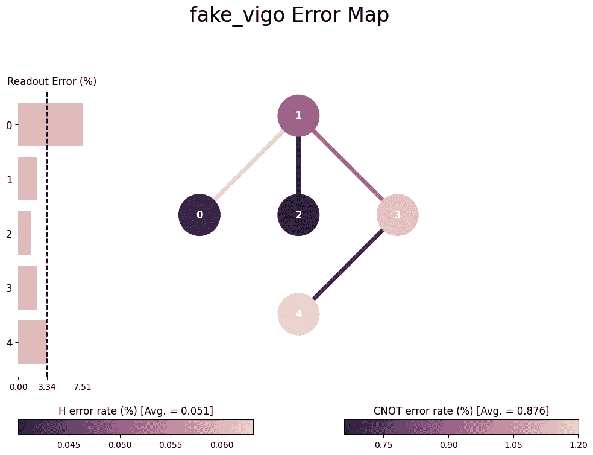
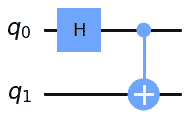
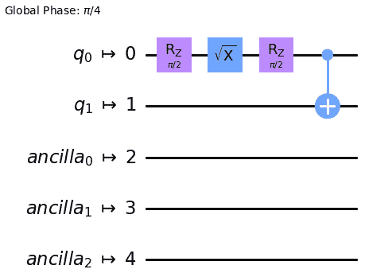
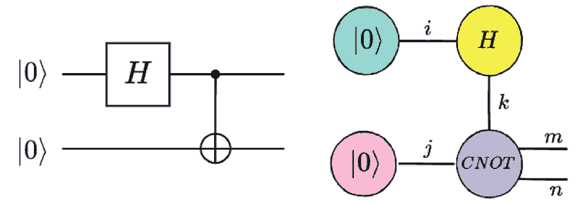
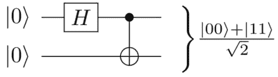
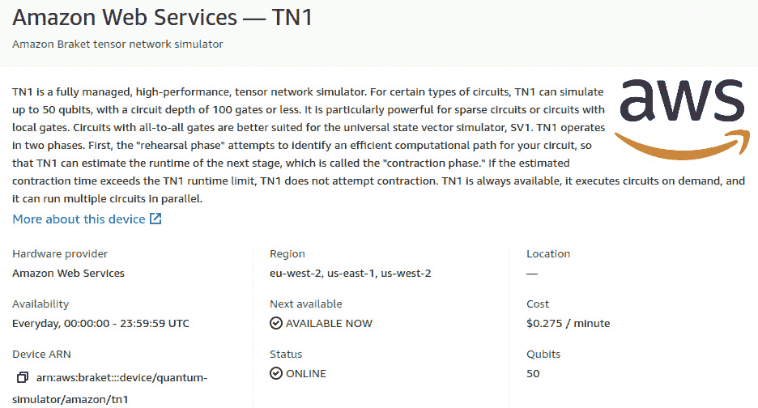
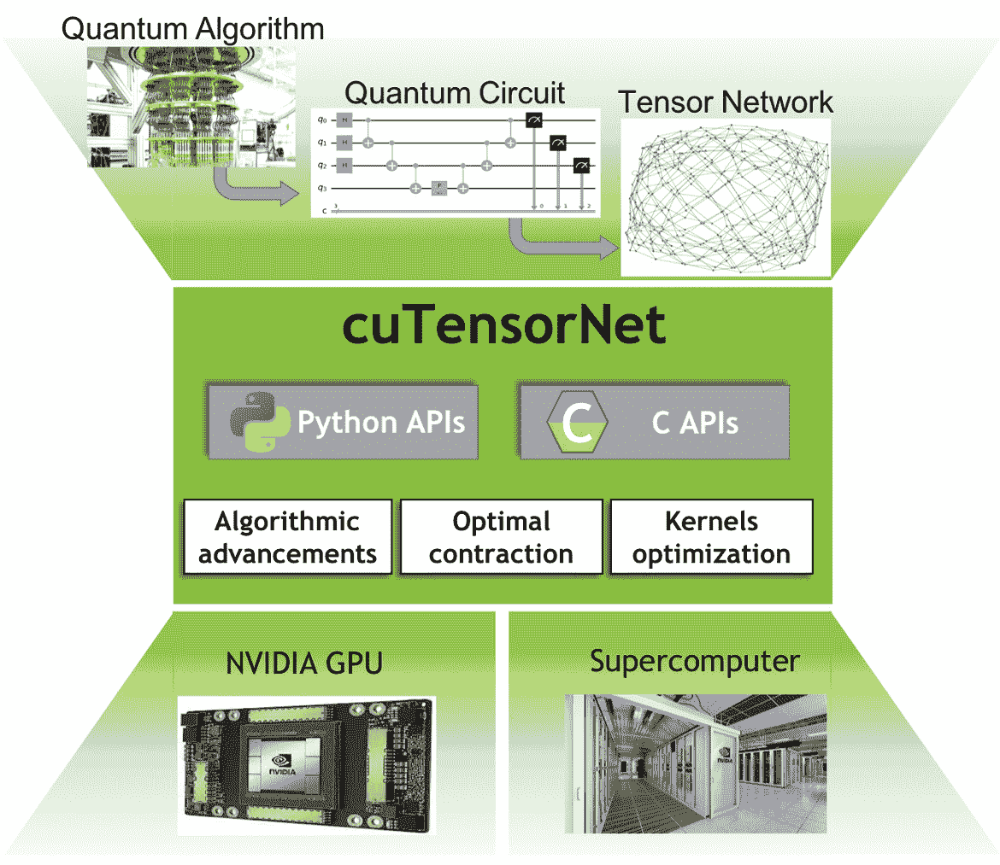

# 仿真器和高性能计算（HPC）在 NISQ 时代的作用

现在我们已经知道如何使量子和经典计算资源可用，并回顾了如何在这两个领域中提出我们的项目问题，我们应该评估可用的机制和策略，以高效地利用这些资源。这里的意思是成本和时间的效率，因为在将这些技术纳入公司日常流程时，这些因素也需要考虑。

现如今，大多数公司中的传统资源包括本地和云端资源的混合。这是大多数实验项目的常见情况，目的是通过分析改善运营流程。短期计算资源的需求可能因项目或我们设想使用的技术性质而有所不同。这就是为什么云原生按需付费模式已经成为大多数公司良好选择的原因。

根据任务的不同，**图形处理单元**（**GPU**）用于机器学习活动，或高性能计算资源用于优化问题可能是必需的。在不了解项目结果的情况下购买这些资源可能成本过高。但同样也有一个事实是，一旦这些过程实现了运营，利用基础设施成本并将这些资源整合到更具成本效益的结构中变得至关重要。如果不经过合理评估，按需付费可能会变得昂贵。通俗来说，既有租车市场，也有购车市场。一切最终归结为使用。

从一开始就找到正确的资源组合，即使是在项目生命周期中，对于量子计算以及整体业务的可持续性和竞争力至关重要。量子计算不仅仅局限于量子硬件本身，采用量子计算时可以选择多种方案。从量子启发到完全的量子算法，正如我们在之前的章节中所讨论的，我们必须为这些解决方案找到合适的资源。

因此，本章将探讨量子领域内各种潜在的选项，以及这些选项如何用于具有成本效益的技术采用。我们还将尝试概述一种合理的采用方法，以便服务那些不太熟悉分析项目生命周期的人。

我们将涵盖以下主要内容：

+   带噪声的量子硬件本地仿真

+   本地仿真器的分布式运行方法

# 本地噪声模型仿真

首先，我们必须区分本章及后续章节中使用的三种命名约定。之前，我们谈到量子算法如何可以在经典设备上运行，然后再传送到真正的量子设备，但经典执行的方式有多种不同的方式。这类问题已经存在一段时间，经典计算在过去的一段时间里发展了许多不同的方式来解决当时的技术问题。正如我们将看到的，这也可能带来一些与我们将要覆盖的不同经典设置的细节相关的挑战。模拟量子力学演化是一项非平凡的任务；这就是为什么量子计算被提出作为潜在解决方案的原因。

*模拟器* 是用经典方式处理信息，模拟理想量子计算机的方式。请记住，量子信息理论并不是由于量子硬件的出现才产生的一个新任务。在第一个量子设备诞生之前，很多工作就已经开始了（*Bennet 和 Shor, 1998*）。通过定义量子信息并确定要使用的操作集，将这些操作应用到我们的量子态的顺序被称为量子领域中的算法或电路。模拟器使得量子计算中使用的数学工具在计算上可用。我们在*第一章*中没有深入讨论这些术语，但请记住，量子态简单来说就是编码给定系统波函数的向量。举例来说，我们可以将基本的 0 态表示为列向量，如下方的方程所示：

|0⟩ = ( 1   0 )

因此，从计算的角度来看，我们可以将其表示如下：

```py

import numpy as np
ket0 = np.array([[1.0], [0.0]])
```

另一方面，诸如 CNOT 或哈达玛门（Hadamard gate）等操作，用于创建叠加态，实际上不过是执行从一个状态到其乘积态演化的矩阵。例如，哈达玛门可以通过以下矩阵表示：

H =  1  _  √  _ 2  (1 1 1 − 1)

以下代码可以表达其编码版本：

```py

hadamard = np.dot(1/np.sqrt(2), np.array([[1.0, 1.0], [1.0, -1.0]]))
```

由于每个运算符（量子门）都可以表示为一个矩阵，只要我们拥有足够的资源，就可以用经典资源执行这些操作。尤其是，随着系统规模的增大，内存变得尤为重要。量子计算机的表示是 2 的 *N* 次方矩阵，执行这些计算时需要处理向量。我们可以利用我们在向量化和稀疏矩阵处理方面的工作，但此时，我们的经典设备将达到这些技术的极限。

例如，应用哈达玛门（Hadamard gate）到我们的基本 0 态量子比特（qubit）将得到一个在 0 和 1 态的叠加状态。这个操作可以通过创建之前定义的对象的点积来模拟：

```py

>>> np.dot(hadamard, ket0)
array([[0.70710678], [0.70710678]])
```

这是叠加的量子态：

|ψ⟩ =  1 _ √ _ 2  (|0⟩ + |1⟩)

到此为止，我们已经进行了第一次模拟。从初始状态开始，大多数设备都是通过一个哈达玛门操作符（*H*）初始化的，从而产生输出状态。我们可以将其扩展，使得所有基本门和状态都可以被表示，从而在更高的抽象层次上进行工作。这正是量子模拟器在我们使用它们运行算法时所做的。当我们使用 Qiskit 或 Pennylane 等框架时，它们将这一系列操作作为操作的矩阵积的抽象，使我们可以通过简单地使用这些定义来轻松地使用这些操作。

模拟一个量子系统需要多少经典资源？嗯，这正是事情变得有趣的地方——你可以预期许多量子比特能够在普通笔记本电脑上进行模拟，并且执行许多比特操作。但事实是，16 量子比特的算法可能已经超出了普通笔记本电脑可用的内存。例如，16 个量子比特会编码我们在*第五章*中回顾的投资组合优化任务的 16 个资产的可选方案。这是一个可以轻松用经典计算机解决的小问题，但在其量子版本中，使用前面提到的任何框架都可能消耗掉普通笔记本电脑上可用的 16GB 内存。那么，经典计算机是如何处理这些问题的，而量子模拟器又是如何在相同规模下失控的呢？

当你模拟量子力学系统时，你处理的信息量远远超出了你能够编码到这些量子物体中的资产和派生信息的简单总和。量子力学动态发生在更复杂的空间中，这需要更多的资源来忠实地重现整个系统的动态。但这也意味着，编码更多经典信息所需的量子资源较少（*Bowen, 2001*）。希望得益于这一事实，我们可以以不同的方式进行计算，这时优势就显现出来了。利用量子领域的特性，如叠加态或纠缠态，我们可以做一些不同的事情，例如通过单步操作评估所有潜在组合（*Brassard et al. 2002*），或让解之间相互抵消，放大最好的候选解，就像我们在*第四章*、*第五章*和*第六章*中的例子那样。

到此为止，我们已经涵盖了量子计算与经典计算的基本区别。因此，你必须知道，在模拟这些动态时，经典系统存在局限性。这也是为什么如此多的努力投入到开发能够在量子力学层面工作的计算机中，以避免因经典的“模拟”这些效应而导致的损失。

在模拟真实量子设备时，我们可以进一步发展，让经典模拟不仅能够像理想的量子计算机一样工作，还能够像特定设备一样工作。在模拟特定设备时，我们希望模拟所有与连接性或误差统计相关的限制条件。在当前的 NISQ 时代（*Preskill, 2021*），准确表征目标设备的细节非常重要。

*模拟器* 是指当模拟器在给定的特定量子硬件的限制条件下模拟量子动力学时使用的术语。例如，在 IBM 的超导芯片中，我们可以从 Qiskit 中提取它们的模型，并使用现有的本地模拟器，这些模拟器的功能仅限于真实设备的运行。这意味着，并不是所有可能的两比特门操作都能在任意两个量子比特之间执行，并且操作有时会失败，产生我们所称的误差，从而导致噪声（不准确性）：

```py

from qiskit.providers.fake_provider import FakeVigo
from qiskit.visualization import plot_error_map
emulator = FakeVigo()
plot_error_map(emulator)
```

*图 8**.1* 是假 Vigo 的误差图的表示。



图 8.1 – IBM Vigo 芯片描述，突出显示量子比特连接性及 H、CNOT 或测量操作中的误差

通过将我们的电路运行在这个假实例上，而不是模拟器上，我们将面临与使用真实设备时相同的问题，并获得与真实设备更接近的结果，而无需在实际设备队列中等待。这就是为什么当量子电路需要发送到实际设备（或模拟器模拟真实硬件）时，需要进行转译步骤。我们需要一个步骤，将我们的理论算法和设备无关的算法转化为可用的门，并为硬件提供连接性。

如果我们以 *第一章*中展示的两比特贝尔态为例，如*图 8**.2* 所示，我们可以对该`fake_vigo`设备添加转译步骤，看看绘制出来的内容：

```py

from qiskit import QuantumCircuit
qc = QuantumCircuit(2)
qc.h(0)
qc.cx(0, 1)
qc.draw('mpl')
```

最后一行代码输出的是*图 8**.2* 中显示的电路。它表示其中一个贝尔态。



图 8.2 – 贝尔态电路

电路需要被分解成量子计算机上实现的门。为此，电路需要进行转译：

```py

from qiskit import transpile
qc = transpile(qc, emulator)
qc.draw('mpl')
```



图 8.3 – 基于贝尔态的电路转译，采用模拟器配置

这些差异来自于 Hadamard 门不是设备中的本地操作，尽管其错误已显示在*图 8.1*中。我们需要将电路转换为本地门操作，以便它们的组合产生与 H 门相同的效果。我们还需要指定会发生什么，特别是对于那些属于硬件规格但不在电路中的其余量子比特。

这个事实当然适用于所有设备，不仅仅是 IBM 的设备，因为每个制造商和底层技术都是不同的。此外，每个芯片在不同时间点的错误统计数据会有所不同，因为它们正在被处理和改进。因此，设备模型可能需要不时更新，以使用设备的最新快照。

最后，我们有量子*设备*，即我们在*第七章*中展示的实际服务，这些设备最终可以用来运行我们的算法。

就像在任何合理的项目开发中一样，理解这三种选择之间的区别，并知道何时利用每一种方法，都是非常重要的。

模拟器帮助我们概念化算法和特定实现，使我们能够为给定的用例设想预期的结果。经典资源将限制我们，但正如我们将看到的，在继续前进之前，仍有许多选项可以尽可能地挤压这些资源。

量子算法的终极目标是将其运行在量子硬件上。尽管我们可以在经典资源上进行工作，但随着问题规模的增加，我们会发现限制。量子设备稀缺，我们可能需要根据特定硬件调整理论算法。但鉴于这些设备稀缺，且在本地进行相关工作，在继续之前模拟设备是一个合适的选择。

设备仿真使我们意识到我们的理论算法将面临的变化，且当其在设备上运行时，结果将更接近实际预期的结果。对于变分方法和量子机器学习（QML），这不仅需要多次迭代来调整参数，而且由于设备行为，参数拟合可能会发生实质性变化，这些资源非常宝贵。拥有设备的忠实表示或模型同样至关重要。尽管一些供应商会对模拟器收费，但大多数可以免费访问，或者通过我们目前所探索的软件进行模拟。*第七章*中展示的一些设备是经典模拟的量子设备表示。像 Quantinuum 这样的供应商提供其设备和模拟器的访问权限，通常提供较短的等待时间，以便研究人员在模拟器和实际设备之间平衡工作负载。

大多数库和框架提供资源，用于创建噪声模型，并将其添加到标准仿真器中（[`qiskit.org/documentation/tutorials/simulators/3_building_noise_models.html`](https://qiskit.org/documentation/tutorials/simulators/3_building_noise_models.html)）。但如果我们的算法需要的经典资源超过我们笔记本电脑能提供的资源怎么办？接下来，我们将探讨一些我们可能需要考虑的有趣选项，这些选项来自可用的经典资源范围，以充分利用这些设备。

用于量子仿真的分布式计算方法

我们获得最经典资源的一种方式是通过利用量子计算的分布式框架。

如今，这些方法在所有大型组织中无处不在。一些分布式计算框架，例如 Apache Spark 和 Ray，已广泛用于大数据集处理或深度学习模型训练（*Meng 等，2016，Moritz 等，2018*）。与此相近，量子计算仿真器可以通过拆分需要执行的数学运算来利用分布式生态系统。将一个应该作为整体运作的系统拆分成一组独立的运算，需要我们理解当前问题能否被有效拆分。

这就是为什么大多数处理分布式量子计算仿真的框架都来自研究团队，即使在像英特尔（*Guerreschi 等，2020*）和百度（*Zhao 等，2021*）这样的跨国公司中也是如此。

随着量子硬件的成熟，设备无关的框架可能会广泛传播，但仍然缺乏共识，这导致了分布式计算的孤立或硬件特定框架。这就是为什么微软的研究人员创建了**量子中间表示**（**QIR**）并成立了 QIR 联盟（[`www.qir-alliance.org/`](https://www.qir-alliance.org/)），旨在提供一个行业标准，以促进硬件提供商与量子计算科学家之间的互操作性。

行业标准的创建还将有助于推动基于云的量子计算在量子深度学习（*Kwak 等，2022*）和为联合学习设计的量子版本（*Li 等，2021*）的研究进展，这些已经作为打击有组织犯罪和协作金融犯罪检测的解决方案出现（*Suzumura 等，2021*）。

尽管这些标准和分布式框架的发展与其经典对应物的成熟程度相当，但在仿真复杂系统的计算效率上仍有提升空间，这也是我们将在下一节深入探讨的内容。

## 用于仿真的张量网络

张量网络对于许多接触量子计算的人来说是新兴的，但它们早已被创造出来。尽管最初在 90 年代初期就已采取步骤来应对凝聚态物理领域的大型系统，但这很快扩展到其他领域，如高能物理和多体物理。到了 2000 年代初期，作为一整套方法和算法，它们迅速发展，适用于研究不同层次的纠缠现象（*Biamonte 和 Bergholm，2017；* *Órus，2019*）。

纠缠是量子计算中一种关键特性，使得量子计算既充满吸引力，又强大，同时也具有理解和培养直觉的挑战性。张量，作为数学对象，为处理与*N*维向量空间相关的对象集合之间的关系提供了一种一致的框架。由于某些物理领域中的问题所带来的维度性，张量网络框架使研究人员能够将这些复杂结构分解为张量积，进而进行收缩和扩展，从而更高效地处理它们。

了解到张量网络在量子计算领域的重要性，一些提供商已经迈出了前进的一步，开发了他们的框架，以便研究人员可以利用它们。这就是 Pennylane 的创建者 Xanadu 及其 Jet 框架的情况（*Vincent 等，2022*）。

在这里，我们将使用 Jet 框架模拟一个产生贝尔态的两量子比特电路作为练习。从下图可以看出，电路与张量表示之间的相似性，应该有助于你形象地理解这两种方法之间的相似之处。当电路规模增大时，计算效率将变得更加明显：



图 8.4 – 产生两量子比特纠缠贝尔态的量子电路（左）；张量网络表示突出显示以下代码示例中将使用的索引（右）

如我们之前所做的那样，我们需要创建两个 0 态来启动我们的电路状态（初始化）。在这种情况下，我们需要指明我们的状态的索引和维度：

```py

import jet
dim = [2]
ket0 = [1, 0]
# Initializing our qubits
qbit0 = jet.Tensor(["i"], dim, ket0)
qbit1 = jet.Tensor(["j"], dim, ket0)
```

类似地，哈达玛门由矩阵运算符表示，索引则表示它在我们的初始状态中放置的位置：

```py

Hadamard = jet.Tensor(["i", "k"], [2, 2], [1/np.sqrt(2), 1/np.sqrt(2), 1/np.sqrt(2), -1/np.sqrt(2)])
```

如果*k*索引之前没有出现也没关系，因为它将是进一步操作的链接。最后的操作将是**控制非门**（**CNOT**）操作，仅当第一个量子比特（也称为控制量子比特）处于|1>态时，才作用于第二个量子比特。它的矩阵表示如下：

CNOT = ⎡ ⎢ ⎣1 0 0 1 0 0 0 0 0 0 0 0 0 1 1 0⎤ ⎥ ⎦

因此，我们可以通过选择矩阵中应替换为 1 的元素来组合它，因为矩阵初始化时值为 0：

```py

CNOT = jet.Tensor(["k", "j", "m", "n"], [2, 2, 2, 2])
CNOT.set_value((0, 0, 0, 0), 1) # |00> -> |00>
CNOT.set_value((0, 1, 0, 1), 1) # |01> -> |01>
CNOT.set_value((1, 0, 1, 1), 1) # |10> -> |11>
CNOT.set_value((1, 1, 1, 0), 1) # |11> -> |10>
```

通过这四个元素，我们可以组合我们的张量网络，通过与其他元素共享的索引将每个元素连接起来。例如，我们可以简单地对第一个量子比特施加哈达玛操作（类似于我们在第一个练习中所做的），并要求它的收缩：

```py

tnet = jet.TensorNetwork()
tnet.add_tensor(qbit0)
tnet.add_tensor(Hadamard)
tnet.contract()
```

这将产生|0>和|1>态的均等叠加：

```py

Size = 2
Indices = {k}
Data = {(0.707107,0)  (0.707107,0)}
```

我们可以看到获得的张量是由*k*索引引用的那个。只需通过连接进一步的操作并要求最终收缩，我们就可以有效地模拟整个操作链，直到电路产生最终状态：

```py

tnet = jet.TensorNetwork()
tnet.add_tensor(qbit0)
tnet.add_tensor(qbit1)
tnet.add_tensor(Hadamard)
tnet.add_tensor(CNOT)
tnet.contract()
Size = 4
Indices = {m  n}
Data = {(0.707107,0)  (0,0)  (0,0)  (0.707107,0)}
```

在两比特情况下，我们可以看到第一个（|00>）和最后一个（|11>）状态具有大于零且相等的概率幅度。它们应与*图 8.3*中由电路编码的贝尔态一致，可以用狄拉克符号表示，如下所示：



图 8.5 – 量子电路产生纠缠的贝尔态（来源：维基百科）

由于其基本功能，许多提供商已经将其基础功能作为模拟器提供，以便用户可以在更高的抽象层次上工作。我们可以在一些云服务商那里找到它，例如 AWS 云设备中的选项，如下图所示：



图 8.6 – AWS TN1 张量网络模拟器描述页面

它的费用高达每分钟 0.275 美元，但可以处理最多 50 个量子比特和 100 个门电路实例。SV1 和 DM1 设备（也可以进行经典电路模拟）分别限制在最多 34 个量子比特和 17 个量子比特电路（也是更便宜的选择）。

鉴于这一切似乎归结为张量乘法（一般来说，状态使用向量表示，算子使用矩阵表示），显然有一个步骤是将我们的经典资源最大化，这通过在执行这些计算时利用所有可用的经典资源来实现。张量网络非常适合简化所需的计算，但硬件仍然需要提供。这时，经典的向量和矩阵计算资源便加入了量子计算的行列。

## GPU

如前所述，GPU 在短期量子计算中也发挥着关键作用。最初，GPU 是为矩阵运算设计的，这些运算在计算机渲染图像时是必需的。90 年代中期，像 Nvidia ([`en.wikipedia.org/wiki/NV1`](https://en.wikipedia.org/wiki/NV1)) 这样的制造商发布了他们的首款工作卡，并从那时起一直在积极创新。游戏产业确保了 GPU 制造商不断改进，提供了软件和硬件的持续更新，使得这些设备在执行其主要任务时越来越高效。

从相邻领域来看，GPU 制造商意识到，对于机器学习专家，特别是在计算机视觉领域，使用 CPU 训练模型变得越来越困难。随着大规模模型的爆炸性增长和深度学习时代的到来，显而易见，GPU 产品有一个潜在的市场可以开拓。它们提升深度学习任务的能力源于其高效执行矩阵运算的主要目的。通常，计算机将图像处理为张量，通过对其执行卷积操作来识别猫或狗（例如），检测图像中的物体，或对图像中的物体进行分割。

由于矩阵运算是量子计算数学概念的核心，一些供应商，如 Nvidia，专注于如何帮助推动这一领域的发展，后来发布了一个专门用于量子计算的 SDK，利用其卡架构的优势 ([`docs.nvidia.com/cuda/cuquantum/`](https://docs.nvidia.com/cuda/cuquantum/))。不仅如此，它还为之前提到的技术和数学框架提供了专门的框架，使得其 GPU 卡成为当前量子计算研究的基石：



图 8.7 – NVIDIA 描述的基于 GPU 的仿真框架架构

得益于其抽象层，大多数硬件供应商和云计算服务商可以无缝地将最先进的量子仿真和仿真技术集成到其技术栈中，使普通公众也能够使用这些技术。

对于那些有兴趣深入了解该技术的人，像百度的 PaddlePaddle 和 Xanadu 的 Pennylane 这样的框架提供了在 Nvidia 卡上运行仿真的选项，通过允许 Python 中间库与在硬件上操作的原生 CUDA 库进行交互。即使听起来复杂，只需几行代码就能启用这种加速。

例如，在使用 Qiskit 作为主要框架时，你可以安装支持 GPU 的 Aer 仿真器版本：

```py

pip install qiskit-aer-gpu
```

它将覆盖标准的`qiskit-aer`库，所有仿真都将利用 GPU 支持的状态矢量仿真处理。

Xanadu 及其 QML 框架 Pennylane 走上了一条不同的道路。它发布了一个完全独立的库，名为 Lightning，一旦安装了 GPU 支持，用户可以调用 GPU 设备，使得所有需要的计算都发送到 GPU，而不是默认的 CPU：

```py

pip install pennylane-lightning[gpu]
dev = qml.device("lightning.gpu", wires=2)
```

谷歌走上了另一条道路，定义其专用硬件为低维矩阵和张量的广义定义优化。这些设备被称为*张量处理单元*（[`cloud.google.com/tpu/docs/tpus`](https://cloud.google.com/tpu/docs/tpus)），是这种抽象的自然演变；它们特别适用于 AI，并且很可能会提升其云提供的量子计算服务的某些工作负载（[`quantumai.google/cirq/google/concepts`](https://quantumai.google/cirq/google/concepts)）。由于云的抽象，若非其价格，可能很难辨别我们的电路在哪运行。

# 总结

在本章中，我们看到在实际设备上运行量子计算机之前，有许多方法可以进行模拟。我们还看到，现实硬件的有限可用性、错误和特定特性带来了一些影响，需要考虑，而经典计算机在量子计算方面尚未“完成”。

建立验证我们电路、评估其潜力并决定算法运行地点的策略，要求理解几乎所有量子公司提供的选项集合。

张量网络提供了一个强大的数学框架，可以高效地模拟复杂系统。GPU 也在此领域下注。即使是将两者结合起来，已证明也是一种有效的模拟大规模设备的方法。

分布式计算预计将成为下一道障碍，需要一定的技术专长来有效地利用其潜力。类似于张量网络和 GPU 的发展轨迹，简化的方法已出现，以在不同层次上利用经典计算资源。

像 Nvidia 这样的供应商已经提供了一种名为 RAPIDS 的数据科学分布式框架，它简化了端到端的工作，促进了数据清洗、转化和模型训练的核心活动。它让我们能够想象一个未来，其中分布式 GPU 支持的张量网络根植的量子计算模拟器和仿真器将被集成到实际生态系统中，用于端到端的数据驱动应用场景的开发。即使当容错量子设备向公众开放时，这种设置也将提供一种高效、低成本的方式来应对当今公司面临的一些最复杂的问题。

混合量子计算将利用所有已开发的研究，从而加速科学和商业领域的有意义进展，这些进展将在不久的将来出现。

# 深入阅读

对于那些有兴趣深入了解本章提到的一些技术的人，这里有一些推荐资料，应该能帮助你理解基本概念。

我们讨论的最有趣且具有挑战性的框架之一是张量网络。许多资源可以在文献中找到。不过，我们可以推荐两篇：2017 年比阿蒙特和伯赫霍尔姆的工作，它为更好地理解张量网络的潜力提供了坚实的基础。对于那些更倾向于动手的工程师，Quimb（*格雷，2018*）和 Jet（*文森特等，2022*）的 Python 包提供了一种有趣的方式来学习和实验。

类似地，分布式计算有其发展路径，扎哈里亚等人（2010）关于 Apache Spark 的工作以及莫里茨等人（2018）关于 Ray 的研究，正在引领朝向易于实现的分布式解决方案的方向。

一个特别有趣的贡献是百度团队对现有 PaddlePaddle 框架的贡献（*马等，2020*）。他们不仅为深度学习提供了一个工业级框架，还将其一部分改编以包含与 QML 相关的工作，扩展为一个最有趣的混合 QML 平台之一，且公开可用：[`github.com/PaddlePaddle/Quantum`](https://github.com/PaddlePaddle/Quantum)。

它还指定了在 GPU 上执行此计算的可能性，从而让用户充分利用经典计算资源。

# 参考文献

*贝内特，C. H.，& 绍尔，P. W.（1998）。量子信息理论。IEEE 信息理论汇刊，* *44（6），2,724-2,742。*

*比阿蒙特，J.，& 伯赫霍尔姆，V.（2017）。张量网络简述。arXiv* *预印本 arXiv:1708.00006。*

*布拉萨德，G.，霍耶，P.，莫斯卡，M.，& 塔普，A.（2002）。量子振幅放大与估计。《当代数学》，* *305，53-74。*

*鲍文，G.（2001）。超密编码的经典信息容量。物理评论 A，* *63（2），022302。*

*格雷雷斯基，G. G.，霍戈博姆，J.，巴鲁法，F.，& 萨瓦亚，N. P.（2020）。英特尔量子模拟器：一种云端高性能量子电路模拟器。《量子科学与技术》，* *5（3），034007。*

*格雷，J.（2018）。quimb：一个用于量子信息和多体计算的 Python 包。《开源软件期刊》，* *3（29），819。*

*郭，Y.，尹，W. J.，金，J. P.，赵，H.，朴，J.，崔，M.，... & 金，J.（2022）。量子分布式深度学习架构：模型、讨论与应用。* *ICT Express。*

*李，W.，卢，S.，& 邓，D. L.（2021）。通过盲量子计算进行量子联邦学习。《中国科学：物理学、力学与天文学》，* *64（10），1-8。*

*马，Y.，于，D.，吴，T.，& 王，H.（2019）。PaddlePaddle：来自工业实践的开源深度学习平台。《数据与计算前沿》，* *1（1），105-115。*

*孟，X.，布拉德利，J.，亚夫兹，B.，斯帕克斯，E.，文卡塔拉曼，S.，刘，D.，... & 塔尔沃卡尔，A.（2016）。Mllib：Apache Spark 中的机器学习。《机器学习研究期刊》，* *17（1），1,235-1,241。*

*Moritz, P., Nishihara, R., Wang, S., Tumanov, A., Liaw, R., Liang, E., ... & Stoica, I. (2018). Ray：一个用于新兴{AI}应用的分布式框架。在第 13 届 USENIX 操作系统设计与实现研讨会（OSDI 18）中（**第 561-577 页）。*

*Orús, R. (2019). 复杂量子系统的张量网络。自然物理评论，* *1(9)，538-550。*

*Preskill, J. (2021). 量子计算 40 年后。arXiv* *预印本 arXiv:2106.10522.*

*Suzumura, T., Zhou, Y., Kawahara, R., Baracaldo, N., & Ludwig, H. (2022). 用于协同金融犯罪检测的联邦学习。在联邦学习（第 455-466 页）中。* *Springer，Cham。*

*Vincent, T., O’Riordan, L. J., Andrenkov, M., Brown, J., Killoran, N., Qi, H., & Dhand, I. (2022). Jet：通过基于任务的并行张量网络收缩进行快速量子电路仿真。Quantum，* *6，709。*

*Zaharia, M., Chowdhury, M., Franklin, M. J., Shenker, S., & Stoica, I. (2010). Spark：具有工作集的集群计算。在第 2 届 USENIX 云计算热点问题研讨会（**HotCloud 10）中。*

*Zhao, X., Zhao, B., Wang, Z., Song, Z., & Wang, X. (2021). 使用 LOCCNet 的实用分布式量子信息处理。npj 量子信息，* *7(1)，1-7。*
