# NISQ 量子硬件路线图

在使用我们实现的电路进行我们探索的不同选项时，一个关键因素是噪声对获得有意义结果的相关性。在这方面，我们希望带您了解您可能需要考虑的工作，包括如何适应每个特定硬件供应商、这些设备的具体细节，以及他们在规模化路线图中所做的一些尝试，这样您可以明智地选择在这条旅程中的合作伙伴。

之前，我们已经看到如何使用经典设备来运行模拟器，这些模拟器不受任何噪声的影响，正如我们在*第八章*中所解释的那样。我们也可以包括不同类型量子设备的限制和噪声模型，以便进行仿真。因此，即使经典资源将用于执行我们的计算，系统也会引入错误和与实际设备的量子比特耦合相关的特定特性，从而使结果类似于在实际硬件上运行的效果。

无论如何，模拟器和仿真器都受到经典硬件的限制，以及它模仿量子电路动态的能力。即使今天已经有高效的手段，正如我们在前一章中所看到的，这一限制最终还是会将我们引向实际硬件。特别是当我们关注实际应用时，可能需要多个量子比特来编码手头的问题。

目前，像 IBM 和 D-Wave 这样的公司提供的量子硬件服务约为 433 个量子比特（例如 IBM 的超导芯片）和 5,000 个量子比特（例如 D-Wave 的退火机器）。要模拟如此规模的设备是非常复杂的。最近，AWS 量子计算中心的研究人员发现，他们可以通过利用分布式计算云资源，进行一个 44 量子比特的仿真（[`aws.amazon.com/blogs/hpc/simulating-44-qubit-quantum-circuits-using-aws-parallelcluster/`](https://aws.amazon.com/blogs/hpc/simulating-44-qubit-quantum-circuits-using-aws-parallelcluster/)）。您可以看到，在这种规模下进行电路仿真时，我们可能面临的经典计算问题。

因此，为了充分利用当前量子设备的潜力，我们需要在执行量子电路时处理噪声和潜在的错误。

每个供应商都提出了其设备演变的路线图，这些路线图包括通过经典通信量子设备实现低级别的模拟编码、通过量子设备进行扩展，甚至像 D-Wave 一样从特定功能转向更广泛的数字化设备。那么，为什么会有这样的决策？这些决策的基础是什么？它们如何影响我们采用量子计算的路线图？

为了更好地理解这些决策并帮助我们相应地设计战略，本章将深入探讨以下主题：

+   物理量子比特与逻辑量子比特的区别

+   容错与 NISQ 时代的对比

+   缓解和扩展

+   退火过程和其他类型的计算

这个话题是一个高度技术性的内容，因此主要目的是让你理解并意识到在选择特定设备和提供者时可能面临的挑战和局限性。

# 逻辑量子比特与物理量子比特

经典计算资源处理的是由各种来源产生的物理故障或错误。关于这些需求，错误更正码已经得到了广泛研究（[`en.wikipedia.org/wiki/Error_correction_code`](https://en.wikipedia.org/wiki/Error_correction_code)）。理查德·哈明（1950）是第一个在 1950 年代初提出错误更正码的人。经典错误更正码使用冗余或信息复制的概念来发现给定通道或计算结果中的不一致性。通过这种方式，可以检测到错误，甚至进行更正，以恢复缓解后的结果。

将此问题带入量子领域面临两个主要挑战。不可克隆定理（*Lindblad 1999*）指出，如果量子状态未知，就无法复制该量子状态。了解该状态意味着对其进行测量，而这一事件将迫使状态坍缩并丧失所有量子信息。这两个挑战要求提出创新的解决方案来应对量子领域内的错误，因为在这种情况下，经典协议将无法执行。

如果我们查看例如 IBM 的 127 量子比特超导设备（`ibm_washington`），我们会注意到除了不同量子比特之间的耦合图外，还提供了其他信息，如*图 9.1*所示：

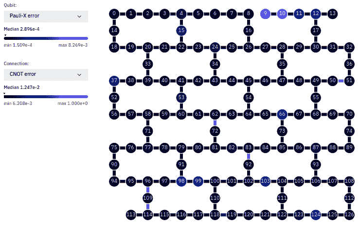

图 9.1 – IBM 华盛顿设备的错误图，配备 127 个超导量子比特（Eagle r1）

在*图 9.1*的左侧，我们可以看到 Pauli-X 门的误差率。这表示该操作对所应用的量子比特的影响失效的次数。我们可以在给定时间内为设备中的每个量子比特检索此信息。

前图中的另一个相关信息是 CNOT 两比特操作，它是量子比特间相互作用和生成纠缠所必需的。我们可以看到，单比特操作的误差率处于合理的中值（10 −4）。然而，对于两比特纠缠门（CNOT），尽管中值较低（10 −2），我们仍然可以看到在某些耦合中它会升高到 100%的概率（查看量子比特 96、109 和 114），这意味着几乎所有涉及这三个量子比特的纠缠操作都将面临完全失败。

更重要的是，我们应该考虑这些指令在之前设计的电路中涉及的数量。如果我们以**第五章**中覆盖的投资组合优化用例为例，每个资产都会显著增加操作的数量，因为我们需要覆盖其与每个其他资产的关系。为了有效实现电路，将需要更多的指令。电路深度指的是必须按顺序执行的量子门（操作）的最长序列，从输入到输出。更正式地说，在量子电路模型中，电路的深度是执行电路所需的最大时间步数，假设作用于不同量子比特的门可以同时执行。随着电路深度的增加，更多的量子门将参与到电路中。这个事实造成了噪声被引入系统的累积概率，因此我们将面临更高的错误率。这就是为什么社区专注于创建更浅的电路来解决同样的问题（*Bravyi 等人 2018*）。

有一些技术可以提高我们电路的有效性，专门处理这些错误源。理想情况下，我们希望将电路从底层硬件的具体性质中抽象出来。从经典领域的经验来看，已经提出了错误检测方案和纠正码。

让我们考虑一个简单的例子，即之前提到的位翻转错误或泡利-X 错误。假设一个位于|ψ⟩状态的单个量子比特需要通过一个嘈杂通道ϵ进行传输，这个通道也可以被看作是电路运行所需的时间。在这种情况下，噪声表现为以概率 p 发生的 X 门。因此，如果我们将这个单个量子比特状态传递通过该噪声通道，最终的状态有(1 - p)的概率将被读取为预期的结果状态|ψ⟩，有 p 的概率为翻转版本(X|ψ⟩)。

我们可以使用三个位物理量子比特代替物理量子比特（实际硬件基础的量子比特），从而替换编码状态的单个量子比特，形成一个更高级的抽象或逻辑版本。

我们潜在的|ψ⟩状态的逻辑表示可以通过以下方程描述：

|0 L⟩ ≡ |000⟩

|1 L⟩ ≡ |111⟩

我们可以通过使用纠缠态来描述逻辑量子比特，从而识别任何位翻转。如果我们在某个时刻测量，例如在我们的通道中测量|010⟩态，我们将能够检测到该态的不一致性。它只能是之前描述的那些状态之一，所以系统中发生了某些事情。鉴于我们知道当前的状态，我们可以通过利用这些额外物理量子比特中的冗余信息来恢复原始状态，这些冗余量子比特被称为*综合量子比特*：

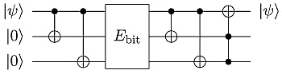

图 9.2 – 用于比特翻转检测和纠正的 3 量子比特物理编码实现

该方案对初始的|ψ⟩状态进行检测和纠正，这是量子比特内含有逻辑形式信息的一部分。错误操作（由比特块表示）因此可以被识别，并且如果它们可以映射到某些操作，甚至可以被纠正，正如我们后面将看到的那样。这是 Asher Peres（*Peres 1985,* *Peres 1996*）提出的第一个错误恢复编码之一。

这些错误发生的原因是量子比特并未完全与环境隔离。像之前展示的量子电路一样，几乎不可能完全与环境隔离，而环境本身也是一个量子力学系统，因此两者之间的相互作用可能导致一些意外的行为，进而导致影响初始状态的一组不同操作。这会导致在我们的错误块中发生四种主要的操作，这些操作可能影响我们完美的初始状态：

+   无状态: |ψ⟩

+   比特翻转: X|ψ⟩

+   相位翻转: Z|ψ⟩

+   两者: Y|ψ⟩

1995 年，Peter Shor（*Shor 1995*）建议使用 9 个物理量子比特，以便检测和纠正任何任意的变化，扩展了先前在单量子比特比特翻转和符号变化方面的研究。*图 9.3*展示了遵循 Shor 方案的其中一个逻辑量子比特的基础电路。*E*块指示错误可能发生的地方：

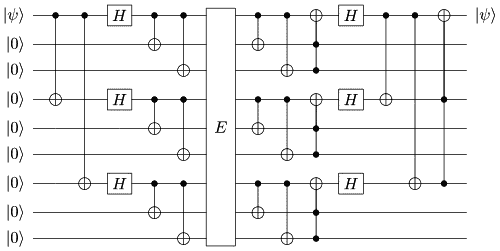

图 9.3 – 用于比特翻转检测和纠正的 9 量子比特物理编码实现（Shor）

这一研究领域已经扩展到目前的状态，并且出现了一些非常有趣的技术。从最初的环面编码（*Bravyi 和 Kitaev 1998*）的研究工作中，*Fowler 2012*提出了表面编码，并且近年来尝试在二维晶格结构上为这些技术提供一种更通用的方法。毫无疑问，这一研究领域将在完全发展后使得算法设置与硬件无关，一旦量子硬件能够提供所需的物理量子比特数量。

当然，这使我们不得不考虑实现依赖于所有干扰和错误源的逻辑量子比特所需的物理量子比特数量的极限。在实际系统中，具有错误恢复能力的量子计算可能需要相当多的物理资源。据建议，物理量子比特的数量大约为每个逻辑量子比特 1,000 个，尽管这个数字可能因特定实现而有所不同。

再次引用彼得·肖尔和他著名的质因数分解算法，要有效地解码一个 2,048 位的 RSA 整数，在 8 小时内（*Gidney & Ekerå 2021*），我们需要提供一个大约 2000 万个物理量子比特的量子机器，原因是需要使用逻辑量子比特来克服硬件生成的错误。从这一点可以看出，在当前的噪声环境和物理约束下，我们离实现这些方法还有很长的路要走。

使用逻辑量子比特进行电路实现也在资源的可扩展性方面提出了挑战。盲目地尝试应用它们将迫使硬件供应商扩展到百万量子比特的规模，这似乎是一个长期的赌注，即使对于一些当前可用的硬件来说是可行的（*Fellous-Asiani 2021*）。

一些供应商认为这是应该遵循的方法，这也是为什么他们的产品路线图旨在提供数百万个量子比特，尽管在更大规模上操作的保真度可能会下降。谷歌是这些供应商之一，目标是构建百万量级的量子比特设备，正如他们的路线图所显示的那样（[`quantumai.google/learn/map`](https://quantumai.google/learn/map)）。

## 容错方法

扩展量子错误检测和修正的概念，容错量子计算扩展了经典计算中已知的一些技术的应用范围。一个完全容错的系统（*Paler 和 Devitt, 2015*）应在物理量子比特级别和系统级别上寻找错误，以便我们的电路能够运行，即使它们在某个时刻需要切换硬件实例。当我们希望将前几章中展示的技术和示例从理论应用到实际领域时，这个概述是一个关键因素。

正如我们之前讨论过的那样，量子领域中的一些错误可以被检测和修正。其他错误可能来源于系统性缺陷，例如读取错误，我们将在后面讨论。但是，一些错误可能来源于这些机器在服务级别的故障。大多数使用的量子设备处于实验室状态，因此它们的可用性可能低于我们在其他经典服务中习惯的水平。

我们将在排队时间和非操作周期中遇到这些量子设备，它们在操作上可能不会那么有用

：


图 9.4 – Azure 和 IBM 云服务的可用性和排队时间

生产环境需要意识到整个操作链可能带来的问题，从数据收集到结果处理再到预处理。特定问题也可能会利用对更大系统的需求，而这些系统通常更为稀缺，因此，获取可用计算时间会更加困难。

在某些情况下，我们可能能够将问题适配到不同的设备中以并行化工作负载。然而，这些不同的设备将配备不同的错误缓解和修正技术，导致一些小的差异。这使得分布式量子计算（*Häner 等 2021*）成为一个必要但仍处于起步阶段的领域。

获得所有优势的一个关键要求是能够互连这些设备而不失去量子优势的技术。这可以通过使用光纤和贝尔态作为通信状态来实现，进入量子通信和量子互联网的有前景领域（*Kimble 2018*）。

更实际地说，像 IBM 这样的供应商已经提出使用现有的通信网络和经典分布式系统的知识，不是为了实现量子网络系统可能提供的理论增益，而是突破单芯片计算的障碍，单芯片计算如今限制了我们练习的能力。

# 电路编织

电路编织在最近被提出（*Piveteau 和 Sutter 2022*），考虑到在不引入大量错误的情况下提供更大芯片的复杂性。与其追求更大、更完全的量子芯片，不如考虑分布式资源系统，在这些系统中，这些实例是经典连接的。

这种架构已在分布式 GPU 计算领域（*Gu 等 2019*）、大数据的分布式计算领域（*Zaharia 等 2012*）甚至边缘计算领域（*Shi 2016*）得到应用。然而，它并不意味着从经典到量子的范式转变，因为所有这些资源都在相同的物理层面上工作。

这些方法与电路编织的主要区别在于，需要拆分一个量子电路，该电路在经典情况下会与电路的其他部分通信。假设有一组门能够最小化两个更密集连接的操作组之间的切割，你可以将电路分成两组，用经典方式替代连接两组之间的量子交互，如*图 9.5*所示，其中两个 CNOT 门可以被重塑为两个可分割的电路（经典连接）：

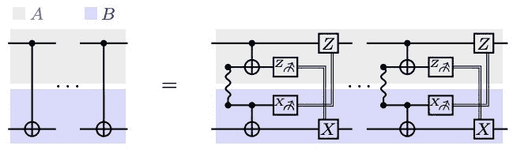

图 9.5 – 两个 CNOT 门被拆分为经典连接电路的块

你需要反思，当将量子状态转化为经典比特和字节再转回来时，量子优势如何被妥协。你还必须思考将初始设计拆分为密集连接和弱连接电路块的能力。

对于稀疏连接的示例，这些方案可能提供显著的优势。然而，我们看到的一些示例需要量子比特之间的全对全连接，这使得拆分更加复杂，并且无法丧失量子硬件所追求的实际计算增益。

# 错误缓解

一些常见的误差来源可以通过更系统的方法来解决，因为测量量子硬件的经典结果并非没有误差。幸运的是，这种类型的误差可以通过观察读取时常见的错误并对结果进行后处理补偿来解决。

如果我们再次查看我们的 IBM Quantum Experience 服务，我们可以请求某个设备的读取误差。在*图 9.6*中，我们可以观察到，在对量子比特 10 和 15 进行操作时，测量结果可能会被误解：

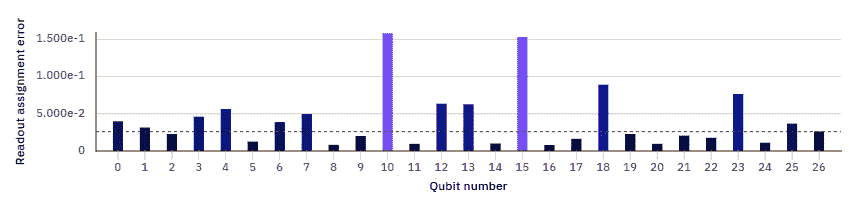

图 9.6 – IBM Toronto 设备的读取误差（27 个超导量子比特 Falcon r4）

这些统计数据可以通过简单地放置一个已知结果的操作（例如，X|ψ⟩），并记录在进行大量实验时测量的差异来得出。如果这些统计数据是已知的，你可以通过了解这个系统误差来补偿实验中的测量结果。

让我们考虑一个简单的情境。假设我们分别对两量子比特的所有可能组合进行编码。这些状态是通过在相应的量子比特上施加 X 门来准备的，并且我们对每种情况在 10000 次实验中得到了以下结果：

```py

Prepared state: 00 Measured:      {'01': 102, '11': 3, '10': 97, '00': 9798}
Prepared state: 01 Measured:becomes      {'00': 92, '11': 102, '01': 9806}
Prepared state: 10 Measured:becomes      {'01': 5, '00': 99, '11': 106, '10': 9790}
Prepared state: 11 Measured:becomes       {'01': 99, '10': 97, '11': 9804}
```

我们可以看到，输出几乎总是正确的，在我们通过应用 X 门准备的状态中，10000 次电路运行中有 9800 次接近正确。但这并不是一个完美的统计，因为在 1-2%的情况下，测量结果会出现意外的比特串（例如，当我们准备了|00⟩状态时，测量得到 11）。如果对于我们在之前实验中使用的设备，在 100 次尝试中得到了以下输出，你会怎么想？

```py

{'01': 2, '11': 52, '10': 2, '00': 46}
```

一半的时间，我们得到了 11 比特串，另一半时间得到了 00，偶尔会测量到 01 和 10。我们已经知道该设备有 1-2%的误差率，会使量子比特状态发生翻转。因此，我们能否假设在|00⟩和|11⟩状态之间有叠加？也许是一个贝尔态？

通过理解给定设备相较于理想操作表示所引入的系统误差，我们可以表征其误差并通过逆效应进行缓解。通过设置一个矩阵转换来执行操作映射，将准备的状态与测量的状态进行比对，我们可以在每次实验的测量中进行误差修正。

Qiskit 已经在其实验包中提供了一些这些功能：

```py

from qiskit_experiments.library import CorrelatedReadoutError
qubits = [0,1]
num_qubits = len(qubits)
exp = CorrelatedReadoutError(qubits)
for c in exp.circuits():
    print(c)
```

上述代码将绘制出用于校准读取误差的电路，如*图 9.7*所示。

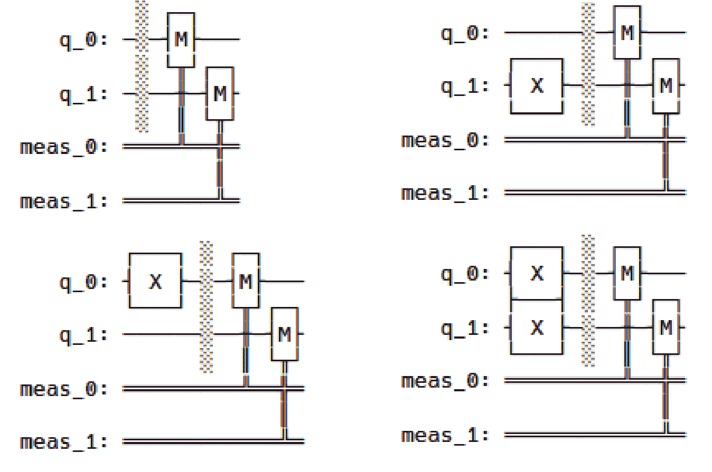

图 9.7 – 两量子比特设备的校准电路

通过这种方式，仅通过调用一个嘈杂的后端进行校准，我们将获得缓解读取误差所需的矩阵。

作为一个例子，如果我们以`ibmq_lima`设备上的 |00⟩ 状态为例，就像前面图表中显示的第一个电路一样，我们预计只会读取到 00 比特串。然而，我们会看到它的图表与预期结果不同，绘制出一些不想要的或意外的比特串：

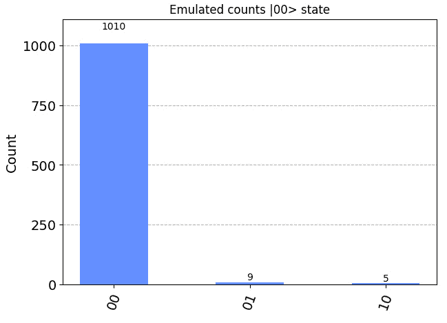

图 9.8 – 在 1,024 次实验后对 |00⟩ 状态的估计

在这里，我们可以使用之前的电路来校准设备上的系统误差，如*图 9.7*所示：

```py

result = exp.run(emulator)
mitigator = result.analysis_results(0).value
result.figure(0)
```

通过这样做，我们将获得一个类似于以下的矩阵，该矩阵适用于先前测量的比特串的计数。通过这种方式，它将能够在测量时纠正设备的系统误差。通过绘制这个矩阵，我们会看到，除了明显的黑色映射外，还会出现灰色区域，表示某些状态从准备状态过渡到测量状态的过渡。这就是所谓的缓解矩阵，因为它允许我们映射在状态之间发生的系统性过渡。一旦应用于测量后，它可以逆转或至少补偿设备内发生的错误造成的影响：

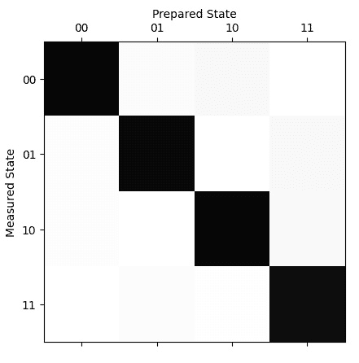

图 9.9 – |00⟩ 状态的缓解矩阵

通过这种方式，我们可以比较缓解和未缓解结果的图表。这个矩阵能够提取一个具有负概率值的概率分布，因此，一旦它应用于比特串测量后的结果概率，其补偿效果将绘制测量的准概率。在这里，准概率是指相较于常规概率分布的放松，因为负值可能会反映在结果中：

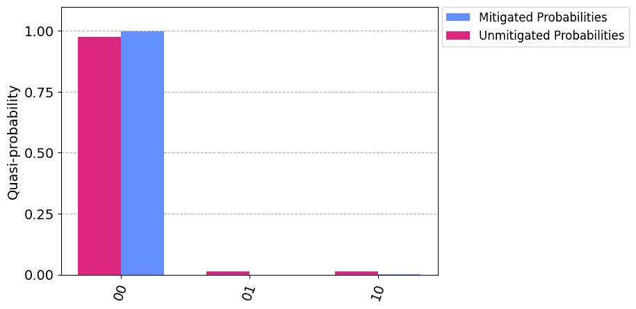

图 9.10 – 获得状态 |00⟩ 的概率，带有和不带有误差缓解

请注意，当扩展到更大的设备（更多的量子比特）时，这种技术可能效果不佳，因为我们需要对系统中可用的量子比特数量的所有可能组合进行表征，以获得这些统计数据。这就是为什么针对大规模设备（具有多个量子比特的设备）提出了不同的误差缓解方法，这些方法在大规模设备上能够表现得更好。让我们来看一下这些早期研究领域，深入探讨误差缓解：

+   **概率误差消除**（*Pashayan 等，2015*）是一种试图描述理想门集输出概率的技术，因此可以将其视为一种更通用的误差消除技术。这个概念与上面描述的误差缓解相同，都是希望为特定设备设置并修正输出概率，但在这种情况下，使用的是蒙特卡洛平均概率。

+   **零噪声外推**（*Giurgica-Tiron 等，2020*）更适用于使用期望值的情况。通过运行硬件并增加其噪声因子（λ）来建模误差，从而拟合曲线。如果硬件噪声设置为 λ = 1，那么该模型可以用于估算 λ = 0 时的期望值，因为这就是我们的误差缓解期望值。

+   **动态解耦**（*Viola 等，1999*）是一种几乎在硬件的最低层级上进行的技术。我们之前提到的每个门操作都有不同的物理含义。例如，在 IBM 的情况下，这些操作是脉冲，脉冲的持续时间会根据所执行的操作有所不同（可能更长或更短）。由于指令长度之间存在差异，当某些量子比特空闲一段时间时，其他量子比特会受到操作。这些空闲的量子比特容易由于与环境的相互作用而发生错误。通过引入一系列不会影响问题结果的操作，我们可以保持这些量子比特处于活跃状态，从而减少因空闲而产生的错误。

如果你不想深入到所使用硬件的电子学层面，Mitiq 框架已经启用了一个数字动态解耦包，这样我们就可以从那些 DD 方案的复杂性中抽象出来（[`mitiq.readthedocs.io/en/stable/guide/ddd-5-theory.html#common-examples-of-ddd-sequences`](https://mitiq.readthedocs.io/en/stable/guide/ddd-5-theory.html#common-examples-of-ddd-sequences) 和 [`mitiq.readthedocs.io/en/stable/guide/ddd-3-options.html`](https://mitiq.readthedocs.io/en/stable/guide/ddd-3-options.html)）。

鉴于应用之前描述的大多数技术所需的复杂性和特定知识，许多公司在其路线图中增加了一个硬件/软件中间层，负责处理这些技术。像 IBM 这样的公司已经将这些技术纳入其最近发布的 Qiskit Runtime，或者与技术提供商如 Riverlane 合作，后者旨在构建一个完美的抽象层，连接算法开发者和硬件提供商。

在中期，需要对这些错误的处理方式以及用户如何从中抽象出来做出一些重要的改变。然而，在撰写本文时，需要早期采用者特别关注，选择一组技术以便充分利用硬件提供商的能力。

# 退火器和其他设备

我们主要谈论的是数字量子计算机，这些计算机使用门的抽象来操作量子比特。但是，像*第五章*到*第七章*（D-Wave 的量子退火机）中使用的量子退火机在处理更大规模的问题时也会出现错误和问题，主要是在增加我们操作中涉及的资产数量时。

如果以资产组合优化为例，D-Wave 提供了最多 5000 个量子比特的芯片，这可能意味着需要优化最多 5000 个资产组合。

退火机要求问题被编码或映射到其硬件上，这涉及使用 QUBO 或 Ising 模型表示资产，并将它们分配到芯片上的特定量子比特。然后，这些变量之间的关系被映射到量子比特之间的耦合。那些链接将承载与给定对相关的参数，这通常在 Ising 类型问题的标准形式中表示为 J ij，如下所示：

H(σ) = − ∑ 〈ij〉 J ij σ i σ j − μ∑ j h j σ j，

在这里，σ j 将是映射到设备中的量子比特的变量。这种连接并不总是存在，因为设备本身可能缺乏在全连接问题中所需的一些连接。

事实上，在 2019 年，Venturelli 和 Kondratyev 通过利用次级嵌入编译技术，成功地将最多 60 个资产组合嵌入到 DW 2000Q 系统中。这使他们能够将所有资产放置在一个一维串中，从而可以将它们放置在 Chimera 芯片上。由于嵌入技术的开销，这是他们能够实现的最大规模，即使是对于一个 2000 量子比特的系统。这个限制在查看*图 9.11*的芯片架构时是显而易见的：

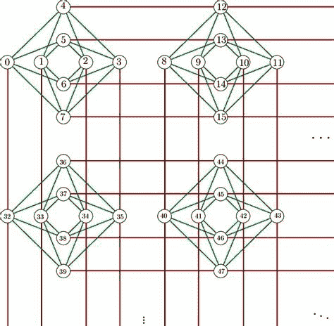

图 9.11 – D-Wave 的 Chimera 芯片量子比特架构和耦合图（32 量子比特方阵）

在前述的 Chimera 图中，我们可以看到每个量子比特通常直接连接到另外 5 个或 6 个量子比特。这意味着，如果一个表示变量的量子比特需要更多的连接，而它所拥有的连接数不足，你就需要将多个量子比特实例连接成链，因为它们将代表问题的同一个变量——因此叫做链，意味着两个量子比特作为一个单元工作。通过这种方式，通过失去一个耦合器，量子比特几乎可以将其连接能力翻倍。

这就是 D-Wave 所称的链。这是通过在这两个单元之间设置强耦合来建立的，使得它们将返回相同的值（记住，它们指的是相同的量子比特）。在这种情况下，这两个物理量子比特代表（或应代表）相同的逻辑单元或量子比特。

然而，这个链条可以被打破。通常，这些耦合的强度高于被嵌入的特定问题的参考值。然而，它们可能在读取时返回不同的值，意味着链条被打破，所获得的解可能不符合我们问题定义中的有效解。要深入了解这个链条的概念，D-Wave 的文档提供了大量相关信息（[`docs.ocean.dwavesys.com/en/stable/concepts/embedding.html`](https://docs.ocean.dwavesys.com/en/stable/concepts/embedding.html)）。最终，我们在量子设备的通用案例中发现的许多限制，也可以在特定机器中找到，例如量子退火器。

# 总结

在本章中，我们探讨了使用真实硬件可能带来的挑战。根据硬件的具体性质，无论它是特定用途的（如量子退火器）还是数字量子计算机的众多实现之一，这些概念仍然难以忽视。

意识到给定问题的映射是在硬件层面进行的，关注哪些量子比特被使用，它们的相关误差，以及这如何反映在结果中，你可以实施对策，以确保结果仍然具有足够的分辨率。这样，量子计算所期望的优势仍然可以是显著的。

通过理解不同的挑战以及它们如何影响给定的问题设置，你可以选择更适合问题的硬件。

退火器可以用于解决大规模问题，但在嵌入限制和能够解决的问题类型方面，它们并不像你想象的那样能处理如此庞大的问题。与其他提供商相比，D-Wave 的量子比特数量仍然在数千量级，并预计在 2023/2024 年达到接近 8000 个量子比特。然而，这仍可能不足以编码某些规模上行业所需的问题。

数字量子硬件提供了不同类型的物理实现供选择，从 IBM 提供的超导芯片，到 QuEra 的冷原子技术，再到微软的拓扑量子比特。

毫无疑问，每种技术都会提供不同的耦合架构或误差水平，以确保操作的保真度或读取准确性。对这一点有最基本的理解，将在短期内至关重要，因此，勇于探索的人可能需要自己了解这些硬件规格。幸运的是，IBM 在 Qiskit Runtime 和电路编织技术方面的积极努力，可能很快就会让你不再需要理解如何将问题最优地嵌入到你的设备中。然而，这项技术仍处于起步阶段，旨在提供重大的进展，同时努力接近 D-Wave 提供的数量（[`www.ibm.com/quantum/roadmap`](https://www.ibm.com/quantum/roadmap)）。

谷歌也在稳步推进，专注于将其设备扩展到数百万量子比特的范围，超越竞争对手，力图实现误差修正量子比特所需的规模。到目前为止，他们已经稳步进展，但要使用现有的设备，你需要进入特权合作伙伴名单（[`quantumai.google/hardware`](https://quantumai.google/hardware)）。

最后，像 IonQ 和 Quantinuum 这样的离子阱提供商，专注于提供最好的硬件。它们的质量是一个重要的里程碑，标志着它们在整合操作数时提供一致性改进，同时提供有意义的结果（[`www.quantinuum.com/news/quantum-volume-reaches-5-digits-for-the-first-time-5-perspectives-on-what-it-means-for-quantum-computing`](https://www.quantinuum.com/news/quantum-volume-reaches-5-digits-for-the-first-time-5-perspectives-on-what-it-means-for-quantum-computing)）。

你永远不能忘记，这是一个积极研究的领域，科学突破在其中是指日可待的。某些针对可扩展性特定技术的限制可能会在下一个十年内得到解决，因此不要犹豫，去尝试所有不同的选项，以便做好准备。得益于云服务提供商，现在这一切比以往更加容易。与合适的服务商合作或选择合适的提供商的一个重要关键是平衡问题的规模、连接性和准确性，以提供有意义的结果。这很可能会影响你在不久的将来的决策。

# 进一步阅读

值得强调的是，我们在本章讨论的技术，理解其优势时需要较少的技术细节。有趣的是，黄等人（2022 年）的研究引用了从算法定义到在设备上执行低级操作的完整路径，并提供了一些详细信息，说明之前讨论的误差缓解技术如何被应用：

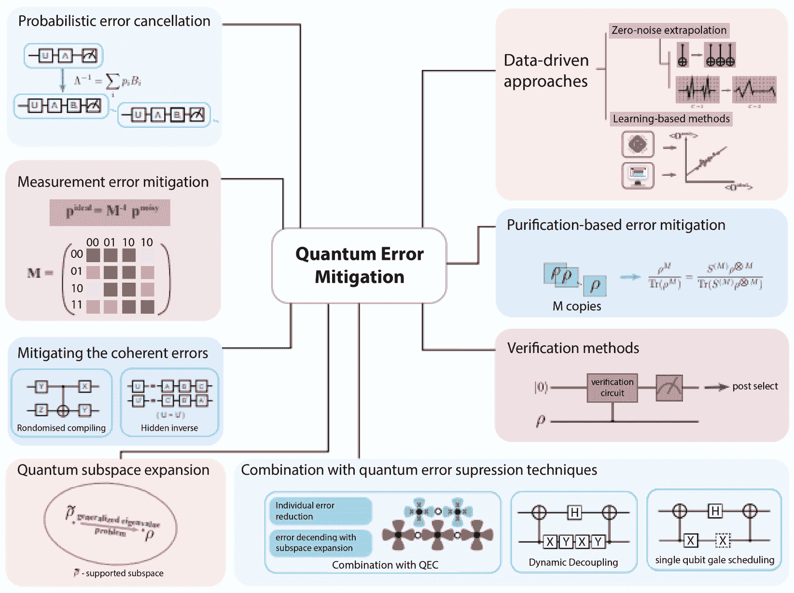

图 9.12 – 量子误差缓解技术的全景

你也可以从开源社区中找到现有的实现，这样你就可以应用它们，而无需具备深入的技术知识来编写文献中已有的代码。如今，发布结果的实现版本公开发布已变得非常普遍。

Qiskit 是量子计算领域最成熟的框架之一，具有丰富的文档和实用教程，这将使理解这些概念变得更加容易。

与硬件相关的教程和低级实验，例如我们在本章中涉及的内容，可以在他们的实验库文档中找到：[`qiskit.org/documentation/experiments/tutorials/index.html`](https://qiskit.org/documentation/experiments/tutorials/index.html)。

另一个有趣的资源是 Mitiq 包，它由非营利组织 Unitary Fund 支持。这个资源不仅在不同的硬件和云服务提供商上实现了已经讨论过的一些技术，还提供了详尽的文档和一个充满活力的社区，您可以加入该社区讨论任何与高效量子计算相关的话题：[`mitiq.readthedocs.io/en/stable/index.html`](https://mitiq.readthedocs.io/en/stable/index.html)。

# 参考文献

*Bravyi, S. B., & Kitaev, A. Y. (1998). 带边界的格上的量子编码。arXiv* *预印本 quant-ph/9811052。*

*Bravyi, S., Gosset, D., & König, R. (2018). 浅电路下的量子优势。科学，* *362(6412), 308-311。*

*Fellous-Asiani, M., Chai, J. H., Whitney, R. S., Auffèves, A., & Ng, H. K. (2021). 量子计算中的资源约束限制。PRX Quantum，* *2(4), 040335。*

*Fowler, A. G., Mariantoni, M., Martinis, J. M., & Cleland, A. N. (2012). 表面码：迈向实用的大规模量子计算。物理评论 A，* *86(3), 032324。*

*Gidney, C., & Ekerå, M. (2021). 如何使用 2000 万个嘈杂的量子比特在 8 小时内分解 2048 位 RSA 整数。Quantum，* *5, 433。*

*Giurgica-Tiron, T., Hindy, Y., LaRose, R., Mari, A., & Zeng, W. J. (2020 年 10 月). 量子误差缓解的数字零噪声外推。在 2020 年 IEEE 国际量子计算与工程会议(QCE)中（第* *306-316 页）。IEEE。*

*Gu, J., Chowdhury, M., Shin, K. G., Zhu, Y., Jeon, M., Qian, J., ... & Guo, C. (2019). Tiresias：一个用于分布式深度学习的{GPU}集群管理器。在第 16 届 USENIX 网络系统设计与实现研讨会(NSDI 19)中（**第 485-500 页）。*

*Hamming, R. W. (1950). 错误检测与错误纠正码。贝尔系统技术期刊，* *29(2), 147-160。*

*Häner, T., Steiger, D. S., Hoefler, T., & Troyer, M. (2021 年 11 月). 使用 qmpi 进行分布式量子计算。在国际高性能计算、网络、存储与分析会议论文集中（**第 1-13 页）。*

*Huang, H. L., Xu, X. Y., Guo, C., Tian, G., Wei, S. J., Sun, X., ... & Long, G. L. (2022). 近期量子计算技术：变分量子算法、误差缓解、电路编译、基准测试和经典模拟。arXiv* *预印本 arXiv:2211.08737。*

*Kimble, H. J. (2008). 量子互联网。自然，* *453(7198), 1023-1030。*

*Lindblad, G. (1999). 一般的不可克隆定理。数学物理学通讯，* *47(2), 189-196。*

*Paler, A., & Devitt, S. J. (2015). 容错量子计算简介。arXiv* *预印本 arXiv:1508.03695。*

*Pashayan, H., Wallman, J. J., & Bartlett, S. D. (2015). 使用准概率估算量子电路的结果概率。物理评论快报，* *115(7), 070501。*

*Peres, A. (1985). 可逆逻辑与量子计算机。物理评论 A，* *32(6), 3266。*

*Peres, A. (1996). 量子计算机中的错误修正与对称化。arXiv* *预印本 quant-ph/9611046.*

*Piveteau, C., & Sutter, D. (2022). 使用经典通信的电路编织。arXiv* *预印本 arXiv:2205.00016.*

*Shi, W., & Dustdar, S. (2016). 边缘计算的前景。Computer,* *49(5), 78-81.*

*Shor, P. W. (1995). 量子计算机内存中去相干的减少方案。Physical review A,* *52(4), R2493.*

*Venturelli, D., & Kondratyev, A. (2019). 反向量子退火方法在投资组合优化问题中的应用。Quantum Machine Intelligence,* *1(1), 17-30.*

*Viola, L., Knill, E., & Lloyd, S. (1999). 开放量子系统的动态解耦。Physical Review Letters,* *82(12), 2417.*

*Zaharia, M., Chowdhury, M., Das, T., Dave, A., Ma, J., Mccauley, M., ... & Stoica, I. (2012). 基于 Spark 的 Hadoop 数据快速交互式分析。Usenix Login,* *37(4), 45-51.*
