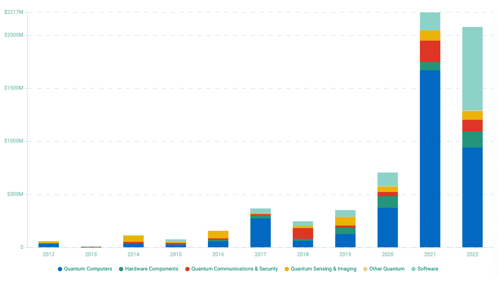
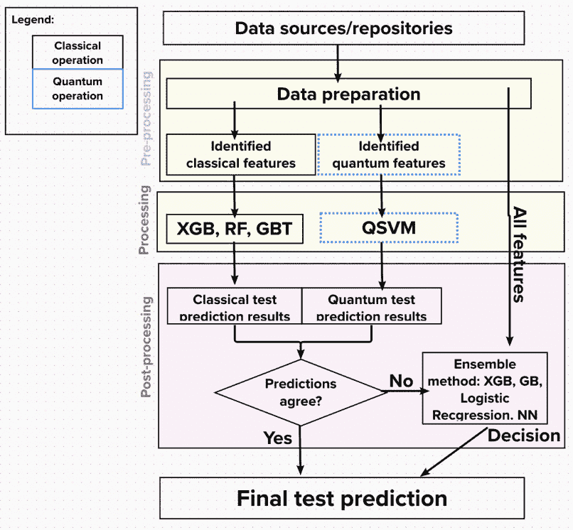
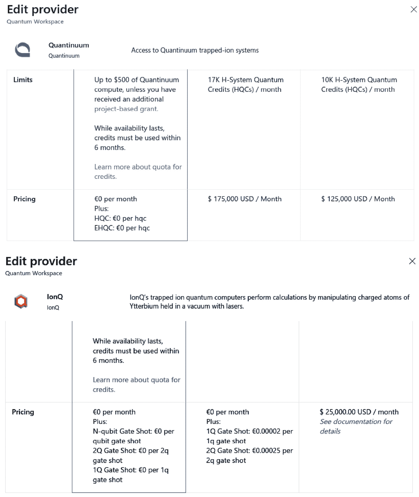
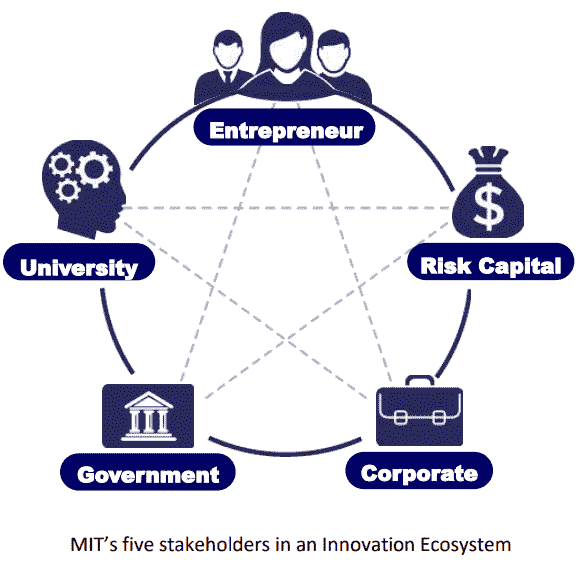
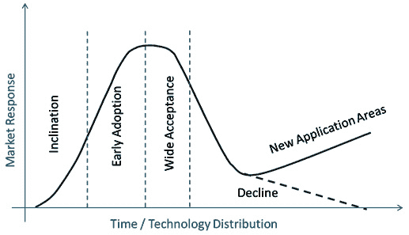

# 10  

# 商业实施  

Zapata Computing 在 2021 年 12 月发布了其首份年度报告。报告中提到了对 300 多名领导者（CTO、CIO、C 级高管和副总裁级别高管）进行的调查结果。即使排除像 Zapata Computing 这样的量子生态系统参与者可能存在的偏见，结果仍然提供了有用且有趣的信息，揭示了量子计算的应用现状。  

尽管一些企业已经希望使用量子技术一段时间，但它们与量子硬件之间的桥梁尚未搭建完成。软件应用应该是连接这两个世界的桥梁。根据 Zapata Computing 的报告，74%的受访者同意，不采用量子计算解决方案的公司很快会落后。此外，29%的受访者已经进入量子计算的初期或高级阶段，另外 40%的人预计会在 2022 年跟进。同时，96%的受访高管表示，他们需要一个可靠的合作伙伴或供应商，帮助他们克服量子障碍。

另一方面，凯捷研究院发布了一份名为《量子技术：如何为量子优势做好组织准备》的报告，发布时间为 2022 年。报告中最重要的见解之一是，23%的公司已经在使用量子技术或计划使用。然而，许多公司尚未进行测试或试点。此外，根据高盛 2021 年的预测，量子计算可能会在未来五年内开始在实际金融应用中带来量子优势，大多数调查结果显示，预计在未来三到五年内，量子解决方案（特别是某些特定使用案例）将进入实际和商业化应用。凯捷对 857 家组织的调查显示，其中 10%的组织预计量子技术将在未来三年内用于至少一个重要的商业应用。  

有许多报告，如上述报告，以及来自麦肯锡、BCG、埃森哲和安永的报告，展示了公司如何以不同方式启动他们的量子之旅。大多数公司也遇到了一些主要障碍，通常包括以下几点：  

1.  IT 集成的复杂性  

1.  安全性问题  

1.  缺乏先进的内部能力  

1.  缺乏专业知识或人才  

1.  缺乏明确的使用案例  

1.  内部怀疑态度  

1.  缺乏这些计划的预算或资金  

1.  硬件市场的成熟度不足  

《量子至上之路》（*The Road to Quantum Supremacy*）报告由 Quantum.Tech 与霍尼韦尔（Honeywell）合作发布，报告进一步探讨了将量子计算解决方案落地的困难。他们对 100 名量子项目负责人进行了调查。调查中询问了一个问题：“*你在使用量子技术时面临的最大障碍是什么？*” 大多数受访者提到的主要挑战包括：*成本*（23%）、*建立正确的关键绩效指标（KPIs）*（18%）、*说服利益相关者*（13%）、*技术的未知价值/投资回报（ROI）*（12%）和*失败的恐惧*（5%）。

如前所述，市场似乎正朝着量子计算快速获胜的需求发展，并试图克服在各种报告中提到的一些障碍。量子软件开发可能是部分解决这些挑战的关键。我们之前知道，2018 年至 2021 年间，量子技术的投资有所增加，但现在看起来也在放缓，并且正在经历过渡期。2021 年，量子计算机的直接投资为 16.7 亿美元，软件的直接投资为 1.68 亿美元，分别占总投资的 77%和 7%。2022 年，量子计算机的投资为 9.42 亿美元（45%），软件的投资为 7.85 亿美元（38%）。2022 年的总投资仅为 2021 年投资的 93%。这是市场放缓的一个显著迹象（*The Quantum Insider,* *2022 年 12 月*）。

图 10.1 – 量子技术投资演变（《量子内幕》，2022 年 12 月）

市场正朝着一个阶段发展，在这个阶段，将量子软件应用于现实世界问题并展示更多可量化且广泛的优势，可能比仅仅讨论这些优势更为重要。研究人员和量子初创团队总是在寻找这些系统功能如何应用于当前商业环境的例子。这可以促进投资，并澄清在几个月、几年或几十年内能够实现的目标。

本章将带您了解一些使用案例和策略，帮助克服与量子计算在金融机构实施相关的大部分挑战和误解：

+   量子劳动力障碍

+   基础设施整合障碍

+   通过量子机器学习（QML）识别量子优势的潜力

+   资金或预算问题

+   市场成熟度、炒作和怀疑

+   金融机构早期采用量子计算的路线图

+   量子管理人员培训

# 量子劳动力障碍

培养能够操作量子计算机的人才是量子技术增长和采纳的重要方面。随着量子计算机的普及，对精通这些系统的专业人才的需求将不断增加。

组织可以投资于培训项目和教育计划，以培养这些技能。这些项目可能包括量子计算原理和算法的专业课程、编程语言和软件开发工具的培训，以及与量子计算机配合使用的云基础设施实施。

在 QTEdu 和 Quantum Flagship 联合开发、欧盟资助的一份报告《*量子技术的资格概况*》（2022 年）中提到了几种**量子职位**。有些是随着该技术和市场的演进而出现的新职位。当然，工程师需要负责硬件和软件的开发，但量子技术战略师职位出现在高度专业化的职位中间。报告对这些战略师的定义是：

*这样的人已经探索过所有基础的量子技术，并且至少了解一些更具体的方面、硬件和使能技术。通过他们的教育，他们已经探索了基本概念，了解了量子技术的物理基础，并将这些与* *面向应用的方面紧密联系起来。*

可以观察到，除了应对技术挑战外，还需要多种类型的量子专业人才来找出高度复杂的观点与商业问题之间的联系，而这些问题可以通过这些应用程序得到解决。

除了培训项目外，组织还可以投资于研发工作，推动量子计算领域的发展。这些工作可能涉及与学术机构、政府机构和其他组织的合作，推动前沿的量子计算技术，并开发新的技术和应用。

总体而言，培养操作量子计算机的人力资源是量子技术增长和应用中的一个重要方面。通过投资培训项目和研发工作，组织可以建立起有效使用和利用这些系统的专业知识和知识库。

## 案例研究

**摩根大通**（**JPMC**），全球领先的金融机构之一，正在通过投资该领域的人才培养，迈向计算的未来。随着量子技术潜力的不断增长，摩根大通旨在将自己定位于这一革命性领域的最前沿。通过全面的方法，摩根大通正在通过教育、研究合作和内部发展计划培养人才。

近年来，摩根大通（JPMC）已经制定了保持在量子计算领域领先地位的策略，而人才是其中的关键领域。2020 年，他们推出了量子计算助理项目，旨在吸引具有计算机科学、数学和工程等领域的硕士和博士学生，并且这些学生要有量子计算及其应用方面的经验。值得注意的是，金融经验或知识并不是必须的，但申请者需要熟练掌握 Python 编程。成功的申请者将参与一种混合模式，为公司带来利益，同时也推动社会的科学知识进步。JPMC 主要在建立一个内部量子实验室，旨在提供潜在优势，同时通过公开发布（论文和文章）采用科学方法，旨在增强生态系统。

目前，大约有 10 位专业人士在 LinkedIn 上展示与 JPMC 相关的量子职位，此外，还有超过 100 人从事与这些技术相关的工作，涉及工程、研究、数据科学和定量建模等领域。除此之外，他们还在与芝加哥量子交流中心（Chicago Quantum Exchange）、Quantinuum、Q-NEXT 和 IBM 等机构建立强有力的合作伙伴关系。

## 培训资源的关键技能

使用量子技术和计算机培训内部资源可以成为公司和组织在这一快速发展的领域中建立专业知识的有效途径。通过投资培训项目，公司可以培养量子计算及相关技术的内部专业人才，这些人才可以用来推动创新并解决复杂问题。

然而，仔细考虑在量子技术和计算机领域培训内部资源的成本与效益是很重要的。培训项目可能会很昂贵，而且通常涉及到开发和实施培训的显著前期成本。

减轻量子技术内部资源培训成本的一种方式是与具有该领域专业知识的学术机构或其他组织建立合作关系。这些合作关系可以提供访问专业培训项目和资源的机会，帮助降低整体培训成本。

降低量子技术内部资源培训成本的另一种方式是聚焦于针对组织特定需求量身定制的培训项目。通过识别与组织目标和任务最相关的关键技能和知识，公司可以设计出更高效且具成本效益的培训项目。例如，当前大多数组织的数据科学和机器学习领域，当需要使用某些 Python SDK 来实现量子计算解决方案时，技能可能会有所重叠。具体了解团队当前的技能，并围绕这些项目缩小目标，可以通过培训过程快速取得成果，或者在量子计算方面获得初步结果或概念验证（PoC）。

与此同时，尽管 NISQ 时代仍然存在，且量子计算机尚未足够强大，但可以培养人才，利用量子启发的解决方案（基于张量网络），并且还可以借助 GPU 和 HPC 与量子算法（这些算法全部基于经典计算机而非量子计算机）的结合。

最终，是否投资于量子技术和量子计算机的内部资源培训，将取决于组织的具体需求和目标。通过仔细考虑成本和效益，公司可以决定是否在这些技术上培训内部资源是适合其业务的正确选择。

# 基础设施整合障碍

对于那些希望探索量子计算解决方案的公司来说，一个自然的障碍是如何将这些解决方案整合到当前的运营中。根据具体情况，真实量子硬件的技术可能更多或更少准备好进行实时响应，并与公司在云端部署的现有系统共存。特别是在量子机器学习（QML）领域，对于分类挑战（如信用评分或欺诈预测），量子计算机的即时响应可能成为需要解决的问题，因为大多数机器都有排队系统，因为可用的计算机数量较少。作为一种有效的选择，公司可以使用几种类型的云模拟器，在低量子比特范围内进行操作（大多数量子-经典混合算法在 QML 领域可以很好地在几十个量子比特的情况下运行），低于 40 量子比特的界限。

使用模拟器可以代表一个良好的成本效益选择，因为量子算法可以运行得更快（在量子比特较少的情况下）、成本更低、可以实时响应，并且可以在没有错误的情况下进行（取决于用户希望应用的设置和参数）。与需要等待每个作业或训练迭代的队列时间的真实量子计算机相比，QML 模型的训练过程可能需要几天才能完成，而对于相同的挑战，模拟器可能只需几个小时。

使用模拟器的另一个优势是，软件无论如何都会为未来量子计算机的改进做好准备，因为大多数量子 SDK（例如 Qiskit 或 PennyLane）可以轻松处理 *后端* 的变化。因此，在模拟器和正式的量子硬件之间切换，可以像调整几行代码一样简单。

关于模拟器，有多种选择，但最受欢迎且最容易使用的是那些集成在知名云平台中的模拟器。AWS Braket、Azure Quantum、Google（Quantum AI）和 IBM Quantum 是最简单的选择，因为它们可以在传统公司基础设施下使用。在 Amazon Web Services 中，可以找到 braket_sv、braket_dm、SV1、DM1 和 TN1 模拟器；在 IBM 中，有 statevector、stabilizer、extended stabilizer、MPS 和 QASM。Google 也有一种有趣的方法，提供了 qsim（一个优化的量子电路模拟器）和 **量子虚拟机**（**QVM**），它模拟了 Google 的量子计算机。根据模拟器的类型，用户可以执行的电路包含的量子比特数量从几个到超过 100 个（如 MPS 的情况）。

当通用量子计算机不可用且需要解决优化问题时，量子退火器可能是最佳选择。这项技术可以被视为更为成熟，因为像 D-Wave 这样的公司已经花费了超过 20 年的时间，使用非电路型量子计算机探索解决方案，并且它们是首个商业化这一技术的公司。

例如，D-Wave 的机器有一套求解器执行量子退火过程。在处理大规模和复杂的优化问题时，文献中也采用了类似的方法，这些方法受到冶金学中退火过程的启发（*Bertsimas 和* *Tsitsiklis，1993*）。

遵循绝热过程，D-Wave 的机器从一个已知问题开始——横场伊辛模型，然后逐步将其形状修改为一个已知的、更复杂的目标问题。整体思路是，如果机器从一个简单问题的解开始，并且我们缓慢地改变它的形状朝向更复杂的一个，那么在过程结束时，机器将会从简单问题的解演化为用户需要解决的复杂问题的解。

由于机器已经被编码为遵循这一过程，用户与其交互时只需要提供目标问题，以便 D-Wave 的机器能够产生其“魔力”。例如，投资组合优化问题就是这样。通过提供我们投资组合中资产如何相互作用的数学描述，D-Wave 的机器将按照这一过程进行处理。

D-Wave 并不是其领域中唯一的资源，随着越来越多的公司在这个领域扩展选项，其他公司也在不断增加选择。这就是富士通的数字量子退火器的例子（[`www.fujitsu.com/global/services/business-services/digital-annealer/index.html`](https://www.fujitsu.com/global/services/business-services/digital-annealer/index.html)）。关键在于它是量子启发式的，这意味着使用经典计算技术，并遵循量子启发式过程（例如量子退火过程），但就像前面提到的量子模拟器一样，使得这一技术能够更广泛地为公众所使用，并且在大多数情况下更具成本效益。

## 案例研究

CaixaBank 是西班牙最大的金融机构之一。它由多个金融领域的不同垂直业务组成，但其中对集团最为重要的业务单元之一是其保险部门 VidaCaixa。

其部分业务涉及选择最佳投资组合以提高盈利能力。我们在*第五章*中讨论了如何实现这一目标的案例。然而，看到一个实际的例子很有趣，在这个例子中，使用 D-Wave 混合求解器（经典与量子求解器的结合），他们能够更快地生成投资组合（从小时缩短到分钟），节省了高达 90% 的计算时间，**内部收益率**（**IRR**）提高了 10%，甚至能够提出比以前更多复杂的约束条件（[`www.caixabank.com/comunicacion/noticia/caixabank-group-d-wave-collaborate-on-innovative-new-quantum-applications-for-finance-industry_en.html?id=43342`](https://www.caixabank.com/comunicacion/noticia/caixabank-group-d-wave-collaborate-on-innovative-new-quantum-applications-for-finance-industry_en.html?id=43342)）。混合求解器的理念确实是合理的，因为在证明经典资源更可靠的地方使用经典资源，而将量子处理留给那些可以比完全经典方法带来更多好处的领域。我们可以在变分算法，甚至著名的 Shor 算法中看到这种例子，在这些算法中，量子过程仅是完整因式分解方案的一部分。

创新总是充满挑战，因为它需要合理的风险接受，但如果专注于公司的核心业务，就像 VidaCaixa 的情况一样，即便是全新的、还有很大改进空间的技术，也能相较于许多公司陷入的“照常业务”方式，指引出最佳的技术与问题匹配路径。

# 识别 QML 的潜在优势

在 QML 领域，金融行业有多个潜在应用，正如前面章节所概述的。以下是一些例子：

+   风险分析与管理

+   交易

+   欺诈检测

+   信用评分

+   用户流失预测

需要注意的是，尽管量子机器学习在金融领域有很多潜在应用，但该领域仍处于初期阶段。目前尚不清楚这些算法在实践中的表现如何，以及公司能从 QML 实现中获得什么。因此，分析如何衡量量子项目的成功可能是一个挑战。

尽管前述的顾虑存在，探索量子机器学习挑战的一个有趣点是，像 Qiskit（IBM）、TensorFlow Quantum（Google）和 PennyLane（Xanadu）等流行的 Python SDK 使用户和量子开发者在项目进入评估阶段时，能够进行“同类对比”。考虑到这一点，可以按照典型的机器学习项目流程来提供结构、阶段和里程碑，并且可以通过对比测量来展示哪种方法表现更好。

像 Amazon SageMaker 这样的云工具可以用于经典机器学习开发或量子实验和探索。考虑到这一点以及 Python、Jupyter Notebooks 的使用，部分结合一些当前机器学习基础设施来创建 QML 解决方案，这样的障碍可以视为相对于当前的数据科学知识及相关研究路线图而言不那么复杂。

考虑到数据科学与量子机器学习发展之间的重叠，项目管理的经典机器学习方法可以按以下步骤实施：

1.  收集数据

1.  准备数据

1.  选择和工程化特征

1.  预处理数据

1.  选择最佳模型

1.  训练模型

1.  评估结果

1.  调整参数并迭代结果

1.  将模型投入回测

1.  执行质量保证

1.  部署到生产环境

回测在 NISQ 时代将至关重要，因为需要发现将量子技术纳入当前公司工作流程的合适位置。QML 方法可以作为主要算法来创建预测，作为分析数据点及其可分性的核，或者作为集成架构，将多个算法（经典和量子）结合起来生成一个预测（*Grossi 等，* *2022，* [`arxiv.org/abs/2208.07963`](https://arxiv.org/abs/2208.07963)）。

图 10.2 – 经典与量子相结合的单一预测流程图

图片来源：来自论文《混合量子-经典方法用于量子特征选择的欺诈检测》，可在[`arxiv.org/abs/2208.07963`](https://arxiv.org/abs/2208.07963)查阅

比较经典模型和量子模型的结果将展示，在特定情况下，量子“附加功能”可能是有用的，并且即使在噪声较大的时代，也能成为一种高效的解决方案。

实施 PoC 和识别量子技术优势并非孤立的案例，而是一个不断增长的趋势。**波士顿咨询集团**（**BCG**）在 2022 年 Q2B 活动中分享了一些有趣的发现，这些发现可以总结如下：

+   终端用户在量子计算方面的实验正在起飞——2022 年有超过 100 个活跃的终端用户 PoC，与 2020 年相比增加了 3 倍。

+   目前花费超过 500 万美元用于量子计算的公司中，有 80% 计划在未来几年增加这方面的开支。

+   这一领域的早期采用者占有不成比例的价值份额。这是由于知识产权能力的建设以及与相关供应商签订合同和建立伙伴关系，后来这些可以提高他们的价格和合同要求。

波士顿咨询集团（BCG）强调，在我们目前处于的研发阶段，企业可以在量子技术采用开始增长时捕获大量价值。在几年或甚至几个月内，当这个价值可能最终得到广泛确认时，计算资源仍将保持有限，价格可能会上涨，定制的量子解决方案也将需要时间才能在生产生态系统中制作并推出。

## 案例研究

拉丁美洲最大的银行 Itaú Unibanco 开始与 QC Ware（量子软件和服务开发公司）合作，旨在通过引入量子机器学习方法来改进其流失预测模型。该合作伙伴关系旨在理解量子算法的潜力，并为 Itaú Unibanco 准备未来量子银行系统的使用和部署。

Itaú Unibanco 向 QC Ware 提供了两年的匿名用户数据和超过 180,000 个数据点，以更好地理解哪些客户可能在接下来的三个月内离开银行。QC Ware 基于行列式抽样方法开发了量子化的客户保留模型（QML）训练架构。在研发阶段，量子软件公司发现了一种将这些方法的变体应用于今天的经典计算机的方式，从而通过将捕获的提款数量提高 2% 和将模型的总体精度从 71% 提升至 77.5%，增强了 Itaú Unibanco 的模型。

在这种情况下，最重要的一点是讨论银行算法的可扩展性。尽管他们目前的量子模型运行在经典计算机上，但当量子硬件准备好并适用于银行试图解决的问题时，它们可以迅速转换为在真正的量子硬件上运行。如果发生这种情况，这些算法的加速和收益将进一步扩大。

# 资金或预算问题

许多组织已经依赖数据和分析部门，利用公司现有的信息来提取洞察力并推动业务收入。但不久之前，所有这些举措都只是创新流程中的附属项目，或者只是由组织关键人物领导的简单尝试。这主要是一个需要证明作为商业资产的愿景。

高层管理人员的支持至关重要，但大多数时候，这些创新项目必须克服资源严重不足和在已经建立的组织中对变革的抵制。最重要的是，这些项目必须追踪支出和**投资回报率**（**ROI**）。这是许多项目无法克服的一个关键方面，而考虑到一些量子硬件的高昂成本，这一点尤为重要。*图 10.3*展示了 Azure 中 Quantinuum 和 IonQ 硬件成本的一个例子，用于专用工作负载。

图 10.3 – 2022 年冬季 Azure 中 Quantinuum 和 IonQ 服务的成本

因此，很明显，涉及量子计算的这些举措也应该有一个合理的路线图，以证明它们在商业利益方面的可行性。

许多项目通常从模拟开始，这样可以只使用现有的分配资源。但如果系统规模增大，可能也需要相当多的基础设施，就像我们在 AWS 模拟 44 量子比特时所看到的那样。除了硬件访问，许多供应商还提供设备噪声模型，这样就可以使用经典方法加载并模拟真实设备的响应。这将帮助公司的远见者制定计划，指导管理层并确保项目在资源和资金方面能够得到增长。这确实是一个关键方面。

谨慎的做法可能需要展示将量子算法纳入经典解决方案中的好处。根据我们希望解决的问题的规模（例如，100 资产组合优化），我们可能需要与一些供应商讨论，看看他们是否有兴趣在我们的项目中合作。许多公司已经开始与学术机构或早期**创新驱动企业**（**IDEs**）展开合作，以便在其量子技术发展过程中获得支持并获得帮助。这是一种有趣的方法，因为它允许组织处于创新的前沿，并且在最大限度减少资源风险的同时，培养内部人才。

一旦项目成功，负责运营成本的其他部门，如企业架构、安全性或金融服务，可能也会希望参与讨论。鉴于技术的成熟度和商业解决方案的复杂性，这可能需要更长的时间，因此在涉及技术文化变革时，应该避免急功近利的做法，转而选择一场较长时间的马拉松。

## 案例研究

例如，像 Credit Agricole 这样的公司已经与 Pasqal 和 Multiverse Computing 携手合作。三方合作可以解开经典与量子资源在风险分析和资本市场管理中的复杂结合（[`pressroom.credit-agricole.com/news/credit-agricole-cib-explores-quantum-computing-applications-in-partnership-with-pasqal-and-multiverse-computing-5121-94727.html`](https://pressroom.credit-agricole.com/news/credit-agricole-cib-explores-quantum-computing-applications-in-partnership-with-pasqal-and-multiverse-computing-5121-94727.html)）。他们利用了欧洲量子旗舰计划，成立了这个联盟。因此，他们对项目的主要贡献是他们在要解决的问题上的领域知识。除了物理学家和软件开发人员外，其他领域专家专注于并引导解决方案沿着正确的路径发展，这一点至关重要，只有这样，最终成果才能在实际环境中使用。

Crédit Agricole CIB 的项目赞助人 Ali El Hamidi 这样说道：

*量子计算在理论、硬件和算法方面与我们今天所知和使用的几乎一切都截然不同。这个项目将汇集许多不同的专业能力：银行家、物理学家、数学家、计算机科学家、IT 架构师，大家共同合作* *开展* *这一非凡的旅程。这是一个巨大的挑战，我们相信，凭借我们才华横溢的合作伙伴 Pasqal 和* *Multiverse Computing*，我们一定会成功完成这一任务。*

这并不是唯一的例子。有人可能认为这些机会仅仅是大公司才能享有的。量子计算社区是开放的，并愿意接受用例的挑战。因此，像微软这样的服务提供商会向与研究机构合作的项目提供研究额度，而 AWS Braket 团队也非常愿意提供帮助。即使是一些利基市场的公司，如 Strangeworks，也提供了后台通行证和 AWS 服务的额度。

最后，免费访问也是一种可能性。两个最著名的例子是 IBM 对小型设备的免费访问和 D-Wave 每月提供的免费分钟数，允许你在没有其他访问限制的情况下使用他们的退火机一段时间。Azure 和 AWS 也提供了一些免费额度，尽管这些额度可能不会持续太久。

# 市场成熟度、炒作和怀疑

量子计算并不是我们面临的第一次技术革命。大数据、云计算、远程工作和互联网已经彻底改变了我们的工作和商业方式。特别是，我们已经从基于办公室的服务转向了应用优先的策略，以及金融行业中前瞻性的服务管理。

我们生活在一个商业环境中，在这个环境里，我们常常不知道客户的面孔。但我们可以预测他们的收入，绘制他们的消费档案，甚至推荐如何改变他们的习惯以节省开支。这是一个引人入胜的局面，如果没有周围的所有技术，这一切是不可能实现的。但在这些领域曾经存在怀疑，至少在早期是如此：

*在在线世界度过二十年后，我感到困惑。并不是说我在互联网上没有过一段愉快的时光。我结识了很多优秀的人，甚至还抓住过一两个黑客。但今天，我对这个最时尚且被过度炒作的社区感到不安。未来的愿景是远程工作的员工、互动图书馆和多媒体教室。他们谈论电子市政会议和虚拟社区。商业和生意将从办公室和商场转移到网络和调制解调器。而数字网络的自由将使政府变得**更加民主**。*

*胡说八道。我们的计算机专家难道完全没有常识吗？事实是，没有任何在线数据库能够取代你每天的报纸，没有 CD-ROM 能代替一个称职的老师，没有任何计算机网络能够改变**政府运作的方式**。*

这段文字来自 1995 年《新闻周刊》一篇名为*《为何网络不会是天堂》*的文章 ([`www.newsweek.com/clifford-stoll-why-web-wont-be-nirvana-185306`](https://www.newsweek.com/clifford-stoll-why-web-wont-be-nirvana-185306))。他们甚至不相信会有在线市场来购买书籍或报纸。他们错了。

在突破的边缘，很难判断是否真如眼前所见。销售代表总是试图突出展示产品的好处，同时忽略那些不那么吸引人的部分，而这一点并没有改变太多。这就是为什么我们必须保持对突破的积极怀疑。它们可能会应用到我们的商业机会中；它们可能带来新意，但不会对市场产生重大变化。最重要的是，我们要检查和验证技术，获得知识并做出适当的决策。

Gartner 的炒作周期和关于这些周期的报告，尽管这些来自知名公司的报告和图表可能会被私人部门的才能、创意和持续的研发超越，但仍然是了解这一领域变化的一种很好的方式，尤其是从大企业的角度来看。

公司内部的探索工作中，有很大一部分是由创新部门或试点项目来进行的，这使我们能够测试和比较现有的资源。这样的方案可以帮助我们管理风险，并保护运营中的业务。不仅如此，正如麻省理工所描述的那样，创新生态系统能够促进利益相关者之间的长期互动，让我们能够超越传统商业的范围。

根据我们机构的性质，我们可以扮演五个由 MIT 突出显示的利益相关方之一的角色，如*图 10.4*所示，可能是大组织、小型初创公司（金融科技）或投资创新项目的风险资本资助者。这些不同的角色会有非常不同的影响，但都能更好地理解市场以及来自潜在突破性技术或发展的解决方案。

图 10.4 – MIT 创新生态系统框架的五个利益相关者

图片来源：[`innovation.mit.edu/assets/MIT-Stakeholder-Framework_Innovation-Ecosystems.pdf`](https://innovation.mit.edu/assets/MIT-Stakeholder-Framework_Innovation-Ecosystems.pdf)

## 案例研究

根据 2022 年 Hyperion 的调查，量子计算预计处于早期采用阶段。调查发现，485 家参与调查的组织中有 34%正在研究其选择，并监控技术以采用量子计算技术。在调查中提到，早期采用者看到了通过使用量子计算机或模拟器加速现有经典工作负载的可能性，尤其是在财务优化和物流供应链管理等计算工作负载方面。

图 10.5 – 与量子计算采用相关的产品生命周期

图表显示，技术产品经历四个阶段：引入、早期增长、增长和成熟：

1.  在引入阶段，一项新技术被投放到市场。通常，只有少数研究人员和组织能够在这一阶段使用它。

1.  在早期增长阶段，技术变得更加普及，使用更加方便，并且一些商业应用开始出现。

1.  随着技术进入增长阶段，它变得更加普及，并在许多行业中得到越来越广泛的应用。

1.  当技术最终达到成熟阶段时，它将成为一种许多人使用的主流技术。

高盛是一个例子，尽管量子计算仍处于初期阶段，但公司正在研究如何利用量子计算。该公司一直在与 D-Wave 合作，探索如何将量子计算机应用于金融领域，进行投资组合优化和风险分析。通过早期使用量子计算技术，高盛将获得竞争优势，并在大多数其他公司之前发现其潜在利益。

有几个重要因素促成了量子计算市场当前的增长水平：

| **标准** | **描述** |
| --- | --- |
| 成本 | 实施和维护该技术的成本是多少？ |
| 利益 | 该技术将为组织带来哪些好处，例如提高效率或竞争力？ |
| 可行性 | 该技术是否已准备好进行实际应用，还是仍处于早期开发阶段？ |
| 兼容性 | 该技术是否与组织当前的基础设施和流程兼容，还是需要进行重大变更？ |
| 风险 | 使用该技术可能带来的风险是什么，例如安全性或可靠性方面的问题？ |
| 专业知识 | 组织是否拥有有效实施和使用该技术所需的专业知识？ |
| 支持 | 是否有足够的技术支持，如培训或技术援助？ |

量子计算市场仍处于早期发展阶段。可能需要再过几年，量子计算机才能广泛可用，并且应用范围更广。然而，根据专家建议并经过用例研究，作者发现一些公司已经在使用量子计算机克服这些限制。 |

| 挑战 | 量子计算如何提供帮助 | 示例 |
| --- | --- | --- |
| 复杂性 | 量子计算机能够处理经典计算机无法应对的复杂问题，因为它们能够并行执行大量计算。 | 高盛正在使用量子计算机来优化投资组合，这需要分析大量数据并进行复杂的计算。 |
| 速度 | 量子计算机能够比经典计算机更快地执行某些任务，使其适用于时间敏感的应用程序。 | 摩根大通正在使用量子计算机进行实时风险分析，这需要快速处理大量数据。 |
| 准确性 | 量子计算机有可能比经典计算机产生更准确的结果，因为它们能够处理更多的数据并考虑更多的变量。 | 瑞信银行正在使用量子计算机对金融工具进行建模，以提高定价和对冲的准确性。 |
| 安全性 | 量子计算机可能为敏感数据提供更好的安全性，因为拦截或篡改量子信息非常困难。 | 富国银行正在探索使用量子计算机来增强数据存储和传输的安全性。 |
| 能效 | 量子计算机在某些任务中可能比经典计算机更节能，因为它们能够以更少的能量执行某些计算。 | 瑞士银行正在使用量子计算机优化数据中心的能耗。 |
| 成本 | 尽管量子计算机的购买和维护成本可能高于经典计算机，但通过提高效率并减少人工劳动的需求，它们可能在长时间内带来成本节约。 | 摩根士丹利正在使用量子计算机来自动化某些流程，减少人工劳动的需求，从而可能带来成本节约。 |

公司可以利用量子计算机的特殊功能来解决传统计算机无法解决的难题，通过开发与量子计算机兼容的软件和算法来实现这一目标。

| **用例** | **业务功能** | **时间表** | **公司** |
| --- | --- | --- | --- |
| 投资组合优化 | 投资管理 | 5-10 年 | 高盛，摩根大通 |
| 风险分析与建模 | 风险管理 | 5-10 年 | 美国银行，花旗集团 |
| 信用评分与欺诈检测 | 信贷与贷款 | 5-10 年 | 美国运通，Visa |
| 金融工具的定价与对冲 | 交易与市场做市 | 5-10 年 | 巴克莱银行，德意志银行 |
| 资产与负债管理 | 财务与资本管理 | 5-10 年 | 汇丰银行，富国银行 |
| 供应链金融 | 贸易融资 | 5-10 年 | 阿里巴巴，花旗 |
| 合规性监管 | 合规与报告 | 5-10 年 | 瑞银，摩根士丹利 |
| 预测分析 | 数据分析与决策 | 5-10 年 | 贝莱德，富达投资 |

# 量子计算在金融机构早期应用的路线图

金融机构可能会使用基于云的量子模拟器来建模和测试量子算法，用于风险分析和投资组合优化任务。这使机构能够评估量子计算的潜在好处，而无需投资其量子硬件。

一旦机构找到一个有前景的量子算法，就可以通过基于云的量子模拟器进行测试和改进。这可以包括在不同的数据集上运行模拟，并调整算法使其更好、更准确。

一旦机构对量子算法的性能满意，就可以使用量子硬件在真实数据上运行该算法。然后，机构可以利用量子计算的结果来帮助决策，或改进其风险分析、投资组合优化或其他金融操作。

## 案例研究

这与量子计算没有直接关系，但了解金融行业以前所面临的一些思维转变是很有趣的，特别是在云服务的案例中。

Capital One 在将其服务迁移到云端时遇到了严重问题（[`www.occ.treas.gov/news-issuances/news-releases/2020/nr-occ-2020-101.html`](https://www.occ.treas.gov/news-issuances/news-releases/2020/nr-occ-2020-101.html)）。尽管预计云计算会提升银行的敏捷性和收入，但过于匆忙的云端采用使他们面临来自**货币监理署**（**OCC**）的严重罚款。福布斯指出，银行在将服务迁移到云端时面临的网络安全要求是一个值得关注的问题。

与此同时，桑坦德银行在 2022 年将其核心银行业务迁移至云端，并创建了一个平台，其核心将通过 Google Cloud 向他人开放，以促进这一核心银行业务的转型。

有趣的是，我们可以看到在两个案例中同一项活动的结果却截然不同。事实上，战略和前瞻性规划似乎是我们可以得出的主要结论，并且这些结论可以扩展到几乎任何其他技术的采用过程中。许多公司已经部署了复杂的分布式计算基础设施，这些基础设施维护成本高昂，而只有少数公司能够充分利用它们。

找到在技术早期采用和关键技术晚到之间的正确平衡，将有助于推动这些创新方法，同时市场逐渐成熟，从而最小化对我们组织的风险。技术意识和市场研究是调节这种平衡的关键因素。这也是为什么像 Gartner 或麦肯锡这样的战略咨询公司，或像 Stafford Computing 这样的细分市场咨询公司，能够成为这一过程中宝贵的合作伙伴。

# 量子管理者培训

负责处理和管理量子计算资源的管理者必须全面理解量子计算的基本原理，以及量子硬件和软件的技术能力与局限性。这可能需要在量子力学、量子算法和量子误差纠正等领域接受专业教育和培训。

除了技术专长，管理者还需要扎实的项目管理技能，以及协调多个团队和利益相关者工作的能力。这可能包括设定目标和优先事项、分配资源、并监控进展情况。管理者可能还需要强大的沟通能力，以便向广泛的受众，包括技术和非技术的利益相关者，解释量子计算的可能好处和风险。

各种教育和培训项目可以帮助管理者掌握处理和管理量子计算资源所需的技能和知识。这些项目可能包括量子计算或计算机科学的学位课程，以及各大学、研究机构和私营公司提供的专业发展课程和研讨会。

## 案例研究

**比尔拉管理技术学院** (**BIMTECH**) 成立于 1988 年，是德里的顶尖商学院之一。该学院于 2022 年开发了一门名为*量子管理者*的 12 周课程，该课程是与 QKRISHI 合作推出的在线课程。

该课程费用接近 500 美元，通过 36 小时的现场课程，由来自学术界和行业的量子专家讲授。该项目旨在带领专业人员逐步了解与量子计算相关的各个阶段的信息，从线性代数开始，最后展示一个关于如何将这些技术应用于任何公司或初创企业的综合项目。

关于平台和内容交付，本课程非常直接。他们使用 Zoom 进行授课，Google Classroom 用于提供材料、作业和课程内容，WhatsApp 用于保持联系。该项目有着大量的学科专家。你可以从 IBM、AWS 以及其他与量子计算相关的大学、组织和企业的知名专家和研究人员那里接受课程。

# 结论

可以证明，在任何企业中实施量子计算解决方案都会遇到障碍。事实上，对于每个障碍或困难，始终有一套相应的工具、策略和解决方案，它们不断发展，提供正确的组合来克服采纳问题。

正如我们提到的，生态系统正在自然发展，更多的投资和量子软件的开发正推动着 NISQ 时代所需的快速成功。同样，培训方法、仿真技术、文献以及技术生态系统的许多其他领域也将在快速发展中壮大，以稳健地应对公司量子化发展之路上的挑战。

# 参考文献

*Bertsimas, D., & Tsitsiklis, J. (1993). 模拟退火. 统计科学,* *8(1), 10-15.*
