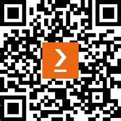
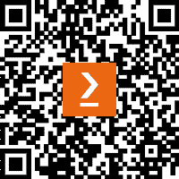

[Packtpub.com](http://Packtpub.com)

订阅我们的在线数字图书馆，全面访问超过 7,000 本书籍和视频，以及业内领先的工具，帮助你规划个人发展并推动职业生涯。欲了解更多信息，请访问我们的网站。

# 为什么订阅？

+   通过来自 4,000 多位行业专家的实用电子书和视频，减少学习时间，增加编程时间

+   通过专门为你打造的技能计划提高学习效果

+   每月获得一本免费的电子书或视频

+   完全可搜索，轻松访问重要信息

+   复制粘贴、打印和书签内容

你知道 Packt 提供每本书的电子书版本，包括 PDF 和 ePub 文件吗？你可以在 [packtpub.com](http://packtpub.com) 升级为电子书版本，作为印刷书籍的客户，你有资格获得电子书的折扣。更多详情请与我们联系：customercare@packtpub.com。

在 [www.packtpub.com](http://www.packtpub.com)，你还可以阅读一系列免费的技术文章，注册各种免费的新闻通讯，并获得 Packt 图书和电子书的独家折扣和优惠。

# 你可能会喜欢的其他书籍

如果你喜欢这本书，你可能会对 Packt 出版的其他书籍感兴趣：

**Microsoft 365 Excel 财务建模实战 -** **第二版**

Shmuel Oluwa

ISBN: 9781803231143

+   通过处理 Excel 中的历史数据，识别增长驱动因素

+   使用折现现金流（DCF）进行高效的投资分析

+   在 Excel 中准备详细的资产和债务时间表模型

+   使用不同的利润参数计算盈利能力比率

+   使用 Power Query 获取和转换数据

+   深入了解资本预算技巧

+   使用蒙特卡罗模拟法推导财务模型的关键假设

+   通过预测资产负债表和损益表构建财务模型

**Python 版 Robo-Advisor**

Aki Ranin

ISBN: 9781801819695

+   探索 Robo-advisor 的功能及其存在的原因

+   创建一个工作流程，从零开始设计并构建 Robo-advisor

+   使用不同的方法构建和授权 Robo-advisor

+   开设并资助账户，完成 KYC 验证，并管理订单

+   为目标、预测、投资组合等构建 Robo-advisor 功能

+   使用 P 进行再平衡和费用管理，操作 Robo-advisor

# Packt 正在寻找像你这样的作者

如果你有兴趣成为 Packt 的作者，请访问[authors.packtpub.com](http://authors.packtpub.com)并今天就申请。我们已经与成千上万的开发者和技术专家合作，帮助他们与全球技术社区分享见解。你可以进行一般申请，申请我们正在招聘作者的特定热门话题，或者提交你自己的创意。

# 分享你的想法

现在你已经完成了*《使用量子计算的金融建模》*，我们非常希望听到你的想法！扫描下面的二维码直接进入该书的亚马逊评论页面，分享你的反馈或在你购买书籍的网站上留下评论。

[`packt.link/r/1-804-61842-X`](https://packt.link/r/1-804-61842-X)

你的评论对我们和技术社区都非常重要，将帮助我们确保提供卓越的内容质量。

# 下载此书的免费 PDF 版本

感谢你购买本书！

你喜欢随时随地阅读，却又无法随身携带纸质书籍吗？你购买的电子书无法与您选择的设备兼容吗？

不用担心，现在购买每本 Packt 书籍，你都可以免费获得该书的无 DRM 保护的 PDF 版本。

在任何地方、任何设备上阅读。直接从你最喜欢的技术书籍中搜索、复制和粘贴代码到你的应用中。

优惠不仅仅于此，你还可以独家获取折扣、新闻通讯以及每日送到你邮箱的精彩免费内容。

按照这些简单的步骤来享受优惠：

1.  扫描二维码或访问下面的链接

https://packt.link/free-ebook/9781804618424

1.  提交你的购买凭证

1.  就这样！我们会直接将你的免费 PDF 及其他福利发送到你的邮箱。
