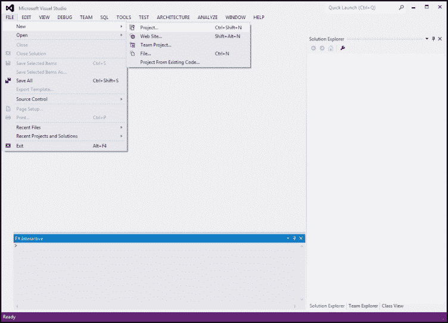
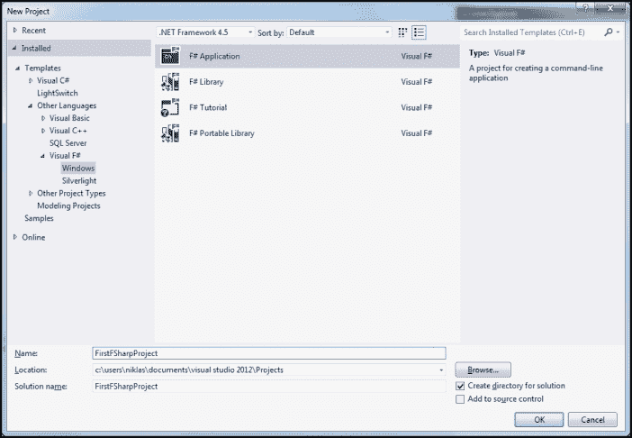
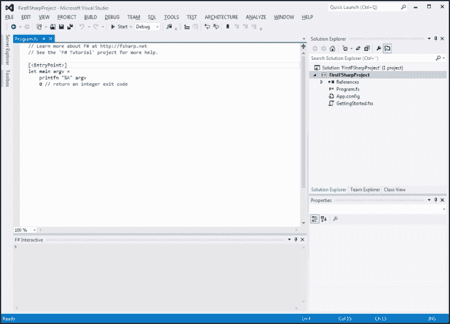
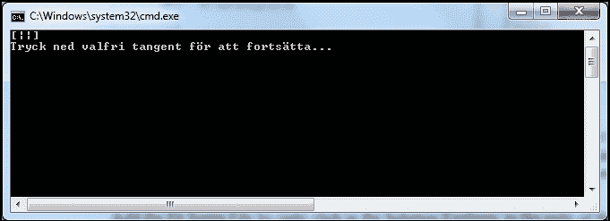
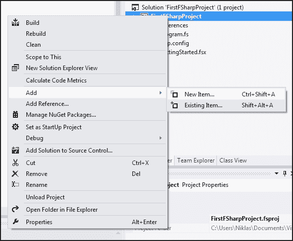
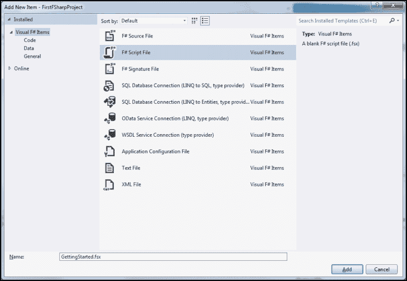
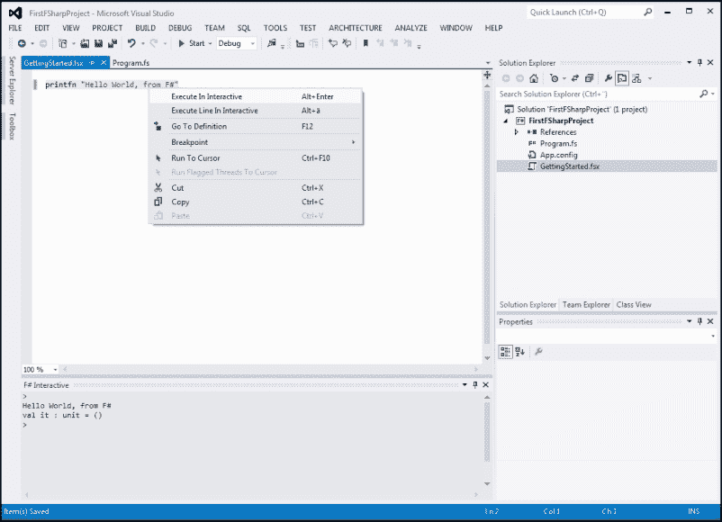
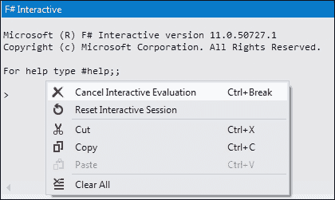
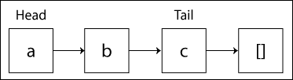

# 第一章：使用 Visual Studio 介绍 F#

在本章中，你将了解 F# 的历史及其在其他编程语言中的根源。我们还将介绍 Visual Studio 及 F# 的基本语言构造。你将通过交互模式逐步原型化代码，变得更加熟悉如何在 F# 中将各个模块拼接起来构建程序。此外，本章将通过使用和评估代码的 **读取-求值-打印循环**（**REPL**）来涵盖语言的基础。

在本章中，你将学习：

+   如何在 Visual Studio 2012 中使用 F#

+   如何使用 F# Interactive 以全新的探索方式编写代码

+   F# 的基础知识及如何编写你的第一个非玩具应用

+   函数式编程如何让你更高效

# 介绍

在我们深入探讨语言本身之前，我们应该先讨论一下为什么我们需要它。F# 是一门强大的语言，这听起来可能像是陈词滥调，但它将多种编程范式结合在一起，实际提升生产力，并且原生支持 .NET 组件和库，以及 **公共语言基础设施**（**CLI**）。函数式编程长期以来与学术界和专家紧密相关。F# 是为数不多的提供完整环境的语言之一，其成熟度足以让其顺利集成到组织中。

此外，F# 对并行编程有广泛的支持，其中包括异步和多线程等高级特性，这些特性作为语言构造实现，极大地简化了程序员的实现细节。在 F# 中，函数式编程范式是解决问题的主要哲学。其他范式，如面向对象编程和命令式编程，被优先作为补充和辅助来支持这一主要范式。它们的共存是基于兼容性和实际生产力的考虑。

# 入门 Visual Studio

我们将从介绍 Visual Studio 作为本书的主要工具开始。虽然可以使用独立的 F# 编译器和你喜欢的编辑器，但使用 Visual Studio 2012，你会更高效，我们将在本书中始终如一地使用它。

F# 自 2010 年以来就已成为 Visual Studio 的一部分。在本书中，我们将使用 Visual Studio 和 F# 的最新版本。这将使我们能够使用 Visual Studio 2012 和 F# 3.0 中最新的功能和改进。

F# 是开源的，这意味着你可以在任何支持的平台上使用它；它不依赖于 Microsoft 或 Visual Studio。在其他 IDE 中，如 MonoDevelop，也有良好的支持，它能在 Linux 和 Mac OS X 上运行。

### 注意

有关 F# 和 F# 软件基金会的更多信息，请访问 [`fsharp.org`](http://fsharp.org)。

## 创建一个新的 F# 项目

在 Visual Studio 中创建一个新的 F# 项目，本指南将使用该项目来探索基础知识，具体内容见下文各节。

### 在 Visual Studio 中创建一个新项目

通过以下步骤，我们可以在 Visual Studio 中创建一个新项目：

1.  要创建你的第一个 F# 项目，打开 Visual Studio 12，并导航到**文件** | **新建** | **项目**，然后在菜单中选择**新建项目**。

1.  现在你将看到**新建项目**窗口出现。选择左侧面板中的**F#**，然后选择**F# 应用程序**。你可以给它命名任何你喜欢的名称。最后，点击**确定**。

1.  现在你已经创建了你的第一个 F# 应用程序，它将仅仅打印传递给它的参数。

### 理解程序模板

让我们简要看一下 Visual Studio 生成的程序模板。



如果你运行这个程序，它将仅仅打印出传递给它的参数，你将看到一个终端窗口出现。



上述截图中的`[<EntryPoint>]`函数是主函数，它告诉 Visual Studio 使用该函数作为程序可执行文件的入口点。我们暂时不深入讨论这个程序模板，但在接下来的三章中，我们将在构建交易系统时回到这个话题。

### 添加一个 F# 脚本文件

我们将使用 F# 脚本文件来代替更交互式地探索语言的基础知识，而是在查看标准程序模板之后进行操作。你可以将 F# 脚本文件视为笔记本，在其中你可以逐步探索可执行的代码：

1.  通过右键点击代码编辑器右侧的**解决方案资源管理器**，添加 F# 脚本文件。

1.  然后，导航到**添加** | **新建项…**，如以下截图所示：

1.  你可以为脚本文件命名任何你喜欢的名称，比如`GettingStarted.fsx`。

现在我们已经在 Visual Studio 中设置好了基本的项目结构，接下来让我们继续探索 F# Interactive。

# 理解 F# Interactive

F# Interactive 是一种交互式执行程序部分的方式。通过这种方式，程序员可以探索代码的不同部分及其行为。这样，你会对编写代码有更动态的感受，也更有趣。F# Interactive 是 F# 的 REPL，这意味着它会读取代码、评估它，然后输出结果。接着，它会反复执行这一过程。这就像命令行一样，代码被执行，结果展示给用户。

要在 F# Interactive 中执行代码，请查看以下步骤：

1.  选择你感兴趣的源代码，然后按*Alt* + *Enter*。

1.  你可以写一行简单的代码，它将仅仅打印一个字符串到 REPL 的输出窗口：

    ```py
    printfn "Hello World, from F"
    ```

1.  你也可以右键点击选中的代码，选择**在交互式中执行**。

    在使用交互模式执行代码时，结果会显示在代码编辑器下方的**F# 交互式评估**窗口中。也可以输入代码片段到**交互式**窗口中，这样做有时更为合适，正如以下示例所展示的。

1.  在**F# 交互式**窗口中输入以下代码并按*Enter*键：

    ```py
    printfn "Hello World, from F#";;
    ```

1.  这将在 REPL 中被评估为以下内容：

    ```py
    > printfn "Hello World, from F#";;
    Hello World, from F#
    val it : unit = ()
    ```

    在代码行后使用双分号(;;)将终止输入，并允许你直接按*Enter*键，它们在你直接在终端窗口中输入时是必须的。

1.  如果你想取消评估，可以右键点击并选择**取消交互式评估**，或者直接按*Ctrl* + *Break*。

# 语言概览

我们现在将开始使用 F# 进行函数式编程的旅程，并探索其在定量金融应用中的能力。

我们首先来看一下如何声明值，也就是如何将值绑定到名称，及其可变性和不可变性。

要初始化并创建一个值，请使用`let`关键字。`let`将右侧的值绑定到等号左侧的变量名。这是一个绑定操作符，很像数学中的操作。

```py
let sum = 4 + 5
let newsum = sum + 3
```

`let`绑定也可以用来将函数绑定到名称上，正如我们将在接下来的章节中看到的那样。

# 解释可变性和不可变性

一旦变量被定义为具有特定值，它将一直保持该值。对此有一些例外情况，且可以使用遮蔽来覆盖同一作用域内先前的赋值。因此，数学中的变量是不可变的。同样，F#中的变量也是不可变的，但有一些例外。

不可变变量是 F# 中的默认值。它们很有用，因为它们是线程安全的，更容易推理。这也是你最近可能听到很多关于不可变性的原因之一。这个概念旨在解决并发编程中的最大问题和设计缺陷，包括共享的可变状态。如果值不会改变，那么就不需要保护它们，这也是推动并发编程中不可变性的原因之一。

如果你尝试修改不可变变量的值，你将遇到类似以下的消息：

```py
let immutable = "I am immutable!"
immutable <- "Try to change it..."
… error FS0027: This value is not mutable
```

然而，有时需要拥有可变变量。在实际应用中，当某些全局状态被共享（例如计数器）时，经常会有这种需求。此外，面向对象编程和与其他 .NET 语言的互操作性使得使用可变性变得不可避免。

要创建一个可变变量，你只需在名称前面加上关键字`mutable`，如下面的代码所示：

```py
let mutable name = firstname + lastname
```

要在创建变量后更改其值，请使用箭头操作符（`←`），如下代码所示：

```py
name ← "John Johnson"
```

这与其他语言稍有不同。但一旦你理解了这个概念，就能更好地理解它。事实上，它很可能会成为未来推理变量的主要方式之一。

# 原始类型

F# 看起来可能像是 JavaScript、Ruby 或 Python 等动态类型语言。实际上，F# 是像 C#、C++ 和 Java 一样的静态类型语言。它通过类型推断来确定正确的类型。类型推断是一种通过分析代码自动推导出类型的技术。这种方法在几乎所有情况下都能很好地工作。然而，有时程序员需要对编译器进行明确的说明。这可以通过类型注解实现，我们将在接下来的章节中进一步探讨这一概念。

让我们通过 REPL 探索一些 F# 内建类型。

```py
> let anInt = 124;;

val anInt : int = 124
```

这意味着 F# 推断 `anInt` 的类型为 `int`。它仅仅通过推断左边的类型与右边赋值的类型一致。逻辑上，赋值操作符两边的类型必须相同，不是吗？

我们可以将分析扩展到浮点数，如下代码所示：

```py
> let anFloat = 124.00;;

val anFloat : float = 124.0
```

因为有小数点符号，类型被确定为 `float` 类型。同样的规则适用于 `double`，如下代码所示：

```py
> let anDouble : double = 1.23e10;;

val anDouble : double = 1.23e+10
```

对于其他类型，其工作方式与预期一致，如下所示：

```py
> let myString = "This is a string";;

val myString : string = "This is a string"
```

除了 `unit` 类型，所有原始的内建类型都有对应的 .NET 类型。

以下表格展示了 F# 中最常见的原始类型：

| 类型 | .NET 类型 | 描述 |
| --- | --- | --- |
| bool | Boolean | true 或 false |
| byte | Byte | 0 到 255 |
| int | Int32 | -128 到 127 |
| int64 | Int64 | -9,223,372,036,854,775,808 到 9,223,372,036,854,775,807 |
| char | Char | 0 到 18,446,744,073,709,551,615 |
| string | String | Unicode 文本 |
| decimal | Decimal | 浮动数据类型 |
| unit | - | 缺少实际值 |
| void | Void | 无类型或值 |
| float | Single | 64 位浮点值 |
| double | Double | 与上述相同 |

### 注意

更多信息及所有类型，可以访问 [`msdn.microsoft.com/en-us/library/dd233210.aspx.`](http://msdn.microsoft.com/en-us/library/dd233210.aspx.)

语言中还有其他类型，这些类型将在下一章中详细讲解，例如列表、数组、序列、记录和区分联合。

# 解释类型推断

类型推导意味着编译器会根据程序员提供的表达式上下文信息，自动推断代码中表达式的类型。类型推导分析代码，如你在前面的章节中所看到的，确定程序员通常可以轻松识别的类型。这使得程序员无需显式定义每个变量的类型。在前面的章节中，我们看到的简单整数和浮点数赋值不需要定义类型就能理解代码。类型推导将使代码更易于编写，从而更易于阅读，省去了不必要的冗余。

# 解释函数

现在是时候了解函数了，它是 F#以及任何其他函数式编程语言中最基本且强大的构建块。函数式编程语言将函数视为一等构造，与面向对象编程不同，在面向对象编程中，对象和数据是第一类构造。这意味着在函数式编程中，函数根据输入生成数据，而不是依赖状态。在面向对象编程中，状态被封装到对象中并传递。在之前的代码片段中，函数的声明方式与变量声明方式相同，都是使用`let`绑定。请看以下代码片段：

```py
let sum (x,y) =
	x + y
> sum (7, 7)
```

如果你尝试使用*Alt* + *Enter*来评估第一个`sum`函数，F#交互式会返回如下类似的函数代码：

```py
val sum : x:int -> y:int -> int
```

这意味着`sum`是一个接受两个`int`类型值并返回一个`int`类型值的函数。编译器只需要知道最后一个类型就是返回类型。

```py
let sum (x:float, y:float) =
	x + y

> sum(7.0, 7.0);;
val it : float = 14.0
```

让我们来看一个传递错误类型参数给函数的例子：

```py
> sum(7, 7);;
...
error FS0001: This expression was expected to have type float
but here has type int
```

如修改版的`sum`函数所示，类型被显式声明为 float。这是一种提前告诉编译器，函数中将使用 float 类型的值的方式。sum 函数的第一个版本使用类型推导来计算`x`和`y`的类型，并发现它们是`int`类型。

## 了解匿名函数

由于在 F#编程中创建小型辅助函数很常见，F#还提供了一个用于创建匿名函数的特殊语法。这些函数有时被称为 lambda，或 lambda 函数。定义匿名函数时，使用关键字`fun`。请看以下代码片段：

```py
let square = (fun x → x * x)
> square 2
val it : int = 4
```

## 解释高阶函数

现在，平方函数可以单独使用，也可以作为其他函数或高阶函数的参数。请看以下平方函数：

```py
let squareByFour f
	f 4
> squareByFour square
```

这里，平方函数作为参数传递给函数`squareByFour`。`squareByFour`是一个高阶函数，它接收另一个函数作为参数。高阶函数可以接受一个函数作为参数或返回一个函数，或者两者兼有。这是函数式编程中常用的技术，能够从现有函数构建新函数并重用它们。

## 柯里化

尽管柯里化有时被认为是编程语言的高级特性，但它与函数和高阶函数的关联使得它最具意义。这个概念一点也不复杂，一旦你看过几个例子，概念应该就很清楚了。

让我们来看一下下面的`sum`函数：

```py
let sum x y =
	x + y
```

假设我们想要重用这个函数，但我们可能经常对某个固定的`x`值进行调用。这意味着我们有一个固定的`x`，假设是`2`，然后我们改变`y`参数。请看以下示例：

```py
sum 2 3
sum 2 4
sum 2 5
```

不必每次都写出`x`参数，我们可以利用柯里化的概念。这意味着我们可以创建一个新的函数，在这种情况下第一个参数被固定。看一下下面的函数：

```py
let sumBy2 y = 
	sum 2 y

> sumBy2 3;;
val it : int = 5

> sumBy2 4;;
val it : int = 5

> sumBy2 5;;
val it : int = 5
```

现在我们避免了重写一些参数，但这并不是主要原因。主要原因是能够控制参数并重用功能。更多关于柯里化的内容将在后续章节中介绍，但这里已经涵盖了与高阶函数相关的基础知识。

## 调查列表

在 F#中，列表非常有用，它们是最常用的构建块之一。它们是函数式语言中的基本构建块，通常可以替代其他类型或类。这是因为支持操作和创建列表的功能，以及能够嵌套列表，足以替代自定义类型。你可以将列表看作是同一类型值的序列。

F#中的列表如下：

+   存储数据的一种强大方式

+   不可变的值列表，支持任何类型

+   常作为构建块使用

+   存储数据的最佳方式之一



这展示了 F#中的一个列表，具有头部和尾部，其中每个元素与下一个元素相连。

假设我们有一个简单的价格信息列表，这些信息以浮动点表示：

```py
let prices = [45.0; 45.1; 44.9; 46.0]
> val prices : float list = [45.0; 45.1; 44.9; 46.0]
```

假设你想要一个值在 0 到 100 之间的列表，F#可以帮你实现，而不需要你手动编写。请看以下代码：

```py
let range = [0 .. 100]
val range : int list =
  [0; 1; 2; 3; 4; 5; 6; 7; 8; 9; 10; 11; 12; 13; 14; 15; 16; 17;
  18; 19; 20;21; 22; 23; 24; 25; 26; 27; 28; 29; 30; 31; 32;
  33; 34; 35; 36; 37; 38; 39; 40; 41; 42; 43; 44; 45; 46; 47;
  48; 49; 50; 51; 52; 53; 54; 55; 56; 57; 58; 59; 60; 61; 62;
  63; 64; 65; 66; 67; 68; 69; 70; 71; 72; 73; 74; 75; 76; 77;
  78; 79; 80; 81; 82; 83; 84; 85; 86; 87; 88; 89; 90; 91; 92; 
  93; 94; 95; 96; 97; 98; 99; ...]
```

如果我们只需要一个固定增量的简单范围，这样做是可以的。然而，有时你可能需要更小的增量，比如 0.1，范围是从 1.0 到 10.0。以下代码展示了如何实现：

```py
let fineRange = [1.0 .. 0.1 .. 10.0]
val fineRange : float list =
[1.0; 1.1; 1.2; 1.3; 1.4; 1.5; 1.6; 1.7; 1.8; 1.9; 2.0; 2.1; 2.2; 2.3; 2.4; 2.5; 2.6; 2.7; 2.8; 2.9; 3.0; 3.1; 3.2; 3.3; 3.4; 3.5; 3.6; 3.7; 3.8; 3.9; 4.0; 4.1; 4.2; 4.3; 4.4; 4.5; 4.6; 4.7; 4.8; 4.9; 5.0; 5.1; 5.2; 5.3; 5.4; 5.5; 5.6; 5.7; 5.8; 5.9; 6.0; 6.1; 6.2; 6.3; 6.4; 6.5; 6.6; 6.7; 6.8; 6.9; 7.0; 7.1; 7.2; 7.3; 7.4; 7.5; 7.6; 7.7; 7.8; 7.9; 8.0; 8.1; 8.2; 8.3; 8.4; 8.5; 8.6; 8.7; 8.8; 8.9; 9.0; 9.1; 9.2; 9.3; 9.4; 9.5; 9.6; 9.7; 9.8; 9.9; 10.0]
```

列表可以是任何类型的，类型推断在这里也能正常工作。请看下面的代码：

```py
> let myList = ["One"; "Two"; "Three"];;
val myList : string list = ["One"; "Two"; "Three"]
```

然而，如果你在列表中混合不同类型，编译器会对实际使用的类型产生困惑：

```py
let myList = ["One"; "Two"; 3.0];; 
...
This expression was expected to have type
string but here has type float 
```

### 提示

**下载示例代码**

你可以从你在[`www.packtpub.com`](http://www.packtpub.com)购买的所有 Packt 书籍的账户中下载示例代码文件。如果你是在其他地方购买的这本书，你可以访问[`www.packtpub.com/support`](http://www.packtpub.com/support)并注册，将文件直接通过电子邮件发送给你。

### 列表连接

列表连接在你想将多个列表合并时非常有用。可以使用`@`操作符来实现这一点。请看以下代码，其中使用了`@`操作符：

```py
> let myNewList = [1;2;3] @ [4;5;6];;

val myNewList : int list = [1; 2; 3; 4; 5; 6]

> myNewList;;
val it : int list = [1; 2; 3; 4; 5; 6]
```

让我们看一下列表模块中最常用的一些函数：`Length`、`Head`、`Tail`、`map`和`filter`。

函数`Length`将简单地返回列表的长度：

```py
> myNewList.Length;;
val it : int = 6
```

如果你想要列表的第一个元素，使用`Head`：

```py
> myNewList.Head;;
val it : int = 1
```

列表的其余部分，意味着除`Head`之外的所有其他元素，被定义为`Tail`：

```py
> myNewList.Tail;;
val it : int list = [2; 3; 4; 5; 6]
```

你还可以对列表做一些更有趣的事情，比如逐个计算所有元素的平方。请注意，它返回的是一个全新的列表，这是因为列表是不可变的。这是通过高阶函数完成的，其中`List.map`接受一个返回`x*x`值的 lambda 函数，如以下代码所示：

```py
> List.map (fun x -> x * x) myNewList;;
val it : int list = [1; 4; 9; 16; 25; 36]
```

另一个有趣的函数是列表的`filter`函数，它将返回一个符合过滤条件的新列表：

```py
> List.filter (fun x -> x < 4) myNewList;;
val it : int list = [1; 2; 3]
```

## 元组

元组是一组无名但有序的值。根据需要，值可以是不同类型的。你可以把它们看作是 C#中的元组类的更灵活版本。

```py
// Tuple of two floats
(1.0, 2.0)

// Tuple of mixed representations of numbers
(1, 2.0, 3, '4', "four")

// Tuple of expressions
(1.0 + 2.0, 3, 4 + 5)
```

让我们在 REPL 中分析元组的类型信息。第一个元组具有以下类型信息：

```py
> (1.0, 2.0);;
val it : float * float = (1.0, 2.0)
```

`*`符号用于分隔元组的类型元素。它只是一个包含两个浮点数的元组。下一个稍微复杂一点：

```py
> (1, 2.0, 3, '4', "four");;
val it : int * float * int * char * string = (1, 2.0, 3, '4', "four")
```

但是类型推断没有任何疑问地弄清楚了。最后一个包含表达式：

```py
> (1.0 + 2.0, 3, 4 + 5);;
val it : float * int * int = (3.0, 3, 9)
```

正如你所看到的，表达式在类型数据分析之前被求值。提取元组中的值可能是有用的，这可以通过简单的模式来完成：

```py
let (a, b) = (1.0, 2.0)
printfn "%f %f" a b
```

如果你对第一个值不感兴趣，可以使用通配符字符（下划线）来简单地忽略它。通配符在 F#中广泛使用，例如在模式匹配中，在下一章将介绍这一点。

```py
let (_, b) = (1.0, 2.0)
printfn "only b %2.2f" b
```

## 管道操作符

管道操作符使用得很频繁，它被定义为一个函数，该函数将操作符左边的值传递给右边的函数并应用它们。还有一个带有不同参数数量的管道操作符版本，关于它们的更多内容将在后面讲解。

管道前向操作符(`|>`)是最常见的管道操作符：

```py
[0..100]|> List.filter (fun x -> x % 2 = 0)|> List.map (fun x -> x * 2)|> List.sum
```

这段代码首先创建一个从 0 到 100 的列表，如前面关于列表的部分所示。然后，列表被传递给 filter 函数，使用条件 lambda 函数。列表中的每个偶数值都会传递给下一个函数。map 函数会执行 lambda 函数，对每个数字进行平方。最后，所有的数字都会被求和，结果是：

```py
val it : int = 5100
```

# 编写代码文档

编写代码文档是一个值得养成的好习惯。你还记得几周前你写的代码的细节吗？再想象一下，几年前你写的代码会是什么样的。这就是文档发挥作用的地方。仅仅对逻辑的一些提示就足够让你和你的同事理解背后的主要概念。

```py
(*
This is a comment on multiple lines
*)

/// Single line comment, supporting XML-tags

// This is also a single line comment
```

# 你的第一个应用

第一个有用的应用将是这个金融领域的 Hello World，它将展示 F# 和函数式语言的一些强大而简单的概念和优点。

让我们通过一个简单但富有启发性的例子来开始我们的定量金融之旅，使用 Yahoo 财务数据。首先，我们将数据输入到代码中，以便熟悉基本概念。

首先，我们输入一些数据。在 F# 中，你可以像下面的代码那样在多行上声明一个字符串列表：

```py
/// Sample stock data, from Yahoo Finance
let stockData = [
    "2013-06-06,51.15,51.66,50.83,51.52,9848400,51.52";
    "2013-06-05,52.57,52.68,50.91,51.36,14462900,51.36";
    "2013-06-04,53.74,53.75,52.22,52.59,10614700,52.59";
    "2013-06-03,53.86,53.89,52.40,53.41,13127900,53.41";
    "2013-05-31,54.70,54.91,53.99,54.10,12809700,54.10";
    "2013-05-30,55.01,55.69,54.96,55.10,8751200,55.10";
    "2013-05-29,55.15,55.40,54.53,55.05,8693700,55.05"
]
```

我们引入了一个用于按逗号分割字符串的函数；这将创建一个字符串数组。不要忘记在 F# Interactive 中使用 *Alt* + *Enter* 评估程序的各个部分。通过这样练习，可以减少错误数量，并且你会变得更加熟悉，理解涉及的类型。

`stockData` 值的类型没有显式声明，但如果你评估它，你应该看到它是 `string list` 类型：

```py
val stockData : string list =
  ["2013-06-06,51.15,51.66,50.83,51.52,9848400,51.52";
   ...
   "2013-05-29,55.15,55.40,54.53,55.05,8693700,55.05"]

// Split row on commas
let splitCommas (l:string) =
    l.Split(',')

// Get the row with lowest trading volume
let lowestVolume =
    stockData
    |> List.map splitCommas
    |> List.minBy (fun x -> (int x.[5]))
```

评估表达式 `lowestVolume` 会解析 `stockData` 中的字符串，并提取出交易量最小的那一行，第六列。希望结果是包含日期 2013-05-29 的那一行，如下所示：

```py
val lowestVolume : string [] =
  [|"2013-05-29"; "55.15"; "55.40"; "54.53"; "55.05"; "8693700";"55.05"|]
```

# 整个程序

以下是我们在上一部分开发的程序代码清单，即金融领域的 Hello World 程序。你可以自己尝试并根据需要做出更改：

```py
/// Open the System.IO namespace
open System.IO

/// Sample stock data, from Yahoo Finance
let stockData = [
    "2013-06-06,51.15,51.66,50.83,51.52,9848400,51.52";
    "2013-06-05,52.57,52.68,50.91,51.36,14462900,51.36";
    "2013-06-04,53.74,53.75,52.22,52.59,10614700,52.59";
    "2013-06-03,53.86,53.89,52.40,53.41,13127900,53.41";
    "2013-05-31,54.70,54.91,53.99,54.10,12809700,54.10";
    "2013-05-30,55.01,55.69,54.96,55.10,8751200,55.10";
    "2013-05-29,55.15,55.40,54.53,55.05,8693700,55.05"
]

/// Split row on commas
let splitCommas (l:string) =
    l.Split(',')

/// Get the row with lowest trading volume
let lowestVolume =
    stockData
    |> List.map splitCommas
    |> List.minBy (fun x -> (int x.[5]))
```

## 理解程序

管道操作符使程序的逻辑非常直观。程序首先获取 `stockData` 列表，按逗号分割，然后选择特定的列并应用数学运算符。接着，它选择这些计算中的最大值，最后返回符合 `minBy` 条件的行的第一列。你可以把它看作是构建模块，其中每一部分都是一个独立的函数。将多个函数组合成强大的程序，是函数式编程背后的理念。

## 扩展示例程序

让我们扩展前面的程序，改为从文件中读取数据。由于在代码中显式声明数据在长远来看并不那么有用，因为数据会变化。在扩展的过程中，我们还将介绍异常及其在.NET 中的使用。

我们首先编写一个简单的函数来读取文件的所有内容，其中文件路径作为参数传递。参数的类型是字符串，如你在函数头部看到的类型注释。注释的使用通常是编译器无法自行推断类型时，或者作为程序员你想要明确指定或强制使用某种类型时。

```py
/// Read a file into a string array
let openFile (name : string) =
    try
        let content = File.ReadAllLines(name)
        content |> Array.toList
    with
        | :? System.IO.FileNotFoundException as e -> printfn "Exception! %s " e.Message; ["empty"]
```

如果文件未找到，函数将捕获`FileNotFoundException`。在异常类型前还有一个新的运算符（`:?`）。这是一个类型测试运算符，如果值与指定的类型匹配，则返回 true，否则返回 false。

让我们修改前面的代码，使用从文件中加载的内容，而不是预先编码的股票价格。

```py
/// Get the row with lowest trading volume, from file
let lowestVolume =
    openFile filePath
    |> List.map splitCommas
    |> Seq.skip 1
    |> Seq.minBy (fun x -> (int x.[5]))
```

代码需要进行一些小的修改，以便能够处理来自**逗号分隔值**（**CSV**）文件的输入。与管道的输入一样，我们使用`openFile`函数的调用结果。然后，我们像之前一样按逗号进行拆分。需要有一种方法来跳过第一行；在 F#中这很容易实现，你只需插入`Seq.skip n`，其中 n 是要跳过的序列元素的数量。

```py
printfn "Lowest volume, found in row: %A" lowestVolume
```

在这里，我们简单地使用`printfn`并格式化为`%A`，这样就可以接受任何内容并格式化输出（非常方便）。

让我们再看一个有用的字符串格式化器的例子：

```py
> printfn "This works for lists too: %A" [1..5];;
This works for lists too: [1; 2; 3; 4; 5]
val it : unit = ()
```

## 整个程序

让我们看看整个程序的代码，这是我们在前一部分中看到的。

```py
/// Open the System.IO namespace
open System.IO

let filePath = @" table.csv"

/// Split row on commas
let splitCommas (l:string) =
    l.Split(',')

/// Read a file into a string array
let openFile (name : string) =
    try
        let content = File.ReadAllLines(name)
        content |> Array.toList
    with
        | :? System.IO.FileNotFoundException as e -> printfn "Exception! %s " e.Message; ["empty"]

/// Get the row with lowest trading volume, from file
let lowestVolume =
    openFile filePath
    |> List.map splitCommas
    |> Seq.skip 1
    |> Seq.minBy (fun x -> (int x.[5]))

/// Use printfn with generic formatter, %A
printfn "Lowest volume, found in row: %A" lowestVolume
```

# 原型设计的力量

使用 Visual Studio 的交互模式，并能够通过原型设计以更小的构建块编写程序，是编写软件的一个好方法。你已经通过第一个应用程序使用了这种探索性的编程方式。

工作流程是逐步构建程序，而不是一次性运行所有代码。REPL 是一个完美的地方，可以尝试代码片段并实验 F#的不同方面。

# 功能性语言在量化金融中的应用

在前面的示例代码中，我们看到从文件中解析数据并提取各种信息是直接且简单的，产生的代码既易于阅读又易于理解。这是 F#的亮点之一，尤其在量化金融中，这一点尤为重要，因为在许多语言中，代码可能复杂且难以跟踪和理解。

让我们通过另一个例子来说明前述的说法。前一个示例应用中的 CSV 文件数据是按最新日期排序的。如果我们希望数据以更自然的方式排序，最早的日期排在前面，我们可以简单地通过以下方式反转整个列表：

```py
/// Reverses the price data from the CSV-file
let reversePrices =
    openFile filePath
    |> List.map splitCommas
    |> List.rev
```

# 理解命令式代码和互操作性

假设我们对解析示例中股票价格的日期列感兴趣。整行数据大致如下所示：

```py
 [|"2013-02-22"; "54.96"; "55.13"; "54.57"; "55.02"; "5087300"; "55.02"|]
```

我们对第一列感兴趣，索引为 0：

```py
lowestVolume.[0];;	
val it : string = "2013-02-22"
```

我们可以利用 .NET 中 `System.DateTime` 命名空间下的日期和时间类：

```py
> let dateTime = System.DateTime.ParseExact(lowestVolume.[0], "yyyy-mm-dd", null);;

val dateTime : System.DateTime = 2013-01-22 00:02:00
```

现在我们有了一个`System.DateTime`对象，它与 C# 以及其他 .NET 语言兼容，可以用来处理时间！

# 总结

在这一章，我们初步了解了如何使用 Visual Studio 编写 F# 编程。我们涵盖了语言的各种基础知识，并浅尝了函数式编程（functional programming），其中不可变性（immutability）扮演了关键角色。在整章中，我们通过展示一些 F# 语言特性并说明如何利用 .NET 框架（framework），让大家对 F# 编程有了初步的认识。在本章结束时，我们实现了一个简单的应用，展示了 F# 的强大功能和优雅语法。函数是任何函数式编程语言中的核心构件。从现有函数构建新函数是一种抽象复杂性的方式，并且能实现复用。

在下一章，我们将深入了解更多关于 F# 语言的细节。你将学习更多的数据结构，如列表（Lists）、序列（Sequences）和数组（Arrays）。你还将学习如何使用模块（modules）和命名空间（namespaces）来组织你的程序，这些内容在更大的程序中会变得非常有用。下一章还将介绍线程（threads）、线程池（thread pools）、使用 .NET 进行异步编程（asynchronous programming）以及 F# 语言特有的语言构造（language-specific constructs）。
