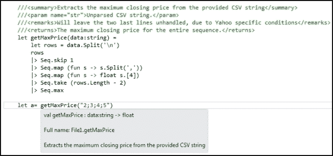

# 第二章. 进一步了解 F#

本章是关于 F# 语言本身的更详细内容。教程方法将继续使用 Visual Studio 进行演示，并结合本书后半部分涉及构建最终交易系统的语言细节。本章将涵盖大多数语言构建块，并通过解释和示例进行讲解。虽然本章内容较多，但要理解这里提供的内容，对于后续的学习至关重要。

本章你将学习：

+   将程序结构化为模块和命名空间

+   更多关于数据结构和类型的内容

+   递归函数及其在函数式编程中的作用

+   模式匹配

+   结合函数式和面向对象的思想

+   F#的命令式部分

+   F#中的并行和异步编程模型

### 提示

下载 Microsoft Research 提供的 F# 3.0 语言规范，并在本章及本书其余部分的学习过程中一同查阅。该规范提供了许多有用的细节，并解答了你作为读者可能提出的疑问。

# 结构化你的 F# 程序

当你编写较大的程序时，能够将代码结构化为层次化的抽象层次变得至关重要。这使得构建大型程序、重用现有代码以及让其他人理解代码成为可能。在 F# 中，有命名空间、模块和面向对象的结合，以及类型和数据结构来实现这一点。在面向对象编程中，可以使函数和变量变为私有，并禁用外部访问。面向对象编程将在后续章节单独讲解。

正如你可能在 Visual Studio 中看到的，当你创建 F# 项目时，会有各种类型的源代码文件。根据文件的用途，它们有不同的扩展名。在本书中，我们使用 `.fs` 和 `.fsx` 文件。前者是一个 F# 源代码文件，需编译后用于可执行程序中；后者 `.fsx` 是用于 F# 脚本和交互模式的原型开发。脚本非常适合快速原型开发和探索性开发，但不适合用于较大的程序。

接下来，我们将介绍在 F# 中用于将代码结构化成优雅、可维护且符合逻辑的结构的最常见和最有用的技术。

## 探讨模块

模块有助于组织和结构化相关代码。它们是将代码组织成更高抽象层次的简单而优雅的方式。可以将其视为值、类型和函数值等声明的命名集合。你已经在不自觉中使用了模块。所有文件会自动声明为与文件同名的模块。F# 交互模式也是如此，每次执行的内容都会被包装成一个独立的模块。

例如，考虑一个名为 `application.fs` 的文件，其内容如下：

```py
let myval = 100
```

该文件将以与显式声明为模块相同的方式进行编译：

```py
module application

let myval = 100
```

这意味着你不必在每个文件中显式声明模块来实现这一点。

### 在模块中使用函数和变量

模块看起来很像面向对象中的类。它们甚至有访问注解来指定访问其声明的成员的规则。模块和类之间的主要区别是，类可以被看作是定义新类型，而模块是功能的集合，且在写类之前可能不需要知道具体的细节。

以下示例演示了如何声明具有值和函数的模块及嵌套模块，以及如何访问这些成员：

```py
module MainModule =
    let x = 2
    let y = 3
    module NestedModule =
        let f = 
            x + y

printfn "%A" MainModule.NestedModule.f
```

如你所见，模块可以嵌套，这使得程序员能够以优雅的方式组织代码。模块`NestedModule`中的`f`函数可以访问父模块中的`x`和`y`值，而不必显式写出父模块的名称。

声明和使用模块的顺序至关重要，因为它们是按从上到下的顺序依次处理的。以下代码片段将在第一个`let`语句中找不到`Module2`：

```py
module Module1 =
    let x = Module2.Version() // Error: Not yet declared!

module Module2 =
    let Version() = 
        ""Version 1.0"
```

反转顺序后，错误得以解决：

```py
module Module2 =
    let Version() = 
        ""Version 1.0"

module Module1 =
    let x = Module2.Version() // Now Module2 is found
```

模块的每个成员变量默认是公开的。这意味着每个成员都有一个由编译器设置的默认可访问性。让我们回到以下示例，并将函数`Version`的可访问性更改为 private：

```py
module Module2 =
    let private Version() = 
        "Version 1.0"

module Module1 =
    let x = Module2.Version() // Error: Version is private!
```

如你所见，如果你将其输入到编辑器中，由于 private 标注会出现错误。这非常整洁。在这种情况下，使用 internal 注解可能更为合适，这意味着成员仅能在同一程序集内访问。

```py
module Module2 =
    let internal Version() = 
        "Version 1.0"

module Module1 =
    let x = Module2.Version() // Now it works again, Version is set to be internal
```

可用的修饰符有 public、internal 和 private。public 修饰符表示标注的函数或变量可以被所有代码访问，而 private 表示该函数或变量只能从封闭模块中访问。

## 命名空间

命名空间是模块、类和其他命名空间的层次化分类。首先，我们来看一下如何声明命名空间。命名空间必须是代码文件中的第一个声明。当你希望区分功能而不必在模块或类前面加上冗长的名称时，命名空间非常有用。它们还可以最大限度地减少代码与现有代码之间的命名冲突。以下是之前讨论的代码，已被添加到一个命名空间中：

```py
namespace Namespace1.Library1

    module Module2 =
        let internal Version() = 
            "Version 1.0"

    module Module1 =
        let x = Module2.Version()
```

这将告诉编译器我们处于名为`Namespace1.Library1`的命名空间中。命名空间还强制程序员使用 F#、C#及其他.NET 语言程序员熟悉的模式。命名空间是开放的，这意味着许多源文件可以贡献到同一个命名空间中。在同一文件中也可以有多个命名空间：

```py
namespace Namespace1.Library1

    module Module2 =
        let internal Version() = 
            "Version 1.0"

namespace Namespace1.Library2

    module Module1 =
        let x = Namespace1.Library1.Module2.Version()
```

上面的示例展示了如何使用命名空间以及如何访问命名空间中的模块，这需要使用完整限定名。如果在 F# 中使用 `open` 关键字，则无需使用完整限定名，它相当于 C# 中的 `using`。完整限定名指的是完整的名称，就像在最后的 `let` 语句中访问 `Version` 函数时所使用的名称。

对于命名空间，私有和公共修饰符也存在，并且与模块的工作方式相同，不同之处在于它们作用于代码中的命名空间级别。此外，还存在更细粒度的控制机制，例如 `[<AutoOpen>]`，它会自动打开命名空间中的模块。当需要在命名空间内定义 `let` 语句以定义值时，这非常方便。

# 深入探讨数据结构

在前一章中，我们介绍了 F# 中的一些数据结构，并简单了解了它们的功能。在本节中，我们将更深入地探讨许多在程序中常用的数据结构和表达式。

以下是将要介绍的内容，并附有简短的描述，总结它们的主要特征：

+   **记录类型**：记录类型用于表示数据，并通过组合命名值和类型将数据片段组合在一起。

+   **区分联合**：区分联合用于表示异构数据，并支持可以是多个命名情况的数据。

+   **枚举**：F# 中的枚举几乎与其他语言中的枚举相同，用于将标签映射到常量值。

+   **数组**：数组是固定大小的集合，必须包含相同类型的值。大型常量数组可以编译为高效的二进制表示。

+   **列表**：列表是有序的集合，包含相同类型的元素，通常实现为链表。

+   **序列**：在 F# 中，序列是惰性求值的，表示为逻辑元素序列，其中所有元素必须具有相同的类型。它们特别适合表示一个大的有序数据集合，在该集合中，并非所有元素都会被使用。

+   **集合**：集合是无序的容器，用于存储唯一的数据元素。集合不会保留插入时元素的顺序，也不允许重复元素。

+   **映射**：映射是用于存储键/值对的关联容器。

+   **选项**：选项是一种优雅的方式，用于封装可能存在或不存在的值。它是通过区分联合（discriminated union）来实现的。与检查空值不同，选项更为常用。

+   **字符串**：字符串是字符的序列，和 .NET 中的字符串相同。

## 记录类型

记录类型用于表示数据，并通过组合命名值和类型将数据片段组合在一起。

假设我们有兴趣使用记录类型来建模一个**开盘-最高-最低-收盘**（**OHLC**）柱状图，它可能如下所示：

```py
type OHLC = 
    {
    o: float
    h: float
    l: float
    c: float
    }
```

然后，我们可以使用先前定义的记录来声明一个变量：

```py
let ohclBar : OHLC = {o = 1.0; h = 2.0; l = 3.0; c = 4.0} 
```

让我们考虑另一个示例，在这个示例中，我们用`bid`、`ask`和`midpoint`来建模一个报价。`midpoint()`函数将从`bid`和`ask`值计算出来，即两者的平均值。可以像这样使用记录类型和成员函数来实现：

```py
type Quote =
    {
    bid : float
    ask : float
    }
    member this.midpoint() = (this.bid + this.ask) / 2.0

let q : Quote = {bid = 100.0; ask = 200.0} 
q.midpoint()
```

如你所见，它与第一个示例非常相似，唯一不同的是成员函数`midpoint`。成员函数可以访问记录类型的字段。

假设我们有兴趣在初始化后修改字段，只需将`mutable`关键字添加到感兴趣的字段即可：

```py
type Quote =
    {
    mutable bid : float
    mutable ask : float
    }
    member this.midpoint() = (this.bid + this.ask) / 2.0

let q : Quote = {bid = 100.0; ask = 200.0} q.midpoint()
q.bid <- 150.0
q.midpoint()
```

这个示例与之前讨论的类似，但在这里我们可以将`bid`字段的值更改为`150.0`。

让我们看看如何在模式匹配中使用记录类型，因为这是使用记录类型的最大原因之一：

```py
let matchQuote (quote : Quote) =
match quote with
   | { bid = 0.0; ask = 0.0 } -> printfn "Both bid and ask is zero"
   | { bid = b; ask = a } -> printfn "bid: %f, ask: %f" b a

let q1 : Quote = {bid = 100.0; ask = 200.0}
let q2 : Quote = {bid = 0.0; ask = 0.0}

matchQuote q1
matchQuote q2
```

简而言之，记录类型是：

+   用于表示数据

+   在模式匹配中很有用

+   用于将数据块组合在一起

+   很像面向对象中的对象

+   F#的强大且有用的特性

+   类型的命名值组合

+   与类不同，因为它们作为属性暴露，并且没有构造函数

## 判别联合

判别联合用于表示异质数据，并支持可以是一组命名的情况的数据。判别联合表示一个有限且明确的选择集。判别联合通常是构建更复杂数据结构的首选工具，包括链表和各种树形结构。

让我们通过查看一个示例来研究判别联合的一些特性及其如何使用。在这里，我们定义一个类型`OrderSide`，它可以是买方或卖方。

```py
type OrderSide =
    | Buy
    | Sell

let buy = Buy
let sell = Sell

let testOrderSide() =
    printfn "Buy: %A" buy
    printfn "Sell: %A" sell

testOrderSide()
```

这非常方便，使我们能够编写简洁优雅的代码，做到我们想要的而不需要任何样板代码。如果我们希望有一个函数能够切换订单的方向怎么办？在这种情况下，买方变成卖方，反之亦然。

```py
type OrderSide =
    | Buy
    | Sell
let toggle1 = 
	match x with
	| Buy -> Sell
	| Sell -> Buy

let toggle2 = function
    | Buy -> Sell
    | Sell -> Buy

let buy = Buy
let sell = Sell

let testOrderSide() =
    printfn "Buy: %A" buy
    printfn "Sell: %A" sell
    printfn "Toggle Buy: %A" (toggle1 buy)
    printfn "Toggle Sell: %A" (toggle2 sell)

testOrderSide()
```

在这里，有两个版本的切换函数，`toggle1`和`toggle2`。第一个版本使用 match-with 风格，而后者使用简写版本。简写版本有时很有用，因为它更简洁、更易读。

让我们通过引入递归字段来扩展对判别联合的分析。递归字段用于引用类型本身，并使你作为程序员能够定义更复杂的类型。这里是一个示例，我们定义一个可以是`Put`或`Call`，或两者组合的选项。

```py
type OptionT = 
    | Put of float
    | Call of float
    | Combine of OptionT * OptionT
```

递归判别联合的另一个示例是树形结构。树形结构用于表示层次化结构。

```py
type Tree = 
    | Leaf of int
    | Node of tree * tree

let SimpleTree = 
    Node (
        Leaf 1, 
        Leaf 2
        )
// Iterate tree
let countLeaves tree =
    let rec loop sum = function
        | Leaf(_) -> sum + 1
        | Node(tree1, tree2) ->
            sum + (loop 0 tree1) + (loop 0 tree2)
    loop 0 tree
```

## 枚举

F#中的枚举与其他语言中的枚举几乎相同，用于将标签映射到常量值。枚举用于将标签与数字或预定义值关联。

在这里，我们定义一个类型`RGB`，将标签映射到值：

```py
// Enumeration
type RGB = 
    | Red = 0
    | Green = 1
    | Blue = 2
```

我们使用枚举将一个值绑定到第一个颜色，红色：

```py
let col1 : Color = Color.Red
```

总结枚举：

+   它看起来像是判别联合类型，但它们允许值被指定为常量

+   它们用于表示带有标签的常量

+   它们只包含一个数据元素

+   它们和判别联合一样安全，因为它们可以使用未映射的值创建

## 数组

数组是大小固定的可变集合，必须包含相同类型的值。大量相同类型的数组可以编译成高效的二进制表示。

在 F#中，数组是通过以下方式创建的：

```py
let array1 = [| 1; 2; 3 |]
```

因为数组是可变的，所以可以像这样修改数组中的值：

```py
array1.[0] <- 10
```

数组中的所有元素必须是相同类型的，否则编译器会报错。假设你创建了一个包含一个浮点数和两个整数的数组：

```py
let array2 = [| 1.0; 2; 3 |] 
```

编译器会告诉你类型不一致。有时需要使用逻辑表达式初始化数据结构，这在此称为数组推导。对于数组，可以使用以下表达式来创建一个：

```py
let array3 = [| for i in 1 .. 10 -> i * i |]
```

访问元素非常直接，并且每种数据结构的访问模式都相同。它看起来与其他编程语言非常相似，只是索引括号前有一个点：

```py
array1.[0]
```

一个方便的特性是切片表示法，用于访问一系列元素：

```py
array1.[0..2]
This can be shortened further, for example, if you select the elements from the beginning to the element with index 2:
array1.[..2] 
```

同样的情况也适用于反向操作，选择从索引 2 到数组末尾的元素：

```py
array1.[2..] 
```

让我们看两个数组初始化的例子。初始化一个全是零的数组非常有用。数组模块提供了一个函数来做到这一点。请看以下代码片段：

```py
let arrayOfTenZeroes : int array = Array.zeroCreate 10
```

要创建一个完全空的数组，请参考以下代码片段：

```py
let myEmptyArray = Array.empty
```

数组模块中有很多有用的函数，下面我们只会看一些。例如，连接两个数组可以通过以下方式完成：

```py
printfn "%A" (Array.append [| 1; 2; 3|] [| 4; 5; 6|])
```

`filter`函数是一个常见的候选者，在很多场景中都非常有用。以下将展示它在数组上的应用：

```py
printfn "%A" (Array.filter (fun elem -> elem % 2 = 0) [| 1 .. 10|])
```

### 提示

详情和示例请参考 MSDN 页面，了解如何在 F#中使用数组：[`msdn.microsoft.com/en-us/library/dd233214.aspx`](http://msdn.microsoft.com/en-us/library/dd233214.aspx)。

### 数组模块中的有趣函数

在下面的表格中，列出了数组模块中最有用的函数。这个表格也可以作为简短的参考：

| 函数 | 描述 |
| --- | --- |
| Array.length a | 返回数组 a 的长度 |
| Array.average a | 计算数组 a 元素的平均值。它必须是 float 或 double 数据类型 |
| Array.min a | 查找数组 a 中元素的最小值 |
| Array.max a | 查找数组 a 中元素的最大值 |
| Array.filter f a | 过滤数组 a 中符合函数 f 谓词的元素 |
| Array.find f a | 返回列表 a 中第一个匹配函数 f 谓词的元素 |
| Array.empty | 返回一个空数组 |
| Array.isEmpty a | 指示数组 a 是否为空 |
| Array.exists f a | 检查数组 a 中是否存在与谓词 f 匹配的元素 |
| Array.sort a | 按升序排列数组 a 中的元素，若要使用谓词排序，请参见 sortBy |
| Array.zip a b | 按升序排列数组 a 中的元素，若要使用谓词排序，请参见 sortBy |
| Array.map f a | 对数组 a 中的每个元素调用函数 f，并生成一个新数组 |

## 列表

在这一节中，我们将更详细地探讨列表，并展示如何使用模块中的大多数函数。F# 中的列表实现为链表，并且是不可变的。它们适用于列表，并且也可以用于在列表与其他集合之间进行转换。

列表是有序的集合，包含相同类型的元素；你不能在同一个列表中混合不同的类型。首先，我们来看如何创建和初始化一个列表，然后我们逐个探讨模块函数。本节最后有一个表格，总结了所有的函数。

让我们使用 F# Interactive：

```py
> let list1 = [1 .. 10];;

val list1 : int list = [1; 2; 3; 4; 5; 6; 7; 8; 9; 10]
```

这里我们使用一个范围来初始化一个列表。当你想要一个特定模式或由函数描述的序列时，列表表达式非常有用。

```py
> let list2 = [ for i in 1 .. 10 -> i * i ];;

val list2 : int list = [1; 4; 9; 16; 25; 36; 49; 64; 81; 100]
```

现在我们将探讨列表中的两个有用运算符。我们将使用之前定义的两个列表：`list1` 和 `list2`。

```py
> 10 :: [10];;
val it : int list = [10; 10]

> 10 :: list1;;
val it : int list = [10; 1; 2; 3; 4; 5; 6; 7; 8; 9; 10]
```

之前使用的运算符 (`::`) 称为连接运算符或 cons 运算符。连接是一个高效的 O(1) 运算符，它将元素添加到列表的开头。它通过一个元素和一个列表构建一个新的列表。使用运算符也可以连接两个列表：

```py
> [10] @ list1;;
val it : int list = [10; 1; 2; 3; 4; 5; 6; 7; 8; 9; 10]

> list1 @ list2;;
val it : int list =
[1; 2; 3; 4; 5; 6; 7; 8; 9; 10; 1; 4; 9; 16; 25; 36; 49; 64; 81; 100]
```

连接运算符 (`@`) 会有性能损耗，因为列表是不可变的，必须复制第一个列表，因此在性能要求较高的场合应避免使用。这个方法将找到列表的 *n* 项值：

```py
> List.nth list1 3;;
val it : int = 4
```

要计算一个列表的平均值，可以使用 `List.average` 函数：

```py
> let list3 = [10.0 .. 20.0];;

val list3 : float list =
  [10.0; 11.0; 12.0; 13.0; 14.0; 15.0; 16.0; 17.0; 18.0; 19.0; 20.0]

> List.average list3;;
val it : float = 15.0
```

我们必须在这里使用浮动数，否则编译器会报错：

```py
List.average list1;;

List.average list1;;
-------------^^^^^

... error FS0001: The type 'int' does not support the operator 'DivideByInt'
```

列表的最小值和最大值分别由 `List.min` 和 `List.max` 找到：

```py
> List.min list1;;
val it : int = 1

> List.max list1;;
val it : int = 10
```

列表模块中有一个函数 `List.append`，等同于运算符 `@`，它将两个列表连接起来：

```py
> List.append list1 list2;;
val it : int list =
  [1; 2; 3; 4; 5; 6; 7; 8; 9; 10; 1; 4; 9; 16; 25; 36; 49; 64; 81;100]
```

现在让我们研究三个函数：`filter`、`find` 和 `exists`。它们接受一个谓词函数 `f` 和一个列表。谓词函数描述了一个条件：

```py
> List.filter (fun elem -> elem > 10) list1;;
val it : int list = []

> List.filter (fun elem -> elem > 3) list1;;
val it : int list = [4; 5; 6; 7; 8; 9; 10]

> List.find (fun elem -> elem > 3) list1;;
val it : int = 4

> List.exists (fun elem -> elem > 3) list1;;
val it : bool = true

> List.exists (fun elem -> elem > 10) list1;;
val it : bool = false
```

`zip` 函数将使用提供作为参数的列表中的元素成对组合，创建一个新列表：

```py
> List.zip list1 list2;;
val it : (int * int) list =
  [(1, 1); (2, 4); (3, 9); (4, 16); (5, 25); (6, 36); (7, 49); (8, 64); (9, 81); (10, 100)]
```

假设我们想要总结一个列表的元素。`List.fold` 函数非常有用：

```py
> List.fold (+) 0 list1;;
val it : int = 55
```

结果是 `55`，符合预期。我们还可以使用 `List.fold` 计算几何和：

```py
> List.fold (*) 1 list1;;
val it : int = 3628800
```

注意，我们使用 `1` 作为折叠的初始值，因为这是一个乘法操作。

### 模式匹配与列表

让我们看一下模式匹配与列表，这是一种常见的处理列表的方法。模式匹配为在列表上创建递归函数提供了强大的方式。如果我们想编写一个递归函数来计算列表的长度，可以使用模式匹配。

```py
    // Get the length of a list
    let rec getLengthOfList l = function
        | [] -> printfn "Length of list: %d" l
        | head :: tail -> getLengthOfList (l+1) tail

    let myList = [1..10]
    getLengthOfList 0 myList
```

正如前面的简短示例所示，模式匹配使得代码易于阅读。第一个匹配是空列表，第二个使用`cons`运算符来匹配一个包含头部和尾部的列表。然后，尾部被用于递归函数`all`，在每次迭代中，长度`l`增加 1。我们再看一个例子。如果我们想获取列表中的倒数第二个元素，可以使用模式匹配。

```py
    // Get the second last element of a list
    let rec getSecondLastElement = function
        | head :: tail :: [] -> head
        | head :: tail -> getSecondLastElement tail

    getSecondLastElement myList
```

在前面的示例中，我们可以看到如何使用模式匹配清晰地表达思想。由于列表是使用`::`运算符构造的，我们可以使用它来匹配任意模式。第一个模式将匹配`head :: tail :: []`，其中`head`是列表中的倒数第二个元素。

### 列表模块中的有趣函数

在下表中，列出了列表模块中最常用的函数。这个表也可以作为一个简短的参考：

| 函数 | 描述 |
| --- | --- |
| `List.nth a` | 返回列表`a`中的第 n 个元素 |
| `List.average a` | 计算列表`a`的平均值；元素必须是浮动或双精度数据类型 |
| `List.max a` | 找出列表`a`中元素的最大值 |
| `List.min a` | 找出列表`a`中元素的最小值 |
| `List.append a b` | 将两个列表`a`和`b`连接起来 |
| `List.filter f a` | 从列表`a`中过滤出符合函数`f`谓词的元素 |
| `List.empty` | 返回一个空列表 |
| `List.length a` | 返回列表`a`的长度 |
| `List.find f a` | 返回列表`a`中第一个符合函数`f`谓词的元素 |
| `List.sort a` | 按升序排序列表`a`中的元素，见`sortBy`用于使用谓词 |
| `List.zip a b` | 按元素合并列表`a`和`b`，并形成一个新列表 |
| `List.exists f a` | 检查列表`a`中是否有符合谓词`f`的元素 |
| `List.fold f s a` | 从左到右折叠列表`a`，使用函数`f`和初始值`s` |
| `List.head a` | 返回列表`a`的头部 |
| `List.tail a` | 返回列表`a`的尾部 |
| `List.map f a` | 对列表`a`中的每个元素调用函数`f`，并形成一个新列表 |

## 序列

序列是由元素组成的逻辑系列，元素必须是相同类型的。它们特别适合表示大型有序数据集合，其中并非所有元素都需要使用。序列是惰性求值的，适用于大数据集合，因为并非所有元素都需要保存在内存中。序列表达式表示按需计算的数据序列。我们将像前几节一样探讨序列，使用 F# Interactive 来更好地理解它们，并且我们还将看到它们的模块函数是如何工作的。

让我们首先看看如何使用 F# Interactive 以多种方式初始化和创建序列：

```py
> seq {1 .. 2}
val it : seq<int> = [1; 2]

> seq {1 .. 10}
val it : seq<int> = [1; 2; 3; 4; 5; 6; 7; 8; 9; 10]

> seq {1 .. 10 .. 100}
val it : seq<int> = [1; 11; 21; 31; 41; 51; 61; 71; 81; 91]
> seq {for i in 1 .. 10 do yield i * i}
val it : seq<int> = [1; 4; 9; 16; 25; 36; 49; 64; 81; 100]

> seq {for i in 1 .. 10 -> i * i}
val it : seq<int> = [1; 4; 9; 16; 25; 36; 49; 64; 81; 100]
```

首先，我们显式定义元素来创建一个序列。然后，我们使用范围表达式。它们的工作方式与数组和列表相同。范围表达式也与其他集合类似。

这将找到序列的第*n*个值：

```py
> Seq.nth 3 { 1 .. 10};;
val it : int = 4
```

请注意，在`Seq.nth`中，参数的顺序与列表模块中相同函数的顺序有所不同：

```py
> Seq.average {0.0 .. 100.0};;
val it : float = 50.0
```

序列的最小值和最大值分别通过`Seq.min`和`Seq.max`找到：

```py
> Seq.min seq1;;
val it : int = 1

> Seq.max seq1;;
val it : int = 10
```

你还可以使用`Seq.append`函数连接两个序列：

```py
> Seq.append seq1 seq1;;
val it : seq<int> = seq [1; 2; 3; 4; …]
```

这将创建一个空序列：

```py
> Seq.empty;;
val it : seq<'a> = seq []
```

现在让我们研究三个函数：`filter`、`find`和`exists`。它们接受一个谓词函数`f`和一个列表。谓词函数描述一个条件。它们与列表函数是相同的：

```py
> Seq.filter (fun elem -> elem > 3) seq1;;
val it : seq<int> = seq [4; 5; 6; 7; ...]

> Seq.filter (fun elem -> elem > 3) seq1;;
val it : seq<int> = seq [4; 5; 6; 7; ...]

> Seq.find (fun elem -> elem > 3) seq1;;
val it : int = 4

> Seq.exists (fun elem -> elem > 3) seq1;;
val it : bool = true

> Seq.exists (fun elem -> elem > 10) seq1;;
val it : bool = false
```

序列的第一个元素（头部）通过调用`Seq.head`获得：

```py
> Seq.head seq1;;
val it : int = 1
```

请注意，这里没有`Seq.tail`，这是因为序列的表示方式（它们是惰性构造的）。

### 序列模块中的有趣函数

在下表中，展示了序列模块中最有用的函数。这个表格也可以作为简短参考：

| 函数 | 描述 |
| --- | --- |
| `Seq.nth a` | 返回序列 a 的第 n 个元素 |
| `Seq.average a` | 计算序列 a 的平均值。元素必须是浮动或双精度数据类型 |
| `Seq.min a` | 查找序列 a 中元素的最大值 |
| `Seq.max a` | 查找序列 a 中元素的最小值 |
| `Seq.append a b` | 连接序列 a 和 b |
| `Seq.filter f a` | 筛选出序列 a 中符合谓词 f 的元素 |
| `Seq.empty` | 返回一个空序列 |
| `Seq.find f a` | 返回序列 a 中第一个满足谓词 f 的元素 |
| `Seq.sort a` | 按升序排序序列 a 中的元素。若要使用谓词，请参见 sortBy |
| `Seq.zip a b` | 按元素将列表 a 和 b 组合，形成一个新列表 |
| `Seq.length a` | 返回序列 a 的长度 |
| `Seq.exists f a` | 检查序列 a 中是否存在满足谓词 f 的元素 |
| `Seq.fold f s a` | 使用函数 f 和起始值 s 从左到右折叠序列 a |
| `Seq.head` | 返回序列 a 的头部 |
| `Seq.map f a` | 对序列 a 中的每个元素调用函数 f，并形成一个新序列 |

## 集合

集合是无序的数据元素容器。集合不保留元素插入顺序，也不允许重复元素。

让我们创建一个包含三个整数元素的集合：

```py
> let s1 = set [1; 2; 7];;
```

上述集合将具有以下类型：

```py
val s1 : Set<int> = set [1; 2; 7]
```

类型推导在这里按预期工作。现在让我们考虑添加和检查`s1`中的元素：

```py
> s1.Add(9);;
val it : Set<int> = set [1; 2; 7; 9]
```

注意，`s1`由于其不可变特性不会被修改。我们可以检查`s1`是否包含 9：

```py
> Set.contains 1 s1;;
val it : bool = true
```

有时，从其他数据结构创建序列是有帮助的。在这种情况下，从一个序列创建：

```py
> let s2 = Set.ofSeq [1..10];;
val s2 : Set<int> = set [1; 2; 3; 4; 5; 6; 7; 8; 9; ...]
```

它的工作方式与从数组中创建相同：

```py
> let s3 = Set.ofArray([| for i in 1 .. 5 -> i * i |]);;
val s3 : Set<int> = set [1; 4; 9; 16; 25]
```

要获取集合的长度，或者换句话说，计算集合中元素的数量，可以运行以下代码：

```py
> Set.count s1;;
val it : int = 3
```

`fold` 函数也出现在集合模块中，并且与其他集合一样使用：

```py
> Set.fold (fun a b -> a + b) 0 s1;;
val it : int = 10

> Set.fold (fun a b -> a * b) 1 s1;;
val it : int = 14
```

这也可以使用加法的简写版本 `(+)` 和乘法的简写版本 `(*)` 来写：

```py
> Set.fold (+) 0 s1;;
val it : int = 10

> Set.fold (*) 1 s1;;
val it : int = 14
```

对于 `Set.exists` 也是如此。该函数接受一个谓词和一个集合，如果有任何元素与该函数匹配，则返回 `true`：

```py
> Set.exists (fun elem -> elem = 2) s1;;
val it : bool = true

> Set.exists ((=) 4) s1;;val it : bool = false
```

`Filter` 是 `exists` 的变体，它返回一个新的集合，包含匹配该函数的元素：

```py
> Set.filter (fun elem -> elem > 1) s1;;
val it : Set<int> = set [2; 7]

> Set.filter (fun elem -> elem < 2) s1;;
val it : Set<int> = set [1]
```

一个有趣的函数是 `partition` 函数。它会将集合拆分，在本例中拆分为两个新集合：一个包含通过谓词的元素，另一个则不包含：

```py
> Set.partition (fun elem -> elem < 2) s1;;
val it : Set<int> * Set<int> = (set [1], set [2; 7])
```

想一想，如果你在一个普通的命令式语言中写这个 `partition` 函数会怎么样。如果你问我，写法没有那么优雅。最后但同样重要的是，我们讲解 `map` 函数。这个函数此时应该对你来说很熟悉。我们使用 `s1` 的旧值，并简单地给每个元素加上 2：

```py
> Set.map (fun elem -> elem + 2) s1;;
val it : Set<int> = set [3; 4; 9]
```

`Set` 模块中一些有趣的函数如下：

| 函数 | 描述 |
| --- | --- |
| `Set.count a` | 返回集合 `a` 中的元素数量 |
| `Set.empty` | 返回一个空集合 |
| `Set.fold f s a` | 从左到右折叠集合 `a`，使用函数 `f` 和初始值 `s` |
| `Set.exists f a` | 检查集合 `a` 中是否存在符合谓词 `f` 的元素 |
| `Set.filter` `f a` | 过滤序列 `a` 中与谓词函数 `f` 匹配的元素 |
| `Set.partition f a` | 使用谓词函数 `f` 从集合 `a` 创建两个新的子集 |
| `Set.map` | 对集合 `a` 中的每个元素调用函数 `f`，并形成一个新的集合 |

## 映射

映射是一种特殊的集合，它包含关联的键/值对。它们是不可变的、无序的数据结构。它们不会保留插入元素的顺序，也不允许重复元素。

映射的创建方式与集合非常相似，唯一不同的是我们还需要一个键：

```py
> let m1 = Map.empty.Add("Age", 27);;
val m1 : Map<string,int> = map [("Age", 27)]
```

现在，我们可以使用键 `Age` 来访问值：

```py
> m1.["Age"];;
val it : int = 27
```

可以通过值的列表创建映射：

```py
> let m2 = ["Year", 2009; "Month", 21; "Day", 3] |> Map.ofList;;
val m2 : Map<string,int> = map [("Day", 3); ("Month", 21); ("Year", 2009)]
```

由于映射与我们之前讨论的集合有所不同，我们将进一步了解 `map` 模块中一些更有趣的函数。

要使用谓词过滤一个映射，你可能会注意到与其他集合相比，这里有一些小的变化。要忽略键或值，可以像模式匹配一样用下划线（`_`）替代它：

```py
> Map.filter (fun _ v -> v = 27) m1;;
val it : Map<string,int> = map [("Age", 27)]
```

`Maps.exists` 的工作方式几乎与过滤器相同：

```py
> Map.exists (fun _ v -> v = 27) m1;;
val it : bool = true
```

使用谓词对映射进行分区是很有用的。这里我们通过一个固定值来实现：

```py
> Map.partition (fun _ v -> v = 27) m1;;
val it : Map<string,int> * Map<string,int> = (map [("Age", 27)], map [])
```

另一个有用的映射模块函数是 `Map.containsKey`。这个函数检查映射中是否包含特定的键：

```py
> Map.containsKey "Age" m1;;
val it : bool = true

> Map.containsKey "Ages" m1;;
val it : bool = false
```

## 映射模块中的有趣函数

在下表中，列出了 `map` 模块中最有用的函数。此表也可以作为一个简短的参考：

| 函数 | 描述 |
| --- | --- |
| `Map.add(k,v)` | 创建一个新映射，包含原映射的内容及新条目`k, v` |
| `Map.empty` | 创建一个空映射 |
| `Map.filter f a` | 从映射`a`中过滤出符合函数`f`谓词的元素 |
| `Map.exists f a` | 检查集合`a`中是否有元素符合谓词`f` |
| `Map.partition f a` | 使用谓词函数`f`将映射`a`划分为两个新映射 |
| `Map.containsKey k a` | 检查映射`a`中是否包含键`k` |
| `Map.fold f s a` | 从左到右折叠映射`a`，使用函数`f`和起始值`s` |
| `Map.find f a` | 返回映射`a`中第一个符合函数`f`谓词的元素 |

## 选项

选项是一种优雅的方式，用于封装一个可能存在也可能不存在的值。它们通过判别联合来实现。与其检查`null`值，不如使用选项。

这是一个例子，演示了我们如何使用整数选项和模式匹配进一步探讨它们：

```py
let evalOption (o : int option) = 
    match o with
    | Some(a) -> printfn "Found value: %d" a
    | None -> printfn "None"
let some : int option = Some(1)
let none : int option = None
```

我们可以使用 F# Interactive 来研究选项的类型：

```py
> evalOption some;;
Found value: 1
val it : unit = ()

> evalOption none;;
None
val it : unit = ()
```

第一个选项`some`包含一个整数值，符合预期。另一个选项`none`为空。这样，我们就不需要使用`null`值并通过条件检查它们。我们只需要传递选项值即可。F#中还提供了`Nullable`，明确表示值的缺失。

## 字符串

字符串应该已经对你很熟悉，并且它们在 F#中的工作方式与其他语言相同。更正式地说，字符串是字符的序列，并且与.NET 中的字符串兼容：

```py
let str1 = "This is a string"
let str2 = @"This is a string with \ \ //"
let str3 = """ this is "another" string"""

printfn "%s" (str1.[0..2])

let str4 = "Hello, " + "world"
let str5 = str1 + str3

String.length str4
String.Compare (str1, "This is a string")
String.Compare (str1, "This is another string")

String.map (fun s -> Char.ToUpper s) str1
```

### 字符串模块中的有趣函数

在下表中，展示了字符串模块中最有用的函数。这张表也可以作为简短的参考。

| 函数 | 描述 |
| --- | --- |
| `String.length s` | 返回字符串`s`的长度 |
| `String.Empty` | 创建一个空字符串 |
| `String.map f s` | 将函数`f`应用到字符串`s`中的每个字符上 |
| `String.IsNullOrEmpty` | 判断字符串`s`是否为空或为`null` |
| `String.IsNullOrWhiteSpace` | 判断字符串`s`是否为空或仅由空白字符组成 |
| `String.Copy s` | 创建一个新的字符串，其字符序列与字符串`s`相同 |
| `String.Concat s1 s2` | 将两个字符串`s1`和`s2`连接成一个新的字符串 |
| `String.exists f s` | 检查字符串`s`中是否有字符符合谓词函数`f` |
| `String.Compare s1 s1` | 比较两个字符串`s1`和`s2`。如果它们相同，则返回`0`，否则根据比较结果返回`-1`或`1`。 |

# 选择数据结构

由于可选的数据结构很多，在特定问题中选择哪个可能很困难。这里有一些规则可供遵循，以下是各个数据结构的主要特征的简要总结。

## 数组

如果你需要预先知道集合的大小，数组是高效的。这意味着数组的大小是固定的，如果你想更改大小，必须创建一个新数组并将元素复制过去。另一方面，随机访问非常快速；它可以在常数时间内完成。

## 列表

列表通过链表实现，链表是通过指针将项连接在一起的。这意味着遍历链表并不是特别高效，因为必须跟踪很多指针。另一方面，在链表的任何位置插入元素都非常快速。还值得一提的是，访问头部元素是一个常数时间操作。

## 集合

集合是通过二叉树实现的，其中同一个集合内不能定义多个相同的值。当你不关心顺序并且不允许重复时，集合非常有用。

## 映射

映射类似于集合，只不过它们扩展为使用键值对而不是原始值。当你知道键时，映射在查找值时非常高效。

# 更多函数式编程内容

在这里，我们将继续并在前一章的函数式编程基础上进行扩展。我们将考察一些 F# 语言中的更高级且同时非常实用的构造。

## 递归函数

递归是函数式编程中的一个基本构建块。许多问题可以通过递归的方式解决，再加上模式匹配，它构成了一个强大的工具包。

要定义一个递归表达式，使用关键字`rec`。

让我们从著名的斐波那契数列开始，斐波那契数列的定义是递归序列中前两个数的和。前两个值分别设置为`0`和`1`，作为种子值：

```py
let rec fib n =
   if n <= 2 then 1
   else fib (n - 1) + fib (n – 2)
```

递归是一种强大的解决问题的方式，通常在函数式语言中优先于循环结构。让我们来看三个递归函数，展示它的灵活性和强大功能：

```py
let rec sum list =
   match list with
   | head :: tail -> head + sum tail
   | [] -> 0
```

这个函数将递归地对一个元素列表求和，使用列表参数上的匹配构造。列表在第一个匹配语句中被拆分为头部和尾部，然后函数再次使用尾部部分进行调用。如果列表为空，将返回零。最终，列表的和将被返回：

```py
let rec len list =
   match list with
   | head :: tail -> 1 + len tail
   | [] -> 0
```

为了确定列表的长度，我们稍微修改了`mysum`函数，在遇到每个元素时，添加一个 1，而不是该元素的值。当然，我们之前已经看到过有一个内置函数可以完成此操作。内置函数`map`可以使用类似于这样的递归来构建：

```py
let rec mymap f = function
    | [] -> []
    | x::xs -> f x::mymap f xs
```

理解这个函数将帮助你更好地理解内置函数以及函数式编程的一般概念。许多函数可以通过递归和模式匹配来定义。我们将在后面的部分学习更多关于模式匹配的内容。

## 尾递归

尾递归是一种优化递归并减轻回调堆栈负担的方法。每次调用函数时，都会在堆栈上分配一个新的堆栈帧。这最终会导致`StackOverflowException`。换句话说，当你预计会有数千次迭代时，就会使用尾递归。

尾递归可以描述为：

+   一种优化技术

+   一种减轻堆栈负担并确保没有堆栈溢出的方法

+   有时更难理解和推理

为了说明尾递归的概念，我们将转换一个传统的递归定义的阶乘函数。阶乘，*n!*，是所有小于或等于 n 的正数的积。例如，4!定义为 4 * 3 * 2 * 1，即 24：

```py
let rec factorial1 n =
    match n with
    | 0 | 1 -> 1
    | _ -> n * factorial1(n - 1)

let factorial2 n =
    let rec tailrecfact n acc =
        match n with
        | 0 -> acc
        | _ -> trecfact (n - 1) (acc * n)
    tailrecfact n 1
```

我们现在可以验证该函数是否为 4!返回正确的值，如下所示：

```py
> factorial1 4;;
val it : int = 24

> factorial2 4;;
val it : int = 24
```

让我们尝试一个稍微大的阶乘。参数不必很大，但可能会导致一个较大的结果：

```py
> factorial1 10;;
val it : int = 3628800

> factorial2 10;;
val it : int = 3628800
```

## 模式匹配

模式匹配用于控制流。它允许程序员查看一个值，将其与一系列条件进行测试，并根据条件是否满足执行某些计算。它匹配不同的模式：

```py
let sampleMatcher value =
    match value with
    | 0 -> "Zero"
    | 1 -> "One"
    | _ -> "Greather than one"

sampleMatcher 0
```

前面的代码片段定义了一个函数，该函数将提供给函数的参数与不同的模式进行匹配。这说明了模式匹配的基本思想。我们可以进一步修改它。

### 不完全的模式匹配

让我们看一个不完全的模式匹配示例：

```py
let sampleMatcher value =
    match value with
    | 0 -> "Zero"
    | 1 -> "One"    
```

前面的代码片段是一个不完全的模式匹配，因为我们没有考虑零或一以外的值。编译器会告诉你这一点：

```py
warning FS0025: Incomplete pattern matches on this expression. For example, the value '2' may indicate a case not covered by the pattern(s).
```

如果我们考虑一个简单的字符串模式匹配器，这一点也成立：

```py
let nameMatcher name =
    match name with
    | "John" -> "The name is John"
    | "Bob" -> "Hi Bob!"
```

这可以通过通配符操作符（`_`）来修复，像前面片段中解释的第一个例子一样：

```py
let nameMatcher name =
    match name with
    | "John" -> "The name is John"
    | "Bob" -> "Hi Bob!"
    | _ -> "I don't know you!"

nameMatcher "John"
nameMatcher "Linda"
```

### 使用守卫

在命令式编程中，我们使用带有表达式的`if`语句来表达条件。这是通过模式匹配和守卫来实现的。守卫使用关键字`when`来指定条件。让我们看一个例子，看看在哪里可以用到它：

```py
let sampleMatcher value =
    match value with
    | 0 -> "Zero"
    | 1 -> "One"    
    | x when x > 1 -> "Greather than one"
    | _ -> "Some strange value"
sampleMatcher 0
sampleMatcher 1
sampleMatcher 2
sampleMatcher -1
```

*guard*这个名字告诉我们它们的属性。它们基于条件来保护模式。

### 模式匹配在赋值和输入参数中的应用

模式匹配在与元组一起的赋值中也很有用，像这样：

```py
> let (bid, ask) = (100.0, 110.0);;
val bid : float = 100.0
val ask : float = 110.0
```

正如你在前面的例子中看到的，模式匹配机制会将值分配给每个名称。这对于多个赋值很有用：

```py
> let (x, y, z) = (3.0, 2.0, 4.0);;
val z : float = 4.0
val y : float = 2.0
val x : float = 3.0
```

也可以使用通配符来忽略赋值中的一个值：

```py
> let (x, y, _) = (3.0, 2.0, 4.0);;
val y : float = 2.0
val x : float = 3.0
```

### 活跃模式

活跃模式允许程序员将临时值和对象封装在类似联合体的结构中，以便在模式匹配中使用。首先，你通过作用于数据的各种表达式定义输入数据的分区。每个分区可以有自己的自定义逻辑。

假设我们想验证一个订单是否有效。我们可以使用将在后续章节介绍的`Order`类。订单可以是有效的，可以是市场订单或限价订单，或者仅仅是无效的。如果你对它的实现或属性感兴趣，可以在本章进一步查看`order`类。

我们首先引入一个非常简单的主动模式，即判断一个数字是正数还是负数：

```py
let (|Negative|Positive|) number =
    if number >= 0.0 then
        Positive
    else
        Negative

let TestNumber (number:float) =
    match number with
    | Positive -> printfn "%f is positive" number
    | Negative -> printfn "%f is negative" number
```

我们可以使用 F# Interactive 来探索`TestNumber`函数，尝试不同的浮点数：

```py
> TestNumber 0.0;;
0.000000 is positive
val it : unit = ()

> TestNumber 16.0;;
16.000000 is positive
val it : unit = ()

> TestNumber -7.0;;
-7.000000 is negative
val it : unit = ()
```

接下来，我们来看一下验证订单的主动模式：

```py
let (|Limit|Market|Invalid|) (order:Order) = 
    if order.Type = OrderType.Limit && order.Price > 0.0 then 
        Limit 
    else if order.Type = OrderType.Market && order.Price = 0.0 then
        Market
    else 
        Invalid

let TestOrder (order:Order) =
   match order with
   | Market -> printfn "Market order"
   | Limit -> printfn "Limit order"
   | Invalid -> printfn "Invalid order"
```

让我们用不同的订单值来调用`TestOrder`：

```py
> TestOrder (Order(Buy, Limit, 5.0));;
Limit order
val it : unit = ()

> TestOrder (Order(Sell, Market, 0.0));;
Market order
val it : unit = ()

> TestOrder (Order(Sell, Limit, 0.0));;
Invalid order
val it : unit = ()

> TestOrder (Order(Buy, Market, 2.0));;
Invalid order
val it : unit = ()

> TestOrder (Order(Sell, Invalid, 2.0));;
Invalid order
val it : unit = ()
```

代码已经可以正常工作，你现在了解了更多关于主动模式及其如何简化生活的内容。

当输入的部分匹配时，会使用部分主动模式，这在需要将字符串解析为数字的情况下非常有用。让我们来看一个例子，单个部分主动模式的使用将使其更加清晰：

```py
let (|Integer|_|) str =
   match System.Int32.TryParse(str) with
   | (true,num) -> Some(num)
   | _ -> None

let (|Double|_|) str =
   match System.Double.TryParse(str) with
   | (true,num) -> Some(num)
   | _ -> None

let testParse numberStr = 
    match numberStr with
    | Integer num -> printfn "Parsed an integer '%A'" num
    | Double num -> printfn "Parsed a double '%A'" num
    | _ -> printfn "Couldn't parse string: %A" numberStr

> testParse "10.0"
Parsed a double '10.0'
val it : unit = ()
> testParse "11"
Parsed an integer '11'
val it : unit = ()

> testParse "abc"
Couldn't parse string: "abc"
val it : unit = ()
```

在`testParse`函数中的匹配操作里，部分主动模式会自动使用。

## 引入泛型

在本节中，我们将简要地介绍泛型以及如何定义泛型函数。F# 编译器能够判断一个函数是否可以是泛型的。这个函数与类型推断的结合是一个非常强大的组合，可以实现简洁且易于阅读的代码。不过，有时你可能想要明确指定自己的函数为泛型。如果它们是泛型的，它们将能够处理不同的类型。这样做可以减少为每个相关类型编写多个具有相同逻辑的函数的需要。

为了说明前面描述的概念，我们可以看一个基于三个参数创建列表的函数。这个函数是泛型的，因此可以在使用时指定类型：

```py
let genericListMaker<'T>(x, y, z) = 
let list = new List<'T>()
   list.Add(x)
   list.Add(y)
   list.Add(z)
   list
```

让我们在 F# Interactive 中使用它：

```py
> genericListMaker<int>(1, 2, 3);;val it : List<int> = seq [1; 2; 3]
> genericListMaker<float>(1.0, 2.0, 3.0);;val it : List<float> = seq [1.0; 2.0; 3.0]
> genericListMaker<string>("1", "2", "3");;val it : List<string> = seq ["1"; "2"; "3"]
```

首先，我们使用整数来创建一个列表，函数会为我们创建一个列表。其次，函数用于浮点数。最后但同样重要的是，我们使用普通的字符串。在所有情况下，无论类型如何，函数都以相同的方式工作。

## 惰性求值

惰性求值或惰性计算顾名思义是懒惰的。这意味着它们在最后时刻才会被处理，也就是在需要值的时候。这种求值方式有助于提升代码的性能。例如，序列使用了惰性求值。惰性求值还允许定义昂贵的计算，而这些计算在实际需要之前不会被求值。惰性表达式是泛型的，类型会在表达式求值时确定。

让我们来看看如何定义你自己的惰性构造：

```py
let lazyListFolding =
  lazy 
  ( 
    let someList = [for i in 1 .. 10 -> i * 2]
    List.fold (+) 0 someList
  )
```

现在我们可以使用 F# Interactive 来评估这个函数：

```py
> let forcedMultiply1 = lazyListFolding.Force();;

val forcedMultiply1 : int = 110
```

当你执行函数定义时，编译器会告诉你值尚未创建；它是惰性求值的，具体表现如下：

```py
val lazyMultiply : Lazy<int> = Value is not created.
```

## 测量单位

测量单位是一种将有符号整数和浮动点数与单位关联的方法。单位可以描述重量、长度、体积和货币。测量单位的一个有用应用是货币和货币转换。测量单位用于验证涉及的类型，确保它们被正确使用。编译器在验证后会移除所有关于单位的信息，这些信息不会成为生成的可执行程序的一部分。

首先我们来看 F#中实现货币转换的常见方式。不能保证实际的汇率是正确的，或者计算使用了正确的单位：

```py
/// Conversion rate representing 1 EUR in USD
let rateEurUsd = 1.28M
/// Converts amount in EUR to USD
let euroToUsds eur = eur * rateEurUsd

/// Convert 10000 EUR to USD
let usd = euroToUsds 10000.0M
```

在前面的代码片段中，没有一种可靠的方法来验证单位转换的正确性。每个值都只是被当作浮动点数来处理。验证所涉及的单位是否正确可能非常重要。1999 年 9 月底，火星气候探测器因为单位问题丧失。地面软件生成了磅秒（pound-seconds），而不是牛顿秒（newton-seconds），这导致航天器在火星大气层中蒸发。

同样地，对于货币来说，能够验证所使用单位的正确性非常重要。让我们将前面的代码修改为使用`measure`构造体的单位：

```py
[<Measure>]
type USD

[<Measure>]
type EUR

let rateEurUsd = 1.28M<EUR/USD>

// Converts amount in EUR to USD
let euroToUsds (eur:decimal<EUR>) = eur * rateEurUsd

// Convert 10000 EUR to USD
let usd = euroToUsds 10000.0M<EUR>
```

在这里，编译器将使用提供的类型信息验证单位是否正确。确实非常方便！如果我们使用了错误的单位怎么办？我们修改代码，加入一个日元（YEN）的测量单位：

```py
[<Measure>]
type USD

[<Measure>]
type EUR

[<Measure>]
type YEN

let rateEurUsd = 1.28M<EUR/USD>
// Converts amount in EUR to USD
let euroToUsds (eur:decimal<EUR>) = eur * rateEurUsd

// Convert 10000 EUR to USD
let usd = euroToUsds 10000.0M<YEN>
```

在 F# Interactive 中运行此代码将导致一个错误，错误信息如下：

```py
error FS0001: Type mismatch. Expecting a
    decimal<EUR>    
but given a
    decimal<YEN>    
The unit of measure 'EUR' does not match the unit of measure 'YEN'
```

消息非常清晰地指出了哪里出错，这对于编写涉及不同单位的正确代码并处理和转换这些单位非常有帮助。

# 异步和并行编程

本节将介绍异步和并行编程，以及事件、线程池、后台工作线程和邮箱处理器（代理）。所有这些构造体的存在都有一个共同的目的：让程序员的生活更轻松。现代计算机的 CPU 能够并行执行多个线程，这为新的可能性打开了大门。这些可能性需要一个优秀的并发和并行编程工具包。F#是一个非常好的候选语言，它的设计原则之一就是能够很好地适应这些类型的场景。

## 事件

事件在你希望某个特定事件发生时执行某个函数时非常有用，这个事件可能会在未来某个时刻发生。这通常适用于 GUI 编程，在这种情况下，用户将以某种方式与界面进行交互。这个模式被称为事件驱动编程，其中事件推动程序的执行。下面的例子简单地说明了这一点：

```py
open System.Windows.Forms

let form = new Form(Text="F# Events",
                    Visible = true,
                    TopMost = true)

form.Click.Add(fun evArgs -> System.Console.WriteLine("Click event handler"))
Application.Run(form)
```

这里创建了一个表单，一个常规的.NET 表单。构造函数的参数设置了标题、可见性为`true`，并指定其始终显示在顶部。然后，安装了一个`click`事件处理器，使用一个 lambda 函数作为事件处理程序。执行时，该函数将简单地向控制台输出一条文本消息。

在 F#中，你可以操作事件流。如果需要过滤某些事件或进行某些操作，这非常有用。事件是 F#中的一等公民，这使得它们可以像其他变量一样传递。我们来看看如何过滤事件。在下面的示例中，`click`事件根据其坐标进行过滤：

```py
open System.Windows.Forms

let form = new Form(Text="F# Events",
                    Visible = true,
                    TopMost = true)

form.MouseDown 
|> Event.filter (fun args -> args.X < 50)
|> Event.map (fun args -> printfn "%d %d" args.X args.Y)
```

在这里，我们修改了代码以监听`MouseDown`事件，该事件在表单本身中被点击。然后，`MouseDown`事件根据其坐标进行过滤，坐标是事件参数的一部分。如果事件通过过滤器，则调用一个函数，将坐标打印到控制台。这个过滤过程非常有用，可以创建复杂的事件过滤器和逻辑，代码简洁易懂。

## 后台工作者

假设你编写了一个程序，其中需要进行计算。有时这些计算会运行很长时间。后台工作者是一个解决方案，当你希望执行长时间运行的任务并且这些任务在后台运行时。代码将在一个单独的线程中执行：

```py
open System.Threading
open System.ComponentModel

let worker = new BackgroundWorker()
worker.DoWork.Add(fun args ->    
    for i in 1 .. 50 do
        // Simulates heavy calculation
        Thread.Sleep(1000)
        printfn "%A" i
)
worker.RunWorkerCompleted.Add(fun args ->
    printfn "Completed..."
)

worker.RunWorkerAsync()
```

这是一个说明性示例，展示了如何以最简单的方式使用后台工作者。工作者将执行一个模拟计算过程的函数，并在完成时通知我们。你可以通过使用`Add`函数安排任务按顺序执行。这里有两个任务按顺序执行，最后我们会在完成时收到通知：

```py
open System.Threading
open System.ComponentModel

let worker = new BackgroundWorker()
worker.DoWork.Add(fun args ->    
    for i in 1 .. 50 do
        // Simulates heavy calculation
        Thread.Sleep(1000)
        printfn "A: %A" i
)

worker.DoWork.Add(fun args ->    
    for i in 1 .. 10 do
        // Simulates heavy calculation
        Thread.Sleep(500)
        printfn "B: %A" i
)

worker.RunWorkerCompleted.Add(fun args ->
    printfn "Completed..."
)

worker.RunWorkerAsync()
```

有时，我们希望能够取消`Backgroundworker`中的执行。为了实现这一点，我们需要对之前的代码做一些小的修改。首先，在构造函数中设置一个标志，`WorkerSupportsCancellation = true,`，然后在每次迭代计算时检查该标志：

```py
open System.ComponentModel

let workerCancel = new BackgroundWorker(WorkerSupportsCancellation = true)
workerCancel.DoWork.Add(fun args ->
    printfn "apan %A" args
    for i in 1 .. 50 do
        if (workerCancel.CancellationPending = false) then
            Thread.Sleep(1000)
            printfn "%A" i
)

workerCancel.RunWorkerCompleted.Add(fun args ->
    printfn "Completed..."
)

workerCancel.RunWorkerAsync()
```

如果运行此代码，你将看不到任何取消操作。只是代码已准备好处理取消。要取消先前的执行，你需要运行以下代码：

```py
workerCancel.CancelAsync()
```

使用 F#交互式运行主代码进行几次迭代，然后运行`CancelAsync()`函数。这将终止后台工作者。

## 线程

线程是任何现代软件的核心部分。在 F#中，线程本质上是.NET 线程，具备所有.NET 功能。如果你有其他.NET 语言的相关知识，下面的代码对你来说应该非常熟悉：

```py
open System.Threading

let runMe() = 
    for i in 1 .. 10 do
        try
            Thread.Sleep(1000)
        with
            | :? System.Threading.ThreadAbortException as ex -> printfn "Exception %A" ex
        printfn "I'm still running..."

let thread = new Thread(runMe)
thread.Start()
```

我们通过将一个委托传递给`Thread`构造函数来创建一个线程。该线程将运行`runMe`函数。新的部分可能是异常处理的方式。它们是通过模式匹配来处理的。

可以创建很多线程，它们将并发执行。

```py
open System.Threading

let runMe() = 
    for i in 1 .. 10 do
        try
            Thread.Sleep(1000)
        with
            | :? System.Threading.ThreadAbortException as ex -> printfn "Exception %A" ex
        printfn "I'm still running..."

let createThread() =
    let thread = new Thread(runMe)
    thread.Start()

createThread()
createThread()
```

在这里，创建了两个线程并且它们并发执行。有时输出会被干扰；这是因为它们没有同步机制。创建线程是相当昂贵的，如果创建和终止的线程很多，这个成本会变得明显。每个线程都占用一定的内存，如果线程的生命周期较短，最好使用线程池来提升性能。

## 线程池

如前面所述，创建线程是相当昂贵的。这是因为它通常涉及操作系统本身来处理任务。如果线程的生命周期较短，线程池就能派上用场。线程池会根据负载来创建和终止线程。当线程完成任务时，它们会排队等待下一个任务。F#使用.NET 的`ThreadPool`类。如果你曾使用过 C#或其他.NET 语言中的同类类，这个示例也应该很熟悉：

```py
open System.Threading

let runMe(arg:obj) = 
    for i in 1 .. 10 do
        try
            Thread.Sleep(1000)
        with
            | :? System.Threading.ThreadAbortException as ex -> printfn "Exception %A" ex
        printfn "%A still running..." arg

ThreadPool.QueueUserWorkItem(new WaitCallback(runMe), "One")
ThreadPool.QueueUserWorkItem(new WaitCallback(runMe), "Two")
ThreadPool.QueueUserWorkItem(new WaitCallback(runMe), "Three")
```

在前面的代码中，我们将三个任务排入队列，由线程池执行。它们将被执行而无需再次排队。这是因为线程池最多会启动`ThreadPool.GetMaxThreads()`个线程，通常为 1024 个线程。超过这个数量时，它们将被排队。

## 异步编程

异步代码执行的请求不会立即完成。这意味着它们正在执行一些操作，这些操作将在未来某个时间完成，而不会阻塞当前线程。与其等待结果的可用性，不如发起多个请求，一旦结果可用就处理它。这样的编程方式被称为异步编程。程序不会因为结果尚未可用而被阻塞。相反，如前所述，程序会在结果准备好时收到通知。一个常见的应用场景是 IO 操作，在这种情况下，CPU 时间可以用于做更有意义的事情，而不是等待 IO 操作完成。异步编程中通常会涉及很多回调。历史上，异步编程在.NET 中是通过**异步编程模型**（**APM**）来实现的。

### 提示

MSDN 有关于 APM 的详细页面，[`msdn.microsoft.com/en-us/library/ms228963.aspx.`](http://msdn.microsoft.com/en-us/library/ms228963.aspx.)

在不详细讨论 APM 和异步回调的情况下，我们将简单介绍 F#中的异步工作流。这使我们能够编写异步代码，而无需显式的回调。

### F# 异步工作流

要使用异步工作流，你只需将你想要异步执行的代码包裹在`async`块中。就是这么简单，但还没有涵盖全部真相。还有一件事，`async`块中的代码本身必须是异步的，才能利用异步工作流：

```py
async { expression }
```

这里，表达式被包装在 `async` 块中。该表达式通过 `Async.Start` 设置为异步运行，这意味着它不会阻塞当前线程。如果当前线程是 GUI 线程，这尤其是非常重要的。

### 异步绑定

当你处理异步代码和表达式，并且需要将它们绑定到值时，必须使用 `let` 关键字的修改版 `let!`。

这使得执行在绑定后可以继续进行，而不会阻塞当前线程。这是一种告知绑定值是异步的，并将在结果可用时稍后使用的方式。

请考虑以下代码：

```py
myFunction1()
let! response = req.AsyncGetResponse()
myFunction2()
```

如果我们在这里不使用 `let!`（let bang）操作符，`myFunction2` 就必须等待异步请求的结果。我们其实并不需要立即得到结果，而是可以通过运行 `myFunction2` 来更好地利用 CPU，而不是做无效的等待。

### 使用异步工作流的示例

这个例子演示了使用并行构造的异步编程的一些概念。在这里，我们将使用 `WebClient` 类中的异步函数 `AsyncDownloadString` 从 Yahoo! 财经下载数据。这个函数接受一个 URL 并下载内容。在这个例子中，内容将是 CSV 格式，包含从 2010-01-01 到 2013-06-06 的每日 OHLC 价格。我们首先通过并行下载数据并统计每个股票符号获取的字节数：

```py
open System.Net
open Microsoft.FSharp.Control.WebExtensions
/// Stock symbol and URL to Yahoo finance
let urlList = [ "MSFT", "http://ichart.finance.yahoo.com/table.csv?s=MSFT&d=6&e=6&f=2013&g=d&a=1&b=1&c=2010&ignore=.csv" 
                "GOOG", "http://ichart.finance.yahoo.com/table.csv?s=GOOG&d=6&e=6&f=2013&g=d&a=1&b=1&c=2010&ignore=.csv" 
                "EBAY", "http://ichart.finance.yahoo.com/table.csv?s=EBAY&d=6&e=6&f=2013&g=d&a=1&b=1&c=2010&ignore=.csv"
                "AAPL", "http://ichart.finance.yahoo.com/table.csv?s=AAPL&d=6&e=6&f=2013&g=d&a=1&b=1&c=2010&ignore=.csv"
                "ADBE", "http://ichart.finance.yahoo.com/table.csv?s=ADBE&d=6&e=6&f=2013&g=d&a=1&b=1&c=2010&ignore=.csv"
              ]

/// Async fetch of CSV data
let fetchAsync(name, url:string) =
    async { 
        try 
            let uri = new System.Uri(url)
            let webClient = new WebClient()
            let! html = webClient.AsyncDownloadString(uri)
            printfn "Downloaded historical data for %s, received %d characters" name html.Length
        with
            | ex -> printfn "Exception: %s" ex.Message
    }

/// Helper function to run in async parallel
let runAll() =
    urlList
    |> Seq.map fetchAsync
    |> Async.Parallel 
    |> Async.RunSynchronously
    |> ignore

/// Get max closing price from 2010-01-01 for each stock
runAll()
```

现在我们已经看到如何并行下载数据，并验证其确实有效，我们将扩展这个例子，对数据执行一些有用的操作。代码几乎与之前的一样，唯一不同的是我们增加了一个函数 `getMaxPrice`，用于解析 CSV 并通过管道迭代序列。然后我们将提取每只股票在整个期间的最大收盘价。所有这些操作都将并行、异步进行：

```py
open System.Net
open Microsoft.FSharp.Control.WebExtensions

/// Stock symbol and URL to Yahoo finance
let urlList = [ "MSFT", "http://ichart.finance.yahoo.com/table.csv?s=MSFT&d=6&e=6&f=2013&g=d&a=1&b=1&c=2010&ignore=.csv" 
                "GOOG", "http://ichart.finance.yahoo.com/table.csv?s=GOOG&d=6&e=6&f=2013&g=d&a=1&b=1&c=2010&ignore=.csv" 
                "EBAY", "http://ichart.finance.yahoo.com/table.csv?s=EBAY&d=6&e=6&f=2013&g=d&a=1&b=1&c=2010&ignore=.csv"
                "AAPL", "http://ichart.finance.yahoo.com/table.csv?s=AAPL&d=6&e=6&f=2013&g=d&a=1&b=1&c=2010&ignore=.csv"
                "ADBE", "http://ichart.finance.yahoo.com/table.csv?s=ADBE&d=6&e=6&f=2013&g=d&a=1&b=1&c=2010&ignore=.csv"
              ]

/// Parse CSV and extract max price
let getMaxPrice(data:string) =   
    let rows = data.Split('\n')
    rows
    |> Seq.skip 1
    |> Seq.map (fun s -> s.Split(','))
    |> Seq.map (fun s -> float s.[4])    
    |> Seq.take (rows.Length - 2)
    |> Seq.max

/// Async fetch of CSV data
let fetchAsync(name, url:string) =
    async { 
        try 
            let uri = new System.Uri(url)
            let webClient = new WebClient()
            let! html = webClient.AsyncDownloadString(uri)            
            let maxprice = (getMaxPrice(html.ToString()))
            printfn "Downloaded historical data for %s, max closing price since 2010-01-01: %f" name maxprice
        with
            | ex -> printfn "Exception: %s" ex.Message
    }
/// Helper function to run in async parallel
let runAll() =
    urlList
    |> Seq.map fetchAsync
    |> Async.Parallel 
    |> Async.RunSynchronously
    |> ignore

/// Get max closing price from 2010-01-01 for each stock
runAll()
```

我们现在已经看过两个例子，或者说是同一个例子的两个版本。你可以根据需要实验并扩展这个例子，以便更深入地了解如何在 F# 中使用并行和异步构造。

## 使用 TPL 进行并行编程

在前一节中，我们已经讲解了 F# 中异步工作流的部分内容。在本节中，我们将重点介绍 .NET 的 TPL（任务并行库）。

### 提示

如果你有兴趣，还可以探索并行序列。

TPL 比异步工作流更有用，特别是当涉及的线程需要经常进行 CPU 密集型操作时。换句话说，如果 IO 工作较少，TPL 是更优的选择。TPL 是 .NET Framework 4 的一部分，可以从所有 .NET 语言中使用。

编写并行程序的最简单方法是用`Parallel.For`和`Parallel.ForEach`替换 for 循环，这两个函数位于`System.Threading`命名空间中。这两个函数将使循环并行执行，而不是按顺序执行。当然，现实中并非如此简单。例如，如果当前的迭代依赖于其他迭代，那么这就变得很难，这就是所谓的循环依赖。

## MailboxProcessor

MailboxProcessor 也称为代理。代理是支持并发应用程序的构造，它们无需过多了解实现细节。它们更适用于不使用共享内存的场景，例如在具有多个节点的分布式计算机系统中。

该代理因 Erlang 编程语言而出名，在该语言中它被称为“actor”（演员）。演员的概念已部分实现于其他编程语言的各种库中。一个主要的库是针对 Scala 的`Akka`，它现在是官方 Scala 发行版的一部分。

我们将通过查看一个跟踪最大值的示例来介绍代理。每当接收到一个消息时，代理会重新计算最大值。还可以发送重置消息。与代理的所有通信都是通过消息传递来处理的。消息通常是区分联合类型。通过一个示例演示后，这一点将会更加清晰：

```py
open System

// Type for our agent
type Agent<'T> = MailboxProcessor<'T>

// Control messages to be sent to agent
type CounterMessage = 
    | Update of float
    | Reset

module Helpers =
    let genRandomNumber (n) =
        let rnd = new System.Random()
        float (rnd.Next(n, 100))

module MaxAgent =
    // Agent to keep track of max value and update GUI
    let sampleAgent = Agent.Start(fun inbox ->
        let rec loop max = async {
            let! msg = inbox.Receive()
            match msg with
            | Reset ->
                return! loop 0.0
            | Update value ->
                let max = Math.Max(max, value)

                Console.WriteLine("Max: " + max.ToString())

                do! Async.Sleep(1000)
                return! loop max
        } 
        loop 0.0)

let agent = MaxAgent.sampleAgent
let random = Helpers.genRandomNumber 5
agent.Post(Update random)
```

在这个例子中，我们使用模块来演示当程序变得更大时，如何结构化程序。首先，我们将`MailboxProcessor`重新定义为`Agent`，以简化代码。然后，模块 helpers 中包含一个生成随机数的函数。

最后，模块`MaxAgent`定义了`Agent`本身。`Agent`通过模式匹配响应接收到的消息。如果消息是重置消息，则值会被重置；否则，代理会更新最大值并等待一秒钟。

最后三行代码将创建代理并向其发送一个随机值。你可以重复执行最后两行代码，以发送多个随机值并更新代理。这将产生接近以下的输出：

```py
Max: 15

val random : float = 15.0
val it : unit = ()

> 

val random : float = 43.0
val it : unit = ()

> Max: 43

val random : float = 90.0
val it : unit = ()

> Max: 90
```

让我们发送一个重置消息，看看会发生什么。像之前一样，通过使用 F# Interactive 来实现：

```py
agent.Post(Reset)
```

现在发送一些带有随机值的更新：

```py
let random = Helpers.genRandomNumber 5
agent.Post(Update random)
```

代理是强大的构造，充当状态机的角色。你向它们发送消息，它们根据内部逻辑改变状态。

# 命令式编程简要回顾

本节将介绍命令式编程和面向对象编程。要进行面向对象编程，通常离不开命令式编程。换句话说，就是可变状态。可变状态与纯函数式编程并不是一个好组合，事实上，纯函数式编程完全禁止使用可变状态。幸运的是，F# 并非纯函数式编程语言，因此可变状态是被允许的。有了这些知识，我们可以继续学习面向对象编程以及如何在 F# 中实现它。

## 面向对象编程

F# 是一种多范式语言，其中面向对象编程占有一部分。这使得该语言在处理对象时能够与其他 .NET 语言无缝互动。几乎所有现代编程语言中常见的特性，如命令式编程、面向对象编程、数据存储和操作，都能在 F# 中找到。F# 尝试将命令式编程和函数式编程结合起来，并在许多方面取得了成功。F# 中的对象可以拥有构造函数、方法、属性（getter 和 setter）以及字段。

### 类

类和对象是**面向对象编程**（**OOP**）的基础。它们用于建模应用中的动作、过程和任何概念实体。除了模块，类是 F# 中表示和封装数据及相关功能的最有用的方式。

考虑一个类来表示交易系统中的订单。订单首先会有订单方向、订单类型和价格。在本节中，我们将继续扩展该类的功能，以探讨类和面向对象的原则：

```py
type OrderSide =
    | Buy
    | Sell

type OrderType =
    | Market
    | Limit

type Order(s: OrderSide, t: OrderType, p: float) =
    member this.S = s
    member this.T = t
    member this.P = p
```

我们可以使用新定义的类型 `order`，并通过 F# Interactive 调查成员变量：

```py
> let order = Order(Buy, Limit, 45.50);;

val order : Order

> order.S;;
val it : OrderSide = Buy
> order.T;;
val it : OrderType = Limit
> order.P;;
val it : float = 45.5
```

### 对象和成员

我们现在将扩展 `order` 类，增加一个功能，允许我们切换订单方向。订单方向必须是可变的，我们需要一个成员函数来执行实际的工作。执行此操作的函数将被命名为 `toggleOrderSide`，并使用模式匹配来处理判别联合 `OrderSide`：

```py
// Toggle order side
type Order(s: OrderSide, t: OrderType, p: float) =
    let mutable S = s
    member this.T = t
    member this.P = p

    member this.Side
        with get()  = S
        and  set(s) = S <- s

    member this.toggleOrderSide() =
        match S with
        | Buy -> S <- Sell
        | Sell -> S <- Buy
```

如前所示，我们使用 F# Interactive 来研究类的变化：

```py
> let order = Order(Buy, Limit, 45.50);;

val order : Order

> order.Side;;
val it : OrderSide = Buy
> order.toggleOrderSide();;
val it : unit = ()
> order.Side;;
val it : OrderSide = Sell
> order.toggleOrderSide();;
val it : unit = ()
> order.Side;;
val it : OrderSide = Buy
```

这可能看起来像是一次学习很多新东西。但首先我们使用关键字 `mutable` 来指示值 `S` 是可变的。这是因为我们想要修改已创建对象的值。与之相对的是不可变（immutable），正如我们在上一章中讨论过的。模式匹配负责实际操作，`←` 操作符用于将新值赋给可变变量。

### 提示

请查看 MSDN 上关于 F# 中值的文章：[`msdn.microsoft.com/en-us/library/dd233185.aspx`](http://msdn.microsoft.com/en-us/library/dd233185.aspx)。

### 方法和属性

能够使用更好的名称（如 T 或 P）访问价格和订单类型字段是不是很好？给你的对象、类型和函数起个清晰简洁的名字始终是个好习惯。这样不仅你自己，而且其他程序员也能更好地理解代码背后的意图。

```py
type Order(s: OrderSide, t: OrderType, p: float) =
    let mutable S = s
    member this.T = t
    member this.P = p

    member this.Side
        with get()  = S
        and  set(s) = S <- s

    member this.Type
        with get() = this.T

    member this.Price
        with get() = this.P

    member this.toggleOrderSide() =
        match S with
        | Buy -> S <- Sell
        | Sell -> S <- Buy
```

现在可以分别通过属性 `side` 和 `type` 访问成员值了。属性只是 getter 和 setter 的另一种叫法。getter 和 setter 用于获取和修改值。你可以通过省略 setter 来定义只读成员，如 `type` 属性所示：

```py
> order.Type;;
val it : OrderType = Limit

> order.Price;;
val it : float = 45.5
```

### 重载操作符

如果某个特定功能需要在不调用特定函数的情况下暴露，重载操作符可能会很有用：

```py
type Order(s: OrderSide, t: OrderType, p: float) =
    let mutable S = s
    member this.T = t
    member this.P = p

    member this.Side
        with get()  = S
        and  set(s) = S <- s

    member this.Type
        with get() = this.T

    member this.Price
        with get() = this.P

    member this.toggleOrderSide() =
        S <- this.toggleOrderSide(S)

    member private this.toggleOrderSide(s: OrderSide) =
        match s with
        | Buy -> Sell
        | Sell -> Buy

    static member (~-) (o : Order) =
        Order(o.toggleOrderSide(o.Side), o.Type, o.Price)
```

看看这个示例中的最后一行；在这里我们定义了一个重载的运算符，即一元减法。该运算符用于切换订单对象的订单方。

我们可以使用 F# Interactive 来调查这个问题，以及它在订单对象定义之外如何在代码中使用：

```py
> let order1 = Order(Buy, Limit, 50.00);;

val order1 : Order

> let order2 = -order1;;

val order2 : Order

> order1;;
val it : Order = FSI_0263+Order {P = 50.0;
                                 Price = 50.0;
                                 Side = Buy;
                                 T = Limit;
                                 Type = Limit;}
> order2;;
val it : Order = FSI_0263+Order {P = 50.0;
                                 Price = 50.0;
                                 Side = Sell;
                                 T = Limit;
                                 Type = Limit;}
```

如你所见，我们首先创建了 `order1` 对象，然后创建了 `order2`，它被定义为 `-order1`。这将调用 `order` 类中的重载运算符并切换订单方。比较最后两次输出的订单方，自己看看结果。

# 使用 XML 文档

XML 文档在你需要为代码自动生成文档时非常有用。如果你直接将文档放在三斜杠注释中，整个内容将作为摘要。另一种可能性是使用特定的 XML 标签来指定某段文本属于哪种类型的文档。这样做能让你作为程序员以更灵活的方式记录代码。

## 有用的 XML 标签

以下是一些有用的 XML 标签：

| 标签 | 描述 |
| --- | --- |
| `summary` | 摘要描述被注释的代码 |
| `Returns` | 指定返回的内容 |
| `Remark` | 对代码的备注或需要注意的事项 |
| `exception` | 指定可能从代码中抛出的异常 |
| `See also` | 允许你将文档链接到其他部分以获取更多详细信息 |

## 典型的 XML 文档

XML 文档由 Visual Studio 及其 IntelliSense 使用，用于提供有关代码的信息。让我们为之前使用过的一个函数添加一些 XML 文档，并研究它如何影响 IntelliSense：

```py
/// <summary>Extracts the maximum closing price from the provided CSV string</summary>
///<param name="str">Unparsed CSV string.</param>
///<remarks>Will leave the two last lines unhandled, due to Yahoo specific conditions</remarks>
///<returns>The maximum closing price for the entire sequence.</returns>
let getMaxPrice(data:string) =   
    let rows = data.Split('\n')
    rows
    |> Seq.skip 1
    |> Seq.map (fun s -> s.Split(','))
    |> Seq.map (fun s -> float s.[4])    
    |> Seq.take (rows.Length - 2)
    |> Seq.max
```

最终结果将类似于以下内容。你可以看到 IntelliSense 以及它如何在工具提示框的底部包含摘要：



# 摘要

本章我们更详细地探讨了 F# 语言及其各种特性。目标是更详细地介绍一些在本书中后续会使用到的语言相关部分。F# 是一门庞大的语言，并不是所有特性都需要一次性掌握。互联网上有很多资源可以探索，F# 3.0 规范就是其中之一。这里的一些示例相当大，包含了许多已涵盖的特性和方面。

如果你已经消化了这里提供的材料，你将为下一章做好充分的准备。接下来将介绍金融数学和数值分析。
