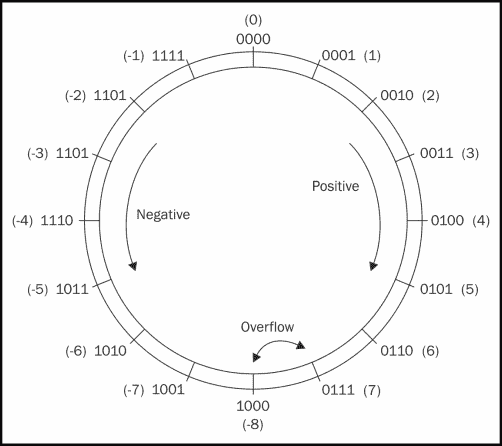
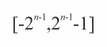
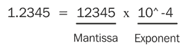
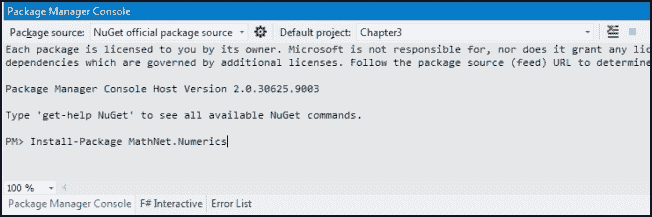
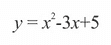
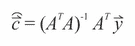
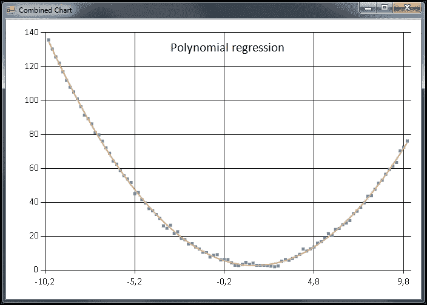
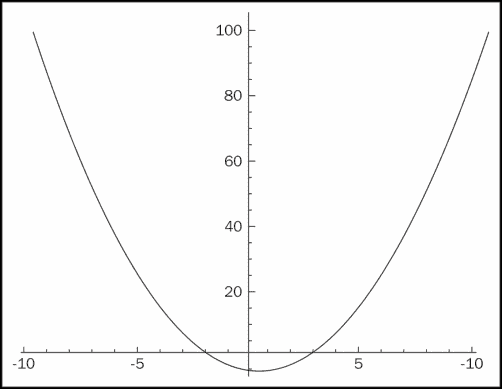

# 第三章：财务数学与数值分析

在本章中，读者将了解基本的数值分析和 F#中的算法实现。我们将讨论整数和浮点数是如何实现的，并且还将研究它们各自的局限性。基础统计内容也将涉及，同时会学习 F#中现有的函数，并与自定义实现进行比较。

本章将建立数值分析的基础，后续在研究期权定价和波动性时可以用到这些基础。我们还将使用上一章中覆盖的部分功能，来实现用于汇总统计的数学函数，并展示它们在现实生活中的实用性。

在本章中，你将学习：

+   在 F#中实现算法

+   数值问题

+   实现基本的财务公式

+   曲线拟合与回归

+   F#中的矩阵与向量

# 理解数字表示

在这一部分，我们将展示数字是如何在计算机中表示为整数或浮点数的。数字是计算机和编程的基础。计算机中的一切都是通过二进制数字——即零和一——来表示的。如今，我们拥有 64 位计算机，使得我们能够在 CPU 中天真地使用 64 位表示整数和浮点数。接下来，我们将深入探讨整数和浮点数在以下两部分中的表示方式。

## 整数

当我们谈论整数，通常用 Z 表示时，我们具体指的是以机器精度表示的整数，这些整数在计算机中用一系列位来精确表示。同时，整数是指可以不带小数或分数部分写出的数字，按照惯例用 Z 表示。例如，0 表示为 000000...，1 表示为...000001，2 表示为...000010，依此类推。从这个模式可以看出，数字是以二的幂次方表示的。为了表示负数，数字范围被分为两半，并使用二的补码表示。

当我们谈论没有负数的整数表示，即从零开始的数字时，我们讨论的是无符号整数。

### 二的补码

二的补码是一种将二进制数字范围分为正负十进制数的方式。通过这种方式，计算机可以表示正数和负数。另一方面，这意味着对于二的补码来说，数字范围相对于无符号表示的范围是减半的。二的补码是表示带符号整数的主要方式。



二的补码表示的整数可以被看作一个环，如前图所示。当最大允许的正值或负值增加时，会发生溢出。溢出意味着我们越过了正负数之间的界限。

下表显示了一些整数及其二进制补码表示：

| 十进制 | 二进制补码 |
| --- | --- |
| 127 | 0111 1111 |
| 64 | 0100 0000 |
| 1 | 0000 0001 |
| 0 | 0000 0000 |
| -1 | 1111 1111 |
| -64 | 1100 0000 |
| -127 | 1000 0001 |
| -128 | 1000 0000 |

如你所见，8 位有符号整数的范围是从-128 到-127。更一般地说：



## 浮点数

浮点数，表示为 R，表示需要小数来定义的量。另一种描述这些数值的方式是将它们视为沿着连续线的量值。这些数值在实际生活中非常重要，用来建模诸如经济、统计和物理量等事物。在计算机中，浮点数是通过 IEEE 754 标准表示的。

### IEEE 754 浮点数标准

IEEE 754 浮点数标准通过尾数和指数来描述浮点数；请参见下图。

例如，一个 64 位的浮点数由以下位模式组成：

| 符号位 | 指数 | 尾数 |
| --- | --- | --- |
| 1 位 | 11 位 | 52 位 |



以下表格展示了浮点数及其二进制表示的示例：

| 二进制表示 | 浮点数 |
| --- | --- |
| 0x0000000000000000 | 0.0 |
| 0x3ff0000000000000 | 1.0 |
| 0xc000000000000000 | -2.0 |
| 0x4000000000000000 | 2.0 |
| 0x402E000000000000 | 15.0 |

F# Interactive 能够将浮点数的十六进制表示解码为浮点数：

```py
> 0x402E000000000000LF;;
val it: float = 15.0
```

### 提示

在 F# Interactive 中尝试前述的二进制表示。

# 学习 F#中的数值类型

在 F#中，像大多数现代编程语言一样，存在多种数值类型。这样做的主要原因是让你作为程序员能够在任何给定情况下选择最合适的数值类型。有时候，64 位整数并不必要，8 位整数就足够表示小数字了。另一个方面是内存效率和消耗，即 64 位整数将消耗 8 倍于 8 位整数的内存。

以下是 F#代码中最常用的数值类型表格。这些类型分为两大类：整数和浮点数：

| 类型 | 描述 | 示例 |
| --- | --- | --- |
| byte | 8 位无符号整数 | 10uy, 0xA0uy |
| sbyte | 8 位有符号整数 | 10y |
| int16 | 16 位有符号整数 | 10s |
| uint16 | 16 位无符号整数 | 10us |
| int, int32 | 32 位有符号整数 | 10 |
| uint32 | 32 位无符号整数 | 10u |
| int64 | 64 位有符号整数 | 10L |
| uint64 | 64 位无符号整数 | 10UL |
| nativeint | 硬件大小的有符号整数 | 10n |
| unativeint | 硬件大小的有符号整数 | 10un |
| single, float32 | 32 位 IEEE 754 浮点数 | 10.0f |
| double, float | 64 位 IEEE 754 浮点数 | 10.0 |
| decimal | 高精度十进制 | 10.0M |
| bigint | 任意精度整数 | 10I |
| complex | 使用 64 位浮点数的复数 | Complex(10.0, 10.0) |

以下是如何使用整数后缀的一些示例：

```py
> let smallestnteger = 10uy;;
val smallestnteger : byte = 10uy

> let smallerInteger = 10s;;
val smallerInteger : int16 = 10s

> let smallInteger = 10us;;
val smallInteger : uint16 = 10us

> let integer = 10L;;
val integer : int64 = 10L
```

# 算术运算符

算术运算符应该是你熟悉的；不过，为了保持一致性，我们将在本节中覆盖它们。这些运算符按预期工作，接下来的表格通过每个运算符的示例来说明这一点。值得注意的是，返回整数除法余数的余数运算符。

让我们通过一个示例更详细地查看这个问题。首先，我们尝试将 10 除以 2，余数正如预期的那样为 0：

```py
> 10 % 2;;
val it : int = 0
```

如果我们尝试将 10 除以 3，我们得到的余数是 1，因为 3 x 3 = 9，而 10 – 9 = 1：

```py
> 10 % 3;;
val it : int = 1
```

以下表格显示了算术运算符、示例和描述：

| 运算符 | 示例 | 描述 |
| --- | --- | --- |
| + | x + y | 加法 |
| - | x - y | 减法 |
| * | x * y | 乘法 |
| / | x / y | 除法 |
| % | x % y | 余数 |
| - | -x | 一元负号 |

### 注意

算术运算符不会检查溢出。如果你想检查溢出，可以使用 `Checked` 模块。你可以在 [`msdn.microsoft.com/en-us/library/vstudio/ee340296.aspfx`](http://msdn.microsoft.com/en-us/library/vstudio/ee340296.aspfx) 中找到更多关于 `Checked` 模块的信息。

# 学习算术比较

算术比较用于比较两个数字之间的关系。了解以下表格中显示的所有运算符是很有用的：

| 运算符 | 示例 | 描述 |
| --- | --- | --- |
| < | x < y | 小于 |
| <= | x <= y | 小于或等于 |
| > | x > y | 大于 |
| >= | x >= y | 大于或等于 |
| (=) | x = y | 相等 |
| <> | x <> y | 不等于 |
| min | min x y | 最小值 |
| max | max x y | 最大值 |

一些算术比较的示例如下：

```py
> 5.0 = 5.0;;
val it : bool = true
> 1 < 4;;
val it : bool = true
> 1.0 > 3.0;;
val it : bool = false
```

另外值得注意的是，在 F# 中你不能比较不同类型的数字。为了做到这一点，你必须将其中一个数字转换，方法如下：

```py
> 5.0 >= 10;;
  5.0 >= 10
  -------^^
stdin(10,8): error FS0001: This expression was expected to have type float but here has type int
```

# 数学运算符

以下数学运算符表涵盖了编程语言或其标准库中预期包含的最基本的数学函数：

| 运算符 | 示例 | 描述 |
| --- | --- | --- |
| abs | abs x | 重载绝对值 |
| acos | acos x | 重载反余弦 |
| asin | asin x | 重载反正弦 |
| atan | atan x | 重载反正切 |
| ceil | ceil x | 重载浮点数向上取整 |
| cos | cos x | 重载余弦 |
| exp | exp x | 重载指数 |
| floor | floor x | 重载浮点数向下取整 |
| log | log x | 重载自然对数 |
| log10 | log10 x | 重载以 10 为底的对数 |
| (**) | x ** y | 重载指数 |
| pown | pown x y | 重载整数指数 |
| round | round x | 重载四舍五入 |
| sin | sin x | 重载正弦函数 |
| sqrt | sqrt x | 重载平方根函数 |
| tan | tan x | 重载正切函数 |

# 转换函数

F# 中没有隐式转换，因为转换必须通过转换例程手动完成。类型之间的转换必须显式地使用下表中描述的运算符进行：

| 运算符 | 示例 | 描述 |
| --- | --- | --- |
| byte | byte x | 重载转换为字节 |
| sbyte | sbyte x | 重载转换为有符号字节 |
| int16 | int16 | 重载转换为 16 位整数 |
| uint16 | uint16 | 重载转换为无符号 16 位整数 |
| int32, int | Int32 x, int x | 重载转换为 32 位整数 |
| uint32 | uint32 x | 重载转换为无符号 32 位整数 |
| int64 | int64 x | 重载转换为 64 位整数 |
| uint64 | uint64 x | 重载转换为无符号 64 位整数 |
| nativeint | nativeint x | 重载转换为本机整数 |
| unativeint | unativeint x | 重载转换为无符号本机整数 |
| float, double | float x, double x | 重载转换为 64 位 IEEE 浮动点数 |
| float32, single | float32 x, single x | 重载转换为 32 位 IEEE 浮动点数 |
| decimal | decimal x | 重载转换为 System.decimal 数字 |
| char | char x | 重载转换为 System.Char 值 |
| enum | enum x | 重载转换为类型化的枚举值 |

这意味着后台永远不会有任何自动类型转换，这可能导致精度丢失。例如，数字不会从浮动点数转换为整数，仅仅为了适应你编写的代码。编译器会在转换前告诉你代码存在错误（它永远不会由编译器转换）。这方面的积极作用是，你总是清楚地知道数字的表示方式。

# 引入统计学

在本节中，我们将通过内置函数和简单的自定义函数来了解统计学。统计学在定量金融中被广泛应用。通常会分析更大的时间序列，F# 对数字序列有很好的支持；一些功能将在本节提到的示例中进行演示。

## 聚合统计

聚合统计是关于聚合数据的统计，例如从测量中收集的数字序列。了解这种集合的平均值是有用的；它告诉我们这些值的集中位置。`min` 和 `max` 值也很有用，可以帮助确定集合中的极值。

在 F# 中，`Seq` 模块内置了此功能。让我们通过示例查看如何在每种情况下使用它。

### 计算序列的和

考虑一个包含 100 个随机数的序列：

```py
let random = new System.Random()
let rnd() = random.NextDouble()
let data = [for i in 1 .. 100 -> rnd()]
```

我们可以使用管道运算符和模块函数`Seq.sum`来计算前述序列`data`的总和：

```py
let sum = data |> Seq.sum
```

请注意，由于我们使用的是随机数生成器，结果`sum`会时常变化：

```py
> sum;;
val it : float = 42.65793569
```

你可能会认为`sum`函数并不是最有用的，但有时它确实有用，了解它在模块库中的存在会节省你很多时间。

### 计算序列的平均值

对于这个例子，我们稍微修改一下随机种子函数，以生成 0 到 10 之间的 500 个数字：

```py
let random = new System.Random()
let rnd() = random.NextDouble()
let data = [for i in 1 .. 500 -> rnd() * 10.0]
```

由于随机函数的分布，这个序列的期望值是 5：

```py
let avg = data |> Seq.average
```

由于我们是随机生成数字，因此数值可能会有所变化：

```py
> avg;;
val it : float = 4.983808457
```

正如预期的那样，平均值几乎是 5。如果我们生成更多的数字，数值会越来越接近理论上的期望值 5：

```py
let random = new System.Random()
let rnd() = random.NextDouble()
let data = [for i in 1 .. 10000 -> rnd() * 10.0]

let avg = data |> Seq.average

> avg;;
val it : float = 5.006555917
```

### 计算序列的最小值

我们不通过迭代序列并使用某种循环结构与临时变量来跟踪最小值，而是倾向于使用 F#中的函数式方法。为了计算序列的最小值，我们使用模块函数`Seq.min`：

```py
let random = new System.Random()
let rnd() = random.NextDouble()
let data = [for i in 1 .. 10 -> rnd() * 10.0]

val data : float list =[5.0530272; 6.389536232; 6.126554094; 7.276151291; 0.9457452972; 7.774030933; 7.654594368; 8.517372011; 3.924642724; 6.572755164]

let min = data |> Seq.min

> min;;
val it : float = 0.9457452972
```

这与前面的代码非常相似，不同的是我们生成了 10 个随机数并检查列表中的值。如果我们手动寻找最小值，并将其与 F#计算得出的值进行比较，会发现它们是匹配的。

### 计算序列的最大值

在以下示例中，我们将使用`Seq.max`来计算列表的最大值：

```py
let random = new System.Random()
let rnd() = random.NextDouble()
let data = [for i in 1 .. 5 -> rnd() * 100.0]

val data : float list =[7.586052086; 22.3457242; 76.95953826; 59.31953153; 33.53864822]

let max = data |> Seq.max

> max;;
val it : float = 76.95953826
```

### 计算序列的方差和标准差

到目前为止，我们已经使用现有的函数进行了统计分析。现在，让我们实现方差和标准差。

#### 计算方差

让我们使用以下函数并计算骰子的方差：

```py
let variance(values=
  let average = Seq.average values values
  |> Seq.map (fun x -> (1.0 / float (Seq.length values)) * (x - average) ** 2.0)
  |> Seq.sum
```

一个骰子有六个离散的结果，从 1 到 6，每个结果的概率相等。期望值是 3.5，计算公式为(1 + 2 + 3 + 4 + 5 + 6)/6。骰子的方差通过以下函数计算：

```py
> variance [1.0 .. 6.0];;
val it : float = 2.916666667
```

#### 计算标准差

我们从使用之前定义的`variance`函数来实现标准差函数开始。根据统计学，标准差是方差的平方根：

```py
let stddev1(values:seq<float>) = sqrt(variance(values))
```

前述函数工作得很好，但为了展示序列的强大功能，我们将使用`fold`函数来实现标准差。`fold`函数将对每个元素应用给定的函数并累积结果。最后的`0.0`值意味着我们没有初始值。你可能记得在上一章的`fold`部分中提到过这一点。如果我们使用乘法进行折叠，则初始值应为`1.0`。最后，我们只需将总和传递给平方根函数`sqrt`，就完成了：

```py
let stddev2(values) =
  let avg = Seq.average values
  values    
  |> Seq.fold (fun acc x -> acc + (1.0 / float (Seq.length values)) * (x -avg) ** 2.0) 0.0
  |> sqrt

```

让我们使用一些样本数据来验证：

```py
> stddev1 [2.0; 4.0; 4.0; 4.0; 5.0; 5.0; 7.0; 9.0];;
val it : float = 2.0

> stddev2 [2.0; 4.0; 4.0; 4.0; 5.0; 5.0; 7.0; 9.0];;
val it : float = 2.0
```

现在，我们可以回过头来分析之前生成并使用的随机数据，这些数据出现在我们查看序列函数构建时：

```py
let random = new System.Random()
let rnd() = random.NextDouble()
let data = [for i in 1 .. 100 -> rnd() * 10.0]

let var = variance data
let std = stddev2 data
```

我们可以验证标准差的平方等于方差这一事实：

```py
> std * std = var;;
val it : bool = true
```

### 查看一个示例应用

本节中我们将看到的示例应用是本章中各个部分的结合，简单地生成一个关于给定数据序列的统计信息输出：

```py
/// Helpers to generate random numbers
let random = new System.Random()
let rnd() = random.NextDouble()
let data = [for i in 1 .. 500 -> rnd() * 10.0]

/// Calculates the variance of a sequence
let variance(values:seq<float>) = values
  |> Seq.map (fun x -> (1.0 / float (Seq.length values)) * (x - (Seq.average values)) ** 2.0)
  |> Seq.sum

/// Calculates the standard deviation of a sequence
let stddev(values:seq<float>) = values    
  |> Seq.fold (fun acc x -> acc + (1.0 / float (Seq.length values)) * (x - (Seq.average values)) ** 2.0) 0.0
  |> sqrt

let avg = data |> Seq.average
let sum = data |> Seq.sum
let min = data |> Seq.min
let max = data |> Seq.max
let var = data |> variance
let std = data |> stddev
```

评估代码后，输出显示如下生成的随机序列的统计属性：

```py
val avg : float = 5.150620541
val sum : float = 2575.310271
val min : float = 0.007285140458
val max : float = 9.988292227
val var : float = 8.6539651
val std : float = 2.941762244
```

这意味着该序列的平均值大约为 5.15，标准差大约为 2.94。基于这些事实，我们可以假设该序列按照某种已知分布（例如正态分布）重新构建其分布。

# 使用 Math.NET 库

如果你不想自己实现数值计算相关的函数，可以使用一个非常优秀的库——**Math.NET**。这是一个开源库，涵盖了线性代数、统计学等基础数学内容。

Math.NET 库由以下几个库组成：

+   **Math.NET 数值库**：数值计算

+   **Math.NET 钕库**：信号处理

+   **Math.NET LINQ 代数**：计算机代数

+   **Math.NET 钇库**：实验性网络计算代数

在本节中，我们将学习 Math.NET 数值库，并了解它如何帮助我们在 F# 编程中使用。首先，我们需要确保 Math.NET 已经安装在我们的系统中。

## 安装 Math.NET 库

可以通过内置的**包管理器**安装 Math.NET 库。



1.  通过进入**视图** | **其他窗口** | **包管理器控制台**来打开**包管理器控制台**。

1.  输入以下命令：

    ```py
    Install-Package MathNet.Numerics

    ```

1.  等待安装完成。

### 注意

你可以在项目网站上阅读更多关于 Math.NET 项目的内容：[`www.mathdotnet.com/`](http://www.mathdotnet.com/)。

## 随机数生成简介

让我们首先看看生成随机数的不同方法。随机数在统计学和模拟中使用频繁，尤其是在蒙特卡洛模拟中。我们在开始研究 Math.NET 和如何生成随机数之前，需要了解一些基础理论。

### 伪随机数

在计算机和编程中，随机数通常指的是伪随机数。伪随机数看起来是随机的，但实际上并非如此。换句话说，只要已知算法的某些特性和所使用的种子值，它们就是确定性的。种子是生成随机数的算法输入。通常，种子的选择会是系统的当前时间或其他唯一值。

在 .NET 平台提供的 `System.Random` 类中的随机数生成器基于 *Donald E. Knuth* 提出的减法随机数生成算法。该算法如果使用相同的种子，将生成相同的数字序列。

### 梅森旋转

梅森旋转伪随机数生成器能够以高效的方式生成不那么确定的数字。这些特性使得该算法成为今天最流行的算法之一。以下是如何在 Math.NET 中使用该算法的示例：

```py
open MathNet.Numerics.Random

let mersenneTwister = new MersenneTwister(42);
let a = mersenneTwister.NextDouble();
```

在 F# Interactive 中，我们可以使用梅森旋转生成一些数字：

```py
> mersenneTwister.NextDouble();;
val it : float = 0.7965429842

> mersenneTwister.NextDouble();;
val it : float = 0.9507143116

> mersenneTwister.NextDouble();;
val it : float = 0.1834347877
> mersenneTwister.NextDouble();;
val it : float = 0.7319939383

> mersenneTwister.NextDouble();;
val it : float = 0.7796909974
```

## 概率分布

概率分布通常用于统计学和金融学。它们用于分析和分类一组样本，以研究其统计属性。

### 正态分布

正态分布是最常用的概率分布之一。

在 Math.NET 中，正态分布可以如下使用：

```py
open MathNet.Numerics.Distributions

let normal = new Normal(0.0, 1.0)
let mean = normal.Mean
let variance = normal.Variance
let stddev = normal.StdDev
```

通过使用前面的示例，我们创建了一个均值为零，标准差为一的正态分布。我们还可以从分布中检索均值、方差和标准差：

```py
> normal.Mean;;
val it : float = 0.0

> normal.Variance;;
val it : float = 1.0

> normal.StdDev;;
val it : float = 1.0
```

在这种情况下，均值和标准差与我们在 `Normal` 类的构造函数中指定的相同。也可以从分布中生成随机数字。我们可以使用前面的分布生成一些随机数字，这些数字基于已定义的属性：

```py
> normal.Sample();;
val it : float = 0.4458429471

> normal.Sample();;
val it : float = 0.4411828389

> normal.Sample();;
val it : float = 0.9845689791

> normal.Sample();;
val it : float = -1.733795869
```

在 Math.NET 库中，还有其他一些分布，如：

+   泊松分布

+   对数正态

+   埃尔朗分布

+   二项分布

## 统计

在 Math.NET 中，还提供了对描述性统计的强大支持，可以用来确定样本集合的属性。这些样本可以是来自测量的数字，也可以是同一库生成的数字。

在这一部分，我们将查看一个示例，分析一个具有已知属性的样本集合，并了解 `DescriptiveStatistics` 类如何为我们提供帮助。

我们通过生成一些数据来进行分析：

```py
let dist = new Normal(0.0, 1.0)
let samples = dist.Samples() |> Seq.take 1000 |> Seq.toList
```

注意从`Seq`到`List`的转换；这是因为如果不进行转换，`samples` 将是一个惰性集合。这意味着该集合每次在程序中使用时都会生成不同的数字，而这正是我们在这种情况下不希望发生的。接下来，我们实例化 `DescriptiveStatistics` 类：

```py
let statistics = new DescriptiveStatistics(samples)
```

它将处理之前创建的样本，并创建一个描述 `samples` 列表中数字统计属性的对象。现在，我们可以获取有关数据的有价值信息：

```py
// Order Statistics
let maximum = statistics.Maximum
let minimum = statistics.Minimum

// Central Tendency
let mean = statistics.Mean

// Dispersion
let variance = statistics.Variance
let stdDev = statistics.StandardDeviation
```

如果我们更仔细地查看均值、方差和标准差，我们会发现它们与该集合的预期值相符：

```py
> statistics.Mean;;
val it : float = -0.002646746232

> statistics.Variance;;
val it : float = 1.000011159

> statistics.StandardDeviation;;
val it : float = 1.00000558
```

## 线性回归

线性回归在统计学中广泛应用，用于分析样本数据。线性回归揭示了两个变量之间的关系。它目前不是 Math.NET 的一部分，但可以通过它实现。Math.NET 中回归是一个被请求的功能；希望在未来，库将本地支持这一功能。

### 使用最小二乘法

让我们看看线性回归中最常用的一种方法，最小二乘法。这是一种标准的方法，用于通过最小二乘法找到近似解。最小二乘法将优化总体解，以最小化误差的平方，这意味着它将找到最能拟合数据的解。

以下是使用 Math.NET 进行线性代数部分的 F#实现最小二乘法：

```py
open System
open MathNet.Numerics
open MathNet.Numerics.LinearAlgebra
open MathNet.Numerics.LinearAlgebra.Double
open MathNet.Numerics.Distributions

/// Linear regression using least squares

let X = DenseMatrix.ofColumnsList 5 2 [ List.init 5 (fun i -> 1.0); [ 10.0; 20.0; 30.0; 40.0; 50.0 ] ] X
let y = DenseVector [| 8.0; 21.0; 32.0; 40.0; 49.0 |]
let p = X.QR().Solve(y)
printfn "X: %A" X
printfn "y: %s" (y.ToString())
printfn "p: %s" (p.ToString())

let (a, b) = (p.[0], p.[1])
```

自变量数据`y`和因变量数据`x`作为输入提供给求解器。你可以在这里使用`x`和`y`之间的任何线性关系。回归系数将告诉我们回归线的特性，`y` = `ax` + `b`。

### 使用多项式回归

在本节中，我们将探讨一种将多项式拟合到数据点的方法。当数据中的关系更适合用多项式来描述时，这种方法非常有用，例如二次或三次多项式。我们将在第六章，*波动率探索*中使用此方法，我们将拟合一个二次多项式到期权数据上，以构建一个波动率微笑图表。在本节中，我们将为这个用例奠定基础。

我们将继续使用 Math.NET 进行线性代数计算，以求解二次多项式的系数。

我们将从生成一些多项式的样本数据开始：



然后，我们从`-10.0`到`10.0`生成 x 值，步长为`0.2`，并使用这些 x 值和前面的方程加噪声来生成 y 值。为了实现这一点，我们使用了均值为零、标准差为 1.0 的正态分布：

```py
let noise = (Normal.WithMeanVariance(0.0,0.5))
/// Sample points for x²-3x+5
let xdata = [-10.0 .. 0.2 .. 10.0]
let ydata = [for x in xdata do yield x ** 2.0 - 3.0*x + 5.0 + noise.Sample()]
```

接下来，我们使用 Math.NET 中的线性代数函数实现系数的最小二乘估算。在数学术语中，这可以表示为：



这意味着我们将使用矩阵 A，它存储 x 值和 y 向量，用来估算系数向量 c。让我们看一下下面的代码，看看这是如何实现的：

```py
let N = xdata.Length
let order = 2

/// Generating a Vandermonde row given input v
let vandermondeRow v = [for x in [0..order] do yield v ** (float x)]

/// Creating Vandermonde rows for each element in the list
let vandermonde = xdata |> Seq.map vandermondeRow |> Seq.toList

/// Create the A Matrix
let A = vandermonde |> DenseMatrix.ofRowsList N (order + 1)
A.Transpose()

/// Create the Y Matrix
let createYVector order l = [for x in [0..order] do yield l]
let Y = (createYVector order ydata |> DenseMatrix.ofRowsList (order + 1) N).Transpose()

/// Calculate coefficients using least squares
let coeffs = (A.Transpose() * A).LU().Solve(A.Transpose() * Y).Column(0)

let calculate x = (vandermondeRow(x) |> DenseVector.ofList) * coeffs

let fitxs = [(Seq.min xdata).. 0.02 ..(Seq.max xdata)]
let fitys = fitxs |> List.map calculate
let fits = [for x in [(Seq.min xdata).. 0.2 ..(Seq.max xdata)] do yield (x, calculate x)]
```

系数向量中的值是倒序的，这意味着它们对应于一个拟合数据的多项式，但系数是倒转的：

```py
> coeffs;;
val it = seq [4.947741224; -2.979584718; 1.001216438]
```

这些值与我们在前面代码中用作输入的多项式非常接近。下面是样本数据点与拟合曲线的图表。该图表使用 FSharpChart 制作，我们将在下一章中介绍它。



使用 Math.net 进行多项式回归

好奇的读者可以使用以下代码段来生成前面的图形：

```py
open FSharp.Charting
open System.Windows.Forms.DataVisualization.Charting

fsi.AddPrinter(fun (ch:FSharp.Charting.ChartTypes.GenericChart) -> ch.ShowChart(); "FSharpCharting")
let chart = Chart.Combine [Chart.Point(List.zip xdata ydata ); Chart.Line(fits).WithTitle("Polynomial regression")]
```

# 学习根寻找算法

在本节中，我们将学习在数值分析中用于寻找函数根的不同方法。根寻找算法非常有用，当我们讨论波动率和隐含波动率时，我们将进一步了解它们的应用。

## 二分法

在本节中，我们将看一种使用二分法找到函数根的方法。此方法将在本书后续章节中用于通过数值方法找到给定某一市场价格的期权的隐含波动率。二分法使用迭代，并反复将一个区间二分为下一个迭代的范围。

以下函数在 F#中实现了二分法：

```py
let rec bisect n N (f:float -> float) (a:float) (b:float) (t:float) : float =
  if n >= N then -1.0
  else
    let c = (a + b) / 2.0
    if f(c) = 0.0 || (b - a) / 2.0 < t then
      // Solution found
      c
    else
      if sign(f(c)) = sign(f(a)) then
        bisect (n + 1) N f c b t
      else    
        bisect (n + 1) N f a c t
```

### 看一个例子

现在，我们将看一个求解二次方程根的例子。方程 x² - x - 6 在下面的图中进行了绘制：



前面的二次方程的根可以在图中轻松看到。否则，也有解析方法可以求解；例如，配方法。方程的根是-2 和 3。

接下来，我们在 F#中创建一个匿名函数来描述我们感兴趣的用于求解根的函数：

```py
let f = (fun x -> (x**2.0 - x - 6.0))
```

我们可以使用前面图中找到的根来测试上面的函数：

```py
> f(-2.0);;
val it : float = 0.0

> f(3.0);;
val it : float = 0.0
```

结果如预期所示。现在，我们可以继续并使用 lambda 函数作为`bisect`函数的参数：

```py
// First root, on the positive side
let first = bisect 0 25 f 0.0 10.0 0.01

// Second root, on the negative side
let second = bisect 0 25 f -10.0 0.0 0.01
```

前两个参数，`0`和`25`，用于跟踪迭代过程。我们传入`0`是因为我们希望从第 0 次迭代开始，然后迭代 25 次。下一个参数是我们在前面代码中定义的函数`f`。接下来的两个参数是限制条件，也就是我们可以在其中寻找根的范围。最后一个参数是用于迭代内部比较的精度值。

我们现在可以检查这两个变量，看看是否找到了根：

```py
> first;;
val it : float = -2.001953125

> second;;
val it : float = 2.998046875
```

它们几乎与解析解-2 和 3 完全相同。这是数值分析中典型的情况。解几乎永远不会完全准确。每一步都会因为浮点数、四舍五入等原因引入一些不准确。

## 使用牛顿-拉夫森法寻找根

牛顿-拉夫森法，或简称牛顿法，通常比二分法收敛得更快。牛顿-拉夫森法还需要函数的导数，这在某些情况下可能是一个问题。特别是当没有解析解时，这个问题尤为突出。以下实现是二分法的修改版，使用函数的导数来判断是否找到了解。我们来看看牛顿法在 F#中的实现：

```py
// Newton's Method
let rec newtonraphson n N (f:float -> float) (fprime:float -> float) (x0: float) (tol:float) : float =
  if n >= N then -1.0
  else        
    let d = fprime(x0)
    let newtonX = x0 - f(x0) / d    
    if abs(d) < tol then
      -1.0
    else
      if abs(newtonX - x0) < tol then
        newtonX   // Solution found
      else
        newtonraphson (n +1) N f fprime newtonX tol
```

使用前面的方法的一个缺点是，我们使用了一个固定点收敛标准，`abs(newtonX - x0) < tol`，这意味着当满足此标准时，我们可能离实际解还很远。

### 看一个例子

现在我们可以尝试求解二的平方根，预期结果是 1.41421。首先，我们需要函数本身，`fun x -> (x**2.0 – 2.0)`。我们还需要该函数的导数，`x -> (2.0*x)`：

```py
let f = (fun x -> (x**2.0 - 2.0))
let fprime = (fun x -> (2.0*x))
let sqrtOfTwo = newtonraphson 0 25 f fprime 1.0 10e-10    
```

现在，我们使用牛顿-拉弗森方法来求解方程 x² - 2 的根。使用 F#交互式环境，我们可以按如下方式进行研究：

```py
> newtonraphson 0 25 f fprime 1.0 10e-10;;
val it : float = 1.414213562    
```

这是我们预期的答案，且该方法能有效求解根！注意，如果我们将起始值`x0`从`1.0`改为`-1.0`，我们将得到负根：

```py
> newtonraphson 0 25 f fprime -1.0 10e-10;;
val it : float = -1.414213562
```

这也是方程的一个有效解，因此在使用此方法求解根时要注意这一点。绘制函数图像可能会有所帮助，正如我们在二分法部分所做的那样，以便更好地了解从哪里开始。

## 使用割线法求根

割线法不需要函数的导数，是牛顿-拉弗森方法的一种近似方法。它在迭代中使用有限差分近似。以下是 F#中的递归实现：

```py
// Secant method
let rec secant n N (f:float -> float) (x0:float) (x1:float) (x2:float) : float =
  if n >= N then x0
  else
    let x = x1 - (f(x1))*((x1 - x0)/(f(x1) - f(x0)))
    secant (n + 1) N f x x0
```

### 看一个例子

让我们看一个例子，我们使用割线法来求解一个函数的一个根。我们将尝试求解`612`的正根，它是 25 的平方（25 x 25 = 625）略小的数字：

```py
let f = (fun x -> (x**2.0 - 612.0))

> secant 0 10 f 0.0 10.0 30.0;;
val it : float = 24.73863375
```

# 总结

在这一章中，我们深入探讨了 F#与数值分析的结合，以及这两者如何因为语言的函数式语法而紧密配合。我们介绍了算法实现、基本的数值问题以及 Math.NET 库。阅读完这一章后，你将更加熟悉 F#和数值分析，并能够自己实现算法。在本章的结尾，我们介绍了一个使用二分法的例子。这个方法在我们稍后讨论 Black-Scholes 模型和隐含波动率时将非常有用。

在下一章中，我们将基于到目前为止学到的内容，扩展我们当前的知识，涉及数据可视化、基础 GUI 编程以及财务数据的绘制。
