# 第四章：数据可视化入门

在本章中，你将学习如何开始进行数据可视化，并在 F# 中构建图形用户界面（GUI）。在定量金融中，能够绘制和可视化时间序列是至关重要的。F# 是一款很好的工具，我们将学习如何使用 F# 作为一个高级图形计算器，通过 F# Interactive 来实现。

本章的内容将在整本书中使用，凡是需要用户界面的地方都会用到。在本章中，你将学习：

+   在 F# 和 .NET 中编程基本 GUI

+   使用 Microsoft Charts 绘制数据

+   绘制金融数据

+   构建交互式 GUI

# 在 F# 中创建你的第一个 GUI

F# 利用 .NET 平台，GUI 编程也不例外。本节将使用来自 .NET 平台的所有类，我们将重点关注来自 `System.Windows.Forms` 命名空间的类。

可以在 F# Interactive 中使用相同的代码并动态修改 GUI。我们将在 *显示数据* 部分更详细地探讨这一点。

让我们来看一个例子，使用 .NET 表单和按钮。按钮将连接到一个事件处理程序，每次点击按钮时都会触发该事件处理程序。正如你在阅读代码时看到的，事件处理程序是高阶函数，从而产生了简洁紧凑的代码。

```py
open System.Windows.Forms

let form = new Form(Text = "First F# form")
let button = new Button(Text = "Click me to close!", Dock = DockStyle.Fill)

button.Click.Add(fun _ -> Application.Exit() |> ignore)
form.Controls.Add(button)
form.Show()
```

上述代码的输出截图如下：

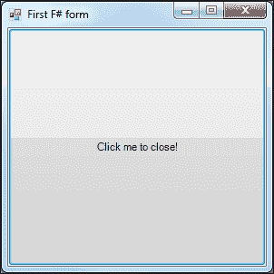

第一个由表单和按钮组成的 F# GUI 应用程序

# 组合界面

现在，我们已经看过了生成表单的第一个代码，并组成了一个由按钮构成的非常简单的界面。正如你可能已经注意到的，F# 没有像其他 .NET 语言那样的可视化设计器。F# 中有几种方式来组合界面：

+   手动编写界面代码

+   使用 C# 可视化设计器并将代码转换为 F#

+   使用其他 .NET 语言构建库，并在 F# 中使用它

+   构建你自己的可视化设计器以输出 F# 代码

在本书中，我们将主要使用第一种方式——手动编写界面代码。这可能看起来有些繁琐，但优点是可以完全控制布局。我们现在将看一个更大的例子，使用代理来跟踪最高数字，并且包含一个带按钮的用户界面。当用户点击按钮时，一个随机数字会被发送到代理（见下图）。然后，代理每秒输出最高数字。此外，例子还展示了如何以现实的方式使用命名空间和模块。这能帮助读者了解何时使用命名空间和模块，以及在程序变得更大时如何结构化代码。

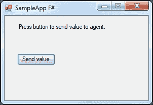

代理应用程序的形式，其中包含一个按钮来将值发送给代理。

### 提示

项目中文件的顺序如下：

+   代理

+   GUI

+   程序

否则，由于引用问题，你会看到一些错误。见下图，展示了 **解决方案资源管理器**，请注意文件顺序：

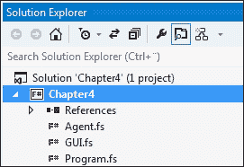

## 更多关于代理

首先，我们从代理开始。这个代理与第二章中关于代理的部分中的代理非常相似，*进一步学习 F#*，只是做了一些修改并且使用了`Agents`命名空间。代码如下：

```py
namespace Agents

    open System

    // Type for our agent
    type Agent<'T> = MailboxProcessor<'T>

    // Control messages to be sent to agent
    type CounterMessage = 
        | Update of float
        | Reset

    module Helpers =
        let genRandomNumber (n) =
            let rnd = new System.Random()
            float (rnd.Next(n, 100))

    module MaxAgent =
        // Agent to keep track of max value and update GUI
        let sampleAgent = Agent.Start(fun inbox ->
            let rec loop m = async {
                let! msg = inbox.Receive()
                match msg with
                | Reset ->
                    return! loop 0.0
                | Update value ->
                    let m = max m value

                    Console.WriteLine("Max: " + m.ToString())

                    do! Async.Sleep(1000)
                    return! loop m
            } 
            loop 0.0)
```

上面代码的截图如下：

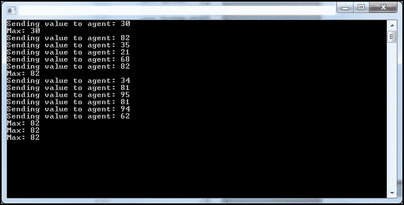

包含代理输出的控制台窗口

## 用户界面

用户界面被放置在 GUI 命名空间中。`SampleForm`继承自`Form` .NET 类。如果你熟悉其他 .NET 语言，你会看到一些常见的步骤。所有布局代码也是代码的一部分。如前所述，F#中没有可视化设计器。要使用`System.Windows.Forms`，你必须将一个同名的程序集添加为引用。代码如下：

```py
namespace GUI

    open System
    open System.Drawing
    open System.Windows.Forms
    open Agents

    // User interface form
    type public SampleForm() as form =
        inherit Form()

        let valueLabel = new Label(Location=new Point(25,15))
        let startButton = new Button(Location=new Point(25,50))
        let sendButton = new Button(Location=new Point(25,75))
        let agent = MaxAgent.sampleAgent
        let initControls =
            valueLabel.Text <- "Sample Text"
            startButton.Text <- "Start"
            sendButton.Text <- "Send value to agent"
        do
            initControls

            form.Controls.Add(valueLabel)
            form.Controls.Add(startButton)

            form.Text <- "SampleApp F#"

            startButton.Click.AddHandler(new System.EventHandler
                (fun sender e -> form.eventStartButton_Click(sender, e)))

        // Event handler(s)
        member form.eventStartButton_Click(sender:obj, e:EventArgs) =
            let random = Helpers.genRandomNumber 5
            Console.WriteLine("Sending value to agent: " + random.ToString())
            agent.Post(Update random)
            ()
```

## 主应用程序

这是主应用程序的入口点。它被注释以告知运行时环境（.NET 平台）从何处开始。这是通过使用`[<STAThread>]`注解来完成的。在这里，我们简单地启动应用程序及其 GUI。`SampleForm`的代码如下：

```py
// Main application entry point
namespace Program

    open System
    open System.Drawing
    open System.Windows.Forms

    open GUI

    module Main =
        [<STAThread>]
        do
            Application.EnableVisualStyles()
            Application.SetCompatibleTextRenderingDefault(false)
            let view = new SampleForm()
            Application.Run(view)
```

## 了解事件处理

事件驱动编程和用户事件是构建 GUI 的常见方式。F#中的事件处理器非常简单，lambda 函数易于阅读和理解。紧凑的代码总是更受欢迎，并且使得如维护和理解代码等任务对所有相关人员来说都更容易。

如果我们仔细观察之前用于事件处理的代码，你会看到我们首先使用一个 lambda 函数，并在 lambda 内部调用类的成员函数：

```py
startButton.Click.AddHandler(new System.EventHandler
                (fun sender e -> form.eventStartButton_Click(sender, e)))

        // Event handler(s)
        member form.eventStartButton_Click(sender:obj, e:EventArgs) =
            let random = Helpers.genRandomNumber 5
            Console.WriteLine("Sending value to agent: " + random.ToString())
            agent.Post(Update random)
            ()
```

这只是一种使代码更具可读性和更容易理解的方式。当然，也可以将所有逻辑直接包含在 lambda 函数中；但这种方法更加简洁，尤其对于大型项目。

# 显示数据

显示和可视化数据对于更好地理解其特性至关重要。此外，数据在定量金融中处于核心地位。F#是一个用于数据分析和可视化的利器。大多数可视化和用户界面功能都来自.NET 平台。结合 F#的探索特性，特别是通过 F#交互式，这种组合变得非常高效和强大。

我们首先使用 F#交互式创建一个表单，该表单将显示传递给它的数据。这意味着我们将有一个可以在运行时更改内容的表单，而无需重新编译。表单中的控件也是可以互换的：

```py
// The form
open System
open System.Drawing
open System.Windows.Forms

let form = new Form(Visible = true, Text = "Displaying data in F#",TopMost = true, Size = Drawing.Size(600,600))

let textBox = 
    new RichTextBox(Dock = DockStyle.Fill, Text = "This is a text box that we can feed data into", Font = new Font("Lucida Console",16.0f,FontStyle.Bold), ForeColor = Color.DarkBlue)

form.Controls.Add textBox
```

如果你运行这段代码，你会看到一个标题为**在 F#中显示数据**的表单，如以下截图所示：

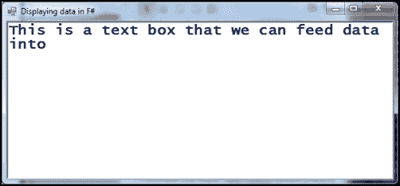

包含 RichTextBox 控件用于显示数据的窗口

我们需要一个函数将数据发送到窗口中的文本框并显示它。以下是完成此任务的函数：

```py
let show x = 
   textBox.Text <- sprintf "%30A" x
```

现在，我们可以使用这个函数，它会将格式化的数据发送到我们的文本框（`textBox`）。这里有一些示例，展示了如何使用这个函数；如后续代码片段所示，利用管道函数是很有用的：

```py
show (1,2)
show [ 0 .. 100 ]
show [ 0.0 .. 2.0 .. 100.0 ]
// Using the pipe operator
(1,2,3) |> show
[ 0 .. 99 ] |> show
[ for i in 0 .. 99 -> (i, i*i) ] |> show
```

如果你想清除文本框的内容，可以写：

```py
textBox.Clear()
```

输出结果如下：

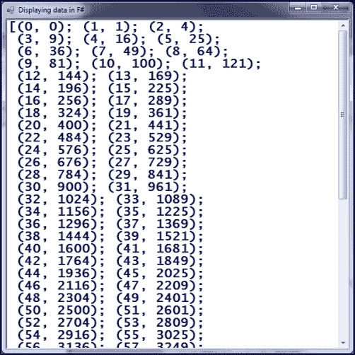

这是表单的样子，内容来自前一个代码片段生成的内容

### 提示

尝试自己动手做做看，看看哪种工作流最适合你。

## 扩展表单以使用表格

现在我们已经看过如何使用 F# Interactive 并即时将数据传递到表单中，我们可以扩展这个概念，并使用表格，如下所示：

```py
open System
open System.Drawing
open System.Windows.Forms

// The form
let form2 = new Form(Visible = true, Text = "Displaying data in F#", TopMost = true, Size = Drawing.Size(600,600))

// The grid
let data = new DataGridView(Dock = DockStyle.Fill, Text = "Data grid", Font = new Drawing.Font("Lucida Console", 10.0f), ForeColor = Drawing.Color.DarkBlue)

form2.Controls.Add(data)

// Some data
data.DataSource <- [| ("ORCL", 32.2000, 31.1000, 31.1200, 0.0100);
                      ("MSFT", 72.050, 72.3100, 72.4000, 0.0800);
                      ("EBAY", 58.250, 58.5200, 58.5100, 0.0100)|]
```

上述代码将把`DataGridView`添加到表单中，并为其添加一些样式。代码的最后几行将填充`DataGridView`，并加入一些示例数据。它最终将呈现出如下图所示的样子：

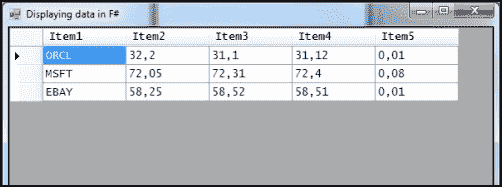

将包含示例数据的 DataGridView 添加到表单中

让我们扩展这个例子，并使用代码一起设置列标题，并使用代码来操作集合：

```py
open System
open System.Drawing
open System.Windows.Forms
open System.Collections.Generic

// The form
let form2 = new Form(Visible = true, Text = "Displaying data in F#", TopMost = true, Size = Drawing.Size(600,600))

// The grid
let data = new DataGridView(Dock = DockStyle.Fill, Text = "Data grid",Font = new Drawing.Font("Lucida Console", 10.0f), ForeColor = Drawing.Color.DarkBlue)

form2.Controls.Add(data)

// Generic list
let myList = new List<(string * float * float * float * float)>()

// Sample data
myList.Add(("ORCL", 32.2000, 31.1000, 31.1200, 0.0200))
myList.Add(("MSFT", 72.050, 72.3100, 72.4000, 0.0100))

data.DataSource <- myList.ToArray()

// Set column headers
do data.Columns.[0].HeaderText <- "Symb"
do data.Columns.[1].HeaderText <- "Last sale"
do data.Columns.[2].HeaderText <- "Bid"
do data.Columns.[3].HeaderText <- "Ask"
do data.Columns.[4].HeaderText <- "Spread"

do data.Columns.[0].Width <- 100
```

结果将看起来像下图所示的窗口：

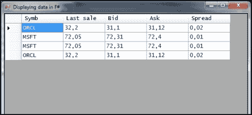

使用集合作为数据源的格式化 DataGridView

## 从 Yahoo! Finance 显示财务数据

现在，我们来看一个更大的示例应用程序，我们将在其中使用到目前为止介绍的概念，并将功能扩展到财务数据的可视化。在这里，我们将从 Yahoo! Finance 下载数据，并在同一个图表窗口中显示收盘价及其计算出的移动平均线。最终，应用程序的界面大致如下所示：

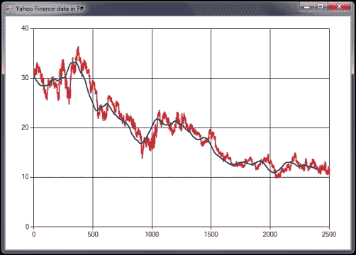

一个示例应用程序，用于可视化来自 Yahoo! Finance 的数据

## 理解应用程序代码

该应用程序将使用前面章节中介绍的一些代码。如果你对某些内容不熟悉，请回去复习相关的主题。这里的主要构建模块是`Systems.Windows.Forms`和`System.Windows.Forms.DataVisualization.Charting`。更多信息可以在 MSDN 在线获取：[`msdn.microsoft.com/en-us/library/system.windows.forms.datavisualization.charting.aspx`](http://msdn.microsoft.com/en-us/library/system.windows.forms.datavisualization.charting.aspx)。

让我们来看一下提供上述功能所需的代码：

```py
#r "System.Windows.Forms.DataVisualization.dll"

open System
open System.Net
open System.Windows.Forms
open System.Windows.Forms.DataVisualization.Charting
open Microsoft.FSharp.Control.WebExtensions
```

我们将首先创建一个图表，并通过设置`style`和`ChartAreas`来初始化它：

```py
// Create chart and form
let chart = new Chart(Dock = DockStyle.Fill)
let area = new ChartArea("Main")
chart.ChartAreas.Add(area)
```

然后创建并显示表单。之后，设置程序的标题，并将图表控件添加到表单中：

```py
let mainForm = new Form(Visible = true, TopMost = true, 
                        Width = 700, Height = 500)

do mainForm.Text <- "Yahoo Finance data in F#"
mainForm.Controls.Add(chart)
```

然后，有一些代码来创建所需的两个图表系列，并为这两个系列设置样式，以便将它们区分开来。股票价格系列将是红色，移动平均线将是蓝色：

```py
// Create series for stock price
let stockPrice = new Series("stockPrice")
do stockPrice.ChartType <- SeriesChartType.Line
do stockPrice.BorderWidth <- 2
do stockPrice.Color <- Drawing.Color.Red
chart.Series.Add(stockPrice)
// Create series for moving average
let movingAvg = new Series("movingAvg")
do movingAvg.ChartType <- SeriesChartType.Line
do movingAvg.BorderWidth <- 2
do movingAvg.Color <- Drawing.Color.Blue
chart.Series.Add(movingAvg)

// Syncronous fetching (just one stock here)
```

现在，获取数据的代码与上一章使用的相同，第三章，*金融数学与数值分析*。

```py
let fetchOne() =
    let uri = new System.Uri("http://ichart.finance.yahoo.com/table.csv?s=ORCL&d=9&e=23&f=2012&g=d&a=2&b=13&c=1986&ignore=.csv")
    let client = new WebClient()
    let html = client.DownloadString(uri)
    html

// Parse CSV
let getPrices() =
    let data = fetchOne()
    data.Split('\n')
    |> Seq.skip 1
    |> Seq.map (fun s -> s.Split(','))
    |> Seq.map (fun s -> float s.[4])
    |> Seq.truncate 2500
```

这里有趣的部分是如何将数据添加到图表中。这是通过遍历时间序列并使用 `series.Points.Add` 方法完成的。这是一种优雅简洁的方式。`ignore` 操作符被用来简单地跳过 `Points.Add` 方法的结果，忽略它。

```py
// Calc moving average
let movingAverage n (prices:seq<float>) =
    prices    
    |> Seq.windowed n
    |> Seq.map Array.sum
    |> Seq.map (fun a -> a / float n)    

// The plotting
let sp = getPrices()
do sp |> Seq.iter (stockPrice.Points.Add >> ignore)

let ma = movingAverage 100 sp
do ma |> Seq.iter (movingAvg.Points.Add >> ignore)
```

# 扩展应用程序以使用布林带

我们现在将扩展上一节中使用的应用程序，以使用布林带。布林带是移动平均的扩展，加入了两个带——一个上轨带和一个下轨带。带的值通常是 K 倍（其中 K=2.0）的移动标准差，高于和低于移动平均线。我们需要添加一个函数来计算移动标准差。我们可以使用上一章中的标准差，并将其与 `Seq.windowed` 函数一起使用，代码如下所示。在此示例中，我们还添加了图例，以指定哪个数据系列对应于哪个颜色。截图如下：

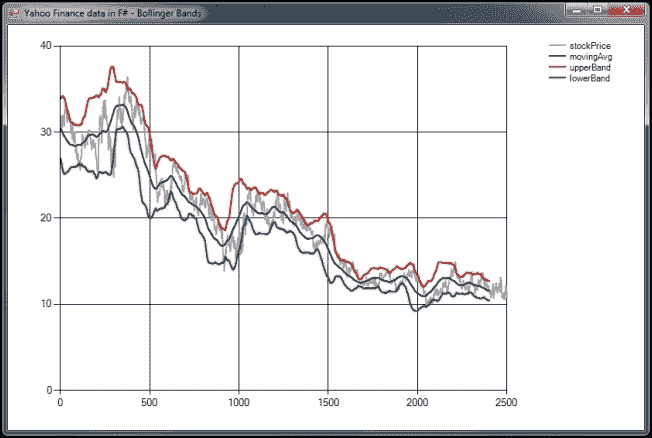

扩展了布林带功能的示例应用程序

代码看起来与前面示例中的代码几乎相同，除了上轨和下轨的计算，以及移动标准差的部分：

```py
/// Another example with Bollinger Bands
#r "System.Windows.Forms.DataVisualization.dll" 

open System
open System.Net
open System.Windows.Forms
open System.Windows.Forms.DataVisualization.Charting
open Microsoft.FSharp.Control.WebExtensions
// Create chart and form
let chart = new Chart(Dock = DockStyle.Fill)
let area = new ChartArea("Main")
chart.ChartAreas.Add(area)
```

可以使用 `chart.Legends.Add` 很容易地将图例添加到图表中：

```py
// Add legends
chart.Legends.Add(new Legend())

let mainForm = new Form(Visible = true, TopMost = true, 
                        Width = 700, Height = 500)

do mainForm.Text <- "Yahoo Finance data in F# - Bollinger Bands"
mainForm.Controls.Add(chart)

// Create series for stock price
let stockPrice = new Series("stockPrice")
do stockPrice.ChartType <- SeriesChartType.Line
do stockPrice.BorderWidth <- 2
do stockPrice.Color <- Drawing.Color.DarkGray
chart.Series.Add(stockPrice)

// Create series for moving average
let movingAvg = new Series("movingAvg")
do movingAvg.ChartType <- SeriesChartType.Line
do movingAvg.BorderWidth <- 2
do movingAvg.Color <- Drawing.Color.Blue
chart.Series.Add(movingAvg)
```

我们将需要两个新的数据系列，分别用于上轨带和下轨带：

```py
// Create series for upper band
let upperBand = new Series("upperBand")
do upperBand.ChartType <- SeriesChartType.Line
do upperBand.BorderWidth <- 2
do upperBand.Color <- Drawing.Color.Red
chart.Series.Add(upperBand)

// Create series for lower band
let lowerBand = new Series("lowerBand")
do lowerBand.ChartType <- SeriesChartType.Line
do lowerBand.BorderWidth <- 2
do lowerBand.Color <- Drawing.Color.Green
chart.Series.Add(lowerBand)
// Syncronous fetching (just one stock here)
let fetchOne() =
    let uri = new System.Uri("http://ichart.finance.yahoo.com/table.csv?s=ORCL&d=9&e=23&f=2012&g=d&a=2&b=13&c=1986&ignore=.csv")
    let client = new WebClient()
    let html = client.DownloadString(uri)
    html

// Parse CSV
let getPrices() =
    let data = fetchOne()
    data.Split('\n')
    |> Seq.skip 1
    |> Seq.map (fun s -> s.Split(','))
    |> Seq.map (fun s -> float s.[4])
    |> Seq.truncate 2500

// Calc moving average
let movingAverage n (prices:seq<float>) =
    prices    
    |> Seq.windowed n
    |> Seq.map Array.sum
    |> Seq.map (fun a -> a / float n)
```

计算移动标准差的代码是对上一章中使用的代码的修改，以适应 `Seq.windowed` 函数：

```py
// Stddev
let stddev2(values:seq<float>) =
    let avg = Seq.average values
    values    
    |> Seq.fold (fun acc x -> acc + (1.0 / float (Seq.length values)) * (x - avg) ** 2.0) 0.0
    |> sqrt

let movingStdDev n (prices:seq<float>) =
    prices
    |> Seq.windowed n
    |> Seq.map stddev2

// The plotting
let sp = getPrices()
do sp |> Seq.iter (stockPrice.Points.Add >> ignore)
let ma = movingAverage 100 sp
do ma |> Seq.iter (movingAvg.Points.Add >> ignore)
```

本节内容相当有趣。在这里，我们将从移动标准差中加上或减去结果，并将其与移动平均相乘，从而形成上轨和下轨带：

```py
// Bollinger bands, K = 2.0
let ub = movingStdDev 100 sp
// Upper
Seq.zip ub ma |> Seq.map (fun (a,b) -> b + 2.0 * a) |> Seq.iter (upperBand.Points.Add >> ignore)
// Lower
Seq.zip ub ma |> Seq.map (fun (a,b) -> b - 2.0 * a) |> Seq.iter (lowerBand.Points.Add >> ignore)
```

如果你愿意，可以扩展这个应用程序并实现其他技术指标。使用 F# Interactive 的好处在于，应用程序本身不需要重新启动即可显示新数据。换句话说，你可以使用`movingAvg.Points.Add`，并将数据点添加到图表中。

# 使用 FSharp.Charting

**FsChart** 是一个常用的 F# 图表库，作为 Microsoft Chart 控件的功能性包装器实现。这个控件可以帮你省去一些工作，因为不像前面使用 Microsoft Chart 控件的示例那样需要编写样板代码。FsChart 也被设计为与 F# 一起使用，并能更好地与 F# Interactive 集成。

可以通过在包管理器控制台输入以下命令来安装该库：

```py
Install-Package FSharp.Charting
```

## 从股票价格创建蜡烛图

让我们来看一下用于显示与之前相同的股票（Oracle）的 K 线图的代码，数据来自 Yahoo! Finance。这次，设置图表所需的样板代码减少了。程序的主要部分包括下载、解析和转换数据：

```py
open System
open System.Net
open FSharp.Charting
open Microsoft.FSharp.Control.WebExtensions
open System.Windows.Forms.DataVisualization.Charting
```

要使用`FSharpCharting`，首先需要按如下方式设置图表：

```py
module FSharpCharting = 
    fsi.AddPrinter(fun (ch:FSharp.Charting.ChartTypes.GenericChart) ->ch.ShowChart(); "FSharpCharting")

// Syncronous fetching (just one stock here)
let fetchOne() =
    let uri = new System.Uri("http://ichart.finance.yahoo.com/table.csv?s=ORCL&d=9&e=23&f=2012&g=d&a=2&b=13&c=2012&ignore=.csv")
    let client = new WebClient()
    let html = client.DownloadString(uri)
    html
```

我们需要将数据从开盘、最高、最低、收盘的顺序重新排序为最高、最低、开盘、收盘的顺序。这在我们将字符串解析为浮点数时完成。此外，我们将日期作为第一个值包括进去。`FSharpCharts`将使用日期来排序蜡烛图。

```py
// Parse CSV and re-arrange O,H,L,C - > H,L,O,C
let getOHLCPrices() =
    let data = fetchOne()
    data.Split('\n')
    |> Seq.skip 1
    |> Seq.map (fun s -> s.Split(','))
    |> Seq.map (fun s -> s.[0], float s.[2], float s.[3], float s.[1], float s.[4])
    |> Seq.truncate 50

// Candlestick chart price range specified
let ohlcPrices = getOHLCPrices() |> Seq.toList
Chart.Candlestick(ohlcPrices).WithYAxis(Max = 34.0, Min = 30.0)
```

数据将被下载、解析，并显示在图表中，最终的结果将类似于以下截图：

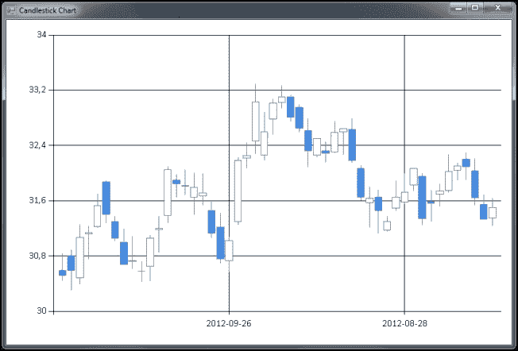

使用 FSharpCharts 显示 K 线图

# 创建条形图

在这个例子中，我们将学习如何绘制由 Math.NET 生成的分布的直方图。直方图用于可视化统计数据，并帮助我们了解其特性。我们将使用一个简单的正态分布，均值为零，标准差为一。

```py
open System
open MathNet.Numerics
open MathNet.Numerics.Distributions
open MathNet.Numerics.Statistics
open FSharp.Charting

module FSharpCharting2 = fsi.AddPrinter(fun ch:FSharp.Charting.ChartTypes.GenericChart) -> ch.ShowChart(); "FSharpCharting")
```

接下来，我们将创建将在直方图中使用的正态分布：

```py
let dist = new Normal(0.0, 1.0)
let samples = dist.Samples() |> Seq.take 10000 |> Seq.toList
let histogram = new Histogram(samples, 35);
```

不幸的是，Math.NET 和 FSharpCharting 并不直接兼容。我们需要将 Math.NET 的直方图转换为适用于`Chart.Column`函数：

```py
let getValues =
    let bucketWidth = Math.Abs(histogram.LowerBound - histogram.UpperBound) / (float histogram.BucketCount)
    [0..(histogram.BucketCount-1)]
    |> Seq.map (fun i -> (histogram.Item(i).LowerBound + histogram.Item(i).UpperBound)/2.0, histogram.Item(i).Count)

Chart.Column getValues
```

如下截图所示，分布看起来非常像正态分布。你可以自己尝试更改桶的数量，看看随着桶数的变化这种行为如何变化。此外，你还可以增加使用的样本数量。

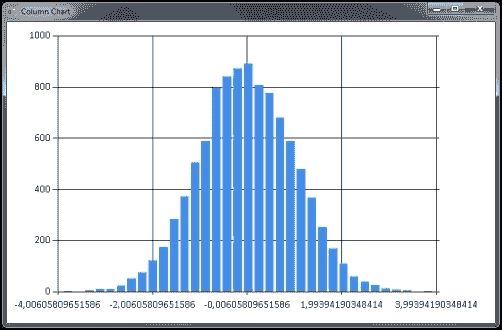

使用 FSharpCharts 显示直方图

# 总结

在本章中，我们探讨了 F#中的数据可视化，并学习了如何构建用户界面。我们已经学习了如何使用 F#在没有可视化设计器的情况下创建用户界面。当然，这种方法有利有弊。主要的好处是完全控制，并且没有隐藏的魔法。另一方面，当谈到大型 GUI 应用时，这可能会非常耗时。

在下一章中，我们将使用本章介绍的数据可视化工具来研究期权的一些有趣属性。我们将讨论期权的基础知识，以及如何使用 Black-Scholes 公式来定价期权。此外，Black-Scholes 公式将在 F#中实现，并将详细讨论。
