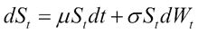
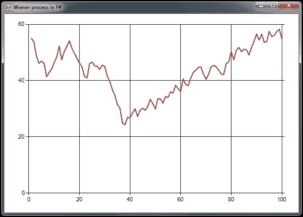
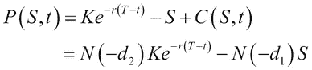
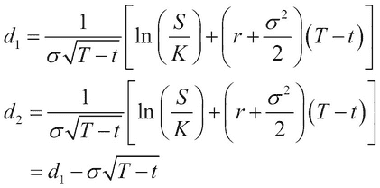
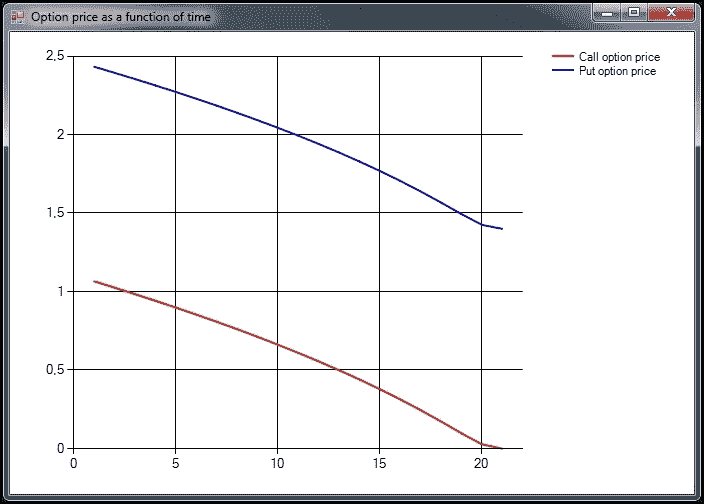
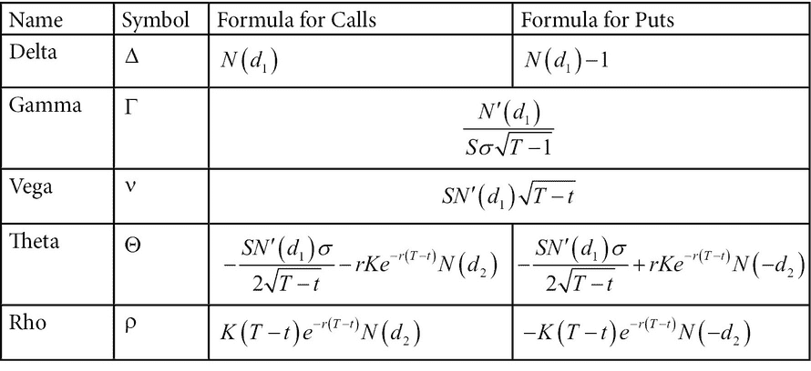
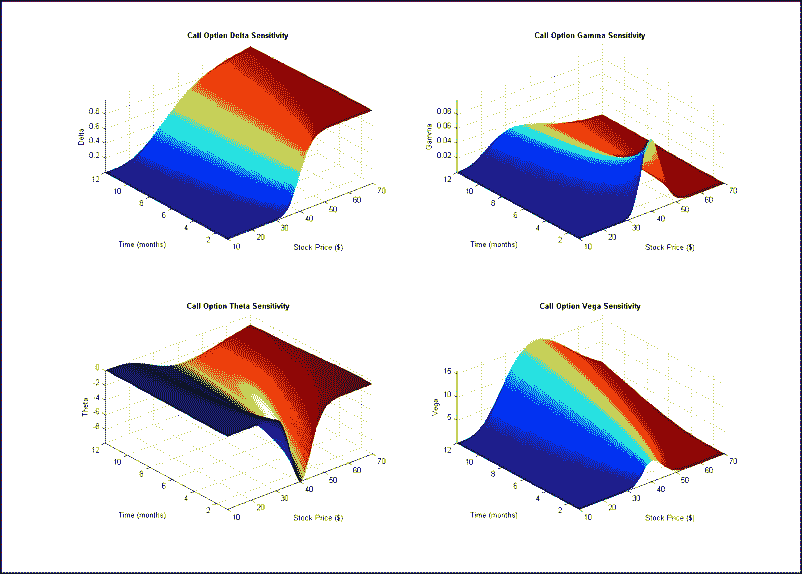
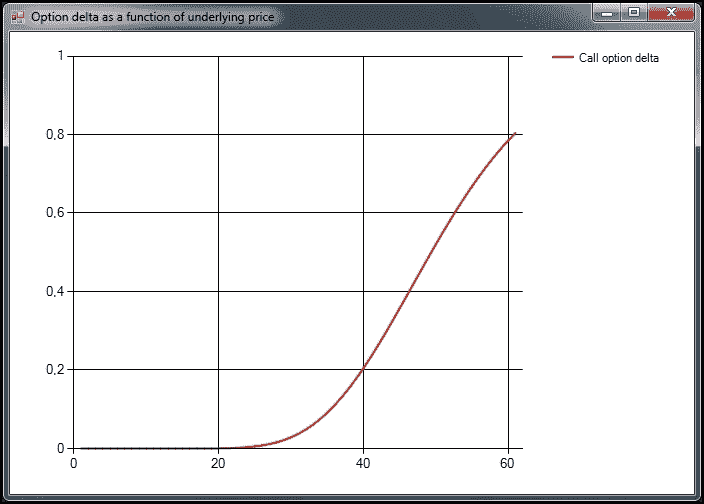
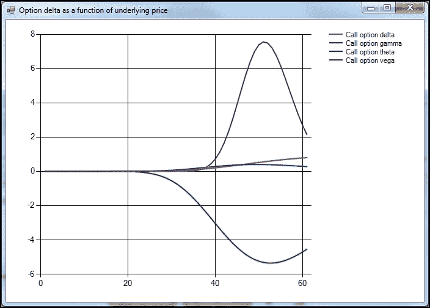
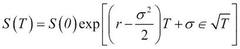

# 第五章：学习期权定价

在本章中，你将学习如何使用布莱克-斯科尔斯公式和蒙特卡罗方法进行期权定价。我们将比较这两种方法，并看看它们在实际应用中最适合的场景。

在本章中，你将学习：

+   布莱克-斯科尔斯期权定价公式

+   如何使用蒙特卡罗方法定价期权

+   欧洲期权、美式期权和另类期权

+   如何使用来自 Yahoo! Finance 的真实市场数据进行期权定价

+   在 F#中绘制希腊字母

+   维纳过程和布朗运动的基础知识

+   随机微分方程的基础知识

# 期权简介

期权有两种变体，认沽期权和认购期权。认购期权赋予期权持有者在执行价格下购买标的资产的权利，但没有义务。`认沽`期权赋予合同持有者卖出标的资产的权利，但没有义务。布莱克-斯科尔斯公式描述的是只能在到期日行使的欧洲期权，与例如美式期权不同。期权买方为此支付一定的溢价，以覆盖来自对方风险。期权已经变得非常流行，全球主要交易所都在使用，涵盖了大部分资产类别。

期权背后的理论可能很快变得复杂。在本章中，我们将讨论期权的基础知识，以及如何通过 F#编写的代码来探索它们。

## 查看合同规范

期权有多种变体，其中一些将在本节中简要介绍。期权的合同规范也将取决于其类型。通常，有一些属性对于所有期权来说或多或少都是通用的。通用规格如下：

+   侧面

+   数量

+   行使价格

+   到期日

+   结算条款

合同规范或已知变量在我们评估期权时使用。

## 欧洲期权

欧洲期权是其他类型期权的基础形式，美式期权和另类期权就是其中的例子。本章将重点讨论欧洲期权。

## 美式期权

美式期权是在到期日或之前的任何交易日都可以行使的期权。

## 另类期权

另类期权属于期权的广义范畴，可能包括复杂的金融结构，也可能是其他工具的组合。

## 学习维纳过程

维纳过程与随机微分方程和波动性密切相关。维纳过程或几何布朗运动定义如下：



上述公式描述了带有漂移项µ和波动性σ的股票价格或标的资产的变化，以及维纳过程*Wt*。这个过程用于在布莱克-斯科尔斯模型中模拟价格变化。

我们将使用布朗运动或维纳过程来模拟市场数据，布朗运动或维纳过程在 F#中实现为序列。序列可以是无限的，只有使用的值会被评估，这非常适合我们的需求。我们将实现一个生成器函数，将维纳过程作为序列生成，如下所示：

```py
// A normally distributed random generator
let normd = new Normal(0.0, 1.0)
let T = 1.0
let N = 500.0
let dt:float = T / N

/// Sequences represent infinite number of elements
// p -> probability mean
// s -> scaling factor
let W s = let rec loop x = seq { yield x; yield! loop (x + sqrt(dt)*normd.Sample()*s)}
  loop s;;
```

在这里，我们使用`normd.Sample()`中的随机函数。在查看实现之前，先解释一下参数和布朗运动背后的理论。参数`T`是用于创建离散时间增量`dt`的时间。请注意，`dt`假设有 500 个`N`:`s`，序列中有 500 个项目；当然，这并不总是如此，但在这里这样做是足够的。接下来，我们使用递归来创建序列，其中我们将增量加到前一个值*(x+...)*，其中 x 对应于*xt-1*。

我们可以轻松生成任意长度的序列，如下所示：

```py
> Seq.take 50 (W 55.00);;
val it : seq<float> = seq [55.0; 56.72907873; 56.96071054; 58.72850048; ...]
```

在这里，我们创建了一个长度为`50`的序列。让我们绘制这个序列，以便更好地理解该过程，如下图所示：



从前面的序列生成器中生成的维纳过程

接下来，我们将查看以下代码，以生成前面截图中显示的图表：

```py
open System
open System.Net
open System.Windows.Forms
open System.Windows.Forms.DataVisualization.Charting
open Microsoft.FSharp.Control.WebExtensions
open MathNet.Numerics.Distributions;

// A normally distributed random generator
let normd = new Normal(0.0, 1.0)

// Create chart and form
let chart = new Chart(Dock = DockStyle.Fill)
let area = new ChartArea("Main")
chart.ChartAreas.Add(area)

let mainForm = new Form(Visible = true, TopMost = true, Width = 700, Height = 500)
do mainForm.Text <- "Wiener process in F#"
mainForm.Controls.Add(chart)

// Create series for stock price
let wienerProcess = new Series("process")
do wienerProcess.ChartType <- SeriesChartType.Line
do wienerProcess.BorderWidth <- 2
do wienerProcess.Color <- Drawing.Color.Red
chart.Series.Add(wienerProcess)

let random = new System.Random()
let rnd() = random.NextDouble()
let T = 1.0
let N = 500.0
let dt:float = T / N

/// Sequences represent infinite number of elements
let W s = let rec loop x = seq { yield x; yield! loop (x + sqrt(dt)*normd.Sample()*s)}
  loop s;;

do (Seq.take 100 (W 55.00)) |> Seq.iter (wienerProcess.Points.Add >> ignore)
```

到这一阶段，代码的大部分对你来说应该是熟悉的，但有趣的部分是最后一行，我们可以简单地将序列中选定数量的元素输入到`Seq.iter`中，它将优雅且高效地绘制这些值。

# 学习布莱克-斯科尔斯公式

布莱克-斯科尔斯公式是由*费舍尔·布莱克*和*迈伦·斯科尔斯*在 1970 年代开发的。布莱克-斯科尔斯公式是一个估算期权价格的随机偏微分方程。公式背后的主要思想是 delta 中性组合。他们创建了理论上的 delta 中性组合以减少其中的不确定性。

这是一个必要的步骤，以便能够得出分析公式，我们将在本节中讨论。以下是布莱克-斯科尔斯公式下所做的假设：

+   没有套利

+   可以以恒定的无风险利率借钱（在持有期权期间）

+   可以购买、出售和列出基础资产的分数部分

+   没有交易成本

+   基础资产的价格遵循布朗运动，具有恒定的漂移和波动率

+   从基础证券中不支付股息

两种变体中最简单的是`call`期权的变体。首先，使用累积分布函数将股价按`d1`作为参数进行缩放。然后，股价通过`d2`的累积分布函数缩放后的折扣行使价格来减少。换句话说，这是使用各自的概率缩放并折扣行使价格后的股价与行使价格的差值：


`put`期权的公式稍微复杂一些，但遵循相同的原则，如下所示：



Black-Scholes 公式通常分为几个部分，其中`d1`和`d2`是概率因子，用来描述股票价格与行使价格的关系概率：



前述公式中使用的参数总结如下：

+   **N**：累计分布函数

+   **T**：到期时间，以年为单位表示

+   **S**：股票价格或其他标的资产的价格

+   **K**：行使价格

+   **r**：无风险利率

+   **σ**：标的资产的波动率

## 在 F#中实现 Black-Scholes 模型

现在我们已经了解了 Black-Scholes 公式的基本原理及相关参数，接下来可以自己实现它。这里实现了累计分布函数，避免了依赖外部库，同时也说明了自己实现这个函数其实是很简单的。Black-Scholes 公式在 F#中的实现如下所示。它接受六个参数，第一个是一个用于判断是`call`还是`put`期权的标志。常量`a1`到`a5`是用于数值实现的泰勒级数系数：

```py
let pow x n = exp(n * log(x))

type PutCallFlag = Put | Call

/// Cumulative distribution function
let cnd x =
  let a1 =  0.31938153
  let a2 = -0.356563782
  let a3 =  1.781477937
  let a4 = -1.821255978
  let a5 =  1.330274429
  let pi = 3.141592654
  let l  = abs(x)
  let k  = 1.0 / (1.0 + 0.2316419 * l)
  let w  = (1.0-1.0/sqrt(2.0*pi)*exp(-l*l/2.0)*(a1*k+a2*k*k+a3*(pow k 3.0)+a4*(pow k 4.0)+a5*(pow k 5.0)))
  if x < 0.0 then 1.0 - w else w

/// Black-Scholes
// call_put_flag: Put | Call
// s: stock price
// x: strike price of option
// t: time to expiration in years
// r: risk free interest rate
// v: volatility
let black_scholes call_put_flag s x t r v =
  let d1=(log(s / x) + (r+v*v*0.5)*t)/(v*sqrt(t))
  let d2=d1-v*sqrt(t)
  //let res = ref 0.0

  match call_put_flag with
  | Put -> x*exp(-r*t)*cnd(-d2)-s*cnd(-d1)
  | Call -> s*cnd(d1)-x*exp(-r*t)*cnd(d2)    
```

让我们使用`black_scholes`函数，并为`call`和`put`期权提供一些数字。假设我们想知道一个期权的价格，该期权的标的资产是一只以 58.60 美元交易的股票，年波动率为 30%。无风险利率为 1%。我们可以使用之前定义的公式，根据 Black-Scholes 公式计算一个到期时间为六个月（0.5 年）的`call`期权的理论价格：

```py
> black_scholes Call 58.60 60.0 0.5 0.01 0.3;;
val it : float = 4.465202269
```

我们只需通过更改函数的标志，即可得到`put`期权的值：

```py
> black_scholes Put  58.60 60.0 0.5 0.01 0.3;;
val it : float = 5.565951021
```

有时，用天数而非年数来表示到期时间更加方便。我们可以为此目的引入一个辅助函数：

```py
/// Convert the nr of days to years
let days_to_years d = (float d) / 365.25
```

请注意数字`365.25`，它包括了闰年的因素。虽然在我们的示例中不需要使用，但为了准确性，还是用了这个值。当我们知道以天为单位的时间时，现在可以使用这个函数：

```py
> days_to_years 30;;
val it : float = 0.08213552361
```

我们使用之前的示例，但现在设定到期日为`20`天：

```py
> black_scholes Call 58.60 60.0 (days_to_years 20) 0.01 0.3;;
val it : float = 1.065115482

> black_scholes Put 58.60 60.0 (days_to_years 20) 0.01 0.3;;
val it : float = 2.432270266
```

## 使用 Black-Scholes 和图表一起

有时，能够绘制期权的价格直到到期是很有用的。我们可以使用之前定义的函数，改变剩余时间并绘制出相应的值。在这个示例中，我们将创建一个程序，输出下方截图中的图表：



显示看涨期权和看跌期权价格随时间变化的图表

以下代码用于生成前述截图中的图表：

```py
/// Plot price of option as function of time left to maturity
#r "System.Windows.Forms.DataVisualization.dll"

open System
open System.Net
open System.Windows.Forms
open System.Windows.Forms.DataVisualization.Charting
open Microsoft.FSharp.Control.WebExtensions

/// Create chart and form
let chart = new Chart(Dock = DockStyle.Fill)
let area = new ChartArea("Main")
chart.ChartAreas.Add(area)
chart.Legends.Add(new Legend())

let mainForm = new Form(Visible = true, TopMost = true, 
                        Width = 700, Height = 500)
do mainForm.Text <- "Option price as a function of time"
mainForm.Controls.Add(chart)

/// Create series for call option price
let optionPriceCall = new Series("Call option price")
do optionPriceCall.ChartType <- SeriesChartType.Line
do optionPriceCall.BorderWidth <- 2
do optionPriceCall.Color <- Drawing.Color.Red
chart.Series.Add(optionPriceCall)

/// Create series for put option price
let optionPricePut = new Series("Put option price")
do optionPricePut.ChartType <- SeriesChartType.Line
do optionPricePut.BorderWidth <- 2
do optionPricePut.Color <- Drawing.Color.Blue
chart.Series.Add(optionPricePut)

/// Calculate and plot call option prices
let opc = [for x in [(days_to_years 20)..(-(days_to_years 1))..0.0] do yield black_scholes Call 58.60 60.0 x 0.01 0.3]
do opc |> Seq.iter (optionPriceCall.Points.Add >> ignore)

/// Calculate and plot put option prices
let opp = [for x in [(days_to_years 20)..(-(days_to_years 1))..0.0] do yield black_scholes Put 58.60 60.0 x 0.01 0.3]
do opp |> Seq.iter (optionPricePut.Points.Add >> ignore)
```

上述代码只是前一章代码的修改版，新增了期权部分。此图表中有两条序列，一条代表`看涨`期权，另一条代表`看跌`期权。我们还为每个序列添加了图例。最后一部分是计算价格和实际绘图。列表推导用于简洁的代码，Black-Scholes 公式在每个到期日之前被调用，天数每步递减一天。

作为读者，你可以修改代码，绘制期权的不同方面，例如期权价格相对于基础股价上升的变化等等。

## 介绍希腊字母

**希腊字母**是对 Black-Scholes 公式中某一特定参数（如时间、利率、波动性或股价）的偏导数。希腊字母可以根据导数的阶数分为两类或更多类。在本节中，我们将讨论一阶和二阶希腊字母。

### 一阶希腊字母

在本节中，我们将通过下表展示一阶希腊字母：

| 名称 | 符号 | 描述 |
| --- | --- | --- |
| Delta | Δ | 期权价值相对于基础资产价格变化的变化率。 |
| Vega | ν | 期权价值相对于基础资产波动性变化的变化率，称为波动率敏感度。 |
| Theta | Θ | 期权价值相对于时间的变化率。随着时间的流逝，对时间的敏感度会衰减，这种现象被称为时间衰减。 |
| Rho | ρ | 期权价值相对于利率变化的变化率。 |

### 二阶希腊字母

在本节中，我们将通过下表展示二阶希腊字母：

| 名称 | 符号 | 描述 |
| --- | --- | --- |
| Gamma | Γ | Delta 相对于基础资产价格变化的变化率。 |
| Veta | - | Vega 关于时间的变化率。 |
| Vera | - | Rho 相对于波动性的变化率。 |

### 提示

为了清晰起见，省略了一些二阶希腊字母；本书中将不会涉及这些内容。

## 在 F# 中实现希腊字母

让我们来实现希腊字母：Delta、Gamma、Vega、Theta 和 Rho。首先，我们看一下每个希腊字母的公式。在某些情况下，期权的看涨和看跌分别有不同的公式，具体如下面的表格所示：



我们需要累积分布函数的导数，实际上它是一个均值为 0、标准差为 1 的正态分布：

```py
/// Normal distribution
open MathNet.Numerics.Distributions;

let normd = new Normal(0.0, 1.0)
```

### Delta

**Delta** 是期权价格相对于基础资产价格变化的变化率：

```py
/// Black-Scholes Delta
// call_put_flag: Put | Call
// s: stock price
// x: strike price of option
// t: time to expiration in years
// r: risk free interest rate
// v: volatility
let black_scholes_delta call_put_flag s x t r v =
  let d1=(log(s / x) + (r+v*v*0.5)*t)/(v*sqrt(t))
  match call_put_flag with
  | Put -> cnd(d1) - 1.0
  | Call -> cnd(d1) 
```

### Gamma

**Gamma** 是德尔塔相对于标的资产价格变化的变化率。这是标的资产价格的二阶导数。它衡量期权价格相对于标的资产价格的加速度：

```py
/// Black-Scholes Gamma
// s: stock price
// x: strike price of option
// t: time to expiration in years
// r: risk free interest rate
// v: volatility
let black_scholes_gamma s x t r v =
  let d1=(log(s / x) + (r+v*v*0.5)*t)/(v*sqrt(t))
  normd.Density(d1) / (s*v*sqrt(t)
```

### Vega

**Vega** 是期权价值相对于标的资产波动率变化的变化率。它被称为波动率的敏感性：

```py
/// Black-Scholes Vega
// s: stock price
// x: strike price of option
// t: time to expiration in years
// r: risk free interest rate
// v: volatility
let black_scholes_vega s x t r v =
  let d1=(log(s / x) + (r+v*v*0.5)*t)/(v*sqrt(t))    
  s*normd.Density(d1)*sqrt(t)
```

### Theta

**Theta** 是期权价值相对于时间的变化率。随着时间的推移，时间敏感性会衰减，这种现象被称为时间衰减：

```py
/// Black-Scholes Theta
// call_put_flag: Put | Call
// s: stock price
// x: strike price of option
// t: time to expiration in years
// r: risk free interest rate
// v: volatility
let black_scholes_theta call_put_flag s x t r v =
  let d1=(log(s / x) + (r+v*v*0.5)*t)/(v*sqrt(t))
  let d2=d1-v*sqrt(t)
  let res = ref 0.0
  match call_put_flag with
  | Put -> -(s*normd.Density(d1)*v)/(2.0*sqrt(t))+r*x*exp(-r*t)*cnd(-d2)
  | Call -> -(s*normd.Density(d1)*v)/(2.0*sqrt(t))-r*x*exp(-r*t)*cnd(d2) 
```

### Rho

**Rho** 是期权价值相对于利率的变化率：

```py
/// Black-Scholes Rho
// call_put_flag: Put | Call
// s: stock price
// x: strike price of option
// t: time to expiration in years
// r: risk free interest rate
// v: volatility
let black_scholes_rho call_put_flag s x t r v =
  let d1=(log(s / x) + (r+v*v*0.5)*t)/(v*sqrt(t))
  let d2=d1-v*sqrt(t)
  let res = ref 0.0
  match call_put_flag with
  | Put -> -x*t*exp(-r*t)*cnd(-d2)
  | Call -> x*t*exp(-r*t)*cnd(d2) 
```

### 研究希腊字母的敏感性

现在我们已经实现了所有的希腊字母，我们将研究其中一些的敏感性，看看它们在标的股票价格变化时如何变化。

以下截图是一个包含四个希腊字母的表面图，其中时间和标的资产价格在变化。此图是在 MATLAB 中生成的，F# 中无法生成。我们将使用该图的二维版本来研究希腊字母，如下所示的截图：



看涨期权的德尔塔、伽玛、θ和 rho 的表面图

在本节中，我们将从绘制一个`call`期权的德尔塔值开始，其中我们改变标的资产的价格。这样将产生如下所示的二维图：

.



看涨期权德尔塔与标的资产价格的图示

上述截图中显示的结果将通过接下来展示的代码生成。我们将重用大部分代码，之前我们查看了看涨期权和看跌期权的价格。稍微修改过的版本将在下面的代码中呈现，其中标的资产的价格从 $10.0 变化到 $70.0：

```py
/// Plot delta of call option as function of underlying price
#r "System.Windows.Forms.DataVisualization.dll"

open System
open System.Net
open System.Windows.Forms
open System.Windows.Forms.DataVisualization.Charting
open Microsoft.FSharp.Control.WebExtensions

/// Create chart and form
let chart = new Chart(Dock = DockStyle.Fill)
let area = new ChartArea("Main")
chart.ChartAreas.Add(area)
chart.Legends.Add(new Legend())
let mainForm = new Form(Visible = true, TopMost = true, Width = 700, Height = 500)
do mainForm.Text <- "Option delta as a function of underlying price"
mainForm.Controls.Add(chart)

/// Create series for call option delta
let optionDeltaCall = new Series("Call option delta")
do optionDeltaCall.ChartType <- SeriesChartType.Line
do optionDeltaCall.BorderWidth <- 2
do optionDeltaCall.Color <- Drawing.Color.Red
chart.Series.Add(optionDeltaCall)

/// Calculate and plot call delta
let opc = [for x in [10.0..1.0..70.0] do yield black_scholes_delta Call x 60.0 0.5 0.01 0.3]
do opc |> Seq.iter (optionDeltaCall.Points.Add >> ignore)
```

我们可以扩展代码来绘制所有四个希腊字母，如截图中所示的二维表面图。结果将是如下截图所示的图形：



显示看涨期权的希腊字母与价格变化（x 轴）关系的图形

### 可视化四个希腊字母的代码列表

以下是用于生成前述图形的完整程序代码列表：

```py
#r "System.Windows.Forms.DataVisualization.dll"

open System
open System.Net
open System.Windows.Forms
open System.Windows.Forms.DataVisualization.Charting
open Microsoft.FSharp.Control.WebExtensions

/// Create chart and form
let chart = new Chart(Dock = DockStyle.Fill)
let area = new ChartArea("Main")
chart.ChartAreas.Add(area)
chart.Legends.Add(new Legend())

let mainForm = new Form(Visible = true, TopMost = true, Width = 700, Height = 500)

do mainForm.Text <- "Option delta as a function of underlying price"
mainForm.Controls.Add(chart)
```

我们将为每个希腊字母创建一个系列，如下所示：

```py
/// Create series for call option delta
let optionDeltaCall = new Series("Call option delta")
do optionDeltaCall.ChartType <- SeriesChartType.Line
do optionDeltaCall.BorderWidth <- 2
do optionDeltaCall.Color <- Drawing.Color.Red
chart.Series.Add(optionDeltaCall)

/// Create series for call option gamma
let optionGammaCall = new Series("Call option gamma")
do optionGammaCall.ChartType <- SeriesChartType.Line
do optionGammaCall.BorderWidth <- 2
do optionGammaCall.Color <- Drawing.Color.Blue
chart.Series.Add(optionGammaCall)

/// Create series for call option theta
let optionThetaCall = new Series("Call option theta")
do optionThetaCall.ChartType <- SeriesChartType.Line
do optionThetaCall.BorderWidth <- 2
do optionThetaCall.Color <- Drawing.Color.Green
chart.Series.Add(optionThetaCall)

/// Create series for call option vega
let optionVegaCall = new Series("Call option vega")
do optionVegaCall.ChartType <- SeriesChartType.Line
do optionVegaCall.BorderWidth <- 2
do optionVegaCall.Color <- Drawing.Color.Purple
chart.Series.Add(optionVegaCall)
```

接下来，我们将计算每个希腊字母的绘图值：

```py
/// Calculate and plot call delta
let opd = [for x in [10.0..1.0..70.0] do yield black_scholes_delta Call x 60.0 0.5 0.01 0.3]
do opd |> Seq.iter (optionDeltaCall.Points.Add >> ignore)

/// Calculate and plot call gamma
let opg = [for x in [10.0..1.0..70.0] do yield black_scholes_gamma x 60.0 0.5 0.01 0.3]
do opg |> Seq.iter (optionGammaCall.Points.Add >> ignore)

/// Calculate and plot call theta
let opt = [for x in [10.0..1.0..70.0] do yield black_scholes_theta Call x 60.0 0.5 0.01 0.3]
do opt |> Seq.iter (optionThetaCall.Points.Add >> ignore)

/// Calculate and plot call vega
let opv = [for x in [10.0..1.0..70.0] do yield black_scholes_vega x 60.0 0.1 0.01 0.3]
do opv |> Seq.iter (optionVegaCall.Points.Add >> ignore)
```

# 蒙特卡洛方法

蒙特卡洛方法用于使用随机数进行数值积分，并研究大量样本的平均值。当没有封闭形式解时，蒙特卡洛方法特别有用。

在本节中，我们将研究最简单的情况，其中我们有路径依赖的欧洲期权。我们将使用随机漂移参数来进行数值积分采样。这将导致随机过程的各种平均值，构成了基础资产的运动。我们将分别使用 1,000 和 1,000,000 个样本进行计算，并比较结果。让我们深入研究以下代码：

```py
/// Monte Carlo implementation

/// Convert the nr of days to years
let days_to_years d =
  (float d) / 365.25

/// Asset price at maturity for sample rnd
// s: stock price
// t: time to expiration in years
// r: risk free interest rate
// v: volatility
// rnd: sample
let price_for_sample s t r v rnd =
  s*exp((r-v*v/2.0)*t+v*rnd*sqrt(t))

/// For each sample we run the monte carlo simulation
// s: stock price
// x: strike price of option
// t: time to expiration in years
// r: risk free interest rate
// v: volatility
// samples: random samples as input to simulation
let monte_carlo s x t r v (samples:seq<float>) = samples
  |> Seq.map (fun rnd -> (price_for_sample s t r v rnd) - x)
  |> Seq.average

/// Generate sample sequence
let random = new System.Random()
let rnd() = random.NextDouble()
let data = [for i in 1 .. 1000 -> rnd() * 1.0]
```

让我们用与`put`期权的 Black-Scholes 公式相同的数值来测试它：

```py
  > black_scholes 'c' 58.60 60.0 0.5 0.01 0.3;;
  val it : float = 4.465202269

  /// Monte carlo for call option
  > monte_carlo 58.60 60.0 0.5 0.01 0.3 data
  val it : float = 4.243545757
```

这个结果接近准确；我们可以增加样本数，看看是否得到另一个值：

```py
let random = new System.Random()
let rnd() = random.NextDouble()
let data = [for i in 1 .. 1000000 -> rnd() * 1.0]

/// Monte carlo for call option
> monte_carlo 58.60 60.0 0.5 0.01 0.3 data;;
val it : float = 4.146170039
```

上述代码使用以下公式来完成估算价格的任务。简而言之，这里的蒙特卡罗方法可以看作是随机选择漂移参数`σ*rnd*sqrt(t)`。所有这些生成的样本的平均值将代表期权到期时的估算值。实际上，蒙特卡罗方法并不用于欧洲期权，这与本节中所展示的情况相反。选择欧洲期权主要是出于简单性考虑，用以说明这些概念：



用于估算资产到期时价格样本值的公式

# 总结

在本章中，我们使用著名的 Black-Scholes 公式结合蒙特卡罗方法研究了 F#中的期权定价。F#再次证明了其强大的功能，特别是在数值实现方面。这段代码几乎与数学公式完全相同，因此很容易实现，无需额外的繁琐步骤。本章中学到的知识将在下一章中用于深入探讨期权和波动性。
