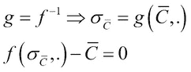

# 第六章：探索波动率

在本章中，您将学习波动率以及如何使用 F#中的数值方法来探索期权的特性。我们将使用上一章的代码，并结合第三章中讲解的数值方法，来求解布莱克-舒尔斯模型中的内在波动率，即隐含波动率，*财务数学与数值分析*。

在本章中，您将学习：

+   实际波动率和隐含波动率

+   使用 F#计算实际波动率

+   在布莱克-舒尔斯模型中求解隐含波动率

+   使用数值方法分析期权

+   德尔塔对冲

+   简要介绍波动率套利

# 波动率介绍

在上一章，我们回顾了布莱克-舒尔斯模型的基础，适用于欧洲期权。在本章中，我们将继续探讨期权，并研究波动率以及如何使用 F#来帮助我们。波动率衡量的是价格变动的年化标准差，即金融工具价格波动的速率。较高的波动率意味着更大的分散，而较低的波动率则意味着更小的分散。波动率与方差相关，方差等于标准差的平方，正如之前所讲。

布莱克-舒尔斯模型假设股票价格的波动服从正态分布，但根据观察，现实中并非如此。实际情况中，分布更为厚尾，这意味着负向价格波动发生时往往较大，但正向波动更常见，且通常较小。


图 1：由 Yahoo! Finance 提供。显示低波动率（9.5%年化）的标准普尔 500 指数和高波动率（31%年化）的苹果股票。

## 实际波动率

实际波动率是指在特定时间段内（通常为过去一个月或一年）观察到的波动率。实际波动率使用当前的市场价格和若干先前的观察数据。简而言之，它是当前和历史价格数据的对数收益率的标准差。

## 隐含波动率

隐含波动率是包含在期权价格中的波动率。如果我们使用布莱克-舒尔斯模型，我们需要提供几个输入参数：股票价格、行权价格、无风险利率、波动率和到期时间。根据这些输入，模型将输出一个理论价格，基于所做的假设。我们可以通过逆向使用布莱克-舒尔斯模型来获取隐含波动率。这意味着，如果期权在交易所以公平市场价格进行交易，我们可以从该期权的市场价格中提取波动率。这样做需要使用数值方法求解根值，这部分内容已经在数值分析章节中讲解过。

使用当前价格计算隐含波动性，将通过一个二分法求解器来解决 Black-Scholes 模型中的隐含波动性问题，我们将在本章的后续部分学习这一内容。

## F#中的波动性探索

让我们来看一个 F#示例程序，它将涵盖波动性的一些方面，以及如何从真实市场数据中计算波动性。我们将查看来自 NASDAQ 的一些科技股，并计算它们的年化波动率。首先，我们需要定义一个函数来进行计算。年化波动率定义如下：


其中**P**是时间周期（以年为单位），是年化波动率，是时间周期**P**内的标准差。

这里我们使用**P**表示 ，这意味着我们可以将公式重写为：


我们首先使用计算标准差的函数，如第三章所述，*金融数学与数值分析*：

```py
/// Calculate the standard deviation
let stddev(values:seq<float>) =
    values
    |> Seq.fold (fun acc x -> acc + (1.0 / float (Seq.length values)) * (x - (Seq.average values)) ** 2.0) 0.0
    |> sqrt
```

然后我们需要一个函数来计算对数收益。这是使用`Seq.pairwise`函数来完成的，因为我们需要一个大小为 2 的窗口。这与使用`Seq.windowed`函数并设置大小为 2 是相同的。

```py
/// Calculate logarithmic returns
let calcDailyReturns(prices:seq<float>) =
    prices
    |> Seq.pairwise
    |> Seq.map (fun (x, y) -> log (x / y))
```

最后但同样重要的是，我们有一个函数来从收益序列中计算年化波动率：

```py
/// Annualized volatility
let annualVolatility(returns:seq<float>) =
    let sd = stddev(calcDailyReturns(returns))
    let days = Seq.length(returns)
    sd * sqrt(float days)
```

该函数使用之前描述的数学公式，将天数的平方与收益序列的标准差相乘。这可以解释为一个缩放因子。

这些函数是我们需要进行的主要构建块。下一步是重用这些功能以从 Yahoo! Finance 获取价格，稍作修改以使用前面的函数。接下来，我们介绍两个辅助函数。第一个是将数字格式化为字符串，如果数字小于十，则前面加上零。第二个函数是帮助我们构造需要从 Yahoo! Finance 请求数据的 URL：

```py
let formatLeadingZero(number:int):String =
    String.Format("{0:00}", number)

/// Helper function to create the Yahoo-finance URL
let constructURL(symbol, fromDate:DateTime, toDate:DateTime) =
    let fm = formatLeadingZero(fromDate.Month-1)
    let fd = formatLeadingZero(fromDate.Day)
    let fy = formatLeadingZero(fromDate.Year)
    let tm = formatLeadingZero(toDate.Month-1)
    let td = formatLeadingZero(toDate.Day)
    let ty = formatLeadingZero(toDate.Year)
    "http://ichart.finance.yahoo.com/table.csv?s=" + symbol + "&d=" + tm + "&e=" + td + "&f=" + ty + "&g=d&a=" + fm + "&b=" + fd + "&c=" + fy + "&ignore=.csv"

/// Synchronous fetching (just one request)
let fetchOne symbol fromDate toDate =
    let url = constructURL(symbol, fromDate, toDate)
    let uri = new System.Uri(url)
    let client = new WebClient()
    let html = client.DownloadString(uri)
    html

/// Parse CSV
let getPrices stock fromDate toDate =
    let data = fetchOne stock fromDate toDate
    data.Trim().Split('\n')
    |> Seq.skip 1
    |> Seq.map (fun s -> s.Split(','))
    |> Seq.map (fun s -> float s.[4])
    |> Seq.takeWhile (fun s -> s >= 0.0)

/// Returns a formatted string with volatility for a stock
let getAnnualizedVol stock fromStr toStr =
    let prices = getPrices stock (System.DateTime.Parse fromStr) (System.DateTime.Parse toStr)
    let vol = Math.Round(annualVolatility(prices) * 100.0, 2)
    sprintf "Volatility for %s is %.2f %%" stock vol 
```

让我们尝试使用 F# Interactive 对来自 NASDAQ 的几只股票进行操作：

```py
> getAnnualizedVol "MSFT" "2013-01-01" "2013-08-29";;
val it : string = "Volatility for MSFT is 21.30 %"

> getAnnualizedVol "ORCL" "2013-01-01" "2013-08-29";;
val it : string = "Volatility for ORCL is 20.44 %"

> getAnnualizedVol "GOOG" "2013-01-01" "2013-08-29";;
val it : string = "Volatility for GOOG is 14.80 %"

> getAnnualizedVol "EBAY" "2013-01-01" "2013-08-29";;
val it : string = "Volatility for EBAY is 20.82 %"

> getAnnualizedVol "AAPL" "2013-01-01" "2013-08-29";;
val it : string = "Volatility for AAPL is 25.16 %"

> getAnnualizedVol "AMZN" "2013-01-01" "2013-08-29";;
val it : string = "Volatility for AMZN is 21.10 %"

> getAnnualizedVol "^GSPC" "2013-01-01" "2013-08-29";;
val it : string = "Volatility for ^GSPC is 9.15 %"
```

上述代码的结果可以总结在以下表格中：

| 股票代码 | 公司名称 | 年化波动率 |
| --- | --- | --- |
| MSFT | 微软公司 | 21.30 百分比 |
| ORCL | 甲骨文公司 | 20.44 百分比 |
| GOOG | 谷歌公司 | 14.80 百分比 |
| EBAY | eBay | 20.82 百分比 |
| AAPL | 苹果公司 | 25.16 百分比 |
| AMZN | 亚马逊 | 21.10 百分比 |
| ^GSPC | 标准普尔 500 指数 | 9.15 百分比 |

从前面的表格中，我们可以看到并比较所选股票和 S&P 500 指数的年化波动性。从数据中可以清楚地看出，哪一只股票的尊重度最高，波动性最低。AAPL 和^GSPC 在本章介绍的*图 1*中进行了比较。有时，波动性能告诉你某个工具的投资风险。但请记住，这些数据是历史数据，无法解读该工具未来的价格变动。

### 完整应用程序

以下是前面程序的完整代码清单。你可以修改参数，以便连接 Yahoo! Finance 的 Web 服务，返回 CSV 数据。这些参数包括 a、b、c 作为`from-date`参数，以及 d、e、f 作为`to-date`参数，外加股票的符号，见下表：

| 参数 | 描述 | 示例 |
| --- | --- | --- |
| s | 股票符号 | MSFT |
| d | 到月份 | 07 |
| e | 到日 | 29 |
| f | 到年份 | 2013 |
| a | 从月份 | 00 |
| b | 到日 | 1 |
| c | 到年份 | 2013 |

让我们看一个示例，其中我们从 Yahoo!下载了几只在 NASDAQ 上市的股票以及 S&P500 指数的数据。我们将查看 2013 年 1 月 1 日到 2013 年 8 月 2 日的时间跨度：

```py
open System
open System.Net

/// Calculate the standard deviation
let stddev(values:seq<float>) =
    values
    |> Seq.fold (fun acc x -> acc + (1.0 / float (Seq.length values)) * (x - (Seq.average values)) ** 2.0) 0.0
    |> sqrt

/// Calculate logarithmic returns
let calcDailyReturns(prices:seq<float>) =
    prices
    |> Seq.pairwise
    |> Seq.map (fun (x, y) -> log (x / y))

/// Annualized volatility
let annualVolatility(returns:seq<float>) =
    let sd = stddev(calcDailyReturns(returns))
    let days = Seq.length(returns)
    sd * sqrt(float days)

let formatLeadingZero(number:int):String =
    String.Format("{0:00}", number)

/// Helper function to create the Yahoo-finance URL
let constructURL(symbol, fromDate:DateTime, toDate:DateTime) =
    let fm = formatLeadingZero(fromDate.Month-1)
    let fd = formatLeadingZero(fromDate.Day)
    let fy = formatLeadingZero(fromDate.Year)
    let tm = formatLeadingZero(toDate.Month-1)
    let td = formatLeadingZero(toDate.Day)
    let ty = formatLeadingZero(toDate.Year)
    "http://ichart.finance.yahoo.com/table.csv?s=" + symbol + "&d=" + tm + "&e=" + td + "&f=" + ty + "&g=d&a=" + fm + "&b=" + fd + "&c=" + fy + "&ignore=.csv"

/// Synchronous fetching (just one request)
let fetchOne symbol fromDate toDate =
    let url = constructURL(symbol, fromDate, toDate)
    let uri = new System.Uri(url)
    let client = new WebClient()
    let html = client.DownloadString(uri)
    html

/// Parse CSV
let getPrices stock fromDate toDate =
    let data = fetchOne stock fromDate toDate
    data.Trim().Split('\n')
    |> Seq.skip 1
    |> Seq.map (fun s -> s.Split(','))
    |> Seq.map (fun s -> float s.[4])
    |> Seq.takeWhile (fun s -> s >= 0.0)

/// Returns a formatted string with volatility for a stock
let getAnnualizedVol stock fromStr toStr =
    let prices = getPrices stock (System.DateTime.Parse fromStr) (System.DateTime.Parse toStr)
    let vol = Math.Round(annualVolatility(prices) * 100.0, 2)
    sprintf "Volatility for %s is %.2f %%" stock vol

getAnnualizedVol "MSFT" "2013-01-01" "2013-08-29"
// val it : string = "Volatility for MSFT is 21.30 %"

getAnnualizedVol "ORCL" "2013-01-01" "2013-08-29"
// val it : string = "Volatility for ORCL is 20.44 %"

getAnnualizedVol "GOOG" "2013-01-01" "2013-08-29"
// val it : string = "Volatility for GOOG is 14.80 %"

getAnnualizedVol "EBAY" "2013-01-01" "2013-08-29"
// val it : string = "Volatility for EBAY is 20.82 %"

getAnnualizedVol "AAPL" "2013-01-01" "2013-08-29"
// val it : string = "Volatility for AAPL is 25.16 %"

getAnnualizedVol "AMZN" "2013-01-01" "2013-08-29"
// val it : string = "Volatility for AMZN is 21.10 %"

getAnnualizedVol "^GSPC" "2013-01-01" "2013-08-29"
// val it : string = "Volatility for ^GSPC is 9.15 %"
```

在本节中，我们使用来自 Yahoo!财经的数据查看了一些工具的实际波动性。在下一节中，我们将讨论隐含波动性以及如何从 Black-Scholes 公式中提取这些信息。

# 学习隐含波动性

在这里，我们将使用第三章中介绍的二分法，*金融数学与数值分析*。这是一种寻找根的方法。隐含波动性是根，函数值为零，适用于 Black-Scholes 公式的不同输入参数。标的工具的波动性是 Black-Scholes 的输入，给出的期权当前价格与实际市场价格相同。

**Vega**告诉我们期权价格对标的资产波动性变化的敏感度。查看 Yahoo! Finance 并找到期权数据。将这些期权数据带入以下求解函数：


图 2：2000 年 1 月 1 日到 2013 年 11 月 1 日 S&P500 指数期权的 VIX 指数

如前面的截图所示，VIX 指数是一个结合了 S&P 500 指数期权隐含波动性的指数。它可以被解读为未来波动性的指示。

# 求解隐含波动性

接下来，我们将使用一种方法来求解欧洲期权的隐含波动性。这可以通过使用二分法数值解法来求解根。

为了理解为什么我们使用二分法求解 Black-Scholes 方程的根值，我们需要一些工具。首先，我们重新回顾一下看涨期权和看跌期权价格作为估算波动率和一组参数（记作）函数的定义：


为了提取隐含波动率，我们需要 Black-Scholes 公式的反函数。不幸的是，这个函数没有解析的反函数。相反，我们可以说，Black-Scholes 公式减去当前期权市场价格的隐含波动率，在此情况下的看涨期权价格为零。以下是，这是本节中研究的看涨期权的当前市场价格：



这使我们能够使用数值根求解器来找到隐含波动率。以下是 F#中二分法求解器的实现。我们还将使用先前的 Black-Scholes 实现。

```py
/// Solve for implied volatility

let pow x n = exp (n * log(x) )

type PutCallFlag = Put | Call

/// Cumulative distribution function
let cnd x =
    let a1 =  0.31938153
    let a2 = -0.356563782
    let a3 =  1.781477937
    let a4 = -1.821255978
    let a5 =  1.330274429
    let pi = 3.141592654
    let l  = abs(x)
    let k  = 1.0 / (1.0 + 0.2316419 * l)
    let w  = (1.0-1.0/sqrt(2.0*pi)*exp(-l*l/2.0)*(a1*k+a2*k*k+a3*(pow k 3.0)+a4*(pow k 4.0)+a5*(pow k 5.0)))
    if x < 0.0 then 1.0 - w else w

/// Black-Scholes
// call_put_flag: Call | Put
// s: stock price
// x: strike price of option
// t: time to expiration in years
// r: risk free interest rate
// v: volatility
let black_scholes call_put_flag s x t r v =
    let d1=(log(s / x) + (r+v*v*0.5)*t)/(v*sqrt(t))
    let d2=d1-v*sqrt(t)
    //let res = ref 0.0

    match call_put_flag with
    | Put -> x*exp(-r*t)*cnd(-d2)-s*cnd(-d1)
    | Call -> s*cnd(d1)-x*exp(-r*t)*cnd(d2)    
/// Bisection solver
let rec bisect n N (f:float -> float) (a:float) (b:float) (t:float) : float =
    if n >= N then -1.0
    else
        let c = (a + b) / 2.0
        if f(c) = 0.0 || (b - a) / 2.0 < t then
            // Solution found
            c
        else
            if sign(f(c)) = sign(f(a)) then
                bisect (n + 1) N f c b t
            else    
                bisect (n + 1) N f a c t

Let's use it!

/// Calculate implied volatility for an option
bisect 0 25 (fun x -> (black_scholes Call 58.60 60.0 0.05475 0.0095 x) - 1.2753) 0.0 1.0 0.001
```

运行前面的代码将得到隐含波动率为 0.3408203125，约为 34.1%的波动率。请注意，我们还必须减去当前期权的市场价格（`1.2753`），因为我们是在求解根值。最后三个输入是起始值和停止值，`0.0`和`1.0`分别表示波动率的 0%和 100%。步长设置为 0.001，即 0.1%。测试这些值是否正确的一个简单方法是，首先使用实际波动率通过 Black-Scholes 公式计算期权的理论价格。

假设我们有一个执行价为 75.00 美元、股票价格为 73.00 美元、到期时间为 20 天（约 0.05475 年）、波动率为 15%、固定利率为 0.01%的看涨期权，这将导致期权价格为：

```py
let option_price = black_scholes Call 73.00 75.0 (days_to_years 20) 0.01 0.15
```

我们现在可以使用这个价格来查看二分法是否有效，并求解隐含波动率。在这种情况下，我们可以预期隐含波动率将与我们输入到 Black-Scholes 公式中的波动率完全相同；即 15%：

```py
> bisect 0 25 (fun x -> (black_scholes Call 73.00 75.0 (days_to_years 20) 0.01 x) - option_price) 0.0 1.0 0.001;;
val it : float = 0.1494140625
```

# 使用 Black-Scholes 进行 Delta 对冲

一个 Delta 中性组合是由期权和基础工具构成的。理论上，该组合对基础价格的小幅变动免疫。在谈到 Delta 对冲时，衍生品的对冲比率用于定义每个期权所需的基础价格量。Delta 对冲是一种交易策略，通过维持 Delta 中性组合来应对基础价格的小幅变化。

简单来说，我们来看一下如何在实践中操作。假设我们有 N 个衍生品。这需要进行对冲以防止价格波动。然后，我们需要购买基础股票以创建对冲。整个过程可以分为三个步骤：

1.  N 个衍生品需要进行 Delta 对冲

1.  购买基础股票以保护衍生品

1.  定期重新平衡对冲头寸

为了确定我们需要多少股票，我们使用期权的 delta（Δ）。这告诉我们标的资产价格变化时，期权价格变化的幅度。投资组合使用  股票来实现 delta 中性；通常每个期权合约对应 100 股股票。

标的股票的价格不断波动，这导致期权价格的变化。这意味着我们还必须重新平衡我们的投资组合。这是由于期权的时间价值和标的价格的变化。

让我们使用 F# 来计算为某个特定期权进行 delta 对冲所需的股票数量：

```py
/// Assumes 100 shares of stock per option
let nr_of_stocks_delta_hedge N =
    (black_scholes_delta 'c' 58.0 60.0 0.5 0.01 0.3) * 100.0 * (float N)

/// Calculate nr of shares needed to cover 100 call options
nr_of_stocks_delta_hedge 100
```

如果我们评估最后一行，我们将得到创建 delta 中性对冲所需的股票数量，使用 100 个看涨期权。

```py
> nr_of_stocks_delta_hedge 100;;
val it : float = 4879.628104
```

答案是大约需要 4880 股股票来对冲这些看涨期权。

# 探索波动率微笑

波动率微笑是市场中常见的现象。这个现象通常可以通过布莱克-斯科尔斯公式中的假设来解释。布莱克-斯科尔斯假设期权生命周期内的波动率是恒定的。如果修正布莱克-斯科尔斯公式，考虑到波动率并非恒定，我们将得到一个平坦的波动率曲面。

此外，波动率微笑描述的是期权某一价格相对于相同行权价的波动率。波动率曲面通常指的是波动率微笑的三维图表，其中包括到期时间和内在价值。

内在价值是标的资产现货价格 S 和期权行权价格 K 之间的比率：


接下来，我们将看看如何使用 F# 提供一个图表，其中波动率微笑是通过从真实市场数据的参数回归计算得出的。

以下数据来自瑞典 OMX 交易所的爱立信 B 类期权：


图 3：认购权证的波动率微笑

正如你在下面的截图中看到的，微笑曲线来源于不同的执行价格隐含波动率：


图 4：来自市场数据的波动率微笑点

我们可以使用多项式回归从图表中的点估算波动率微笑。这种方法在第三章《金融数学与数值分析》中介绍；我们将在那里构建的代码基础上进行扩展。该多项式的阶数为二，即二次多项式，将很好地描述预期的波动率微笑。

让我们看看一个应用程序，它将使用 Math.NET 和 FSharpChart 生成 *图 5* 中的图形：

```py
open System.IO
open FSharp.Charting
open System.Windows.Forms.DataVisualization.Charting

open MathNet.Numerics
open MathNet.Numerics.LinearAlgebra
open MathNet.Numerics.LinearAlgebra.Double
open MathNet.Numerics.Distributions

let filePath = @"smile_data.csv"

/// Split row on commas
let splitCommas (l:string) =
    l.Split(',')

/// Read a file into a string array
let openFile (name : string) =
    try
        let content = File.ReadAllLines(name)
        content |> Array.toList
    with
        | :? System.IO.FileNotFoundException as e -> printfn "Exception! %s " e.Message; ["empty"]

/// Read the data from a CSV file and returns
/// a tuple of strike price and implied volatility%
let readVolatilityData =
    openFile filePath
    |> List.map splitCommas
    |> List.map (fun cols -> (cols.[2], cols.[3]))

/// Calculates moneyness and parses strings into numbers
let calcMoneyness spot list =
    list
    |> List.map (fun (strike, imp) -> (spot / (float strike), (float imp)))
```

现在我们已经将数据存储在一个元组中，我们将使用基础资产的现货价格，该价格在数据收集时为 83.2。mlist 是一个包含已计算每个元组的平值度的转换后元组列表：

```py
let list = readVolatilityData
let mlist = calcMoneyness 83.2 list

/// Plot values using FSharpChart
fsi.AddPrinter(fun (ch:FSharp.Charting.ChartTypes.GenericChart) -> ch.ShowChart(); "FSharpChartingSmile")    
```

如果你想重现之前的图表，可以在 F# Interactive 中运行以下代码行：

```py
Chart.Point(mlist)
```

最后的步骤是计算回归系数，并利用这些系数计算曲线上的点。然后我们将使用包含这些点和拟合曲线的组合图表：

```py
/// Sample points
//let xdata = [ 0.0; 1.0; 2.0; 3.0; 4.0 ]
//let ydata = [ 1.0; 1.4; 1.6; 1.3; 0.9 ]

let xdata = mlist |> Seq.map (fun (x, _) -> x) |> Seq.toList
let ydata = mlist |> Seq.map (fun (_, y) -> y) |> Seq.toList

let N = xdata.Length
let order = 2

/// Generating a Vandermonde row given input v
let vandermondeRow v = [for x in [0..order] do yield v ** (float x)]

/// Creating Vandermonde rows for each element in the list
let vandermonde = xdata |> Seq.map vandermondeRow |> Seq.toList

/// Create the A Matrix
let A = vandermonde |> DenseMatrix.ofRowsList N (order + 1)
A.Transpose()

/// Create the Y Matrix
let createYVector order l = [for x in [0..order] do yield l]
let Y = (createYVector order ydata |> DenseMatrix.ofRowsList (order + 1) N).Transpose()

/// Calculate coefficients using least squares
let coeffs = (A.Transpose() * A).LU().Solve(A.Transpose() * Y).Column(0)

let calculate x = (vandermondeRow(x) |> DenseVector.ofList) * coeffs

let fitxs = [(Seq.min xdata).. 0.01 ..(Seq.max xdata)]
let fitys = fitxs |> List.map calculate
let fits = [for x in [(Seq.min xdata).. 0.01 ..(Seq.max xdata)] do yield (x, calculate x)]
```

这是生成带标题的组合图表的代码行。结果将如以下截图所示：

```py
let chart = Chart.Combine [Chart.Point(mlist); Chart.Line(fits).WithTitle("Volatility Smile")]
```


图 5：带有多项式回归曲线的波动率微笑

# 总结

在本章中，我们探讨了如何使用 F#来研究波动率的不同方面。波动率是金融学中一个有趣的维度，您可以快速深入到复杂的理论和模型中。在这里，拥有一个强大的工具，如 F#和 F# Interactive，非常有帮助。我们在本章中只是稍微触及了期权和波动率的表面。还有很多内容需要讨论，但超出了本书的范围。

本章中的大部分内容将用于我们将在接下来的章节中开发的交易系统。在下一章中，我们将开始研究我们交易系统的第一个务实构建模块：订单和订单类型。我们还将涵盖一些关于交易前风险的方面，以及 F#如何帮助我们建模这些内容。
