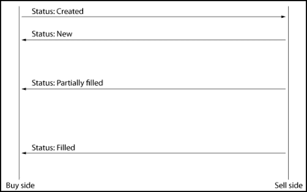
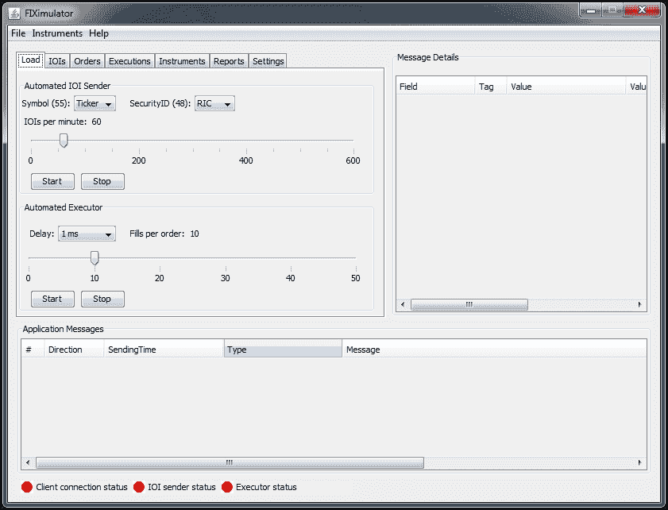
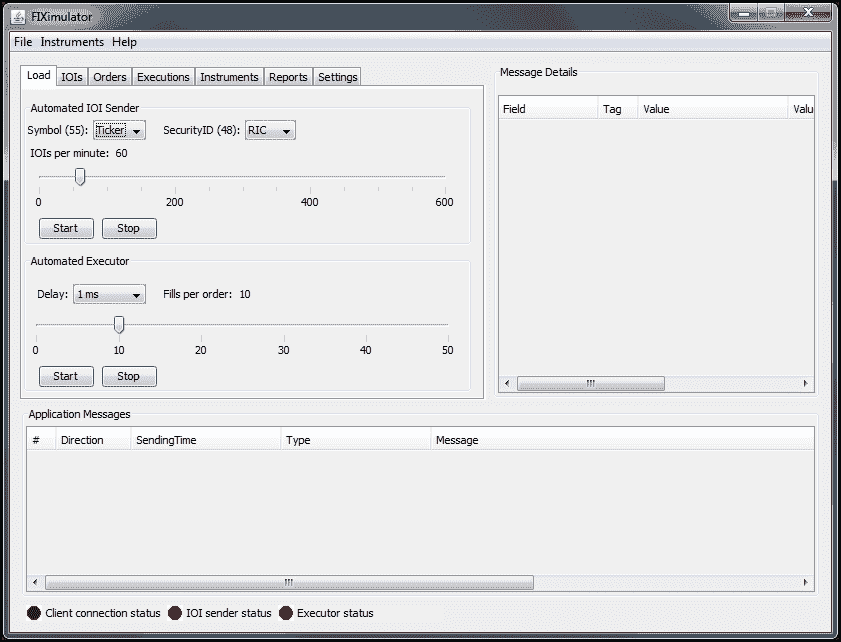
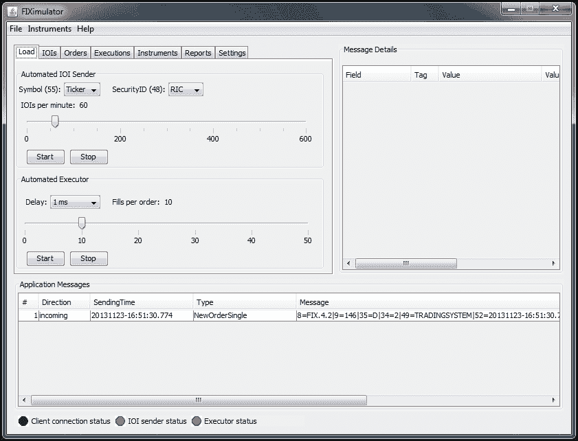
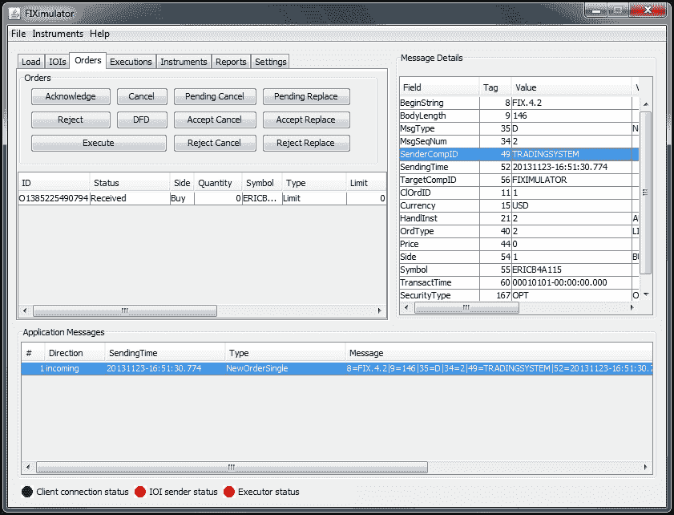
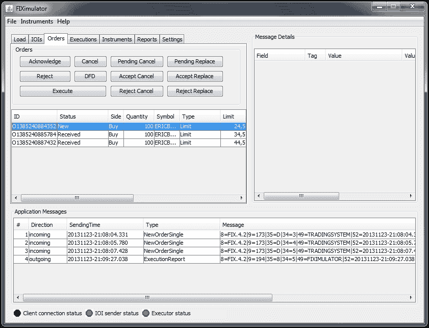
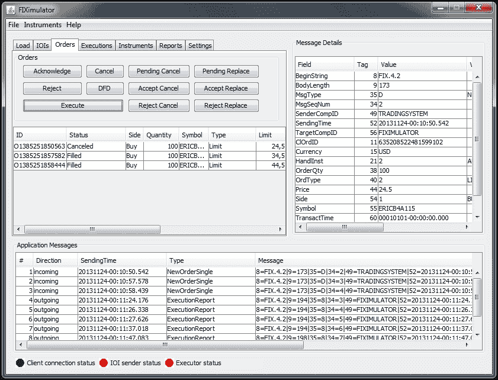

# 第七章：开始使用订单类型和市场数据

在本章中，你将学习如何在 F#中建模订单类型、市场数据以及各种类型的市场数据源。

在本章中，你将学习：

+   订单类型建模

+   市场数据建模

+   实现简单的交易前风险分析

+   使用函数组合和柯里化

# 介绍订单

通常，订单是买方给卖方关于如何买卖金融工具的指令。这些订单在一定程度上是标准化的。在大多数情况下，订单和订单类型由所使用的经纪商和交易所决定。

## 订单类型

订单类型是交易系统和交易所中常见的订单种类。通常你会遇到市场订单、限价单和条件单。在条件单类别中，我们有止损单和其他具有特定执行条件的订单。

还有其他类型的订单，但它们被认为是合成订单，因为它们是前面所述订单类型的组合。订单类型可以是以下几种之一：

+   市场订单

+   限价单

+   条件单和止损单

### 市场订单

市场订单是以当前市场价格在交易所执行的订单。这些订单将接受特定金融工具的当前买卖价格（即订单簿顶端价格）。此外，市场订单是此处展示的最简单的订单类型。由于执行价格的不确定性，市场订单不适用于需要更复杂风险管理的情况。这意味着它们在现实中的应用是相对有限的。

### 限价单

限价单是最常用的订单类型。顾名思义，它们是限定在一个固定价格范围内的订单。这意味着订单有一个限制价格，只有在该价格下，订单才会被执行。对于买单而言，这意味着存在一个上限，所有低于该限价的价格都会被接受。对于卖单，情况则相反，存在一个下限，所有高于该限价的价格都会被接受。

### 条件单和止损单

条件单，尤其是止损单，是在特定条件下会在交易所被激活的订单。止损单会在订单簿（即顶端订单）触及某一价格时被激活。当该条件满足时，订单将转换为市场订单。也存在一些在触发条件后会转为限价单的止损单。

## 订单属性

订单属性指的是描述订单应执行的操作及其条件的属性。下表展示了最基本的订单属性，并附有每个属性的描述和示例。

| 属性 | 描述 | 示例 |
| --- | --- | --- |
| 订单方向 | 订单是买单还是卖单，包括卖空订单 | 买、卖 |
| 订单类型 | 订单种类 | 市场、限价和止损 |
| 订单状态 | 订单在执行流程中的状态 | Created, New, Filled, Canceled 等 |
| 有效时间 | 订单的有效时长 | GoodForDay, FillOrKill |
| 数量 | 要购买或出售的特定工具的数量 | 10, 25 和 200 |
| 价格 | 订单的限价 | 26.50, 55.10 |
| 工具 | 订单中使用的工具 | MSFT, GOOG, AAPL |
| 止损价格 | 订单中使用的止损价格 | 26.50, 55.10 |
| 时间戳 | 订单创建的日期和时间 | 2013-09-14 11:30:44 |

接下来，我们将继续在第二章中开始的工作，*进一步了解 F#*，并扩展订单类，描述一些作为区分联合的属性。首先，我们将重新审视订单的一方：

```py
/// Order side
type OrderSide =
    Buy | Sell | Sellshort
```

在这个上下文中，订单方向将有三种选择：买入、卖出和卖空。然后是订单类型，可以是买入、卖出、止损或止损限价。止损限价是止损订单，随后会转为限价订单。

```py
/// Order type
type OrderType = 
    Market | Limit | Stop | StopLimit
```

区分联合是描述具有不同值的数据的优雅方式。值可以有很多个，但不会失去可读性。接下来，我们来看订单状态：

```py
type OrderStatus = 
    Created | New | Filled | PartiallyFilled | DoneForDay | Cancelled| Replaced | PendingCancel | Stopped | Rejected | Suspended | PendingNew | Calculated | Expired
```

订单状态有很多值；它们来自 FIX 4.2 规范，熟悉 FIX 的大多数人都很了解这些值。它们在这里作为示例，将用于交易系统中。**有效时间** (**Tif**) 是交易中最常用的选项：

```py
type Tif = 
    GoodForDay | GoodTilCancelled | ImmediateOrCancel | FillorKill
```

我们将在这里引入一个新类型，与本节中介绍的功能一起使用。首先，我们将查看以下代码：

```py
/// Validation result, ok or failed with message
type Result = Valid of Order | Error of string
```

请注意前面代码片段中使用的`Result`；它用于标识验证函数的结果，我们将在后面介绍。现在，你可以把它们看作表示不同返回类型的方式。

以下订单类是对我们在第二章中工作内容的扩展。它使用了一些可变性，这在 F# 中是允许的，因为它不是纯粹的函数式语言。可变性提供了更多的灵活性，并为更务实的解决方案做出了妥协。这里，我们使用私有成员字段和一些新字段：

```py
/// Order class
type Order(side: OrderSide, t: OrderType, p: float, tif: Tif, q: int, i: string, sp: float) =
    // Init order with status created
    let mutable St = OrderStatus.Created
    let mutable S = side
    member private this.Ts = System.DateTime.Now
    member private this.T = t
    member private this.P = p
    member private this.tif = tif
    member private this.Q = q
    member private this.I = i
    member private this.Sp = sp

    member this.Status
        with get() = St
        and set(st) = St <- st

    member this.Side
        with get() = S
        and set(s) = S <- s

    member this.Timestamp
        with get() = this.Ts

    member this.Type
        with get() = this.T

    member this.Qty
        with get() = this.Q

    member this.Price
        with get() = this.P

    member this.Tif
        with get() = this.tif

    member this.Instrument
        with get() = this.I

    member this.StopPrice
        with get() = this.Sp

    member this.toggleOrderSide() =
        S <- this.toggleOrderSide(S)

    member private this.toggleOrderSide(s: OrderSide) =
        match s with
        | Buy -> Sell
        | Sell -> Buy
        | Sellshort -> Sellshort

    static member (~-) (o : Order) =
        Order(o.toggleOrderSide(o.Side), o.Type, o.Price, o.tif, o.Q,o.I, o.Sp)
```

上面的方法将切换订单的一方，这在我们想要改变订单方向而不创建新订单时非常有用。

上述类可以像 F# 中的其他类一样使用：

```py
      // Limit buy order
let buyOrder = Order(OrderSide.Buy, OrderType.Limit, 54.50, Tif.FillorKill, 100, "MSFT", 0.0)       
```

字段如下，其中私有字段是隐藏的，属性的 getter 函数对应字段的名称：

```py
val it : Order = FSI_0050+Order {Instrument = "MSFT";
                                 Price = 54.5;
                                 Qty = 100;
                                 Side = Buy;
                                 Status = Created;
                                 StopPrice = 0.0;
                                 Tif = FillorKill;
                                 Timestamp = 2013-09-14 12:01:57;
                                 Type = Limit;}
```

假设你想验证一个订单的正确性并避免简单的错误。例如，如果订单是限价单，我们可以检查该订单的价格是否大于零。此外，如果订单是止损单，则止损价格必须大于零，依此类推。让我们编写一个函数来执行这个订单：

```py
/// Validates an order for illustrative purposes
let validateOrder (result:Result) : Result= 
    match resultwith
    | Error s -> Error s
    | Valid order ->
        let orderType = order.Type
        let orderPrice = order.Price
        let stopPrice = order.StopPrice    
        match orderType with
        | OrderType.Limit -> 
            match orderPrice with       
            | p when p > 0.0 -> Valid order
            | _ -> Error "Limit orders must have a price > 0"
        | OrderType.Market -> Valid order
        | OrderType.Stop -> 
            match stopPrice with        
            | p when p > 0.0 -> Valid order
            | _ -> Error "Stop orders must have price > 0"
        | OrderType.StopLimit ->
            match stopPrice with
            | p when p > 0.0 && orderPrice > 0.0 -> Valid order
            | _ -> Error "Stop limit orders must both price > 0 and stop price > 0"
```

该函数将接受一个封装在订单单子（order monad）中的订单对象。当我们查看如何在以下代码中使用它时，这一点将变得更加明确：

1.  我们可以创建一些不同类型的订单，看看我们的验证函数是否有效。

    ```py
    // Limit buy order
    let buyOrder = Order(OrderSide.Buy, OrderType.Limit, 54.50, Tif.FillorKill, 100, "MSFT", 0.0)

    // Limit buy order, no price
    let buyOrderNoPrice = Order(OrderSide.Buy, OrderType.Limit, 0.0, Tif.FillorKill, 100, "MSFT", 0.0)

    // Stop order that will be converted to limit order, no limit price
    let stopLimitNoPrice = Order(OrderSide.Buy, OrderType.StopLimit, 0.0, Tif.FillorKill, 100, "MSFT", 45.50)

    // Stop order that will be converted to market order
    let stopNoPrice = Order(OrderSide.Buy, OrderType.Stop, 0.0, Tif.FillorKill, 100, "MSFT", 45.50)
    ```

1.  现在，我们将测试我们为前面创建的订单编写的验证函数：

    ```py
    // Validate sample orders
    validateOrder (Valid buyOrder) // Ok
    validateOrder (Valid buyOrderNoPrice) // Failed
    validateOrder (Valid stopLimitNoPrice) // Failed
    validateOrder (Valid stopNoPrice) // Ok
    ```

1.  假设我们还想要一个验证器来检查订单是否设置了交易品种。然后我们可以逐个运行这些测试。首先，我们需要一个函数来进行验证：

    ```py
    let validateInstrument (result:Result) : Result =
        match result with
        | Error l -> Error l
        | Valid order ->
            let orderInstrument = order.Instrument
            match orderInstrument.Length with
            | l when l > 0 -> Valid order 
            | _ -> Error "Must specify order Instrument"
    ```

1.  在 F# Interactive 中运行此代码将得到以下结果：

    ```py
    > validateInstrument (Valid stopNoPriceNoInstrument);;
    val it : Result = Error "Must specify order Instrument"
    ```

1.  现在，我们希望将两个验证器合并为一个验证器。这可以通过 F# 的函数组合来实现。函数组合使用 `>>` 操作符，可以将两个或更多的函数组合成一个新的函数。你可以把函数组合看作是将函数链式连接的一种方式。这在使用和重用较小的构建块时非常有用，支持模块化。

    ```py
    /// Composite validator
    let validateOrderAndInstrument = validateOrder >> validateInstrument
    ```

1.  现在可以像我们之前使用的那个函数一样使用此函数：

    ```py
    // Stop order that will be converted to market order
    let stopNoPriceNoInstrument = Order(OrderSide.Buy, OrderType.Stop, 0.0, Tif.FillorKill, 100, "", 45.50)

    validateOrderAndInstrument (Valid stopNoPriceNoInstrument)
    ```

这是结合功能的一种非常强大的方式，在许多情况下都很有用。当我们稍后在处理交易前风险时，我们会再次讨论函数组合。

# 理解订单执行

让我们稍微看一下订单执行和订单流。订单执行是订单被执行的地方，通常是在交易所。对于算法交易，买方（交易员）通常会在交易所有自己的订单管理系统或订单执行引擎，靠近交易所的交易服务器。交易所的订单通常是限价单；当然也有其他类型。所有其他类型的订单都被视为合成订单或非原生订单。如果使用经纪商，你是看不到这些的。但对于高频交易而言，限价单被认为是唯一的原生订单类型。市价单实际上是以当前市场价格（来自订单簿顶部）设置的限价单。

下图展示了订单执行引擎与交易所之间的简单订单流。订单执行引擎位于买方一侧，并跟踪当前存在的订单及其状态。



订单执行流程和订单状态更新

订单的状态由我们之前看到的区分联合体（discriminated union）表示：

```py
type OrderStatus = 
    Created | New | Filled | PartiallyFilled | DoneForDay | Cancelled | Replaced | PendingCancel | Stopped | Rejected | Suspended | PendingNew | Calculated | Expired
```

当接收到特定订单的执行报告时，订单管理系统中的属性将会更新。首先，订单的状态是`Created`，然后如果被接受，它将具有订单状态`New`。接下来，它将具有来自前一个`OrderStatus`对象中的任何订单状态；例如`Filled`、`Expired`、`Rejected`等。

# 引入市场数据

市场数据是表示某个金融工具在交易所当前买卖报价的数据。市场数据可以是该工具的顶级报价、最优买/卖报价，或是包含多个深度层级的汇总书。通常，我们只查看最佳买卖报价，称为“报价”。市场数据也可以作为 OHLC 条形图或蜡烛图发送。这些条形图仅用于在图表中可视化价格信息或在较长时间跨度的交易中使用。这是一种简单的价格信息筛选方式。中点定义为买价和卖价的平均值。

```py
Type Quote =
{ 
   bid : float
   ask : float
} member this.midpoint() = (this.bid + this.ask) / 2.0
```

让我们看看如何使用这个类型：

```py
let q = {bid = 1.40; ask = 1.45} : Quote
```

我们可以按以下方式计算中点：

```py
> q.midpoint();;
val it : float = 1.425
```

我们可以扩展`Quote`类型，添加一个内置函数来计算该报价的价差：

```py
type Quote =
    {
        bid : float
        ask : float
    }
    member this.midpoint() = (this.bid + this.ask) / 2.0
    member this.spread() = abs(this.bid - this.ask)

let q2 = {bid = 1.42; ask = 1.48} : Quote

> q2.midpoint();;
val it : float = 1.45
> q2.spread();;
val it : float = 0.06
```

有时，在实际系统中，买价和卖价不会在同一个对象中发送，因为它们的更新不会同时发生。此时，最好将它们分开：

```py
// Often data is just sent from the feed handler, as bid or ask
type LightQuote = 
    | Bid of float | Ask of float

let lqb = Bid 1.31
let lqa = Ask 1.32
```

# 实现简单的交易前风险分析

在本节中，我们将简要介绍一个简单交易系统的交易前风险。交易前风险是指在订单发送到交易所之前，所有被认为是风险的内容并进行分析的部分。通常，这些操作在交易引擎、订单执行引擎或订单管理系统中完成。在这里，我们将考虑一些基本的交易前风险衡量标准，例如订单大小和限价的最大距离（即相对于当前市场价格可能出现的高/低值）。

以下是交易前风险规则的示例：

+   限制订单价格与当前市场价格的距离

+   最大订单价值

+   总风险敞口

+   每单位时间发送的订单数量

## 验证订单

让我们深入一些代码，看看如何使用函数式编程和函数组合来实现交易前风险控制。我们将查看两个简单的交易前风险规则。第一个规则是针对总订单价值的，另一个规则是检查限价是否设定在当前市场价格的有利一侧。例如，这对于手动交易可能非常有用。

```py
let orderValueMax = 25000.0; // Order value max of $25,000

/// A simple pre trade risk rule
let preTradeRiskRuleOne (result:Result) : Result =
    match result with
    | Error l -> Error l
    | Valid order ->
        let orderValue = (float order.Qty) * order.Price
        match orderValue with
        | v when orderValue > orderValueMax -> Error "Order value exceeded limit"
        | _ -> Valid order
```

我们将使用的下一个规则是`currying`，这是我们在第二章，*深入学习 F#*中讨论过的一个概念。Currying 是一种调用函数的方式，它将函数的部分参数保存起来，稍后再指定。以下是我们用于交易前风险分析的第二个规则：

```py
// Using currying
let preTradeRiskRuleTwo (marketPrice:float) (result:Result) : Result =
    match result with
    | Error l -> Error l
    | Valid order ->
        let orderLimit = (float order.Qty) * order.Price
        match orderLimit with
        | v when orderLimit < marketPrice && order.Side = OrderSide.Buy -> Error "Order limit price below market price"
        | v when orderLimit > marketPrice && order.Side = OrderSide.Sell -> Error "Order limit price above market price"
        | _ -> Valid order
```

接下来，我们将像以前一样使用函数组合，从现有的规则中创建新规则：

```py
let validateOrderAndInstrumentAndPreTradeRisk = validateOrderAndInstrument >> preTradeRiskRuleOne

let validateOrderAndInstrumentAndPreTradeRisk2 marketPrice = validateOrderAndInstrument >> preTradeRiskRuleOne >> (preTradeRiskRuleTwo marketPrice)

validateOrderAndInstrumentAndPreTradeRisk (Valid stopNoPriceNoInstrument)
validateOrderAndInstrumentAndPreTradeRisk (Valid buyOrderExceetsPreTradeRisk)
validateOrderAndInstrumentAndPreTradeRisk2 25.0 (Valid buyOrderBelowPricePreTradeRisk)
```

这个模式可能会迅速变得不太实用。然而，有一个优雅的技巧可以使用，我们首先在一个列表中指定函数，然后使用`List.reduce`和组合运算符来创建一个新的组合：

```py
/// Chain using List.reduce
let preTradeRiskRules marketPrice = [
    preTradeRiskRuleOne
    (preTradeRiskRuleTwo marketPrice)
    ]

/// Create function composition using reduce, >>, composite operator
let preTradeComposite = List.reduce (>>) (preTradeRiskRules 25.0)

preTradeComposite (Valid buyOrderExceetsPreTradeRisk)
preTradeComposite (Valid buyOrderBelowPricePreTradeRisk)
```

# 介绍 FIX 和 QuickFIX/N

在这一部分，我们将了解 FIX 4.2 标准以及用于.NET 的 QuickFIX/N 库。FIX 是与经纪商和交易所通信的标准协议，代表**金融信息交换**（Financial Information eXchange）。它自 90 年代初以来就存在，使用基于 ASCII 的消息表示方式。还有其他替代方案，例如专有的 API 和协议。

## 使用 FIX 4.2

在这一部分，我们将重构现有的交易系统，以便使用 FIX 4.2 消息。

1.  从以下网址下载 FIXimulator：[`fiximulator.org/`](http://fiximulator.org/)

1.  从以下网址下载 QuickFIX/n：[`www.quickfixn.org/download`](http://www.quickfixn.org/download)。

1.  从压缩包中提取文件到文件夹中。

1.  通过运行`fiximulator.bat`启动 FIXimulator。

当你启动 FIXimulator 时，应用程序将显示如下图所示。在应用程序底部有一个状态栏，显示指示器。最左侧的指示器是客户端连接状态。第一步是成功连接到模拟器。

### 配置 QuickFIX 以使用模拟器

为了能够连接到 FIXimulator，你需要一个合适的配置文件`config.cfg`，它应放在项目的类路径中，并且在以下代码中的`SessionSettings`构造函数里有正确的路径：

`config.cfg`的内容如下：

```py
[DEFAULT]
ConnectionType=initiator
ReconnectInterval=60
SenderCompID=TRADINGSYSTEM

[SESSION]
BeginString=FIX.4.2
TargetCompID=FIXIMULATOR
StartTime=00:00:00
EndTime=00:00:00
HeartBtInt=30
ReconnectInterval=10
SocketConnectPort=9878
SocketConnectHost=192.168.0.25
FileStorePath=temp
ValidateUserDefinedFields=N

ResetOnLogon=Y 
ResetOnLogout=Y 
ResetOnDisconnect=Y
```

你必须更改`SocketConnectHost`字段的值以适应你的设置，如果你在同一台机器上运行模拟器，那么这将是你的本地 IP 地址。

模拟器还有一个配置文件，即`FIXimulator.cfg`，其中`TargetCompID`的值必须更改为`TRADINGSYSTEM`。



没有客户端连接

在客户端，我们将在程序中使用 QuickFIX 库并实现所需的方法，以便连接到模拟器。将以下代码添加到新文件`FIX.fs`中。我们将在最终项目中使用这个代码，因此建议在完成这个项目时，从 TradingSystem 项目开始，这个项目将在下一章开始。

```py
namespace FIX

    open Systemopen System.Globalization
    open QuickFix
    open QuickFix.Transport
    open QuickFix.FIX42
    open QuickFix.Fields
```

要使用 QuickFIX，必须实现多个接口。`ClientInitiator`函数是消息处理的地方：

```py
module FIX =
    type ClientInitiator() =
        interface IApplication with
            member this.OnCreate(sessionID : SessionID) : unit = printfn "OnCreate"
            member this.ToAdmin(msg : QuickFix.Message, sessionID : SessionID) : unit = printf "ToAdmin"
            member this.FromAdmin(msg : QuickFix.Message, sessionID : SessionID) : unit = printf "FromAdmin"
            member this.ToApp(msg : QuickFix.Message, sessionID : SessionID) : unit = printf "ToApp"
            member this.FromApp(msg : QuickFix.Message, sessionID : QuickFix.SessionID) : unit = printfn"FromApp -- %A" msg
            member this.OnLogout(sessionID : SessionID) : unit = printf "OnLogout"
            member this.OnLogon(sessionID : SessionID) : unit = printf "OnLogon"
```

`ConsoleLog`函数是另一个需要支持日志记录的接口。

```py
type ConsoleLog() =
    interface ILog with	
        member this.Clear() : unit = printf "hello"
        member this.OnEvent(str : string) : unit = printfn "%s" str
        member this.OnIncoming(str : string) : unit = printfn "%s" str
        member this.OnOutgoing(str : string) : unit = printfn "%s" str

type ConsoleLogFactory(settings : SessionSettings) =
    interface ILogFactory with
        member this.Create(sessionID : SessionID) : ILog = new NullLog() :> ILog
```

最后，我们有`FIXEngine`本身。这是提供给系统其他部分的接口。它提供了启动、停止和发送订单的方法。

```py
type FIXEngine() =
    let settings = new SessionSettings(@"conf\config.cfg")
    let application = new ClientInitiator()
    let storeFactory = FileStoreFactory(settings)
    let logFactory = new ConsoleLogFactory(settings)
    let messageFactory = new MessageFactory()
    let initiator = new SocketInitiator(application, storeFactory, settings)
    let currentID = initiator.GetSessionIDs() |> Seq.head
        member this.init() : unit =
            ()
        member this.start() : unit =
            initiator.Start()
        member this.stop() : unit =
            initiator.Stop()
```

现在，我们可以使用 F# Interactive 尝试前面的代码，并且我们将成功连接到模拟器。如果一切顺利，**FIXimulator**窗口中的客户端连接状态将变为绿色。

```py
let fixEngine = new FIX.FIXEngine()
fixEngine.init()
fixEngine.start()
```



当客户端连接时，客户端连接状态为绿色

让我们增加些趣味，尝试一些代码将订单发送到模拟器。如前所述，订单有各种属性。我们`Order`对象中的字段应该尽可能贴近 FIX 4.2 字段。我们首先尝试使用 QuickFIX 来表示订单，并向模拟器发送一个限价订单，看看一切是否按预期工作。为此，我们将向 `FIXEngine` 添加一个方法：

```py
member this.sendTestLimitOrder() : unit =
   let fixOrder = new NewOrderSingle()
   fixOrder.Symbol <- new Symbol("ERICB4A115")
   fixOrder.ClOrdID <- new ClOrdID(DateTime.Now.Ticks.ToString())fixOrder.OrderQty <- new OrderQty(decimal 50)
   fixOrder.OrdType <- new OrdType('2'); // Limit order
   fixOrder.Side <- new Side('1');
   fixOrder.Price <- new Price(decimal 25.0);
   fixOrder.TransactTime <- new TransactTime();
   fixOrder.HandlInst <- new HandlInst('2');
   fixOrder.SecurityType <- new SecurityType("OPT"); // Option                
   fixOrder.Currency <- new Currency("USD");                
   // Send order to target
Session.SendToTarget(fixOrder, currentID) |> ignore
```

这个方法将仅用于测试目的，在我们稍后添加支持将内部 `Order` 对象转换为 QuickFIX 使用的表示时，它会作为一个有效的参考。你需要重新启动 F# Interactive 会话，以便看到我们之前对 `FIXEngine` 所做的更改。运行以下代码，希望你能将第一个订单发送到模拟器：

```py
let fixEngine = new FIX.FIXEngine()
fixEngine.init()
fixEngine.start()
fixEngine.sendTestLimitOrder()
```



当客户端连接时，客户端连接状态为绿色

让我们在**FIXimulator**中再待一会儿，看看我们得到了哪些有用的功能。

你可以在模拟器中选择**订单**标签页，接着你会看到一个新的视图，如下图所示：



调查来自进单的订单属性

`SenderCompID` 字段对应的是订单的实际发送者，即`TradingSystem`。我们还可以看到订单的其他属性。在模拟器中，每个订单都有多个选择，例如：

+   已确认

+   已取消

+   被拒绝

+   已执行

我们需要一些支持来跟踪系统中的订单，并根据从对方（模拟器）接收到的消息改变它们的状态；这通过使用 `ClientInitiator` 函数来实现。这里有一个名为 `FromApp` 的方法，用来处理传入的消息；例如，修改系统中订单的状态。在订单执行管理的情况下，监听的消息是 `ExecutionReport`。顾名思义，它是执行报告。首先，我们将实现代码，仅打印出模拟器中最后一次订单执行的状态。然后我们将使用模拟器进行测试。

```py
member this.FromApp(msg : QuickFix.Message, sessionID : QuickFix.SessionID) : unit =
   match msg with
   | :? ExecutionReport as report ->
          match report.OrdStatus.getValue() with
          | OrdStatus.NEW -> printfn "ExecutionReport (NEW) %A" report
          | OrdStatus.FILLED -> printfn "ExecutionReport (FILLED) %A" report
          | OrdStatus.PARTIALLY_FILLED -> printfn "ExecutionReport (PARTIALLY_FILLED) %A" report
          | OrdStatus.CANCELED -> printfn "ExecutionReport (CANCELED) %A" report
          | OrdStatus.REJECTED -> printfn "ExecutionReport (REJECTED) %A" report
          | OrdStatus.EXPIRED -> printfn "ExecutionReport (EXPIRED) %A" report
          | _ -> printfn "ExecutionReport (other) %A" report
   | _ -> ()
```

在前面的代码中，我们尝试将 `msg` 强制转换为 `ExecutionReport` 实例，如果成功，我们会对订单状态进行模式匹配。让我们一起在模拟器中试试这个。

1.  使用 `fixEngine.sendTestLimitOrder()` 向模拟器发送测试订单。

1.  在**FIXimulator**中，选择**订单**下接收到的订单。

1.  按下**确认**按钮。

1.  F# Interactive 将输出执行报告，内容大致如下：

    ```py
    ExecutionReport (NEW) seq [[6, 0]; [11, 1]; [14, 0]; [17, E1385238452777]; ...]
    ```

    这意味着我们已收到执行报告，订单状态现在是`New`。

1.  在模拟器中选择相同的订单并点击**取消**。

    ```py
    ExecutionReport (CANCELED) seq [[6, 0]; [11, 1]; [14, 0]; [17, E1385238572409]; ...]
    ```

1.  我们将重复该过程，但这次我们将先确认订单，然后分两步执行，结果将产生 `New`、`Partial fill` 和 `Filled` 执行报告。

1.  再次发送测试订单。

1.  确认订单。

1.  执行订单，LastShares=50 和 LastPx=25。

1.  再次执行，LastShares=50 和 LastPx=24。

1.  观察 F# Interactive 中的输出。

注意执行报告到达的顺序。首先，我们执行了订单的一半，导致部分成交。然后，我们执行剩余的 50 份，完成整个订单。

```py
ExecutionReport (PARTIALLY_FILLED) seq [[6, 25]; [11, 1]; [14, 50]; [17, E1385238734808]; ...]
ExecutionReport (FILLED) seq [[6, 24.5]; [11, 1]; [14, 100]; [17, E1385238882881]; ...]
```

在模拟器中，我们可以看到 `AvgPx` 列中的值为 24.5。这对应于整个订单的平均价格。接下来，我们将实现一个轻量级的订单管理器，帮助我们跟踪所有这些信息。

让我们看看修改后的 `FromApp` 回调函数代码，我们仅仅修改了与订单 ID 匹配的订单状态：

```py
| OrdStatus.NEW -> 
   printfn "ExecutionReport (NEW) %A" report
   orders |> Seq.find (fun order -> order.Timestamp.ToString() = report.ClOrdID.getValue()) |> (fun order -> order.Status <- OrderStatus.New)
```

`orders` 列表是一个 `BindingList`，这是我们在 MVC 模型之外用于实验的声明，最终系统中将会定位在该模型中。

```py
/// Use a list of NewOrderSingle as first step
let orders = new BindingList<Order>()
let fixEngine = new FIX.FIXEngine(orders)
fixEngine.init()
fixEngine.start()
let buyOrder1 = Order(OrderSide.Buy, OrderType.Limit, 24.50, Tif.GoodForDay, 100, "ERICB4A115", 0.0)
let buyOrder2 = Order(OrderSide.Buy, OrderType.Limit, 34.50, Tif.GoodForDay, 100, "ERICB4A116", 0.0)
let buyOrder3 = Order(OrderSide.Buy, OrderType.Limit, 44.50, Tif.GoodForDay, 100, "ERICB4A117", 0.0)
fixEngine.sendOrder(buyOrder1)
fixEngine.sendOrder(buyOrder2)
fixEngine.sendOrder(buyOrder3)
```

`sendOrder` 方法也稍作修改，以便处理我们的订单对象并将其转换为 QuickFIX 表示形式：

```py
member this.sendOrder(order:Order) : unit =                
   let fixOrder = new NewOrderSingle()
   /// Convert to Order to NewOrderSingle
   fixOrder.Symbol <- new Symbol(order.Instrument)
   fixOrder.ClOrdID <- new ClOrdID(order.Timestamp.ToString())
   fixOrder.OrderQty <- new OrderQty(decimal order.Qty)
   fixOrder.OrdType <- new OrdType('2'); /// TODO
   fixOrder.Side <- new Side('1');
   fixOrder.Price <- new Price(decimal order.Price);
   fixOrder.TransactTime <- new TransactTime();
   fixOrder.HandlInst <- new HandlInst('2');
   fixOrder.SecurityType <- new SecurityType("OPT"); /// TODO      
   fixOrder.Currency <- new Currency("USD"); /// TODO
   /// Add to OMS
   orders.Add(order)
   /// Send order to target
   Session.SendToTarget(fixOrder, currentID) |> ignore
```

我们现在可以使用迄今为止编写的代码，通过模拟器测试简单的订单管理器。当三笔订单发送到模拟器时，输出将如下截图所示。选择第一笔订单并点击 **确认**。现在我们可以比较订单列表的内容，查看执行报告是否已处理，以及订单管理器是否完成了任务。

这是 `orders` 列表中的第一笔 `Order`：

```py
{Instrument = "ERICB4A115";
 OrderId = "635208412525809991";
 Price = 24.5;
 Qty = 100;
 Side = Buy;
 Status = Created;
 StopPrice = 0.0;
 Tif = GoodForDay;
 Timestamp = 2013-11-23 22:09:31;
 Type = Limit;}
…
```

如果一切顺利，这将更改为如下所示：

```py
{Instrument = "ERICB4A115";
OrderId = "635208412525809991";
Price = 24.5;
Qty = 100;
Side = Buy;
Status = New;
StopPrice = 0.0;
Tif = GoodForDay;
Timestamp = 2013-11-23 22:09:31;
Type = Limit;}
```



测试我们订单管理器的第一版

剩下的部分是包括对部分成交的支持，其中我们有未完成和已执行的数量以及平均价格。这是订单管理器要完善的最后部分。我们还将增强 `ClientInitiator` 函数的输出，以包含来自执行报告的这些字段。

以下是对代码进行的修改，用于处理订单管理部分：

```py
member this.findOrder str = 
   try 
      Some (orders |> Seq.find (fun o -> o.Timestamp = str))
   with | _ as ex -> printfn "Exception: %A" ex.Message; None

member this.FromApp(msg : QuickFix.Message, sessionID : QuickFix.SessionID) : unit =
match msg with
| :? ExecutionReport as report ->
   let qty = report.CumQty
   let avg = report.AvgPx
   let sta = report.OrdStatus
   let oid = report.ClOrdID
   let lqty = report.LeavesQty
   let eqty = report.CumQty

let debug = fun str -> printfn "ExecutionReport (%s) # avg price: %s | qty: %s | status: %s | orderId: %s" str (avg.ToString()) (qty.ToString()) (sta.ToString()) (oid.ToString())

   match sta.getValue() with
   | OrdStatus.NEW ->                            
         match this.findOrder(oid.ToString()) with
         | Some(o) ->
               o.Status <- OrderStatus.New
         | _ -> printfn "ERROR: The order was not found in OMS"
         debug "NEW"
```

为了处理 `Filled` 状态，我们设置了平均价格、未完成数量和已执行数量：

```py
   | OrdStatus.FILLED ->
         /// Update avg price, open price, ex price
         match this.findOrder(oid.ToString()) with
         | Some(o) ->
                o.Status <- OrderStatus.Filled
                o.AveragePrice <- double (avg.getValue())
                o.OpenQty <- int (lqty.getValue())
                o.ExecutedQty <- int (eqty.getValue())
          | _ -> printfn "ERROR: The order was not found in OMS"
          debug "FILLED"
```

为了处理 `PartiallyFilled` 状态，我们设置了平均价格、未完成数量和已执行数量：

```py
   | OrdStatus.PARTIALLY_FILLED ->                   
         /// Update avg price, open price, ex price
         match this.findOrder(oid.ToString()) with
         | Some(o) ->
               o.Status <- OrderStatus.PartiallyFilled
               o.AveragePrice <- double (avg.getValue())
               o.OpenQty <- int (lqty.getValue())
               o.ExecutedQty <- int (eqty.getValue())
         | _ -> printfn "ERROR: The order was not found in OMS"
         debug "PARTIALLY_FILLED"
```

剩余的状态更新是直接的更新：

```py
   | OrdStatus.CANCELED ->
          match this.findOrder(oid.ToString()) with
          | Some(o) ->
                o.Status <- OrderStatus.Cancelled
         | _ -> printfn "ERROR: The order was not found in OMS"
         debug "CANCELED"
   | OrdStatus.REJECTED ->                             
         match this.findOrder(oid.ToString()) with
         | Some(o) ->
                o.Status <- OrderStatus.Rejected
         | _ -> printfn "ERROR: The order was not found in OMS"
         debug "REJECTED"
   | OrdStatus.REPLACED ->
         match this.findOrder(oid.ToString()) with
         | Some(o) ->
               o.Status <- OrderStatus.Replaced                                
         | _ -> printfn "ERROR: The order was not found in OMS"
         debug "REPLACED"
   | OrdStatus.EXPIRED -> 
         printfn "ExecutionReport (EXPIRED) %A" report
   | _ -> printfn "ExecutionReport (other) %A" report
| _ -> ()
```

我们可以通过模拟器进行测试，像之前一样进行部分成交的测试运行，结果将导致 `orders` 列表中出现以下内容：

```py
{AveragePrice = 0.0;
ExecutedQty = 0;
Instrument = "ERICB4A115";
OpenQty = 0;
Price = 24.5;
Qty = 100;
Side = Buy;
Status = Cancelled;
...

{AveragePrice = 23.0;
ExecutedQty = 100;
Instrument = "ERICB4A116";
OpenQty = 0;
Price = 34.5;
Qty = 100;
Side = Buy;
Status = Filled;
...

{AveragePrice = 24.5;
ExecutedQty = 100;
Instrument = "ERICB4A117";
OpenQty = 0;
Price = 44.5;
Qty = 100;
Side = Buy;
Status = Filled;
...
```



订单管理器的最终迭代和测试

这些值将在交易系统的 GUI 数据网格中展示，我们将在下一章开始准备该部分。

# 总结

在本章中，我们介绍了关于订单和市场数据的几个概念。我们还探讨了如何在 F# 中利用 FIX 4.2 标准中提供的一些信息来建模订单和市场数据。这些事实在从事量化金融工作时非常有用，特别是在处理算法交易时。

本章的结果将在我们开始搭建交易系统时使用，搭建工作将在下一章开始。我们还将探讨如何为本章中提供的验证代码实现测试用例。
