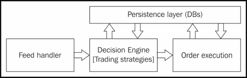
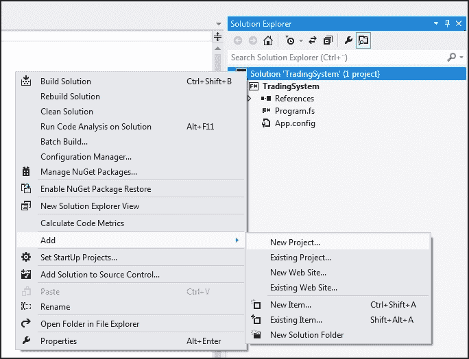
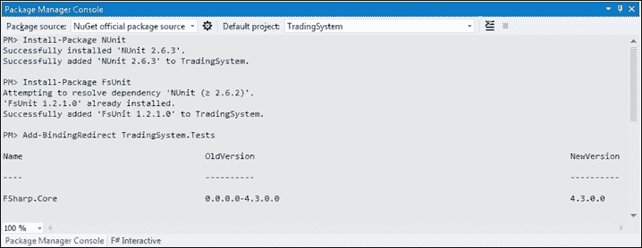
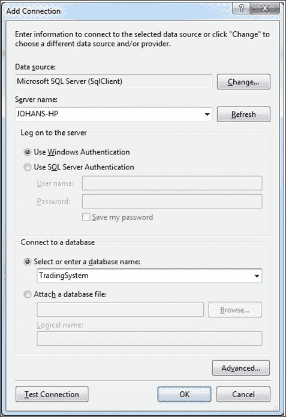
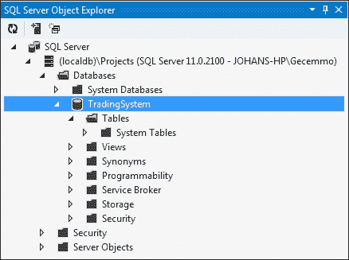
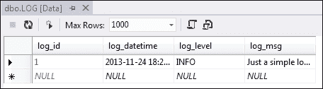
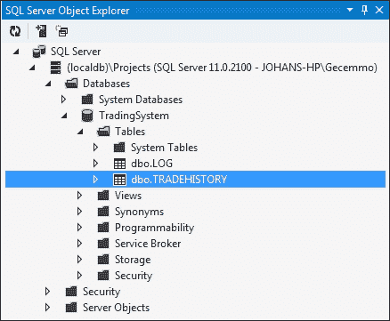
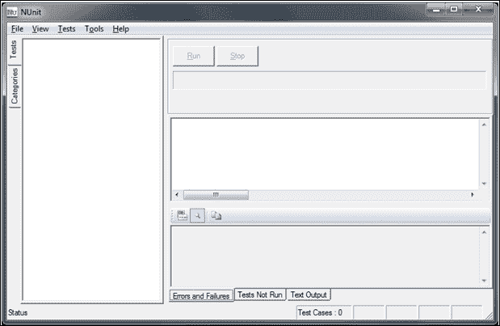
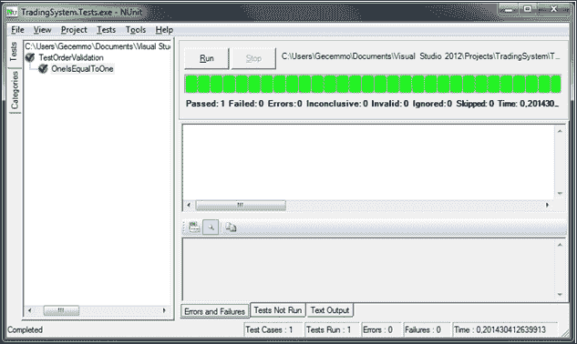
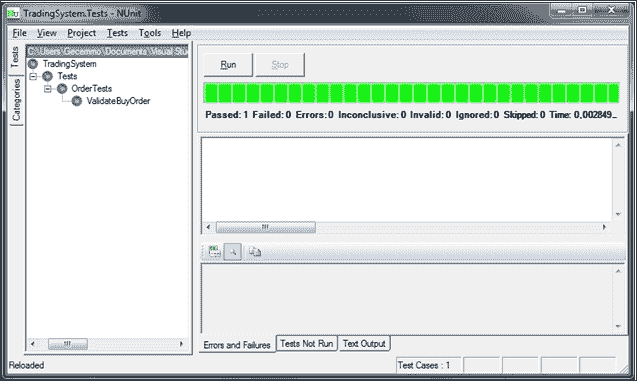

# 第八章：设置交易系统项目

在本章中，我们将设置交易系统，这个系统将在本书接下来的章节中开发。交易系统将总结到目前为止我们学到的内容。这也是一个很好的例子，展示了 F#与现有工具和库结合时的强大功能。我们将首先在 Visual Studio 中设置项目，然后添加测试所需的引用以及连接 Microsoft SQL Server 所需的引用。类型提供程序和**语言集成查询**（**LINQ**）将在此简要介绍，更多细节将在下一章中讲解。

在本章中，我们将学习：

+   更多关于自动化交易的信息

+   测试驱动开发

+   交易系统的需求

+   设置项目

+   连接到数据库

+   F#中的类型提供程序

# 解释自动化交易

自动化交易近年来变得越来越流行。大多数交易策略可以通过计算机实现交易。自动化交易策略有很多好处，交易策略可以通过历史数据进行回测。这意味着策略会在历史数据上运行，并且可以研究策略的表现。虽然本书不涉及回测，但此处开发的交易系统可以修改以支持回测。

自动化交易系统顾名思义，是在计算机上运行的自动化交易系统。它们通常由几个部分组成，如数据馈送处理器、订单管理系统和交易策略。通常，自动化交易系统会呈现出从市场数据到订单再到执行的管道，并跟踪状态和历史。规则会被编写成在市场数据进入系统时几乎实时地执行。这就像一个常规的控制系统，具有输入和输出。在接下来的章节中，我们将看看如何用 F#实现一个相当简单，但又非常强大的交易系统，概括我们在本书中学到的内容。

以下是自动化交易系统的组成部分：

+   数据馈送处理器和市场数据适配器

+   交易策略

+   订单执行与订单管理

+   持久化层（数据库）

+   用于监控和人工交互的图形用户界面（GUI）

下面是展示自动化交易系统各部分的框图：



图 1：交易系统的典型框图

# 理解软件测试和测试驱动开发

在编写软件时，能够测试系统的功能至关重要。在软件开发中，有一种流行且有效的编写代码的方式，即测试驱动开发。此方法由测试驱动，测试在主要逻辑实现之前编写。换句话说，当你准备为系统编写测试用例时，你肯定已经有一些要求或者对软件的想法。在测试驱动开发中，测试将反映需求。这是一种将需求写入代码的方式，用于测试给定功能集的软件。测试实现为测试用例，测试用例被收集到测试套件中。测试最好通过工具进行自动化。拥有自动化测试将使开发人员每次对代码进行更改时都能重新运行测试。

在本章中，我们将重点讲解如何使用**NUnit**进行单元测试。

# 理解 NUnit 和 FsUnit

NUnit 是一个开源单元测试框架，适用于所有 .NET 语言，类似于 JUnit 对于 Java 的作用。NUnit 使程序员能够编写单元测试，并执行测试，以查看哪些测试成功，哪些失败。在我们的项目中，我们将使用 NUnit 及其外部工具来运行测试。在 F# 中，使用 FsUnit 进行测试的典型代码行如下所示：

```py
> 1 |> should equal 1;;
```

## 系统的要求

在本节中，我们将讨论交易系统的一些主要要求。我们不会指定所有细节，因为其中一些需要分成多个部分。交易系统将使用一些库和工具，这些库和工具将在下一节中指定。

表格展示我们将开发的交易系统的一些最重要要求。它将是一个简单的系统，用于利用 S&P 500 指数期权和 CBOE 波动率指数（VIX）进行波动率套利交易。S&P 500 指数由 NYSE 或 NASDAQ 上市的最大 500 家公司组成，被视为美国股市的总体指标。VIX 是 S&P 500 指数期权隐含波动率的指数。

系统应该能够执行以下操作：

+   将日志条目存储在 Microsoft SQL Server 数据库中

+   将交易历史存储在 Microsoft SQL Server 数据库中

+   从 Yahoo! Finance 下载报价

+   管理订单

+   使用 FIX 4.2 发送订单

+   使用 FIX 4.2 连接到 FIX 模拟器

+   执行用 F# 编写的交易策略

+   通过一个基本的 GUI 控制，包含启动/停止按钮

+   显示当前的仓位

+   显示当前的盈亏

+   显示最新的报价

+   使用 MVC 模式

以下是使用的库和工具：

+   QuickFIX/N：.NET 的 FIX 协议

+   QuantLib：这是一个用于量化金融的库

+   LINQ

+   Microsoft SQL Server

+   Windows Forms

+   FSharpChart：这是 Microsoft Chart Controls 的 F# 友好封装

## 设置项目

在本节中，我们将在 Visual Studio 中设置解决方案。它将包含两个项目；一个是交易系统项目，另一个是测试项目。将两者分开有一些优势，并且会生成两个二进制文件。测试将通过 NUnit 程序运行，NUnit 是一个用于运行单元测试的独立程序。

接下来的步骤将在同一解决方案中创建两个项目：

1.  创建一个新的 F#应用程序，命名为**TradingSystem**，如下图所示：

    图 2：向解决方案中添加新项目

1.  向现有的**TradingSystem**解决方案中添加一个新项目。右键单击解决方案，如*图 2*所示，然后选择**添加** | **新建项目...**。创建另一个 F#应用程序，并将其命名为**TradingSystem.Tests**。

1.  接下来，我们必须将测试框架添加到**TradingSystem.Tests**项目中，如下图所示：

    图 3：包含两个项目的解决方案

1.  现在我们已经设置了包含两个项目的解决方案。您可以在*图 3*中看到每个项目中的引用。在本章中，我们将向两个项目添加更多引用。接下来，我们将安装测试框架，首先是 NUnit，然后是 FsCheck。

## 安装 NUnit 和 FsUnit 框架

在本节中，我们将讨论如何安装 NUnit 和 FsUnit，并如何使用 F# Interactive 来验证一切是否按预期工作。

在 Visual Studio 2012 中安装 NUnit 和 FsUnit，按照以下步骤操作：

1.  通过导航到**视图** | **其他窗口** | **包管理器控制台**，打开包管理器控制台。

1.  在下拉菜单中选择**TradingSystem.Tests**作为默认项目。

1.  输入`Install-Package NUnit`。

1.  输入`Install-Package FsUnit`。

1.  输入`Add-BindingRedirect TradingSystem.Tests`。下图显示了前述步骤的结果：

    最后一条命令确保`Fsharp.Core`是最新的，如果需要，它还会更新`App.config`。

1.  让我们在 F# Interactive 中尝试使用 NUnit 框架，了解它是什么，并检查一切是否已正确设置。将以下代码添加到 F#脚本文件中：

    ```py
    #r @"[...]\TradingSystem\packages\FsUnit.1.2.1.0\Lib\Net40\FsUnit.NUnit.dll";;
    #r @"[...]\TradingSystem\packages\NUnit.2.6.2\lib\nunit.framework.dll";;

    open NUnit.Framework
    open FsUnit

    1 |> should equal 1
    ```

1.  请注意，您需要找到这两个 DLL 的路径，因为它在不同的计算机上会有所不同。只需进入项目中的**引用**（**TradingSystem.Tests**），在**解决方案资源管理器**中单击特定的框架，然后**完整路径**将在**属性**窗口中更新。使用此**完整路径**替换前面代码中的路径，两个 DLL 都要这样操作。

    最后，您可以测试前面的代码：

    ```py
    > 1 |> should equal 1;;
    val it : unit = ()
    ```

这意味着我们的第一个测试框架已成功设置。接下来，我们将查看如何在代码中添加一些测试并通过 NUnit 运行它们。

# 正在连接到 Microsoft SQL Server

本章假设你已经在本地机器上运行了 Microsoft SQL Server 实例，或者它作为 Visual Studio 2012 的一部分安装，或者你在远程机器上有访问权限，如下图所示：



连接到 Microsoft SQL Server 的步骤如下：

1.  导航到**视图** | **服务器资源管理器**。

1.  右键点击**数据连接**，然后选择**添加连接**。

1.  选择**Microsoft SQL Server (SqlClient)** 作为**数据源**。

1.  如果你在本地安装了 Microsoft SQL Server，请选择本地机器。

1.  选择**使用 Windows 身份验证**。

1.  指定数据库的名称。从现在开始，我们将把我们的数据库称为**TradingSystem**。

1.  为了测试设置是否成功，在左下角按下**测试连接**。

1.  按**确定**。

1.  然后你会遇到一个对话框，询问你是否要创建它，按**是**。

1.  现在我们已经有了项目所需的数据库，接下来我们将添加项目所需的表。为此，打开**视图** | **SQL Server 对象资源管理器**。它将显示如下截图：

1.  为了添加我们的表，我们将使用下一步中提供的 SQL 代码片段。右键点击**TradingSystem**数据库，然后点击**新建查询...**。粘贴以下代码来创建`Log`表。

1.  以下是创建`Log`表的 SQL 代码：

    ```py
    DROP TABLE LOG
    CREATE TABLE LOG
    (
      log_id int IDENTITY PRIMARY KEY,
      log_datetime datetime DEFAULT CURRENT_TIMESTAMP,
      log_level nvarchar(12) DEFAULT 'info',
      log_msg ntext
    )
    ```

1.  这将在编辑器下方的 SQL 终端输出以下内容：

    ```py
    Command(s) completed successfully.
    ```

我们将在接下来的类型提供程序和 LINQ 章节中使用这个表。

# 引入类型提供程序

类型提供程序是处理 XML 文档、SQL 数据库和 CSV 文件中结构化数据的强大方式。它们将 F# 的类型系统与结构化数据结合起来，而在静态类型语言中，这通常是一个繁琐的任务。通过使用类型提供程序，数据源的类型会自动转换为本地类型；这意味着数据会使用与数据源中相同的字段名进行解析和存储。这使得 Visual Studio 和 IntelliSense 可以帮助你编写代码，而无需每次都去数据源中查找字段名。

## 使用 LINQ 和 F#

LINQ 是 .NET 框架中的一项特性，自 Version 3.0 以来就得到了 F# 的支持。它用于提供强大的查询语法，可以与数据库、XML 文档、.NET 集合等一起使用。在本节中，我们将简要介绍 LINQ，并看看如何将它与 SQL 数据库一起使用。但首先，我们将先看一下 LINQ 与集合的配合使用：

1.  首先我们需要一个值的列表：

    ```py
    let values = [1..10]
    ```

1.  然后我们可以构建我们的第一个 LINQ 查询，它将选择列表中的所有值：

    ```py
    let query1 = query { for value in values do select value }
    query1 |> Seq.iter (fun value -> printfn "%d" value)
    ```

1.  这并不是很有用，所以我们添加一个条件。我们现在选择所有大于`5`的值，这可以通过 `where` 子句来实现：

    ```py
    let query2 = query { for value in values do
                            where (value > 5)
                            select value }
    query2 |> Seq.iter (fun value -> printfn "%d" value)
    ```

1.  我们可以添加另一个条件，选择大于`5`且小于`8`的值：

    ```py
    let query3 = query { for value in values do
                            where (value > 5 && value < 8)
                            select value }
    query3 |> Seq.iter (fun value -> printfn "%d" value)
    ```

这非常强大，特别是在处理来自 SQL 数据库等的数据时更为有用。在下一节中，我们将查看一个结合使用类型提供程序和 LINQ 的示例应用程序，用于插入和查询数据库。

### 解释使用类型提供程序和 LINQ 的示例代码

在本节中，我们将查看一个使用类型提供程序和 LINQ 的示例应用程序。我们将使用之前创建的 `Log` 表。这是测试 SQL 数据库及其读写权限是否正常工作的好方法：

```py
open System
open System.Data
open System.Data.Linq
open Microsoft.FSharp.Data.TypeProviders
open Microsoft.FSharp.Linq

#r "System.Data.dll"
#r "FSharp.Data.TypeProviders.dll"
#r "System.Data.Linq.dll"
```

连接字符串在某些情况下需要更改；如果是这样，只需检查数据库属性中的 `Connection` 字符串值：

```py
/// Copied from properties of database
type EntityConnection = SqlEntityConnection<ConnectionString="Data Source=(localdb)\Projects;Initial Catalog=TradingSystem;Integrated Security=True;Connect Timeout=30;Encrypt=False;TrustServerCertificate=False",Pluralize = true>
let context = EntityConnection.GetDataContext()

/// Format date according to ISO 8601
let iso_8601 (date:Nullable<DateTime>) =
    if date.HasValue then
        date.Value.ToString("s")
    else "2000-00-00T00:00:00"    
```

我们将使用 LINQ 来查询我们的表格。代码将在最终应用程序中进行修改和使用。这里有一个查询，它列出了 `Log` 表中的所有条目：

```py
/// Query all LOG entries
let listAll() =
    query { for logentry in context.LOGs do
            select logentry }
    |> Seq.iter (fun logentry -> printfn "%s -- %d -- %s -- %s" (iso_8601 logentry.log_datetime) logentry.log_id logentry.log_level logentry.log_msg)

/// Insert a LOG entry
let addEntry(logLevel, logMsg) =
    let fullContext = context.DataContext
    let logTimestamp = DateTime.Now
    let newEntry = new EntityConnection.ServiceTypes.LOG(log_level = logLevel,
    log_msg = logMsg,
    log_datetime = Nullable(logTimestamp))
    fullContext.AddObject("LOGs", newEntry)
    fullContext.SaveChanges() |> printfn "Saved changes: %d object(s) modified."
```

我们可以使用 F# Interactive 来查看代码是否有效，通过添加日志条目并尝试获取它：

```py
> addLogEntry("INFO", "Just a simple log entry");;
Saved changes: 1 object(s) modified.
val it : unit = ()

> listAll();;
2013-09-26T14:08:02 -- 1 -- INFO -- Just a simple log entry
val it : unit = ()
```

这似乎运行得不错，我们可以认为 SQL Server 设置已完成。接下来的两章我们将添加表格和功能。但目前这样已经可以了，设置已完成。

在 Visual Studio 中浏览数据库表格的数据也很方便。为此，右键点击 **SQL Server 对象资源管理器** 中的 `Log` 表，然后选择 **查看数据**。你将看到类似于以下截图的视图：



## 创建项目中剩余的表格

SQL 数据库将用于存储我们系统的状态和历史记录，主要用于说明性目的。我们将存储日志信息和交易历史。为此，我们需要添加一个新表，方法与之前相同。

```py
CREATE TABLE TRADEHISTORY
(
  tradehistory_id int IDENTITY PRIMARY KEY,
  tradehistory_datetime datetime DEFAULT CURRENT_TIMESTAMP,
  tradehistory_instrument nvarchar(12),
  tradehistory_qty int,
  tradehistory_type nvarchar(12),
  tradehistory_price float
)
```

如果你执行上述 SQL 代码，现在可以看到该表已添加到 **SQL Server 对象资源管理器** 中的 **表格视图**，如以下截图所示：



沿着我们之前的步骤，我们将检查示例代码来查询和插入一条交易历史记录：

```py
/// Query trading history
let listAllTrades() =
    query { for trade in context.TRADEHISTORies do select trade }
    |> Seq.iter (fun trade -> printfn "%A" (iso_8601 trade.tradehistory_datetime, trade.tradehistory_id, trade.tradehistory_instrument, trade.tradehistory_type, trade.tradehistory_price, trade.tradehistory_qty))

/// Insert a trade
let addTradeEntry(instrument, price, qty, otype) =
    let fullContext = context.DataContext
    let timestamp = DateTime.Now
    let newEntry = new EntityConnection.ServiceTypes.TRADEHISTORY(tradehistory_instrument = instrument,
                               tradehistory_qty = Nullable(qty),
                               tradehistory_type = otype,
                               tradehistory_price = Nullable(price),
                               tradehistory_datetime = Nullable(timestamp))
    fullContext.AddObject("TRADEHISTORies", newEntry)
    fullContext.SaveChanges() |> printfn "Saved changes: %d object(s) modified."
```

我们可以使用 F# Interactive 来查看代码是否有效，通过添加交易条目并尝试获取它：

```py
> addTradeEntry("MSFT", 45.50, 100, "limit")
Saved changes: 1 object(s) modified.
val it : unit = ()

> listAllTrades()
("2013-11-24T20:40:57", 1, "MSFT", "limit", 45.5, 100)
val it : unit = ()
```

看起来运行得不错！

# 编写测试用例

在本节中，我们将查看可以为交易系统编写的一些测试用例。我们将结合 NUnit 和 NUnit 提供的图形用户界面来完成这项工作。以下截图显示了 NUnit 的主界面：



图 4：NUnit 用户界面

在我们开始编写系统的真正测试之前，我们会编写一个简单的测试来验证我们的设置是否正确。NUnit 会在每次构建时自动重新运行可执行文件。我们首先在 `TestOrderValidation` 文件中编写一个简单的测试，然后再编写真正的测试：

```py
[<Test>]
let OneIsEqualToOne() =
    1 |> should equal 1
```

这看起来很傻，但我们将能看到 NUnit 是否能检测到变化，且 NUnit 是否能检测到 `.exe` 文件中的测试用例。编写简单测试用例的步骤如下：

1.  打开**NUnit**，然后导航到**文件** | **打开项目...**。

1.  选择 **TradingSystem.Tests** 中对应的 `.exe` 文件，该文件位于`..\visual studio 2012\Projects\TradingSystem\TradingSystem.Tests\bin\Debug`。

1.  按下**运行**按钮，应该会显示如下图：

    图 5：成功运行示例单元测试时的 NUnit

现在我们知道设置是正确的，让我们开始为我们的订单验证代码编写一些真正的单元测试：

```py
namespace TradingSystem.Tests

open System
open NUnit.Framework
open FsUnit

open TradingSystem.Orders

module OrderTests =
    [<Test>]
    let ValidateBuyOrder() =
        let buyOrder = Order(OrderSide.Buy, OrderType.Limit, 54.50, Tif.FillorKill, 100, "MSFT", 0.0)
        validateOrder (Right buyOrder) |> should equal (Right buyOrder)
```

现在我们需要构建项目，然后 NUnit 应该能够检测到变化。如果一切正常，NUnit 图形界面应该显示如下截图：


图 6：运行 ValidateBuyOrder 测试时的 NUnit

让我们为订单验证代码添加一些更多的测试：

```py
module ValidateOrderTests =
    [<Test>]
    let ValidateBuyOrder() =
        let buyOrder = Order(OrderSide.Buy, OrderType.Limit, 54.50, Tif.FillorKill, 100, "MSFT", 0.0)
        validateOrder (Right buyOrder) |> should equal (Right buyOrder)

    [<Test>]
    let ValidateOrderNoPrice() =
        let buyOrderNoPrice = Order(OrderSide.Buy, OrderType.Limit, 0.0, Tif.FillorKill, 100, "MSFT", 0.0)
        validateOrder (Right buyOrderNoPrice) |> should equal (Left "Limit orders must have a price > 0")

    [<Test>]
    let ValidateStopLimitNoPrice() =
        let stopLimitNoPrice = Order(OrderSide.Buy, OrderType.StopLimit, 0.0, Tif.FillorKill, 100, "MSFT", 45.50)
        validateOrder (Right stopLimitNoPrice) |> should equal (Left "Stop limit orders must both price > 0 and stop price > 0")

    [<Test>]
    let ValidateStopNoPrice() =
        let stopNoPrice = Order(OrderSide.Buy, OrderType.Stop, 0.0, Tif.FillorKill, 100, "MSFT", 45.50)
        validateOrder (Right stopNoPrice) |> should equal (Right stopNoPrice)
```

请注意，模块名称已更改为`ValidateOrderTests`。我们将为验证工具和使用预交易风险的功能添加更多测试，所有测试都将在同一文件中。以下截图显示了验证订单的四个测试：



NUnit 当运行四个测试时

## 设置的详细信息

以下是到目前为止在项目中使用的引用列表。使用此列表检查你的项目是否是最新的：

`TradingSystemFSharp.Core`

+   `FSharp.Data.TypeProviders`

+   `mscorlib`

+   `System`

+   `System.Core`

+   `System.Data`

+   `System.Data.Linq`

+   `System.Numerics`

`TradingSystem.Tests`

+   `Fsharp.Core`

+   `FsUnit.NUnit`

+   `TradingSystem.Core`

+   `FSharp.Data.TypeProviders`

+   `mscorlib`

+   `nunit.framework`

+   `System`

+   `System.Core`

+   `System.Numerics`

# 摘要

在本章中，我们设置了项目，项目由交易系统本身和测试组成。我们学习了如何使用 Visual Studio 处理我们的解决方案，并将其与 NUnit 和 FsUnit 集成。我们还了解了如何连接到 Microsoft SQL Server，以及如何在 LINQ 中编写查询并通过类型提供程序检索数据。

在接下来的两章中，我们将继续开发从本章构建的基础上的交易系统。
