# 第九章. 通过交易波动性获利

在本章中，我们将研究各种波动率交易策略。我们将涵盖方向性波动率交易和相对价值波动率套利。我们还会简要涉及期权和收益图，并使用 F#和 FSharpChart 来可视化它们。在本章中，您将学习：

+   交易波动率

+   波动率套利机会

+   获取和计算策略所需的数据

+   推导波动率套利背后的数学原理

# 交易波动性

交易波动性类似于交易大多数其他资产，不同之处在于波动率不能直接交易。波动率是通过期权、期货和 VIX 指数等方式间接交易的。因为波动率是资产的内在价值，所以不能直接交易。为了能够交易波动率，通常需要通过衍生品及其标的资产的对冲头寸或期权头寸来实现。

波动率交易通常分为两类：方向性交易和相对价值交易。方向性波动率交易意味着我们根据波动率的方向进行交易。如果波动率很高，我们可能会开始做空波动率。相对价值交易意味着我们发起两个交易，例如，我们在一个看涨期权中做多，在另一个看涨期权中做空。第一个看涨期权在波动率上可能被低估，而另一个则可能被略微高估。这两种相关资产被认为会回归均值，利润将被兑现。

在本章中，我们将简要介绍波动率交易及其盈利方式。

# 使用 FSharpCharts 绘制收益图

在本节中，我们将构建欧洲看涨期权和看跌期权的基本收益图。收益图有助于根据股票价格和期权的行权价格可视化理论收益。

看涨期权的收益函数定义如下：

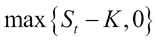

看跌期权的收益函数定义如下：

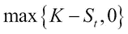

让我们看看如何在 F#中实现这一点。我们首先定义看涨期权和看跌期权的收益函数：

```py
/// Payoff for European call option
// s: stock price
// k: strike price of option
let payoffCall k s = max (s-k) 0.0

/// Payoff for European Put option
// s: stock price
// k: strike price of option
let payoffPut k s = max (k-s) 0.0
```

我们可以使用这些函数生成数据，输入 FSharpChart 并可视化数据：

```py
/// Calculate the payoffs given payoff function
let payoff payoffFunction = [ for s in 0.0 .. 10.0 .. 100.0 -> s, payoffFunction s ]
```

我们从生成行权价格为`50.0`的看涨期权的收益图开始：

```py
let callPayoff = payoff (payoffCall 50.0)
Chart.Line(callPayoff).WithTitle("Payoff - Call Option")
```

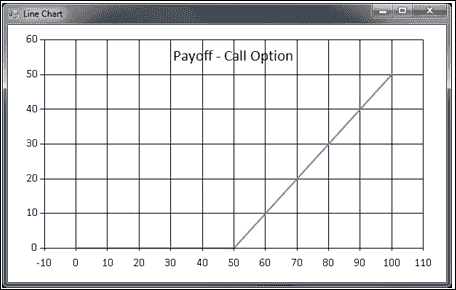

显示看涨期权的收益图

在前面的图表中，我们可以看到看涨期权的收益在股票价格达到**50**（期权的行权价格）之前为**0**。从那里开始，收益逐渐增加。我们仅绘制**0**到**100**之间的值，因此此图中的最大收益为**50**。

对于行权价格为`50.0`的看跌期权，过程是相同的：

```py
let putPayoff = payoff (payoffPut 50.0)
Chart.Line(putPayoff).WithTitle("Payoff - Put Option")
```

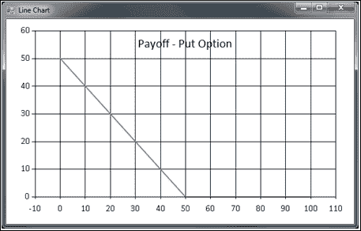

显示看跌期权的收益图

看跌期权的收益图与我们之前看到的相反。在前面的图表中，收益将会下降，直到在期权的行权价时为零。这意味着，看跌期权在股票价格低于期权行权价时会盈利。

最后，我们创建一个组合图表：

```py
/// Combined chart of payoff for call and put option
let chart = Chart.Combine [Chart.Line(callPayoff); Chart.Line(putPayoff).WithTitle("Payoff diagram")]
```

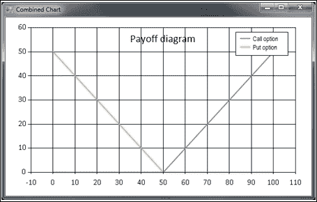

图 3：组合收益图

# 学习方向性交易策略

在波动性中进行方向性交易意味着根据波动性的方向进行交易。如果波动性较高，我们可能会启动一个空头波动性交易。在本节中，我们将首先看看如何使用期权策略进行波动性交易。然后，我们将使用期权和基础资产价格来交易波动性，进一步探讨 VIX 指数和德尔塔中性头寸。

## 使用期权交易波动性

一种交易波动性的方法是使用期权。我们将看看两种期权策略，用于交易波动性或基础期权的价格变化。

### 交易跨式期权

跨式期权头寸由两种期权组成：一份看跌期权和一份看涨期权。跨式期权适用于当你对基础市场的观点是中立时，也就是说，不对市场的长期走势进行投机。它还意味着跨式期权头寸适用于当你希望交易波动性时，无论市场的走势如何。

#### 多头跨式期权

多头跨式期权交易是通过同时持有一个看涨期权和一个看跌期权的多头头寸，且两者具有相同的行权价和到期日。多头跨式期权适用于当你认为波动性较低，并且希望利用波动性潜在上升来获利时。

这个思路是，两种期权（看涨和看跌期权）将抵消对基础市场的暴露，除了期权基础资产的波动性。也就是说，跨式期权对波动性的变化非常敏感。更技术地说，它们各自的德尔塔接近 0.5 和-0.5，这意味着它们相互抵消。因为货币期权的德尔塔大约为看涨期权的 0.5 和看跌期权的-0.5。

让我们看看一些代码，来实现多头跨式期权的收益函数：

```py
/// Payoff for long straddle
// s: stock price
// k: strike price of option
let longStraddle k s = 
    (payoffCall k s) +
    (payoffPut k s)

Chart.Line(payoff (longStraddle 50.0)).WithTitle("Payoff - Long straddle")
```

以下截图展示了多头跨式期权的收益函数线图：

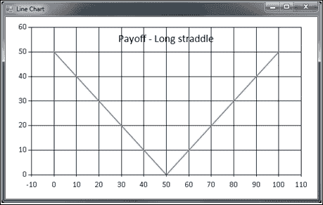

组合收益图

#### 空头跨式期权

空头跨式期权是多头跨式期权的对立面。在这里，我们通过对一个看涨期权和一个看跌期权进行空头操作，且这两者具有相同的行权价和到期日，来创建这个头寸。空头跨式期权用于交易资产波动性的下降，而不暴露于市场的其他方面。

我们空头跨式期权的收益函数代码是通过添加两个空头头寸来获得的（注意在`(payoffCall k s)`前有一个负号）：

```py
/// Payoff for Short straddle
// s: stock price
// k: strike price of option
let shortStraddle k s = 
    -(payoffCall k s) +
    -(payoffPut k s)

Chart.Line(payoff (shortStraddle 50.0)).WithTitle("Payoff - Short 
    straddle")
```

以下截图展示了空头跨式期权的收益函数线图：

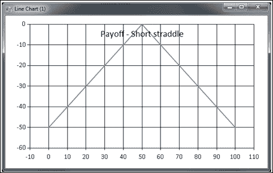

组合收益图

## 交易蝶式价差

蝶式价差由三个腿组成，并有两种形式：长蝶式价差和短蝶式价差。  

### 长蝶式价差  

长蝶式头寸是通过卖出两个平值看涨期权并买入两个看涨期权来创建的：一个实值看涨期权和一个远期看涨期权。这两个看涨期权将作为卖空头寸的保险。  

总结来说，你需要：  

+   卖空两个平值看涨期权  

+   买入一个实值看涨期权  

+   买入一个远期看涨期权  

我们可以将前面的规则表示为 F#代码来生成盈亏：  

```py
/// Payoff for long butterfly
// s: stock price
// h: high price
// l: low price
let longButterfly l h s = 
    (payoffCall l s) +
    (payoffCall h s) -
    2.0 * (payoffCall ((l + h) / 2.0) s)

Chart.Line(payoff (longButterfly 20.0 80.0)).WithTitle("Payoff - Long butterfly")
```

这段代码将生成一个图表，显示长蝶式的盈亏：  

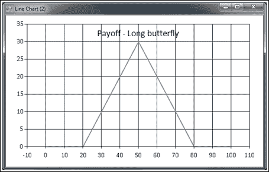  

长蝶式价差的盈亏图  

### 短蝶式价差  

短蝶式头寸是通过买入两个平值看涨期权并卖出一个实值看涨期权和一个远期看涨期权来创建的。这两个看涨期权将作为卖空头寸的保险。  

总结来说，你必须：  

+   买入两个平值（或两个其他行权价中间的）看涨期权  

+   卖出一个实值看涨期权  

+   卖出一个远期看涨期权  

我们可以将前面的规则表示为 F#代码来生成盈亏：  

```py
/// Payoff for short butterfly
// s: stock price
// h: high price
// l: low price
let shortButterfly l h s = 
    -(payoffCall l s) +
    -(payoffCall h s) -
    2.0 * -(payoffCall ((l + h) / 2.0) s)

Chart.Line(payoff (shortButterfly 20.0 80.0)).WithTitle("Payoff - Short butterfly")
```

这段代码将生成以下图表，显示短蝶式的盈亏：  

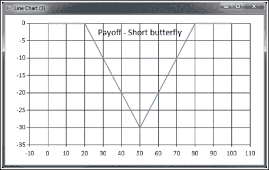  

短蝶式价差的盈亏图  

## 交易 VIX  

另一种选择，如果你有兴趣使用方向性交易策略进行波动率交易，是交易 VIX 指数。VIX 是一个结合了标准普尔 500 指数期权隐含波动率的指数。它可以被解释为未来 30 天波动率的预测。VIX 的预测能力与标准普尔 500 指数本身的历史回报相当。这意味着，VIX 提供的信息并不是波动率预测的灵丹妙药；它更适合用于波动率的方向性交易。以下是 VIX 指数与移动平均指标的图表截图：  

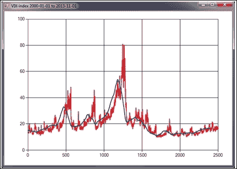

从 2000 年 1 月 1 日到 2013 年 11 月 1 日的 VIX 指数  

## 交易德尔塔中性组合  

德尔塔中性组合是通过期权和标的资产构建的。理论上，组合对标的价格的小幅变化（德尔塔中性）有抵抗力。另一方面，其他因素会改变组合的价值；这意味着我们必须定期进行再平衡。  

在本节中，我们将主要扩展对**德尔塔中性组合**的分析，并研究如何利用它进行波动率交易。  

以下图表显示了一个资产的实际波动率和隐含波动率：  

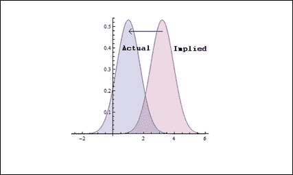  

一个资产的实际波动率和隐含波动率  

在 Delta 对冲头寸中，我们应该使用哪种波动率？我们有两个选择，要么使用**实际**波动率，要么使用**隐含**波动率。

这实际上是一个相当棘手的问题，如果不研究两种波动率的**市值**（**MTM**）盈亏，很难回答。简而言之，我们可以使用实际波动率，然后进行随机漫步，直到锁定的利润实现，即两个概率分布交叉。另一种选择是使用隐含波动率。使用隐含波动率将产生一个更合理的盈亏曲线，这通常从风险管理的角度来看更为可取，因为随机项在一定程度上得到了减少，利润将随着时间逐步实现，直到完全实现。

# 推导数学公式

在本节中，我们将研究交易 delta 中性投资组合所需的数学。

以下表格展示了市场中性投资组合的值：

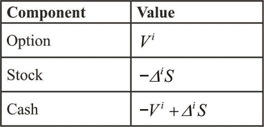

以下表格展示了下一天市场中性投资组合的值：

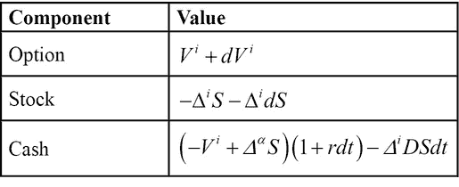

## 使用隐含波动率对冲

在本节中，我们将推导出使用隐含波动率对冲的数学工具，以便能够监控市值盈亏。

以下是从当前日期到下一日期的市值盈亏：

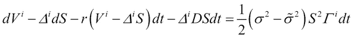

这里，**S** 是股票价格，**Γ** 是 Black-Scholes 伽玛函数。

以下是直到套利交易结束时的理论利润：

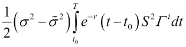

我们将每一笔利润的折现值整合，直到交易结束，从而得到总的理论利润。

## 实现数学公式

使用 Math.NET，让我们实现前一节推导出的数学公式，感受公式与 F#之间的紧密联系：

```py
/// Mark-to-market profit

/// Normal distribution
open MathNet.Numerics.Distributions;
let normd = new Normal(0.0, 1.0)

/// Black-Scholes Gamma
// s: stock price
// x: strike price of option
// t: time to expiration in years
// r: risk free interest rate
// v: volatility
let black_scholes_gamma s x t r v =
let d1=(log(s / x) + (r+v*v*0.5)*t)/(v*sqrt(t))
normd.Density(d1) / (s*v*sqrt(t))

let mark_to_market_profit s,x,t,r,v,vh = 0.5*(v*v - vh*vh)*S*S*gamma(s,x,t,r,v)
```

# 学习相对价值交易策略

**相对价值**波动率交易是指通过使用一些金融工具的对立头寸（如期权）来进行波动率交易，从中利用波动率的变化。通常，交易者会通过买入一个看涨期权并卖出一个看涨期权来进行交易，形成一个双腿交易。这类交易有很多变种，我们将主要关注通过期权交易波动率微笑的斜率。这将构成本书所用交易策略的基础。

## 交易微笑的斜率

首先，我们将回顾第六章，*探索波动率*，我们在该章节中研究了瑞典 OMX 交易所期权的微笑效应。波动率微笑是股市中观察到的一种现象。通过将期权的隐含波动率绘制在 y 轴上，将期权的内在价值绘制在 x 轴上，可以得到波动率微笑。

金融含义是标的资产现货价格**S**与期权执行价格**K**之间的比率：

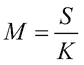

在下面的截图中，你将看到金利率 M 位于 x 轴，隐含波动率位于 y 轴：

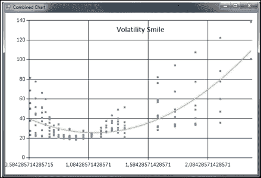

波动率微笑

前面的图表的一个缺点是我们在同一图表中绘制了多个到期日。我们需要改进这种方法，以便能更详细地研究波动率微笑。作为第一步，我们来修改代码：

```py
open MathNet.Numerics
open MathNet.Numerics.LinearAlgebra
open MathNet.Numerics.LinearAlgebra.Double
open MathNet.Numerics.Distributions

let filePath = @"C:\Users\Gecemmo\Desktop\smile_data.csv"

/// Split row on commas
let splitCommas (l:string) =
    l.Split(',')

/// Read a file into a string array
let openFile (name : string) =
    try
        let content = File.ReadAllLines(name)
        content |> Array.toList
    with
        | :? System.IO.FileNotFoundException as e -> printfn "Exception! %s " e.Message; ["empty"]
```

第一个修改是在`readVolatilityData`函数中进行的，添加了一个`date`参数。该参数用于从 CSV 文件中过滤出与日期匹配的行：

```py
/// Read the data from a CSV file and returns
/// a tuple of strike price and implied volatility%
// Filter for just one expiration date
let readVolatilityData date =
    openFile filePath
    |> List.map splitCommas
    |> List.filter (fun cols -> cols.[1] = date)
    |> List.map (fun cols -> (cols.[2], cols.[3]))
```

以下代码与我们之前使用的相同，但在下一步中，我们需要做一些小的修改：

```py
/// 83.2
/// Calculates moneyness and parses strings into numbers
let calcMoneyness spot list =
    list
    |> List.map (fun (strike, imp) -> (spot / (float strike), (float imp)))

// Filter out one expiration date -- 2013-12-20
let list = readVolatilityData "2013-12-20"
let mlist = calcMoneyness 83.2 list

/// Plot values using FSharpChart
fsi.AddPrinter(fun (ch:FSharp.Charting.ChartTypes.GenericChart) -> ch.ShowChart(); "FSharpChartingSmile")    
Chart.Point(mlist)
```

以下是绘制数据点以及获得回归线的代码。正如我们在图表中所看到的，回归结果并不理想：

```py
let xdata = mlist |> Seq.map (fun (x, _) -> x) |> Seq.toList
let ydata = mlist |> Seq.map (fun (_, y) -> y) |> Seq.toList

let N = xdata.Length
let order = 2

/// Generating a Vandermonde row given input v
let vandermondeRow v = [for x in [0..order] do yield v ** (float x)]

/// Creating Vandermonde rows for each element in the list
let vandermonde = xdata |> Seq.map vandermondeRow |> Seq.toList

/// Create the A Matrix
let A = vandermonde |> DenseMatrix.ofRowsList N (order + 1)
A.Transpose()

/// Create the Y Matrix
let createYVector order l = [for x in [0..order] do yield l]
let Y = (createYVector order ydata |> DenseMatrix.ofRowsList (order + 1) N).Transpose()
```

最后的步骤是计算回归系数，并使用这些系数计算曲线上的点。然后，我们将像在第六章中那样，使用点和拟合曲线的组合图：

```py
/// Calculate coefficients using least squares
let coeffs = (A.Transpose() * A).LU().Solve(A.Transpose() * Y).Column(0)

let calculate x = (vandermondeRow(x) |> DenseVector.ofList) * coeffs

let fitxs = [(Seq.min xdata).. 0.01 ..(Seq.max xdata)]
let fitys = fitxs |> List.map calculate
let fits = [for x in [(Seq.min xdata).. 0.01 ..(Seq.max xdata)] do yield (x, calculate x)]

let chart = Chart.Combine [Chart.Point(mlist); Chart.Line(fits).WithTitle("Volatility Smile - 2nd degree polynomial")]
```

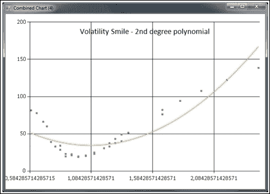

2013 年 1 月 20 日到期的波动率微笑

相反，我们可以尝试拟合三次多项式并评估图形。我们只需将`order`值更改为`2`：

```py
let order = 2
```

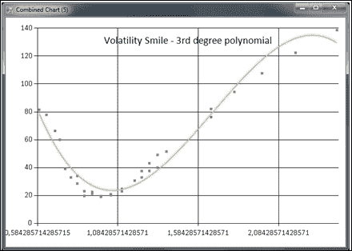

使用三次多项式拟合同一到期日的波动率微笑

这次的结果更有说服力。正如我们所看到的，不同期权之间确实存在一些不一致性。但这并不一定意味着在这种情况下存在套利机会。

我们如何利用相同到期日的期权波动率的不一致性呢？一种方法是研究隐含波动率随时间变化的走势。如果波动率在某种程度上是均值回归的，该回归会如何影响？

首先，我们将聚焦于问题和期权集合。x 轴表示期权的金利率。在第一次实验中，我们将研究金利率在`0.50`到`1.5`之间的范围。

我们编写了一些 F#代码来帮助我们：

```py
// Filter on moneyness, 0.5 to 1.5
let mlist = calcMoneyness 83.2 list |> List.filter (fun (x, y) -> x > 0.5 && x < 1.5)
```

这只是对`mlist`的赋值进行修改，过滤`x`值。经过这种过滤和对二次多项式的调整，生成了以下图表：

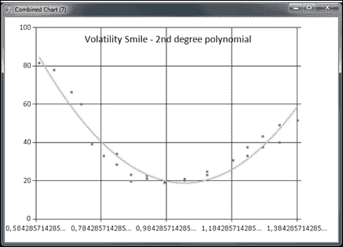

使用二次多项式拟合金利率在 0.5 到 1.5 之间的波动率微笑

我们假设斜率会发生变化，并且斜率会在某种程度上回归均值，这意味着我们可以在期权受该波动影响时，采取一个多头和一个空头的仓位。

# 定义交易策略

我们系统的交易策略将基于先前描述的相对价值波动率套利。这将使我们能够专门使用期权进行交易，具体来说，是使用价内的看涨期权。

首先，我们定义内在价值的“边缘”之间的斜率：内在价值的上限和下限。为了做这个，我们需要查看一个图表。对于前面的图表，通常是`[0.5, 1.0]`。

为了得到更为数学化的斜率表达式，我们查看两个点并计算它们之间的斜率：

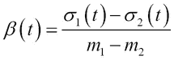

这里，**m**是内在价值，**σ**（sigma）是从期权价格中得到的隐含波动率。斜率可以上升或下降，这意味着**β**会增加、减少，或者当然，两者都不会发生。让我们更仔细地看一下这两种情况。

## 案例 1 – 斜率增加

在斜率低于回归线（平均值）的情况下，我们可以假设斜率最终会回归。在斜率上升的情况下，斜率如下：

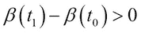

这导致以下不等式，其中在时间`0`时的合成波动性低于未来某个时刻的波动性：

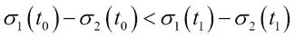

我们可以通过创建一个多头看涨期权和一个空头看涨期权的组合来交易这个斜率增加的情况。波动性上升的差异将导致潜在的利润。这意味着我们需要考虑这两个期权的 Vega。如果与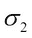相关的期权的 Vega 比与相关的期权的 Vega 更高，那么这个头寸可能会亏损。

## 案例 2 – 斜率减小

就像在斜率增加的情况下一样，斜率减小的情况也一样成立。我们可以假设斜率将在某个稍后的时间点回归。这意味着时间点 1（t1）处的斜率减去时间点 0（t0）处的斜率小于零：

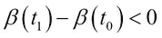

这导致以下不等式，其中在时间点 0 时的合成波动性大于未来某个时刻的波动性：

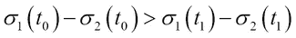

该交易通过一个空头看涨期权和一个多头看涨期权来启动。

## 定义进入规则

系统的进入规则将是：

+   每当β的斜率小于回归线的斜率时，我们按照案例 1 启动交易。

+   每当β的斜率大于回归线的斜率时，我们按照案例 2 启动交易。

## 定义退出规则

当案例 1 或 2 中的任何一个不再成立时，交易将会被平仓。这意味着斜率已经发生反转，我们可能会亏损。我们还会增加一个时间约束，规定交易的持续时间不能超过两天。这个时间限制当然可以调整，但这种行为通常适用于日内交易。

我们将在下一章实现此处定义的规则，在那里我们将整合各个部分，通过使用期权构建一个完整的交易系统。

# 摘要

在本章中，我们详细探讨了构建交易策略所需的理论。我们推导了一些在波动率交易中使用的数学工具，并讨论了这些工具如何应用于交易系统。一些概念已经在前面的章节中介绍过，这里仅作了稍微修改的版本。在下一章中，我们将把这些内容整合在一起，看看如何在图形用户界面（GUI）中展示交易系统的数据。
