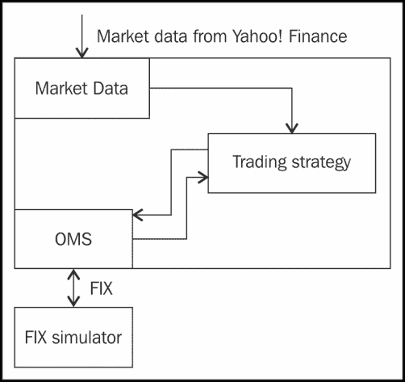
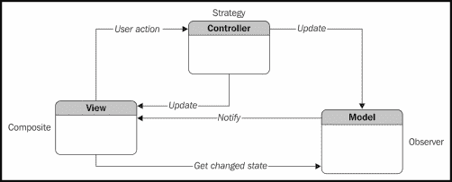
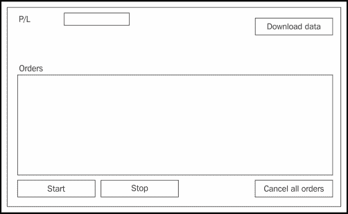
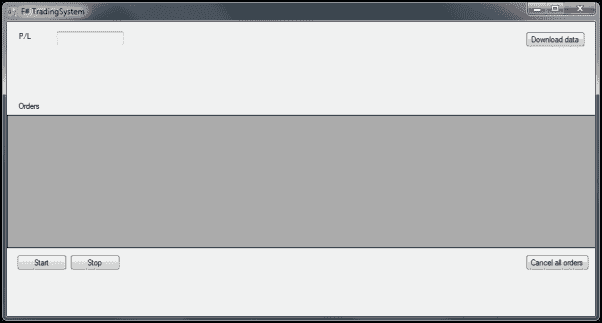
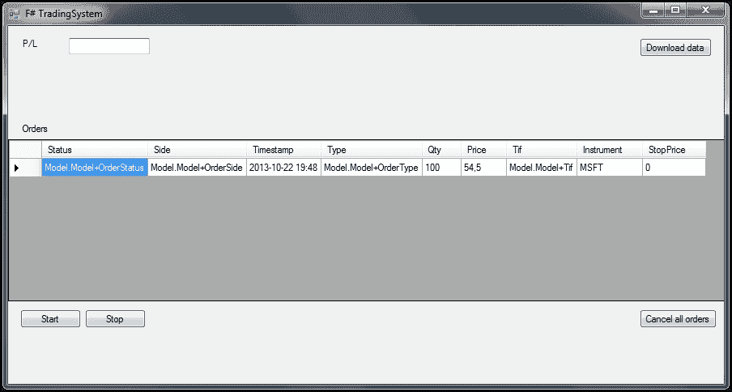
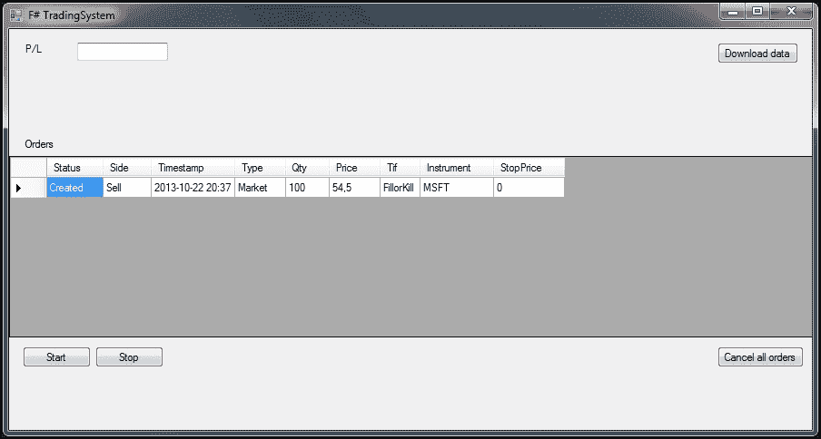

# 第十章：将各个部分组合在一起

本章介绍构建自动化交易系统的最后一步。我们将讨论如何重构系统，并根据新的需求进行修改。

本章内容包括：

+   执行交易策略

+   在 GUI 中展示信息

+   交易系统的可能扩展

# 理解需求

我们在第八章《设置交易系统项目》中已介绍了一些要求，但让我们再次回顾它们，并看看系统将如何定义。自动化交易系统的关键在于，它需要能够处理市场数据，并基于这些数据做出决策。这些决策将被转换为 FIX 4.2 消息，并发送到 FIX 模拟器、实际的经纪商或股票交易所。在这个相对简单的设置中，市场数据将是来自 Yahoo! Finance 的每日数据，将每天下载并解析。

自动化交易系统应该能够：

+   将日志条目存储在 Microsoft SQL Server 数据库中

+   将交易历史存储在 Microsoft SQL Server 数据库中

+   从 Yahoo! Finance 下载报价

+   使用**订单管理系统**（**OMS**）管理订单

+   使用 FIX 4.2 发送订单

+   通过 FIX 4.2 将交易系统连接到 FIX 模拟器

+   执行用 F#编写的交易策略

+   使用基本的 GUI 控制自己，带有开始/停止按钮

+   显示当前持仓

+   显示当前的**盈亏**（**P&L**）

+   显示最新的报价

+   使用 MVC 模式和`INotifyPropertyChanged`接口

以下是说明交易系统中数据流的图示：



交易系统中的数据流

# 重新审视系统结构

我们将重新审视项目结构，并确保所有依赖项都已添加。以下是自动化交易系统的组成部分：

+   数据源处理器和市场数据适配器

+   交易策略

+   订单执行与订单管理

+   持久化层（数据库）

+   用于监控系统的 GUI

我们需要两个新的依赖项。它们如下：

+   `System.Windows.Forms`

+   `System.Drawing`

我们需要`System.Windows.Forms`依赖项来创建我们的 GUI。它为 Windows 本身以及使用的控件提供支持。`System.Drawing`依赖项也需要提供基本的图形功能。以下是项目中所需引用的列表。您可以根据这个列表验证您自己的项目，以确保您拥有所有必要的依赖项。

交易系统被分为两个项目：`TradingSystem`和`TradingSystem.Tests`。

以下是`TradingSystem`所需的依赖项列表：

+   `FSharp.Core`

+   `FSharp.Data.TypeProviders`

+   `mscorlib`

+   `NQuantLib`

+   `System`

+   `System.Core`

+   `System.Data`

+   `System.Data.Linq`

+   `System.Drawing`

+   `System.Numerics`

+   `System.Windows.Forms`

以下是`TradingSystem.Tests`所需的依赖项列表：

+   `Fsharp.Core`

+   `FsUnit.NUnit`

+   `TradingSystem.Core`

+   `FSharp.Data.TypeProviders`

+   `mscorlib`

+   `nunit.framework`

+   `System`

+   `System.Core`

+   `System.Numerics`

# 理解模型-视图-控制器模式

在这一部分，我们将探讨 MVC 设计模式的概念。MVC 模式是在 Xerox PARC 提出的，并自 Smalltalk 早期就存在。它是一种高层次的设计模式，常用于 GUI 编程。我们稍后会更详细地讲解它，但在此做一个温和的介绍将使你在需要时能够更容易理解这一概念。

MVC 的主要思想是将模型与视图分离。视图仅仅是 GUI，与程序的用户进行交互。GUI 会处理点击的按钮和显示在屏幕上的数据。模型是程序中使用的数据，例如，财务数据。通常，我们希望将模型（数据）和视图（GUI）的代码分开。

前面图中描述的 MVC 模式是传统 MVC 模式的一个修改版本。主要的区别在于，在这种变体中，视图与模型之间没有直接的通信。这是一种更精细的 MVC 模式使用方式，其中视图不需要了解任何关于模型的信息。

## 模型

模型通常是应用程序的数据和状态。在这个案例中，模型将包含订单、市场数据和系统状态。

## 视图

视图是`TradingSystemForm`类，它将是除了标准 Windows 窗体组件外，唯一使用的 GUI 窗体。视图即为 GUI。

## 控制器

控制器负责将视图与模型连接起来。控制器通过一个模型实例进行初始化，并且视图会在程序执行过程中（`Program.fs`）添加到控制器中。以下图表是 MVC 模式中各部分关系的示意图：



MVC 模式，其中控制器同时知道模型和视图

在我们的例子中，控制器将负责在执行操作时更新视图。这意味着模型会通知控制器，然后控制器会更新视图。严格来说，这是经典 MVC 模式的略微修改版本，其中模型了解视图并通知视图，而不是控制器。

经典方法中的主要问题是紧耦合。通过将控制器作为中介，形成了一个复合模式。这是苹果公司流行库*Cocoa*中使用的相同策略。

# 使用框架执行交易策略

当数据下载完成/成功时，交易策略通过`onMarketData`执行（它会向代理发送一条消息）。如果发生任何错误，则会通知代理。所有操作都记录到 SQL 后端（SQL Server）。

交易策略将有六个可调用函数：

+   `onInit`：当策略初始化时，将调用此函数。

+   `onStart`：当策略开始时，将调用此函数。

+   `onStop`：当策略停止时，将调用此函数。

+   `onMarketData`：每当新的市场数据到达时，都会调用此函数。

+   `onTradeExecution`：每当执行交易时，都会调用此函数。

+   `onError`：每当发生错误时，都会调用此函数。

交易策略将作为一个独立的类型来实现，其中回调函数是由**策略执行器**调用的成员函数。策略执行器由接收来自系统消息的代理组成。开始和停止命令通过与 GUI 中按钮连接的两个事件处理程序发送。

让我们看看用于执行交易策略的框架的主要结构：

```py
/// Agent.fs
namespace Agents

open System

  type TradingStrategy() =
    member this.onInit : unit = printfn "onInit"
    member this.onStart : unit = printfn "onStart"
    member this.onStop : unit = printfn "onStop"
    member this.onTradeIndication : unit = printfn "onTradeIndication"

  // Type for our agent
  type Agent<'T> = MailboxProcessor<'T>
```

我们需要控制消息用于与代理进行通信，这些消息被建模为标记联合。消息用于改变状态并在系统的各部分之间传递变化。这是必需的，因为代理运行在另一个线程中，传递消息是我们与之通信的方式。以下是一个示例：

```py
// Control messages to be sent to agent
type SystemMessage =
  | Init
  | Start
  | Stop

type SystemState =
  | Created
  | Initialized
  | Started
  | Stopped
```

`TradingAgent` 模块将接收控制消息并采取适当的行动。以下是实现功能的代码，使用模式匹配调用交易策略中的相应方法：

```py
module TradingAgent =
let tradingAgent (strategy:TradingStrategy) = Agent.Start(fun inbox ->
  let rec loop state = async {
    let! msg = inbox.Receive()
    match msg with
    | Init ->
    if state = Started then
      printfn "ERROR"
    else
      printfn "Init"
    strategy.onInit
    return! loop Initialized
    | Start ->
    if state = Started then
      printfn "ERROR"
    else
      printfn "Start"
    strategy.onStart
    return! loop Started
    | Stop ->
    if state = Stopped then
      printfn "ERROR"
    else
      printfn "Stop"
    strategy.onStop
    return! loop Stopped
  }
loop Created)
```

以下是用于控制交易系统的部分 GUI 代码。大部分代码使用 .NET 类，主要来自 Windows Forms 库。

### 提示

MSDN 上有很多关于 Windows Forms 的优秀资源，网址是：[`msdn.microsoft.com/en-us/library/ms229601(v=vs.110).aspx`](http://msdn.microsoft.com/en-us/library/ms229601(v=vs.110).aspx)。

```py
// GUI.fs
namespace GUI

open System
open System.Drawing
open System.Windows.Forms
open Agents

// User interface form
type public TradingSystemForm() as form =
  inherit Form()

  let valueLabel = new Label(Location=new Point(25,15))
  let startButton = new Button(Location=new Point(25,50))
  let stopButton = new Button(Location=new Point(25,80))
  let sendButton = new Button(Location=new Point(25,75))
```

交易策略将被初始化并传递给代理。在初始化过程中，参数和其他常量值将被传递：

```py
let ts = TradingStrategy()
let agent = TradingAgent.tradingagent ts

let initControls =
  valueLabel.Text <- "Ready"
  startButton.Text <- "Start"
  stopButton.Text <- "Stop"
  sendButton.Text <- "Send value to agent"
  do
    initControls

  form.Controls.Add(valueLabel)
  form.Controls.Add(startButton)
  form.Controls.Add(stopButton)

  form.Text <- "F# TradingSystem"

  startButton.Click.AddHandler(new System.EventHandler
    (fun sender e -> form.eventStartButton_Click(sender, e)))

  stopButton.Click.AddHandler(new System.EventHandler
    (fun sender e -> form.eventStopButton_Click(sender, e)))

  // Event handlers
  member form.eventStartButton_Click(sender:obj, e:EventArgs) =      
```

当**开始**按钮被按下时，调用此事件处理程序并将两条消息发送给代理：

```py
  agent.Post(Init)
  agent.Post(Start)
  ()

  member form.eventStopButton_Click(sender:obj, e:EventArgs) =
  agent.Post(Stop)
  ()
```

以下是用于在 `Program.fs` 中启动应用程序并查看 GUI 的代码：

```py
/// Program.fs
namespace Program

open System
open System.Drawing
open System.Windows.Forms

open GUI

module Main =
  [<STAThread>]
do
  Application.EnableVisualStyles()
  Application.SetCompatibleTextRenderingDefault(false)
  let view = new TradingSystemForm()
  Application.Run(view)
```

# 构建 GUI

我们在上一节中使用的 GUI 对于我们的交易应用程序来说还不够，但它展示了如何使用 F# 组合一个 GUI 的基本方法。接下来，我们将添加所需的控件，并准备呈现模型中的信息。以下是一个示意图，显示了控件的位置和 GUI 的整体构思：



交易系统 GUI 的示意图

我们来看看所需的代码。大部分代码比较直接，遵循上一节中 GUI 所使用的相同规则。`DataGridView`控件的一些属性已设置为自动调整宽度。标签也是如此，其中`AutoSize`属性被设置为`true`。最终的 GUI 将如下所示，参见以下代码之后的屏幕截图：

```py
/// GUI code according to mock
namespace GUI

open System
open System.Drawing
open System.Windows.Forms
open Agents
open Model

open System.Net
open System.ComponentModel
  // User interface form
  type public TradingSystemForm() as form =
    inherit Form()

    let plLabel = new Label(Location=new Point(15,15))
    let plTextBox = new TextBox(Location=new Point(75,15))

    let startButton = new Button(Location=new Point(15,350))
    let stopButton = new Button(Location=new Point(95,350))
    let cancelButton = new Button(Location=new Point(780,350))
    let downloadButton = new Button(Location=new Point(780,15))

    let ordersLabel = new Label(Location=new Point(15,120))
    let dataGridView = new DataGridView(Location=new Point(0,140));

    let initControls =
      plLabel.Text <- "P/L"
      plLabel.AutoSize <- true

      startButton.Text <- "Start"
      stopButton.Text <- "Stop"
      cancelButton.Text <- "Cancel all orders"
      cancelButton.AutoSize <- true
      downloadButton.Text <- "Download data"
      downloadButton.AutoSize <- true

    do
      initControls

    form.Size <- new Size(900,480)

    form.Controls.Add(plLabel)
    form.Controls.Add(plTextBox)
    form.Controls.Add(ordersLabel)

    form.Controls.Add(startButton)
    form.Controls.Add(stopButton)

    form.Controls.Add(cancelButton)
    form.Controls.Add(downloadButton)

    dataGridView.Size <- new Size(900,200)
    dataGridView.RowHeadersWidthSizeMode <- DataGridViewRowHeadersWidthSizeMode.EnableResizing
    dataGridView.AutoSizeColumnsMode <- DataGridViewAutoSizeColumnsMode.AllCells

    form.Controls.Add(dataGridView)

    form.Text <- "F# TradingSystem"
```



根据模拟，最终构建的 GUI 代码

# 在 GUI 中呈现信息

在这一部分，我们将研究如何在 GUI 中呈现定期更新的信息。我们将使用 MVC 模式来更新数据。

在.NET 中，通常在需要通知模型更新时会使用接口`INotifyPropertyChanged`。在本例中，我们将使用一个`DataGridView`控件和一个`DataSource`，其中`DataSource`由一个实现了`INotifyPropertyChanged`接口的自定义类型列表组成。

模型的更新由控制器处理，然后从`DataSource`本身更新 GUI。我们从查看订单列表开始，并展示如何在`DataGridView`控件中呈现该订单列表。将以下代码添加到`GUI.fs`文件中：

```py
let initOrderList() =
  let modelList = new BindingList<Model.Order>()
  let buyOrder = Model.Order(Model.OrderSide.Buy, Model.OrderType.Limit, 54.50, Model.Tif.FillorKill, 100, "MSFT", 0.0)            
  modelList.Add(buyOrder)

  dataGridView.DataSource <- modelList
  dataGridView.Size <- new Size(900,200)
  dataGridView.RowHeadersWidthSizeMode <- DataGridViewRowHeadersWidthSizeMode.EnableResizing
  dataGridView.AutoSizeColumnsMode <- DataGridViewAutoSizeColumnsMode.AllCells
```

另外，在`initControls`函数下方添加以下函数调用：

```py
initOrderList()
```



使用`DataGridView`并填充订单项的 GUI

如你所见，一些单元格中的内容未按我们希望的方式显示。我们需要为它们添加一个自定义单元格格式化器，指定如何在 GUI 中呈现这些值。

在`initOrderList`函数的末尾添加以下代码行：

```py
dataGridView.CellFormatting.AddHandler(new System.Windows.Forms.DataGridViewCellFormattingEventHandler(fun sender e -> form.eventOrdersGrid_CellFromatting(sender, e)))
```

然后，我们需要实现`eventOrdersGrid_CellFromatting`函数，具体如下：

```py
  member form.eventOrdersGrid_CellFromatting(sender:obj, e:DataGridViewCellFormattingEventArgs) =            
  match (sender :?> DataGridView).Columns.[e.ColumnIndex].DataPropertyName with
  | "Status" -> e.Value <- sprintf "%A" modelList.[e.RowIndex].Status
  | "Side" -> e.Value <- sprintf "%A" modelList.[e.RowIndex].Side
  | "Type" -> e.Value <- sprintf "%A" modelList.[e.RowIndex].Type
  | "Tif" -> e.Value <- sprintf "%A" modelList.[e.RowIndex].Tif
  | _ -> ()    
```

现在，当我们运行程序时，订单项的`DataGridView`控件将正确格式化单元格，如下图所示：



使用自定义单元格格式化器的`DataGridView`的 GUI

为了完善 GUI，我们需要添加更新文本字段和处理按钮点击的功能。我们需要回调函数，从控制器调用这些函数以更新 GUI 中的文本字段：

```py
// Functions to update GUI from controller

let updatePlTextBox(str:string) =
  plTextBox.Text <- str
```

接下来，我们需要为按钮添加事件处理程序。每个按钮将有其自己的事件处理程序，具体如下：

```py
startButton.Click.AddHandler(new System.EventHandler
  (fun sender e -> form.eventStartButton_Click(sender, e)))

stopButton.Click.AddHandler(new System.EventHandler
  (fun sender e -> form.eventStopButton_Click(sender, e)))

cancelButton.Click.AddHandler(new System.EventHandler
  (fun sender e -> form.eventCancelButton_Click(sender, e)))

downloadButton.Click.AddHandler(new System.EventHandler
  (fun sender e -> form.eventDownloadButton_Click(sender, e)))

// Event handlers
member form.eventStartButton_Click(sender:obj, e:EventArgs) = Controller.startButtonPressed()
  Controller.testUpdateGUI(updateSP500TextBoxPrice)

member form.eventStopButton_Click(sender:obj, e:EventArgs) = Controller.stopButtonPressed()
  Controller.testUpdateGUI(updateSP500TextBoxPrice)

member form.eventCancelButton_Click(sender:obj, e:EventArgs) = Controller.cancelButtonPressed()
  Controller.testUpdateGUI(updateSP500TextBoxPrice)

member form.eventDownloadButton_Click(sender:obj, e:EventArgs) = Controller.downloadButtonPressed(updatePlTextBox, updateSP500TextBoxPrice, updateSP500TextBoxVol, updateVixTextBoxPrice, updateVixTextBoxVol)
```

# 添加对下载数据的支持

市场数据将从 Yahoo! Finance 每天拉取；我们将使用收盘价，并从中计算所需的数据。数据将在 GUI 中的**下载数据**按钮被点击时下载。以下是说明如何通过后台线程处理下载的代码：

```py
let fetchOne(url:string) =
  let uri = new System.Uri(url)
let client = new WebClient()
let html = client.DownloadString(uri)
html

let downloadNewData(url1:string, url2:string) =
  let worker = new BackgroundWorker()
  worker.DoWork.Add(fun args ->
  printfn("starting background thread")
  let data = fetchOne(url)
  printfn "%A" data)
  worker.RunWorkerAsync()
```

交易系统将遵循这些步骤，从下载过程到数据解析：

1.  从 Yahoo! Finance 下载数据。

1.  解析数据并执行计算。

1.  将数据存储在模型中。

# 考虑系统可能的扩展

在本节中，我们将讨论对我们已经开发的交易系统可能的扩展。这些想法可以为感兴趣的读者提供灵感。交易系统涉及金融和计算机科学多个领域的主题。这里开发的交易系统相当基础，主要用于示范目的。

## 改进数据馈送

此处使用的数据馈送并非实际的馈送；它更像是一个数据服务。数据馈送顾名思义：就是数据的馈送。数据馈送会为应用程序提供一个连续的市场数据流，并遵循发布-订阅模式。很难找到提供免费数据的馈送服务商。以下是一些值得关注的替代方案：

+   **彭博社开放市场数据倡议**：[`www.openbloomberg.com/`](http://www.openbloomberg.com/)

+   **互动经纪公司**：[`www.interactivebrokers.com/en/main.php`](https://www.interactivebrokers.com/en/main.php)

+   **eSignal 馈送 API**：[`www.esignal.com/`](http://www.esignal.com/)

## 支持回测

回测在许多情况下是有用的，最基本的是验证交易逻辑的正确性。回测还可以提供一些有价值的见解，帮助了解交易策略的历史表现。在开发回测引擎时，你需要一个馈送适配器来使用历史数据，以及一个经纪适配器来跟踪已执行的订单以及盈亏情况。

这些数据用于计算诸如以下的统计信息：

+   总交易次数

+   胜利者与失败者的比例

+   一笔交易的平均大小

+   账户的总回报

+   波动率与夏普比率；夏普比率是经过波动率调整的回报

## 扩展 GUI

此交易系统提供的图形用户界面（GUI）相当有限。GUI 可以轻松扩展，以支持更多功能，并使用 FSharpChart 等工具提供市场数据的图表。一个替代方案是使用 C#或其他具有内置可视化设计器的语言来开发 GUI，这会使事情变得更加容易。

本书中 GUI 使用 F#开发的主要原因是为了展示 F#的灵活性。当 F#有可视化设计器时，没有理由不在程序的大部分部分使用 F#。手动编写 GUI 代码是一件繁琐的事情，无论使用哪种语言。

## 转换为客户端-服务器架构

当前的架构更适合建模为客户端-服务器解决方案。在客户端-服务器解决方案中，数据馈送、策略执行和订单管理将驻留在服务器上，而用户界面则可以是本地应用程序或浏览器实现。这里有两种方法可以选择。第一种是使用消息队列与服务器进行通信，例如 Microsoft 消息队列。另一种是使用基于浏览器的 GUI，通过 WebSockets 和 RESTful 技术与服务器通信。

一些值得深入了解的有用技术包括：

+   **Microsoft 消息队列**（**MSMQ**）

+   ZeroMQ

+   WebSocket

+   RESTful

# 概述

在本章中，我们将书中学到的知识拼凑在一起，最终构建了一个用于波动率套利的交易系统。到目前为止，F# 编程语言和 .NET 框架的许多方面，以及外部库的使用，都已被讲解和覆盖。
