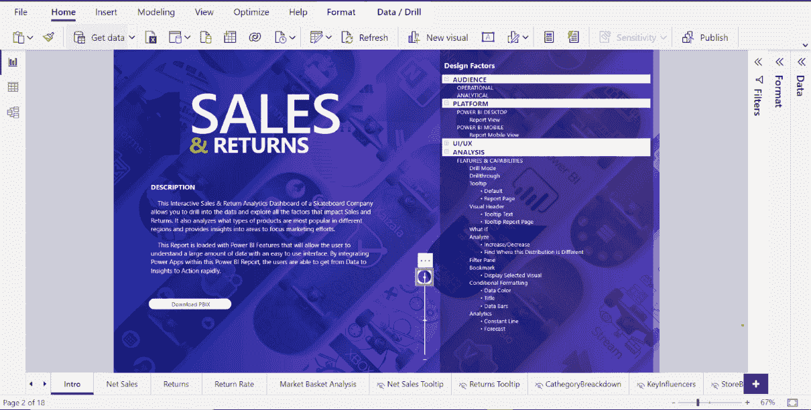
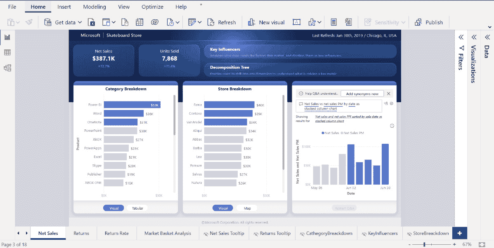
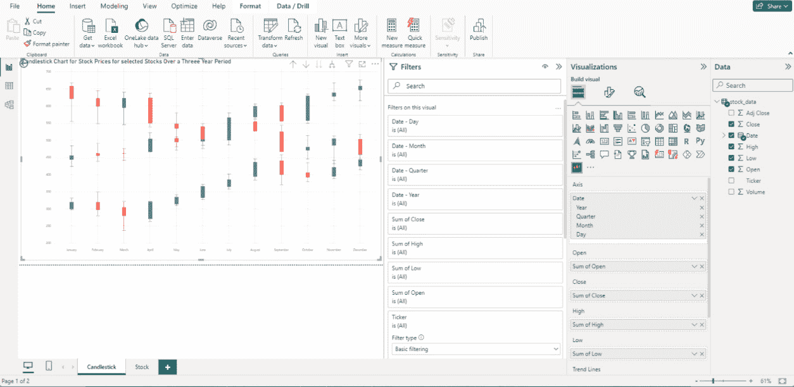
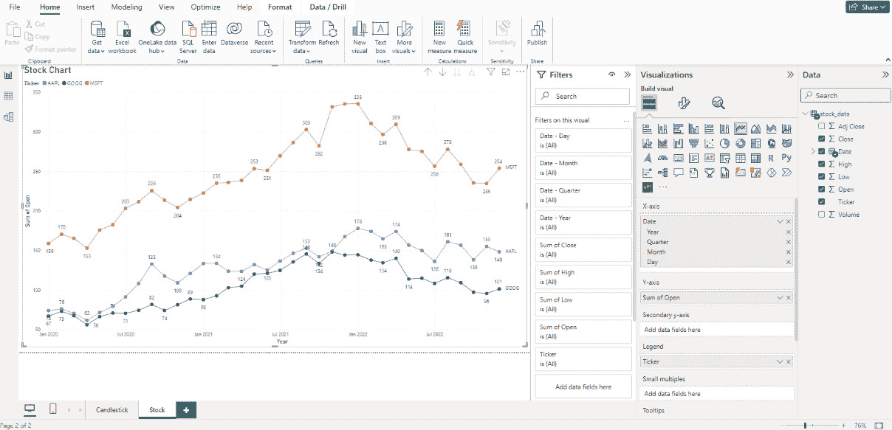
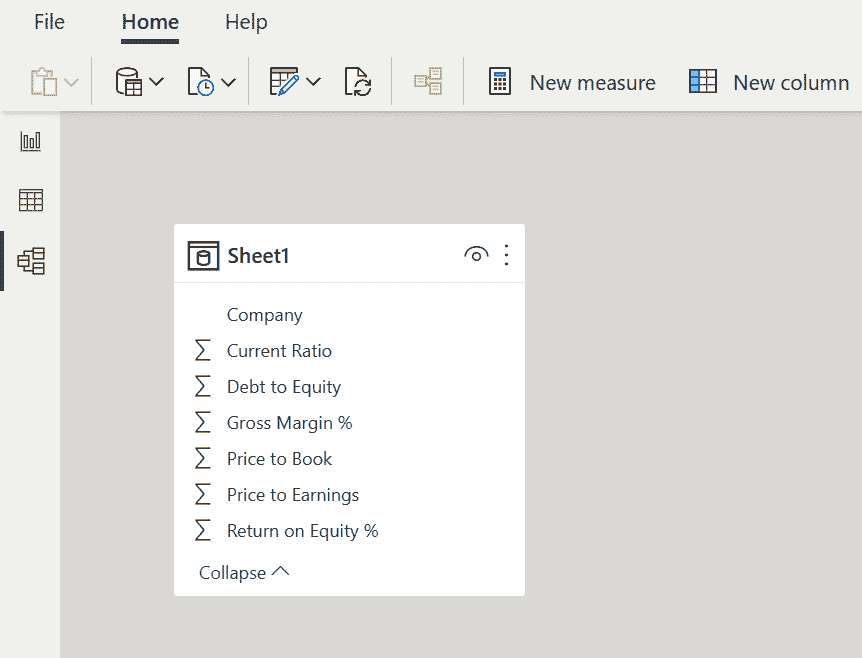
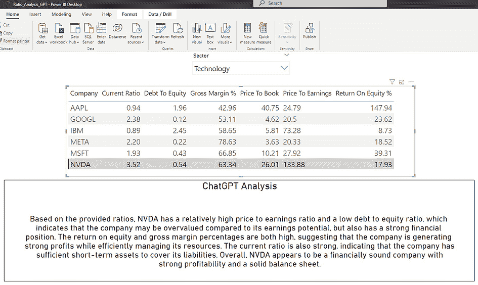

# 第二章：使用 Power BI 和 ChatGPT 创建财务叙事

本章简要概述了微软 Power BI 及其在财务领域的应用。我们还将介绍 Power BI 的一些优点及其在财务中的应用。接着，我们会探讨数据建模在财务分析中的重要性，并提供创建有效财务可视化的技巧。最后，我们将介绍数据建模、可视化和 ChatGPT 集成的最佳实践。

在本章中，我们将涵盖以下主题：

+   Power BI 及其在财务领域应用的简要概述

+   在财务分析中构建数据结构的重要性

+   Power BI 中的可视化技术

+   使用 Power BI 创建财务仪表板

+   数据建模、可视化和 ChatGPT 集成的最佳实践

+   操作案例 – 使用 Power BI 分析财务数据

+   操作案例 – 使用 Power BI 和 ChatGPT 分析财务比率

到本章结束时，您应该能较好地理解微软 Power BI 在财务信息可视化方面的功能，以及如何利用 ChatGPT 和人工智能来增强这些功能，提供强有力的洞察。

# 技术要求

如果您希望跟随本书的示例并进行操作，您需要解决一些技术问题。您将需要以下资源：

+   稳定且速度适中的互联网连接。

+   您的桌面上需要安装新版的微软 Power BI。微软有销售包含 Power BI 的 Office 版本，定价有所不同。

+   在您的桌面上安装 Python 3.5 或更高版本。请下载最新的稳定版本。

+   对 Power BI 可视化有基本了解 – 简单的报告和图表。

+   对 Python 脚本编写和 Python 包的使用有基本了解。

+   Open AI 账户。您还需要了解“API”的含义。

+   对财务有基本了解。您必须熟悉公司资产负债表和损益表，并理解两者之间的区别。

拥有这套知识和工具后，我们有信心您将能理解接下来的章节内容。

# Power BI 及其在财务领域应用的简要概述

本节介绍了 Power BI 及其在金融领域的应用。

Power BI 是微软开发的一款强大的数据分析与可视化工具。近年来，由于其易用性、多功能性以及处理大量数据的能力，Power BI 获得了广泛的关注。

在财务领域，Power BI 可以用于分析和可视化财务数据，为公司财务表现提供更深层次的洞察。财务专业人士可以连接各种数据源，包括电子表格、数据库和基于云的应用程序，以创建动态的可视化报告，并在组织内共享。

Power BI 在财务中的一个关键应用是创建财务仪表板。Power BI 使财务专业人员能够创建交互式仪表板，提供公司财务表现的实时视图。仪表板可以包括**关键绩效指标**（**KPIs**），例如收入、毛利率和运营费用，以及线图、条形图和饼图等可视化内容。这些仪表板为决策者提供了一种快速简便的方式来了解组织的财务状况，并做出明智的决策。

Power BI 的另一个应用是分析财务报表。Power BI 可用于分析财务报表，例如利润表、资产负债表和现金流量表。通过这种方式将财务数据可视化，财务专业人员可以识别趋势和模式，否则可能难以发现。例如，他们可以按部门或位置分析收入和支出，或者识别营运资金随时间的变化。

Power BI 还可以用于预测和预算。财务专业人员可以创建预测模型，根据历史数据预测财务结果，例如收入和支出。这有助于财务专业人员做出更准确的预测并制定更好的预算。通过识别数据中的趋势和模式，他们还可以实时调整预算，从而做出更明智的资源分配决策。

Power BI 对于识别节约成本的机会也非常有用。通过分析 Power BI 中的财务数据，财务专业人员可以识别可以减少或消除成本的领域。例如，他们可以识别供应链中的低效环节或减少过剩库存。通过降低成本，他们可以帮助提高盈利能力并推动业务增长。

最后，Power BI 使财务专业人员能够与其他部门进行协作。通过共享交互式仪表板和报告，团队可以围绕共同目标做出数据驱动的决策，从而推动业务增长。

总的来说，Power BI 是一个对财务专业人员非常有价值的工具，能够帮助他们从复杂的财务数据中获得洞察，并做出推动业务增长的数据驱动决策。通过这种方式可视化和分析财务数据，财务专业人员可以识别趋势、发现机会，并做出有助于组织成功的明智决策。

在下一节中，我们将回顾将 Power BI 与 ChatGPT 洞察结合的好处。

## 将 Power BI 与 ChatGPT 洞察结合的好处

在本节中，我们将回顾将 Power BI 与 ChatGPT 洞察结合的好处。

在财务分析中使用 Power BI 的一个巨大优势是提高了数据的准确性。Power BI 使财务专业人员能够连接各种数据源，并实时分析数据。这意味着数据始终是最新和准确的，从而提高了财务分析的准确性。

Power BI 还提供了一系列可视化选项，帮助财务专业人员以清晰、易于理解的方式展示复杂的财务数据。通过这种方式可视化数据，决策者可以迅速了解趋势、模式以及不同财务指标之间的关系。

此外，Power BI 使团队能够通过共享报告和仪表板进行财务分析合作。这意味着多个利益相关者可以共同参与财务分析，分享见解，并做出更明智的决策。这有助于财务专业人员打破信息孤岛，更有效地与组织的其他部门合作。

由于 Power BI 能够处理大量数据，它非常适合财务分析。随着公司规模的扩大和财务数据的增加，Power BI 可以扩展以满足组织的需求。

它可以成为一个节省时间的工具，因为使用 Power BI，财务专业人员可以快速创建报告和仪表板，从而提供对财务表现的洞察。与传统的财务分析方法相比，例如手动数据输入和电子表格分析，Power BI 更加高效。

Power BI 支持创建互动式仪表板，提供实时的财务表现视图。仪表板可以包括关键绩效指标（KPI）、可视化图表和其他数据，为决策者提供快速简便的方式，了解组织的财务健康状况。通过这种方式可视化财务数据，财务专业人员可以识别出一些难以发现的趋势和模式。例如，他们可以识别出可以减少成本的领域或发现增长机会。通过数据驱动的决策，组织可以更好地围绕共同目标对齐，推动业务成功。

Power BI 可以用于创建预测模型，预测财务结果。通过识别数据中的趋势和模式，财务专业人员可以做出更准确的预测，并制定更好的预算。

Power BI 作为财务分析的成本效益解决方案，它是 Microsoft Power Platform 的一部分，包含 Power Apps 和 Power Automate，并可作为云服务或本地解决方案提供。这意味着组织可以选择最适合其需求和预算的部署选项。

ChatGPT 及其**大语言模型**（**LLM**）扩展了 Power BI 已有的卓越功能。Power BI 和 ChatGPT 之间有多个潜在的协同效应领域。

ChatGPT 的洞察可以用来预测基于历史财务数据的未来趋势和模式。然后，Power BI 可以用来可视化这些洞察，并快速提供更深入的财务表现理解。

利用 ChatGPT 的**自然语言处理**（**NLP**）能力，它提供的洞察可以用来处理非结构化数据，如客户反馈、社交媒体帖子和电子邮件。之后，Power BI 可以用于以一种揭示客户行为和偏好的方式来可视化这些数据。

ChatGPT 的洞察可以用于提供关于客户行为和偏好的见解，从而为财务决策提供支持。之后，Power BI 可以用于以一种易于决策者理解的方式来可视化这些数据。

Power BI 可以用来连接多个数据源，包括 ChatGPT 的洞察。这使得财务专业人员能够将来自多个来源的洞察结合起来，形成财务表现的更全面视图。此外，通过将这些工具结合使用，团队可以共同进行财务分析、共享见解，并做出更有依据的决策。将 ChatGPT 和 Power BI 结合使用的另一个好处是可以自动化许多与财务分析相关的任务。这些任务包括数据准备、数据清洗和报告创建等。通过自动化这些任务，财务专业人员可以将更多时间用于分析和决策。

总体而言，Power BI 与 ChatGPT 洞察的结合为财务专业人员提供了一套强大的工具，可以用来洞察财务表现。通过这种方式可视化和分析财务数据，决策者可以识别趋势、发现机会，并做出有根据的决策，帮助组织取得成功。

在下一节中，我们将讨论在财务分析中数据结构化的重要性。

# 在财务分析中，数据结构化的重要性

在本节中，我们将探讨在进行财务分析时，数据结构化的重要性。

Power BI 提供了几种结构化财务数据的技术，包括数据建模、数据塑形和数据转换：

+   **数据建模**：如前所述，数据建模是创建数据模型或模式的过程，定义不同数据点之间的关系。在 Power BI 中，数据建模涉及使用 Power Pivot 数据建模引擎创建模型。这使得财务专业人员能够定义表之间的关系，创建计算列和度量值，并建立层次结构。一个设计良好的数据模型可以使财务数据分析更加容易，从而获得洞察。数据建模是财务分析的一个关键方面，它使财务专业人员能够将原始数据转化为有用的洞察，以支持财务决策。

+   **数据整形**：数据整形是通过过滤、排序和聚合数据，使其更适合分析的过程。在 Power BI 中，数据整形是通过 Power Query 编辑器来完成的，该编辑器提供了一个图形界面用于整形数据，包括过滤数据、删除列和合并表格。通过整形数据，财务专业人士可以去除无关数据，专注于对分析最相关的数据。

+   **数据转换**：数据转换是将数据从一种形式转换为另一种形式的过程。在 Power BI 中，可以使用 Power Query 编辑器完成数据转换，它提供了广泛的转换选项，包括拆分列、合并表格和数据透视。通过数据转换，财务专业人士可以创建以前无法实现的新洞察和可视化。

+   `DATESYTD`、`TOTALYTD` 和 `SAMEPERIODLASTYEAR`。时间智能可以用来分析趋势、识别季节性变化，并预测未来的表现。

+   **自定义可视化**：Power BI 提供了广泛的自定义可视化选项，可以用来创建更具吸引力和信息量的可视化。自定义可视化包括图表、仪表盘、地图，以及更专业的可视化，如子弹图和甘特图。通过使用自定义可视化，财务专业人士可以创建量身定制的可视化，以满足其特定需求和要求。

因此，Power BI 提供了一系列用于构建财务数据结构的技术，包括数据建模、数据整形和数据转换。这些技术可以用来创建一个设计良好的数据模型，去除不相关的数据，分析趋势变化，并创建更具吸引力和信息量的可视化。通过使用这些技术，财务专业人士可以更全面地理解财务表现，并做出更明智的决策。

为了有效地使用 Power BI 进行财务分析，了解如何连接数据源并创建表之间的关系至关重要。这个过程使用户能够创建强大的报告和可视化，提供有关财务表现的宝贵洞察。

使用 Power BI 进行财务分析的第一步是连接到包含财务数据的数据源。在 Power BI 中连接数据源时，有几种选择可供选择，包括导入数据、直接连接到数据库或使用自定义数据连接器。Power BI 可以连接大量的数据源，包括 Excel 文件、CSV 文件、SQL 数据库以及基于云的数据源，如 Azure 和 Salesforce。一旦连接了数据源，下一步就是将数据导入 Power BI。

## 将数据导入 Power BI

将数据导入 Power BI 是一个简单的过程。用户可以选择要导入的表，然后点击**加载**按钮。Power BI 会导入数据并为每个数据源创建一个表。数据导入完成后，下一步是创建表之间的关系。

在 Power BI 中创建表之间的关系是进行财务分析的重要步骤。关系使用户能够创建报告和可视化，展示不同数据集之间的关系。要创建表之间的关系，用户需要理解关系键的概念。

关系键是用于将两个表连接在一起的唯一标识符。例如，如果我们正在分析销售数据和库存数据，我们可能会使用产品 ID 作为关系键。产品 ID 是分配给每个产品的唯一标识符，可以用来将销售表和库存表连接在一起。

Power BI 提供了多种工具来建立关系，包括图表视图，它提供了数据模型和关系的可视化表示。在此视图中，可以通过拖放表来创建关系，并可以选择字段作为建立关系的键。

在 Power BI 中创建两个表之间的关系，用户需要从**主页**选项卡中选择**管理关系**选项。然后，他们可以选择要关联的表，并选择用作关系键的列。一旦关系创建完成，用户就可以使用它来创建强大的报告和可视化，展示不同数据集之间的关系。

除了图表视图，Power BI 还提供了关系视图，允许更高级地管理关系。在此视图中，用户可以定义关系属性，如基数和交叉筛选，以确保关系被正确地定义并按预期功能运行。

让我们通过一个示例来了解如何在 Power BI 中创建表之间的关系。假设我们正在分析一家零售公司的财务表现，并且我们有来自两个来源的数据：销售数据和库存数据。销售数据位于一个 Excel 文件中，而库存数据位于 SQL 数据库中。我们希望创建一个报告，展示销售与库存水平之间的关系。

在这种情况下，我们将首先在 Power BI 中连接到 Excel 文件和 SQL 数据库。然后，我们将销售数据和库存数据导入到 Power BI 中。数据导入完成后，我们可以通过选择**管理关系**选项，并选择产品 ID 列作为关系键，来创建销售表和库存表之间的关系。

一旦建立了关系，我们可以创建一个报告，显示销售和库存水平之间的关系。例如，我们可以创建一个报告，显示按产品类别划分的销售数据，并用一个可视化图表展示每个类别的库存水平。然后，我们可以利用销售表和库存表之间的关系，展示库存水平的变化如何影响销售。

总之，连接数据源并在表格之间创建关系是使用 Power BI 进行财务分析的关键步骤。通过连接数据源并建立关系，财务专业人员可以创建强大的报告和可视化，提供有关财务表现的宝贵洞察。通过使用 Power BI 数据建模引擎，财务人员可以轻松创建表格之间的关系并分析复杂的财务数据。

这引导我们进入下一部分，我们将在这里探讨 Power BI 中的可视化技巧。

# Power BI 中的可视化技巧

正如我们之前提到的，Power BI 提供了广泛的可视化技巧，帮助用户有效传达数据洞察。这些包括标准图表，如柱状图、折线图和散点图，还有更高级的可视化图表，如热图、树形图和仪表盘。Power BI 还允许使用 JavaScript 或 R 创建自定义可视化。此外，Power BI 还提供交互选项，如下钻和筛选，帮助用户探索数据并获得更深入的洞察。总体而言，Power BI 的可视化能力使得数据驱动的洞察能够清晰、有影响力地传达。

## 选择适合财务数据的可视化

选择合适的可视化是创建有效财务仪表板和报告的重要方面。以下是选择财务数据可视化时需要考虑的五个要点：

+   **确定可视化的目的**：你希望用数据讲述什么故事？是比较数值、展示随时间变化的趋势，还是展示比例？可视化的目的将决定最适合的图表或图形类型。

+   **考虑数据的性质**：被可视化的数据类型也很重要。例如，堆叠柱状图可能适合用来比较不同产品线的收入，但不适合展示多年的收入增长时间序列。

+   **专注于简洁性**：尽管使用复杂的可视化来展示数据分析技巧可能很有吸引力，但简洁往往更为有效。选择易于理解且能传达预期信息的可视化。

+   **有效使用颜色**：颜色在财务数据可视化中可以是一个强有力的工具，但如果使用不当，也可能会令人不知所措。应谨慎并有意地使用颜色，吸引注意关键数据点或突出趋势。

+   **利用交互性**：Power BI 允许进行交互操作，如钻取和过滤，这对于财务数据尤其有用。考虑用户如何与数据进行互动，并提供适当的选项。

下面是一些常见财务数据可视化的列表：

+   **条形图**：用于比较各类别之间的数值

+   **折线图**：用于展示随时间变化的趋势

+   **饼图**：用于显示比例或百分比

+   **面积图**：类似折线图，但通过阴影区域表示数值的大小

+   **热图**：用于以可视化格式显示大量数据，颜色编码表示数值的大小

最终，合适的可视化形式将取决于所分析的具体财务数据以及你希望用这些数据讲述的故事。通过考虑可视化的目的、数据的性质以及简洁性和交互性等因素，你可以在 Power BI 中创建具有影响力和信息量的财务仪表板和报告。

## 创建有效财务可视化的建议

以下是使用 Power BI 创建有效财务可视化的一些建议：

+   **了解你的受众**：在创建任何可视化之前，了解你的受众是谁，以及他们需要什么信息是非常重要的。考虑他们可能会有什么问题，以及他们正在寻找什么样的洞察。

+   **保持简洁**：避免在可视化中加入不必要的信息。集中展示能够提供最有价值洞察的关键数据点。

+   **选择合适的图表类型**：不同的图表类型适用于不同类型的数据。选择合适的图表类型非常重要，以便有效传达数据。例如，折线图适合展示随时间变化的趋势，而条形图更适合比较不同类别的数据。

+   **利用颜色**：颜色可以是可视化中的一种强大工具，用于突出关键数据点或趋势。然而，重要的是要有效使用颜色，不要过度使用，因为过多的颜色可能会让人感到困惑。

+   **使用数据标签**：数据标签可以为可视化提供额外的上下文和清晰度。使用它们来突出重要的数据点或提供更多信息。

+   **提供背景信息**：可视化应该为展示的数据提供背景信息。这可以通过使用坐标轴标签、标题和注释来实现。

+   **考虑交互性**：Power BI 提供了一系列交互功能，如钻取和过滤。考虑如何利用这些功能深入挖掘数据，提供更深的洞察。

+   **利用品牌化**：品牌化可以使可视化看起来更加专业和一致。使用公司颜色、标志和字体来帮助将可视化与整体品牌紧密结合。

+   **测试和迭代**：可视化应进行测试和迭代，以确保它们有效地传达所需的见解。向利益相关者征求反馈并根据需要进行调整。

+   **保持更新**：可视化应定期更新，以确保它们反映最当前的数据和见解。

通过遵循这些提示，你可以使用 Power BI 创建有效且具有影响力的财务可视化，向你的受众提供有价值的见解。

让我们看一个如何使用 Power BI 分析公司产品销售数据的例子，使用前面章节中详细的信息。假设你正在分析公司的产品销售数据。你已经从多个来源拉取数据，使用 Power BI 的数据建模功能清理并转换了这些数据，现在你想创建一个可视化，以帮助你更好地理解这些数据。

你决定创建一个条形图来比较每个产品的销售表现。你选择根据产品类别为条形图着色，以帮助区分它们。你还为每个条形添加数据标签，以显示每个产品的具体销售额。

为了提供上下文，你添加了销售额和产品名称的轴标签。你还为图表添加了一个标题，以清晰地表示其所代表的内容。

当你查看图表时，你注意到一个产品类别的表现远远超过其他类别。为了进一步调查，你使用 Power BI 的交互式功能深入查看该类别的数据，并发现某个特定产品占据了大部分的销售额。

通过创建这种可视化，你能够快速识别哪些产品表现良好，哪些需要改进，并轻松深入数据以获得更深入的见解。

这只是 Power BI 如何用于创建有效的财务可视化、提供有价值见解的一个示例。

在本节中，我们学习了 Power BI 中的可视化技巧，以及这些可视化如何提供图形化且易于理解的财务数据视图。在下一节中，我们将进一步讨论使用 Power BI 创建财务仪表板的过程。

# 使用 Power BI 创建财务仪表板

在 Power BI 中规划和设计财务仪表板涉及一些关键步骤，以确保仪表板满足用户的需求。

第一步是确定仪表板的目的以及应包括哪些关键指标和 KPI。这将取决于组织或业务单位的具体需求。

第二步是收集必要的数据，并以适合仪表板的方式组织数据。这可能涉及连接多个数据源，并将数据转换为适合分析的格式。

一旦数据整理完成，下一步是选择合适的可视化方式来展示数据。这涉及到考虑展示的数据类型，并选择既具视觉吸引力又容易理解的可视化方式。

下一步是设计仪表盘的布局。这包括确定哪些可视化元素应该放置在哪个位置，以及如何安排这些元素，以创建一个既有效又具有视觉吸引力的仪表盘。

为了使仪表盘成为自助式可视化工具，有必要使仪表盘更加互动和用户友好。可以考虑加入如钻取、筛选器和切片器等交互元素。这些元素让用户能够更详细地探索数据，并根据自己的特定需求定制仪表盘。

一旦仪表盘设计完成，重要的是要对其进行彻底的测试，并根据需要进行调整。这可能包括收集用户反馈，并对布局、可视化元素以及交互元素进行调整，以确保仪表盘能够满足用户的需求。

在规划和设计 Power BI 中的财务仪表盘时，必须始终牢记最终用户，并根据他们的特定需求设计仪表盘。通过遵循这些关键步骤，可以创建一个有效且具有视觉吸引力的仪表盘，为用户提供必要的洞察，帮助他们做出明智的决策。

在接下来的部分中，我们将重点讨论如何使用 Power BI 布局财务信息，以实现视觉上的清晰性。

## 在 Power BI 中安排财务可视化元素以提升清晰度

在 Power BI 中设计财务仪表盘时，合理安排可视化元素以保证清晰度至关重要，这有助于有效地将洞察传达给用户。以下是一些安排财务可视化元素以提升清晰度的关键考虑事项：

+   **将相关的可视化元素分组**：将相关的可视化元素分组有助于用户理解财务分析中不同元素之间的关系。例如，可以将与收入和支出相关的可视化元素并排放置，或将展示同一财务指标不同方面的可视化元素分组。这样的分组能够让用户轻松地进行数据比较与分析。

+   **优先展示重要的可视化内容**：将最关键的可视化元素突出显示在仪表盘的布局中。重要的指标或关键绩效指标（KPI）应该以一种能够立即吸引用户注意的方式进行布置。可以考虑将这些可视化元素放置在仪表盘的顶部或中心，以确保它们易于看到和访问。

+   **使用简洁明了的标题**：为每个可视化元素提供清晰简洁的标题，传达其目的和背景。标题应有效地描述所展示的数据，使用户能够快速理解显示的信息。使用与财务分析总体目标一致的描述性标题。

+   **对齐视觉元素以保持一致性**：在仪表盘中对齐视觉元素，以创造一致性和秩序感。沿着公共轴线或网格对齐视觉元素有助于创建一个视觉上令人愉悦且组织良好的布局。考虑对齐诸如图例、数据标签和轴标题等视觉元素，以获得更加统一的外观。

+   **利用空白空间**：不要让仪表盘过于拥挤，避免视觉元素和信息过多。通过在视觉元素之间加入足够的空白空间，来提高可读性并避免视觉杂乱。空白空间帮助用户聚焦于重要信息而不会感到不堪重负，同时还提升了仪表盘的整体美感。

+   **提供清晰的数据标签**：数据标签在传递准确信息中起着至关重要的作用。确保数据标签清晰可见并正确定位，避免产生任何混淆。使用合适的格式选项，如字体大小和颜色，使标签更加突出并提高可读性。

+   **考虑信息流动**：按逻辑顺序排列视觉元素，引导用户浏览故事或分析。考虑信息的自然流动，从上到下或从左到右，确保用户能够轻松跟随财务分析的叙事结构。

+   **包含相关的工具提示**：工具提示可以为视觉中的特定数据点提供额外的细节或背景信息。通过加入有信息的工具提示，你可以让用户在不让主要视觉元素过于复杂的情况下，探索数据的细节。

通过遵循这些指南并在 Power BI 中安排财务可视化的清晰度，你可以创建有效传达洞察、支持高效数据分析并提供用户友好体验的仪表盘。记住要不断迭代并向用户征求反馈，以持续改进财务可视化的清晰度和有效性。

现在我们对数据建模和使用 Power BI 有了一些了解，我们可以开始学习如何使用 Power BI 共享可视化和洞察。

在接下来的部分，我们将提供一个示例，整合我们在前面讨论的内容。我们将以微软 Learn 网站中的一个例子为例，涉及一个滑板公司与销售和退货相关的财务数据。

## 示例 – 财务数据的 Power BI 仪表盘

以下是一个交互式 Power BI 仪表盘的示例。这个示例可以从微软网站下载作为示例。它名为**销售与退货** **示例 v201912**。

你可以从 Microsoft Learn 网站下载销售与退货样本 Power BI 报告（一个`.pbix`文件）（*获取 Power BI 样本 – Power BI* | *Microsoft Learn*: [`learn.microsoft.com/en-us/power-bi/create-reports/sample-datasets`](https://learn.microsoft.com/en-us/power-bi/create-reports/sample-datasets)）。你可以在数据故事库中查看它，在 Power BI Desktop 中打开并探索，或者上传到 Power BI 服务。以下是一些更多的资源：

+   *Power BI 的商店销售样本：导览 – Power BI* | Microsoft Learn: [`learn.microsoft.com/en-us/power-bi/create-reports/sample-store-sales`](https://learn.microsoft.com/en-us/power-bi/create-reports/sample-store-sales)

+   *Power BI 的销售与营销样本：导览*： [`learn.microsoft.com/en-us/power-bi/create-reports/sample-sales-and-marketing`](https://learn.microsoft.com/en-us/power-bi/create-reports/sample-sales-and-marketing)

+   *新销售与退货样本报告导览* | *微软*: [`powerbi.microsoft.com/en-us/blog/take_a_tour_of_the_new_sales_returns_sample_report/`](https://powerbi.microsoft.com/en-us/blog/take_a_tour_of_the_new_sales_returns_sample_report/)

这款滑板公司的仪表盘允许你深入分析数据，探索影响销售和退货的各类因素。它还分析了不同地区哪些类型的产品最受欢迎，并提供了有助于聚焦营销工作的洞察。

本报告加载了 Power BI 的众多功能，用户可以通过易于使用的界面理解大量数据。通过将 Power Apps 集成到这个 Power BI 报告中，用户可以快速从数据到洞察，再到行动：



图 2.1 – 滑板公司销售与退货仪表盘

以下图示展示了该公司的销售与退货仪表盘：



图 2.2 – 显示净销售额和销售单位的滑板公司销售与退货仪表盘

最好将此样本下载到你的 Power BI 桌面，并浏览其互动功能——利用 Power BI 所提供的众多功能。如本节开始时所述，你可以从[`learn.microsoft.com/en-us/power-bi/create-reports/sample-datasets`](https://learn.microsoft.com/en-us/power-bi/create-reports/sample-datasets)下载此示例。

在这一部分，我们学习了如何使用来自 Microsoft Learn 的样本资源，运用可用的可视化技术和工具创建 Power BI 仪表盘。在财务分析中使用 Power BI 时，有一些最佳实践值得遵循。我们将在下一部分详细讨论。

# 数据建模、可视化和 ChatGPT 集成的最佳实践

高效的数据建模、可视化和 ChatGPT 集成是利用 Power BI 进行增强财务分析的关键要素。本节探讨了确保数据建模干净且结构良好、选择适当的可视化以有效沟通以及利用 ChatGPT 的见解来增强财务分析的最佳实践。

## 确保数据建模干净且结构良好

+   **从数据清理开始**。在 Power BI 中建模财务数据之前，确保数据干净且没有错误、不一致和重复。这包括删除无关或不完整的记录、处理缺失值和标准化数据格式。

+   这里有一个你可以如何操作的示例：

+   **导入数据**：将你的财务数据导入 Power BI。这些数据可以来自 CSV 文件、数据库或其他任何来源。

+   **识别无关记录**：检查数据并识别出与分析无关的记录。例如，如果你正在分析销售数据，可能需要删除与内部交易相关的记录。

+   **删除重复项**：检查数据中是否有重复记录并将其删除。Power BI 提供了一个**删除重复项**功能，你可以用它来处理此问题。

+   **处理缺失值**：识别数据中任何缺失的值。根据数据的性质和分析的目的，你可以选择用默认值填充缺失值、在现有值之间进行插值，或者完全排除缺失值的记录。

+   **标准化数据格式**：确保所有数据都采用一致的格式。例如，日期应该使用相同的格式（DD-MM-YYYY、MM-DD-YYYY 等），货币值应具有相同的小数位数。

+   **检查不一致性**：最后，检查数据中是否有任何不一致的地方。例如，如果你有一列是“销售区域”，另一列是“销售代表”，请确保每个代表都与正确的区域匹配。

+   **建立关系**：根据客户 ID、产品 ID 或交易 ID 等关键字段，在表格之间建立适当的关系。这可以实现跨不同维度的财务数据无缝导航和分析。以下是你可能在 Power BI 中建立表格关系的示例：

+   **导入表格**：将你的财务数据表导入 Power BI。这些数据可以是销售数据、客户数据、产品数据等等。

+   `客户 ID`，`产品 ID` 或 `交易 ID`

+   **创建关系**：在 Power BI Desktop 中，进入**模型**视图。在这里，你可以看到所有的表格和字段。要创建关系，只需点击并拖动一个表格中的关键字段到另一个表格中的相应字段。一个连接线将出现在这两个表格之间，表示关系已经建立。

+   **设置关系属性**：创建关系后，你可以设置其属性。例如，你可以指定关系的类型（如一对一、一对多等）和交叉筛选方向。

+   **测试模型**：设置完关系后，通过创建一些可视化来测试你的模型。你应该能够无缝地分析不同表格之间的数据。

例如，如果你有一个 `Sales` 表，包含 `Transaction ID`、`Product ID` 和 `Sales Amount`，以及一个 `Product` 表，包含 `Product ID`、`Product Name` 和 `Product Category`，你可以基于 `Product ID` 字段建立关系。这将使你能够按产品名称或类别分析销售数据。

+   **实施数据验证**。应用数据验证规则以确保数据的完整性和准确性。根据预定义的业务规则验证数据，检测异常值，并标记潜在错误以供进一步调查。以下是如何在 Power BI 中实施数据验证：

+   **定义业务规则**：定义数据必须遵循的业务规则。例如，销售额必须为正，客户 ID 必须唯一等。

+   **创建验证度量**：在 Power BI 中创建度量，以验证数据是否符合这些规则。例如，你可以创建一个度量，统计负销售额或重复客户 ID 的数量。

+   使用 `STDEV.P` 函数计算数据集的标准差，并标记任何偏离均值超过三个标准差的值。

+   `ERROR` 如果销售额为负或客户 ID 重复。

+   **调查错误**：使用 Power BI 的数据探索功能，调查验证度量标记的潜在错误。这可能涉及筛选或深入分析数据，以确定错误的原因。

+   **实施计算列和度量**。利用计算列和度量执行必要的计算、汇总和财务指标。这有助于得出有意义的洞察，并简化在 Power BI 中的分析。以下是如何在 Power BI 中实施计算列和度量的示例：

+   每个交易的 `Quantity Sold` 和 `Price Per Unit`。你可以创建一个名为 `Total Sales` 的计算列，使用 *Total Sales = [Quantity Sold] * [Price Per Unit]* 公式。这将计算每个交易的总销售额。

+   **度量**：现在，如果你想计算所有交易的总销售额，你可以创建一个度量，例如 *Total Sales = SUM(‘Sales’[Total Sales])*。这个度量将根据报告当前的筛选上下文动态计算总销售额。

## 选择合适的可视化方式以实现有效的沟通

+   **理解数据特征**。深入理解财务数据的特征，例如趋势、对比、分布和相关性。这样的理解将帮助你选择合适的可视化方式。

+   **使用简洁明了的可视化图表**。避免财务可视化中的杂乱和复杂性。选择干净且直观的可视化方式，有效地传达预期信息，而不会让观众感到困惑。

**利用** **关键可视化图表**：

+   **折线图**：使用折线图描绘随时间变化的趋势，例如收入增长或支出波动。

+   **条形图**：利用条形图比较财务数据，例如不同产品或地区的销售表现。

+   **饼图**：使用饼图展示比例，例如费用组成或收入来源。

+   **表格**：使用表格呈现详细的财务数据，例如交易信息或财务报表。

## 利用 ChatGPT 的见解提升财务分析

+   **上下文对话**：将 ChatGPT 集成到 Power BI 中，使用户能够进行互动式对话并获取与财务数据相关的见解。上下文对话为查询财务信息并获得额外见解提供了自然语言界面。

+   **解读用户查询**：开发能够理解和解读与财务分析相关的用户查询的 ChatGPT 模型。训练模型识别常见的财务术语、指标和背景，从而提供准确的响应。

+   **生成可操作的见解**：利用 ChatGPT 基于用户查询生成有价值的回应。模型可以提供建议、预测或解释，从而增强财务数据的理解和分析。

+   **持续改进**：收集用户反馈并迭代 ChatGPT 的集成，提升生成见解的质量。完善模型的训练数据，结合用户建议，并根据财务分析的不断发展需求更新响应。

## 确保数据安全和隐私

+   **数据匿名化**：通过匿名化敏感财务数据来优先考虑数据隐私和机密性。确保**个人可识别信息**（**PII**）或敏感财务细节被遮蔽或加密，以保护用户隐私。

+   **访问控制**：在 Power BI 中实施强大的访问控制机制，根据用户角色和职责限制数据访问。确保只有授权人员才能访问和操作敏感的财务信息。

总结来说，通过遵循数据建模、可视化和 ChatGPT 集成的最佳实践，金融分析师可以充分发挥 Power BI 的潜力，从而提升财务分析效果。清晰且结构化良好的数据建模能够提供准确的洞察，而选择合适的可视化图表有助于高效沟通。集成 ChatGPT 则为财务分析带来了自然语言理解的强大功能，使得互动式对话成为可能，并能生成有价值的见解。拥抱这些最佳实践能够赋予金融专业人士做出明智决策、揭示隐藏模式、推动更好商业成果的能力。下一节将演示如何在财务分析中使用 Power BI。

# 操作案例演示 – 使用 Power BI 分析财务数据

在投资领域，理解不仅是公司本身的表现，还要了解它相对于同行的表现，这一点至关重要。这正是我们 Power BI 可视化的作用所在。让我们演示如何提取一个数据集，并创建一个 Power BI 可视化图表，用来比较苹果与其在科技行业的主要竞争对手。

我们将利用现有的财务数据，并将其转化为可视化叙事，帮助您一目了然地了解苹果如何与其竞争对手进行对比。我们将研究苹果、谷歌和微软的历史股票数据，并使用这些数据创建 Power BI 可视化图表，使数据生动呈现。

在接下来的步骤中，我们将展示如何在 Python 中安装必要的包，拉取不同位置的数据，提取相关信息，并构建 Power BI 仪表板。

1.  **步骤 1 – 安装必要的** **Python 库**

    在此步骤中，我们必须设置必要的 Python 库：

提示

Python 中的库是提供特定功能的模块集合，使得编程任务变得更简单。我们将使用`pandas`进行数据处理和分析，`yfinance`来下载 Yahoo! Finance 数据，`requests`用于发送 HTTP 请求，`BeautifulSoup`用于从 HTML 和 XML 文件中提取数据。通过安装这些库，我们可以为后续的数据提取和分析任务准备 Python 环境。

```py
pip install pandas
yfinance library is a convenient tool that allows you to access Yahoo! Finance’s historical stock price data. You can use the following code to download the data:

```

import yfinance as yf

import pandas as pd

# 定义股票代码

tickers = ['AAPL', 'GOOG', 'MSFT']

# 定义开始和结束日期

start_date = '2020-01-01'

end_date = '2022-12-31'

# 创建一个空的 DataFrame 来存储数据

data = pd.DataFrame()

# 下载数据

for ticker in tickers:

df = yf.download(ticker, start=start_date, end=end_date, interval='1mo')

df['Ticker'] = ticker  # 添加一列股票代码

data = pd.concat([data, df])

# 重置索引

data.reset_index(inplace=True)

# 将数据保存为 CSV 文件

data.to_csv('stock_data.csv', index=False)

```py

 Here’s a step-by-step breakdown:

*   `yfinance` for downloading stock data from Yahoo! Finance and `pandas` for data manipulation.
*   `AAPL` for Apple, `GOOG` for Google, and `MSFT` for Microsoft.
*   `2020-01-01` and `2022-12-31`, respectively.
*   `pandas` DataFrame is created to store the downloaded data.
*   `yf.download()` function, adds a new column to the downloaded data to store the ticker symbol, and appends this data to the main DataFrame.
*   `reset_index()` function. This is done because when new DataFrames are concatenated, `pandas` keeps the original indices. Resetting the index ensures that we have a continuous index in the final DataFrame.
*   `stock_data.csv` using the `to_csv()` function. The `index=False` argument is used to prevent `pandas` from saving the index as a separate column in the CSV file.

Now, we will take this data and create visualizations with Power BI.
With the stock data you have, you can create several types of charts in Power BI. Here are a few examples:

*   **Candlestick chart**: This chart is used to show price movement for the securities in the stock market. It contains information about the open, high, low, and closing prices of stock.
*   **Stock chart**: A stock chart in a Power BI paginated report is specifically designed for financial or scientific data that uses up to four values per data point. These values align with the high, low, open, and close values that are used to plot financial stock data.

The following are some other custom visualizations available in Power BI:

*   Mekko charts
*   Hexbin scatterplot
*   Word cloud
*   Pulse charts
*   Interactive chord diagrams

To create a candlestick chart in Power BI, follow these steps:

1.  Open Power BI and connect to your dataset.
2.  Select the candlestick chart visualization from the **Visualizations** pane.
3.  Drag and drop the required fields onto the chart, such as date, high, low, open, and close prices.
4.  The chart will automatically generate based on the data you have selected.

Tip
You might need to download the candlestick visualization from the web. Click on the ellipsis in the `candlestick`; it should show up as a free add-on. Please select it and add it to the **Visualizations** pane.
Remember, the candlestick chart is a powerful tool that can help you understand market trends and identify potential opportunities:


Figure 2.3 – Illustration of a candlestick chart from stock data
To create a stock chart in Power BI using the data you’ve downloaded from `yfinance`, you can follow these steps:

1.  `stock_data.csv`). You can do this by clicking on **Home** > **External Data** > **Get Data** > **Text/CSV**.
2.  **Create a new chart**: Click on the **Report** view (the bar chart icon on the left), and then click on the line chart icon in the **Visualizations** pane.
3.  **Add data to the chart**: In the **Fields** pane, drag and drop the required fields onto the chart. For a basic stock chart, you would typically use the following values:
    *   **Date** for the axis
    *   **Open**, **High**, **Low**, and **Close** as values
    *   **Ticker** for the legend (optional)
4.  **Customize the chart**: You can further customize your chart by clicking on the paint roller icon in the **Visualizations** pane. Here, you can change things such as colors, add a title, modify axis settings, and more.
5.  **Save your report**: Once you’re happy with your chart, don’t forget to save your report by clicking on **File** > **Save**.

Remember, these are just basic steps to create a simple line chart for stock data. Power BI offers many other types of charts and advanced features that you can explore to create more complex and insightful visualizations:


Figure 2.4 – Illustration of a stock chart in Power BI using the stock data
Tip
Remember to format and label your charts clearly to make them easy to understand. You can also add filters to allow viewers to drill down into specific periods or companies.
Finally, you can ask ChatGPT for insights and interpretations based on the visualizations you’ve created. For example, you might ask why there was a spike in patent filings in a particular year, or how a company’s R&D spending compares to its competitors.
In the next section, we’ll look at a different walkthrough, this time incorporating ChatGPT insights with Power BI.
Walk-through use case – analyzing financial ratios using Power BI and ChatGPT
The following is an example that you can try to emulate. It is a simple illustration of how you can integrate Power BI and ChatGPT. (Note: this example is courtesy of Amer Mahmood, who posted this article on medium.com).
In this example, we will create a report in Power BI and feed the data to ChatGPT, asking for insights. Some steps need to be completed before we start:

1.  Install Python and enable Python in Power BI:
    1.  First, install Python, if you have not done so already. Please visit the official website ([`www.python.org/downloads/`](https://www.python.org/downloads/)) to download it. We recommend versions 3.9 and 3.10.
    2.  Once Python has been installed, enable Python scripting in Power BI. To do so, open Power BI Desktop. Then, click **File** > **Options** and go to **Settings** > **Options** > **Python scripting**. Select the checkbox and click **OK**.
    3.  Next, set the Python path in Power BI. Go to **File** > **Options** and then to **Settings** > **Options** > **Python scripting**. Here, click **Detect**. This selects the Python installation path automatically. You can also do this manually by clicking on the ellipsis (**…**) and selecting the Python executable file.
    4.  Restart Power BI Desktop for the changes you made to take effect.
2.  Follow these steps to set up ChatGPT using the ChatGPT API:
    1.  First, you will need to obtain an API key from Open AI. Navigate to the Open AI website ([`openai.com`](https://openai.com)) and create a (personal) account.
    2.  Next, ask for and get an API key. You will use this in all your integration projects.

Tip
These API keys are not free. When you sign up with Open AI, you get about $18 worth of tokens for use with your API Key. After that, you are billed (pay-as-you-go). The details are available on the Open AI site under **Pricing** ([`openai.com/pricing`](https://openai.com/pricing)).

1.  The ChatGPT API has SDKs and libraries available in several programming languages. Select **Python**. We will use Python extensively in this book and recommend it.
2.  Install the SDK with a package manager such as `pip`:

    ```

    pip install openai

    ```py

1.  Now, we need to create a dataset to analyze. Follow these steps:
    1.  Use Excel to create a sample dataset similar to the following. Name it `Tech Stocks`:

  **Current Ratio**
 |
  **Debt** **to Equity**
 |
  **Gross** **Margin %**
 |
  **Price** **to Book**
 |
  **Price** **to Earnings**
 |
  **Return on** **Equity %**
 |

  0.94
 |
  1.96
 |
  42.96
 |
  40.75
 |
  24.79
 |
  147.94
 |

  2.38
 |
  0.12
 |
  53.11
 |
  4.63
 |
  20.5
 |
  23.62
 |

  0.89
 |
  2.45
 |
  58.65
 |
  5.81
 |
  73.28
 |
  8.73
 |

  2.2
 |
  0.22
 |
  78.63
 |
  3.63
 |
  20.33
 |
  18.52
 |

  1.93
 |
  0.43
 |
  66.85
 |
  10.21
 |
  27.92
 |
  39.31
 |

  3.52
 |
  0.54
 |
  63.34
 |
  26.01
 |
  133.88
 |
  17.93
 |

1.  Create a simple report in Power BI Desktop by connecting this dataset to Power BI.  Go to the **Modeling** tab via the left column. This is what should appear:



Figure 2.5 – A view of the Modeling tab in Power BI

1.  Select the third icon from the left in the ribbon to **Transform** the data.
2.  Add **Run Python script** to the **Applied** **Steps** section.
3.  Now, we can put the code in the next section directly into Power BI and run it.

1.  Now, we must call the ChatGPT API from Power BI. Here, we will integrate ChatGPT with Power BI using the Power Query Editor in Power BI and writing an executable Python code. The code is as follows:
    1.  To start, import the necessary Python libraries:

        ```

        # 'dataset' 保存此脚本的输入数据

        # 导入库

        import openai

        import os

        ```py

    2.  Next, add your Open AI key to the code:

        ```

        # 从 Windows 环境获取 Open AI API

        openai.api_key = "Your Open AI API Key"

        ```py

    3.  To pass data to the API, loop through each row of the dataset and create a single string:

        ```

        # 遍历数据集中的每一行，将数据连接成一个字符串。将结果字符串传递给 API

        for index,row in dataset.iterrows():

        messages="我将按照以下顺序提供一组公司信息：公司、价格盈利比、价格账面比、股本回报率%、债务权益比、流动比率、毛利率%，分析每个公司比例，按公司名称引用，并写出简明的回复"

        message = ''.join ([str(col) for col in row])

        ```py

    4.  Now, build the API request so tha–t it includes the row-level data and makes a chat completion request for the API. Once we’ve done this, we can process the response and write it back to the report:

        ```

        #构建 API 请求以包含源数据的行级数据

        messages += " " + str(message)

        #为 API 创建聊天完成请求

        chat = openai.ChatCompletion.create(

        model = "gpt-3.5-turbo",

        messages = [{"role":"user","content":messages}],

        temperature = 0.9,

        max_tokens = 500,

        top_p = 1,

        frequency_penalty = 0,

        presence_penalty = 0.6

        )

        #处理 API 的响应

        reply = chat.choices[0].message.content

        #将响应写回报告

        dataset.at[index, "reslt"] = reply

        ```py

    When we run this script, the Python code loops through each row of the Power BI table and uses the report data to construct the prompt for ChatGPT. This prompt is passed to ChatGPT with the API response being written back to the Power BI DataFrame and table one row (company) at a time.

    Keep in mind that the dataset is a built-in `pandas` DataFrame-like structure that allows the Power BI developer to access and manipulate data from the Power BI table using Python.

    The result of the ChatGPT response can be rendered as a visual in the Power BI report you’ve created. It should look like this:



Figure 2.6 – Power BI dashboard showing ChatGPT insights
You can use this format to pass through any number of datasets and leverage insights using ChatGPT. Try using this with existing reports in Power BI.
Next, we’ll summarize the key takeaways from this chapter.
Summary
In this chapter, we learned about Power BI in finance and that it is a powerful tool for financial analysis, offering features such as data modeling, visualization, and integration with ChatGPT for enhanced insights.
We followed this up with a section on data modeling and visualization techniques. We explained why clean and well-structured data modeling is essential for effective financial analysis in Power BI. This involves data cleansing, establishing relationships, implementing validation, and utilizing calculated columns and measures. We detailed how choosing the right visualizations is crucial for communicating financial information effectively, understanding the characteristics of the data, and leveraging visuals such as line charts, bar charts, pie charts, and tables for clear and concise representation.
Then, we learned about ChatGPT integration with Power BI. Integrating ChatGPT with Power BI allows users to have contextual conversations and seek insights related to financial data. We also learned how to develop ChatGPT models that interpret user queries and generate actionable insights for improved financial analysis.
Next, we listed some best practices, which included the following:

*   Ensuring data security and privacy by anonymizing sensitive information and implementing access control
*   Continuously refining and improving data models, visualizations, and ChatGPT integration based on user feedback and evolving needs
*   Planning and designing financial dashboards with a focus on clarity, interactivity, and relevant KPIs

Finally, we listed the benefits of Power BI – how Power BI provides real-time, interactive, and visually appealing dashboards that enable stakeholders to gain valuable insights into financial performance, analyze trends, identify opportunities, and make data-driven decisions.
Get ready to shift gears in *Chapter 3* as we delve deep into the electrifying intersection of ChatGPT, AI, and the financial world, all through the lens of Tesla. We’ll kickstart your journey by unveiling how ChatGPT can decode intricate data and transform it into actionable investment insights. Ready to disrupt conventional wisdom? We’ll reveal Tesla’s unique data sources and KPIs, offering you an edge in your financial decisions. Take a spin through the world of sentiment analysis as we dissect news articles and earnings call transcripts to gauge market sentiment like never before. Whether you’re an investor or a planner, our AI-driven trading strategies will have something tailored just for you. We’ll dazzle you with Power BI visualizations that make complex financial metrics as easy to read as your car’s dashboard. And because fairness matters, we’ll guide you on how to ensure your AI models are unbiased.

```
