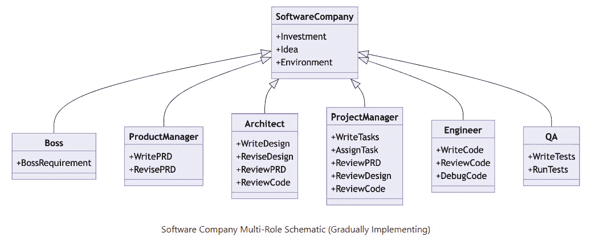

# 8

# CrowdStrike：深度伪造时代的网络安全

*第七章*为我们打开了一扇引人入胜的世界大门，展示了 AI、金融和生物技术的交汇点，以 GPT-4 对 Moderna 药物发现的变革性影响为例。我们见证了 Power BI 在金融分析中的魔力，揭开了 Moderna 的广泛合作和雄心。我们还探讨了自动化机器人如 Jarvis 和 HuggingGPT 的应用，OpenAI 的 AGI 计划，以及 AI 和量子计算未来带来的可能性。当我们进入*第八章*时，*第七章*的见解为我们打下了坚实的基础，为进一步探索 AI 日益发展的宇宙及其在保护金融信息方面的应用做好了准备。

欢迎来到*第八章*，在这里我们解码网络安全的迷宫般的走廊，探讨它与人工智能的互动，并审视其对金融信息的影响。随着数字交易和数据交换无处不在，暴露风险极大。

想象参加一场艾德·希兰的音乐会：音乐会场地代表您的数字网络，观众是您的数据，而艾德·希兰——这场演出的明星——是您的关键信息或服务器。系好安全带，我们将解码 CrowdStrike 的复杂性，深入探索深度伪造技术的黑暗世界，并理清金融交易中的复杂问题——所有这些都通过 GPT-4 等先进 AI 技术的视角进行。您将在这里发现通过 Power BI 可视化呈现的投资策略，解决伦理困境，并提升您的 AI 素养。

本章涵盖的主要主题如下：

+   **GPT-4、多模态活动与财务暴露**：了解将 GPT-4 融入金融领域的诱人前景与潜在风险。

+   **了解 CrowdStrike**：揭开 CrowdStrike 云原生安全云平台背后的秘密。

+   **激进与保守的交易策略**：通过 Power BI 可视化展示的生动示例，让您的金融之旅飞速前进，激发您的交易策略。

+   **HackerGPT 与监管变化**：认识 HackerGPT，您的新神谕，帮助解析网络安全变化及其财务影响。

+   **FinGPT——金融分析的革命**：探索 FinGPT 如何成为金融数据分析、风险评估和预测分析的首选 AI 模型。

+   **MetaGPT——多代理系统的奇才**：深入了解 MetaGPT，这一新兴的 AI 解决方案，通过协调多个 GPT 模型提供前所未有的金融洞察。

+   **现实世界中 LLM 的间接提示注入——风险与伦理困境**：揭示现实世界**大型语言模型**（**LLM**）应用中常被忽视的间接提示注入风险，并深入探讨随之而来的伦理迷局。

+   **深度伪造和 AI 素养——金融领域的风险与韧性**：踏上令人着迷的旅程，探索深度伪造的不安世界，揭示它们在金融领域的风险与机遇。通过这章内容，武装自己以掌握关键的 AI 素养技能，这是你在应对这些险恶技术挑战时的第一道防线。

在网络安全的世界里航行，可能会让人感觉像是在穿越一座复杂的数字迷宫。但如果理解它像参加一场艾德·希兰的音乐会一样——一场你可以想象并欣赏的激动人心的现场体验，那该多好？这正是我们通过音乐会和网络安全的类比，提供了一种通用语言，简化了数字安全的复杂领域。像 GPT-4 这样复杂的工具，可以为你提供财务策略建议，并生成动态的 Power BI 可视化。然而，一次网络失误可能会让一切付诸东流。准备好迎接一场激动人心的旅程，穿越一个高科技真正与高风险相遇的领域，并学习如何像艾德·希兰保护他的音乐会一样精确地保护你的数字世界。

# 音乐会与网络安全的类比——数字舞台的音乐会安全

作为一个类比，想象你正在参加一场艾德·希兰的音乐会：这是一场规模宏大、备受瞩目的活动，吸引了成千上万的粉丝。音乐会代表了一个数字网络，观众是数据包和用户，而舞台（与表演者）则是核心数据或主服务器：

+   **入场时的票务检查代表了防火墙。** 在进入会场之前，你的票会被检查。这确保只有授权的观众才能进入。同样，防火墙作为防御的第一道防线，只允许合法的流量通过。

+   **包包和身体扫描就像是防病毒和恶意软件扫描。** 安保人员会检查包包，并有时使用金属探测器，确保没有有害物品进入音乐会。类似地，防病毒和恶意软件扫描会寻找试图进入系统的有害软件或文件。

+   **VIP 区域和后台通行证代表了分级访问控制。** 不是每个观众都可以进入后台或访问 VIP 区域，只有持有特别通行证或腕带的人才能进入。在数字世界中，分级访问控制确保只有特定的人可以访问网络的敏感部分或特定数据。

+   **监控可疑活动就像使用入侵检测系统。** 在音乐会上，安保人员会扫描人群，寻找任何破坏秩序的行为。类似地，入侵检测系统会持续监控网络活动，标记任何异常情况。

+   **快速响应小组代表了事件响应小组。** 如果发生扰乱，音乐会的专业安保团队会迅速介入处理。类似地，当检测到网络威胁时，专业团队会立即采取行动，保护数字世界。

+   **持续监控就像是连续监测。** 在音乐会场地内布满了监控摄像头，时刻关注着一切。在网络安全中，持续监控确保任何恶意活动都会在发生时被及时发现。

+   **音乐会前的安全简报就像员工培训和威胁情报。** 在音乐会开始之前，安全团队会被简报，了解潜在的已知威胁或问题，就像公司会向员工通报潜在的网络钓鱼邮件或诈骗一样。

+   **紧急出口和疏散计划代表了备份和恢复过程。** 音乐会场所有明确的紧急出口，并且如果需要疏散，还有详细的计划。同样，在网络安全中，备份和恢复计划确保在发生安全漏洞或系统故障时，数据可以恢复，操作可以继续。

想象一下 GPT-4，一台如此聪明的机器，它可以为你提供股票建议，并创建动态的 Power BI 可视化。这听起来像是梦想，但其中有个陷阱。你是否考虑过潜藏在背后的网络安全风险？如果黑客操纵了你的 AI 生成的金融建议怎么办？

在这个激动人心的章节中，我们将深入探讨 GPT-4 的能力与陷阱，了解它的多模态才能，并面对可能影响你金融策略的网络安全威胁。所以，准备好吧，这里是高科技与高风险的交汇点！

# GPT-4、多模态活动与金融风险——一则警示故事

AI 技术的进步，如 GPT-4，这一能够接受图像和文本输入的多模态模型，既令人着迷又充满风险，尤其是在金融领域。随着这些系统越来越多地融入我们日常生活的各个方面，了解其风险尤为重要，特别是与网络安全相关的风险，以及它对投资、交易和金融分析的影响。

## GPT-4 的多模态能力

GPT-4，OpenAI 最新的深度学习技术，在各类专业和学术基准测试中表现出色，包括在模拟律师资格考试中名列前 10%。该模型甚至通过对抗性测试程序进行了优化，以在事实准确性和可引导性方面取得迄今为止最好的结果。

## 亚马逊 One 与生物识别技术的时代

为了举个例子，我们来看一下亚马逊 One，亚马逊推出的基于生物识别的支付系统。只需挥动手掌，这项服务便可以完成购买，号称具有高度安全性。然而，网络安全专家警告称，人工智能可能被用来生成虚假的生物识别数据。类似于 GPT-4 能够生成令人信服的人类文本，生物识别伪造数据也可能被用来欺骗亚马逊 One 的安全机制。

## 金融领域的网络安全风险

金融决策高度依赖准确的信息和安全的平台。想象一下，GPT-4 被集成到你的金融分析工具中，用于生成投资洞察或创建 Power BI 可视化。如果黑客控制了该模型，他们可能会操控生成的建议或数据可视化，导致你做出错误的投资决策。在交易领域，这可能导致巨大的财务损失。

## 数据可视化的影响

此外，这些操控可能会扭曲决策者常依赖的 Power BI 可视化数据。不准确的视觉数据可能会扭曲从趋势分析到资产配置的一切，不仅影响个人投资组合，甚至可能使市场细分出现不稳定。

## 保护敏感信息

与生物特征数据一样，像 GPT-4 这样的模型生成或输入的数据流需要严格保护。考虑到金融数据的敏感性以及错误的金融决策可能带来的连锁反应，实施强有力的网络安全措施至关重要。

像 GPT-4 这样的多模态 AI 模型以及像 Amazon One 这样的生物识别支付系统的兴起，预示着一个便利时代的到来，但也揭示了新的安全漏洞。在金融领域，这意味着面临更高的风险，这些风险可能改变你的投资环境、扭曲你的金融分析，并影响数据可视化的可靠性。在这个快速发展的技术时代，谨慎和尽职调查不仅是建议，而是绝对必要的。

紧握你的座椅，因为我们即将深入探讨 CrowdStrike 在金融网络安全领域的未来。CrowdStrike 是一家正在革新我们对数字安全认知的公司。想象一下：你是一位拥有宝贵资产和数据的投资者，需要加以保护。在这一部分，我们将解析 CrowdStrike 的开创性 Falcon 平台，揭示其 AI 驱动的武器库，并探讨其实时威胁预测如何成为金融行业的游戏规则改变者。你将深入了解那些塑造未来安全金融交易和投资的创新技术。继续阅读，揭开 CrowdStrike 所带来的网络安全奇迹！

## 了解 CrowdStrike 的安全能力

CrowdStrike 成立于 2011 年，总部位于加利福尼亚州的桑尼维尔，旨在重新定义网络安全领域。它采用云原生的 Security Cloud 平台来应对各种网络威胁，主要关注端点、云工作负载、身份验证和数据保护。该平台，名为 CrowdStrike Falcon®，利用一系列实时指标、威胁情报和遥测数据来增强检测和保护能力。

值得注意的是，Falcon 平台的主要特点：

+   **实时攻击指标**：这些可以实现主动的威胁检测

+   **自动化保护与修复**：这减少了人工工作并加快了响应速度

+   **威胁狩猎**：专业人员使用平台进行复杂威胁的有针对性识别

+   **优先级漏洞可视化**：这引导安全专业人员首先关注最关键的领域

CrowdStrike 因其在网络安全行业的努力而获得认可，获得了《福布斯》和《Inc.》等多个媒体的表彰。虽然这些荣誉证明了公司在行业中的影响力，但也强调了 CrowdStrike 为了应对现代安全挑战而不断发展的速度。

## CrowdScore——威胁管理的范式转变

CrowdStrike 的最新产品 CrowdScore 旨在简化组织如何感知和应对威胁。与传统指标不同，CrowdScore 提供了一个统一的、实时的威胁态势视图，协助高层决策。

CrowdScore 的实用性体现在多个方面：

+   **即时威胁级别指示**：这帮助组织更有效地分配资源

+   **历史趋势分析**：通过将当前数据与过去的趋势进行比较，团队可以做出更明智的决策

+   **优先级事件**：这简化了分诊过程，加快了响应速度

CrowdScore 中的事件工作台功能提供了视觉辅助，帮助快速分析和修复。这标志着安全专家可以更高效地分配资源以应对威胁的战略转变。

总结来说，CrowdScore 旨在为组织提供及时的网络威胁态势洞察，促进更快速、更明智的响应。这体现了 CrowdStrike 不仅提供强有力保护，还推动整体网络安全框架发展的承诺。

## CrowdStrike 的 SCORE 分析——驾驭金融网络风险与机遇

欢迎来到金融与网络安全的交汇点！认识 CrowdStrike，这个正在改变我们如何保护金融资产的巨头，在这个数字威胁不断升级的时代。通过我们的 SCORE 视角，我们将剖析 CrowdStrike 的优势、挑战、机会、风险和效率。准备好迎接有关 AI 驱动的威胁预测、抗量子算法等内容的直观分析——这些是任何在高风险金融网络世界中航行的人的必备洞察。

以下是 CrowdStrike 的优势：

+   **AI 驱动的预测分析**：CrowdStrike 的 Falcon 平台利用人工智能来预测并防止潜在的安全漏洞，使其始终走在新兴威胁之前。这种方法可能重新定义现代网络安全的应对方式。

+   **研发投入**：CrowdStrike 将大量收入用于研发，持续推动创新并保持其技术领先优势。

以下是它的挑战：

+   **并购整合**：CrowdStrike 的增长战略包括收购具有创新技术的小型公司。如何在不失去灵活性或焦点的情况下将这些公司整合进现有结构中，可能是一个重大挑战。

以下是其机会：

+   **5G 和物联网安全**：随着 5G 和**物联网**（**IoT**）设备的普及，网络威胁的攻击面迅速扩大。CrowdStrike 的专业技术使其在保护这些创新技术方面处于领先地位。

+   **与新兴技术公司合作**：与新兴技术公司进行合作可以进一步多样化 CrowdStrike 的产品供应，并将其拓展到新市场。

以下是其风险：

+   **依赖第三方技术**：CrowdStrike 对第三方平台和技术的依赖可能引入它们无法控制的漏洞，给其运营增加额外的风险层。

+   **潜在的监管变化**：全球各国政府正在考虑关于数据隐私和网络安全的新法规。任何意外的变化都可能影响 CrowdStrike 的运营和成本结构。

以下是其效率：

+   **威胁响应自动化**：通过将更多自动化的响应措施引入常见的威胁，CrowdStrike 可以进一步简化其运营，减少人工干预和成本。

以下是未来的潜在机会：

+   **抗量子算法**：随着量子计算的成为现实，传统的加密方法可能会变得过时。开发抗量子算法有可能将 CrowdStrike 定位为下一代网络安全的开路先锋。

+   **与 Power BI 的行为分析整合**：利用机器学习分析行为模式，然后通过 Power BI 可视化这些洞察力，可以为主动威胁管理提供无与伦比的见解。

CrowdStrike 的旅程代表了创新、战略规划和适应性的电气化交汇点。通过 SCORE 分析的视角，结合这些具体的例子和机会，投资者和分析师不仅可以了解 CrowdStrike 今天的状况，还可以洞察这个网络安全巨头在数字安全这个充满刺激和不可预测的未来中可能的走向。通过把握这些动态，人们能够做出明智的决策，利用我们数字时代的精神气质。

在这里，我们将探索网络安全与金融的交集，这是一个技术与保护金融资产和数据的严格要求相遇的关键领域。在这一领域的关键玩家之一是 CrowdStrike。

1.  **面向金融机构的云保护**：CrowdStrike Falcon 确保在此处阻止数据泄露，为跨终端、云工作负载、身份等的金融数据提供强有力的保护。

1.  **实时威胁预测**：在交易和投资的快速变化的世界中，CrowdStrike 的自动预测和预防功能充当守卫，实时检测潜在威胁。

1.  **人工智能驱动的洞察**：CrowdStrike 的威胁图谱展示了人工智能在金融行业网络安全中的实际应用。CrowdStrike 运用专门的人工智能算法筛选万亿级数据点，识别新兴威胁和对金融机构可能特别具有破坏性的敌对策略变化。这些 AI 驱动的洞察与人类专业知识相辅相成，增强了这些公司网络防御，确保它们始终走在潜在风险的前面。

1.  **金融行业的整体安全**：CrowdStrike 的方法不仅仅是为了防止攻击；它还旨在构建一个安全的金融环境。从精英级的威胁狩猎到优先级漏洞管理，CrowdStrike 确保金融行业的关键风险领域得到充分保护。

CrowdStrike 的创新技术是网络安全领域的一盏创新灯塔，特别与金融行业密切相关。随着我们深入金融、投资和交易领域，了解像 CrowdStrike 这样的解决方案如何保护并赋能企业至关重要。该平台不仅仅是一个安全工具；它是任何金融机构在日益互联且充满风险的数字世界中保护运营的战略资产。

准备好迎接挑战吧，因为我们将深入探讨 CrowdStrike 与 Dell Technologies 之间的重大联盟——这一合作关系有望重新定义中小型企业（SMB）领域的商业网络安全规则。想象一下：CrowdStrike 的最先进 Falcon 平台与 Dell 的广泛技术体系无缝整合。结果？一个不仅防范威胁，还重新定义我们在金融领域如何应对数据安全的网络安全堡垒。

从数百万美元的交易到颠覆性的 Power BI 可视化，本节将带你进行一段引人入胜的旅程，探索为什么这一联盟是技术领域的完美结合。

# CrowdStrike 与 Dell Technologies：商业网络安全领域的战略联盟

准备迎接商业网络安全领域的重大变革！进入 CrowdStrike 与 Dell Technologies 之间的战略联盟——一个行业定义性的合作关系，旨在为网络防御提供超级动力，特别是在金融领域这个高风险的世界中。想象一下，最前沿的 CrowdStrike 解决方案与 Dell 的广泛技术套件相结合，并通过如 Power BI 这样的实时数据仪表盘进行可视化。这不仅仅是一个联盟；它是一场革命，开启了网络安全领域的机会洪流，将赋能银行、交易平台和金融分析服务。

## 联盟：构建全面的网络防御

CrowdStrike 与戴尔科技（Dell Technologies）建立了战略联盟，专注于提供无缝且具有成本效益的解决方案，以应对网络威胁。CrowdStrike 的 Falcon 平台现在已集成到戴尔的广泛技术产品中。

## 金融影响与网络安全

这一联盟为 CrowdStrike 开辟了重要的机会，特别是在金融领域。随着银行、交易平台和金融分析服务日益紧密地相互连接，对强大网络安全解决方案的需求也在不断增加。CrowdStrike 增强的能力使其在这一领域处于领先地位。

## 数据可视化的力量

这一联盟所产生的安全指标可以通过实时威胁仪表盘或预测分析进行展示，通过像 Power BI 这样的工具进行可视化。这将为金融机构提供更深入的网络安全状况洞察，帮助其进行数据驱动的决策。

## 结论：网络安全与金融的未来

这一联盟的早期成功——体现在与一家大型地区性医疗保健提供商达成的七位数交易——为未来树立了一个有希望的先例。它强调了该联盟在推动创新、效率和网络安全领域增长的潜力，而网络安全在保护金融行业中的重要性正日益增加。

本节将带你体验一场过山车般的旅程，深入解析 CrowdStrike 的财报电话会议记录，所有这些都通过创新的人工智能和自然语言处理（NLP）工具进行解码。通过 Python 库和 TextBlob 驱动的情感分析，我们将剖析 CrowdStrike 最近的表现，并对公司的未来进行一瞥。如果你渴望了解 CrowdStrike 的财务健康状况和潜在风险，同时探索人工智能如何革新投资策略，那你绝对不容错过。所以，坐稳了，表演即将开始！

# 使用人工智能和自然语言处理分析 CrowdStrike 的财报电话会议记录

从财报电话会议记录中挖掘出的宝贵洞察，到通过情感分析解码公司市场情绪的过程，本节将为你提供了解 CrowdStrike 在日益发展的网络安全领域中的地位的路线图。我们将迅速浏览这些记录的重要性、数据提取的技术工作流程和情感分析。最后，我们将放眼全局，看看这一切如何与更广泛的网络安全环境契合。

## 财报电话会议记录在金融中的作用

财报电话会议记录是重要的财务文件，揭示了公司业绩、战略和前瞻性声明。对其分析可以为投资者和金融分析师提供宝贵的洞察。

### 技术工作流程

使用 Python 的 docx 库，可以在毫秒级别内访问每一份三份转录文本。这为更深入的数据分析奠定了基础。

### 使用 TextBlob 进行情感分析

这些记录的“问题与答案”部分尤为重要。利用 TextBlob 库，针对每个季度计算了情绪分数：

+   2023 年第三季度：0.172（略微看涨）

+   2023 年第四季度：0.181（略微看涨）

+   2024 年第一季度：0.184（略微看涨）

这些分数的范围从-1（负面）到 1（正面），为情绪提供了一个全局视角，显示出持续的正面情绪。

### 与 CrowdStrike 及网络安全的相关性

这种情绪分析可以帮助投资者和金融分析师了解 CrowdStrike 的市场地位及潜在风险，尤其是在与网络安全指标结合时。类似的 AI 模型也嵌入了 CrowdStrike 等网络安全平台，提升了其预测和适应新威胁的能力。

我们即将飞入激进交易策略的高能世界！想象一下，你可以通过一个结合了网络保险快速增长与对过高估值的精心对冲的交易，快速提升你的投资组合。让我们深入了解这种双重策略：购买保险行业领导者 Beazley 和 Hiscox 的看涨期权，同时卖出网络安全巨头 CrowdStrike 的看跌期权。

如果你对最大化收益并有应对风险的备选方案感到兴奋，那么你来对地方了。无论你是经验丰富的交易员，还是希望提升交易技能的爱好者，准备好释放激进期权交易的力量了吗？

## 激进交易（使用期权）——购买 Beazley 和 Hiscox 的看涨期权，并卖出 CrowdStrike 的看跌期权

在这一激进交易策略中，我们购买 Beazley 和 Hiscox 的看涨期权，表明我们对这些保险公司的看涨。同时，我们卖出 CrowdStrike 的看跌期权，表达更为谨慎的看法。此策略旨在利用预期的网络保险增长，同时可能利用 CrowdStrike 的过高估值：

1.  使用`pip`命令安装`yfinance`包：`pip install yfinance`

1.  运行以下 Python 代码：

    ```py
    # Import necessary libraries
    import yfinance as yf
    def buy_call_options(symbol, strike, expiration, contracts):
        print(f"Buying {contracts} call options for {symbol} with strike {strike} and expiration {expiration}.")
        # TODO: Add your actual trading logic here
    def sell_put_options(symbol, strike, expiration, contracts):
        print(f"Selling {contracts} put options for {symbol} with strike {strike} and expiration {expiration}.")
        # TODO: Add your actual trading logic here
    # Define the strike price, expiration date, and number of contracts
    # NOTE: Replace the following values with those relevant to your strategy
    beazley_strike = 150
    beazley_expiration = '2023-12-15'
    beazley_contracts = 10
    hiscox_strike = 120
    hiscox_expiration = '2023-12-15'
    hiscox_contracts = 10
    crowdstrike_strike = 200
    crowdstrike_expiration = '2023-12-15'
    crowdstrike_contracts = 10
    # Place trades
    buy_call_options('BEZ.L', beazley_strike, beazley_expiration, beazley_contracts)
    buy_call_options('HSX.L', hiscox_strike, hiscox_expiration, hiscox_contracts)
    sell_put_options('CRWD', crowdstrike_strike, crowdstrike_expiration, crowdstrike_contracts)
    ```

## 示例函数与突出显示的替换区域

以下是示例函数，模拟了`buy_call_options`和`sell_put_options`函数的实际交易逻辑：

```py
# Example of what buy_call_options might look like
def buy_call_options(symbol, strike, expiration, contracts):
    your_trading_platform_api.buy_options(
        symbol = symbol,              # <-- Replace with your variable or hard-coded value
        strike_price = strike,        # <-- Replace with your variable or hard-coded value
        expiration_date = expiration, # <-- Replace with your variable or hard-coded value
        contract_type = 'CALL',
        num_of_contracts = contracts  # <-- Replace with your variable or hard-coded value
    )
# Example of what sell_put_options might look like
def sell_put_options(symbol, strike, expiration, contracts):
    your_trading_platform_api.sell_options(
        symbol = symbol,              # <-- Replace with your variable or hard-coded value
        strike_price = strike,        # <-- Replace with your variable or hard-coded value
        expiration_date = expiration, # <-- Replace with your variable or hard-coded value
        contract_type = 'PUT',
        num_of_contracts = contracts  # <-- Replace with your variable or hard-coded value
    )
```

在这些示例函数中，将占位符（your_trading_platform_api、symbol、strike、expiration、contracts）替换为与你的交易策略和平台相关的实际细节。

准备好降低风险，但保持智慧吗？欢迎来到保守交易策略的领域，在这里，慢而稳可能真的能赢得比赛！在这一细致入微的策略中，我们对保险巨头 Beazley 和 Hiscox 持看涨态度，直接购买它们的股票。但这还不是全部。我们还在密切关注 CrowdStrike，等待其股价下跌 5%，然后趁机买入。

为什么要采取这种平衡的策略呢？因为在投资的世界里，时机和谨慎的结合，可能和任何高风险赌博一样刺激。如果你是一个欣赏计算风险艺术和稳定收益魅力的人，那么本节就是你的大师课程。准备好以冷静和精准的姿态驾驭金融市场了吗？让我们开始吧！

## 保守交易（使用股票）——购买 Beazley 和 Hiscox 的股票，并在 CrowdStrike 的股价从当前价格下跌 5%时购买该股票

在这种保守的交易策略中，我们直接购买 Beazley 和 Hiscox 的股票，表明我们对这些保险公司持看涨态度。与此同时，我们设置一个限价单，当 CrowdStrike 的股价从当前水平下跌 5%时购买该股票，表明我们采取更为谨慎的策略：

```py
a). Assumes yfinance library has already been installed on the PC.  If not, please complete this step first.
pip install yfinance
b). Run python code
# Import necessary libraries
import yfinance as yf
def buy_stock(symbol, num_shares):
    print(f"Buying {num_shares} shares of {symbol}.")
    # TODO: Add your actual trading logic here
def place_limit_order(symbol, target_price, num_shares):
    print(f"Placing limit order for {num_shares} shares of {symbol} at target price {target_price}.")
    # TODO: Add your actual trading logic here
# Define the stock symbols and number of shares to buy
# NOTE: Replace the following values with those relevant to your strategy
beazley_stock = 'BEZ.L'
hiscox_stock = 'HSX.L'
crowdstrike_stock = 'CRWD'
num_shares_beazley = 100
num_shares_hiscox = 100
num_shares_crowdstrike = 100
# Place trades
buy_stock(beazley_stock, num_shares_beazley)
buy_stock(hiscox_stock, num_shares_hiscox)
# Check current price of CrowdStrike
crowdstrike_price = yf.Ticker(crowdstrike_stock).history().tail(1)['Close'].iloc[0]
# Determine target price (5% below current price)
target_price = crowdstrike_price * 0.95
# Place limit order
place_limit_order(crowdstrike_stock, target_price, num_shares_crowdstrike)
```

## 具有突出替换区域的示例函数

以下是模拟实际交易逻辑中的`buy_stock`和`place_limit_order`函数的示例函数：

```py
# Example of what buy_stock might look like
def buy_stock(symbol, num_shares):
    your_trading_platform_api.buy_stock(
        symbol = symbol,               # <-- Replace with your variable or hard-coded value
        num_of_shares = num_shares     # <-- Replace with your variable or hard-coded value
    )
# Example of what place_limit_order might look like
def place_limit_order(symbol, target_price, num_shares):
    your_trading_platform_api.place_limit_order(
        symbol = symbol,               # <-- Replace with your variable or hard-coded value
        target_price = target_price,   # <-- Replace with your variable or hard-coded value
        num_of_shares = num_shares     # <-- Replace with your variable or hard-coded value
    )
```

在这些示例函数中，将占位符（`your_trading_platform_api`、`symbol`、`target_price`、`num_shares`）替换为与您的交易策略和平台相关的实际细节。

两种投资策略都需要根据市场状况进行持续监控和调整。与财务顾问咨询，以确保这些策略与个人的投资目标、风险承受能力和财务状况相一致，也是非常重要的。

想象一下，您的交易驾驶舱仪表板；听起来很棒，对吧？当 Power BI 令人惊叹的可视化效果与 ChatGPT 直观的自然语言能力相结合时，你将获得这种体验。无论你是期权交易高手，还是股市策略师，这些仪表板就像你的个人指挥中心，提供实时洞察、提醒以及能用你的金融术语交流的对话式界面。如果你渴望获得可操作的分析和 AI 驱动的财务建议，那么请把接下来的这一节看作你的绿洲。

# 投资仪表板终极指南 —— Power BI 与 ChatGPT 的完美结合

进入你的财务驾驶舱，在那里，Power BI 令人眼花缭乱的可视化与 ChatGPT 巧妙的语言能力联手，带你穿越交易和投资的惊险天空。在这本终极指南中，我们将逐步拆解你梦寐以求的仪表板，首先，通过一套量身定制的可视化，展示激进交易和保守交易策略在实时中的展开。接着，我们通过实时提醒将风险提高，充当你的金融雷达。最后，欢迎 ChatGPT 的无缝集成，它为这些仪表板提供按需的财务建议和洞察。

## Power BI 可视化

我们邀请你探索 Power BI 可视化世界，特别是针对使用 Beazley、Hiscox 和 CrowdStrike 期权的激进交易策略。我们将这一部分分为三个关键部分。首先，我们提供一个精心设计的仪表板概述，展示价格变动的时间序列图、用于跟踪合同的持仓表，以及一个风险分析图表，用于评估潜在的盈利或亏损情景。接下来，我们介绍了提醒的宝贵概念，重点介绍 CrowdStrike 看跌期权，以确保你不会错过任何有利时机。最后，我们加入与 ChatGPT 的集成，你可以直接提问并获得数据驱动的见解和建议。此部分将简要概述本章前面提到的激进和保守交易策略，并提供一些建议，帮助你在 Power BI 中可视化数据并开启 Power BI 提醒。为了创建这些 Power BI 可视化，我们将从创建包含激进和保守交易数据的 CSV 文件开始，数据文件将在第 18-22 页，然后详细的 Power BI 可视化步骤将在第 22 页开始。

## 使用 Beazley、Hiscox 和 CrowdStrike 的期权进行激进交易

1.  仪表板概述：

    +   **时间序列图**：显示 Beazley、Hiscox 和 CrowdStrike 期权价格走势的折线图。使用不同的线条颜色来区分看涨期权和看跌期权，以便轻松区分。

    +   **持仓表**：显示当前持仓的表格，包括行使价、到期日、合同数量和当前价值。

    +   **风险分析图表**：一个散点图，展示在不同情境下期权持仓的潜在盈利或亏损。

1.  提醒：

    +   **CrowdStrike 看跌期权提醒**：当 CrowdStrike 的看跌期权达到价内状态（即股票价格跌破行使价）时设置提醒。这可以通知用户可能需要采取行动。

1.  与 ChatGPT 的集成：

    +   一个文本输入框，用户可以在其中查询 ChatGPT 以获取见解，例如`What is the potential risk of the CrowdStrike` `put option?`

    +   ChatGPT 可以分析可视化数据并提供可操作的见解和建议

## 保守交易：在 Beazley、Hiscox 和 CrowdStrike 股票下跌 5% 后购买股票

我们将转变方向，探索 Power BI 可视化，专注于更加保守的交易方法，特别是在 Beazley、Hiscox 和 CrowdStrike 股票下跌 5% 后购买股票。本指南分为三个主要部分。首先是仪表板概述，展示一个时间序列图，用于追踪股票价格变动；一个持仓表，用来跟踪当前的持仓；以及一个限价单状态卡，确保你随时掌握所有必要的信息。其次，我们将向你展示如何设置提醒，比如当 CrowdStrike 的股票价格接近目标价格的 5% 时触发提醒，以便及时采取行动。

最后，我们将 ChatGPT 集成进来，针对激进的交易，提供互动式的实时洞察：  

1.  仪表盘概览：  

    +   时间序列图：显示 Beazley、Hiscox 和 CrowdStrike 股价变动的折线图。  

    +   开盘仓位表：显示当前股票持仓的表格，包括股票代码、股数、平均成本和当前价值。  

    +   限价单状态：显示 CrowdStrike 限价单状态的卡片或部分，包括目标价格和当前价格。  

1.  警报：  

    +   CrowdStrike 目标价格警报：如果 CrowdStrike 的股价跌至目标价格的 5%以内，设置警报。这可以提醒用户密切监视或执行交易。  

1.  与 ChatGPT 集成：  

    +   按照 Aggressive Trade Power BI 部分中强调的相同步骤操作。  

## Power BI 警报配置（以 CrowdStrike 设置警报为例，但也可以用于 CrowdStrike 股票警报）。  

本部分是一个六步过程，向您传授如何在 Power BI 中设置适合您独特交易策略的警报。首先，您将学习如何选择合适的可视化元素，例如折线图，作为警报的基础。接下来，我们将引导您完成 Power BI 中的警报部分，完成主要设置。在这里，您将设置新的警报规则、指定条件，并选择如何接收通知。每一步都是构建块，最终形成一个配置好的警报，帮助您走在前列。通过掌握这些步骤，您不仅是在您的交易工具箱中添加了一个工具；您获得了一个警觉的伙伴，确保您永远不会错过重要的交易信号。

1.  点击您想要设置警报的具体可视化（例如，显示 CrowdStrike 股价与认沽期权执行价格对比的折线图）。  

1.  前往 Power BI 服务中的**警报**部分。  

1.  点击**+ 新建** **警报**规则。  

1.  设置警报的条件（例如，**股票价格 <** **执行价格**）。  

1.  选择通知方式（例如，电子邮件或移动通知）。  

1.  保存警报。  

重要提示  

可视化的具体实现和外观将取决于您的数据源、Power BI 设置和特定需求。  

确保遵守所有相关的法律和监管要求，特别是在集成像 ChatGPT 这样的人工智能时。  

通过将 Power BI 的可视化能力与 ChatGPT 的自然语言分析结合起来，可以有效地监控和管理这些投资策略，且所提供的洞察易于理解并可付诸实践。请确保聘请财务专家，以根据个人情况调整策略。  

准备好通过 Python 的动态能力来体验一场过山车般的激进交易之旅吧。想象一下，你能够快速捕捉期权头寸，跟踪实时价格，并可视化潜在风险，所有这一切仅需几行代码来创建一个 CSV 文件。欢迎来到一个 Python 成为你的交易大厅，而你则是这场金融交响乐的指挥。准备好用代码创造动态、实时的交易洞察了吗？

## 利用 Python 的强大功能进行激进交易：一场以代码驱动的冒险

准备好踏上激动人心的旅程——一场由 Python 驱动的激进交易之旅。本节不仅仅是一个教程；它是一门充满行动的课程，将 Python 代码转变为你交易驾驶舱的引擎室。我们首先将交易选项集成到名为 options_df 的数据框中，并将其保存为 CSV 文件以便于访问。我们的 get_option_price 函数作为获取实时期权定价的桥梁，基于股票代码、行权价和到期日拉取关键数据。接着，这些数据将整齐地组织到另一个数据框 positions_df 中，并保存为 CSV 文件。随着深入，我们还将探讨时间序列绘图和风险分析，你将学会如何可视化价格趋势并计算潜在的收益或亏损。

以下是创建 CSV 文件的 Python 代码：

```py
a). Install yfinance and pandas first (if this has not already been done)
pip install pandas
pip install yfinance
b). Run the following Python code:
import pandas as pd
import yfinance as yf
# Define your variables here
# NOTE: Replace the '...' with actual values
beazley_stock = 'BEZ.L'
hiscox_stock = 'HSX.L'
crowdstrike_stock = 'CRWD'
beazley_strike = ...
hiscox_strike = ...
crowdstrike_strike = ...
beazley_expiration = ...
hiscox_expiration = ...
crowdstrike_expiration = ...
beazley_contracts = ...
hiscox_contracts = ...
crowdstrike_contracts = ...
# Create DataFrame for option positions
options_df = pd.DataFrame({
    'Symbol': [beazley_stock, hiscox_stock, crowdstrike_stock],
    'Type': ['Call', 'Call', 'Put'],
    'Strike': [beazley_strike, hiscox_strike, crowdstrike_strike],
    'Expiration': [beazley_expiration, hiscox_expiration, crowdstrike_expiration],
    'Contracts': [beazley_contracts, hiscox_contracts, crowdstrike_contracts]
})
# Save DataFrame to CSV
options_df.to_csv('aggressive_trade_options.csv', index=False)
# Function to fetch real-time price
def get_option_price(ticker, strike, expiration, option_type='call'):
    # TODO: Add your actual trading logic here
    return ...
# Open Positions Table
positions = []
for symbol, strike, expiration, contracts in [(beazley_stock, beazley_strike, beazley_expiration, beazley_contracts),
                                               (hiscox_stock, hiscox_strike, hiscox_expiration, hiscox_contracts),
                                               (crowdstrike_stock, crowdstrike_strike, crowdstrike_expiration, crowdstrike_contracts)]:
    price = get_option_price(symbol, strike, expiration)
    positions.append([symbol, strike, expiration, contracts, price * contracts])
positions_df = pd.DataFrame(positions, columns=['Symbol', 'Strike', 'Expiration', 'Contracts', 'Value'])
positions_df.to_csv('aggressive_positions.csv', index=False)
# Time Series Plot
# TODO: Add your actual trading logic here
# Risk Analysis Chart
# TODO: Add your actual trading logic here
```

重要提示

将所有的 `…` 替换为你实际想使用的值。

你需要实现 `get_option_price()` 函数，以获取实时期权价格。这将取决于你使用的数据源或经纪商。

时间序列图和风险分析图部分标记为 TODO，你需要根据自己的需求添加实际的逻辑。

在混乱的股市世界中，通过掌握 Python 的保守交易策略来寻找宁静。如果你更喜欢逐步上升的稳定收益而非股市波动带来的高强度刺激，那么本节将是你的避风港。我们将运用 Python 创建一个分析仪表板，绘制交易位置，跟踪实时价格，甚至使用 CSV 文件设置限价单。准备好用代码实现可持续、风险管理的利润了吗？让我们开始吧。

## 保守交易的禅意：释放 Python 实现稳定收益

本节是那些寻求稳健计算方法的交易者的避风港。我们将使用 Python 代码来执行如 Beazley、Hiscox 和 CrowdStrike 等股票的保守交易策略。

首先，我们定义一些重要的变量，如股票符号、股票数量和目标价格。接着，使用 Python 的 pandas 库，我们创建一个数据框，整齐地整理这些变量。我们还将这些数据保存为 CSV 文件以备将来使用。然后，脚本进入实时模式，拉取最新的股价来填充你的未平仓头寸表格——这是我们会保存为 CSV 的另一个数据框。最后，脚本更新一个限价单状态数据框，用来监控当前股价与目标买入价格的接近程度。

以下是创建 CSV 文件的 Python 代码：

1.  首先安装 yfinance 和 pandas（如果尚未安装）：

    ```py
    pip install pandas
    pip install yfinance
    ```

1.  运行以下 Python 代码：

    ```py
    import pandas as pd
    import yfinance as yf
    # Define your variables here
    # NOTE: Replace the '...' with actual values
    beazley_stock = ...
    hiscox_stock = ...
    crowdstrike_stock = ...
    num_shares_beazley = ...
    num_shares_hiscox = ...
    num_shares_crowdstrike = ...
    target_price = ...  # Target price for CrowdStrike
    # Create DataFrame for stock positions
    stock_df = pd.DataFrame({
        'Symbol': [beazley_stock, hiscox_stock, crowdstrike_stock],
        'Shares': [num_shares_beazley, num_shares_hiscox, num_shares_crowdstrike],
        'Target_Price': [None, None, target_price]
    })
    # Save DataFrame to CSV
    stock_df.to_csv('conservative_trade_stocks.csv', index=False)
    # Function to fetch real-time stock price
    def get_stock_price(ticker):
        return yf.Ticker(ticker).history().tail(1)['Close'].iloc[0]
    # Open Positions Table
    positions = []
    for symbol, shares in [(beazley_stock, num_shares_beazley),
                          (hiscox_stock, num_shares_hiscox)]:
        price = get_stock_price(symbol)
        positions.append([symbol, shares, price, price * shares])  # Adjust to include average cost
    positions_df = pd.DataFrame(positions, columns=['Symbol', 'Shares', 'Current Price', 'Value'])
    positions_df.to_csv('conservative_positions.csv', index=False)
    # Time Series Plot
    # TODO: Add your actual trading logic here
    # Limit Order Status
    limit_order_status = pd.DataFrame([[crowdstrike_stock, target_price, get_stock_price(crowdstrike_stock)]],
                                      columns=['Symbol', 'Target Price', 'Current Price'])
    limit_order_status.to_csv('limit_order_status.csv', index=False)
    ```

重要说明

将所有的`...`替换为你希望使用的实际值。

时间序列图部分标记为 TODO。你需要根据自己的具体需求添加实际逻辑。

你已经有了交易数据。那么接下来做什么呢？如何将这些未经处理的原始数据转化为令人惊叹、富有洞察力的可视化图表，讲述一个引人入胜的故事？欢迎来到 Power BI 可视化的艺术！从绘制激进的交易操作到勾画保守策略的禅意平静，我们将把你的电子表格转化为一场视觉交响曲。更棒的是？我们甚至会设置实时提醒，并与 ChatGPT 集成，提供 AI 驱动的见解。

# 可视化炼金术：用 Power BI 将原始数据转化为黄金般的洞察力

进入由 Python 驱动的保守交易领域，在这里每一行代码都是通向财务审慎和优化收益的垫脚石。我们的这一部分将通过介绍两个对数据处理和市场数据提取至关重要的 Python 库来展开：pandas 和 yfinance。脚本首先声明一些变量，比如股票符号、股票数量和目标价格，有效地为你的保守交易策略奠定基础。仅凭一小段代码，我们将这些原始变量转化为一个名为 stock_df 的结构化数据框，并将其保存为 CSV 文件，方便访问。我们的 get_stock_price 函数通过从 Yahoo Finance 拉取实时股价，使你的策略与市场现实紧密相连。这些数据滋养了另一个数据框 positions_df，它作为你实时的账本，用于跟踪股票的价值。我们还为追踪限价单的状态预留了空间，确保你不会错过任何一个最佳买入时机。

## 创建 Power BI 可视化图表

现在你已经有了 CSV 文件，可以按照以下步骤创建 Power BI 可视化图表：

1.  将 CSV 文件加载到 Power BI 中：

    +   打开 Power BI Desktop。

    +   点击“获取数据” > “文本/CSV”。

    +   浏览到你的 CSV 文件所在位置，并将其加载到 Power BI 中。

1.  创建激进交易的可视化图表：

    1.  对于时间序列图，请使用折线图，并将日期作为*x*轴，将价格作为*y*轴绘制价格走势。

    1.  对于未平仓头寸表格，使用表格可视化并拖动来自 `aggressive_trade_options.csv` 的相关字段。

    1.  对于风险分析图表，使用散点图并添加计算出的利润/损失字段。

    1.  对于 CrowdStrike 看跌期权警报，你可以按照之前的消息设置警报。

1.  为保守交易创建可视化：

    1.  对于时间序列图，类似于激进交易，使用折线图。

    1.  对于未平仓头寸表格，使用来自 `conservative_trade_stocks.csv` 的字段进行表格可视化。

    1.  对于限价单状态，使用卡片可视化来显示目标价格和当前价格。

    1.  对于 CrowdStrike 目标价格警报，按照之前的说明设置警报。

1.  与 ChatGPT 集成：

    +   虽然 Power BI 可以通过 API 连接到 GPT-4，但你只需要输入你的 OpenAI API 密钥，并确保你有足够的余额来支付 API 调用费用。

# 与 ChatGPT (GPT-4) 集成

在 Power BI 中启用 Python 脚本：

1.  进入 **文件 > 选项和设置 >** **选项**。

1.  在 **Python 脚本** 下，选择你安装的 Python 目录。

1.  安装所需的 Python 包。

    确保安装 openai Python 包，它将允许你与 GPT-4 API 通信。你可以通过 pip 安装：

    ```py
    Bash
    pip install openai
    ```

1.  在 Power BI 中创建 Python 可视化：

    +   在 Power BI Desktop 中，点击 Python 脚本可视化。

    +   报告中将出现一个占位符 Python 脚本可视化，编辑器将打开，你可以在其中输入 Python 代码。

1.  输入用于 GPT-4 API 调用的 Python 代码。

    使用以下示例 Python 代码作为基础。将 `'your_openai_api_key_here'` 替换为你的实际 OpenAI API 密钥：

    ```py
    import openai
    openai.api_key = "your_openai_api_key_here"
    # Your query based on Power BI data
    prompt = "Provide insights based on Power BI visualization of aggressive trade options."
    # API call to GPT-4 for text generation
    response = openai.Completion.create(
      engine="text-davinci-003",  # or your chosen engine
      prompt=prompt,
      max_tokens=100
    )
    insight = response.choices[0].text.strip()
    ```

1.  在 Power BI 中显示洞察。

    你可以将生成的文本（存储在 `insight` 变量中）显示在 Power BI 中的文本框或其他可视化元素中。

1.  测试集成

    确保在 Power BI 中测试 Python 脚本，以确保它成功运行并返回预期的洞察。

1.  保存并应用更改。

    一旦你对设置满意，点击 Power BI 中的“应用更改”以更新报告。

1.  添加 API 成本监控

    密切关注 OpenAI API 仪表板，以监控使用情况和费用。确保你有足够的余额来支付 API 调用费用。

1.  设置刷新计划。

    如果你使用的是 Power BI 服务，请设置计划刷新，以保持洞察的最新状态。

    通过按照这些步骤，你应该能够将 GPT-4 集成到你的 Power BI 报告中，根据你的财务可视化动态生成有洞察力的文本。

1.  保存 Power BI 报告，并将其发布到 Power BI 服务，如果你希望与他人共享。

重要说明

确保根据需要刷新数据，以获取更新的信息。具体的字段和计算可能会根据你的交易的特定数据和要求有所不同。

通过按照这些步骤，你可以为激进和保守交易创建有洞察力的 Power BI 可视化，利用直接从你的 Python 交易代码生成的 CSV 文件。

想象一下，24/7 有一位经验丰富的网络安全专家陪伴在你身旁，帮助你穿越复杂的网络法律迷宫，并解析每一个重大安全漏洞，告诉你它对你的投资组合意味着什么。太美好了，不真实？来认识一下 HackerGPT（AI 人物）！它被设计来模仿网络安全领域最顶尖的专家，这个模型不仅仅是处理数字——它思考、分析，甚至能在快速发展的网络世界中发现投资机会。系好安全带，你即将发现一个颠覆性的工具，它可能会重新定义你对网络安全和投资的看法。

# HackerGPT（AI 人物）– 监控并分析网络安全监管变化和漏洞

作为一款专注于复杂网络安全领域的高智能模型，HackerGPT 致力于识别、理解和分析监管变化、网络安全漏洞及其对各行业的潜在影响。HackerGPT 提供的洞察可以为网络保险和网络安全行业的投资决策提供指导。

以下是 HackerGPT 将评估的关键指标：

+   监管环境：监控并理解各司法管辖区和行业中与网络安全相关的最新法规

+   网络安全漏洞：分析重大网络安全漏洞的性质、范围和影响，包括那些影响到 AI 技术，如生成式 AI 或大型语言模型（LLMs）的漏洞

+   受影响行业：考察监管变化或安全漏洞如何影响特定行业，如金融、医疗、通信、能源、技术、公用事业、材料或工业

+   投资机会：根据监管或网络漏洞环境，识别网络保险和网络安全行业的潜在投资渠道

+   技术分析：评估网络安全技术的稳健性、漏洞和创新性

+   风险缓解策略：评估并建议缓解网络风险的策略，包括保险解决方案

准备好迎接一场激动人心的旅程，进入金融与网络安全的交汇点，由充满活力的 AI 二人组 FinGPT 和 HackerGPT 巧妙引导，敬请期待下一节内容。FinGPT 通过其数据驱动的能力打下金融基础，而 HackerGPT 则专注于网络安全数据集，深入探讨网络风险和投资机会的细微差别。展示的 Python 代码提供了一个实际的方法，能够实时利用这些 AI 获取洞察。它们共同形成了一个无与伦比的工具组合，帮助利益相关者应对金融和网络安全的复杂领域。

## HackerGPT – 体现了领先网络安全专家的特质

HackerGPT 的设计旨在模拟网络安全专业人士的专长，专注于追踪监管变化、分析网络安全漏洞，并在相关领域中识别投资机会。

技能：

+   深厚的网络安全法规、趋势和技术知识

+   精通分析复杂的网络威胁环境和监管环境

+   精通识别网络保险和安全领域的潜在投资机会

+   优秀的沟通技巧，能够以易于理解的方式呈现复杂的分析

HackerGPT 旨在支持投资者、政府和企业应对复杂的网络安全世界。其主要目标是提供有助于做出明智决策的见解，促进网络安全意识，并识别投资机会。

HackerGPT 进行全面评估，重点关注网络安全的关键方面。它将在当前技术进步、行业实践和监管框架的更大背景下，考虑这些因素。

HackerGPT 是分析性的、客观的和创新的。它力求提供细致的评估，同时对不同水平的网络安全和投资专家都具有可访问性。

虽然 HackerGPT 提供详细的评估和建议，但最终决策应由相关专业人士负责。其见解应作为补充专业判断的参考，用来引导，而非决定投资和监管策略。

想象一个世界，人工智能架起了华尔街与硅谷之间的桥梁，解读复杂的网络安全挑战，同时领先于市场趋势。欢迎来到 FinGPT 和 HackerGPT 的开创性融合！在接下来的章节中，你将通过创新 AI 的视角，探索金融与网络安全的“炼金术”。这一合作关系承诺将为实时数据分析、投资机会和网络风险管理提供革命性的方法。

## HackerGPT 遇见 FinGPT —— 一份全面的金融网络安全分析指南

在深入了解 HackerGPT AI 人物之前，首先需要理解支撑它的基础：FinGPT 模型。作为对多智能体系统、AI 和金融分析感兴趣的读者，你会发现 FinGPT 尤其相关。

### FinGPT 简介 —— 金融数据的民主化

FinGPT 是专为金融行业设计的开源大型语言模型（LLM）。其使命是通过提供一个开源的数据中心化框架，自动化收集和整理来自各大在线来源的实时金融数据，从而实现互联网规模的金融数据民主化 1。FinGPT 在某些场景下优于类似模型，如 BloombergGPT，并且优先考虑数据收集、清洗和预处理，这些步骤对于创建开源金融 LLM（FinLLM）至关重要 2。通过促进数据的可访问性，FinGPT 为开放金融实践奠定了基础，并推动了金融研究、合作与创新。

### 为什么 FinGPT 对 HackerGPT 至关重要

现在你可能会想，为什么在讨论 HackerGPT 时 FinGPT 是相关的？答案就在于数据中心性和领域特定性。FinGPT 模型为 HackerGPT 分析和理解与网络安全相关的内容，特别是具有金融影响的内容（如网络保险和网络安全行业的投资机会）提供了基础。

### HackerGPT（集成了 FinGPT）

HackerGPT 系列是通过 LoRA 方法在网络安全和监管数据集上微调的大型语言模型。FinGPT 的数据中心化方法作为其支撑，使该版本在诸如网络安全情感分析等任务中表现出色。如果你有兴趣深入了解，关于如何通过基准测试重现我们实验结果的详细教程正在准备中。

通过将 FinGPT 作为模型架构的一部分，HackerGPT 不仅能够分析网络安全，还能利用实时金融数据，使其成为网络安全和金融生态系统中各方利益相关者的综合工具。

FinGPT 来源：GitHub: MIT 许可，AI4 Foundation 和 Bruce Yang [`github.com/AI4Finance-Foundation/FinGPT`](https://github.com/AI4Finance-Foundation/FinGPT)

使用 HackerGPT AI 角色的 FinGPT

1.  安装说明

    ```py
    pip install transformers==4.30.2 peft==0.4.0
    pip install sentencepiece
    pip install accelerate
    pip install torch
    pip install peft
    ```

1.  运行以下 Python 代码：

    ```py
    # Import necessary libraries
    from transformers import AutoModel, AutoTokenizer
    from peft import PeftModel  # If you are not using PeftModel, you can comment out this line.
    # Initialize model and tokenizer paths
    # Replace with the actual model paths or API keys
    base_model = "THUDM/chatglm2-6b"
    hacker_model = "yourusername/HackerGPT_ChatGLM2_Cyber_Instruction_LoRA_FT"
    # Load tokenizer and models
    tokenizer = AutoTokenizer.from_pretrained(base_model)
    model = AutoModel.from_pretrained(base_model)
    # NOTE ABOUT PeftModel:
    # PeftModel is a custom model class that you may be using for fine-tuning or specific functionalities.
    # Ensure it's properly installed in your environment.
    # Uncomment the following line if you are using PeftModel.
    # model = PeftModel.from_pretrained(model, hacker_model)
    # Switch to evaluation mode (if needed, consult your model's documentation)
    model = model.eval()
    # Define prompts
    prompt = [
    '''Instruction: What is the potential impact of this regulatory change on the cybersecurity industry? Please provide an analysis.
    Input: New GDPR regulations have been introduced, strengthening data protection requirements for businesses across Europe.
    Answer: ''',
    '''Instruction: Assess the potential investment opportunities in the cyber insurance sector following this breach.
    Input: A major cybersecurity breach has affected several financial institutions, exposing sensitive customer data.
    Answer: ''',
    '''Instruction: How does this cybersecurity advancement affect the technology industry?
    Input: A leading tech company has developed advanced AI-powered cybersecurity solutions that can detect and prevent threats in real time.
    Answer: ''',
    ]
    # Generate responses
    tokens = tokenizer(prompt, return_tensors='pt', padding=True, max_length=512)
    res = model.generate(**tokens, max_length=512)
    res_sentences = [tokenizer.decode(i) for i in res]
    out_text = [o.split("Answer: ")[1] for o in res_sentences]
    # Display generated analyses
    for analysis in out_text:
        print(analysis)
    ```

重要说明

# 1\. 请在配备至少 T4 GPU 和高内存的机器上运行此代码，以获得最佳性能。

# 2\. 请记得将占位符模型名称替换为您实际使用的模型名称。

这段代码片段和模型配置是为了评估网络安全的各个方面而量身定制的，例如法规影响、潜在的投资机会和技术进步。通过分析给定的输入，模型能够提供与网络安全领域相关的深入且详细的回应。

# 使用 MetaGPT 革命性地推动 AI 驱动开发的未来——多代理系统的终极催化剂

想象一个世界，在这个世界里，大型语言模型（LLMs）不仅仅是输出文本，而是像一支梦想团队一样协作，团队成员包括工程师、产品经理和架构师。他们不仅仅是孤立的天才，而是作为一个凝聚力强的整体，拥有明确的角色和标准操作程序。欢迎来到 MetaGPT 的世界，这是一个开创性的力量，旨在重新定义多代理系统和 AI 驱动软件开发的未来。

在这次深度探索中，您将揭开 MetaGPT 架构背后的天才，了解它设计要扮演的角色，以及它对 AI 主导的计划产生的变革性影响。您还将探索它在金融领域识别网络安全投资机会的卓越能力。

本节内容面向对多代理系统、AI 驱动软件开发和大型语言模型感兴趣的专业人士和研究人员。此外，需要注意的是，传统的基于 LLM 的多代理系统往往存在一致性和协作问题，导致效率低下的结果。

## 什么是 MetaGPT？

MetaGPT 是一项突破性的技术，通过整合**标准操作程序**（**SOPs**）来协调多代理系统，从而解决这些问题。

下图展示了 MetaGPT 的架构：



来源：MIT 许可证；github.com/geekan/MetaGPT

图 8.1 – MetaGPT：软件公司多角色示意图

想象一个组织良好的软件公司通过一个图示展现。在中心位置是 MetaGPT，这个协调者将单一的需求转换为全面的可交付成果，如用户故事、竞争分析和**应用程序编程接口**（**APIs**）。围绕 MetaGPT 的是各种专业化的 GPT 代理——每个代理代表着产品经理、架构师、项目经理和工程师等角色。这些代理在 MetaGPT 的指导下协作处理复杂任务。

## MetaGPT 中的基于角色的协作

本节将深入探讨 MetaGPT 如何通过不同的代理角色——每个角色相当于产品经理、架构师或工程师——以前所未有的效率处理复杂的软件项目。像所有开创性技术一样，MetaGPT 也面临着自身的一些挑战和局限性，例如可扩展性和复杂性——这些因素我们将进行深入剖析，以便为您提供全面的视角。通过将这些角色精简为领导和支持类别，我们清晰地展现了软件开发的财务、概念和操作方面。请系好安全带，让我们带您走过从启动、需求收集到最终审查阶段的 MetaGPT 工作流程。到最后，您将看到，MetaGPT 不仅仅是另一个 AI 模型；它是一个在 AI 驱动的软件开发领域中的重大变革，预计不仅会彻底改变多代理系统，还会重新定义技术和金融的广阔格局。

代理角色

MetaGPT 采用产品经理、架构师和工程师等角色，以与人类软件开发团队对接。每个角色都拥有领域特定的技能和职责，有助于高效执行任务。

以下是 MetaGPT 的挑战和局限性：

+   **可扩展性**：该模型可能需要大量计算资源

+   **复杂性**：采用曲线可能很陡，尤其对于不熟悉标准操作程序（SOP）或元编程的团队

精简的角色分类

为了避免冗余，我们将典型软件公司设置中的角色整合为两个大类：

+   领导角色：

    +   **投资**：财务管理和创意验证

    +   **创意**：概念化和与市场需求对接

    +   **Boss (支持)**：项目的整体监督

+   支持角色：

    +   **产品经理**：将产品与市场需求对接

    +   **架构师**：确保可维护和可扩展的设计

    +   **工程师**：代码创建和调试

    +   **QA**: 质量保证

## MetaGPT 工作流程

工作流程包括启动、需求收集、设计、任务管理、开发、测试和审查阶段，促进了一个透明和高效的开发过程。

总之，MetaGPT 标志着人工智能驱动的软件开发领域的一次重大变革。通过模拟类似人类的团队合作并实施标准操作程序（SOPs），它为复杂的软件开发开辟了令人兴奋的前景，并将自己定位为多代理系统领域中无价的资产。

这些是关键的洞察：

+   基于角色的协作提升了效率

+   引入 SOPs 提供了结构化的方法

+   MetaGPT 在实际应用中表现卓越，已通过案例研究得到了验证

您的反馈和建议对 MetaGPT 的持续改进及其在人工智能和多代理系统领域的广泛影响至关重要。

# MetaGPT 模型简介（网络安全投资机会）

MetaGPT 模型是一个高度先进且可定制的模型，旨在解决各个领域中特定的研究和分析需求。在这个特定的背景下，它旨在识别受网络安全监管变化或网络攻击影响的美国市场中的投资机会。

## 角色和职责

该模型已被配置为执行多种专业角色，包括以下内容：

+   **网络安全监管研究**：理解网络安全法律和法规的变化及其对市场的影响

+   **网络攻击分析**：调查网络攻击，理解其性质，识别潜在的投资风险或机会

+   **投资分析**：根据网络安全变化得出的洞察评估投资机会

+   **交易决策**：在金融产品上做出知情的买卖决策

+   **投资组合管理**：根据网络安全动态监督和对齐投资组合

其工作原理如下：

+   **研究阶段**：根据角色的不同，模型会启动对给定主题的研究，无论是网络安全法规还是数据泄露。它将主题分解为可搜索的查询，收集相关数据，按可信度对网址进行排序，并总结收集到的信息。

+   **分析阶段**：投资分析师随后评估总结的信息，识别趋势、洞察力和潜在的投资机会或风险。他们将网络安全数据与市场行为、投资潜力和风险因素进行关联。

+   **交易阶段**：基于分析，投资交易员执行适当的交易决策，买卖受网络安全形势影响的资产。

+   **管理阶段**：投资组合经理整合所有洞察，做出关于资产配置、风险管理和投资组合对齐的总体决策。

以下是其目的和好处：

+   **及时洞察**：通过自动化研究和分析过程，该模型为像网络安全这样动态变化的领域提供快速的洞察，其中的变化可能立即影响市场。

+   **数据驱动决策**：该模型确保投资决策基于全面的研究和客观分析，从而最大程度地减少偏差。

+   **定制化**：该模型可以根据需要调整，专注于网络安全的特定方面，例如法规变化或特定类型的漏洞，从而实现有针对性的投资策略。

+   **协作**：通过定义不同角色，该模型模拟了一种协作方式，各领域专家贡献他们的专业知识，以实现共同的投资目标。

总结来说，MetaGPT 模型凭借其多样化的角色和复杂的功能，成为投资者利用网络安全这一不断变化的领域的强大工具。通过整合研究、分析、交易和投资组合管理，它提供了一种全面的数据驱动方法，用于识别并利用网络安全与金融复杂交织中产生的投资机会。它不仅简化了投资过程，还提高了在快速发展的领域中做出决策的准确性和相关性。

来源：GitHub：MIT 许可证：[`github.com/geekan/MetaGPT`](https://github.com/geekan/MetaGPT)。

来源：MetaGPT：面向多智能体协作框架的元编程论文：

[2308.00352] MetaGPT：面向多智能体协作框架的元编程 (arxiv.org) ([`arxiv.org/abs/2308.00352`](https://arxiv.org/abs/2308.00352))

作者：洪思锐、郑晓武、陈乔纳森、程宇衡、王锦麟、张泽尧、王子力、邱启声、林子娟、周丽阳、冉晨宇、肖凌锋、吴成林。

以下是一个 Python 代码片段：

1.  从安装开始：

    ```py
    npm --version
    sudo npm install -g @mermaid-js/mermaid-cli
    git clone https://github.com/geekan/metagpt
    cd metagpt
    python setup.py install
    ```

1.  运行以下 Python 代码：

    ```py
    # Configuration: OpenAI API Key
    # Open the config/key.yaml file and insert your OpenAI API key in place of the placeholder.
    # cp config/config.yaml config/key.yaml
    # save and close file
    # Import Necessary Libraries
    import asyncio
    import json
    from typing import Callable
    from pydantic import parse_obj_as
    # Import MetaGPT Specific Modules
    from metagpt.actions import Action
    from metagpt.config import CONFIG
    from metagpt.logs import logger
    from metagpt.tools.search_engine import SearchEngine
    from metagpt.tools.web_browser_engine import WebBrowserEngine, WebBrowserEngineType
    from metagpt.utils.text import generate_prompt_chunk, reduce_message_length
    # Define Roles
    # NOTE: Replace these role definitions as per your project's needs.
    RESEARCHER_ROLES = {
        'cybersecurity_regulatory_researcher': "Cybersecurity Regulatory Researcher",
        'cyber_breach_researcher': "Cyber Breach Researcher",
        'investment_analyst': "Investment Analyst",
        'investment_trader': "Investment Trader",
        'portfolio_manager': "Portfolio Manager"
    }
    # Define Prompts
    # NOTE: Customize these prompts to suit your project's specific requirements.
    LANG_PROMPT = "Please respond in {language}."
    RESEARCH_BASE_SYSTEM = """You are a {role}. Your primary goal is to understand and analyze \
    changes in cybersecurity regulations or breaches, identify investment opportunities, and make informed \
    decisions on financial products, aligning with the current cybersecurity landscape."""
    RESEARCH_TOPIC_SYSTEM = "You are a {role}, and your research topic is \"{topic}\"."
    SEARCH_TOPIC_PROMPT = """Please provide up to 2 necessary keywords related to your \
    research topic on cybersecurity regulations or breaches that require Google search. \
    Your response must be in JSON format, for example: ["cybersecurity regulations", "cyber breach analysis"]."""
    SUMMARIZE_SEARCH_PROMPT = """### Requirements
    1\. The keywords related to your research topic and the search results are shown in the "Reference Information" section.
    2\. Provide up to {decomposition_nums} queries related to your research topic based on the search results.
    3\. Please respond in JSON format as follows: ["query1", "query2", "query3", ...].
    ### Reference Information
    {search}
    """
    DECOMPOSITION_PROMPT = """You are a {role}, and before delving into a research topic, you break it down into several \
    sub-questions. These sub-questions can be researched through online searches to gather objective opinions about the given \
    topic.
    ---
    The topic is: {topic}
    ---
    Now, please break down the provided research topic into {decomposition_nums} search questions. You should respond with an array of \
    strings in JSON format like ["question1", "question2", ...].
    """
    COLLECT_AND_RANKURLS_PROMPT = """### Reference Information
    1\. Research Topic: "{topic}"
    2\. Query: "{query}"
    3\. The online search results: {results}
    ---
    Please remove irrelevant search results that are not related to the query or research topic. Then, sort the remaining search results \
    based on link credibility. If two results have equal credibility, prioritize them based on relevance. Provide the ranked \
    results' indices in JSON format, like [0, 1, 3, 4, ...], without including other words.
    """
    WEB_BROWSE_AND_SUMMARIZE_PROMPT = '''### Requirements
    1\. Utilize the text in the "Reference Information" section to respond to the question "{query}".
    2\. If the question cannot be directly answered using the text, but the text is related to the research topic, please provide \
    a comprehensive summary of the text.
    3\. If the text is entirely unrelated to the research topic, please reply with a simple text "Not relevant."
    4\. Include all relevant factual information, numbers, statistics, etc., if available.
    ### Reference Information
    {content}
    '''
    CONDUCT_RESEARCH_PROMPT = '''### Reference Information
    {content}
    ### Requirements
    Please provide a detailed research report on the topic: "{topic}", focusing on investment opportunities arising \
    from changes in cybersecurity regulations or breaches. The report must:
    - Identify and analyze investment opportunities in the US market.
    - Detail how and when to invest, the structure for the investment, and the implementation and exit strategies.
    - Adhere to APA style guidelines and include a minimum word count of 2,000.
    - Include all source URLs in APA format at the end of the report.
    '''
    # Roles
    RESEARCHER_ROLES = {
        'cybersecurity_regulatory_researcher': "Cybersecurity Regulatory Researcher",
        'cyber_breach_researcher': "Cyber Breach Researcher",
        'investment_analyst': "Investment Analyst",
        'investment_trader': "Investment Trader",
        'portfolio_manager': "Portfolio Manager"
    }
    # The rest of the classes and functions remain unchanged
    ```

重要说明：

+   在运行 Python 脚本之前，请在终端执行安装和设置命令。

+   别忘了在配置文件和 Python 脚本中用实际数据或 API 密钥替换占位符文本。

+   确保在您的计算机上正确安装并配置 MetaGPT。

在这场高风险的探索中，我们剖析了激动人心却又充满风险的 LLM 集成应用的世界。我们深入探讨它们如何在变革金融的同时，带来新的伦理困境和安全风险，这些问题不容忽视。准备好通过真实案例研究，领略 LLM 应用在金融中的优劣与丑陋，从超越市场的对冲基金到高昂的安全漏洞和伦理陷阱。

所以，请系好安全带，因为我们将全速冲进围绕 LLM 在金融领域集成的错综复杂的问题迷宫。在这里，你将看到一些令人震惊的发现，让你开始质疑我们如何使用，甚至可能滥用这一革命性技术。你准备好面对这些挑战和复杂性了吗？让我们开始吧！

# 通过间接提示注入破坏与 LLM 集成的实际应用

集成到应用中的语言模型（LLM），如 ChatGPT，处于技术创新的前沿，特别是在金融、交易和投资领域。然而，它们也带来了新兴的伦理和安全风险，值得我们立即关注：

1.  金融领域的变革性应用：

    LLM（大语言模型）已经改变了金融运营的各个方面，从基于人工智能的金融预测到呈现个性化的 Power BI 可视化。

    案例研究：对冲基金利润 一家对冲基金利用 ChatGPT 进行市场情绪分析，成功应对了动荡的市场，实现了 20% 的利润增长。

1.  道德迷宫：

    LLM 带有伦理负担，从安全问题到虚假信息和监管挑战，影响了包括 Bing Chat 和 Microsoft 365 Copilot 在内的多个平台。

    案例研究：监管失误 一家投资公司在使用 LLM 时未遵守当地法规，导致了法律和声誉上的后果。

1.  阿基琉斯之踵：间接提示注入：

    发现诸如间接提示注入等漏洞，增加了 LLM 安全性的复杂性。此漏洞使攻击者能够远程发送误导性提示，因此成为亟待修复的关键领域。

    案例研究：代价高昂的警报 一名黑客利用间接提示注入漏洞发送虚假的交易警报，导致交易者做出错误的投资决策并遭受重大损失。

1.  欺骗潜力：真实和实验性的证据：

    无论是合成实验还是实际测试，都表明 LLM 容易被误导做出错误或有害的决策。

    案例研究：未经授权的交易 一款具有 LLM 功能的银行应用程序被欺骗，批准了未经授权的交易，展示了这些漏洞在现实世界中的影响。

1.  不断演变的威胁形势：

    随着 LLM 变得越来越复杂，除了间接提示注入外，新的漏洞形式也在不断涌现。持续的研究和警惕至关重要。

    案例研究：AI 钓鱼诈骗 在最近的一次会议上，强调了一种新的 AI 辅助钓鱼诈骗形式，警告行业注意不断演变的攻击路径。

# 未来证明 LLM —— 未来的解决方案

鉴于风险日益加剧，特别是间接提示注入，正在探索各种有前景的缓解方法：

+   **AI 引导的安全协议**：实时监控以便即时威胁检测和缓解

+   **基于区块链的验证**：确保交易和数据的完整性

+   **量子加密**：革命性的方法实现不可破解的数据加密

+   **行为分析和生物识别**：定制化、强大的认证机制

+   **合规性自动化**：自动化检查以确保符合全球标准

以下是一些实际解决方案的示例：

+   一家领先的银行正在使用人工智能引导的安全协议进行实时威胁识别

+   一家金融科技初创公司在实施量子加密以实现超安全交易方面取得了进展

大型语言模型在金融行业的应用是一个既令人兴奋又充满风险的旅程。随着我们深入探讨这一技术，解决其中的各种挑战，尤其是间接提示注入，变得至关重要。以伦理考虑和技术创新为基础的平衡方法，将帮助我们安全、负责任地利用大型语言模型。

想象一个世界，在这里，看不再等于信。那些涌入你屏幕的图像和视频是如此超现实、如此精巧制作，以至于它们模糊了真相与虚构之间的界限。欢迎来到深度伪造这个令人不安却又引人入胜的领域——人工智能最引人注目又最具警示意义的故事。深度伪造拥有颠覆媒体、娱乐，甚至社会正义的力量，但它同样展现了我们刚刚开始理解的社会、伦理和金融影响的黑暗面。

借助数据可视化和人工智能工具，我们将揭示、分析并应对深度伪造给我们理解现实带来的生死攸关的挑战。

你即将进入一个充满不确定性的世界，在这里，寻求真相成为了与先进算法和人工智能博弈的高风险挑战。准备好面对事实与虚构之间令人不安的模糊界限了吗？系好安全带，让我们深入探索人工智能驱动的未来中复杂的复杂性和意想不到的脆弱性。

来源

[2302.12173] 这不是你所期望的：通过间接提示注入妥协现实世界的大型语言模型（LLM）集成应用（arxiv.org）

由 Kai Greshake、Sahar Abdelnabi、Shailesh Mishra、Christoph Endres、Thorsten Holz 和 Mario Fritz 提供

# 深度伪造及其多方面的影响——借助人工智能和数据可视化更深入地审视

深度伪造技术，由人工智能的进步推动，能够创建超现实且完全虚构的视频和图像。这些深度伪造不仅挑战了我们对现实的认知，还对个人、企业和政府层面构成了重大风险。

这里是一个技术概述。深度伪造利用在成千上万张照片和语音样本上训练的神经网络来生成极其逼真的虚假内容。随着新算法的出现，复杂性延伸到了整头合成、联合视听合成，甚至是全身合成。

伦理和法律方面：

+   深度伪造最初因其在恶意活动中的使用而声名狼藉，活动范围包括个人诽谤到政治操控。由于这些技术可能对社会和个人造成伤害，相关的法律和道德考虑十分复杂。

以下是它们对社会的影响：

+   深度伪造内容可能对个人造成不可修复的伤害，从情感困扰到法律后果

+   对于公司来说，虚假视频可以在几分钟内操纵股价并毁坏声誉

+   深度伪造可能导致政治动荡和国际冲突

以下是它们在金融和网络安全方面的影响：

+   企业深度伪造可能导致误导性的财务指令，从而造成重大经济损失

+   深度伪造内容的大规模传播可能会超载数字基础设施，造成网络安全漏洞

通过生成性 AI 工具的保护：

+   **AI 检测**：先进的 AI 模型能够识别出即使是最微妙的改动，并标记出来以供进一步调查

+   **区块链水印**：通过区块链技术，真实内容可以加水印并进行验证

+   **教育推广**：像 ChatGPT 这样的 AI 驱动工具可以告知并教育公众关于深度伪造的风险

1.  **反馈循环以实现** **持续改进**

1.  当 AI 模型标记出可疑内容时，结果可以由人工专家进行审核以确保准确性。这个审核过程会反馈到机器学习模型中，帮助其在未来的深度伪造检测中提高性能。

目前，微软和其他科技巨头正在开发深度伪造检测工具，分析视觉和听觉内容，提供操控的可能性评分。

随着深度伪造技术日益精密，我们的识别和防御方法也必须进化。通过结合机器学习模型和数据可视化技术，我们可以更好地理解深度伪造的现状，并制定出更有效的对策。

想象一下自己身处交易大厅。数字在屏幕上实时闪烁，交易员们通过电话大声喊叫，紧张的气氛扑面而来。但如果我告诉你，这个混乱场景中的真正主力并非人类，而是算法呢？欢迎来到金融的未来——一个日益受到 AI 影响的领域。

AI 不仅仅是一个流行词；它是一个正在重写金融规则的变革性力量，从股票推荐到欺诈检测。虽然它听起来可能很复杂，但理解 AI 并不是一个仅限于科技大亨或华尔街巨头的精英俱乐部。本指南是你进入金融领域中 AI 的勇敢新世界的通行证，无论你是一个新手投资者、技术爱好者还是经验丰富的金融专业人士。

我们将以与你相关的方式解读 AI。我们的旅程将穿越道德陷阱和算法陷阱，展示 AI 带来的颠覆性机遇和挑战。想象一下拥有一个永不休眠的个人理财顾问，一个从每笔交易中学习的风险管理者，甚至是一个防范欺诈的数字监管员——这就是 AI 在金融领域的承诺与警示。

那么，为什么你应该关心？因为 AI 不仅在塑造未来，它还在加速未来。而在一个变化是唯一常态的世界里，你适应并理解这一突破性技术的能力将是你的终极优势。准备好解密算法，剖析现实世界的案例研究，采取切实可行的步骤，不仅仅是生存，而是在这个由 AI 驱动的金融前沿中蓬勃发展。

当我们结束这段穿越人工智能和金融这个充满活力的世界的变革之旅时，我们将迎来一场令人振奋的高潮：AI 素养——你通向未来的护照。无论你是一个好奇的初学者，技术娴熟的爱好者，还是金融专家，这一部分将是你加入 AI 革命的终极指南。我们将绘制一张超越 AI 限制和道德约束的路线图，触及像 Kount 这样的实践案例，展示 AI 在金融领域的颠覆性潜力。通过丰富的资源，从正式教育和认证到社区参与和 DIY 项目，我们的目标是为你提供掌握 AI 一生所需的工具。当我们接近这个叙事的尾声时，请记住，未来并不是一个我们只是被动继承的景象，而是一个我们积极构建的令人兴奋的前沿。凭借你所获得的见解和技能，你不仅仅是一个旁观者——你是这场人工智能和金融展开史诗篇章的开路先锋。

## AI 素养——通向未来的护照

从 AI 的变革性影响到它在金融领域的实际应用，本指南适合各行各业的读者。

初学者可以将 AI 看作是一个个性化助手。一个好的起点是安装像 Robinhood 这样的金融应用，它利用 AI 提供个性化的股票推荐。

科技爱好者可以从探索开源机器学习库如 TensorFlow 开始。可以尝试在 GitHub 上已有的金融领域 AI 项目。

如果你是金融专业人士，AI 可以帮助你自动化风险评估。像 DataRobot 这样的平台提供专门针对金融数据分析的 AI 服务。

## 导航人工智能的领域——考虑事项与指南

+   **AI 的局限性**：对 AI 提供的金融建议保持批判态度。使用允许你查看算法置信度评分的平台，如 Quantopian。

+   **道德使用**：寻找符合 GDPR 或遵循道德 AI 指南的平台，在处理金融数据时尤其需要注意。

请考虑以下案例研究。Kount 是一个利用人工智能防止金融交易欺诈的平台。想象一下，一个保安不仅知道所有的传统技巧，而且还能不断学习新技巧；这就是 Kount 的自适应人工智能所做的事情。它持续从数据中学习，以评估每笔交易的风险。通过这样做，它将合法交易错误标记为欺诈的情况（即虚假拒绝）降到最低，从而帮助企业避免收入损失并增强客户信任。

这个案例研究表明，人工智能在负责任和道德的使用下，能够在金融行业带来可观的利益，使得操作更加安全和高效。

以下是你掌握人工智能的路线图：

+   **赋能自己**：在 Coursera 等平台上参加入门课程，例如 Andrew Ng 的*AI For Everyone*。

+   **包容的未来**：参与像 AI4ALL 这样的倡议，旨在打造一个更加多元化的人工智能未来。

以下是金融领域人工智能的基础要素：

+   像 AlphaSense 这样的工具利用人工智能扫描、搜索和分析金融文档，提供前所未有的效率。

+   对于交易，可以考虑像 Alpaca 这样的平台，它提供基于人工智能的交易 API。对于金融可视化，Power BI 与 Azure AI 的集成提供了先进的分析功能。

+   从像 TradeStation 这样适合初学者的平台开始，它具有内置的算法交易功能。

以下是金融领域人工智能终身学习的指南：

+   对于正式教育，像 MIT 的*金融中的人工智能*这样的课程提供对人工智能在金融市场中特定应用的深入探讨。

+   就在线课程而言，Udacity 的*AI for Trading*是一个全面的纳米学位课程，专注于金融中的人工智能。

+   像 IBM 的金融服务 AI 认证这样的认证，可以为你的技能集添加信誉标签。

+   加入像 Reddit 的 r/algotrading 这样的在线论坛，保持对金融技术中人工智能最新进展的关注。

+   定期参加《金融时报》或 KDNuggets 举办的专注于金融领域人工智能的网络研讨会。

+   例如 Jannes Klaas 的《*金融机器学习*》这类书籍，既提供理论知识，也有实际案例研究。

+   像 Kaggle 这样的平台举办挑战赛，能让你在解决基于金融的人工智能问题时获得实践经验。

+   对于你自己的项目，可以使用像 QuantConnect 这样的平台，利用其免费的数据和云资源测试你自己的交易算法。

你进入金融领域人工智能的旅程是一个持续的过程。本指南旨在成为一个全面的起点。请始终记住，人工智能只是一个工具，而不是万能的灵丹妙药。你的判断力依然是你最重要的资产。通过这些资源和指南，你现在更有能力在金融领域的人工智能变革中导航、创新和繁荣。

当我们结束这一章以及这段旅程时，请记住：未来不是仅仅发生在我们身上的事情——它是我们共同构建的。通过正确的知识和工具，包括人工智能素养，我们每个人都是明日的建筑师。因此，无论你是经验丰富的技术专家，金融奇才，还是刚刚涉足人工智能领域的新手，现在你都拥有了应对、创新和在这个新时代中茁壮成长的知识。

# 总结

在这一章中，我们走过了人工智能与金融在网络安全领域交汇处的最前沿发展。你了解了 GPT-4 在金融领域的潜力与风险，理解了 CrowdStrike 的云端技术优势，通过积极与保守的交易策略提升了你的金融敏锐度，这些都通过引人注目的 Power BI 可视化展示了出来。我们还通过 HackerGPT 这个视角向你介绍了网络安全的金融影响，并探讨了 FinGPT 如何革新金融分析。我们深入研究了 MetaGPT 在多智能体协作中的应用，为金融洞察带来革命性的改变。你还从道德的角度，深入理解了在大型语言模型中使用间接提示注入的影响，以及深度伪造的兴起所带来的金融风险与机遇。

现在，当我们关闭这段非凡旅程的最后一章时，让我们以振奋人心的赋能话语告别：你不再只是科技变革的乘客，你已经站在船舵前，驾驭着人工智能与金融的波涛汹涌、充满刺激的水域。凭借本书中获得的见解和工具，你不仅为未来做好了准备——你已经装备好去构建它。带着自信、智慧和对创新的无尽渴望，前行吧。未来等待着你留下的印记；让它成为一部杰作！
