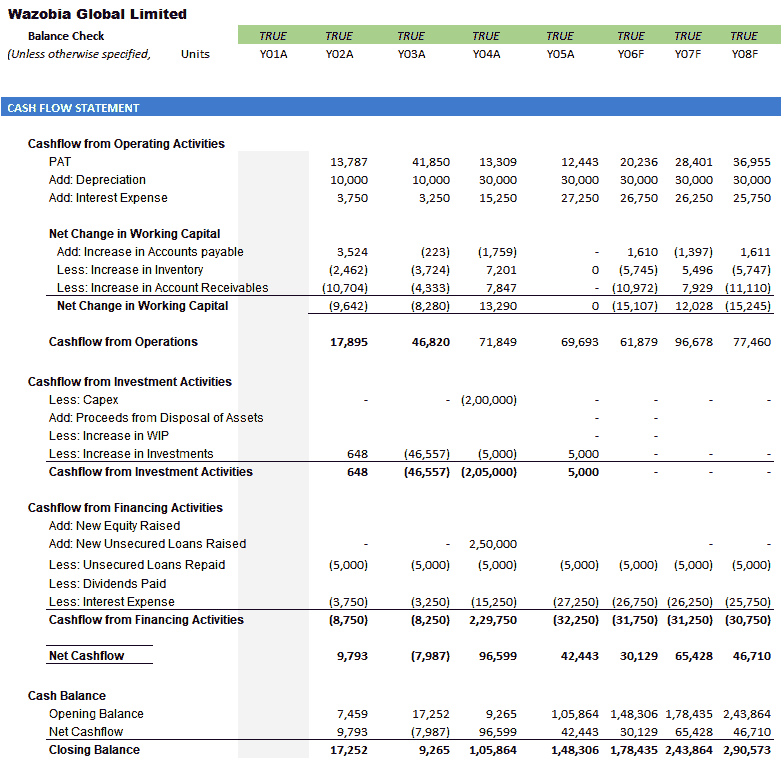

# 第一章：：金融建模与 Excel 简介

如果您问五位专业人士金融建模的含义，您可能会得到五种不同的答案。事实上，在他们各自的背景下，他们都是正确的。这是不可避免的，因为金融建模的使用边界几乎每天都在被拉伸，新用户想要从自己的角度定义这一学科。在本章中，您将学习金融模型的基本组成部分以及我最喜欢的定义。您还将了解当前业界存在的金融建模不同工具，以及 Excel 的哪些功能使其成为处理金融模型各种需求的理想工具。

在本章中，我们将涵盖以下主题：

+   金融模型的主要组成部分

+   理解数学模型

+   金融模型的定义

+   金融模型的类型

+   金融建模的替代工具

+   Excel——理想的工具

# 金融模型的主要组成部分

首先，需要有一个需要您做出金融决策的情况或问题。您的决定将取决于两个或更多选项的结果。让我们来看看金融模型的各个方面：

**金融决策**：金融决策可以分为三种主要类型：

+   投资

+   融资

+   分配或股利

# 投资

现在，我们将看一些投资决策的原因：

1.  **购买新设备**：您可能已经有了制造或建造内部设备的能力和知识。可能已经有类似的设备安装在现场。因此，需要考虑是自行制造还是购买、出售、保留或以旧换新现有设备。

1.  **业务扩展决策**：这可能意味着推出新产品，开设新分支机构或扩大现有分支机构。需要考虑以下内容：

+   **投资成本**：分离出所有与投资相关的成本，例如建设、额外人力、增加的运营成本、对现有业务的负面影响、营销成本等。

+   **投资带来的收益**：我们可以获得额外的销售。由于新投资，其他销售将得到提升，并带来其他可量化的好处。获得**投资回报率**（**ROI**），正的 ROI 表明该投资是一个好投资。

融资决策主要围绕着是从个人资金还是从外部来源获取资金展开。

例如，如果您决定贷款购买一辆汽车，您需要决定要作为您的贡献支付多少，以便银行填补差额。考虑因素如下：

+   **利率**：利率越高，你所寻求的外部融资金额就越低

+   **贷款期限**：期限越长，月供就越低，但您负债于银行的时间越长

+   **你能负担多少**: 这将为你所需要从银行获得的最少金额提供一个平台，无论他们提供的利率是多少

+   **每月偿还额的数量**：由于前述输入，你每月需要支付多少。

# 融资

公司需要决定是从内部（向股东寻求额外的股权）还是外部（获取银行融资）寻求融资。我们可以从以下列表中看到考虑因素：

+   **融资成本**：银行融资的成本可以轻松获取，如利息和相关费用。无论公司是否盈利，这些融资费用都必须支付。权益融资更便宜，因为公司不必每年支付股息，而且支付的金额由董事会决定。

+   **融资的可用性**：通常很难从股东那里挤出更多的钱，除非也许公司取得了一系列良好的业绩和体面的股息。因此，公司可能别无选择，只能寻求外部融资。

+   **来源的风险**: 外部融资存在的风险是，公司可能发现自己无法按期偿还债务。

+   **所需的债务或权益比率**：公司管理层希望维持与其风险偏好相称的债务与权益比率。冒险者可能会接受超过 1:1 的比率，而风险规避型管理层更倾向于 1:1 或以下的比率。

# 股息

**在有剩余资金时进行分配或股息决策**。决定是分配全部剩余资金、部分剩余资金，还是不分配。我们可以从以下列表中看到考虑因素：

+   **股东的期望**：股东提供廉价的融资选择，并且通常耐心等待。但是，他们希望确保他们的投资是值得的。这通常通过利润、增长，尤其是对其财务状况有直接影响的股息来体现。

+   **保留剩余资金以供未来增长需要**：董事会的职责是抑制满足尽可能多地宣布股息的压力，同时保留至少部分剩余资金以供未来增长和应急情况使用。

+   **保持良好的股利政策的愿望**：良好的股利政策对于保持现有股东的信心并吸引潜在的未来投资者是必要的。

# 理解数学模型

从整体来看，最佳或最优解通常用货币术语来衡量。这可能是产生最高回报的选项，成本最低的选项，承载可接受风险水平的选项，以及最环保的选项，但通常是所有这些特征的混合。不可避免地，情况中存在着固有的不确定性，这使得有必要根据过去的结果做出假设。捕捉情况或问题中所有固有变量的最适当方式是创建数学模型。该模型将建立变量和假设之间的关系，这些变量和假设作为模型的输入。该模型将包括一系列计算，以评估输入信息，并澄清和展示各种替代方案及其后果。正是这个模型被称为财务模型。

# 财务模型的定义

维基百科将财务模型视为一个数学模型，代表了财务资产、项目或其他投资的绩效。

Corporate Finance Institute 认为，财务模型通过利用某些变量来估计特定财务决策结果，有助于预测未来的财务绩效。

商业词典赞同数学模型的概念，即它由一组方程组成。该模型分析实体在不同经济情况下的反应，并关注于财务决策的结果。它继续列出了你在财务模型中可以期待找到的一些陈述和时间表。此外，该出版物认为模型可以估计公司政策和投资者以及放贷人设定的限制对财务影响的财务模型。它继续以现金预算为简单财务模型的例子。

eFinance Management 认为财务模型是财务分析师尝试预测未来年度收益和绩效的工具。它认为完成的模型是业务交易的数学表示。该出版物将 Excel 列为建模的主要工具。

这是我的个人定义：

“财务决策情景促使创建数学模型以促进决策。基于模型执行的计算结果，基于最佳行动方案及其后果。

# 财务模型的类型

有几种不同类型的财务模型。模型类型取决于模型的目的和受众。一般来说，当你想要对某事进行估值或预测时，或者两者兼而有之时，你可以创建一个财务模型。

以下模型是试图计算值的示例。

# 三表模型

在以下屏幕截图中，我们看到了大多数估值模型的起点及其包含的内容：

1.  **资产负债表**（**或财务状况表**）：这是一份关于资产（公司拥有的具有经济价值的资源，通常用于为公司创收，如厂房、机器设备和存货）、负债（公司的义务，如应付账款和银行贷款）和所有者权益（所有者对公司的投资的度量）的报表：

1.  **损益表**（**或综合收益表**）：这是一份报表，通过比较公司在特定期间内产生的收入与同期发生的支出，总结了公司的业绩：

1.  **现金流量表**：这是一份报表，识别了在审计期间来自各种来源、业务和交易的现金流入和流出。净现金流入应等于资产负债表在审计期间所显示的现金及现金等价物的变动。

该模型的数学以历史数据为基础。换句话说，上一个 3 到 5 年的损益表、资产负债表和现金流量表将被输入到 Excel 中。一组假设将被提出并用于推动下一个 3 到 5 年在三个报表中显示的财务结果。这将在本书后面更详细地说明，并会变得更清晰。以下屏幕截图显示了现金流量表的示例：

# 贴现现金流量模型

**贴现现金流量**（**DCF**）方法被大多数专家认为是估值公司最准确的方法。基本上，该方法认为公司的价值是公司能够产生的所有未来现金流的总和。实际上，现金根据各种义务进行调整，以得出自由现金流。该方法还考虑了货币的时间价值，这是一个我们将在后面的章节中更加熟悉的概念。DCF 方法将估值模型应用于*三表模型*部分提到的三个报表模型。后面，我们将遇到并全面解释包含在此估值模型中的技术参数。

# 比较公司模型

这种方法依赖于相似公司将具有相似倍数的理论。倍数例如，比较公司或企业（**企业价值**或**EV**）的价值与其收入。有不同水平的收入，例如：

+   **利润前利息**，**税收**，**折旧**和**摊销**（**EBITDA**）

+   **利息和税前利润**（**EBIT**）

+   **税前利润**（**PBT**）

+   **税后利润**（**PAT**）

对于每一家公司，可以产生多个倍数，并用于得出该公司的 EV 范围。比较方法在选择可比公司时过于简化和高度主观；然而，它受到分析师的青睐，因为它提供了一个快速确定公司价值指标的方法。

再次，这种方法依赖于三表模型作为起点。然后，您确定具有引用的 EV 的三到五家类似公司。在选择类似公司（**同行群体**）时，要考虑的标准包括业务性质、资产和/或营业额的规模、地理位置等等。我们使用以下步骤来做到这一点：

1.  我们需要为每家公司计算倍数（例如 *EV/EBITDA*、*EV/销售*、*P/E* 比率）。

1.  然后计算所有类似公司的倍数的均值和中位数。

中位数通常优于均值，因为它纠正了异常值的影响。异常值是样本中明显大于或小于其他项目的个别项目，因此往往会使均值倾向于一侧或另一侧。

1.  然后采用目标公司的中位数乘数，并将在方程中计算的收益（例如 EBITDA）替换为三表模型中计算的收益：

1.  当您重新排列公式时，您将得到目标公司的 EV：

# 合并与收购模型

当两家公司寻求合并，或一家公司寻求收购另一家公司时，投资分析师将建立一个**并购**（**M&A**）模型。首先为各个公司分别构建估值模型，然后为合并后的实体建立模型，并计算其每股收益。**每股收益**（**EPS**）是公司盈利能力的指标。它计算为净收入除以股份数。该模型的目的是确定并购对收购公司 EPS 的影响。如果并购后的 EPS 增加，则并购是增值的，否则是稀释的。

# 杠杆收购模型

在杠杆收购情况下，公司 A 通过现金（股本）和贷款（债务）的组合收购公司 B。债务部分往往很重要。公司 A 然后经营公司 B，为债务服务，然后在 3 到 5 年后出售公司 B。**杠杆收购模型**（**LBO**）将计算公司 B 的价值以及公司最终销售的可能回报。

我们现在将查看预测某事的模型。

# 贷款偿还计划

当您向银行申请汽车贷款时，您的客户主管会向您介绍贷款结构，包括贷款金额、利率、月度偿还额，有时还包括您可以负担得起的汽车成本的金额。让我们看一下以下屏幕截图中贷款的各种特点：

前述的屏幕截图为我们提供了一个贷款偿还计划模型假设布局的示例。月偿还额是用 Excel 的`PMT`函数计算的。期限为 10 年，但偿还是按月进行的（每年 12 个偿还期），因此偿还总期数为*(nper)()为 12 × 10 = 120*。请注意，年利率必须转换为每期利率，即`10%`/`12`（利率/期），以在我们的示例中给出每月`0.83%`。`pv`是贷款金额。我们还需要记住实际贷款金额是资产成本减去客户的贡献。

模型中添加了选择滚动条，以便可以轻松地变动客户贡献（10%-25%）、利率（18%-21%）和期限（5-10 年），并立即观察到结果，因为参数会立即重新计算。

前述的屏幕截图显示了他们用来迅速翻转您的期权的摊销表的类型。

# 预算模型

**预算模型**是公司现金流入和流出的财务计划。它建立了所需或标准结果的场景，包括营业额、采购、资产、债务等。然后可以将实际情况与预算或预测进行比较，并根据结果做出决策。预算模型通常是按月或按季度进行，重点关注损益表。其他类型的财务模型包括以下内容：

+   首次公开发行模型

+   部分总和模型

+   合并模型

+   期权定价模型

# 财务建模的备选工具

Excel 一直被认为是财务建模的首选软件。然而，Excel 存在显著的缺点，这使得认真的建模者寻找替代方案，尤其是在复杂模型的情况下。以下是财务建模软件试图纠正的 Excel 的一些缺点：

+   **大型数据集**：Excel 在处理非常大的数据时会出现困难。在大多数操作之后，Excel 会重新计算模型中包含的所有公式。对于大多数用户来说，这发生得非常快，甚至都没有注意到。然而，对于大量数据和复杂公式，重新计算的延迟变得非常明显，可能非常令人沮丧。替代软件可以处理包括复杂公式在内的巨大多维数据集。

+   **数据提取**：在建模过程中，您需要从互联网和其他来源提取数据。例如，公司网站上的财务报表，来自多个来源的汇率等。这些数据以不同的格式和不同程度的结构提供。Excel 在从这些来源提取数据方面做得相对不错。然而，这必须手动完成，因此很繁琐，并且受用户技能水平的限制。Oracle BI、Tableau 和 SAS 等软件是用来自动化数据提取和分析的。

+   **风险管理**：金融分析的一个非常重要的部分是**风险管理**。让我们在这里看一些风险管理的例子：

+   **人为错误**：在这里，我们谈论与人为错误后果相关的风险。在 Excel 中，暴露于人为错误的风险是显著且不可避免的。大多数替代建模软件都是以防止错误为主要考虑因素构建的。由于许多程序都是自动化的，这将人为错误的可能性降低到最低。

+   **假设错误**：在建立模型时，您需要做出许多假设，因为您在对未来可能发生的事情进行猜测。尽管这些假设至关重要，但它们必然是主观的。面对相同的情况，不同的建模者可能提出不同的假设集，导致截然不同的结果。这就是为什么有必要始终通过替换一系列关键假设的替代值来测试模型的准确性，并观察这如何影响模型。这个过程被称为敏感性和情景分析，是建模的一个重要部分。这些分析可以在 Excel 中完成，但范围总是有限的，并且是手动完成的。 另一种软件可以轻松利用蒙特卡洛模拟来为不同变量或变量组合提供一系列可能结果以及它们发生的概率。 蒙特卡洛模拟是一种数学技术，它为各种假设替换了一系列值，然后一遍又一遍地运行计算。 该过程可能涉及数万次计算，直到最终产生可能结果的分布。分布指示了个别结果发生的机会或概率。

# Excel 的优势

尽管 Excel 存在种种缺点，替代建模软件取得了非常令人印象深刻的结果，但 Excel 仍然是金融建模的首选工具。

让我们在下一节更深入地了解 Excel 的优势：

+   **已经在您的计算机上**：您可能已经在计算机上安装了 Excel。替代建模软件往往是专有的，必须手动安装在您的计算机上。

+   **熟悉的软件**：约 80% 的用户已经具备了 Excel 的工作知识。备选建模软件通常需要较长时间的学习曲线，以适应不熟悉的程序。

+   **无额外费用**：您很可能已经订阅了包括 Excel 在内的 Microsoft Office。安装新的专业软件并教导潜在用户如何使用该软件的成本往往很高且持续不断。每一批新用户都必须另外花费培训费用来学习备选软件。

+   **灵活性**：备选建模软件通常是为处理特定的一组条件而构建的，因此虽然它们在这些特定情况下是结构化和准确的，但它们是刚性的，不能修改以处理与默认条件显著不同的情况。Excel 是灵活的，可以适应不同的目的。

+   **可移植性**：使用备选软件准备的模型不能轻松与其他用户或组织外共享，因为其他一方必须具备相同的软件才能理解模型。Excel 在地理边界上从一个用户到另一个用户是相同的。

+   **兼容性**：Excel 与其他软件的通信非常良好。几乎所有软件都可以以一种或另一种形式生成可以被 Excel 理解的输出。同样，Excel 可以生成许多不同软件都能读取的格式的输出。换句话说，无论您希望导入还是导出数据，都存在兼容性。

+   **优秀的学习经验**：使用 Excel 从头开始构建模型给用户带来了极佳的学习体验。您会更好地理解项目和被建模的实体。您还会学习模型不同部分之间的联系和关系。

# Excel – 理想工具

以下功能使 Excel 成为任何数据的理想工具：

+   **理解数据**：没有其他软件能像 Excel 一样模拟人类的理解能力。Excel 知道一分钟有 60 秒，一小时有 60 分钟，一天有 24 小时，以此类推到周、月和年。Excel 知道一周的星期几、一年的月份以及它们的缩写，例如，星期三为 Wed，八月为 Aug，三月为 03！Excel 甚至知道哪些月份有 30 天，哪些月份有 31 天，哪些年份二月有 28 天，哪些是闰年并有 29 天。它可以区分数字和文本，还知道可以进行加法、减法、乘法和除法运算，以及可以将文本按字母顺序排列。基于对这些参数的人类化理解，Excel 构建了一系列令人惊叹的功能和函数，使用户能够从各种数据中提取几乎难以想象的细节。

+   **导航**：模型很快就会变得非常庞大，在 Excel 的容量下，大多数模型只会受到你的想象力和胃口的限制。这可能会使你的模型难以操作和难以导航。Excel 富有导航工具和快捷键，使这一过程变得不那么紧张，甚至是愉快的。以下是一些导航工具的示例：

+   *Ctrl + PgUp/PgDn*：这些键允许你快速在工作表之间移动。*Ctrl + PgDn* 跳转到下一个工作表，*Ctrl + PgUp* 跳转到上一个工作表。

+   *Ctrl + Arrow Key* (→↓←↑­)：如果活动单元格（你当前所在的单元格）为空，则按下*Ctrl + Arrow* *key*将使光标跳转到光标方向的第一个非空单元格。如果活动单元格已填充，则按下*Ctrl + Arrow* *key*将使光标跳转到光标方向的最后一个空单元格之前的最后一个填充单元格。

# 摘要

在本章中，我们看了一下构成财务模型的主要组成部分。我们了解了各种类型的财务模型以及它们在 Excel 中的工作方式。我们还了解了财务建模的替代工具以及 Excel 的各种优势。最后，我们看到了 Excel 是创建财务模型的理想工具的各种原因。

在下一章中，我们将看到创建模型涉及的各种步骤。
