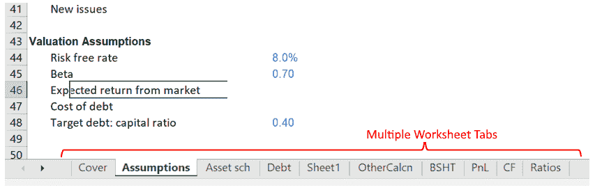
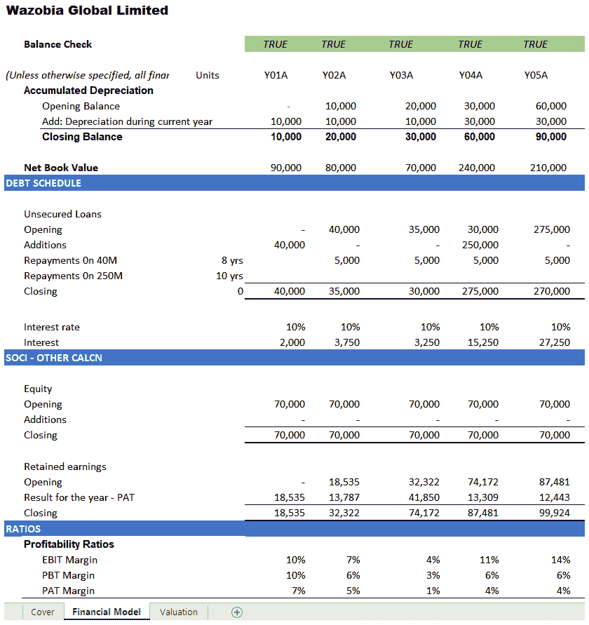
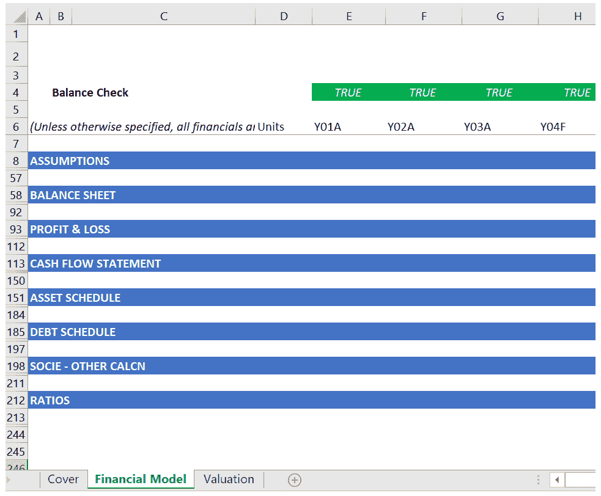
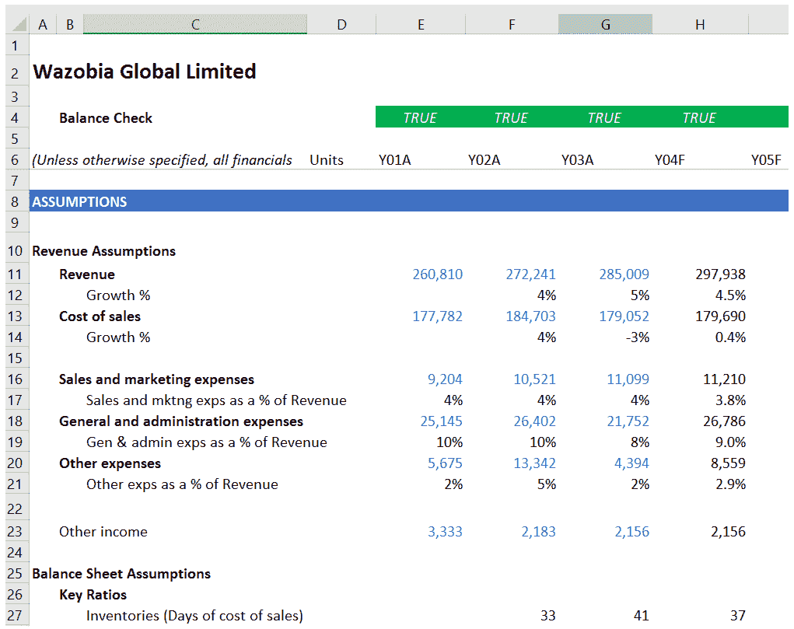
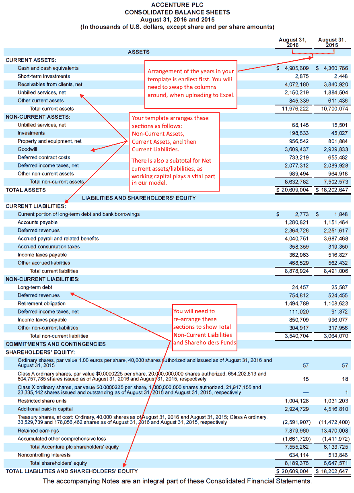
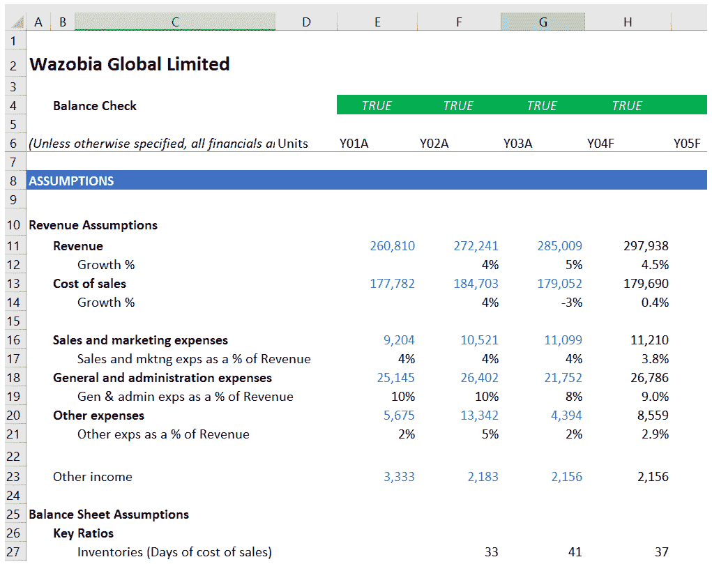
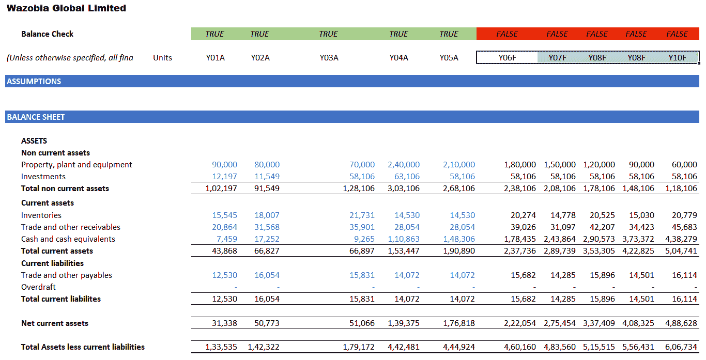
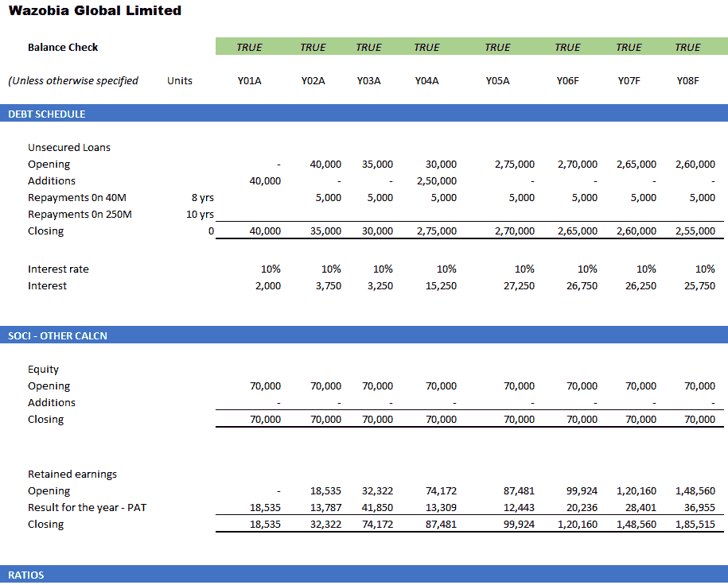
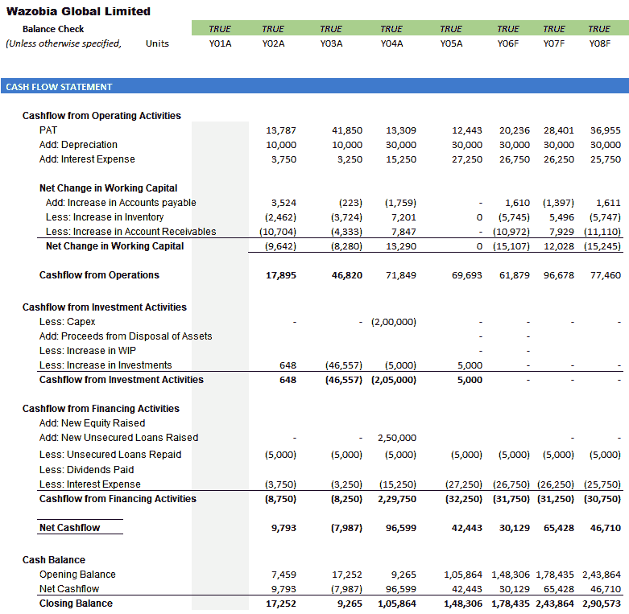
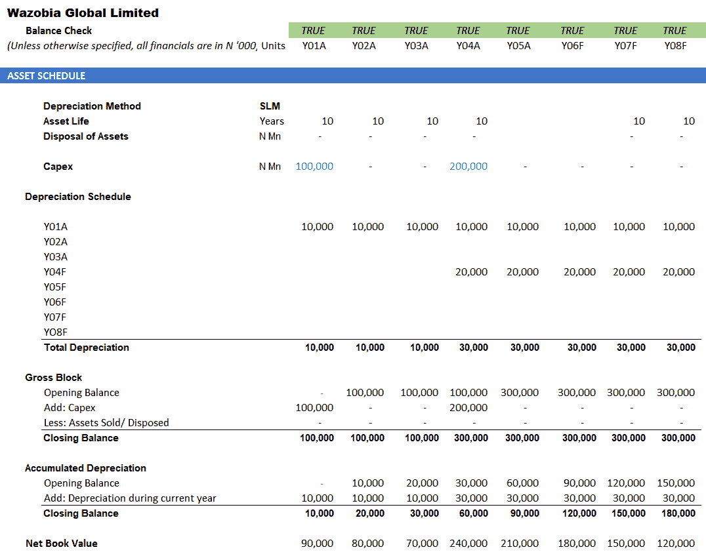

# 建立财务模型的步骤

你希望开展的任何项目都应该从准确了解项目的本质开始。如果你从错误的方向开始，将会发生三件事之一：

+   项目进行到一半时，你会意识到这不是客户想要的，然后你将不得不重新开始

+   你会说服客户接受一个从未打算的项目

+   你会坚持错误的项目，最终会被拒绝

如此多的事情取决于这个阶段，以至于它通常占据你总建模时间的大约 75%。

在本章中，我们将涵盖以下主题：

+   与管理层的讨论

+   建立假设

+   为你的模型建立模板

+   历史数据

+   投影资产负债表和损益表

+   额外的时间表和预测

+   现金流量表

+   估值

# 与管理层的讨论

这是你确定或确认模型的范围和目标的地方。管理层也是关于未来计划和趋势的信息的主要来源。

通常，第一次提问时不可能获得所有细节。因此，你应该准备好回到各个部门负责人那里，从更好的理解的位置提出同样或类似的问题。

# 评估管理层的期望

在与管理层讨论时，你需要清楚地了解他们对任务的期望以及他们希望实现的目标。

如果所需的仅仅是一个预测的现金流量，那么一个完整的估值模型将是浪费时间和资源的，而且你可能不会为额外的工作付费。我们将在本书的后面详细讨论重要的现金流量表和不同的估值模型。

# 了解你的客户业务

你必须全面了解客户的业务。你需要了解企业所在行业，并确定由于地理位置而产生的任何特殊性，以及客户特有的特点。你还应该了解行业的趋势，并了解客户的竞争对手是谁。如果客户在一个专业领域经营，你需要考虑与该领域的专家咨询。每当存在不确定性时，协同证据是你正在做正确事情的最佳保证之一。

# 部门负责人

部门负责人将对未来增长和预期趋势的假设做出最大的贡献。他们在各自的专业领域已经工作多年，并且比大多数人更了解业务。因此，你应该依赖他们的回答。

因此，你应该能够评估他们在为公司的计划提供可信洞察方面的能力。

# 建立假设

财务建模就是将结果或行为投射到未来。

要做到这一点，你需要建立一套假设来弥合实际表现与未来结果之间的差距。虽然你需要对模型中的每一项进行预测，但你的假设将专注于对最终结果产生重大影响的项目。其他非重大项目可以投影为营业额的百分比（对于收入项目）或最佳判断数字（对于资产负债表项目）。

你的假设需要考虑项目是增加、减少还是保持不变。你计算预期变化的方式称为增长驱动因素。例如，对于收入项目，它可以是通货膨胀、年度增长或其他一些指标。

# 为你的模型建立一个模板

无论你的模型是否会被他人使用，都很重要的一点是在建立和维护模型的方式上要有系统性。即使只有你自己会使用该模型，但每当你在一段时间后需要重新审视该模型时，你都不希望不得不浏览各种时间表和工作表以找到你需要的内容。

如果你的模型将由其他人使用，则更加重要。

确保你的模型易于跟踪和使用的一个好方法是建立一个模板（标准格式），其中有一些简单的规则指导数据的输入和呈现。通常，你至少需要六列数字，其中包括三列历史数据和三列预测数据，另外还有三到四列描述性信息。模板应增强导航并易于跟踪。第一个主要决定是是否采用单工作表或多工作表方法。

以下是这两种方法的一些优缺点：

+   **多工作表方法**：在多工作表方法中，每个工作表都专门用于一个报表。因此，你会有假设、资产负债表、利润表、现金流量表等，所有这些都在单独的工作表上。这意味着你最终会得到 10 个或更多的工作表。以下截图显示了这种方法所需的多个选项卡的指示：

当你将一个工作表专门用于一个报表时，例如资产负债表，你知道资产负债表工作表上的所有内容都与资产负债表相关。工作表上没有模糊不清的内容。如果你需要修改或查询该工作表的内容，你可以这样做，而不必考虑是否会影响除资产负债表之外的其他报表。

为了方便浏览你的模型，你应确保每年在每个工作表上都在同一列中。这样，如果资产负债表工作表中的`Y05F`年份在第 **J** 列，那么利润表、现金流量表和所有其他工作表中的该年份也应在第 **J** 列。

+   **单表格方法**：为了遵循这种方法，您必须确保从一开始就保持所有语句的标准布局。对列宽度的任何更改或尝试插入或删除列都将影响所有语句，因为它们是一层叠在另一层上。这种方法的重要部分是对每个语句进行分组。Excel 允许您对行进行分组，以便可以通过点击**–**或**+**来折叠和隐藏或展开和显示，该符号显示在创建组时显示的行标签旁边。以下屏幕截图是单表格方法的示例：

在行号之前的左边框上有垂直线。每条垂直线的长度覆盖了该特定分组中包含的行范围。折叠或展开按钮显示在该行的末尾，即该组的最后一行之后。当组展开时，它显示为一个**–**号。点击**–**号将折叠该组，并将标志变为**+**号。如果您希望展开该组，则点击**+**号。

创建分组时，要确保当你折叠一个语句时，该语句的标题仍然可见，如下面的屏幕截图所示。在这个屏幕截图中，你会注意到，当时间表被折叠时，第**8**行后面跟着第**57**行。中间的行是`ASSUMPTIONS`时间表。通过点击标签为第**57**行旁边的**+**号，该分组将会展开，显示完整的时间表。以下屏幕截图是你的分组正确排列的示例：

接下来，我们将看一下列布局。在您的思考中存在导航问题的情况下，缩小前两列，**A**和**B**，并扩展列**C**，如下面的屏幕截图所示。列**A**将用于一级标题，列**B**用于二级标题，列**C**用于需要更宽列的描述或细节。

以下屏幕截图显示了您的模板应该是什么样子：

这种排列产生了级联效应，并促进了使用 Excel 键盘快捷键快速在同一级别的标题之间导航。例如，在光标位于`ASSUMPTIONS`，单元格**A8**上时，按下*Ctrl* + 向下箭头（*↓*）将导致光标跳转到单元格**A25**，`Balance Sheet Assumptions`。列**D**将用于`Units`，列**E**用于第一年的历史财务数据。正如本章前面提到的，年份应该在多表格方法中在每个工作表中保持相同的列。对于单表格方法，这不是问题，因为语句是一层叠在另一层上的。

+   **颜色编码**：这是一种区分输入（硬编码）单元格和包含公式的单元格的方法。硬编码单元格应该是蓝色字体，而计算单元格保持默认的黑色。当进行故障排除或需要修改原始假设时，这将非常有帮助。你将能够很快地识别出输入单元格，这些是可能需要修改的唯一单元格。

+   **冻结窗格**：通过这个选项，当你向下滚动到常规可见性以下时，你将能够保留标题和列标题的可见性。你应该冻结窗格，以便资产负债表余额核对和年份保持在冻结行中可见。

+   **四舍五入**：当你必须用年度财务数据填充 10 列时，四舍五入的重要性就显而易见了。屏幕空间很快就会被填满，这就有必要向右滚动以查看部分数据。

尽可能地，你应该将数字四舍五入，以便所有年份都适合一个屏幕宽度。

# 历史财务数据

一旦模板就位，下一步就是获取历史财务数据。对于历史数据，我们感兴趣的是资产负债表、损益表和现金流量表。在编制财务报表的过程中，通常会有许多初稿，这些初稿的内容在最终确定报表时可能已经被替换。确保你得到的财务数据是最终审计过的财务报表。你拥有的信息越多，你的预测就越准确。然而，你不应过度追求，因为过多的信息会使模型变得不必要地繁琐。一般来说，历史数据限制为五年，再加上五年的预测财务数据。尽量获取 Excel 可读格式的历史财务数据软件副本，因为这将大大减少你转换为模板格式所需的时间。

不可避免地，你需要整理数据，使格式和排列与你的模板以及其他异常一致。当你创建模型时，历史财务数据中的实际数字不会改变；然而，往往情况是，你获取的财务数据来自于一个与你不同偏好和优先级的来源。此外，这些财务数据并未考虑你和你的财务模型。因此，导入的数据中充斥着格式或表现异常，这使得有些 Excel 工具和快捷方式难以使用，有时甚至不可能使用。这使得有必要重新输入一些或所有的财务数据。

以下屏幕截图是**ACCENTURE PLC**在**2016 年 8 月 31 日**发布的资产负债表，摘自 Accenture 网站（[`www.accenture.com/_acnmedia/PDF-35/Accenture-2016-Shareholder-Letter10-K006.pdf`](https://www.accenture.com/_acnmedia/PDF-35/Accenture-2016-Shareholder-Letter10-K006.pdf)）。它说明了即使是最成功的财务报表也需要进行调整以适应您的模板：

由于我们需要五年的历史财务报表，我们需要下载另外两套账户，截至 2014 年 8 月 31 日（其中包括 2013 年的数据）和 2012 年的账户，以便我们有 2012 年至 2016 年的账户。这意味着您将不得不在另外两套账户上重复所有的更正和调整。在修正历史账户的格式和呈现后，您应将历史财务数据转换为您的模板，最早的年份放在 E 列，随后的四年放在随后的列中。您应确保这些历史年份的余额核对结果为`TRUE`，这将使您确信历史数据已完整准确地导入。以下屏幕截图说明了余额核对显示资产负债表是平衡的：

# 预测资产负债表和损益表

为了预测财务状况，您需要确定资产负债表和损益表的增长驱动因素。增长驱动因素是最能捕捉个别项目多年变动的参数。项目的性质和您的专业知识将决定您选择哪个参数作为适当的增长驱动因素。营业额的增长驱动因素的一个例子是年度增长或通货膨胀。

你应该知道，资产负债表的增长驱动因素并不像损益表那样直接。我们将在第五章详细介绍这一点，*理解项目并建立假设*。

一旦计算出增长驱动因素，您将需要参考您与管理层的讨论记录，特别是各部门负责人对未来五年增长可能表现的建议。一个例子可能是过去五年历史上**复合年增长率**（**CAGR**）的稳定年度增长。复合年增长率将在第五章中详细解释，*理解项目并建立假设*。

现在，我们将预测未来五年的增长驱动因素。

一旦完成，将第一个预测年份`Y06F`的驱动器应用于上一年`Y05A`的实际营业额，该年是历史数据的最后一年，以获得`Y06F`的预测营业额，如下截图所示：

对于每个后续年份的每个项目，请按照以下步骤建立资产负债表和损益表。

# 附加计划和预测

在前面截图中你会注意到的第一件事是，`结余核对`现在在预测年份中是红色的，`FALSE`。这是因为我们的资产负债表和损益表还没有完成。我们对大多数项目进行了增长预测，但有些项目需要特殊处理，例如资本支出、折旧、贷款和利息。

`资产计划`：这份计划是为了记录财产、厂房和机器的变动而准备的。以下截图显示了完整的`资本支出`和`折旧计划`值：

公司对模型持续时间内的资本支出计划将在此反映出来。历史资本支出和资产处置将显示在发生支出或销售的年份下。该计划还将考虑资产的成本和使用寿命以及折旧率和方法。具有不同折旧率的资产将分别处理。

这个计划的最终目的是固定资产的年末总成本，累积折旧费用。这些将使用 BASE 方法计算出来。这些余额被列入资产负债表。这个计划的另一个重要输出是年度总折旧费用，这被列入损益表。

`债务计划`：债务计划是为了追踪有担保和无担保贷款的变动而准备的。同样地，使用 BASE 方法，我们得到了带到资产负债表上的期末余额。这份计划还用于计算年度的利息支出，这些支出被列入损益表。以下截图是债务计划和其他用于更新资产负债表和损益表的计划的示例：

**股本变动**：股本由未分配的股本和积累的未分配利润表示。股本的增加以及因年度盈利或亏损以及股息和其他分配而导致的储备变动都将在此反映。最终的股本和储备余额被列入资产负债表。

# 现金流量表

在这个阶段，我们预测年度的损益账户现在已经完全填满。但是，我们的资产负债表仍然显示一个红色的 `FALSE`，表示资产负债表中缺少一些内容。与其他项目不同，现金是不可能预测的。现金余额是在审查期间进行的所有交易的结果。这一事实体现在现金流量表中，该表考虑了现金的流入和流出。然后将净结果应用于期初现金余额，以得出期末的现金余额。以下截图显示了一个完成的现金流量表，其中包含了一个现金的期末余额，该余额被带到资产负债表上：

当期末现金余额被带到资产负债表上时，预测年度的资产负债表现在应该显示一个白色的 `TRUE`，背景为绿色，这表明到目前为止的计算是正确的。现金流量表是公司最重要的报表之一。对于大多数投资分析师来说，现金为王。您可能想知道为什么您需要另一张看起来类似于重新排列的资产负债表的报表。请记住，账目是根据权责发生制准备的。

这意味着利润和损益账户中显示的部分营业额可能尚未转化为现金。例如，在年底，一些客户可能尚未支付从您那里以信用购买的商品。同样，费用是在发生时记录的，即使您可能尚未支付这些费用，例如，通常拖欠支付的费用，如电费或您以信用购买的商品。

现金流量表被构建出来从资产负债表和损益账户中提取现金流入和流出。该报表分别显示了来自经营活动的现金流量，来自投资活动的现金流量和来自筹资活动的现金流量。您希望来自经营活动的现金流量定期大于净收入。如果情况相反，您将想知道为什么要延迟将收入转化为现金。投资活动部分显示了长期资产的变动，例如长期投资和固定资产。

新贷款和偿还现有贷款，以及股本变动将在筹资活动下反映出来。为了保持健康的股利政策，偿还贷款，并为扩张提供资金，公司需要持续产生比利用更多的现金。

# 准备比率分析

随着现金流量表的准备，我们现在拥有了一套财务报表的核心内容。这些财务报表，现在称为资产负债表，综合收益表和现金流量表，以及解释性注释和时间表，被分发给公司的股东和政府。也正是这些财务报表可供其他利益相关者使用，如投资者和公司的债务资本持有者。

财务报表提供了关于公司及其审查期间结果的大量信息。然而，单凭它们本身不足以做出决策。比率分析提供了对数字背后细节的深入了解。以下屏幕截图是一组比率分析的示例：

通过查看账户中的战略配对数字之间的关系，比率分析可以提供关于公司的盈利能力，流动性，效率和债务管理的见解，以及一段时间内的情况。前面屏幕截图中的比率绝不是穷尽的。可以选择的比率种类繁多，不同的建模者将有自己的偏好。

然而，重要的是，您应该能够以提供定性协助决策过程的方式解释您选择包含的任何比率。

# 估值

估值有两种主要方法，如下：

+   **相对方法**：在这种方法中，您有以下方法：

    +   **对比公司估值法**：此方法通过查看类似企业的价值及其交易倍数来获得企业的价值，其中最常见的是**企业价值**（**EV**）和**利息税前**，**折旧**，**摊销**之前的**收入**（**EBITDA**），其中**EV**被除以**EBITDA**。

    +   **先例交易法**：在这种方法中，您将企业与最近出售或收购的同行业其他类似企业进行比较。同样，您可以使用倍数来推导出您企业的价值。

+   **绝对方法**：该方法估计公司所有未来的自由现金流，并将其贴现回今天。它被称为**折现现金流**（**DCF**）方法。基本上，该方法认为公司的价值可以等同于考虑以下因素后它可以生成的现金金额：

+   自由现金流

+   时间价值

+   折现率

+   资本成本

+   加权平均资本成本

+   终端增长率

+   终值

这些技术概念将在第九章*估值*中进行更详细的解释。DCF 方法通常会导致实体的最高价值，但被普遍认为是最准确的。为了赋予公司价值的不同结果以意义，然后您将绘制它们所有以获得一系列值，这些值可以用多种方式解释。

通常情况下，如果公司的报价低于最低计算值，则会说该公司被低估，如果报价高于最高计算值，则被高估。如果需要单一值，则可以取所有计算值的平均值。

# 总结

在本章中，我们看了建立财务模型时应遵循的步骤。我们了解到为什么需要有系统化的方法。我们从与管理层讨论开始，直到计算企业和公司股份的估值，并理解每个步骤的目的和重要性。

在下一章中，我们将看看如何使用 Excel 公式和函数来加快我们的工作，并使建模成为一种更有价值的体验。
