# 第四章：公式和函数 - 用单个公式完成建模任务

使 Excel 不仅仅是一个赞美的电子计算器的第一件事之一是它使用函数和公式的功能。这个特性允许 Excel 将许多数学任务（其中一些可能非常复杂）合并成一个单一的函数。在本章中，您将学习如何使用公式，并了解一些最广泛使用的函数。

本章将涵盖以下主题:

+   理解函数和公式

+   使用查找函数

+   实用函数

+   透视表和图表

+   避免的陷阱

# 理解函数和公式

为了输入公式或函数，你必须先键入 `=`。**公式**是包含一个或多个运算符（+，-，/，* 和 ^）的语句，例如 `=34+7` 或 `=A3-G5`（这个公式从单元格 `G5` 的内容中减去单元格 `A3` 的内容）。一个函数也可以作为公式的一部分，例如 `=SUM(B3:B7)*A3`。

**函数**是包含一系列指令的命令，供 Excel 执行。一个函数包含一个或多个参数，邀请用户指定要执行指令的输入单元格或单元格范围，例如，`MATCH(A5, F4:F23,false)`。

函数可以包含一个公式作为参数的一部分，例如 `=IF(A4*B4>C4,D4,E4)`。

然而，它们之间的区别通常被忽略，并且术语“公式”用来表示公式或函数。

要输入公式，我们以 `=` 符号开始，然后是函数的名称，然后是开括号。在编辑模式下，屏幕下方会显示一个屏幕指南，显示需要指定的参数。每个参数之间用逗号分隔，第一个参数以粗体字显示，因为它是活动参数。一旦指定了参数的输入，按逗号键（*，*）。粗体突出显示移动到下一个参数，因为它现在是活动参数。当所有输入都已指定时，我们关闭括号以结束公式。

# 使用查找函数

查找函数是 Excel 中使用最广泛的函数之一。通常，意图是从一个表（源）中获取一个值到你正在输入公式的活动单元格（目标）。基本上，该函数指导 Excel 标识源表中的行和列。该行和列的交叉点将为您提供要提取其值的源单元格。例如，假设您有一个包含在指定期间内销售的各种产品数据的销售报告，您希望在报告中填写一个字段，`产品成本`，并填入每个产品的成本。

下面的屏幕截图是一个示例销售报告，显示了每日销售的详细信息，包括 `产品`，`销售人员` 和其他详细信息：

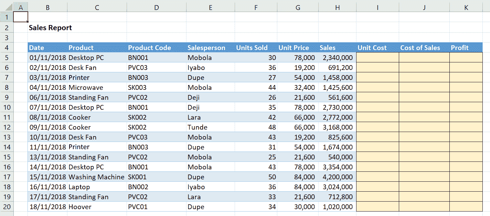

每个产品的`单价`可以从产品数据库中获取。

你可以使用查找函数来定位产品数据库中的各个产品，然后检索相关成本。我们也将这个表称为我们的源表，`产品数据库`。以下截图是一个示例`产品数据库`表，显示了每个产品的产品代码和单价：

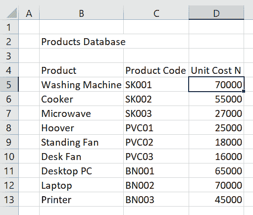

为了确保你的查找选择了正确的项目，你必须使用一个在两个表中都出现的唯一查找值，一个能够唯一标识每个记录的值。人们可能有相同的名字，所以你应该使用员工 ID 而不是员工姓名；同样，产品名称可能重复，所以你应该使用`产品代码`。

有许多查找函数，每个函数都有特定的适用场景。我们将看一些较为流行的函数。

# `VLOOKUP`函数

`VLOOKUP`的参数如下截图所示：

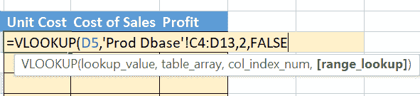

方括号`[]`括起来的任何参数都是可选的；因此，如果没有为该参数输入任何值，则会采用默认值。必须为所有其他参数输入值；否则，公式将导致错误。

对于`VLOOKUP`函数，可选参数是`range_lookup`。这需要你选择`True`，如果你正在寻找查找值的近似匹配，或者选择`False`，如果你正在寻找确切的匹配。Excel 允许你将`1`替换为`True`，将`0`替换为`False`。如果未选择任何值，则参数默认为`False`。

这个函数告诉 Excel 在你指定的查找数组中从左边的第一列中找到查找值。请注意，这可能不是源表的第一列。

在我们的例子中，查找值是一个产品代码；因此，对于我们销售报告中的第一条记录，查找值是`BN001`，位于单元格**D5**。下面的截图显示了在`销售报告`表中构建`VLOOKUP`公式：

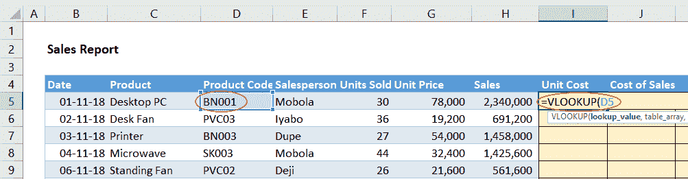

我们的查找数组必须从`产品数据库`表的第**C**列开始，因为这是`产品代码`字段所在的地方——请注意，这是`产品数据库`表的第二列。然后 Excel 将在此第一列中定位查找值的位置，如下截图所示：

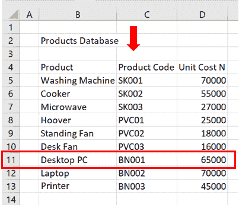

从上述截图中，我们可以看到产品`BN001`在`产品数据库`表的第**11**行，在`产品代码`字段中。

下一个参数是 `column_index_num`（列索引号）值，它指的是从唯一字段开始的查找数组中源字段的位置。**源字段** 是您要检索数据的字段。在我们的示例中，源字段是 `Unit Cost`，即 `D` 列，我们查找数组的第二列。这给了我们 `col_index_num` 为 `2`：

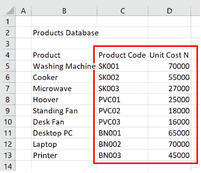

这样，我们已经确定了源单元格的列 **D** 和行 **11**。然后，Excel 将从单元格 **D11**（`65,000`）检索数据，并将其放置在我们的目标单元格中 `销售报告` 表中：

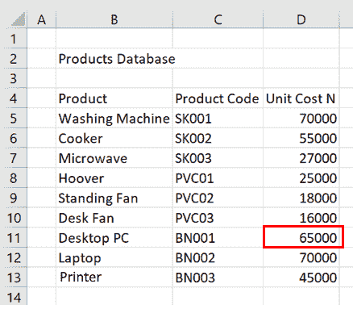

完成公式并成功提取我们 `销售报告` 表中第一条记录的单位成本后，将公式复制到 `销售报告` 表中其他记录的列中。

# INDEX 函数

`INDEX` 和 `MATCH` 函数通常一起使用。 `INDEX` 函数具有用于指定源单元格行和列的参数。为了使公式动态化，您将 `MATCH` 替换为 `INDEX` 参数，用于行、列或两者。这是一个非常强大的公式，具有用于数组和简单公式的参数：

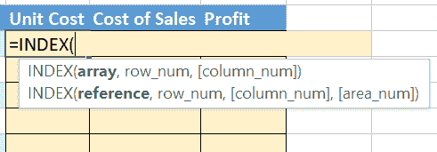

`INDEX` 公式的参数的第一行用于数组范围。数组公式返回一系列值，而不仅仅是一个值——这与简单公式的情况不同。我们将在本书后面讨论数组公式，但现在我们将集中在简单公式上。

参数的第二行用于引用形式。第一个参数需要与 `VLOOKUP` 中的查找数组相似的引用。在简单的索引公式中，这可以限制为一个列内的单元格范围（或者一个行内的单元格范围）。

如果将索引引用限制为一列，则实际上已经确定了源单元格的列。在我们的示例中，我们选择了单元格 `D5` 到 `D13` 作为我们的参考：

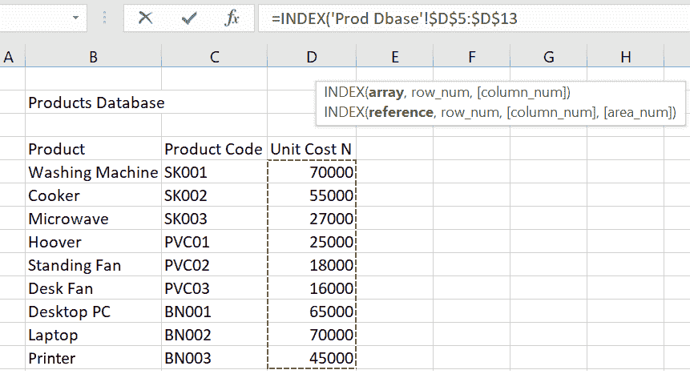

下一个参数是 `row_num`。为了将其替换为 `row` 参数，您需要将 `MATCH` 函数嵌入到仍然活动的 `INDEX` 函数中。要做到这一点，只需在逗号后开始键入新函数。只要您尚未为函数输入最终括号，Excel 就会认识到公式仍然活动，因此无需再次键入 `=`。

# MATCH 函数

`MATCH` 函数中的第一个参数是 `lookup_value` 参数，它在查找数组中查找。但在这种情况下，对于查找数组的位置没有限制。我们在 `销售报告` 工作表的单元格 **D5** 中使用与 `VLOOKUP` 示例相同的查找值 `BN001`。

再次在以下截图中显示，您可以将查找数组限制为一列。在我们的示例中，我们知道我们的查找值的匹配项在“产品数据库”工作表的第 **C** 列的`产品代码`字段下。因此，我们选择单元格 `C5` 到 `C13` 作为我们的查找数组：

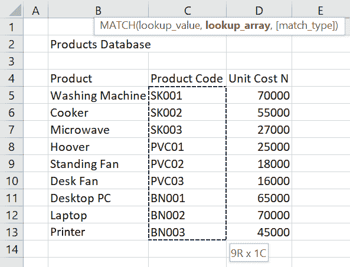

请注意，`MATCH` 查找数组必须从与 `INDEX` 函数中的引用相同的工作表行开始。在我们的示例中，它们都从工作表行 **5** 开始。您用 `match_type` 结束匹配公式，其与 `VLOOKUP` 函数中的 `range_lookup` 相同。您需要指定是否要近似匹配、小于（`1`）、大于查找值（`-1`）或精确匹配（`0`）。

`MATCH` 函数返回一个整数，该整数对应于在查找数组中找到查找值的行的位置。这不应与工作表行号混淆。

在我们的示例中，`MATCH` 函数将返回数字 `7`，因为查找值 `BN001` 在我们的查找数组——工作表行 **11** 的第 7 行中找到。一旦您关闭 `MATCH` 公式的最后一个括号，Excel 就会带您回到 `INDEX` 函数。

下一个参数是 `column_num`。由于我们已经通过限制我们的引用到一列来确定了列号，因此我们可以忽略此参数。最后一个参数 `area_num` 用于更复杂的情况，例如在行和列之后引入第三维，比如具有相同字段布局的多个表。同样，我们可以忽略此参数，因为我们不会使用它。

找到了第 **7** 行和第 **D** 列后，现在我们有了源单元格 **D11**，其返回值为 `65000`。您会注意到 `INDEX` 和 `MATCH` 克服了 `VLOOKUP` 中的限制，其中唯一字段必须是查找数组的第一列。

结果，许多用户更喜欢使用 `INDEX` 和 `MATCH`，即使 `VLOOKUP` 也可以工作。那些被 `INDEX` 和 `MATCH` 的函数组合吓倒的人更喜欢坚持使用 `VLOOKUP`，他们宁愿改变表列的顺序以使其适用于 `VLOOKUP`。

# `CHOOSE` 函数

`CHOOSE` 函数允许您创建一个值或要执行的操作列表，然后通过选择列表中值或操作的位置来选择要使用的值或要执行的操作。`CHOOSE` 的语法如下截图所示，有两个参数：`index_num`，然后是作为 `value1`、`value2` 等显示的值或操作的列表。

此截图显示了 `CHOOSE` 函数的参数：

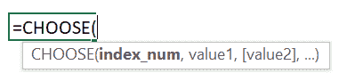

在此示例中，我们希望将产品单位成本的平均值和中位数分别显示在`Products Database`工作表中。 我们首先在一个空单元格中设置数据验证，以便通过单击旁边出现的下拉箭头来选择值`1`或`2`。 具有数据验证的单元格将是`CHOOSE`公式的`index_num`。 这是数据验证的屏幕截图：

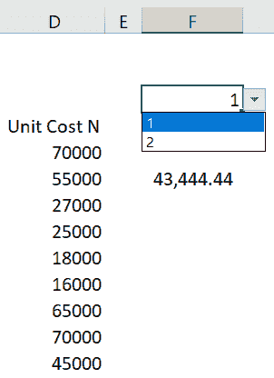

然后，我们列出要选择的操作。 在这种情况下，我们有平均值或中位数。 如果我们按照这个顺序列出它们，那么如果`index_num`显示`1`，则将选择平均值，如果显示`2`，则将选择中位数。 以下屏幕截图显示完整的`CHOOSE`公式：

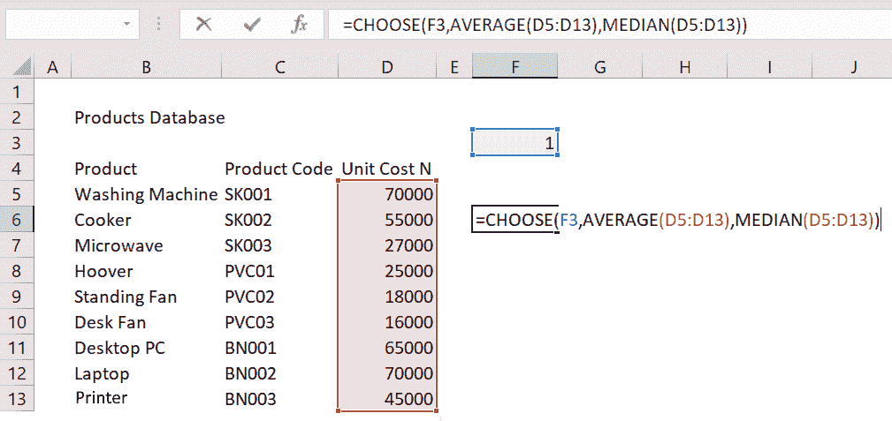

当索引编号为`1`时，选择`AVERAGE`函数，并返回值`43,444.44`。 这是`CHOOSE`函数的屏幕截图，其中`Index_Num`为`1`：

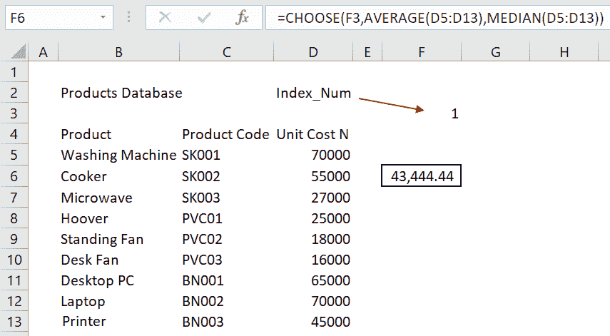

当索引编号为`2`时，选择`MEDIAN`函数，并返回值`45,000.00`。 这是`CHOOSE`函数的屏幕截图，其中`Index_Num`为`2`：

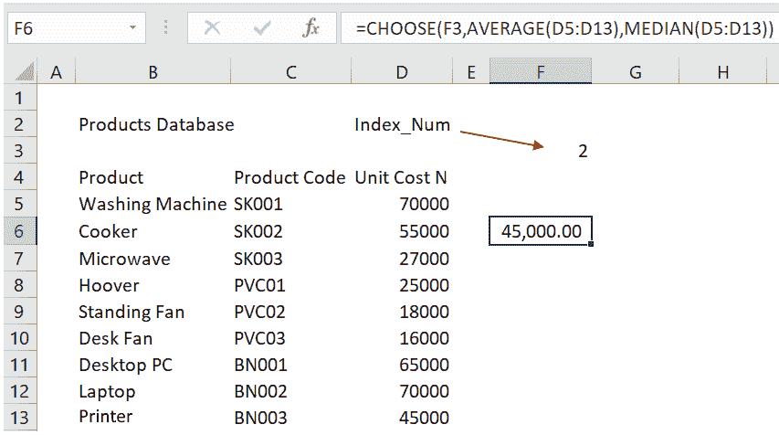

# 实施`CHOOSE`函数

假设您正在跟踪公司的财务记录，并且您的老板希望您每周提交两份报告，其中包含您在特定周的销售总额和您对公司商店的购买总额。 你会怎么做？

您可以随时选择所有销售实例，然后计算它们的总和。 一旦完成，您必须再次选择所有购买实例，并找到购买的总和。 这样频繁地做会非常耗时和乏味。 这就是`CHOOSE`函数发挥作用的地方！ 我们可以实现一个简单的模型，一键完成所有操作，以下是使用以下步骤：

1.  加载您需要核算的所有必需值并编制成表格，如下所示：

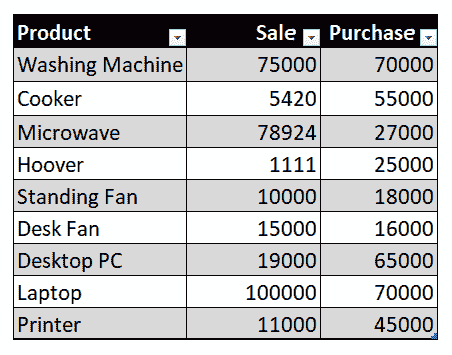

1.  现在我们将开始编写`CHOOSE`函数：

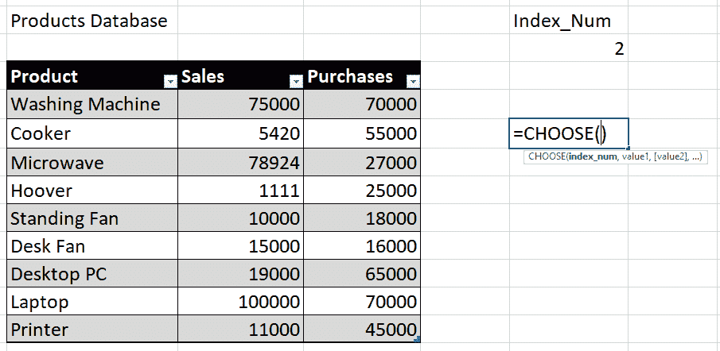

1.  我们需要输入的第一个值是我们放置选项的单元格，对我们来说是`F4`：

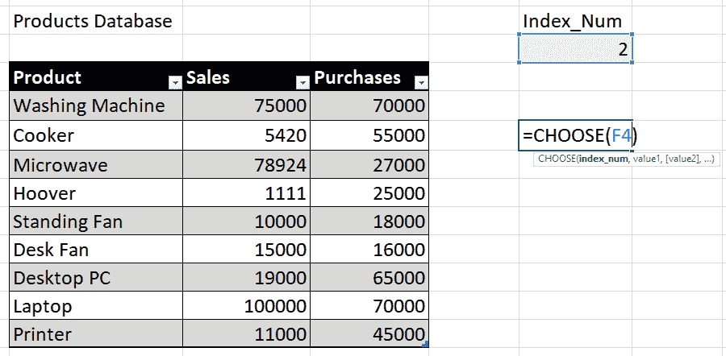

1.  现在，我们将为`F4`分配两个选项，`1`和`2`，使用数据验证。 现在我们将编辑公式，以便如果我们选择`1`，则输入公式的单元格将显示该周所有销售额的总和，如果我们选择`2`，它将显示所有购买的总和。 所以，我们首先将选择`Sales`列中的所有单元格，从`C6`到`C14`，并将其输入到公式单元格中，如下所示：`SUM(C6:C14)`。

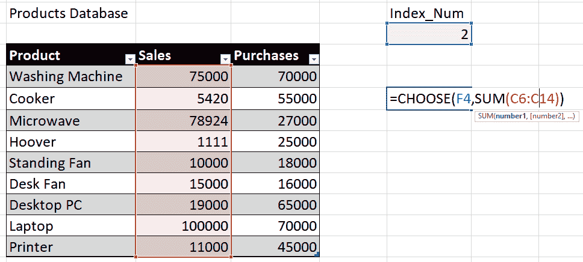

1.  接下来，我们将选择`Purchases`列中的所有单元格，并将它们输入到公式的下一个字段中作为`SUM(D6:D14)`，如下所示：

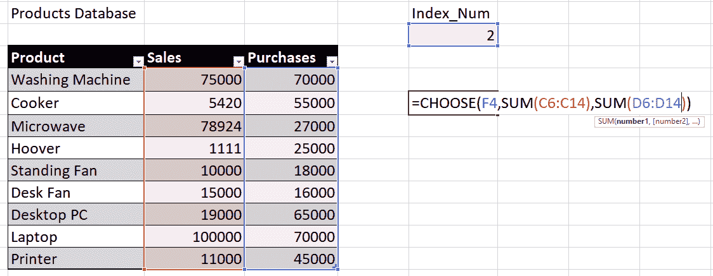

1.  这导致以下输出：

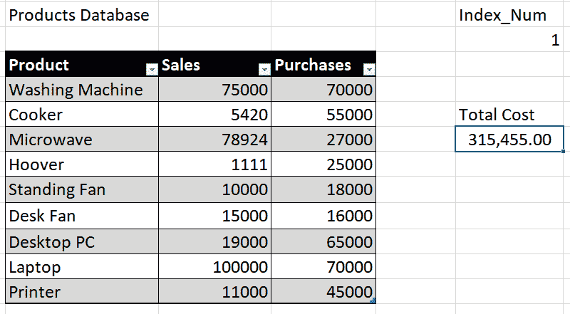

现在，如前面的屏幕截图所示，当选择`1`时，销售成本变得可见，这在我们的情况下是`315,455.00`。

1.  如果我们选择`2`，我们将得到购买成本，如下所示：

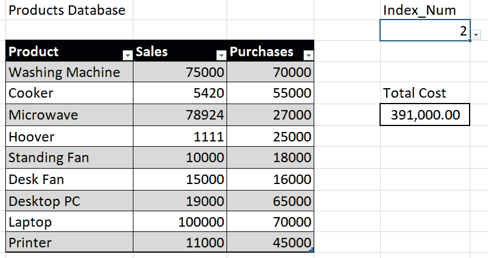

这只是一个基本的场景，函数可以派上用场。当您需要对大量需要进行过滤和排序的数据时，这将非常有用。

# 实用函数

实用函数可以单独使用。但是，在嵌入到其他更复杂的函数中时，它们才能充分发挥作用。在这种情况下，它们通过提供对更多条件或变量的访问来扩展封闭函数的范围和功能。

一些实用函数的示例是`IF`、`AND`、`OR`、`MAX`、`MIN`和`MATCH`。我们现在将在这里看一些。

# IF 函数

这是 Excel 中最常用的函数之一。它可以单独使用或作为另一个公式的一部分。`IF`函数检查条件是否满足，然后如果满足，则返回一个值，否则返回另一个值。语法包含三个参数：

+   `logical_test`：逻辑测试是一个语句，如果满足条件则返回`true`，如果不满足条件则返回`false`。

+   `value_if_true`：此参数允许您指定在满足条件并且逻辑测试的结果为`true`时要返回的值。

+   `value_if_false`：此参数允许您指定如果条件未满足且逻辑测试的结果为`false`时要返回的值。

假设你想要以`300,000`利润超过时销售额的`2%`奖励你的销售人员。你可以编写一个`IF`公式来自动执行此操作。逻辑测试将是该语句——利润大于`300,000`。在以下示例中，对于第一条记录，这是`K5>K2`。该语句将是`true`或`false`。如果结果是`true`，则返回值将是`Sales` × `Commission`（`2%`）。在我们的示例中，这是`H5*H2`。如果结果是`false`，则返回的值将为`0`。以下屏幕截图是`IF`公式的示例：

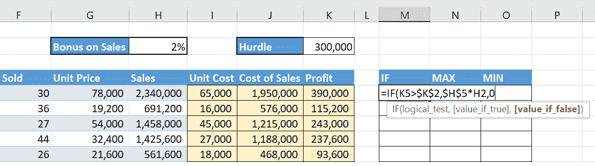

# MAX 和 MIN 函数

这些函数用于从值列表中选择最大值（`MAX`）或最小值（`MIN`）。稍加想象，您可以非常高效地使用`MAX`或`MIN`公式。

例如，在你的财务模型中，`现金余额`可能是正数或负数。正余额将被记在资产负债表的资产侧的`手头现金`账户下，而负余额将显示为流动负债下的`透支`。如果我们简单地将`手头现金`或`透支`与`现金余额`相关联，那么我们可能会将负余额显示为`手头现金`，或者将正余额显示为`透支`。

解决这个问题的一种方法是使用`MAX`和`MIN`公式，如下所示的屏幕截图：

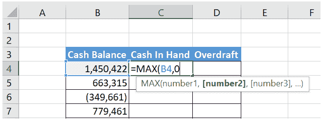

在上述屏幕截图中，我们要求`MAX`公式显示`现金余额`和`0`的较大值。正现金余额始终大于`0`，因此将显示为`手头现金`。然而，每当现金余额为负数时，由于这总是小于`0`，`手头现金`将显示`0`。

以下屏幕截图是`MIN`函数的示例：

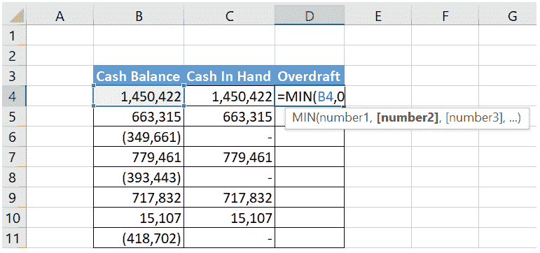

在这种情况下，我们使用`MIN`公式确保只有负现金余额将显示为`透支`，因为负现金余额始终小于`0`。

通过复制公式，我们可以看到现金余额已被整齐而准确地分类为`手头现金`和`透支`，如下所示的完整结果屏幕截图：

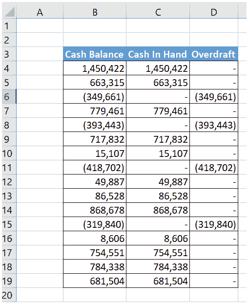

# 实现函数

我们现在将`MAX`和`MIN`函数应用于第四章中使用的`Marks.xlsx`文件，*在 Excel 中应用引用框架*。我们将使用`MAX`函数来找到班级中最高的分数，并使用`MIN`函数来找到最低分，步骤如下：

1.  首先，我们将创建两个独立的单元格，用于显示最高分和最低分，如下所示：

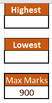

1.  现在，要找出分数最高的学生，我们将使用以下公式找到`百分比`列中的最大值：

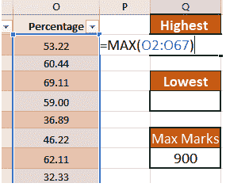

这导致以下输出：

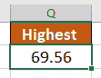

1.  类似地，我们需要使用以下公式找出学生的最低分数：

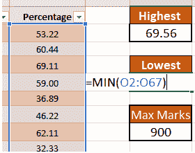

这导致以下输出：

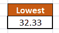

这展示了这些函数有多么有用，尤其是当你有大量条目需要整理时。

# 数据透视表和图表

数据透视表是 Excel 中最强大的工具之一。数据透视表可以将少量或大量数据汇总成简洁的形式，从而揭示原始数据中看不出的趋势和关系。

透视表允许您根据原始数据引入条件，以便您可以从不同角度查看汇总数据。它所有这些都不需要您输入任何公式。大多数用户认为透视表报告复杂且难以准备；但实际上，复杂性在幕后由 Excel 处理。您只需要遵循一些简单的指导方针，就能轻松生成复杂的透视表。

第一步是确保您的数据处于正确的 Excel 表格格式中，要记住您可能需要处理由他人准备的数据。

Excel 的识别和导航快捷键取决于您的表格是否处于正确的格式中。大多数操作都需要指定目标范围。Excel 可以正确识别所需范围并分离字段标题，但前提是数据必须处于正确的表格格式中，如下图所示：

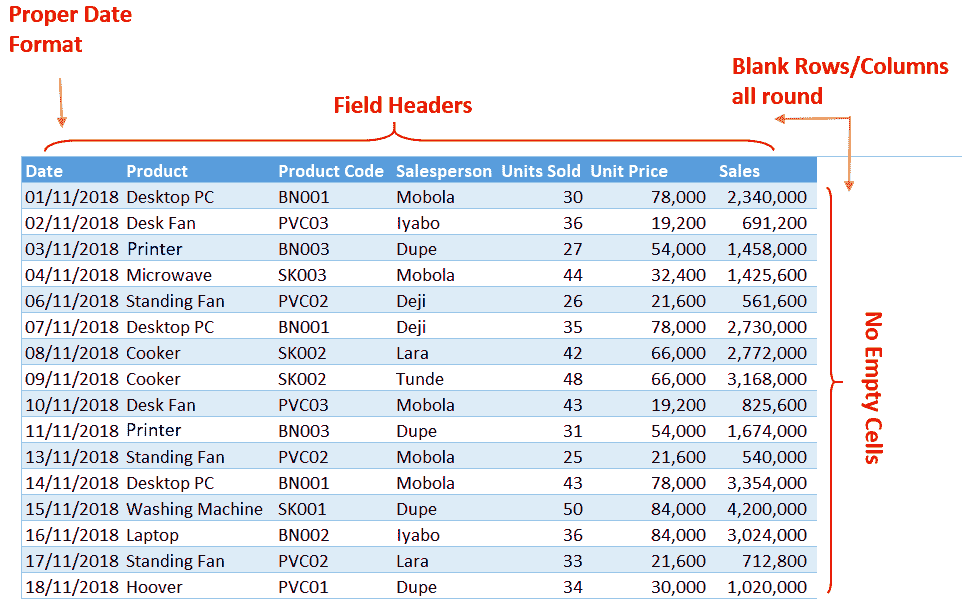

在数据库术语中，表的每一列代表一个字段，每一行（除了第一行）代表一条记录。表的第一行应包含字段标题。表中不应该有空单元格，也不应该有重复记录。

Excel 在检测数据类型和处理不同形式的日期格式方面非常高效，包括`15/01/2019`、`15-Jan-19`、`15-01-2019`、`01-15-2019`和`2019-01-15`等。然而，Excel 非常敏感，数据中的任何轻微异常都可能导致不稳定的结果。例如，如果您在日期之前无意中键入一个前导空格—就像以下截屏图左侧的图像一样—Excel 会将其视为`General`数据类型。

下图右侧的图像显示了相同的文本，没有前导空格；因此，Excel 正确识别它为日期，并自动将`Date`格式分配给单元格：

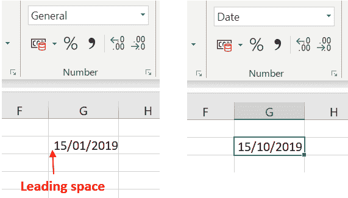

详细解释这一点的原因是透视表与日期和其他数据类型有特殊关系。如果表中包含日期字段，透视表将识别它并允许您将日期分组为日、月、季度和年。然而，如果日期字段中只有一个单元格有异常—就像前面的例子一样—透视表将不会将其识别为日期，并且组选项将不可用。一旦您的数据已经清理和准备好，您就可以创建一个透视表。确保光标在表中的任何单元格中，然后按下*插入*并从“表”组中选择“透视表”。创建透视表对话框会被启动。您将需要选择一个范围，然后选择透视表报告的位置。Excel 通常会智能猜测透视表的正确范围；但如果没有，您可以手动选择所需的范围。

虽然您可以将数据透视表放在与源数据相同的工作表上，但有时这可能会变得拥挤。默认情况下，Excel 将在新工作表上创建数据透视表。如果需要，您可以再次覆盖此设置，并指定在相同或另一个工作表上的位置：

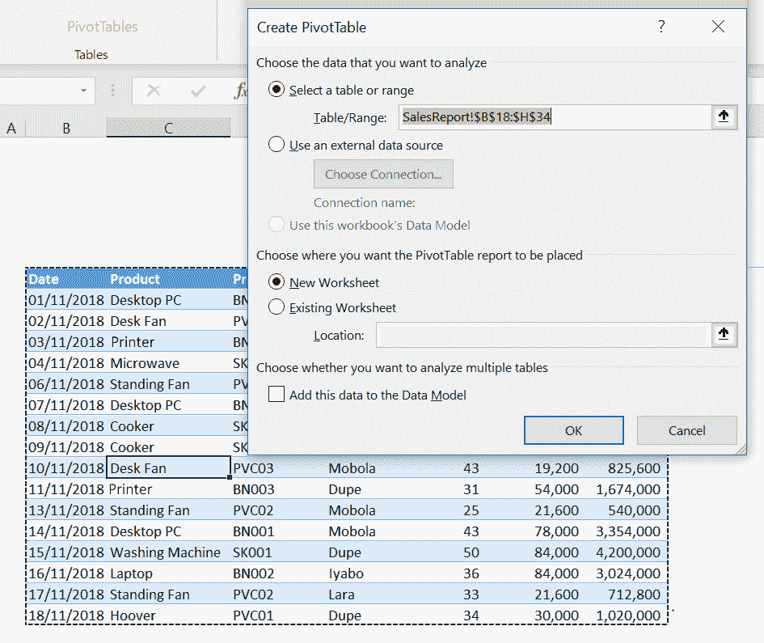

单击“确定”后，将创建一个数据透视表。最初，仅填充字段列表，其中包含表格中所有字段的名称，这些名称将垂直排列，并在其旁边有复选框。在下面，有四个框，标题分别为**筛选器**、**列**、**行**和**数值**。您可以根据需要将字段名称拖到框中来构建表格。

在构建表格之前，设想所需的布局会有所帮助。**数值**框最适合数值字段，因此您将`销售`字段拖到此框中，结果将显示在下面的更新表格中，该表格显示了如何在数据透视表中显示**数值**字段：

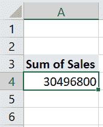

由于您尚未指定条件或标准，Excel 简单地合计**数值**字段并将其命名为`销售总额`。然后，您可能希望显示每个产品的每个销售人员的销售额。以下截图显示了每个销售人员的销售额：

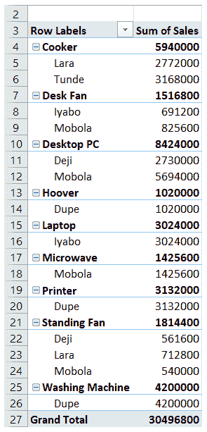

对于上述截图，字段列表将如下所示：

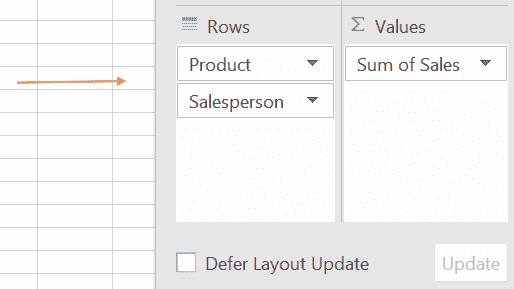

或者，您可能希望按销售人员显示产品的销售额，如以下截图所示：

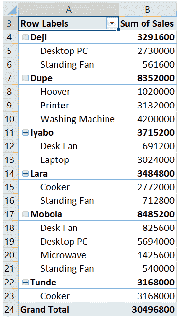

请注意，在行框中，`产品`和`销售人员`字段的位置是相反的，如以下截图所示：


另一种布局可以通过横向显示产品来实现。这可以通过将产品字段拖到**列**框而不是**行**框中来完成：

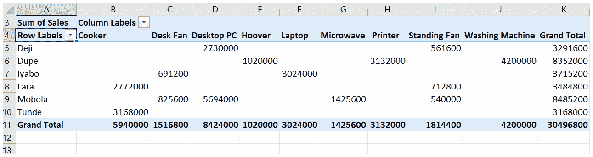

这样做会得到以下结果：

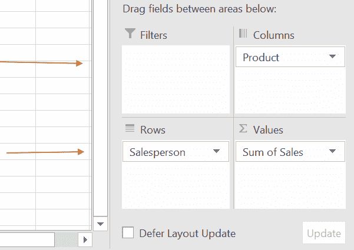

布局的另一种变体是按产品显示销售额，然后将销售人员作为筛选器显示：

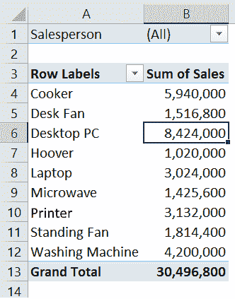

这将导致以下结果：

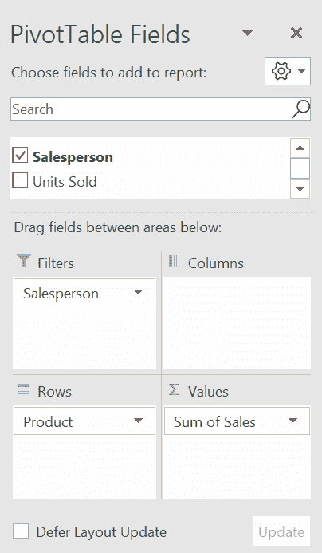

单击`销售人员（全部）`筛选器旁边的下拉箭头，您可以选择性地显示任何销售人员、任何组合或所有销售人员的结果。

除了显示销售总额外，您还可以将销售额显示为整体总额或平均销售额的百分比。通过这种方式，您可以显示产品或销售人员对总销售额的贡献。

以下截图显示了产品销售额的总数以及作为总销售额百分比。为了实现这一点，只需将`销售额`字段再次拖放到**值**框中，以便它现在出现两次。右键单击`销售额 2`列以显示下拉菜单，然后选择**显示值**，最后从出现的第二个菜单中选择**总计**。产品销售额的总数和作为总销售额百分比的说明显示在以下截图中：

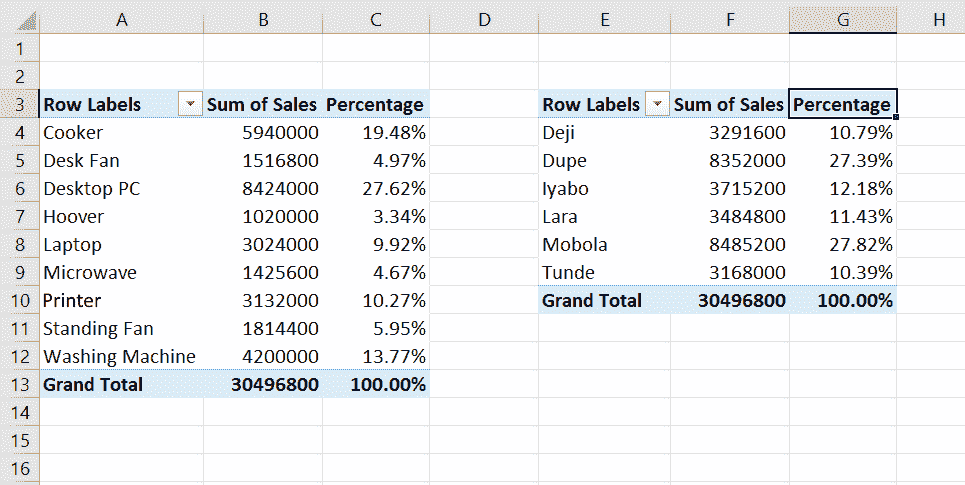

前一个表显示了销售人员的销售额以及作为总销售额百分比。这实际上是第二个数据透视表，它使用相同的范围，但使用原始数据透视表所在工作表的单元格`E3`上的表格。**显示为...**菜单具有各种选项，展示了数据透视表的灵活性。

如果在尝试各种选项时，你搞乱了表格，你可以简单地丢弃它并创建另一个。希望这一次，你能从错误中吸取教训，并在创建和使用数据透视表的经验中进步一步。有时，人们在报告得到图表和图示的支持时能更好地理解报告。

创建数据透视图图表，选择你的数据透视表，从数据透视表工具的上下文菜单中选择**分析**，然后选择**数据透视图图表**。将显示各种类型的图表。选择其中一种，数据透视图图表将出现在你的数据透视表旁边：

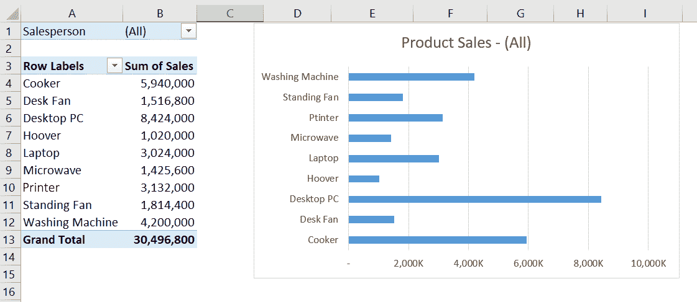

图表是动态的，因此如果您将表格过滤以反映，例如，一个销售人员，`伊亚博`，图表将自动更新以仅反映伊亚博的结果。此截图显示了已经过滤以仅显示伊亚博销售的数据透视表和数据透视图图表：

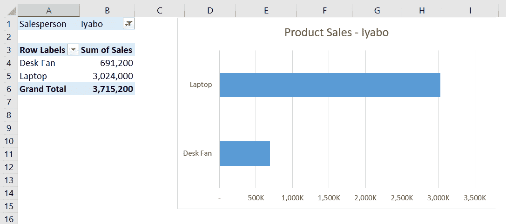

# 实施数据透视表

在`Marks.xlsx`文件中，我们有所有学生的百分比。现在，假设我们想找出前 10 名学生是谁，这样我们就可以在班级活动中奖励他们。按照以下步骤进入数据透视表：

1.  导航到文件中的`Top scores`工作表，其中包含所有学生及其百分比的表格。

1.  现在，要创建数据透视表，我们将选择表中的所有列，并使用菜单中的**数据透视表**选项创建数据透视表：

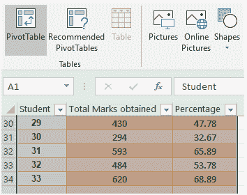

这导致以下表格：

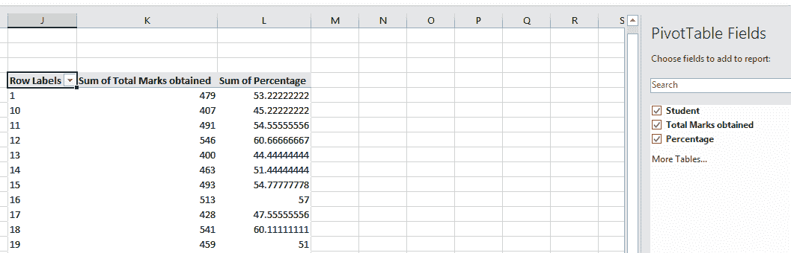

1.  由于我们想找出前 10 名成绩，我们可以在**数据透视表**筛选器中使用内置筛选器。单击**行标签**列角落的筛选器图标，以显示以下下拉列表：

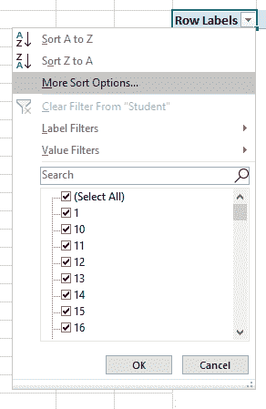

1.  导航到**值筛选器**，然后从中选择**前 10...**选项，如下所示：

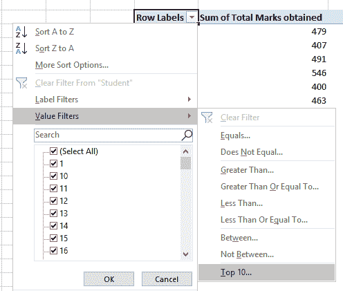

这将显示以下窗口：

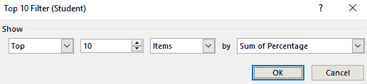

在这里，您可以选择要显示多少个值，您想要从哪一列过滤前 10 个值，以及许多其他选项。

1.  确保窗口中的所有内容看起来与前面的截图类似，并单击**确定**。这样做会导致以下输出：

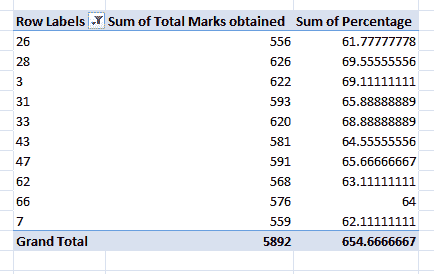

正如在这里所见，我们可以看到获得最高成绩的学生。但是我们需要按百分比的降序排列它们，以便首先显示最高分者。

1.  对此，我们将再次点击过滤器图标，并导航到**更多排序选项...**，如下所示：

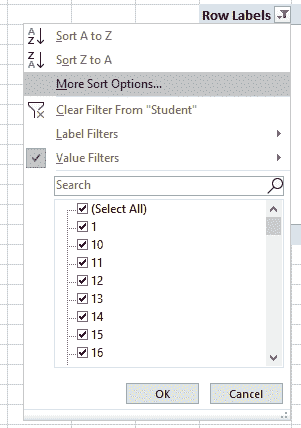

这导致以下窗口：

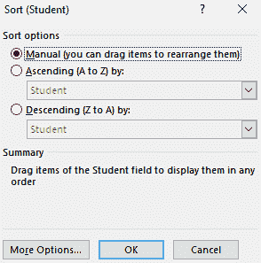

1.  在这里，我们将根据百分比总和将学生按降序排序，如下所示：

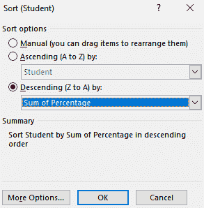

这导致以下输出：

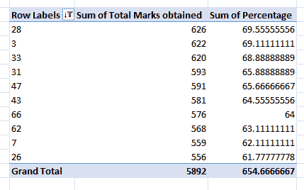

因此，我们得到了班上前 10 名学生的结果！这表明了当正确使用数据透视表时，它可以多么强大。

# 要避免的陷阱

在构建您的公式时，很容易一发不可收拾，很快，公式就变得非常复杂和难以理解。虽然保持公式紧凑是可取的，但它们应该简单且易于第三方跟随。如有必要，将公式分解为两个或更多部分，以使其更易于跟踪，同时保留原始效果。

或者，您可以使用*Alt + Enter*将公式的一部分强制转换到下一行。这不会影响公式的结果，但会使公式更容易理解。考虑以下示例：

```py
=INDEX(C5:G10,MATCH(J20,C5:C10,0),MATCH(K19,C5:G5,0))
```

使用*Alt + Enter*，可以将这个复杂的公式分解为三个部分，如下所示：

```py
=INDEX(C5:G10,
MATCH(J20,C5:C10,0),
MATCH(K19,C5:G5,0))
```

正如我们所见，这使得解密更加容易。

# 保护工作表

如果您打算与他人共享您的模型，则重要的是保护您的公式，以防止意外修改导致模型无法使用。为此，请首先突出显示要修改的没有公式的单元格，按*Ctrl + 1*打开**格式单元格**对话框，转到“保护”选项卡，选中“锁定”，然后单击“确定”。这将解锁可以修改的单元格。

现在，转到“审阅”选项卡，然后选择“保护工作表”。保护工作表对话框出现。如果需要，输入密码以取消保护，然后单击“确定”。现在，受保护的具有公式的单元格只能查看但不能修改。您应该仅输入特定值一次。如果需要在另一个位置输入相同的值，请简单地参考第一个输入的原始单元格。任何后续出现的相同值也应参考原始输入，而不是任何包含相同值的次要单元格。

例如，15%的利率首先输入到表 1 的单元格**B5**中。如果在表 2 的单元格**D16**中需要利息，而不是再次输入 15%，您只需引用表 1 的单元格**B5**，键入`= `，然后输入表 1 的单元格**B5**。如果利息再次出现在表 3 的单元格**J13**中，理论上，您可以引用表 2 的单元格**D16**。然而，为了保持一个简单的审计追踪，应该将引用指向该值的原始输入，即表 1 的单元格**B5**。尽量每行只使用一个公式。

利用您对相对、绝对和混合单元格引用的了解，构建您的公式，以便您可以在一个单元格中输入它，然后将公式复制或填充到其他年份中。您输入公式的次数越少，出错的机会就越低。

# 摘要

在本章中，我们学习了公式和函数的威力，以及如何利用它们加快建模速度并使其更加有趣。我们还通过一些常见函数的示例进行了演示，例如`VLOOKUP`、`MATCH`和`CHOOSE`函数。

在下一章中，我们将研究 Excel 中构成其支柱的功能之一——引用框架。了解这个框架并知道如何应用其原则将有助于加快您的工作速度并提高您的生产力。
