# 第四章：：在 Excel 中应用引用框架

假设 Microsoft Excel 中的一个工作表分成了超过 100 万行和超过 16,000 列。行标为 **1**、**2**、**3**，依此类推，直到 **1,048,576**，列标为 **A**、**B**、**C**，依此类推，直到 **XFD**。行和列相交形成一个工作表中超过 160 亿个单元格。

然而，由于单元格由相交形成它的列和行标识，每个单元格都有一个唯一的标识，通常写成相交列和行的名称。因此，**UV** 列和 **59** 行形成了 **UV59** 单元格。该工作表上没有其他 **UV59** 单元格，也没有其他工作簿上的，也没有其他计算机上的。这个特性构成了 Excel 中引用框架的基础。本章将讨论各种引用框架类型以及如何实施每种引用框架以简化庞大的数据集。

在本章中，我们将涵盖以下主题：

+   框架简介

+   相对引用

+   绝对引用

+   混合引用

+   实施引用框架

# 框架简介

引用框架确保您可以通过在公式中包含其单元格引用来使用任何单元格的内容。以下屏幕截图是这一点的最简单示例。通过在单元格 **F5** 中键入 `=D4`，单元格 **D4** 的内容 `Happy day` 已经复制到了单元格 **F5** 中：

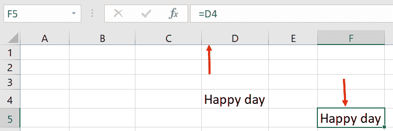

在 Excel 中，您可以直接在单元格中键入公式的各个部分的值，如下面的屏幕截图所示：

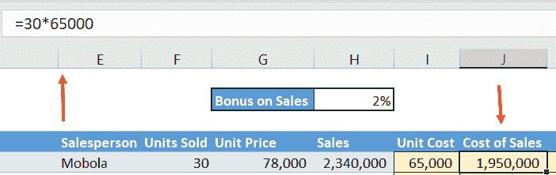

`销售成本` 是 `售出单位数` × `单位成本`，在这种情况下是 `30` × `65,000`。公式栏显示我们输入了 `=30*65000` 来得到 `1,950,000`。

该方法的两个主要缺点如下：

+   不清楚这些数字来自哪里。几个月后，当您开始审查您的模型时，您不希望不得不重新思考整个过程，以确定输入的来源。

+   如果包含输入值的单元格需要修改以适应新的和/或更准确的信息，那么在您的模型中的任何位置或已在公式中使用的变量的位置，您将需要相应地逐个更新它们。

# 相对引用

为了避免上述缺点，您应该输入包含值的单元格的单元格引用，而不是键入实际值，如下面的屏幕截图所示：

前面屏幕截图中的公式栏显示我们输入了 `F5*I5`。

通过这种方式，清楚地知道输入的来源。所有引用这些单元格的公式都将自动更新。

引用的另一个优点是，Excel 默认注册单元格引用相对于活动单元格的位置。因此，在前面的示例中，**F5**被注册为左移四个单元格，**I5**被注册为相对于活动单元格的左移一个单元格，即**J5**。

这一点的相关性在于，当你将该公式复制到另一个位置时，Excel 会记住公式中包含的原始单元格引用的位置，相对于原始的活动单元格。然后，Excel 会相应地调整引用，以保持这些位置相对于新的活动单元格。

因此，如果将公式向下复制 15 个单元格，引用的行部分将向下调整 15 行，因此`F5*I5`自动变为`F20*I20`。通过这种方式，由于公式相同，即`销售单位`×`单价`，我们只需复制公式到列表中，仍然可以获得正确的答案。如下截图所示：

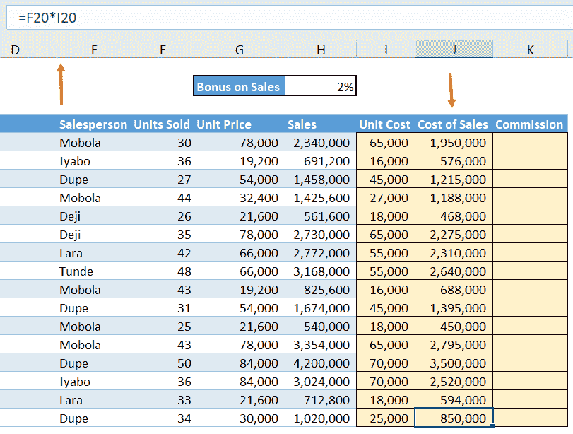

在我们在上一节中看到的示例中，这种方式不适用，因为我们直接输入了值到活动单元格中。如果我们在这种情况下复制，我们会得到相同的值`1,950,000`一直列到列表底部。

这种引用单元格而不是它们的实际值的技术被称为相对引用。

有几种不同的复制到单元格范围的方法，如下所示：

+   第一种方法是选择要复制的单元格或单元格范围，按下*Ctrl + C*，选择要复制到的单元格范围，然后按下*Enter*或*Ctrl + V*。

按下*Ctrl + V*，Excel 会在范围的最后一个单元格右下角放置一个*Ctrl*图标。然后，你可以点击图标或者简单地按下*Ctrl*，一个**粘贴特殊**选项框将会出现，如下面的截图所示：

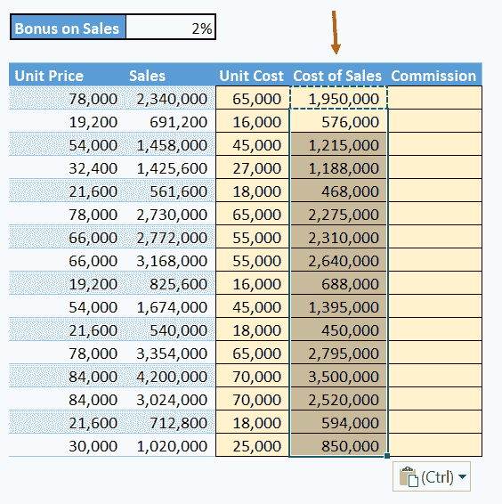

然后，你可以选择、粘贴格式、粘贴数值、转置，或执行其他任何选项。

如果按*Enter*进行粘贴，则无法使用此功能。

+   第二种方法内置于 Excel 中。在所选单元格的右下方会出现一个小黑色框，称为**填充手柄**。当你将鼠标悬停在填充手柄上时，它会变成一个粗黑十字。选择要复制的值的单元格，然后在填充手柄上按住右鼠标按钮并将其拖动到要复制的单元格范围中。然后，释放右鼠标按钮。下面的截图显示了 Excel 中单元格的填充手柄：

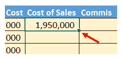

+   或者，你也可以双击填充手柄，所有下方的单元格，直到表的最后一行，都将被原始单元格填充。你不需要预先选择单元格，你只需要按下*Ctrl + C*即可使此方法生效。

但是，左侧或右侧相邻列中的单元格必须填充，以指示 Excel 您希望填充公式的行数。

+   最后一种方法是按以下步骤操作——从要复制的公式开始并包括该单元格，选择要复制到的单元格范围，然后按 *Ctrl + D*。所有所选的单元格都将用公式填充。这种方法是我个人最喜欢的方法之一，并且与双击填充手柄一起，是将公式复制到一系列单元格的最优雅的方法。您还可以使用此方法通过按 *Ctrl + R* 向右填充。您将发现这在填充到右侧、跨财务模型中的预测年度列中的单元格时非常有用。

# 绝对引用

有时，您会有一个包含您不希望 Excel 在复制公式时修改的引用的公式。例如，假设我们想要为每个销售人员计算销售佣金。这将是 `销售额` × `佣金率`。

随着我们向下移动列表，行号会发生变化，以便销售人员所做的销售的参考移动从 **H5** 到 **H6**，到 **H7**，最终到 **H20**，这是我们列表中的最后一条记录。

然而，相同的佣金百分比，即单元格 **H2** 中的百分比，适用于所有销售人员。因此，当我们复制列表时，我们需要保留单元格引用 **H2**，因此我们需要锁定单元格引用或使其绝对。

我们通过在引用的列和行部分之前放置 `$` 符号来实现此目的。通过这样做，`H2` 变为 `$H$2`。

Excel 允许您按下 *F4* 键而不是键入它们，以在列和行引用之前放置 `$` 符号。

在输入公式时，一旦指向单元格 **H2** 并且它在您的公式中注册，只需按下 *F4* 键，就会出现美元符号，一个放在 `H` 之前，一个放在 `2` 之前，以得到 `$H$2`。我们将通过以下屏幕截图更详细地讨论这一点。第一个屏幕截图显示了公式如何引用 `H2`：

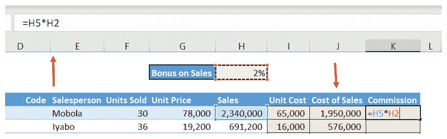

按下 *F4* 键后，以下屏幕截图显示相同的公式：

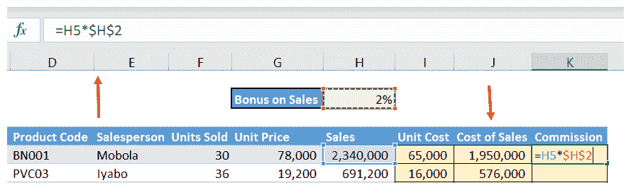

在以下屏幕截图中，我们可以看到公式已在单元格 **K5** 中输入为 `=H5*$H$2`，当您按 *Enter* 键时变为 `46,800`：

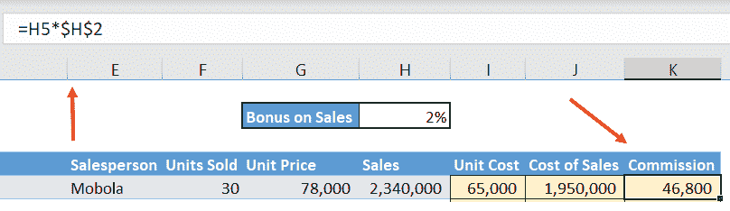

这意味着当我们将公式从一行复制到下一行时，对 `销售额` 的引用会相应更改，但对 `佣金` 的引用将锁定在单元格 **H2** 上。

以下屏幕截图显示了所有销售人员的 `销售额` 上的 `佣金`：

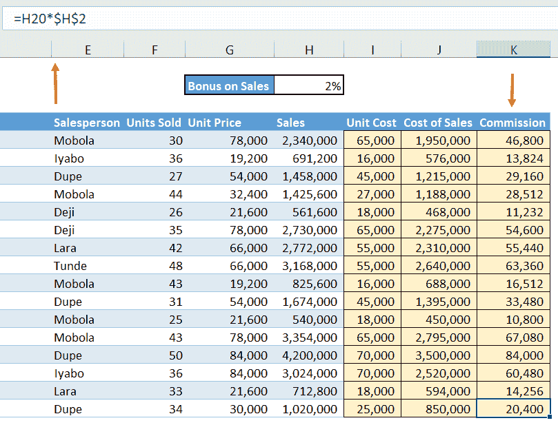

这是绝对引用的一个示例。

正如我们之前提到的，单元格引用由交叉形成该单元格的行和列组成。因此，如果一个单元格在列 **G**、行 **59**，其单元格引用是 **G59**；**G** 是列部分，**59** 是单元格引用的行部分。没有两个单元格可以有相同的单元格引用。

混合引用发生在你需要锁定列部分或者保持引用的行部分相对，或者仅锁定行部分而保持引用的列部分相对时。这在 *混合引用* 部分的以下示例中进行了演示。

你应该注意两件事——首先，引用框架只有在你想要将公式复制到另一个位置时才相关。其次，其主要功能使您能够输入一次公式，然后将其复制到包含具有与活动单元格相对位置相似的单元格的范围中。

虽然这个框架可以帮助你节省大量宝贵的时间，但它并非强制性的，如果你发现自己难以理解这个框架，可以忽略它，手动复制公式到列表中。

# 混合引用

下面的示例，使用相同的 `Sales Report` 工作表，旨在比较使用 `15%`、`20%` 和 `25%` 的 `MarkUps` 获得的销售额。

在这种情况下，销售额计算为`Cost of Sales` ×（1+`MarkUp %`）。这是标记的布局的截图：

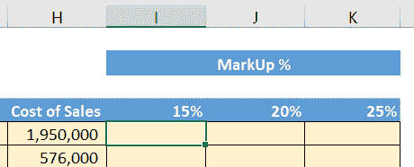

当你需要仅锁定引用的一个方向时，即向下或向右，但不是两者同时，就需要混合引用。在以下示例中，你将在单元格 `I5` 中创建公式，然后将其复制到行 **6** 到 **20** 和列 **J** 和 **K** 中。以下截图显示了 `15%` MarkUp 的计算：

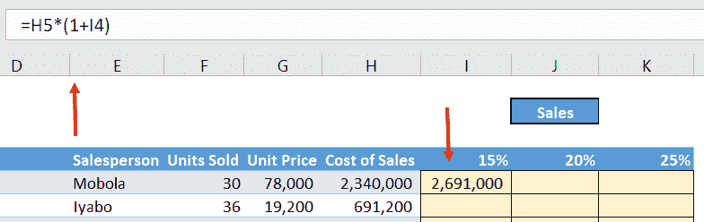

基本公式是 `H5*(1+I4)`。

注意公式中有两个单元格引用，`H5` 和 `I4`，你需要分别考虑它们。

单元格 **H5** 是`Cost of Sales`。列部分是 **H**，我们将在考虑向右复制时查看它，跨列。行部分是 **5**，我们将在考虑向下复制时查看它，跨行。当将公式向下复制时，你希望销售成本从一个记录变为下一个记录。换句话说，引用的行部分 **5** 不应该被锁定——它应该保持相对；也就是说，它前面不应该有 `$` 符号。

在将公式复制到列中时，销售成本在从一个`MarkUp %`移动到下一个时保持不变。换句话说，引用的列部分 **H** 应该用 `$` 符号锁定。

以下截图显示了第一个引用的引用模式如何工作：

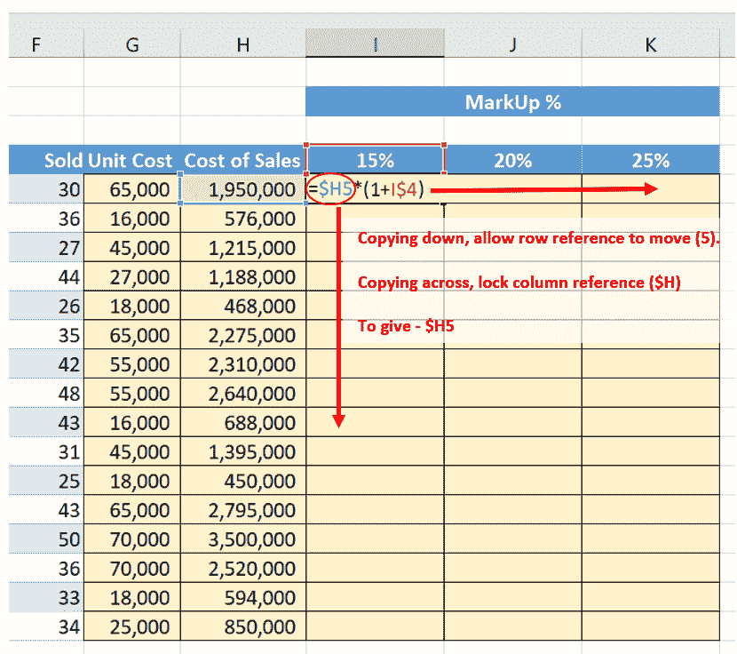

因此，我们的第一个引用是`$H5`。

单元格`I4`是`MarkUp %`，为`15%`。列部分为**I**，我们在考虑在列上向右复制时将查看它。行部分为**4**，我们在考虑向下复制行时将查看它。

当向下复制公式时，您希望从一个记录到下一个记录保持不变的标记率为`15%`。换句话说，引用的行部分**4**应该被锁定，并且应该在其前面有一个`$`符号。在横向复制公式时，标记应从`15%`移动到`20%`，依此类推。换句话说，引用的列部分**I**应该用`$`符号锁定。

以下截图显示了如何计算第二个引用的引用模式：

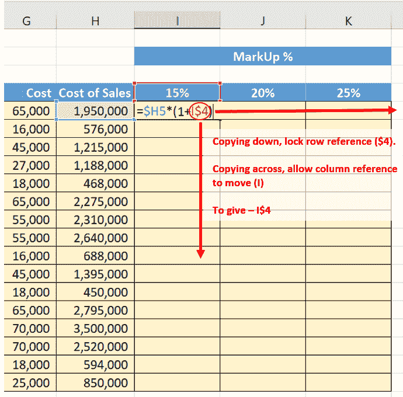

因此，我们的第二个引用将是`I$4`，然后公式将是`=$H5*(1+I$4)`。这将导致以下输出：

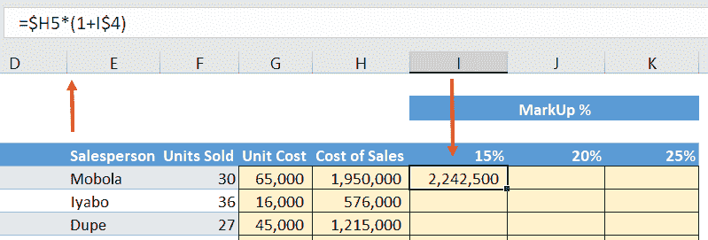

现在我们将对所有单元格执行此操作。

键盘上的*F4*键是一个循环切换键，有四个选项。使用单元格引用`H5`作为示例，按一次*F4*键会在列和行部分之前放置`$`符号，得到`$H$5`。再按一次会仅在行部分前放置`$`符号，得到`H$5`。再按一次会仅在列部分前放置`$`符号，得到`$H5`。最后，第四次按下*F4*键将将引用返回到相对引用，即 H5，不带`$`符号。

现在，将公式复制到横向和纵向。

总是明智的检查复制的公式是否给出了正确的答案。您可以通过检查您复制的范围的右下角的单元格来做到这一点。在本例中，这是单元格**K20**，正确引用了单元格**H20**和**K4**。以下截图显示了确保公式正确构建的检查：

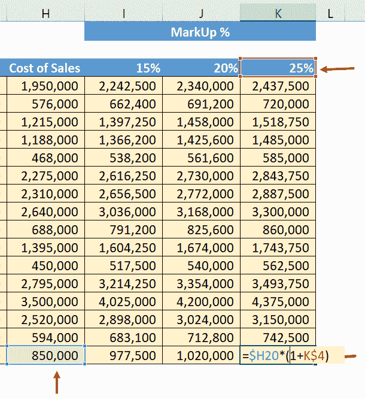

# 实施引用框架

现在，您已经了解了每种引用框架背后的理论，并且知道何时使用它们，让我们将这些知识应用到现实生活中。

假设您是一名教师，并且您有一整个班级学生的成绩，并且您需要根据以下标准将数据排序并分成不同的组：

+   学生在所有语言中获得的总分

+   学生在所有科学中获得的总分

+   总分

在这种情况下，引用框架真正发挥了作用。我们可以按照所需的标准对数据进行排序，方法如下：

1.  打开提供给你的`Marks.xlsx`文件，其中包含 66 名参加期中考试的学生的成绩。数据将类似于以下截图：

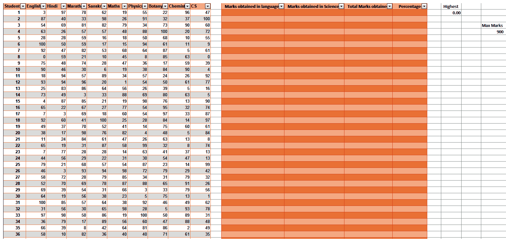

1.  现在，我们将开始对数据进行排序。通过查看第一个标准，我们可以看到语言的成绩分别在**B**至**E**列中。因此，让我们在相应字段中输入第 1 位学生的公式，即此处的**L2**。由于我们想计算分数的总和，我们的公式将是`=B2+C2+D2+E2`，如下所示：

这导致以下输出：

1.  现在，对于第 2 个学生，我们可以简单地点击求和字段右下角的填充手柄，并将其拖动到下面的字段，结果如下所示：

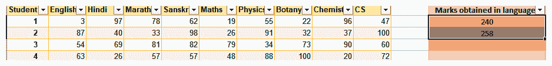

1.  正如我们在*相对引用*部分所学到的，我们可以用几种方法填充所有单元格的相应值。我们将在这里使用最优雅的方法，即双击**L3**单元格上的填充手柄，结果如下所示：

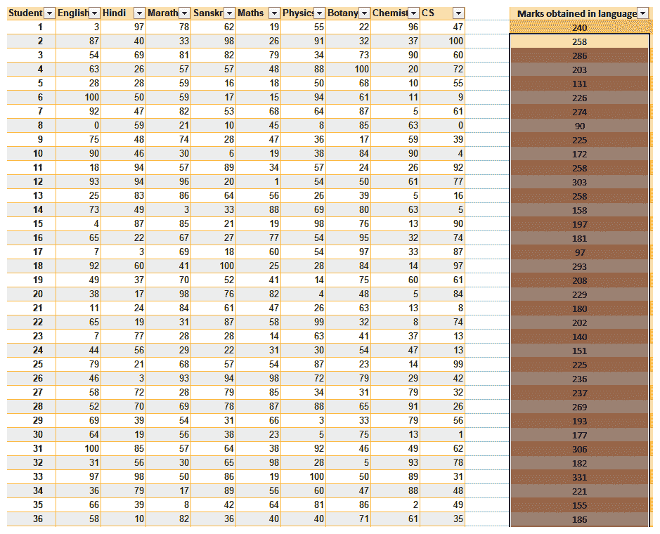

正如我们所见，所有单元格现在都已自动填充了其相应值。

作为练习，我会把`Sciences`栏留空，这样你就可以自己尝试一下。

1.  再对`Total Marks obtained`栏进行相同步骤。我们的最终表格应该类似于以下内容：

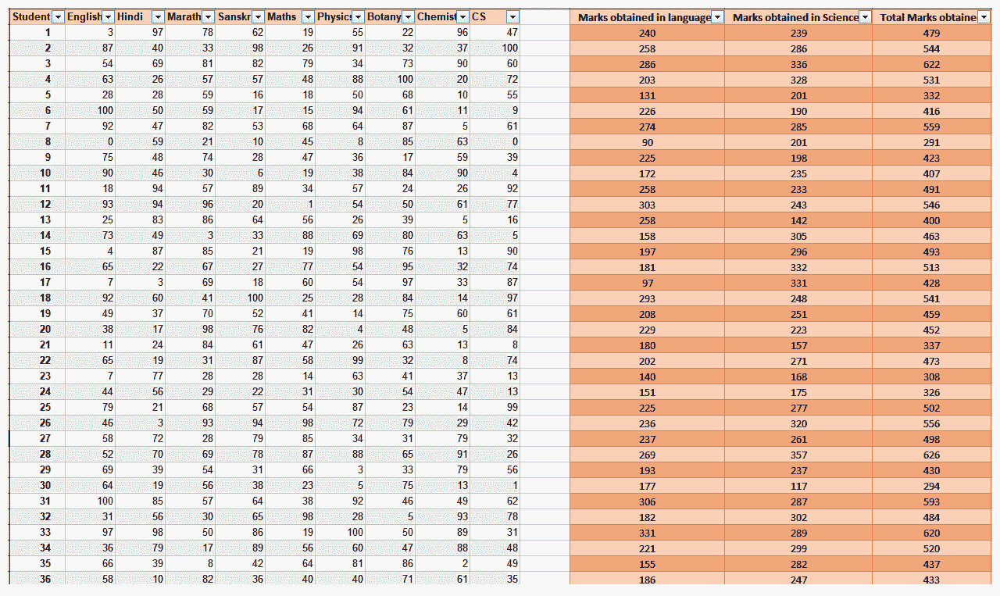

现在，假设你想找出每个学生的百分比得分。我们可以通过使用以下公式来做到：

对此，我们将应用混合引用。

1.  首先，我们将创建一个独立的单元格，**T5**，在其中我们将输入学生可以获得的最高分数（`900`），如下截图所示：

1.  现在，我们将输入计算第 1 个学生百分比的公式到单元格**O2**，如下所示：

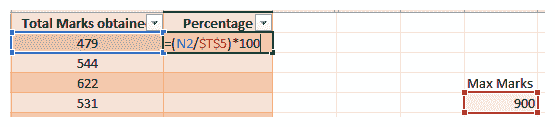

这导致以下输出：

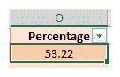

作为练习，使用填充手柄找出其余 65 名学生的百分比。

这里还有一件很酷的事情，你可以使用`=MAX()`函数找到得分最高的学生。一切都完成后，我们的最终工作表应该类似于以下截图：

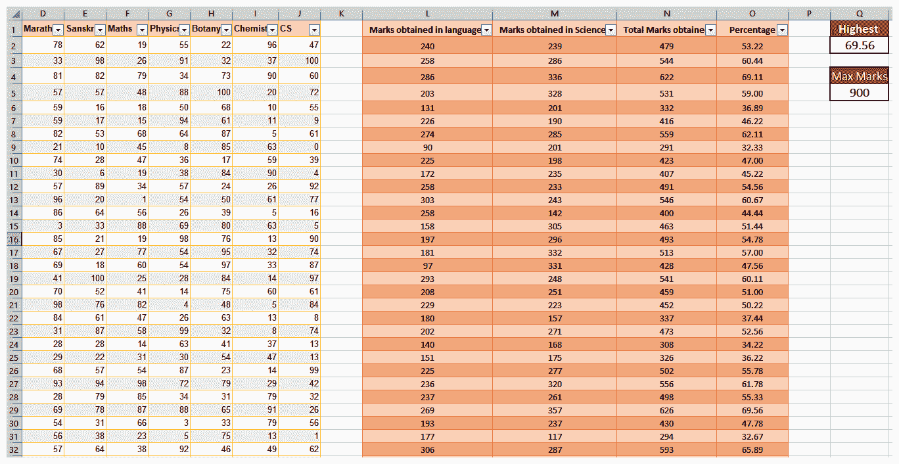

如我们所见，Excel 中的引用框架具有巨大的能力，所有这些都可以在各个领域实现。

# 摘要

在本章中，我们学习了 Excel 中的引用框架。我们了解了三种引用类型，即相对引用、绝对引用和混合引用；以及何时使用每种引用。我们明白了这个概念可以节省我们在 Excel 工作中的很多时间，但只有在我们需要将包含一个或多个单元格引用的单元格或单元格范围复制到另一个位置时才相关。我们还学习了*F4*快捷键以及它如何在不同形式的引用之间切换。

在下一章中，*理解项目和建立假设*，我们将讨论了解你所从事的任何项目的目的的必要性，以及如何建立假设，这对于预测未来三到五年的实际结果是必要的。
