# 第六章：了解项目并建立假设

在财务建模中，没有一种模式适用于所有情况。财务模型的大小、目的和复杂性可能差异很大。估值模型与贷款偿还模型大不相同。用于扩展业务的模型与用于处置业务的模型也不同。用于给出业务价值大致概念的模型将远不如用于支持私募股权或首次公开发行业务股票的模型复杂。您被要求准备的模型的范围和目的是至关重要的。无论您的模型有多么令人印象深刻，如果它不符合用户的要求，那就毫无用处。在本章中，您将学习如何分析项目并了解项目的目的。您还将学习如何创建假设以改进我们的项目。

在本章中，我们将涵盖以下主题：

+   了解项目的性质和目的

+   进行面试

+   建立假设

# 了解项目的性质和目的

为了确定项目的性质和目的，您需要回答以下一些问题：

+   项目的目的是什么？

+   您是想要对某些事物进行估值，还是进行项目预测，还是两者兼而有之？

+   项目的焦点或范围是什么？

+   您是在看整个业务，还是业务的某个部分，或者特定的资产、工厂或设备？

+   目标受众是谁？

+   这是用于内部或个人使用，还是用于向更广泛的受众展示？

+   这是一个选择的、有知识的受众还是一般公众？

+   项目中是否有任何需要您与该领域的专家合作的专业或技术部分？

对于这些问题的每一个答案都将影响您如何处理您的模型，您构建何种类型的模型以及其详细程度。

# 进行面试

您的建模时间应该主要用于与客户管理层的讨论。当人们被专业人士召集进行讨论时，他们通常会感到紧张，因此您需要消除他们的恐惧，并为您的讨论创造一个不具威胁性的环境。您需要让他们明白他们是专家，您需要他们的帮助来了解业务。

这些面试将帮助您了解为什么决定制作财务模型。它们应涵盖公司的历史，包括已经采取的关键政策决定及其对公司业绩的影响。您需要评估关键管理人员以及您可以多大程度上信赖他们的断言。您需要尽可能详细地记录您的讨论，但如果有必要，您还需要准备客户进行后续面试。

# 历史数据

我们将用于预测未来五年公司业绩的假设建立基础是公司的历史财务数据。因此，您需要获取公司三年或五年的财务报表。理想情况下，您希望以 Excel 格式获得账目的软拷贝。不幸的是，通常只有硬拷贝或 PDF 文件可用。即使是 Excel 或 CSV 格式，布局很可能也需要修改，以符合您的首选布局。

因此，您应该准备在 Excel 中重新输入账目，以适合您的模型布局。您需要提取每年的资产负债表和利润和损失账户。历史财务数据非常重要，因为除了构成我们的假设和预测的基础外，它们还将在需要故障排除时起到非常重要的作用。由于我们将使用相同的概念和公式进行预测，使用一组完整和平衡的账目作为起点有助于模型的建立。

# 建立假设

财务模型可以定义为未来业务的结果、财务状况和现金流的数学假设集合，通常旨在确定业务价值。建立可靠的假设对您的模型的成功至关重要。

以下是您假设的快速核对清单：

+   基于实际历史数据

+   现实的

+   解释清楚

+   易于验证

+   正确记录的

+   在您的模型中（通常使用不同字体）与计算单元格区分开来

# 一般假设

您模型的总体假设是企业将盈利，现金流最终将为正。

您还假设企业是持续经营的（即它将能够在可预见的未来履行其责任），并且您获得或被提供的有关竞争对手和预期成本和收入的信息是准确的。

# 利润和损失以及资产负债表的假设

当您制定财务报表假设时，您首先要确定增长驱动因素。在这种情况下，增长驱动因素是过去三年或五年中最能捕捉个别项目增长的指数或指标。

在进行此项练习时，您需要考虑您的决策的成本效益，特别是在处理非物质性项目时。有时，一个简单的最佳判断投影就足够了。

# 利润和损失账户的增长驱动因素

营业额是利润和损失账户中最突出的项目。因此，集中精力确定营业额的驱动因素，然后将一些较不重要的行费用与预计营业额联系起来是有意义的。

适当的驱动因素可能是年度增长或通货膨胀，或者**复合年增长率**（**CAGR**）。我们现在来看看这两个驱动因素。

# 年度增长

这只是从一年到下一年的增长。通常以百分比表示。从**year1**到**year2**的营业额年度增长可以计算如下：

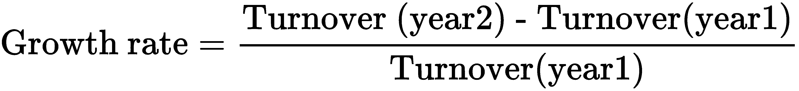

# 复合年增长率

要理解 CAGR，你必须了解复利的概念。

如果你以每年 10%的利率投资 1 亿奈拉（一亿奈拉），你期望在年底收到 1000 万奈拉的利息（1 亿奈拉的 10%）。在第二年底，你将再次收到 1000 万奈拉的利息，依此类推。然而，如果你决定不提取 1000 万奈拉的利息，而是将其复利，你将在第二年初有 1 亿奈拉+1000 万奈拉=1.1 亿奈拉可以投资，以 10%的利率投资。所以，在第二年末，你将收到 1100 万奈拉的利息（1.1 亿奈拉的 10%）。因此，你将在第三年初有 1.1 亿奈拉+1100 万奈拉=1.21 亿奈拉可以投资，依此类推。

奈拉是尼日利亚的货币 - 你可以用任何你选择的货币替换它，价值不会受到影响！

请注意，多年复利比每年末提取利息产生更高的总回报。你也可以说，今天的 1 亿奈拉在一年末值 1100 万奈拉，在 2 年末值 1.21 亿奈拉，依此类推。今天的钱比明天值钱。

年度增长很少会在多个时期保持恒定；它会年复一年地变化。在实践中，你可能会遇到以下截图所示的情景：

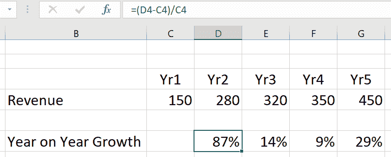

CAGR 是一个指标，用于将多个时期的不同增长率转换为所有时期的单一增长率。

一个项目的 CAGR 取第一年的值和最后一年的值，并且假设复利，计算该时期的增长率。

CAGR 的公式如下：


我们可以通过将右侧的*V1*孤立化来简化这个公式，如下所示：

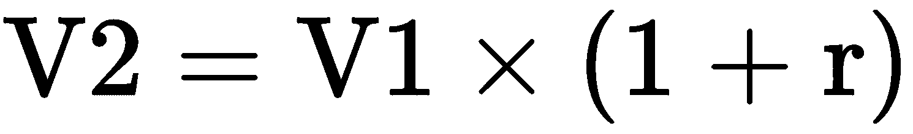

因此，第三年的价值如下：

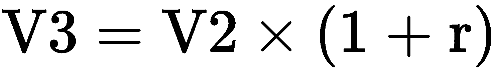

通过在上述方程中替换*V2*的值，我们得到以下结果：

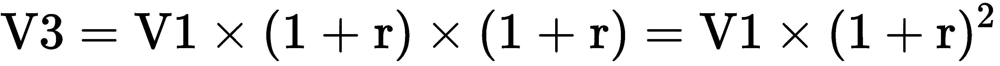

现在，*V4*如下所示：

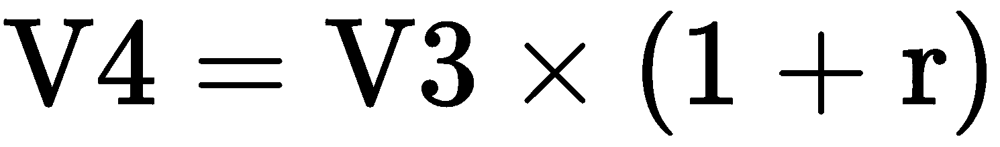

替换*V3*，我们得到以下结果：

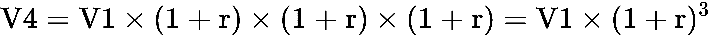

这导致以下一般公式：

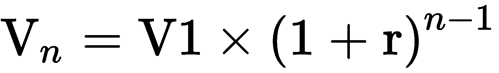

我们采取以下步骤重新排列并将*r*作为公式的主体：


我们将*V1*移到方程的另一侧，使其成为*V[n]/V1*：

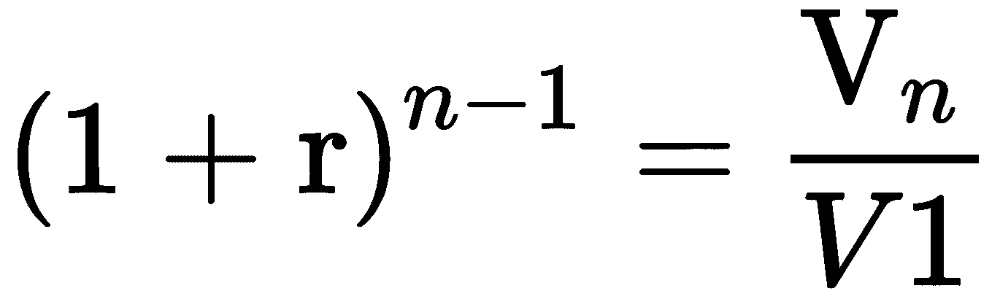

我们将幂符号移到另一侧，使其变为*1/(n-1):*

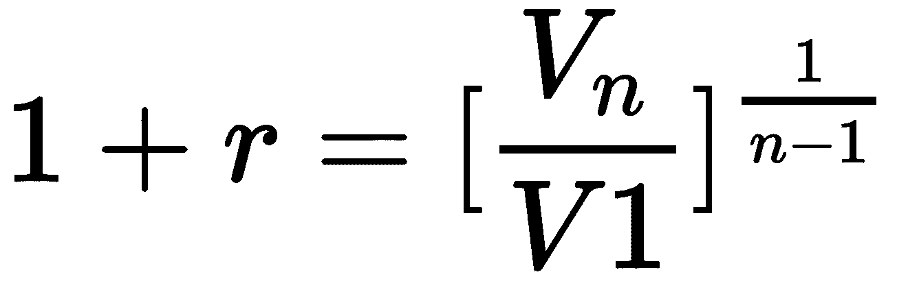

现在，CAGR 如下所示：

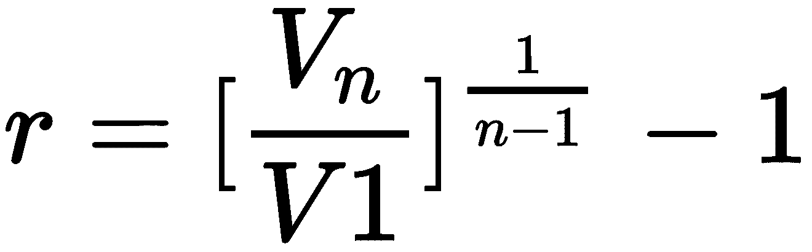

当这完整地写出来时，它如下所示：

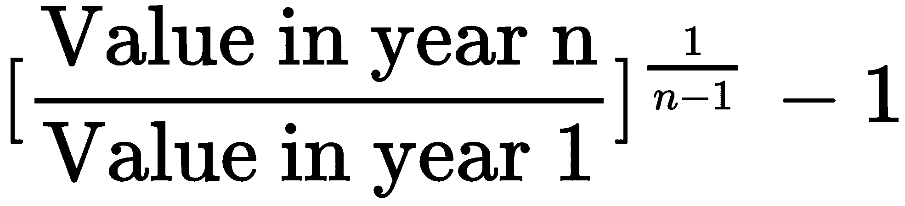

这里，*n*是总年数。

在我们的示例中，收入的 CAGR 将如下所示：

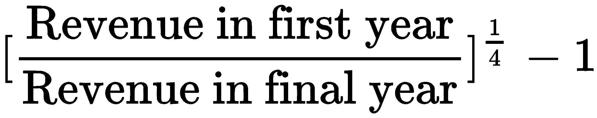

在 Excel 中，幂或指数用`^`表示。因此，2²在 Excel 中变为 2²。我们将在这里看一下`CAGR`公式：

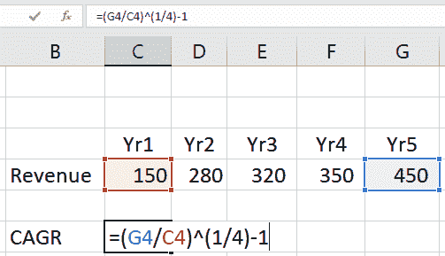

这给了我们一个`CAGR`为`32%`，如下图所示：

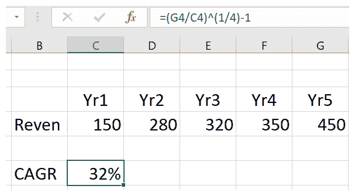

请注意，您可以使用同样的公式来计算其他项目的 CAGR，比如销售成本。

一般情况下，我们将我们的增长驱动因素应用于以下值：

+   **营业额—价格和数量**：对于简单的模型，您可以基于营业额进行预测。但是，为了使您的模型更具灵活性，您可能希望增加其细节或粒度。在这种情况下，您将分解营业额为其组成部分，并基于价格和数量进行预测。

+   **采购—成本和数量**：同样，对于采购和其他直接费用，如果必要的话，您可以使您的模型更加细化，并将您的预测基于成本和数量。

+   **间接费用**：大多数间接费用可以根据历史营业额的百分比进行预测。然后，将过去五年的平均营业额百分比应用于每个下一个五年的估计营业额。

# 资产负债表增长驱动因素

资产负债表增长驱动因素不像损益驱动因素那样直接。虽然损益表项是在审查期内该项的发生次数的总和，但资产负债表项由期初余额加上或减去期间内该项的运动，以在特定时间点达到余额；也就是说，期末。

有智慧的人曾经说过，“收入是虚荣，利润是理智，但现金才是现实”。我们通过考虑现金流来确定合适的资产负债表驱动因素。

驱动现金流的资产负债表项目是营运资本的元素—存货、应收账款和应付账款。这些项目的增加或减少直接影响现金流。以下图表显示了这一过程：

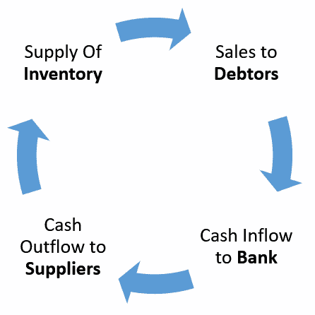

营运资金周转周期包括存货周转速度、应收账款支付速度以及应付账款支付速度。通常情况下，周期转动得越快，其组成部分就越快地转化为现金。资产负债表增长驱动因素是使用“...天”的概念计算的。以下图表显示了每个过程的不同标签：

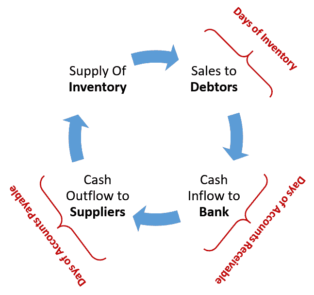

# 库存周转天数

公司管理层需要确保他们拥有足够的库存以满足客户需求并避免供应延误。另一方面，他们不应该保留太多库存，因为这会占用本应用于生产的资金。

随着时间的推移，管理层将会了解到保持的最佳库存水平，以及何时重新订购库存，以在满足客户需求和避免库存过剩之间达到适当的平衡。一旦实现了适当的库存控制，库存销售所需时间（库存周转天数）应该是相当稳定的，并且可以用作估计未来库存的依据。

库存周转天数的计算方法如下：


这里，**期初存货**是年初存货，**期末存货**是年末存货，**销货成本**是销售出的商品成本。

# 应收账款周转天数

对于应收账款也是同样的假设。一旦管理层建立了高效的应收账款收取流程，那么交易应收账款支付的平均时间就会随时间变化而趋于稳定，并且可以用来估计未来的应收账款。

应收账款周转天数的计算公式如下：


这里，**期初应收账款**是年初应收账款的计数，**期末应收账款**是年末应收账款的计数。

# 应付账款周转天数

最后，一旦管理层能够与供应商谈判达成有利的信贷条件，并建立了高效的付款流程，支付供应商所需的时间就会变得相当稳定。

供应商账期的计算公式如下：


这里，**期初应付账款**是年初应付账款的计数，**期末应付账款**是年末应付账款的计数。

一旦我们确定了历史增长的驱动因素，我们就会根据与管理层的讨论记录和我们自己的评估，创建所选项目和余额未来五年行为的假设。

对于损益项目，我们将注意到诸如*…x 在接下来的五年内应该按历史复合年增长率增加*，或者...* 应该比历史复合年增长率高 0.5%（或低 0.5%）*，或者...* 应该在接下来的五年内从 y%逐渐增加到 z%*，或者...* 在接下来的两年内将保持不变*，*然后在第五年逐渐增加到 y%*之类的短语。

继续以我们的示例进行，假设销售经理预计营业额在未来五年内将比历史复合年增长率低 2%，我们将采取以下步骤。

利用你在 Excel 中引用框架的知识，你会突出显示要用增长驱动因素填充的所有预测年份的单元格，CAGR<2%（单元格 **H4** 到 **L4**），构建你的 `CAGR` 公式并使用适当的绝对和相对引用，然后减去 `2%`：

```py
CAGR = ($G$4/$C$4)^(1/4)-1-2%
```

然后，按下 *Ctrl *+ *Enter*。这将为你提供未来五年的预测增长驱动因素，如下图所示：

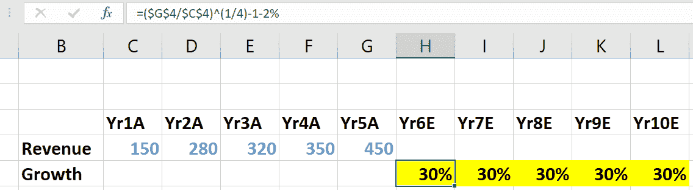

接下来，我们将增长应用到最后一年的实际结果，`Yr5A`（**A** 代表 **实际**），以获得预估数字的第一年的营业额，`Yr6E`（**E** 代表 **估计**），使用以下公式：

```py
=G4*(1+H5)
```

我们将重复这个步骤，对 `Yr7E` 和每个后续的预测年份都是如此。

在实践中，你会突出显示单元格 **H4** 到 **L4**，输入一次公式，然后按 *Ctrl *+ *Enter* 以一次性填充所有突出显示的单元格，如下所示：

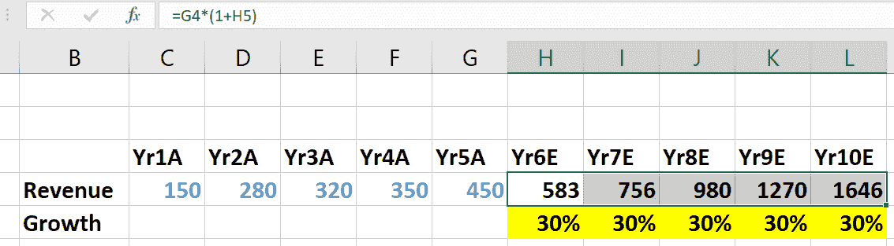

对其他主要损益项目应用相同的步骤。

对于较不重要的损益项目，比如 `销售与分销`，你首先要计算每个历史年份的营业额百分比。

以下截图显示了开销占营业额的百分比：

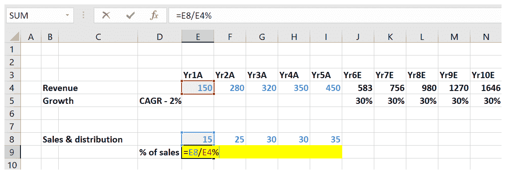

然后，你会将这个驱动因素向前推算为过去五年的平均值。

请注意，以最快的方式填充一系列单元格的相同公式的方法如下：

1.  选择单元格范围。

1.  根据需要使用相对、绝对和混合引用构建公式（有关更多信息，请参见 第四章*，在 Excel 中应用引用框架*）。

1.  按住 *Ctrl* 键，然后按 *Enter* 键（*Ctrl *+ *Enter*）。

范围内的所有单元格都将填充相同的公式，就好像你已经将公式复制到了每一个单元格。

如果你忘记了步骤 1 并且在构建公式之前未选择单元格范围，则一切并非都完了：

1.  根据需要使用相对、绝对和混合引用构建公式（有关更多信息，请参见 第四章*，在 Excel 中应用引用框架*）。

1.  选择要使用公式填充的单元格范围，从并包括输入公式的单元格开始。

1.  现在，如果单元格范围是向下的，按 *Ctrl *+ *D*；如果单元格范围是向右的，则按 *Ctrl *+ *R*。

以下截图显示了如何计算在未来五年中要使用的增长驱动因素：

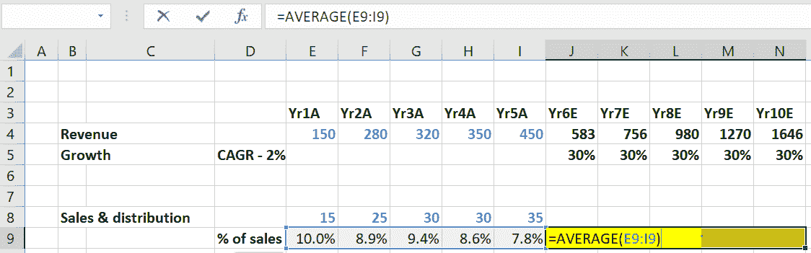

最后，你将应用预测的驱动因素到每个估算年份，从 `Yr6E` 到 `Yr10E`。

以下截图显示了通过将增长驱动因素应用到去年的值来计算费用的情况：

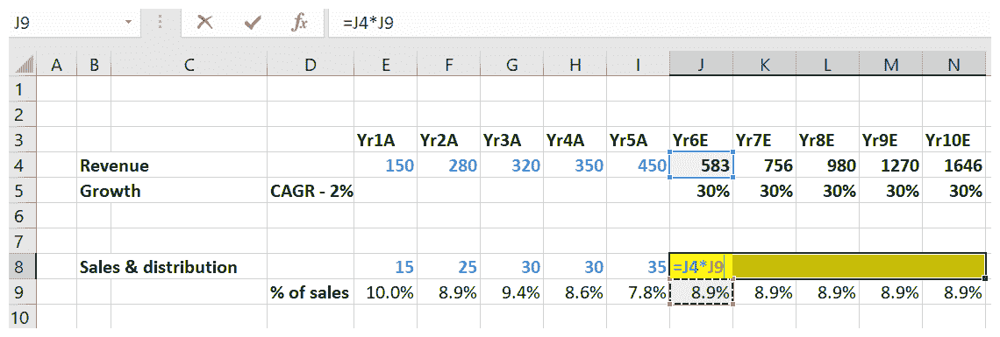

通过这样做，你将得到 `Yr6E` 到 `Yr10E` 的预计销售和分销成本。

以下屏幕截图显示使用相同公式填充其他预测年份：

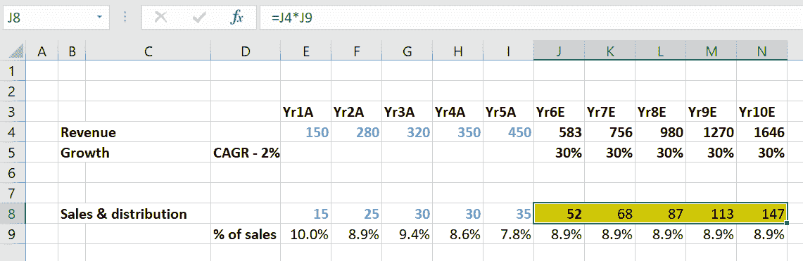

这样，你就可以为预计/估算的年份 `Yr6E` 到 `Yr10E` 建立起你的损益账户。在这个阶段，你的损益账户将会完整，除了折旧和利息之外。

对于资产负债表项目，我们需要重新审视我们的 *天数* 公式：


重新排列公式，我们得到以下结果：


让我们扩展一下平均存货和每日销售成本：


然后，通过再次重新排列公式，我们得到以下结果：


**存货天数**：我们已经提到存货天数预计在未来几年将保持稳定。因此，你可以取过去五年的历史存货天数的平均值，并将其用作未来五年存货的预计驱动因素。如果有任何迹象表明活动可能受到影响，从而对销售成本产生显著影响，你可以对计算出的平均存货天数进行最佳判断调整。例如，一个大型竞争对手进入市场可能导致销售暂时放缓，从而导致销售成本减少，进而增加存货天数。

**期初存货**：一年的期初存货是前一年的期末存货。因此，`Yr6E` 的期初存货是 `Yr5A` 的期末存货。

**年度销售成本**：这将在投影中较早地被计算，并且将由 `Yr6E` 到 `Yr10E` 的损益账户组成。由于方程式右侧的所有项目都是已知的，我们可以计算出 `Yr6E` 的期末存货，然后重复这个过程，直到 `Yr7E` 到 `Yr10E`。以下屏幕截图显示了对预测年份的存货计算：

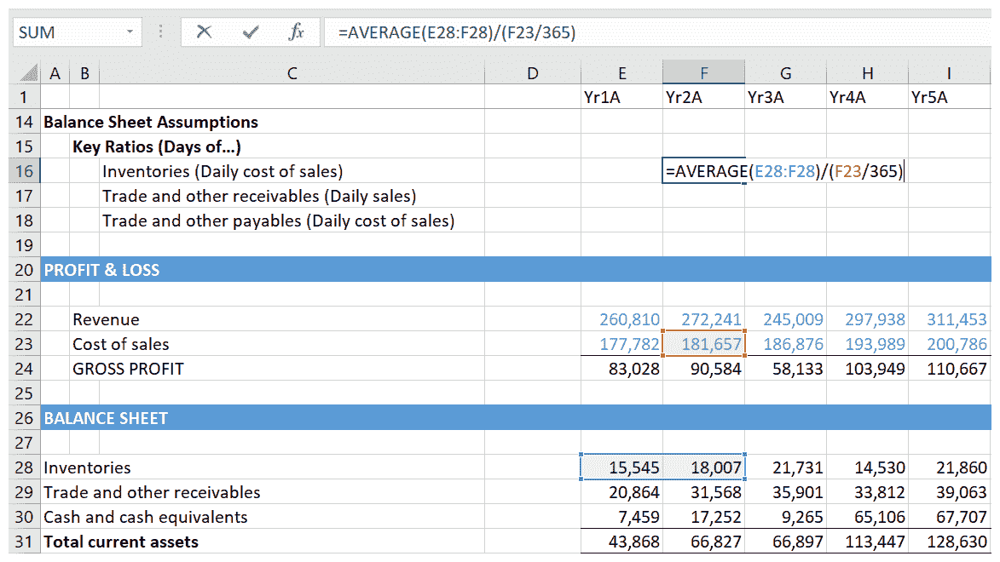

**应收账款天数**：同样，应收账款天数可以表示如下：


过去的应收账款天数的平均值将被用作 `Yr6E` 到 `Yr10E` 的预计应收账款天数。

以下屏幕截图显示了对预测年份的应收账款的计算：

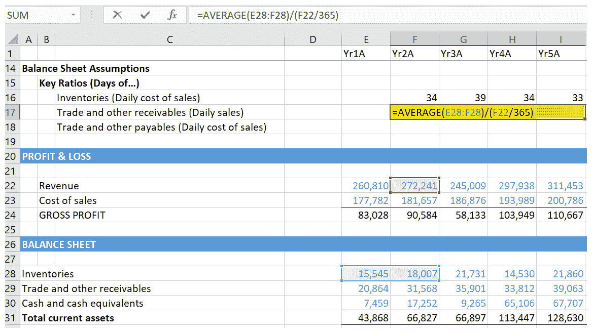

**应付账款天数**：最后，我们有以下方程式：


过去五年的平均应付账款天数将用于估算 `Yr6E` 到 `Yr10E` 的应付账款天数。

以下屏幕截图显示了对预测年份的应付账款的计算：

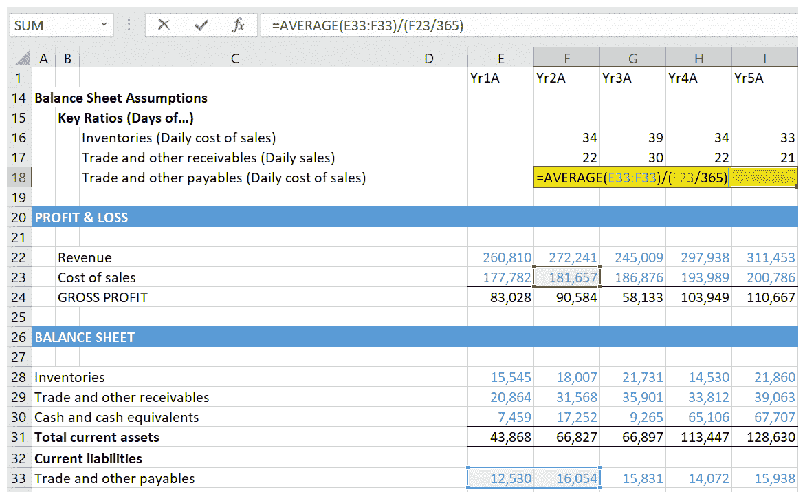

一旦我们用这些项目填充了资产负债表，我们将获得一个完整的资产负债表，除了长期资产、贷款和，当然，现金。

# 总结

在本章中，我们已经看到，如果不彻底了解项目的性质和目的，您可能会得到一个不符合客户规格的模型。我们已经了解到了假设的性质和原因，以及与管理层讨论在将您的假设投射到未来时的重要性。在做出我们的假设时，我们意识到了历史财务状况、资产负债表、损益表和现金流量表的重要性。我们还学习了历史财务状况，这是解决模型中可能出现的异常的重要起点。

在下一章节，*资产和债务计划*，我们将学习如何预测长期资产和借款。我们将介绍不同的方法：一个复杂但更准确的方法，以及一个简单、更主观的方法。我们还将学习如何根据我们的资产和债务计划的输出更新资产负债表和损益表。
