# 资产和债务表

在此阶段，预测的资产负债表和损益表已经完成，除了 **资本支出** (**CapEx**) 的影响——购买、处置和折旧、长期债务、新发行、偿还和利息费用。固定资产、折旧和债务表对我们的模型非常重要，因为它们在财务报表中往往出现为非常重要的金额。这些是长期余额，不受增长驱动因素的影响。您将依赖客户提供关于未来五年的资本支出和债务计划的信息。如果您没有这方面的信息，通常会假定现有的余额将在预测年限内继续服务，或者直到完全摊销或注销为止——以先到者为准。

本章涵盖以下主题：

+   理解 BASE 和螺旋概念

+   资产建模方法

+   资产表

+   债务表

+   创建贷款摊销表

# 理解 BASE 和螺旋概念

这些是我们建模资产负债表项目时要遵循的常见标准。**BASE** 是一个缩写词，代表着 **beginning add additions less subtractions equals end**。螺旋概念指的是基础设置如何从一个期间连接到下一个期间。在下面的截图中，我们将看到一年的结算余额被继续作为下一年的期初余额：

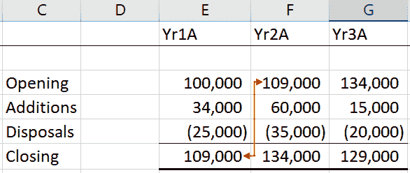

我们注意到运动是从期初余额开始，沿着第一年的行向下，然后到达结算余额，然后返回到第二年的期初余额，然后沿着第二年的行向下，依此类推。这造成了螺旋效应，如下截图所示：

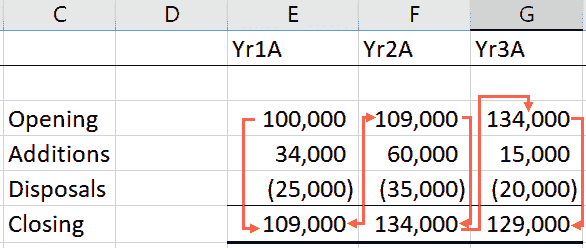

# 资产表

我们议程的快速回顾如下：

+   记录历史损益表和资产负债表

+   计算历史增长驱动因素

+   预测损益表和资产负债表的增长驱动因素

+   建立预测的损益表和资产负债表

+   **准备资产和折旧表**

+   准备债务表

+   准备现金流量表

+   比率分析

+   DCF 估值

+   其他估值

+   情景分析

我们的主题是长期资产、固定资产和物业、厂房及设备。资产是公司将在一年以上的时间内通过使用它从中获得经济价值的长期资产。这段时间被称为资产的 **使用寿命**。在收购资产的期间内对这样的资产全部费用收取是不公平的；相反，费用应该在资产的使用寿命内分摊。

这种年度成本分配是固定资产价值减少的一种度量，通过其使用或时间的流逝。这被称为**折旧**。通常以百分比表示，并在每年计入损益账户。固定资产价值的减少反映在资产负债表中，其中总**累计折旧**从原始成本中扣除，并到目前为止计入费用。这被称为**净账面价值**。

# 直线法

如果管理层决定在 10 年的时间内从固定资产中提取有用的服务，那么资产的成本将在 10 年内摊销。最简单的做法是将资产的成本均匀分摊在 10 年内，以得到固定的年度费用或折旧率为 10%。这被称为**直线法**（**SLM**）折旧法。

使用直线法计算折旧如下：


或


# 减值余额法

另一种计算折旧的方法称为**减值余额法**。该方法的基础是假设资产在前几年内的价值下降得更快。因此，它被设计为在资产的有用寿命的前几年内分配更多的折旧，而在后几年内分配较少的折旧。在折旧的第一年，将折旧率应用于资产的成本。在随后的几年中，将折旧率应用于上一年度结转的净账面价值。

由于资产的净账面价值从年初逐年减少，因此折旧也会减少，因为折旧率被应用于逐渐降低的数字。以下截图显示了直线和

减值余额方法：

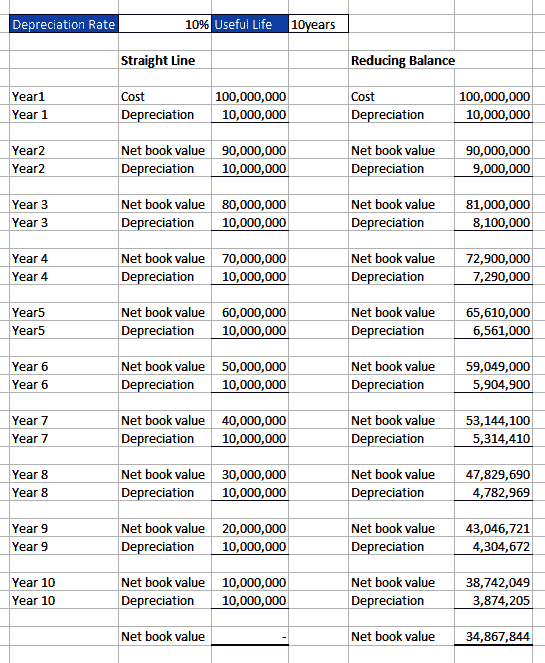

从上述截图中，我们可以观察到以下情况：

+   两种方法的折旧费用都是从相同的折旧费用开始计算的——`10,000,000`（100,000,000 x 10%）

+   从第二年开始，使用减值余额法计算的年度折旧开始从`10,000,000`降至第二年的`9,000,000`，第三年的`8,100,000`，依此类推

+   到第十年，折旧费用已降至`3,874,205`

+   使用直线法，年度折旧费用在第一年到第十年保持不变，为`10,000,000`

+   使用直线法的第十年末的净账面价值为零，而使用减值余额法的为`34,867,844`

以下是两种折旧方法对折旧和净账面价值的影响的图形表示：

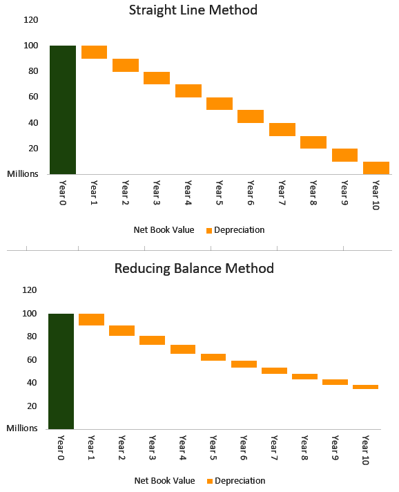

您应该认识到，无论资产变得多么老旧或被利用，它总会有残值或废品价值。 残值是估计如果以废品销售将带来多少资产。 有了这个想法，您应该确保您不会将任何资产折旧至零，而是折旧至其残值，以便在折旧的最后一年，折旧费用将是净账面价值减去残值。 以下屏幕截图显示了具有`1,000`的`残值`的资产的年度折旧：

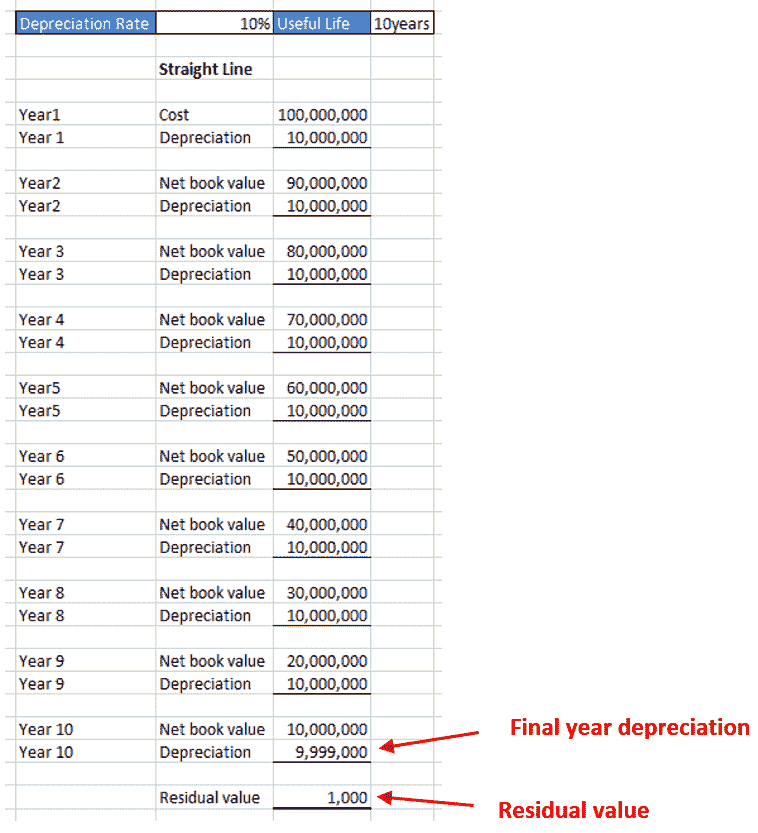

除了更为现实外，具有净账面价值的资产比具有零残值的资产更不可能消失。 尽管直线法和余额递减法是折旧的两种最常见的方法，但还有其他方法，例如年数和生产单位法。

# 对资产建模的方法

对固定资产建模有两种方法，如下所示：

+   详细方法

+   简单方法

# 详细方法

详细方法是首选的，是一种更精确的方法，查看固定资产的各个组成部分-资产成本、增加、处置、折旧和累计折旧。 与管理层的讨论将使您对未来五年的资本支出计划有所了解。 在出售或处置时，固定资产必须从账簿中删除。 该资产的净账面价值（累计折旧）将作为借方转入处置账户，而销售所得将作为贷方转入相同的账户。 两者之间的差额将在资产处置损益结算账户于期末从该处置账户转入损益账户。 以下图表显示了与此相关的不同情景。

第一个图表显示了当您在处置资产时获利时会发生什么情况：

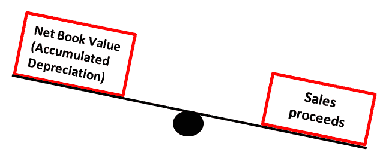

这意味着您已将资产以超过账面价值的金额出售。

第二个图表显示了当您处置资产时产生亏损时会发生什么情况：

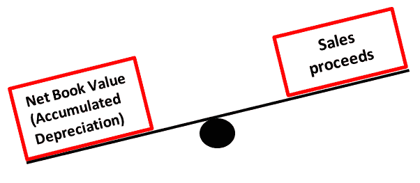

在这种情况下，您已将资产以书面价值以下的价格出售，导致资产处置损失。 所有这些最好都记录在资产和折旧计划中，应为每类固定资产准备，并然后合并到一般固定资产计划中。

# 资产和折旧计划

我们现在将准备前面一节中提到的时间表，如下所示：

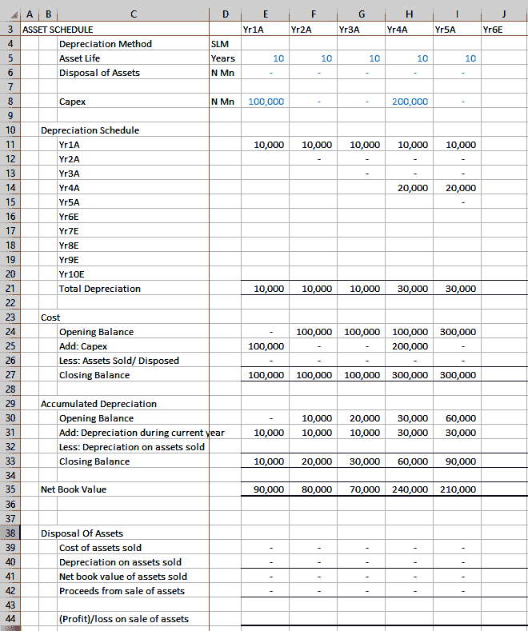

这是每个资产类别应准备的完整资产和折旧计划表。现在我们将对计划表进行拆分并进行详细分析。

第一部分包含以下信息：

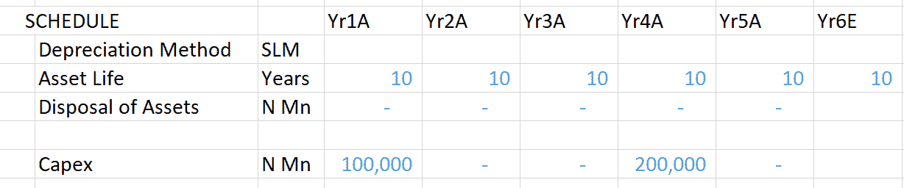

在这里，我们有几个关键字，如`折旧方法`和`资产寿命`。我们将看看它们对于这个特定的计划是什么：

+   `折旧方法`: 在我们的情况下，这是`SLM`

+   `资产寿命`: 这用于表示资产的有用寿命，在我们的情况下为 10 年

+   `资产处置`: 如果有的话，这部分是固定资产出售收益的部分

+   `Capex`: 此行显示每年在固定资产上投入的金额，以及预计将花费的金额

接下来的部分是`折旧计划表`：

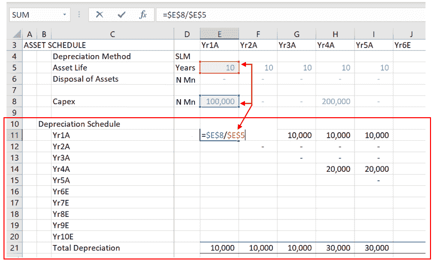

固定资产的折旧在**11**-**20**行和**E**-**N**列之间。固定资产增加的年度折旧费用是当年的 CapEx 除以资产寿命。对于`Yr1A`，这是**E8**除以**E5**，即`10,000`，如前面的截图所示。`Yr1A`增加的折旧费用从**E****11**行开始，在第 11 行每年继续为`10,000`，如下截图所示：

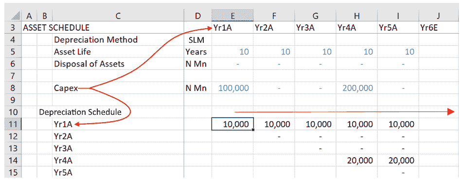

`Yr2A`的增加折旧按**F8**除以**F5**计算，将从第 12 行开始每年计提 10 年，即**F****12**行之下的下一行开始。同样，`Yr3A`的增加折旧将从**G****13**行开始，将在第 13 行沿着 10 年计提。

每年的总折旧费用是该年各行（第**11**-**20**行）所有折旧的总和。对于`Yr1A`，这将是**E**列中第**11**-**20**行的所有折旧的总和；对于`Yr2A`，这将是**F**列中第**11**-**20**行的所有折旧的总和。在我们的示例中，只有`Yr1A`和`Yr4A`在年度内有`Capex`的增加，如下截图所示：

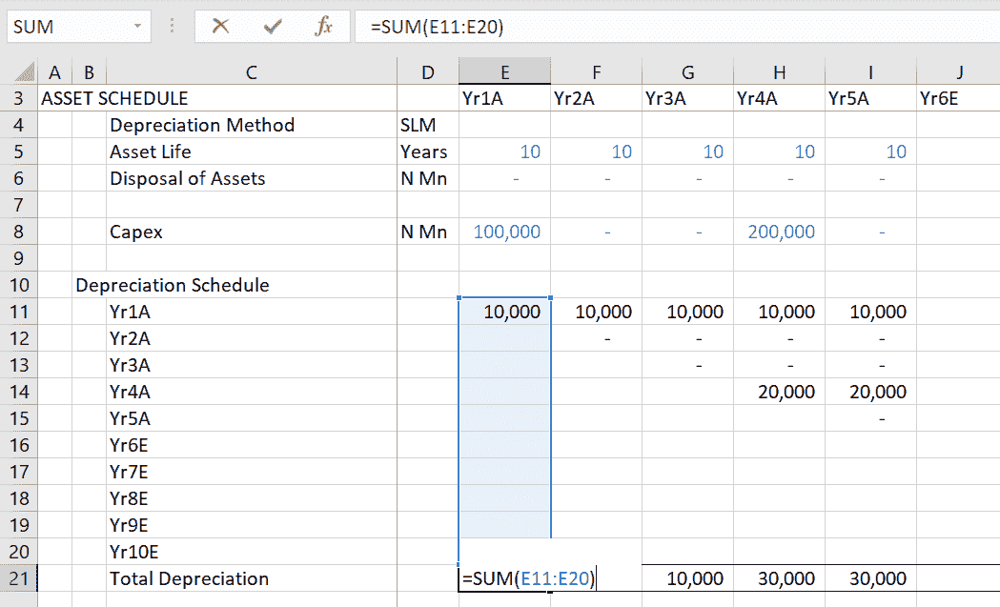

接下来的两个部分是固定资产成本和累计折旧的摘要，以基本布局和螺旋布局呈现。每年的成本期末余额代表了企业固定资产的总原始或历史成本。以下截图显示了`成本`、`累计折旧`和`净账面价值`：

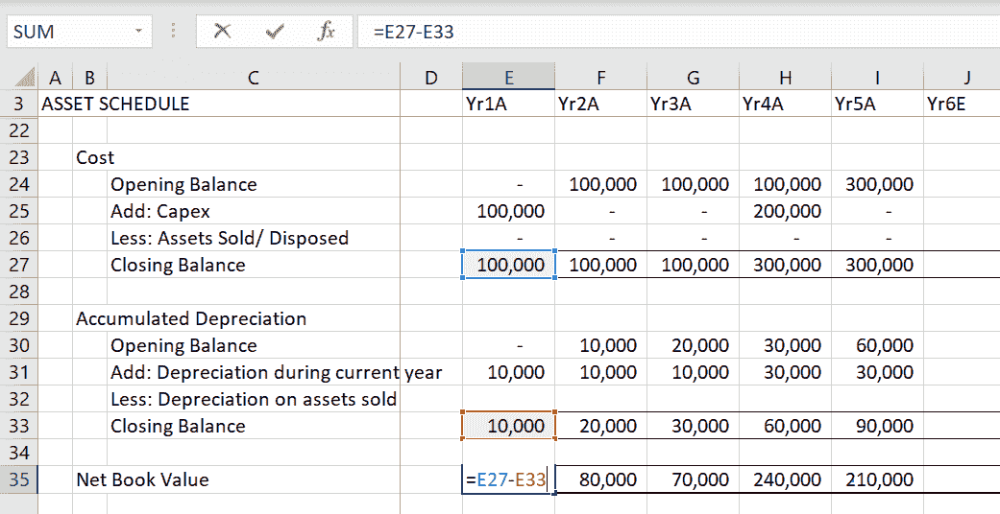

累计折旧是迄今为止对固定资产计提的折旧总额。固定资产在资产负债表上以其净账面价值计量，即成本减去累计折旧。

# 简单方法

预测固定资产的简单方法是使用固定资产周转率进行建模，如下式所示：

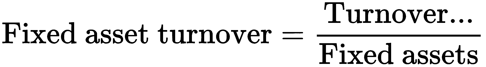

与之前的示例一样，我们从历史数据开始，计算每个历史年度的固定资产和周转率。以下截图显示了`固定资产周转率`字段的计算：

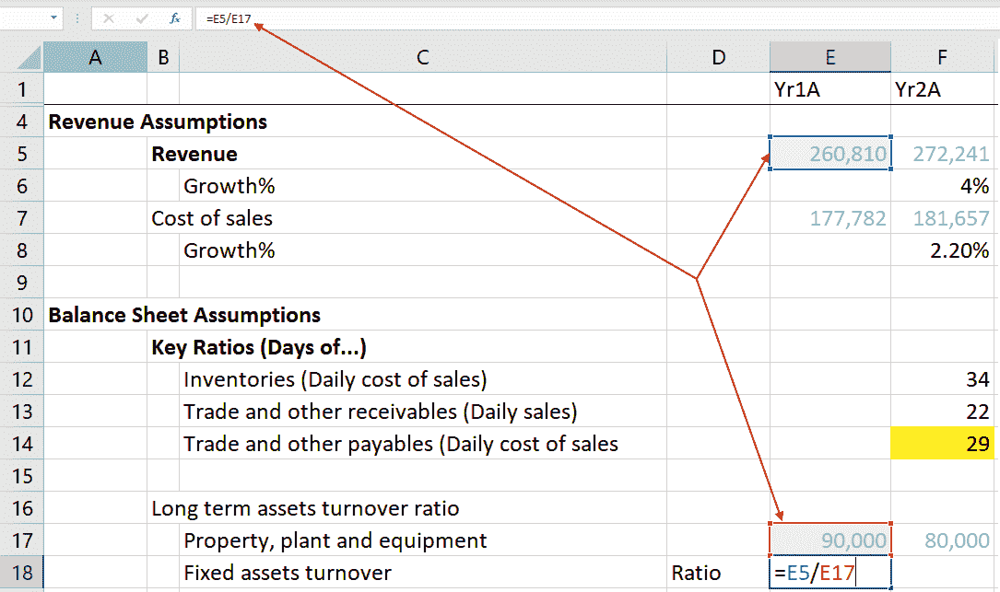

我们将计算`Yr1A`-`Yr5A`历史固定资产周转率的平均值，然后将这个平均值作为未来五年的预测驱动因素。以下截图说明了历史固定资产周转率平均值的计算：

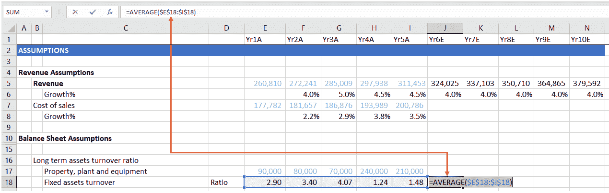

折旧可以通过以下方式导出：

1.  将每年固定资产的历史成本除以其相应年份的折旧费用，以得出该年资产的平均使用寿命：

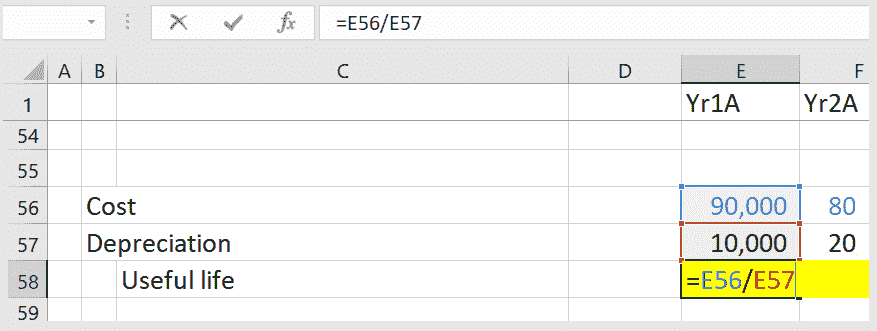

1.  然后，计算过去五个历史年度的使用寿命值的平均值：

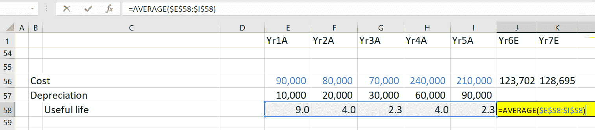

1.  现在，将`使用寿命`值输入以下方程中，以得出年度的`折旧`费用：


上述步骤将导致以下值：

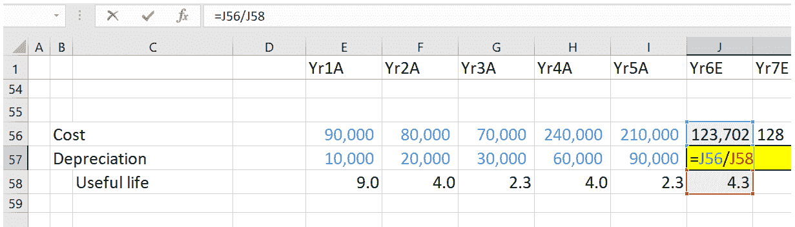

1.  现在，将公式延伸到每个预测年度：

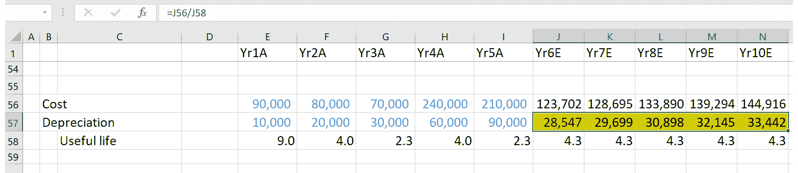

# 债务表

一家公司的资本由债务和股权组成，大多数企业试图保持债务和股权之间的稳定比例（杠杆比率）。债务表是我们对资本结构的预测的一部分。

以下列表显示了我们当前的议程：

+   记录历史利润和损益账户以及资产负债表

+   计算历史增长驱动因素

+   对利润和损益账户以及资产负债表的增长驱动因素进行预测

+   编制预测的利润和损益账户以及资产负债表

+   准备资产和折旧表

+   **准备债务表**

+   准备现金流量表

+   比率分析

+   DCF 估值

+   其他估值

+   情

与固定资产一样，债务的预测可以通过两种方式之一完成；一种是详细复杂的方法，另一种是快速简单的方法。

此外，我们需要考虑利息的处理。问题是，我们是按照债务的期初余额还是期末余额计算利息，还是将利率应用于年度平均债务？

# 复杂方法

如果你的模型需要高精度，你将从已发布的历史账户和管理讨论中尽可能获取更多信息。你会关注获取额外融资和清偿现有贷款的计划，以及需要融资的固定资产增加。

另外，公司经常发布关于到期贷款的信息。您将使用此信息来预测年度还款，并确保这些还款在相应贷款还清后停止。以下截图呈现了一份债务表：

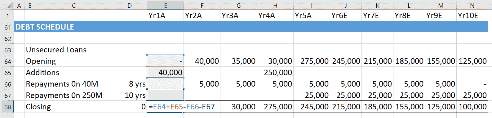

我们使用基本和螺旋布局准备了债务表。

在我们的示例中，有一笔金额为 N40 百万的贷款在`Yr1A`提取，利率为 10%，分 8 年还清；另一笔金额为 N250 百万的贷款在`Yr4A`提取，利率也为 10%，分 10 年还清。N40 百万的贷款从`Yr2A`到`Yr9E`分 8 年还清。N250 百万的贷款在`Yr5A`开始还款，将继续 9 年。

在这个复杂的模型中，您将计算平均贷款余额上的利息。平均贷款余额是期初余额加期末负债的一半。以下截图是带有平均负债利息计算的债务表示例：

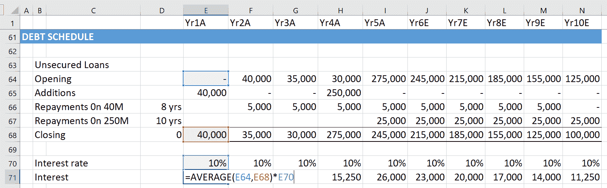

利息计算如下：

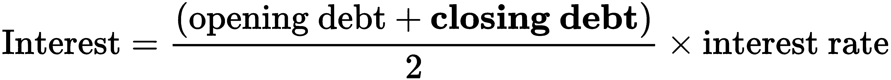

期末负债计算如下：


为了方便理解，假设没有还款。期末负债将是期初负债加上应计利息。以下截图显示了带有期末余额的债务表，包括应计利息：

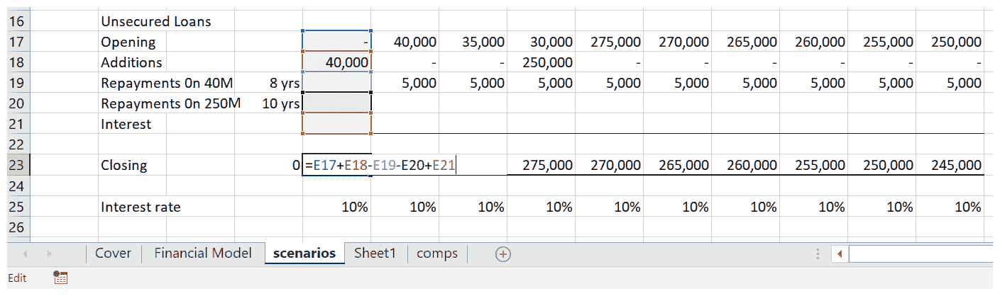

下图显示了通过包括期初和期末负债余额来计算利息的公式：

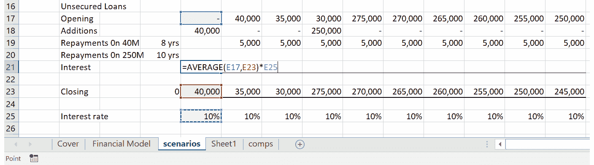

在前两个截图中，我们可以看到计算期末余额的公式包括利息，而计算利息的公式包括期末负债余额。这造成了循环引用，Excel 标记为错误。

下图显示了 Excel 如何标记循环引用：

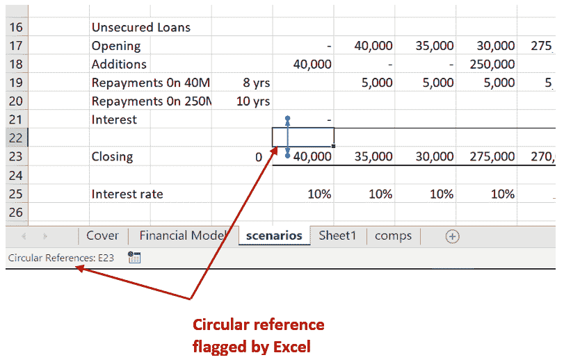

为了停止迭代或连续计算这样的公式，Excel 将公式标记为循环引用。有时，您会故意创建循环引用以达到期望的结果。在我们的情况下，我们希望使用我们掌握的最准确的方法来预测利息——利用平均利息而不是期初或期末负债。

期末负债用于计算利息，然后用于计算期末负债。这代表了一次迭代。后一个期末负债将导致一个与计算利息中使用的原始期末负债略有不同的值。经过第二次迭代，差异减小，每次迭代直到变得可以忽略不计，两个期末负债的值有效地相等。

为了让这种情况发生而不被 Excel 视为错误，您需要在 Excel 选项>公式下启用迭代计算。以下屏幕截图演示了如何启用迭代计算：

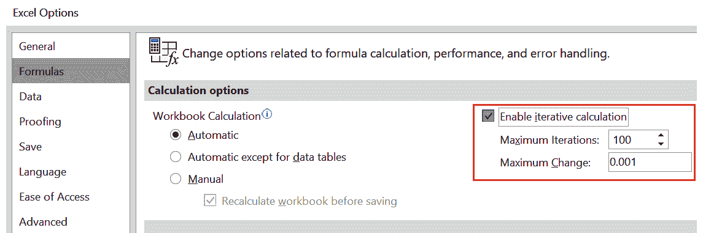

在 Excel 2016 中，单击“文件”>“选项”。这将启动 Excel 选项对话框。然后，单击“公式”，并选中“启用迭代计算”框。接受默认的最大迭代次数 100。这意味着 Excel 认为经过 100 次迭代后，每次迭代产生的差异变得微不足道或不重要。

您应该始终记得返回并取消选中“启用迭代计算”框。否则，可能会未检测到意外的循环引用，并导致 Excel 崩溃，导致信息丢失。

# 简单的方法

如果不需要那种精度水平，您可以采用更简单的方法，使用杠杆比率：

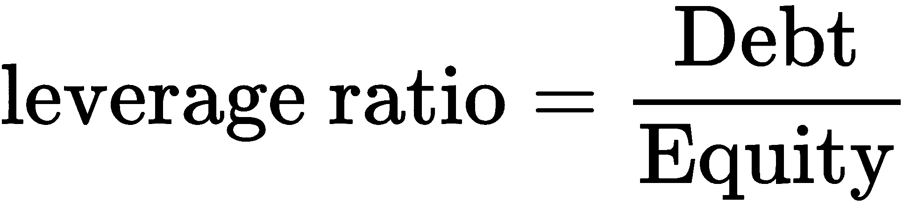

一般来说，公司不会频繁更改其股本。因此，假设股本将保持不变，而资本只会受到留存收益的影响。因此，杠杆比率乘以股本将给我们带来债务。对于利息，您只需将利率应用于期初债务余额。这将避免任何循环引用。

一个更简单的方法是考虑到，随着公司偿还旧债务，它们通常会承担新债务。因此，您可以假定债务余额保持不变。您将通过将利率应用于长期债务的期初余额来预测该年的利息费用。

一旦我们用我们的计算更新了资产负债表和损益账户，完成三报表模型所需的唯一未完成项目将是现金。

现在我们已经了解了有关历史数据的所有内容，让我们将其应用于创建贷款摊销表，如下一节所示。

# 创建贷款摊销表

假设您在一家银行工作，一位客户要求办理住房贷款。但是，客户不想要任何提供的预制套餐，并希望为特定的任期和金额定制贷款。在这种情况下，计算详细计划的计算可能需要很长时间，而在与客户打交道时时间非常宝贵。拥有一个根据您的需求定制的独特模型将非常有用，可以轻松计算各种贷款的价值。我们现在将学习如何在此处创建一个这样的计划，实现我们在本章中学到的大部分内容。

# 创建模板

我们的第一步是创建一个通用模板，可用于所有目的。我们将采取以下步骤：

1.  第一件事是为计算贷款创建一个模板。我们将通过首先创建一个两乘四的表格来输入贷款变量，如下所示：

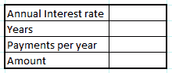

1.  现在我们将在每年支付字段添加数据验证，这样我们就可以在四种支付选项之间选择——每半月、每月、每季度和每年。为此，我们首先将创建一个包含 4 个值的表—`24`、`12`、`4`和`1`，如下所示：

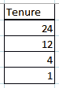

1.  现在，我们需要将这个表转换成一个列表。我们将通过转到 **公式** 选项卡并选择 **定义名称** 选项来完成这个操作，如下所示：

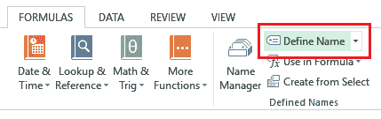

1.  在随后弹出的窗口中，我们将定义列表的名称，我已输入为 `Tenure`。在 **引用：** 输入框中，我们将输入表格所在的单元格数组，本例中为 `$J$2:$J$5`：

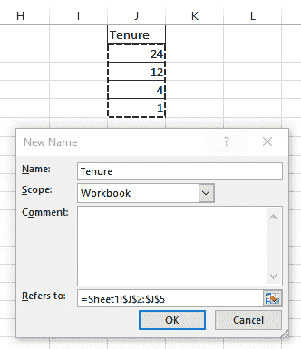

1.  一切都输入完毕后，点击 **确定**。我们的列表现在已经定义好了。

1.  我们的下一步是将此列表添加到 `每年支付` 字段中。为此，转到 **数据** 选项卡，然后在那里选择 **数据验证** 选项：

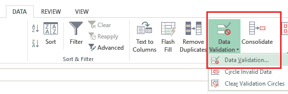

1.  在弹出窗口中，打开 **允许：** 下拉菜单，并选择 **列表**，如下所示：

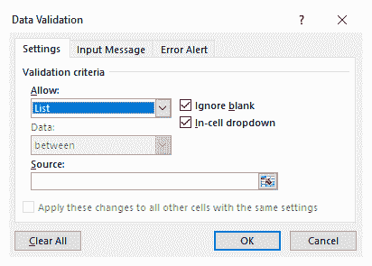

1.  现在，在 **源：** 输入框中，按下键盘上的 *F3* 键以打开 **粘贴名称** 弹出窗口。这里你会找到你的列表名称，如下所示：

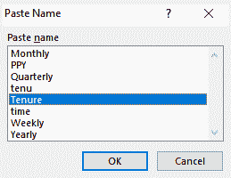

1.  选择好列表名称后点击 **确定**，它应该会出现在 **源：** 输入框中。现在，在 **数据验证** 窗口中点击 **确定**，咦，下拉菜单已经在 `每年支付`字段中创建好了，如下截图所示：

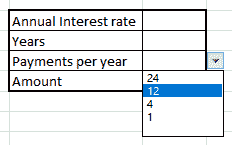

1.  我们的最后一步是创建实际的贷款计划表，它应该看起来与下面的截图类似：

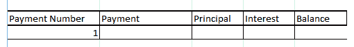

因此，我们现在已经创建了一个模板，在这里我们可以实施我们的贷款计划，如下截图所示：

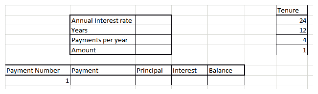

现在是艰难的部分——创建计算贷款计划中每个元素所需的公式。

# 创建公式

现在我们已经准备好了模板，是时候用 Excel 施展魔法，为贷款中的不同变量创建计算公式了，比如本金、利息、总支付金额和支付后的余额。如果我们试图输入用于计算每个值的实际公式，那么这些公式将变得过于复杂。幸运的是，Excel 已经让我们可以借助内置函数（如 `PMT`、`PPMT` 和 `IPMT`）轻松计算这些值。我们将使用这些函数来计算我们的贷款，以下是我们的步骤：

1.  在创建模板后继续进行之前，我们将开始将需要的公式输入到我们之前创建的贷款计划表中。我们的第一个公式利用了 `PMT` 函数，该函数可用于轻松计算特定期间应支付的总金额。`PMT` 公式需要以下参数：

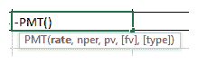

这里，`rate` 是每期利率，通过将年利率除以贷款有效期的年数来计算。`nper` 变量是贷款期限内的总付款次数，通过将年数乘以每年的付款次数来计算。`pv` 变量是贷款的本金金额。`fv` 和 `type` 变量是可选的，我们这里不会使用它们。

1.  在我们的情况下，`PMT` 公式应该如下所示：

```py
=PMT(Annual Interest rate/Payments per year, Years*Payments per year, Amount)
```

我们将用实际值替换这些变量——通过单元格引用的方式，以便我们的最终公式如下所示：

```py
=PMT($C$2/$C$4,$C$3*$C$4,$C$5)
```

1.  现在第一个公式已经就位，我们将使用 `PPMT` 函数来计算本金金额，该函数需要以下参数：

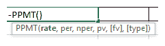

这个公式类似于我们之前看到的 `PMT` 公式；唯一的区别是我们考虑了当前付款数，即 `per` 变量。因此，我们的本金金额公式将如下所示：

```py
=PPMT($C$2/$C$4,$A8,$C$3*$C$4,$C$5)
```

1.  我们需要添加的下一个公式是计算利息金额的公式。我们将使用 `IPMT` 函数来完成此操作，该函数需要以下参数：

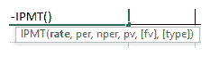

这个公式与之前看到的 `PPMT` 公式完全一样，只是我们使用 `IPMT` 函数而不是 `PPMT`：

```py
=IPMT($C$2/$C$4,$A8,$C$3*$C$4,$C$5)
```

1.  我们需要输入的最后一个公式是在每笔付款后计算余额的公式。这个公式非常简单，只需要从上一次余额中扣除本金金额即可。对于第一笔付款，上一次余额将是总贷款金额，如下所示：

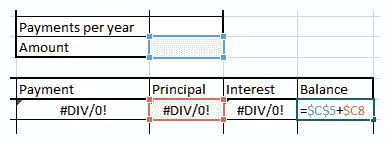

现在我们已经为计划准备好了所有的公式，让我们开始计算贷款吧！

# 使用计划

假设一位客户已经接洽您，并要求借款$10,000，期限为 2 年。根据公司政策，您必须按年利率 5%收取利息。此外，客户想要选择月付款方式。让我们为他们计算贷款，使用以下步骤：

1.  我们将输入客户要求的所有变量，如下面的屏幕截图所示：

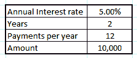

1.  我们可以看到已经计算出了第一笔付款的数值：

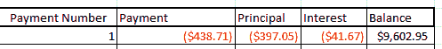

红色数值表示扣除金额，将从原始金额中扣除。

1.  现在，我们将选择**A8** - **E8**范围，并向下拖动填充手柄一行，以便填充第二列。这导致了以下输出：

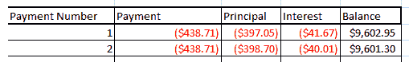

在这里，我们会注意到支付、本金和利率已经正常更新，但余额仅减少了$1。这不可能是正确的，对吧？这是因为，正如我们在前一节中提到的，我们需要从上一期的余额中扣除本金金额，而在第一列中，这是总贷款金额。从第二期开始，余额必须从上一期的余额金额计算。

1.  我们需要修改**余额**列中的公式，以便第一个引用的单元格为`E8`，其中包含初始余额金额。在这样做时，请确保不锁定列。我们第二个余额字段的公式现在如下所示：

```py
=$E8+$C9
```

这导致了正确的输出，如下所示：

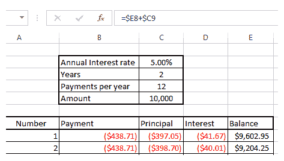

1.  现在，我们只需选择第二个范围，即**A9** - **E9**，然后向下拖动填充手柄 22 行，以便我们可以看到所有的付款期限，如下面的截图所示：

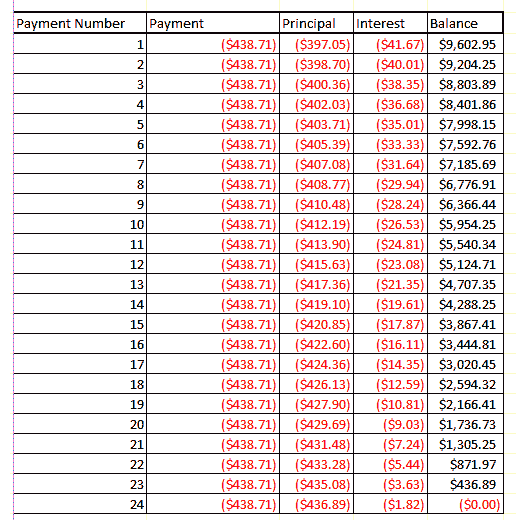

我们可以看到，最后显示的余额为`$0.00`。这意味着我们的贷款已经完全偿还了！

因此，我们已在 Excel 中创建了贷款摊销表。现在你可以随意操作它，也许用它来计算你自己的贷款，或者你可能计划在不久的将来要贷款的任何贷款！

# 摘要

在本章中，我们已经看到了固定资产和债务计划的重要性。我们已经说明了它们如何影响资产负债表、损益表和现金流量表。我们学习了基础和螺旋方法，以及准备固定资产、折旧和债务计划的复杂和简单方法。

在下一章中，我们将进行最终的计算，并准备现金流量，以便得出准确的报表，这应该使我们的资产负债表平衡，并完成 3 声明模型。
