# 现金流量表

以下列表显示了我们的议程，下一阶段是准备现金流量表：

+   记录历史利润和损失以及资产负债表

+   计算历史增长驱动因素

+   为损益表和资产负债表预测增长驱动因素

+   建立预测的损益表和资产负债表

+   准备资产和折旧计划表

+   准备债务计划表

+   **准备现金流量表**

+   比率分析

+   DCF 估值

+   其他估值

+   情景分析

在此阶段，我们已完成了损益表，唯一剩下的项目是仍然不平衡的资产负债表，那就是现金。在本章中，我们将探讨如何为我们的项目编制现金流量表。

在本章中，我们将涵盖以下主题：

+   现金流量表简介

+   不涉及现金流动的项目

+   营运资本净变动

+   平衡资产负债表

+   制作快速现金流量表

# 现金流量表简介

损益表不同于现金流量表，因为它们不等待交易的现金影响被解决才认可该交易。例如，如果您出售了 N100,000 的货物或服务，客户已经收到货物或服务，但尚未付款，则没有现金流动。

但是，您和客户都认识到已经完成了销售 - 的确，货物的所有权和保管已经转移，因此损益表将其记录为信用销售，将营业额增加了 N100,000，并为完成复式分录，在该客户名下创建应收账款，表示他们欠您 N100,000。这是会计的权责基础，即收入应在其获得时期记录，支出应与其帮助产生的收入相匹配。

这通过各种账户贯穿始终，影响诸如提前支付的租金（只有今年的租金应通过损益表）；尚未收到账单的用电量（将电费计入损益表）；以及购买必须通过开销存货调整以便只有销售货物的成本反映在损益表中。

在所有这些示例中，实际现金流将与利润和损失账户中包含的金额不同。这在经济上是合理的，并且是为了得出每个期间的真实利润或损失而必不可少的。然而，正如前面引用的，营业额是虚荣的，利润是理智的，但现金才是现实的。无论公司赚取多少利润，如果没有现金支持，公司迟早都会破产。这就是现金流量表如此重要的原因。

你会记得我们在模型中创建了一个视觉检查，用于指示资产负债表是否平衡。所以，如果它们不平衡，检查单元格将会是红色的，但一旦它们达到平衡，单元格就会变成绿色，如下面的屏幕截图所示。历史资产负债表当然是平衡的。以下屏幕截图说明了预测年份不平衡的情况：

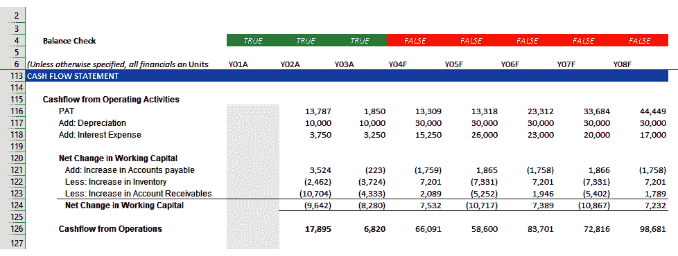

在编制财务报表时，现金流量表通常是从资产负债表和利润及损失账户中准备的。然后，现金的净流入或净流出被添加到或从现金的期初余额中减去，以得出现金及现金等价物的期末余额，这应与资产负债表上的相应数字一致。对于预测年份，资产负债表上没有现金数字，因此我们需要利用这种资产负债表与现金流量的关系来预测现金的数字。

通常，按照惯例准备现金流量表，以得出期末现金余额。然后，我们将这个数字作为现金及现金等价物填写到资产负债表中。如果资产负债表现在平衡了，这表明我们的模型在这个阶段是数学上正确的。否则，我们将开始繁琐的故障排除过程来追踪错误：

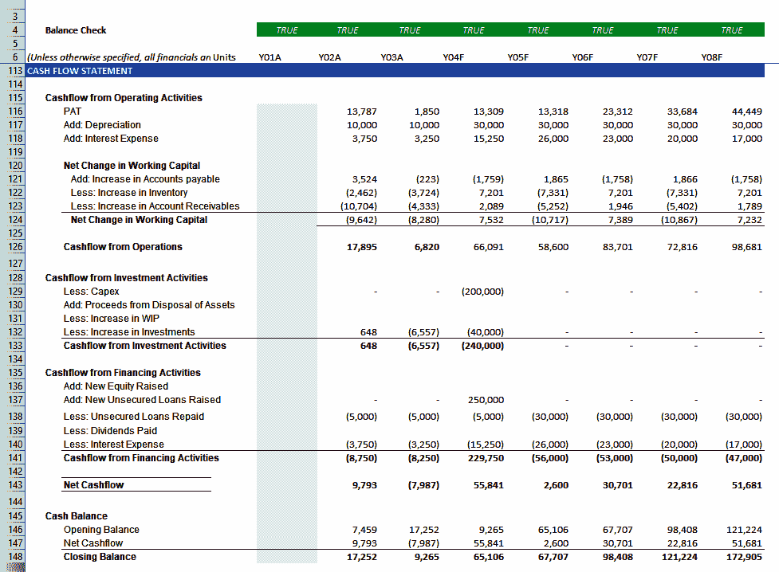

前面的屏幕截图显示了完成的现金流量表，其中期末现金余额现在已经填写到适当的资产负债表中，并且余额检查显示它们现在全部平衡了。准备现金流量表的逻辑起点是年度利润。

# 不涉及现金流动的项目

在得出`PAT`时，考虑了许多不涉及现金流动的项目，现在必须将它们逆转，以得出准确的现金流量数字，如下所示：

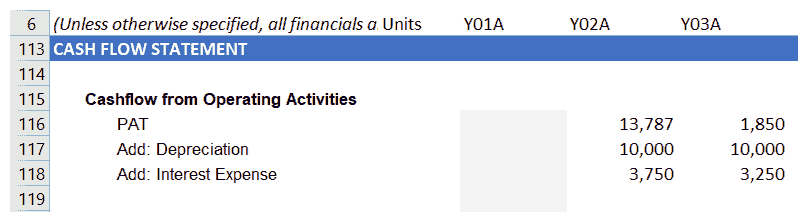

这方面的明显候选者是折旧。相关的现金流发生在购买资产时。然而，我们不会立即将全部成本计入利润及损失账户；正确的会计处理是在资产的有用生命周期内分配原始成本。

这种定期成本分配被称为**折旧**，显然不涉及现金的流动。由于它已经作为费用在我们的利润中扣除，我们需要将其添加回归净利润，如前面的屏幕截图所示。我们还将利润后税利润（PAT）中的利息添加回去。虽然这是现金流，但这是债务融资的成本，因此更适合在融资活动下进行处理。

# 营运资本净变化

让我们看一下关于营运资本净变化的以下屏幕截图：

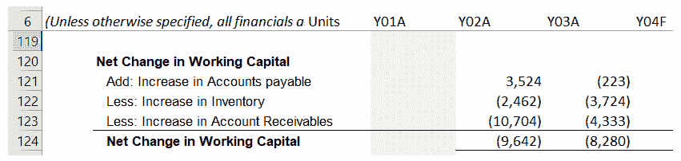

本节将我们从应计基础转换为现金基础的利润。简单来说，以前的例子中，我们记录了一笔销售额为 N100,000，增加了我们的利润，尽管没有收到现金。本节考虑了应收账款的相应增加，为了在抵达经营活动现金流量之前扣除，在信用销售中记录的入账被逆转。

总之，在本节下，我们增加了运营资本负债的增加，并减去了运营资本资产的增加。当我们将本年度的数字减去上年度的数字时，假设本年度的数字高于上年度的数字，增加就会显现出来。

注意，如果你坚持使用这种语言，减少将自动解决。

让我们来看下面的表格：

|  | **YR2** | **YR1** |
| --- | --- | --- |
| **1\. 应付账款** | 50,000 | 30,000 |
| **2\. 应付账款** | 50,000 | 70,000 |

如果你将增长视为（**YR2** - **YR1**），那么在示例 1 中，`增加：应付账款增加` 将给出以下结果：

*+ (50,000 – 30,000) = 20,000 入账*

在示例 2 中，有减少的情况，我们将得到以下结果：

*+ (50,000 – 70,000) = +(-20,000) = -20,000 出账*

对于运营资本资产，情况也是一样的，如下表所示：

|  | **YR2** | **YR1** |
| --- | --- | --- |
| **1\. 应收账款** | 40,000 | 35,000 |
| **2\. 应收账款** | 50,000 | 60,000 |

就像之前一样，增长是（**YR2** - **YR1**），所以在示例 1 中，`减少：应收账款增加` 将给出以下结果：

*- (40,000 – 35,000) = - 5,000 出账*

在示例 2 中，有减少的情况，我们将得到以下结果：

*- (50,000 – 60,000) = -(-10,000) = +10,000 入账*

到目前为止的所有小计给出了经营活动现金流量。

# 投资活动的现金流

让我们来看看以下关于投资活动现金流的屏幕截图：

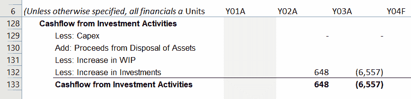

本节相当简单明了。它涉及到投资的购买或销售，包括其他公司的股票、CapEx 等等。

# 融资活动的现金流

让我们来看看以下关于融资活动现金流的屏幕截图：

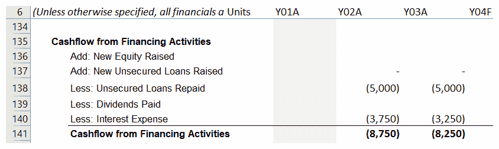

到目前为止，我们应该已经习惯了融资来自内部来源、股本（股票）或外部来源的债务形式。这些余额的增减在此处处理。您会记得我们将利息费用加回了利润总额。那是为了在这里处理它，在融资活动中。我们还将作为出账减去支付的股息。

在融资和投资活动中，偶尔会发生一些重大的一次性交易，这些交易对净现金流量产生重大影响；例如，固定资产的出售。然而，运营活动反映了公司的日常经营活动。投资者在这里寻找线索，以确定一家公司是否产生足够的现金来清偿其负债和实现增长。

# 平衡资产负债表

收盘现金余额将作为流动资产下的现金及现金等价物记在资产负债表上。然而，需要注意的是，余额可能为负数，在这种情况下，它应该作为流动负债下的透支反映出来。由于你不知道它将是哪一个，尤其是因为它可能会因后续修改而改变，所以你需要以这样一种方式建立你的模型，即如果现金余额为正，则将其记入现金及现金等价物，如果为负则记为透支。

通常，当你需要建模一个依赖于逻辑问题（即产生真或假答案的问题）的情况时，你首先想到的是`IF`语句。例如，假设光标在单元格**J35**中，现金及现金等价物，并且你希望将其与现金流量表中的计算现金余额联系起来，该余额在单元格**J86**中。

当你按下*Enter*键时，你会输入`=J86`，现金余额将出现在**J35**单元格中。

要将前面部分中解释的不确定性与`IF`语句结合起来，你会键入`=IF(J86>0,J86,"")`。这表示如果现金余额为正数，大于 0，则将现金余额放入**J35**单元格；否则，将该单元格留空。

在相应的透支单元格中，比如**J45**单元格，你会输入`=IF(J86>0,"",-J86)`。这表示如果现金余额为正数，大于 0，则留空；否则，将现金余额的符号从负数改为正数，并将其放入**J45**单元格。

然而，有一种更加优雅的方式来处理这个问题，就是使用`MIN`和`MAX`公式。

在**J35**单元格中，你只需输入`= MAX(J86,0)`。这个公式将确保现金余额和 0 的最大值始终出现在**J35**单元格中。

如果你仔细想一想，正数总是大于 0，因此它们始终会被视为现金及现金等价物。在**J45**单元格中，透支，你将键入`=MIN(J86,0)`。

这将确保无论何时现金余额为负数，它都将始终被记在**J45**单元格中；否则该单元格将为 0。一旦完成了这个记账过程，资产负债表应该平衡，我们的平衡检查单元格应该全部变成绿色。如果情况不是这样，那么你就需要进行故障排除，找出错误的源头。

# 故障排除

第一步是检查你的现金流量表的准确性。由于历史年份已经有了现金余额或透支余额，你可以将那些年份的现金流量现金余额与资产负债表上的现金进行核对。

如果他们不同意，你将需要重新检查你的现金流入项：

1.  首先，检查你的总数是否有任何算错。

1.  接下来，确定差额是多少，然后除以 2。查看你的现金流量表，看是否有一个等于这个数字的金额。这个测试用来检查你是否错误地将一个数额记为负数，而不是正数，反之亦然。

1.  浏览资产负债表和损益表，看是否有金额等于第 1 步计算出的整体差额。这个测试用来检查你是否漏掉了现金流量中的某个金额。

1.  浏览资产负债表和损益表，看是否有任何帐户或余额没有在你的现金流量表中列入账。这种情况经常发生在你有不规则帐户或交易的情况下；例如，股份溢价、特殊准备金和往年调整。

1.  一旦你已经调节了你的历史现金流量表，使其与历史资产负债表相符，你的资产负债表核对现在应该都是绿色的。如果不是，那么你将需要扩大你的故障排除范围到模型的其余部分。

# 循环引用

假设你在单元格**A1**到**A4**中有数据，然后在单元格**A5**中键入以下公式—`=SUM(A1:A6)`。这将被 Excel 标记为循环引用错误，因为你在求和范围中包含了答案单元格**A5**。总体而言，公司会投资任何剩余现金以赚取利息。另一方面，当现金透支时，将产生利息。

如果我们想要扩展我们的模型以包括这种情况，我们需要扩展我们的现金流量表，以包括现金余额上的利息收入或支出。然后，这些利息会被减去或加到利润和损失账户中的现有利息支出中，这会改变净利润。由于净利润与现金流量表相连，这也将导致期末现金余额的变化，这将影响到该余额上的利息收入或支出，循环持续下去，形成循环引用。

随着每个循环或迭代，现金流量表期末现金余额上的利息收支变化越来越小，最终趋近于零。为了故意创建循环引用，你需要要求 Excel 允许它，方法是转到**选项**并勾选**启用迭代计算**。你可以将最大迭代次数保留在 100 次。

**我不建议除了专家用户以外的任何人使用这个方法，即使是专家用户，也只有在你不会与其他用户分享你的模型时才可以**，原因如下：

不幸的是，启用循环引用通常是不可靠的，并且可能导致 Excel 变得不稳定。当发生这种情况时，Excel 会用错误填充工作表。然后，您需要花时间浏览模型，手动将循环引用的单元格清零。或者，您可以恢复不包含循环引用的备份。

这对于除了 Excel 专家用户之外的所有人来说可能会相当惊人，并且可能导致数小时的建模时间丢失。解决这个问题的最佳方法是从一开始就包含一个**断路器**，如下面的屏幕截图所示：

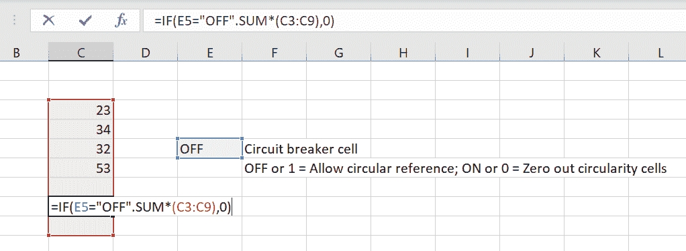

为此，指定一个空单元格，比如单元格**E5**，作为断路器，然后输入`OFF`或`1`，以允许循环引用；或者输入`ON`或`0`，以将循环引用的单元格清零。

然后在一个`IF`语句中封装包含循环引用的单元格（们）。逻辑问题应该是 `E5=1`。如果为真，则允许带有循环引用的公式；否则，将值设置为 `0`。

断路器的默认值应为`OFF`；然后，如果公式出现问题，只需在断路器单元格中键入`ON`以触发`IF`语句中的`0`并清除循环引用。

请记住，Excel 会持续重新计算公式单元格，因此这可能是一个经常发生的情况。再次强调，这应该只由不会共享他们的模型的专业用户完成。

# 创建一个快速的现金流量表

现在你已经学会了如何创建现金流量表以及需要做的一切，让我们继续为特定场景准备一个简单的报表。假设你是一家网站设计公司的创始人，你需要跟踪你花钱的一切，因为作为一家初创公司，资金对公司的发展至关重要。我们将创建一个简单的现金流量表来跟踪第一年的支出，以便我们了解以后继续进行公司是否会有利可图：

1.  我们将从创建两个单元格开始，一个用于记录财政年度，另一个用于记录当年初投资的现金，如下所示：

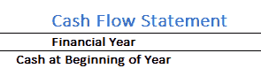

1.  正如我们在本章中所学到的，现金流将分为三个主要部分，其中第一个部分是运营活动。因此，让我们创建一个包含所有核心运营下的支出和现金流入的表格。网站设计公司的运营流入主要来自两个地方：

    +   要求网站的客户

    +   员工进行的自由职业图形设计

因此，我们的**现金发票**选项卡将如下所示：

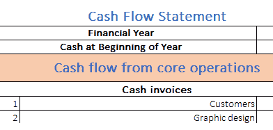

1.  至于运营费用，它们可以按以下方式分类：

    +   为网站提供托管服务

    +   在网站工作所需的资源

    +   员工工资

    +   税收，等等

将所有这些编制成表格后，它应该看起来类似于以下截图：

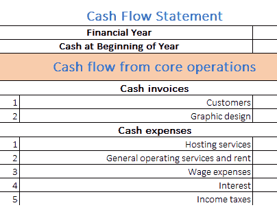

1.  最后，我们将添加一个净现金流行显示来显示来自运营的总现金流。在为其分配的单元格中，我们将输入以下公式：

```py
=SUM(D8:D15)
```

我们现在已经完成了现金流量表的运营部分。

1.  现在，我们将创建一个类似于运营表的表格；这次是为投资活动。在这个表格中，我们将使用以下现金发票：

    +   出售网络域名和模板

    +   图形设计销售

因此，我们的现金流量表现在看起来与以下截图类似：

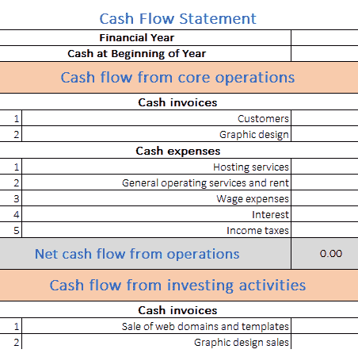

1.  投资活动的支出包括以下内容：

    +   购买计算机和其他设备

    +   员工的有趣活动

    +   员工赞赏

我们将按以下方式将这些添加到表格中：

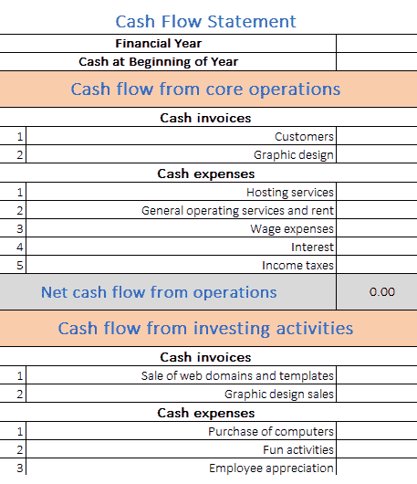

1.  然后，类似于运营表，我们将创建一行显示来自投资活动的总现金流。到目前为止，我们的现金流量表应该如下所示：

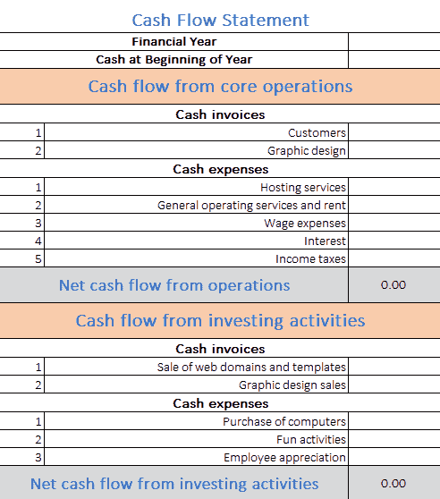

1.  现在，我们将重复相同的流程，用于融资活动，修改元素，如下图所示：

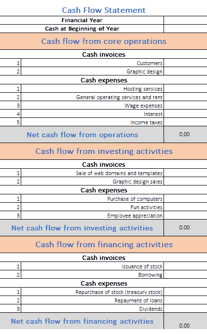

1.  我们的最后任务是创建一个单元格，显示年内经过扣除的总现金收入，如下所示：

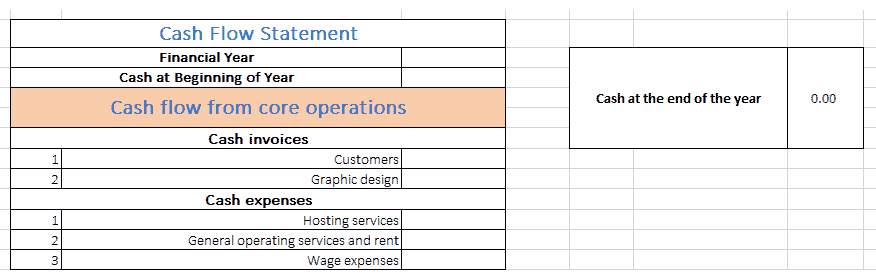

要计算总现金收入，我们只需要找到所有三种活动的净现金流单元格中的值的总和，以及年初投资的现金。在这种情况下，公式如下：

```py
=D16+D27+D38+D4
```

当你有一个没有中断的数字范围时，`SUM`函数更有用。当从不同地方添加值时，直接引用单元格总是更好。

因此，我们的最终现金流量表如下：


现在，我们将向所有必需的单元格输入一些值，并查看年底的最终现金余额：

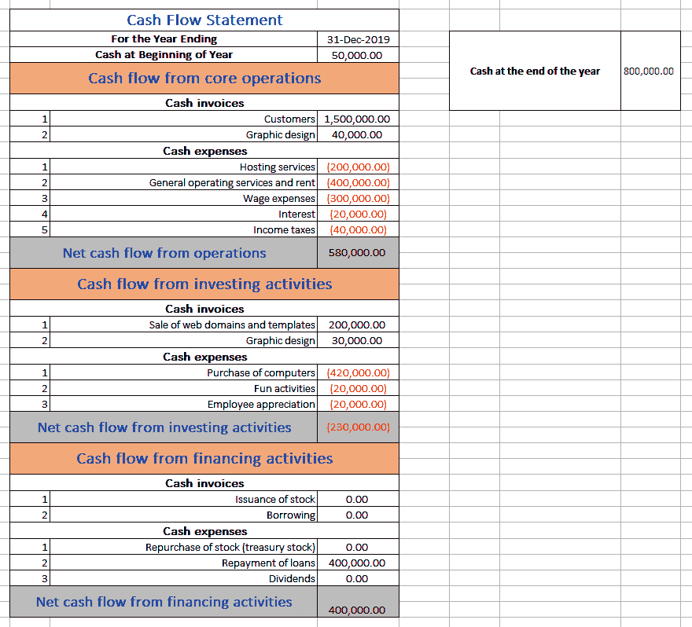

嘿，这不错！看起来公司的情况不错，正朝着创业公司的正确道路前进！我们已经创建了一个简单的现金流量表，对于许多情景都可能很有用。此处创建的模板可以在 GitHub 书籍的存储库中找到，名称为`CashFlowCompany.xlsx`。

# 总结

在本章中，我们学习了如何使用 Excel 中的各种函数来创建我们的现金流量表。我们学会了如何考虑各种因素，比如不涉及现金流动的项目，来自投资和融资等各种活动的现金流量等。我们还学会了如何平衡表格，以确保一切准确无误。我们还了解了如何解决可能发生的任何错误。最后，我们为特定情景创建了一个样本现金流量表。

在下一章中，我们将研究各种类型的比率分析。
