# 第九章：估值

无论建立和经营一家公司的原因是什么，你都会在某个阶段想要了解企业的价值。这可能是由于以下原因之一：

+   识别弱点

+   确定企业是增长、停滞还是恶化

+   申请贷款

+   吸引投资者

+   作为推动未来增长的平台建立参考点

+   为了准备从公司撤资

有几种估值方法，但本章将讨论三种主要方法。

本章将涵盖以下主题：

+   绝对估值

+   相对估值

+   解释结果

# 绝对估值

普遍认为，估价企业的最准确方法是使用**贴现现金流**（**DCF**）方法进行绝对估值。关键是，该方法考虑了货币时间价值。它还考虑了企业预期寿命期间的现金流。这与企业价值的定义密切相关，即其能够产生的总现金流量。

DCF 方法包括技术概念和计算。我们将试图简化这些概念，但尽管如此，你不必重复推导出一些估值所需的复杂计算中的大多数。你将始终有可参考的资源，并且你肯定会创建自己的资源数据库，以便根据需要利用。

# 自由现金流

DCF 方法是从三表法结束的地方开始的。它始于**自由现金流**或**FCF**的概念。目标是确定公司产生的现金流量；然而，你需要认识到，产生的现金中有一部分被用于满足债权人和资本支出计划等事项。因此，我们需要调整这些项目的现金以得到 FCF。通常，你会计算整个公司（FCFF）的自由现金流，并根据需要调整此数以得到股权持有人（FCFE）的自由现金流数。

第一个，FCFF，将引导我们到**企业价值**（**EV**），第二个，FCFE，将引导我们到公司普通股的股价。就像现金流量表一样，你将从经营利润，即**利息和税前收益**（**EBIT**）开始。由于政府征税是一项义务，你需要按照适用的税率扣除税款。

然后，你要加回不涉及资金流动的项目，如折旧。工作资本的增加表示现金的净流出，应该扣除。如果显示工作资本减少，表示现金的净流入，则应将其添加到你的总额中。最后，扣除任何计划的**资本支出**（**CapEx**）和**工作进展**（**WIP**）的增加，以得到公司的自由现金流量，即 FCFF 的数额。

当一家公司开始进行建造或建设固定资产的项目时，该项目有时会延续到年底。由于在那个阶段，项目尚未完成，因此将到目前为止发生的成本分配到资产账户将是误导性的。正常做法是创建一个在建工程账户，并将所有未完成项目的支出记入该账户。一旦项目结束，账户上的余额就转移到适当的财产、厂房和设备或固定资产账户上。

以下屏幕截图显示了五年 FCFF 预测的计算：

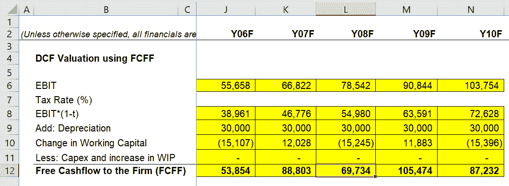

# 时间价值

在第一章*，金融建模和 Excel 简介*中，我们介绍了时间价值的概念。今天手里的钱可能比一年后相同金额的资金更有价值。这是因为你可以投资这些资金，一年后，你可以收回它们并获得利息；以 10%投资的 N1,000 在一年后会给你带来 N1,100，如下计算所示：

例如，如果*M*1 代表第一年的现金，*r*代表利率，*M*2 代表第二年的现金，那么公式变为以下形式：

相反，以 N1,100 折现回今天将价值降至 N1,000。

重新排列前面的方程，我们得到以下结果：

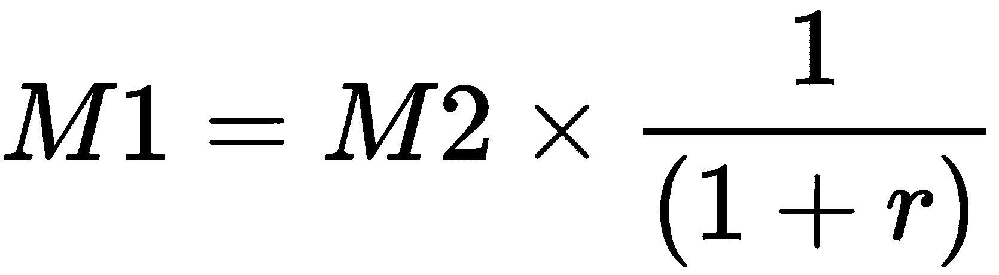

换句话说，今天的现金等于明天的现金乘以一个折现因子。

在上述屏幕截图中，第一年后的折现因子如下：

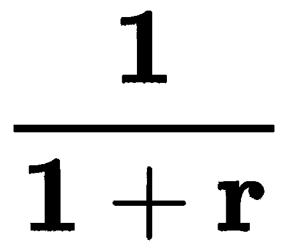

第二年后，折现因子如下：

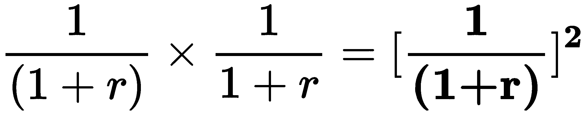

第三年后，折现因子如下：

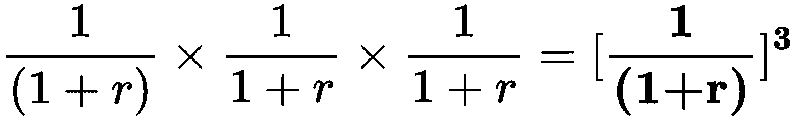

这导致我们得到年*n*后的折现因子如下：

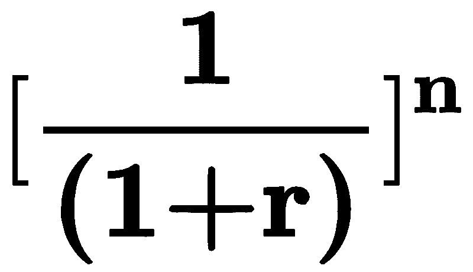

我们已经预测了未来五年的自由现金流，并为每年的现金流获得了货币价值。

现在我们需要将这些现金流折现回今天的价值，然后才能得到折现现金流的总和，从而得出企业价值。

请注意，今天是 FY06 年的年初，也是预测年度的第一年。

# 加权平均资本成本

对于 DCF 模型，**加权平均资本成本（WACC）**是折现因子公式中的**r**。一家公司通常有不同的资本来源，债务和股本，每种来源都有其自己的成本或公司的期望。例如，债务资本的成本将是利息费用。这种利息是年度利润的一项费用，与其他可扣除费用一起，减少了应纳税利润的金额。

因此，尽管利息是从我们的现金流中调整的债务资本成本，但在我们对利润计息时也有一定的税收节省额。利息费用节省的税款通过使用税后资本成本来确认，如下所示：

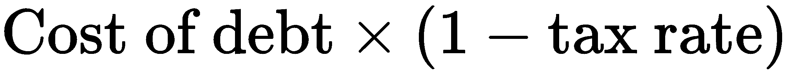

WACC 是公司拥有的不同类型资本的平均成本。每种资本来源对 WACC 的贡献都是加权的，以考虑其所代表的总资本的比例。

例如，如果债务与股本比率为 2:1，则债务成本将对总资本的影响加倍于股本成本，并且债务成本在 WACC 中的权重将反映这一点，如下式所示：

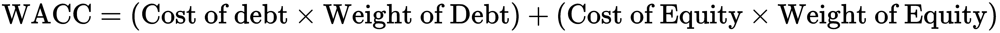

这个方程被广泛称为**资本资产定价模型（CAPM）**。我们已经看到，债务成本是应付债权人的利息。计算股本成本是一个更复杂的练习。股本比债务更具风险，因此股本持有者对回报有更高的期望。只要公司是持续运营的，债权人就有保证其利息的权利。股本持有者必须依赖于普通股息，这可能会或可能不会被宣布。

股本成本计算如下：

在前述公式中，*Rf*是无风险利率。政府证券的利率通常被视为无风险利率：

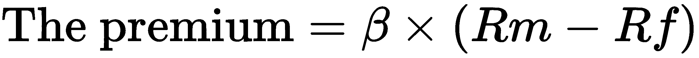

在前述公式中，*Rm*是整个股市的风险溢价，*β*是公司股票相对于市场的波动性或风险。因此，可以说风险溢价是市场风险溢价与无风险利率之间的差异，经过调整以适应公司股票相对于市场的特定波动性。

*β*值为 1.0 表示股票与市场波动性完全匹配。市场变动 1%时，股票也会以相同方向 1%的幅度变动。较高的*β*值表示股票比市场更具波动性；它们承担的风险更大，但也比市场获得更多的回报。

较低的*β*值表示股票比市场更不易波动，而负的*β*值表示与市场负相关。换句话说，当市场价格上涨时，股价将下跌，反之亦然。

下面的截图显示了计算权益成本和 WACC 所需的方程式和参数：

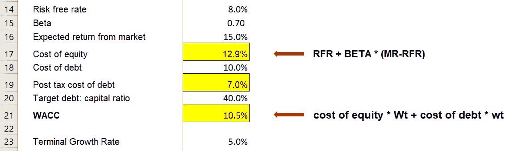

# 终值

在你的模型中，你已经对未来五年的数字进行了预测。然而，公司在五年结束后并不会停止存在，而是会继续产生可预见的未来收入。贴现现金流量法试图使用**终值**的概念量化所有未来现金流量。

在预测的五年结束时，假定公司已经达到了稳定的位置，并且将继续体验稳定的增长，直至其存在的剩余时间。这种稳定增长的速率称为**终值增长率**（**TGR**）。基于这个假设，可以制定公式来模拟到无穷大的增长，然后通过数学重排，得出一个代表所有未来现金流的终值，从第五个预测年份结束开始，一直延伸到永恒。

终值的方程式如下：

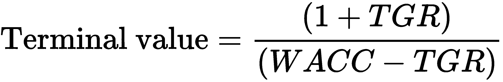

终值通常是 DCF 估值中最大的贡献因素，并且倾向于确保使用该方法获得的价值通常高于其他方法达到的估值。

下面的截图显示了终值的计算：

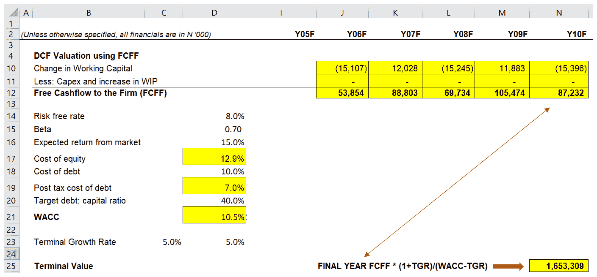

# 计算现值

使用 WACC 作为*r*，现在您将贴现预测的五年现金流和终值，以获得每年现金流和终值的现值。

第一年的折现因子表示如下：

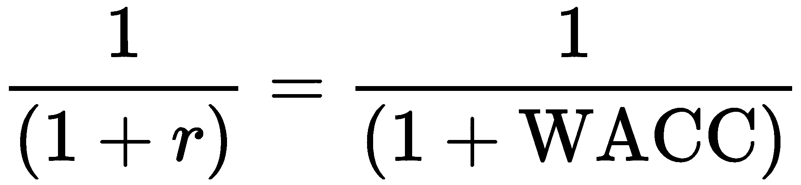

从上面的截图中，我们可以看到 WACC 为 10.5%。在这里，我们将替换 WACC 的值：

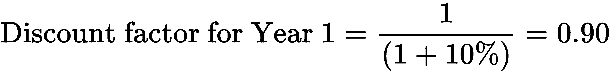

第一年的 FCFF 的现值如下：

我们的预估年份 Y06F 的 FCFF 为 N53,854，如上截图所示。我们使用第一年的折现因子 0.90 来贴现：

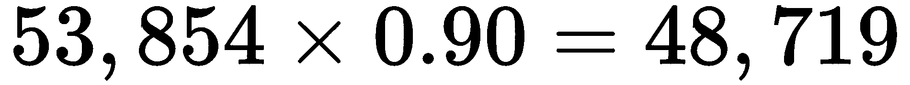

要得到 N(‘000) 48,719，这是第一年自由现金流（FCFF）的现值，我们应进行以下计算：

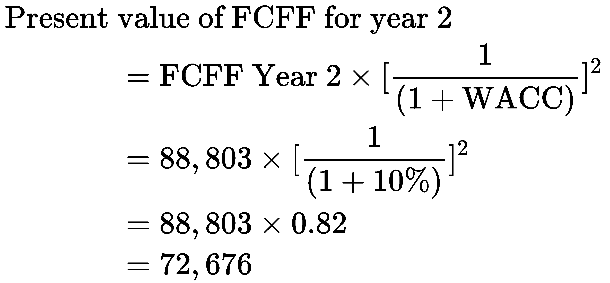

我们重复此格式以获得每个预估年份和终值的 FCFF 的现值，如下截图所示。终值的折现因子将与最后一个预估年份 Y10E 相同。

现值的计算如下截图所示：

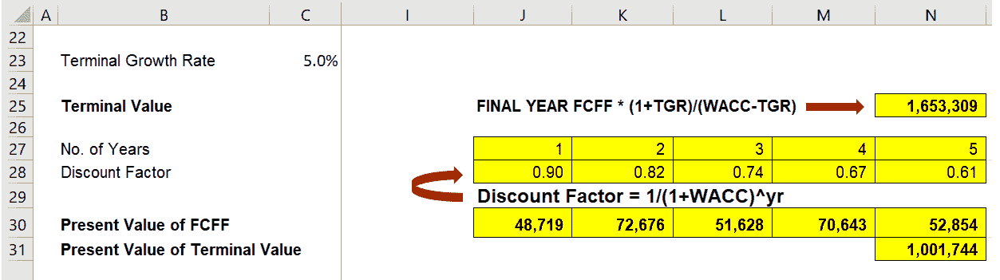

企业价值（**EV**）是所有未来现金流的现值之和：

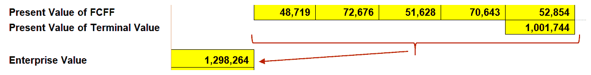

为了获得股权价值，你需要偿还债权人。

你通过从企业价值中扣除净债务（债务 - 现金）和任何不确定性来做到这一点，如下图所示：

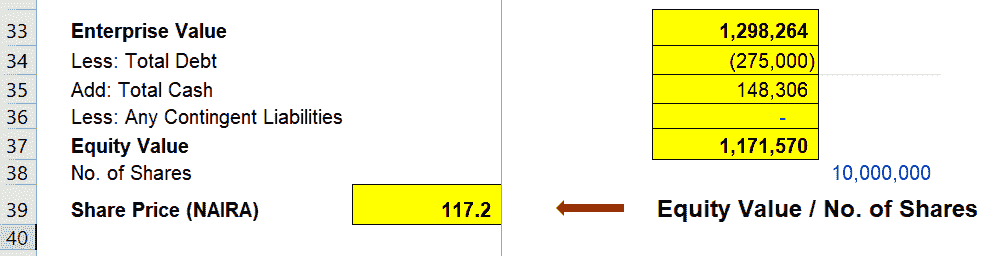

然后，你将股权价值除以股票数量，得出股价（NAIRA），即每股 117.2。

# 相对估值 - 比较公司分析

相对估值依赖于这样一个理论，即一般而言，类似的公司将产生类似的结果。这可能有点简单化，但在涉及大量假设和估计的学科中，相对估值在分析师中很受欢迎，因为它提供了一种得出商业价值的方法，这种方法是合理的、快速的和简单的。实际计算简单直接；难度在于确定可比较的公司。

主要考虑的主要标准如下：

+   行业

+   规模

+   资本结构

+   地理位置

+   增长率

**行业：** 参考你的主要收入来源，确定公司所属的适当行业，并在该行业中寻找示例。

**规模：** 规模与利润之间的关系并非完全线性。资产基数两倍的公司不一定会赚取两倍的利润。规模可能会带来规模经济和访问受限的优势。大公司将能够获得量价折扣和对同一行业中较小公司不可获得的有利业务条款。因此，你应该寻找规模相似的公司。

**资本结构：** 一家依赖债务的公司会让其股东面临更大的风险。这是因为债权人必须在股东之前得到清偿——例如，在破产事件中。此外，负债严重的公司必须保持健康的利息盖息比率，以维持其信用价值。你应该寻找负债与股本比率相似的公司。

**地理位置：** 这非常重要，因为地理位置可能会对公司的运营产生重大影响。经济氛围、税收、关税和其他相关法规可能会有所不同，这可能会对最终利润产生重大影响。你应该寻找在相同地理位置的公司。

**增长率：** 一个增长迅速的公司比增长率较慢的公司更具吸引力，更容易吸引潜在投资者。因此，你应该寻找增长率相似的公司。不可能找到符合所有这些标准的公司，因此你将不得不凭自己的判断力选择与你所建模公司最相似的公司。一旦你确定了四到五家公司，你就需要获得一些倍数，这些倍数将用于你的比较估值。

用于此目的的最常见倍数如下：

+   EV/销售额—按销售额计算的企业价值

+   EV/EBITDA—按 EBITDA 计算的企业价值

+   P/E—市盈率

类似的公司将会拥有相似的倍数。所以，如果*EV/销售额=K*对于公司 A 成立，那么对于另一个相似的公司 B，相同的倍数也会是*= K*。

以公司 A 为例：

EV / 销售额 = K

将*销售额*移到右边以隔离*EV*，我们得到以下内容：

EV = K × 销售额

所以，一旦我们有了公司 B 的销售额，我们可以通过采用公司 A 的相同倍数*K*来计算 EV。

在实践中，你所确定的四到五个相似公司的倍数永远不会完全相同，因此你会取平均值或中位数作为常见倍数*K*。

# 交易对标

以下是五家类似公司的交易倍数的截图；它展示了以表格形式列出的估值所需的相关参数：

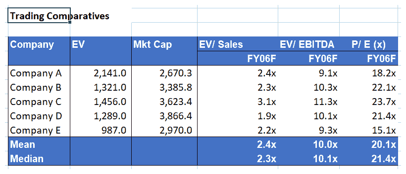

**市值** 是市值，即公司普通股的总奈拉价值。取倍数的平均值和中位数。通常，中位数用于消除异常值的影响。如果你有一组数字，读作 3，5，4，3 和 22，那么平均值（或平均数）将是 7，中位数将是 4。看看这个集合，数字 22 显然是一个异常值；由于某种原因，它远远大于集合的其他成员。它显然影响了平均值返回一个数字 7，这似乎与集合中的其他数字不一致。

然而，由于中位数的特性，它已经中和了异常值的影响，返回了一个更具代表性的数字 4，这更加代表整体集合。

以下截图显示了用于计算公司股价的选定倍数的中位数：

对于 EV/销售额的倍数，方程如下：

EV/销售额的中位数为 2.3。

你正在审查的公司的销售额总计为 325,582。因此，我们这家公司的企业价值（EV）如下：

要得到股权价值，我们需要扣除 126,694 的净债务以获得市值：

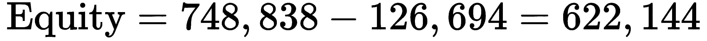

股份数量为 1 亿，因此我们的股价将变为以下内容：

你正在审查的公司的 EBITDA 为 58,908。使用 EV/EBITDA，方程如下：

要得到股权价值，我们需要扣除 126,694 的净债务以获得市值：

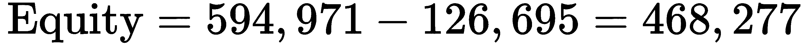

股份数量为 1 亿，所以股价将变为以下内容：

以相同的方式使用 P/E 比率，我们得到股价为 N43.3，如上一截图所示。

# 先例交易比较

先例交易比较方法看待最近进行类似交易的类似公司，并假设证券交易价格。

以下截图显示了具有其倍数的类似交易的表格：

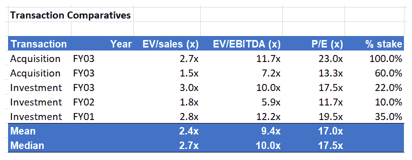

股价计算如下截图所示：

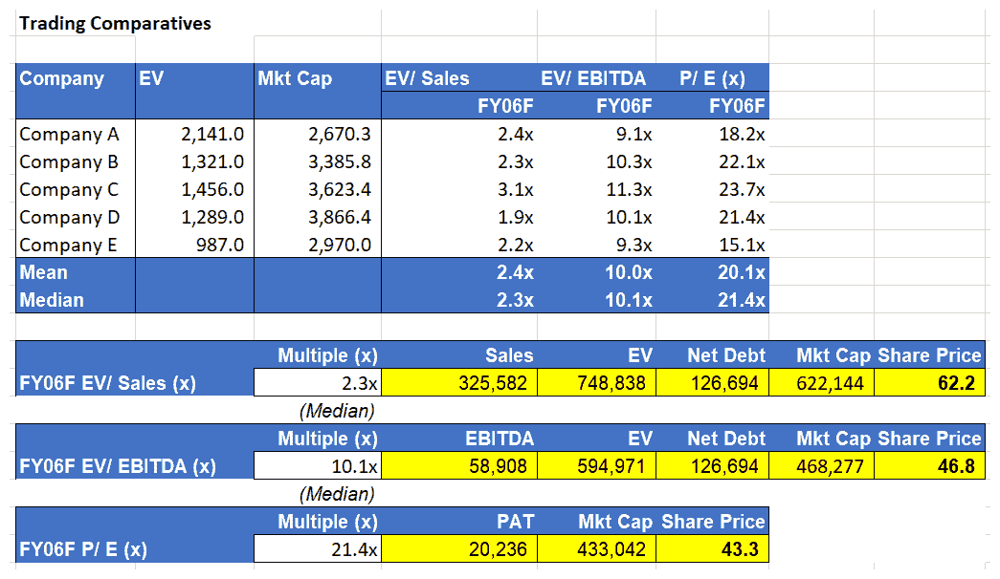

使用 EV/Sales，股价为 N75.2。

使用 EV/EBITDA，股价为 N46.2。

使用 P/E 比率，股价为 N35.4。

摘要如下截图所示：

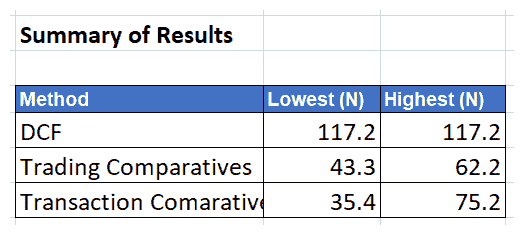

我们可以用一个**足球场图表**来表示这些结果。图表得名于不同的值如何像足球场上的足球队员一样分散在图表周围。

为了绘制图表，我们创建一个表格，显示了每种方法和倍数下获得的股价的最小值和最大值，以及最小值和最大值之间的差异。

这是提取足球场图表所需数据的屏幕截图：

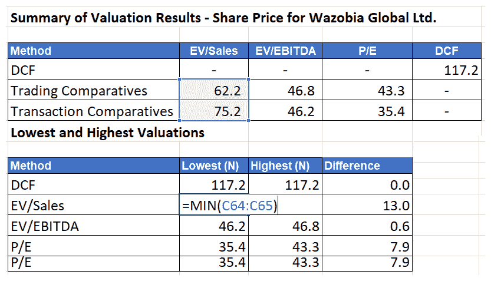

让我们按照以下步骤进行：

1.  使用 `MIN` 和 `MAX` 函数，提取使用每种列出的方法——`DCF`，`EV/Sales`，`EV/EBITDA` 和 `P/E`——计算得到的最低和最高股价值。

1.  转到插入 | 图表 | 2-D 条形图，并选择第二个选项，如下所示：

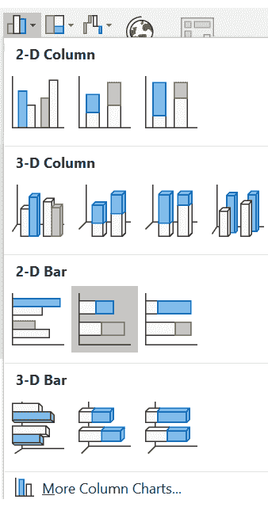

1.  出现一个空白图表。调整图表大小，并将其移动到表格的正下方：

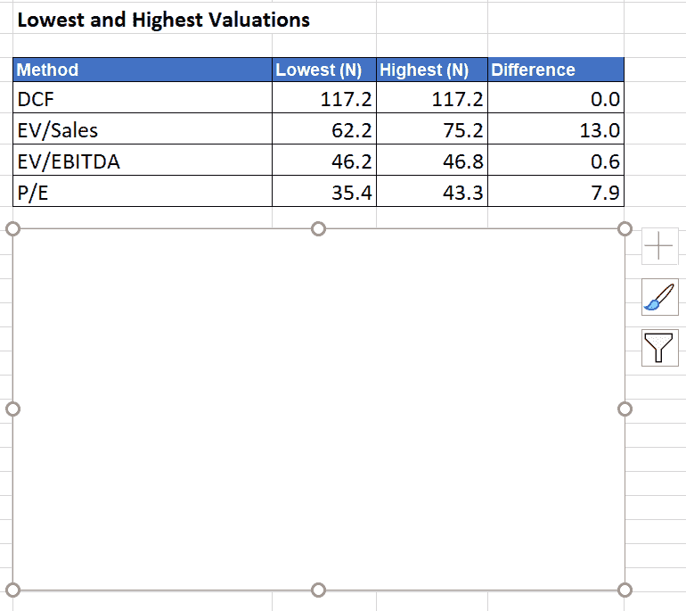

1.  转到图表工具 | 设计选项卡，然后单击“选择数据”：

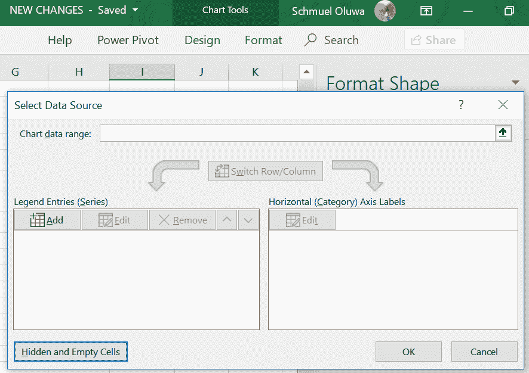

1.  在“选择数据源”对话框中，您将添加数据系列。我们有三个数据系列，`最低`，`最高` 和 `差异`，但目前，我们只会使用 `最低` 和 `差异` 系列。在**图例条目（系列）**部分，点击**添加**，然后选择最低列下值的范围，从 **C70** 到 **C73**：

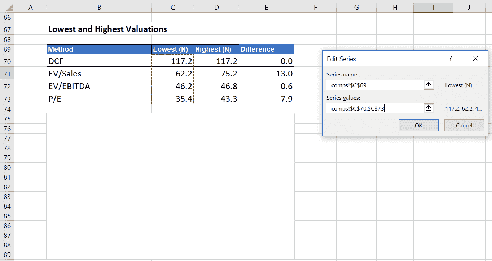

1.  重复该过程，并添加第二个数据系列 E70 到 E73：

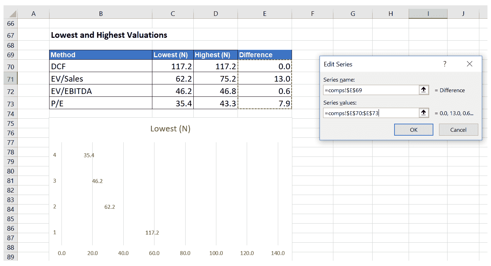

1.  右键单击 `最低` 系列的任何数据点，然后单击 “格式化系列”。在“格式化数据标签”对话框中，单击填充图标，然后选择无填充：

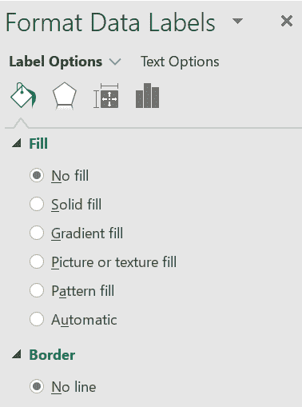

1.  现在选择 `方法` 部分作为水平轴，从 B70 到 B73：  

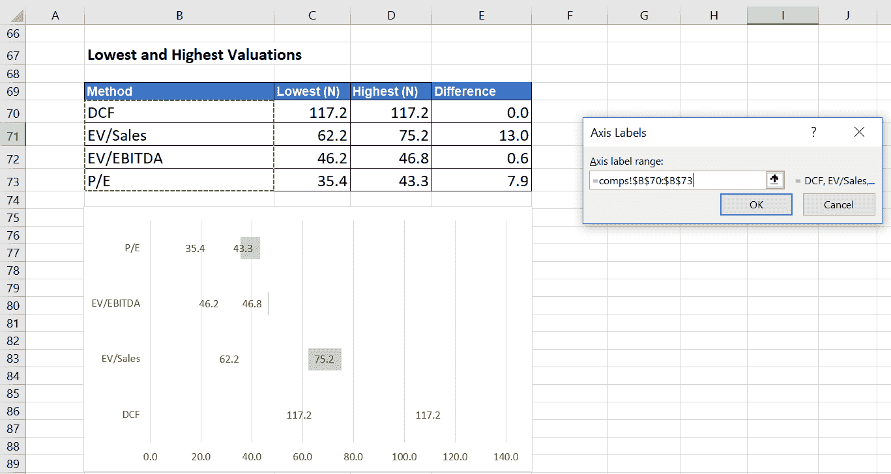

1.  如果数据标签未显示在数据点上，请按照此步骤和下一步操作进行显示。单击“最低”系列的任意点。然后转到图表工具 | 设计 | 添加图表元素 | 数据标签 | 底部内部：

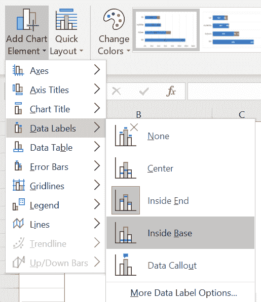

1.  对于“差异”系列的数据标签，我们希望显示“最大”系列的值。转到图表工具 | **设计** | 添加图表元素 | 数据标签 | **内部末端**。右键单击其中任何一个数据点；然后，在“格式数据标签”对话框中，在标签选项下，勾选“来自单元格的值”，单击“选择范围...”，选择单元格 D70 到 D73：

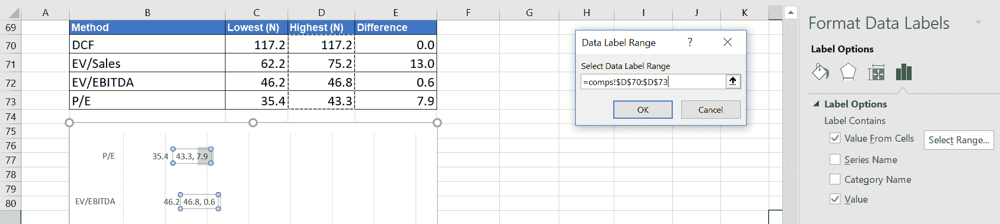

1.  最大值显示在“差异”点上。在标签选项| 标签包含下，取消选中**值**框**。

1.  这样一来，我们在图表上显示了每种使用方法得到的最小值和最大值——`DCF`、`EV/Sales`、`EV/EBITDA` 和 `P/E`：

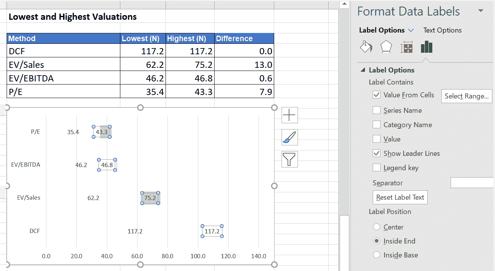

1.  最后，转到图表工具 | 设计选项卡，然后单击添加图表元素 | 图表标题 | 在图表上方。在图表顶部出现的文本框中键入图表标题：

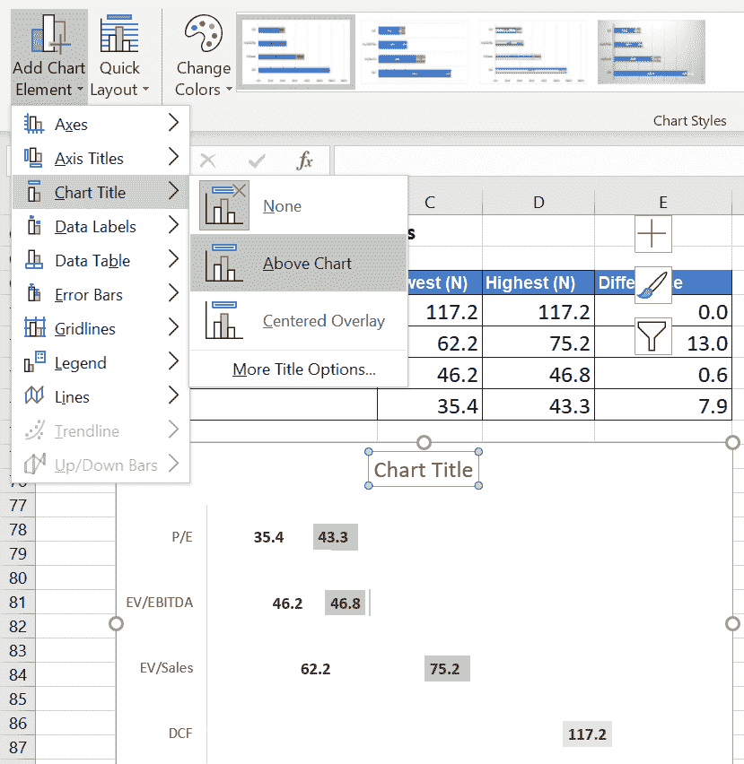

1.  单击 DCF “最低”系列点，然后再次单击以取消选择其他点，仅留下 DCF 点处于选中状态，然后删除。我们这样做是因为 DCF 方法只有一个值。现在我们已经完成了足球场图表：

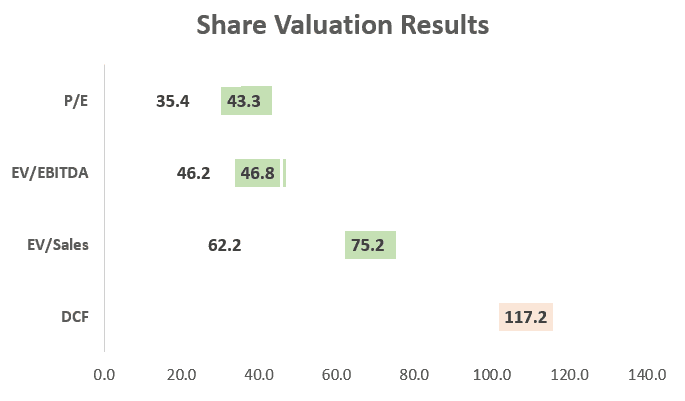

从结果中，我们可以得出以下结论：

+   Wazobia Global Ltd.的股票应该被报价为 35.4 奈拉至 117.2 奈拉之间。

+   如果价格跌破 35.4 奈拉，股票被低估，您应该购买。由于股票被低估，很可能价格会上涨，届时您可以以利润出售。

+   如果价格超过 117.2 奈拉，股票被高估，很可能价格会下降。不要购买，如果您以较低价格购买了股票，请在价格回落之前以利润出售它们。

# 摘要

在本章中，我们看了三种不同的估值方法：

+   使用折现现金流量法的绝对估值

+   使用交易对比的相对估值

+   使用交易对比的相对估值

我们了解到 DCF 方法被广泛认为是最准确的，但由于其简单性和易于应用，相对估值在投资分析师中也很受欢迎。我们已经看到，没有一个正确答案；相反，我们得出一系列结果，这些结果给出了股价应该落在其中的范围。我们还学会了如何创建足球场图表来显示我们的结果，并学会了如何以有意义的方式解释它们。

在接下来的章节中，*合理性和准确性的模型测试*，我们将测试我们的模型，看看它如何对某些关键变量的变化作出响应。我们还将学习如何在鱼雷图中绘制我们的发现。我们将考虑在建模过程中应采取哪些步骤，以确保错误被保持在最低限度。然而，由于错误是不可避免的，我们还将查看故障排除程序。
