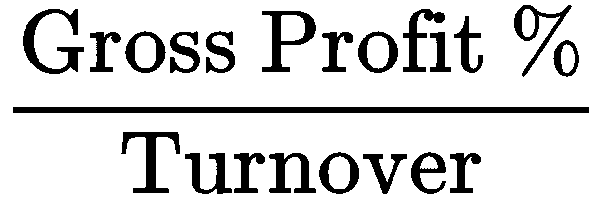
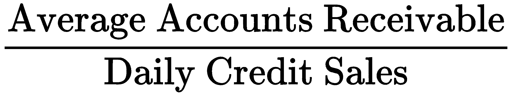
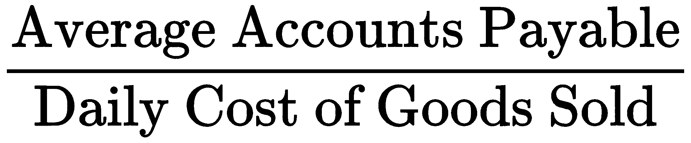
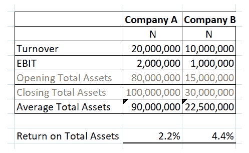
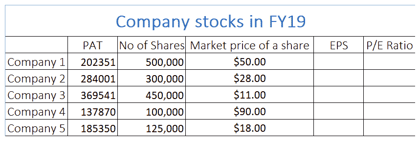
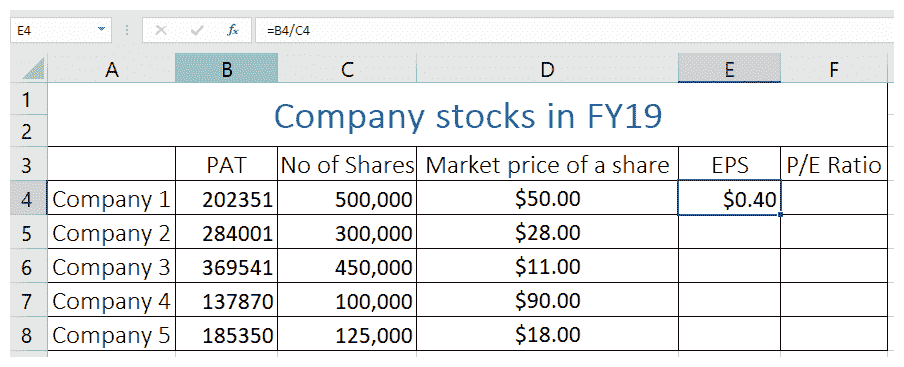
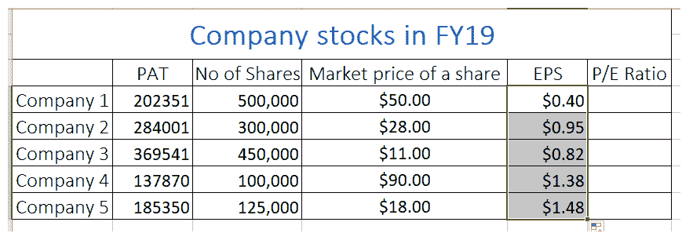
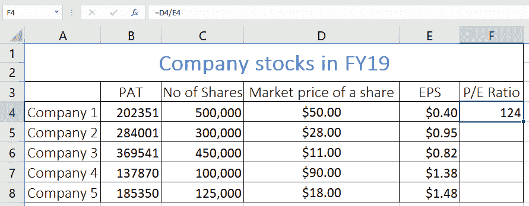
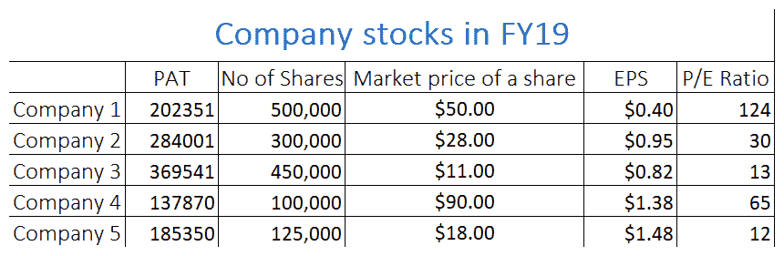

# 第九章：：比率分析

为了评估一个公司，大多数人通常会立即查看其利润历史。虽然这是应该考虑的指标之一，但仅仅根据这些信息做出决定可能是错误的。正如我们在第七章中所见，*现金流量表*，利润并不总是等于现金，即使是利润最丰厚的公司也可能会因利润没有得到现金流的支持而倒闭。

比率分析涵盖了公司的盈利能力、流动性、资产管理和效率、债务管理以及市场价值。每个比率从财务报表中选取两个战略项目，并检查它们之间的关系，以获得有关公司盈利能力、流动性等的一些见解。

在本章中，我们将涵盖以下主题：

+   理解比率分析的意义和好处

+   学习各种比率的意义

+   解释比率

+   理解比率分析的局限性

+   使用比率找到财务稳定的公司

# 理解比率分析的意义和好处

比率是通过将一个项目除以另一个项目来计算的——例如，利润除以营业额。但是，您不应随意选择财务报表中的项目并对其进行划分；您应选择其比率将是有意义的并提供有助于决策的信息的项目。在利润除以营业额的示例中，这个比率，也称为利润率，告诉您每一卢比营业额产生多少利润。

比率通常以百分比的形式表示，但也以**倍数**或**天数**的形式表示。20%的利润率意味着在扣除所有相关费用后，公司将其营业额的 20%作为利润留存。换句话说，该期间的利润占营业额的 20%。比率本身对于引导管理层和各部门关注存在问题的领域是有用的；然而，如果比率在一段时间内计算，以便建立趋势，那将更有用。

这一点对公司的外部利益相关者特别重要，例如投资者。管理层可以获取其他第三方无法获得的内部信息，因此可以更深入地从年度比率中提取更多意义。投资者只能访问已发布的财务报表。因此，从财务报表中准备的比率对投资者和其他外部利益相关者尤为重要。应该在多年时间内计算比率，以确保结果真实反映公司的绩效。然后可以将结果与类似公司以及公司所在行业的标准进行比较。它们还可以用作预测的基础。

# 学习各种比率的意义

有成千上万种比率，你可能会很容易迷失其中。为了让我们的生活更轻松，比率可以归类为五个广泛类别，即盈利能力、流动性、效率、债务管理和市场比率。

我们将对每个类别进行几个示例分析。

这些比率衡量公司将营业额转化为利润的能力。这些比率通常被称为**利润率**，通常意味着它们被营业额除以。让我们看一下毛利润率，其表达式如下：

在这里，毛利润是营业额减去销售成本。

有时，当公司出现亏损时，即使有毛利润，您仍然可以感到一些安慰。这意味着直接成本已经得到了覆盖，并且有一些用于支付一般开支或管理费用的捐款。毛利润率往往会在多年内保持相对稳定，因为它经常反映了公司的加价政策。如果毛利润率（或简称毛利率）非常低，甚至为负数，那么可以得出结论认为公司陷入了困境。这个比率对于制定公司加价政策的管理层尤其重要。

还有其他类型的利润，其利润率可以计算。利润率的相关性将取决于您属于哪个利益集团。债务提供者希望偿还本金和利息。因此，他们将对利息之前的利润感兴趣，即利息和税前利润，或者称为 EBIT。EBIT 利润率的表达式如下：

较高的利润率意味着投资者更加自信，因为利润率表明公司能够按期偿还本金和利息。股东等权益持有者是公司利润分配的最后考虑对象。只有在计提折旧、利息和税收后，才能得出可供分配的利润。因此，股东特别关心税后利润，即 PAT。

PAT 利润率的表达式如下：

EBITDA 受到一些分析师的青睐，因为他们认为这使得用户能够在其受到 CapEx 政策、折旧和债务偏好（如利息和政府政策）的影响之前观察公司的表现。

**利息、税收、折旧和摊销前利润**（**EBITDA**）因此被认为是公司财务健康状况的更纯净指标。

EBITDA 利润率的表达式如下：

# 流动比率

流动性是评估公司是否能够及时履行义务的最重要指标之一，换句话说，评估公司是否是持续经营的。流动性比率比较公司的流动资产与其流动负债。如果短期负债未能得到足够的短期资产覆盖，那就是我们需要采取行动防止公司陷入困境的第一个信号。

当前比率的表达如下：

很难确定哪个数字代表了一个好的比率；然而，当前比率在 1.5 到 2 之间通常被认为是足够的。一个较低的数字可能表明公司可能正在努力满足其债务。

另一方面，一个非常高的比率可能表明资金被用来赚取收入。流动资产主要由库存、应收账款和现金组成。快速比率认识到库存不像其他流动资产那样容易转化为现金，并将流动资产减去库存与流动负债进行比较。

快速比率的表达如下：

流动性的最严格测试是酸试验，它将现金与流动负债进行比较。

酸测的表达如下：

# 效率比率

效率比率衡量公司如何有效利用其资产并管理其负债以产生收入。

以下是一些效率比率的示例：

+   **库存天数**：平均库存是通过取期初和期末库存的平均值得到的。每日销售成本是通过将年销售成本除以 365 得到的。结果以天数表示，代表库存在销售前停留的时间。公司应保持足够的库存以满足客户需求，避免延迟；然而，保留过多库存或将库存保留时间过长将导致额外成本。管理层将不得不在两者之间找到平衡。此比率计算如下：

+   **应收账款（债务人）天数**：平均应收账款是通过取期初和期末应收账款的平均值得到的。每日销售额是通过将年销售额除以 365 得到的。结果以天数表示，代表客户支付从公司信贷购买的货物所需的时间。管理层需要给予客户足够的时间支付货物和服务，以鼓励他们继续与公司做生意；然而，信贷条件不应过于宽松，否则可能导致现金流问题。此计算如下：

+   **应付账款**（**债权人**）**天数**：平均应付账款是通过取期初和期末应付账款的平均值得出的。每日销售成本是将年度销售成本除以 365 得出的。结果以天数表示，表示公司支付从供应商购买的信用商品所需的时间。管理层应该尽可能地延长支付时间，而不会疏远供应商，以支付信用购买。计算方法如下：

# 平均资产回报率

**平均资产回报率**（**ROAA**）将年度实现的利润与年度平均总资产进行比较。这是衡量公司利用其资产有效地产生利润的指标。

ROAA 的计算方法如下：

从这个公式中，我们知道 EBIT 是利息和税前的收益或利润，平均总资产是期初和期末总资产的平均值。这是一个非常重要的比率，因为它为一些盈利能力比率提供了背景。

请考虑以下 ROAA 的屏幕截图：

乍一看，公司 A 似乎更具吸引力，营业额和 EBIT 加倍；然而，仔细观察表明，公司 A 利用了 9000 万纳伦的资产赚取了 200 万纳伦的利润，而公司 B 只利用了 2250 万纳伦的资产赚取了 100 万纳伦的利润。

换句话说，公司 B 在资产使用效率上更高，平均资产回报率为 4.4%，而公司 A 仅为 2.2%。

# 平均资本回报率

**平均资本回报率**（**ROACE**）：此比率确定了公司如何有效地利用其资本。计算方法如下：

**投入资本**一词指的是债务和股本，可以按以下方式计算：

这是最流行的比率之一，用于比较不同公司如何经济地利用其资本。ROACE 越高，资本利用效率越高。没有绝对的 ROACE 目标值，与其他比率一样，随着时间的推移计算更有意义；但是，您期望 ROACE 高于资本成本。

# 平均股本回报率

**平均股本回报率**（**ROAE**）：计算方法如下：

在上述方程中，PAT 指的是税后利润。该比率使用净收入或 PAT 而不是 EBIT，因为在计算归属于股东的利润之前必须支付利息和税收。

重新整理会计方程式*资产 = 负债 + 股权*，你得到*股权 = 资产 - 负债*。

这是确定股权的另一种方法。**净资产收益率**衡量公司如何高效地利用其股权资本并盈利。

# 债务管理比率

债务管理比率衡量公司的长期偿债能力。以下是一些债务管理比率：

+   **杠杆或债务比率**：该比率衡量公司依赖债务融资与股权融资的程度。比率越高，公司就越依赖外部债务。一个高度杠杆化的公司必须确保能够满足长期债权人的期望，以免他们提前要求清偿债务，这可能会使公司陷入困境。此计算如下：

+   **利息保障倍数**：该比率衡量公司是否产生足够的利润来轻松覆盖外部债务和利息成本。此计算如下：

+   **市值比率：**每股收益是计算市值的常用比率，计算如下：

如果存在优先股，优先股股利将在将其除以普通股数量之前从净利润后税前利润中扣除。每股收益也可以归类为盈利能力比率。之所以在此提及它，是因为它是一种流行的市场指标，用于衡量公司利润中有多少用于每股普通股的保留。

+   **市盈率**：市盈率是投资者愿意为公司的利润或收益支付多少的衡量标准。此计算如下：

# 解读比率

公司的投资者和其他外部利益团体通常只能访问公司的财务报表。然而，仅凭财务细节来评估公司是有限的。比率是这些利益团体的有价值工具，使它们有机会以广泛接受的参数标准化的方式评估公司。

尝试比较不同规模、地理位置、财政司法管辖区和性质的公司通常是一个非常主观的过程。比率分析通过强调绩效而不是营业额或利润的绝对大小，提供了一个公平的竞争环境。效率、盈利能力和流动性或多或少与营业额、资产、利润和负债等个体参数的绝对大小无关。

比率分析允许比较不同的公司，并且还允许分析师为不同的比率设定基准，以便新兴公司可以评估其与这些基准的表现，并确定需要改进的领域，以及表现良好的领域。

管理层可以使用比率分析来监控部门负责人的业绩。他们可以用它来设定奖励或奖金的目标和阈值。如果比率在几个时期计算，它们可能会显示出一个趋势，这可能会突出显示出现即将发生的困难，然后可以在其具体化之前加以解决。

现在我们将看一些不同类型的趋势分析示例。

毛利率百分比的增加并不一定是一件好事。您需要考虑以下因素：

+   确保增加不是由于某些错误，例如营业额过高或销售成本低估。

+   弄清楚这是否是公司政策变化的结果。

+   观察这对销售量产生了什么影响。增加的毛利率百分比可能导致市场份额的损失。

如果市场份额的损失继续不受控制，这可能会影响公司继续经营的能力。管理层可以决定降低产品的标记价格，以吸引客户回购其产品，并最终恢复市场份额。毛利率百分比的下降并不一定是一件坏事。您需要考虑以下因素：

+   确保减少不是由于某些错误，例如营业额低估或销售成本高估。

+   弄清楚这是否是公司政策变化的结果。

+   观察这对销售量产生了什么影响。降低的毛利率百分比可能导致市场份额的增加，这将转化为利润增加。

解释比率的另一个例子涉及流动性比率。高流动比率表示公司在流动性方面健康；然而，速动比率将显示这种流动性在多大程度上依赖于库存。如果速动比率急剧下降，而不考虑库存，则管理层需要寻找减少对库存依赖以反映流动性的方法。

一种方法是减少库存中的现金量。只要不影响满足客户需求的能力，管理层可以考虑持有更少的库存。改善流动性的另一种方法是尝试提高周转率，这将传递到应收账款和/或现金。即使债权人也增加了公司的标记价格，这也将确保流动性有净改善。

酸度测试，它仅比较现金与流动负债，是一种最坏情况下的比率。只有在一个大债权人突然对公司欠他们的钱提出强制性要求时，它才会变得相关。

一些防范措施如下：

+   避免仅依赖于一个供应商。在可能的情况下，将您的风险分散到多个供应商身上，以便如果一个供应商开始对未结算的余额施加压力，公司可以迅速将焦点转移到其他供应商身上。

+   在选择供应商时要慎重。应该避免选择那些历史上突然提出结算要求的供应商。

+   管理层应采用了解供应商政策。所有供应商的健康状况应该受到监控，以便在第一次发现供应商出现问题并可能需要迅速结算余额时，公司可以采取适当措施减少对该供应商的依赖。

+   管理层应确保库存和应收账款被有效地转换为现金。

# 了解比率分析的局限性

重要的是要意识到，比率实际上并没有解决任何问题；它们只是突出显示趋势和异常，然后可以采取行动。比率的定义经常因分析师而异——例如，快速比率和酸碱测试。一些分析师将当前资产减去库存除以流动负债的比率称为快速比率，而其他人则将同一比率称为酸碱测试。

有一派学说使用年末资产余额来计算 ROA 和股本和长期负债来计算 ROACE。另一派学说意识到公司可以通过在年末进行重大交易，然后在新的一年中撤销这些交易来操纵这个比率。因此，他们使用那些将对这种做法进行反制的余额的平均值。这种方法上的差异可能导致截然不同的结果。比率分析的另一个批评是，它使用历史值，并不考虑市值的变化。

最后，比率分析本质上只关注定量结果、比率的货币含义和趋势。一个对公司的评估不能完整，而没有考虑到定性特征，比如社会责任、商业模式、市场份额、管理质量和运营对环境的影响。

现在我们了解了各种比率，让我们试着将它们应用到实际场景中去。

# 使用比率来找到财务稳定的公司

假设你想要投资于一家财务稳定且市值良好的公司。我们可以使用以下比率来找到最佳的公司：

+   **EPS**：这是一个有用的比率，用于找到最佳的投资公司，因为它显示公司为每一股出售的股票赚取了多少利润。

+   **P/E 比率**：此比率告诉您公司未来可能有更多的增长，并显示您愿意为一股支付多少。

我们将按以下步骤使用这些比率：

1.  打开`CompanyInvestment.xlsx`文件，在其中你会找到一些公司的详细信息，例如它们的 PAT、股份数量和每股的市场价格，如下截图所示：

1.  现在，我们将通过使用单元格引用，计算每家公司的`EPS`，方法是将每家公司的`PAT`除以其`No of Shares`，如下所示：

我们可以从中看出，`公司 1`每股赚取`0.40$`。

1.  现在，我们将通过双击填充手柄来为所有其他公司计算相同的内容，以便我们可以看到所有公司的每股收益（EPS），如下所示：

我们可以看到`公司 5`具有最高的`EPS`，从长远来看，对投资者来说将更具有利润性。

1.  现在，我们将为每家公司计算市盈率。对于`公司 1`，我们可以通过将其股票的市场价格除以该公司的`EPS`来完成这个计算，如下所示：

我们可以看到该公司的市盈率非常高，约为`124`！这意味着该公司未来有很高的增长机会。

1.  最后，我们将找到所有公司的市盈率。你的表格应该类似于以下内容：

我们可以看到，从投资角度来看，`公司 1`是最佳选择，而`公司 4`是一个投资的中间地带。

# 摘要

在本章中，我们学习了比率分析的重要性。我们已经看到了成千上万的比率，但我们已经学会了并非所有比率在任何给定情况下都相关的道理。我们看了如何确定五大比率群体，并且从所有五大群体中的例子中进行了实践。

在下一章中，我们将探讨绝对（通过贴现现金流）和相对（通过比较测量）的估值方法。我们将涵盖货币时间价值的概念，并在我们的计算中广泛使用它。我们将学习一些概念，包括自由现金流、加权平均资本成本和终端价值等。
