# 第十一章：模型测试的合理性和准确性

准备财务模型涉及许多假设和主观决策。为了尽可能减少这种主观性的影响，您需要采取某些程序，其中一些我们已经提到，并进行某些旨在突出显示最不稳定假设并直接关注模型最敏感输入的测试。

在本章中，我们将涵盖以下主题：

+   纳入内置测试和程序

+   故障排除

+   理解敏感性分析

+   使用直接和间接方法

+   理解场景分析

+   创建一个简单的蒙特卡洛模拟模型

# 纳入内置测试和程序

由于其本质，财务模型充满了公式和计算。虽然大多数都很简单，但其数量和重复性会增加错误的风险，这可能会让最有经验的建模者在尝试追踪它们时感到恐慌。

以下是为了减少这种风险而在您的模型中采取的一些程序：

+   **硬编码单元格**：这些单元格应使用蓝色字体加以区分。以下截图显示了一个蓝色字体的硬编码单元格，以将其与标准黑色字体的计算单元格区分开来：

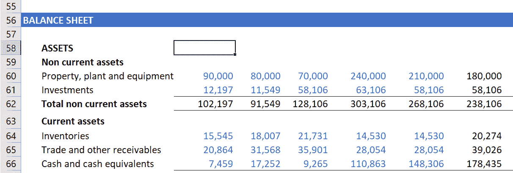

如果要修改模型，需要调整这些硬编码的单元格以实现所需的更改。使用蓝色字体可以减少导航到需要修改的单元格所需的时间。

+   **余额核对**：为资产负债表创建一个余额核对可以确保您能够确认其是否平衡，并快速识别导致其不平衡的任何操作。余额核对应该显眼，并清楚区分平衡和不平衡的情况。

    要使资产负债表平衡，**总资产减去流动负债**必须等于**总股本和非流动负债**。如果存在未显示的四舍五入差异，这仍会导致不平衡警报。这就是为什么您应该使用`ROUND`函数来确保 Excel 在比较两个总数时忽略小数位数。

    以下截图显示了一个余额核对的示例：

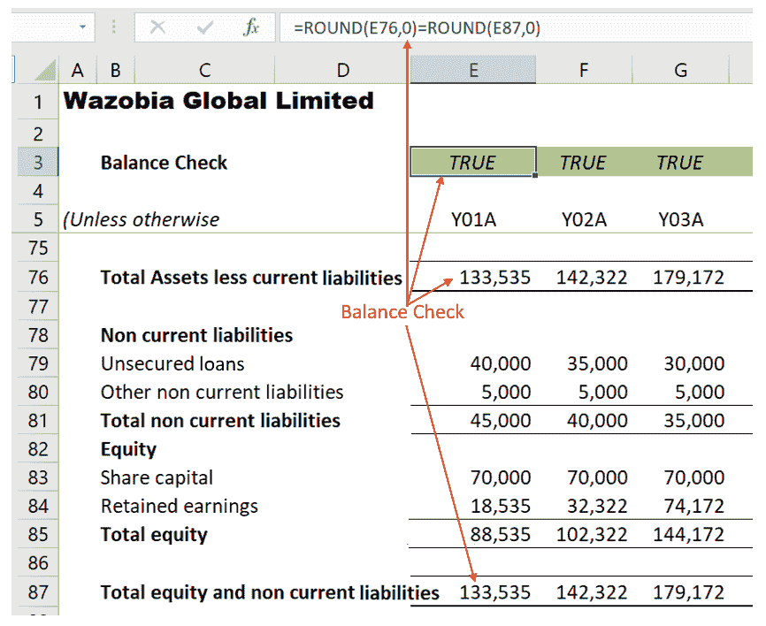

+   **现金及现金等价物**：资产负债表上的现金及现金等价物应与现金流量表中对应年度的期末现金余额相同。这样做可以确保到目前为止，模型在数学上是准确的。

+   **只输入值一次**：如果需要再次输入值，只需参考包含该值原始输入的单元格。这样做可以减少错误的风险，并确保如果需要修改该值，您只需调整原始输入，所有其他出现都将相应更新。

+   **每行使用一个公式**：利用 Excel 的引用框架，该框架在 第四章 中有解释，*在 Excel 中应用引用框架*，只需输入一次公式，然后将相同的公式沿着行向右填充到其余年份。如果操作正确，这将大大减少建模时间并降低错误发生率。

# 故障排除

在发生错误的情况下，有一些步骤可以快速排除几种可能性：

+   **前置项**：前置项是在计算特定单元格的值时所引用的单元格

+   **依赖项**：依赖项是在其公式中包含焦点单元格的那些单元格

下图将进一步解释这一点：

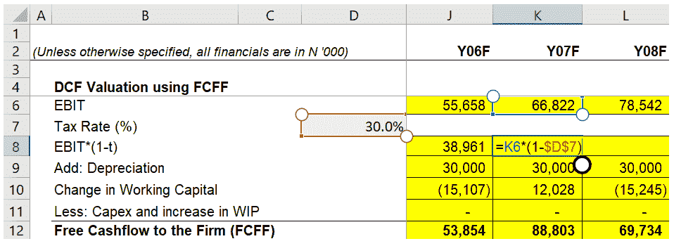

从上图中，让我们看一下单元格 **K8**。该单元格中的公式是 `=K6*(1-$D$7)`，因此单元格 **K6** 和 **D7** 是单元格 **K8** 的前置项。另一方面，单元格 **K8** 是单元格 **K6** 和 **D7** 的依赖项。

在 **公式** 标签中，在 **公式审计** 组中，选择 **追踪前置项** 或 **追踪依赖项** 将显示将单元格链接到其前置项或依赖项的细蓝色箭头。

下图显示了我们如何使用 Excel 可视化查看依赖项和前置项：

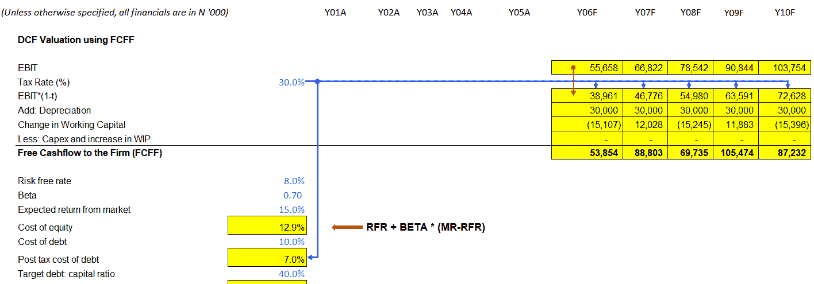

我们可以看到单元格 **D7** 有几个依赖项。然而，由于它是硬编码的输入，它没有前置项。如果任何单元格出现问题，追踪前置项和/或依赖项可以揭示可能导致异常的错误引用。

+   **显示公式**：有一个有用的键盘快捷键，*Ctrl + `*，允许您在工作表中显示所有相关单元格的公式或将它们保留为值之间切换。按一次 *Ctrl + `* 会显示工作表中的所有公式，如下图所示：

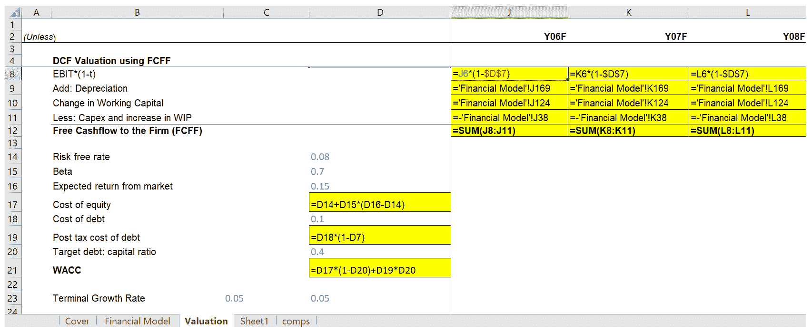

再次按下 *Ctrl+`* 将显示返回到值，如下图所示：

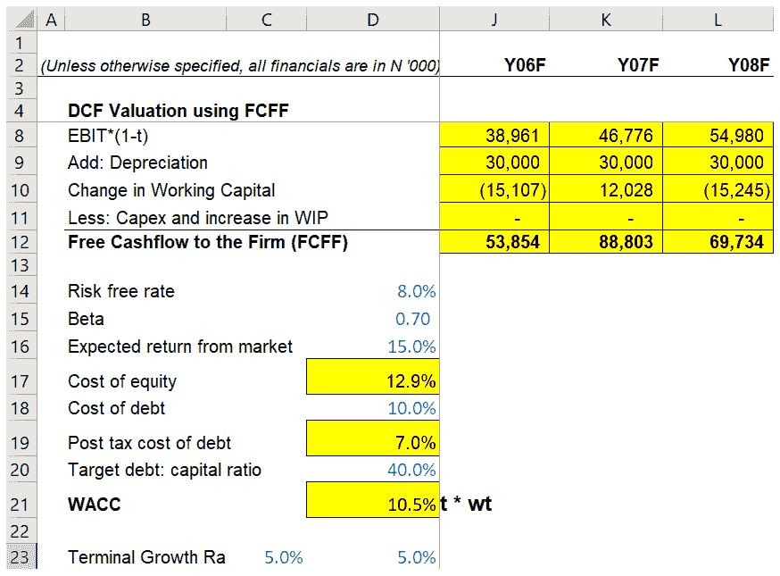

这很有用，因为它允许您快速浏览工作表中的公式并发现任何明显的错误。

+   **评估公式**：有一个**运算顺序**规定了 Excel 将执行操作数（+，-，x，\ 和 ^）的顺序—括号，然后是指数，然后是乘法，除法（从左到右的第一个），然后是加法和减法（从左到右的第一个）。当你需要编写包含多个操作数的复杂公式时，以下运算顺序有助于确保公式正确执行。不可避免地，会有时候你排列公式错误并且顺序错误，导致得到错误答案。

**公式求值** 功能逐步引导您了解 Excel 在执行公式并得出显示的答案时所采取的步骤。例如，用于计算终值的公式如下：

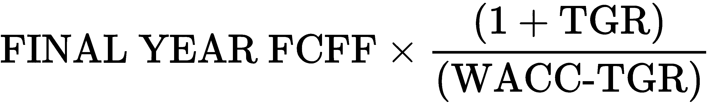

当此公式输入到 Excel 单元格中时，将变为以下形式：

```py
=N12*(1+D23)/(D21-D23)
```

选定终值单元格后，转到 **公式求值**（**公式** 选项卡 > **公式编辑** 组 > **公式求值**）。**公式求值** 对话框将启动，如下面的截图所示：

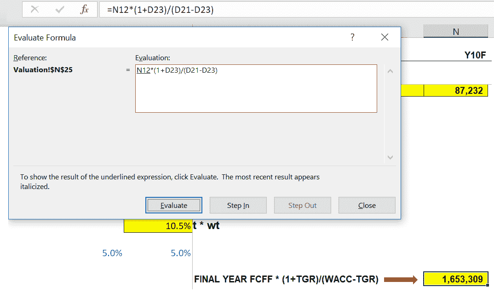

**公式求值** 对话框显示正在评估的带有公式的单元格（在本例中为 N25）、公式本身，其在 **评估** 框中再现，并显示对话框底部的四个按钮，即 **评估**、**步入**、**步出** 和 **关闭**。在 **评估** 框中，将下一个要评估的项目标记为下划线。这可以是一个操作（+、-、x、\、^），将单元格引用转换为该单元格中的值，或者从方程式的一部分中移除括号。

默认情况下，Excel 将从左向右执行一个公式，直到到达决策点，在那里有一个选项来执行一个优先级更高的操作数，这将导致不同的答案。然后 Excel 将跳转到该更高优先级的操作数，并首先执行它，然后返回到较低优先级的操作数，并继续从左向右执行。

在 **N25** 中的公式中，第一步是 Excel 将第一个引用 **N12** 和 FCFF 转换为该单元格中的值。因此，在前面的截图中，引用 **N12** 已被下划线标记。以下截图逐步演示了公式的执行过程：

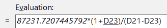

引用 **N12** 现在已被其值所取代。请注意 Excel 并未显示缩写的金额，即 87,232，这是通过格式化进行四舍五入的结果，而是显示到小数点后 10 位的完整数字。

序列中的下一个操作数应该是乘法。然而，括号的优先级高于乘法，因此将优先执行。Excel 将在返回默认的从左到右顺序之前完全执行括号内的内容。

在下面的截图中，第一组括号内的引用 `D23` 现在已经被下划线标记，表示它将被下一个执行：

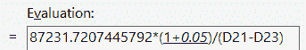

引用 `D23` 现在已被其值 `0.05`（5%）所取代，并且该行现在位于第一组括号的内容下方，表示下一个执行的是加法，即使它的优先级较低，也将给出 `(1.05)`：

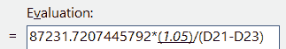

在下面的截图中，括号周围的 `1.05` 已被移除，该行现在返回到正常顺序，并位于乘法下方：

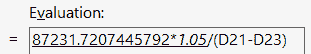

以下截图显示了乘法的结果：

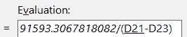

然后，单元格引用 `D21` 将转换为其值：

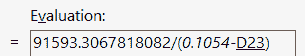

现在，`D23`将被其在单元格中显示的值替换：

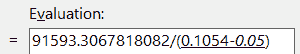

在接下来的两个截图中，首先显示了减法的结果，然后去掉了括号。首先，计算减法的结果：

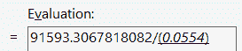

接下来，去掉括号，将其中的数字引入到公式中：

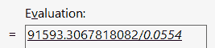

然后，执行最终的操作，即除法，以给出公式的结果，如下截图所示：

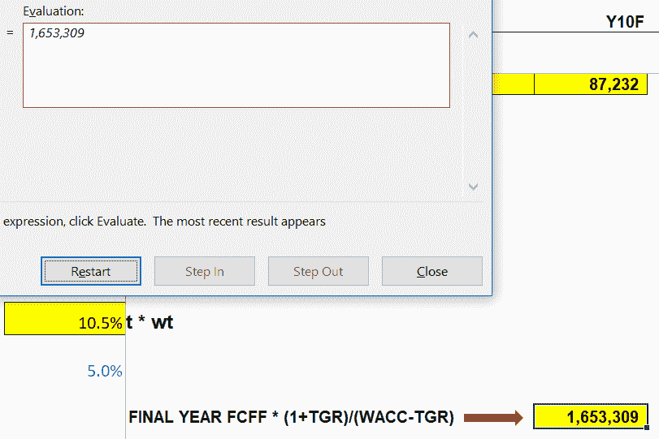

您应该注意，如果在任何阶段检测到公式中存在错误，您可以单击 **逐步调试** 来暂停评估，进入公式中，进行更正，然后单击 **逐步跳出** 来恢复评估。

# 理解敏感度分析

在第九章 *估值* 中，我们计算了股权价格的价值。由于模型中固有的不确定性，您应该采取一些措施来减轻这一点。一种方法是运行一些测试，观察当您更改了用于确定该值的一些输入和驱动因素时股价的行为。

这个过程称为**敏感度分析**。除了您目标值的波动性外，它还指示了哪些输入或驱动因素对目标值产生了最大影响。您需要确定两个在您的模型中显著的输入或驱动因素。

我们已经提到营业额是损益表中最显著的数字。因此，我们可以将营收增长驱动因素视为敏感度分析的一项。另一个显著的项目是终端价值。

我们在第九章 *估值* 中已经看到了这对您的股价估值有多大影响。您可以使用终端增长率，这是用于确定终端价值的变量，作为第二个项目进行敏感度分析。其思想是变化这些输入，观察其对股价的影响，并绘制结果。

# 使用直接和间接方法

敏感度分析有两种方法：直接方法和间接方法。这两种方法都利用数据表，可以在 Excel 的 **数据** 标签页中的 **预测** 组下的 **假设分析** 中找到。以下是 **数据表...** 选项的位置截图：

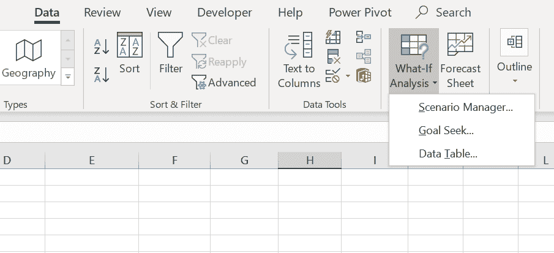

为了使用数据表，您必须以特定方式组织数据。以下截图显示了数据表的布局：

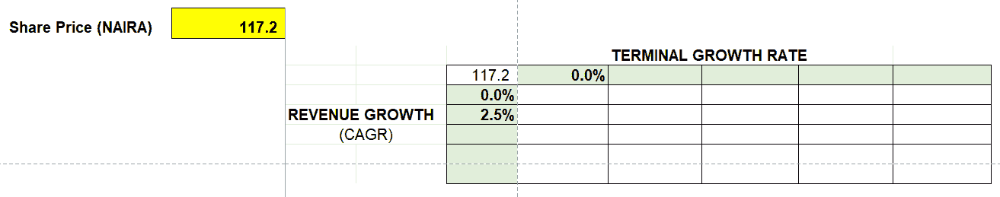

表布局的左上角单元格必须与目标值股价相关联，我们希望观察其行为。该特定位置对于数据表功能的工作至关重要。但是，由于它将不被用于其他任何用途，因此在此以白色字体颜色显示，使其对肉眼不可见，以免引起任何干扰。

行输入值输入在表的顶部行中。我们已选择**终端增长率**作为行输入，其值从 3%开始，以 1%的增量递增至 7%。列输入为**营收增长率（CAGR）**，输入在表的最左侧列中，其值从 0%开始，以 2.5%的增量递增至 9.5%。

然而，5%的输入被更改为 4.5%，以与作为营收增长驱动因素使用的实际历史 CAGR 相匹配。为了准备数据表功能，请从左上角具有目标值的单元格开始选择整个表，不包括输入/驱动值。然后，从**数据**功能区的**预测**组中选择**数据表...**。这将启动**数据表**对话框，如下面的屏幕截图所示：

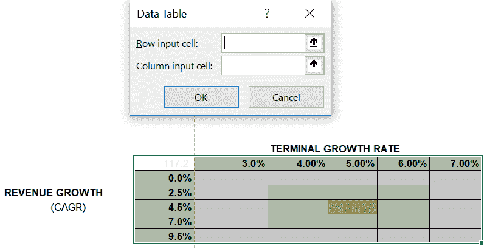

**数据表**对话框有两个输入，**行输入单元格**和**列输入单元格**。

# 直接方法

在这种方法中，行和列输入单元格直接与模型相关联，通过它们在模型中出现的单元格。在这种情况下，**行输入单元格**是与您的模型相关联的**估值**部分中的**终端增长率**单元格；单元格**D265**。**列输入单元格**是与您的模型相关联的**假设**部分中`Y06F`的营业额增长驱动因素；单元格**J11**。

以下截图是**行输入单元格**的示例：

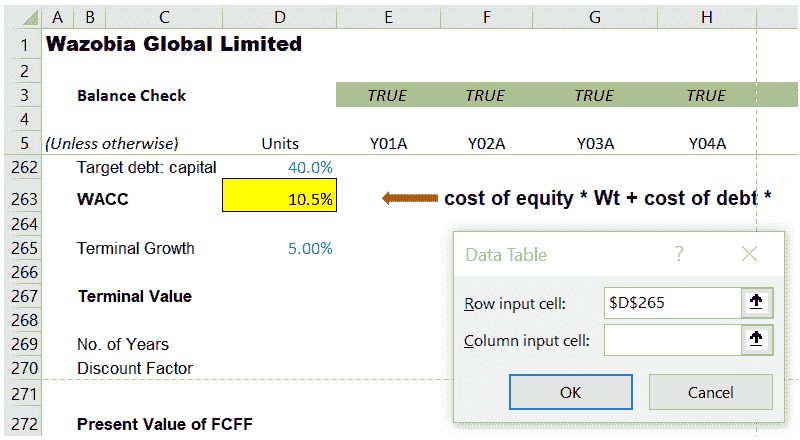

以下截图是**列输入单元格**的示例：

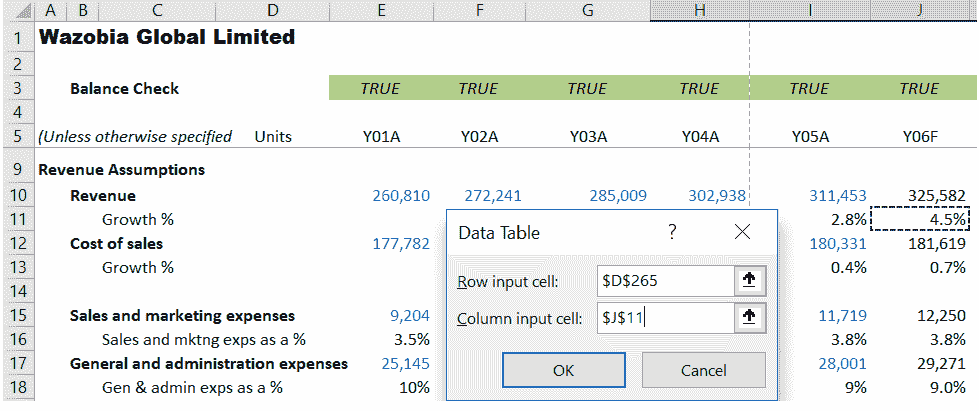

当您按下**确定**时，数据表将填入从数据表行和列标题中替换终端增长率和营收增长驱动因素的备选值在您的模型中生成的结果。以下是完成的数据表的截图：

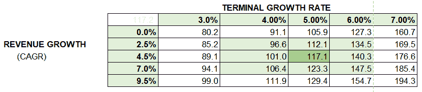

您可以通过查看终端增长率为 5%和营收增长驱动因素为 4.5%时的股价来测试您的数据表的准确性。

您的表已经排列好，以便该值位于表格中间，即填充颜色较深的单元格中。它显示为`117.1`，与您的估值结果`117.2`相比。这让您确信您的数据表设置正确且计算正确。

从表中我们可以看到，当终端增长率为 3%，营收增长为 0%时，最低股价为 N`80.2`，而最高股价为 N`194.3`，在终端增长率为 7%和营收增长率为 9.5%时获得。

# 间接方法

此方法将数据表链接到包含我们选择的变量或驱动器的公式中。为此，我们首先设置数据表，如下截图所示：

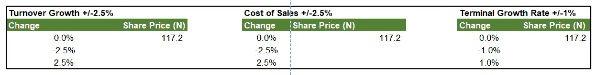

所有三个输入都有一个 0.0%的基准值，该值将被添加到包含我们选择的输入的公式中。然后，我们还添加了营业额增长率和销售成本的两个额外值为-2.5%和 2.5%，以及终端增长率的-1.0%和 1.0%。变化值表示我们将使用间接方法的数据表测试模型敏感性的范围。

然后，您需要编辑相关的公式，通过添加 0.0%单元格将数据表链接到模型中。例如，预测的第一年`Y06F`的营业额是通过将营业额增长驱动器应用于前一年的营业额`Y05A`而得到的，如下公式所示：

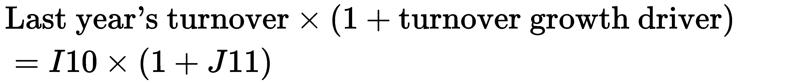

您将编辑公式，将数据表中的营业额增长驱动器的基准值添加到单元格**C295**，如下所示：

```py
=I10*(1+J11+C295)
```

然后，您应该将公式复制到其他预测年份。通过这种方式，您已将数据表链接到模型而不改变其结果：

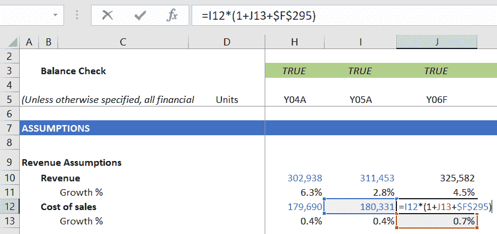

以相同的方式，将`销售成本`数据表链接到单元格**J12**中的公式：

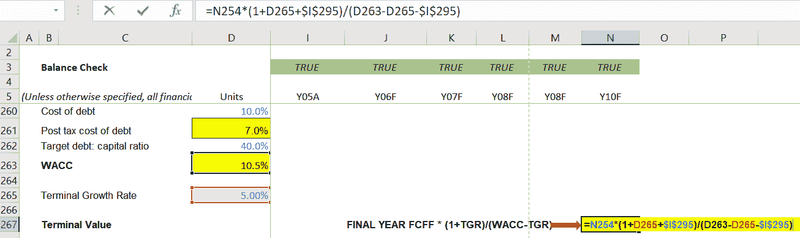

现在，您可以返回并使用**假设分析**，**数据表**功能填充您的数据表。首先，选择整个营业额增长表：

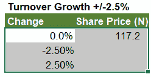

转到**数据**>**假设分析**下的**数据表**，或使用键盘快捷键*Alt *+ *A +* *W +* *T*，以弹出**数据表**对话框。以下是**数据表**对话框的截图：

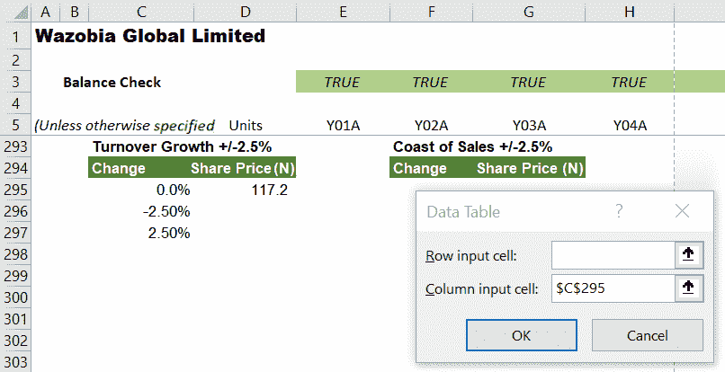

将**行输入单元格**留空，并选择 0.0%作为**列输入单元格**的单元格。当您点击**确定**时，数据表将填充为以比原始速率低 2.5%和高 2.5%的营业额增长率计算的股价的值。

以下截图显示了填充的`营业额增长率`数据表：

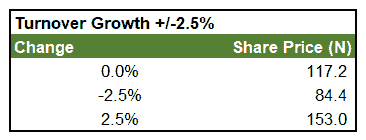

重复以上步骤，对`销售成本`和`终端增长率`数据表进行相同操作。这是使用间接方法的完整数据表的截图：


再次检查您的数据表，您会注意到它比基准营业额增长率 4.5% 高 2.5%；换句话说，是 7.0%。

在 7% 的营业额增长率和 5% 的终端增长率下，使用直接方法，我们得到 N123.3 的股价，与我们间接方法数据库中营业额增长值一致。在 4% 的终端增长率和 4.5% 的营业额增长率下，使用直接方法，我们得到 N101.0 的股价，与我们间接方法数据库中终端增长率一致。

因为间接方法数据表本身难以理解，所以您需要进一步准备一个**龙卷风图**。龙卷风图是一种有效地展示多个输入和驱动器变化影响的方法。您将首先准备一个包含图表所需信息的表格，从间接方法数据表中获取。

第一步是计算从基准值到负变化值的股价百分比变化。我们不关心变化是负数还是正数，只需要绝对变化。所以，我们将使用以下公式：


股价百分比变化，伴随着输入或驱动器的变化，显示在以下屏幕截图中：

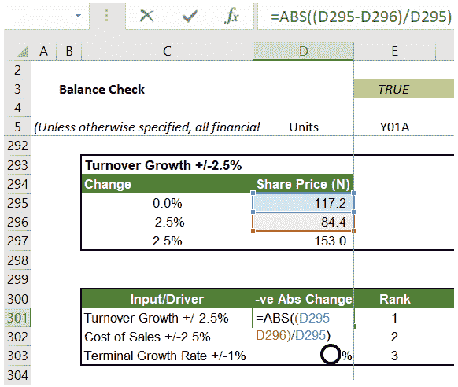

重复这个公式来计算销售成本和终端增长率。现在，使用以下公式对最小的百分比变化进行排名：

```py
=SMALL(% change, rank number)
```

将公式复制到接下来的两行，以使排名编号从 1 变为 2，然后变为 3。这将导致百分比按从小到大的顺序排列，如以下屏幕截图所示：

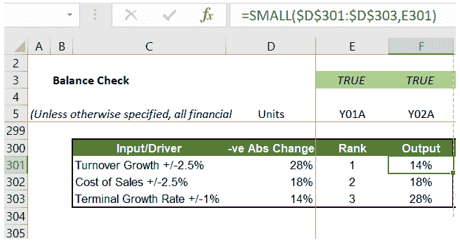

使用 `INDEX` 和 `MATCH` 函数（参见第三章，*公式与函数*），在排名输出（绝对变化）旁边输入适当的输入和驱动器名称。这些将作为我们的水平轴标签。

以下是 `INDEX` 和 `MATCH` 公式的屏幕截图：

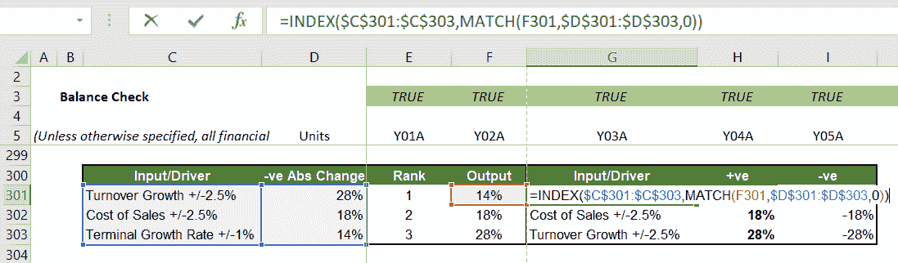

将输出放在标签的右侧，并形成两个系列，一个是正数，另一个是相同数字的负数。以下屏幕截图显示了完整的表格：

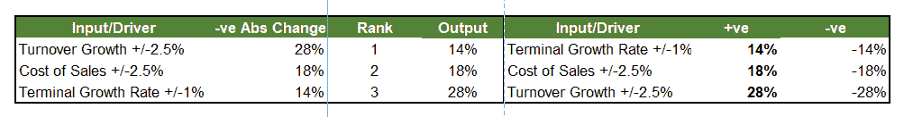

现在，通过转到**插入** > **柱形图或条形图**，然后选择**2-D 堆叠柱形图**来创建一个图表。一个空白的图表将被放置在您的工作表上。从上下文敏感的图表设计菜单中，单击**选择数据**，**选择数据源**对话框框会打开，如下所示：

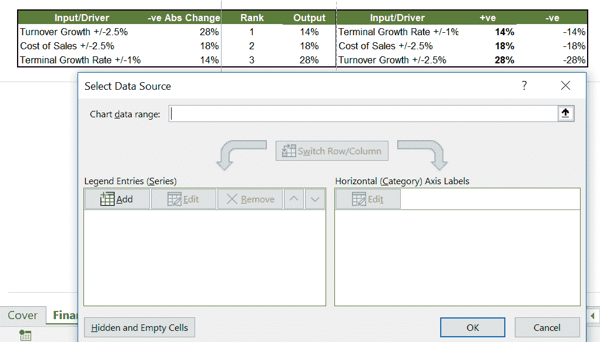

现在，按顺序添加两个系列，依次选择**图例项（系列）**下的**添加**。**编辑系列**对话框弹出。选择正输出的列作为第一个系列。选择第一个数据系列如下截图所示：

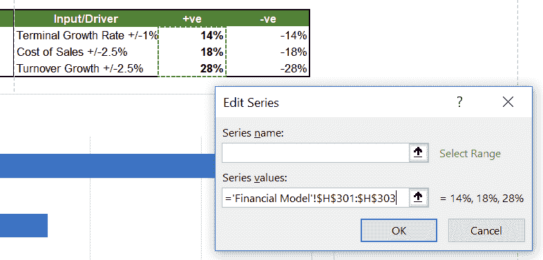

重复该过程以添加第二个系列。选择第二个数据系列如下截图所示：

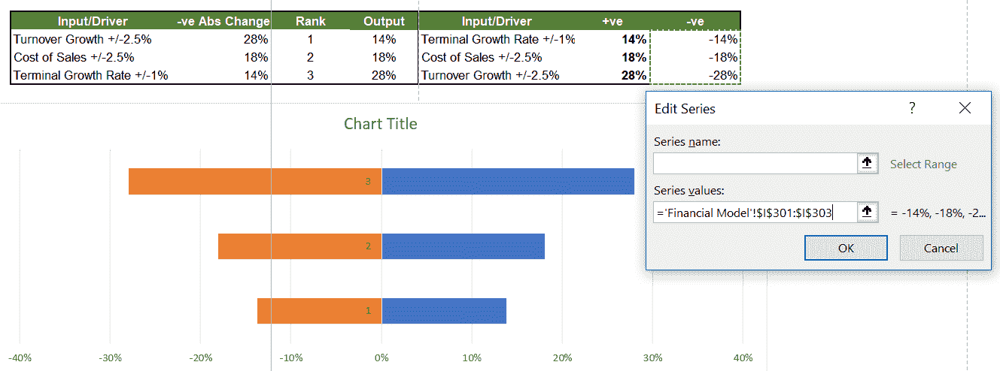

现在，选择水平轴标签。点击**编辑**，然后选择包含输入和驱动器名称的列。以下截图显示了对水平轴标签的编辑：

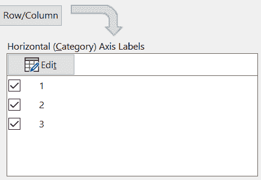

以下截图显示了编辑水平轴标签的另一种方法：

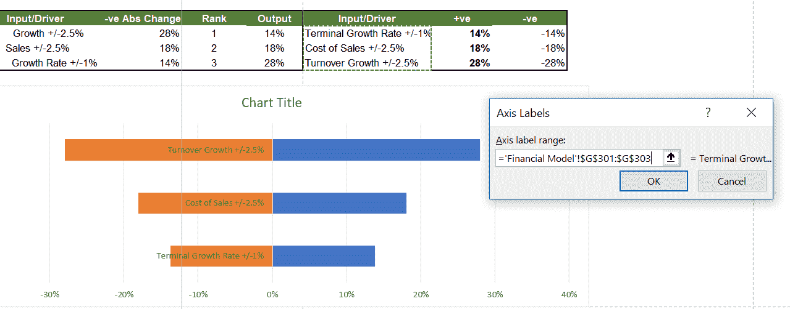

标签将显示在水平轴上，在负系列数据内：

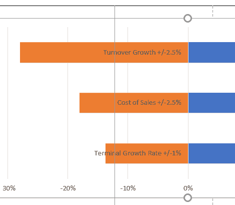

双击水平轴以启动**格式轴**对话框，如下截图所示：

请记住，您的图表是堆叠条形图，因此会被翻转，使得水平轴实际上是垂直的。

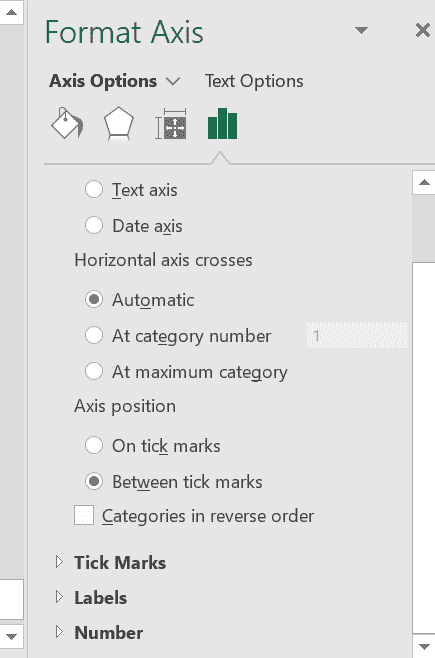

向下滚动以显示**标签**选项并点击它。将标签位置更改为`低`：


这将导致以下输出：

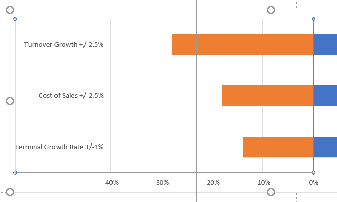

现在，依次点击每个有颜色的系列，并将颜色更改为更合适的颜色：

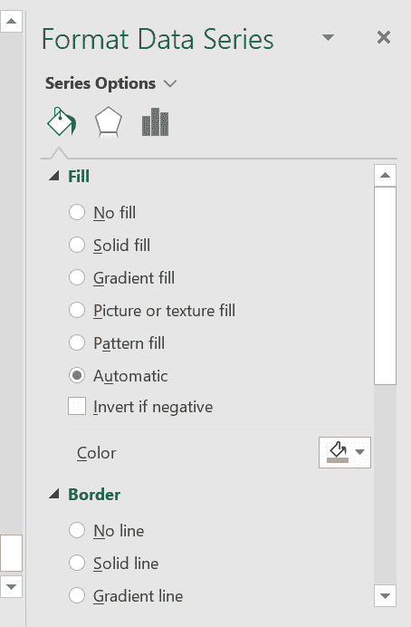

添加图表标题并编辑以使其具有适当的突出性：

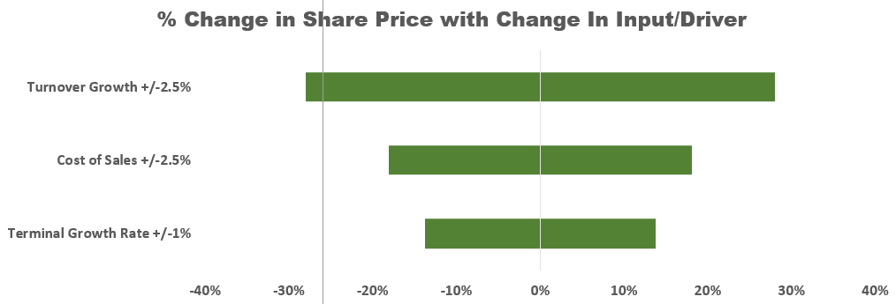

图表清楚地显示，更改营业额增长驱动因素对股价影响最大，其次是销售成本，最后是终端增长率。

# 理解情景分析

在敏感性分析中，我们选择了一些输入或驱动器并对其进行了更改，同时保持所有其他变量不变。这向我们展示了所选输入对股价的孤立影响。然而，在实践中，这种情况很少见。变量不会孤立地改变。通常情况下，您会有一些变量因某些情况或场景而改变。情景分析通常会考虑两个或三个情况集，最可能的是最好情况和最坏情况。

对于每个情景，您将假设所选变量的备选值。在选择变量时，您将专注于那些最主观的输入或驱动因素。情景分析涉及将给定情景的所有所选变量替换到您的模型中，并检查这对股价的影响。我们将查看乐观、基准和悲观情景。我们还将选择**营业额复合年增长率**、**TGR**和**WACC**，因为这些变量对股价有显著影响。

设置表格如下截图所示，使用适当的值分别反映乐观和悲观情景。基准案例将反映我们的 DCF 估值计算出的值。以下截图显示了情景表：

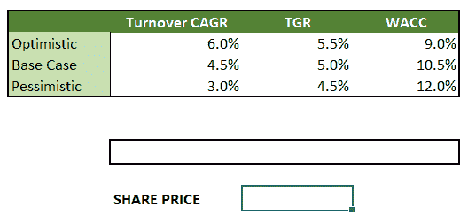

现在我们需要设置一个选择框，允许我们选择一个情景并将情景链接到我们为每个情景选择的值。我们将使用组合框和`OFFSET`函数。此组合框可以在 Excel 的**开发者**选项卡中的**插入**组中找到。如果**开发者**选项卡未显示，请转到**文件**>**选项**>**自定义功能区**。在**主选项卡**下，选中**开发者**旁边的复选框。

以下截图显示了**开发者**选项卡上**组合框**的位置：

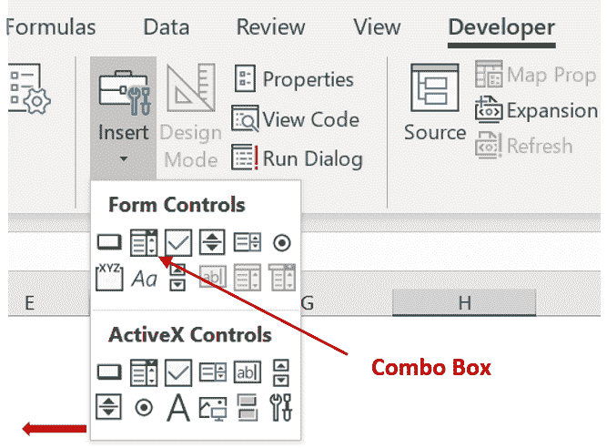

将**组合框**放置在参考框旁边，在组合框上右键单击，并选择**格式控制**。启动**格式对象**对话框，如下截图所示：

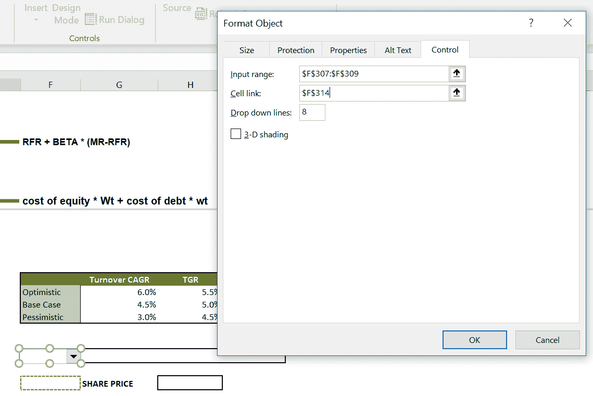

对于**输入范围**，请选择带有情景标签的单元格。**单元链接**可以是任何空白单元格。选择`SHARE PRICE`标签左侧的单元格。以下截图显示了**组合框**的**格式对象**对话框：


单击组合框右侧的箭头。下拉列表显示带有情景名称的选项。以下截图是**组合框**选项的下拉列表：

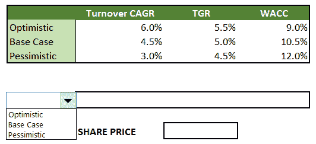

一旦您选择了任何选项，它们将显示在组合框中，并且会在**单元链接**单元中显示一个数字，该数字对应于您所选择的选项列表中的位置。现在我们需要在参考栏中反映所选情景的变量值。为此，我们将使用`OFFSET`函数，以及**单元单位**中的计数器。`OFFSET`函数的参数被安排以允许您指导 Excel 到特定的单元格以提取内容。

以下截图显示了`OFFSET`函数的参数：

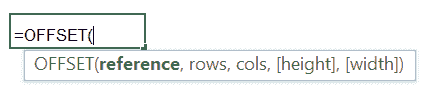

此函数允许您选择一个`reference`变量。下一个参数，`rows`，允许您指定从该参考点向下偏移的行数；`cols`允许您指定从该参考点向右偏移的列数；`height`和`width`仅在您想要指定一个范围而不是单个单元格时使用。

下面的截图显示了**单元格链接**中的数字 2。当选择**基本情况**时，列表中的第二个方案被选中：

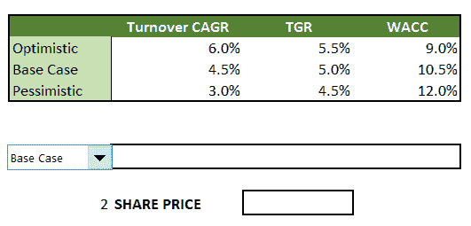

选择**Combo Box**中的**基本情况**后，**单元格链接**中显示数字 2（参见上面的截图）。这对应于**Combo Box**下拉列表中**基本情况**的位置。接下来，选择参考框中的单元格，然后输入`OFFSET`函数。

利用我们对 Excel 引用框架的了解，我们认识到我们要在参考框中输入的是相同的公式。因此，我们可以选择这三个单元格，输入一次公式，然后按下*Ctrl + Enter*以完成并一次性填充所有三个单元格。以下截图显示了输入`OFFSET`公式参数时的值：

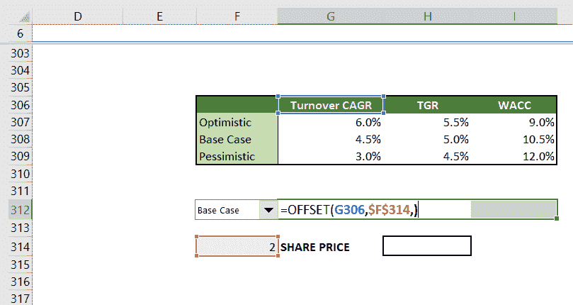

使参考单元格**G306**成为`Turnover CAGR`标题。当参考向右复制时，我们希望它查看同一行的下一列中的单元格**H306**，即`TGR`标题。将行单元格`$F$314`设为**单元格链接**。我们锁定了这个单元格引用，这样当参考向右复制时，它仍然会查看**单元格链接**。

然后，在`row`参数之后添加一个逗号，以表示我们已经完成了该参数的输入。但是，由于我们不再输入任何参数，因此我们可以关闭括号，然后按*Ctrl + Enter*以完成并一次性填充所有三个单元格。现在，将股价链接到模型中**估值**部分的适当单元格。我们还将**单元格链接**单元格清空，以免分散注意力。以下截图显示了具有链接的股价和空白的**单元格链接**的场景模板：

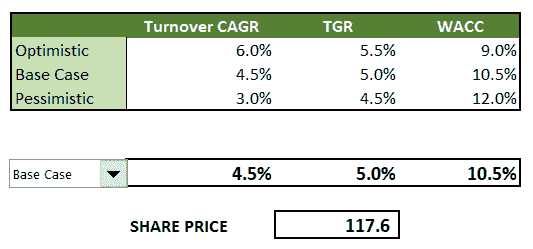

下一步是将参考框中的单元格链接到模型中的适当位置。首先，将`Assumptions`中的营收增长`CAGR`单元格，单元格**I10**，与参考框中的**G312**相关联。以下截图显示了将`CAGR`单元格链接到参考框的场景：

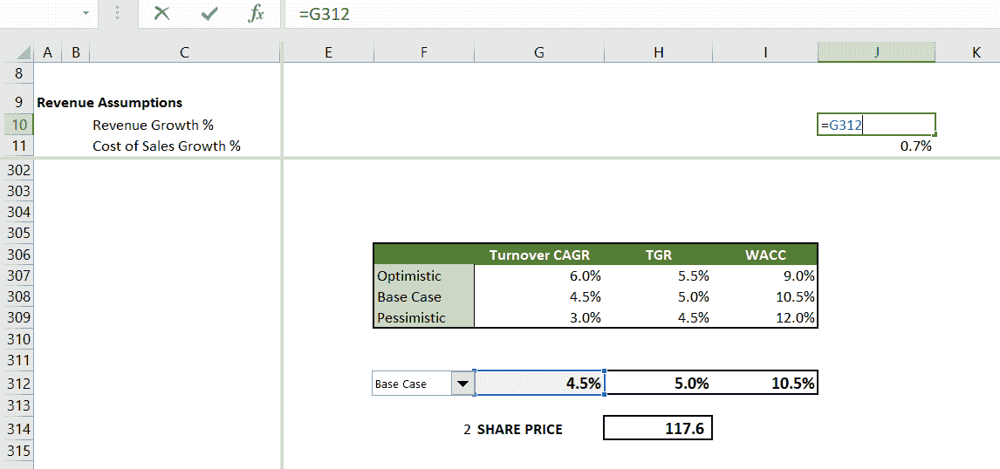

然后，将`TGR`，单元格**D247**，链接到参考框中的单元格**H312**。以下截图显示了如何将`TGR`链接到参考框中：

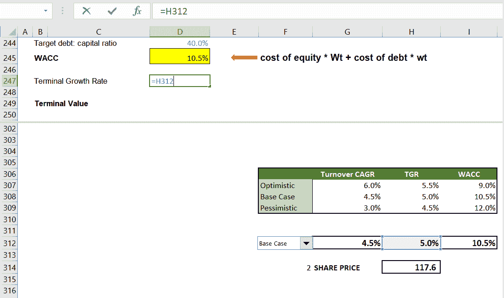

然后，将单元格**D245**（`WACC`）链接到参考框中的单元格**H312**。下面的截图显示了如何将`WACC`链接到参考框中：

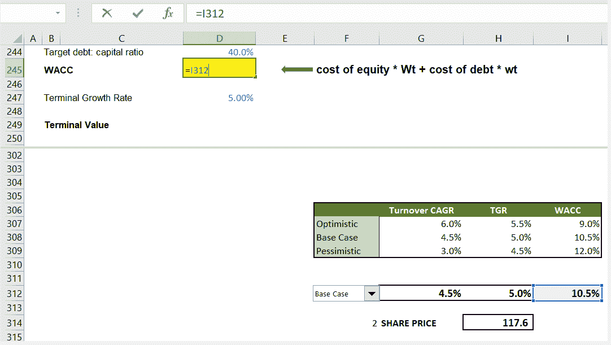

最后，我们使用条件格式设置来突出显示当前选择的任何场景。在**主页**功能区中转到**条件格式** > **新建规则...**。以下截图显示了**主页**功能区上的**条件格式**选项：

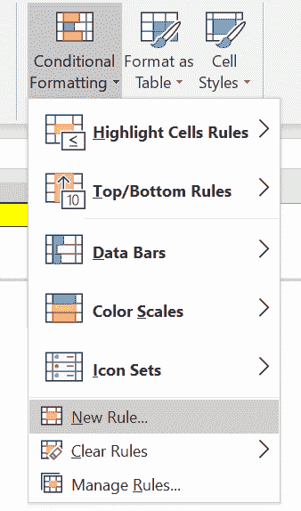

选择**新建规则...**以打开**新格式规则**对话框：

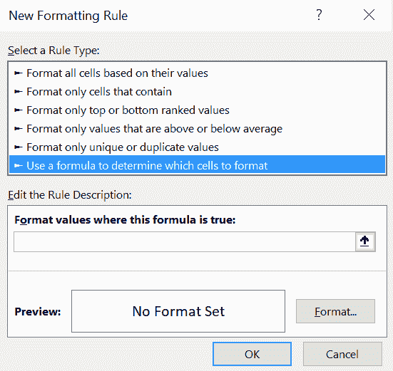

现在，选择**使用公式确定要格式化的单元格**。

我们需要使用此公式，而不是仅选择预设选项之一，因为我们将要指定条件的某些单元格与要应用条件的单元格不相同。以下屏幕截图显示了**新格式规则**对话框：

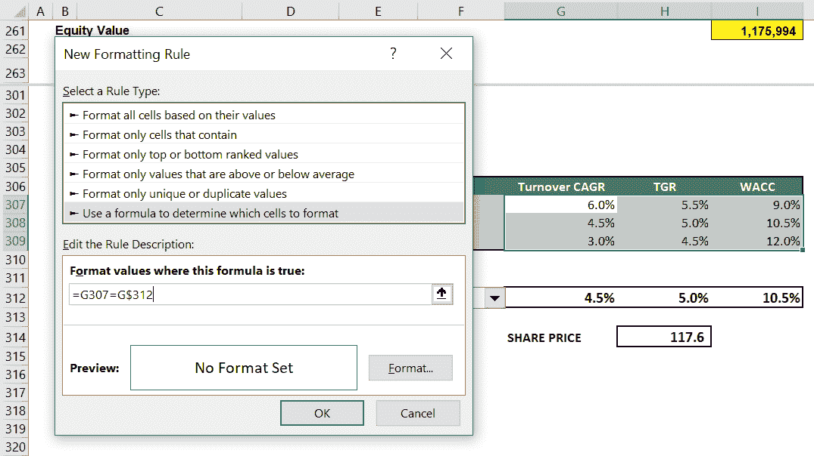

再次，我们将节省时间，方法是利用我们对相对引用、绝对引用和混合引用的了解，只需输入一次公式。我们将使用的条件如下：当我们场景模板中的任何值等于参考框中同一列中的值时，显示我们将指定的特殊格式。

首先，我们突出显示场景模板中的所有值单元格，然后按照前面截图中显示的公式输入公式：

```py
=G307=G$312
```

当该语句为真（当前为假）时，该单元格将显示我们将指定的特殊格式。当将公式复制到右边时，`G307`变为`H307`，而`G$312`变为`H$312`。当将公式向下复制时，`G307`变为`G308`，而`G$312`保持为`G$312`。这确保了该公式始终与参考框的行，行`312`链接。

现在我们确信公式是正确的，我们按下*Ctrl + Enter*来填充场景模板中的所有值单元格。现在，我们可以指定满足条件时要显示的特殊格式。选择粗体和红色风格的字体。以下截图显示了如何指定自定义**字体**格式：

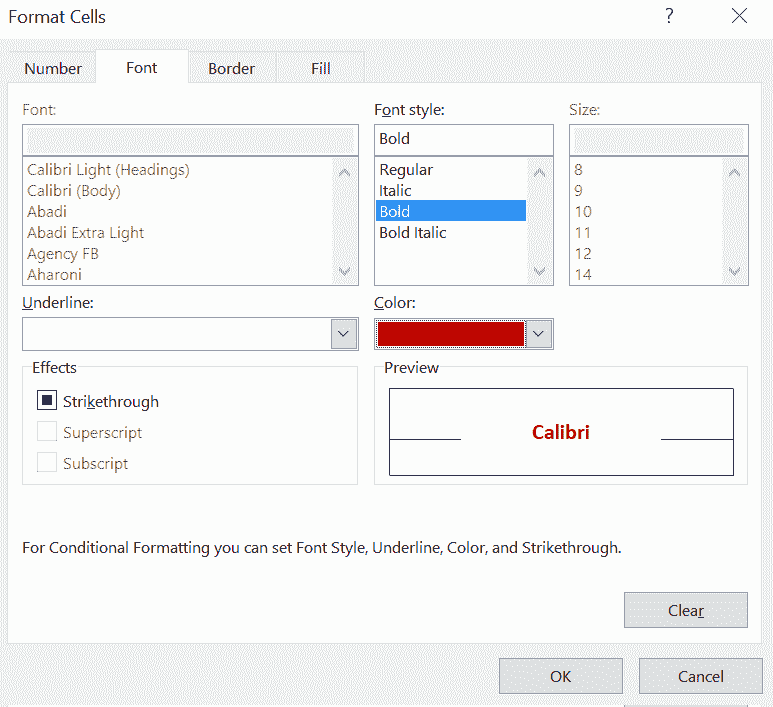

现在，我们将选择更好的颜色填充。以下截图显示了如何指定自定义**填充**格式：

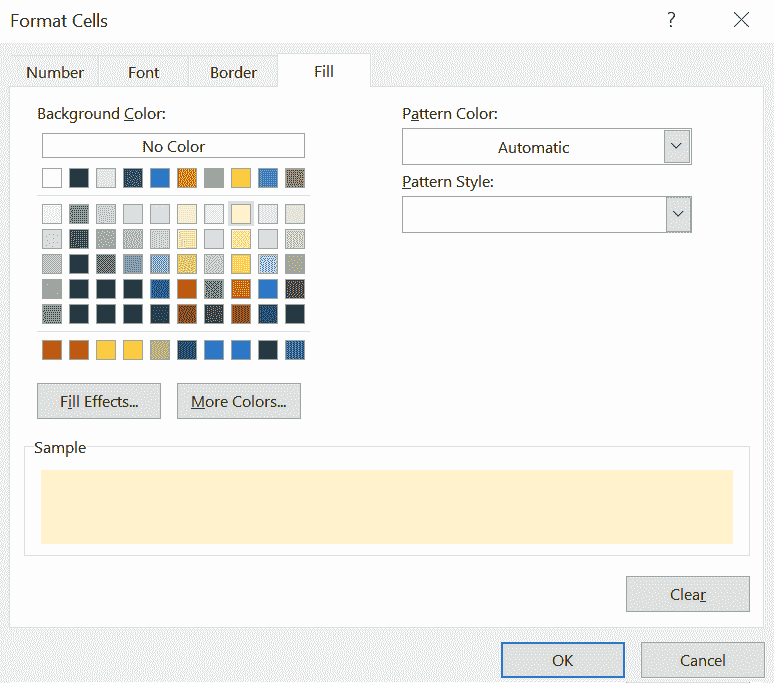

当您按下**确定**时，您将被带回到**新格式规则**对话框，该对话框现在显示了特殊格式的示例。以下截图显示了带有自定义格式示例的**新格式规则**对话框：

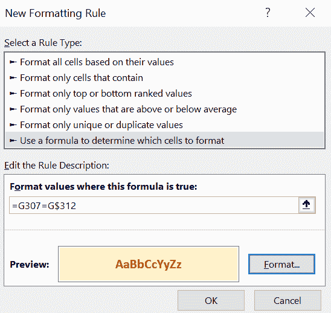

当您按下**确定**时，您将被带回到工作表，并且将观察到**基本情况**的值显示条件格式。这是因为这是我们**组合框**中当前选择的场景。在**基本情况**场景下，股价为`117.6`。带有条件格式的基准情景如下截图所示：

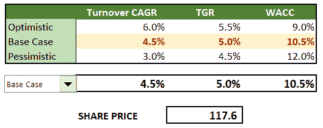

在**组合框**中，选择`乐观`场景。以下截图显示了具有条件格式的乐观场景：

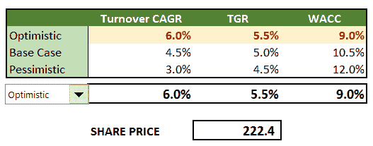

现在，`乐观`场景的值显示了条件格式。这是因为我们**组合框**中当前选择的场景是`乐观`场景。股价是`222.4`。现在，选择`悲观`场景。

以下截图显示了具有条件格式的`悲观`场景：

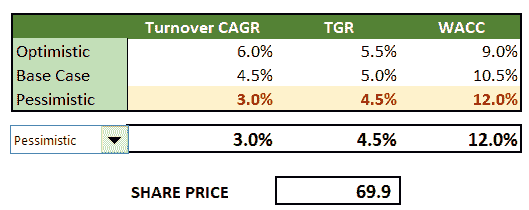

现在，`悲观`场景的值显示了条件格式。这是因为我们**组合框**中当前选择的场景是`悲观`场景。股价是`69.9`。

# 创建一个简单的蒙特卡洛模拟模型

蒙特卡洛模拟是一个模型，它计算在一个过程中不确定性很大的情况下不同结果的概率。该模型利用随机生成的数字来获得成千上万个可能的结果，从中可以推断出最可能的结果。我们将研究自由现金流 FCFF 的增长以及资本成本 WACC，它们都是我们 DCF 模型的组成部分。

使用以下公式计算历史年度`Y02A`到`Y05A`的 FCFF 增长率：

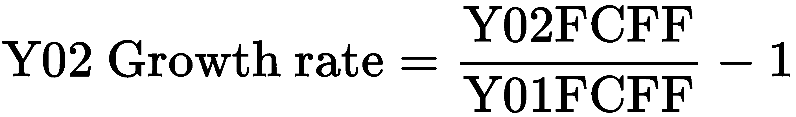

以下截图显示了 FCFF 的历史增长计算：

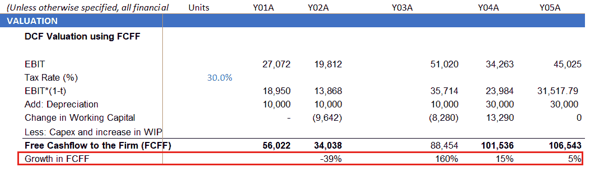

通常，蒙特卡洛模拟使用数千次重复。然而，为了说明问题，我们将限制数量为 100。让我们计算 FCFF 历史增长的平均值。

以下截图显示了 FCFF 平均增长的计算：

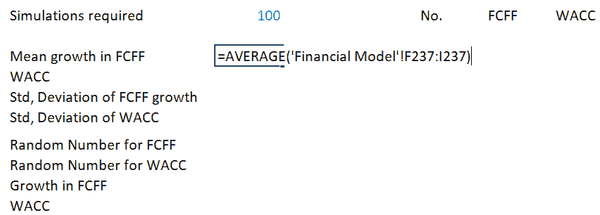

我们从模型的估值部分获得`WACC`。以下截图显示了如何获得：

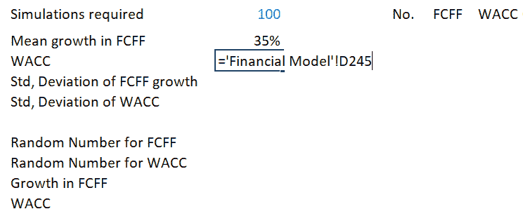

我们将假设每个标准差为 1%。标准差是我们预计模拟与我们的 FCFF 增长和 WACC 的起始值有多大差异的度量。现在，我们使用 Excel 函数`RAND`为 FCFF 增长和 WACC 创建随机数生成器。

以下截图显示了我们如何为 FCFF 增长和 WACC 创建随机数生成器：

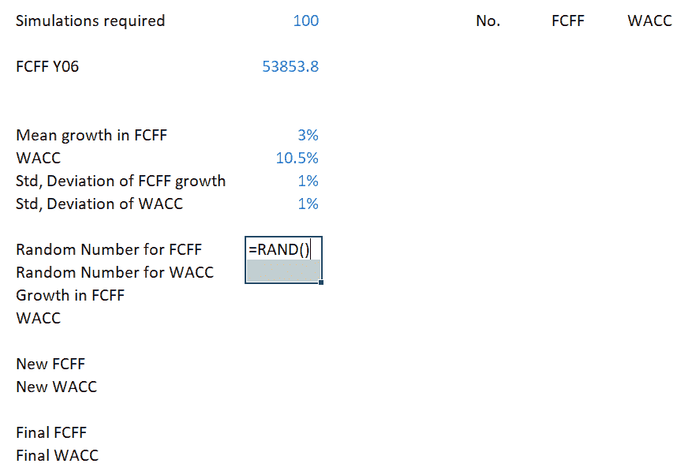

`RAND`函数生成一个 0 到 1 之间的随机数。每次 Excel 在这个或其他单元格中进行计算时，函数会重新计算，并生成另一个随机数。数字`0.83751`对应着发生该值的`83.75%`的概率。

使用这个设置，Excel 为 FCFF 增长和 WACC 生成 100 个不同的结果。如果这些结果被绘制在图表上，它们将遵循所谓的**正态分布**。

这是一个正态分布图：

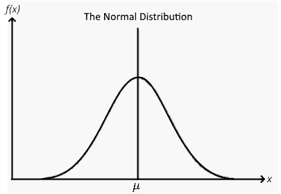

点被聚集在一个中央峰值周围。值离峰值越远，发生该值的可能性就越小。峰值代表所有值的平均值，是变量最可能的值。从图中，您可以从 X 轴，即水平轴上选择一个值，然后沿着垂直向上的线追踪。它与曲线相交的点给出了该值发生的概率

在我们创建的方案中，我们正在生成随机概率，并希望将其转换为 FCFF 增长和 WACC 的值。为此，我们使用 Excel 函数 `NORMINV`。此函数使用平均值、标准偏差和概率来计算 `FCFF 增长` 和 `WACC` 变量的值。

下面是展示 `NORMINV` 函数的屏幕截图：

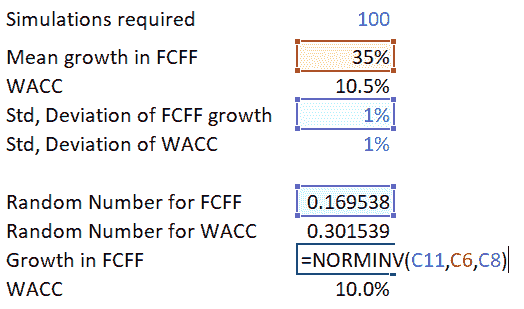

我们可以通过简单地按下*F2*（**编辑**），然后按下*Enter*，手动强制 Excel 生成一个新的随机数。每次生成新的随机数时，都会为 FCFF 增长和 WACC 创建新值。

请注意，屏幕截图中的值在不同的截图之间是不同的。这是因为作为 `RAND` 函数的结果，新的随机数正在不断生成。

我们可以将这些新值逐个复制粘贴到另一个位置，以制表结果。为了覆盖我们正在构建的方案所需的模拟次数，我们需要重复这样做 100 次。或者，有一种更有效的方法，使用数据表。

从一个空单元格开始输入 `1`。选择该单元格后，单击 **编辑** 组中的 **填充** 图标，然后选择 **序列**。这是 **填充** > **序列** 的选择屏幕截图：

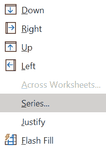

打开一个 **序列** 对话框。在 **序列位于** 字段中选择 **列**，将 **步长** 设置为 `1`，将 **停止值** 设置为 `100`。这是 **序列** 对话框的屏幕截图：

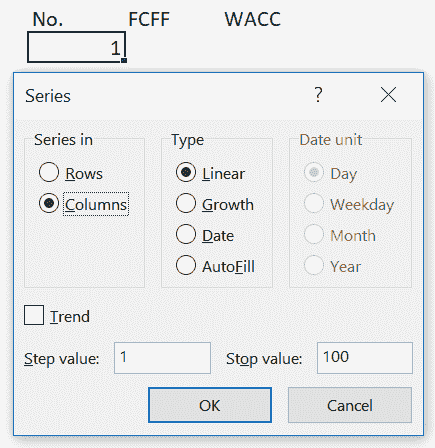

当您按下 **确定** 后，将在列中生成从 1 到 100 的序列，从您先前输入的数字 `1` 开始。现在，通过将 FCFF 增长与数字 1 旁边的单元格链接来创建第一次迭代。

这是一张展示 FCFF 增长如何与我们的新表格相连的屏幕截图：

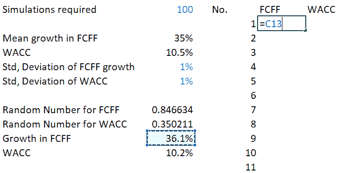

然后，以同样的方式链接 WACC。这是展示 `WACC` 如何与我们的新表格相连的屏幕截图：

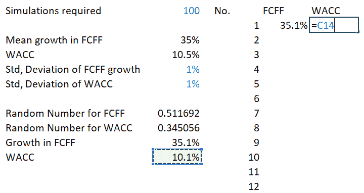

我们现在将使用**数据表**为`FCFF 增长`和`WACC`填充我们的新表格。突出显示新表格中的所有单元格，然后转到**数据**功能区下的**预测**组，并选择**假设分析**，然后选择**数据表**。在打开的**数据表**对话框中，忽略**行输入单元格**。

对于**列输入单元格**，选择表格之外的任何空单元格。以下屏幕截图显示了选择表格之外的空单元格作为**列输入单元格**：  

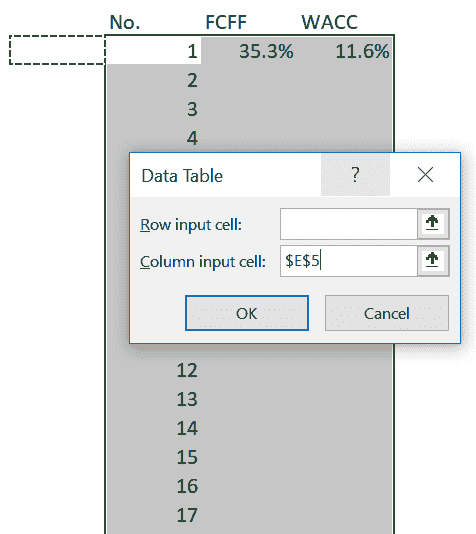

当您单击**确定**时，表格将填充为`FCFF 增长`和`WACC`的 100 次迭代，如以下屏幕截图所示：

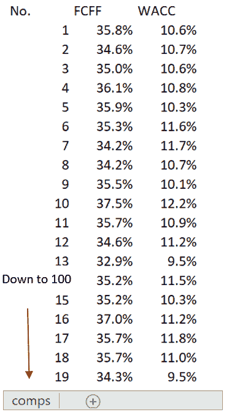

然后，我们根据我们的假设得出了`FCFF 增长`的最可能值，方法是取 FCFF 增长的 100 次迭代的平均值。这张屏幕截图说明了我们如何得出新的`FCFF 增长`：

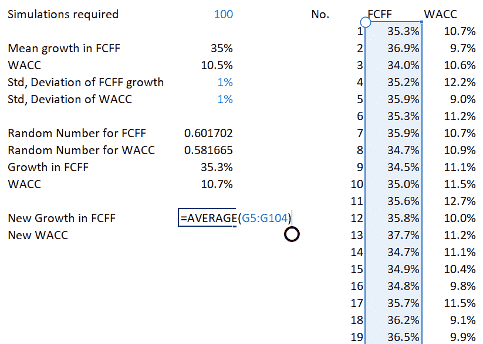

`WACC`的最可能值是`WACC`的 100 次迭代的平均值。以下屏幕截图说明了我们如何得出新的`WACC`：

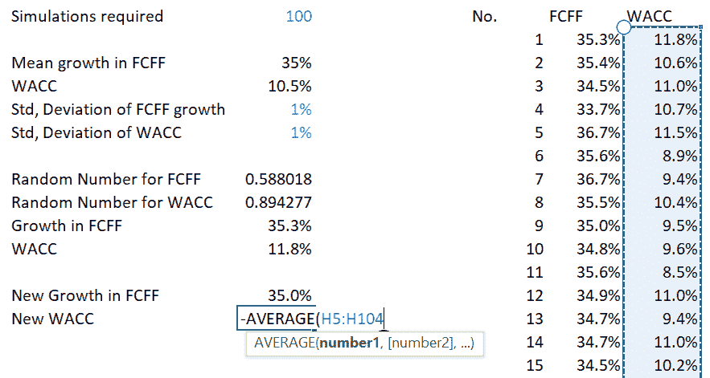

我们现在将采用新的`FCFF 增长`和`WACC`值，并将它们替换为我们的估值模型中。以下屏幕截图显示了如何执行此操作：

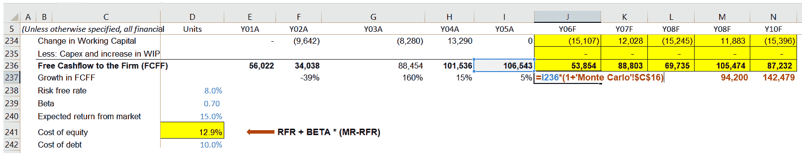

我们然后在我们的`Terminal Value`公式中替换 WACC，如下所示：

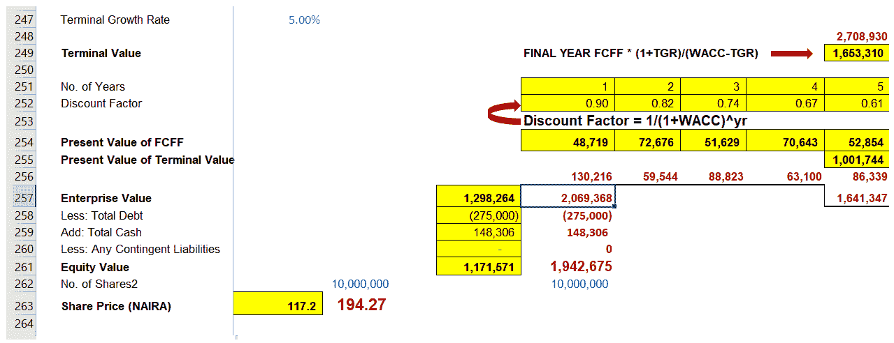

我们重新计算了预测年份和终端值的`FCFF`的现值，净现值等，得出了`企业价值`为 N'(000)`2,069,368`，`股权价值`，市值为 N'(000)`1,942,675`，最终的`股价（NAIRA）`为`194.27`。

# 摘要

在本章中，我们学习了如何将一些测试和程序纳入您的模型，以提高模型的准确性。我们学习了一些基本程序，以便在您的模型中揭示错误的位置。我们了解了敏感性分析的含义，并学会了使用直接和间接方法。我们还学会了如何在图表中显示我们的结果，并有意义地解释它们。最后，我们了解了场景分析，它与敏感性分析的区别以及如何使用它。

金融建模可能是一个复杂的主题，但我们希望我们已经能够将其解密到足以鼓励您从事这个非常有价值的主题。完全无法避免一些技术内容，但我们希望即使在这里，我们也能够让它不那么令人生畏。
