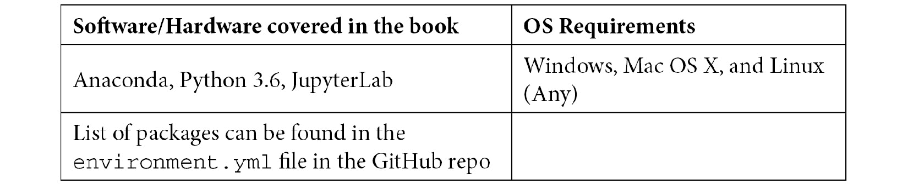

# 前言

算法交易帮助你通过量化分析制定策略，从而在市场上保持领先，获取利润并减少损失。本书将帮助你理解金融理论，并自信地执行一系列算法交易策略。

本书首先介绍算法交易、pyfinance 生态系统和 Quantopian。然后你将学习使用 Python 进行算法交易和量化分析，并学习如何在 Quantopian 上构建算法交易策略。随着你的进步，你将深入了解用于分析金融数据集的 Python 库，如 NumPy 和 pandas，并探索 matplotlib、statsmodels 和 scikit-learn 等库进行高级分析。接下来，你将探索有用的金融概念和理论，如金融统计学、杠杆和套期保值以及卖空，这将帮助你了解金融市场的运作方式。最后，你将发现用于分析和理解金融时间序列数据的数学模型和方法。

通过本交易书的学习，你将能够构建预测性交易信号，采用基本和高级算法交易策略，并在 Quantopian 平台上进行组合优化。

# 本书面向对象

本书适用于想要使用 Python 核心库探索算法交易的数据分析师和金融交易员。如果你正在寻找一本实用指南来执行各种算法交易策略，那么本书适合你。具备 Python 编程和统计学的基本工作知识将会有所帮助。

# 本书内容概要

*第一章*，*算法交易和 Python 入门*，介绍了关键的金融交易概念，并解释了为什么 Python 最适合算法交易。

*第二章*，*Python 中的探索性数据分析*，提供了处理任何数据集的第一步骤，即探索性数据分析的概述。

*第三章*，*使用 NumPy 进行高速科学计算*，详细介绍了 NumPy，这是一个用于快速和可扩展结构化数组和矢量化计算的库。

*第四章*，*使用 pandas 进行数据操作和分析*，介绍了建立在 NumPy 之上的 pandas 库，该库提供了用于结构化 DataFrame 的数据操作和分析方法。

*第五章*，*使用 Matplotlib 进行数据可视化*，聚焦于 Python 中的主要可视化库之一，Matplotlib。

*第六章*，*统计估计、推断和预测*，讨论了 statsmodels 和 scikit-learn 库，用于高级统计分析技术，时间序列分析技术，以及训练和验证机器学习模型。

*第七章*，*Python 中的金融市场数据访问*，描述了 Python 中检索市场数据的替代方法。

*第八章*，*Zipline 和 PyFolio 介绍*，涵盖了 Zipline 和 PyFolio，这是 Python 库，它们摆脱了算法交易策略的实际回测和性能/风险分析的复杂性。它们允许您完全专注于交易逻辑。

*第九章*，*基本算法交易策略*，介绍了算法策略的概念，以及八种不同的交易算法代表了最常用的算法。

# 要充分利用本书

按照*附录*部分的说明，使用存储在书籍 GitHub 存储库中的`environment.yml`文件重新创建`conda`虚拟环境。一个命令即可还原整个环境。



**如果您使用本书的数字版本，我们建议您自己输入代码或通过 GitHub 存储库（链接在下一节中提供）访问代码。这样做将帮助您避免与复制和粘贴代码相关的任何潜在错误。**

# 下载示例代码文件

您可以从 GitHub 下载本书的示例代码文件，网址为[`github.com/PacktPublishing/Hands-On-Financial-Trading-with-Python`](https://github.com/PacktPublishing/Hands-On-Financial-Trading-with-Python)。如果代码有更新，将在现有 GitHub 存储库上进行更新。

我们还提供了来自我们丰富书籍和视频目录的其他代码包，可在[`github.com/PacktPublishing/`](https://github.com/PacktPublishing/)获取。快去看看吧！

# 下载彩色图片

我们还提供了一份 PDF 文件，其中包含本书中使用的屏幕截图/图表的彩色图像。您可以在这里下载：[`static.packt-cdn.com/downloads/9781838982881_ColorImages.pdf`](https://static.packt-cdn.com/downloads/9781838982881_ColorImages.pdf)。

# 使用的约定

本书中使用了许多文本约定。

`文本中的代码`：指示文本中的代码词、数据库表名、文件夹名、文件名、文件扩展名、路径名、虚拟 URL、用户输入和 Twitter 句柄。以下是一个示例：“让我们使用 Python 3.6 创建一个`zipline_env`虚拟环境。”

代码块设置如下：

```py
from zipline import run_algorithm 
from zipline.api import order_target_percent, symbol 
from datetime import datetime 
import pytz 
```

当我们希望引起您对代码块的特定部分的注意时，相关行或项目将以粗体显示：

```py
from . import quandl  # noqa
from . import csvdir  # noqa
from . import quandl_eod  # noqa
```

**粗体**：表示一个新术语、一个重要单词或在屏幕上看到的词。例如，菜单或对话框中的单词会出现在文本中，如下所示。这里是一个示例：“然后，在**环境变量...**对话框中指定变量。”

提示或重要说明

看起来像这样。

# 联系我们

我们的读者的反馈始终受欢迎。

**一般反馈**：如果您对本书的任何方面有疑问，请在消息主题中提及书名，并发送邮件至 customercare@packtpub.com。

**勘误**：尽管我们已经尽一切努力确保内容的准确性，但错误确实会发生。如果您在本书中发现了错误，我们将不胜感激，如果您能向我们报告此错误。请访问 [www.packtpub.com/support/errata](http://www.packtpub.com/support/errata)，选择您的书籍，点击“勘误提交表格”链接，并填写详细信息。

**盗版**：如果您在互联网上发现我们作品的任何形式的非法复制，我们将不胜感激，如果您能提供给我们位置地址或网站名称。请通过邮件联系我们，邮箱地址为 copyright@packt.com，并附上资料链接。

**如果您有兴趣成为作者**：如果您在某个专业领域有专业知识，并且对编写或贡献书籍感兴趣，请访问 [authors.packtpub.com](http://authors.packtpub.com)。

# 评论

请留下评论。一旦您阅读并使用了本书，为什么不在购买它的网站上留下评论呢？潜在的读者可以看到并使用您的客观意见来做出购买决策，我们在 Packt 可以了解您对我们产品的看法，而我们的作者可以看到您对他们书籍的反馈。谢谢！

有关 Packt 的更多信息，请访问 [packt.com](http://packt.com)。
