# 第二章：Python 中的探索性数据分析

本章重点介绍**探索性数据分析**（**EDA**），这是处理任何数据集的第一步。EDA 的目标是将数据加载到最适合进一步分析的数据结构中，以识别和纠正任何错误/坏数据，并获得对数据的基本见解——字段的类型有哪些；它们是否是分类的；有多少缺失值；字段之间的关系等等。

这些是本章讨论的主要话题：

+   EDA 介绍

+   用于 EDA 的特殊 Python 库

# 技术要求

本章中使用的 Python 代码可以在书的代码库中的`Chapter02/eda.ipynb`笔记本中找到。

# EDA 介绍

EDA 是从感兴趣的结构化/非结构化数据中获取、理解和得出有意义的统计见解的过程。这是在对数据进行更复杂的分析之前的第一步，例如从数据中预测未来的期望。在金融数据的情况下，EDA 有助于获得后续用于构建盈利交易信号和策略的见解。

EDA 指导后续决策，包括使用或避免哪些特征/信号，使用或避免哪些预测模型，并验证和引入关于变量性质和它们之间关系的正确假设，同时否定不正确的假设。

EDA 也很重要，可以理解样本（完整数据集的代表性较小数据集）统计数据与总体（完整数据集或终极真相）统计数据之间的差异，并在绘制关于总体的结论时记住这一点，基于样本观察。因此，EDA 有助于减少后续可能的搜索空间；否则，我们将浪费更多的时间后来构建不正确/不重要的模型或策略。

必须以科学的心态来对待 EDA。有时，我们可能会基于轶事证据而不是统计证据得出不充分验证的结论。

基于轶事证据的假设受到以下问题的影响：

+   不具有统计学意义——观测数量太少。

+   选择偏见——假设只是因为它首先被观察到而产生的。

+   确认偏见——我们对假设的内在信念会偏向于我们的结果。

+   观察中的不准确性。

让我们探索 EDA 涉及的不同步骤和技术，使用真实数据集。

## EDA 的步骤

以下是 EDA 涉及的步骤列表（我们将在接下来的子章节中逐个进行讨论）：

1.  加载必要的库并进行设置

1.  数据收集

1.  数据整理/整理

1.  数据清洗

1.  获得描述性统计

1.  数据的可视化检查

1.  数据清洗

1.  高级可视化技术

### 加载必要的库并进行设置

我们将使用`numpy`、`pandas`和`matplotlib`，这些库可以通过以下代码加载：

```py
%matplotlib inline
import numpy as np
import pandas as pd
from scipy import stats
import seaborn as sn
import matplotlib.pyplot as plt
import mpld3
mpld3.enable_notebook()
import warnings
warnings.filterwarnings('ignore')
pd.set_option('display.max_rows', 2)
```

我们使用`mpld3`库来启用 Jupyter 的`matplotlib`图表内的缩放。 前面代码块的最后一行指定了应显示`pandas` DataFrame 的最大行数为两行。

### 数据收集

数据收集通常是 EDA 的第一步。 数据可能来自许多不同的来源（**逗号分隔值**（**CSV**）文件、Excel 文件、网页抓取、二进制文件等），通常需要正确标准化和首先正确格式化在一起。

对于这个练习，我们将使用存储在`.csv`格式中的 5 年期间的三种不同交易工具的数据。 这些工具的身份故意没有透露，因为这可能泄露它们的预期行为/关系，但我们将在练习结束时透露它们的身份，以直观地评估我们对它们进行的 EDA 的表现如何。

让我们从加载我们可用的数据集开始，将其加载到三个 DataFrame（`A`，`B`和`C`）中，如下所示：

```py
A = pd.read_csv('A.csv', parse_dates=True, index_col=0);
A
```

DataFrame `A`的结构如下所示：

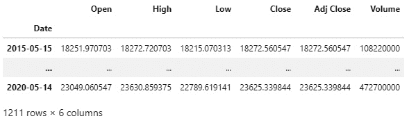

图 2.1 – 从 A.csv 文件构造的 DataFrame

类似地，让我们加载 DataFrame `B`，如下所示：

```py
B = pd.read_csv('B.csv', parse_dates=True, index_col=0); 
B
```

DataFrame `B`的结构如下所示：

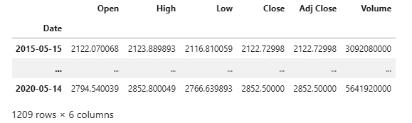

图 2.2 – 从 B.csv 文件构造的 DataFrame

最后，让我们将`C`数据加载到一个 DataFrame 中，如下所示：

```py
C = pd.read_csv('C.csv', parse_dates=True, index_col=0); 
C
```

我们看到`C`有以下字段：

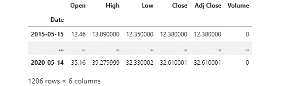

图 2.3 – 从 C.csv 文件构造的 DataFrame

如我们所见，所有三个数据源的格式都是`2015-05-15`和`2020-05-14`。

### 数据整理/处理

数据很少是以可直接使用的格式提供的。 数据整理/处理指的是从初始原始来源操纵和转换数据的过程，使其成为结构化的、格式化的和易于使用的数据集。

让我们使用`pandas.DataFrame.join(...)`来合并这些 DataFrame，并对齐它们以具有相同的`DateTimeIndex`格式。 使用`lsuffix=`和`rsuffix=`参数，我们将`_A`，`_B`和`_C`后缀分配给来自三个 DataFrame 的列，如下所示：

```py
merged_df = A.join(B, how='outer', lsuffix='_A', sort=True).join(C, how='outer', lsuffix='_B', rsuffix='_C', sort=True)
merged_df
```

我们将检查我们刚刚创建的`merged_df` DataFrame，并确保它具有我们从所有三个 DataFrame 中预期的所有字段（仅显示前七列）。 DataFrame 可以在这里看到：

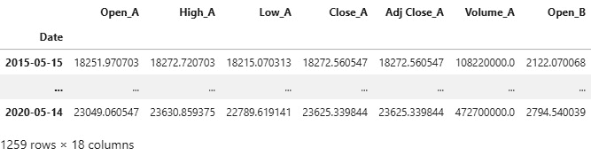

图 2.4 – 通过合并 DataFrame A、B 和 C 构造的 DataFrame

请注意，原始三个数据框（`A`、`B` 和 `C`）分别有 1,211、1,209 和 1,206 行，但合并后的数据框有 1,259 行。这是因为我们使用了外部连接，它使用了所有三个数据框的日期的并集。当它在特定日期的特定数据框中找不到值时，它会将该数据框的字段的那个位置放置一个 `NaN` 值。

### 数据清洗

数据清洗是指处理来自缺失数据、不正确数据值和异常值的数据错误的过程。

在我们的示例中，`merged_df` 的许多字段都缺失原始数据集和不同日期数据框合并而来的字段。

让我们首先检查是否存在所有值都缺失（`NaN`）的行，如下所示：

```py
merged_df[merged_df.isnull().all(axis=1)]
```

结果表明，我们没有任何所有字段都缺失的行，如我们所见：

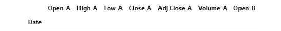

图 2.5 – DataFrame 表明没有所有字段都缺失的行。

现在，让我们找出有多少行存在至少一个字段缺失/`NaN` 的，如下所示：

```py
merged_df[['Close_A', 'Close_B', 'Close_C']].isnull().any(axis=1).sum()
```

因此，结果显示我们的 1,259 行中有 148 行具有一个或多个字段缺失值，如下所示：

```py
148
```

对于我们的进一步分析，我们需要有效的 `Close` 价格。因此，我们可以通过运行以下代码删除所有三个工具的任何 `Close` 价格缺失的行：

```py
valid_close_df = merged_df.dropna(subset=['Close_A', 'Close_B', 'Close_C'], how='any')
```

删除缺失的 `Close` 价格后，我们不应该再有缺失的 `Close` 价格字段，如下代码段所示：

```py
valid_close_df[['Close_A', 'Close_B', 'Close_C']].isnull().any(axis=1).sum()
```

结果证实，不再存在任何 `Close_A`、`Close_B` 或 `Close_C` 字段为 `NaN` 值的行，如我们所见：

```py
0
```

让我们检查新的 DataFrame，如下所示：

```py
valid_close_df
```

这是结果（仅显示前七列）：

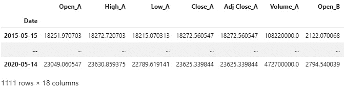

图 2.6 – 没有任何收盘价缺失/NaN 值的结果 DataFrame

如预期的那样，我们删除了具有任何收盘价缺失/`NaN` 值的 148 行。

接下来，让我们处理任何其他字段具有 `NaN` 值的行，首先了解有多少这样的行。我们可以通过运行以下代码来做到这一点：

```py
valid_close_df.isnull().any(axis=1).sum()
```

这是该查询的输出：

```py
165
```

因此，存在 165 行至少有一些字段缺失值。

让我们快速检查一下至少有一些字段缺失值的几行，如下所示：

```py
valid_close_df[valid_close_df.isnull().any(axis=1)]
```

以下显示了一些具有一些缺失值的行（仅显示前七列），如下所示：

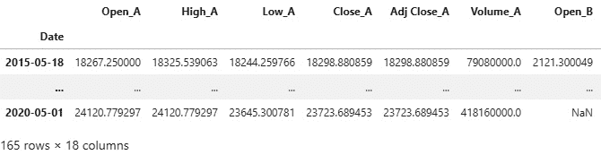

图 2.7 – DataFrame 表明仍然有一些行存在一些缺失值

因此，我们可以看到 `2015-05-18`（在前述截屏中不可见）的 `Low_C` 字段和 `2020-05-01` 的 `Open_B` 字段有 `NaN` 值（当然还有其他 163 个）。

让我们使用 `pandas.DataFrame.fillna(...)` 方法与一种称为 `backfill` 的方法 —— 这使用缺失值后的下一个有效值来填充缺失值。代码如下所示：

```py
valid_close_complete = valid_close_df.fillna(method='backfill')
```

让我们看看 backfilling 的影响，如下所示：

```py
valid_close_complete.isnull().any(axis=1).sum()
```

现在，这是查询的输出：

```py
0
```

正如我们所看到的，在进行 `backfill` 操作之后，任何行的任何字段都不再有缺失或 `NaN` 值。

### 获取描述性统计数据

下一步是生成数据的关键基本统计信息，以便熟悉每个字段，使用 `DataFrame.describe(...)` 方法。代码如下所示：

```py
pd.set_option('display.max_rows', None)
valid_close_complete.describe()
```

请注意，我们已经增加了要显示的 `pandas` DataFrame 的行数。

这是运行 `pandas.DataFrame.describe(…)` 后的输出，仅显示了前七列：

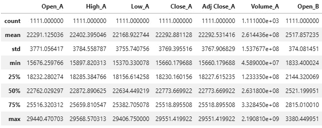

图 2.8 – 有效关闭完整 DataFrame 的描述统计

前面的输出为我们的 DataFrame 中的每个字段提供了快速摘要统计信息。

从 *图 2.8* 的关键观察点可以总结如下：

+   `Volume_C` 的所有统计值都为 `0`，这意味着每一行的 `Volume_C` 值都设置为 `0`。因此，我们需要移除此列。

+   `Open_C` 的最小值为 `-400`，这不太可能是真实的，原因如下：

    a) 其他价格字段 —— `High_C`、`Low_C`、`Close_C` 和 `Adj Close_C` —— 的所有最小值都约为 `9`，因此 `Open_C` 具有 `-400` 的最小值是没有意义的。

    b) 考虑到 `Open_C` 的第 25 个百分位数为 `12.4`，其最小值不太可能远低于此。

    c) 资产的价格应为非负数。

+   `Low_C` 的最大值为 `330`，这同样不太可能，原因如下：

    a) 出于先前所述的相同原因，`Open_C` 是不正确的。

    b) 此外，考虑到 `Low_C` 应始终低于 `High_C`，根据定义，一天中的最低价格必须低于当天的最高价格。

让我们将所有 `pandas` DataFrame 的输出恢复为只有两行，如下所示：

```py
pd.set_option('display.max_rows', 2)
```

现在，让我们移除所有三个工具的 `Volume` 字段，使用以下代码：

```py
prices_only = valid_close_complete.drop(['Volume_A', 'Volume_B', 'Volume_C'], axis=1)
prices_only
```

而 `prices_only` DataFrame 具有以下数据（仅显示前七列）：

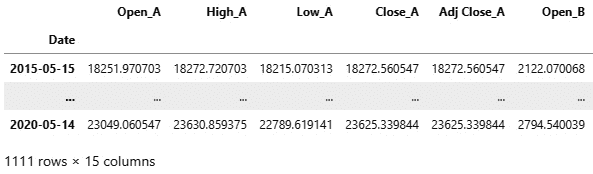

图 2.9 – 仅价格的 DataFrame

预期之中的是，我们移除了三个工具的交易量列之后，将 DataFrame 维度减少到 `1111 × 15` —— 这些以前是 `1111 × 18`。

### 数据的视觉检查

似乎没有任何明显的错误或不一致之处，所以让我们快速可视化价格，看看这是否符合我们从描述性统计中学到的内容。

首先，我们将从`A`的价格开始，因为根据描述性统计摘要，我们期望这些是正确的。代码如下所示：

```py
valid_close_complete['Open_A'].plot(figsize=(12,6), linestyle='--', color='black', legend='Open_A')
valid_close_complete['Close_A'].plot(figsize=(12,6), linestyle='-', color='grey', legend='Close_A')
valid_close_complete['Low_A'].plot(figsize=(12,6), linestyle=':', color='black', legend='Low_A')
valid_close_complete['High_A'].plot(figsize=(12,6), linestyle='-.', color='grey', legend='High_A')
```

输出与我们的期望一致，我们可以根据统计数据和下面截图中显示的图表得出`A`的价格是有效的结论：

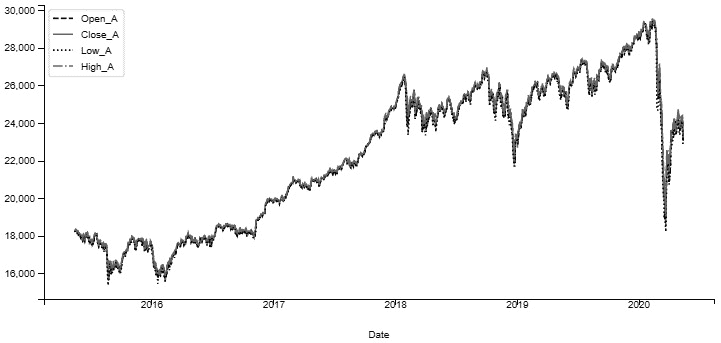

图 2.10 – 展示了交易工具 A 的开盘价、收盘价、最高价和最低价在 5 年内的价格

现在，让我们绘制 C 的价格图，看看图表是否提供了关于我们怀疑某些价格不正确的进一步证据。代码如下所示：

```py
valid_close_complete['Open_C'].plot(figsize=(12,6), linestyle='--', color='black', legend='Open_C')
valid_close_complete['Close_C'].plot(figsize=(12,6), linestyle='-', color='grey', legend='Close_C')
valid_close_complete['Low_C'].plot(figsize=(12,6), linestyle=':', color='black', legend='Low_C')
valid_close_complete['High_C'].plot(figsize=(12,6), linestyle='-.', color='grey', legend='High_C')
```

输出证实了`Open_C`和`Low_C`具有一些与其他值极端相距甚远的错误值—这些是异常值。下面的截图显示了说明这一点的图表：

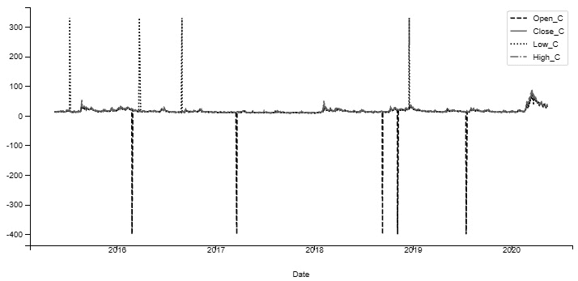

图 2.11 – 展示了 C 价格中正负两个方向的大异常值的图表

我们需要进行一些进一步的数据清理，以消除这些异常值，以便我们不从数据中得出不正确的统计见解。

检测和移除异常值最常用的两种方法是**四分位数范围**(**IQR**)和 Z 分数。

### IQR

IQR 方法使用整个数据集上的百分位数/分位数值范围来识别和移除异常值。

在应用 IQR 方法时，我们通常使用极端百分位数值，例如 5% 到 95%，以最小化移除正确数据点的风险。

在我们的`Open_C`示例中，让我们使用第 25 百分位数和第 75 百分位数，并移除所有数值超出该范围的数据点。第 25 到 75 百分位数范围是(`12.4, 17.68`)，因此我们将移除异常值`-400`。

#### Z 分数

Z 分数（或标准分数）是通过从数据集中减去每个数据点的均值，并通过数据集的标准偏差进行归一化得到的。

换句话说，数据点的 Z 分数表示数据点与所有数据点的均值之间的标准偏差距离。

对于正态分布（适用于足够大的数据集），有一个**68-95-99**的分布规则，总结如下：

+   所有数据的 68% 将落在距离均值一个标准差的范围内。

+   所有数据的 95% 将落在距离均值两个标准差的范围内。

+   所有数据的 99% 将落在距离均值三个标准差的范围内。

因此，在计算了数据集中所有数据点的 Z 得分（足够大的数据集）之后，存在着大约 1% 的数据点具有 Z 得分大于或等于`3`的概率。

因此，我们可以利用这些信息筛选出所有 Z 得分为`3`或更高的观察结果以检测并移除异常值。

在我们的示例中，我们将删除所有 Z 得分小于`-6`或大于`6`的值的行—即，与平均值相差六个标准偏差。

首先，我们使用`scipy.stats.zscore(...)`计算`prices_only` DataFrame 中每列的 Z 得分，然后我们使用`numpy.abs(...)`获取 Z 得分的大小。最后，我们选择所有字段的 Z 得分低于 6 的行，并将其保存在`no_outlier_prices` DataFrame 中。代码如下所示：

```py
no_outlier_prices = prices_only[(np.abs(stats.zscore(prices_only)) < 6).all(axis=1)]
```

让我们看看这个 Z 得分异常值移除代码对仪器`C`的价格字段产生了什么影响，通过重新绘制其价格并与之前的图进行比较，如下所示：

```py
no_outlier_prices['Open_C'].plot(figsize=(12,6), linestyle='--', color='black', legend='Open_C')
no_outlier_prices['Close_C'].plot(figsize=(12,6), linestyle='-', color='grey', legend='Close_C')
no_outlier_prices['Low_C'].plot(figsize=(12,6), linestyle=':', color='black', legend='Low_C')
no_outlier_prices['High_C'].plot(figsize=(12,6), linestyle='-.', color='grey', legend='High_C')
```

这是输出：

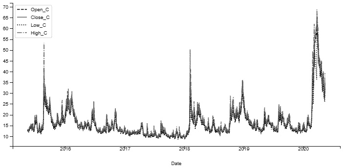

图 2.12 – 应用数据清理移除异常值后显示 C 的价格的绘图

绘图清楚地显示了`Open_C`和`Low_C`的早期极端值观察已被丢弃；不再有`-400`的低谷。

请注意，虽然我们移除了极端异常值，但我们仍然能够保留 2015 年、2018 年和 2020 年价格的剧烈波动，因此并没有导致大量数据损失。

我们还要通过重新检查描述性统计数据来检查我们的异常值移除工作的影响，如下所示：

```py
pd.set_option('display.max_rows', None)
no_outlier_prices[['Open_C', 'Close_C', 'Low_C', 'High_C']].describe()
```

这些统计数据看起来明显更好—正如我们在以下截图中看到的，所有价格的`min`和`max`值现在看起来符合预期，并且没有极端值，所以我们在数据清理任务中取得了成功：

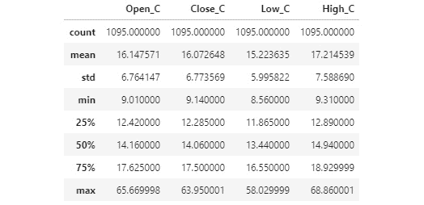

图 2.13 – 选择的列的无异常价格的描述性统计

让我们将要显示的`pandas` DataFrame 的行数重置回来，如下所示：

```py
pd.set_option('display.max_rows', 5)
```

### 高级可视化技术

在本节中，我们将探讨一元和多元统计可视化技术。

首先，让我们收集三个工具的收盘价格，如下所

```py
close_prices = no_outlier_prices[['Close_A', 'Close_B', 'Close_C']]
```

接下来，让我们计算每日收盘价格变动，以评估三个工具之间的每日价格变动是否存在关系。

#### 每日收盘价格变动

我们将使用 `pandas.DataFrame.shift(...)` 方法将原始 DataFrame 向前移动一个周期，以便我们可以计算价格变动。这里的 `pandas.DataFrame.fillna(...)` 方法修复了由于 `shift` 操作而在第一行生成的一个缺失值。最后，我们将列重命名为 `Delta_Close_A`、`Delta_Close_B` 和 `Delta_Close_C`，以反映这些值是价格差异而不是实际价格。以下是代码示例：

```py
delta_close_prices = (close_prices.shift(-1) - close_prices).fillna(0)
delta_close_prices.columns = ['Delta_Close_A', 'Delta_Close_B', 'Delta_Close_C']
delta_close_prices
```

新生成的 `delta_close_prices` DataFrame 的内容如下截图所示：

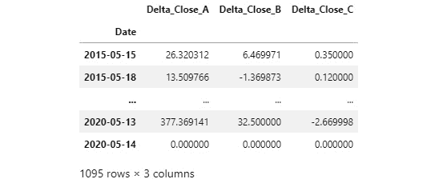

图 2.14 – delta_close_prices DataFrame

从前几个实际价格和计算出的价格差异来看，这些值看起来是正确的。

现在，让我们快速检查这个新 DataFrame 的摘要统计信息，以了解价格差值的分布情况，如下所示：

```py
pd.set_option('display.max_rows', None)
delta_close_prices.describe()
```

这个 DataFrame 的描述性统计如下所示截图所示：

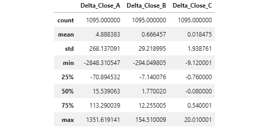

图 2.15 – delta_close_prices DataFrame 的描述性统计

我们可以从这些统计数据中观察到，所有三个 delta 值的均值都接近于 0，仪器 `A` 经历了大幅价格波动，而仪器 `C` 则经历了明显较小的价格波动（来自 `std` 字段）。

#### 直方图

让我们观察 `Delta_Close_A` 的分布，以更加熟悉它，使用直方图绘制。以下是代码示例：

```py
delta_close_prices['Delta_Close_A'].plot(kind='hist', bins=100, figsize=(12,6), color='black', grid=True)
```

在下面的截图中，我们可以看到分布大致呈正态分布：

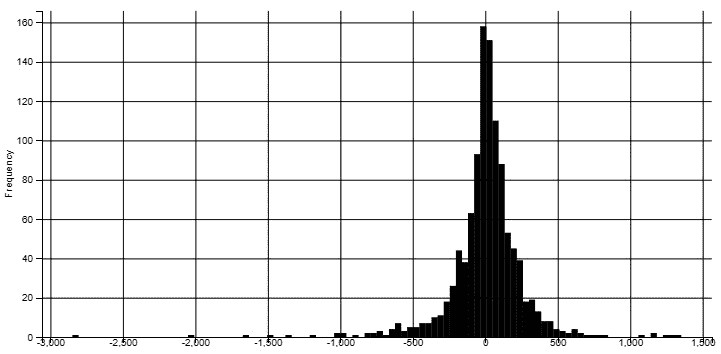

图 2.16 – Delta_Close_A 值的直方图大致呈正态分布，围绕着 0 值

#### 箱线图

让我们绘制一个箱线图，这也有助于评估值的分布。以下是相应代码的示例：

```py
delta_close_prices['Delta_Close_B'].plot(kind='box', figsize=(12,6), color='black', grid=True)
```

输出结果如下截图所示：

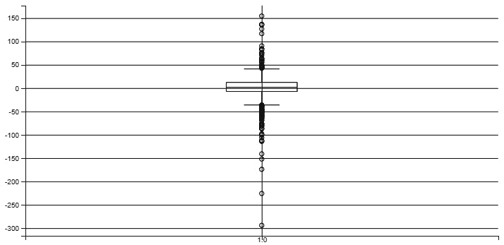

图 2.17 – 箱线图显示均值、中位数、四分位距（25th 到 75th 百分位数）和异常值

#### 相关性图表

多元数据统计的第一步是评估 `Delta_Close_A`、`Delta_Close_B` 和 `Delta_Close_C` 之间的相关性。

最方便的方法是绘制一个相关性散点矩阵，显示三个变量之间的成对关系，以及每个单独变量的分布。

在我们的示例中，我们演示了使用**核密度估计**（**KDE**）的选项，这与直方图密切相关，但在对角线上的图中提供了更平滑的分布表面。其代码如下所示：

```py
pd.plotting.scatter_matrix(delta_close_prices, figsize=(10,10), color='black', alpha=0.75, diagonal='kde', grid=True)
```

这个图表表明，`Delta_Close_A` 和 `Delta_Close_B` 之间存在强烈的正相关性，以及 `Delta_Close_C` 与另外两个变量之间存在强烈的负相关性。对角线也显示了每个单独变量的分布，使用了 KDE。

下面是字段的散点图：

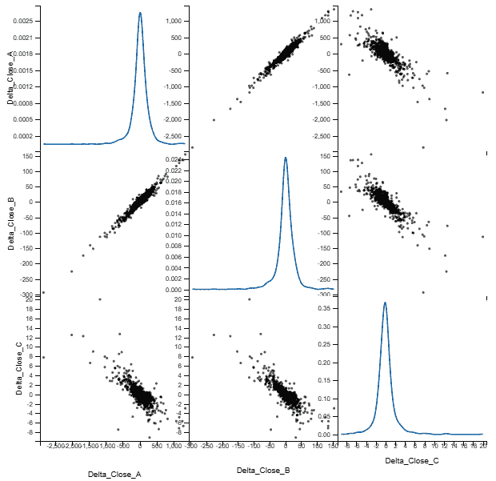

图 2.18 – Delta_Close 字段的散点图，对角线上是 KDE 直方图

接下来，让我们看一些提供变量之间关系的统计数据。`DataFrame.corr(...)` 为我们完成了这项工作，并且还显示了线性相关性。这可以在以下代码片段中看到：

```py
delta_close_prices.corr()
```

相关矩阵证实了 `Delta_Close_A` 和 `Delta_Close_B` 之间存在强烈的正相关性（非常接近 1.0，这是最大值），这符合我们根据散点图的预期。此外，`Delta_Close_C` 与其他两个变量呈负相关（接近 -1.0 而不是 0.0）。

您可以在以下屏幕截图中看到相关矩阵：

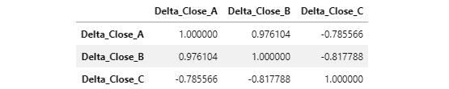

图 2.19 – Delta_Close_A、Delta_Close_B 和 Delta_Close_C 的相关矩阵

#### 成对相关热图

一种称为 `seaborn.heatmap(...)` 的替代可视化技术，如下面的代码片段所示：

```py
plt.figure(figsize=(6,6))
sn.heatmap(delta_close_prices.corr(), annot=True, square=True, linewidths=2)
```

在下面的屏幕截图中显示的图中，最右侧的刻度显示了一个图例，其中最暗的值代表最强的负相关，最浅的值代表最强的正相关：

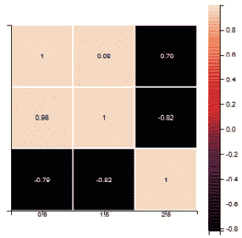

图 2.20 – Seaborn 热图可视化 Delta_Close 字段之间的成对相关性

热图在图表中以图形方式显示了前一节中的表格信息 —— `Delta_Close_A` 和 `Delta_Close_B` 之间存在非常高的相关性，而 `Delta_Close_A` 和 `Delta_Close_C` 之间存在非常高的负相关性。`Delta_Close_B` 和 `Delta_Close_C` 之间也存在非常高的负相关性。

## A、B 和 C 的身份揭示以及 EDA 的结论

`A` 仪器是 `B` 仪器是 `C` 仪器是**芝加哥期权交易所**（**CBOE**）**波动率指数**（**VIX**），基本上跟踪市场在任何给定时间内的波动性（基本上，是股票指数价格波动的函数）。

从我们对神秘仪器的 EDA 中，我们得出了以下结论：

+   `C`（VIX）的价格不能为负值，也不能超过 90，这在历史上一直成立。

+   `A`（DJIA）和 `B`（SPY）在 2008 年和 2020 年都有巨大的跌幅，分别对应股市崩盘和 COVID-19 大流行。同时，`C`（VIX）的价格也在同一时间上升，表明市场动荡加剧。

+   `A`（DJIA）的每日价格波动最大，其次是 `B`（SPY），最后是 `C`（VIX），其每日价格波动非常小。考虑到它们所隐藏的基础工具，这些观察也是正确的。

`A`（DJIA）和 `B`（SPY）具有非常强的正相关性，这是有道理的，因为它们都是大型市值股票指数。`C`（VIX）与 `A`（DJIA）和 `B`（SPY）都有很强的负相关性，这也是有道理的，因为在繁荣时期，波动性保持低位，市场上涨，在危机期间，波动性激增，市场下跌。

在下一节中，我们介绍了一个特殊的 Python 库，它可以自动生成最常见的 EDA 图表和表格。

# 用于 EDA 的特殊 Python 库

有多个 Python 库可以提供单行代码的 EDA。其中最先进的之一是 `dtale`，如下面的代码片段所示：

```py
import dtale
dtale.show(valid_close_df)
```

前面的命令生成了一个包含所有数据的表格（仅显示前七列），如下所示：

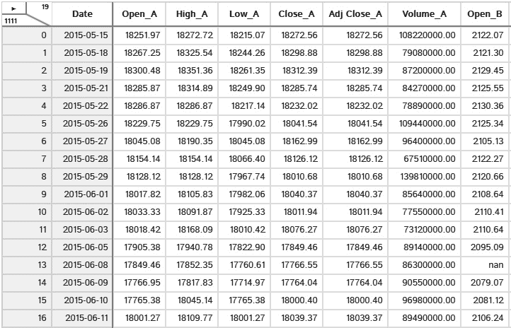

图 2.21 – dtale 组件显示对 valid_close_df DataFrame 的类似电子表格的控制

点击顶部的箭头会显示一个带有所有功能的菜单，如下面的截图所示：

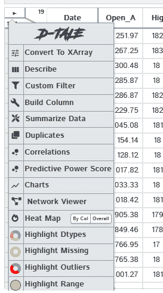

图 2.22 – dtale 全局菜单显示其功能

点击列标题会显示每个特征的单独命令，如下面的截图所示：

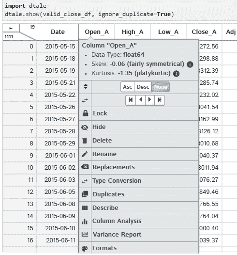

图 2.23 – dtale 列菜单显示列功能

交互式 EDA，而不是命令驱动的 EDA，具有其优势——它直观、促进视觉创造力，并且速度更快。

# 摘要

EDA 的目标是了解我们处理的数据集，并纠正基本数据错误，如不太可能的异常值。我们已经描述了通过运行单独的 Python 命令构建的 EDA，以及使用特殊的 Python EDA 库进行自动化的 EDA。

下一章介绍了我们其中一个最重要的 Python 库：`numpy`。
