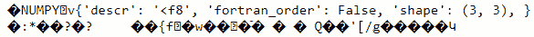

# 第四章：使用 NumPy 进行高速科学计算

本章介绍了 NumPy，一个用于矩阵计算的高速 Python 库。大多数数据科学/算法交易库都是基于 NumPy 的功能和约定构建的。

在本章中，我们将讨论以下关键主题：

+   NumPy 简介

+   创建 NumPy n 维数组（ndarrays）

+   与 NumPy 数组一起使用的数据类型

+   ndarray 的索引

+   基本 ndarray 操作

+   对 ndarray 进行文件操作

# 技术要求

本章中使用的 Python 代码在书籍代码仓库的 `Chapter03/numpy.ipynb` 笔记本中可用。

# NumPy 简介

在 Python 中，可以使用列表表示多维异构数组。列表是一个一维数组，列表的列表是一个二维数组，列表的列表的列表是一个三维数组，依此类推。然而，这种解决方案很复杂，难以使用，并且非常慢。

NumPy Python 库的主要设计目标之一是引入高性能和可扩展的结构化数组和矢量化计算。

大多数 NumPy 中的数据结构和操作都是用 C/C++ 实现的，这保证了它们具有优越的速度。

# 创建 NumPy ndarrays

**ndarray** 是一个极其高性能和空间有效的多维数组数据结构。

首先，我们需要导入 NumPy 库，如下所示：

```py
import numpy as np
```

接下来，我们将开始创建一个一维 ndarray。

## 创建一维 ndarray

以下代码行创建一个一维 ndarray：

```py
arr1D = np.array([1.1, 2.2, 3.3, 4.4, 5.5]); 
arr1D
```

这将产生以下输出：

```py
array([1.1, 2.2, 3.3, 4.4, 5.5])
```

让我们用以下代码检查数组的类型：

```py
type(arr1D)
```

这表明数组是一个 NumPy ndarray，如下所示：

```py
numpy.ndarray
```

我们可以轻松地创建两个或更多维的 ndarray。

## 创建二维 ndarray

要创建一个二维 ndarray，请使用以下代码：

```py
arr2D = np.array([[1, 2], [3, 4]]); 
arr2D
```

结果有两行，每行有两个值，所以它是一个 2 x 2 的 ndarray，如下代码片段所示：

```py
array([[1, 2],
       [3, 4]])
```

## 创建任意维度的 ndarray

ndarray 可以构造具有任意维度的数组。以下代码创建了一个 2 x 2 x 2 x 2 维的 ndarray：

```py
arr4D = np.array(range(16)).reshape((2, 2, 2, 2)); 
arr4D
```

数组的表示如下所示：

```py
array([[[[ 0,  1],
         [ 2,  3]],
        [[ 4,  5],
         [ 6,  7]]],
       [[[ 8,  9],
         [10, 11]],
        [[12, 13],
         [14, 15]]]])
```

NumPy ndarrays 具有描述 ndarray 维度的 `shape` 属性，如下代码片段所示：

```py
arr1D.shape
```

以下片段显示 `arr1D` 是一个包含五个元素的一维数组：

```py
(5,)
```

我们可以使用以下代码检查 `arr2D` 上的 `shape` 属性：

```py
arr2D.shape
```

如预期的那样，输出描述它为一个 2 x 2 的 ndarray，如下所示：

```py
(2, 2)
```

在实践中，有一些矩阵经常被使用，比如零矩阵、全一矩阵、单位矩阵、包含一系列数字的矩阵或随机矩阵。NumPy 提供了支持用一个命令生成这些常用 ndarray 的功能。

## 使用 np.zeros(...) 创建 ndarray

`np.zeros(...)` 方法创建一个填充有全 0 的 ndarray，如下代码片段所示：

```py
np.zeros(shape=(2,5))
```

输出是全 0，维度为 2 x 5，如下代码片段所示：

```py
array([[0., 0., 0., 0., 0.],
       [0., 0., 0., 0., 0.]])
```

## 使用 np.ones(...) 创建一个 ndarray

`np.ones(...)` 类似，但每个值都被赋予值 1，而不是 0。该方法如下所示：

```py
np.ones(shape=(2,2))
```

结果是一个 2 x 2 的 ndarray，每个值都设置为 1，如下面的代码片段所示：

```py
array([[1., 1.],
       [1., 1.]])
```

## 使用 np.identity(...) 创建一个 ndarray

在矩阵运算中，我们经常需要创建一个单位矩阵，可以使用 `np.identity(...)` 方法，如下面的代码片段所示：

```py
np.identity(3)
```

这将创建一个 3 x 3 的单位矩阵，对角线上为 1，其他位置为 0，如下面的代码片段所示：

```py
array([[1., 0., 0.],
       [0., 1., 0.],
       [0., 0., 1.]])
```

## 使用 np.arange(...) 创建一个 ndarray

`np.arange(...)` 是 Python `range(...)` 方法的 NumPy 等价物。这生成具有起始值、结束值和增量的值，但是返回的是 NumPy ndarrays，如下所示：

```py
np.arange(5)
```

返回的 ndarray 如下所示：

```py
array([0, 1, 2, 3, 4])
```

默认情况下，值从 0 开始，递增为 1。

## 使用 np.random.randn(...) 创建一个 ndarray

`np.random.randn(...)` 生成一个指定维度的 ndarray，每个元素从标准正态分布中随机抽取的随机值（`mean=0`，`std=1`），如下所示：

```py
np.random.randn(2,2)
```

输出是一个 2 x 2 的 ndarray，其值为随机值，如下面的代码片段所示：

```py
array([[ 0.57370365, -1.22229931],
       [-1.25539335,  1.11372387]])
```

# 使用 NumPy ndarrays 的数据类型

NumPy ndarrays 是同质的——即，ndarray 中的每个元素具有相同的数据类型。这与 Python 列表不同，Python 列表可以包含不同数据类型的元素（异质的）。

`np.array(...)` 方法接受一个显式的 `dtype=` 参数，允许我们指定 ndarray 应该使用的数据类型。常用的数据类型包括 `np.int32`、`np.float64`、`np.float128` 和 `np.bool`。请注意，`np.float128` 在 Windows 上不受支持。

你应该注意各种数值类型对 ndarrays 的内存使用，主要原因是——数据类型提供的精度越高，其内存需求就越大。对于某些操作，较小的数据类型可能已经足够了。

## 创建一个 numpy.float64 数组

要创建一个 128 位浮点值数组，请使用以下代码：

```py
np.array([-1, 0, 1], dtype=np.float64)
```

输出如下所示：

```py
array([-1.,  0.,  1.], dtype=float64)
```

## 创建一个 numpy.bool 数组

我们可以通过将指定的值转换为目标类型来创建一个 ndarray。在下面的代码示例中，尽管提供了整数数据值，但由于指定了数据类型为 `np.bool`，所以生成的 ndarray 的 `dtype` 为 `bool`：

```py
np.array([-1, 0, 1], dtype=np.bool)
```

值如下所示：

```py
array([ True, False,  True])
```

我们观察到整数值 (`-1, 0, 1`) 被转换为布尔值 (`True, False, True`)。`0` 被转换为 `False`，所有其他值被转换为 `True`。

## ndarrays 的 dtype 属性

ndarrays 有一个 `dtype` 属性用于检查数据类型，如下所示：

```py
arr1D.dtype
```

输出是一个 NumPy `dtype` 对象，其值为 `float64`，如下所示：

```py
dtype('float64')
```

## 使用 numpy.ndarrays.astype(...) 转换 ndarray 的底层数据类型

我们可以使用 `numpy.ndarrays.astype(...)` 方法轻松地将 ndarray 的基础数据类型转换为任何其他兼容的数据类型。例如，要将`arr1D`从`np.float64`转换为`np.int64`，我们使用以下代码：

```py
arr1D.astype(np.int64).dtype
```

这反映了新的数据类型，如下所示：

```py
dtype('int64')
```

当 `numpy.ndarray.astype(...)` 转换为较窄的数据类型时，它将截断值，如下所示：

```py
arr1D.astype(np.int64)
```

这将`arr1D`转换为以下整数值 ndarray：

```py
array([1, 2, 3, 4, 5])
```

原始的浮点值（1.1, 2.2, …）被转换为它们截断的整数值（1, 2, …）。

# ndarray 的索引

数组索引是指访问特定数组元素或元素的方式。在 NumPy 中，所有 ndarray 索引都是从零开始的，即数组的第一个项目索引为`0`。负索引被理解为从数组的末尾开始计数。

## 直接访问 ndarray 的元素

直接访问单个 ndarray 元素是最常用的访问形式之一。

以下代码构建了一个 3 x 3 的随机值 ndarray 供我们使用：

```py
arr = np.random.randn(3,3); 
arr
```

`arr` ndarray 具有以下元素：

```py
array([[-0.04113926, -0.273338  , -1.05294723],
       [ 1.65004669, -0.09589629,  0.15586867],
       [ 0.39533427,  1.47193681,  0.32148741]])
```

我们可以使用整数索引 `0` 索引第一个元素，如下所示：

```py
arr[0]
```

这给我们了`arr` ndarray 的第一行，如下所示：

```py
array([-0.04113926, -0.273338  , -1.05294723])
```

我们可以通过以下代码访问第一行的第二列元素：

```py
arr[0][1]
```

结果如下所示：

```py
-0.2733379996693689
```

ndarray 也支持执行相同操作的替代表示法，如下所示：

```py
arr[0, 1]
```

它访问了与之前相同的元素，如下所示：

```py
-0.2733379996693689
```

当访问具有非常大维度的 ndarray 时，`numpy.ndarray[index_0, index_1, … index_n]` 表示法尤其更简洁和有用。

负索引从 ndarray 的末尾开始，如下所示：

```py
arr[-1]
```

这将返回 ndarray 的最后一行，如下所示：

```py
array([0.39533427, 1.47193681, 0.32148741])
```

## ndarray 切片

虽然单个 ndarray 访问很有用，但是对于批量处理，我们需要一次访问数组的多个元素（例如，如果 ndarray 包含某个资产的所有每日价格，我们可能只想处理所有星期一的价格）。

切片允许一次访问多个 ndarray 记录。ndarray 的切片工作方式与 Python 列表的切片类似。

基本切片语法是 *i:j:k*，其中 *i* 是我们想要包括的第一个记录的索引，*j* 是停止索引，*k* 是步长。

### 访问第一个元素之后的所有 ndarray 元素

要访问第一个元素之后的所有元素，我们可以使用以下代码：

```py
arr[1:]
```

这返回了第一个元素之后的所有行，如下代码片段所示：

```py
array([[ 1.65004669, -0.09589629,  0.15586867],
       [ 0.39533427,  1.47193681,  0.32148741]])
```

### 获取所有行，从第二行开始，列为第一列和第二列

类似地，要获取从第二行开始的所有行，并且列不包括第三列，运行以下代码：

```py
arr[1:, :2]
```

这是一个 2 x 2 的 ndarray，正如预期的那样，可以在这里看到：

```py
array([[ 1.65004669, -0.09589629],
       [ 0.39533427,  1.47193681]])
```

### 使用负索引进行切片

更复杂的切片表示法也是可能的，包括正负索引范围的混合，如下所示：

```py
arr[1:2, -2:-1]
```

这是一种不太直观的方法，用于查找位于第二行和第二列的元素的切片，如下所示：

```py
array([[-0.09589629]])
```

### 没有索引的切片

没有索引的切片将产生整个行/列。下面的代码生成包含第三行所有元素的切片：

```py
arr[:][2]
```

输出如下所示：

```py
array([0.39533427, 1.47193681, 0.32148741])
```

下面的代码生成原始`arr` ndarray 的切片：

```py
arr[:][:]
```

输出如下所示：

```py
array([[-0.04113926, -0.273338  , -1.05294723],
       [ 1.65004669, -0.09589629,  0.15586867],
       [ 0.39533427,  1.47193681,  0.32148741]])
```

### 将切片的值设置为 0

经常，我们需要将 ndarray 的某些值设置为给定值。

让我们生成一个包含`arr`的第二行并将其分配给一个新变量`arr1`的切片，如下所示：

```py
arr1 = arr[1:2]; 
arr1
```

`arr1`现在包含了最后一行，如下代码片段所示：

```py
array([[ 1.65004669, -0.09589629,  0.15586867]])
```

现在，让我们将`arr1`的每个元素设置为值`0`，如下所示：

```py
arr1[:] = 0; 
arr1
```

如预期的那样，`arr1`现在包含了全部为 0 的值，如下所示：

```py
array([[0., 0., 0.]])
```

现在，让我们重新检查我们的原始`arr` ndarray，如下所示：

```py
arr
```

输出如下所示：

```py
array([[-0.04113926, -0.273338  , -1.05294723],
       [ 0.        ,  0.        ,  0.        ],
       [ 0.39533427,  1.47193681,  0.32148741]])
```

我们看到我们对`arr1`切片的操作也改变了原始的`arr` ndarray。这带我们来到最重要的一点：ndarray 切片是原始 ndarrays 的视图，而不是副本。

在使用 ndarrays 时记住这一点很重要，这样我们就不会无意中改变我们不想改变的东西。这个设计纯粹是为了效率原因，因为复制大型 ndarrays 会产生巨大的开销。

要创建一个 ndarray 的副本，我们需要显式调用`numpy.ndarray.copy(...)`方法，如下所示：

```py
arr_copy = arr.copy()
```

现在，让我们更改`arr_copy` ndarray 中的一些值，如下所示：

```py
arr_copy[1:2] = 1; 
arr_copy
```

我们可以在下面的代码片段中看到`arr_copy`的变化：

```py
array([[-0.04113926, -0.273338  , -1.05294723],
       [ 1.        ,  1.        ,  1.        ],
       [ 0.39533427,  1.47193681,  0.32148741]])
```

让我们也来检查一下原始的`arr` ndarray，如下所示：

```py
arr
```

输出如下所示：

```py
array([[-0.04113926, -0.273338  , -1.05294723],
       [ 0.        ,  0.        ,  0.        ],
       [ 0.39533427,  1.47193681,  0.32148741]])
```

我们看到原始 ndarray 没有更改，因为`arr_copy`是`arr`的副本而不是引用/视图。

## 布尔索引

NumPy 提供了多种索引 ndarray 的方法。NumPy 数组可以通过使用求值为`True`或`False`的条件进行索引。让我们从重新生成一个`arr` ndarray 开始，如下所示：

```py
arr = np.random.randn(3,3); 
arr
```

这是一个 3 x 3 的 ndarray，具有随机值，如下代码片段所示：

```py
array([[-0.50566069, -0.52115534,  0.0757591 ],
       [ 1.67500165, -0.99280199,  0.80878346],
       [ 0.56937775,  0.36614928, -0.02532004]])
```

让我们重新审视一下运行以下代码的输出，实际上只是调用了`np.less(...)` `np.less(arr, 0)`方法：

```py
arr < 0
```

这生成另一个包含`True`和`False`值的 ndarray，其中`True`表示`arr`中的相应元素为负数，而`False`表示`arr`中的相应元素不是负数，如下代码片段所示：

```py
array([[ True,  True, False],
       [False,  True, False],
       [False, False,  True]])
```

我们可以使用该数组作为索引到`arr`来找到实际的负元素，如下所示：

```py
arr[(arr < 0)]
```

如预期的那样，这会获取以下负值：

```py
array([-0.50566069, -0.52115534, -0.99280199, -0.02532004])
```

我们可以使用`&`（和）和`|`（或）运算符组合多个条件。Python 的`&`和`|`布尔运算符不适用于 ndarrays，因为它们适用于标量。这里是`&`运算符的一个示例：

```py
(arr > -1) & (arr < 1)
```

这将生成一个值为`True`的 ndarray，其中元素在`-1`和`1`之间，否则为`False`，如下代码片段所示：

```py
array([[ True,  True,  True],
       [False,  True,  True],
       [ True,  True,  True]])
```

正如我们之前看到的，我们可以使用布尔数组索引 `arr` 并找到实际的元素，如下所示：

```py
arr[((arr > -1) & (arr < 1))]
```

以下输出是满足条件的元素数组：

```py
array([-0.50566069, -0.52115534,  0.0757591 , -0.99280199,  0.80878346,
        0.56937775,  0.36614928, -0.02532004])
```

## 使用数组进行索引

ndarray 的索引还允许我们直接传递感兴趣的索引列表。让我们首先生成一个随机值的 ndarray，如下所示：

```py
arr
```

输出如下所示：

```py
array([[-0.50566069, -0.52115534,  0.0757591 ],
       [ 1.67500165, -0.99280199,  0.80878346],
       [ 0.56937775,  0.36614928, -0.02532004]])
```

我们可以使用以下代码选择第一行和第三行：

```py
arr[[0, 2]]
```

输出是一个包含两行的 2 x 3 ndarray，如下所示：

```py
array([[-0.50566069, -0.52115534,  0.0757591 ],
       [ 0.56937775,  0.36614928, -0.02532004]])
```

我们可以结合使用数组进行行和列索引，如下所示：

```py
arr[[0, 2], [1]]
```

上述代码给出了第一和第三行的第二列，如下所示：

```py
array([-0.52115534,  0.36614928])
```

我们还可以改变传递的索引的顺序，这在输出中有所体现。下面的代码按照指定的顺序挑选出第三行和第一行：

```py
arr[[2, 0]]
```

输出反映了我们期望的两行的顺序（先第三行；然后第一行），如下代码片段所示：

```py
array([[ 0.56937775,  0.36614928, -0.02532004],
       [-0.50566069, -0.52115534,  0.0757591 ]])
```

现在我们已经学会了如何创建 ndarrays 以及各种检索其元素值的方法，让我们讨论最常见的 ndarray 操作。

# 基本的 ndarray 操作

在接下来的示例中，我们将使用一个 `arr2D` ndarray，如下所示：

```py
arr2D
```

这是一个 `1` 到 `4` 的值的 2 x 2 ndarray，如下所示：

```py
array([[1, 2],
       [3, 4]])
```

## 与 ndarray 的标量乘法

与 ndarray 的标量乘法会使 ndarray 的每个元素相乘，如下所示：

```py
arr2D * 4
```

输出如下所示：

```py
array([[ 4,  8],
       [12, 16]])
```

## ndarray 的线性组合

以下操作是标量和 ndarray 操作以及 ndarray 之间的操作的组合：

```py
2*arr2D + 3*arr2D
```

输出是我们预期的，如下所示：

```py
array([[ 5, 10],
       [15, 20]])
```

## ndarray 的指数运算

我们可以将 ndarray 的每个元素提升到某个幂，如下所示：

```py
arr2D ** 2
```

输出如下所示：

```py
array([[ 1,  4],
       [ 9, 16]])
```

## 将 ndarray 与标量相加

将 ndarray 与标量相加的结果类似，如下所示：

```py
arr2D + 10
```

输出如下所示：

```py
array([[11, 12],
       [13, 14]])
```

## 转置矩阵

找到矩阵的转置，这是一个常见的操作，在 NumPy 中可以使用 `numpy.ndarray.transpose(...)` 方法实现，如下代码片段所示：

```py
arr2D.transpose()
```

这转置了 ndarray 并输出它，如下所示：

```py
array([[1, 3],
       [2, 4]])
```

## 改变 ndarray 的布局

`np.ndarray.reshape(...)` 方法允许我们更改 ndarray 的布局（形状），而不改变其数据为兼容的形状。

例如，要将 `arr2D` 从 2 x 2 重塑为 4 x 1，我们使用以下代码：

```py
arr2D.reshape((4, 1))
```

新的重塑后的 4 x 1 ndarray 如下所示：

```py
array([[1],
       [2],
       [3],
       [4]])
```

以下代码示例结合了 `np.random.randn(...)` 和 `np.ndarray.reshape(...)` 来创建一个 3 x 3 的随机值 ndarray：

```py
arr = np.random.randn(9).reshape((3,3)); 
arr
```

生成的 3 x 3 ndarray 如下所示：

```py
array([[ 0.24344963, -0.53183761,  1.08906941],
       [-1.71144547, -0.03195253,  0.82675183],
       [-2.24987291,  2.60439882, -0.09449784]])
```

## 查找 ndarray 中的最小值

要查找 ndarray 中的最小值，我们使用以下命令：

```py
np.min(arr)
```

结果如下所示：

```py
-2.249872908111852
```

## 计算绝对值

所示的`np.abs(...)`方法计算 ndarray 的绝对值：

```py
np.abs(arr)
```

输出 ndarray 如下所示：

```py
array([[0.24344963, 0.53183761, 1.08906941],
       [1.71144547, 0.03195253, 0.82675183],
       [2.24987291, 2.60439882, 0.09449784]])
```

## 计算 ndarray 的均值

`np.mean(...)`方法，如下所示，计算 ndarray 中所有元素的均值：

```py
np.mean(arr)
```

这里显示了`arr`元素的均值：

```py
0.01600703714906236
```

我们可以通过指定`axis=`参数来沿列找到均值，如下所示：

```py
np.mean(arr, axis=0)
```

返回以下数组，其中包含每列的均值：

```py
array([-1.23928958,  0.68020289,  0.6071078 ])
```

类似地，我们可以通过运行以下代码来沿行找到均值：

```py
np.mean(arr, axis=1)
```

返回以下数组，包含每行的均值：

```py
array([ 0.26689381, -0.30554872,  0.08667602])
```

## 查找 ndarray 中最大值的索引

通常，我们有兴趣找出数组中最大值的位置。`np.argmax(...)`方法可以找到 ndarray 中最大值的位置，如下所示：

```py
np.argmax(arr)
```

这返回以下值，表示最大值的位置（`2.60439882`）：

```py
7
```

`np.argmax(...)`方法还接受`axis=`参数，以按行或按列执行操作，如此处所示：

```py
np.argmax(arr, axis=1)
```

这将找到每行中最大值的位置，如下所示：

```py
array([2, 2, 1], dtype=int64)
```

## 计算 ndarray 元素的累积和

要计算累积总和，NumPy 提供了`np.cumsum(...)`方法。`np.cumsum(...)`方法如下所示，找到 ndarray 中元素的累积总和：

```py
np.cumsum(arr)
```

输出提供了每个附加元素后的累积和，如下所示：

```py
array([ 0.24344963, -0.28838798,  0.80068144, -0.91076403, -0.94271656,
       -0.11596474, -2.36583764,  0.23856117,  0.14406333])
```

注意累积和和求和之间的差异。累积和是一个累加的数组，而求和是一个单个数字。

将`axis=`参数应用于`cumsum`方法的效果类似，如以下代码片段所示：

```py
np.cumsum(arr, axis=1)
```

这将按行进行，并生成以下数组输出：

```py
array([[ 0.24344963, -0.28838798,  0.80068144],
       [-1.71144547, -1.743398  , -0.91664617],
       [-2.24987291,  0.35452591,  0.26002807]])
```

## 查找 ndarray 中的 NaN 值

在 NumPy 中，缺失或未知值通常使用**Not a Number** (**NaN**)值表示。对于许多数值方法，必须将这些值删除或替换为插值。

首先，让我们将第二行设置为`np.nan`，如下所示：

```py
arr[1, :] = np.nan; 
arr
```

新的 ndarray 具有 NaN 值，如以下代码片段所示：

```py
array([[ 0.64296696, -1.35386668, -0.63063743],
       [        nan,         nan,         nan],
       [-0.19093967, -0.93260398, -1.58520989]])
```

`np.isnan(...)`ufunc 找到 ndarray 中的值是否为 NaN，如下所示：

```py
np.isnan(arr)
```

输出是一个 ndarray，其中存在 NaN 的地方为`True`值，不存在 NaN 的地方为`False`值，如下所示的代码片段所示：

```py
array([[False, False, False],
       [ True,  True,  True],
       [False, False, False]])
```

## 查找两个 ndarray 的 x1>x2 的真值

布尔 ndarray 是获取感兴趣的值的索引的有效方式。使用布尔 ndarray 比逐个遍历矩阵元素要高效得多。

让我们按照以下方式构建另一个具有随机值的`arr1` ndarray：

```py
arr1 = np.random.randn(9).reshape((3,3)); 
arr1
```

结果是一个 3 x 3 的 ndarray，如下所示的代码片段中所示：

```py
array([[ 0.32102068, -0.51877544, -1.28267292],
       [-1.34842617,  0.61170993, -0.5561239 ],
       [ 1.41138027, -2.4951374 ,  1.30766648]])
```

类似地，让我们构建另一个`arr2` ndarray，如下所示：

```py
arr2 = np.random.randn(9).reshape((3,3)); 
arr2
```

输出如下所示：

```py
array([[ 0.33189432,  0.82416396, -0.17453351],
       [-1.59689203, -0.42352094,  0.22643589],
       [-1.80766151,  0.26201455, -0.08469759]])
```

`np.greater(...)`函数是一个二进制 ufunc，当 ndarray 中的左值大于 ndarray 中的右值时生成`True`值。该函数如下所示：

```py
np.greater(arr1, arr2)
```

输出是如前所述的`True`和`False`值的 ndarray，如我们在这里所见：

```py
array([[False, False, False],
       [ True,  True, False],
       [ True, False,  True]])
```

`>`中缀操作符，如下段代码片段所示，是`numpy.greater(...)`的简写：

```py
arr1 > arr2
```

输出相同，如我们在这里所见：

```py
array([[False, False, False],
       [ True,  True, False],
       [ True, False,  True]])
```

## 对 ndarray 进行任何和所有的布尔运算

除了关系运算符外，NumPy 还支持其他方法来测试矩阵值上的条件。

以下代码生成一个 ndarray，对满足条件的元素返回`True`，否则返回`False`：

```py
arr_bool = (arr > -0.5) & (arr < 0.5); 
arr_bool
```

输出如下所示：

```py
array([[False, False,  True],
       [False, False, False],
       [False,  True,  True]])
```

以下`numpy.ndarray.any(...)`方法在任何元素为`True`时返回`True`，否则返回`False`：

```py
arr_bool.any()
```

在这里，我们至少有一个元素为`True`，因此输出为`True`，如下所示：

```py
True
```

再次，它接受常见的`axis=`参数并且表现如预期，如我们在这里所见：

```py
arr_bool.any(axis=1)
```

并且按行执行的操作生成如下所示：

```py
array([True, False, True])
```

以下`numpy.ndarray.all(...)`方法在所有元素都为`True`时返回`True`，否则返回`False`：

```py
arr_bool.all()
```

这返回了以下内容，因为并非所有元素都为`True`：

```py
False
```

它还接受`axis=`参数，如下所示：

```py
arr_bool.all(axis=1)
```

再次，每行至少有一个`False`值，因此输出为`False`，如下所示：

```py
array([False, False, False])
```

## 对 ndarray 进行排序

在排序的 ndarray 中查找元素比处理 ndarray 的所有元素更快。

让我们生成一个 1D 随机数组，如下所示：

```py
arr1D = np.random.randn(10); 
arr1D
```

ndarray 包含以下数据：

```py
array([ 1.14322028,  1.61792721, -1.01446969,  1.26988026, -0.20110113,
       -0.28283051,  0.73009565, -0.68766388,  0.27276319, -0.7135162 ])
```

`np.sort(...)`方法非常简单，如下所示：

```py
np.sort(arr1D)
```

输出如下所示：

```py
array([-1.01446969, -0.7135162 , -0.68766388, -0.28283051, -0.20110113,
        0.27276319,  0.73009565,  1.14322028,  1.26988026,  1.61792721])
```

让我们检查原始 ndarray，看看它是否被`numpy.sort(...)`操作修改了，如下所示：

```py
arr1D
```

以下输出显示原始数组未改变：

```py
array([ 1.14322028,  1.61792721, -1.01446969,  1.26988026, -0.20110113,
       -0.28283051,  0.73009565, -0.68766388,  0.27276319, -0.7135162 ])
```

以下`np.argsort(...)`方法创建一个表示每个元素在排序数组中位置的索引数组：

```py
np.argsort(arr1D)
```

此操作的输出生成以下数组：

```py
array([2, 9, 7, 5, 4, 8, 6, 0, 3, 1])
```

NumPy ndarray 还具有`numpy.ndarray.sort(...)`方法，该方法可以就地对数组进行排序。该方法在下面的代码片段中说明：

```py
arr1D.sort()
np.argsort(arr1D)
```

调用`sort()`后，我们调用`numpy.argsort(...)`来确保数组已排序，这将生成以下数组，确认了该行为：

```py
array([0, 1, 2, 3, 4, 5, 6, 7, 8, 9])
```

## 在 ndarray 中搜索

在 ndarray 上满足某个条件的元素的索引是一种基本操作。

首先，我们从一个具有连续值的 ndarray 开始，如下所示：

```py
arr1 = np.array(range(1, 11)); 
arr1
```

这将创建以下 ndarray：

```py
array([ 1,  2,  3,  4,  5,  6,  7,  8,  9, 10])
```

我们根据第一个 ndarray 创建了第二个 ndarray，不过这次第二个 ndarray 中的值乘以了`1000`，如下面的代码片段所示：

```py
arr2 = arr1 * 1000; 
arr2
```

然后，我们知道`arr2`包含以下数据：

```py
array([ 1000,  2000,  3000,  4000,  5000,  6000,  7000,  8000,  9000,
       10000])
```

我们定义另一个 ndarray，其中包含 10 个随机的`True`和`False`值，如下所示：

```py
cond = np.random.randn(10) > 0; 
cond
```

`cond`ndarray 中的值显示如下：

```py
array([False, False,  True, False, False,  True,  True,  True, False, True])
```

`np.where(...)` 方法允许我们根据条件是 `True` 还是 `False` 从一个 ndarray 或另一个中选择值。以下代码将生成一个 ndarray，当 `cond` 数组中对应的元素为 `True` 时，从 `arr1` 中选择值；否则，从 `arr2` 中选择值：

```py
np.where(cond, arr1, arr2)
```

返回的数组如下所示：

```py
array([1000, 2000,    3, 4000, 5000,    6,    7,    8, 9000,   10])
```

# ndarray 的文件操作

大多数 NumPy 数组都是从文件中读取的，在处理后，再写回文件。

## 文本文件的文件操作

文本文件的主要优点是它们可读性强，并且与任何自定义软件兼容。

让我们从以下随机数组开始：

```py
arr
```

此数组包含以下数据

```py
array([[-0.50566069, -0.52115534,  0.0757591 ],
       [ 1.67500165, -0.99280199,  0.80878346],
       [ 0.56937775,  0.36614928, -0.02532004]])
```

`numpy.savetxt(...)` 方法以文本格式将 ndarray 保存到磁盘。

以下示例使用了 `fmt='%0.2lf'` 格式字符串并指定了逗号分隔符：

```py
np.savetxt('arr.csv', arr, fmt='%0.2lf', delimiter=',')
```

让我们检查当前目录中写入磁盘的 `arr.csv` 文件，如下所示：

```py
!cat arr.csv
```

**逗号分隔值** (**CSV**) 文件包含以下数据：

```py
-0.51,-0.52,0.08
1.68,-0.99,0.81
0.57,0.37,-0.03
```

`numpy.loadtxt(...)` 方法从文本文件加载 ndarray 到内存中。在这里，我们显式指定了 `delimiter=','` 参数，如下所示：

```py
arr_new = np.loadtxt('arr.csv', delimiter=','); 
arr_new
```

从文本文件中读入的 ndarray 包含以下数据：

```py
array([[-0.51, -0.52,  0.08],
       [ 1.68, -0.99,  0.81],
       [ 0.57,  0.37, -0.03]])
```

## 二进制文件的文件操作

二进制文件对于计算机处理来说效率更高——它们保存和加载更快，比文本文件更小。但是，它们的格式可能不受其他软件支持。

`numpy.save(...)` 方法将 ndarray 存储为二进制格式，如下代码片段所示：

```py
np.save('arr', arr)
!cat arr.npy
```

`arr.npy` 文件的输出如下：



`numpy.save(...)` 方法会自动为其创建的二进制文件分配 `.npy` 扩展名。

`numpy.load(...)` 方法，如下代码片段所示，用于读取二进制文件：

```py
arr_new = np.load('arr.npy'); 
arr_new
```

新读入的 ndarray 如下所示：

```py
array([[-0.50566069, -0.52115534,  0.0757591 ],
       [ 1.67500165, -0.99280199,  0.80878346],
       [ 0.56937775,  0.36614928, -0.02532004]])
```

二进制文件格式的另一个优点是，数据可以以极高的精度存储，特别是在处理浮点值时，这在某些情况下在文本文件中并不总是可能的，因为在某些情况下会有一些精度损失。

让我们通过运行以下代码检查旧的 `arr` ndarray 和新读入的 `arr_new` 数组是否完全匹配：

```py
arr == arr_new
```

这将生成以下数组，如果元素相等则包含 `True`，否则包含 `False`：

```py
array([[ True,  True,  True],
       [ True,  True,  True],
       [ True,  True,  True]])
```

因此，我们看到每个元素都完全匹配。

# 概要

在本章中，我们学习了如何在 Python 中创建任意维度的矩阵，如何访问矩阵的元素，如何对矩阵进行基本的线性代数运算，以及如何保存和加载矩阵。

使用 NumPy 矩阵是任何数据分析的主要操作，因为向量运算经过机器优化，因此比 Python 列表上的操作要快得多——通常快 5 到 100 倍。回测任何算法策略通常包括处理庞大的矩阵，而速度差异可以转化为节省的小时或天数时间。

在下一章中，我们将介绍第二重要的用于数据分析的库：Pandas，它是建立在 NumPy 基础上的。NumPy 提供了对基于数据框架的数据操作的支持（数据框架是 Excel 工作表的 Python 版本——即，一个二维数据结构，其中每列都有自己的类型）。
