# *第五章*：使用 Matplotlib 进行数据可视化

数据可视化比阅读纯数字表格更容易理解数值数据。即时获取数据洞察力和识别模式、趋势和异常值是绘图库的主要用途。

在决定哪些股票可能适合哪些算法交易策略时，创建股票价格图是第一步——某些策略仅适用于趋势股票，某些策略适用于均值回归股票等等。虽然数值统计数据至关重要，但设计良好的图表是无法替代的。

本章向我们介绍了 Matplotlib，这是一个静态、动画和交互式的 Python 可视化库，扩展了 NumPy 的功能。`pandas` 库允许直接使用 Matplotlib 绘制 DataFrame 图表。

本章涵盖了以下主要主题：

+   创建图和子图

+   使用颜色、标记和线型丰富图表

+   通过刻度、标签和图例丰富坐标轴

+   使用注释丰富数据点

+   将图保存到文件中

+   使用 Matplotlib 绘制 `pandas` DataFrame

# 技术要求

本章中使用的 Python 代码可在该书代码库中的 `Chapter05/matplotlib.ipynb` 笔记本中找到。

# 创建图和子图

Matplotlib 支持在单个图中绘制多个图表（子图），这是 Matplotlib 对绘图画布的术语。

## 定义图的子图

要创建一个 `matplotlib.pyplot.figure` 对象，请使用以下方法：

```py
import matplotlib.pyplot as plt
fig = plt.figure(figsize=(12, 6), dpi=200)
```

这会生成一个空的图形对象（`0 Axes`）：

```py
<Figure size 2400x1200 with 0 Axes>
```

在我们在这个图上绘制任何东西之前，我们需要添加子图以为它们创建空间。`matplotlib.pyplot.figure.add_subplot(...)` 方法让我们通过指定子图的大小和位置来做到这一点。

下面的代码块在左侧添加了一个大小为 1x2 的子图，然后在右上方添加了一个 2x2 的子图，最后在右下方添加了一个 2x2 的子图：

```py
ax1 = fig.add_subplot(1, 2, 1)
ax2 = fig.add_subplot(2, 2, 2)
ax3 = fig.add_subplot(2, 2, 4)
fig
```

结果是以下图形对象，其中包含我们刚刚添加的子图：

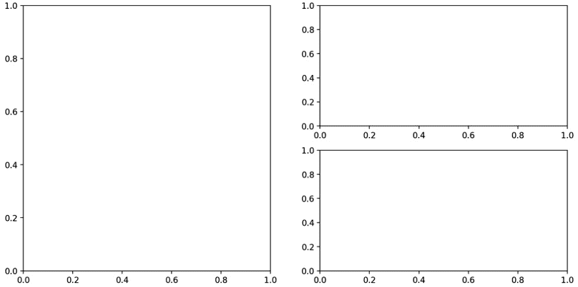

图 5.1 – 包含三个空子图的图

现在，一旦我们创建了图表的空间（`"plots"`/`"subplots"`），我们就可以用可视化数据填充它们。在所有报告中，页面上的物理空间都非常昂贵，因此创建像前面的图表是最佳实践。

## 在子图中绘图

让我们使用 `numpy.linspace(...)` 在 *x* 轴上生成均匀间隔的值，然后使用 `numpy.square(...)`、`numpy.sin(...)` 和 `numpy.cos(...)` 方法在 *y* 轴上生成相应的值。

我们将使用从添加子图中获得的 `ax1`、`ax2` 和 `ax3` 轴变量来绘制这些函数：

```py
import numpy as np
x = np.linspace(0, 1, num=20)
y1 = np.square(x)
ax1.plot(x, y1, color='black', linestyle='--')
y2 = np.sin(x)
ax2.plot(x, y2, color='black', linestyle=':')
y3 = np.cos(x)
ax3.plot(x, y3, color='black', linestyle='-.')
fig
```

现在，以下图包含了我们刚刚绘制的值：

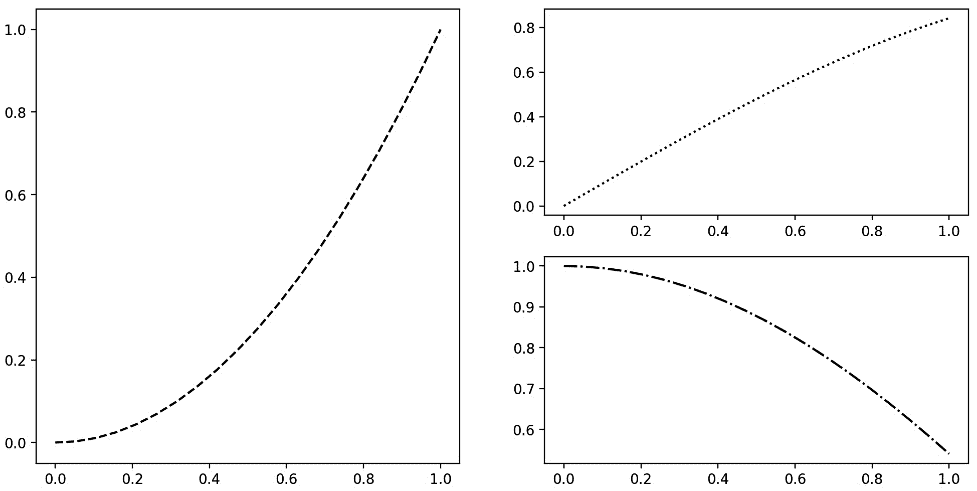

图 5.2 - 包含三个子图绘制平方、正弦和余弦函数的图

创建子图时，可以传递`sharex=`参数，以指定所有子图应共享相同的*x*轴。

让我们演示这个功能并绘制平方，然后使用`numpy.power(...)`方法将`x`提高到 10 次方，并使用相同的*x*轴绘制它们：

```py
fig, (ax1, ax2) = plt.subplots(2, figsize=(12, 6),
                               sharex=True)
ax1.plot(x, y1, color='black', linestyle='--')
y2 = np.power(x, 10)
ax2.plot(x, y2, color='black', linestyle='-.')
```

结果是以下带有共享*x*轴和不同函数绘制在每个图表上的图：

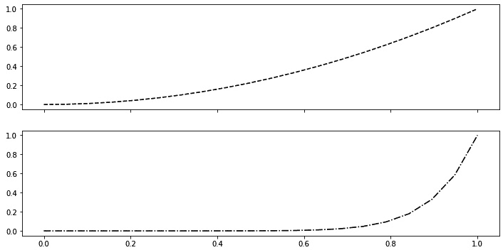

图 5.3 - 共享 x 轴的子图，包含平方和取 10 次方函数

我们生成的图表还不够自解释 - 尚不清楚*x*轴和*y*轴上的单位是什么，以及每个图表代表什么。为了改进图表，我们需要用颜色、标记和线型来丰富它们，用刻度、图例和标签来丰富轴，并提供选定数据点的注释。

# 用颜色、标记和线型丰富图表

颜色、标记和线型使图表更易于理解。

接下来的代码块绘制了四个不同的函数，并使用以下参数修改外观：

+   `color=`参数用于分配颜色。

+   `linewidth=`参数用于更改线的宽度/粗细。

+   `marker=`参数分配不同形状来标记数据点。

+   `markersize=`参数改变了这些标记的大小。

+   `alpha=`参数用于修改透明度。

+   `drawstyle=`参数将默认线连接方式更改为一种绘制之间的阶梯连接方式。

代码如下：

```py
fig, (ax1, ax2, ax3, ax4) = plt.subplots(4, 
                                         figsize=(12, 12), 
                                         sharex=True)
x = np.linspace(0, 10, num=20)
y1 = np.exp(x)
y2 = x ** 3
y3 = np.sin(y2)
y4 = np.random.randn(20)
ax1.plot(x, y1, color='black', linestyle='--', linewidth=5,
         marker='x', markersize=15)
ax2.plot(x, y2, color='green', linestyle='-.', linewidth=2, 
         marker='^', markersize=10, alpha=0.9)
ax3.plot(x, y3, color='red', linestyle=':', marker='*', 
         markersize=15, drawstyle='steps')
ax4.plot(x, y4, color='green', linestyle='-', marker='s', 
         markersize=15)
```

输出显示了四个具有不同属性的函数：

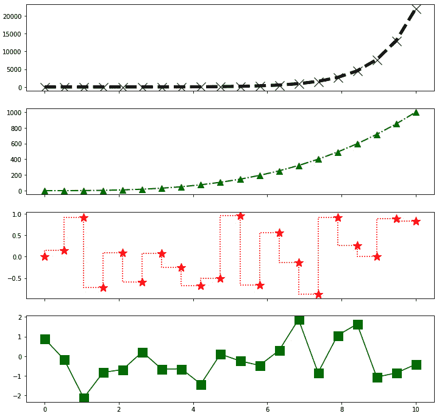

图 5.4 - 演示不同颜色、线型、标记样式、透明度和大小选项的图

使用不同的颜色、线型、标记样式、透明度和大小选项，可以生成具有易于识别的多个时间序列的丰富图表。选择颜色时要明智，因为它们在某些笔记本电脑屏幕上或在打印时可能不会很好地呈现。

丰富轴是制作出色图表的下一步。

# 用刻度、标签和图例丰富轴

通过自定义轴来进一步改进图表，通过刻度、限制和标签：

`matplotlib.pyplot.xlim(...)`方法设置*x*轴上的值的范围。

`matplotlib.pyplot.xticks(...)`方法指定*x*轴上刻度显示的位置：

```py
plt.xlim([8, 10.5])
plt.xticks([8, 8.42, 8.94, 9.47, 10, 10.5])
plt.plot(x, y1, color='black', linestyle='--', marker='o')
```

这将修改*x*轴以在指定的限制内，并在明确指定的值处显示刻度：

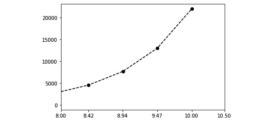

图 5.5 – 具有显式 x 轴限制和刻度的图表

我们还可以使用 `matplotlib.Axes.set_yscale(...)` 方法将其中一个轴的比例改变为非线性。

`matplotlib.Axes.set_xticklabels(...)` 方法更改*x*轴上的标签：

```py
fig, ax = plt.subplots(1, figsize=(12, 6))
ax.set_yscale('log')
ax.set_xticks(x)
ax.set_xticklabels(list('ABCDEFGHIJKLMNOPQRSTUV'))
ax.plot(x, y1, color='black', linestyle='--', marker='o',
        label='y=exp(x)')
```

那个代码块的输出显示了*y*轴比例尺的差异，现在是对数，以及*x*轴刻度具有特定的刻度标签：

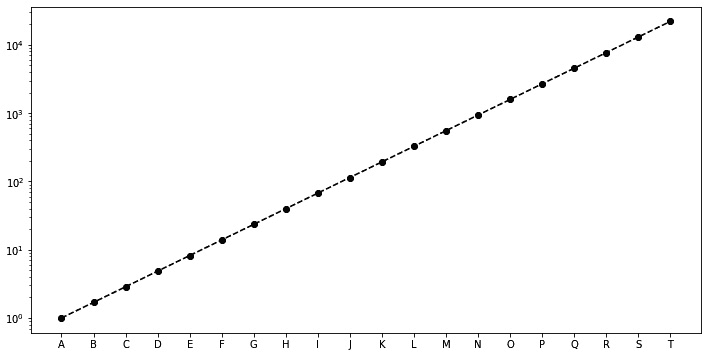

图 5.6 – 具有对数 y 轴比例尺和自定义 x 轴刻度标签的图表

图表中的对数比例尺在数据集涵盖大范围的值和/或我们想要传达百分比变化或乘法因子时非常有用。

`matplotlib.Axes.set_title(...)` 方法用于向绘图添加标题，`matplotlib.Axes.set_xlabel(...)` 和 `matplotlib.Axes.set_ylabel(...)` 方法用于设置*x*和*y*轴的标签。

`matplotlib.Axes.legend(...)` 方法添加图例，使图表更易于解释。`loc=` 参数指定图例在图表上的位置，`loc='best'` 表示 Matplotlib 自动选择最佳位置：

```py
ax.set_title('xtickslabel example')
ax.set_xlabel('x labels')
ax.set_ylabel('log scale y values')
ax.legend(loc='best')
fig
```

以下图表显示了标题、*x* 和 *y* 轴标签以及图例：

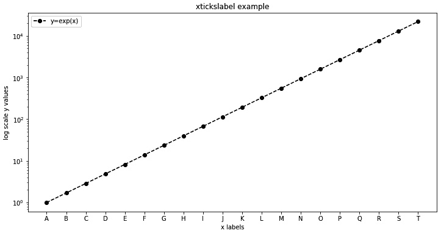

图 5.7 – 展示了标题、x 轴和 y 轴标签以及图例的图表

每个时间序列的不同渲染图表以及解释单位和轴标签足以理解图表。然而，总会有一些特殊的数据点，值得指出。

# 用注释丰富数据点

`matplotlib.Axes.text(...)` 方法向我们的图表添加文本框：

```py
ax.text(1, 10000, 'Generated using numpy and matplotlib')
fig
```

输出如下：

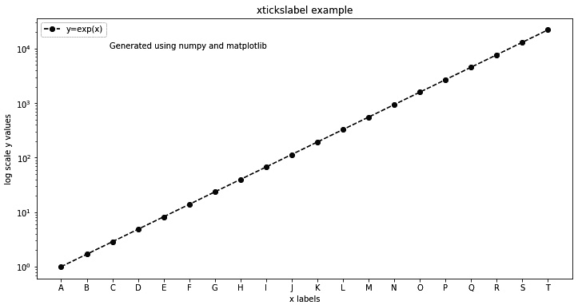

图 5.8 – 显示 Matplotlib 文本注释的图表

`matplotlib.Axes.annotate(...)` 方法提供了对注释的更多控制。

接下来的代码块使用以下参数控制注释：

+   `xy=` 参数指定数据点的位置。

+   `xytext=` 参数指定文本框的位置。

+   `arrowprops=` 参数接受一个字典，用于指定控制从文本框到数据点的箭头的参数。

+   `facecolor=` 参数指定颜色，`shrink=` 参数指定箭头的大小。

+   `horizontalalignment=` 和 `verticalalignment=` 参数指定文本框相对于数据点的方向。

代码如下：

```py
for i in [5, 10, 15]:
    s = '(x=' + str(x[i]) + ',y=' + str(y1[i]) + ')'
    ax.annotate(s, xy=(x[i], y1[i]), xytext=(x[i]+1, 
                y1[i]-5),
                arrowprops=dict(facecolor='black', 
                shrink=0.05), horizontalalignment='left', 
                verticalalignment='top')
fig
```

结果如下：

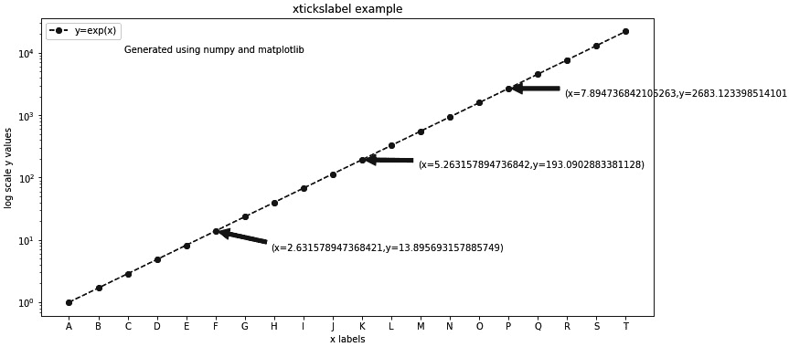

图 5.9 – 具有数据点的文本和箭头注释的图表

引导读者注意关键数据点有助于读者专注于图表的信息。

可以使用 `matplotlib.Axes.add_patch(...)` 方法添加不同形状的注释。

接下来的代码块添加了一个 `matplotlib.pyplot.Circle` 对象，它接受以下内容：

+   使用 `xy=` 参数来指定位置

+   使用 `radius=` 参数来指定圆的半径

+   使用 `color=` 参数来指定圆的颜色

代码如下：

```py
fig, ax = plt.subplots(1, figsize=(12, 6))
ax.plot(x, x, linestyle='--', color='black', marker='*', 
        markersize=15)
for val in x:
    ax.add_patch(plt.Circle(xy=(val, val), radius=0.3, 
                 color='darkgray'))
```

这生成了以下图表，其中数据点周围有圆圈：

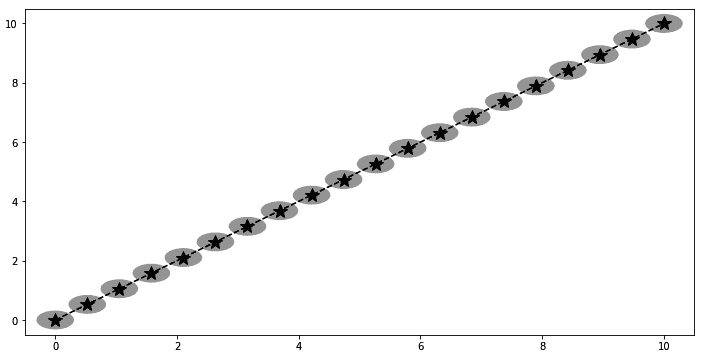

图 5.10 – 包含围绕数据点添加补丁生成的圆形注释的图表

现在我们已经生成了漂亮、专业的图表，需要学习如何分享这些图片。

# 将图表保存到文件

`matplotlib.pyplot.figure` 对象使我们能够以不同的文件格式保存图表到磁盘，具有许多尺寸和分辨率说明符，例如 `dpi=` 参数：

```py
fig.savefig('fig.png', dpi=200)
```

这将以下图表写入 `fig.png` 文件：

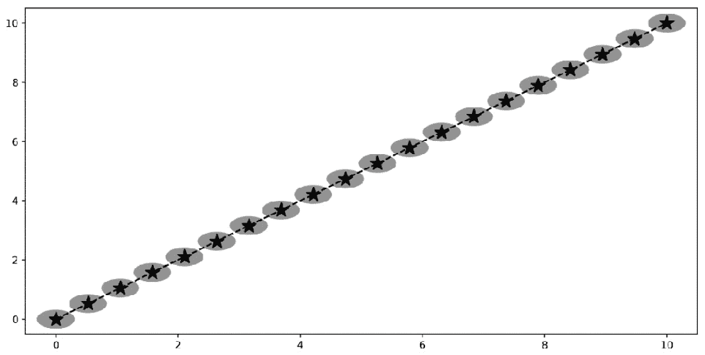

图 5.11 – 写入磁盘上的 Matplotlib 图表并在外部查看器中打开

导出的交易策略表现图像经常用于 HTML 或电子邮件报告。对于打印，请选择打印机的 DPI 作为图表的 DPI。

# 使用 Matplotlib 绘制 pandas DataFrame 图表

`pandas` 库提供了使用 Matplotlib 对 Series 和 DataFrame 对象进行绘图的功能。

让我们创建一个包含连续值的 `Cont` 值的 `pandas` DataFrame，模拟价格，以及模拟价格变化的 `Delta1` 和 `Delta2` 值。 `Cat` 值包含五种可能的分类数据：

```py
import pandas as pd
df = pd.DataFrame(index=range(1000), 
                  columns=['Cont value', 'Delta1 value', 
                           'Delta2 value', 'Cat value'])
df['Cont value'] = np.random.randn(1000).cumsum()
df['Delta1 value'] = np.random.randn(1000)
df['Delta2 value'] = np.random.randn(1000)
df['Cat value'] = np.random.permutation(['Very high',
                                         'High', 'Medium',
                                         'Low', 
                                         'Very Low']*200)
df['Delta1 discrete'] = pd.cut(df['Delta1 value'], 
                               labels=[-2, -1, 0, 1, 2], 
                               bins=5).astype(np.int64)
df['Delta2 discrete'] = pd.cut(df['Delta2 value'], 
                               labels=[-2, -1, 0, 1, 2], 
                               bins=5).astype(np.int64)
df
```

这生成了以下 DataFrame：

```py
    Cont value  Delta1 val  Delta2 val  Cat value  Delta1 discrete  Delta2 discrete
0   -1.429618    0.595897   -0.552871   Very high    1    0
1   -0.710593    1.626343    1.123142      Medium    1    1
...       ...         ...         ...       ...    ...  ...
998 -4.928133   -0.426593   -0.141742   Very high    0    0
999 -5.947680    -0.183414  -0.358367      Medium    0    0
1000 rows × 6 columns
```

让我们探索不同的方式，展现这个 DataFrame。

## 创建 DataFrame 列的线图

我们可以使用 `pandas.DataFrame.plot(...)` 方法的 `kind=` 参数在线图中绘制 `'Cont value'`：

```py
df.plot(y='Cont value', kind='line', color='black', 
        linestyle='-', figsize=(12, 6))
```

此命令生成以下图表：

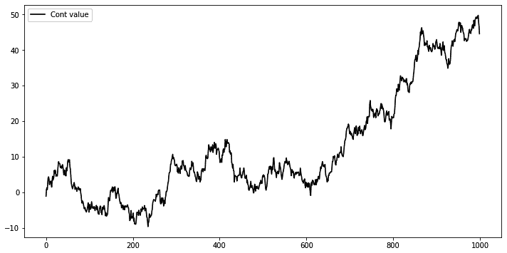

图 5.12 – 使用 pandas.DataFrame.plot(…) 方法生成的线图

线图通常用于显示时间序列。

## 创建 DataFrame 列的条形图

可以使用 `kind='bar'` 参数与 `pandas.DataFrame.plot(...)` 方法构建条形图。

让我们首先按 `'Cat value'` 值对 DataFrame 进行分组，然后绘制 `Delta1 discrete` 值的条形图：

```py
df.groupby('Cat value')['Delta1 discrete']\
.value_counts().plot(kind='bar', color='darkgray',
                     title='Occurrence by (Cat,Delta1)', 
                     figsize=(12, 6))
```

这生成了以下图表，显示了 `(Cat value，Delta1 discrete)` 值对的频率：

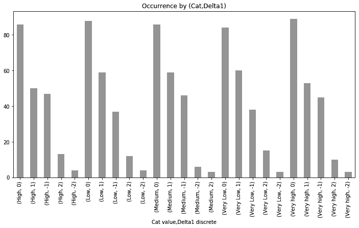

图 5.13 – 显示（Cat value，Delta1 discrete）值对频率的垂直条形图

`kind='barh'` 参数创建了一个水平条形图而不是垂直条形图：

```py
df.groupby('Delta2 discrete')['Cat value'].value_counts()\
.plot(kind='barh', color='darkgray', 
      title='Occurrence by (Delta2,Cat)', 
      figsize=(12, 12))
```

输出如下：

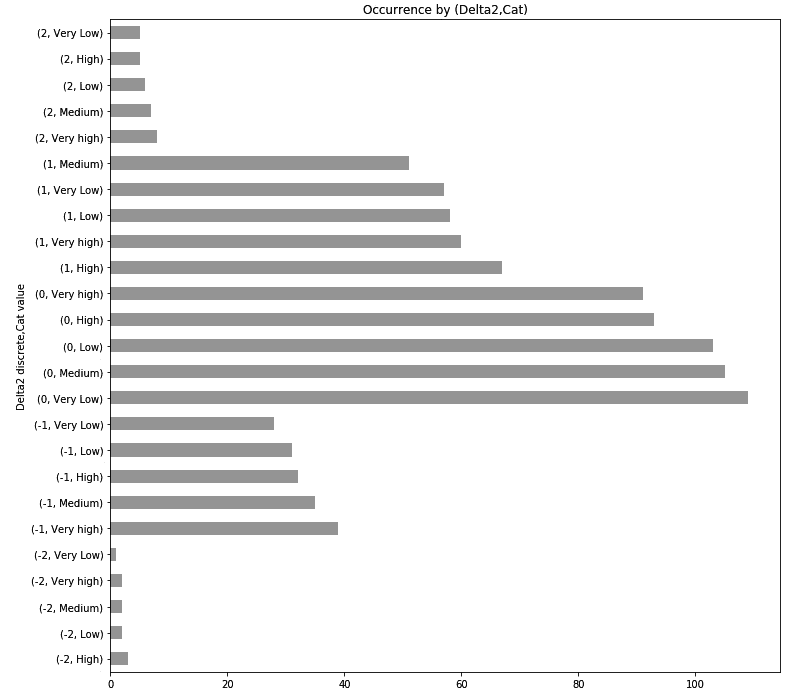

图 5.14 – 水平条形图显示（Delta2 离散，Cat 值）对的频率

条形图最适合比较分类值的大小。

## 创建 DataFrame 列的直方图和密度图

`pandas.DataFrame.plot(…)` 方法中的 `kind='hist'` 参数创建了一个直方图。

让我们创建一个 `Delta1 离散` 值的直方图：

```py
df['Delta1 discrete'].plot(kind='hist', color='darkgray', 
                           figsize=(12, 6), label='Delta1')
plt.legend()
```

生成的直方图如下所示：

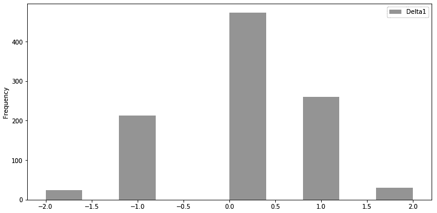

图 5.15 – Delta1 离散频率的直方图

我们可以使用 `kind='kde'` 参数，根据 `Delta2 离散` 值生成一个概率密度函数（PDF）：

```py
df['Delta2 discrete'].plot(kind='kde', color='black', 
                           figsize=(12, 6), 
                           label='Delta2 kde')
plt.legend()
```

输出如下：

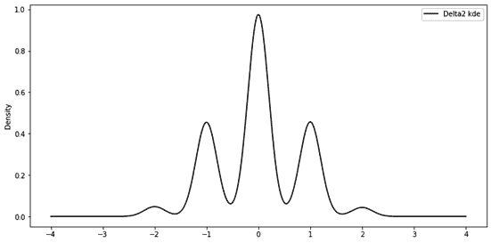

图 5.16 – 显示 Delta2 离散值的概率密度函数（PDF）的 KDE 图

直方图和概率密度函数（PDF）/核密度估计（KDE）用于评估一些随机变量的概率分布。

## 创建两个 DataFrame 列的散点图

`pandas.DataFrame.plot(...)` 方法生成的散点图使用 `kind='scatter'` 参数。

以下代码块绘制了 `Delta1` 和 `Delta2` 值之间的散点图：

```py
df.plot(kind='scatter', x='Delta1 value', y='Delta2 value',
        alpha=0.5, color='black', figsize=(8, 8))
```

输出如下：

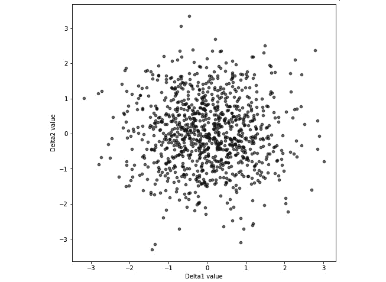

图 5.17 – Delta1 值和 Delta2 值字段的散点图

`pandas.plotting.scatter_matrix(...)` 方法在矩阵的非对角线条目上构建散点图矩阵，并在矩阵的对角线条目上构建直方图/核密度估计（KDE）图，这些图显示了 `Delta1` 和 `Delta2` 值之间的关系：

```py
pd.plotting.scatter_matrix(df[['Delta1 value', 
                               'Delta2 value']], 
                           diagonal='kde', color='black', 
                           figsize=(8, 8))
```

输出如下：

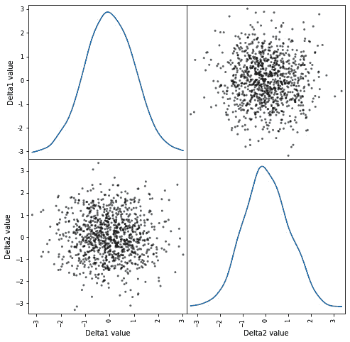

图 5.18 – Delta1 值和 Delta2 值字段的散点矩阵图

散点图/散点矩阵用于观察两个变量之间的关系。

## 绘制时间序列数据

以下代码块创建了一个包含两个虚构交易工具 `A` 和 `B` 的价格的 `pandas` DataFrame。 DataFrame 由表示从 `1992` 年到 `2012` 年的每日日期的 `DateTimeIndex` 对象索引：

```py
dates = pd.date_range('1992-01-01', '2012-10-22')
time_series = pd.DataFrame(index=dates, columns=['A', 'B'])
time_series['A'] = \
np.random.randint(low=-100, high=101, 
                  size=len(dates)).cumsum() + 5000
time_series['B'] = \
np.random.randint(low=-75, high=76, 
                  size=len(dates)).cumsum() + 5000
time_series
```

结果 DataFrame 如下：

```py
                 A      B
1992-01-01    5079    5042
1992-01-02    5088    5047
    ...        ...     ...
2012-10-21    6585    7209
2012-10-22    6634    7247
7601 rows × 2 columns
```

让我们使用这个时间序列代表性类型的图。

### 绘制线性图中的价格

首先，让我们用线性图绘制 `A` 和 `B` 的每日价格 20 年：

```py
time_series['A'].plot(kind='line', linestyle='—', 
                      color='black', figsize=(12, 6), 
                      label='A')
time_series['B'].plot(kind='line', linestyle='-.', 
                      color='darkgray', figsize=(12, 6), 
                      label='B')
plt.legend()
```

输出如下：

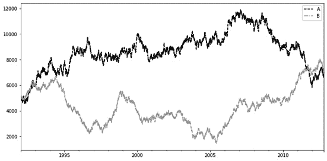

图 5.19 – 20 年期间虚构仪器 A 和 B 的价格显示图

大多数时间序列图表都是线性图，而其他图表类型提供了额外的见解。

### 绘制价格变化直方图

金融时间序列分析中通常的下一步是检查某段时间内的价格变化。

下面的代码块使用`pandas.DataFrame.shift(...)`和`pandas.DataFrame.fillna(...)`方法生成表示 1 天、5 天和 20 天内价格变化的六个新字段。由于移位而导致数据缺失，我们还删除了具有缺失数据的行，并将最终的 DataFrame 保存在 `time_series_delta` DataFrame 中：

```py
time_series['A_1_delta'] = \
time_series['A'].shift(-1) – time_series['A'].fillna(0)
time_series['B_1_delta'] = \
time_series['B'].shift(-1) – time_series['B'].fillna(0)
time_series['A_5_delta'] = \
time_series['A'].shift(-5) – time_series['A'].fillna(0)
time_series['B_5_delta'] = \
time_series['B'].shift(-5) – time_series['B'].fillna(0)
time_series['A_20_delta'] = \
time_series['A'].shift(-20) – time_series['A'].fillna(0)
time_series['B_20_delta'] = \
time_series['B'].shift(-20) – time_series['B'].fillna(0)
time_series_deltas = time_series[['A_1_delta', 'B_1_delta', 
                                  'A_5_delta', 'B_5_delta', 
                                  'A_20_delta', 
                                  'B_20_delta']].dropna()
time_series_deltas
```

DataFrame 包含以下内容：

```py
           A_1_delta    B_1_delta    A_5_delta    B_5_delta    A_20_delta    B_20_delta
1992-01-01     9.0    5.0   -49.0   118.0   -249.0   -56.0
1992-01-02   -91.0   69.0   -84.0   123.0   -296.0   -92.0
...            ...    ...     ...     ...      ...     ...
2012-10-01    88.0   41.0   -40.0  -126.0   -148.0   -84.0
2012-10-02   -10.0  -44.0   -71.0  -172.0   -187.0   -87.0
7581 rows × 6 columns
```

我们可以使用下面的代码块根据本章所学绘制`A`的价格变化直方图：

```py
time_series_delt's['A_20_de'ta'].plot(ki'd='h'st', 
                                      col'r='bl'ck', 
                                      alpha=0.5, 
                                      lab'l='A_20_de'ta', 
                                      figsize=(8,8))
time_series_delt's['A_5_de'ta'].plot(ki'd='h'st', 
                                     col'r='darkg'ay', 
                                     alpha=0.5, 
                                     lab'l='A_5_de'ta', 
                                     figsize=(8,8))
time_series_delt's['A_1_de'ta'].plot(ki'd='h'st', 
                                     col'r='lightg'ay', 
                                     alpha=0.5, 
                                     lab'l='A_1_de'ta', 
                                     figsize=(8,8))
plt.legend()
```

输出如下：

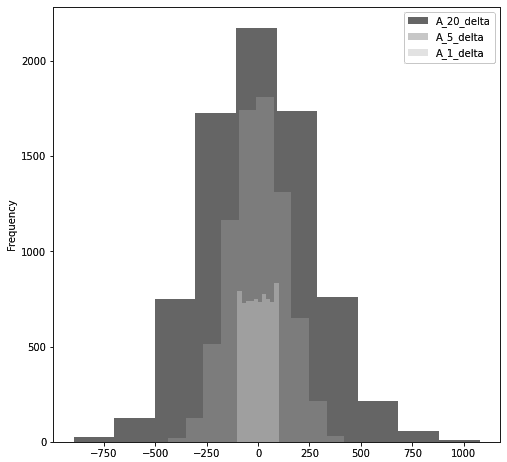

图 5.20 – A_1、A_5 和 A_20 三个值的直方图

直方图用于评估底层数据的概率分布。这个特定的直方图表明，`A_20` delta 具有最大的变异性，这是合理的，因为底层数据呈现出强烈的趋势。

### 创建价格变化密度图

我们还可以使用 KDE PDF 绘制价格变化的密度。

下面的代码块绘制了`B`的价格变化密度函数：

```py
time_series_deltas['B_20_delta'].plot(kind='kde', 
                                      linestyle='-', 
                                      linewidth=2, 
                                      color='black', 
                                      label='B_20_delta', 
                                      figsize=(8,8))
time_series_deltas['B_5_delta'].plot(kind='kde', 
                                     linestyle=':', 
                                     linewidth=2, 
                                     color='black', 
                                     label='B_5_delta', 
                                     figsize=(8,8))
time_series_deltas['B_1_delta'].plot(kind='kde', 
                                     linestyle='--', 
                                     linewidth=2, 
                                     color='black', 
                                     label='B_1_delta', 
                                     figsize=(8,8))
plt.legend()
```

输出如下：

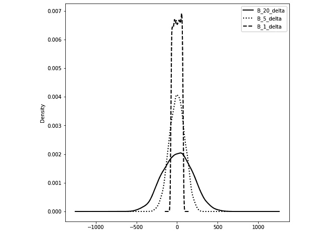

图 5.21 – B 在 1、5 和 20 天内价格变化的 KDE 密度图

KDE 密度图与直方图非常相似。与由离散箱子组成的直方图不同，KDE 是连续的线条。

### 创建区间的箱线图

我们可以按年度、季度、月度或周度等不同间隔分组每日价格，并使用箱线图显示这些价格的分布。

下面的代码首先使用`pandas.Grouper`对象指定年度周期性，然后将结果应用于`pandas.DataFrame.groupby(…)`方法以构建`pandas.DataFrameGroupBy`对象。最后，我们调用`pandas.DataFrameGroupBy.boxplot(...)`方法生成箱线图。我们指定`rot=90`参数以将 *x* 轴刻度标签旋转，使其更易读：

```py
group_A = time_series[['A']].groupby(pd.Grouper(freq='A'))
group_A.boxplot(color='black', subplots=False, rot=90, 
                figsize=(12,12))
```

输出如下：

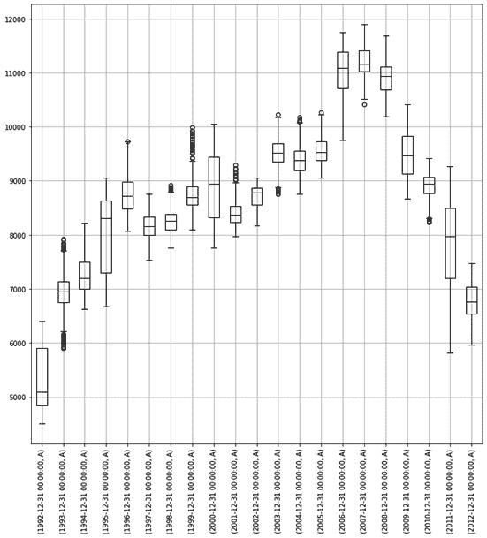

图 5.22 – 按年份分组的 A 的价格箱线图分布的图表

带有须的箱线图用于通过相应的四分位数可视化数值数据组：

+   箱子的下界对应于下四分位数，而箱子的上界表示组的上四分位数。

+   箱子内的线显示间隔的中值。

+   箱子下方的线结束于最低观测值。

+   箱子上方的线结束于最高观测值。

### 创建滞后散点图

我们可以使用`pandas.plotting.scatter_matrix(…)`方法可视化不同价格变化变量之间的关系：

```py
pd.plotting.scatter_matrix(time_series[['A_1_delta', 
                                        'A_5_delta', 
                                        'A_20_delta', 
                                        'B_1_delta', 
                                        'B_5_delta', 
                                        'B_20_delta']], 
                           diagonal='kde', color='black', 
                           alpha=0.25, figsize=(12, 12))
```

结果显示`(A_5_Delta 和 A_1_Delta)`、`(A_5_Delta 和 A_20_Delta)`、`(B_1_Delta 和 B_5_Delta)`以及`(B_5_Delta 和 B_20_Delta)`变量对之间存在一些线性关系：

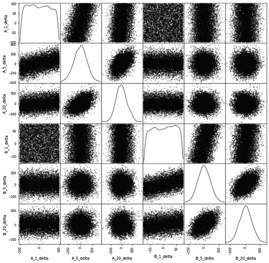

图 5.23 – A 和 B 价格变量的散点矩阵图

我们还可以使用`pandas.plotting.lag_plot(...)`方法，并使用不同的`lag=`值来指定不同水平的滞后，以生成`A`的价格与滞后价格之间的散点图：

```py
fig, (ax1, ax2, ax3) = plt.subplots(3, figsize=(12, 12))
pd.plotting.lag_plot(time_series['A'], ax=ax1, lag=1, 
                     c='black', alpha=0.2)
pd.plotting.lag_plot(time_series['A'], ax=ax2, lag=7, 
                     c='black', alpha=0.2)
pd.plotting.lag_plot(time_series['A'], ax=ax3, lag=20, 
                     c='black', alpha=0.2)
```

这生成了滞后值为 1、7 和 20 天的三个图：

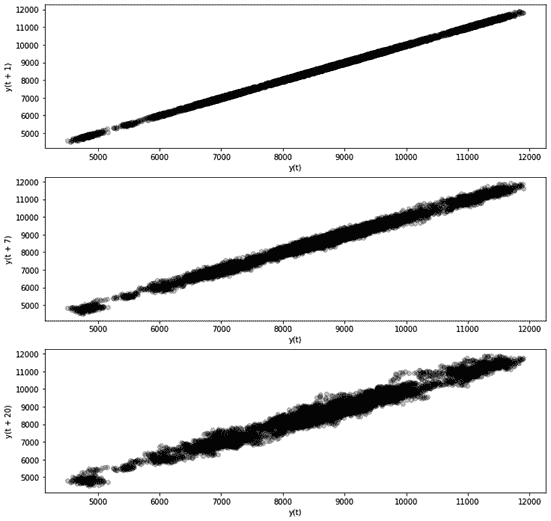

图 5.24 – A 的价格滞后 1、7 和 20 天的滞后图，显示马丁盖尔性质

对数图检查时间序列是否是没有任何趋势的随机的。对于随机时间序列，其滞后图显示没有结构。前述图表显示了明显的线性趋势；也就是说，我们可能成功地用自回归模型进行建模。

### 创建自相关图

自相关图可视化了特定时间点的价格与滞后若干期价格之间的关系。

我们可以使用`pandas.plotting.autocorrelation_plot(...)`方法将滞后值绘制在*x*轴上，将价格与指定值滞后的价格之间的相关性绘制在*y*轴上：

```py
fig, ax = plt.subplots(1, figsize=(12, 6))
pd.plotting.autocorrelation_plot(time_series['A'], ax=ax)
```

我们可以看到随着滞后值的增加，自相关逐渐恶化：

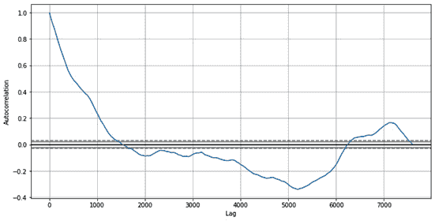

图 5.25 – 绘制滞后值与价格和指定值滞后的自相关之间关系的图表

自相关图总结了时间序列的随机性。对于随机时间序列，所有滞后相关性都会接近于 0。对于非随机时间序列，至少一个滞后相关性会显著非零。

# 摘要

在本章中，我们学习了如何使用 Matplotlib 创建 pandas DataFrame 的视觉上吸引人的图表。虽然我们可以计算许多数值统计量，但图表通常更快地提供更深入的洞察力。您应该尽可能绘制尽可能多的不同图表，因为每个图表都提供了数据的不同视角。

在下一章中，我们将学习如何在 Python 中执行统计测试并估计统计模型。
