# 第七章：*第六章*：统计估计、推断和预测

在本章中，我们通过概述关键示例来介绍 Python 中的四个主要统计库—`statsmodels`、`pmdarima`、`fbprophet` 和 `scikitlearn`。这些库用于对时间序列建模并提供它们的预测值，以及置信区间。此外，我们演示了如何使用分类模型来预测时间序列的百分比变化。

为此，我们将涵盖以下使用案例：

+   statsmodels 介绍

+   使用具有外生因素的**季节性自回归综合移动平均**（**SARIMAX**）时间序列模型与 pmdarima

+   使用 Facebook 的 Prophet 库进行时间序列预测

+   scikit-learn 回归和分类介绍

# 技术要求

本章使用的 Python 代码可在书籍的代码存储库的 `Chapter06 文件夹` 中找到。

# statsmodels 介绍

statsmodels 是一个 Python 库，允许我们探索数据、执行统计检验并估计统计模型。

本章重点介绍了 statsmodels 对时间序列的建模、分析和预测。

## 使用 Q-Q 图进行正态分布检验

许多统计学习技术的一个基本假设是观测值/字段是正态分布的。

虽然有许多用于正态分布的健壮统计检验方法，但一种直观的视觉方法被称为**分位数-分位数图**（**Q-Q 图**）。如果一个样本是正态分布的，它的 Q-Q 图是一条直线。

在下面的代码块中，使用 `statsmodels.graphics.api.qqplot(...)` 方法来检查 `numpy.random.uniform(...)` 分布是否是正态分布：

```py
from statsmodels.graphics.api import qqplot
import numpy as np
fig = qqplot(np.random.uniform(size=10000), line='s')
fig.set_size_inches(12, 6)
```

结果显示的图示了两个分布之间的非线性关系，这是预期的，因为我们使用了均匀分布：

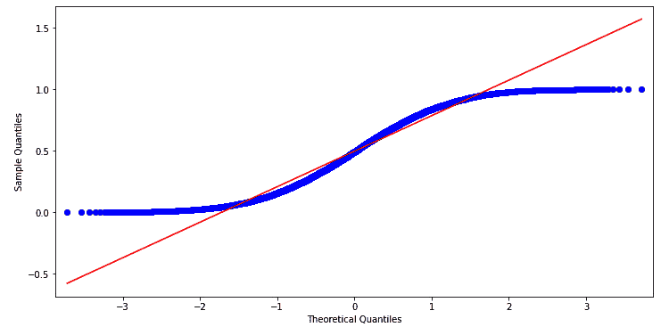

图 6.1 – 从均匀分布生成的数据集的 Q-Q 图

在下面的代码块中，我们重复测试，但这次使用 `numpy.random.exponential(...)` 分布作为我们的样本分布：

```py
fig = qqplot(np.random.exponential(size=10000), line='s')
fig.set_size_inches(12, 6)
```

结果显示的 Q-Q 图再次证实了两个分布之间的非正态关系，如下截图所示：

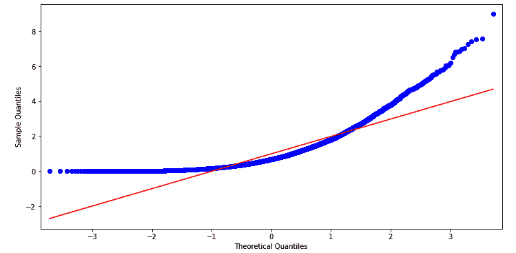

图 6.2 – 从指数分布生成的数据集的 Q-Q 图

最后，我们将从正态分布中挑选出 10,000 个样本，使用 `numpy.random.normal(...)` 方法，并使用 `qqplot(...)` 进行观察，如下代码片段所示：

```py
fig = qqplot(np.random.normal(size=10000), line='s')
fig.set_size_inches(12, 6)
```

结果是如预期的线性关系的图示，如下截图所示：

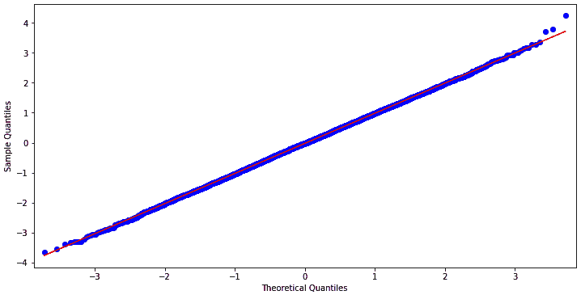

图 6.3 – 从标准正态分布中采样的 10,000 个样本的 Q-Q 图

Q-Q 图用于比较两个概率分布——其中一个最常见的是正态分布——通过将它们的分位数相互绘制来绘制它们之间的比较。前面的例子演示了通过视觉测试正态分布是多么容易。

## 使用 statsmodels 进行时间序列建模

时间序列是按时间顺序排列的一系列数值数据点。

处理时间序列数据的一个关键部分涉及处理日期和时间。

`statsmodels.api.tsa.datetools`模块提供了一些基本方法来生成和解析日期和日期范围，例如`dates_from_range(...)`。

在以下代码片段中，我们使用`length=12`参数从`2010`年开始以年度频率生成了 12 个`datetime.datetime`对象：

```py
import statsmodels.api as sm
sm.tsa.datetools.dates_from_range('2010', length=12)
```

这导致了以下`datetime`对象列表：

```py
 [datetime.datetime(2010, 12, 31, 0, 0),
  datetime.datetime(2011, 12, 31, 0, 0),
 ...
  datetime.datetime(2020, 12, 31, 0, 0),
  datetime.datetime(2021, 12, 31, 0, 0)]
```

在`dates_from_range(...)`方法中，日期的频率可以通过开始日期和一个特殊的格式来指定，其中`m1`后缀表示第一个月和月频率，`q1`表示第一个季度和季度频率，如下面的代码片段所示：

```py
sm.tsa.datetools.dates_from_range('2010m1', length=120)
```

这导致了以下月频率的`datetime`对象列表：

```py
 [datetime.datetime(2010, 1, 31, 0, 0),
  datetime.datetime(2010, 2, 28, 0, 0),
 ...
  datetime.datetime(2019, 11, 30, 0, 0),
  datetime.datetime(2019, 12, 31, 0, 0)]
```

现在让我们对一个时间序列执行**Error, Trend, Seasonality** (**ETS**)分析。

## 时间序列的 ETS 分析

时间序列的 ETS 分析将数据分解为三个不同的组件，如下所示：

+   **趋势**（trend）组件捕获了时间序列的总体趋势。

+   **季节性**（seasonality）组件捕获了周期性/季节性变化。

+   **误差**（error）组件捕获了数据中无法用其他两个组件捕获的噪声。

让我们使用`datetools.dates_from_range(...)`方法生成 20 年的月度日期作为 Pandas DataFrame 数据集的索引，如下所示：

```py
import pandas as pd
n_obs = 12 * 20
linear_trend = np.linspace(100, 200, num=n_obs)
cycle = np.sin(linear_trend) * 10
error_noise = np.random.randn(n_obs)
dataset = \
pd.DataFrame(
    linear_trend + cycle + error_noise, 
    index=sm.tsa.datetools.dates_from_range('2000m1', 
                                            length=n_obs), 
    columns=['Price'])
dataset
```

结果是以下包含 ETS 组件的`Price`字段的 DataFrame：

```py
                   Price
2000-01-31     96.392059
2000-02-29     99.659426
       ...           ...
2019-11-30    190.067039
2019-12-31    190.676568
240 rows × 1 columns
```

让我们可视化我们生成的时间序列数据集，如下所示：

```py
import matplotlib.pyplot as plt
dataset.plot(figsize=(12, 6), color='black')
```

生成的时间序列数据集具有明显的线性增长趋势，其中夹杂着季节性组件，如下截图所示：

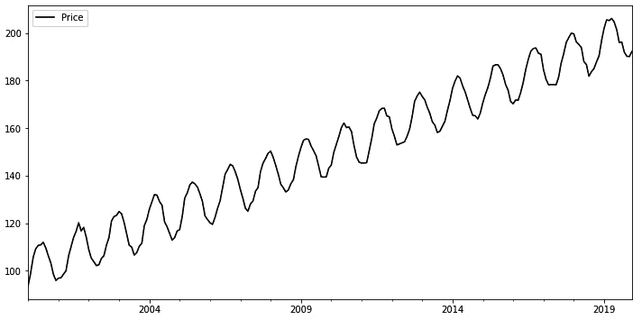

图 6.4 – 显示具有 ETS 组件的合成价格的图表

在上一张截图中，我们清楚地看到了季节性组件——从中位数值上下波动。我们还看到了误差噪声，因为波动不是完美的。最后，我们看到数值正在增加——趋势组件。

### Hodrick-Prescott 滤波器

在`statsmodels`中，这被实现为`statsmodels.api.tsa.filters.hpfilter(...)`。

让我们使用 `lamb=129600` 平滑参数进行分解（值 `129600` 是月度数据的推荐值）。我们使用返回的一对系列值生成一个 DataFrame，其中包含 `Price`、`hp_cycle` 和 `hp_trend` 字段，以表示价格、季节性组件和趋势组件，如下面的代码片段所示：

```py
hp_cycle, hp_trend = \
sm.tsa.filters.hpfilter(dataset['Price'], lamb=129600)
decomp = dataset[['Price']]
decomp['HP_Cycle'] = hp_cycle
decomp['HP_Trend'] = hp_trend
decomp
```

`decomp` DataFrame 包含以下数据：

```py
                   Price     HP_Cycle      HP_Trend
2000-01-31     96.392059    -4.731153    101.123212
2000-02-29     99.659426    -1.839262    101.498688
       ...           ...          ...           ...
2019-11-30    190.067039    -8.350371    198.417410
2019-12-31    190.676568    -8.107701    198.784269
240 rows × 3 columns
```

在下一节中，我们将查看 `UnobservedComponents` 模型。

### UnobservedComponents 模型

将时间序列分解为 ETS 组件的另一种方法是使用 `statsmodels.api.tsa.UnobservedComponents` 对象。

`UnobservedComponentsResults.summary(...)` 方法生成模型的统计信息，如下所示：

```py
uc = sm.tsa.UnobservedComponents(dataset['Price'], 
                                 level='lltrend', 
                                 cycle=True, 
                                 stochastic_cycle=True)
res_uc = uc.fit(method='powell', disp=True)
res_uc.summary()
```

输出包含模型的详细信息，如下所示的代码块所示：

```py
Optimization terminated successfully.
         Current function value: 2.014160
         Iterations: 6
         Function evaluations: 491
Unobserved Components Results
Dep. Variable:              Price No. Observations:    240
        Model: local linear trend  Log Likelihood  -483.399
               + stochastic cycle             AIC   976.797
         Date:   Fri, 12 Jun 2020             BIC   994.116
         Time:           08:09:46            HQIC  983.779
       Sample:         01-31-2000        
                     - 12-31-2019        
Covariance Type:              opg        
                   coef std err      z  P>|z| [0.025 0.975]
sigma2.irregular  0.4962  0.214  2.315  0.021  0.076  0.916
sigma2.level  6.954e-17  0.123  5.63e-16 1.000 -0.242 0.242
sigma2.trend  2.009e-22 4.03e-05 4.98e-18 1.000 -7.91e-05  7.91e-05
sigma2.cycle     1.5485  0.503   3.077  0.002  0.562  2.535
frequency.cycle  0.3491  0.013  27.768  0.000  0.324  0.374
Ljung-Box (Q):         347.56    Jarque-Bera (JB):    0.42
Prob(Q):                 0.00            Prob(JB):    0.81
Heteroskedasticity (H):  0.93                Skew:   -0.09
Prob(H) (two-sided):     0.73            Kurtosis:    2.91
```

我们可以使用 `resid`、`cycle.smoothed` 和 `level.smoothed` 属性访问 ETS/周期性组件，并将它们添加到 `decomp` DataFrame 中，如下所示：

```py
decomp['UC_Cycle'] = res_uc.cycle.smoothed
decomp['UC_Trend'] = res_uc.level.smoothed
decomp['UC_Error'] = res_uc.resid
decomp
```

`decomp` DataFrame 现在包含以下新列，其中包含来自 `UnobservedComponents` 模型的 `Cycle`、`Trend` 和 `Error` 项：

```py
              ...        UC_Cycle    UC_Trend    UC_Error
2000-01-31    ...       -3.358954   99.743814   96.392059
2000-02-29    ...       -0.389834  100.163434    6.173967
       ...    ...             ...         ...         ...
2019-11-30    ...       -9.725420  199.613395    1.461497
2019-12-31    ...       -9.403885  200.033015    0.306881
240 rows × 6 columns
```

接下来，我们将查看 `statsmodel.tsa.seasonal.seasonal_decompose(…)` 方法。

### `statsmodels.tsa.seasonal.seasonal_decompose(...)` 方法

执行 ETS 分解的另一种方法是使用 `statsmodels.tsa.seasonal.seasonal_decompose(...)` 方法。

下面的代码块使用加法模型，通过指定 `model='additive'` 参数，并且通过访问 `DecomposeResult` 对象中的 `season`、`trend` 和 `resid` 属性，将 `SDC_Cycle`、`SDC_Trend` 和 `SDC_Error` 列添加到 `decomp` DataFrame 中：

```py
from statsmodels.tsa.seasonal import seasonal_decompose
s_dc = seasonal_decompose(dataset['Price'], 
                          model='additive')
decomp['SDC_Cycle'] = s_dc.seasonal
decomp['SDC_Trend'] = s_dc.trend
decomp['SDC_Error'] = s_dc.resid
decomp[118:122]
```

`decomp` DataFrame 现在有了三个附加字段及其值，如下面的代码块所示：

```py
              ...    SDC_Cycle     SDC_Trend    SDC_Error
2009-11-30    ...     0.438633    146.387392    -8.620342
2009-12-31    ...     0.315642    147.240112    -6.298764
2010-01-31    ...     0.228229    148.384061    -3.538544
2010-02-28    ...     0.005062    149.912202    -0.902362
```

接下来，我们将绘制前面各节得到的各种结果。

### 绘制 HP 过滤器结果、UnobservedComponents 模型和 seasonal_decompose 方法的结果

让我们绘制从 `HP` 过滤器、`UnobservedComponents` 模型和 `seasonal_decompose` 方法中提取的趋势组件，如下所示：

```py
plt.title('Trend components')
decomp['Price'].plot(figsize=(12, 6), color='black', 
                     linestyle='-', legend='Price')
decomp['HP_Trend'].plot(figsize=(12, 6), color='darkgray', 
                        linestyle='--', lw=2, 
                        legend='HP_Trend')
decomp['UC_Trend'].plot(figsize=(12, 6), color='black', 
                        linestyle=':', lw=2, 
                        legend='UC_Trend')
decomp['SDC_Trend'].plot(figsize=(12, 6), color='black', 
                         linestyle='-.', lw=2, 
                         legend='SDC_Trend')
```

这给我们提供了以下图表，趋势组件与原始价格并排绘制。所有三个模型都很好地识别了总体上升的趋势，`seasonal_decompose(...)` 方法捕捉到了一些非线性/周期性的趋势组件，除了总体上线性增长的趋势之外：

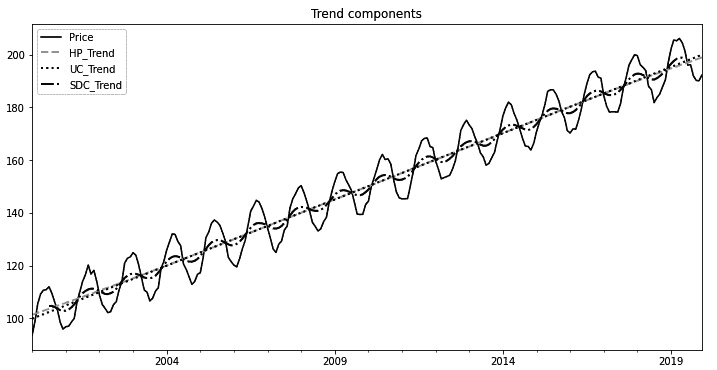

图 6.5 - 显示从不同 ETS 分解方法中提取的趋势组件

下面的代码块绘制了从三个模型中获取的循环/季节性组件：

```py
plt.title('Cycle/Seasonal components')
decomp['HP_Cycle'].plot(figsize=(12, 6), color='darkgray', 
                        linestyle='--', lw=2, 
                        legend='HP_Cycle')
decomp['UC_Cycle'].plot(figsize=(12, 6), color='black', 
                        linestyle=':', lw=2, 
                        legend='UC_Cycle')
decomp['SDC_Cycle'].plot(figsize=(12, 6), color='black', 
                        linestyle='-.', lw=2, 
                        legend='SDC_Cycle')
```

以下结果显示，`seasonal_decompose(...)` 方法生成了具有非常小波动的季节性组件，这是因为一些季节性组件的部分已经内置到我们之前看到的趋势图中：

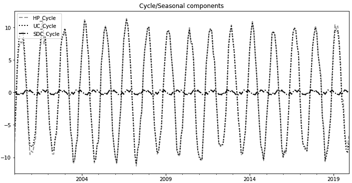

图 6.6 - 显示通过不同 ETS 分解方法提取的周期/季节性组件的图表

最后，我们将通过使用差分方法将我们的数据集可视化为一个平稳数据集，如下所示：

```py
plt.title('Error components')
plt.ylim((-20, 20))
decomp['UC_Error'].plot(figsize=(12, 6), color='black', 
                        linestyle=':', lw=2, 
                        legend='UC_Error')
decomp['SDC_Error'].plot(figsize=(12, 6), color='black',
                         linestyle='-.', lw=2, 
                         legend='SDC_Error')
```

输出如下屏幕截图所示：

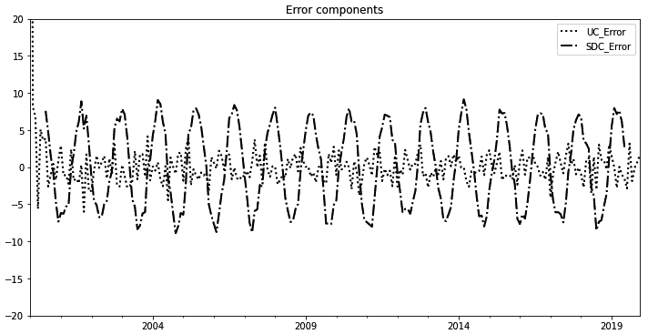

图 6.7 - 显示来自不同 ETS 分解模型的误差项的图表

前面屏幕截图中显示的图表显示了误差项围绕`0`振荡，并且它们没有明显的趋势。

## 时间序列的平稳的增广迪基-富勒测试

平稳时间序列是指其统计属性，如均值、方差和自相关在时间上保持恒定。许多统计预测模型假设时间序列数据集可以通过一些数学操作（如差分）转换为平稳数据集。

增广迪基-富勒（**ADF**）测试用于检查数据集是否平稳 - 它计算数据集不平稳的可能性，当该概率（*p 值*）非常低时，我们可以得出结论数据集是平稳的。我们将在以下章节中详细介绍详细步骤。

### 第一步 - 对价格进行 ADF 测试

让我们检查平稳性，并通过使用差分方法将我们的数据集转换为一个平稳数据集。我们从`statsmodels.tsa.stattools.adfuller（...）`方法开始，如以下代码片段所示：

```py
from statsmodels.tsa.stattools import adfuller
result = adfuller(dataset['Price'])
print('Test Stat: {}\np value: {}\nLags: {}\nNum \
       observations: {}'.format(result[0], result[1], 
                                result[2], result[3]))
```

将其应用于`Price`字段时，输出如下值。 `Test`统计量为正值，p 值为 98％，这意味着有强有力的证据表明`Price`字段不是平稳的。我们知道这是预期的，因为`Price`字段中有强趋势和季节性组件：

```py
Test Stat: 0.47882793726850786
p value: 0.9842151821849324
Lags: 14
Num observations: 225
```

### 第二步 - 对价格进行第一阶差分

接下来，我们应用**第一阶差分**转换；这从一个观测到下一个观测中找到第一个差异。如果我们再次对差分数据集进行差分，则会产生**第二阶差分**，依此类推。

我们将一阶差分的`pandas.Series`数据集存储在`price_diff`变量中，如下面的代码块所示：

```py
price_diff = \
(dataset['Price'].shift(-1) - dataset['Price']).fillna(0)
price_diff
```

该数据集包含以下数值：

```py
2000-01-31    4.951062
2000-02-29    5.686832
                 ...
2019-11-30    3.350694
2019-12-31    0.000000
Name: Price, Length: 240, dtype: float64
```

### 第三步 - 对价格进行差分的 ADF 测试

现在，我们对转换后的数据集重新运行 ADF 测试，以检查是否具有平稳性，如下所示：

```py
result = adfuller(price_diff)
print('Test Stat: {}\np value: {}\nLags: {}\nNum \
      observations: {}'.format(result[0], result[1], 
                               result[2], result[3]))
```

现在，测试统计量具有较大的负值（值小于-4 的值具有非常高的平稳性可能性）。现在不平稳的概率现在降低到极低的值，表明转换后的数据集是平稳的，如以下代码片段所示：

```py
Test Stat: -7.295184662866956
p value: 1.3839111942229784e-10
Lags: 15
Num observations: 224
```

## 时间序列的自相关和偏自相关

自相关或串行相关是观察值与延迟副本自身的关联性。它衡量当前观察值是否与未来/过去的值有关系。

在我们具有明显线性趋势和一些季节性组分的数据集中，随着滞后数的增加，自相关缓慢减小，但对于较小的滞后值，由于总体线性趋势较大，数据集具有较高的自相关值。`statsmodels.graphics.tsaplots.plot_acf(...)` 方法绘制了`Price`字段与滞后值从`0`到`100`的自相关，如下代码片段所示：

```py
from statsmodels.graphics.tsaplots import plot_acf, plot_pacf
fig = plot_acf(dataset['Price'], lags=100)
fig.set_size_inches(12, 6)
```

结果表明，自相关在约 36 的滞后值附近仍然相对较强，在这里它低于 0.5。如下截图所示：

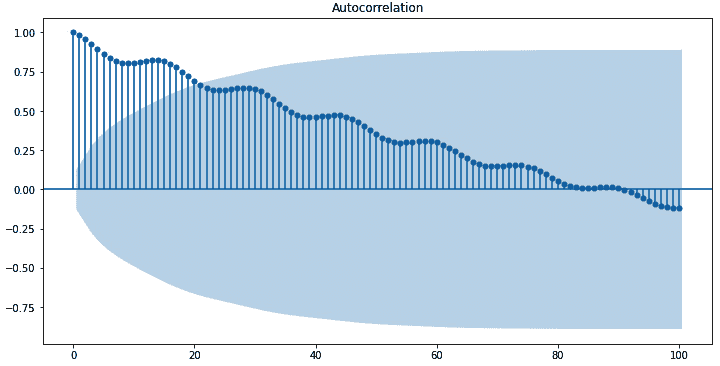

图 6.8 – 自相关图显示自相关与不同滞后值的关系

`statsmodels.graphics.tsaplots.plot_pacf(…)` 方法让我们可以绘制偏自相关值与不同滞后值之间的关系图。自相关和偏自相关的区别在于，偏自相关只使用与前一个滞后期观测值的相关性，并且消除了低滞后值的相关性效应。该方法在以下代码片段中显示：

```py
fig = plot_pacf(dataset['Price'], lags=100)
fig.set_size_inches(12, 6)
```

输出结果如下截图所示：

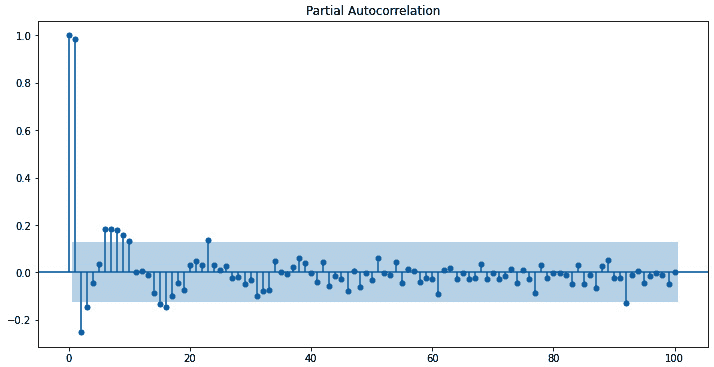

图 6.9 – 偏自相关图显示偏自相关与滞后值的关系

在前面的截图中显示的图形在前两个滞后项之后急剧下降，并且在每 10 个滞后项之后季节性地从正值变为负值。

## ARIMA 时间序列模型

**自回归积分滑动平均**（**ARIMA**）模型是最知名的时间序列建模和预测模型之一。它用于预测具有相关数据点的时间序列数据。

ARIMA 模型由三个组成部分组成，如下所述：

+   `p` 参数，指定要使用的滞后数。根据自相关图，当对`Price`系列进行 ARIMA 建模时，我们将指定 `p=36`。

+   `d` 参数，指定要执行的差分阶数，在我们的情况下将是 `d=1`。正如我们在*时间序列的增广迪基-富勒检验稳定性*部分所看到的，一阶差分导致了一个稳定的数据集。

+   `q`，即 MA 窗口的大小。在我们的情况下，我们将根据偏自相关图设置此参数，并使用 `q=2` 的值，因为在滞后值为 `1` 之后，偏自相关急剧下降。

在 statsmodels 中，`statsmodels.tsa.arima.model.ARIMA`模型将时间序列构建为 ARIMA 模型。使用`order=(36, 1, 2)`参数，我们指定了`p=36`，`d=1`和`q=2`。然后，我们调用`ARIMA.fit(...)`方法将模型拟合到我们的`Price`系列，并调用`ARIMA.summary(...)`方法输出有关拟合的 ARIMA 模型的信息。

一些其他的包——例如，`pmdarima`——提供了`auto_arima`方法，可以自动找到 ARIMA 模型，如下面的代码片段所示：

```py
from statsmodels.tsa.arima.model import ARIMA
arima = ARIMA(dataset['Price'], order=(36,1,2))
res_ar = arima.fit()
res_ar.summary()
```

以下输出描述了拟合参数：

```py
SARIMAX Results
Dep. Variable:           Price  No. Observations:       240
        Model:  ARIMA(36, 1, 2)    Log Likelihood  -360.195
         Date: Sat, 13 Jun 2020               AIC   798.391
         Time:       09:18:46                 BIC   933.973
       Sample:     01-31-2000                HQIC   853.027
                 - 12-31-2019        
Covariance Type:          opg        
          coef  std err      z   P>|z|   [0.025    0.975]
ar.L1  -0.8184    0.821  -0.997  0.319   -2.428     0.791
ar.L2  -0.6716    0.495  -1.358  0.175   -1.641     0.298
...
ar.L35  0.3125    0.206   1.514  0.130   -0.092     0.717
ar.L36  0.1370    0.161   0.851  0.395   -0.178     0.452
ma.L1  -0.0244    0.819  -0.030  0.976   -1.630     1.581
ma.L2   0.1694    0.454   0.373  0.709   -0.721     1.060
sigma2  1.0911    0.144   7.586  0.000    0.809     1.373
           Ljung-Box (Q):  13.99  Jarque-Bera (JB):  1.31
                 Prob(Q):  1.00           Prob(JB):  0.52
  Heteroskedasticity (H):  1.15               Skew:  0.09
     Prob(H) (two-sided):  0.54           Kurtosis:  2.69
```

使用`statsmodels.tsa.arima.ARIMAResults.predict(...)`方法，我们可以使用拟合的模型预测指定起始和结束日期指数（在本例中是整个数据集）上的值。我们将预测的价格保存在`PredPrice`字段中，以便稍后进行比较。代码如下所示：

```py
dataset['PredPrice'] = res_ar.predict(dataset.index[0], 
                                      dataset.index[-1])
dataset
```

结果将添加新列并显示预测价格，如下所示：

```py
                  Price        PredPrice
2000-01-31    95.317833         0.000000
2000-02-29    100.268895       95.317901
       ...           ...             ...
2019-11-30    188.524009      188.944216
2019-12-31    191.874704      190.614641
240 rows × 2 columns
```

现在，我们将在下面的代码块中绘制原始`Price`和`PredPrice`字段，以便进行视觉比较：

```py
plt.ylim(70, 250)
dataset['Price'].plot(figsize=(12, 6), color='darkgray',
                      linestyle='-', lw=4, legend='Price')
dataset['PredPrice'].plot(figsize=(12, 6), color='black', 
                          linestyle='-.', 
                          legend='PredPrice')
```

预测价格相当准确，这是因为指定的参数(`p`, `d`, `q`)是精确的。结果可以在下面的截图中看到：

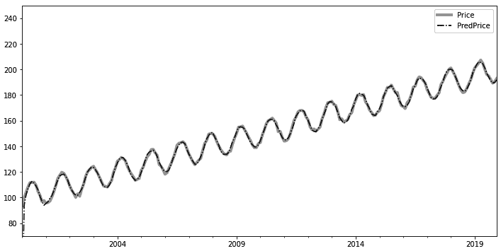

图 6.10 – 比较原始价格和 ARIMA(36, 1, 2)模型预测价格的绘图

让我们使用这个拟合的模型来预测未来日期的值。首先，我们使用`datetools.dates_from_range(...)`方法和`pandas.DataFrame.append(...)`方法构建一个包含另外 4 年的日期索引且没有数据（将使用`NaN`值填充）的`extended_dataset` DataFrame，如下所示：

```py
extended_dataset = pd.DataFrame(index=sm.tsa.datetools.dates_from_range('2020m1', length=48))
extended_dataset = dataset.append(extended_dataset)
extended_dataset
                  Price        PredPrice
2000-01-31    95.317833         0.000000
2000-02-29    100.268895       95.317901
       ...           ...             ...
2023-11-30           NaN             NaN
2023-12-31           NaN             NaN
288 rows × 2 columns
```

接着，我们可以再次调用`ARIMAResults.predict(...)`方法，为整个时间序列生成预测价格，从而对我们添加的新日期进行预测，如下所示：

```py
extended_dataset['PredPrice'] = \
res_ar.predict(extended_dataset.index[0], 
               extended_dataset.index[-1])
extended_dataset
                  Price        PredPrice
2000-01-31     95.317833        0.000000
2000-02-29    100.268895       95.317901
       ...           ...             ...
2023-11-30           NaN      215.441777
2023-12-31           NaN      220.337355
288 rows × 2 columns
```

以下代码块绘制了`extended_dataset` DataFrame 中的最后 100 个观测值：

```py
extended_dataset['Price'].iloc[-100:].plot(figsize=(12, 6), 
                                          color='darkgray', 
                                          linestyle='-', 
                                          lw=4, 
                                          legend='Price')
extended_dataset['PredPrice'].iloc[-100:].plot(figsize=(12, 6), 
                                        color='black', 
                                        linestyle='-.', 
                                        legend='PredPrice')
```

这样就得到了一个包含预测的`PredPrice`值的绘图，如下面的截图所示：

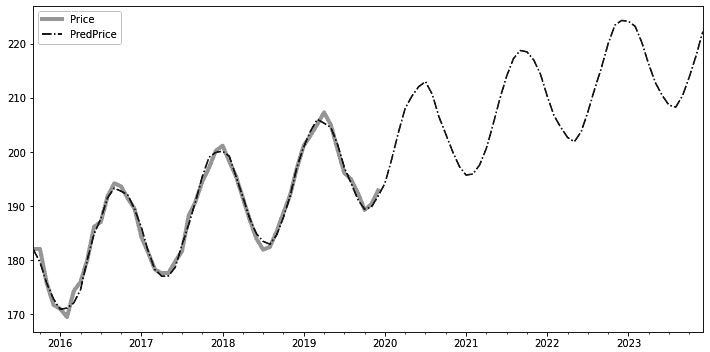

图 6.11 – ARIMA 模型预测的历史和预测价格

在前面截图中显示的图中，预测价格明显遵循过去价格的趋势。

# 使用 pmdarima 的 SARIMAX 时间序列模型

**SARIMA**是 ARIMA 模型的扩展，用于具有季节性成分的单变量时间序列。

**SARIMAX**，是模型的名称，同时支持**外生**变量。

这些是三个 ARIMA 参数：

+   `p` = 趋势自回归阶数

+   `d` = 趋势差分阶数

+   `q` = 趋势移动平均阶数

除了前面的参数之外，SARIMA 还引入了另外四个参数，如下所示：

+   `P` = 季节性自回归阶数

+   `D` = 季节性差分阶数。

+   `Q` = 季节性 MA 阶数。

+   `m` = 单个季节周期的长度，以时间步数表示。

手动查找这些参数可能会耗费时间，使用自动 ARIMA 模型可能更有优势。

在 Python 中，auto-ARIMA 建模由 `pmdarima` 库提供。其文档可在 [`alkaline-ml.com/pmdarima/index.html`](http://alkaline-ml.com/pmdarima/index.html) 上找到。

安装很简单，如下所示：

```py
pip install pmdarima
```

自动 ARIMA 模型试图通过进行各种统计测试来自动发现 SARIMAX 参数，如下所示：

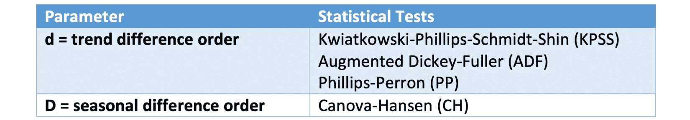

图 6.12 – 各种统计检验的表格。

一旦找到最佳的 `d` 值，auto-ARIMA 模型将在由 `start_p`、`max_p`、`start_q` 和 `max_q` 定义的范围内搜索最适合的模型。如果启用了 `seasonal` 参数，则一旦确定最佳的 `D` 值，我们就会使用类似的程序来找到 `P` 和 `Q`。

最佳模型通过最小化信息准则的值确定（**阿卡奇信息准则** (**AIC**), **校正 AIC**, **贝叶斯信息准则** (**BIC**), **Hannan-Quinn 信息准则** (**HQC**), 或 **袋外** (**OOB**)—用于验证评分—分别）。

如果未找到合适的模型，auto-ARIMA 将返回 `ValueError` 输出。

让我们使用前面的数据集进行自动 ARIMA。时间序列具有明显的季节性分量，周期为 12。

请注意下面的代码块中，我们为预测值生成了 95%的置信区间，这对于交易规则非常有用，例如，如果价格高于上限置信区间值，则卖出：

```py
import pmdarima as pm
model = pm.auto_arima(dataset['Price'], seasonal=True, 
                      stepwise=True, m=12)
print(model.summary())
extended_dataset = \
pd.DataFrame(
    index=sm.tsa.datetools.dates_from_range('2020m1', 
    length=48))
extended_dataset['PredPrice'], conf_int = \
model.predict(48, return_conf_int=True, alpha=0.05)
plt.plot(dataset['Price'], c='blue')
plt.plot(extended_dataset['PredPrice'], c='green')
plt.show()
print(extended_dataset)
print(conf_int)
```

输出如下所示：

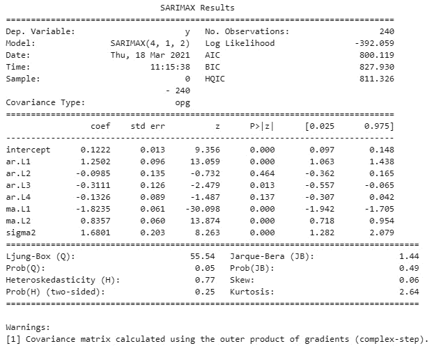

图 6.13 – SARIMAX 结果来自自动 ARIMA 的统计数据。

图中显示如下的截图：

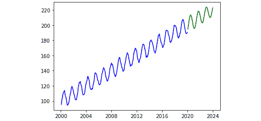

图 6.14 – 自动 ARIMA 模型预测的历史和预测价格预测。

输出还包括预测价格，如下所示：

```py
             PredPrice
2020-01-31  194.939195
       ...         ...
2023-12-31  222.660698
[48 rows x 1 columns]
```

另外，输出提供了每个预测价格的置信区间，如下所示：

```py
[[192.39868933 197.4797007 ]
 [196.80033117 202.32443987]
 [201.6275806  207.60042584]
...
 [212.45091331 225.44676173]
 [216.11548707 229.20590827]]
```

现在我们将看到使用 Facebook 的 Prophet 库进行时间序列预测。

# 使用 Facebook 的 Prophet 库进行时间序列预测。

Facebook Prophet 是一个用于预测单变量时间序列的 Python 库，对季节性和节假日效应提供了强大的支持。它特别适用于具有频繁变化趋势的时间序列，并且足够强大以处理异常值。

更具体地说，`Prophet` 模型是一个具有以下属性的加法回归模型：

+   分段线性或逻辑增长趋势。

+   年度季节性分量采用傅里叶级数模拟。

+   用虚拟变量建模的每周季节性分量。

+   用户提供的节假日列表

`Prophet` 的安装更加复杂，因为它需要编译器。 安装它的最简单方法是使用 Anaconda，如下所示：

```py
conda install -c conda-forge fbprophet
```

附带的 Git 存储库包含了带有 `Prophet` 的 `conda` 环境设置。

`Prophet` 库要求输入的 DataFrame 包含两列—`ds` 代表日期，`y` 代表值。

让我们将 `Prophet` 模型拟合到以前的数据集中。请注意在以下代码片段中，我们明确告诉 `Prophet` 我们希望获得每月的预测值 (`freq='M'`)：

```py
from fbprophet import Prophet
prophet_dataset = \
dataset.rename(columns={'Price' : 'y'}).rename_axis('ds')\
.drop('PredPrice', 1).reset_index()
print(prophet_dataset)
model = Prophet()
model.fit(prophet_dataset)
df_forecast = model.make_future_dataframe(periods=48, 
                                          freq='M')
df_forecast = model.predict(df_forecast)
print(df_forecast[['ds', 'yhat', 'yhat_lower', 
                   'yhat_upper']].tail())
model.plot(df_forecast, xlabel='Date', ylabel='Value')
model.plot_components(df_forecast)
```

预测值与 SARIMAX 模型非常相似，可以在此处看到：

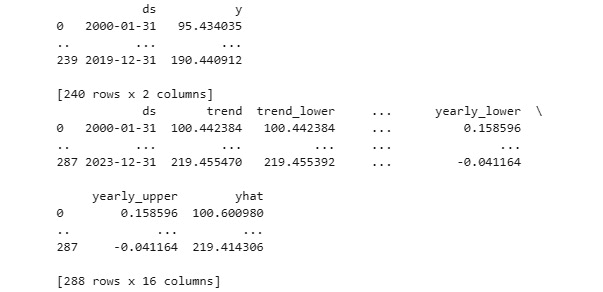

图 6.15 – Prophet 库的输出包括预测值，以及模型组件的值

预测值存储在 `yhat` 列中，其中包含了 `yhat_lower` 和 `yhat_upper` 置信区间。

`Prophet` 确实生成了 Prophet 组件的图表，这对于理解模型的预测能力非常有用。 一个趋势组件图表可以在这里看到：

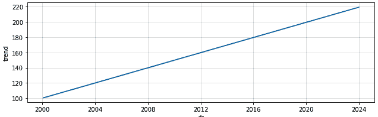

图 6.16 – Prophet 模型的趋势组件图表

以下截图显示了年度季节性的输出：

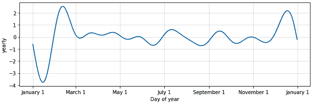

图 6.17 – Prophet 模型的年度季节性组件图表

这是预测图表的输出：

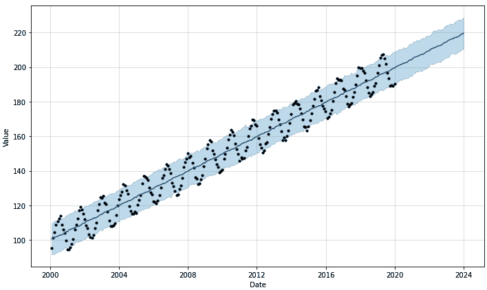

图 6.18 – Prophet 模型的预测图表及置信区间

每个时间序列模型都略有不同，并且最适合不同类别的时间序列。 但总的来说，`Prophet` 模型非常稳健，并且在大多数情况下最容易使用。

# scikit-learn 回归和分类简介

`scikit-learn` 是一个基于`numpy`和`scipy`库构建的 Python *监督* 和 *无监督* 机器学习库。

让我们演示如何使用 `scikit-learn` 中的 `RidgeCV` 回归和分类来预测价格变化。

## 生成数据集

让我们从生成以下示例所需的数据集开始—一个包含了 20 年每日数据的 Pandas DataFrame，其中包含了`BookPressure`、`TradePressure`、`RelativeValue`和`Microstructure`字段来表示一些基于该数据集构建的合成交易信号（也被称为`PriceChange`字段代表我们试图预测的价格每日变化（也被称为`PriceChange`字段一个线性函数，并带有一些随机权重和一些随机噪声。`Price`字段代表使用`pandas.Series.cumsum(...)`方法生成的工具的实际价格。 以下代码段中可以看到代码：

```py
import numpy as np
import pandas as pd
df = pd.DataFrame(index=pd.date_range('2000', '2020'))
df['BookPressure'] = np.random.randn(len(df)) * 2
df['TradePressure'] = np.random.randn(len(df)) * 100
df['RelativeValue'] = np.random.randn(len(df)) * 50
df['Microstructure'] = np.random.randn(len(df)) * 10
true_coefficients = np.random.randint(low=-100, high=101,
                                      size=4) / 10
df['PriceChange'] = ((df['BookPressure'] * true_coefficients[0])
+ (df['TradePressure'] * true_coefficients[1])
+ (df['RelativeValue'] * true_coefficients[2])
+ (df['Microstructure'] * true_coefficients[3])
+ (np.random.randn(len(df)) * 200))
df['Price'] = df['PriceChange'].cumsum(0) + 100000
```

让我们快速检查分配给我们四个特征的真实权重，如下所示：

```py
true_coefficients
array([10\. ,  6.2, -0.9,  5\. ])
```

让我们还检查包含所有数据的 DataFrame，如下所示：

```py
Df
            BookPressure  TradePressure  RelativeValue  Microstructure  PriceChange  Price
2000-01-01  4.545869  -2.335894  5.953205  -15.025576  -263.749500  99736.250500
2000-01-02  -0.302344  -186.764283  9.150213  13.795346  -758.298833  98977.951667
...    ...      ...      ...      ...      ...      ...
2019-12-31  -1.890265  -113.704752  60.258456  12.229772  -295.295108  182827.332185
2020-01-01  1.657811  -77.354049  -39.090108  -3.294086  -204.576735  182622.755450
7306 rows × 6 columns
```

让我们视觉检查`Price`字段，如下所示：

```py
df['Price'].plot(figsize=(12, 6), color='black',
                 legend='Price')
```

图中显示了 20 年来以下逼真的价格演变：

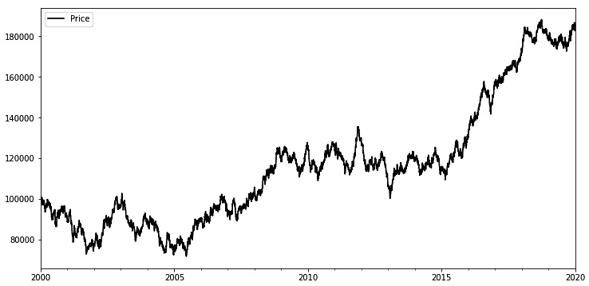

图 6.19 – 合成数据集的价格图

让我们显示除`Price`列之外的所有列的散点矩阵，如下所示：

```py
pd.plotting.scatter_matrix(df.drop('Price', axis=1), 
                           color='black', alpha=0.2, 
                           grid=True, diagonal='kde', 
                           figsize=(10, 10))
```

输出如下所示：

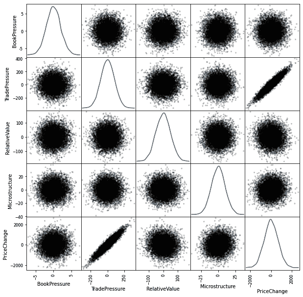

图 6.20 – 合成数据集的散点矩阵

散点矩阵显示`PriceChange`与`TradePressure`之间存在强关系。

## 在数据集上运行 RidgeCV 回归

让我们使用 scikit-learn 回归方法将线性回归模型拟合到我们的数据集。我们将使用四个特征尝试拟合和预测`PriceChange`字段。

首先，我们将特征和目标收集到一个 DataFrame 和一个 Series 中，如下所示：

```py
features = df[['BookPressure', 'TradePressure', 
               'RelativeValue', 'Microstructure']]
target = df['PriceChange']
```

我们将使用`sklearn.linear_model.RidgeCV`，一个带有 L2 正则化的线性回归模型（使用 L2 范数惩罚因子以避免过拟合），该模型使用交叉验证学习最佳系数。我们将使用`sklearn.linear_model.RidgeCV.fit(...)`方法使用特征拟合目标值。代码如下所示：

```py
from sklearn.linear_model import RidgeCV
ridge = RidgeCV()
ridge.fit(features, target)
```

结果是一个`RidgeCV`对象，如下所示：

```py
RidgeCV(alphas=array([ 0.1,  1\. , 10\. ]), cv=None,
                     fit_intercept=True, gcv_mode=None, 
                     normalize=False, scoring=None, 
                     store_cv_values=False)
```

我们可以使用`RidgeCV.coef_`属性访问`Ridge`模型学到的权重/系数，并将其与实际系数进行比较，如下所示：

```py
true_coefficients, ridge.coef_
```

模型学到的系数似乎非常接近真实权重，每个系数都有一些误差，如下所示：

```py
(array([10\. ,  6.2, -0.9,  5\. ]),
 array([11.21856334, 6.20641632, -0.93444009, 4.94581522]))
```

`RidgeCV.score(...)`方法返回 R2 分数，表示拟合模型的准确性，如下所示：

```py
ridge.score(features, target)
```

这返回以下 R2 分数，最大值为 1，因此该模型相当适合数据：

```py
0.9076861352499385
```

`RidgeCV.predict(...)`方法输出预测的价格变化值，我们将其与`pandas.Series.cumsum(...)`方法相结合，生成预测的价格系列，然后将其保存在`PredPrice`字段中，如下所示：

```py
df['PredPrice'] = \
ridge.predict(features).cumsum(0) + 100000; df
```

这将在我们的 DataFrame 中添加一个新列，如下所示：

```py
            ...         Price       PredPrice
2000-01-01  ...  99736.250500    99961.011495
2000-01-02  ...  98977.951667    98862.549185
    ...     ...           ...             ...
2019-12-31  ...  182827.332185  183059.625653
2020-01-01  ...  182622.755450  182622.755450
7306 rows × 7 columns
```

在以下代码块中，将真实的`Price`字段与预测的`PredPrice`字段一起绘制：

```py
df['Price'].plot(figsize=(12, 6), color='gray', 
                 linestyle='--', legend='Price')
df['PredPrice'].plot(figsize=(12, 6), color='black', 
                     linestyle='-.', legend='PredPrice')
```

生成的图表，如下截图所示，显示`PredPrice`大部分时间都跟踪`Price`，但在某些时间段会出现预测误差：

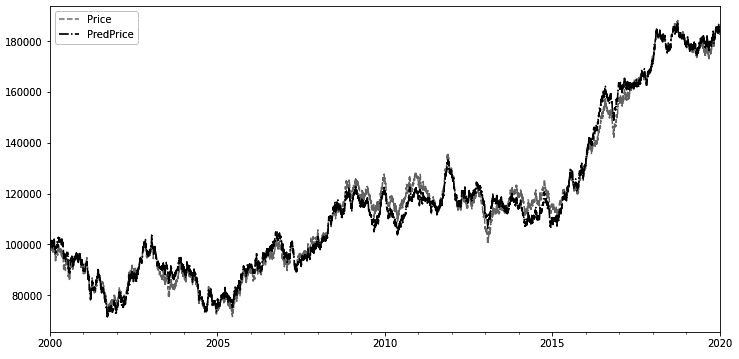

图 6.21 – 原始价格与 Ridge 回归模型预测价格的比较图

我们可以缩小到 2010 年第一季度，检查预测误差，如下所示：

```py
df['Price'].loc['2010-01-01':'2010-03-31']\
.plot(figsize=(12, 6), color='darkgray', linestyle='-', 
      legend='Price')
df['PredPrice'].loc['2010-01-01':'2010-03-31']\
.plot(figsize=(12, 6), color='black', linestyle='-.', 
      legend='PredPrice')
```

这产生了下面的图表，显示了那段时间内 `Price` 和 `PredPrice` 之间的差异：

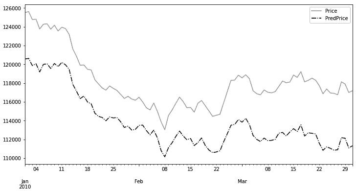

图 6.22 – 比较 2010 年第一季度岭回归模型的原始价格和预测价格的图表

我们可以计算预测误差并使用密度图绘制它们，如下代码片段所示：

```py
df['Errors'] = df['Price'] - df['PredPrice']
df['Errors'].plot(figsize=(12, 6), kind='kde', 
                  color='black', legend='Errors')
```

这生成了下面截图中显示的图表，展示了错误的分布：

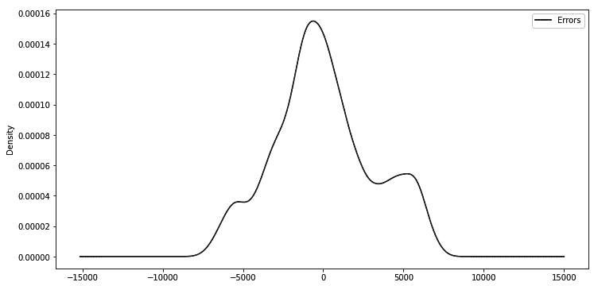

图 6.23 – 显示岭回归模型预测误差分布的图表

前面截图显示的错误图表表明错误没有明显的偏差。

## 在数据集上运行分类方法

让我们演示 scikit-learn 的分类方法。

首先，我们需要为分类模型创建离散分类目标标签以进行预测。我们分别给这些条件分配 `-2`、`-1`、`0`、`1` 和 `2` 数值标签，并将离散目标标签保存在 `target_discrete pandas.Series` 对象中，如下所示：

```py
target_discrete = pd.cut(target, bins=5, 
                         labels = \
                         [-2, -1, 0, 1, 2]).astype(int);
target_discrete
```

结果显示如下：

```py
2000-01-01    0
2000-01-02   -1
            ...
2019-12-28   -1
2019-12-29    0
2019-12-30    0
2019-12-31    0
2020-01-01    0
Freq: D, Name: PriceChange, Length: 7306, dtype: int64
```

我们可以使用以下代码可视化五个标签的分布：

```py
target_discrete.plot(figsize=(12, 6), kind='hist', 
                     color='black')
```

结果是一个频率图，如下截图所示，显示了五个标签的出现频率：

![图 6.24 – 我们的离散目标-价格变化标签值 [-2, -1, 0, 1, 2] 的频率分布](img/Figure_6.24_B15029.jpg)

图 6.24 – 我们的离散目标-价格变化标签值 [-2, -1, 0, 1, 2] 的频率分布

对于分类，我们使用 `sklearn.ensemble.RandomForestClassifier` 提供的决策树分类器集合。随机森林是一种使用装袋集成方法的分类器，并通过对从原始数据集中进行带替换的随机抽样生成的数据集训练每棵树来构建决策树森林。使用 `max_depth=5` 参数，我们限制了每棵树的高度以减少过拟合，然后调用 `RandomForestClassifier.fit(...)` 方法来拟合模型，如下所示：

```py
from sklearn.ensemble import RandomForestClassifier
rf = RandomForestClassifier(max_depth=5)
rf.fit(features, target_discrete)
```

这构建了以下 `RandomForestClassifier` 拟合模型：

```py
RandomForestClassifier(
        bootstrap=True, ccp_alpha=0.0, class_weight=None,
        criterion='gini', max_depth=5, max_features='auto',
        max_leaf_nodes=None, max_samples=None,
        min_impurity_decrease=0.0, min_impurity_split=None,
        min_samples_leaf=1, min_samples_split=2,
        min_weight_fraction_leaf=0.0, n_estimators=100,
        n_jobs=None, oob_score=False, random_state=None,
        verbose=0, warm_start=False)
```

`RandomForestClassifier.score(...)` 方法返回预测与`True`标签的平均准确度，如下所示：

```py
rf.score(features, target_discrete)
```

正如我们在这里看到的，准确度分数为 83.5%，非常好：

```py
0.835340815767862
```

我们向 DataFrame 添加 `DiscretePriceChange` 和 `PredDiscretePriceChange` 字段，以保存使用 `RandomForestClassifier.predict(...)` 方法的真实标签和预测标签，如下所示：

```py
df['DiscretePriceChange'] = target_discrete
df['PredDiscretePriceChange'] = rf.predict(features)
df
```

结果如下 DataFrame，带有两个额外的字段：

```py
            ... DiscretePriceChange PredDiscretePriceChange
2000-01-01  ...                   0                       0
2000-01-02  ...                  -1                      -1
       ...  ...                 ...                     ...
2019-12-31  ...                   0                      -1
2020-01-01  ...                   0                      -1
7306 rows × 10 columns
```

在下面的代码块中，我们绘制了 2010 年第一季度的两个字段：

```py
df['DiscretePriceChange'].loc['2010-01-01':'2010-03-31'].plot(figsize=(12, 6), color='darkgray', linestyle='-', legend='DiscretePriceChange')
df['PredDiscretePriceChange'].loc['2010-01-01':'2010-03-31'].plot(figsize=(12, 6), color='black', linestyle='-.', legend='PredDiscretePriceChange')
```

这产生了一个图表，如下截图所示，其中`True`和预测标签之间存在一些错位：

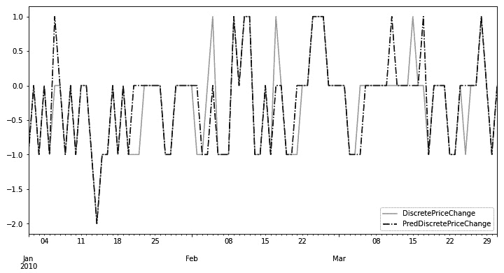

图 6.25 – 2010 年 Q1 的 RandomForest 分类模型原始和预测离散价格变动标签的比较

我们可以使用以下代码计算和绘制`ClassificationErrors` DataFrame 的分布：

```py
df['ClassificationErrors'] = \
df['DiscretePriceChange'] - df['PredDiscretePriceChange']
df['ClassificationErrors'].plot(figsize=(12, 6), 
                             kind='kde', color='black', 
                             legend='ClassificationErrors')
```

这产生了以下误差分布：

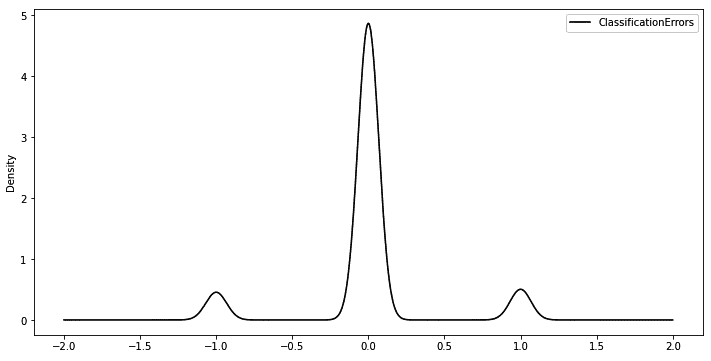

图 6.26 – RandomForest 分类器模型分类错误分布图

分类错误再次没有偏差，可以忽略不计。

# 摘要

所有先进的交易算法都使用统计模型，无论是用于直接交易规则还是只是决定何时进入/离开交易。在本章中，我们涵盖了 Python 的四个关键统计库——`statsmodels`、`pmdarima`、`fbprophet` 和 `scikitlearn`。

在下一章中，我们将讨论如何将关键的金融和经济数据导入到 Python 中。
