# 第九章：*第八章*：Zipline 和 PyFolio 简介

在本章中，您将了解到被称为 Zipline 和 PyFolio 的 Python 库，它们抽象出了算法交易策略的回测和性能/风险分析方面的复杂性。它们允许您完全专注于交易逻辑。

为此，我们将涵盖以下主要内容：

+   简介 Zipline 和 PyFolio

+   安装 Zipline 和 PyFolio

+   将市场数据导入 Zipline/PyFolio 回测系统

+   构建 Zipline/PyFolio 回测模块

+   查看关键 Zipline API 参考

+   从命令行运行 Zipline 回测

+   简介 PyFolio 提供的关键风险管理指标

# 技术要求

本章中使用的 Python 代码可在书籍代码库的 `Chapter08/risk_management.ipynb` 笔记本中找到。

# 简介 Zipline 和 PyFolio

回测是一种计算方法，用于评估如果将交易策略应用于历史数据，该策略将表现如何。理想情况下，这些历史数据应来自于一个具有类似市场条件的时期，例如具有类似于当前和未来的波动性。

回测应包括所有相关因素，如滑点和交易成本。

**Zipline** 是最先进的开源 Python 库之一，用于算法交易回测引擎。其源代码可在 [`github.com/quantopian/zipline`](https://github.com/quantopian/zipline) 找到。Zipline 是一个适用于日常交易的回测库（也可以回测每周、每月等）。它不太适合回测高频交易策略。

**PyFolio** 是一个开源的 Python 性能和风险分析库，由金融投资组合组成，与 Zipline 紧密集成。您可以在 [`github.com/quantopian/pyfolio`](https://github.com/quantopian/pyfolio) 找到其文档。

使用这两个库来回测您的交易策略可以节省大量时间。

本章的目标是描述这些库的关键功能并建立您的直觉。鼓励您在 PyCharm 或任何其他 Python IDE 中调试代码，并研究每个结果变量的内容以充分利用提供的信息。一旦您熟悉了每个结果对象的内容，简要地研究这些库的源代码以查看其全部功能。

# 安装 Zipline 和 PyFolio

我们建议按照 *附录 A* 中描述的方式设置开发环境。尽管如此，详细的说明在以下各节中给出。

## 安装 Zipline

出于性能原因，Zipline 严重依赖于特定版本的 Python 及其相关库。因此，最好的安装方式是在 `conda` 虚拟环境中创建并在那里安装 Zipline。我们建议使用 Anaconda Python 进行此操作。

让我们创建一个名为 `zipline_env` 的虚拟环境，使用 Python 3.6，并安装 `zipline` 包：

```py
conda create -n zipline_env python=3.6
conda activate zipline_env
conda install -c conda-forge zipline
```

现在我们将安装 PyFolio。

## 安装 PyFolio

您可以通过 `pip` 安装 `pyfolio` 包：

```py
pip install pyfolio
```

正如我们所见，安装 PyFolio 也是一项简单的任务。

# 将市场数据导入到 Zipline/PyFolio 回测系统中

回测依赖于我们拥有广泛的市场数据数据库。

Zipline 引入了两个与市场数据相关的术语 - bundle 和 ingest：

+   **Bundle** 是从自定义源逐步将市场数据导入到 Zipline 的专有数据库的接口。

+   **Ingest** 是将自定义源市场数据逐步导入到 Zipline 的专有数据库的实际过程；数据摄取不会自动更新。每次需要新鲜数据时，您都必须重新进行数据摄取。

默认情况下，Zipline 支持以下 bundle：

+   历史 Quandl bundle（2018 年之前的美国股票每日免费数据）

+   `.csv` 文件 bundle

现在我们将更详细地学习如何导入这两个 bundle。

## 从历史 Quandl bundle 导入数据

首先，在激活的 `zipline_env` 环境中，将 `QUANDL_API_KEY` 环境变量设置为您的免费（或付费）Quandl API 密钥。然后，进行 `quandl` 数据摄取。

对于 Windows，请使用以下代码：

```py
SET QUANDL_API_KEY=XXXXXXXX
zipline ingest -b quandl
```

对于 Mac/Linux，请使用以下代码：

```py
export QUANDL_API_KEY=XXXXXXXX
zipline ingest -b quandl
```

注意

Quandl 在 2018 年停止更新免费 bundle，但对于最初的几个算法交易步骤仍然非常有用。

最好在 Windows 的系统属性中设置 `QUANDL_API_KEY`（按下 Windows 图标并键入 `Environment Variables`）：

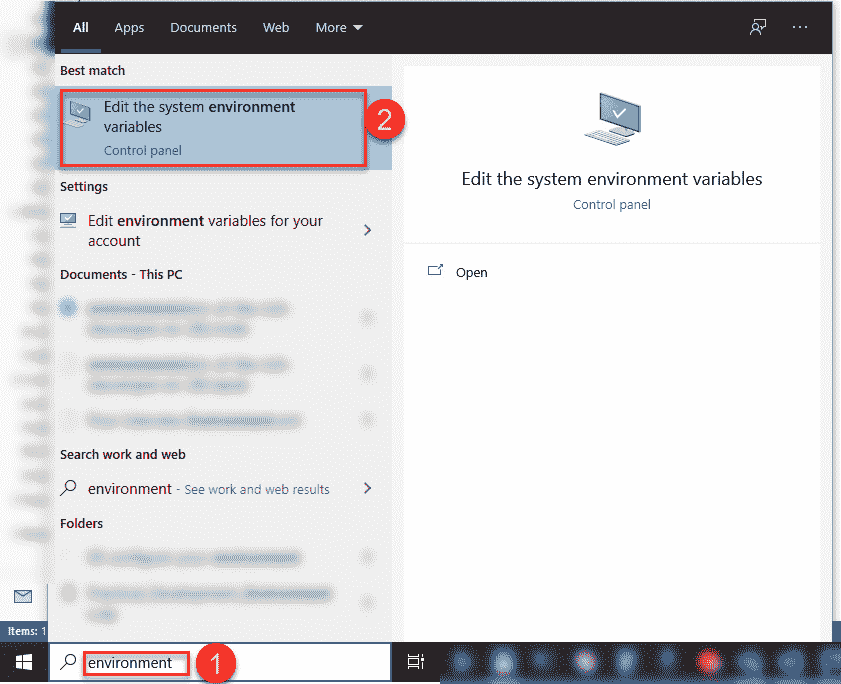

图 8.1 – 在 Windows 上定位“编辑系统环境变量”对话框

然后，选择 **编辑系统环境变量**。

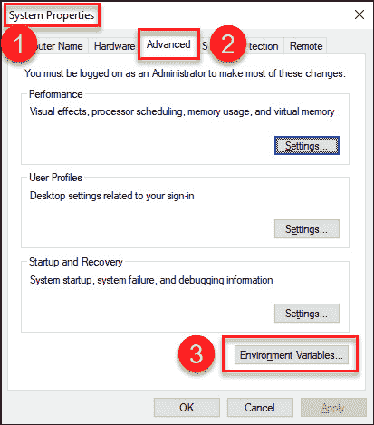

图 8.2 – 在 Windows 的系统属性中定位“环境变量...”对话框

然后，在**环境变量...**对话框中指定变量。

对于 Mac/Linux，将以下命令添加到 `~/.bash_profile` 以进行基于用户的操作，或添加到 `~/.bashrc` 以进行非登录交互式 shell：

```py
export QUANDL_API_KEY=xxxx
```

现在，让我们学习如何从 CSV 文件 bundle 导入数据。

## 从 CSV 文件 bundle 导入数据

默认的 CSV bundle 要求 CSV 文件采用 **开盘价、最高价、最低价、收盘价、成交量**（**OHLCV**）格式，并带有日期、红利和拆分：

```py
date,open,high,low,close,volume,dividend,split
```

本书的 GitHub 存储库包含一个示例输入 CSV 文件。其前几行如下所示：

```py
date,open,high,low,close,volume,dividend,split
2015-05-15,18251.9707,18272.7207,18215.07031,18272.56055,108220000,0,0
2015-05-18,18267.25,18325.53906,18244.25977,18298.88086,79080000,0,0
2015-05-19,18300.48047,18351.35938,18261.34961,18312.39063,87200000,0,0
2015-05-20,18315.06055,18350.13086,18272.56055,18285.40039,80190000,0,0
2015-05-21,18285.86914,18314.89063,18249.90039,18285.74023,84270000,0,0
2015-05-22,18286.86914,18286.86914,18217.14063,18232.01953,78890000,0,0
2015-05-26,18229.75,18229.75,17990.01953,18041.53906,109440000,0,0
```

要使用自定义 CSV 文件 bundle，请按照以下步骤操作：

1.  为 CSV 文件创建一个目录，例如`C:\MarketData`，其中包含一个名为`Daily`的子目录。

1.  将 CSV 文件复制到创建的目录中（例如`C:\MarketData\Daily`）。

1.  在 Windows 的`C:\Users\<username>\.zipline\extension.py`目录或 Mac/Linux 的`~/.zipline/extension.py`中编辑`.py`文件扩展名，如下所示：

    ```py
    import pandas as pd
    from zipline.data.bundles import register
    from zipline.data.bundles.csvdir import csvdir_equities
    register(
        'packt-csvdir-bundle',
        csvdir_equities(
            ['daily'],
            'c:/MarketData/',
        ),
        calendar_name='NYSE', 
        start_session=pd.Timestamp('2015-5-15', tz='utc'),
        end_session=pd.Timestamp('2020-05-14', tz='utc')
    )
    ```

    请注意，我们将市场数据与交易日历相关联。在这种情况下，我们使用的是`NYSE`，对应美国股票。

1.  摄入捆绑包，如下所示：

    ```py
    zipline ingest -b packt-csvdir-bundle
    ```

    输出如下：

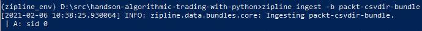

图 8.3 – zipline 摄入 packt-csvdir-bundle 的输出

这已经创建了一个具有`A`票据的资产。

## 从自定义捆绑包导入数据

历史 Quandl 捆绑包最适合学习如何设计和回测算法策略。CSV 文件捆绑包最适合导入没有公开价格的资产的价格。但是，对于其他用途，您应该购买市场数据订阅。

### 从 Quandl 的 EOD 美国股票价格数据导入数据

Quandl 提供每月 49 美元的 End of Day 美国股票价格数据库订阅服务（[`www.quandl.com/data/EOD-End-of-Day-US-Stock-Prices`](https://www.quandl.com/data/EOD-End-of-Day-US-Stock-Prices)），季度或年度付款可享受折扣。

与其他服务相比，该服务的优点如下：

+   Quandl 已深度集成到 Zipline 中，您可以使用一个命令下载所有股票的历史记录。

+   与其他提供商不同，每月您可以进行的 API 调用数量没有硬限制。

安装自定义捆绑包很简单：

1.  使用以下命令找到`bundles`目录的位置：

    ```py
    python -c "import zipline.data.bundles as bdl; print(bdl.__path__)"
    ```

    在我的计算机上，这导致以下输出：

    ```py
    ['d:\\Anaconda3\\envs\\zipline_env\\lib\\site-packages\\zipline\\data\\bundles']
    ```

1.  将`quandl_eod.py`文件从本书的 GitHub 存储库复制到该目录中。该文件是对 Zipline 的 GitHub 上代码的轻微修改。

1.  在相同的目录中，修改`__init__.py`文件（在那里添加这行）：

    ```py
    from . import quandl_eod  # noqa
    ```

完整的`__init__.py`文件示例如下：

```py
# These imports are necessary to force module-scope register calls to happen.
from . import quandl  # noqa
from . import csvdir  # noqa
from . import quandl_eod  # noqa
from .core import (
    UnknownBundle,
    bundles,
    clean,
    from_bundle_ingest_dirname,
    ingest,
    ingestions_for_bundle,
    load,
    register,
    to_bundle_ingest_dirname,
    unregister,
)
__all__ = [
    'UnknownBundle',
    'bundles',
    'clean',
    'from_bundle_ingest_dirname',
    'ingest',
    'ingestions_for_bundle',
    'load',
    'register',
    'to_bundle_ingest_dirname',
    'unregister',
] 
```

安装完成后，请确保您已将`QUANDL_API_KEY`环境变量设置为您的 API 密钥，并运行`ingest`命令：

```py
zipline ingest -b quandl_eod
```

输出如下：

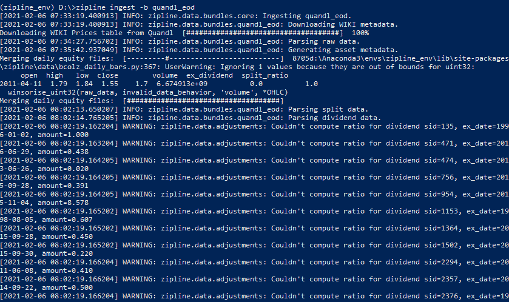

图 8.4 – 摄入 quandl_eod 捆绑包的输出

`quandl_eod.py`的实际源代码是不言自明的。带有`@bundles.register("quandl_eod")`注解的`quandl_eod_bundle`函数定义了下载过程：

```py
@bundles.register("quandl_eod")
def quandl_eod_bundle(environ,
                  asset_db_writer,
                  minute_bar_writer,
                  daily_bar_writer,
                  adjustment_writer,
                  calendar,
                  start_session,
                  end_session,
                  cache,
                  show_progress,
                  output_dir):
    """
    quandl_bundle builds a daily dataset using Quandl's WIKI Prices dataset.
    For more information on Quandl's API and how to obtain an API key,
    please visit https://docs.quandl.com/docs#section-authentication
    """
    api_key = environ.get("QUANDL_API_KEY")
    if api_key is None:
        raise ValueError(
            "Please set your QUANDL_API_KEY environment variable and retry."
        )
    raw_data = fetch_data_table(
        api_key, show_progress, 
        environ.get("QUANDL_DOWNLOAD_ATTEMPTS", 5)
    )
    asset_metadata = \
    gen_asset_metadata(raw_data[["symbol", "date"]], 
                       show_progress)
    asset_db_writer.write(asset_metadata)
    symbol_map = asset_metadata.symbol
    sessions = calendar.sessions_in_range(start_session, 
                                          end_session)
    raw_data.set_index(["date", "symbol"], inplace=True)
    daily_bar_writer.write(
        parse_pricing_and_vol(raw_data, sessions,
                              symbol_map),
        show_progress=show_progress,
    )
    raw_data.reset_index(inplace=True)
    raw_data["symbol"] = \
    raw_data["symbol"].astype("category")
    raw_data["sid"] = raw_data.symbol.cat.codes
    adjustment_writer.write(
        splits=parse_splits(
            raw_data[["sid", "date", "split_ratio"]].loc[raw_data.split_ratio != 1],
            show_progress=show_progress,
        ),
        dividends=parse_dividends(
            raw_data[["sid", "date", "ex_dividend"]].loc[raw_data.ex_dividend != 0],
            show_progress=show_progress,
        ),
    )
```

参与此过程的步骤如下：

1.  下载所有 EOD 数据。

1.  生成元数据。

1.  应用交易日历。

1.  应用企业事件。

虽然 Quandl 的商业数据源已深度集成到 Zipline 中，但存在替代数据源。

### 从雅虎财经和 IEX 付费数据导入数据

该项目在 [`github.com/hhatefi/zipline_bundles`](https://github.com/hhatefi/zipline_bundles) 提供了一个用于 Yahoo Finance 和 IEX 的 Zipline bundle。该软件包支持从 Yahoo Finance 的 `.csv` 文件、直接从 Yahoo Finance 和从 IEX 导入 Zipline。本书仅专注于从 Yahoo Finance 和 IEX 直接导入。

虽然该软件包允许自动安装，但我不建议这样做，因为它要求在 Windows 的 `C:\Users\<username>\.zipline\extension.py` 目录或 Mac/Linux 的 `~/.zipline/extension.py` 目录中有一个空的 `extension.py` 文件。

安装步骤如下：

1.  从 [`github.com/hhatefi/zipline_bundles`](https://github.com/hhatefi/zipline_bundles) 下载该仓库。

1.  将仓库的 `\zipline_bundles-master\lib\extension.py` 文件与 Windows 的 `C:\Users\<username>\.zipline\extension.py` 或 Mac/Linux 的 `~/.zipline/extension.py` 合并。如果后者文件不存在，只需复制并粘贴该文件。

1.  在以下代码中编辑起始日期和结束日期：

    ```py
    register('yahoo_direct', # bundle's name
             direct_ingester('YAHOO',
                             every_min_bar=False,
                             symbol_list_env='YAHOO_SYM_LST', 
    # the environment variable holding the comma separated list of assert names
                             downloader=yahoo.get_downloader(start_date='2010-01-01',
                                                             end_date='2020-01-01'
                             ),
             ),
             calendar_name='NYSE',
    )
    ```

    在以下代码中执行相同操作：

    ```py
    register('iex', # bundle's name
             direct_ingester('IEX Cloud',
                             every_min_bar=False,
                             symbol_list_env='IEX_SYM_LST', 
    # the environemnt variable holding the comma separated list of assert names
                             downloader=iex.get_downloader(start_date='2020-01-01',
                                                           end_date='2020-01-05'
                             ),
                             filter_cb=lambda df: df[[cal.is_session(dt) for dt in df.index]]
             ),
             calendar_name='NYSE',
    )
    ```

    完整文件应如下所示：

    ```py
    #!/usr/bin/env python
    # -*- coding: utf-8 -*-
    from pathlib import Path
    from zipline.data.bundles import register
    from zipline.data.bundles.ingester import csv_ingester 
    # ingester.py need to be placed in zipline.data.bundles
    _DEFAULT_PATH = str(Path.home()/'.zipline/csv/yahoo')
    register(
        'yahoo_csv',
        csv_ingester('YAHOO',
                     every_min_bar=False, 
                     # the price is daily
                     csvdir_env='YAHOO_CSVDIR',
                     csvdir=_DEFAULT_PATH,
                     index_column='Date',
                     column_mapper={'Open': 'open',
                                    'High': 'high',
                                    'Low': 'low',
                                    'Close': 'close',
                                    'Volume': 'volume',
                                    'Adj Close': 'price',
                     },
        ),
        calendar_name='NYSE',
    )
    from zipline.data.bundles.ingester import direct_ingester
    from zipline.data.bundles import yahoo
    register('yahoo_direct', # bundle's name
             direct_ingester('YAHOO',
                             every_min_bar=False,
                             symbol_list_env='YAHOO_SYM_LST', # the environemnt variable holding the comma separated list of assert names
                             downloader=yahoo.get_downloader(start_date='2010-01-01',
                                                             end_date='2020-01-01'
                             ),
             ),
             calendar_name='NYSE',
    )
    from zipline.data.bundles import iex
    import trading_calendars as tc
    cal=tc.get_calendar('NYSE')
    register('iex', # bundle's name
             direct_ingester('IEX Cloud',
                             every_min_bar=False,
                             symbol_list_env='IEX_SYM_LST', # the environemnt variable holding the comma separated list of assert names
                             downloader=iex.get_downloader(start_date='2020-01-01',
                                                           end_date='2020-01-05'
                             ),
                             filter_cb=lambda df: df[[cal.is_session(dt) for dt in df.index]]
             ),
             calendar_name='NYSE',
    )
    ```

1.  使用以下命令查找 `bundles` 目录的位置：

    ```py
    python -c "import zipline.data.bundles as bdl; print(bdl.__path__)"
    ```

    这将在我的计算机上产生以下输出：

    ```py
    ['d:\\Anaconda3\\envs\\zipline_env\\lib\\site-packages\\zipline\\data\\bundles']
    ```

1.  将 `Copy \zipline_bundles-master\lib\iex.py`、`\zipline_bundles-master\lib\ingester.py` 和 `\zipline_bundles-master\lib\yahoo.py` 仓库文件复制到您的 Zipline `bundles` 目录；例如，`d:\\Anaconda3\\envs\\zipline_env\\lib\\site-packages\\zipline\\data\\bundles\`。

1.  将感兴趣的股票代码设置为环境变量。例如，在 Windows 上，使用以下代码：

    ```py
        set YAHOO_SYM_LST=GOOG,AAPL,GE,MSFT
        set IEX_SYM_LST=GOOG,AAPL,GE,MSFT
    ```

    在 Mac/Linux 上，请使用以下代码：

    ```py
        export YAHOO_SYM_LST=GOOG,AAPL,GE,MSFT
        export IEX_SYM_LST=GOOG,AAPL,GE,MSFT
    ```

1.  如果有可用的 IEX 令牌（以 `sk_` 开头），请在 Windows 上像这样设置：

    ```py
    set IEX_TOKEN=xxx
    ```

    对于 Mac/Linux，请执行以下操作：

    ```py
    export IEX_TOKEN=xxx
    ```

1.  导入数据：

    ```py
    zipline ingest -b yahoo_direct
    zipline ingest -b iex
    ```

    这将导致关于 `yahoo_direct` bundle 的以下输出：

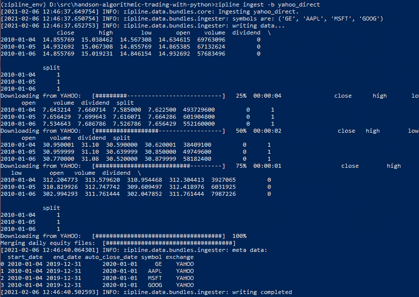

图 8.5 – 导入 yahoo_direct bundle 的输出

这也会导致以下输出，这是关于 `iex` bundle 的：

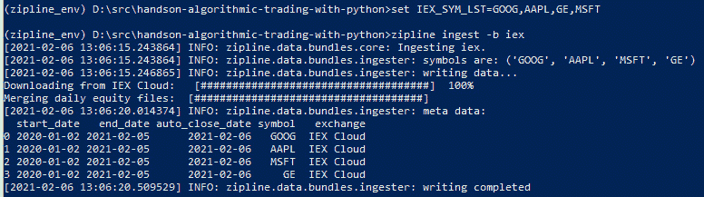

图 8.6 – 导入 iex bundle 的输出

与其他数据源集成，例如本地 MySQL 数据库，类似于 [`github.com/hhatefi/zipline_bundles`](https://github.com/hhatefi/zipline_bundles) 中的代码。某些这样的 bundle 可在 [github.com](http://github.com) 上获得。

# 结构化 Zipline/PyFolio 回测模块

典型的 Zipline 回测代码定义了三个函数：

+   `initialize`：此方法在任何模拟交易发生之前调用；它用于使用股票代码和其他关键交易信息丰富上下文对象。它还启用了佣金和滑点考虑。

+   `handle_data`：此方法下载市场数据，计算交易信号并下单交易。这是您放置实际交易逻辑的地方，用于进入/退出仓位。

+   `analyze`：调用此方法执行交易分析。在我们的代码中，我们将使用 pyfolio 的标准分析。请注意，`pf.utils.extract_rets_pos_txn_from_zipline(perf)` 函数返回任何返回、持仓和交易以进行自定义分析。

最后，代码定义了 `run_algorithm` 方法。此方法返回所有交易的综合摘要，以后可以分析。

在 Zipline 代码中，有几种典型的模式，具体取决于使用情况。

## 交易每天都会发生

让我们直接从 `run_algorithm` 方法中引用 `handle_data` 方法：

```py
from zipline import run_algorithm 
from zipline.api import order_target_percent, symbol 
from datetime import datetime 
import pytz 
import matplotlib.pyplot as plt
import pandas as pd
import pyfolio as pf
from random import random
def initialize(context): 
    pass
def handle_data(context, data):      
    pass
def analyze(context, perf): 
    returns, positions, transactions = \
    pf.utils.extract_rets_pos_txn_from_zipline(perf) 
    pf.create_returns_tear_sheet(returns, 
                                 benchmark_rets = None)

start_date = pd.to_datetime('1996-1-1', utc=True)
end_date = pd.to_datetime('2020-12-31', utc=True)

results = run_algorithm(start = start_date, end = end_date, 
                        initialize = initialize, 
                        analyze = analyze, 
                        handle_data = handle_data, 
                        capital_base = 10000, 
                        data_frequency = 'daily', 
                        bundle ='quandl')
```

`handle_data` 方法将在 `start_date` 和 `end_date` 之间的每一天调用。

## 交易发生在自定义的时间表上

我们省略了 `run_algorithm` 方法中对 `handle_data` 方法的引用。相反，我们在 `initialize` 方法中设置调度程序：

```py
from zipline import run_algorithm  
from zipline.api import order_target_percent, symbol, set_commission, schedule_function, date_rules, time_rules from datetime import datetime 
import pytz 
import matplotlib.pyplot as plt
import pandas as pd
import pyfolio as pf
from random import random
def initialize(context):  
    # definition of the stocks and the trading parameters, e.g. commission
    schedule_function(handle_data, date_rules.month_end(), 
                      time_rules.market_open(hours=1))  
def handle_data(context, data):      
    pass
def analyze(context, perf): 
    returns, positions, transactions = \
    pf.utils.extract_rets_pos_txn_from_zipline(perf) 
    pf.create_returns_tear_sheet(returns, 
                                 benchmark_rets = None)

start_date = pd.to_datetime('1996-1-1', utc=True)
end_date = pd.to_datetime('2020-12-31', utc=True)

results = run_algorithm(start = start_date, end = end_date, 
                        initialize = initialize, 
                        analyze = analyze, 
                        capital_base = 10000,
                        data_frequency = 'daily', 
                        bundle ='quandl')
```

`handle_data` 方法将在每个 `month_end` 后 1 小时的市场开盘后调用价格。

我们可以指定各种日期规则，如下所示：

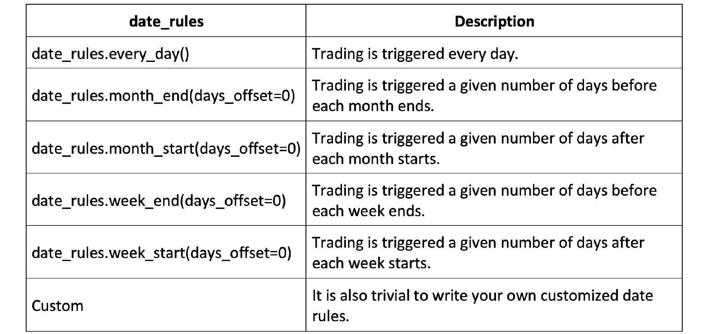

图 8.7 – 包含各种日期规则的表格

类似地，我们可以指定时间规则，如下所示：

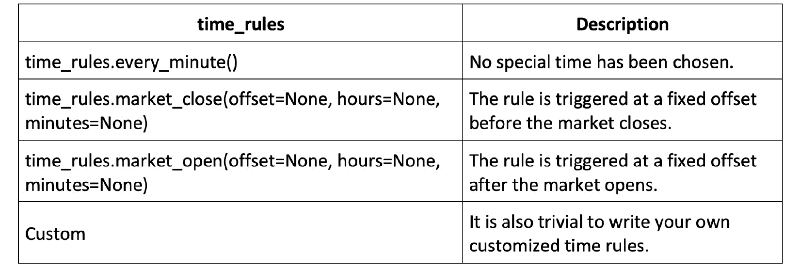

图 8.8 – 包含各种时间规则的表格

现在我们将学习如何查看关键的 Zipline API 参考。

# 查看关键的 Zipline API 参考

在本节中，我们将概述来自 [`www.zipline.io/appendix.html`](https://www.zipline.io/appendix.html) 的主要功能。

对于回测来说，订单类型、佣金模型和滑点模型是最重要的功能。让我们更详细地看看它们。

## 订单类型

Zipline 支持以下类型的订单：

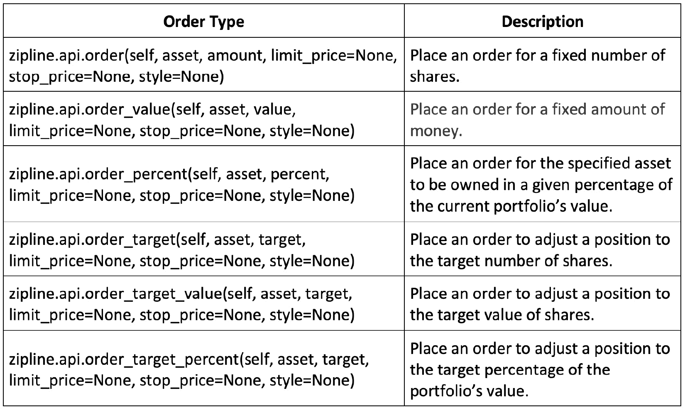

图 8.9 – 支持的订单类型

下单逻辑通常放置在 `handle_data` 方法中。

以下是一个示例：

```py
def handle_data(context, data): 
    price_hist = data.history(context.stock, "close", 
                              context.rolling_window, "1d")
    order_target_percent(context.stock, 1.0 if price_hist[-1] > price_hist.mean() else 0.0) 
```

本示例根据最后一个每日价格是否高于收盘价格的平均值来下订单，以便我们拥有该股票的 100%。

## 佣金模型

佣金是券商为买卖股票而收取的费用。

Zipline 支持各种类型的佣金，如下所示：

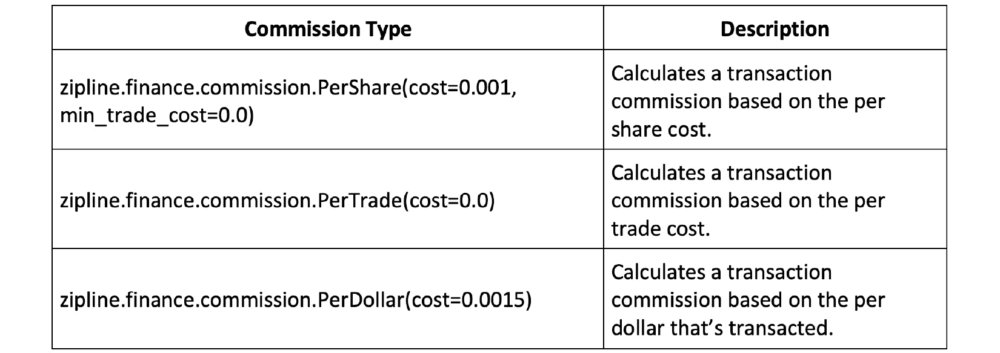

图 8.10 – 支持的佣金类型

此逻辑通常放置在 `initialize` 方法中。

以下是一个示例：

```py
def initialize(context): 
    context.stock = symbol('AAPL')
    context.rolling_window = 90
    set_commission(PerTrade(cost=5)) 
```

在本例中，我们定义了每笔交易 5 美元的佣金。

## 滑点模型

滑点被定义为预期价格和执行价格之间的差异。

Zipline 提供以下滑点模型：

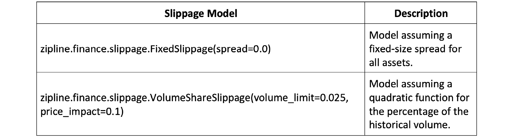

图 8.11 – 支持的滑点模型

滑点模型应放置在 `initialize` 方法中。

以下是一个示例：

```py
def initialize(context): 
    context.stock = symbol('AAPL')
    context.rolling_window = 90
    set_commission(PerTrade(cost=5)) 
    set_slippage(VolumeShareSlippage(volume_limit=0.025, 
                                     price_impact=0.05))
```

在这个示例中，我们选择了`VolumeShareSlippage`，限制为`0.025`，价格影响为`0.05`。

# 从命令行运行 Zipline 回测

对于大型回测任务，最好从命令行运行回测。

以下命令运行在 `job.py` Python 脚本中定义的回测策略，并将结果 DataFrame 保存在 `job_results.pickle` pickle 文件中：

```py
zipline run -f job.py --start 2016-1-1 --end 2021-1-1 -o job_results.pickle --no-benchmark
```

例如，您可以设置一个批处理，其中包含几十个 Zipline 命令行作业，以便在夜间运行，并且每个都将结果存储在 pickle 文件中以供以后分析。

保持日志和过去的回测 pickle 文件库以便轻松参考是一个好的实践。

# 用 PyFolio 进行风险管理介绍

拥有风险管理系统是成功运行算法交易系统的基本组成部分。

算法交易涉及各种风险：

+   **市场风险**：虽然所有策略在其生命周期的某个阶段都会亏钱，但量化风险度量并确保存在风险管理系统可以缓解策略损失。在某些情况下，糟糕的风险管理可能会将交易损失增加到极端，并且甚至会完全关闭成功的交易公司。

+   **监管风险**：这种风险源于无意或有意违反法规。它旨在执行顺畅和公平的市场功能。一些众所周知的例子包括*假单*、*报价填充*和*封闭*。

+   **软件实施风险**：软件开发是一个复杂的过程，而复杂的算法交易策略系统尤其复杂。即使是看似微小的软件错误也可能导致算法交易策略失效，并产生灾难性结果。

+   **操作风险**：这种风险来自于部署和操作这些算法交易系统。操作/交易人员的错误也可能导致灾难性结果。这个类别中最著名的错误也许是“手指失误”，它指的是意外发送大量订单和/或以非预期价格的错误。

PyFolio 库提供了广泛的市场表现和风险报告功能。

典型的 PyFolio 报告如下所示：

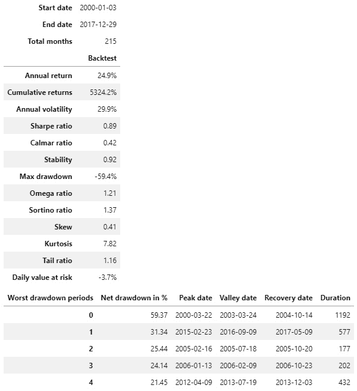

图 8.12 - PyFolio 的标准输出显示回测摘要和关键风险统计数据

以下文本旨在解释此报告中的关键统计数据；即**年度波动率**、**夏普比率**和**回撤**。

为了本章的目的，让我们从一个假想的交易策略生成交易和收益。

以下代码块生成了一个具有轻微正偏差的交易策略的假设 PnL，以及没有偏差的假设头寸：

```py
dates = pd.date_range('1992-01-01', '2012-10-22')
np.random.seed(1)
pnls = np.random.randint(-990, 1000, size=len(dates)) 
# slight positive bias
pnls = pnls.cumsum()
positions = np.random.randint(-1, 2, size=len(dates))
positions = positions.cumsum()
strategy_performance = \
pd.DataFrame(index=dates, 
             data={'PnL': pnls, 'Position': positions})
strategy_performance
              PnL    Position
1992-01-01     71           0
1992-01-02   -684           0
1992-01-03    258           1
     ...      ...         ...
2012-10-21  32100         -27
2012-10-22  32388         -26
7601 rows × 2 columns
```

让我们来审查一下 20 年内 PnL 的变化情况：

```py
strategy_performance['PnL'].plot(figsize=(12,6), color='black', legend='PnL')
```

下面是输出：

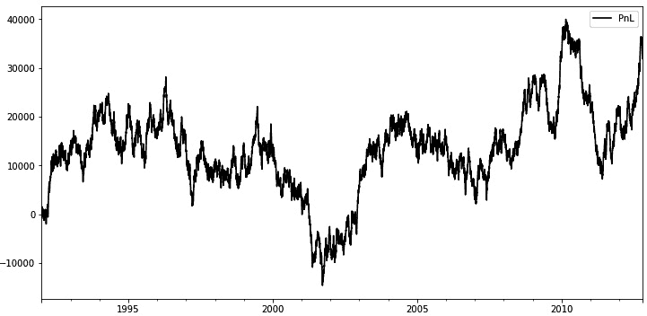

图 8.13 - 显示带有轻微正偏差的合成生成的 PnL

这个图表证实了轻微的正偏差导致策略在长期内具有盈利性。

现在，让我们探索一些这个假设策略表现的风险指标。

## 市场波动性、PnL 方差和 PnL 标准偏差

**市场波动性** 定义为价格的标准偏差。通常，在更具波动性的市场条件下，交易策略的 PnL 也会经历更大的幅度波动。这是因为相同的持仓容易受到更大的价格波动的影响，这意味着 PnL 变化。

**PnL 方差** 用于衡量策略表现/回报的波动幅度。

计算 PnL 的标准偏差的代码与用于计算价格标准偏差（市场波动率）的代码相同。

让我们计算一个滚动 20 天期间的 PnL 标准偏差：

```py
strategy_performance['PnLStdev'] = strategy_performance['PnL'].rolling(20).std().fillna(method='backfill')
strategy_performance['PnLStdev'].plot(figsize=(12,6), 
                                      color='black', 
                                      legend='PnLStdev')
```

输出如下：

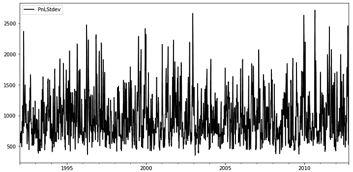

图 8.14 - 显示一个 20 天滚动期间 PnL 标准偏差的图

这个图表证明了，在这种情况下，没有显著的模式 - 这是一个相对随机的策略。

## 交易级夏普比率

交易级夏普比率将平均 PnL（策略回报）与 PnL 标准偏差（策略波动性）进行比较。与标准夏普比率相比，交易级夏普比率假定无风险利率为 *0*，因为我们不滚动头寸，所以没有利息费用。这个假设对于日内或日常交易是现实的。

这个指标的优势在于它是一个单一的数字，考虑了所有相关的风险管理因素，因此我们可以轻松比较不同策略的表现。然而，重要的是要意识到夏普比率并不能讲述所有的故事，并且重要的是要与其他风险指标结合使用。

交易级夏普比率的定义如下：


让我们为我们的策略回报生成夏普比率。首先，我们将生成每日 PnL：

```py
daily_pnl_series = strategy_performance['PnL'].shift(-1) - strategy_performance['PnL']
daily_pnl_series.fillna(0, inplace=True)
avg_daily_pnl = daily_pnl_series.mean()
std_daily_pnl = daily_pnl_series.std()
sharpe_ratio = avg_daily_pnl/std_daily_pnl
sharpe_ratio
0.007417596376703097
```

从直觉上讲，这个夏普比率是有意义的，因为假设策略的预期每日平均表现设置为 (1000-990)/2 = $5，并且每日 PnL 的标准偏差设置为大约 $1,000，根据这条线：

```py
pnls = np.random.randint(-990, 1000, size=len(dates)) 
# slight positive bias
```

在实践中，夏普比率通常是年化的，以便我们可以更公平地比较不同期限的策略。要将计算出的每日收益的夏普比率年化，我们必须将其乘以 252 的平方根（一年中的交易日期数）：


其代码如下：

```py
annualized_sharpe_ratio = sharpe_ratio * np.sqrt(252)
annualized_sharpe_ratio
0.11775069203166105
```

现在，让我们解释夏普比率：

+   比率达到 3.0 或更高是极好的。

+   比率 > 1.5 非常好。

+   比率 > 1.0 是可以接受的。

+   比率 < 1.0 被认为是次优的。

现在我们将看看最大回撤。

## 最大回撤

最大回撤是一个交易策略在一段时间内累计 PnL 的峰值到谷底的下降。换句话说，它是与上一次已知的最大累计 PnL 相比损失资金的最长连续期。

这个指标量化了基于历史结果的交易账户价值的最坏情况下的下降。

让我们直观地找到假设策略表现中的最大回撤：

```py
strategy_performance['PnL'].plot(figsize=(12,6), 
                                 color='black', 
                                 legend='PnL')
plt.axhline(y=28000, color='darkgrey', linestyle='--', 
            label='PeakPnLBeforeDrawdown')
plt.axhline(y=-15000, color='darkgrey', linestyle=':', 
            label='TroughPnLAfterDrawdown')
plt.vlines(x='2000', ymin=-15000, ymax=28000, 
           label='MaxDrawdown', color='black', linestyle='-.')
plt.legend()
```

这是输出结果：

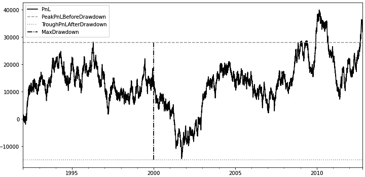

图 8.15 – 显示峰值和谷底 PnL 以及最大回撤

从这张图中，我们可以评估到这个策略的最大回撤为 $43K，从 1996 年的峰值 PnL 约 $28K 至 2001 年的谷底 PnL 约 -$15K。如果我们从 1996 年开始实施这个策略，我们会在账户上经历 $43K 的亏损，我们需要意识到并为未来做好准备。

### 策略停止规则 – 止损线/最大损失

在开仓交易之前，设置止损线非常重要，止损线被定义为一种策略或投资组合（仅是一系列策略的集合）在被停止之前能够承受的最大损失次数。

可以使用历史最大回撤值来设置止损线。对于我们的假设性策略，我们发现在 20 年的时间内，实现的最大回撤为 $43K。虽然历史结果并不能完全代表未来结果，但您可能希望为这个策略使用 $43K 的止损值，如果未来损失这么多资金，就关闭它。在实践中，设置止损线要比这里描述的复杂得多，但这应该可以帮助您建立一些有关止损线的直觉。

一旦策略停止，我们可以决定永久关闭策略，或仅在一定时间内关闭策略，甚至关闭策略直到某些市场条件发生改变。这个决定取决于策略的行为和其风险容忍度。

# 总结

在本章中，我们学习了如何安装和设置基于 Zipline 和 PyFolio 的完整回测和风险/绩效分析系统。然后，我们将市场数据导入到 Zipline/PyFolio 回测投资组合中，并对其进行了结构化和审核。接着，我们研究了如何使用 PyFolio 管理风险并构建一个成功的算法交易系统。

在下一章中，我们将充分利用这一设置，并介绍几个关键的交易策略。
